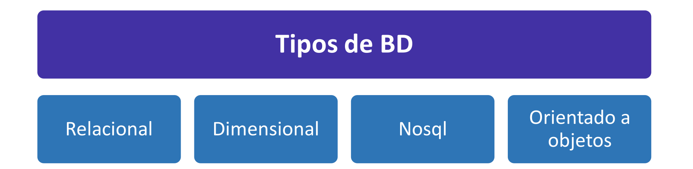
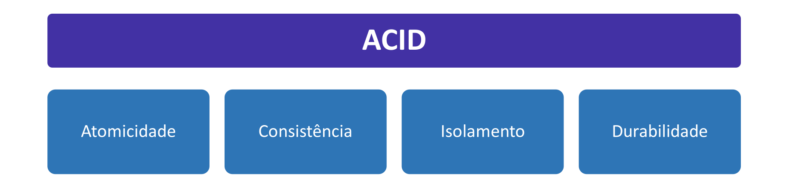
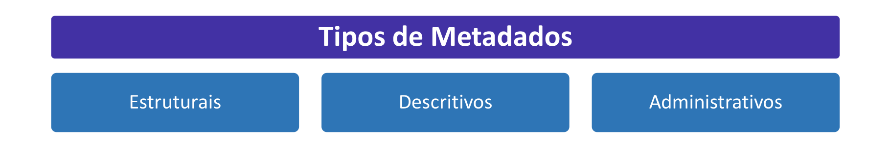
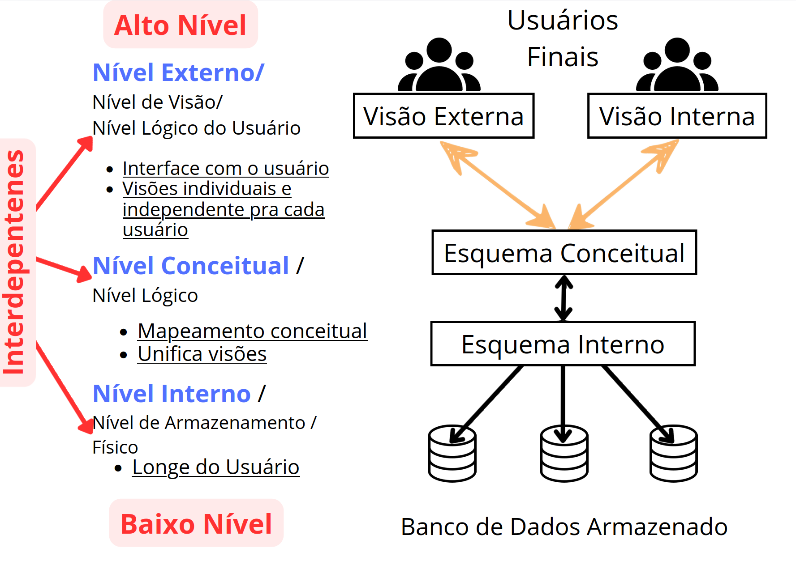
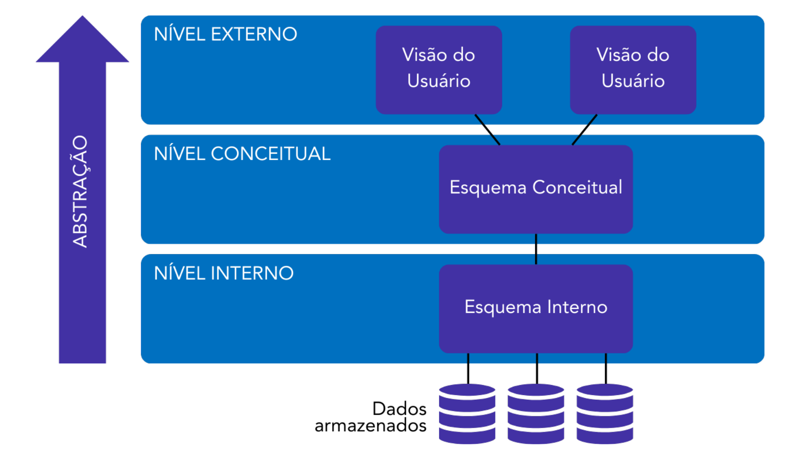

# Banco de Dados

## 1.1 Conceitos Gerais

Um banco de dados (ou db, do inglês, database) é um sistema organizado para armazenar,
gerenciar e recuperar dados de uma forma eficiente, de forma a trazer informações úteis no dia a
dia das empresas. Ele é projetado para armazenar grandes quantidades de dados de forma
estruturada, permitindo o acesso rápido e preciso às informações quando necessário.
Quando vamos planejar um sistema de dados para uma entidade, usualmente temos um conjunto
de bancos de dados em um mesmo sistema – usualmente, um servidor. Cada banco de dados
nesse servidor é definido por “afinidade” de assuntos. Por exemplo, uma empresa pode decidir
dividir os bancos de dados em setores, como Financeiro e RH.

Um servidor é um computador ou sistema de computadores que fornece recursos,
serviços ou dados a outros computadores, conhecidos como clientes, em uma
rede. Esses recursos podem incluir arquivos, sites, aplicativos, armazenamento de
dados ou processamento de informações.

Imagine um banco de dados como um armário, com diversas gavetas, cada gaveta com diversas
pastas, e arquivos dentro dessas pastas. Nesse caso, o armário representará o conjunto de
diferentes bancos de dados que temos em um sistema. Cada gaveta representa um banco de
dados específico – ou seja, podemos ter uma gaveta para o RH, uma para o financeiro, outra para
o marketing, e assim por diante.

Dentro de cada gaveta, temos as pastas, que representam agregações de dados – agregações
essas que podem variar conforme o tipo de banco de dados. Não se preocupem em entender isso
que os tipos de bancos de dados vai ser um assunto que iremos nos debruçar por pelo menos
mais 8 aulas. Mas, a título de exemplificação, o tipo de banco

Por fim, temos os arquivos dentro das pastas, ou dentro das agregações, que representam os
nossos conjuntos de dados. Esses dados são intercambiáveis entre pastas, e entre diferentes
bancos de dados – então é como se pudéssemos tirar um arquivo de uma pasta, e colocá-lo em
outras pastas, ou até mesmo outras gavetas.

UM BANCO DE DADOS DEVE SER ORGANIZADO E TER UM PROPÓSITO ESPECÍFICO. ISSO,
PORÉM, NÃO SIGNIFICA QUE TEREMOS SEMPRE DADOS ESTRUTURADOS.

---

### ℹ️Questãoℹ️

(CEBRASPE/CGM JOÃO PESSOA/2018) Um banco de dados é uma coleção de dados que são
organizados de forma randômica, sem significado implícito e de tamanho variável, e projetados
para atender a uma proposta específica de alta complexidade, de acordo com o interesse dos
usuários.
Comentários:
Como vimos, os bancos de dados são organizados de forma sistemática, a fim de trazer
informações úteis para a entidade. O conceito de organização randômica não atende à definição
de bancos de dados. Portanto, alternativa errada. (Gabarito: Errado)

Mas, apesar de bancos de dados necessitarem de dados organizados, com fins em comum, não
quero que você pense neles como estruturas 100% rígidas. Os bancos de dados são baseados em
esquemas que, de forma geral, definem como se dará sua estrutura e as relações entre as suas
partes.
Esses esquemas são flexíveis, podendo ser modificados, graças às regras de
independência. Ainda nessa aula teremos uma seção específica para tratar desse
assunto, então não se preocupe em entendê-lo completamente ainda, mas,
usualmente, separamos nosso sistema em três níveis, permitindo que determinado
nível possa ser alterado sem influenciar no outro.
Para manipularmos e oferecermos essa flexibilidade nos bancos de dados, usamos um conjunto
de operações de manipulações conhecidas por um acrônimo que engloba as operações básicas,
de quais todas outras derivam - o CRUD:
•
•
•
•
CREATE (criar)
READ (ler)
UPDATE (atualizar)
DELETE (remover)

### ℹ️Questãoℹ️

(CEBRASPE/PC PB/2022) Em banco de dados, para definir as operações básicas em uma tabela,
utiliza-se o acrônimo
a) SQL.
b) ODBC.
c) CRUD.
d) NoSQL.
e) DROP
Comentários:
Como vimos, o acrônimo para operações básicas em bancos de dados é CRUD – Create, Read,
Update e Delete. (Gabarito: Letra C)

## Tipos de bancos de dados

Podemos dividir os bancos de dados em 4 grandes grupos abordados pelas provas de concursos
– deixando claro que existem outros, mas para fins de concursos públicos esses 4 ganham
destaque. Esses grupos definem a sua estrutura interna e forma de organização. Essas formas são:
•
•
•
•
Bancos de Dados Relacionais: São bancos de dados que armazenam dados estruturados
em tabelas relacionadas. Utilizam linguagem SQL (Structured Query Language) para
consultas e são conhecidos por sua consistência e integridade de dados.
Bancos de Dados Dimensionais: São utilizados principalmente em data warehouses e são
otimizados para consultas analíticas em grandes conjuntos de dados. Eles organizam os
dados em cubos dimensionais, facilitando análises complexas.
Bancos de Dados NoSQL: São bancos de dados que não seguem o modelo relacional
tradicional. Eles são projetados para lidar com tipos de dados não estruturados, sem
esquema fixo, e são altamente escaláveis.
Bancos de Dados Orientado a Objetos: São bancos de dados que armazenam dados na
forma de objetos, que podem conter atributos e métodos. Eles são úteis para sistemas que
trabalham com modelos de dados complexos e relacionamentos dinâmicos.

Essa forma de organização dos bancos de dados, que define sua estrutura e como ele se
relacionará com os dados, recebe o nome de paradigma. Ele define a forma como os dados são
estruturados, armazenados e acessados, influenciando a arquitetura e o funcionamento do banco
de dados. Guarde esse termo, pois ele será muito útil mais à frente.

## Características de um Banco de Dados

Um Banco de Dados, ou DB (Data Base, em inglês) deve ter algumas características específicas
para, de fato, poder ser considerado um banco de dados e ter um funcionamento correto. Essas
características são:
•
•
•
•
Natureza de autodescrição
Abstração de dados
Suporte a múltiplas visões
Suporte a múltiplas transações

| **Característica** | **Descrição** |
|---------------------|---------------|
| **Natureza de Autodescrição** | Quer dizer que um banco de dados possui a capacidade de se autodescrever — isso é, ele contém suas próprias definições de forma inerente à sua estrutura. Isso é feito através dos **metadados**, conceito que veremos em seguida. |
| **Abstração de dados** | Os bancos de dados são completamente **independentes dos programas de aplicação** (SGBD) que os manuseiam — como vimos, os bancos de dados são as coleções de dados em si, o que independe do programa que o opera. Isso permite que diferentes aplicações de usuário possam acessar esses dados de forma consistente. |
| **Suporte a múltiplas visões** | Um banco de dados é capaz de fornecer diferentes visões ou **representações dos dados para diferentes usuários** ou aplicações. As visões são subconjuntos dos dados disponíveis no banco de dados, filtrados ou combinados de acordo com requisitos específicos de cada usuário. Por exemplo, um banco de dados de uma empresa pode ter visões diferentes para o departamento de vendas, para o departamento financeiro e para o departamento de recursos humanos. |
| **Suporte a múltiplas transações** | Essa característica permite que **vários usuários acessem e modifiquem simultaneamente o banco de dados** sem interferir no trabalho do outro. O SGBD garante a consistência dos dados e mantém a integridade das transações em um ambiente multiusuário. O compartilhamento de dados é possível por meio do isolamento entre transações, garantindo que uma transação não veja alterações realizadas por outras transações até que sejam confirmadas. |

### ℹ️Questãoℹ️

(FUNDATEC/BRDE/2023) Qual das propriedades abaixo NÃO constitui uma característica que
distingue a abordagem de banco de dados relacional de uma abordagem tradicional de
processamento de arquivos?
Natureza de autodescrição da base de dados.
Isolamento entre programas e arquivos de dados.
Suporte a múltiplas visões de dados.
Suporte a recursos de data analytics, tais como algoritmos de aprendizado de máquina.
Suporte a transações concorrentes em ambientes multiusuário.
Comentários:
Das alternativas apresentadas, os bancos de dados relacionais não apresentam o suporte a
recursos de data analytics. Esses recursos são destinados a analisar a base de dados e retirar
conhecimentos “ocultos”. Os bancos de dados que suportam essas operações são os
dimensionais, que veremos mais à frente no curso. (Gabarito: Letra D)

(Inédita/Prof. Felipe Mathias) Acerca dos conhecimentos sobre bancos de dados, julgue a
afirmativa abaixo.
A natureza de autodescrição dos bancos de dados é o que permite que tenhamos múltiplas
transações simultâneas, sem uma interferir na outra.
Comentários:
Galera, veremos mais sobre esse mecanismo mais à frente, mas quem garante que transações não
interfiram uma na outra são ferramentas de controle de concorrência, que garantem o suporte a
múltiplas transações. A autodescrição prega que os dados se autodescrevem, através de "dados
sobre dados", os metadados. (Gabarito: Errado)

## Transações 

Ao operarmos um banco de dados, realizamos transações nele. Elas consistem em uma ou mais
operações de banco de dados que devem ser executadas como uma unidade indivisível. Elas são
usadas para garantir a integridade e a consistência dos dados durante as operações de
modificação, como inserção, atualização ou exclusão de registros em um banco de dados.
Essas transações devem obedecer a quatro princípios, conhecidos através do acrônimo ACID –
Atomicidade, Consistência, Isolamento e Durabilidade. Vamos ver o que é e pra que serve cada
um desses princípios?

| **Característica** | **Descrição** |
|---------------------|---------------|
| **Atomicidade** | Uma transação é uma operação "tudo ou nada". Isso significa que **todas as operações dentro da transação devem ser concluídas com sucesso** para que a transação seja válida. Se **uma** operação falhar, **todas** as alterações feitas devem ser desfeitas, garantindo que o banco de dados volte ao estado íntegro original. |
| **Consistência** | Uma transação deve **levar o banco de dados de um estado válido para outro estado válido**. As regras e restrições de integridade devem ser mantidas antes e depois da transação. Isso implica respeito às regras **intrínsecas** (estruturais) e **implícitas** (regras de negócio) do banco de dados. |
| **Isolamento** | Cada transação deve ser isolada das outras em execução concorrente. Isso significa que as **alterações feitas por uma transação não devem ser visíveis para outras** até que ela seja concluída com sucesso. Isso evita interferências entre transações e garante consistência dos dados. |
| **Durabilidade** | Após uma transação ser confirmada, suas alterações **devem ser permanentes**, mesmo em caso de falha do sistema. Isso é garantido pelo armazenamento adequado das alterações em disco ou outros meios persistentes, evitando perda dos dados confirmados. |

### ℹ️Questãoℹ️
(FUNDATEC/2022) Propriedades de transações em Sistemas Gerenciadores de Bancos de Dados (SGBDs) incluem:

I. Isolamento.
II. Privacidade.
III. Atomicidade.
IV. Preservação da consistência.

Quais estão corretas?

a) Apenas I, II e III.
b) Apenas I, II e IV.
c) Apenas I, III e IV.
d) Apenas II, III e IV.
e) I, II, III e IV.
Comentários:
Lembrem sempre do acrônimo ACID – Atomicidade, Consistência, Isolamento e Durabilidade. Podemos descartar privacidade, já que não faz parte das características das transações em bancos de dados. (Gabarito: Letra C)

### ℹ️Questãoℹ️
(CEBRASPE/SEPLAN RR/2023) No que se refere às características de um banco de dados
relacional, julgue o item que se segue.
Atomicidade, uma das propriedades cruciais em transações de banco de dados relacional, é a
chave para manter os dados precisos no banco de dados e garantir que eles estejam em
conformidade com regras, regulamentos e políticas da empresa.
Comentários:
Galera, essa questão é bem subjetiva - afinal, apontar que algo é a chave para a precisão dos
dados é um pouco pesado. Porém, nessa questão a Cebraspe trouxe na íntegra o texto da
documentação da Oracle, um sistema gesto de banco de dados. Veja:
"A atomicidade é a chave para manter os dados precisos no banco de dados e garantir que eles
estejam em conformidade com regras, regulamentos e políticas da empresa."
Nesse sentido, a questão está correta. (Gabarito: Correto)

## Metadados e Dicionário de Dados

Os metadados são, basicamente, dados sobre os dados. Eles são descrições dos próprios dados, que servem para identificar estrutura, conteúdo e outras informações importantes sobre os dados - e não se restringem a eles. Imagens, vídeos, áudios, todos possuem seus metadados. Cada dado possui seu metadado, seja um dado estruturado, como dados de bancos de dados relacionais, seja um dado semiestruturado, como arquivos XML, ou não estruturado, como vídeos e imagens.

METADADOS → DADOS SOBRE OS DADOS

Esses metadados podem estar embutidos no próprio arquivo, como é o caso de imagens e vídeos, ou podem fazer parte de um arquivo separado que irá descrever um conjunto de dados. É esse segundo caso que acontece em bancos de dados. Temos um arquivo chamado de dicionário de dados, que representa um conjunto de metadados que descreve toda a estrutura, organização e conteúdo dos dados armazenados.

Um cuidado aqui – não confunda Catálogo de Dados com Dicionário de Dados. Enquanto o Dicionário envolve uma reunião de metadados trazendo uma descrição do modelo, o Catálogo de Dados é uma forma reunida das fontes de dados, como um catálogo de iFood, através do qual é possível visualizar, pesquisar e acessar essas fontes de maneira mais facilitada.

### ℹ️Questãoℹ️
(CESGRANRIO/TRANSPETRO/2023) Em um Sistema de Gerenciamento de Banco de Dados (SGBD) relacional, um banco de metadados é um repositório especializado que armazena informações sobre os dados que estão armazenados no banco de dados propriamente dito. Em geral, os metadados ajudam os desenvolvedores, os administradores de banco de dados e outras partes interessadas a entender, a gerenciar e a trabalhar eficientemente com o banco de dados.

Dentre as informações típicas que são encontradas nos metadados de um banco de dados relacional, está(ão)

a) a quantidade total de vendas realizadas, registrada pelas transações.
b) as senhas de usuários e suas permissões de sistema operacional.
c) o código-fonte dos aplicativos que acessam o banco de dados.
d) os backups dos dados armazenados nas tabelas.
e) os esquemas de tabelas, incluindo os tipos de dados e as restrições de colunas.

Comentários:
Apesar de não ter conhecimento sobre o modelo relacional, garanto que você consegue responder essa questão apenas lembrando que os metadados são dados que descrevem a estrutura de um determinado dado, conjunto de dados ou arquivos.

Com exceção da letra E, todas as demais descrevem dados em si. A única alternativa que apresenta uma correta definição do que pode ser representado em metadados é, justamente, a letra E. (Gabarito: Letra E)

Podemos classificar os metadados também em tipos de metadado, de acordo com o conteúdo que ele descreve. Temos diversas categorias, mas, segundo a NISO (National Information Standards Organization), três são os tipos que definem os metadados. São eles:

**• Metadados estruturais:** fornecem informações acerca da estrutura do dado, incluindo campos, tabelas, relacionamentos e esquemas. Com eles, o sistemas conseguem compreender a organização dos dados e como eles estão relacionados uns com os outros.

**• Metadados descritivos:** descrevem os dados de forma a facilitar sua identificação e entendimento, passando informações como autor, data de criação, palavras-chave, entre outros. São usados, usualmente, para indexação de dados.

**• Metadados administrativos:** inclui informações sobre o gerenciamento dos dados, como permissões de acesso, políticas de segurança e histórico de alterações. Seu objetivo é garantir um controle de acesso aos dados, garantindo sua integridade e segurança.

### ℹ️Questãoℹ️
(VUNESP/ALESP/2022) Considerando que as principais classificações sobre metadados definem seus tipos como descritivos, estruturais e administrativos, é correto afirmar que as informações constantes de metadados do tipo
a) estrutural têm como função a recuperação e a identificação de dados.
b) descritivo têm como função a recuperação e a identificação de dados.
c) estrutural têm como função a recuperação e a identificação de dados.
d) administrativo têm como função descrever a forma de se reconstituir um dado formado por diversos componentes.
e) descritivo têm como função fornecer informações sobre o ciclo de vida dos dados.

Comentários:

Vamos analisar cada uma das alternativas.
a) Errado. O metadado estrutural tem como objetivo fornecer um panorama geral sobre a estrutura do dado, não recuperar e identificar dados. Os metadados que irão servir para a recuperação e identificação dos dados são os metadados descritivos.
b) Certo. São os metadados descritivos que fornecem informações para a recuperação e identificação de dados.
c) Errado. Vide comentário da letra A.
d) Errado. Os metadados administrativos fornecem informações sobre o gerenciamento dos dados, controle de acesso, entre outros.
e) Errado. Isso faz parte dos metadados estruturais.
Correta, então, é a letra B. (Gabarito: Letra B)

## Arquitetura ANSI/SPARC

Proposta em 1975 como um modelo conceitual, a arquitetura ANSI/SPARC, ou arquitetura de três esquemas, é um esquema de estruturação de um sistema de banco de dados em três diferentes níveis. Importante destacar que esse é um modelo conceitual e nunca foi completamente implementado - mas as bancas não ligam para isso e vão cobrar de vocês mesmo assim.

O sistema de banco de dados é um sistema composto pelos dados, pelos Sistemas Gestores de Banco de Dados (SGBDs), pelas aplicações relacionadas a eles e por um gestor de transações (que, usualmente, é incorporado ao SGDB). Aqui, nesse curso, referenciaremos "sistema de banco de dados" simplesmente por banco de dados.

Esse modelo conceitual fornece diferentes visões do banco de dados, conforme o usuário (ou o componente do sistema de banco de dados) visualiza esse e utiliza esse nível. São três níveis diferentes - por isso o modelo recebe o nome de arquitetura de três esquemas. Antes de explicarmos os níveis, preciso que você aprenda um conceito que levaremos até o fim do curso: nível de abstração.

A abstração refere-se ao nível de detalhe ou complexidade com o qual os dados são representados. Quanto maior o nível de abstração, mais "abstrata" é a representação - ou seja, menos detalhes temos. Quanto menor o nível de abstração, maior o nível de detalhes. Por exemplo, a previsão do tempo "dia nublado" é uma previsão de alta abstração, se diminuirmos esse nível de abstração, passamos a incluir informações mais concretas, como temperatura, chance
de chuva, entre outros.

MAIOR NÍVEL DE DETALHE = MENOR ABSTRAÇÃO; MENOR NÍVEL DE DETALHE = MAIOR ABSTRAÇÃO

Com isso em mente, entenda que os níveis da arquitetura ANSI/SPARC navegam através da
abstração dos dados. Temos três níveis - externo, conceitual e interno. Esses níveis são,
respectivamente, de alta, média e baixa abstração ou, de baixo, médio e alto nível de detalhe.
Agora podemos, de fato, ir aos níveis.
Nível Externo
Este é o nível mais alto da arquitetura, onde estão localizadas as visões dos usuários. Cada usuário
pode ter sua própria visão personalizada dos dados, que representa uma parte específica do
banco de dados relevante para suas necessidades. As visões são definidas por meio de consultas
ou declarações de acesso aos dados. Essa camada de visão do usuário fornece uma abstração dos
detalhes internos do banco de dados, permitindo que os usuários se concentrem nos dados
relevantes para suas tarefas específicas.

Nível Conceitual
O nível conceitual descreve a estrutura global do banco de dados de forma independente das
aplicações específicas ou dos detalhes de armazenamento físico. Nesse nível, são definidos o
esquema conceitual e as regras de integridade do banco de dados. O esquema conceitual
representa uma visão unificada e integrada dos dados, descrevendo as entidades, os
relacionamentos e as restrições que governam os dados armazenados. Essa camada é geralmente
definida por meio de modelos de dados, como o modelo entidade-relacionamento (ER) ou o
modelo relacional.
Nível Interno ou Visão Física
O nível interno descreve a forma como os dados são armazenados fisicamente no banco de dados.
Ele lida com aspectos de armazenamento, indexação, organização de arquivos e estratégias de
acesso aos dados. Nesse nível, são definidas as estruturas de armazenamento físico, como tabelas,
índices e outras estruturas de dados otimizadas para o desempenho. Essa camada é “oculta” para
os usuários e aplicativos, pois eles interagem apenas com as camadas superiores.

(FCC/SEFAZ SP/2009) A arquitetura ANSI/SPARC aplicada aos bancos de dados divide-os em
níveis com as seguintes características:
I. O que se ocupa do modo como os dados são fisicamente armazenados.
II. O que se ocupa do modo como os dados são vistos por usuários individuais.
III. Nível lógico de comunidade ou apenas lógico (mais abstrato que o físico e diferente da visão
do usuário individual).
Em um projeto arquitetural, os itens I, II e III são classificados, respectivamente, como níveis
a) conceitual, externo e interno.
b) externo, conceitual e interno.
c) externo, interno e conceitual.
d) interno, externo e conceitual.
e) interno, conceitual e externo.
Comentários:
Vamos analisar as alternativas!
I – O nível responsável por delimitações físicas de armazenamento é o nível físico, ou interno.
II – Quando falamos de visão dos usuários, estamos falando do nível externo.
III – Por fim, aqui temos a definição de nível conceitual.
Temos, portanto, nível interno, externo e conceitual. (Gabarito: Letra D)

