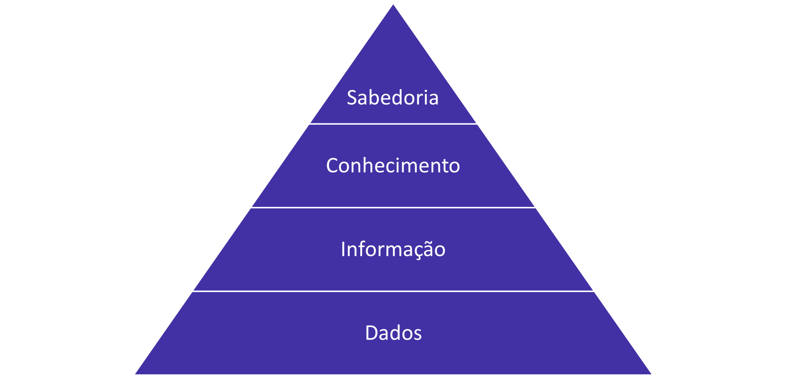
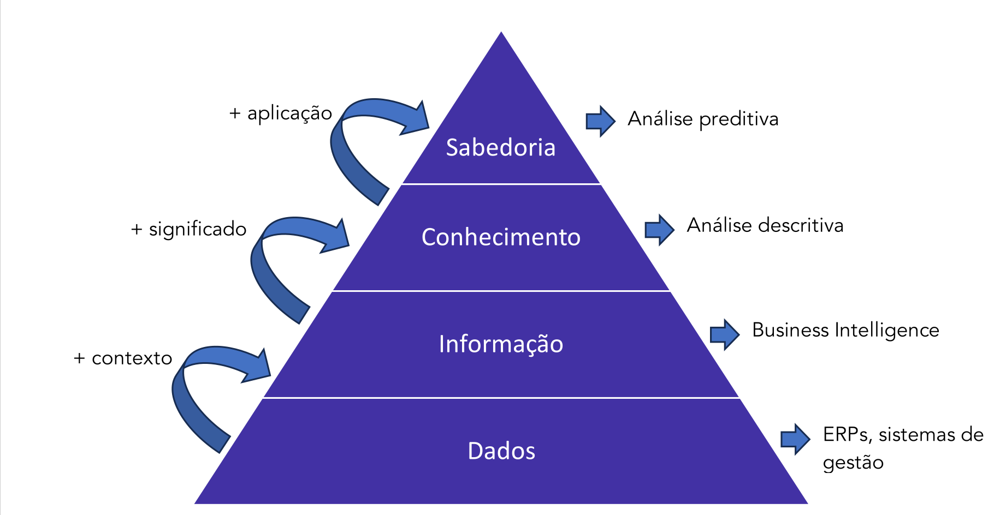

# Dados

## 1.1 Conceitos Gerais

Toda a parte “inicial” da Tecnologia da Informação gira em torno de um único elemento: **a análise de dados**. Então vamos começar do começo, entendendo o que são os dados.

Dados são uma **coleção de valores discretos ou contínuos**, que **fornecem uma informação**. Essas informações descrevem qualidade, quantidade, fatos, estatísticas e diversas outras métricas. Um conjuntos de dados recebe o nome de **data**, enquanto uma unidade única é chamada de **datum**.

Podemos classificar os dados de diversas formas diferentes. As principais formas são quanto ao **tipo de informação** que trazem, e quanto à sua **restrição de acesso**. Quanto ao tipo de informação trazido pelos dados, temos duas formas diferentes de abordá-los: **dados qualitativos**, que atribuem qualidade a alguma coisa, e **dados quantitativos**, que servem para a mensuração de algum valor. Esses dados, qualitativos e quantitativos, por si, também podem ser subdivididos.

Veja:

**• DADOS QUALITATIVOS**

**Nominal** – apenas atribui uma qualidade, sem ordenação. Exemplo: vermelho, masculino, feminino, brasileiro;
**Ordinal** – atribui uma qualidade passível de ordenação. Exemplo: baixo/alto, curto/longo/

**• DADOS QUANTITATIVOS**

**Discreto** – atribui valores específicos para uma variável. Exemplo: quantidade total de alunos no curso
**Contínuo** – constitui um valor que pode ser dividido em níveis menores, usualmente sendo associado a uma variável decimal. Exemplo: altura, velocidade

---

### ℹ️Questãoℹ️

(FGV/TCE SP/2023) O TCE SP contratou a empresa DataAnalysis para analisar as características dos candidatos que estão participando do seu concurso. Para realizar o pré-processamento dos dados, a DataAnalysis coletou e classificou as seguintes informações das variáveis relacionadas aos candidatos:

• Profissão do candidato
• Nome completo do candidato
• Número de anos de experiência profissional
• Idade do candidato, considerando ano e meses
• Nível de escolaridade (Ensino Médio, Graduação, PósGraduação)

A variável classificada como qualitativa ordinal pela empresa DataAnalysis foi:

a) Profissão do candidato;
b) Nome completo do candidato;
c) Número de anos de experiência profissional;
d) Idade do candidato, considerando ano e meses;
e) Nível de escolaridade (Ensino Médio, Graduação, PósGraduação).

Comentários:

Variáveis qualitativas são aquelas que atribuem características não numéricas. Vamos encontrar a alternativa que aponta uma dessas variáveis.

a) Errado. É uma variável qualitativa nominal
b) Errado. É uma variável qualitativa nominal
c) Errado. É uma variável quantitativa
d) Errado. É uma variável quantitativa
e) Certo.

Portanto, correta a letra E (Gabarito: Letra E)

Quanto à restrição de acesso, diversas são as classificações aceitas doutrinariamente. A vertente mais aceita pelas bancas, e mais cobrada em questões, envolve a divisão desses dados em 4 níveis diferentes, classificados conforme a sua disponibilidade de acesso e confidencialidade. São eles: 

**• Dados públicos:** sem nível de confidencialidade
**• Dados internos (ou de uso interno):** possui baixo nível de confidencialidade, não podendo ser compartilhada com pessoas de fora; porém, se forem, o impacto não será grande
**• Dados restritos:** possui nível intermediário de proteção; são informações classificadas como importantes, e apenas grupos restritos podem ter acesso a ela 
**• Dados confidenciais:** tem alto nível de proteção; são dados que, se vazarem, podem comprometer gravemente a entidade

### ℹ️Questãoℹ️

(FGV/TCE SP/2023) Davi é servidor do Departamento de Segurança da Informação do Tribunal de Contas do Estado de São Paulo (TCE SP) e recebeu a tarefa de classificar as informações trafegadas na rede interna do Tribunal. O objetivo é assegurar que a informação receba um nível adequado de proteção de acordo com a sua importância para a organização e conformidade com a LGPD (Lei Geral de Proteção de Dados). Davi encontrou algumas informações estratégicas da empresa
que deveriam estar disponíveis apenas para grupos restritos de colaboradores e que deveriam ter níveis médios de confidencialidade.

As informações encontradas por Davi devem ser classificadas como:

a) ultrassecretas;
b) confidenciais;
c) restritas;
d) de uso interno;
e) públicas.

Comentários:

A questão nos informa que “disponíveis apenas para grupos restritos de colaboradores e que deveriam ter níveis médios de confidencialidade.” – o que retrata, portanto, uma informação restrita. (Gabarito: Letra C)

### Dados Estruturados e Não estruturados

Por fim, podemos dividir ainda o dado em dois tipos diferentes, conforme a sua forma de organização e processamento. 

Os dados podem ser:

• Estruturados: são organizados em um formato bem definido, seguindo um modelo de dados específico.
• Não estruturados: não seguem um formato predefinido, sem estrutura fixa. Na internet, a maioria esmagadora de dados são considerados não estruturados.

Veremos mais à frente que os dados estruturados são trabalhados, primariamente, no modelo relacional de bancos de dados, enquanto os não estruturados ficam a encargo dos bancos de dados dimensionais e NoSQL.

## 1.2 Dados Abertos

Segundo a *Open Knowledge Foundation*, os dados são considerados abertos quando qualquer pessoa pode acessar, usar, modificar e compartilhar livremente para qualquer finalidade (sujeito a, no máximo, a requisitos que preservem a proveniência e a sua abertura). Isso geralmente é satisfeito pela publicação dos dados em formato aberto e sob uma licença aberta.

Assim, Dados Abertos são uma **metodologia para a publicação de dados do governo em formatos reutilizáveis**, visando o aumento da transparência e maior participação política por parte do cidadão, além de gerar diversas aplicações desenvolvidas colaborativamente pela sociedade. No caso do Brasil, vários órgãos da Administração Pública já publicam seus dados na web, na forma de relatórios e balanços para que os cidadãos possam acompanhar os resultados das ações de governo.

Dentre os efeitos dos dados abertos governamentais sobre as políticas públicas compreende-se:

**• Inclusão:** Fornecer dados em formatos padronizados abertos e acessíveis permite que qualquer cidadão utilize qualquer ferramenta de software para adaptá-los às suas necessidades.
**• Transparência:** Informações do setor público abertas e acessíveis melhoram a transparência, pois as partes interessadas podem usá-las da maneira mais adequada ao seu propósito.
**• Responsabilidade:** Os conjuntos apropriados de dados abertos, devidamente associados, podem oferecer vários pontos de vista sobre o desempenho dos governo no cumprimento de suas metas em políticas públicas.

No âmbito federal, a gestão da **Política de Dados Abertos** é coordenada pela **Controladoria Geral da União (CGU)**, por meio da **Infraestrutura Nacional de Dados Abertos (INDA)**. A Política foi definida através do Decreto nº 8.777/2016. Esse decreto nos traz alguns pontos importantes, vamos vê-los (recomendo a leitura na íntegra do decreto, em Decreto 8.777).

O primeiro ponto são os objetivos, que envolvem, primariamente, reforçar a cultura de transparência pública, disseminar o acesso a esses dados, fomentando o controle social e promovendo o compartilhamento de recursos de tecnologia da informação, tornando o governo mais eficiente. Em segundo lugar, o que considero mais importante para nosso contexto, são as definições de alguns conceitos. Veja:

| **CONCEITOS EM DADOS ABERTOS** | **DEFINIÇÃO** |
|-------------------------------|----------------|
| **Dado** | Sequência de símbolos ou valores, representados em qualquer meio, produzidos como resultado de um processo natural ou artificial |
| **DADO ACESSÍVEL AO PÚBLICO** | Qualquer dado gerado ou acumulado pelo Governo que não esteja sob sigilo ou sob restrição de acesso nos termos da Lei nº **12.527**, de 18 de novembro de 2011 |
| **DADOS ABERTOS** | Dados acessíveis ao público, representados em meio digital, estruturados em formato aberto, processáveis por máquina, referenciados na internet e disponibilizados sob licença aberta que permita sua livre utilização, consumo ou cruzamento, limitando-se a creditar a autoria ou a fonte |
| **FORMATO ABERTO** | Formato de arquivo não proprietário, cuja especificação esteja documentada publicamente e seja de livre conhecimento e implementação, livre de patentes ou qualquer outra restrição legal quanto à sua utilização |
| **PLANO DE DADOS ABERTOS** | Documento orientador para as ações de implementação e promoção de abertura de dados de cada órgão ou entidade da administração pública federal, obedecidos os padrões mínimos de qualidade, de forma a facilitar o entendimento e a reutilização das informações |

### ℹ️Questãoℹ️

(CEBRASPE/MPE RO/2023) Em desenvolvimento de sistema de computação, os dados que oferecem a opção de serem utilizados livremente, reutilizados e redistribuídos são chamados de

a) dados móveis.
b) inteligência.
c) conhecimento.
d) dados estruturados.
e) dados abertos.

Comentários:

Conforme vimos, os dados que podem ser usados livremente, sem necessidade de autorização, reutilizados e redistribuídos são chamados de dados abertos. (Gabarito: Letra E)

E, por fim, no tópico dos dados abertos, temos os princípios. A Open Government Data (OGD), instituição da OCDE, listou 8 princípios. São eles:

| **PRINCÍPIOS DOS DADOS ABERTOS (OGD)** | **DESCRIÇÃO** |
|----------------------------------------|----------------|
| **1 – COMPLETUDE** | Todos os dados públicos devem ser tornados disponíveis. Dados públicos são dados que não estão sujeitos a limitações válidas de privacidade, segurança ou controle de acesso. |
| **2 – PRIMARIEDADE** | Os dados são apresentados tais como os coletados na fonte, com o maior nível possível de granularidade e sem agregação ou informação. |
| **3 – ATUALIDADE** | Os dados são disponibilizados o mais rápido possível, para preservar seu valor. |
| **4 – ACESSIBILIDADE** | Os dados são disponíveis para o maior alcance possível de usuários e para os propósitos mais variados possíveis. |
| **5 – PROCESSÁVEIS POR MÁQUINAS** | Os dados são razoavelmente estruturados, para possibilitar o seu processamento automatizado. |
| **6 – ACESSO NÃO DISCRIMINATÓRIO** | Os dados estão disponíveis a todos, sem que seja necessária identificação ou registro. |
| **7 – FORMATOS NÃO PROPRIETÁRIOS** | Os dados estão disponíveis em um formato sobre o qual nenhum ente tenha controle exclusivo. |
| **8 – LIVRES DE LICENÇAS** | Os dados não estão sujeitos a regulações de direitos autorais, marcas, patentes ou segredo industrial. Restrições razoáveis de privacidade, segurança e controle de acesso podem ser permitidas na forma regulada por estatutos. |

### ℹ️Questãoℹ️
(FGV/TCE TO/2022) Dados abertos são dados publicados na internet, em formatos como csv e xml, para que qualquer pessoa possa acessar, modificar, analisar e compartilhar. Os dados devem ser publicados na forma coletada da fonte, com a mais fina granularidade possível, e não de forma agregada ou transformada, para atender ao princípio de dados abertos:

a) primários;
b) acessíveis;
c) completos;
d) processáveis por máquina;
e) acesso não discriminatório.

Resolução:
Conforme vimos na tabela acima, a definição de "dados publicados na forma coletada da fonte, com a mais fina granularidade possível, e não de forma agregada ou transformada" atende ao princípio 2 - primariedade. (Gabarito: Letra A)

## 1.3 Pirâmide DIKW

Os dados são formas de entregar **conhecimento e inteligência** em um ambiente empresarial ou organizacional. Para lidar com o consumo de dados em ambientes estratégicos, temos uma abordagem para análise de dados que considera uma estratégica de gradação dos níveis de “informação”. Coloco informação entre aspas pois ela tem um conceito específico nesse contexto. 

Essa abordagem é chamada de pirâmide DIKW (ou DICS, em português), ou pirâmide do conhecimento. Ela hierarquiza quatro formas de valores:

**• Dados**, ou data
**• Informação**, ou information
**• Conhecimento**, ou knowledge
**• Sabedoria**, ou wisdom

Conforme vamos “subindo” a pirâmide, a complexidade e o valor do dado passa a crescer, e o que ele fornece à entidade passa a ser mais útil. Além disso, conforme vamos subindo a pirâmide, vamos aumentando o nível de abstração. Os dados são a base da pirâmide, o ponto inicial na construção de sabedoria. Por exemplo, um dado qualquer pode ser uma métrica do negócio, como receita bruta. Ao adicionarmos contexto aos dados, temos a informação.

A informação passa a fornecer algo útil, organizado e estruturado, específico à entidade. Ao darmos um significado à essa informação, passamos a ter conhecimento. O conhecimento fornece aprendizado, e é extremamente contextualizado – ou seja, atrelado à organização. Ao aplicarmos o conhecimento, surge o conceito de sabedoria. A sabedoria é a ação, a implementação final do que surgiu como um dado bruto na base da pirâmide.

### ⚠️Exemplo⚠️

Vamos para um exemplo. Imagine que você viu um sinal vermelho.

• Dado: sinal vermelho

Até então isso não importa de nada. Mas, vamos dar um contexto: você está dirigindo num cruzamento perigoso. Agora temos uma informação. O que essa informação significa? Que você deve parar o carro, caso contrário cometerá infrações e poderá causar um acidente. A sabedoria seria aplicar o conhecimento desenvolvido – ou seja, frear o carro.

Então, de forma resumida temos:
• Dados
• Dados + contexto = informação
• Informação + significado = conhecimento
• Conhecimento + aplicação = sabedoria

Outro ponto importante são as atividades implementadas em cada nível. Vamos ver mais sobre o  assunto mais à frente, mas saiba desde já o que é feito em cada nível.

• Dados → ferramentas de ERP e gestão empresarial
• Informação → business intelligence
• Conhecimento → análise de dados descritivas
• Sabedoria → análises preditivas

Perceba que, conforme o dado vai enriquecendo, vamos aplicando a eles ferramentas mais complexas e completas. Abaixo, deixo-lhes um esquema que resume toda essa interação entre a evolução do conhecimento.

(Inédita/Prof. Felipe Mathias) Acerca dos conceitos de conhecimento, informação e dados, julgue o item abaixo.

Dados são valores brutos que, analisados em si, isoladamente, não fornecem muito às entidades. Porém, ao analisarmos dados em determinado contexto, passamos a ter informações, que podem oferecer um valor maior às entidades, no processo decisório.

Comentários:

Perfeito! Os dados, quando analisados sem contexto, apresentam apenas valores brutos, como temperatura, valor de venda. Porém, ao tomarmos esses dados em determinado contexto, passamos a ter informações, que podem contribuir mais à entidade que simples dados. A afirmativa está, portanto, correta. (Gabarito: Certo)

## 1.4 Formatos de dados Digitais

Quando tratamos de dados em bancos de dados, que será nosso próximo assunto, usualmente
temos dados estruturados. Para ter mais integridade nas operações, definimos restrições de
domínio para os dados. Essas restrições ditam o domínio, ou o tipo de dado que cada valor pode
receber, e são usualmente referenciadas como "tipos de dados".
Temos, basicamente, 5 grupos de tipos de dados que você deve saber:
•
•
•
•
•
Dados numéricos:
o INT: Números inteiros. Exemplo: 4, -5
o FLOAT: Números decimais. Exemplo: 4.1 , -5.2
o REAL: Números reais. Exemplo: 3.7389, 2.7318
Dados de datas:
o DATE: Armazena datas, no formato 'ANO-MÊS-DIA'. Exemplo: '2024-04-03'
o TIME: Armazena horas, no formato 'HH:MM:SS'. Exemplo: '14:30:00'
Dados de caracteres (strings):
o CHAR: Armazena strings de texto de tamanho fixo. Exemplo: 'Estratégia'
o VARCHAR: Armazena strings de texto de tamanho variável. Exemplo: '2 amigos'.
o TEXT: Armazena strings de texto do tipo longas.
Dados unicode:
o NCHAR: Armazena strings unicode de tamanho fixo.
o NVARCHAR: Armazena strings unicode de tamanho variável.
o NTEXT: Armazena strings unicode de tamanho longo.
Dados binários:
o BINARY: Armazena dados binários de tamanho fixo.
o VARBINARY: Armazena dados binários de tamanho variável.