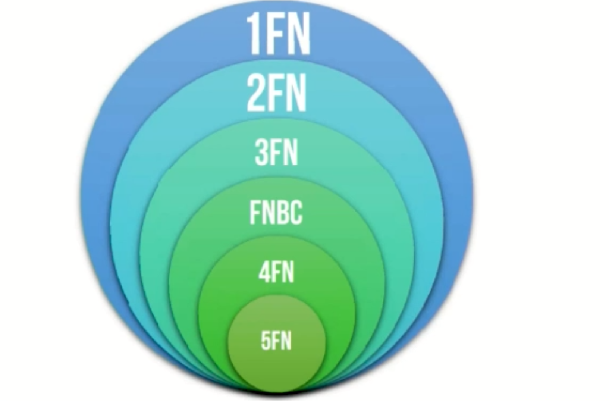

# NORMALIZAÇÃO

A normalização é um processo que busca **reavaliar a modelagem de um banco** buscando *v* **eliminar**, ou pelo menos *v* **minimizar**, a **redundância** e alcançar a melhoria de performance. Esse procedimento é feito a partir da identificação de uma anomalia em uma tabela, <u>decompondo-a em tabelas mais bem estruturadas</u>.
 
*vbg* **A Normalização aumenta a quantidade de tabelas no banco de dados!**
 

*v* **Anomalias** são problemas que ocorrem em bancos de **dados mal projetados**. Um bom projeto de banco de dados garante ao usuário a possibilidade de modificar o conteúdo do banco de dados sem causar efeitos colaterais inesperados que são as anomalias.

Existem basicamente três tipos de anomalias:
anomalia de inserção;
anomalia de exclusão e
anomalia de modificação.

*b* **a) ANOMALIA DE INCLUSÃO:** Não deve ser possível adicionar um dado em uma tabela a não ser que outro dado esteja disponível. Por exemplo: não deve ser permitido cadastrar um novo conteúdo na tabela Conteúdo sem que a disciplina desse conteúdo esteja cadastrada na Tabela de Disciplinas.

*b* **b) ANOMALIA DE EXCLUSÃO:** Ao excluir um registro do banco de dados, dados referenciados em outra tabela devem ser excluídos. Por exemplo: se excluirmos um aluno na Tabela de Alunos, as matrículas desse aluno também devem ser excluídas, em cascata, na Tabela de Matrículas.

*b* **c) ANOMALIA DE MODIFICAÇÃO:** Ao alterar um dado em uma tabela, dados em outras tabelas precisam ser alterados. Por exemplo: se o código que identifica um aluno for modificado, esse código deve ser modificado na Tabela de Alunos e na Tabela de Matriculas para manter o relacionamento correto entre alunos e suas matrículas.

 

| TIPO DE ANOMALIA | DESCRIÇÃO  |
|------------------|------------|
| *b* **ANOMALIA DE INCLUSÃO**     | Não deve ser possível adicionar um dado em uma tabela a não ser que outro dado esteja disponível. Exemplo: não deve ser permitido cadastrar um novo livro na Tabela de Livros sem que o autor desse livro esteja cadastrado na Tabela de Autores. |
| *b* **ANOMALIA DE EXCLUSÃO**      | Ao excluir um registro do banco de dados, dados referenciados em outra tabela devem ser excluídos. Exemplo: se excluirmos um autor na Tabela de Autores, os livros desse autor também devem ser excluídos, em cascata, na Tabela de Livros.        |
| *b* **ANOMALIA DE MODIFICAÇÃO**   | Ao alterar um dado em uma tabela, dados em outras tabelas precisam ser alterados. Exemplo: se o código que identifica um autor for modificado, esse código deve ser atualizado na Tabela de Autores e na Tabela de Livros para manter o relacionamento correto entre livros e autores. |

  

Em 1972, **Edgar F. Codd** criou o processo de normalização, que é utilizado para se certificar que determinada **tabela satisfaça** um conjunto de regras chamada **Formas Normais (FN)**. Cada forma normal representa uma condição mais forte que a sua precedente.
Na maioria dos casos, a **terceira forma normal (3FN)** é o mínimo necessário para considerar que um banco de dados está normalizado.

Primeira Forma Normal (1FN): Uma tabela está na 1FN se, e somente se, todos os valores dos atributos forem atômicos (indivisíveis), ISTO É, NÃO DEVEM EXISTIR ATRIBUTOS MULTIVALORADOS ou compostos.

Para entender melhor, vamos utilizar a tabela abaixo.
Ela está na 1FN? Não, porque a coluna TELEFONE é multivalorada e a coluna ENDEREÇO é composta — ambas descumprem a Primeira Forma Normal.
| **CÓDIGO** | **NOME**       | **TELEFONE**             | **ENDEREÇO**                                                     |
| ---------- | -------------- | ------------------------ | ---------------------------------------------------------------- |
| 001        | Kobe Bryant    | 99685-1648 99381-5468 | Rua Conceição de Monte Alegre 198, Cidade Monções – São Paulo/SP |
| 002        | Michael Jordan | 99513-4678               | Estrada dos Bandeirantes 6900, Jacarepaguá – Rio de Janeiro/RJ   |
| 003        | LeBron James   | 99328-4687               | Avenida Portugal 744, Setor Marista – Goiânia/GO                 |
| 004        | Allen Iverson  | 99325-1688 99466-7719 | Rua Mexilhão 33, Praia do Francês – Marechal Deodoro/AL          |

Para normalizar essa tabela, precisamos inicialmente identificar sua chave primária (**CÓDIGO**).
Em seguida, identificamos o atributo **multivalorado** e criamos uma nova tabela.

TABELA TELEFONE

| **CÓDIGO** | **TELEFONE** |
| ---------- | ------------ |
| 001        | 99685-1648   |
| 001        | 99381-5468   |
| 002        | 99513-4678   |
| 003        | 99328-4687   |
| 004        | 99325-1688   |
| 004        | 99466-7719   |

Notem que agora nós temos uma nova tabela com apenas dois atributos e que podemos retirar a coluna **TELEFONE** da tabela **JOGADOR**.
Vejam também que o Código **001** (correspondente ao Kobe Bryant) continua com seus dois números — assim como o Código **004** (correspondente ao Allen Iverson).
Dessa forma, sempre que for necessário inserir, excluir, atualizar ou consultar um telefone, basta que eu saiba o código do jogador e busque na **Tabela TELEFONE**.

Para normalizar o banco, podemos converter os atributos não atômicos em outras tabelas ou em outros campos na mesma tabela evitando repetições e campos com múltiplos valores. Ao reorganizar todos os campos não-atômicos das tabelas de um banco de dados, podemos afirmar que ela atinge uma forma estrutural denominada de Primeira Forma Normal (1FN)1.

Segunda Forma Normal (2FN): Uma tabela está na 2FN se, e somente se, estiver na 1fn e cada atributo não-chave for dependente da chave primária
(ou candidata) inteira, isto é, não devem existir dependências parciais.

Dependência funcional total: ocorre quando todo atributo não-chave de uma relação depende da chave primária como um todo e, não, somente de
parte dela;

Dependência funcional parcial: ocorre quando algum atributo não chave de uma relação depende apenas de parte da chave primária e, não, dela
como um todo e somente ocorre quando temos uma chave primária composta.

Terceira Forma Normal (3FN): Uma tabela está na 3FN se, e somente se, estiver na 2fn e cada atributo não-chave NÃO POSSUIR DEPENDÊNCIA
TRANSITIVA PARA CADA CHAVE CANDIDATA
Informática
Profa: Emannuelle Gouveia
@Emannuelle Gouveia
05490709405 - Lorenna SizaDependência Funcional Transitiva. Essa dependência ocorre quando uma
coluna, além de depender da chave primária da tabela, depende de outra
coluna (ou conjunto de colunas) dessa tabela.
Informática
Profa: Emannuelle Gouveia
@Emannuelle Gouveia
05490709405 - Lorenna SizaInformática
Profa: Emannuelle Gouveia
@Emannuelle Gouveia
05490709405 - Lorenna SizaInformática
Profa: Emannuelle Gouveia
@Emannuelle Gouveia
05490709405 - Lorenna SizaInformática
Profa: Emannuelle Gouveia
@Emannuelle Gouveia
05490709405 - Lorenna SizaInformática
Profa: Emannuelle Gouveia
@Emannuelle Gouveia
05490709405 - Lorenna SizaInformática
Profa: Emannuelle Gouveia
@Emannuelle Gouveia
05490709405 - Lorenna SizaForma Normal de Boyce-Codd (FNBC): Uma tabela está na FNBC se, e
somente se, estiver na 3fn e, para cada dependência x -> y NÃO TRIVIAL, X
deverá ser uma superchave, isto é, todo determinante é uma chave candidata
Ela é basicamente uma forma normal um pouco mais forte que a 3FN. É
importante saber que toda tabela que esteja na FNBC está na 3FN, mas nem
toda tabela na 3FN está na FNBC.
Informática
Profa: Emannuelle Gouveia
@Emannuelle Gouveia
05490709405 - Lorenna SizaInformática
Profa: Emannuelle Gouveia
@Emannuelle Gouveia
05490709405 - Lorenna SizaInformática
Profa: Emannuelle Gouveia
@Emannuelle Gouveia
05490709405 - Lorenna SizaInformática
Profa: Emannuelle Gouveia
@Emannuelle Gouveia
05490709405 - Lorenna SizaInformática
Profa: Emannuelle Gouveia
@Emannuelle Gouveia
05490709405 - Lorenna SizaAs demais formas normais são raríssimas tanto na prática do profissional
de tecnologia da informação quanto nas questões de prova. Logo,
apresentaremos só as definições:
Quarta Forma Normal (4FN): Uma tabela está na 4FN se, e somente se,
estiver na 3fn e não existirem dependências multivaloradas
Quinta Forma Normal (5FN): Uma tabela está na 5FN se, e somente se,
estiver na 4fn e não existirem dependências de junções
Informática
Profa: Emannuelle Gouveia
@Emannuelle Gouveia
05490709405 - Lorenna SizaInformática
Profa: Emannuelle Gouveia
@Emannuelle Gouveia
05490709405 - Lorenna SizaAxiomas de Armstrong: são as propriedades das dependências funcionais
a) Reflexividade Se Y ⊇ X, então X → Y : Exemplo: vamos supor o atributo X
= {CPF, NOME} e o atributo Y = NOME. Ora, NOME (Y) está contido em
{CPF, NOME} (X). Logo, podemos concluir que {CPF, NOME} (X) determina
NOME (Y).
b) Incremental/aditiva/expansibilidade Se X → Y, então XZ → YZ : Exemplo:
vamos supor os atributos X = CPF, Y = NOME e Z = IDADE. Sabendo que
CPF(X) determina NOME(Y), podemos concluir que {CPF, IDADE} determina
{NOME, IDADE}. Se os mesmos atributos são inseridos à esquerda e à direita,
a dependência funcional permanece igual2 .
Informática
Profa: Emannuelle Gouveia
@Emannuelle Gouveia
05490709405 - Lorenna Sizac) Transitividade Se X → Y e Y → Z, então X → Z: Exemplo: vamos supor o
atributo X = CPF, o atributo Y = CEP e o atributo Z = ESTADO. Sabendo que
CPF(X) determina CEP(Y), e que CEP(Y) determina ESTADO(Z), podemos
concluir que CPF(X) determina ESTADO(Z). Similar à propriedade matemática
de transitividade.
d) Trivialidade/autodeterminação X → X : Exemplo: como o próprio nome
diz, essa é simplesmente a propriedade trivial de um atributo determinar-se a
si próprio. É evidente que CPF(X) determina CPF(X) – trata-se de do axioma
da autodeterminação.
Informática
Profa: Emannuelle Gouveia
@Emannuelle Gouveia
05490709405 - Lorenna Sizae) Decomposição/separação Se X → YZ, então X → Y e X → Z: Exemplo:
vamos supor os atributos X = CPF, Y = NOME e Z = ESTADO_CIVIL. Se
CPF(X) determina {NOME, ESTADO_CIVIL}, podemos decompor essa
dependência funcional e afirmar que CPF(X) determina NOME (Y) e CPF(X)
determina ESTADO_CIVIL(Z).
f) União/reunião/combinação Se X → Y e X → Z, então X → YZ: Exemplo:
vamos supor os atributos X = CPF, Y = NOME e Z = ESTADO_CIVIL. Se
CPF(X) determina NOME (Y) e CPF(X) determina ESTADO_CIVIL(Z), podemos
afirmar que CPF(X) determina {NOME, ESTADO_CIVIL}.
Informática
Profa: Emannuelle Gouveia
@Emannuelle Gouveia
05490709405 - Lorenna Sizag) Composição Se X → Y e A → B, então XA → YB: Exemplo: vamos supor os
atributos X = CPF, Y = NOME, A = CEP e B = ESTADO. Se CPF(X) determina
NOME (Y) e CEP(A) determina ESTADO(B), podemos afirmar que {CPF,CEP}
determina {NOME,ESTADO}.
h) Pseudo-transitividade Se X → Y e YZ → W, então XZ → W : Exemplo:
vamos supor os atributos X = CPF, Y = COD_SIAPE3 , Z = MES e W =
REMUNERACAO. Se CPF(X) determina COD_SIAPE(Y) e {COD_SIAPE,MES}
determina REMUNERACAO(W), podemos afirmar que {CPF, MES} determina
REMUNERACAO.
Informática
Profa: Emannuelle Gouveia
@Emannuelle Gouveia
05490709405 - Lorenna Sizai) Acumulação Se X → Y, então XZ → Y: Exemplo: vamos supor os atributos X
= CPF, Y = NOME e Z = IDADE. Se CPF(X) determina NOME(Y), podemos
afirmar que {CPF, IDADE} determina NOME. Na verdade, qualquer atributo
inserido à esquerda continua determinando o atributo da direita.
Informática
Profa: Emannuelle Gouveia
@Emannuelle Gouveia
05490709405 - Lorenna SizaInformática
Profa: Emannuelle Gouveia
@Emannuelle Gouveia
05490709405 - Lorenna SizaInformática
Profa: Emannuelle Gouveia
@Emannuelle Gouveia
05490709405 - Lorenna Siza1. (FGV / SEFAZ-BA – 2022) Leia o fragmento a seguir. “Uma tabela está na
_____ se, e somente se, para cada _____, onde X e A são atributos simples ou
compostos, uma das duas condições precisam ser mantidas: ou o atributo X é
uma _____, ou o atributo A é uma chave candidata. Se o atributo A é membro
de uma chave candidata”. Assinale a opção cujos itens completam
corretamente as lacunas do fragmento acima.
a) forma normal boyce-codd – dependência multivalorada – chave primária.
b) forma normal boyce-codd – dependência funcional não trivial X ->-> A –
chave primária.
Informática
Profa: Emannuelle Gouveia
@Emannuelle Gouveia
05490709405 - Lorenna Sizac) terceira forma normal – dependência funcional trivial X -> A – chave
candidata.
d) terceira forma normal – dependência funcional não trivial X -> A –
superchave.
e) quarta forma normal – dependência funcional trivial X ->-> A – chave
candidata.
Informática
Profa: Emannuelle Gouveia
@Emannuelle Gouveia
05490709405 - Lorenna Siza2. (CESPE / FUNPRESP-EXE - 2022) Colocar uma tabela na segunda forma
normal (2FN) significa que toda coluna não chave depende diretamente da
chave primária.
Informática
Profa: Emannuelle Gouveia
@Emannuelle Gouveia
05490709405 - Lorenna SizaPara a questão a seguir, considere uma tabela relacional R, com atributos W,
X, Y, Z, e o conjunto de dependências funcionais identificadas para esses
atributos.
X -> Y
X -> Z
Z -> X
Z -> W
Informática
Profa: Emannuelle Gouveia
@Emannuelle Gouveia
05490709405 - Lorenna Siza3. (FGV/ TCU – 2022) Analise o conjunto de dependências funcionais inferidas
abaixo a partir do conjunto de atributos e dependências funcionais presentes
na tabela R, como descrita anteriormente.
(1) X -> Y Z W
(2) X -> W
(3) X W -> Y W
(4) X Y Z W -> X Y
(5) Y -> Z
Informática
Profa: Emannuelle Gouveia
@Emannuelle Gouveia
05490709405 - Lorenna SizaÀ luz dos axiomas da teoria de projeto de bancos de dados aplicáveis nesse
caso, é correto concluir que, dentre essas dependências inferidas:
a) somente 2 é válida;
b) somente 1, 2 e 5 são válidas;
c) somente 1, 2, 3 e 4 são válidas;
d) somente 2, 3, 4 e 5 são válidas;
e) todas são válidas.
Informática
Profa: Emannuelle Gouveia
@Emannuelle Gouveia
05490709405 - Lorenna Siza4. (CESPE / Petrobrás - 2022) Uma tabela está na segunda forma normal (2FN)
se ela estiver na 1FN e se todos os seus atributos não chave forem
totalmente dependentes da chave primária.
Informática
Profa: Emannuelle Gouveia
@Emannuelle Gouveia
05490709405 - Lorenna Siza5. (CESPE / TELEBRÁS - 2021) Conforme os conceitos de modelagem e
normalização de dados, uma tabela estará na primeira forma normal (1FN) se
todos os seus atributos forem considerados como unidades indivisíveis.
Informática
Profa: Emannuelle Gouveia
@Emannuelle Gouveia
05490709405 - Lorenna Siza6. (CESPE / ISS-Aracaju – 2021) Na normalização de tabelas, ao eliminar as
dependências transitivas, chega-se à:
a) primeira forma normal(1FN).
b) quinta forma normal(5FN).
c) segunda forma normal(2FN).
d) terceira forma normal(3FN).
e) quarta forma normal(4FN).
Informática
Profa: Emannuelle Gouveia
@Emannuelle Gouveia
05490709405 - Lorenna Siza7. (CESPE / PCDF – 2021) De acordo com a primeira forma normal do modelo
relacional, atributos compostos por vários valores são representados
diretamente em um tupla e em suas relações nas tabelas do banco de dados.
Informática
Profa: Emannuelle Gouveia
@Emannuelle Gouveia
05490709405 - Lorenna Siza8. (CESPE / APEX-BRASIL – 2021) Uma tabela estará na segunda forma
normal se tiver atendido a todos os requisitos da primeira forma normal e se
não houver:
a) atributos que não sejam funcionalmente dependentes da chave primária da
relação.
b) dependências funcionais.
c) valores nulos nos campos de chave primária.
d) grupos de repetição.
Informática
Profa: Emannuelle Gouveia
@Emannuelle Gouveia
05490709405 - Lorenna Siza9.(CESPE / ME – 2020) O processo de normalização de dados consiste em
encontrar informações que atinjam um plano de normalização com as
informações constantes nas tuplas adjacentes.
Informática
Profa: Emannuelle Gouveia
@Emannuelle Gouveia
05490709405 - Lorenna Siza10.(COVEST / UFPE – 2019) Quais formas normais lidam com Dependência
Funcional Parcial e Dependência Funcional Transitiva, respectivamente?
a) 2ª e 3ª
b) 3ª e 2ª
c) 3ª e 4ª
d) 4ª e 3ª
e) 4ª e 5ª
Informática
Profa: Emannuelle Gouveia
@Emannuelle Gouveia
05490709405 - Lorenna SizaOBRIGADA
Prof. Emannuelle Gouveia
@emannuellegouveia
05490709405 - Lorenna Siza05490709405 - Lorenna Siza