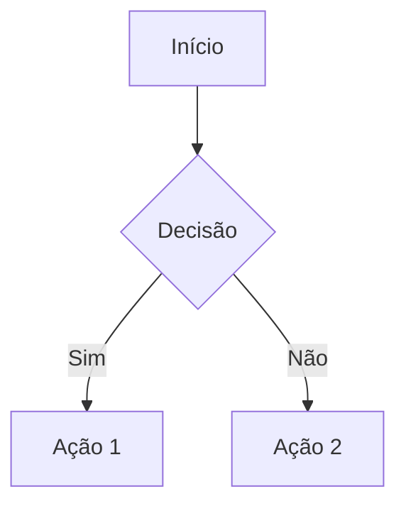

3- REGRAS DE CODD
Edgar F. Codd foi matemático britânico que formulou as bases para a
ideia de banco de dados, com a criação do modelo de banco de dados
relacional
Temos 13 Regras de Codd numeradas de 0 a 12. Elas definem o que é
necessário para que um Banco de Dados seja considerado relacional.

