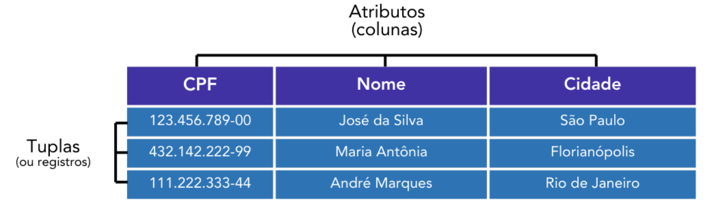

# MODELO RELACIONAL

## Conceitos Gerais

O modelo relacional é o principal modelo de banco de dados usados mundo a fora. Nele, representamos os dados de forma estruturada, em tabelas, chamadas de relações. Cada tabela é composta por atributos, que são nossas colunas, e por registros, ou tuplas, que são as linhas. Cada linha apresenta um conjunto de dados relacionados a um mesmo objeto.

No exemplo acima, temos três tuplas, cada uma contendo um conjunto de dados relacionados a um objeto específico. Esse objeto, no contexto de bancos de dados, recebe o nome de entidade. Essas entidades possuem atributos específicos a elas, de forma que a descrevem no contexto dos dados - atributos esses que estão representados nas colunas.

O conjunto de valores apresentados em uma linha representam os dados, ou data em inglês, enquanto cada “célula” da tabela é um datum, a menor unidade lógica dos dados.

Então, por exemplo, temos uma entidade chamada "José da Silva", com seu CPF, sua cidade, sua idade, entre outros atributos que podem ser atribuídos a ele. Aqui entra o que vimos na aula passada sobre restrições de domínio. Cada atributo, ou seja, cada coluna da nossa tabela, pode receber somente um tipo de dado, dentro de determinado domínio.

Essa restrição é feita na hora da criação da tabela, usualmente mediante códigos SQL (Structured Query Language). O SOL é a principal linguagem para manipulação de bancos de dados relacionais, sendo uma grande pedra no sapato de muitos alunos - mas não se preocupe, na próxima aula abordaremos as operações SOL com calma. Vamos focar no modelo relacional por enquanto.

Acerca das tuplas, segundo C.J. Date, temos algumas propriedades específicas que devem ser respeitadas:

• Os atributos de uma tabela não são ordenados da esquerda para a direita

• Tuplas não são ordenadas de cima para baixo

• Cada tupla deve ser única - ou seja, não deve existir em duplicidade

• Cada tupla contém exatamente um valor, do tipo apropriado, para cada um de seus atributos

• Cada subconjunto de uma tupla é uma tupla, inclusive para um subconjunto vazio

• Podemos ter tuplas vazias, e seu grau pode variar de 0 a n

QUESTÃO DE PROVA

(CEBRASPE/TCM-BA/2018) Considerando os conceitos de banco de dados relacionais, assinale a
opção correta a respeito das propriedades de uma tupla.
a) A tupla tem o mesmo significado e as mesmas propriedades de uma tabela.
b) Os componentes de uma tupla são ordenados da esquerda para a direita.
c) Cada tupla contém exatamente um valor para cada um de seus atributos.
d) Um subconjunto de uma tupla não é considerado uma tupla.
e) Uma tupla nunca é vazia, seu grau pode variar de 1 até n.
Comentários:
Vamos ver cada alternativa.
a) Errado. Tuplas e tabelas são componentes diferentes, com propriedades diferentes.
b) Errado. Não temos ordenação nos componentes da tupla.
c) Certo. Temos, exatamente, um valor para cada um dos atributos. Veremos depois que esses
valores podem sem múltiplos (multivalorados), mas eles são considerados de forma única.
d) Errado. Conforme vimos, um subconjunto de uma tupla também é considerado uma tupla.
e) Errado. A tupla pode ser vazia, e seu grau pode variar de 0 a n.
A correta, portanto, é a letra C. (Gabarito: Letra C)

##  Chaves Primárias e Estrangeiras

As relações, que dão o nome ao modelo relacional, não estão limitadas apenas às tabelas. Temos dois conceitos que estruturam todo o nosso modelo - um par de chaves, chamadas de chave primárias (ou, em inglês, PK - Primary Key), e as chaves estrangeiras (ou, em inglês, FK - Foreign Key). Vamos estudar cada uma dessas chaves agora.

### Chaves Primárias

As chaves primárias, que chamaremos simplesmente de PK (Primary Keys), são atributos de uma tabela (ou seja, colunas), que identificam de forma única cada registro, cada linha de uma tabela. Ou seja, são valores que, quando tomados individualmente ou em conjunto, não se repetem nenhuma outra vez numa mesma tabela. Detalhe importante, pois nada impede que esse valor seja repetido em outras tabelas.

Um detalhe importante é que essa chave primária pode ser composta por uma única coluna ou por um conjunto de colunas. Nesse segundo caso, podemos ter valores individuais que se repetem na tabela, mas, quando analisamos o conjunto dos valores, eles nunca irão se repetir.

Graças à exigência de unicidade, colunas que são classificadas como chaves primárias, além das restrições de domínio do tipo de dado que podem receber, possuem outras restrições especiais. São elas:

• As chaves devem ser únicas. No SQL, esse atributo é identificado a partir da palavra-chave UNIQUE.

• Nenhum valor nas colunas de chave primárias podem ter valores nulos, isso é, vazios. No SQL, a palavra-chave para esse atributo é NOT NULL.

• As chaves primárias são imutáveis - o que não quer dizer que elas não possam mudar, mas que outras aplicações não possam fazer alterações de forma indireta nelas.

Além disso, lembram dos índices que vimos na aula passada? Então, são justamente essas chaves primárias que são referenciadas pelos índices para a recuperação dos dados - aliás, muita vezes, em tabelas mais simples, usamos justamente as chaves primárias como uma forma de índice.

(CEBRASPE/SEPLAN RR/2023) Julgue o item a seguir a respeito do conceito de modelagem relacional de dados.
No modelo relacional de dados todas as relações necessitam de uma chave primária formada por uma ou mais tuplas que identificam um único registro.

Comentários:

Cuidado! As chaves primárias são formadas por uma ou mais colunas (ou atributos) de uma tabela, que unificam um nico registro, e não por uma ou mais tuplas, como a questão afirma. (Gabarito: Errado)

INDO MAIS FUNDO!

Acontece que, em algumas tabelas, podemos ter vários atributos que são elegíveis para serem chaves primárias. Pense numa pessoa física, que tem CPF, RG, CNH, cada um desses atributos identifica uma pessoa de forma única. A esse conjunto de atributos, damos o nome de chaves candidatas. Podemos escolher qualquer um deles, de acordo com o que for mais conveniente no momento.

(Inédita/Prof. Felipe Mathias) O conjunto de atributos que são elegíveis como chaves primárias de
uma tabela são denominados de:
a) Chaves substituas
b) Chaves estrangeiras
c) Chaves candidatas
d) Chaves indexadas
e) Chaves uniformes
Comentários:
Como vimos, o conjunto de atributos que são elegíveis como chave primárias recebe o nome de
chaves candidatas. (Gabarito: Letra C)

### Chaves Estrangeiras

As **chaves estrangeiras** são atributos "importados" de outras tabelas do banco de dados, fazendo com que tenhamos referências a outras tabelas dentro de uma única tabela.

Por não ser inerente a uma tabela específica, a chave estrangeira não tem a mesma restrição que as chaves primárias. Ela pode ser, portanto, nula ou não única. O que determinará suas restrições de domínio é como as relações entre as tabelas se dão - principalmente no quesito de cardinalidade, que define quantas vezes um registro de uma tabela se relaciona com outra. Não se preocupe com isso que veremos mais sobre ele, mais à frente.

Nesse exemplo acima, temos duas tabelas: a tabela curso, composta por dois registros - Banco de Dados e Linux -, é referenciada pela tabela aluno, através de seu código que, na tabela aluno,  recebe o nome de atributo cd_curso. Então, podemos afirmar que cd_curso é uma chave estrangeira na tabela aluno, que referencia o atributo codigo da tabela curso.

INDO MAIS FUNDO!

Um detalhe importante, e que alunos costumam confundir, é que uma chave estrangeira não necessariamente será ligada a uma chave primária em outra tabela. Podemos ter atributos nãochave sendo utilizados também. Além disso, podemos ter as chaves estrangeiras funcionando, ao mesmo tempo, como chaves primárias.

## Regras de Codd

As 12 regras de Codd, que, na verdade, são treze regras, são um conjunto de regras que definem o que é necessário para que determinado modelo de banco de dados seja considerado como um modelo relacional. Elas surgiram através de um movimento criado por Edgar Frank Codd, considerado o pai do modelo relacional, para que esse modelo tivesse uma certa padronização.

Galera, aqui não tem para onde correr - as regras são bem literais, e você tem que entender todas elas. Mas quero que você vá além disso, leia cada uma das regras de forma a realmente entender o propósito e o funcionamento do modelo relacional, não simplesmente para decorar o que é a regra - até porque não temos cobranças literais do tipo "a regra 04 fala x y z”. 

**<mark>REGRA 00 - REGRA DA FUNDAÇÃO</mark>**
 
Para um sistema se qualificar como um sistema de gerenciamento de banco de dados relacional (SGBD r), esse sistema deve gerenciar todas suas bases de dado inteiramente através de suas capacidades relacionais.  
 
**<mark>REGRA 01 - REGRA DA INFORMAÇÃO</mark>**
 
Toda a informação em um banco de dados é representada explicitamente no nível lógico e em apenas uma forma - por valores em tabelas.  
 
**<mark>REGRA 02 - REGRA DO ACESSO GARANTIDO</mark>**  
 
Cada um dos datum (menor unidade dos dados) num banco  de dados relacional são acessíveis logicamente através de uma combinação de nome da tabela, nome da coluna e o valor da chave primária  
 
**<mark>REGRA 03 - REGRA  TRATAMENTO SISTEMÁTICO DE VALORES NULOS</mark>**  
 
O SGBD deve permitir que cada campo possa permanecer nulo (ou vazio). Especificamente, ele deve suportar uma representação de "falta de informação e informações inaplicáveis" que é sistemática, diferente de todos os valores regulares (por exemplo, "diferen te de zero ou qualquer outro número", no caso de valores numéricos), e independente de tipo de dados. É também implícito que tais representações devem ser manipuladas pelo SGBD de maneira sistemática.  
 
**<mark>REGRA 04 - REGRA DO SISTEMA DE CATÁLOGO DINÂMICO ONLINE</mark>**  
 
A descrição do banco de dados, através do catálogo de dados, é representada o mesmo nível lógico que dados normais, de forma que usuários possam aplicar as mesmas linguagens relacionais aos catálogos que são aplicadas aos dados.  
 
**<mark>REGRA 05 - REGRA DA LINGUAGEM DE SUBDADOS ABRANGENTE</mark>**  
 
Um sistema relacional deve suportar diversas linguagens e modos de uso do terminal (lugar onde digitamos os comandos). Entretanto, deve existir pelo menos uma linguagem cujas instruções devem ser expressáveis por meio de uma sintaxe bem definida, como strings de caracteres. Essa linguagem é o SQL.  
 
**<mark>REGRA 06 - REGRA DA ATUALIZAÇÃO DE VISÕES</mark>**  
 
Todas as views que são teoricamente atualizáveis, também são atualizáveis pelo sistema.  
 
**<mark>REGRA 07 - REGRA DE OPERAÇÕES RELACIONAIS</mark>**  
 
A capacidade de lidar com relações básicas ou derivadas, com um único operador, aplica-se não apenas à recuperação de dados, mas também à inserção, atualização e exclusão deles.  
 
**<mark>REGRA 08 - REGRA DA INDEPENDÊNCIA DOS DADOS FÍSICOS</mark>**  
 
Programas de aplicação e atividades de terminal de comando permanecem inalterada s quando temos alterações nas representações de armazenação ou nos métodos de acesso aos dados.  
 
**<mark>REGRA 09 - REGRA DA INDEPENDÊNCIA LÓGICA DOS DADOS</mark>**  
 
Programas de aplicação e atividades de terminal permanecem logicamente inalteradas quando mudanças na forma de preservação de informações de qualquer tipo, que teoricamente permitam a inalterações, são feitas nos dados base.   
 
**<mark>REGRA 10 - REGRA DA INDEPENDÊNCIA DE INTEGRIDADE</mark>**  
 
Restrições de integridade específicas de um banco de dados relacional em particular devem ser definíveis na sublinguagem de dados e armazenáveis no catálogo, não nos programas de aplicação.  
 
**<mark>REGRA 11 - REGRA DA INDEPENDÊNCIA DE DISTRIBUIÇÃO</mark>**
 
O usuário final não deve ser capaz de ver que os dados são distribuídos em várias localizações. Usuários devem ter sempre a impressão de que os dados são localizados em apenas um local.  
 
**<mark>REGRA 12 - REGRA DA NÃO SUBVERSÃO</mark>**
 
Se um sistema relacional possui uma linguagem de baixo nível, esse nível não pode ser usado para subverter ou sobrepor as regras e restrições de integridade expressas em linguagens de mais alto nível.  
 
Aqui cabe um adendo: As linguagens de baixo nível são aquelas próximas à linguagem de máquina e fornecem pouco ou nenhum abstração sobre o hardware do computador. Elas são difíceis de ler e escrever para humanos, mas são eficientes para o computador execut ar. Já as linguagens de alto nível são mais distantes da linguagem de máquina e mais próximas da linguagem humana. 

Elas fornecem abstrações que facilitam a programação, permitindo que os programadores expressem ideias em um nível mais alto, sem se preocupa r com detalhes específicos do hardware.  

 
(DIRENS AERONÁUTICA/CIAAR/2018) As doze regras de Codd propostas em 1985 por Dr. E. F. Codd definem o que é necessário para que um sistema de gerenciamento de banco de dados seja considerado relacional.  
 
A regra 12, que trata da não transposição das regras, afirma que  
 
a) o banco de dados deve suportar inserções, atualizações e exclusões de nível de conjunto.  
b) qualquer visualização que seja teoricamente atualizável deve ser atualizável através do sistema.  
c) os nulos devem ser representados e tratados de forma sistemática, independente do tipo de dados.  
d) se o sistema suportar acesso de baixo nível aos dados, não deve haver uma maneira de ignorar as regras de integridade do banco de dados.  
 
Comentários:  
 
A Regra 12, Regra da Não Subver são (ou da não transposição), afirma que, se um sistema relacional possui uma linguagem de baixo nível, esse nível não pode ser usado para subverter ou sobrepor as regras e restrições de integridade expressas em linguagens de mais alto nível.  A afirmativa que corretamente a aponta é a letra E. (Gabarito: Letra E)  
 
# MODELO CONCEITUAL

## Conceitos Gerais  
 
 
 
Nessa aula vamos explorar o modelo conceitual. Retomando brevemente o que ele representa, 
temos o nível de maior abstração  na representação dos bancos de dados.  Num fluxograma de 
concepção dos bancos de dados, inicialmente pensamos no minimundo , que é a seleção do que 
queremos representar do mundo real, e que dará origem a um conjunto de requisitos e análises. 
A partir desses requisitos de dados que começamos o nosso modelo conceitual.  
 
O foco aqui é uma representação de a lto nível  do modelo. A modelagem é completamente 
independente de SGBD e de paradigma (ou seja, de qualquer implementação). Focamos em 
representar as entidades e seus relacionamentos – e é justamente sobre isso que a aula de hoje 
irá versar. Existem diversas formas de modelarmos o modelo conceitual, a mais comum, e que 
estudaremos em seguida, é o Modelo Entidade -Relacionamento , ou MER . 
 
(Instituto Verbena/IFS/2024)  Após a análise de requisitos de um sistema, uma equipe de 
desenvolvimento de software sentiu a necessidade de projetar o banco de dados do sistema 
utilizando o Modelo Entidade Relacionamento (MER). Neste sentido, entende -se que a equipe 
definiu um esquema  
 
a) físico.  
b) conceitual.  
c) de visão.  
d) de partição.  
 
Comentários:  
Emannuelle Gouveia Rolim, Felipe Mathias
Aula 01 (Prof. Felipe Mathias e Emannuelle Gouveia)
TCU (Auditor de Controle Externo - Tecnologia da Informação) Banco de Dados - 2025 (Pós-Edital)
www.estrategiaconcursos.com.br
05490709405 - Lorenna Siza12
104

---

## Página 13

Se a entidade definiu um MER, pode marcar sem medo – estamos no modelo conceitual. 
(Gabarito: Letra B)  
Emannuelle Gouveia Rolim, Felipe Mathias
Aula 01 (Prof. Felipe Mathias e Emannuelle Gouveia)
TCU (Auditor de Controle Externo - Tecnologia da Informação) Banco de Dados - 2025 (Pós-Edital)
www.estrategiaconcursos.com.br
05490709405 - Lorenna Siza13
104

---

## Página 14

Modelo Entidade -Relacionamento  
 
O Modelo Entidade -Relacionamento (MER)  é uma técnica usada para representar e descrever as 
entidades e relacionamentos envolvidos em um domínio de negócio, num nível conceitual . Ele é 
frequentemente usado para projetar um banco de dados relacional. O MER é composto por 
entidades , atributos  e relacionamentos . 
 
 
 
O Modelo Entidade -Relacionamento  é um modelo abstrato e teórico , que foca nos conceitos e na 
lógica de negócio, ou seja, foca no “o quê” iremos representar no banco de dados. Dessa forma, 
auxilia a organizar e compreender os requisitos do negócio e do banco de dados. Como o MER é 
um modelo teórico, usamos de um artifício visual que representa o conjunto de entidades e 
relacionamentos que encontramos no modelo – esse artifício é denominado Diagrama Entidade -
Relacionamento (DER) . Um DER parece -se com isso:  
 
 
 
 
 
Vamos explorar cada um dos conceitos do modelo.  
 
 
 Modelo Entidade -Relacionamento
Entidades Atributos Relacionamentos
Emannuelle Gouveia Rolim, Felipe Mathias
Aula 01 (Prof. Felipe Mathias e Emannuelle Gouveia)
TCU (Auditor de Controle Externo - Tecnologia da Informação) Banco de Dados - 2025 (Pós-Edital)
www.estrategiaconcursos.com.br
05490709405 - Lorenna Siza14
104

---

## Página 15

Entidades  
 
Uma entidade  é um objeto, pessoa, lugar ou conceito no mundo real que é representado no 
modelo de dados. Vamos tomar o Estratégia, por exemplo. Aqui, podemos ter diferentes 
entidades, como Alunos, Professores, Cursos e Matérias. Usualmente, cada entidade representa 
uma tabela – mas isso pode não ser sempre verdade, dependendo de fatores como normalização 
e dependência das entidades . No nosso exemplo  da página anterior , temos duas entidades - 
Cliente e Produto.  No MER, as entidades são representadas por retângulos . 
 
Podemos ter três tipos  diferentes de entidades:  as entidades fortes , as entidades fracas e as 
entidades associativas . 
 
As entidades fortes representam nossos objetos “principais” no modelo. São os acontecimentos 
do minimundo que existem de forma autônoma  e independente. Falando em termos técnicos , são 
entidades que possuem um atributo identificador (chave primária) p róprio, que o identifica de 
forma única e inequívoca – ou seja, é autossuficiente em termos de identificação no banco de 
dados.  
 
Já as entidades fracas  são objetos do mundo real, assim como as entidades fortes, mas que 
dependem d e elementos externos para que possam ser identificados de forma única.  Usualmente 
essa dependência é satisfeita através da entidade forte, utilizando o atributo identificador dessa 
entidade forte aliado a um atributo  próprio, discriminante, para a identificação única.  
 
Por fim, temos as entidades associativas . Essas entidades são relacionamentos que foram elevados 
ao status de entidade, por lidarem com relacionamentos complexos (denominados 
relacionamentos múltiplos, n:m ou n:n). Retomaremos essas entidades mais à frente, quando 
falarmos sobre relacionamentos.  
 
Entidade  Descrição  Representação  
Forte  Representa um objeto ou conceito que é 
independente no modelo, ou seja, não 
depende de outra entidade para existir.  
 
Fraca  Representa um objeto ou conceito que é 
dependente de uma entidade forte para 
existir.  
 
Emannuelle Gouveia Rolim, Felipe Mathias
Aula 01 (Prof. Felipe Mathias e Emannuelle Gouveia)
TCU (Auditor de Controle Externo - Tecnologia da Informação) Banco de Dados - 2025 (Pós-Edital)
www.estrategiaconcursos.com.br
05490709405 - Lorenna Siza15
104

---

## Página 16

Associativa  Utilizada para representar relacionamentos 
complexos  entre duas ou mais entidades 
fortes.  
 
 
Uma observação: Dependendo da notação  adotada, podemos ter diferentes representações. A 
notação padrão IDEF1X optar por representar entidades fracas com linhas simples, mas cantos 
arredondados.  
 
(CETAP/AGE PA/2022 - Adaptada)  Considere a figura abaixo:  
 
 
 
Os elementos "Colaborador" e "Dependentes representam, respectivamente : 
 
a) Entidade fraca; Entidade forte.  
b) Entidade fraca; Entidade f raca. 
c) Entidade forte; Entidade f orte. 
d) Entidade forte; Entidade fraca.  
 
Comentários:  
 
O elemento "Colaborador" é um retângulo de linhas sólidas, representando uma entidade forte. 
Já "Dependentes", sendo um retângulo de linhas duplas, representa uma entidade fraca. 
(Gabarito: Letra D)  
 
(FUNDATEC/PROCERGS/2023)  Em um modelo lógico de dados, qual é a diferença entre uma 
entidade fraca e uma entidade forte?  
 
a) Uma entidade fraca não tem atributos próprios, enquanto uma entidade forte tem.  
b) Uma entidade fraca depende de outra entidade, chamada de entidade proprietária, enquanto 
uma entidade forte é independente.  
Emannuelle Gouveia Rolim, Felipe Mathias
Aula 01 (Prof. Felipe Mathias e Emannuelle Gouveia)
TCU (Auditor de Controle Externo - Tecnologia da Informação) Banco de Dados - 2025 (Pós-Edital)
www.estrategiaconcursos.com.br
05490709405 - Lorenna Siza16
104

---

## Página 17

c) Uma entidade fraca possui um relacionamento muitos para muitos, enquanto uma entidade 
forte possui um relacionamento um para muitos.  
d) Uma entidade fraca não tem uma chave primária, enquanto uma entidade forte tem.  
e) Uma entidade fraca pode ser removida sem afetar outras entidades, enquanto uma entidade 
forte é essencial para o modelo.  
 
Comentários:  
 
Entidades fracas são aquelas dependentes de outras entidades, pois sua chave primária é 
composta a partir de chaves estrangeiras dessa outra entidade. A alternativa que melhor descreve 
o conceito é a letra B. (Gabarito: Letra B)  
Emannuelle Gouveia Rolim, Felipe Mathias
Aula 01 (Prof. Felipe Mathias e Emannuelle Gouveia)
TCU (Auditor de Controle Externo - Tecnologia da Informação) Banco de Dados - 2025 (Pós-Edital)
www.estrategiaconcursos.com.br
05490709405 - Lorenna Siza17
104

---

## Página 18

Atributos  
 
Os atributos  representam as características ou propriedades das entidades . Eles descrevem 
informações específicas sobre uma entidade e são representados por elipses ligadas às entidades 
no diagrama.  Por exemplo, a entidade Aluno pode ter os atributos Nome, Idade, Sexo, assim  
como a entidade professor.  
 
Esses atributos podem ser norma is, que indicam atributos não chave em uma tabela, e são 
representados como círculos vazios ligados às entidades, ou atributos identificadores , que 
apontam as chaves primárias em uma tabela , representados por círculos preenchidos . Além disso, 
podemos ter outros tipos de atributos , que variam de acordo com o conteúdo do atributo:  
 
• Atributos Simples:  São atributos que não podem ser divididos em partes menores 
significativas. Por exemplo, o atributo Nome de um cliente.  
• Atributos Compostos: São atributos que podem ser divididos em partes menores, cada uma 
com seu próprio significado. Por exemplo, o atributo Endereço  de um cliente, que pode 
incluir sub -atributos como Rua, Cidade  e CEP. 
• Atributos Multivalorados:  São atributos que podem ter mais de um valor para uma mesma 
entidade. Por exemplo, o atributo Telefones  de um cliente, que pode ter mais de um 
número de telefone associado.  
• Atributos Derivados:  São atributos cujo valor é derivado de outros atributos da mesma 
entidade. Por exemplo, o atributo Idade  de um cliente, que pode ser derivado a partir da 
data de nascimento.  
• Atributos Monovalorados:  Os atributos monovalorados representam valores únicos , em 
contraponto aos atributos multivalorados ou derivados. São também denominados de 
atributos atômicos.  
 
Atributos usualmente representarão colunas no próximo nível de abstração – o modelo lógico. 
Mas é i mportante entender que nem todos os atributos serão mapeados para tabelas  (quando 
estivermos no modelo lógico). Os atributos que serão, de fato, mapeados, são denominados 
atributos armazenados . É o caso dos atributos derivados, que, por terem valores calculados a 
partir de outros atributos, não possuem seus valores armazenados em banco de dados.  
 
(FCC/TRT 15/2015)  O modelo E -R utiliza alguns conceitos básicos como entidades, atributos e 
relacionamentos. Os atributos podem ser classificados em obrigatórios, opcionais, 
monovalorados, multivalorados, simples ou compostos. Nesse contexto, uma entidade chamada 
Empregado possui os atributos ID, Nome, TelefonesContato, CNH e Endereço. Os atributos 
TelefonesContato e Endereço são classificados, respectivamente, em  
 
a) simples e multivalorado.  
b) multivalorado e composto.  
Emannuelle Gouveia Rolim, Felipe Mathias
Aula 01 (Prof. Felipe Mathias e Emannuelle Gouveia)
TCU (Auditor de Controle Externo - Tecnologia da Informação) Banco de Dados - 2025 (Pós-Edital)
www.estrategiaconcursos.com.br
05490709405 - Lorenna Siza18
104

---

## Página 19

c) obrigatório e opcional.  
d) composto e multivalorado.  
e) monovalorado e multivalorado  
 
Comentários:  
 
Quando temos  atributos do tipo Endereço, que comporta vários atributos dentro de si (rua, 
número etc.), temos um atributo composto . Esses atributos podem ser divididos em diferentes 
atributos, cada um com um significado diferente. Já os números de telefone correspondem a 
atributos multivalorados, já que podem receber valores múltiplos para um mesmo atributo, cada 
um com o mesmo signi ficado.  
 
Sendo assim, podemos dizer que o atributo TelefonesContato é multivalorado, enquanto o 
atributo Endereço é composto. (Gabarito: Letra B) 
 
Uma grande dificuldade dos candidatos está em identificar a diferença entre atributos compostos, 
e atributos multivalorados . Os atributos multivalorados conterão valores de mesmo “significado”, 
com mesmo nível de agregação – como múltiplos telefones . Aqui as informações conseguem ser 
entendidas completamente pegando somente um dos valores atribuídos. Já atributos compostos 
possuem valores de múltiplos níveis de agregação, e é necessária a completude dos valores para 
a correta interpretação do seu sen tido. 
 
ATRIBUTOS COM SIGNIFICADOS DIFERENTES → COMPOSTO  
ATRIBUTOS COM MESMO SIGNIFICADO → MULTIVALORADO  
 
Essa composição de valores num mesmo atributo é denominada cardinalidade de atributos . Ela 
define a quantidade de valores que um único atributo de uma entidade ou relacionamento pode 
assumir para cada instância dessa entidade ou relacionamento. Em termos simples, ela indica se 
um atributo pode conter um único valor  ou múltiplos valores  para uma mesma ocorrência de uma 
entidade ou relacionamento.  
 
Se um atributo for simples, dizemos que ele possui cardinalidade 1:1 . Nesse caso, c ada instância 
da entidade ou relacionamento possui exatamente um valor para o atributo.  Já atributos 
multivalorados possuem cardinalidade 1:n, onde cada instância da entidade ou relacionamento 
pode possuir mais de um valor para o atributo.  
 
Quanto à representação, os atributos usualmente são representados por elipses, quando estamos 
explorando diagramas mais detalhados, ou círculos , quando os detalhes sobre os atributos são 
mais generalistas (ou seja, o diagrama é mais focado no relacionamento entre as entidades do que 
nos atributos delas) .  
 
Emannuelle Gouveia Rolim, Felipe Mathias
Aula 01 (Prof. Felipe Mathias e Emannuelle Gouveia)
TCU (Auditor de Controle Externo - Tecnologia da Informação) Banco de Dados - 2025 (Pós-Edital)
www.estrategiaconcursos.com.br
05490709405 - Lorenna Siza19
104==263e72==

---

## Página 20

Podemos variar a notação de acordo com o tipo de atributo. Os principais formatos são:  
 
 
 
SÍMBOLO  SIGNIFICADO  
 Atributo  
  Atributo chave*  
 Atributo composto  
 Atributo multivalorado  
 Atributos derivados  
* É possível representar atributos chave, ou identificadores, através de circunferências preenchidas. A notação 
sublinhada é usada quando temos um nível  de detalhe maior no modelo, enquanto a notação preenchida passa 
uma visão mais generalista.  
 
 
(VUNESP/PREF. ILHABELA/2020)  Considere o seguinte diagrama entidade -relacionamento:  
 
 
 
A partir desse diagrama, é correto afirmar que  
 
a) Pigmento é um atributo derivado.  
b) Número é um atributo multivalorado.  
c) Número é um atributo derivado.  
Emannuelle Gouveia Rolim, Felipe Mathias
Aula 01 (Prof. Felipe Mathias e Emannuelle Gouveia)
TCU (Auditor de Controle Externo - Tecnologia da Informação) Banco de Dados - 2025 (Pós-Edital)
www.estrategiaconcursos.com.br
05490709405 - Lorenna Siza20
104

---

## Página 21

d) Cor é um atributo derivado.  
e) Cor é um atributo chave.  
 
Comentários:  
 
Vamos analisar cada alternativa.  
 
a) Certo. De fato, pigmento é um atributo derivado.  
b e c) Errado. Número é um atributo chave.  
d e e) Errado. Cor é um atributo multivalorado.  
 
Temos, portanto, a letra A como gabarito. (Gabarito: Letra A)  
Emannuelle Gouveia Rolim, Felipe Mathias
Aula 01 (Prof. Felipe Mathias e Emannuelle Gouveia)
TCU (Auditor de Controle Externo - Tecnologia da Informação) Banco de Dados - 2025 (Pós-Edital)
www.estrategiaconcursos.com.br
05490709405 - Lorenna Siza21
104

---

## Página 22

Relacionamentos  
 
Em um Modelo Entidade -Relacionamento, os relacionamentos  representam as associações entre 
entidades. Eles descrevem como as entidades estão conectadas umas às outras e são 
representados por losangos. Por exemplo, continuando no Estratégia, cada aluno se matricula em 
um curso - então, temos uma relação entre aluno e curso , que recebe o nome de matrícula . Ou, 
outro exemplo, cada professor ministra um curso - então, temos o relacionamento ministra entre 
professor e curso . 
 
É importante destacar que mesmo que seja estabelecida uma ligação de relacionamento ente 
entidades, ela não será sempre obrigatória  – isso depende da cardinalidade do relacionamento, 
assunto que veremos logo em seguida. Podemos ter relacionamentos opcionais, onde mesmo 
havendo a possibilidade de se ligar a outra entidade, podemos não ter ligações, e relacionamentos 
obrigatórios, onde há a necessidade dessa ligação.  
 
Os relacionamentos recebem uma classificação  conforme a quantidade de entidades que se ligam 
a eles. Usualmente, os relacionamentos são binários, indicando que liga duas entidades - mas nada 
impede que tenhamos relacionamentos unários, ternários ou outros . 
 
Relacionamentos Recursivos  
 
Podem acontecer casos em que uma entidade necessita se relacionar consigo mesma. Por 
exemplo, pense num banco de dados de um cartório, que irá registrar casamentos - teremos uma 
entidade chamada pessoa , que se casa com outra pessoa , criando um relacionamento recursivo. A 
representação se parece com isso:  
 
 
 
(COGEPS/PREF. BARRACÃO/2022)  Assinale a alternativa que indica o que não representa o 
modelo entidade relacionamento.  
 
 
 
Emannuelle Gouveia Rolim, Felipe Mathias
Aula 01 (Prof. Felipe Mathias e Emannuelle Gouveia)
TCU (Auditor de Controle Externo - Tecnologia da Informação) Banco de Dados - 2025 (Pós-Edital)
www.estrategiaconcursos.com.br
05490709405 - Lorenna Siza22
104

---

## Página 23

a) auto-relacionamento  
b) relacionamento unário  
c) relacionamento recursivo  
d) grau de relacionamento 2  
 
Comentários:  
 
A questão aponta um MER que identifica um relacionamento entre funcionários, onde um 
funcionário supervisiona outro funcionário. Queremos a alternativa que incorreta . Vamos lá:  
 
a) Certo. Se trata, de fato, de um auto -relacionamento – onde uma entidade se relaciona com ela 
mesma.  
b) Certo. Todo auto -relacionamento é unário.  
c) Certo. Relacionamento recursivo é outro nome para o auto -relacionamento.  
d) Errado. Temos um relacionamento unário, de grau 1.  
 
Portanto, incorreta a letra D.  (Gabarito: Letra D) 
 
Entidades Associativas  
 
Via de regra, os relacionamentos não possuem atributos, apenas demonstram a existência de 
relações entre entidades de um esquema. Porém, em alguns casos, quando determinado 
relacionamento associa muitas entidades, com uma cardinalidade muitos -para-muitos (veremos 
cardinalidade a seguir, não se preocupe), temos relacionamentos que passam a conter atributos 
próprios.  
 
Nesses casos, temos uma classificação diferente para esses relacionamentos, que passam a ser 
tratados ao mesmo temo como entidades e relacionamentos. Chamamos esses casos de entidades 
associativas , já que, literalmente, misturamos uma entidade e um relacionamento no mesmo 
objeto. A representação é dada através de um losango  dentro de um retângulo . 
 
(CONSULPLAN/IF PA/2023)  Observe a imagem a seguir:  
 
 
 
Qual a representação do retângulo entorno do relacionamento consulta?  
Emannuelle Gouveia Rolim, Felipe Mathias
Aula 01 (Prof. Felipe Mathias e Emannuelle Gouveia)
TCU (Auditor de Controle Externo - Tecnologia da Informação) Banco de Dados - 2025 (Pós-Edital)
www.estrategiaconcursos.com.br
05490709405 - Lorenna Siza23
104

---

## Página 24

a) Uma generalização.  
b) Uma entidade associativa.  
c) Um relacionamento ternário.  
d) Não é possível inserir entidade e relacionamento ao mesmo tempo.  
 
Comentários:  
 
A simbologia em torno do elemento Consulta nos indica que se trata de uma entidade associativa. 
(Gabarito: Letra B)  
Emannuelle Gouveia Rolim, Felipe Mathias
Aula 01 (Prof. Felipe Mathias e Emannuelle Gouveia)
TCU (Auditor de Controle Externo - Tecnologia da Informação) Banco de Dados - 2025 (Pós-Edital)
www.estrategiaconcursos.com.br
05490709405 - Lorenna Siza24
104

---

## Página 25

Cardinalidade  
 
A cardinalidade  é uma medida de quantidade, que mede quantas vezes determinada entidade se 
relaciona com outra . Cada entidade pode se relacionar nenhuma (0), uma (1) ou diversas (n) vezes 
com a outra - e é isso que a cardinalidade representa.  Esses valores são representados em pares, 
indicando um mínimo e um máximo para as relações  
 
Por exemplo, se dissermos que a entidade professor  se relaciona em (0, n) vezes com a entidade 
curso , estamos dizendo que a quantidade de relações entre essas duas entidades varia entre 0 e 
muitos, ou seja, um professor pode ministrar  (que é o relacionamento) 0 ou muitos cursos. 
Importante ressaltar que os relacionamentos não são bidirecionais, sendo assim a relação 
professor  → curso  não é a mesma de curso  → professor . 
 
Um outro detalhe que vocês devem se atentar é que a notação é sempre feita ao lado da entidade 
de destino do relacionamento. No nosso exemplo, a notação da cardinalidade do relacionamento 
entre professor  → curso  vai ser feita ao lado da entidade curso. Vej a: 
 
 
 
Vocês podem ler essa informação da seguinte forma: um professor (1) ministra (2) entre 0 e n (3) 
cursos (4). Perceba que a cardinalidade professor  → curso  está ao lado da entidade curso, e não 
ao lado da entidade professor. As bancas amam fazer pegadinha com isso, quer ver?  
 
 
Emannuelle Gouveia Rolim, Felipe Mathias
Aula 01 (Prof. Felipe Mathias e Emannuelle Gouveia)
TCU (Auditor de Controle Externo - Tecnologia da Informação) Banco de Dados - 2025 (Pós-Edital)
www.estrategiaconcursos.com.br
05490709405 - Lorenna Siza25
104

---

## Página 26

(CEBRASPE/TJ RJ/2021)  
 
 
A partir do modelo entidade -relacionamento (MER) anterior, utilizado na modelagem de dados 
relacional, assinale a opção correta.  
 
a) No modelo em questão, há a presença de dois relacionamentos: Tramitação e Responsável.  
b) A entidade COMARCA é um exemplo de entidade fraca.  
c) Número, Código e OAB são atributos multivalorados.  
d) Um ADVOGADO é responsável por no máximo um PROCESSO, pois contém a cardinalidade 
(0,1).  
e) Um PROCESSO pode tramitar em nenhuma ou em várias COMARCAS, já que apresenta 
cardinalidade (0,n).  
 
Comentários:  
 
Vamos analisar cada alternativa.  
 
a) Certo. De fato, temos dois relacionamentos - Tramitação e Responsável.  
b) Errado. Entidades fracas apresentam bordas duplas, que não é o caso da entidade Comarca.  
c) Errado. Eles são atributos identificadores, e não multivalorados.  
d) Errado. Aqui vocês tem que ter cuidado galera, o relacionamento ADVOGADO → PROCESSO 
é aquele representado ao lado de PROCESSO, ou seja, (0, n). Ou seja, cada advogado pode 
ser responsável por nenhum ou inúmeros processos.  
e) Errado. A mesma coisa que aconteceu na afirmativa anterior, no relacionamento PROCESSO 
→ COMARCAS, a cardinalidade é a representada ao lado de COMARCAS - (1, 1). Ou seja, 
cada processo pertence a 1 e somente 1 comarca.  
 
Emannuelle Gouveia Rolim, Felipe Mathias
Aula 01 (Prof. Felipe Mathias e Emannuelle Gouveia)
TCU (Auditor de Controle Externo - Tecnologia da Informação) Banco de Dados - 2025 (Pós-Edital)
www.estrategiaconcursos.com.br
05490709405 - Lorenna Siza26
104

---

## Página 27

Cuidado com essa parte da cardinalidade - é algo simples, mas que as bancas pegam muito no 
pé. (Gabarito: Letra A)  
 
Aqui temos alguns aspectos importantes. É essencial entender que a cardinalidade mínima de um 
relacionamento representa uma restrição de participação – se a cardinalidade mínima for 0, 
teremos uma participação opcional; se for 1, teremos uma participação obrigatório. A 
cardinalidade máxima, em contrapartida, representa a razão de cardinalidade , que nos diz a 
quantidade máxima de ocorrências de uma entidade que podem estar associadas às ocorrências 
de outra entidade em um relacionamento.  
 
Aqui é importante diferenciar a cardinalidade de relacionamentos e atributos:  
 
• Cardinalidade de atributos  descreve o número de valores que um atributo pode ter para 
uma única instância de uma entidade.  
• Cardinalidade de relacionamentos  descreve quantas instâncias de uma entidade podem 
estar associadas a quantas instâncias de outra entidade.  
 
Bom, até agora você viu as notações numéricas, que consistem na representação numérica, ou 
simbólica, num par de valores entre parênteses. Porém, temos outras duas formas de representar 
as cardinalidades - através da notação pé de galinha ou da notação IDEF1X. Vamos vê -las. 
 
 
 
Notação pé -de-galinha  
 
Na notação pé -de-galinha, temos uma representação baseadas em símbolos. Onde:  
 
• | - Representa 1  
• < - Representa n  
• ○ - Representa 0  
 
Emannuelle Gouveia Rolim, Felipe Mathias
Aula 01 (Prof. Felipe Mathias e Emannuelle Gouveia)
TCU (Auditor de Controle Externo - Tecnologia da Informação) Banco de Dados - 2025 (Pós-Edital)
www.estrategiaconcursos.com.br
05490709405 - Lorenna Siza27
104

---

## Página 28

Então, se tivermos sob a linha os símbolos | e <, teremos a cardinalidade (1, N). É uma notação 
bem simples.  
 
 
(CEBRASPE/MCON/2022)  Considerando o modelo abaixo , no qual IdChefe é chave estrangeira 
relacionada à chave primária IdEmpregado, ambas em Empregado, julgue o item a seguir, 
relativos a modelagem de dados e SQL.  
 
 
 
De acordo com o relacionamento indicado por #1, Empregado possui vários projetos relacionados 
a ele, havendo, no mínimo, um Projeto.  
 
Comentários:  
Emannuelle Gouveia Rolim, Felipe Mathias
Aula 01 (Prof. Felipe Mathias e Emannuelle Gouveia)
TCU (Auditor de Controle Externo - Tecnologia da Informação) Banco de Dados - 2025 (Pós-Edital)
www.estrategiaconcursos.com.br
05490709405 - Lorenna Siza28
104

---

## Página 29

Galera, esse não é um MER, e sim um diagrama entidade -relacionamento  (DER) , um pouco mais 
detalhado, que se situa no nível lógico (veja que detalhamos mais a  lógica de cada entidade). Mas 
a cardinalidade aqui funciona da mesma forma que no MER.  
 
O relacionamento #1, que envolve as entidades Projeto e Empregado, nos passa duas 
informações:  
 
• O relacionamento EMPREGADO → PROJETO tem cardinalidade 0 e <, ou seja, (0, n)  
• O relacionamento PROJETO → EMPREGADO tem cardinalidade | e |, ou seja, (1, 1).  
 
Sendo assim, a afirmativa está incorreta - já que um empregado pode ter entre 0 e n projetos, 
podendo ficar sem projetos associados, ao contrário do que a afirmativa aponta. (Gabarito: Errado)  
 
Notação IDEF1 X 
 
A notação IDEF1X é uma notação que mistura simbologias e letras. Nela, cada tipo de 
cardinalidade é representado de uma forma:  
 
 
 
Importante destacar dois conceitos que podem ser identificados através dessa notação:  
 
• Relacionamentos não identificadores:  são tipos de relacionamentos em um modelo de 
dados onde a existência da relação entre entidades é determinada apenas pela associação 
entre elas, e não por uma entidade específica que represente essa relação.  
• Relacionamento opcional: é um tipo de relação entre duas entidades em que uma entidade 
pode existir sem a outra. Isso significa que a participação de uma entidade no 
relacionamento não é obrigatória.  
 
Emannuelle Gouveia Rolim, Felipe Mathias
Aula 01 (Prof. Felipe Mathias e Emannuelle Gouveia)
TCU (Auditor de Controle Externo - Tecnologia da Informação) Banco de Dados - 2025 (Pós-Edital)
www.estrategiaconcursos.com.br
05490709405 - Lorenna Siza29
104

---

## Página 30

(CEBRASPE/ ME/2020)  Com relação às informações contidas no modelo conceitual abaixo , julgue 
o próximo item.  
 
 
 
Um PAÍS  pode, ou não, tributar um SERVIÇO . 
 
Comentários:  
 
A notação da cardinalidade entre PAÍS e SERVIÇO é (0, n) - o que quer dizer que temos um 
relacionamento opcional. Então, de fato, um PAÍS pode, ou não, tributar um SERVIÇO. (Gabarito: 
Certo)  
Emannuelle Gouveia Rolim, Felipe Mathias
Aula 01 (Prof. Felipe Mathias e Emannuelle Gouveia)
TCU (Auditor de Controle Externo - Tecnologia da Informação) Banco de Dados - 2025 (Pós-Edital)
www.estrategiaconcursos.com.br
05490709405 - Lorenna Siza30
104

---

## Página 31

Generalização e Especialização  
 
A generalização  e a especialização  são conceitos que permitem a criação de uma hierarquia dentro 
de um Modelo Entidade -Relacionamento. Na especialização, uma entidade é dividida em duas ou 
mais outras entidades, diminuindo a abstração do dado. Já na generalização, o caminho oposto 
acontece  - uma entidade é agregada, aumentando -se a abstração . 
 
Temos duas notações nesse tema. A mais abordada, e mais simples, envolve o suo de um triângulo 
isósceles, que liga as entidades - quase como um relacionamento. Veja:  
 
 
 
Podemos ter restrições  sobre as generalizações e especializações. Essas restrições servem para 
caracterizar melhor o tipo de especialização (ou generalização) que ocorre. São duas as restrições 
apontadas nesse modelo - de completude  ou de exclusividade . 
 
• Restrição de completude (restrição de totalidade ou obrigatoriedade)  - Pode ser dividida 
em duas categorias, restrição total  e restrição parcial . A restrição de especialização total 
exige que toda a entidade da superclasse (pai) seja necessariamente também um membro 
de pelo menos uma subclasse (filho) na especialização. Já a restrição de especialização 
parcial permite que entidades não pertençam a  qualquer uma das subclasses, podendo ser 
definida apenas como superclasse. Um bom exemplo para este conceito é imaginar que 
podemos ter funcionários gerais em uma organização, e alguns funcionários com cargos 
especializados, como motoristas, técnicos, etc.  
• Restrição de exclusividade - Pode ser dividida em duas categorias, podendo ser exclusivas 
ou não exclusivas (compartilhada). Basicamente quando lidamos com restrições exclusivas, 
estamos tratando de entidades genéricas que aparecem em apenas uma única 
especialização. Do contrário, qua ndo tratamos de restrições não exclusivas, uma mesma 
entidade genérica pode aparecer em múltiplas especializações. Um bom exemplo para este 
conceito é imaginar que um funcionário de uma universidade pode também ser aluno, 
profe ssor, ou outro funcionário. Entretanto, ao mesmo tempo, alguns funcionários podem 
ser alunos e professores, ou funcionários e alunos, etc.  
Especialização  
Generalização  
Emannuelle Gouveia Rolim, Felipe Mathias
Aula 01 (Prof. Felipe Mathias e Emannuelle Gouveia)
TCU (Auditor de Controle Externo - Tecnologia da Informação) Banco de Dados - 2025 (Pós-Edital)
www.estrategiaconcursos.com.br
05490709405 - Lorenna Siza31
104

---

## Página 32

Para verificarmos a existência dessas restrições, um conjunto de letras acompanha o nosso 
triângulo:  
 
 
 Total (t)  Parcial (p)  
Exclusiva (x)  xt xp 
Compartilhada (c)  ct cp 
 
 
(CONSULPLAN/IF PA/2023)  Observe o diagrama a seguir:  
 
 
 
Este modelo representa uma  
 
a) entidade associativa.  
b) generalização/especialização com chave total da entidade Pessoa.  
c) entidade associativa compartilhada com herança de propriedades.  
d) generalização/especialização compartilhada e total da entidade Pessoa.  
 
Comentários:  
 
A simbologia da questão nos aponta que temos um relacionamento de 
generalização/especialização. Já a notação ct aponta que esse tipo generalização /especialização 
é do tipo compartilhada e total, o que quer dizer que a especialização só pode ocorrer em uma 
das classes. (Gabarito: Letra D)  
 
Porém, podemos ter uma notação mais avançada. Que irá representar dispor sobre duas restrições 
diferentes - restrições de disjunção e restrições de sobreposição . Aqui a simbologia muda um 
pouco - temos um círculo, no lugar do triângulo. Quando tivermos uma restrição de disjunção , 
Emannuelle Gouveia Rolim, Felipe Mathias
Aula 01 (Prof. Felipe Mathias e Emannuelle Gouveia)
TCU (Auditor de Controle Externo - Tecnologia da Informação) Banco de Dados - 2025 (Pós-Edital)
www.estrategiaconcursos.com.br
05490709405 - Lorenna Siza32
104

---

## Página 33

nossa entidade só pode ser especializada em um dos tipos específicos que a compõe . Esses casos 
são representados por uma circunferência com um d dentro (de disjoint , disjunto em inglês).  
 
 
Já quando temos uma restrição de sobreposição , podemos ter uma especialização em um ou mais  
tipos específicos que compõe a entidade. Nesse caso, o símbolo é composto por uma 
circunferência com um o dentro (de overlap ). 
 
 
 
Veja como fica uma relação completa:  
 
 
 
 
Emannuelle Gouveia Rolim, Felipe Mathias
Aula 01 (Prof. Felipe Mathias e Emannuelle Gouveia)
TCU (Auditor de Controle Externo - Tecnologia da Informação) Banco de Dados - 2025 (Pós-Edital)
www.estrategiaconcursos.com.br
05490709405 - Lorenna Siza33
104

---

## Página 34

Emannuelle Gouveia Rolim, Felipe Mathias
Aula 01 (Prof. Felipe Mathias e Emannuelle Gouveia)
TCU (Auditor de Controle Externo - Tecnologia da Informação) Banco de Dados - 2025 (Pós-Edital)
www.estrategiaconcursos.com.br
05490709405 - Lorenna Siza34
104

---

## Página 35

(FGV/CGE SC/2023)  O diagrama a seguir representa especialização total e subclasses 
desmembradas.  
 
 
 
A partir do diagrama, assinale a opção que descreve os requisitos de banco de dados.  
 
a) Cada agência bancária possui um identificador único e um nome. Sobre a situação do imóvel, 
há um valor venda e um valor de aluguel mensal.  
b) Cada agência bancária possui um identificador único e um nome. Existem instâncias de agência 
situadas em imóveis próprios e alugados. Não há instância de agência que não seja em imóvel 
próprio e alugado. O imóvel próprio possui um valor de venda. O imóvel alugado possui um 
valor mensal de aluguel.  
c) Cada agência bancária possui um identificador único e um nome. Existem instâncias de agência 
situadas em imóveis próprios e alugados. Há instância de agência que não é nem em imóvel 
próprio nem em alugado. O imóvel próprio possui um valor de venda. O imóve l alugado possui 
um valor mensal de aluguel.  
d) Cada agência bancária possui um identificador único e um nome. Existem instâncias de agência 
situadas em imóveis próprios ou alugados. Não há instância de agência que não seja em imóvel 
próprio ou alugado. O imóvel próprio possui um valor de venda. O imóve l alugado possui um 
valor mensal de aluguel.  
e) Cada agência bancária possui um identificador único e um nome. Existem instâncias de agência 
situadas em imóveis próprios ou alugados. Há instância de agência que não é nem em imóvel 
próprio nem em alugado. O imóvel próprio possui um valor de venda. O imóv el alugado possui 
um valor mensal de aluguel.  
 
Comentários.  
Como temos um d no nosso modelo, isso aponta um disjoint – uma disjunção. Então, a entidade 
BancoAgência só pode ser ImovelPróprio ou ImovelAlugado, nunca ambos. Além disso, a entidade 
BancoAgência é identificada pela chave primária IDBancoAG, e um atributo com o nome da  
agência, chamado de BancoAGNome. A letra que melhor expressa essa resposta é a D. (Gabarito: 
Letra D)  
 
Emannuelle Gouveia Rolim, Felipe Mathias
Aula 01 (Prof. Felipe Mathias e Emannuelle Gouveia)
TCU (Auditor de Controle Externo - Tecnologia da Informação) Banco de Dados - 2025 (Pós-Edital)
www.estrategiaconcursos.com.br
05490709405 - Lorenna Siza35
104

---

## Página 36

Construindo um MER do zero  
 
 
 
Vamos construir um MER do zero, para garantir que você entendeu todos os conceitos?  Iremos 
criar um MER com três entidades - Livros, Autor e Pessoa. O problema a ser resolvido é relacionado 
a um banco de dados de uma biblioteca, onde precisamos registrar os autores dos livros, os 
empréstimos, e quais livros temos na biblioteca.  
 
Vamos começar desenhando as três entidades - e atribuindo atributos a elas.  
 
1. LIVRO:  
 
• ID (PK)  
• Título  
• Gênero  
 
 
2. AUTOR  
 
• ID (PK)  
• Nome  
• Nacionalidade  
 
 
3. PESSOA  
 
• ID (PK)  
• Endereço ( composto ) 
• Nome  
 
 
Emannuelle Gouveia Rolim, Felipe Mathias
Aula 01 (Prof. Felipe Mathias e Emannuelle Gouveia)
TCU (Auditor de Controle Externo - Tecnologia da Informação) Banco de Dados - 2025 (Pós-Edital)
www.estrategiaconcursos.com.br
05490709405 - Lorenna Siza36
104

---

## Página 37

Entidades definidas, vamos definir os relacionamentos. Temos 2 relacionamentos, um entre livro 
e autor, e outro entre livro e pessoa. Veja:  
 
• LIVRO E AUTOR: Cada livro é escrito  por 1 ou por n autores; cada autor escreve 1 ou n 
livros.  
• LIVRO E PESSOA: Cada pessoa empresta  0 ou n livros; cada livro é emprestado por 0 ou n 
pessoas;  
 
Já temos os relacionamentos - mas temos um pequeno problema. O relacionamento EMPRESTA 
possui duas cardinalidades múltiplas, ou seja, (0, n), de cada um dos lados. Isso nos gerará a 
necessidade de transformar esse relacionamento específico em uma entidade, com seus  próprios 
atributos. Por exemplo, temos o ID do empréstimo, a Data do empréstimo e uma pessoa 
Responsável, que irá gerenciar essa transação.  
 
Juntando tudo, temos o nosso MER, que ficará dessa forma:  
 
 
 
Emannuelle Gouveia Rolim, Felipe Mathias
Aula 01 (Prof. Felipe Mathias e Emannuelle Gouveia)
TCU (Auditor de Controle Externo - Tecnologia da Informação) Banco de Dados - 2025 (Pós-Edital)
www.estrategiaconcursos.com.br
05490709405 - Lorenna Siza37
104

---

## Página 38

(FCC/TRT/2022)  Considere, hipoteticamente, uma relação de trabalho em que um funcionário 
pode trabalhar em várias empresas, sendo registrado em todas elas. Esta relação é representada 
na figura abaixo.  
 
 
 
Nesta relação, cada funcionário pode ocupar cargos diferentes em cada empresa onde trabalha 
recebendo, inclusive, salários diferentes por jornadas de trabalho variáveis. Nestas condições, 
quando o modelo for implementado em um Sistema Gerenciador de Banco de Dados relacional,  
 
a) se for incluído um campo salário este deverá ser colocado na tabela Funcionário.  
b) somente as tabelas Funcionário e Empresa serão criadas e relacionadas com cardinalidade n:n.  
c) o relacionamento n:n  deverá ser desmembrado em dois relacionamentos 1:1, sendo Trabalha a 
entidade de ligação entre Funcionário e Empresa.  
d) se for incluído um campo cargo este deverá ser colocado na tabela associativa identificada 
como Trabalha.  
e) e for incluído um campo CargaHoráriaMensal ele deverá ser colocado na tabela Empresa.  
 
Comentários:  
 
Vamos analisar cada uma das alternativas.  
 
a) Errado.  O salário é associado ao trabalho, a entidade associativa entre Funcionário e Empresa, 
e não ao funcionário.  
b) Errado. Será necessária uma tabela associativa, relacionada ao trabalho  
c) Errado. Serão desmembrados em dois relacionamentos 1:n, e não 1:1  
d) Certo. Cargo é inerente ao trabalho, então correto, devemos inclui -lo na tabela Trabalho  
e) Errado. Não, deverá ser incluído na nossa tabela associativa  
 
Emannuelle Gouveia Rolim, Felipe Mathias
Aula 01 (Prof. Felipe Mathias e Emannuelle Gouveia)
TCU (Auditor de Controle Externo - Tecnologia da Informação) Banco de Dados - 2025 (Pós-Edital)
www.estrategiaconcursos.com.br
05490709405 - Lorenna Siza38
104

---

## Página 39

Correta, portanto, a letra D. (Gabarito: Letra D)  
 
 
 
  
Emannuelle Gouveia Rolim, Felipe Mathias
Aula 01 (Prof. Felipe Mathias e Emannuelle Gouveia)
TCU (Auditor de Controle Externo - Tecnologia da Informação) Banco de Dados - 2025 (Pós-Edital)
www.estrategiaconcursos.com.br
05490709405 - Lorenna Siza39
104

---

## Página 40

NORMALIZAÇÃO  
Conceitos Gerais  
 
Normalização é um processo utilizado para projetar um banco de dados de forma a minimizar a 
redundância de dados  e evitar problemas de inconsistência e anomalias de atualização. O objetivo 
da normalização é organizar os dados em tabelas relacionais de forma que cada tabela contenha 
apenas informações relacionadas a uma única entidade ou relação.  O resultado acaba sendo a 
distribuição de atributos em diferentes tabelas.  
 
Gosto de usar esse exemplo para que você possa entender - pense que temos 
uma tabela de um banco de dados, com um atributo " Localização ". Num primeiro 
momento, esse atributo recebe o nome do Estado em conjunto com a cidade, 
então temos, por exemplo, "Santos - São Paulo", "São Paulo - São Paulo", "Santo 
André - São Paulo", e por aí vai.  
 
Pense numa tabela em que temos que escrever todos os municípios, de todos os 
Estados, quantas vezes não iremos repetir o nome do Estado? Isso ocupa espaço 
no servidor, e diminui o desempenho de consultas. Para resolvermos isso, 
podemos desmembrar esse valor em dois atributos - cidade e Estado.  
 
Assim, cada vez que formos montar a tabela final com os valores úteis à entidade, 
podemos colocar a cidade e usar o Estado como uma chave estrangeira na tabela, 
sem a necessidade de repetirmos o valor todas as vezes no banco de dados.  
 
Isso auxilia também quando é necessária atualização de algum valor - nesse caso, 
por exemplo, se um Estado mudasse de nome, não precisaríamos alterar cada 
registro do banco de dados, somente o registro raiz do Estado.  
 
As Formas Normais (FN) são um conjunto de regras de normalização . Aqui não temos para onde 
correr, existem 6 formas normais para um banco de dados que você deve decorar.  Um detalhe - 
sempre que avançarmos uma Forma Normal, a Forma seguinte incorpora todas as alterações 
anteriores. Então, por exemplo, a Quarta Forma Normal incorpora tudo que foi feito até a terceira.  
 
Vamos começar o estudo das formas normais.  Para que você possa entender melhor, vamos fazer 
adaptações em tabelas  - que retirei do site hashtagtreinamentos.com , então créditos a eles.  
 
Emannuelle Gouveia Rolim, Felipe Mathias
Aula 01 (Prof. Felipe Mathias e Emannuelle Gouveia)
TCU (Auditor de Controle Externo - Tecnologia da Informação) Banco de Dados - 2025 (Pós-Edital)
www.estrategiaconcursos.com.br
05490709405 - Lorenna Siza40
104

---

## Página 41

Formas Normais  
 
Primeira Forma Normal (1FN)  
 
O objetivo da primeira forma normal é eliminar atributos multivalorados  e atributos compostos .  
 
Falaremos mais sobre atributos ainda nessa aula. Mas, adiantando, atributos 
compostos  são atributos que recebem múltiplos valores, mas que são, 
conjuntamente, tratados como um só. Por exemplo, o endereço de uma pessoa é 
composto por rua, número, complemento, entre outros - cada um desses valores 
é passado a um mesmo atributo . Já nos atributos multivalorados  temos valores 
independentes entre si, por exemplo números de telefone - cada pessoa pode ter 
diversos números diferentes.  
 
Para que consigamos atender o objetivo da primeira forma normal , em uma tabela, devemos:  
 
• Identificar a existência dos atributos multivalorados e compostos  
• Criar uma tabela para armazenar os dados d esses atributos  
 
Quando criamos uma tabela secundária para armazenar esses atributos, devemos compô -la: (1) 
do atributo multivalorado ou composto da tabela original e (2) da chave primária da tabela original. 
Vamos aplicar isso numa tabela e ver como funciona.  
 
Imagine a tabela PESSOA  abaixo:  
 
CPF Nome  Sexo  Localização  Telefon e 
111 Ana F Rio de Janeiro, RJ  999-444, 999 -000 
222 Bruno  M São Paulo, SP  888-888, 444 -333 
333 Carla  F Belo Horizonte, MG  555-777 
444 Diego  M Vitória, ES  999-999 
 
O primeiro passo é identificar os atributos multivalorados e compostos na tabela. No nosso caso, 
temos Localização , que é um atributo composto, e Telefone , que é um atributo multivalorado.  
 
 
CPF Nome  Sexo  Localização  Telefon e 
111 Ana F Rio de Janeiro, RJ  999-444, 999 -000 
222 Bruno  M São Paulo, SP  888-888, 444 -333 
333 Carla  F Belo Horizonte, MG  555-777 
444 Diego  M Vitória, ES  999-999 
 
Composto  Multivalorad o 
Emannuelle Gouveia Rolim, Felipe Mathias
Aula 01 (Prof. Felipe Mathias e Emannuelle Gouveia)
TCU (Auditor de Controle Externo - Tecnologia da Informação) Banco de Dados - 2025 (Pós-Edital)
www.estrategiaconcursos.com.br
05490709405 - Lorenna Siza41
104

---

## Página 42

Para atributos multivalorados , precisamos criar uma nova tabela e, em seguida, eliminar a coluna 
da tabela original. Já para atributos compostos , podemos simplesmente desmembrá -los em mais 
colunas.  
PESSOA  
CPF Nome  Sexo  Cidade  Estado  
111 Ana F Rio de Janeiro  RJ 
222 Bruno  M São Paulo  SP 
333 Carla  F Belo Horizonte  MG 
444 Diego  M Vitória  ES 
 
TELEFONE  
CPF Telefon e 
111 999-444 
111 999-000 
222 888-888 
222 444-333 
333 555-777 
444 999-999 
 
E pronto, temos nossa tabela na primeira forma normal.   
 
Segunda Forma Normal (2FN)  
 
Bom, agora que não temos mais atributos compostos, nem multivalorados, podemos ir para a 
segunda forma normal. O objetivo da 2FN é remover dependências parciais . Para ser classificada 
nessa Forma, a tabela deve:  
 
• Obedecer a todos os critérios da 1FN  
• Ter todos os atributos não -chave da tabela dependentes da sua chave primária em sua 
totalidade, e não apenas de parte dela  
 
De forma geral, aqui devemos identificar se temos uma chave primária composta na tabela, ou 
seja, feita demais de uma coluna, e verificar se todos os outros atributos não -chave da tabela 
dependem de todos os atributos chave, e não de apenas um deles.  
 
Vamos a um exemplo. A tabela abaixo possui como chave primária composta os atributos id_func  
e id_proj. 
 
 
 
 
 
Emannuelle Gouveia Rolim, Felipe Mathias
Aula 01 (Prof. Felipe Mathias e Emannuelle Gouveia)
TCU (Auditor de Controle Externo - Tecnologia da Informação) Banco de Dados - 2025 (Pós-Edital)
www.estrategiaconcursos.com.br
05490709405 - Lorenna Siza42
104

---

## Página 43

id_func  id_proj  horas_trabalhadas  nome_func  nome_proj  local_proj  
1 A 10 Luís Plan. Est.  RJ 
2 B 2 Marta  Plano Neg.  SP 
1 B 15 Luís Plano Neg.  SP 
3 C 30 Neide  Map. Processos  MG 
 
 
 
Nessa tabela , o atributo não chave nome_func  depende apenas de id_func , ou seja, apenas parte 
da chave primária.  Já os atributos nome_proj  e local_proj  dependem apenas de id_proj .  
 
id_func  id_proj  horas_trabalhadas  nome_func  nome_proj  local_proj  
1 A 10 Luís Plan. Est.  RJ 
2 B 2 Marta  Plano Neg.  SP 
1 B 15 Luís Plano Neg.  SP 
3 C 30 Neide  Map. 
Processos  MG 
 
Veja, por exemplo, que o nome_func  Luís é associado a duas chaves primárias diferentes, mesmo 
sendo referente a uma mesma entidade (Luís). O problema é que, num banco de dados mais 
amplo, isso acaba ria criando duas pessoas diferente s. 
 
Para resolver esse problema, precisamos desmembrar a tabela em outras três tabelas . Veja como 
vai ficar:  
 
FUNCIONARIO  
id_func  nome_func  
1 Luís 
2 Marta  
3 Neide  
 
 FUNCIONARIO_PROJETO  
id_func  id_proj  horas_trab  
1 A 10 
2 B 20 
1 B 15 
3 C 30 
 
PROJETO  
id_proj  nome_proj  local_proj  
A Plan. Est.  RJ 
B Plano Neg.  SP 
C Map. Processos  MG 
 
 
 
 Chave Composta  
Emannuelle Gouveia Rolim, Felipe Mathias
Aula 01 (Prof. Felipe Mathias e Emannuelle Gouveia)
TCU (Auditor de Controle Externo - Tecnologia da Informação) Banco de Dados - 2025 (Pós-Edital)
www.estrategiaconcursos.com.br
05490709405 - Lorenna Siza43
104

---

## Página 44

Emannuelle Gouveia Rolim, Felipe Mathias
Aula 01 (Prof. Felipe Mathias e Emannuelle Gouveia)
TCU (Auditor de Controle Externo - Tecnologia da Informação) Banco de Dados - 2025 (Pós-Edital)
www.estrategiaconcursos.com.br
05490709405 - Lorenna Siza44
104

---

## Página 45

Terceira Forma Normal (3FN)  
 
Aqui, na 3FN, objetivamos remover as dependências funcionais transitivas . As dependências 
transitivas ocorrem quando um atributo não -chave da tabela depende de outro atributo não 
chave. Para resolver esse problema, precisamos criar mais uma tabela, de forma a armazenar esses 
valores transitórios.  
 
Vamos a um exemplo . 
 
id_func  nome_func  sexo id_dep  nome_dep  gerente_dep  
1 Paula  F 100 Finanças  André  
2 Rodrigo  M 101 RH Bruna  
3 Sandra  F 102 TI Caio 
4 Tiago  M 101 RH Bruna  
 
Aqui, nessa tabela, a coluna id_func  funciona como uma chave primária. Porém, as colunas 
nome_dep  e gerente_dep  não dependem dela - elas dependem da coluna id_dep . 
 
id_func  nome_func  sexo id_dep  nome_dep  gerente_dep  
1 Paula  F 100 Finanças  André  
2 Rodrigo  M 101 RH Bruna  
3 Sandra  F 102 TI Caio 
4 Tiago  M 101 RH Bruna  
 
 
Para resolvermos esse problema, podemos criar uma tabela para armazenar esses atributos, 
removendo -os da tabela principal. Nesse caso, id_dep  funcionará como uma chave estrangeira na 
tabela original, referenciando a tabela de departamentos que criaremos.  
 
DEPARTAMENTO S 
id_dep  nome_dep  gerente_dep  
100 Finanças  André  
101 RH Bruna  
102 TI Caio 
 
FUNCIONÁRIOS  
id_func  nome_func  sexo id_dep (fk) 
1 Paula  F 100 
2 Rodrigo  M 101 
3 Sandra  F 102 
4 Tiago  M 101 
Emannuelle Gouveia Rolim, Felipe Mathias
Aula 01 (Prof. Felipe Mathias e Emannuelle Gouveia)
TCU (Auditor de Controle Externo - Tecnologia da Informação) Banco de Dados - 2025 (Pós-Edital)
www.estrategiaconcursos.com.br
05490709405 - Lorenna Siza45
104

---

## Página 46

E pronto - vimos as formas normais "básicas". Ainda temos mais três formas mais avançadas mas, 
antes de seguir a elas, vamos ver se vocês entenderam tudo através de uma excelente questão da 
FCC.  
 
 
 
(FCC/ DPE AM/2018)  Na tabela abaixo, OAB_Advogado e ID_Cliente fazem parte da chave 
primária composta da tabela e Valor_Total_Honorario é resultado da aplicação do 
Percentual_De_Honorario sobre Valor_Da_Causa.  
 
 
 
Esta tabela  
 
a) não está na primeira forma normal porque possui dependência funcional transitiva do campo 
ID_Cliente em relação ao campo OAB_Advogado.  
b) cumpre todas as regras de normalização, já que todos os campos não chave são integralmente 
dependentes da chave primária composta.  
c) não está na terceira forma normal porque possui um campo resultante de cálculo envolvendo 
outros dois campos que não fazem parte da chave primária.  
d) respeita as boas práticas de modelagem e normalização, entretanto, para facilitar a busca de 
dados, a chave primária deveria ser composta apenas pelo campo OAB_Advogado.  
e) não está na terceira forma normal porque possui tabelas aninhadas, ou seja, a tabela precisará 
ser dividida em duas tabelas relacionadas.  
 
Comentários:  
 
Vamos analisar cada afirmativa.  
 
Emannuelle Gouveia Rolim, Felipe Mathias
Aula 01 (Prof. Felipe Mathias e Emannuelle Gouveia)
TCU (Auditor de Controle Externo - Tecnologia da Informação) Banco de Dados - 2025 (Pós-Edital)
www.estrategiaconcursos.com.br
05490709405 - Lorenna Siza46
104

---

## Página 47

a) Errado. O primeiro passo para identificarmos se uma tabela está, ou não, na primeira forma 
normal é a existência de atributos multivalorados ou compostos. Na nossa tabela, não 
possuímos nenhum deles - então, podemos afirmar que a tabela está, pelo menos, n a 1FN.  
b) Errado. Temos um atributo derivado na tabela - esse tipo de atributo tem seu valor 
determinado a partir de outros atributos. Veja que Valor_Total_Honorario é calculado a partir 
da multiplicação entre os atributos Valor_Da_Causa e Percentual_De_Honorario , gerando uma 
dependência de atributos não chave - ou, como chamamos, uma dependência transitiva. Então 
não podemos afirmar que cumpre todas as regras de normalização.  
c) Certo. Vide comentário acima, temos uma dependência transitivo - o que garante que não 
estamos na 3FN.  
d) Errado. Conforme veremos a seguir, temos formas normais mais avançadas que recomendam 
o uso de chaves primárias compostas.  
e) Errado. A 3FN não impede o uso de tabelas aninhadas, isso faz parte da quinta forma normal, 
que veremos mais à frente.  
 
A correta, portanto, é a letra C. (Gabarito: Letra C)  
        
 
Forma Normal Boyce -Codd (FNBC)  
 
 
 
A Forma Normal de Boyce -Codd , ou FNBC, é uma Forma Normal intermediária, entre a 3FN e a 
4FN - motivo pelo qual é chamada, muitas vezes, de 3.5FN . Para atendermos a essa forma normal, 
devemos estar, obrigatoriamente, na 3FN e, além disso, ter todas as dependências funcionais 
determinadas por chaves candidatas.  
 
Em bancos de dados, as dependências funcionais  descrevem as relações entre os atributos  de 
uma tabela. Uma dependência funcional é uma restrição entre dois conjuntos de atributos de uma 
relação de modo que, para um dado valor do primeiro conjunto de atributos, há um único valor 
correspondente do segundo conjunto de atributos.  
 
Emannuelle Gouveia Rolim, Felipe Mathias
Aula 01 (Prof. Felipe Mathias e Emannuelle Gouveia)
TCU (Auditor de Controle Externo - Tecnologia da Informação) Banco de Dados - 2025 (Pós-Edital)
www.estrategiaconcursos.com.br
05490709405 - Lorenna Siza47
104==263e72==

---

## Página 48

Por exemplo, considere uma tabela de alunos com os atributos (colunas) "ID do Aluno", "Nome 
do Aluno" e "ID do Curso". Se assumirmos que o "ID do Aluno" determina unicamente o "Nome 
do Aluno" (ou seja, um "ID do Aluno" específico sempre tem o mesmo "Nome d o Aluno"), então 
dizemos que existe uma dependência funcional entre "ID do Aluno" e "Nome do Aluno". Essa 
dependência funcional é expressa como "ID do Aluno" → "Nome do Aluno".  
 
Como resultado disso, na Forma Normal de Boyce -Codd temos um conceito chamado de 
superchave . Aqui, as chaves primárias serão compostas por todas as chaves candidatas  - que, para 
serem consideradas como tais, devem determinar todos os outros valores da tabela, até mesmo 
as outras chaves primárias.   
 
 
 
Imagine a seguinte tabela , que chamaremos de alunos_curso : 
 
id_aluno  id_curso  nome_aluno  nome_curso  nota_final  
1 101 João  Matemática  85 
2 102 Maria  História  78 
3 101 Pedro  Matemática  92 
 
Nesse caso, temos uma chave primária composta, compreendida dos valores id_aluno  e id_curso  
– o que traz uma informação mais precisa à tabela, já que queremos identificar a nota de 
determinado aluno, em determinado curso . Veja:  
 
id_aluno  id_curso  nome_aluno  nome_curso  nota_final  
1 101 João  Matemática  85 
2 102 Maria  História  78 
3 101 Pedro  Matemática  92 
 
 
 
 
 
Chave Composta  
Emannuelle Gouveia Rolim, Felipe Mathias
Aula 01 (Prof. Felipe Mathias e Emannuelle Gouveia)
TCU (Auditor de Controle Externo - Tecnologia da Informação) Banco de Dados - 2025 (Pós-Edital)
www.estrategiaconcursos.com.br
05490709405 - Lorenna Siza48
104

---

## Página 49

Em termos de dependências , nessa tabela, cada uma dessas colunas, ou seja, cada um desses 
atributos deve ser determinado tanto pelo atributo id_aluno , quanto pelo id_curso . Em termos 
de notação das dependências, devemos impor que:  
 
• id_aluno → id_curso  
• id_aluno → nome_aluno  
• id_aluno → nome_curso  
• id_aluno → nota-final • id curso → id_aluno  
• id_curso → nome_aluno  
• id_curso → nome_curso  
• id_curso → nota_final  
 
Essa simbologia, A → B, é lida como “A define  B”. Isso quer dizer que o valor de B, para ser o que 
ele é, depende de A. Sempre que um determinado atributo  define todos  os outros, sem exceção, 
podemos dizer que esse atributo é um atributo chave. E, na BCFN, agregamos todos os atributos 
chave em uma única chave composta.  
  
 
 
id_aluno  id_curso  nome_aluno  nome_curso  nota_final  
1 101 João  Matemática  85 
2 102 Maria  História  78 
3 101 Pedro  Matemática  92 
 
 
Vou resolver questões , para ficar mais claro a vocês.  Mas, antes disso, você precisa entender 
algumas regras de determinações , que permitem que um atributo determine outro de forma 
indireta.  São 8 regras que regem todas essas relações, e despencam na prova . Então atenção, 
principalmente se você for fazer uma prova da FGV.  
 
REFLEXÃO  Se B é um subconjunto de A, então A → B 
AUMENTO  Se A → B, então AC → BC 
TRANSITIVIDADE  Se A → B e B → C, então A → C 
AUTODETERMINAÇÃO  A → A 
DECOMPOSIÇÃO  Se A → BC, então A → B e A → C 
UNIÃO  Se A → B e A → C, então A → BC 
COMPOSIÇÃO  Se A → B e C → D, então AC → BD 
UNIFICAÇÃO  Se A → B e C → D, então A ∪ ( C – B ) → BD 
 
Com isso em mente, vamos resolver duas questões.  
   
Emannuelle Gouveia Rolim, Felipe Mathias
Aula 01 (Prof. Felipe Mathias e Emannuelle Gouveia)
TCU (Auditor de Controle Externo - Tecnologia da Informação) Banco de Dados - 2025 (Pós-Edital)
www.estrategiaconcursos.com.br
05490709405 - Lorenna Siza49
104

---

## Página 50

(FGV/MPE -SC/2022)  Na teoria do projeto de bancos de dados relacionais, o estabelecimento das 
dependências funcionais tem um papel importante, pois é a partir dessas relações que é possível 
proceder à normalização dos bancos. Essas dependências funcionais podem ser manipulad as por 
meio de um conjunto básico de axiomas.  
 
Com relação aos atributos X, Y, W e Z, analise as seguintes derivações propostas.  
 
I. Se X → Y e Y → Z então X → Z. 
II. Se X → Y então XW → ZW. 
III. Se Y está contido num conjunto qualquer de atributos, como XYZW, por exemplo, então XYZW 
→ Y. 
 
Sobre essas derivações, está correto o que é proposto em:  
 
a) I, somente  
b) I e II, somente  
c) I e III, somente  
d) II e III, somente  
e) I, II e III  
 
Comentários:  
 
Vamos analisar cada item.  
 
I. Certo. Se X determinada Y, e Y determina Z, pela regra Da transitividade, X determinará Z.  
II. Errado. Não podemos afirmar que se X determina Y, então XW determina ZW. Isso porque a 
dependência funcional entre X e Y não implica em uma dependência funcional entre XW e ZW, já 
que a inclusão de W pode alterar o comportamento da dependência funciona l.  
III. Certo. Conforme a regra de reflexão, se Y é um subconjunto de XYZW, então XYZW → Y.  
 
Temos como corretos os itens I e III, portanto. (Gabarito: Letra C)  
 
Emannuelle Gouveia Rolim, Felipe Mathias
Aula 01 (Prof. Felipe Mathias e Emannuelle Gouveia)
TCU (Auditor de Controle Externo - Tecnologia da Informação) Banco de Dados - 2025 (Pós-Edital)
www.estrategiaconcursos.com.br
05490709405 - Lorenna Siza50
104

---

## Página 51

(FGV/TCE TO/2022)  No contexto da Teoria de Projeto de bancos de dados relacionais, analise o 
script de criação de uma tabela.  
 
CREATE TABLE T(A int not null UNIQUE,  
               B int not null UNIQUE,  
               C int) 
 
Considere ainda as seguintes dependências funcionais acerca dos atributos A, B e C.  
 
A → B 
B → A 
A → C 
B → C 
 
As dependências necessárias para que o esquema relacional acima esteja normalizado até a Forma 
Normal Boyce -Codd são:  
 
a) todas, exceto a primeira;  
b) todas, exceto a segunda;  
c) todas, exceto a terceira;  
d) todas, exceto a quarta;  
e) todas.  
 
Comentários:  
 
O primeiro passo para analisarmos a questão é entender o código que cria a tabela. Como ainda 
não vimos SQL, vou dar uma colher de chá para vocês - estamos criando uma tabela com três 
tributos, A, B e C. Desses atributos, as colunas A e B são definidas como não nulas ( not null ) e 
únicas ( unique ), dessa forma são candidatas à chave primária.  
 
A questão quer que encontremos as dependências funcionais necessárias para que essa tabela 
esteja na FNBC. Para isso, devemos considerar que os atributos candidatos à chave primária, A e 
B, definem funcionalmente todos os outros atributos da tablea - ou seja, A deve definir B e C, e B 
deve definir A e C (além de definirem a si mesmos). Com isso em mente, vamos analisar os itens.  
 
• A → B 
Como vimos, A deve definir B. Essa é uma dependência necessária.  
 
• B → A 
B deve definir A. Essa é uma dependência necessária.  
• A → C 
A deve definir C. Essa é uma dependência necessária.  
 
Emannuelle Gouveia Rolim, Felipe Mathias
Aula 01 (Prof. Felipe Mathias e Emannuelle Gouveia)
TCU (Auditor de Controle Externo - Tecnologia da Informação) Banco de Dados - 2025 (Pós-Edital)
www.estrategiaconcursos.com.br
05490709405 - Lorenna Siza51
104

---

## Página 52

• B → C 
B deve definir C. Essa é uma dependência necessária. Mas aqui temos um adendo - como A → C 
e B → A, não precisaríamos dessa dependência de forma expressa , já que, pela regra da 
transitividade, teríamos             B → A → C. 
 
Sendo assim, todas as dependências apontadas são necessárias. (Gabarito: Letra E)  
 
Quarta Forma Normal (4FN)  
 
A Quarta Forma Normal  busca eliminar dependências multivaloradas entre conjuntos de atributos. 
Ou seja, a 4FN busca resolver situações em que um conjunto de atributos  depende de forma 
transitiva de um atributo que não é uma chave primária da tabela.  A 4FN amplia os conceitos que 
vimos na 3FN, trazendo uma análise não só dos atributos de forma isolada, mas também em 
conjunto.  
 
Ela, em conjunto com a próxima forma normal que iremos ver, são muito menos cobradas que as 
demais, e uma noção básica dos conceitos é suficiente para resolvermos as questões. Vamos tentar 
ir além, mas não fica “bolado” se achar o assunto muito complexo.  
 
Cuidado para não confundir com a  definição da  primeira e terceira formas normais!  
 
1FN → REMOVER ATRIBUTOS MULTIVALORADOS E COMPOSTOS  
3FN → REMOVER DEPENDÊNCIAS TRANSITIVAS  
4FN → REMOVER DEPENDÊNCIAS MULTIVALORADAS  
 
Uma tabela é dita com “depend ências multivaloradas ” quando , para uma dependência A → B, 
múltiplos valores de B existem para um valor único de A . Além disso, outro indício é que cada 
valor de uma relação, uma tabela, são independentes entre si. Se essas condições forem 
obedecidas, dizemos que temos uma tabela com dependências multivaloradas.  
 
 
 
Emannuelle Gouveia Rolim, Felipe Mathias
Aula 01 (Prof. Felipe Mathias e Emannuelle Gouveia)
TCU (Auditor de Controle Externo - Tecnologia da Informação) Banco de Dados - 2025 (Pós-Edital)
www.estrategiaconcursos.com.br
05490709405 - Lorenna Siza52
104

---

## Página 53

Imagine a tabela abaixo:  
 
aluno _id curso  hobby  
1 Ciência  Cricket  
1 Matemática  Hockey  
2 C# Cricket  
2 Matemática  Hockey  
Na tabela acima, vemos que um mesmo aluno_id  define tanto cursos, quanto hobbies diferentes. 
Para resolver esse problema, podemos desmembrar essa tabela em outras duas, uma com cursos 
e outra com hobbies.  
 
aluno_id  curso  
1 Ciência  
1 Matemática  
2 C# 
2 Matemática  
  
aluno_id  hobby  
1 Cricket  
1 Hockey  
2 Cricket  
2 Hockey  
 
 
Quinta Forma Normal (5FN)  
 
Nossa última forma normal, a Quinta Forma Normal , é uma forma normal avançada que busca 
eliminar anomalias  de junções  em bancos de dados relacionais, de forma que seja possível 
decompor as tabelas em tabelas menores sem haver perda de informações. De forma geral, ela 
busca garantir que as relações não tenham dependências de junções indiretas. É, juntamente com 
a 4FN, uma forma muito menos cobrada  que as demais.  
 
Para entender melhor, considere um exemplo. Suponha que temos três tabelas: Clientes , 
Produtos  e Pedidos . A tabela Pedidos relaciona clientes a produtos, mas também inclui o preço 
do produto no momento do pedido. Se um produto tem seu preço alterado após um pedido ser 
feito, a tabela Pedidos  contém informações que não são mais precisas. Isso é uma anomalia de 
junção indireta.  
 
Para normalizar essa situação para a 5FN, poderíamos criar uma nova tabela, por exemplo, 
Detalhes_Pedido , que relaciona Pedidos  a Produtos , mas não inclui o preço do produto. Assim, a 
tabela Detalhes_Pedido  seria atualizada sempre que o preço de um produto mudasse, e a tabela 
Pedidos  não precisaria armazenar essa informação.  
 
Apanhado sobre Formas Normais  
 
Vocês verão que a esmagadora maioria das questões cobram as Formas de um jeito bem simples, 
através de palavras -chave. Então, vou deixar um resumo com essas palavras - ele te ajudará a 
matar muitas das questões que teremos no material.  
Emannuelle Gouveia Rolim, Felipe Mathias
Aula 01 (Prof. Felipe Mathias e Emannuelle Gouveia)
TCU (Auditor de Controle Externo - Tecnologia da Informação) Banco de Dados - 2025 (Pós-Edital)
www.estrategiaconcursos.com.br
05490709405 - Lorenna Siza53
104

---

## Página 54

FORMAS NORMAI S 
1FN • Cada coluna é atômica, ou seja, não possui atributos compostos ou 
multivalorados  
2FN • Está na 1FN  
• Não contém dependências  parciais, ou seja, os atributos não chave 
dependem de toda a chave primária, e não de parte dela  
3FN • Está na 2FN  
• Não contém dependências transitivas, ou seja, os atributos não chave 
depende única e exclusivamente dos atributos chave  
3.5FN  • Está na 3FN  
• Todas as chaves candidatas possuem dependências funcionais de forma a 
definir todos os outros atributos da tabela, incluindo os atributos chave  
4FN • Está na 3FN  
• Não contém dependências multivaloradas, ou seja, não temos grupos de 
atributos que dependem de atributos não chave  
5FN • Está na 4FN  
• Não há dependências de junções, isso é, pode ser decomposta sem termos 
perdas de informações.  
 
 
 
Emannuelle Gouveia Rolim, Felipe Mathias
Aula 01 (Prof. Felipe Mathias e Emannuelle Gouveia)
TCU (Auditor de Controle Externo - Tecnologia da Informação) Banco de Dados - 2025 (Pós-Edital)
www.estrategiaconcursos.com.br
05490709405 - Lorenna Siza54
104

---

## Página 55

(CEBRASPE/FUB/2023)  Acerca de bancos de dados relacionais, julgue o item seguinte.  
 
As tabelas que estejam na primeira forma normal (1FN) e que possuam apenas uma coluna como 
chave primária também estão na segunda forma normal (2FN).  
 
Comentários:  
 
Galera, se uma tabela tiver somente uma coluna, ela não terá dependências parciais - já que, por 
regra, todo atributo define a si mesmo. Portanto, se ela está na 1FN, ela obrigatoriamente está na 
2FN. (Gabarito: Certo)  
 
(FGV/SEFZ MT/2023)  A normalização das estruturas de dados é uma etapa importante do 
processo de modelagem relacional para eliminar distorções ou anomalias no modelo.  
  
Diz-se que uma tabela está na segunda forma normal, de acordo com as regras de normalização, 
se ela está na primeira forma normal e  
 
a) as linhas da tabela são unívocas, sem chaves compostas e todos os seus atributos são atômicos.  
b) as linhas não contêm itens repetitivos, atributos com valores nulos e nem multidimensionais.  
c) cada uma das colunas não pertencentes à chave primária não for dependente parcialmente 
dessa chave.  
d) contém apenas chaves externas e conecta -se a outras tabelas por múltiplas junções.  
e) as colunas não pertencentes à chave primária ficam determinadas transitivamente por esta.  
 
Comentários:  
 
Se você decorou nossa tabelinha da p ágina, essa questão é bem tranquila.  
 
 
 
a) Errado. A alternativa descreve a 1FN.  
b) Errado. A alternativa descreve a 3FN.  
c) Certo. Esse é o conceito da 2FN.  
d) Errado. A alternativa descreve a 5FN.  
e) Errado. A alternativa descreve a 3FN – uma coisa que me ajudou em provas foi associar o T, 
em Terceira Forma Normal, com o T de Transitividade.  
2FN 1. Está na 1FN  
2. Não contém dependências  parciais, ou seja, os atributos não chave 
dependem de toda a chave primária, e não de parte dela  
 
Emannuelle Gouveia Rolim, Felipe Mathias
Aula 01 (Prof. Felipe Mathias e Emannuelle Gouveia)
TCU (Auditor de Controle Externo - Tecnologia da Informação) Banco de Dados - 2025 (Pós-Edital)
www.estrategiaconcursos.com.br
05490709405 - Lorenna Siza55
104

---

## Página 56

A alternativa correta é, portanto, a letra C. (Gabarito: Letra C)  
Emannuelle Gouveia Rolim, Felipe Mathias
Aula 01 (Prof. Felipe Mathias e Emannuelle Gouveia)
TCU (Auditor de Controle Externo - Tecnologia da Informação) Banco de Dados - 2025 (Pós-Edital)
www.estrategiaconcursos.com.br
05490709405 - Lorenna Siza56
104

---

## Página 57

TRATAMENTO  DE VALORES  NULOS  
 
Valores nulos em bancos de dados representam a ausência de um valor em um campo específico 
de uma tabela. Em termos simples, um valor nulo indica que o valor real daquele campo é 
desconhecido, não se aplica ou ainda não foi inserido. É importante entender que um valor nulo 
é diferente de um valor vazio ou de zero. Um valor vazio ainda é um valor, enquanto um valor nulo 
significa a ausência de valor. Por exemplo, se você tem um campo "idade" em uma tabe la de 
pessoas e alguém não inseriu a idade dessa pessoa, o valor desse campo seria nulo, não zero ou 
vazio.  
 
Os valores nulos têm implicações importantes em operações de consulta e manipulação de dados. 
Por exemplo, em uma consulta que envolve cálculos matemáticos, um valor nulo pode afetar o 
resultado. Por isso, é importante tratá -los adequadamente, seja atribui ndo um valor padrão para 
substituir os valores nulos em determinadas situações, seja excluindo registros com valores nulos 
quando necessário.  
 
Esse tema ganhará destaque principalmente na próxima aula, onde iremos começar a estudar a 
linguagem SQL - operações com valores nulos têm resultados completamente diferentes 
conforme a forma que o SGBD os trata.  
 
Com isso chegamos num conceito que gosto de chamar de lógica booleana de 3 valores . Na lógica 
matemática tradicional, a lógica booleana, trabalhamos com 2 valores distintos - verdadeiro ( true), 
ou falso ( false). Porém, os bancos de dados tratam os valores nulos no mesmo patamar de um 
valor booleano, através de um terceiro valor, chamado de desconhecido , unknown  ou pela 
simbologia ?. 
 
Veja uma tabela verdade das operações entre os três valores.  
 
A B A e B  A ou B  ~A 
V V V V F 
V F F V F 
V ? ? V F 
F V F V V 
F F F F V 
F ? F ? V 
? V ? V ? 
? F F ? ? 
? ? ? ? ? 
 
Para acertar mais facilmente questões, eu gosto de usar a técnica que apelidei de " condição 
mínima ". 
Emannuelle Gouveia Rolim, Felipe Mathias
Aula 01 (Prof. Felipe Mathias e Emannuelle Gouveia)
TCU (Auditor de Controle Externo - Tecnologia da Informação) Banco de Dados - 2025 (Pós-Edital)
www.estrategiaconcursos.com.br
05490709405 - Lorenna Siza57
104

---

## Página 58

Para disjunções  (OU, OR), a condição mínima é para verdadeiro  – a afirmativa será 
verdadeira se ao menos um de seus elementos for verdadeiro. Caso não haja 
valores verdadeiros, e um dos elementos for “unknown”, esse elemento exercerá 
o “controle” sobre nossa sentença, que terá valor “unknown”.  
 
Já para conjunções  (E, AND), a condição mínima é para falso  – a afirmativa será 
falsa se ao menos um de seus elementos for falso. Caso não haja elementos falsos, 
mas pelo menos um dos elementos for “unknown”, esse exercerá o controle.   
 
Vamos para uma questão que acredito que você irá entender melhor.  
 
 
 
(FGV/MPE SC/2022)  Analise a tabela referente ao comportamento dos operadores lógicos em 
bancos de dados relacionais que trabalham com a lógica de três valores, verdadeiro (V), falso (F) 
e desconhecido (?).  
 
Linha  Expressão  Valor  
1   V and ?     ? 
2   F or ?     ? 
3   ? or ?     ? 
4   not ?                ? 
5   ? and ?     ? 
Emannuelle Gouveia Rolim, Felipe Mathias
Aula 01 (Prof. Felipe Mathias e Emannuelle Gouveia)
TCU (Auditor de Controle Externo - Tecnologia da Informação) Banco de Dados - 2025 (Pós-Edital)
www.estrategiaconcursos.com.br
05490709405 - Lorenna Siza58
104==263e72==

---

## Página 59

O valor da expressão está correto nas linhas:  
 
a) 1, 2 e 3, somente;  
b) 1, 2, 4 e 5, somente;  
c) 1, 3, 4 e 5, somente;  
d) 2, 3, 4 e 5, somente;  
e) 1, 2, 3, 4 e 5.  
 
Comentários:  
 
Vamos analisar cada uma das linhas.  
 
1. V and ? → ? 
Certo. Aqui, temos um caso de conjunção . A afirmativa só será verdadeira se todos os valores 
forem verdadeiros, porém eu desconheço o valor dele. Se ele for verdadeiro, teremos como 
resultado um valor verdadeiro, mas se ele for falso, a afirmativa seria falsa. Nesse caso, como não 
posso afirmar  o valor do item, seu valor é desconhecido (?).  
 
2. F or ?  → ? 
Certo. Na disjunção, basta que um dos elementos seja verdadeiro para termos uma expressão 
verdadeira - mas, novamente, não sei o valor do elemento desconhecido. Esse caso é, portanto, 
um caso de valor desconhecido (?) também.  
 
3. ? or ? → ? 
Certo. Aqui eu não sei o valor de ambos - sempre que ambos os lados forem valores 
desconhecidos, o valor lógico da expressão também é.  
 
4. not ? → ? 
Certo. A negação de um elemento desconhecido sempre será desconhecida.  
 
5. ? and ? → ? 
Certo. Novamente, ambos os lados são desconhecidos - então o valor lógico também será.  
 
Temos , portanto,  que todos os valores das expressões estão corretos. (Gabarito: Letra E)  
 
 
 
 
Emannuelle Gouveia Rolim, Felipe Mathias
Aula 01 (Prof. Felipe Mathias e Emannuelle Gouveia)
TCU (Auditor de Controle Externo - Tecnologia da Informação) Banco de Dados - 2025 (Pós-Edital)
www.estrategiaconcursos.com.br
05490709405 - Lorenna Siza59
104

---

## Página 60

RESUMO
OQUEÉOMODELORELACIONAL?Omodelorelacionaléummodelodedadosquerepresentaasrelaçõesentrediferentesconjuntosdedadosdeumaformatabular.ElefoipropostoporEdgarF.Coddem1970eéamplamenteutilizadoembancosdedadosrelacionais.Nomodelorelacional,osdadossãoorganizadosemtabelas(ourelações),ondecadalinharepresentaumatupla(ouregistro)ecadacolunarepresentaumatributo(oucampo).
OQUESÃOASCHAVESNOMODELORELACIONAL?Aschavesemummodelorelacionalsãoatributos(ouconjuntosdeatributos)queidentificamunicamenteumatuplaemumatabela.Existemdoistiposdechaves:ChavePrimária:identificadeformaúnicacadatuplaemumatabela.Nãopodecontervaloresnulosenãopodehaverduplicatas.ChaveEstrangeira:éumachavequefazreferênciaaumachaveprimáriaemoutratabela,estabelecendoassimumarelaçãoentreasduastabelas.
OQUEÉOPROCESSODENORMALIZAÇÃO?Anormalizaçãoéoprocessodeorganizarosdadosemumbancodedadosrelacionaldeformaareduziraredundânciaeadependênciaentreosdados.Oobjetivodanormalizaçãoémelhoraraeficiênciadobancodedados,reduziroespaçodearmazenamentoeevitarproblemasdeatualizaçãoanômala.Anormalizaçãoégeralmentedivididaemváriasformasnormais(1NF,2NF,3NF,etc.),cadaumacomsuasprópriasregrasdeorganizaçãodosdados.
OQUEÉOMODELOENTIDADE-RELACIONAMENTO?OmodeloEntidade-Relacionamento(MER)éummodeloconceitualutilizadopararepresentarosdadoseasrelaçõesentreelesemumbancodedados.Eleutilizaentidadespararepresentarobjetosdomundoreal(comopessoas,lugaresoucoisas)erelacionamentospararepresentarasinteraçõesentreessasentidades.OmodeloERéumaferramentapoderosaparaprojetarbancosdedados,poispermitequeosdesignersvisualizemfacilmenteaestruturadobancodedadoseasrelaçõesentreosdados.
Emannuelle Gouveia Rolim, Felipe Mathias
Aula 01 (Prof. Felipe Mathias e Emannuelle Gouveia)
TCU (Auditor de Controle Externo - Tecnologia da Informação) Banco de Dados - 2025 (Pós-Edital)
www.estrategiaconcursos.com.br
05490709405 - Lorenna Siza60
104==263e72==

---

## Página 61

QUESTÕES  COMENTADAS  
 
01. (FGV/MPE SC /2023)  (FGV/MPE SC/2023) A modelagem de bancos de dados passa pela análise 
das relações e comportamento dos dados que futuramente constituirão o conteúdo desses 
bancos. Para bancos de dados relacionais, essa modelagem passa pelo levantamento das 
dependências funcionais que eventualmente possam ser depreendidas em cada caso.  
 
Como um exemplo, considere um banco de dados que armazena a data de nascimento, o CPF 
(Cadastro de Pessoas Físicas) e a CNH (Carteira Nacional de Habilitação) de um grupo de pessoas, 
no qual todas possuem CPF e CNH.  
 
Dado que no Brasil o CPF e a CNH são individualizados, as dependências funcionais que devem 
ser consideradas, em conjunto, são:  
 
a) CPF → DataNascimento  
CNH → DataNascimento  
CPF → CNH  
CNH → CPF 
b) CPF → DataNascimento  
DataNascimento → CNH  
CNH → CPF 
c) CPF → DataNascimento  
DataNascimento → CPF 
CPF → CNH  
d) CPF → CNH  
CNH → CPF 
e) CPF → DataNascimento  
CNH → DataNascimento  
 
Comentários:  
 
No banco de dados descrito, o CPF e a CNH são chaves únicas de identificação das pessoas, o 
que significa que cada pessoa tem apenas um CPF e uma CNH. Portanto, existe uma dependência 
funcional entre CPF e CNH, e vice -versa. Além disso, cada pessoa tem apenas uma data de 
nascimento, o que sign ifica que existe uma dependência funcional entre o CPF e a data de 
nascimento, e também entre a CNH e a data de nascimento.  
 
Assim, a opção A é a única que considera todas as dependências funcionais necessárias para 
modelar corretamente esse banco de dados.  
 
Gabarito:  Letra A  
Emannuelle Gouveia Rolim, Felipe Mathias
Aula 01 (Prof. Felipe Mathias e Emannuelle Gouveia)
TCU (Auditor de Controle Externo - Tecnologia da Informação) Banco de Dados - 2025 (Pós-Edital)
www.estrategiaconcursos.com.br
05490709405 - Lorenna Siza61
104

---

## Página 62

02. (FCC/TRT 23/2022)  Considere que uma organização possui um banco de dados com os 
registros de cidadãos identificados pelo CPF, endereços residenciais identificados pelo CEP e 
habilidades profissionais pré -determinadas. Os dados dos cidadãos, além dos pessoais, incluem a 
situação empregatícia atual que pode ser uma das três: empregado contratado, empregado 
temporário ou desempregado. O banco completo, então, é formado pelas tabelas de cidadãos 
(cadastro de pessoas), endereços (tabela de CEP), habilidades (tabela de habilidades), tabela 
cidadão -habilidade e tabela cidadão -endereço.  
 
No modelo entidade -relacionamento normalizado até a 3FN, identifica -se como relacionamento, 
entidade e atributo, correta e respectivamente,  
 
a) cidadão -habilidade, cidadão e situação empregatícia.  
b) cidadão, cidadão -endereço e habilidade.  
c) situação empregatícia, cidadão e endereço.  
d) habilidade, endereço e cidadão -endereço.  
e) cidadão -endereço, situação -empregatícia e habilidade.  
 
Comentários:  
 
O modelo entidade -relacionamento normalizado até a 3FN permite a identificação das entidades, 
atributos e relacionamentos presentes no banco de dados. Cidadão -Habilidade representa o 
relacionamento entre a entidade cidadão e a entidade habilidade, pois um cidadão p ode ter várias 
habilidades e uma habilidade pode ser compartilhada por vários cidadãos.  
 
Cidadão é uma entidade, representada por uma tabela que contém seus atributos, incluindo a 
situação empregatícia – permitindo que marquemos a alternativa A como correta.  
 
Sobre as demais alternativas:  
 
b) A tabela cidadão -endereço não representa um relacionamento, e sim uma entidade associativa, 
pois ela é criada para associar o cidadão a um endereço de sua residência.  
c) A situação empregatícia não é uma entidade, e sim um atributo da entidade cidadão.  
d) A tabela cidadão -endereço representa uma entidade associativa, e não uma entidade separada.  
e) A tabela cidadão -endereço não é uma entidade, e sim uma entidade associativa, e a situação 
empregatícia é um atributo da entidade cidadão. A habilidade é uma entidade e deve estar 
representada em uma tabela própria.  
 
Gabarito:  Letra A  
 
03. (CEBRASPE/ANP/2022)  O diagrama de entidade relacionamento a seguir representa a relação 
entre colaboradores e sua chefia, em que cada chefe pode ter n colaboradores e cada colaborador 
pode ter muitos chefes.  
Emannuelle Gouveia Rolim, Felipe Mathias
Aula 01 (Prof. Felipe Mathias e Emannuelle Gouveia)
TCU (Auditor de Controle Externo - Tecnologia da Informação) Banco de Dados - 2025 (Pós-Edital)
www.estrategiaconcursos.com.br
05490709405 - Lorenna Siza62
104

---

## Página 63

Comentários:  
 
A cardinalidade indicada na questão “ter como chefe 1”, indica que cada colaborador tem um, e 
somente um, chefe – na notação numérica, teríamos a cardinalidade 1:1. Outro detalhe 
interessante nessa questão é que temos um relacionamento recursivo entre pess oa. 
 
Gabarito:  Errado  
 
04. (FCC/TRT 5/2022)  O Modelo Entidade -Relacionamento abaixo deve ser utilizado para 
responder à questão  
 
 
Observando o Modelo Entidade -Relacionamento apresentado, é possível concluir corretamente 
que: 
 
a) O atributo nomeDepartamento é chave estrangeira na entidade Departamento.  
b) A entidade Login não tem chave estrangeira nem primária.  
c) A cardinalidade do relacionamento entre as entidades Funcionario e Login é um -para-um. 
Emannuelle Gouveia Rolim, Felipe Mathias
Aula 01 (Prof. Felipe Mathias e Emannuelle Gouveia)
TCU (Auditor de Controle Externo - Tecnologia da Informação) Banco de Dados - 2025 (Pós-Edital)
www.estrategiaconcursos.com.br
05490709405 - Lorenna Siza63
104

---

## Página 64

d) O atributo telefoneFuncionario é adequado para ser chave primária na entidade 
Funcionario.  
e) A chave primária da entidade Login é composta, pois emailFuncionario é chave primaria e 
chave estrangeira ao mesmo tempo  
 
Comentários:  
 
Vamos analisar alternativa por alternativa:  
 
a) Errado. nomeDepartatamento , por estar inserida dentro da entidade Departamento, é sua 
chave primária, não estrangeira.  
b) Errado. Login tem chave estrangeira, a chave emailFuncionario, que referencia a entidade 
Funcionário. Além disso, por somente ter chave estrangeira, a entidade Login é considerada 
uma entidade fraca.  
c) Certo. A notação utilizada (pé de galinha) nos aponta que a cardinalidade é, de fato, 1:1.  
d) Errado. Lembrem que a chave primária deve ser única, e não há nenhuma restrição 
garantindo que telfoneFuncionario o seja.  
e) Errado. Para ser uma chave composta, a entidade necessitaria de mais de uma chave – e 
ela só tem uma, estrangeira.  
 
Gabarito:  Letra C  
 
05. (FGV/TCU/2022)  Para a questão a seguir, considere uma tabela relacional R, com atributos W, 
X, Y, Z, e o conjunto de dependências funcionais identificadas para esses atributos.  
 
X → Y 
X → Z 
Z → X 
Z → W 
 
Com referência à tabela R, definida anteriormente, considere o esboço de um comando SQL para 
a criação da tabela.  
 
create table R (  
             X int not null,  
             Y int not null,  
             W int not null,  
             Z int not null,  
constraint …  
)  
 
Emannuelle Gouveia Rolim, Felipe Mathias
Aula 01 (Prof. Felipe Mathias e Emannuelle Gouveia)
TCU (Auditor de Controle Externo - Tecnologia da Informação) Banco de Dados - 2025 (Pós-Edital)
www.estrategiaconcursos.com.br
05490709405 - Lorenna Siza64
104

---

## Página 65

De acordo com as dependências funcionais de R, e com a Forma Normal de Boyce -Codd, a 
definição correta das chaves (por meio de constraints) aplicáveis e necessárias para essa tabela 
deveria ser:  
 
a) constraint c1 unique (X)  
constraint c2 unique (Z)  
 
b) constraint c1 unique (X, Z)  
 
c) constraint c1 unique (X, Y, W)  
 
d) constraint c1 unique (X, Y, Z)  
 
e) constraint c1 unique (X)  
constraint c2 unique (Y)  
constraint c3 unique (Z)  
 
Comentários:  
 
Aqui temos um caso da Forma Normal de Boyce -Codd(FNBC) aplicada à prática . Com elas, temos 
uma superchave.  Nossa superchave será definida pelo conjunto de colunas (X, Y, Z ou W) que 
definir todas as demais colunas. Para encontrar quais são, vamos às regras de associação 
apresentadas pelo enunciado:  
 
X → Y, X → Z, Z → W, portanto, pela regra da transitividade, temos que X → W. E como  Z → X, 
consequentemente, Z define Y e Z. Assim, temos nossas duas chaves concorrentes: Z e X.  
 
Para definir uma restrição de domínio em SQL, usamos o comando CONSTRAINT. É necessário 
que a atribuição de UNIQUE se dê a cada elemento em separado, não ao conjunto de elementos 
X e Z (conforme a afirmativa B), pois, nesse caso, o que seria único seria o par de chaves A, B, e 
não as chaves A e B em si. Portanto, nosso gabarito é a letra A.  
 
Gabarito:  Letra A  
 
06. (FGV/TJ RN/2023)  Observe o seguinte Modelo Entidade Relacionamento a seguir.  
 
 
Emannuelle Gouveia Rolim, Felipe Mathias
Aula 01 (Prof. Felipe Mathias e Emannuelle Gouveia)
TCU (Auditor de Controle Externo - Tecnologia da Informação) Banco de Dados - 2025 (Pós-Edital)
www.estrategiaconcursos.com.br
05490709405 - Lorenna Siza65
104

---

## Página 66

O modelo ilustrado atende a regra de negócio:  
 
a) um autor pode escrever diversos livros;  
b) cada livro pode ser escrito por diversos autores;  
c) para se tornar cliente, é necessário pelo menos uma compra;  
d) cliente e autor são especializações da entidade pessoa;  
e) os atributos ID podem armazenar letras, números e símbolos.  
 
Comentários:  
 
Vamos analisar cada uma das alternativas:  
 
a) Errado. Conforme a cardinalidade apontada no esquema, o autor escreve somente 1 livro.  
b) Errado. Conforme a cardinalidade apontada no esquema, cada livro é escrito por 1 autor.  
c) Certo. A questão usa a notação IDEF1X, com a “bolinha” preenchida  e o P , que indica 1:n .  
d) Errado. Não há relação de especialização nem generalização  
e) Errado.  A propriedade INTERGER, atribuída ao ID, permite somente a utilização de 
números inteiros  
 
Gabarito:  Letra C  
 
07. (FGV/TCE TO/2022)  Considere um banco relacional com duas tabelas declaradas como abaixo.  
 
CREATE TABLE T1(A1 int not null UNIQUE,  
                                B1 int not null)  
CREATE TABLE T2(A2 int  not null UNIQUE,  
                                B2 int, 
FOREIGN KEY (B2) references T1(A1))  
 
Para n >= 1, está correto concluir que:  
 
a) cada linha de T1 está relacionada a exatamente 1 linha de T2;  
b) cada linha de T1 está relacionada a 0 ou 1 linha de T2;  
c) cada linha de T2 está relacionada a exatamente 1 linha de T1;  
d) cada linha de T2 está relacionada a 0 ou 1 linha de T1;  
e) cada linha de T2 está relacionada a n linhas de T1.  
 
Comentários:  
 
Essa é uma questão recorrente da FGV e, como ela é um pouco mais complexa, vou ensinar 
direitinho como vocês podem encontrar a resposta.  
 
 
Emannuelle Gouveia Rolim, Felipe Mathias
Aula 01 (Prof. Felipe Mathias e Emannuelle Gouveia)
TCU (Auditor de Controle Externo - Tecnologia da Informação) Banco de Dados - 2025 (Pós-Edital)
www.estrategiaconcursos.com.br
05490709405 - Lorenna Siza66
104

---

## Página 67

A sintaxe SQL apresentada cria duas tabelas, uma tabela T1 e outra T2. A tabela T1 tem dois 
atributos:  
 
• A1: uma coluna do tipo INT (números inteiros), que só recebe valores não nulos ( not null ) e 
únicos (UNIQUE). Ela é, portanto, uma chave primária.  
• B1: uma coluna do tipo INT, que só recebe valores não nulos.  
 
Já a tabela T2 também possui 2 atributos:  
 
• A2: também do tipo INT, que recebe valores não nulos e únicos - a chave primária dessa 
tabela.  
• B2: um atributo qualquer,  do tipo INT  
 
Só que temos um pequeno detalhe - a coluna B2 é uma chave estrangeira na tabela T2, ligada à 
coluna A1 da tabela T1. Isso define um relacionamento entre as duas tabelas. O grande cerne 
dessa questão é definir qual a cardinalidade dessa ligação.  
 
Então, a princípio, o que temos é isso aqui:  
 
T1  T2 
A1 (PK) B1  A2 B2 (FK) 
 
 
Para esse tipo de questão, t emos dois casos:  
 
• A chave estrangeira se liga à chave primária  
• A chave estrangeira se liga a um atributo qualquer  
 
Se a chave estrangeira se ligar à chave primária, já sabemos uma coisa - que a cardinalidade 
máxima  será de 1. A cardinalidade mínima  será definida pela própria chave estrangeira. Se 
tivermos o atributo NOT NULL, a cardinalidade mínima será 1, já que não poderemos ter campos 
vazios. Se não tivermos esse atributo, a cardinalidade mínima é igual a 0.  
 
Já se a chave estrangeira se ligar a um atributo qualquer, a cardinalidade mínima seguirá o mesmo 
padrão que vimos no caso acima . Porém a cardinalidade máxima é definida pela chave estrangeira 
- se tivermos o atributo UNIQUE, a cardinalidade máxima será de 1, caso contrário, será ilimitada 
(n).  
 
Então, de forma resumida:  
 
 
 
Emannuelle Gouveia Rolim, Felipe Mathias
Aula 01 (Prof. Felipe Mathias e Emannuelle Gouveia)
TCU (Auditor de Controle Externo - Tecnologia da Informação) Banco de Dados - 2025 (Pós-Edital)
www.estrategiaconcursos.com.br
05490709405 - Lorenna Siza67
104

---

## Página 68

• Chave estrangeira ligada a chave primária:  
o Cardinalidade máxima = 1  
o Cardinalidade mínima =  
▪ Com o atributo "NOT NULL" = 1  
▪ Sem o atributo "NOT NULL" = 0  
• Chave estrangeira ligada a um atributo qualquer:  
o Cardinalidade m ínima =  
▪ Com o atributo "NOT NULL" = 1  
▪ Sem o atributo "NOT NULL" = 0  
o Cardinalidade máxima =  
▪ Com o atributo "UNIQUE" = 1  
▪ Sem o atributo "UNIQUE" = n 
 
 
Na questão em análise, o atributo B2 se liga à coluna A1, que é chave primária na coluna T1. 
Portanto, já sabemos que a cardinalidade máxima dessa relação será 1. O segundo ponto é 
analisar a cardinalidade mínima - para isso, verificamos a presença do atributo "NOT NULL". Como 
não temos esse atributo na construção de B2, podemos afirmar que a cardinalidade mínima é 0. 
Ficamos, portanto, com a cardinalidade (0, 1) - ou seja, cada  linha da tabela T2 irá se relacionar a 
0 ou 1 linhas da tabela T1.  
 
Gabarito:  Letra D  
 
08. (FCC/TRT 14/2022)  Considere o Modelo Entidade -Relacionamento (MER). Uma entidade 
desse modelo que só pode ser identificada por meio da associação com uma outra entidade, ou 
seja, sua chave primária é composta pela chave proveniente dessa outra entidade, concatenada a 
um ide ntificador de si própria, é classificada como  
 
a) Relação Dependente.  
b) Entidade Associativa.  
c) Relação por Associação.  
d) Entidade Fraca.  
e) Entidade subordinada.  
 
Emannuelle Gouveia Rolim, Felipe Mathias
Aula 01 (Prof. Felipe Mathias e Emannuelle Gouveia)
TCU (Auditor de Controle Externo - Tecnologia da Informação) Banco de Dados - 2025 (Pós-Edital)
www.estrategiaconcursos.com.br
05490709405 - Lorenna Siza68
104

---

## Página 69

Comentários:  
 
Quando uma entidade é “derivada” de outra – isso é, sua chave primária é composta por uma 
chave estrangeira, essa entidade é chamada de entidade fraca.  
 
Gabarito:  Letra D  
 
 
09. (FCC/MPE PB/2023)  Em um modelo relacional de dados, a restrição de chave serve para 
garantir que as tuplas de uma relação sejam únicas. Para isso, identifica um conjunto mínimo de 
atributos que devem ter valores diferentes em todas as tuplas de uma instância da relação. Este 
conjunto de atributos den omina -se 
 
a) chave estrangeira da relação.  
b) chave candidata da relação.  
c) chave primária permanente, mas não única.  
d) tupla -mãe da relação.  
e) tupla -primária da relação.  
 
Comentários:  
 
A questão nos pede o conceito de chave candidata, que é a chave que tem a capacidade, por ser 
única e não nula, de se tornar a chave primária de uma tabela.   
 
Gabarito:  Letra B 
 
10. (FGV/TJ RN/2023) Supondo que no Brasil  
 
- todo brasileiro tem um, e somente um, CPF;  
- alguns brasileiros têm um, mas somente um, passaporte válido;  
- alguns brasileiros têm uma, mas somente uma, carteira de motorista (CNH) válida.  
 
A definição correta desses atributos numa tabela relacional normalizada seria:  
 
a) CPF varchar(11) not null  
CNH varchar(9) UNIQUE  
Passaporte varchar(9) UNIQUE  
b) CPF varchar(11) not null UNIQUE  
CNH varchar(9) UNIQUE  
Passaporte varchar(9) UNIQUE  
c) CPF varchar(11) UNIQUE  
CNH varchar(9) not null  
Emannuelle Gouveia Rolim, Felipe Mathias
Aula 01 (Prof. Felipe Mathias e Emannuelle Gouveia)
TCU (Auditor de Controle Externo - Tecnologia da Informação) Banco de Dados - 2025 (Pós-Edital)
www.estrategiaconcursos.com.br
05490709405 - Lorenna Siza69
104

---

## Página 70

Passaporte varchar(9) not null  
 
d) CPF varchar(11) not null  
CNH varchar(9) null  
Passaporte varchar(9) null  
e) CPF varchar(11) null  
CNH varchar(9) UNIQUE  
Passaporte varchar(9) UNIQUE  
 
Comentários:  
 
Pelas restrições apresentadas no enunciado, temos o seguinte:  
 
• Cada brasileiro tem 1 e somente 1  CPF – portanto, deve ser  único ( unique ) e não nulo  (not 
null) 
• Alguns brasileiros tem  0:1 passaporte – portanto, deve ser  único  (unique ), mas não precisa 
ser não nulo ( not null ). O mesmo é aplicado à CNH.  
 
Pelo apresentado acima, está correto o apontado na letra B.  
 
Gabarito:  Letra B  
 
11. (FGV/SEFAZ BA/2022)  Considerando as restrições do modelo de dados relacionais e os 
esquemas de bancos de dados relacionais, aquelas que não podem ser expressas diretamente nos 
modelos de dados e, portanto, devem ser expressas e impostas pelos programas de aplicação, 
denominam -se restrições  
 
a) inerentes.  
b) explicitas.  
c) de atributo.  
d) semânticas;  
e) de domínio.  
 
Comentários:  
 
Na construção de um banco de dados, temos diferentes restrições inerentes ao modelo. Essas 
restrições são chamadas de regras semânticas , ou restrições semânticas . Elas são inerentes ao 
modelo e, portanto, não podem ser expressas (E nem precisam) diretamente no modelo de dados. 
Essas regras são definidas de acordo com o significado dos dados e são usadas para garantir que 
apenas dados válidos e corretos sejam armazenados no banco de dados.  
 
Gabarito:  Letra D  
Emannuelle Gouveia Rolim, Felipe Mathias
Aula 01 (Prof. Felipe Mathias e Emannuelle Gouveia)
TCU (Auditor de Controle Externo - Tecnologia da Informação) Banco de Dados - 2025 (Pós-Edital)
www.estrategiaconcursos.com.br
05490709405 - Lorenna Siza70
104

---

## Página 71

12. (FGV/SEMSA MANAUS/2022)  Para a próxima s questãos, considere do banco de dados 
relacional happyhour, que contém três tabelas, a saber.  
 
frequencia (cliente, bar)  
preferencia (cliente, cerveja)  
oferta (bar, cerveja)  
 
 A relação frequencia registra o(s) bar(es) que cada cliente frequenta, e tem dois atributos: nome 
do cliente e nome do bar;  
 
A relação preferencia armazena a(s) cerveja(s) preferida(s) por cada cliente e tem dois atributos: 
nome do cliente e nome da cerveja;  
 
A relação oferta relaciona a(s) cerveja(s) que cada bar serve, também com dois atributos: nome do 
bar e nome da cerveja.  
 
É dado que todo cliente frequenta pelos menos um bar, que nem todos os clientes têm 
preferências, que todo bar oferece pelo menos uma cerveja e que toda cerveja é oferecida pelo 
menos por um bar.  
Assinale o esquema correto para a definição de chaves/identificadores para as tabelas do banco 
de dados happyhour.  
 
a) Em cada tabela, cada coluna é declarada como identificador pela cláusula unique.  
b) Em cada tabela, as duas colunas em conjunto formam a primary key.  
c) Nenhuma tabela com especificação de identificador ou primary key.  
d) Em cada tabela, cada coluna é declarada como identificador pela cláusula unique e 
declarada como chave estrangeira para as demais tabelas.  
e) Em cada tabela, as duas colunas em conjunto formam a primary key e são declaradas, em 
conjunto, chaves estrangeiras para as demais tabelas.  
 
Comentários:  
 
A questão quer saber, em suma, qual será nossa chave primária. Percebam que não existe nenhum 
atributo que, por si só, pode ser considerado chave primária, tendo em vista que eles se repetem 
em todas as tabelas – cliente está em frequência e preferência, b ar está em frequência e oferta, e 
cerveja está em preferência e bar. Portanto, para identificarmos uma chave corretamente, 
devemos adotar a forma normal BCFN, criando uma superchave com ambos os atributos da tabela.  
 
Sendo assim, está correto o apontamento da afirmativa B. Vamos apontar os erros das demais 
alternativas:  
 
Emannuelle Gouveia Rolim, Felipe Mathias
Aula 01 (Prof. Felipe Mathias e Emannuelle Gouveia)
TCU (Auditor de Controle Externo - Tecnologia da Informação) Banco de Dados - 2025 (Pós-Edital)
www.estrategiaconcursos.com.br
05490709405 - Lorenna Siza71
104

---

## Página 72

a) Não é possível usar unique, tendo em vista que tanto bar, quanto cerveja e cliente podem se 
repetir em uma mesma tabela – o que é único é a associação entre ambos.  
c) Não é possível uma tabela sem chave primária  
d) Conforme a explicação da afirmativa A, a chave primária é o conjunto das colunas  
e) Não são chaves estrangeiras, tendo em vista que cada tabela é composta apenas por sua chave 
primária  
 
Gabarito:  Letra B  
 
 
 
 
13. (FCC/SEFAZ AP/2022)  Para responder à questão utilize as informações abaixo.  
 
Considere as seguintes tabelas relacionais e seus respectivos campos:  
 
Tabela1: CPF -Contribuinte, Nome -Contribuinte, Idade -Contribuinte  
Tabela2: CNPJ -Contribuinte, RazaoSocial, UF, CPF-Contribuinte  
CPF-Contribuinte e CNPJ -Contribuinte são definidos como Primary -Key, Unique.  
 
 O campo  
 
a) CNPJ -Contribuinte é considerado chave estrangeira na Tabela1.  
b) CPF-Contribuinte é considerado chave estrangeira na Tabela2.  
c) CPF-Contribuinte não é considerado chave estrangeira na Tabela2 porque é Unique na 
Tabela1.  
d) CPF-Contribuinte é considerado chave estrangeira na Tabela1.  
e) CNPJ -Contribuinte é considerado chave estrangeira na Tabela2.  
 
Comentários:  
 
Podemos definir como chave primária CPF-Contribuinte na tabela 1, e CNPJ -Contribuinte na 
tabela 2, e como chave estrangeira CPF -Contribuinte na tabela 2. Com essas informações em 
mente, podemos concluir que a letra B faz um apontamento correto.  
 
Sobre as demais alternativas:  
 
a) Não há CNPJ -Contribuinte na tabela 1  
c) Não existe essa relação derivada da cláusula unique  
d) Ela é a chave primária da tabela 1  
e) Ela é a chave primária da tabela 2  
 
Emannuelle Gouveia Rolim, Felipe Mathias
Aula 01 (Prof. Felipe Mathias e Emannuelle Gouveia)
TCU (Auditor de Controle Externo - Tecnologia da Informação) Banco de Dados - 2025 (Pós-Edital)
www.estrategiaconcursos.com.br
05490709405 - Lorenna Siza72
104

---

## Página 73

Gabarito:  Letra B  
 
14. (VUNESP/UNICAMP/2023) Referindo -se ao modelo entidade -relacionamento de bancos de 
dados relacionais, um conjunto de relacionamentos binário corresponde a  
 
 
a) definir uma associação entre dois atributos pertencentes a conjuntos de entidades distintos.  
b) declarar dois atributos para cada conjunto de entidades.  
c) limitar a dois o número de relacionamentos de um modelo completo de um banco de 
dados.  
d) declarar até dois tipos de atributos distintos nos conjuntos de entidades.  
e) definir uma associação entre dois conjuntos de entidades distintos.  
 
Comentários:  
 
O grau de relacionamentos, isso é, se um relacionamento é binário, unário, ternário, e assim por 
diante, refere -se a quantas entidades são associadas por esse relacionamento específico. Nesse 
caso, um relacionamento binário corresponde à associação entre d uas entidades distintas (ou 
conjuntos de entidades).  
 
Gabarito:  Letra E  
 
15. (FGV/DPE RS/2023)  Em um Modelo Entidade -Relacionamento (MER), os objetos básicos de 
um determinado contexto são modelados como entidades. Considere o seguinte contexto de uma 
empresa imobiliária:  
  
“Um cliente aluga um imóvel. Um vendedor vende o imóvel de um cliente. A alocação do 
funcionário é em um setor. Um cliente tem um imóvel.”  
  
No contexto apresentado, o objeto básico que representa uma entidade é:  
 
a) Alocação;  
b) Cliente;  
c) Aluga;  
d) Venda;  
e) Tem.  
 
Comentários:  
 
Para resolver essa questão, precisamos entender que as entidades são representações de objetos 
do mundo rea l. Na frase apontada, podemos identificar alguns objetos que se classificam como 
entidades, por serem "agentes" das relações:  
Emannuelle Gouveia Rolim, Felipe Mathias
Aula 01 (Prof. Felipe Mathias e Emannuelle Gouveia)
TCU (Auditor de Controle Externo - Tecnologia da Informação) Banco de Dados - 2025 (Pós-Edital)
www.estrategiaconcursos.com.br
05490709405 - Lorenna Siza73
104

---

## Página 74

• Cliente  
• Imóvel  
• Vendedor  
• Funcionário  
 
Todos esses se relacionam entre si de alguma forma. Dos listados, o único que aparece na questão 
e que, consequentemente, é nosso gabarito, é cliente . 
 
Gabarito:  Letra B  
 
 
 
16. (FGV/DPE RS/2023)  Um Modelo Entidade -Relacionamento (MER) é composto basicamente 
por entidades e seus relacionamentos, assim como por atributos que descrevem suas 
propriedades. Considere Pessoa como uma entidade que possui diversos dependentes, como: 
filhos, pai, mãe, entea do etc.  
 
Para modelar “Dependentes” como uma propriedade da entidade “Pessoa”, deve -se usar o 
atributo do tipo:  
 
a) chave;  
b) composto;  
c) derivado;  
d) multivalorado;  
e) monovalorado.  
 
Comentários:  
 
Como você deve ter percebido, "Dependentes" é um atributo que possui múltiplos valores. Mas, 
seria ele um atributo composto, ou um atributo multivalorado?  
 
Sempre que você estiver com essa dúvida, pense da seguinte forma:  
 
• Se cada valor do atributo representa uma informação com níveis de abstração  diferente → 
atributo composto . Aqui cada valor terá um significado por si, diferente dos outros valores 
que compõem o atributo. Por exemplo, um endereço , com Rua, Cidade, Estado etc.  
• Se cada valor do atributo possui o mesmo nível de abstração  → atributo multivalorado . 
Nesse caso, temos múltiplos valor de mesma "importância" para o atributo. Por exemplo, 
números de telefone.  
 
Emannuelle Gouveia Rolim, Felipe Mathias
Aula 01 (Prof. Felipe Mathias e Emannuelle Gouveia)
TCU (Auditor de Controle Externo - Tecnologia da Informação) Banco de Dados - 2025 (Pós-Edital)
www.estrategiaconcursos.com.br
05490709405 - Lorenna Siza74
104

---

## Página 75

Na nossa questão, estamos analisando um atributo em que todos os valores possuem o mesmo 
nível de abstração e, portanto, estamos abordando um atributo multivalorado.  
 
Gabarito:  Letra D  
 
17. (CEBRASPE/EMPREL/2023)  
 
 
 
Com relação ao modelo entidade -relacionamento (MER) ilustrado na figura precedente, assinale 
a opção correta.  
 
a) Um treinamento pode ser solicitado por no máximo um cliente.  
b) O relacionamento SOLICITA é classificado como ternário.  
c) Um cliente pode solicitar vários treinamentos.  
d) O modelo está representado de forma incorreta, pois não se admite, em um MER, o uso de 
atributos em relacionamentos.  
e) Na entidade CLIENTE, o atributo Nome é do tipo identificador.  
 
Comentários:  
 
Vamos analisar cada uma da alternativas.  
 
a) Errado. A cardinalidade (0, n) indica que não temos um limite máximo de solicitações  
b) Errado. Como ele liga apenas duas entidades, é um relacionamento binário.  
c) Certo. De fato, a cardinalidade (0, n) indica que um cliente pode solicitar nenhum ou vários 
treinamentos.  
d) Errado. É admitido o uso de atributos a relacionamentos - porém, idealmente, esse 
relacionamento deveria ser transformado numa entidade associativa.  
e) Errado. O atributo identificador é representado por um círculo preenchido. No caso de 
CLIENTE, o atributo identificador é Código . 
 
Gabarito:  Letra C  
 
18. (VUNESP/DPE SP/2023)  Os diagramas entidade -relacionamento representam uma maneira 
gráfica para a modelagem de bancos de dados relacionais. Um dos símbolos utilizados nesses 
diagramas é um retângulo desenhado com linhas duplas, que representa um  
 
Emannuelle Gouveia Rolim, Felipe Mathias
Aula 01 (Prof. Felipe Mathias e Emannuelle Gouveia)
TCU (Auditor de Controle Externo - Tecnologia da Informação) Banco de Dados - 2025 (Pós-Edital)
www.estrategiaconcursos.com.br
05490709405 - Lorenna Siza75
104

---

## Página 76

a) atributo do tipo derivado.  
b) atributo de valores múltiplos.  
c) conjunto de entidades forte.  
d) conjunto de entidades fraco.  
e) conjunto de relacionamentos.  
 
Comentários:  
 
Os objetos representados por retângulos são as entidades . Quando possuímos linhas simples, 
temos entidades fortes. Quando as linhas são duplas, temos entidades fracas . 
 
 
 
Mas atenção!  É possível adotar também a notação IDEF1X para as entidades - nesse caso, as 
entidades fracas serão representadas por retângulos de canto arredondado. Veremos uma 
questão em seguida que aborda esse conhecimento.  
 
Gabarito:  Letra D  
 
19. (CEBRASPE/EMPREL/2023)  Na notação IDEF1X, uma entidade é dependente sempre que sua 
chave (também conhecida como chave primária) contém a chave completa de pelo menos outra 
entidade. Nesse contexto, a entidade dependente é representada por  
 
a) retângulos com os cantos vivos (90 graus).  
b) retângulos com os cantos arredondados.  
c) uma linha pontilhada.  
d) linhas rotuladas com um verbo ou uma frase verbal.  
e) uma linha dupla.  
 
Comentários:  
 
Como acabei de falar para vocês, por padrão a notação de uma entidade fraca (que é o que a 
questão descreve) é feita por retângulos de bordas duplas. Porém, na notação IDEF1X, essas 
entidades fracas são identificadas através de retângulos com bordas arredo ndadas.  
 
Gabarito:  Letra B  
 
20. (CEBRASPE/MPE RO/2023)  
 Entidades Fortes Entidades Fracas
Emannuelle Gouveia Rolim, Felipe Mathias
Aula 01 (Prof. Felipe Mathias e Emannuelle Gouveia)
TCU (Auditor de Controle Externo - Tecnologia da Informação) Banco de Dados - 2025 (Pós-Edital)
www.estrategiaconcursos.com.br
05490709405 - Lorenna Siza76
104

---

## Página 77

Com relação ao modelo entidade -relacionamento (MER) precedente, assinale a opção correta.  
 
a) No modelo apresentado existem duas entidades, cinco atributos e dois relacionamentos.  
b) Na entidade PROMOTORIA_JUSTIÇA, o atributo Área de Atuação é do tipo identificador.  
c) Em uma entidade COMARCA, deve existir somente uma entidade 
PROMOTORIA_JUSTIÇA.  
d) Uma entidade PROMOTORIA_JUSTIÇA pode estar localizada em várias entidades 
COMARCA.  
e) modelo em questão apresenta erro de construção, pois em um MER não se pode 
representar atributos com acentuação.  
 
Comentários:  
 
Vamos às alternativas.  
 
a) Errado. Temos, de fato, duas entidades - mas são 6 atributos e 1 relacionamento.  
b) Errado. O atributo identificador de PROMOTORIA_JUSTIÇA é Código, não Área de 
Atuação.  
c) Errado. A cardinalidade (0, n) indica que podemos ter várias promotorias.  
d) Certo. Novamente, a cardinalidade (0, n) indica que essa possibilidade é verdadeira.  
e) Errado. O MER é apenas uma representação gráfica, não a implementação final. Na 
implementação final, a depender do SGBD, devemos evitar acentuações e espaços.  
 
Gabarito:  Letra D  
 
21. (CEBRASPE/DATAPREV/2023) A respeito de banco de dados, julgue o item a seguir.  
  
O modelo entidade relacionamento (MER) representa a estrutura física de um banco de dados 
relacional.  
 
Comentários:  
 
Cuidado, galera! Essa é uma questão que vocês não podem errar. O MER é uma representação 
do modelo conceitual , não apontando nada da estrutura física do banco de dados.  Incorreta a 
afirmativa.  
 
Emannuelle Gouveia Rolim, Felipe Mathias
Aula 01 (Prof. Felipe Mathias e Emannuelle Gouveia)
TCU (Auditor de Controle Externo - Tecnologia da Informação) Banco de Dados - 2025 (Pós-Edital)
www.estrategiaconcursos.com.br
05490709405 - Lorenna Siza77
104

---

## Página 78

Gabarito:  Errado  
 
22. (CEBRASPE/DATAPREV/2023) Com relação a banco de dados, julgue o item a seguir.  
 
No MER, a entidade associativa é utilizada para representar um relacionamento entre 
relacionamentos.  
 
Comentários:  
 
As entidades associativas são criadas quando temos dois relacionamentos muitos -para-muitos (ou 
seja, (0, n) ou (m, n))  - o que cria uma necessidade de individualização para cada relacionamento, 
com seus atributos específicos. Elas não são usadas para representar relacionamentos entre 
relacionamentos - incorreta a afirmativa, portanto.  
 
Gabarito:  Errado  
 
 
 
 
23. (CEBRASPE/DATAPREV/2023)  
 
 
 
No que se refere à representação do diagrama entidade -relacionamento (ER) precedente, julgue 
o item a seguir.  
  
Várias vendas contêm 1 mercadoria.  
 
Comentários:  
 
A construção da afirmativa não é das melhores - ela, basicamente, pergunta se podemos ter 
vendas com apenas 1 mercadoria. A cardinalidade VENDA → MERCADORIA é (1, n), então sim, 
podemos ter vendas com apenas 1 mercadoria.  Entretanto, por algum motivo, a banca não 
entendeu assim e, sinceramente, não sei justificar o porquê . 
 
Gabarito  da banca : Errado  
Gabarito  do professor : Correto  
 
24. (CEBRASPE/DPE RO/2022)  Quando um relacionamento entre duas entidades passa a ser 
tratado também como uma entidade, é gerada uma entidade  
Emannuelle Gouveia Rolim, Felipe Mathias
Aula 01 (Prof. Felipe Mathias e Emannuelle Gouveia)
TCU (Auditor de Controle Externo - Tecnologia da Informação) Banco de Dados - 2025 (Pós-Edital)
www.estrategiaconcursos.com.br
05490709405 - Lorenna Siza78
104

---

## Página 79

a) associativa.  
b) por especialização.  
c) herança.  
d) por generalização.  
e) de cardinalidade.  
 
Comentários:  
 
Quando transformamos um relacionamento em entidade, esse objeto recebe o nome de entidade 
associativa . 
 
Gabarito:  Letra A  
 
25. (CESGRANRIO/BASA/2022)  No banco de dados de um banco comercial, há uma tabela 
TRANSFERENCIA onde são registrados a data, a hora, o minuto e o segundo da transferência, 
além do valor transferido entre duas contas -correntes desse banco. Essa tabela tem, 
adicionalmente, duas chaves  estrangeiras (FKs) que apontam para a tabela CONTA -CORRENTE. 
Considere que há, no máximo, uma transferência por segundo entre duas contas -correntes.  
  
A chave primária (PK) da tabela TRANSFERENCIA (data, hora, minuto, segundo, valor, conta -
origem, conta -destino) deve ser formada exatamente  
 
a) pelas duas FKs  
b) por todos os atributos  
c) pelas duas FKs e a data  
d) pela data, hora e minuto  
e) por todos os atributos exceto o valor  
 
Comentários:  
 
A chave da questão está em " Considere que há, no máximo, uma transferência por segundo entre 
duas contas -correntes ". Se vocês analisarem bem, entre duas contas -corrente teremos apenas 
uma transação por segundo, mas nada impede que tenhamos transações entre outras contas -
corrente, ou entre uma mesma conta -corrente e oura.  
 
Nesse sentido, para criarmos a chave primária, precisaremos usar todos os valores de tempo (data, 
hora, minuto e segundo), para identificar de forma única  a transação relativamente a uma mesma 
conta, e os valores da conta -origem e conta -destino, para identificarmos essa transação de forma 
única em relação a outras contas.  
 
Emannuelle Gouveia Rolim, Felipe Mathias
Aula 01 (Prof. Felipe Mathias e Emannuelle Gouveia)
TCU (Auditor de Controle Externo - Tecnologia da Informação) Banco de Dados - 2025 (Pós-Edital)
www.estrategiaconcursos.com.br
05490709405 - Lorenna Siza79
104

---

## Página 80

Explicando melhor: imagine que temos as  contas correntes  A, B e C. Podemos ter uma transação 
A → B às 11:00:01, e uma transação A → C também às 11:00:01. Veja que identificar apenas o 
segundo da transação não é suficiente, precisamos identificar as entidades envolvidas de forma a 
criar um identificador único.  
 
Sendo assim, usaremos todos os valores, exceto o atributo de valor.  
 
Gabarito:  Letra E  
 
26. (CEBRASPE/PETROBRAS/2022) Acerca de gerência de transações, modelagem entidade 
relacionamento e abordagem relacional, julgue o item subsecutivo.  
 
Considere que, para uma instância da entidade A, existe zero, uma ou muitas instâncias da 
entidade B; mas para uma instância da entidade B, existe zero ou uma instância da entidade A. 
Nesse caso, trata -se de um relacionamento 1:n da entidade A para entidad e B. 
 
Comentários:  
 
O que a questão está nos dizendo que acontece é isso aqui:  
 
 
 
 
 
 
 
Então, no relacionamento A → B, a cardinalidade é (0, n) . Acontece que a notação A:B representa 
a cardinalidade máxima de cada um dos relacionamentos. Temos o relacionamento A → B com 
cardinalidade (0, n) - sendo a cardinalidade máxima, portanto, n - e o relacionamento B → A, com 
a cardinalidade (0, 1) - o máximo, aqui, é 1. 
 
Assim, como a notação A:B anota a cardinalidade máxima de cada um dos lados, de forma 
conjunta, teremos um relacionamento 1:n, conforme a questão aponta.  
 
Gabarito:  Certo  
 
Use a imagem abaixo para responder às próximas duas questões.  
 A B (0, n) (0, 1) 
Emannuelle Gouveia Rolim, Felipe Mathias
Aula 01 (Prof. Felipe Mathias e Emannuelle Gouveia)
TCU (Auditor de Controle Externo - Tecnologia da Informação) Banco de Dados - 2025 (Pós-Edital)
www.estrategiaconcursos.com.br
05490709405 - Lorenna Siza80
104

---

## Página 81

27. (CEBRASPE/ PETROBRAS/2022)  Com referência ao modelo entidade -relacionamento (ER) 
precedente e à SQL (structured query language), julgue o seguinte item.  
 
No modelo ER apresentado, uma PLATAFORMA possui apenas um TIPO e está localizada em 
apenas um CAMPO.  
 
Comentários:  
 
A cardinalidade apresentada  entre PLATAFORMA → CAMPO  e PLATAFORMA → TIPO é (1, 1), 
o que indica  que, de fato, só podemos ter um TIPO para cada PLATAFORMA , e cada 
PLATAFORMA  localizada em  um único CAMPO.  
 
Gabarito:  Certo  
 
28. (CEBRASPE/PETROBRAS/2022)  Com referência ao modelo entidade -relacionamento (ER) 
precedente e à SQL (structured query language), julgue o seguinte item.  
 
Para que o modelo ER atenda aos padrões de modelagem de dados, o atributo 
CAPACIDADE_PRODUTIVA deve ser representado na entidade TIPO e não na entidade 
PLATAFORMA, conforme apresentado no diagrama.  
 
Comentários:  
 
Galera, a CAPACIDADE_PRODUTIVA é inerente à plataforma, e não ao tipo de plataforma que 
ela é. Portanto, devemos manter esse atributo em PLATAFORMA, não em TIPO. Portanto, 
incorreta a afirmativa.  
 
Gabarito:  Errado  
 
Emannuelle Gouveia Rolim, Felipe Mathias
Aula 01 (Prof. Felipe Mathias e Emannuelle Gouveia)
TCU (Auditor de Controle Externo - Tecnologia da Informação) Banco de Dados - 2025 (Pós-Edital)
www.estrategiaconcursos.com.br
05490709405 - Lorenna Siza81
104

---

## Página 82

29. (CEBRASPE/PGE RJ/2022) Julgue o item subsecutivo, a respeito da normalização de dados e 
da SQL (ANSI).  
  
A normalização não visa obter um modelo entidade -relacionamento (MER); seu objetivo consiste 
em, a partir do MER, eliminar redundâncias de dados que possam estar contidas no modelo.  
 
Comentários:  
 
De fato, a normalização não visa obter um MER, e sim eliminar redundâncias. Mas perceb a que 
não conseguimos identificar a redundância já no MER, pois ele é um esquema do nível externo, 
um modelo conceitual. Precisamos ter dados mais concretos para verificar a redundância e aí sim 
poderemos partir para a normalização.  
 
Gabarito:  Errado  
 
30. (CEBRASPE/SECONT ES/2022 ) Julgue o item a seguir, a respeito de modelagem de dados.  
 
A restrição de disjunção específica que as subclasses da especialização devem ser conjuntos 
disjuntos, isto é, uma entidade pode ser membro de, no máximo, uma das subclasses da 
especialização.  
 
Comentários:  
 
Perfeito, galera! Na disjunção específica, cada uma das subclasses da especialização  é exclusiva - 
isso é, só podemos especializar a entidade em uma delas derivadas, de forma exclusiva.  
 
Gabarito:  Correto  
 
31. (VUNESP/PRES. PRUDENTE/2022)  O modelo entidade -relacionamento, utilizado no 
desenvolvimento de bancos de dados relacionais, possui a propriedade de que  
 
a) um conjunto de entidades não pode possuir, simultaneamente, atributos simples e 
compostos.  
b) um mesmo modelo entidade -relacionamento não admite dois tipos diferentes de 
cardinalidade (por exemplo, um para muitos e muitos para muitos).  
c) um conjunto de relacionamentos sempre envolve dois conjuntos de entidades em sua 
formação.  
d) os conjuntos de relacionamentos não podem possuir atributos descritivos próprios.  
e) os conjuntos de entidades podem representar tanto objetos físicos (como veículos), quanto 
abstratos (como contas bancárias).  
 
Comentários:  
Emannuelle Gouveia Rolim, Felipe Mathias
Aula 01 (Prof. Felipe Mathias e Emannuelle Gouveia)
TCU (Auditor de Controle Externo - Tecnologia da Informação) Banco de Dados - 2025 (Pós-Edital)
www.estrategiaconcursos.com.br
05490709405 - Lorenna Siza82
104==263e72==

---

## Página 83

Vamos analisar cada alternativa.  
 
a) Errado. Não temos essa restrição no MER.  
b) Errado. Novamente, não temos essa restrição. Podemos ter várias cardinalidades num 
mesmo MER - o que não podemos é ter várias cardinalidades para um mesmo 
relacionamento.  
c) Errado. Podemos ter uma, duas, três ou mais entidades num relacionamento.  
d) Errado. Podemos ter relacionamentos com atributos e, quando for relevante, elevar esses 
relacionamentos ao patamar de entidades associativas, funcionando como uma entidade.  
e) Certo. As entidades representam, de fato, tanto objetos tangíveis, concretos, quanto 
objetos abstratos, intangíveis.  
 
Gabarito:  Letra E  
 
32. (CEBRASPE/BANRISUL/2022)  A respeito de banco de dados, julgue o item subsequente.  
 
No modelo entidade × relacionamento, os atributos determinantes identificam um valor específico 
na tabela, podendo existir mais de um valor simultaneamente.  
 
Comentários:  
 
Não, não. Os atributos determinantes determinam um valor que identifica de forma inequívoca 
cada registro da tabela e, portanto, não podendo existir mais de uma valor igual simultaneamente.  
 
Gabarito:  Errado  
 
 
33. (FCC/TRT 14/2022)  No Modelo Entidade -Relacionamento − MER, considere a hipótese de 
uma entidade denominada Cidadão que necessita ser modelada sob dois aspectos: Pessoa Física 
ou Pessoa Jurídica, cada um deles com atributos específicos. Em relação à entidade Cidadão, cada 
um desses as pectos é  
 
a) um auto relacionamento.  
b) um atributo multivalorado.  
c) um relacionamento de grau três.  
d) uma especialização.  
e) uma entidade associativa.  
 
Comentários:  
 
A questão está nos apontando a seguinte situação:  
Emannuelle Gouveia Rolim, Felipe Mathias
Aula 01 (Prof. Felipe Mathias e Emannuelle Gouveia)
TCU (Auditor de Controle Externo - Tecnologia da Informação) Banco de Dados - 2025 (Pós-Edital)
www.estrategiaconcursos.com.br
05490709405 - Lorenna Siza83
104

---

## Página 84

Trata-se, portanto, de uma especialização .  
 
Gabarito:  Letra D  
 
34. (CEBRASPE/ISS ARACAJU/2021 ) O modelo entidade -relacionamento não permite estabelecer 
relacionamentos entre relacionamentos, apenas entre entidades. Para atender a situações em que 
seja necessário associar uma entidade com a ocorrência de um relacionamento, utiliza -se 
 
a) dado temporal.  
b) cardinalidade 1:N.  
c) atributo multivalorado.  
d) tabela especializada.  
e) entidade associativa.  
 
Comentários:  
 
A questão descreve a ocorrência das entidades associativas . Elas podem surgir em dois casos:  
 
• Relacionamentos entre entidades do tipo m:n (ou seja, (0,n) de cada um dos lados), o que 
gera uma necessidade de identificar e dar atributos aos relacionamentos  
• Relacionamentos que ligam outros relacionamentos  
 
No caso da questão, como precisamos criar associações entre relacionamentos, usamos essas 
entidades associativas.  
 
Gabarito:  Letra E  
 
35. (FCC/DETRAN AP/2022)  Considere a entidade Motorista identificada pelo CPF. Dependendo 
da categoria, essa mesma entidade pode ter atributos distintos, ou seja, um motorista da categoria 
A pode ter atributos unicamente pertencentes a ele como, por exemplo, a pontuação obtida no 
CIDADÃO  
PESSOA 
FÍSICA  
PESSOA 
JURÍDICA  
Emannuelle Gouveia Rolim, Felipe Mathias
Aula 01 (Prof. Felipe Mathias e Emannuelle Gouveia)
TCU (Auditor de Controle Externo - Tecnologia da Informação) Banco de Dados - 2025 (Pós-Edital)
www.estrategiaconcursos.com.br
05490709405 - Lorenna Siza84
104

---

## Página 85

exame psicotécnico, enquanto um motorista da categoria B pode não ter esse atributo. Para 
solucionar essa distinção em um Modelo Entidade -Relacionamento (MER), um analista projetou 
essa entidade como  
 
a) entidade forte com entidades associativas distintas.  
b) superclasse com subclasses por tipo de categoria.  
c) entidade múltipla com subclasses por tipo de categoria.  
d) subclasse com superclasse por tipo de categoria.  
e) entidade fraca com subclasses por tipo de categoria.  
 
Comentários:  
 
Temos um problema apontado - cada motorista terá atributos diferentes conforme o tipo de CNH 
que ele possui. Para solucionarmos esse problema, já que não conseguimos alterar isso 
diretamente na entidade MOTORISTA, podemos tratá -la como uma superclasse , e criar  
especializações separadas por tipo de categoria, cada uma com suas propriedades. A alternativa 
que traz essa abordagem é a letra B.  
 
Gabarito:  Letra B  
 
36. (FCC/TRT 5/2022)  Considere os seguintes requisitos aplicáveis a um Modelo Entidade × 
Relacionamento:  
 
I. Tribunal se relaciona com Funcionário.  
II. Os funcionários só podem pertencer a um dado tribunal.  
III. Um tribunal tem muitos funcionários.  
IV. Os funcionários podem ter ou não dependentes.  
V. Um tribunal é reconhecido unicamente por seu código e tem vários dados associados a 
esse código.  
VI. Um funcionário é reconhecido unicamente por seu registro funcional e tem vários dados 
associados a esse registro.  
  
Ao observar os requisitos do modelo, um técnico definiu, corretamente, que  
 
a) o relacionamento entre tribunal e funcionário é de grau binário, cardinalidade 1:N no 
sentido tribunal -funcionário e que funcionário se relaciona com uma entidade fraca 
denominada Dependente.  
b) o atributo identificador de Tribunal é composto por código concatenado com registro 
funcional visando a unicidade de chave e que funcionário tem como atributos 
multivalorados na 3FN a relação de todos os seus dependentes, quando couber.  
Emannuelle Gouveia Rolim, Felipe Mathias
Aula 01 (Prof. Felipe Mathias e Emannuelle Gouveia)
TCU (Auditor de Controle Externo - Tecnologia da Informação) Banco de Dados - 2025 (Pós-Edital)
www.estrategiaconcursos.com.br
05490709405 - Lorenna Siza85
104

---

## Página 86

c) o relacionamento entre tribunal e funcionário é de grau unário, cardinalidade N:1 no sentido 
tribunal -funcionário e que funcionário se relaciona com uma entidade -associativa 
denominada Dependente.  
d) o atributo identificador de Tribunal é composto por registro funcional e como chave 
estrangeira o código, visando a unicidade de registro e que funcionário tem como atributos 
multivalorados na 3FN a relação de todos os seus dependentes, quando couber, 
comp lementados unitariamente com o código do tribunal.  
e) o relacionamento entre tribunal e funcionário é de grau ternário em razão da existência de 
uma entidade Dependente relacionada a funcionário, cardinalidade 1:N no sentido tribunal -
funcionário e que funcionário se relaciona com uma entidade opcional denomin ada 
Dependente.  
 
Comentários:  
 
Antes de resolver a questão, vamos traduzir os 6 itens para um MER. Vai ficar mais fácil de vocês 
visualizarem.  Para não ficar apertado, vou colocar o diagrama na próxima página.  
 
 
 
 
 
 
 
 
 
 
 
 
 
 
 
 
 
 
 
 
Com o modelo apresentado, vamos à questão.  
 
a) Certo. A afirmativa descreve corretamente o que acontece.  
b) Errado. O atributo identificador de TRIBUNAL é apenas Código, sem concatenação.  
TRIBUNAL  
 FUNCIONÁRIO  
(1, 1)  
 (1, n)  
DEPENDENTE  
(0, n)  
Códig
o 
Registro  
 
Emannuelle Gouveia Rolim, Felipe Mathias
Aula 01 (Prof. Felipe Mathias e Emannuelle Gouveia)
TCU (Auditor de Controle Externo - Tecnologia da Informação) Banco de Dados - 2025 (Pós-Edital)
www.estrategiaconcursos.com.br
05490709405 - Lorenna Siza86
104

---

## Página 87

c) Errado. O relacionamento liga duas entidades, então é um relacionamento binário. Além 
disso, a cardinalidade é (1, n) no sentido TRIBUNAL → FUNCIONÁRI O. Por último, 
DEPENDENTE é uma entidade fraca, não uma entidade associativa.  
d) Errado. Como vimos na letra B, o atributo identificador de TRIBUNAL é apenas Código.  
Além disso, não temos como falar de normalização e formais normais num MER . 
e) Errado. O erro está no grau do relacionamento , que é binário , o restante está correto.  
 
Gabarito:  Letra A  
 
37. (VUNESP/PREF. PIRACICABA/2022)  No modelo entidade -relacionamento, as entidades 
possuem atributos, sendo certo que um atributo de uma entidade que tem seus valores 
determinados ou calculados a partir de outros atributos contidos no modelo, denomina - -se 
atributo  
 
a) múltiplo.  
b) dominante.  
c) derivado.  
d) distribuído.  
e) restritivo.  
 
Comentários:  
 
Quando um atributo tem seu valor determinado a partir de outro, temos o que chamamos de 
atributos derivados . O principal tipo de atributo derivado é a idade - pense que, a cada ano, 
teríamos que atualizar a idade de todos registados no banco de dados. Para resolver esse 
problema, usamos um atributo derivado, calculado a partir da diferença entre a data atual e a data 
de nascimento.  
 
Gabarito:  Letra C  
 
38. (CEBRASPE/ CODEVASF/2021)  Julgue o item a seguir, a respeito de banco de dados.  
 
De acordo com o diagrama de entidade - relacionamento a seguir, cada Multa deve ser de um e 
somente um automóvel, e cada Automóvel pode ter uma ou muitas multas.  
 
 
 
Comentários:  
 
Emannuelle Gouveia Rolim, Felipe Mathias
Aula 01 (Prof. Felipe Mathias e Emannuelle Gouveia)
TCU (Auditor de Controle Externo - Tecnologia da Informação) Banco de Dados - 2025 (Pós-Edital)
www.estrategiaconcursos.com.br
05490709405 - Lorenna Siza87
104

---

## Página 88

Perfeito! A cardinalidade MULTA → AUTOMÓVEL é (1, 1), que indica que cada multa pertence a 
1 e somente 1 automóvel. Já a cardinalidade AUTOMÓVEL → MULTA é (1, N), o que indica que 
um automóvel pode ter 1 ou múltiplas multas.  
 
Gabarito:  Correto  
 
39. (CEBRASPE/TCE RJ/2021)  Julgue o item que se segue, a respeito de bancos de dados 
relacionais.  
 
Os relacionamentos entre os elementos de um sistema podem ser expressos por meio de 
diagramas como o modelo entidade -relacionamento (MER), que permite organizar o sistema de 
banco de dados em entidades, atributos, relacionamentos e associações.  
 
Comentários:  
 
Perfeito! Lembrem -se do nosso esquema:  
 
 
 
Só um adendo, a questão cita associações . As associações são criadas pelos relacionamentos, 
então acaba sendo um pouco redundante aparecer na afirmativa - mas não a torna errada.  
 
Gabarito:  Correto  
 
40. (CEBRASPE/AGENTE PF/2021)  No que diz respeito a modelagem conceitual, julgue o item 
que se seguem.  
 
No modelo de entidade -relacionamento, entidade normalmente representa um objeto do mundo 
real. 
 
Comentários:  
 
Isso mesmo, galera. As entidades representam objetos do mundo real, sejam objetos tangíveis, 
como pessoas, sejam objetos intangíveis, como contas de banco, órgãos públicos, entre outros. 
Então, correta a afirmativa.  
 
Gabarito:  Correto  Modelo Entidade -Relacionamento
Entidades Atributos Relacionamentos
Emannuelle Gouveia Rolim, Felipe Mathias
Aula 01 (Prof. Felipe Mathias e Emannuelle Gouveia)
TCU (Auditor de Controle Externo - Tecnologia da Informação) Banco de Dados - 2025 (Pós-Edital)
www.estrategiaconcursos.com.br
05490709405 - Lorenna Siza88
104

---

## Página 89

LISTA   DE QUESTÕES  
 
01. (FGV/MPE SC /2023)  (FGV/MPE SC/2023) A modelagem de bancos de dados passa pela análise 
das relações e comportamento dos dados que futuramente constituirão o conteúdo desses 
bancos. Para bancos de dados relacionais, essa modelagem passa pelo levantamento das 
dependências funcionais que eventualmente possam ser depreendidas em cada caso.  
 
Como um exemplo, considere um banco de dados que armazena a data de nascimento, o CPF 
(Cadastro de Pessoas Físicas) e a CNH (Carteira Nacional de Habilitação) de um grupo de pessoas, 
no qual todas possuem CPF e CNH.  
 
Dado que no Brasil o CPF e a CNH são individualizados, as dependências funcionais que devem 
ser consideradas, em conjunto, são:  
 
a) CPF → DataNascimento  
CNH → DataNascimento  
CPF → CNH  
CNH → CPF 
b) CPF → DataNascimento  
DataNascimento → CNH  
CNH → CPF 
c) CPF → DataNascimento  
DataNascimento → CPF 
CPF → CNH  
d) CPF → CNH  
CNH → CPF 
e) CPF → DataNascimento  
CNH → DataNascimento  
 
02. (FCC/TRT 23/2022)  Considere que uma organização possui um banco de dados com os 
registros de cidadãos identificados pelo CPF, endereços residenciais identificados pelo CEP e 
habilidades profissionais pré -determinadas. Os dados dos cidadãos, além dos pessoais, incluem a 
situação empregatícia atual que pode ser uma das três: empregado contratado, empregado 
temporário ou desempregado. O banco completo, então, é formado pelas tabelas de cidadãos 
(cadastro de pessoas), endereços (tabela de CEP), habilidades (tabela de habilidades), tabela 
cidadão -habilidade e tabela cidadão -endereço.  
 
No modelo entidade -relacionamento normalizado até a 3FN, identifica -se como relacionamento, 
entidade e atributo, correta e respectivamente,  
 
 
Emannuelle Gouveia Rolim, Felipe Mathias
Aula 01 (Prof. Felipe Mathias e Emannuelle Gouveia)
TCU (Auditor de Controle Externo - Tecnologia da Informação) Banco de Dados - 2025 (Pós-Edital)
www.estrategiaconcursos.com.br
05490709405 - Lorenna Siza89
104

---

## Página 90

a) cidadão -habilidade, cidadão e situação empregatícia.  
b) cidadão, cidadão -endereço e habilidade.  
c) situação empregatícia, cidadão e endereço.  
d) habilidade, endereço e cidadão -endereço.  
e) cidadão -endereço, situação -empregatícia e habilidade.  
 
03. (CEBRASPE/ANP/2022)  O diagrama de entidade relacionamento a seguir representa a relação 
entre colaboradores e sua chefia, em que cada chefe pode ter n colaboradores e cada colaborador 
pode ter muitos chefes.  
 
 
04. (FCC/TRT 5/2022)  O Modelo Entidade -Relacionamento abaixo deve ser utilizado para 
responder à questão  
 
 
Observando o Modelo Entidade -Relacionamento apresentado, é possível concluir corretamente 
que: 
 
 
Emannuelle Gouveia Rolim, Felipe Mathias
Aula 01 (Prof. Felipe Mathias e Emannuelle Gouveia)
TCU (Auditor de Controle Externo - Tecnologia da Informação) Banco de Dados - 2025 (Pós-Edital)
www.estrategiaconcursos.com.br
05490709405 - Lorenna Siza90
104

---

## Página 91

a) O atributo nomeDepartamento é chave estrangeira na entidade Departamento.  
b) A entidade Login não tem chave estrangeira nem primária.  
c) A cardinalidade do relacionamento entre as entidades Funcionario e Login é um -para-um. 
d) O atributo telefoneFuncionario é adequado para ser chave primária na entidade 
Funcionario.  
e) A chave primária da entidade Login é composta, pois emailFuncionario é chave primaria e 
chave estrangeira ao mesmo tempo  
 
05. (FGV/TCU/2022)  Para a questão a seguir, considere uma tabela relacional R, com atributos W, 
X, Y, Z, e o conjunto de dependências funcionais identificadas para esses atributos.  
 
X → Y 
X → Z 
Z → X 
Z → W 
 
Com referência à tabela R, definida anteriormente, considere o esboço de um comando SQL para 
a criação da tabela.  
 
create table R (  
             X int not null,  
             Y int not null,  
             W int not null,  
             Z int not null,  
constraint …  
)  
 
De acordo com as dependências funcionais de R, e com a Forma Normal de Boyce -Codd, a 
definição correta das chaves (por meio de constraints) aplicáveis e necessárias para essa tabela 
deveria ser:  
 
a) constraint c1 unique (X)  
constraint c2 unique (Z)  
b) constraint c1 unique (X, Z)  
c) constraint c1 unique (X, Y, W)  
d) constraint c1 unique (X, Y, Z)  
e) constraint c1 unique (X)  
constraint c2 unique (Y)  
constraint c3 unique (Z)  
 
Emannuelle Gouveia Rolim, Felipe Mathias
Aula 01 (Prof. Felipe Mathias e Emannuelle Gouveia)
TCU (Auditor de Controle Externo - Tecnologia da Informação) Banco de Dados - 2025 (Pós-Edital)
www.estrategiaconcursos.com.br
05490709405 - Lorenna Siza91
104

---

## Página 92

06. (FGV/TJ RN/2023)  Observe o seguinte Modelo Entidade Relacionamento a seguir.  
 
 
 
O modelo ilustrado atende a regra de negócio:  
 
a) um autor pode escrever diversos livros;  
b) cada livro pode ser escrito por diversos autores;  
c) para se tornar cliente, é necessário pelo menos uma compra;  
d) cliente e autor são especializações da entidade pessoa;  
e) os atributos ID podem armazenar letras, números e símbolos.  
 
07. (FGV/TCE TO/2022)  Considere um banco relacional com duas tabelas declaradas como abaixo.  
 
CREATE TABLE T1(A1 int not null UNIQUE,  
                                B1 int not null)  
CREATE TABLE T2(A2 int not null UNIQUE,  
                                B2 int, 
FOREIGN KEY (B2) references T1(A1))  
 
Para n >= 1, está correto concluir que:  
 
a) cada linha de T1 está relacionada a exatamente 1 linha de T2;  
b) cada linha de T1 está relacionada a 0 ou 1 linha de T2;  
c) cada linha de T2 está relacionada a exatamente 1 linha de T1;  
d) cada linha de T2 está relacionada a 0 ou 1 linha de T1;  
e) cada linha de T2 está relacionada a n linhas de T1.  
 
08. (FCC/TRT 14/2022)  Considere o Modelo Entidade -Relacionamento (MER). Uma entidade 
desse modelo que só pode ser identificada por meio da associação com uma outra entidade, ou 
seja, sua chave primária é composta pela chave proveniente dessa outra entidade, concatenada a 
um ide ntificador de si própria, é classificada como  
 
a) Relação Dependente.  
Emannuelle Gouveia Rolim, Felipe Mathias
Aula 01 (Prof. Felipe Mathias e Emannuelle Gouveia)
TCU (Auditor de Controle Externo - Tecnologia da Informação) Banco de Dados - 2025 (Pós-Edital)
www.estrategiaconcursos.com.br
05490709405 - Lorenna Siza92
104

---

## Página 93

b) Entidade Associativa.  
c) Relação por Associação.  
d) Entidade Fraca.  
e) Entidade subordinada.  
09. (FCC/MPE PB/2023)  Em um modelo relacional de dados, a restrição de chave serve para 
garantir que as tuplas de uma relação sejam únicas. Para isso, identifica um conjunto mínimo de 
atributos que devem ter valores diferentes em todas as tuplas de uma instância da relação. Este 
conjunto de atributos denomina -se 
 
a) chave estrangeira da relação.  
b) chave candidata da relação.  
c) chave primária permanente, mas não única.  
d) tupla -mãe da relação.  
e) tupla -primária da relação.  
 
10. (FGV/TJ RN/2023) Supondo que no Brasil  
 
- todo brasileiro tem um, e somente um, CPF;  
- alguns brasileiros têm um, mas somente um, passaporte válido;  
- alguns brasileiros têm uma, mas somente uma, carteira de motorista (CNH) válida.  
 
A definição correta desses atributos numa tabela relacional normalizada seria:  
 
a) CPF varchar(11) not null  
CNH varchar(9) UNIQUE  
Passaporte varchar(9) UNIQUE  
b) CPF varchar(11) not null UNIQUE  
CNH varchar(9) UNIQUE  
Passaporte varchar(9) UNIQUE  
c) CPF varchar(11) UNIQUE  
CNH varchar(9) not null  
Passaporte varchar(9) not null  
d) CPF varchar(11) not null  
CNH varchar(9) null  
Passaporte varchar(9) null  
e) CPF varchar(11) null  
CNH varchar(9) UNIQUE  
Passaporte varchar(9) UNIQUE  
 
11. (FGV/SEFAZ BA/2022)  Considerando as restrições do modelo de dados relacionais e os 
esquemas de bancos de dados relacionais, aquelas que não podem ser expressas diretamente nos 
Emannuelle Gouveia Rolim, Felipe Mathias
Aula 01 (Prof. Felipe Mathias e Emannuelle Gouveia)
TCU (Auditor de Controle Externo - Tecnologia da Informação) Banco de Dados - 2025 (Pós-Edital)
www.estrategiaconcursos.com.br
05490709405 - Lorenna Siza93
104

---

## Página 94

modelos de dados e, portanto, devem ser expressas e impostas pelos programas de aplicação, 
denominam -se restrições  
 
a) inerentes.  
b) explicitas.  
c) de atributo.  
d) semânticas;  
e) de domínio.  
 
12. (FGV/SEMSA MANAUS/2022)  Para a próxima s questãos, considere do banco de dados 
relacional happyhour, que contém três tabelas, a saber.  
 
frequencia (cliente, bar)  
preferencia (cliente, cerveja)  
oferta (bar, cerveja)  
 
 A relação frequencia registra o(s) bar(es) que cada cliente frequenta, e tem dois atributos: nome 
do cliente e nome do bar;  
 
A relação preferencia armazena a(s) cerveja(s) preferida(s) por cada cliente e tem dois atributos: 
nome do cliente e nome da cerveja;  
 
A relação oferta relaciona a(s) cerveja(s) que cada bar serve, também com dois atributos: nome do 
bar e nome da cerveja.  
 
É dado que todo cliente frequenta pelos menos um bar, que nem todos os clientes têm 
preferências, que todo bar oferece pelo menos uma cerveja e que toda cerveja é oferecida pelo 
menos por um bar.  
Assinale o esquema correto para a definição de chaves/identificadores para as tabelas do banco 
de dados happyhour.  
 
a) Em cada tabela, cada coluna é declarada como identificador pela cláusula unique.  
b) Em cada tabela, as duas colunas em conjunto formam a primary key.  
c) Nenhuma tabela com especificação de identificador ou primary key.  
d) Em cada tabela, cada coluna é declarada como identificador pela cláusula unique e 
declarada como chave estrangeira para as demais tabelas.  
e) Em cada tabela, as duas colunas em conjunto formam a primary key e são declaradas, em 
conjunto, chaves estrangeiras para as demais tabelas.  
 
13. (FCC/SEFAZ AP/2022)  Para responder à questão utilize as informações abaixo.  
 
Considere as seguintes tabelas relacionais e seus respectivos campos:  
 
Emannuelle Gouveia Rolim, Felipe Mathias
Aula 01 (Prof. Felipe Mathias e Emannuelle Gouveia)
TCU (Auditor de Controle Externo - Tecnologia da Informação) Banco de Dados - 2025 (Pós-Edital)
www.estrategiaconcursos.com.br
05490709405 - Lorenna Siza94
104

---

## Página 95

Tabela1: CPF -Contribuinte, Nome -Contribuinte, Idade -Contribuinte  
Tabela2: CNPJ -Contribuinte, RazaoSocial, UF, CPF -Contribuinte  
CPF-Contribuinte e CNPJ -Contribuinte são definidos como Primary -Key, Unique.  
 O campo  
 
a) CNPJ -Contribuinte é considerado chave estrangeira na Tabela1.  
b) CPF-Contribuinte é considerado chave estrangeira na Tabela2.  
c) CPF-Contribuinte não é considerado chave estrangeira na Tabela2 porque é Unique na 
Tabela1.  
d) CPF-Contribuinte é considerado chave estrangeira na Tabela1.  
e) CNPJ -Contribuinte é considerado chave estrangeira na Tabela2.  
 
14. (VUNESP/UNICAMP/2023) Referindo -se ao modelo entidade -relacionamento de bancos de 
dados relacionais, um conjunto de relacionamentos binário corresponde a  
 
a) definir uma associação entre dois atributos pertencentes a conjuntos de entidades distintos.  
b) declarar dois atributos para cada conjunto de entidades.  
c) limitar a dois o número de relacionamentos de um modelo completo de um banco de 
dados.  
d) declarar até dois tipos de atributos distintos nos conjuntos de entidades.  
e) definir uma associação entre dois conjuntos de entidades distintos.  
 
15. (FGV/DPE RS/2023)  Em um Modelo Entidade -Relacionamento (MER), os objetos básicos de 
um determinado contexto são modelados como entidades. Considere o seguinte contexto de uma 
empresa imobiliária:  
  
“Um cliente aluga um imóvel. Um vendedor vende o imóvel de um cliente. A alocação do 
funcionário é em um setor. Um cliente tem um imóvel.”  
No contexto apresentado, o objeto básico que representa uma entidade é:  
 
a) Alocação;  
b) Cliente;  
c) Aluga;  
d) Venda;  
e) Tem.  
 
16. (FGV/DPE RS/2023)  Um Modelo Entidade -Relacionamento (MER) é composto basicamente 
por entidades e seus relacionamentos, assim como por atributos que descrevem suas 
propriedades. Considere Pessoa como uma entidade que possui diversos dependentes, como: 
filhos, pai, mãe, entea do etc.  
 
Emannuelle Gouveia Rolim, Felipe Mathias
Aula 01 (Prof. Felipe Mathias e Emannuelle Gouveia)
TCU (Auditor de Controle Externo - Tecnologia da Informação) Banco de Dados - 2025 (Pós-Edital)
www.estrategiaconcursos.com.br
05490709405 - Lorenna Siza95
104

---

## Página 96

Para modelar “Dependentes” como uma propriedade da entidade “Pessoa”, deve -se usar o 
atributo do tipo:  
 
 
a) chave;  
b) composto;  
c) derivado;  
d) multivalorado;  
e) monovalorado.  
 
17. (CEBRASPE/EMPREL/2023)  
 
 
 
Com relação ao modelo entidade -relacionamento (MER) ilustrado na figura precedente, assinale 
a opção correta.  
 
a) Um treinamento pode ser solicitado por no máximo um cliente.  
b) O relacionamento SOLICITA é classificado como ternário.  
c) Um cliente pode solicitar vários treinamentos.  
d) O modelo está representado de forma incorreta, pois não se admite, em um MER, o uso de 
atributos em relacionamentos.  
e) Na entidade CLIENTE, o atributo Nome é do tipo identificador.  
 
18. (VUNESP/DPE SP/2023)  Os diagramas entidade -relacionamento representam uma maneira 
gráfica para a modelagem de bancos de dados relacionais. Um dos símbolos utilizados nesses 
diagramas é um retângulo desenhado com linhas duplas, que representa um  
 
a) atributo do tipo derivado.  
b) atributo de valores múltiplos.  
c) conjunto de entidades forte.  
d) conjunto de entidades fraco.  
e) conjunto de relacionamentos.  
 
19. (CEBRASPE/EMPREL/2023)  Na notação IDEF1X, uma entidade é dependente sempre que sua 
chave (também conhecida como chave primária) contém a chave completa de pelo menos outra 
entidade. Nesse contexto, a entidade dependente é representada por  
 
a) retângulos com os cantos vivos (90 graus).  
Emannuelle Gouveia Rolim, Felipe Mathias
Aula 01 (Prof. Felipe Mathias e Emannuelle Gouveia)
TCU (Auditor de Controle Externo - Tecnologia da Informação) Banco de Dados - 2025 (Pós-Edital)
www.estrategiaconcursos.com.br
05490709405 - Lorenna Siza96
104

---

## Página 97

b) retângulos com os cantos arredondados.  
c) uma linha pontilhada.  
d) linhas rotuladas com um verbo ou uma frase verbal.  
e) uma linha dupla.  
 
 
 
 
 
 
 
20. (CEBRASPE/MPE RO/2023)  
 
 
 
Com relação ao modelo entidade -relacionamento (MER) precedente, assinale a opção correta.  
 
a) No modelo apresentado existem duas entidades, cinco atributos e dois relacionamentos.  
b) Na entidade PROMOTORIA_JUSTIÇA, o atributo Área de Atuação é do tipo identificador.  
c) Em uma entidade COMARCA, deve existir somente uma entidade 
PROMOTORIA_JUSTIÇA.  
d) Uma entidade PROMOTORIA_JUSTIÇA pode estar localizada em várias entidades 
COMARCA.  
e) modelo em questão apresenta erro de construção, pois em um MER não se pode 
representar atributos com acentuação.  
  
21. (CEBRASPE/DATAPREV/2023) A respeito de banco de dados, julgue o item a seguir.  
  
O modelo entidade relacionamento (MER) representa a estrutura física de um banco de dados 
relacional.  
 
22. (CEBRASPE/DATAPREV/2023) Com relação a banco de dados, julgue o item a seguir.  
 
No MER, a entidade associativa é utilizada para representar um relacionamento entre 
relacionamentos.  
 
23. (CEBRASPE/DATAPREV/2023)  
Emannuelle Gouveia Rolim, Felipe Mathias
Aula 01 (Prof. Felipe Mathias e Emannuelle Gouveia)
TCU (Auditor de Controle Externo - Tecnologia da Informação) Banco de Dados - 2025 (Pós-Edital)
www.estrategiaconcursos.com.br
05490709405 - Lorenna Siza97
104

---

## Página 98

No que se refere à representação do diagrama entidade -relacionamento (ER) precedente, julgue 
o item a seguir.  
  
Várias vendas contêm 1 mercadoria.  
 
 
24. (CEBRASPE/DPE RO/2022)  Quando um relacionamento entre duas entidades passa a ser 
tratado também como uma entidade, é gerada uma entidade  
 
a) associativa.  
b) por especialização.  
c) herança.  
d) por generalização.  
e) de cardinalidade.  
 
25. (CESGRANRIO/BASA/2022)  No banco de dados de um banco comercial, há uma tabela 
TRANSFERENCIA onde são registrados a data, a hora, o minuto e o segundo da transferência, 
além do valor transferido entre duas contas -correntes desse banco. Essa tabela tem, 
adicionalmente, duas chaves estrangeiras (FKs) que apontam para a tabela CONTA -CORRENTE. 
Considere que há, no máximo, uma transferência por segundo entre duas contas -correntes.  
  
A chave primária (PK) da tabela TRANSFERENCIA (data, hora, minuto, segundo, valor, conta -
origem, conta -destino) deve ser formada exatamente  
 
a) pelas duas FKs  
b) por todos os atributos  
c) pelas duas FKs e a data  
d) pela data, hora e minuto  
e) por todos os atributos exceto o valor  
 
26. (CEBRASPE/PETROBRAS/2022) Acerca de gerência de transações, modelagem entidade 
relacionamento e abordagem relacional, julgue o item subsecutivo.  
 
Considere que, para uma instância da entidade A, existe zero, uma ou muitas instâncias da 
entidade B; mas para uma instância da entidade B, existe zero ou uma instância da entidade A. 
Nesse caso, trata -se de um relacionamento 1:n da entidade A para entidad e B. 
 
Emannuelle Gouveia Rolim, Felipe Mathias
Aula 01 (Prof. Felipe Mathias e Emannuelle Gouveia)
TCU (Auditor de Controle Externo - Tecnologia da Informação) Banco de Dados - 2025 (Pós-Edital)
www.estrategiaconcursos.com.br
05490709405 - Lorenna Siza98
104

---

## Página 99

Use a imagem abaixo para responder às próximas duas questões.  
 
 
27. (CEBRASPE/PETROBRAS/2022)  Com referência ao modelo entidade -relacionamento (ER) 
precedente e à SQL (structured query language), julgue o seguinte item.  
 
No modelo ER apresentado, uma PLATAFORMA possui apenas um TIPO e está localizada em 
apenas um CAMPO.  
 
28. (CEBRASPE/PETROBRAS/2022)  Com referência ao modelo entidade -relacionamento (ER) 
precedente e à SQL (structured query language), julgue o seguinte item.  
 
Para que o modelo ER atenda aos padrões de modelagem de dados, o atributo 
CAPACIDADE_PRODUTIVA deve ser representado na entidade TIPO e não na entidade 
PLATAFORMA, conforme apresentado no diagrama.  
 
29. (CEBRASPE/PGE RJ/2022) Julgue o item subsecutivo, a respeito da normalização de dados e 
da SQL (ANSI).  
  
A normalização não visa obter um modelo entidade -relacionamento (MER); seu objetivo consiste 
em, a partir do MER, eliminar redundâncias de dados que possam estar contidas no modelo.  
 
30. (CEBRASPE/SECONT ES/2022 ) Julgue o item a seguir, a respeito de modelagem de dados.  
 
A restrição de disjunção específica que as subclasses da especialização devem ser conjuntos 
disjuntos, isto é, uma entidade pode ser membro de, no máximo, uma das subclasses da 
especialização.  
 
31. (VUNESP/PRES. PRUDENTE/2022)  O modelo entidade -relacionamento, utilizado no 
desenvolvimento de bancos de dados relacionais, possui a propriedade de que  
 
a) um conjunto de entidades não pode possuir, simultaneamente, atributos simples e 
compostos.  
Emannuelle Gouveia Rolim, Felipe Mathias
Aula 01 (Prof. Felipe Mathias e Emannuelle Gouveia)
TCU (Auditor de Controle Externo - Tecnologia da Informação) Banco de Dados - 2025 (Pós-Edital)
www.estrategiaconcursos.com.br
05490709405 - Lorenna Siza99
104==263e72==

---

## Página 100

b) um mesmo modelo entidade -relacionamento não admite dois tipos diferentes de 
cardinalidade (por exemplo, um para muitos e muitos para muitos).  
c) um conjunto de relacionamentos sempre envolve dois conjuntos de entidades em sua 
formação.  
d) os conjuntos de relacionamentos não podem possuir atributos descritivos próprios.  
e) os conjuntos de entidades podem representar tanto objetos físicos (como veículos), quanto 
abstratos (como contas bancárias).  
 
32. (CEBRASPE/BANRISUL/2022)  A respeito de banco de dados, julgue o item subsequente.  
 
No modelo entidade × relacionamento, os atributos determinantes identificam um valor específico 
na tabela, podendo existir mais de um valor simultaneamente.  
 
33. (FCC/TRT 14/2022)  No Modelo Entidade -Relacionamento − MER, considere a hipótese de 
uma entidade denominada Cidadão que necessita ser modelada sob dois aspectos: Pessoa Física 
ou Pessoa Jurídica, cada um deles com atributos específicos. Em relação à entidade Cidadão, cada 
um desses aspectos é  
 
a) um auto relacionamento.  
b) um atributo multivalorado.  
c) um relacionamento de grau três.  
d) uma especialização.  
e) uma entidade associativa.  
 
34. (CEBRASPE/ISS ARACAJU/2021 ) O modelo entidade -relacionamento não permite estabelecer 
relacionamentos entre relacionamentos, apenas entre entidades. Para atender a situações em que 
seja necessário associar uma entidade com a ocorrência de um relacionamento, utiliza -se 
 
a) dado temporal.  
b) cardinalidade 1:N.  
c) atributo multivalorado.  
d) tabela especializada.  
e) entidade associativa.  
 
35. (FCC/DETRAN AP/2022)  Considere a entidade Motorista identificada pelo CPF. Dependendo 
da categoria, essa mesma entidade pode ter atributos distintos, ou seja, um motorista da categoria 
A pode ter atributos unicamente pertencentes a ele como, por exemplo, a pontuação obtida no 
exame psicotécnico, enquanto um motorista da categoria B pode não ter esse atributo. Para 
solucionar essa distinção em um Modelo Entidade -Relacionamento (MER), um analista projetou 
essa entidade como  
 
a) entidade forte com entidades associativas distintas.  
Emannuelle Gouveia Rolim, Felipe Mathias
Aula 01 (Prof. Felipe Mathias e Emannuelle Gouveia)
TCU (Auditor de Controle Externo - Tecnologia da Informação) Banco de Dados - 2025 (Pós-Edital)
www.estrategiaconcursos.com.br
05490709405 - Lorenna Siza100
104

---

## Página 101

b) superclasse com subclasses por tipo de categoria.  
c) entidade múltipla com subclasses por tipo de categoria.  
d) subclasse com superclasse por tipo de categoria.  
e) entidade fraca com subclasses por tipo de categoria.  
 
36. (FCC/TRT 5/2022)  Considere os seguintes requisitos aplicáveis a um Modelo Entidade × 
Relacionamento:  
 
I. Tribunal se relaciona com Funcionário.  
II. Os funcionários só podem pertencer a um dado tribunal.  
III. Um tribunal tem muitos funcionários.  
IV. Os funcionários podem ter ou não dependentes.  
V. Um tribunal é reconhecido unicamente por seu código e tem vários dados associados a 
esse código.  
VI. Um funcionário é reconhecido unicamente por seu registro funcional e tem vários dados 
associados a esse registro.  
  
Ao observar os requisitos do modelo, um técnico definiu, corretamente, que  
 
a) o relacionamento entre tribunal e funcionário é de grau binário, cardinalidade 1:N no 
sentido tribunal -funcionário e que funcionário se relaciona com uma entidade fraca 
denominada Dependente.  
b) o atributo identificador de Tribunal é composto por código concatenado com registro 
funcional visando a unicidade de chave e que funcionário tem como atributos 
multivalorados na 3FN a relação de todos os seus dependentes, quando couber.  
c) o relacionamento entre tribunal e funcionário é de grau unário, cardinalidade N:1 no sentido 
tribunal -funcionário e que funcionário se relaciona com uma entidade -associativa 
denominada Dependente.  
d) o atributo identificador de Tribunal é composto por registro funcional e como chave 
estrangeira o código, visando a unicidade de registro e que funcionário tem como atributos 
multivalorados na 3FN a relação de todos os seus dependentes, quando couber, 
comp lementados unitariamente com o código do tribunal.  
e) o relacionamento entre tribunal e funcionário é de grau ternário em razão da existência de 
uma entidade Dependente relacionada a funcionário, cardinalidade 1:N no sentido tribunal -
funcionário e que funcionário se relaciona com uma entidade opcional denomin ada 
Dependente.  
 
37. (VUNESP/PREF. PIRACICABA/2022)  No modelo entidade -relacionamento, as entidades 
possuem atributos, sendo certo que um atributo de uma entidade que tem seus valores 
determinados ou calculados a partir de outros atributos contidos no modelo, denomina - -se 
atributo  
 
Emannuelle Gouveia Rolim, Felipe Mathias
Aula 01 (Prof. Felipe Mathias e Emannuelle Gouveia)
TCU (Auditor de Controle Externo - Tecnologia da Informação) Banco de Dados - 2025 (Pós-Edital)
www.estrategiaconcursos.com.br
05490709405 - Lorenna Siza101
104

---

## Página 102

a) múltiplo.  
b) dominante.  
c) derivado.  
d) distribuído.  
e) restritivo.  
 
38. (CEBRASPE/CODEVASF/2021)  Julgue o item a seguir, a respeito de banco de dados.  
 
De acordo com o diagrama de entidade - relacionamento a seguir, cada Multa deve ser de um e 
somente um automóvel, e cada Automóvel pode ter uma ou muitas multas.  
 
 
 
39. (CEBRASPE/TCE RJ/2021)  Julgue o item que se segue, a respeito de bancos de dados 
relacionais.  
 
Os relacionamentos entre os elementos de um sistema podem ser expressos por meio de 
diagramas como o modelo entidade -relacionamento (MER), que permite organizar o sistema de 
banco de dados em entidades, atributos, relacionamentos e associações.  
 
40. (CEBRASPE/AGENTE PF/2021)  No que diz respeito a modelagem conceitual, julgue o item 
que se seguem.  
 
No modelo de entidade -relacionamento, entidade normalmente representa um objeto do mundo 
real. 
 
Emannuelle Gouveia Rolim, Felipe Mathias
Aula 01 (Prof. Felipe Mathias e Emannuelle Gouveia)
TCU (Auditor de Controle Externo - Tecnologia da Informação) Banco de Dados - 2025 (Pós-Edital)
www.estrategiaconcursos.com.br
05490709405 - Lorenna Siza102
104

---

## Página 103

GABARITO  
 
 
 
1. Letra A  
2. Letra A  
3. Errado  
4. Letra C  
5. Letra A  
6. Letra C  
7. Letra D  
8. Letra D  
9. Letra B 
10. Letra B  
11. Letra D  
12. Letra B  
13. Letra B  
14. Letra E  15. Letra B  
16. Letra D  
17. Letra C  
18. Letra D  
19. Letra B  
20. Letra D  
21. Errado  
22. Errado  
23. Errado  
24. Letra E  
25. Letra A  
26. Correto  
27. Correto  
28. Errado  29. Errado  
30. Correto  
31. Letra E  
32. Errado  
33. Letra D  
34. Letra E  
35. Letra B  
36. Letra A  
37. Letra C  
38. Correto  
39. Correto  
40. Correto  
 
Emannuelle Gouveia Rolim, Felipe Mathias
Aula 01 (Prof. Felipe Mathias e Emannuelle Gouveia)
TCU (Auditor de Controle Externo - Tecnologia da Informação) Banco de Dados - 2025 (Pós-Edital)
www.estrategiaconcursos.com.br
05490709405 - Lorenna Siza103
104

---

## Página 104

---