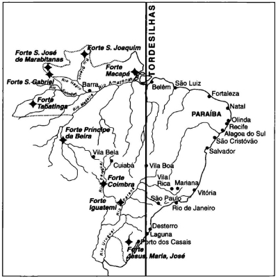

# Capítulo VI - Os Predecessores

## Tratado de Tordesilhas

Pág 55

Antes mesmo que o pensamento geopolítico adquirisse foros de conhecimento científico, através da teorização das observações rela­tivas à interação homem-meio físico, isto no final do século XIX, já havia, a respeito do Brasil, prognósticos prospectivos de pensadores es­clarecidos, dotados de visão política, que previram para o nosso País um destino de grandeza.

Nascidas da observação, as ciências sociais, entre as quais se in­clui a Política e seu ramo a Geopolítica, caracterizam-se por comportarem projeções prospectivas. Não se trata de futurologia, visão advinhatória, mas de aproximação porvindoura baseada em elementos racionais de
estatística, de história e de psicologia.

Observa o Embaixador **José Oswaldo Meira Penna**📌, no seu livro *Po­lítica Externa*, que os autores do Tratado de Tordesilhas (1494) já haviam traçado as grandes servidões da geopolítica brasileira. Passamos a pala­vra ao Embaixador **Meira Penna**:

"A linha de Tordesilhas, marco inicial, imposição geopolítica sobre a qual se arcará a história colonial do Brasil, determina a configuração de nossa política externa. Tordesilhas é este o primeiro, em ordem cronológica e em importância histórica, dos alicerces sobre os quais se assentará nossa vida internacional. Representa as relações com a Espanha, isto é, os domínios a oeste da Linha, os quais irão, mais tarde, constituir as repúblicas nossas vizinhas. Tordesilhas é o problema de fronteiras - problema sempre prioritário em toda ação diplomática e tacitamente colocado ao realizar-se o Descobrimento. Logo em seguida, quase que imediatamente após a colocação do marco cabralino, anuncia-se o segundo elemento fundamental dessa política: o problema da segurança da orla marítima."

Pág 57

Destacou o Embaixador Meira Penna, a presença já nos primórdios de século XVI, dos dois desafios vitais de nossa segurança externa: a proteção das fronteiras terrestres a oeste e a proteção da fronteira maríti­ma a leste. Dois problemas geopolíticos que exigiram da diplomacia co­lonial portuguesa, da diplomacia imperial e republicana preocupação constante, negociação permanente e, algumas vezes, luta armada.

# Gabriel Soares de Sousa - Futuro do Brasil

A mais antiga visão prospectiva sobre o **futuro do Brasil** data de 1587, do historiador português Gabriel Soares de Sousa, que no seu livro *In Tratado Descritivo do Brasil - Proemio*, relatando a visita que fez à nossa terra, assim sintetiza as suas impressões:

"Está capaz para se edificar nelle hum grande Imperio, o qual com pouca despeza destes reynos se fará tão soberano que sera hum dos Esta­dos do Mundo."

## José Bonifácio - Unidade Nacional, interiorização da capital.

Antes de nossa Independência, em 1821, **José Bonifácio**📌 produziu um documento precioso em termos de visão do Estado brasileiro do futu­ro. Tal documento, denominado **"Lembranças e Apontamentos"**, era desti­nado a orientar os deputados da Província de São Paulo, eleitos para re­presentar o Brasil na Corte de Lisboa, encarregada de elaborar a nova Constituição para o Império português.

"Lembranças e Apontamentos" revela como preocupação principal a preservação da unidade nacional, quando viesse a se dar a Independên­cia, cuja proximidade era evidente. Mas, ao lado de um programa comple­to de necessidades administrativas, versando sobre estrutura territorial, educação, saúde, questão indígena, política exterior, defesa do território, antevendo, já, o futuro Estado brasileiro, os "Apontamentos" revelam uma extraordinária visão geopolítica de nossa territorialidade. 

Pág 58

Propõe José Bonifácio que os nossos representantes na Corte de Lisboa defendam a tese da necessidade de interiorização da capital do País, pois possuidor de enorme massa continental, não poderia, no futuro, viver somente se alimentando nas praias, e sugere o local para o novo centro de poder político, assim se expressando, "que poderia, no futuro, ser em latitude pouco mais ou menos de 15º, em sítio sadio, ameno e fértil, e regado por algum rio navegável." Este local estaria nas proximidades de Paracatu, cerca de 200 quilômetros ao sul da atual Brasília.

As razões que José Bonifácio vê para a mudança da capital para o interior revelam sua notável visão geopolítica: invocam a imensidão geográ­fica e a característica continental-marítima, motivo de defesa (numa época em que o poder marítimo das potências imperialistas constituíam constante perigo às nações fracas) e necessidade de uma administração central que se transforme em pólo de atração das áreas periféricas. Diz textualmente:

"Com a mudança da capital para o interior, fica a Corte ou assento da Regência livre de qualquer assalto de surpresa externa, e se chama para as províncias centrais o excesso de população vadia das cidades marítimas e mercantis", e mais adiante, "desta Corte central dever-se-ão logo abrir estradas para as diversas províncias e portos de mar. para que se comuniquem e circulem com toda a prontidão as ordens do governo, e se favoreça por elas o comércio interno do vasto Império do Brasil".

## Alexandre de Gusmão - Legitimou Bandeirantes

Outra figura de visão geopolítica foi, sem dúvida, o brasileiro, santista, diplomata da Corte portuguesa de D. José I, **Alexandre de Gusmão**📌, <u>considerado o inspirador do Tratado de Madri de 1750</u>. Segundo o historiador português Jaime Cortezão, "Alexandre de Gusmão dava-nos de jure aquilo que bandeirantes já nos haviam dado de fato." O Tratado de Madri legitimou as conquistas dos bandeirantes paulistas e nortistas até então contestadas pelos espanhóis. Ali, ficaram já esboçadas as nossas atuais fronteiras políticas.

<u>Apresentados os três precursores intuitivos da geopolítica brasilei­ra: o historiador seiscentista Gabriel Soares de Sousa, o diplomata oitocentista Alexandre de Gusmão e o estadista novecentista José Bonifácio de Andrada e Silva</u>, vamos enfocar, agora, o pensamento geopolítico já fundamentado na metodologia científica das escolas ale­mã e francesa, lideradas, respetivamente, pelo talento acadêmico de Friedrich Ratzel e Vidal de La Biache.

## Everardo Backheuser - Percursor da Geopolítica no Brasil (Fronteiras Federais)

Pág 59

Os primeiros livros de Geopolítica ciência, Geopolítica teoria, surgi­ram no Brasil na década de 1930. Os autores, o Capitão do Exército Mario Travassos e o Professor acadêmico Everardo Backheuser, foram saudados pela intelectualidade brasileira nas figuras de Ronald de Carvalho, Alberto Torres, Oliveira Vianna, Roquete Pinto, Gilberto Freyre, Pandiá Calógeras.

O jovem Capitão Mario Travassos na década de 1930 escreveu dois livros: *Projeção Continental do Brasil(edição de 1931)* e *Introdução à Política de Comunicações Brasileiras*. Prefaciaram, o primeiro, Pandiá Calógeras, e o segundo, Gilberto Freyre. O primeiro destes livros já havia aparecido em 1930 sob o título de: Aspectos Geográficos Sul-Americanos. O segundo livro, de 1941, atualizou e complementou as idéias e sugestões contidas no Projeção, conforme declarou na sua apresentação o próprio autor.

O Projeção Continental, escreveu Ronald de Carvalho, foi a primei­ra obra de Geopolítica publicada no Brasil. Este livro lançou os fundamentos da Geopolítica brasileira para a primeira metade do século XX. Com clarividência e nitidez invejáveis, Mario Travassos traçou os grandes ru­mos de uma política nacional destinada a nos levar à posição de maior potência sul-americana.

Não se sabe o que mais admirar nessa obra, se clareza das análises ou a objetividade das soluções propostas.

## Capitão Mário Travassos - Triângulo Boliviano

Na sua análise geopolítica, Mario Travassos destaca os dois gran­des antagonismos geográficos de nosso subcontinente - do Atlântico e do Pacífico. Mostra a importância da cordilheira andina como divisor desses antagonismos. Aponta nesse grande divisor, que se estende da Venezuela à Patagônia, os pontos de rebaixamento. os chamados "nudos" (passagem na cordilheira ), onde a cordilheira oferece passagem mais fácil de uma vertente para a outra. Pesquisa nossa posição atlântica, por sua vez submetida a dois outros antagonismos geográficos - do Prata e do Amazonas. Salienta a força convergente do Prata carreando para Buenos Aires a influência sobre as bacias de seus formadores - o Uruguai, o Paraná e o Paraguai -. todos os três mergulhando fundo no território brasileiro.

Pág 60 

Realça, em termos de uma política continental, a importância do **triângulo geopolítico boliviano** - Santa Cruz de la Sierra-Cochabamba­ Sucre - como pólo de convergência das influências Atlântico-Pacífico. Santa Cruz na bacia amazônica, mas bem articulada com a região andina de Cochabamba e Sucre, Cochabamba andina mas também próxima à calha amazônica.

Finalmente, Sucre andina, próxima a um dos "nudos" e ligada à Cochabamba e à influência amazônica de Santa Cruz de la Sierra, que recebe a atração platina de Corumbá. Segundo Mario Travassos, o poder sul-americano que conseguir controlar esse triângulo-chave, região de convergência das três forças geográficas que o operam no subcontinente, dominará a política conti nentalista regional. Nessa região, encontram­ se e poder-se-ão dar-se as mãos ou partir para a disputa.

As soluções sugeridas por Travassos, visando à superação dos óbi­ces oferecidos pela geografia sul-americana, situam-se na realização de uma política de transportes que neutralize, a nosso favor, desequilíbrios potenciais oferecidos pelos antagonismos fisiográficos existentes. Suge­re que se implante ou se complete (quando for o caso) uma **rede ferroviá­ria** carreadora para os portos brasileiros do Atlântico-Santos, Paranaguá, São Francisco, Porto Alegre e Rio Grande -. as influências platinas sobre as regiões interiores brasileiras das bacias dos rios Paraná, Paraguai e Uruguai. Propõe a chegada de nossos trilhos a Santa Cruz de la Sierra e, daí, a Arica, articulando as grandes regiões platina (Atlântico) e andina (Pacífico), e a construção de ramais da Estrada de Ferro Noroeste do Brasil para a República do Paraguai.

Em termos de vertebração da massa continental sul-americana, sugere ampla conjugação das redes ferroviária, hidroviária e aérea, além de propor a criação de um sistema aéreo interligando todas as capitais dos países de nosso subcontinente austral, superando assim, temporariamente, as dificuldades de tráfego terrestre oferecidas pelos obstáculos geográficos. Anteve o desenvolvimento do trans­porte rodoviário para longas distâncias e sua futura i nserção no sistema múltiplo de articulação vial.

Pág 64 

Mario Travassos chegou a General-de-Divisão no Exército ativo, como Coronel participou da Força Expedicionária Brasileira (FEB) e foi reformado como marechal. Teve imensa influência no pensamento de sua geração. Suas análises e formulações geopolíticas dominaram a mente de intelectuais patriotas e dos oficiais formados pelas escolas de estado­ maior do Exército, Marinha e Aeronáutica até a década de 1950. Suas idéias coincidiram com os propósitos políticos de fortalecimento do Esta­do brasileiro oriundas dos revolucionários de 1930. Seu livro Projeção Continental foi amplamente discutido, aceito ou negado, mas sempre discutido em quase todos países sul-americanos, particularmente na Ar­gentina. Foi traduzido para o idioma espanhol.

As propostas geopolíticas sugeridas por Travassos, visando à arti­culação vial do território, foram, quase todas, incorporadas aos projetos de sucessivos governos. Graças à realização do sistema de transportes carreadores para os nossos portos dos interesses da imensa área interiorana brasileira, antes submetida à atração hidroviária da bacia plati­na ( Buenos Aires), consolidamos a nossa integração territorial e construí­mos nas nossas regiões Leste, Sudeste e Sul a mais importante base cultural e econômica da América Latina.

Começando a produzir nos últimos anos da década de 1920. O Pro­fessor Everardo Backheuser, autor de vários livros, colunista dos princi­pais jornais, articulista de revistas especializadas em geografia e histó­ria, é considerado o precursor dos estudos de geopolítica no nosso País. Backheuser foi o teórico da geopolítica brasileira, deu-lhe um método, sistematizou-a. Travassos aplicou-a com mestria no diagnóstico de nos­sas potencialidades. Ambos dominaram o campo durante trinta anos com valiosa e intensa produção intelectual.

Pág 65

Backheuser pregou suas idéias geopolíticas durante vários anos, principalmente pelas colunas do Jornal do Brasil e nas aulas da cadeira de geografia do Colégio Pedro II. Foi organizador (1948) e professor do Curso de Geopolítica na Pontifícia Universidade do Rio de Janeiro.

O pensamento de Backheuser expresso no seu excelente estudo sobre Política de Fronteiras, largamente difundido em artigos de jornais e revistas desde a década de 1930 e condensado no seu livro Geopolítica Geral do Brasil, teve grande influência no estabelecimento pelo governo de uma nova política de fronteiras e na criação dos territórios nas regiões lindeiras mais críticas.

Realmente, nos primeiros anos que se seguiram à Revolução de 1930, o espírito renovador, preponderante no governo, aproveitou-se das idéias difundidas por Backheuser e promoveu uma política de fortaleci­mento de nossas regiões limítrofes, sob a inspiração de que "a fronteira é a epiderme do organismo estatal, captadora das influências e pressões foraneas, e, como tal, região que deve ficar diretamente subordinada ao poder central, e não a autoridades regionais que manifestam menor sen­sibilidade para os seus problemas". Enfim, **prescreve que a política de fronteira não deve ser atribuição regional, mas federal.**

<u>Estas idéias difundidas por Backheuser foram decisivas para a criação dos nossos territórios federais do **Amapá, Roraima, Rondônia, Fernando de Noronha, Ponta Porã e Foz do Iguaçu**</u>. Cumprida a finalidade de povoamento e fortalecimento destes territórios, foram os três primeiros transformados em Estado e os outros extintos e reincorporados aos estados contíguos.

## Brigadeiro Lysias Rodrigues - aviação para integração

No período das décadas de 1940 e 1950, tivemos o aporte valioso dos estudos geopolíticos do Brigadeiro Lysias Rodrigues, condensados no livro *Geopolítica do Brasil (1947)*, prefaciado pelo Professor Backheuser. O autor destaca o importante papel presente e futuro da aviação para o desenvolvimento das áreas longínquas e despovoadas de nosso território, em particular das fronteiras terrestres. Preocupa-se com as nossas fronteiras do norte, analisa-as e aponta seus pontos críticos (punctum dolentis). Defende com entusiasmo uma política de interiorização, de mudança da Capital e de redivisão territorial. Preocupa-se, particularmente, com o futuro de nossas fronteiras com os estados europeus ocupantes das Guianas. **Pregando a interiorização escreve:**

Pág 66

"O deslocamento do homem brasileiro para o sertão é um problema de economia dirigida, dando-se a ele e a sua família o transporte até o local, fixando-se a gleba que lhe toca, fornecendo-lhe as ferramentas, as sementes e o financiamento para sua alimentação e instalação, até que possa dar-lhe compensações. É o que se faz com o imigrante. E o imigrante não é em nada superior ao homem brasileiro, balanceados qualidades e qualidades, defeitos e defeitos. Agir de outra forma é condenar à inutili­dade qualquer esforço."

**Conclui o Brigadeiro Lysias Rodrigues: "O Brasil tem potencialida­de e ambições para se engrandecer, deverá: dirigir seus passos de acor­do com as linhas que forem fixadas pela Geopolítica, porque só ela é capaz de apontar o caminho certo, só ela é que pode evitar ao Brasil surpresas dolorosas."**

O Brigadeiro encontrou um seguidor entusiasta de suas idéias no Professor paulista Paulo Henrique da Rocha Correia, ainda hoje militante nas hostes dos geopolíticos.

Sem ser um geopolítico teórico, mas um intelectual possuidor de pensamento intuitivo para a conjugação das realidades políticas e geo­gráficas do território. Cassiano Ricardo, na década de 1940, trouxe a sua contribuição através da portentosa obra Marcha para o Oeste. Grande pen­sador que foi, além de poeta dos melhores, seu livro extraordinário avivou a face continentalista de nosso destino, aspecto tão descurado por aque­les que, no dizer de Frei Vicente do Salvador, "contentaram-se em andar arranhando as terras ao longo do mar, como caranguejos".

Analisando este período da geopolítica brasileira, que engloba des­de as obras de Alberto Torres até as de Maria Travassos, aproximadamente meio século, começando na década de 1910 e terminando na de 1950, o historiador e "imortal" Luiz Vianna Filho, prefaciando o livro "A Geopolítica e as Projeções do Poder"; de nossa autoria. assim se expressou:

Pág 67

"Contudo, embora oriundos de origens que poderíamos ter como di­versas, a verdade é que Alberto Torres, Oliveira Vianna, Backheuser e Mario Travassos parecem corresponder a um reclamo, a um espírito da nacionali­dade que dir-se-ia desejosa de se encontrar com seus problemas, avaliá­-los, conhecê-los, e para eles procurar soluções que correspondessem efeti­vamente à decantada realidade nacional. Realidade muito mais real do que se imaginava, e cujo conhecimento era intensamente almejado pelas gerações jovens. Gerações ávidas por encontrar novos caminhos para o Brasil e que, a bem dizer, como que adivinhavam a necessidade de adquirirmos uma outra dimensão interna e externa. Internamente, não podíamos conti­nuar a ser apenas a pátria do Jeca Tatu, e externamente repugnava perma­necermos como simples e explorados exportadores de produtos primários."

## Golbery do Couto e Silva - Boas relações com os EUA.

Na década de 1950, desponta no horizonte geopolítico brasileiro a figura do então Tenente-Coronel Golbery do Couto e Silva. Ele proferiu inú­meras conferências em nossas escolas de Estado-Maior e na Escola Supe­rior de Guerra. Escreveu dezenas de artigos para revistas especializadas, como a Defesa Nacional e a do Instituto Histórico e Geográfico. Em 1976, condensou todos os seus escritos no livro que alcançou grande projeção, Geopolítica do Brasil, lançado pela Editora José Olympio.

Golbery direciona suas luzes sobre o projeto desenvolvimentista bra­sileiro, faz a radiografia do Brasil contemporâneo e sugere ações políticas.

Vamos reproduzir trechos principais dessa radiografia:

"Na verdade, o Brasil é bem um Império", vasto império compacto, de ampla frente marítima e dilatada fronteira continental eqüidependentes quase em torno do eixo de simetria Norte-Sul, que vai do Cabo Orange à Barra do Chuy.

Ocupa sem dúvida, aquela frente marítima, uma posição um tanto marginal no caprichoso contorno do oceano mundial em que o Atlântico Sul não é mais que um golfão ainda excêntrico.

Pág 69 

Estende-se aquela fronteira terrestre, em grande parte, através do deserto que a Hiléia domina como vasto cinturão protetor.

Essas condições favoráveis de início é que asseguram o indispen­sável grau de imunidade a ações de conquista, mantidas em potência ou duração, provindas do exterior. É, de fato, a própria insularidade em pro­porções continentais."

A este resumo do enfoque global do território, em face inclusive das pressões externas, segue-se a radiografia interna traduzida no levan­tamento das regiões geopolíticas e sua dinâmica.

Destaca o autor:

uma área geopolítica de reserva geral ou de manobra. São Pau­lo, Rio de Janeiro, Espírito Santo, Minas Gerais e o Sul de Goiás com o Distrito Federal;

uma área geopolítica da ala Norte, abarcando os estados do Nordeste, desde a Bahia até o Maranhão;

uma área geopolítica da ala Sul. Paraná, Santa Catarina e Rio Grande do Sul;

uma área geopolítica do Oeste, reajustada aos contornos de Mato Grosso e mais o Território de Rondônia;

finalmente, uma área geopolítica da Amazônia, compreenden­do os estados do Amazonas, Pará, Acre e os territórios do Amapá, Roraima e Rondônia.

Durante seus primeiros 15 anos, a Escola Superior de Guerra (ESG) formulou sua doutrina de Segurança Nacional e pesquisou profundamen­te no campo do desenvolvimento. Formou elites civis e militares aptas a pensarem no Brasil com objetividade, como um todo, e se exercitarem na formulação de um método visando à aplicação do poder nacional para a segurança, a se aprofundarem nos estudos seletivos para o nosso desen­volvimento. Quando veio a Revolução de 1964, a doutrina da Escola Supe­rior de Guerra já estava formulada e exercitada em termos laboratoriais ou escolares. No período revolucionário. os presidentes da República e seus principais assessores, militares e civis, estimularam a formulação dessa doutrina, pois, na sua maioria, haviam pertencido aos quadros da ESG. Exercitaram, na prática governamental, a aplicação da doutrina já formulada no casarão do Forte de São João.

Pág 70

De todos, indubitavelmente, o mais lúcido expositor desta doutri­na foi o próprio Presidente Castello Branco. São essas as suas palavras pronunciadas na aula inaugural do ano letivo de 1967 na Escola Superior de Guerra:

"A Escola que hoje está entregue a vossa inteligência e conheci­mento não se imobilizou, sempre se atualizou, e é, no meio cultural do Brasil, um exemplo de antecipação de idéias. O tema escolhido - Segu­rança e Desenvolvimento - é o assunto dominante no vosso programa doutrinário, nos vossos estudos e hoje já integrado, em essência, na nova Constituição brasileira e em leis modernas.

Procurarei desdobrá-lo segundo os seus elementos constitutivo. A primeira parte a fixar é a dilatação do conceito de Segurança Nacional, bastante diferenciado, hoje, do conceito mais restrito de defesa nacional. A diferença é dupla. Conceito tradicional de defesa nacional coloca mais ênfase sobre os aspectos militares de segurança e corre­latamente aos problemas de agressão externa. A noção de Segurança Nacional é mais abrangente. Compreende, por assim dizer, a defesa glo­bal das instituições, incorporando por isso aspectos psicológicos, a pre­servação do desenvolvimento e da estabilidade política interna, além disto, o conceito de segurança, muito mais explicitamente do que o de defesa, toma em linha de conta a agressão interna, corporificada na infil­tração e subversão ideológica, até mesmo nos movimentos de guerrilha, formas hoje mais prováveis de conflito do que a agressão externa.

Desenvolvimento e segurança por sua vez são ligados por uma re­lação de mútua causalidade. De um lado, a verdadeira segurança pressu­põe um processo de desenvolvimento, quer econômico, quer social. Eco­nômico, porque o poder militar está também essencialmente condiciona­do à base industrial e tecnológica do País. Social, porque mesmo um desenvolvimento econômico satisfatório, se acompanhado de excessiva concentração de renda e crescente desnível social, gera tensões e lutas que impedem a boa prática das instituições e acabam comprometendo o próprio desenvolvimento econômico e a segurança do País.

Pág 71

De outro lado, o desenvolvimento econômico e social pressupõe um mínimo de segu­rança e estabilidade das instituições. E não só das instituições políticas, que condicionam o nível e a eficiência dos investimentos do Estado, mas também das instituições econômicas e jurídicas, que, garantindo a esta­bilidade dos contratos e o direito de propriedade, condicionam, de seu lado, o nível de eficácia dos investimentos privados.

A doutrina de segurança nacional, assim como o conceito de estra­tégia, não constitui um corpo rígido de princípio, visto comportar influên­cias geográficas,ideológicas, tecnológicas e econômicas.

A influência doutrinária pode ser exemplificada pela expansão territorial, que elevou a construção dos grandes impérios que se julgaram possuídos de missão civilizadora; pelo expansionismo ideológico carac­terístico dos sistemas marxistas; ou pelo isolacionismo, conforme ocor­reu em certas fases da história americana.

No caso brasileiro, a nossa longa tradição pacifista nos leva a uma doutrina essencialmente defensiva. A opção que realmente se apresenta é entre um conceito de segurança eminentemente nacional, o que seria algo irreal no mundo moderno, e esquemas de defesa associativa em que possamos pensar em termos de segurança continental."

## Therezinha de Castro - Antártica

Na década de 1970, aparece nos estudos da geopolítica brasilei­ra **Therezinha de Castro**, professora de História e Geografia do Colégio D. Pedro II. 

Logo nos seus primeiros escritos na área da Geopolítica, revela-se uma incansável pesquisadora e uma inteligência criativa. Deixou inúmeros livros, entre os quais, na área específica da Geopolítica, destacam-se: "O Brasil da Amazônia ao Prata", "África - Geohistória", "Geopolítica e Trata­dos Internacionais", "Rumo à Antártica", "Nossa América - Geopolítica Com­parada", "Geopolítica - Principíos, Meios e Fins". Sua presença foi contínua nestes últimos trinta anos, com artigos sobre temas geopolíticos em nossos jornais e revistas. Conferencista entusiasta e dotada de grande poder de comunicação, ocupou com freqüência o podium dos institutos de ensino superior das Forças Armadas, tais como: da ESG, a cujo qua­dro de professores pertenceu e das escolas de estado-maior e de altos estudos políticos e estratégicos do Exército, Marinha e Aeronáutica. Era convidada a pronunciar conferências sobre temas geopolíticos na Ar­gentina, Uruguai, Chile e Portugal. Teve vários de seus livros traduzidos para o idioma espanhol.

Pág 73

De todos os temas geopolíticos que Therezinha de Castro tratava, destacavam-se: geoestratégia do Atlântico Sul, importância estratégica da ocupação da Antártica, integração do Cone Sul, Bacia do Caribe, problemas amazônicos. Foi uma das poucas vozes pioneiras, e entre elas a mais insistente, sobre a necessidade de o Brasil instalar uma base na Antártica, tendo em vista a prospectiva de sua importância estratégica num futuro próximo, em função de sua posição de defrontação com todo o Hemisfério Sul do planeta e por suas imensas reservas minerais e de água. Therezinha de Castro reivindicava que o Brasil participasse territorialmente da comunidade antártica, defendendo o seu direito pelo prin­cípio de defrontação, que já fora aplicado no caso dos direitos territoriais no Ártico. Viu a sua pregação realizar-se quando, em 1983, o Brasil instalou a Estação Comandante Ferraz, comandada pela Marinha, na ilha Rei George, do arquipélago Shetlands.

## General Meira Mattos - Calha Norte (Amazônia)

O autor deste livro, quando ainda Tenente Meira Mattos, no final da década de 1930, teve oportunidade de ler os livros de Mario Travassos. Empolgou-se por sua visão geopolítica do Brasil.

Tivemos o nosso patriotismo eletrizado pela leitura de Travassos sobre a geografia sul-americana, os antagonismos em confronto. a posi­ção do Brasil nesse contexto geográfico, as sugestões sobre uma política de comunicações e de transportes que nos trouxesse para a situação inequívoca de principal poder continental. Passamos a estudar a geopolítica. Lemos um livro muito falado na época, El Factor Ceográfico en la Politica Sul Americana, de autoria do Professor espanhol Carlos Badia Malagrida. Este livro era muito apreciado pelos argentinos porque, entre outras con­clusões, considerava a Bacia Platina (cuja maior extensão territorial encontra-se no interior do nosso País), tiranicamente subordinada, política e economicamente, a atração hidroviária de Buenos Aires, por sua posição privilegiada na foz do Prata.

Pág 75

Travassos nos seus livros Projeção Continental do Brasil e Introdu­ção à Política de Comunicações do Brasil propõe um sistema vial terrestre que atraísse para os nossos portos atlânticos do Sul o interesse das regiões platinas brasileiras, assim propondo uma correção geopolítica que neutra­lizasse a força carreadora sobre o nosso território da rede fluvial platina. Os hoje chamados "corredores de exportação" não são outra coisa senão parte do projeto geopolítico de Travassos, apresentado em 1931. 

Nossas leituras do tenente, capitão e major de então não ficaram em Malagrida. Lemos os autores Backheuser e Lysias Rodrigues. entre os brasileiros, e Ratzel, Kjellen , Vidal de La Biache, Haushofer e vários ou­tros mais modernos, entre os estrangeiros. Em 1959, publicamos o nosso primeiro trabalho sobre geopolítica, um fascículo de 72 páginas que de­nominamos Projeção Mundial do Brasil, numa sugestão de que o Brasil já podia almejar uma escalada de poder, trinta anos depois do Projeção Continental de Travassos. Na apresentação deste livro escrevemos:

"O capitão de 1931 sonhou com um Brasil potência continental. Nós lhe pedimos licença para sonhar agora com um Brasil potência mundial."

Neste nosso primeiro livro de geopolítica, analisamos os conceitos de poder mundial expressos por três respeitados pensadores da ciência política: o sueco Rudolf Kjellen, o inglês Arnold Toynbee e o francês Tibor Mende. Analisando o espaço e posição geográfica do Brasil, suas rique­zas potenciais, a coesão de seu povo e sua história, além da opinião de vários autores estrangeiros, concluímos que tínhamos condições de, no futuro, virmos nos alinhar entre as grandes potências do mundo.

Nosso 2º livro de geopolítica só veio 15 anos depois, "Brasil, Geopolítica e Destino", 1975, prefaciado pelo historiador e cientista Arthur Cezar Ferreira Reis. e, dois anos depois, em 1977. lançamos o "A Geopolítica e as Projeções do Poder", que teve o prefácio do historiador e "imortal" Luiz Vianna Filho.

Pág 77

Estes dois livros foram concebidos e publicados sob a influência do espírito de otimismo, de fé, nos destinos do Brasil, que dominou o nosso povo na década de 1970. Viajava-se pelo Pais, de norte a sul, de leste a oeste, e só se ouvia as expressões "Brasil Grande" e "Pra Frente Brasil". O nosso crescimento econômico beirava os 10% ao ano. Analistas e impren­sa estrangeiros nos apontavam como uma das próximas potências. O Professor Ray Cline. Presidente do Centro de Estudos Estratégicos na Univer­sidade Georgetown, Washington, nas suas avaliações sobre potências mundiais, estimou que poderíamos vir a ocupar o 6º lugar, depois dos Estados Unidos, União Soviética, Alemanha, França e China. O Secretário de Estado da maior potência do mundo, Henry Kissinger, elegeu-nos como aliado preferencial dos Estados Unidos.

Nós, que em 1959, no nosso primeiro livro, havíamos viabilizado o nosso destino de potência, vimos reforçada a nossa avaliação prospectiva. Com este espírito escrevemos "Brasil, Geopolítica e Destino" e "A Geopolítica e as Projeções do Poder".

No primeiro. examinamos os desafios do espaço brasileiro ao nosso desenvolvimento, enriquecimento e progresso social. Analisamos as carac­terísticas do nosso povo. Balanceamos as nossas estratégias de segurança e defesa. Tivemos sempre presentes, como instrumentos de avaliação es­tratégica, a teoria do historiador Toynbee sobre "Desafio e Resposta" e os fatores de poder político da fórmula de Ray Cline. Eis esta fórmula:

Pp = (C+E+M) X (S+W) 
Pp = poder perceptível
C = massa crítica (população + território)
E = capacidade econômica e tecnológica
M - capacidade militar
S - estratégia (projeto nacional)
W - bondade nacional

Pág 78

Estes instrumentos de análise e prospecção, aplicados à realidade nacional, permitiram-nos julgar que havíamos já chegado a uma "platafor­ma de lançamento para alcançar o nível de potência política". Impunha-se aos governos futuros assegurar o andamento rápido do Projeto de Desen­volvimento Nacional, iniciado pelo Presidente Castello Branco, seguido pelo Presidente Costa e Silva e acelerado e fortalecido pelo Presidente Emílio Médici. O Desenvolvimento Nacional exigia, essencialmente, uma política de interiorização, de valorização da enorme massa continental, particularmente a Amazônia e o Centro Oeste, carentes de uma infra-estru­tura de transportes, comunicações e povoamento. A necessidade de garan­tir a Segurança Interna e Defesa Externa devia ser considerada nos projetos de Desenvolvimento. Consideramos que, prosseguindo no Projeto de De­senvolvimento, poderíamos transpor os umbrais do ano 2000 alinhados entre as maiores potências do planeta.

Não chegamos lá. A crise mundial provocada pela criação da OPEP, iniciada em 1973, aumentando substancialmente o preço do petróleo, nosso
principal produto de importação, desequilibrou nossa economia e desritmou o Plano de Desenvolvimento. Mas, não devemos ter errado muito nos alvos que previmos para a entrada do século. Erramos no tempo. Pelo menos é esta a opinião do pesquisador e analista Roberto Pereira da Silva, em artigo publi­cado na revista especializada Parcerias Estratégicas, dezembro de 1996, edi­tada pelo Centro de Estudos Estratégicos, da Secretaria de Assuntos Estraté­gicos. Conclui o articulista, depois de rever os estudos e propostas contidos no livro Brasil, Geopolítica e Destino, passados mais de vinte anos:

"O General Meira Mattos, como estudioso do Brasil à luz da Geopo­lítica e da Estratégia, foi capaz de elaborar, na década de 1970, um cenário para o ano 2000 muito próximo do que hoje se vislumbra para 2020 e, praticamente, para uma mesma extensão de tempo."

No livro "A Geopolítica e as Projeções do Poder"; pensado e editado nessa mesma época de entusiasmo desenvolvimentista da Nação, complementa e fortalece a tese de nossas possibilidades políticas e eco­nômicas de alcançar o nível de potência mundial.

Pág 79

Particularizamos o estudo do poder, suas origens históricas, nature­za e manifestações, características do Poder Nacional. Em seguida. reava­liamos a realidade política brasileira, os estímulos marítimos e continen­tais de nosso espaço geográfico, os estímulos recebidos de fora. Tenta­mos uma análise comparada da nossa defasagem em relação ao poder do Estado norte-americano e, finalmente, imaginamos uma perspectiva da ação governamental para o último quartel do século. Nessa perspectiva visualizamos a aceleração do Projeto de Desenvolvimento Econômico e Social dentro dos padrões de um Estado democrático moderno, destacan­do neste Plano a necessidade maior de progresso nos setores de transpor­tes, educação, ciência e tecnologia, energia, inclusive a nuclear e a cibernetização. Quanto à Segurança, opinamos que, assegurada a paz in­terna, devemos dar mais atenção aos problemas de segurança externa, uma vez que a projeção de nosso poder resultará, fatalmente, no aumento de nossas responsabilidades e encargos de defesa.

Em 1980, lançamos o livro "Uma Geopolítica Pan-Amazônica", prefa­ciado pelo conceituado escritor Leandro Tocantins, autor entre outras obras de "O Rio Comanda a Vida" e "Formação Histórica do Acre". Animou-nos, na época, a assinatura em Manaus (1978) do Tratado Pan-Amazônico, fir­mado pelos oito países condôminos da grande bacia de sete milhões de km2 (a Bacia do Mississipi banha 3,2 milhões de km2 e a do Rio Nilo, 2,8 milhões de km2) .

O que nos entusiasmou com a Assinatura do Tratado Pan-Amazôni­co, foi verificar que, pela primeira vez, os países amazônicos abandona­ vam suas prevenções e pequenas rivalidades e se uniam num projeto regional comum, indispensável para assegurar a elevação do padrão de vida dos povos ribeirinhos e o progresso econômico da área banhada pela imensa calha hidrográfica. Propusemo-nos a fazer a avaliação geopolítica dessa região coberta por uma floresta tropical úmida (que Humboldt cha­mou de Hiléia) regada por vasta trama hidrográfica,detentora da maior reserva de água doce do planeta e, ao mesmo tempo, uma das mais des­povoadas e atrasadas. Estávamos convencidos de que somente uma estratégia comum, sustentada pela vontade firme dos condôminos, poderia levar ao êxito a iniciativa de desenvolver a região.

Uma estratégia regional, visando a proteger a soberania dos países amazôncos sobre esta área tão ambicionada internacionalmente, asse­gurar a preservação equilibrada de sua natureza e promover o seu progres­so social e econômico, exigiria a conjunção das vontades e das ações dos países signatários obedientes a um bem concebido plano estratégico.

Propusemos alguns elementos para este amplo plano estratégico multinacional, visando a acelerar o desenvolvimento socioeconômico da região. Eis um resumo de nossa proposta:

- selecionar a área mais crítica da região, por ser mais isolada a Ama­zônia Ocidental, como alvo prioritário do plano de desenvolvimento;

- realizar a abordagem desta área, Amazônia Ocidental, partindo de três frentes - a tradicional, saindo da foz e subindo o rio, a do planalto central brasileiro e, finalmente, descendo dos Andes e do sistema guiano; cada país participante de cada frente se empenharia em realizar programas de desenvolvimento naci­onais que arrastassem a fronteira econômica em direção a Amazônia Ocidental;

- estimular nas áreas de conexão fronteiriça - Clevelândia (Guia­ria Francesa ), Tiriós (Suriname), Normandia (República da Guiana),  BV-8 (Venezuela ), Auaris, Cucuf e Leticia (Colômbia), Tabatinga e Assis Brasil (Peru ), Brasiléia, Porto Velho e Guajará Mirim (Bolívia)-, a criação, em torno delas, de um pólo binacio­nal de desenvolvimento social e prosperidade econômica, to­mando como modelo os exemplos de convivência internacional profícua alcançados na fronteira sul (Livramento/Rivera e Uruguaiana/Los Libres);

- estimular em toda a Amazônia brasileira a execução de proje­tos e programas de transportes, de navegação, de construção de aeroportos. de educação, saúde, saneamento básico, telecomu­nicações, agricultura, pecuária e indústria.

Apesar da extensão, complexidade e do vulto de investimento que exigiram os projetos amazônicos dos governos Castello Branco, Costa e Silva e Médici, a administração pública destes três presidentes da Repú­blica conseguiu dar um grande impulso à tarefa de desenvolver a imensa bacia do nosso "rio-mar". Nesse período, nossos vizinhos muito pouco fizeram para desenvolver a sua região amazônica excetuando-se a Venezuela, que construiu a rodovia Caracas-Santa Helena na fronteira, em frente a BV-8, ligado a Boa Vista (Roraima), e impulsionou o desenvolvi­mento do Vale do Rio Orinoco, que pela proxi midade trouxe influência indireta à melhoria de sua linde amazônica.

Em nosso livro Geopolítica e Trópicos (1984), prefaciado pelo emi­nente sociólogo Gilberto Freyre, focalizamos, na 1ª parte, as teorias de geógrafos, sociólogos, cientistas políticos que proclamam a improprieda­ de das regiões tropicais para abrigar um sociedade adiantada. Em geral, alegam duas razões: serem habitadas por raças inferiores e possuírem condições climáticas desfavoráveis que desestimulam a criação da cultu­ra e da tecnologia. Enfim, razões etnocentristas e deterministas, que o historiador Arnold Toynbee, no seu estudo das 21 civilizações que povoa­ram a Terra nestes últimos seis milênios, contesta veementemente. Para Toynbee, não há raça superior, não há clima completamente hostil, o que há é a dialética milenar entre o homem e o meio físico - o desafio e a resposta. Assim, Toynbee sintetiza sua teoria do desafio e da resposta:

"A geografia condiciona, dificulta, sugere, inspira, estimula, enfim, apresenta o seu desafio, cabe ao homem responder a esses desafios. Ou os responde e os supera, ou não os responde e é derrotado."

Terra e Homem, conjugados numa equação de vontade e compe­tência, de educação, ambientação e de uma tecnologia adequada ao meio, são os instrumentos de uma síntese que a História consagra como crisáli­da de sociedades adiantadas e de civilizações.

Na 21 parte da obra, analisamos o desafio do trópico brasileiro. Amazônia e região do cerrado. Destacamos os feitos do homem brasílico no decorrer de quase dois séculos e seus esforços inauditos para preser­var o nosso patrimônio amazônico. criando dois grandes centros irradia­dores de progresso e mantendo incólumes suas fronteiras. Exaltamos a atuação sacrificada, competente e operosa das Forças Armadas, presen­tes na região desde sua incorporação territorial ao Brasil.

Mostramos que este homem brasílico já estava prestes a vencer o desafio do cerrado tropical, transformando-o em terra produtiva. Termina­mos manifestando a nossa fé de que o homem brasílico mais bem apare­lhado em educação, saúde e tecnologia estará apto a vencer o gigantesco desafio dos trópicos.

No livro A Geopolítica e a Teoria de Fronteiras (1990), prefaciado pelo ilustre General Lyra Tavares, voltamos à proposta que havíamos lan­çado em 1975 no livro "Brasil, Geopolítica e Destino", alusiva à importância em fortalecer nossas fronteiras. principalmente as vazias lindes amazônicas. já agora num contexto visando ao interesse regional comum aos paí­ses vizinhos. Voltamos à tese da necessidade de estimular o desenvolvimento das "áreas interiores de intercâmbio fronteiriço". Animava-nos a criação, pelo governo, do Projeto Calha Norte (1985), cuja implantação vinha a corresponder as idéias que vínhamos defendendo há dez anos.

Com estes seis livros, cujas idéias espraiamos, também, através de inúmeras conferências, palestras, artigos em revistas especializadas e jor­nais, marcamos nosso pensamento geopolítico durante os últimos 25 anos.

Seríamos injustos se recordando os setenta anos do pensamento, geopolítico brasileiro, olvidássemos do nome de autores de reconhecido valor cultural que, sem serem especializados em estudos geopolíticos, re­velaram em suas produções intelectuais admirável visão dos problemas políticos brasileiros relacionados com a nossa geografia. Citaríamos aqui, entre os principais, os nomes de Delgado de Carvalho, Arthur Cezar Ferreira Reis, Leandro Tocantins, Samuel Benchimol, Jarbas Passarinho, Gilberto Freyre, Lavanére Wanderley, Alvaro Alberto, Amerino Raposo, Mario Cesar Flores, José Osvaldo de Meira Penna, Octávio Tosta, Shiguenoli Miyamoto.

