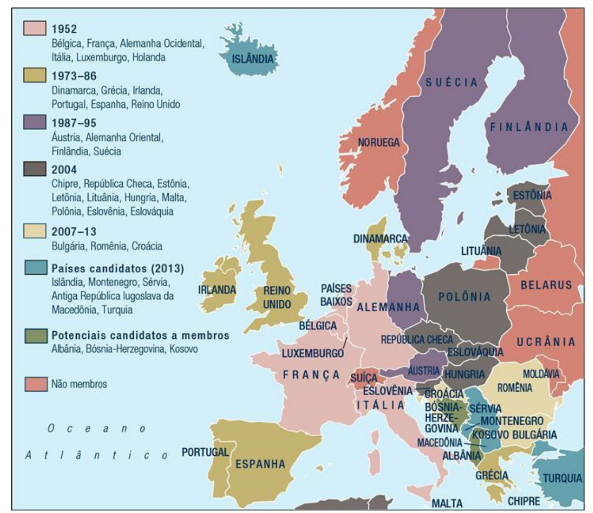

# Capítulo 7 - Organizações intergovernamentais, direito internacional e organizações não governamentais

■ Por que são formadas organizações intergovernamentais?
■ Qual é a contribuição de organizações intergovernamentais como as Nações Unidas à paz e à segurança internacionais?
■ Como a União Europeia mudou ao longo do tempo?
■ Qual é o papel do direito internacional nas relações internacionais?
■ Quais são os papéis desempenhados pelas organizações não governamentais?
■ Que perspectivas rivais os teóricos de relações internacionais trazem para sua análise das organizações intergovernamentais, organizações não governamentais e direito internacional?

Estados e indivíduos não são os únicos atores na política internacional. As **organizações intergovernamentais (OIGs)** também desempenham um papel no sistema internacional. Neste capítulo, descrevemos sua participação nas relações internacionais. Mostramos como o direito internacional difere daquele praticado dentro da esfera nacional e como tanto Estados quanto organizações intergovernamentais nele se inserem. Compreender o quadro jurídico internacional é fundamental para entender a perspectiva liberal da política internacional. Em seguida, examinamos as organizações não governamentais (ONGs), relativamente novas nesse cenário, mas cada vez mais poderosas. Por fim, exploramos as respostas realista, radical e construtivista.

## Organizações intergovernamentais

### A criação das OIGs

Por que os Estados optam por organizar-se coletivamente? A resposta é dada pelo liberalismo: no âmbito das instituições e regras, a cooperação é possível. As organizações internacionais são as arenas onde os Estados interagem e cooperam na resolução de problemas comuns. Durante os anos 1970, os institucionalistas neoliberais, como descrevemos nos Capítulos 3 e 4, retomaram o estudo das organizações internacionais, argumentando que “por mais que (…) a anarquia restrinja a vontade dos Estados de cooperar, eles podem, no entanto, trabalhar juntos — especialmente com o auxílio das instituições internacionais”.

Os institucionalistas neoliberais reconhecem que a interação contínua entre os Estados fornece a motivação para que estes criem organizações internacionais — as quais, por sua vez, moderam o comportamento dos Estados, fornecem um quadro de referências para as interações, estabelecem mecanismos de redução de fraudes, monitorando as demais e punindo a falta de cooperação, propiciando transparência às iniciativas estatais. As organizações são os pontos focais para a coordenação e a maior credibilidade dos compromissos assumidos pelos Estados, especificando expectativas e estabelecendo reputações com relação ao cumprimento de acordos e determinações.

### Em foco - Funcionalismo 
♦ A guerra é causada por privações econômicas. 
♦ A desigualdade econômica não pode ser resolvida em um sistema de Estados independentes.
♦ Novas unidades funcionais devem ser criadas para resolver problemas econômicos específicos.
♦ Pessoas e grupos desenvolverão hábitos de cooperação que migrarão da cooperação econômica para a cooperação política.
♦ No longo prazo, a desigualdade econômica diminuirá e a guerra será eliminada.

As organizações internacionais são particularmente úteis para a solução de dois tipos de problemas. Um deles decorre da necessidade de cooperar em questões de ordem técnica, muitas vezes não políticas, onde os Estados não são as unidades apropriadas para solucioná-las. Como o estudioso David Mitrany escreve em A Working Peace System, cada unidade (seja um Estado, sejam atores subnacionais) precisa “reunir esses interesses que são comuns, onde são comuns, e na medida em que são comuns”.2 Essa abordagem funcional defende a construção e expansão dos hábitos de cooperação fomentados por grupos de peritos técnicos, fora dos canais formais do Estado — o que explica por que a cooperação internacional começou em áreas técnicas específicas como saúde e comunicação, ainda durante o século XIX. A expectativa, de acordo com o pensamento funcionalista, era que a resolução de problemas nessas áreas técnicas (por exemplo, a contenção de epidemias, a viabilização de serviços internacionais de correios e telégrafos) acabaria transbordando e se convertendo em cooperação em assuntos políticos e militares, levando ao surgimento de novas organizações internacionais.

As organizações internacionais também se constituem em torno de bens coletivos — são os problemas do segundo tipo. O biólogo Garrett Hardin, em The Tragedy of the Commons, conta a história de um grupo de pastores que compartilham uma área de pasto comum. Cada um deles considera racional, do ponto de vista econômico, aumentar o tamanho de seu próprio rebanho, o que lhe permitirá vender mais no mercado. Entretanto, se todos os pastores adotassem tal comportamento – racional, se considerado individualmente –, o grupo perderia: um número excessivamente grande de animais pastaria no mesmo terreno e sua qualidade se deterioraria, levando a um resultado pior para todos. Quando cada qual tenta maximizar racionalmente seu próprio ganho, a coletividade é prejudicada e, no fim das contas, todos os indivíduos saem perdendo.

O que Hardin descreve — a área de pasto comum — é um bem coletivo. Essa área está disponível para todos os membros do grupo, independentemente da contribuição individual. A utilização de bens comuns envolve atividades e escolhas interdependentes. Decisões tomadas por um Estado provocam efeitos em outros Estados, isto é, os Estados podem sofrer consequências negativas inesperadas como resultado de iniciativas alheias. No contexto internacional, a decisão dos países ricos de dar continuidade à produção e venda de clorofluorcarbonos (CFC) afeta todos os demais em virtude da destruição da camada de ozônio a longo prazo. Quando se trata de bens coletivos, os mecanismos de mercado degeneram, e fazem-se necessárias outras formas de gerenciamento.

### Em foco - Bens coletivos 
♦ Os bens coletivos estão disponíveis a todos os membros de um grupo, independentemente das contribuições individuais.
♦ Algumas atividades dos Estados envolvem o fornecimento de bens coletivos.
♦ Os grupos precisam elaborar estratégias para superar problemas relacionados com os bens coletivos, causados pelas consequências negativas das ações de outros — a “tragédia dos comuns”.
♦ Entre essas estratégias estão o uso de coerção, a mudança de preferências por meio do oferecimento de incentivos e a modificação do tamanho do grupo.

Hardin propôs diversas soluções possíveis para a tragédia dos comuns. A primeira seria fazer uso de coerção: obrigar nações ou povos a controlar os bens coletivos. Como exemplo, os Estados poderiam obrigar sua população a limitar o número de filhos, de modo a evitar uma explosão populacional capaz de afetar o meio ambiente, devido à drenagem de um grande volume de recursos naturais escassos. A segunda seria reestruturar as preferências dos Estados por meio de recompensas e punições. Oferecer incentivos positivos para que os Estados se abstenham de participar da destruição de bens comuns; taxar ou ameaçar taxar os que se recusarem a cooperar, por exemplo tornando mais barato para um poluidor tratar os poluentes do que descartá-los sem tratamento. A terceira seria modificar o tamanho do grupo. Grupos menores pressionam seus membros de maneira mais eficaz, visto que as violações dos comuns ficam mais fáceis de detectar. A política populacional da China — de apenas um filho por casal — é administrada em âmbito local, por indivíduos que residem na mesma rua ou no mesmo prédio de apartamentos, ou trabalham no mesmo local. O monitoramento cerrado desses indivíduos, aliada à forte pressão social, tem mais chances de gerar obediência à política do filho único. Essas alternativas também podem ser concretizadas por meio de organizações internacionais. Para muitos, elas são a melhor maneira de resolver os problemas relacionados com os bens comuns — o mar, o espaço, o meio ambiente. No entanto, nem todos os problemas internacionais são relacionados com os bens coletivos.

### O papel das OIGs

Organizações intergovernamentais como as Nações Unidas, o Banco Mundial e a Organização Internacional da Aviação Civil podem desempenhar papéis cruciais em cada nível de análise.4 No sistema internacional, as OIGs contribuem para os hábitos de cooperação; por meio dessas organizações, os Estados podem se socializar em relação a interações regulares — desdobramento defendido pelos funcionalistas. Essas interações regulares ocorrem entre Estados nas Nações Unidas. Certas iniciativas de OIGs, como o programa de monitoramento nuclear da Agência Internacional de Energia Atômica, estabelecem processos regulares de coleta de informações, análise e vigilância que são particularmente relevantes para a teoria dos bens comuns. Algumas OIGs, como a Organização Mundial do Comércio (OMC), desenvolvem procedimentos para estabelecer regras, decidir disputas e punir quem desobedecer as normas. Outras OIGs conduzem atividades operacionais que ajudam a resolver importantes e substantivos problemas internacionais. Algumas também desempenham papéis centrais em negociações internacionais, facilitando a formação de redes transgovernamentais e transnacionais compostas por atores subnacionais e não governamentais. Além disso, essas organizações podem ser o lugar onde são negociadas mudanças consideráveis na distribuição internacional de poder.

As OIGs, juntamente com os Estados, com frequência encabeçam a criação e a manutenção de regras e princípios internacionais, com base em seus interesses comuns. Estabelecem expectativas acerca do comportamento de outros Estados. Tais regras e princípios ficaram conhecidos, de modo geral, como regimes internacionais. Os estatutos das OIGs incorporam as normas, regras e processos de tomada de decisões dos regimes. Ao reunir os membros do regime, as OIGs ajudam a reduzir o incentivo a trapaças e reforçam o valor de uma boa reputação. Os princípios do regime internacional de direitos humanos, por exemplo, são articulados em vários tratados internacionais, entre eles a Declaração Universal dos Direitos Humanos. Algumas OIGs, como as Nações Unidas (por meio de seu Alto Comissariado para Direitos Humanos) e a União Europeia, institucionalizam esses princípios sob a forma de normas e regras específicas e estabelecem processos elaborados para monitorar o comportamento dos Estados na questão dos direitos humanos e sua obediência aos princípios humanitários. Essas mesmas organizações oferecem oportunidades para que os diferentes membros do regime — Estados, outras OIGs, ONGs e indivíduos — se reúnam e avaliem suas iniciativas.

Para os Estados, as OIGs ampliam as possibilidades de sua política externa e reforçam as restrições sob as quais os Estados conduzem e, em especial, implementam a política externa. Os Estados filiam-se às OIGs para usá-las como instrumentos de política externa. As OIGs podem legitimar pontos de vista e políticas de um Estado — por isso os Estados Unidos buscaram o apoio da Organização dos Estados Americanos durante a crise dos mísseis em Cuba, em 1962. As OIGs enriquecem o repertório de informações disponíveis sobre outros Estados, aumentando, assim, a previsibilidade do processo de elaboração de políticas. Pequenos Estados, em especial, usam o sistema da ONU para coletar informações sobre as ações dos demais. Algumas OIGs, como o Alto Comissariado da ONU para Refugiados e o Unicef, podem ser usadas na realização de atividades específicas — funções que são compatíveis com as políticas dos Estados, ou as ampliam.

Porém, as OIGs também restringem os Estados-membros na medida em que estabelecem programas internacionais e, em consequência, também nacionais, obrigando os governos a tomar decisões; em que incentivam os Estados a desenvolver um processo especializado de tomada de decisões e implementam processos para facilitar e coordenar a participação na OIG; e em que criam princípios, normas e regras de comportamento com os quais os Estados devem alinhar suas políticas se quiserem se beneficiar de sua participação na organização. Todos os Estados participantes, grandes ou pequenos, estão sujeitos a essas restrições. Por exemplo, houve ocasiões em que os membros da Assembleia Geral da ONU definiram as prioridades internacionais contrariando os interesses dos Estados Unidos, obrigando esse país a adotar uma posição que, de outra forma, não teria adotado.

As OIGs também afetam os indivíduos na medida em que oferecem oportunidades de liderança. Ao trabalhar com essas organizações, os indivíduos, assim como os Estados, podem educar-se para a cooperação em âmbito internacional.

Nem todas as OIGs cumprem todas essas funções, e o modo e a medida em que cada uma delas cumpre cada uma dessas funções variam. Claramente, a ONU foi encarregada de muitas delas, de maneira geral. A estatura dessa organização vem evoluindo ao longo do tempo, fruto de um processo histórico, que lhe permite desempenhar os papéis que lhe foram designados.

### As Nações Unidas

**Princípios básicos e interpretações cambiantes**

As Nações Unidas foram fundadas com base em três princípios fundamentais. No entanto, ao longo do tempo de vida da organização, cada um desses princípios enfrentou desafios significativos, em razão de realidades cambiantes.

Em primeiro lugar, a Organização das Nações Unidas é baseada na noção da igualdade soberana entre os Estados-membros, de acordo com a tradição vestfaliana. Cada Estado — Estados Unidos, Lituânia, Índia ou Suriname, independente de seu tamanho ou população — é juridicamente equivalente a todos os demais Estados. É essa igualdade legal que fundamenta o regime de um voto para cada Estado na Assembleia Geral. Contudo, a efetiva desigualdade entre os Estados é reconhecida no poder de veto que é prerrogativa dos cinco membros permanentes do Conselho de Segurança, no papel especial reservado aos Estados ricos nas discussões orçamentárias, e no sistema de votação proporcional usado pelo Banco Mundial e pelo Fundo Monetário Internacional.

Em segundo lugar, vem o princípio de que somente problemas internacionais se enquadram na jurisdição das Nações Unidas. Revelando sua influência vestfaliana, a Carta da ONU não “autoriza as Nações Unidas a intervir em assuntos que estejam essencialmente dentro da jurisdição interna de qualquer Estado” (Artigo 2, Seção 7). Ao longo do tempo de vida das Nações Unidas, a antes rígida distinção entre questões domésticas e internacionais foi enfraquecendo, o que levou a uma erosão da soberania. As telecomunicações globais e a interdependência econômica, os direitos humanos internacionais, o monitoramento de eleições e a regulamentação ambiental infringem os campos tradicionais de jurisdição nacional e, por consequência, a soberania dos Estados. As guerras são cada vez mais guerras civis, que em termos jurídicos encontram-se fora do escopo das Nações Unidas. Entretanto, diante da violação dos direitos humanos internacionais e como fluxos de refugiados cruzam as fronteiras nacionais e as armas são fornecidas por redes transnacionais, cada vez mais tais conflitos são considerados internacionais, e a Organização das Nações Unidas é vista por alguns como o foro adequado para ação. Essas mudanças vêm formando um crescente corpo de precedentes para a intervenção humanitária sem o consentimento do país-alvo.

O terceiro princípio é que o objetivo primário das Nações Unidas é a manutenção da paz e da segurança internacionais. Isso significa que os Estados-membros devem absterse de ameaçar fazer uso de força, ou utilizá-la de fato; resolver suas disputas por meios pacíficos, conforme especificado nas conferências de Haia; e apoiar medidas impositivas.

Embora os fundamentos tanto da Liga das Nações quanto das Nações Unidas focalizassem a segurança no sentido realista clássico — em termos da proteção do território nacional –, a ONU é cada vez mais confrontada por demandas de ação para apoiar uma visão mais ampla da segurança. Operações para fornecer alimentos às populações famintas da Somália e de Ruanda, ou para prestar assistência sob a forma de comida, roupas e abrigo aos haitianos expulsos de suas casas são exemplos dessa noção ampliada de segurança — segurança humana. A expansão para essas áreas mais novas da segurança entra em rota de colisão direta com a autoridade interna dos Estados, minando o princípio da soberania estatal. Os fundadores das Nações Unidas reconheciam a tensão entre o compromisso de agir coletivamente contra Estadosmembros e a afirmação da soberania de cada um. Ainda assim, não tinham como prever os dilemas acarretados pela transformação nas definições de segurança.

**Estrutura**

A estrutura das Nações Unidas foi desenvolvida de modo a cumprir a diversidade de funções atribuídas à organização por sua Carta; entretanto, progressivas mudanças estruturais foram absorvendo as transformações do sistema internacional, em especial o aumento do número de Estados. Os órgãos centrais da ONU compreendem seis organismos principais, como mostra a Tabela 7.1.

### Tabela 7.1  - Principais órgãos das Nações Unidas**

| **Órgão** | **Membros e votos** | **Responsabilidades** |
|------------|---------------------|------------------------|
| **Conselho de Segurança** | 15 membros: 5 permanentes, com poder de veto, e 10 rotativos, eleitos por região | Paz e segurança: identifica agressor; decide medidas impositivas. |
| **Assembleia Geral** | 193 membros; cada Estado tem um voto; trabalha com 6 comitês funcionais | Debate qualquer tópico que esteja dentro do escopo e responsabilidade da Carta; admite Estados; elege membros para organismos especiais. |
| **Secretariado, chefiado pelo secretário-geral** | Secretariado de 55 mil; secretário-geral eleito pela Assembleia Geral e Conselho de Segurança para mandato renovável de 5 anos | Secretariado: reúne informações, coordena e conduz atividades; Secretário-geral: principal executivo administrativo, porta-voz. |
| **Conselho Econômico e Social (Ecosoc)** | 54 membros eleitos para mandatos de 3 anos | Coordena programas econômicos e de bem-estar social; coordena ação de agências especializadas (FAO, OMS, UNESCO). |
| **Conselho de Curadores** | Composto originalmente por países administradores e não administradores; agora composto por 5 grandes potências | Função de supervisão chegou ao fim; houve propostas para mudar a função para a de um foro para povos indígenas, ONGs ou construção de nações. |
| **Tribunal Internacional de Justiça** | 15 juízes | Jurisdição não compulsória para casos apresentados por Estados e organizações internacionais. |

O poder e o prestígio desses vários órgãos foram se modificando ao longo do tempo. O tamanho do **Conselho de Segurança** permaneceu reduzido a fim de facilitar a agilidade na tomada de decisões, em resposta a ameaças à paz e à segurança internacionais. Seus cinco membros permanentes — Estados Unidos, Grã-Bretanha, França, Rússia (Estado que sucedeu a União Soviética em 1992) e República Popular da China (que substituiu a República da China em 1971) — são fundamentais para a tomada de decisões do conselho, todos com poder de veto em questões de fundo, nas quais a unanimidade se faz necessária. Nos primeiros anos da Guerra Fria, o Conselho de Segurança acabou se vendo em um beco sem saída, devido ao exercício recorrente do veto por parte da União Soviética. A partir dos anos 1970, os Estados Unidos usaram seu poder de veto mais vezes do que todos os demais membros permanentes — na maioria das vezes, em função do conflito árabe-israelense-palestino.

A partir do final da Guerra Fria, sobreveio uma restauração do poder do Conselho de Segurança, devido à queda vertiginosa do uso do poder de veto. O número de reuniões anuais oficiais do Conselho de Segurança aumentou, assim como o número de resoluções aprovadas por votação de consenso; do mesmo modo, as reuniões informais entre os membros permanentes têm sido mais frequentes. Com uma maior cooperação entre os poderes permanentes — especialmente desde 1990, com a autorização do conselho para o uso de força contra o Iraque, após a invasão do Kuwait —, o Conselho de Segurança envolveu-se em mais conflitos mais armados, impôs uma maior variedade de tipos de sanções em um maior número de situações, criou tribunais para crimes de guerra, a fim de julgar seus perpetradores, autorizou a instalação de protetorados em Kosovo e no Timor Leste, e após 11 de setembro expandiu sua participação em atividades antiterrorismo. Todavia, por mais que o Conselho de Segurança disponha de um enorme poder formal, não exerce um controle direto sobre os meios de utilização desse poder; depende de Estados para a obtenção de recursos financeiros e pessoais e a aplicação de sanções e iniciativas militares. A disposição de cada Estado para contribuir depende do quanto ele percebe o conselho como um órgão legítimo.

A **Assembleia Geral** é o principal órgão deliberativo das Nações Unidas, possibilitando o debate sobre qualquer assunto de sua alçada. Todos os Estadosmembros estão representados na Assembleia Geral, que cresceu de 51 integrantes em 1946 para 193 em 2013. O grosso do trabalho da Assembleia Geral é realizado em seis comitês funcionais: Desarmamento e Segurança; Econômico e Financeiro; Social, Humanitário e Cultural; Política e Descolonização; Administrativo e Orçamentário; e Jurídico. O debate acerca das resoluções tomadas nos comitês é organizado em torno de blocos de votantes de base regional, cujos membros usam seu voto único para coordenar posições e angariar apoio. Desde o fim da Guerra Fria, o trabalho da Assembleia Geral vem sendo cada vez mais marginalizado, à medida que o epicentro do poder da ONU vai retornando para o Conselho de Segurança e um Secretariado mais ativo, para grande consternação de vários grupos de interesse, entre eles o **Grupo dos 77**, a coalizão dos Estados em desenvolvimento; grupos regionais (África, Ásia, América Latina), e alguns membros do **Grupo dos 20**, uma coalizão das economias emergentes. Vez por outra, o trabalho da Assembleia Geral atrai a atenção do público, como aconteceu durante os debates de 2011 e 2012 sobre o status da Palestina.

O Secretariado hoje emprega uma equipe global de cerca de 55 mil integrantes, aproximadamente um quarto dos quais localizado na sede da ONU. O papel desempenhado pelo secretário-geral também sofreu significativa expansão; como é detentor de poucos poderes pessoais, sua autoridade depende da capacidade de persuasão e da aura de neutralidade. Com esse poder, o secretário-geral, em especial na era pós-Guerra Fria, tem o poder potencial de forjar um programa ativista, como fez o secretário-geral **Kofi Annan** até sua aposentadoria, em 2006. Em 1998, ele costurou um termo de compromisso entre o Iraque e os Estados Unidos com relação à autoridade, composição e frequência das inspeções de armas da ONU no Iraque; exerceu o papel de mediador entre o Iraque e o restante da comunidade internacional; além de implementar significativas reformas administrativas e orçamentárias internas à organização e empenhar-se em estabelecer um melhor relacionamento com o Congresso dos Estados Unidos. Annan usou o cargo para promover outras iniciativas, entre elas a resposta internacional à epidemia de AIDS e a promoção de melhores relações entre o setor privado e as Nações Unidas. Considerado um secretário-geral de alta visibilidade, Annan foi agraciado com o Prêmio Nobel da Paz em 2001. Seu sucessor, Ban Ki-moon, da República da Coreia, foi reeleito para um segundo mandato em 2011. Tem empreendido iniciativas substanciais relacionadas com a mudança climática, ao empoderamento das mulheres e ao apoio a países em crise. No entanto, há quem o considere fraco como líder e ineficaz como administrador.

Nas Nações Unidas, sempre que um órgão ganha importância, a de outros diminui, sobretudo a do Conselho Econômico e Social (Ecosoc) e a do Conselho de Curadores, ainda que por motivos muito diferentes. O Ecosoc foi estabelecido originalmente para coordenar as várias atividades econômicas e sociais internas ao sistema da ONU, por meio de uma série de agências especializadas. Porém, a expansão dessas atividades e o aumento do número de programas tornaram a tarefa de coordenação do Ecosoc cada vez mais difícil. Além de abranger assuntos tão diversos quanto direitos humanos, situação das mulheres, população e desenvolvimento e desenvolvimento social, o Ecosoc está encarregado também da coordenação do trabalho da família de instituições especializadas da ONU (que discutiremos mais adiante). Em contrapartida, o Conselho de Curadores viu sua função ser pouco a pouco esvaziada. Sua tarefa era supervisionar a descolonização e encontrar soluções para os territórios custodiados que ficaram sob a guarda da ONU durante sua transição de colônias para Estados independentes. Desse modo, o próprio sucesso do Conselho de Curadores levou ao seu fim.

**Principais questões políticas**

As Nações Unidas sempre foram um espelho do que ocorria no mundo, e o mundo, por sua vez, foi moldado pela ONU e seus órgãos. As Nações Unidas desempenharam um papel fundamental na descolonização da África e da Ásia. A Carta da ONU endossou o princípio da autodeterminação para povos coloniais, e ex-colônias como Índia, Egito, Indonésia e Estados latino-americanos aproveitaram a organização como foro para promoção do programa de descolonização. Em 1960, a maioria dos membros das Nações Unidas era a favor da descolonização; as resoluções da ONU condenaram o prosseguimento das relações coloniais e exigiram relatórios anuais dos avanços de todos os territórios remanescentes em direção à independência. A Organização das Nações Unidas foi fundamental para a legitimação da nova norma internacional de que o colonialismo e o imperialismo são inaceitáveis como políticas de Estado. Em meados da década de 1960, a maioria das antigas colônias tinha conquistado a independência sem maiores ameaças à paz internacional, e as Nações Unidas haviam desempenhado um papel significativo nessa transformação.

A emergência dos Estados recém-independentes transformou as Nações Unidas e a política internacional de um modo mais amplo. Esses Estados formaram uma coalizão do Sul, ou Grupo dos 77 — Estados em desenvolvimento cujo interesse era o desenvolvimento econômico, grupo quase sempre às turras com os países desenvolvidos do Norte. O cisma entre Norte e Sul seria a base do clamor do Grupo dos 77 por uma Nova Ordem Econômica Internacional. O conflito Norte-Sul ainda constitui aspecto central da política mundial e das Nações Unidas, ainda que as coligações tenham se tornado mais fluidas, com a ascensão das economias emergentes.

**Manutenção da paz**

Entre as muitas questões enfrentadas pelas Nações Unidas, nenhuma é tão premente quanto a da paz e segurança. Uma nova abordagem, denominada “manutenção da paz” (peacekeeping) foi desenvolvida como um modo de limitar o escopo dos conflitos e impedir que se intensificassem e se transformassem em um confronto de fato, no contexto da Guerra Fria. As operações de manutenção da paz são classificadas em dois tipos, ou gerações. No modo tradicional de manutenção da paz, instituições multilaterais como as Nações Unidas procuram conter conflitos entre dois Estados por meio de forças militares de uma terceira parte. Unidades militares ad hoc, compostas por Forças Armadas dos membros não permanentes do Conselho de Segurança da ONU (normalmente, Estados pequenos e neutros), são usadas para impedir a escalada dos conflitos e manter os contendores separados até que se chegue a uma solução para a disputa. Convidadas pelos litigantes, as tropas operam sob os auspícios da ONU, supervisionando armistícios, procurando manter cessar-fogos e interpondo-se fisicamente em zonas-tampão entre as partes em guerra. A Tabela 7.2 enumera algumas dessas operações tradicionais de manutenção da paz da ONU.

### Tabela 7.2 Operações de manutenção da paz do modo tradicional: casos representativos

| **Operação** | **Localização(ões)** | **Duração** | **Força** |
|----------------|----------------------|--------------|------------|
| **UNEF I** (Primeira Força de Emergência da ONU) | Canal de Suez, Península do Sinai | Novembro de 1956 — junho de 1967 | 3.378 soldados |
| **ONUC** (Operação da ONU no Congo) | Congo | Junho de 1960 — junho de 1964 | 19.828 soldados |
| **UNFICYP** (Força de Manutenção da Paz da ONU no Chipre) | Chipre | Março de 1964 — presente | 857 soldados; 68 policiais; 143 civis |
| **UNMISS** (Missão da ONU na República do Sudão) | Sudão do Sul | 2011 — presente | 5.476 soldados; 124 observadores militares; 479 policiais; 2.195 civis |
| **UNIFIL** (Força Interina da ONU no Líbano) | Sul do Líbano | Março de 1978 — presente | 11.530 soldados; 1.007 civis |

Na era pós-Guerra Fria, as operações de manutenção da paz da ONU expandiram-se e passaram a abordar tipos diferentes de conflitos e assumir novas responsabilidades. Enquanto as atividades do modo tradicional de manutenção da paz abordam conflitos entre Estados, as atividades do modo complexo de manutenção da paz respondem também a guerras civis e conflitos etnonacionalistas em Estados que não solicitaram a assistência da ONU. Para lidar com esses novos conflitos, os mantenedores da paz assumiram uma série de funções militares e não militares. No que tange ao aspecto militar, auxiliam na supervisão da retirada de tropas (como no caso da União Soviética no Afeganistão) e se interpuseram entre facções em guerra até que as questões subjacentes fossem resolvidas (na Bósnia). Por vezes, resolver questões subjacentes implica organizar e realizar eleições nacionais, como ocorreu no Camboja e na Namíbia; por vezes, envolve a implementação de acordos relacionados com os direitos humanos, como na América Central. Noutras ocasiões, os mantenedores da paz da ONU procuram manter a lei e a ordem em sociedades falidas ou em desintegração, auxiliando na administração civil, assumindo o policiamento e reabilitando a infraestrutura, como ocorrido na Somália, Timor Leste e Afeganistão (o que costuma ser denominado construção da paz). Além disso, os mantenedores da paz prestam auxílio humanitário, distribuindo alimentos e remédios, e proporcionam um ambiente seguro em parte de uma concepção mais ampla de segurança humana na África. A Tabela 7.3 apresenta uma lista de alguns casos representativos de operações do modo complexo de manutenção da paz.

### Tabela 7.3 Operações de manutenção da paz do modo complexo: casos representativos

| **Operação** | **Localização(ões)** | **Duração** | **Força máxima** |
|---------------|----------------------|--------------|------------------|
| **UNTAG** (Grupo de Assistência à Transição na Namíbia da ONU) | Namíbia, Angola | Abril de 1989 — março de 1990 | 4.493 soldados; 15.000 policiais |
| **UNPROFOR** (Força de Proteção da ONU) | Ex-Iugoslávia (Croácia, Bósnia e Herzegovina, Macedônia) | Março de 1992 — dezembro de 1995 | 38.000 soldados; 4.600 civis |
| **UNTAC** (Autoridade de Transição da ONU no Camboja) | Camboja | Fevereiro de 1992 — setembro de 1993 | 15.900 soldados; 3.600 policiais; 2.400 civis |
| **UNOSOM I, II** (Operação da ONU na Somália) | Somália | Agosto de 1992 — março de 1995 | 28.000 soldados; 2.800 civis |
| **MONUSCO** (Missão da ONU para a Estabilização na República Democrática do Congo) | Congo | 1999 — presente | 16.700 soldados; 691 observadores militares; 1.376 policiais; 3.767 civis |
| **UNAMID** (Operação Híbrida da União Africana e das Nações Unidas em Darfur) | Darfur | Julho de 2007 — presente | 16.934 soldados; 277 observadores militares; 4.895 policiais; 4.054 civis |

O modo complexo de manutenção da paz teve sucessos e fracassos, como ilustram os dois casos ocorridos na África — Namíbia e Ruanda. A Namíbia (ex-Sudoeste Africano), uma excolônia alemã, passou a ser administrada pela África do Sul a partir do final da Primeira Guerra Mundial. Ao longo dos anos, a África do Sul foi pressionada a abdicar do controle do território, mas, enquanto tropas cubanas apoiadas pela União Soviética ocuparam a vizinha Angola, a África do Sul recusou-se a considerar qualquer mudança, justificando-se com razões de segurança. Por fim, em 1988, Cuba e Angola consentiram na retirada das tropas cubanas como parte de um acordo de paz regional, que incluía a independência da Namíbia. A operação de manutenção da paz das Nações Unidas supervisionou o cessar-fogo, monitorou a retirada das forças sul-africanas, monitorou a força policial civil, assegurou a rejeição de leis discriminatórias e criou condições para eleições livres e justas. O Grupo de Assistência à Transição da ONU na Namíbia (UNTAG) seria o modelo para o modo complexo de manutenção da paz e construção de nação tanto no Camboja, no início da década de 1990, quanto no Timor Leste, no final da mesma década.

Entretanto, nem todas as operações de manutenção da paz da ONU foram bemsucedidas. Ruanda é um exemplo de situação em que uma força limitada de manutenção da paz da ONU mostrou ser insuficiente; posteriormente, o genocídio intensificou-se enquanto a comunidade internacional assistia sem nada fazer. Ruanda e o vizinho Burundi conheceram conflagrações periódicas de devastadora violência étnica entre hutus e tutsis desde a década de 1960. Nos anos 1990, mais uma vez irromperam lutas intermitentes. Em 1993, um acordo de paz determinou que uma força da ONU (a Missão de Assistência da ONU em Ruanda — Unamir) monitoraria o cessar-fogo. Entretanto, menos de um ano depois, irrompeu nova onda de violência em grande escala após a morte do presidente de Ruanda em um desastre aéreo. Os extremistas hutus das forças militares e policiais do país massacraram a minoria tútsi, resultando na morte de 750 mil tútsis em um período de 10 semanas. A Unamir não estava equipada para enfrentar a crise, e, apesar dos apelos de seu comandante por mais tropas, quando o Conselho de Segurança da ONU o atendeu já era tarde demais. Embora a Unamir tenha estabelecido uma zona de proteção humanitária e garantido a segurança dos depósitos de suprimentos doados e das escoltas para comboios de assistência, a operação de manutenção da paz foi um retumbante fracasso.

A resposta da ONU à crise em Darfur, no Sudão, também tem se mostrado

problemática. Quando, em 2003, milhares de pessoas fugiram de suas aldeias para escapar aos ataques das milícias árabes, ligadas ao governo (os janjawid), o sistema das

Nações Unidas e as ONGs associadas responderam com ajuda humanitária, estabelecendo campos de refugiados e fornecendo alimentos de emergência e cuidados de saúde. O Conselho de Segurança, no entanto, limitou-se a emitir alertas tímidos para o Sudão, uma vez que a China e a Rússia se opunham à adoção de medidas coercivas, apesar de evidências de que Darfur estava testemunhando um genocídio, com mais de 300 mil mortos e 2,7 milhões de deslocados. Por fim, o Sudão acabou aceitando uma pequena força de monitoramento da União Africana (UA), e, em 2007, uma força de paz híbrida da ONU/UA, mais potente, uma vez que a crise estava crescendo em complexidade e o número de facções se multiplicava. Em 2012, havia se alcançado uma paz relativa; a fronteira entre Sudão e Chade estava relativamente segura, alguns grupos rebeldes tinham firmado a paz e 100 mil refugiados haviam regressado a uma Darfur cada vez mais urbanizada.

Mais problemática foi a operação complexa de manutenção da paz conduzida pela ONU na República Democrática do Congo. Desde 1998, a “Primeira Guerra Mundial da África” levou a estimados 5,4 milhões de mortes e 1,4 milhão de pessoas deslocadas. A crise é multidimensional: guerra civil internacionalizada, com vários beligerantes; disputas locais tradicionais por terra, recursos pilháveis e poder político; violência contínua; e crises humanitárias — tudo isso no âmbito de um Estado enfraquecido que caminha para a falência. Apesar de ser uma das maiores forças já arregimentadas pela ONU, a organização não tem conseguido elaborar uma estratégia global, uma vez que alguns dos principais Estados-membros e organizações apresentam interesses estratégicos divergentes. Ademais, as dificuldades logísticas e operacionais são gigantescas, devido ao tamanho do país, à falta de infraestrutura de transporte, à incapacidade de proteger a população civil, ao despreparo das tropas das Nações Unidas e à dificuldade para controlar seu comportamento — elas próprias têm sido acusadas de crimes sexuais e corrupção. Essa operação vem causando claro prejuízo à reputação da ONU, levando muitos a se perguntar se será mesmo melhor realizar uma operação fraca ou, talvez, abster-se de tomar alguma iniciativa quando há falta de vontade e recursos para uma operação mais consistente.

**Imposição da lei e capítulo VII**

Desde o final da Guerra Fria, o Conselho de Segurança interveio em situações consideradas de risco para a paz e a segurança internacionais, conforme autorizado pelo Capítulo VII da Carta da ONU. Essa provisão habilita o Conselho de Segurança a tomar medidas (sanções econômicas, força militar direta) para evitar ou deter ameaças à paz internacional ou fazer frente a atos de agressão. Até então, apenas em duas ocasiões se havia lançado mão de iniciativas desse gênero, visto que as Nações Unidas tinham preferência pelo modo tradicional de manutenção da paz, mais limitado. As operações de desarmamento supervisionadas pela Comissão Especial da ONU para o Desarmamento do Iraque e pela Agência Internacional de Energia Atômica (AIEA), um dos organismos especializados das Nações Unidas, bem como as sanções econômicas contra o Iraque durante a década de 1990, também foram ações impositivas sob o Capítulo VII. De fato, os anos 1990 ficaram conhecidos como “década das sanções”, devido às diversas vezes em que foram impostas sanções específicas. No entanto,chegar a um acordo com relação a quando impor sanções pode ser difícil, como explicamos no Capítulo 5. Em 2008, os Estados Unidos e a União Europeia defenderam a adoção de sanções contra o regime de Mugabe no Zimbábue, pelos abusos sistemáticos dos direitos humanos de seus cidadãos. Porém, Rússia e China vetaram a minuta da proposta ao Conselho de Segurança, reiterando o princípio da não ingerência nos assuntos internos dos Estados.

A Guerra do Golfo, em 1991, foi uma ação impositiva sob o Capítulo VII. O Conselho de Segurança autorizou os membros “a usar todos os meios necessários”, o que levou diretamente à ação militar da coalizão multinacional comandada pelos Estados Unidos. Em 2002, os Estados Unidos solicitaram ao Conselho de Segurança a imposição do Capítulo VII, mais uma vez, contra o Iraque, sob a alegação de que este não estava cumprindo as determinações de resoluções anteriores da ONU. O Conselho de Segurança ficou dividido; Estados Unidos e Grã-Bretanha apoiaram as medidas impositivas e França, Rússia e China se opuseram. Consolidado o impasse, os Estados Unidos preferiram não retornar ao Conselho de Segurança para obter autorização formal para o uso da força, de modo que a coalizão liderada pelos Estados Unidos na Guerra do Iraque em 2003 não foi autorizada pelas Nações Unidas. Isso levou muitos a questionar se essa organização ainda é um ator relevante na política internacional.

**Manutenção da paz e imposição: êxito ou fracasso?**

Segundo estudos acadêmicos baseados em dados empíricos extraídos de uma variedade de casos, o modo tradicional de manutenção da paz reduz a propensão de Estados beligerantes a voltar a lutar no futuro. A missão de paz no Chipre evitou hostilidades abertas entre gregos e turcos na ilha. Por 11 anos, os Estados árabes e israelenses foram separados, e as hostilidades entre Índia e Paquistão em torno da Caxemira restringiramse a períodos intermitentes, graças, em grande parte, às operações tradicionais de manutenção da paz.

Contudo, o êxito na manutenção da paz do modo tradicional em guerras interestatais não é acompanhado de sucesso comparável em operações de maior complexidade, isto é, no caso de guerras civis intraestatais. Aí, embora o risco de guerra seja reduzido pela metade, a possibilidade de ocorrência de um novo conflito dentro de um prazo de cinco anos varia de 23% a 43%.6 Quando essas operações complexas envolvem verificação de armas, monitoramento ou supervisão de eleições, mostram-se mais bem-sucedidas; todavia, em conflitos mais difíceis, com um longo histórico de violência e várias partes beligerantes, a manutenção e a construção da paz têm tido menos êxito, como ilustra o caso da República Democrática do Congo.

**Reforma das nações unidas: sucesso e impasse**
Diante da escalada de demandas e onerada por estruturas que não refletem mais as realidades de poder do sistema internacional, a Organização das Nações Unidas tem se confrontado com persistentes clamores por reformas. Embora muitas tenham sido realizadas, os desafios continuam críticos. Como é difícil fazer emendas à Carta — o que requer a ratificação não só de dois terços dos membros mas de todos os cinco membros permanentes do Conselho de Segurança –, a maioria das reformas foi realizada contornando a necessidade de emendas.

Para dirimir problemas administrativos que vieram à tona com o escândalo do programa Alimentos por Petróleo, em 2004, quando funcionários da ONU foram acusados de aceitar propinas e mostrar favoritismo na assinatura de contratos no Iraque, foram introduzidos novos mecanismos de responsabilidade financeira e supervisão interna. Para tratar das novas questões transnacionais, tratou-se de criar novas estruturas ou reorganizar outras antigas, entre elas o Alto Comissariado para Direitos Humanos, em 1997, e o Comitê Antiterrorismo, em 2001, para ajudar os países a efetuarem um combate mais eficiente ao terrorismo. Para administrar operações de manutenção da paz de maneira mais eficaz, o Departamento de Operações de Manutenção da Paz foi expandido; organizou-se um Departamento de Suporte de Campo para tratar de questões financeiras, logísticas e de informação; foi agregado pessoal militar dos países que fornecem tropas, e estruturaram-se equipes de mobilização rápida. Desde 2006, a Comissão de Construção da Paz trata de questões relacionadas com a recuperação pós-conflitos — entre elas o monitoramento da estabilização econômica, o desenvolvimento de recursos governamentais e a coordenação de atividades de desenvolvimento econômico — mediante reuniões dos chefes dos programas e agências da ONU, inclusive Banco Mundial, Fundo Monetário Internacional e Organização Mundial do Comércio.7

A reforma do Conselho de Segurança ainda é o ponto crítico para a legitimidade do papel do Conselho de Segurança na imposição. Os cinco membros permanentes do Conselho — os vitoriosos da Segunda Guerra Mundial, com seu poder de veto sobre questões substantivas — são um anacronismo. A Europa é super-representada; a China é a única economia emergente e o único membro asiático; a Alemanha e o Japão contribuem mais para a organização, em termos financeiros, do que os cinco membros permanentes, exceto pelos Estados Unidos. Praticamente todos concordam que a participação no Conselho de Segurança deve ser aumentada. Mas a concordância termina aí. Que outros países deveriam ser admitidos? Alemanha, Japão e/ou Itália? Do mundo em desenvolvimento, Índia, Paquistão, África do Sul e/ou Nigéria? Argentina ou Brasil? Os novos membros deverão ter poder de veto? A diferenciação entre membros permanentes e não permanentes deve ser mantida? Propostas concorrentes seguem sendo discutidas, sem que se chegue a nenhum acordo. Como declarou o Presidente Obama, a ONU é ao mesmo tempo “falha e indispensável”.

**Uma complexa rede de organizações intergovernamentais**
Os órgãos centrais das Nações Unidas aqui apresentados são apenas uma pequena parte do sistema de organizações da ONU. Hoje, há 19 agências especializadas afiliadas formalmente às Nações Unidas, todas frutos do pensamento funcionalista, dedicados a áreas especializadas de atividade que Estados individuais não têm como administrar sozinhos. A saúde pública e as doenças não respeitam fronteiras nacionais, nem os fenômenos meteorológicos; para monitorá-los, é necessária a aplicação de conhecimentos especializados pelos Estados em conjunto. Correios e telecomunicações deslocam-se através das fronteiras nacionais; o transporte marítimo e os aviões voam de um Estado para outro; essas áreas precisam ser regulamentadas por estatutos técnicos.

Dada a importância dessas atividades funcionais, não admira que muitas das agências especializadas das Nações Unidas na verdade sejam anteriores à própria ONU. A União Internacional de Telecomunicações data de 1865; o Serviço Postal Universal, de 1874; e conferências sanitárias internacionais, de meados do século XIX. Outras, como a Organização da Aviação Civil Internacional e a Organização Marítima Internacional, remontam ao período imediatamente posterior à Segunda Guerra Mundial.

Outras agências especializadas e programas da ONU são incumbidos de atividades operacionais relacionadas com tarefas limitadas, ainda que essas tarefas possam ser bem mais controversas: a distribuição de alimentos aos necessitados (Programa Alimentar Mundial); acomodação de refugiados e deslocados dentro de um mesmo território nacional (Alto Comissariado da ONU para os Refugiados); ou a instituição de normas laborais (Organização Internacional do Trabalho). Muitas das missões a que esses programas e agências se dedicam tiveram início sob os auspícios da Liga das Nações, após a Primeira Guerra Mundial. Tais organizações possuem cartas, membros, orçamentos e secretariados próprios. Embora todas se reportem, direta ou indiretamente, ao Conselho Econômico e Social da ONU, nem este, nem a Assembleia Geral têm o poder de determinar suas ações (Tabela 7.4).

### Tabela 7.4 Organizações internacionais e regionais representativas

| **Agências Especializadas da ONU** | **Organizações Independentes** |
|------------------------------------|--------------------------------|
| Organização Mundial da Saúde | Organização dos Países Exportadores de Petróleo |
| Organização de Alimentos e Agricultura | Organização Mundial do Comércio |
| Organização Internacional do Trabalho | Organização da Conferência Islâmica |
| Agência Internacional de Energia Atômica | Organização do Tratado do Atlântico Norte |
| Grupo do Banco Mundial | Organização Internacional para as Migrações |

---

| **Organizações Regionais** | **Organizações Sub-regionais** |
|------------------------------|--------------------------------|
| União Europeia | Associação Europeia de Livre Comércio |
| União Africana | Comunidade Econômica dos Estados da África Ocidental |
| Organização dos Estados Americanos | Mercosul |
| Liga Árabe | Conselho de Cooperação do Golfo |

### A União Europeia — uma organização regional

Organizações regionais também desempenham um papel cada vez mais visível nas relações internacionais. Porém, nenhuma tem sido tão visível, tão forte nem tão imitada quanto a União Europeia (UE). A ideia de uma Europa unida remonta a séculos. Immanuel Kant e Jean-Jacques Rousseau já apresentavam planos para a unificação da Europa. Após a Primeira Guerra Mundial, os idealistas especulavam que uma Europa unida poderia ter evitado a conflagração. A Segunda Guerra Mundial apenas intensificou esses sentimentos. Por consequência, após sua conclusão, seguiu-se um vigoroso debate acerca da futura organização da Europa. De um lado estavam os federalistas: baseando-se nos escritos de Rousseau, acreditavam que, como os Estados soberanos levavam à guerra, a paz só seria possível se os Estados abrissem mão de sua soberania e investissem em um órgão federal superior. Se os Estados se unissem a outros, cada qual confiando parte de sua soberania a uma entidade mais alta, a causa fundamental da guerra — a competição militar entre Estados — talvez fosse por fim eliminada. Os partidários do federalismo propuseram a Comunidade Europeia de Defesa, que teria posto os militares sob o controle da comunidade, afetando assim o cerne da soberania nacional.

Do outro lado estavam os funcionalistas. Seu principal proponente, Jean Monnet, acreditava que as forças do nacionalismo acabariam, a longo prazo, sendo prejudicadas pela lógica da integração econômica. Começando pela criação da Comunidade Europeia do Carvão e do Aço (antecessora da Comunidade Econômica Europeia – CEE), ele defendia a realização de empreendimentos cooperativos em áreas específicas não políticas. Previa-se que tais iniciativas acabassem extrapolando a área econômica e abordassem também questões de segurança nacional. A Comunidade Europeia de Defesa, federalista, foi derrubada pelo Parlamento francês em 1954, e a lógica funcionalista prevaleceu. Na época, ninguém poderia imaginar uma união que, em 2013, reuniria 506,5 milhões de cidadãos de 28 países, proporcionando a cada um deles livre passagem graças ao passaporte grená da UE, desfrutando as vantagens de uma economia de mais de US$17,7 trilhões, e com muitos deles (17) usando uma moeda comum, o euro. É a crise da Zona do Euro de 2011-12, discutida no Capítulo 9, que representa o maior desafio para o futuro da União Europeia.

**Evolução histórica**

O impulso para a criação da União Europeia foi derivado não somente da devastação promovida pela experiência da guerra, mas também dos riscos de segurança que se instalaram de forma mais permanente. Instigada pelos Estados Unidos, uma Europa economicamente forte (graças à redução de barreiras comerciais) sabia que, se integrada, estaria mais bem equipada para fazer frente à ameaça representada pela União Soviética. A Europa também entendeu que, se os alemães fossem incluídos nos acordos, representariam uma ameaça menor aos demais Estados. Naturalmente, as corporações multinacionais com sede nos Estados Unidos também se beneficiariam desse mercado ampliado. Assim, as ameaças à segurança, os incentivos econômicos e a percepção do contexto pós-guerra contribuíram para motivar as elites políticas a promover a integração europeia.

A Comunidade Europeia do Carvão e do Aço, que colocou a produção de carvão e aço da França e da Alemanha sob uma “Alta Autoridade” comum, representou o primeiro passo em direção à realização dessa ideia. Embora a Alemanha fosse tratada como igual, seu principal setor econômico de suporte à indústria bélica foi integrado a uma comunidade composta também pela França, Itália e países do Benelux (Bélgica, Holanda e Luxemburgo). O experimento funcionalista foi tão bem-sucedido no estímulo à produção de carvão e aço que os Estados-membros decidiram expandir a cooperação sob a Comunidade Europeia de Energia Atômica e a Comunidade Econômica Europeia. Assim, os Tratados de Roma, assinados em 1957, comprometeram os seis Estados a criar um mercado comum — eliminando restrições ao comércio interno, impondo uma tarifa externa comum, reduzindo barreiras à movimentação de pessoas, serviços e capital, e estabelecendo uma política agrícola e de transporte comum. Em 1968, dois anos antes da data prevista, quase todas as metas tinham sido atingidas.

Novas áreas foram pouco a pouco trazidas para o âmbito da comunidade, tais como saúde, segurança e padrões de consumo. Como o sucesso nesses campos crescia e declinava alternadamente e a estagnação atrapalhava o progresso, foram tomadas providências. A primeira delas foi expandir o tamanho da comunidade, no assim chamado processo de ampliação. Em 1973, outros três membros juntaram-se aos seis originais. Seguiram-se seis ampliações sucessivas, resultando na atual formação de 28 membros. As ampliações aumentaram a influência da organização, mas também tornaram mais complexo o processo de tomada de decisões (ver mapa).

Em 1986, foi dado o passo mais importante no aprofundamento do processo de integração — a assinatura do Ato Único Europeu (AUE), que estabeleceu a meta de chegar a um mercado único até o final de 1992 — o que implicava um elaborado processo de remoção das barreiras físicas, fiscais e técnicas ao comércio ainda restantes, de harmonização dos padrões nacionais de saúde, de formação de vários níveis de tributação e de eliminação das barreiras à movimentação de pessoas. Novas questões ambientais e técnicas também foram abordadas. Foram necessárias três mil medidas específicas para levar a cabo o mercado único.

Mesmo antes da conclusão do processo, o Tratado de Maastricht foi assinado em 1992. A Comunidade Europeia tornou-se a UE. Os membros comprometeram-se a manter uma união não apenas econômica, mas também política, que previa o estabelecimento de políticas externas e de defesa comuns, uma moeda única e um banco central regional. Cinco anos mais tarde, <mark>em 1997, foi assinado o Tratado de Amsterdã, que efetuou algumas alterações nos tratados anteriores, entre elas a concessão de mais poder ao Parlamento Europeu — mas, de modo geral, dando maior ênfase aos direitos individuais, à cidadania, à justiça e a assuntos domésticos.</mark>

**Expansão da União Europeia, 1952-2013**

A expansão do poder da UE não se deu sem oposição. Como deixaram claro votações realizadas em vários países, embora o público europeu de modo geral apoie a ideia da cooperação econômica e política, também teme a redução da soberania nacional e reluta em abrir mão de direitos democráticos, depositando mais poder nas mãos de burocratas e outros integrantes não eleitos das elites políticas. O debate em torno da proposta de Constituição Europeia levou essas questões a um ponto crítico. Promovida pela elite política, a Constituição Europeia foi assinada pelos chefes de Estado em 2004, só para ser rejeitada em dois referendos nacionais um ano depois. Em seu lugar foi instaurado, em 2007, o Tratado de Lisboa — mais uma tentativa de aumentar a eficácia da UE mediante a criação dos cargos de presidente do Conselho Europeu e de Alto Representante para os Negócios Estrangeiros, que coordena uma política mais coesa, e a intensificação do recurso da votação por maioria qualificada, em lugar da unanimidade. O tratado também visa a aprimorar a legitimidade democrática da UE, por meio do reforço da autoridade do Parlamento Europeu. O tratado entrou em vigor em 1° de dezembro de 2009 (Tabela 7.5).

## Outras organizações regionais: a OEA, a UA e a Liga dos Estados Árabes

Por muitos anos, a questão crítica foi se outras regiões seguiriam o modelo da União Europeia. Era evidente que o contexto do desenvolvimento da União Europeia não poderia ser duplicado com precisão. Embora a maioria dos líderes asiáticos estivesse mais ou menos convencida da inadequação do modelo europeu para aquela região, outros grupos sub-regionais, como a Comunidade Econômica dos Estados do Oeste Africano e a Comunidade do Caribe (CARICOM), viam a UE como modelo. (Vamos examinar o Acordo de Livre Comércio da América do Norte no Capítulo 9.)

Organizações regionais em âmbito continental como a Organização dos Estados Americanos (OEA) e a União Africana (UA) seguiram outros caminhos. Na ocasião de sua fundação, em 1948, a OEA adotou objetivos amplos: políticos (atualmente, a promoção da democracia), econômicos (incentivo ao desenvolvimento e reforço do tratamento preferencial no comércio e na esfera financeira), sociais (promoção dos direitos humanos) e militares (defesa coletiva contra agressões de fora da região e solução pacífica de controvérsias em seu interior). Nenhuma outra organização regional inclui tamanha divisão Norte/Sul entre um membro hegemônico como os Estados Unidos (e Canadá), de um lado, e os “membros do Sul”, de outro. Ao corroborar essa divisão, a OEA subscreveu muitas das preocupações da política externa dos Estados hegemônicos: a derrota das facções comunistas/esquerdistas durante a Guerra Fria e a ênfase na promoção da democracia. Em 1985, a OEA decidiu tomar medidas em caso de interrupção irregular da democracia, e determinou a suspensão dos membros cujo governo fosse derrubado à força. A OEA tomou providências contra golpes ou contragolpes em nove ocasiões, como, por exemplo, no Haiti (1991-1994), Peru (1992), Paraguai (1996, 2000) e Venezuela (1992, 2002). Instituiu sanções contra o Haiti e, em 2009, suspendeu a participação de Honduras depois do golpe de Estado que lá ocorreu. De modo geral, entretanto, o histórico da realização de seus objetivos políticos, econômicos e sociais é misto, sendo limitado pela escassez de recursos econômicos e falta de vontade política. Ao contrário da UE, a OEA tem desempenhado um papel limitado no desenvolvimento econômico da região.

A União Africana veio substituir a Organização da Unidade Africana em 2002. Esta tinha sido deliberadamente concebida como um organismo intergovernamental tíbio ao ser fundada, em 1964. Seus membros, recém-independentes na época, procuraram resguardar a soberania que haviam acabado de conquistar; não pretendiam permitir interferências em assuntos internos, e optaram pela igualdade soberana de todos os Estados. Embora a ilegalidade do apartheid na África do Sul fosse um mote da OUA, os membros basicamente guardaram silêncio acerca das questões econômicas e de desenvolvimento mais prementes. A recém-reconstituída UA é uma tentativa de munir os Estados africanos de uma maior capacidade de resposta aos problemas da globalização econômica e da democratização que afetam o continente. Assim, a UA mantém um compromisso com a boa governança e os princípios democráticos, suspendendo os governos ilegítimos e comprometendo-se a intervir em assuntos internos em caso de genocídio e crimes contra a humanidade. Tais princípios baseiamse na crença de que a melhor governança é a chave para o desenvolvimento econômico e imprescindível para o acesso aos fundos de desenvolvimento externos. No entanto, embora a UA tenha suspendido a participação da Mauritânia (2008), imposto sanções ao Togo (2005) e revertido um golpe de Estado nas Ilhas Comores (2008), não foram tomadas medidas adicionais; a UA tampouco agiu na crise do Zimbábue, a despeito de suas próprias constatações de que houve considerável violação de direitos humanos, em 2007, e provas de fraude eleitoral, em 2008. Assegurar o cumprimento de obrigações e o respeito às leis ainda é um problema não só para a OEA e a UA, mas também para a maioria das organizações regionais, dada a limitação dos recursos financeiros e o comprometimento é falho e vacilante.

Um exemplo de comprometimento que oscila ao longo do tempo é dado pela Liga dos Estados Árabes. Fundada em 1945, por muitos anos a única atitude tomada pela liga foi a de se opor a Israel. Os Estados-membros não logravam chegar a algum consenso acerca de outras questões. No entanto, após o choque inicial da Primavera Árabe, em 2011, a Liga Árabe aproveitou a oportunidade. Com o início das hostilidades na Líbia e na Síria, a Liga tomou medidas sem precedentes, suspendendo a participação desses países, convocando ações multilaterais, condenando os respectivos governos pelo uso da força, e, no caso da Síria, enviando uma missão multilateral de observadores e demandando a transferência pacífica de poder. Essas medidas representam uma grande mudança de postura da Liga, a medida em que interferiram na política interna dos Estados-membros, apelaram para a transição democrática e deram ênfase aos direitos humanos.

Na realidade, organizações intergovernamentais, das quais já existem mais de 240, raramente atuam sozinhas. Muitas vezes, realizam suas atividades com a colaboração de outras organizações internacionais ou regionais e junto de atores não estatais, tais como as organizações não governamentais. Além disso, existem no âmbito de uma estrutura de direito internacional.

## Direito internacional

O direito internacional desenvolveu-se milhares de anos antes da organizações internacionais contemporâneas. Tratados entre cidades-Estado e comunidades podem ser encontrados na Mesopotâmia; os gregos e os romanos distinguiam diferentes tipos de direito, entre eles o internacional; e, durante a Idade Média, a autoridade da Igreja Católica desenvolveu o direito canônico, que se aplicava a todos os crentes, na esfera internacional. Nos séculos XVII e XVIII, escritores europeus como Hugo Grotius (1583-1645), entre outros, escreveram sobre relações internacionais baseadas no Estado de Direito, o que lhe valeu o título de pai do direito internacional.

Apesar de sua longa história, o direito internacional vem atraindo a atenção do público americano há relativamente pouco tempo. Na esteira dos atentados de 11 de setembro, das ações militares dos Estados Unidos no Afeganistão e no Iraque e da escalada das crises humanitárias, os tratados internacionais tornaram-se documentos bem conhecidos: as Convenções de Genebra (tecnicamente, “Convenção de Genebra para Vítimas de Guerra”, 1949), a Convenção contra a Tortura (“Convenção da ONU contra a Tortura e Outros Tratamentos ou Punições Cruéis, Desumanos ou Degradantes”, 1984, 1987) e a Convenção do Genocídio (“Convenção para a Prevenção e Punição do Genocídio”, 1948). O debate acerca da definição de termos como “tortura”, “genocídio”, “terrorismo”, “combatentes inimigos”, “inimigos detidos” e “rendição” tem sido acalorado. ONGs como o Comitê Internacional da Cruz Vermelha e o Human Rights Watch, que antes apenas alguns conheciam, conquistaram visibilidade internacional. Por isso, entender as características do direito internacional e suas limitações é cada vez mais urgente.

### O direito internacional e suas funções 

O direito internacional consiste em um corpo de regras e normas que regulam interações entre Estados, entre Estados e OIGs e, em casos mais limitados, entre OIGs, Estados e indivíduos. As leis atendem a várias finalidades: estabelecer um conjunto de expectativas, prover a ordem, proteger o status quo e legitimar o uso da força por um governo para manter a ordem. O direito constitui um mecanismo para dirimir disputas e proteger os Estados uns dos outros. Cumpre funções éticas e morais e, na maioria dos casos, visa a ser justo e equitativo e a delinear o que é desejável em termos sociais e culturais. Essas normas exigem obediência e induzem o comportamento.

No nível do Estado, o direito é hierárquico. Existem estruturas estabelecidas tanto para a elaboração das leis (poderes legislativo e executivo) quanto para impor seu cumprimento (poderes executivo e judiciário). Indivíduos e grupos dentro dos Estados são circunscritos pela lei. Graças a um consenso no seio do Estado em relação aos aspectos particulares da lei, ela é amplamente obedecida. É do interesse de todos e de cada um que a ordem e a previsibilidade sejam mantidas. Porém, se a lei for violada, as autoridades do Estado podem levar os transgressores a julgamento e usar os instrumentos de autoridade do Estado para punir os malfeitores.

No sistema internacional, não há estruturas de autoridade. Não existe nenhum poder executivo internacional, nenhum poder legislativo internacional e nenhum poder judiciário dotado de jurisdição compulsória. Assim sendo, poderá existir um direito internacional, dadas a ausência de um organismo soberano com poder de imposição e a incapacidade de exigir obediência por meio da coerção física efetiva? O estudioso em assuntos jurídicos Christopher C. Joyner diz que “sim”: para que o sistema jurídico internacional funcione, criam-se regras vinculadoras, os Estados reconhecem suas obrigações e o recurso à força torna-se desnecessário. Afinal, “regras jurídicas internacionais derivam sua força normativa não de sua prescrição por parte de algum poder superior ou governo mundial, mas de sua aceitação generalizada pelos Estados como regras de conduta, com a expectativa de que estes as cumprirão”.

### Fontes do direito internacional

O direito internacional, assim como o nacional, provém de uma variedade de fontes. Praticamente todas as leis são derivadas do costume. Cada Estado hegemônico ou grupo de Estados resolve problemas de um determinado modo; esses hábitos consolidam-se à medida que mais Estados adotam o mesmo costume, até que, a certa altura, o costume acaba codificado sob a forma de lei. Por exemplo, a Grã-Bretanha e, mais tarde, os Estados Unidos foram os responsáveis primordiais pelo desenvolvimento do direito marítimo. Na qualidade de grandes potências do mar, ambos adotaram práticas — direitos de passagem por estreitos, métodos de comunicação por sinais com outros navios, conduta durante a guerra e assim por diante — que constituiriam o direito marítimo consuetudinário e, a certa altura, acabaram sendo codificadas em tratados. De maneira semelhante, as leis que protegem diplomatas e embaixadas emergiram de costumes existentes havia muito tempo.

Porém, o direito consuetudinário é limitado. Uma razão é seu desenvolvimento lento; os costumes navais da Grã-Bretanha constituíram-se em direito marítimo no decorrer de várias centenas de anos. Às vezes, o próprio costume torna-se obsoleto. Por exemplo, a extensão territorial de três milhas (5,5 quilômetros) a partir da costa foi estabelecida porque esse era o alcance de uma bala de canhão. A certa altura, a lei foi atualizada de acordo com as mudanças tecnológicas, e os Estados passaram a dispor de 12 milhas (cerca de 22 quilômetros) de extensão territorial no oceano a partir da costa. Além do mais, nem todos os Estados participam da elaboração das leis consuetudinárias, e não necessariamente concordam com costumes convertidos em leis a partir de práticas eurocêntricas. Ademais, o fato de a lei consuetudinária não ter sido codificada desde o início pode dar margem a ambiguidades na interpretação.

O direito internacional também deriva de tratados, que hoje são a fonte dominante dessas leis. O número de tratados, acordos escritos firmados de maneira explícita entre Estados desde 1648, chega a mais de 25 mil, abarcando questões de todo tipo. Ao decidir casos, a maioria dos organismos judiciários consulta primeiro o que os tratados estabelecem. Como se trata de acordos legais que vinculam as partes, somente mudanças consideráveis nas circunstâncias dão aos Estados o direito de não seguir os tratados que ratificaram.

O direito internacional também é formulado e codificado por organismos dotados de

autoridade para tanto. Entre eles está a Comissão de Direito Internacional da ONU, composta por proeminentes juristas internacionais, que codificou grande parte do direito consuetudinário: o Direito do Mar (1958), a Convenção de Viena sobre a Lei dos Tratados (1969) e as Convenções de Viena sobre Relações Diplomáticas (1961) e Relações Consulares (1963). A comissão também elabora novas convenções para as quais não há direito consuetudinário — por exemplo, as leis de responsabilidade por produtos e de sucessão de Estados e governos foram formuladas dessa maneira, tendo sido em seguida submetidas aos Estados para ratificação.

Os tribunais também são fontes de direito internacional. Embora o Tribunal

Internacional de Justiça (TIJ), com seus 15 juízes localizados em Haia, Holanda, tenha sido responsável por uma série de decisões significativas, é basicamente uma instituição fraca, por diversas razões. A primeira é que o tribunal efetivamente julga um número muito reduzido de casos; entre 1946 e 2006, foram apenas 126 casos contenciosos apresentados e emitidas 26 opiniões consultivas, embora o volume de ações judiciais tenha aumentado desde a Guerra Fria. Desde que a Nicarágua, um pequeno país em desenvolvimento, conquistou uma vitória judicial contra os Estados Unidos em 1984, esses países têm demonstrado maior confiança no tribunal. Embora os procedimentos tenham mudado de modo a acelerar os longos processos, a provisão jurisdicional não compulsória do tribunal ainda limita os casos que ele tem competência para julgar. Ambas as partes têm de concordar com a jurisdição do tribunal antes de o caso ser aceito, em acentuado contraste com os tribunais nacionais, cuja jurisdição é compulsória: quando alguém é acusado de um crime, a lei obriga o julgamento. Todavia, nenhum Estado é obrigado a submeter-se ao TIJ. A segunda razão é que, quando um caso vai a julgamento, raramente trata das grandes controvérsias da época, como a Guerra do Vietnã, a invasão do Afeganistão ou o desmembramento da União Soviética ou da Iugoslávia — embora o status de Kosovo tenha sido levado a julgamento pelo TIJ, após sua declaração de independência, em 2008. Essas controvérsias em geral são políticas e ficam fora do alcance do tribunal; porém, disputas de fronteiras entre Estados são questões centrais na pauta do tribunal. A terceira é que somente Estados podem dar início aos procedimentos; indivíduos e atores não governamentais, como corporações multinacionais, não podem. Por conseguinte, com esse repertório tão limitado de questões básicas sob sua alçada, o tribunal nunca poderá ser uma fonte significativa de jurisprudência. Em contrapartida, o Tribunal Europeu de Justiça, da União Europeia, é uma fonte significativa do direito europeu. Seu elevado volume de casos abarca praticamente todos os tópicos da integração europeia.

Tribunais nacionais e até mesmo locais também são fontes do direito internacional. Esses tribunais têm ampla jurisdição; podem julgar casos ocorridos em seu território, nos quais o direito internacional seja invocado; ou casos que envolvam seus próprios cidadãos que vivem em outros lugares; e também qualquer caso no qual o princípio da **jurisdição universal** seja aplicável. Sob a jurisdição universal, os Estados podem reivindicar jurisdição se a conduta de um réu for suficientemente hedionda a ponto de violar as leis de todos os Estados. Vários Estados reivindicaram tal jurisdição para o julgamento do genocídio ocorrido na Segunda Guerra Mundial e, mais recentemente, para os crimes de guerra na Bósnia, Kosovo e Ruanda. Na União Europeia, tribunais nacionais e locais constituem uma fonte vital do direito. Um cidadão de um país da UE pode solicitar a um tribunal nacional que invalide qualquer provisão do direito interno considerada em conflito com as provisões do tratado da UE. O cidadão também pode solicitar a invalidação de uma lei nacional considerada em conflito com dispositivos legais autoexecutáveis (que dispensam legislação suplementar) de diretrizes da comunidade emitidas pelo Conselho de Ministros da UE. Assim, no sistema europeu, os tribunais nacionais são ao mesmo tempo fontes essenciais do direito da comunidade europeia e executores dessas mesmas leis.

### Cumprimento e imposição do direito internacional

Sendo assim, como, na ausência de poderes executivo e legislativo internacionais e com apenas um tribunal internacional tíbio, de autoridade limitada, os Estados respeitam voluntariamente o direito internacional? A resposta pode se dar em termos do interesse próprio. Tanto realistas quanto liberais concordam que a obediência ao direito internacional se baseia no interesse das partes. Se os Estados não se beneficiassem da participação na elaboração das normas por meio de tratados, não participariam do processo nem os ratificariam; porém, a participação lhes permite assegurar-se de que as regras estejam de acordo com seus interesses. É bom para os Estados ter a certeza de que territórios, espaços aéreos e direitos de propriedade de maneira geral são respeitados; saber que produtos e pessoas podem transitar em segurança através das fronteiras internacionais e que os diplomatas podem se desincumbir com segurança de suas funções, gozando de proteção internacional. Assim, os Estados se atêm às determinações do direito internacional a maior parte do tempo.

Alguns liberais lançariam mão do argumento ético de que o cumprimento das leis se dá por ser a “coisa certa a fazer”. Os Estados querem fazer o que é correto e moralmente justo, e o direito internacional reflete aquilo que é certo. Os Estados desejam ser encarados de forma positiva, de acordo com o pensamento liberal. Querem ser respeitados pela opinião pública mundial e temem ser rotulados como párias e perder seu prestígio no âmbito do sistema internacional.

Quem, então, cuida de impor as leis internacionais, na ausência de uma força policial ou um poder executivo internacionais? A resposta é que os Estados cumprem as leis internacionais por uma questão de autofavorecimento. Caso algum deles opte por transgredi-las, os demais dispõem de instrumentos para refreá-lo. Realistas e liberais assinalam a confiança dos Estados nos mecanismos de autofavorecimento — ferramentas como a diplomacia, o poderio econômico e o uso da força, como discutimos no Capítulo 5.

Contudo, os liberais afirmam, com razão em muitos casos, que os mecanismos de autofavorecimento podem ser ineficazes. Um protesto diplomático por parte de um adversário ou um Estado fraco pode vir a ser ignorado; por outro lado, o protesto de um grande aliado ou Estado hegemônico pode ter um peso considerável. Boicotes econômicos e sanções por parte de um Estado serão ineficazes caso o Estado transgressor tenha um leque mais amplo de parceiros comerciais; e a guerra é uma opção ao mesmo tempo demasiado cara e pouco suscetível de conduzir ao resultado almejado. Na maioria dos casos, pois, para que o mecanismo de imposição seja eficaz, será necessária a participação de vários Estados. Para aumentar sua eficácia, será preciso que todos os Estados se unam na ação coletiva contra o transgressor do direito e das normas internacionais. No entender dos liberais, os Estados encontram proteção e consolo na ação e na segurança coletivas. Daí as ações multilaterais, muitas vezes organizadas através de OIGs, serem essenciais. No entanto, nem os Estados, nem mesmo as organizações intergovernamentais agem por conta própria; o sistema internacional também conta com a participação de atores não estatais, ainda que estes não disponham de uma base sólida no direito internacional tradicional.

## Organizações não governamentais

Entre os atores não estatais figuram as organizações não governamentais (ONGs), as redes transnacionais, as fundações e as corporações multinacionais, embora não sejam entidades soberanas e não disponham dos mesmos recursos poderosos dos Estados.

Geralmente as ONGs são organizações privadas e voluntárias, cujos membros são indivíduos ou associações que se reúnem para atingir alguma finalidade comum. São entidades de extrema diversidade, que abrangem desde organizações inteiramente locais e/ou de origem popular até aquelas estruturadas em âmbito nacional ou transnacional. Algumas são inteiramente privadas, isto é, o financiamento é oriundo exclusivamente de fontes privadas, ao passo que outras dependem em parte de subsídios governamentais ou de auxílio em espécie. Algumas são abertas à participação de massa; outras são grupos ou federações fechadas. Essas diferenças resultaram em uma sopa de letrinhas de acrônimos que especificam tipos de ONGs — como, por exemplo, as GONGOs (ONGs organizadas por governos [government-organized NGOs]), as BINGOs (ONGs patrocinadas por empresas e setores industriais [business and industry NGOs] ), as DONGOs (ONGs organizadas por doadores [donor-organized NGOs]) e as ONGOs (ONGs operacionais [operational NGOs]), para citar apenas algumas.

O número de ONGs cresceu vertiginosamente, como registra O Anuário das Organizações Internacionais [Yearbook of International Organizations]. Pode haver até 10 mil organizações não governamentais com alguma faceta internacional — em termos ou de seus membros, ou de seu compromisso com a realização de atividades em vários Estados; porém, o número de ONGs locais e de atuação em âmbito nacional está na casa dos milhões. Seu crescimento exponencial pode ser explicado pela expansão global da democracia, o que proporciona uma abertura para as entradas de ONGs; pela explosão de conferências mundiais patrocinadas pela ONU na década de 1990, onde as ONGs assumiram novas tarefas; e pela revolução da comunicação eletrônica, que permite às ONGs se comunicar e formar redes, tanto entre si quanto com os seu público, o que lhes proporciona uma voz mais potente na arena política internacional.

### O crescimento do poder e influência das ONGs
 
Embora não sejam atores recentes na política internacional, as ONGs vêm crescendo em importância. No Capítulo 10, discutimos uma das primeiras tentativas de organização transnacional por parte de ONGs, visando à abolição da escravatura. Embora tenham dado os primeiros passos ao definir a prática como desumana e injusta, essas ONGs não dispunham de força suficiente para alcançar a abolição internacional. ONGs organizadas em favor da paz e de métodos não coercivos de resolução de disputas também apareceram durante o século XIX, assim como o Comitê Internacional da Cruz Vermelha, que defendia o tratamento humanitário de soldados feridos, e sindicatos trabalhistas internacionais, que lutavam por melhores condições de trabalho. Na primeira metade do século XX, a pressão desses mesmos grupos foi fundamental para a constituição de uma “liga de nações” e da Organização Internacional do Trabalho (OIT) — e, subsequentemente, no apoio ao estabelecimento das Nações Unidas e agências relacionadas, encarregadas da proteção de diferentes grupos de pessoas, entre eles os refugiados (Alto Comissariado da ONU para Refugiados) e mulheres e crianças (Unicef), entre outros.

Durante a década de 1970, à medida que crescia o número de ONGs, foram se formando redes e coalizões entre vários grupos; na década de 1990 essas ONGs já conseguiam mobilizar de maneira eficaz o público de massa e influenciar as relações internacionais. Vários fatores explicam a notável escalada da atividade das ONGs e seu ganho de poder como participantes da política internacional. O primeiro é que os problemas tratados pelas ONGs têm sido cada vez mais consideradas interdependentes ou globalizadas — problemas que os Estados são incapazes de solucionar sozinhos e cuja resolução demanda cooperação transnacional e intergovernamental. Sequestros de aviões na década de 1970, poluição por chuva ácida e despejo de lixo nos oceanos nas décadas de 1970 e 1980 e aquecimento global, minas terrestres e a epidemia de AIDS na década de 1990 são exemplos de áreas que requerem ação internacional e estão “maduras” para a atividade das ONGs. Algumas dessas questões vêm cada vez mais sendo consideradas de segurança humana, argumento postulado por muitas ONGs. O segundo é que as conferências globais se tornaram palcos fundamentais para atividade internacional a partir da década de 1970, cada qual destinada a abordar uma das questões transacionais — meio ambiente (1972, 1992, 2012), população (1974, 1984), mulheres (1975, 1985, 1995) e alimentos (1974, 1996, 2002). Daí emergiu um padrão: as ONGs organizam conferências separadas, porém paralelas, sobre os mesmos temas, gerando oportunidades para que seus representantes não apenas estabeleçam redes e formem coalizões sobre tópicos específicos, mas também pressionem governos e burocratas internacionais. Em alguns casos, essas ligações entre os conferencistas governamentais e os não governamentais reforçam o poder dos últimos. O terceiro é que o final da Guerra Fria e a expansão da democracia, tanto no mundo comunista como nos países em desenvolvimento, proporcionou às ONGS uma abertura política sem precedentes em partes do mundo ainda não alcançadas pelas atividades dessas organizações. Por fim, a revolução nas comunicações também explica em parte a ascensão das ONGs. Começando pelo fax, seguido pela internet e pelo e-mail, Facebook e Twitter, as ONGs tornaram-se capazes de se comunicar com seus públicos centrais, montar coalizões com outros grupos de mentalidade similar e angariar apoio maciço. Tornou-se possível disseminar informações rapidamente, recrutar novos membros, lançar campanhas de publicidade e incentivar indivíduos a participar de maneiras que, duas décadas atrás, não existiam. As ONGs são beneficiárias dessas mudanças e mostraram-se capazes de tirar proveito delas a fim de reforçar seu próprio poder.

### Funções e papéis das ONGs

As ONGs desempenham uma variedade de funções e papéis nas relações internacionais. Advogam determinadas políticas e criam canais alternativos de participação política, como tem feito a Anistia Internacional por meio de suas campanhas de envio de cartas em favor de vítimas de violações de direitos humanos. Elas mobilizam públicos de massa, como fez o Greenpeace para salvar as baleias (por meio de leis internacionais que limitaram a pesca desses animais) e impor o rótulo “verde” (indicando o não prejuízo ao meio ambiente) a produtos europeus e canadenses. Prestam assistência crítica em caso de catástrofes e a refugiados, como fizeram os Médicos Sem Fronteiras (Médecins Sans Frontières), os Catholic Relief Services e a Oxfam na Somália, Iugoslávia, Ruanda, Sudão, Haiti e República Democrática do Congo. São as principais monitoras das normas de direitos humanos e regulamentações ambientais e alertam para violações, como costuma fazer o Humans Right Watch na China e América Latina, entre outros lugares.

As ONGs também são as protagonistas primárias nas bases, quando se trata de mobilizar os indivíduos à ação. Por exemplo, durante a reunião de 1990 para rever o Protocolo de Montreal sobre Substâncias que Destroem a Camada de Ozônio, as ONGs criticaram o secretário-geral para o Programa Ambiental da ONU, Mostafa Tolba, por não ter defendido regulamentações mais restritivas para produtos químicos que destroem a camada de ozônio. A Friends of the Earth International, o Greenpeace International e o Natural Resources Defense Council organizaram coletivas de imprensa e distribuíram folhetos ao público, meios de comunicação e representantes governamentais, nos quais reclamavam da tibieza das regulamentações. Cada grupo adotou uma estratégia específica. A Friends of the Earth abordou a questão de modo analítico, enquanto o Greenpeace apresentou uma peça teatral para mostrar os efeitos da degradação ambiental. Porém, a intenção de todas era a mesma — enfocar a ação dos cidadãos no fortalecimento do Protocolo de Montreal. Ao denunciar inadequações, as ONGs promovem discussões não só dentro dos Estados como entre os Estados, nos foros internacionais.

Em nenhuma ocasião o impacto das ONGs foi sentido com mais intensidade do que na Conferência da ONU sobre Meio Ambiente e Desenvolvimento (ECO-92), no Rio de Janeiro, em 1992. As ONGs desempenharam papéis fundamentais tanto nas conferências preparatórias quanto na conferência do Rio em si, agregando representação e abertura (ou “transparência”) ao processo. Fizeram pronunciamentos; organizaram materiais informativos; analisaram as minutas de documentos da ONU; manifestaram-se a favor de ou contra redações específicas. A ECO-92 também proporcionou amplas oportunidades de contato (networking) entre as ONGs. Entre as mais de 400 organizações ambientais credenciadas, figuravam não apenas ONGs tradicionais, de grande porte e bem financiadas, como o World Wildlife Fund, mas também as dedicadas a questões específicas e as de origem popular, oriundas de países em desenvolvimento, muitas das quais não dispunham de muitos recursos financeiros nem de maiores ligações transnacionais.

A persistência das ONGs valeu a pena. A Agenda 21, o documento oficial produzido pela conferência, reconheceu os recursos únicos das ONGs e recomendou sua participação em todos os níveis, da formulação de políticas e tomada de decisões à implementação. O que começou como um processo paralelo informal de participação dentro do sistema da ONU evoluiu para um papel mais formal, que se repetiria na Conferência Internacional sobre População e Desenvolvimento, em 1994, no Cairo, e na Quarta Conferência Mundial sobre a Mulher, em Pequim, em 1995. Dos anos 1990 para cá, contudo, as conferências subsequentes foram menos bem-sucedidas, conforme ilustrado pelo Rio + 20 em 2012; o formato de conferência é cada vez mais tido como ineficaz e as negociações, como improdutivas.

As ONGs também desempenham papéis singulares no âmbito nacional. Em alguns casos incomuns, essas organizações assumem o lugar do Estado, seja prestando serviços que a inépcia ou corrupção do governo o impedem de oferecer, seja preenchendo o vácuo deixado por um Estado falido. Bangladesh abriga o maior setor de ONGs do mundo, em resposta em parte ao fracasso do governo do país, em parte à incapacidade do setor privado com fins lucrativos de zelar pela parcela pobre da população. Desse modo, as ONGs assumiram a responsabilidade pela educação, saúde, agricultura e microcrédito, todas funções que antes cabiam ao governo. Outras ONGs estão empenhadas em modificar as instituições públicas de vários países, como ilustrado, no Egito, pela Irmandade Muçulmana. Fundada em 1928, esse grupo tem um longo histórico de confronto com o governo egípcio, até que seu partido político logrou contestar as eleições parlamentares de 2011 e assumiu o poder.

Entretanto, raramente as ONGs trabalham sozinhas. A revolução nas comunicações forjou ligações formais ou informais entre as ONGs. Cada vez mais, as ONGs estão desenvolvendo redes regionais e globais através de vínculos com outras ONGs. Essas redes e coalizões criam elos em muitos níveis entre diferentes organizações; cada qual conserva seu caráter organizacional e participantes específicos, mas as conexões entre elas realçam o poder de cada uma. Essas redes aprendem umas com as outras, exatamente como os construtivistas teriam previsto. Grupos ambientalistas e de mulheres estudaram as campanhas em favor dos direitos humanos como parâmetros para desenvolver normas internacionais. Ambientalistas que lutam pela proteção de áreas para povos indígenas também fazem cada vez mais uso da linguagem dos direitos humanos.

Em geral, associamos as ONGs a grupos humanitários e ambientais que trabalham por um bem social, econômico ou político maior; entretanto, também podem ter objetivos perversos, dos quais os exemplos mais proeminentes são a Máfia, os cartéis internacionais de drogas e até a Al-Qaeda. A Máfia, originalmente localizada na Itália mas com redes na Rússia, Europa Oriental e Américas, dedica-se às mais variadas práticas ilegais, da lavagem de dinheiro à sonegação de impostos e fraudes diversas. Os cartéis internacionais de drogas, muitos deles originários da Colômbia, atuam com fornecedores em Estados tão longínquos como Peru, Venezuela, Afeganistão e Mianmar, mantendo, ao mesmo tempo, ligações com intermediários na Nigéria, México e Caribe, a fim de distribuir drogas ilegais na América do Norte e na Europa, como discutido no Capítulo 11. O que essas ONGs têm em comum é uma série de redes frouxas, que atravessam as fronteiras nacionais e movimentam bens e serviços ilícitos no comércio internacional. Sua liderança é dispersa e seus alvos, cambiantes, o que torna suas atividades particularmente difíceis de coibir.

Também a Al-Qaeda representa uma ONG desse tipo — dispersa, descentralizada, com indivíduos profundamente comprometidos com uma causa, mesmo ao preço de suas vidas, e que são capazes e estão dispostos a tomar iniciativas independentemente de uma autoridade central. A organização mudou e expandiu suas metas ao longo do tempo, o que lhe permitiu recrutar membros dispostos a morrer por diversas causas. Osama bin Laden forjou estreitos laços e alianças com vários grupos até sua morte, em 2011. Como as ONGs, a Al-Qaeda beneficiou-se das novas tecnologias da comunicação, usando a internet para coletar informações e treinar indivíduos, e o e-mail para transferir fundos e transmitir mensagens, tudo praticamente sem deixar rastros.13 Adversários da Al-Qaeda e dessas outras ONGs vêm travando uma batalha diferente, uma guerra contra o crime organizado, uma guerra contra as drogas e uma guerra contra o terror.

### O poder das ONGs

O que confere às ONGs a capacidade de desempenhar papéis tão diversos no sistema internacional? Quais são suas fontes de poder? As ONGs se valem do poder brando (soft power), isto é, a credibilidade das informações, a especialização e a autoridade moral que chamam a atenção e despertam a admiração dos governos e do público. Isso significa que dispõem de recursos como a flexibilidade para movimentar pessoal com rapidez, conforme a necessidade; fontes independentes de financiamento; e ligações com grupos de origem popular que lhes permitem operar em diferentes áreas do mundo. É essa maleabilidade que as capacita a criar redes para aumentar seu potencial de poder, associando-se a ONGs similares e formando coalizões para promover seus respectivos programas. As novas tecnologias de comunicação apenas facilitaram essa fonte de poder por meio do trabalho em redes e da formação de coalizões.

As ONGs contam com vantagens distintas em relação a indivíduos, Estados e organizações intergovernamentais. Normalmente, gozam de independência política em relação a Estados soberanos, de modo que podem fazer e executar políticas internacionais com maior agilidade, de maneira mais direta e com menos risco de ferir suscetibilidades nacionais do que as OIGs. Podem participar em todos os níveis, da elaboração de políticas e tomada de decisões até a implementação, se assim quiserem. Entretanto, também podem influenciar o comportamento dos Estados dando início a ações formais, protegidas pela legislação; pressionando autoridades no sentido de que imponham sanções; executando investigações independentes; e interligando questões a ponto de impor algum grau de cumprimento das determinações. Assim, as ONGs são atores versáteis e cada vez mais poderosos, sobretudo quando capazes de trabalhar em rede com outras ONGs.

A Campanha Internacional para a Eliminação de Minas Terrestres (CIEM) é um excelente exemplo do poder de uma rede de ONGs. Iniciada em 1992, às nove ONGs iniciais acabariam se juntando mais de mil outras ONGs e grupos locais (como a Landmine Survivors Network, a Vietnam Veterans of America Foundation e o Human Rights Watch) de mais de 60 países; usaram meios eletrônicos de comunicação para transmitir a mensagem de que as minas terrestres são uma questão de direitos humanos e têm efeitos devastadores sobre civis inocentes. Não só a questão foi apresentada de modo a encontrar eco junto a um público vasto, como os líderes formaram uma rede. O Processo de Ottawa, como ficaria conhecido, acabou sendo fortalecido pelo falecimento, em 1997, de Diana, Princesa de Gales, uma das mais ativas defensoras da causa; foi coordenado por Jody Williams, uma das fundadoras da CIEM e ganhadora do Prêmio Nobel da Paz em 1997 por seus esforços; aos seus esforços veio juntar-se o Canadá, cujo ministro das Relações Exteriores assumiu o apoio à causa, oferecendo uma sede e apoio financeiro para a conferência. A Convenção sobre a Proibição das Minas Terrestres seria ratificada em 1999. Todavia, nem todas as tentativas de forjar tais redes é bem-sucedida, conforme ilustrado pela incapacidade do movimento de conter a venda de armas de pequeno porte. As ONGs têm limites.

### Os limites das ONGs

Em geral, falta às ONGs modalidades materiais de poder. Exceto por alguns grupos mal-intencionados, elas não dispõem de forças militares nem policiais como os governos, e por isso não têm como impor a obediência por meios físicos.

A maioria das ONGs conta com recursos econômicos muito limitados, visto que não coletam impostos como os Estados. Assim, a competição por financiamento é feroz; ONGs que compartilham as mesmas preocupações — por exemplo, organizações de direitos humanos — muitas vezes disputam os mesmos doadores. Há uma necessidade contínua de levantar fundos, o que leva algumas ONGs a adotar novas causas para aumentar sua base de doadores. A fim de expandir seus recursos, cada vez mais recorrem aos governos, uma alternativa à qual corresponde seu próprio conjunto de restrições. Ao aceitar a assistência do Estado, a neutralidade e a legitimidade das ONGs ficam potencialmente comprometidas. Podem se ver obrigadas a demonstrar seu “êxito” continuamente para renovar o financiamento, por mais que o sucesso possa ser difícil de comprovar ou mesmo corresponder a uma descrição inexata da realidade. Em suma, as ONGs vivem uma competição renhida por recursos.

Será que a maioria das ONGs consegue cumprir seus objetivos? É difícil avaliar, uma vez que a comunidade das ONGs é, em si, muito diversificada; não existe um programa único, e muitas vezes as ONGs trabalham com metas conflitantes, do mesmo modo como os Estados. É possível encontrar grupos praticamente em qualquer lado de qualquer tópico, o que resulta em pressões antagônicas. Por fim, em um mundo que é cada vez mais visto como democrático, será que as ONGs são adequadas? Perante quem as ONGs são responsáveis, se seus líderes não são eleitos? Como a transparência será mantida, se não há nenhum mecanismo público de prestação de contas? Será que as ONGs refletem tão somente os valores liberais? Respostas incompletas ou insatisfatórias para essas questões levaram estudiosos a sugerir que as ONGs podem apresentar mais semelhanças com os demais atores e ser menos altruísta do que deveriam — agindo em prol dos próprios interesses e engrandecimento, preocupadas com seus próprios objetivos estreitos, hierárquicas em vez de democráticas, mais preocupadas com os ganhos financeiros do que em atingir metas sociais progressistas. Essa possibilidade levou alguns críticos a chamar as ONGs de “coringas” e “parasitas benignos”.15 Alguns estudos de casos perturbadores demonstraram que as ações das ONGs tiveram consequências inesperadas e prejudiciais. Em campos de refugiados em Ruanda administrados por ONGs como a Médicos Sem Fronteiras e o Comitê Internacional de Resgate, os líderes do genocídio na verdade estavam sendo protegidos. Quando as ONGs atuam em zonas de guerra, não acabam funcionando mais como “multiplicadoras de força”?16 O papel desempenhado pelas ONGs e a legitimidade que podem ou não ter dependem, em parte, de como respondem às questões críticas da prestação de contas e da transparência. Prestando contas e sendo transparentes ou não, as ONGs cada vez mais trabalham com os Estados, as organizações intergovernamentais e as organizações regionais.

### Perspectivas globais - ONGs: Perspectivas das ex-Repúblicas Soviéticas

A formação e a ascensão das ONGs nos Estados recém-independentes da ex-União Soviética remontam ao início da década de 1990, logo após a desintegração da URSS. Num primeiro momento, as ONGs internacionais afluíram à região, ávidas por instaurar a democracia, os direitos humanos e programas sociais. Mas as ONGs cada vez enfrentam mais problemas.

Nos Estados bálticos (Lituânia, Letônia e Estônia), o desenvolvimento da sociedade civil em geral foi bem-sucedido. Nesses países, as ONGs desfrutam de ampla legitimidade e uma forte base financeira, graças ao público e aos recursos privados mais amplos. Quem doa para ONGs goza de benefícios fiscais, o que resulta em não apenas um maior volume de recursos materiais, mas também na ampliação do compromisso público com as atividades das ONGs e na apropriação nacional de suas metas e realizações. As ONGs se beneficiam do fato de serem operadas, em sua maioria, por profissionais. Em suma, a força e o alcance das ONGs estão se aproximando rapidamente daqueles das ONGs com sede em democracias ocidentais bem estabelecidas.

Contudo, como outros países da região experimentaram uma dificuldade crescente na transição do socialismo para o sistema econômico liberal e um ambiente jurídico incerto, as ONGs que se formaram eram excessivamente dependentes de contribuições dos governos ocidentais, fundações estrangeiras e as próprias ONGs internacionais. Doadores externos também costumam fornecer lideranças para essas organizações. Em alguns países, certas ONGs receberam apoio do governo nacional, com o efeito imediato de minar a sua independência e neutralidade; com sua atitude geral de cautela quanto a afiliar-se a esses novos atores, a população optou por não participar de suas atividades nem apoiá-las. Assim, os locais tornam-se beneficiários dos serviços das ONGs sem ajudar a moldar as políticas correspondentes.

Nos primeiros anos do novo milênio, uma série de revoluções democráticas varreu várias ex-repúblicas socialistas dentro de um período relativamente curto: **a Revolução Rosa, na Geórgia, em 2003;**
**a Revolução Laranja, na Ucrânia, em 2004-5; e a** **Revolução das Tulipas, no Quirguistão, em 2005.**

Todas essas revoluções “coloridas” seguiram um padrão inicial semelhante: um perfil pró-americano, acompanhado do apoio geral de Washington, e uma retórica acentuadamente antirrussa. Não tardou para que a suspeita de que havia um dedo estrangeiro por trás dessas revoluções, que emergiram por meio de associações da sociedade civil, se transformasse em firme convicção.

Vários grupos e organizações americanas — como o Instituto Nacional Democrático [National Democratic Institute], o Instituto Republicano Internacional [International Republican Institute], a Freedom House e o Open Society Institute* — ficaram estreitamente identificados com essas revoluções. Ao fornecer apoio financeiro, treinamento e consultoria aos grupos de oposição interna, ficaram conhecidos como “exportadores de revoluções coloridas”. No Quirguistão, por exemplo, acreditava-se que as fotos da mansão do ex-Presidente Askar Akayev publicadas em um jornal local foram impressas em uma gráfica financiada por uma ONG americana, ou mesmo o próprio governo dos Estados Unidos.

Esses acontecimentos levaram muitos desses governos a rever suas políticas internas em relação às ONGs, impondo um controle governamental estrito sobre suas operações. Essa decisão afetou todas as ONGs, independente de sua esfera de atividades e seu nível de envolvimento político. Por exemplo, em decorrência de uma lei de 2006, a Rússia dificultou cada vez mais a entrada de pessoas empregadas por ONGs, fechou escritórios desse tipo de organização, submeteu-as a longas auditorias e pôs em xeque seu status de isenção fiscal. Em 2012, a pressão sobre as ONGs recrudesceu. Foi aprovado um projeto de lei estabelecendo que as organizações sem fins lucrativos que recebem financiamento de fora da Rússia se identifiquem como “agentes estrangeiros”, expressão que lembra a época da Guerra Fria. Embora supostamente vise a entidades sem fins lucrativos que defendem mudanças políticas, a lei vem causando alarme na comunidade das ONGs — mas, segundo a justificativa dada por Alekrandr Sidyakin, deputado do partido da Rússia Unida, “o objetivo último do financiamento de organizações sem fins lucrativos, como uma forma de ‘poder brando’, é uma revolução colorida (…). Não se trata de um mito da propaganda do governo, mas de uma realidade política objetiva. Os Estados Unidos estão tentando afetar a política da Rússia”.

Uzbequistão e Tadjiquistão exigem o registro junto ao Estado e o recadastramento de todas as associações públicas em seu território. No processo, muitas ONGs “indesejáveis” têm sua inscrição negada, sob os mais variados pretextos. Também a Belarus impõe procedimentos rigorosos: registro de todos os projetos de assistência técnica ou humanitários envolvendo fundos estrangeiros e apresentação de relatórios detalhados sobre sua implementação aos ministérios pertinentes. Como resultado, o governo exerce controle sobre projetos específicos. Nos casos de alegada utilização indevida de fundos ou de projetos não aprovados pelo governo, há penas pecuniárias severas e revogação do registro. O fechamento sumário de escritórios de ONGs, confisco de bens, auditorias financeiras frequentes, aumento do controle da movimentação e negação de vistos para funcionários das ONGs são exemplos generalizados da “censura” burocrática na Rússia, Turcomenistão, Belarus e Uzbequistão. Os governos almejam ao controle total sobre as fontes de financiamento, as finanças e as atividades das ONGs.

Nos antigos Estados comunistas, as ONGs agora são vistas pelos governos com uma boa dose de desconfiança e hostilidade — algo particularmente verdadeiro no caso das ONGs financiadas por fontes americanas e promotoras da democracia ou dos direitos humanos. Suas atividades são consideradas uma invasão de sua soberania, contrária aos interesses nacionais do Estado soberano. Com a plena aplicação destas restrições, cada Estado vem reforçando sua capacidade de controlar o que ocorre dentro de suas fronteiras. Os governos da região não aceitarão interferências por parte de agentes do que eles consideram um Estado imperialista que tortura pessoas no exterior e ocupa terras estrangeiras.

### Para análise crítica 
1. ONGs não são atores independentes; existem por consentimento dos Estados que as acolhem. Explique.
2. Como as ONGs podem fazer uso do poder brando? Que outros tipos de poder elas têm à sua disposição?
3. Como realistas e radicais poderiam justificar a oposição de um Estado a ONGs financiadas por estrangeiros?
4. Para os construtivistas, as ONGs podem ser o canal para a transmissão ou socialização de normas. Como isso pode se dar nos Estados recém-independentes da antiga União Soviética?

## A perspectiva realista da organização e do direito internacional

Os realistas são céticos em relação às organizações intergovernamentais, ao direito internacional e às organizações não governamentais, embora não descartem totalmente o papel que desempenham. Lembre-se de que os realistas veem anarquia no sistema internacional, em que cada Estado é forçado a agir em seu próprio interesse e obrigado a recorrer a mecanismos de autofavorecimento. Por maior que seja a utilidade das OIGs, os Estados preferem, por desconfiança e ceticismo, não recorrer a elas. Os realistas duvidam da possibilidade de ação coletiva e acreditam que os Estados se recusarão a contar com a coletividade para proteger interesses nacionais individuais. Como prova, podem apontar a inação do conselho da Liga das Nações quando o Japão invadiu a Manchúria, em 1931, e sua reação lenta à invasão da Etiópia pela Itália, em 1935. Esses fracassos vieram confirmar as fraquezas fundamentais da Liga e de sua abordagem coletiva à punição de agressores. Analogamente, os realistas não têm muita fé nas Nações Unidas e podem citar, com toda a propriedade, a época da Guerra Fria, quando o Conselho de Segurança mostrou-se impotente para enfrentar o conflito entre os Estados Unidos e a União Soviética. Ademais, o fracasso das Nações Unidas para impor as resoluções do Conselho de Segurança contra o Iraque, em 2003, bem como seu histórico de sanções tíbias contra o Irã são outros lembretes da debilidade da organização e de sua suposta irrelevância.

No entender dos realistas, o direito internacional pode estabelecer alguma ordem, mas eles nos lembram que os Estados podem optar por não segui-lo — e, se os mais poderosos assim agirem, os demais Estados pouco poderão fazer a respeito.

No mundo “estadocêntrico” dos realistas, as ONGs de modo geral sequer são levadas em consideração. Afinal, a maioria dessas organizações depende dos Estados; são estes que lhes conferem autoridade legal e têm o poder de retirá-la. Para os realistas, as ONGs não são atores independentes.

## A perspectiva radical da organização e do direito internacional

Os radicais de tradição marxista também são muito céticos em relação às OIGs, ao direito internacional e a muitas ONGs, se bem que por motivos muito diversos daqueles dos realistas. Os radicais consideram a organização e o direito internacionais contemporâneos produtos de uma época e um processo histórico específicos. A organização e o direito internacionais emergem da experiência dos Estados capitalistas ocidentais, e como tais atendem aos interesses das classes capitalistas dominantes. As iniciativas das Nações Unidas após a invasão do Kuwait pelo Iraque em 1990, entre elas uma série de resoluções condenando o Iraque e impondo-lhe sanções, tiveram por finalidade apoiar a posição do Ocidente, sobretudo os interesses dos Estados Unidos enquanto potência hegemônica e de seus amigos capitalistas da indústria internacional do petróleo. Para os radicais, as sanções impostas pela ONU constituem um excelente exemplo de interesses hegemônicos que se abatem sobre os marginalizados — os homens, mulheres e crianças iraquianos que lutam para sobreviver em condições miseráveis. Os radicais também encaram as ações da OTAN em Kosovo como outro exemplo de dano causado por potências hegemônicas aos pobres e desamparados.

O direito internacional é tendencioso contra os interesses dos Estados socialistas, dos fracos e dos que não têm representação. Por exemplo, princípios legais internacionais como a inviolabilidade das fronteiras geográficas nacionais foram desenvolvidos durante o período colonial, com o objetivo de reforçar as reivindicações dos poderosos. Qualquer tentativa de modificar tais fronteiras constitui, de acordo com o direito internacional, um erro, por mais injustas ou desiguais que elas possam ser. Os radicais não hesitam em assinalar aquelas injustiças — bem como as políticas que as sustentam — que vêm subverter a ordem tradicional.

Para a maioria dos radicais, a falta de representatividade e a falta de mecanismos de prestação de contas por parte das ONGs são questões cruciais. As ONGs são, em sua maior parte, baseadas no Norte e dominadas por membros da mesma elite que comanda o Estado e as organizações internacionais. A seu ver, as ONGs se enquadram nas exigências do sistema econômico capitalista e são cativas dos interesses dominantes desse sistema. De acordo com os radicais, somente algumas ONGs conseguiram romper com esse paradigma e desenvolver redes que viabilizam a participação em massa e têm por finalidade mudar as regras fundamentais do jogo. Afinal, os radicais almejam a mudanças políticas e econômicas substanciais, em favor de uma ordem internacional que distribua recursos econômicos e poder político com maior equidade. O direito e as organizações internacionais atuais não são agentes de tal mudança.

## A perspectiva construtivista da organização e do direito internacional

Os construtivistas atribuem importância crítica às instituições e normas. Tanto as OIGs quanto as ONGs podem constituir em empreendedoras de normas, que socializam e ensinam novas normas. Estas podem mudar as preferências dos Estados, o que, por sua vez, pode influenciar seu comportamento. Eles reconhecem que as novas instituições internacionais estão se desenvolvendo em grande velocidade e assumindo um número cada vez maior de incumbências; porém, como advertem Michael Barnett e Martha Finnemore em Rules for the World, as organizações internacionais podem gerar conflitos, indo de encontro aos interesses de seu público. Podem acabar almejando a objetivos particularistas, engendrando uma cultura burocrática que tolere a ineficiência e a ausência de mecanismos de prestação de contas; assim, as instituições internacionais acabariam por tornar-se disfuncionais, servindo aos interesses dos burocratas internacionais.

### Teoria em resumo - Perspectivas concorrentes sobre OIGs, direito internacional e ONGs

| **Categoria** | **Liberalismo / Institucionalismo Neoliberal** | **Realismo / Neorrealismo** | **Radicalismo / Teoria da Dependência** | **Construtivismo** |
|----------------|-----------------------------------------------|------------------------------|------------------------------------------|--------------------|
| **Organizações intergovernamentais** | Atores importantes e independentes para ação coletiva; neoliberais as veem como um fórum. | Céticos quanto à sua capacidade de engajamento em ações coletivas. | Servem aos interesses de Estados poderosos; tendenciosas contra Estados fracos e os que não têm representação. | Tanto OIGs quanto ONGs podem ser empreendedoras da norma e socializar os atores, o que pode alterar o comportamento do Estado. |
| **Direito internacional** | Fonte fundamental de ordem no sistema internacional; os Estados o obedecem porque a lei garante a ordem. | Reconhecem que o direito internacional cria uma certa ordem, mas enfatizam que os Estados só obedecem quando é de seu próprio interesse; os Estados preferem o autofavorecimento. | Céticos porque a origem do direito é a tradição capitalista ocidental; o direito internacional apenas reafirma as demandas dos poderosos. | O direito reflete normas cambiantes; molda as expectativas e o comportamento do Estado. |
| **Organizações não governamentais** | Atores cada vez mais fundamentais, que representam diferentes interesses e facilitam a ação coletiva. | Não são atores independentes; o poder pertence aos Estados; qualquer poder das ONGs é derivado dos Estados. | Representam interesses econômicos dominantes; é improvável que provoquem grandes mudanças políticas ou econômicas. | Tanto OIGs quanto ONGs podem levar a um comportamento disfuncional, mas também podem representar novas ideias e normas. |

A lei desempenha um papel fundamental no pensamento construtivista, não porque estabeleça regras precisas, mas por refletir mudanças nas normas. Assim, tanto os partidários do direito internacional consuetudinário quanto os construtivistas veem o papel crítico que tais normas desempenham na provisão de expectativas compartilhadas quanto ao que seria o comportamento apropriado por parte dos Estados. Ao longo do tempo, essas normas são internalizadas pelos próprios Estados, transformando suas preferências e moldando seu comportamento. Várias regras fundamentais são de particular interesse para os construtivistas — tais como o multilateralismo, isto é, a prática de unir-se a outros para tomar decisões. Na medida em que ocorre dentro e fora de organizações formais, os participantes aprendem o valor da norma. A participação multilateral leva os Estados a aprender outras normas, entre elas a recente proibição do uso de armas nucleares, a norma da intervenção humanitária e a crescente atenção às normas de direitos humanos. Entretanto, do mesmo modo como essas normas e ideias afetam o comportamento dos Estados, estes também contribuem para a sua conformação. Todas essas normas serão discutidas nos próximos capítulos. Assim, a expansão constante das instituições internacionais e a influência do direito internacional fornecem aos construtivistas um campo fértil de investigação.

## Resumindo: As organizações intergovernamentais, o direito internacional e as organizações não governamentais fazem alguma diferença?

Liberais e construtivistas estão convencidos de que OIGs, direito internacional e ONGs têm importância na política internacional, se bem que com ênfase diferente.

Para os liberais, essas organizações e o direito internacional não substituem os Estados como atores centrais da política internacional, embora em alguns casos possam estar caminhando nessa direção; de fato, constituem foros alternativos, sejam intergovernamentais ou privados, para que os próprios Estados se engajem em ações coletivas e os indivíduos se juntem a outros que pensem do mesmo modo na busca de suas metas. Permitem que questões antigas sejam vistas sob novas luzes, e proporcionam ao mesmo tempo uma instância para o debate dos novos problemas transnacionais e um espaço para ação.

Para os construtivistas, a ênfase está no modo como mudanças nas normas e instituições afetam essas questões. Realistas e radicais permanecem céticos. E, no universo “estadocêntrico” da segurança, examinado no próximo capítulo, tamanho ceticismo é justificado.

## Para reflexão

1. Todos concordam que a reforma do Conselho de Segurança da ONU é necessária. Que proposta de reforma você defenderia? Por quê?
2. As organizações internacionais, ONGs e o direito internacional representam uma ameaça à soberania do Estado, ou não? Fundamente a sua posição.
3. Encontre dois artigos de jornais recentes que deem exemplos de Estados cumprindo o direito internacional, e outros dois artigos sobre Estados que não o cumprem. O que explica a diferença entre os dois conjuntos de casos?
4. Que problemas surgem quando as ONGs assumem as atribuições dos Estados?

## Palavras-chave
bem coletivo (p. 166)
modo complexo de manutenção da paz (p. 174)
União Europeia (UE) (p. 179)
Assembleia Geral da ONU (p. 168)
Grupo dos 77 (p. 171)
Grupo dos 20 (p. 171)
segurança humana (p. 170)
organizações intergovernamentais (OIGs) (p. 165)
regimes internacionais (p. 168)
construção da paz (p. 174)
Conselho de Segurança da ONU (p. 173)
modo tradicional de manutenção da paz (p. 173)
jurisdição universal (p. 190)
