IPPF

 Princípios Fundamentais

Os Princípios Fundamentais, vistos como um todo, articulam a eficácia da auditoria interna. Para que uma função de Auditoria Interna seja considerada eficaz, todos os Princípios devem estar presentes e operar com eficiência. A maneira como um auditor interno, bem como uma atividade de auditoria interna demonstra a realização dos Princípios Fundamentais pode ser bem diferente de uma organização para outra, mas o fracasso em alcançar qualquer um dos Princípios implicaria em uma atividade de auditoria interna não tão eficaz quanto poderia ser no alcance da missão de Auditoria Interna.

    Demonstrar integridade;
    Demonstrar a proficiência e o zelo profissional devido;
    Ser objetivo e livre de influências indevidas (independente);
    Estar alinhado às estratégias, objetivos e riscos da organização;
    Estar devidamente posicionado e com recursos adequados;
    Demonstrar qualidade e melhoria contínua;
    Comunicar-se de modo efetivo;
    Fornecer avaliações baseadas em risco;
    Ser perspicaz, proativo e focado no futuro;
    Promover a melhoria organizacional.

## 1. PAPEL DA AUDITORIA DE TI NAS ORGANIZAÇÕES

A TI nas organizações tem sido cada vez mais relevante ao longo dos últimos anos, sendo muito mais do que uma àrea de suporte, passando a ser estratégica para o negócio.

Quando analisamos os objetivos estratégicos das organizações, em sua maioria, hã relação com automação, inovação e eficiência associadas a Tecnologia da Informação; pois afeta diretamente a competitividade, experiência do cliente e capilaridade das operações. Ao longo da história, as empresas que se acomodaram e foram resistentes a mudanças, passaram para um papel de coadjuvante e outras até deixaram de existir. Como por exemplo, a Blockbuster que foi a maior rede de locadora de vídeos de filmes e videogames do mundo e foi extinta em 2014, perdendo espaço para as empresas que fornecem conteúdo por streaming.

A consultoria Gartner anualmente publica uma lista de tendências tecnológicas que influenciam diretamente os negócios. Em 2022 aparecem no topo da lista a Inteligência Artificial, Fabrica de Dados, Plataformas nativas na nuvem, Sistemas Autônomos, dentre outros.

A busca de melhor posicionamento estratégico das corporações com a adoção de novas tecnologias, automação de processos, conectividade, uso de plataformas em nuvem, etc, carregam consigo os riscos relacionados a abrangência e uso de dados, os quais podem causar impactos reputacionais, de continuidade, privacidade dentre outros que se materializados podem afetar o atingimento dos objetivos do negócio.

Neste sentido, a Auditoria de TI tem um papel fundamental para apoiar a administração a atingir seus objetivos e cumprir a missão enquanto auditores internos de:

Aumentar e proteger o valor organizacional, fornecendo avaliação (assurance), assessoria (advisory) e conhecimento (insight) objetivos baseados em riscos.

As próprias Normas Globais (IPPF 2024) reforçam a necessidade ao especificar na nos Domínios | (Propósito da Auditoria) e no Domínio Il (Ética e Profissionalismo):

**Declaração de Propósito da Auditoria Interna**

A auditoria interna fortalece a capacidade da organização de criar, proteger e sustentar valor, fornecendo ao conselho e à gestão avaliação, consultoria, insights e previsão de forma independente, objetiva e baseada em riscos.

A auditoria interna ê mais eficaz quando: 

» Atingimento bem-sucedido de seus objetivos.

» É realizada por profissionais competentes, em conformidade com as Normas Globais de Auditoria Interna, que são estabelecidas em prol do interesse público. (competência)

» Afunção de auditoria interna está posicionada de forma independente, com prestação de contas direta ao conselho. (independência)

» Os auditores internos estão livres de influências indevidas e comprometidos em fazer avaliações objetivas. (objetividade)

### Domínio II: Ética e Profissionalismo

Princípio 3 : Demonstre Competência

Norma 3.1 : Competência Requisitos: 

« Desenvolvimento Continuo: Cada auditor interno é responsável por desenvolver e aplicar continuamente as competências necessárias para suas responsabilidades profissionais.

« Responsabilidade do Chefe Executivo de Auditoria: Deve garantir que a função de auditoria interna possua coletivamente as competências para executar os serviços descritos no estatuto de auditoria interna ou obter as competências necessárias.

« Normas Adicionais: Consulte também as Normas 7.2 — Qualificações do Chefe Executivo de Auditoria e 10.2 — Gestão dos Recursos Humanos para mais informações.

Neste sentido, para uma Auditoria de TI que agrega valor é importante que ela:

= Entenda a estratégia e os objetivos da companhia

= Tenha uma visão de futuro, conheça as tendências tecnológicas e os riscos associados

= Evite falar um “idioma” que só ela entenda = Evite falar outro “idioma” que só ela e a TI entendam 

= Conheça os processos e os riscos

= Ao usar Framework, como o CobiT por exemplo, utilize como referência, tomando o cuidado para deixar de focar os esforços nos riscos mais relevantes!

= Esteja inserida no negócio como um consultor confiável (o que você sabe e como faz)

1.1 Um pouco do que vem por aí! Tendências tecnológicas 2024 — Gartner

Pensando em atuar tanto como um avaliador objetivo e independente, quanto como um consultor confiável é importante conhecer as tendências tecnológicas para entender as oportunidades de negócio e os riscos emergentes. Por isso, listamos as tendências divulgadas pelo Gartner em 2024:

Construa e proteja sua organização agregando valor

A Gartner espera que essas 10 tendências, que pertencem a uma ou mais categorias, sejam levadas em consideração em muitas decisões de negócios e de tecnologia nos próximos 36 meses. As suas metas de negócios determinarão quando e o que você planeja aproveitar.

img 1

Proteja seu investimento
Assegure a manutenção dos benefícios das decisões estratégicas de tecnologia passadas e futuras para que eles perdurem.

img 2

O que fazer:

Seja deliberado: a era da experimentação desenfreada e/ou sem direção acabou;

Inclua investimento em medidas protetivas ao calcular o retorno sobre o investimento (ROI) percebido;

Personalize desenvolvimentos tendo em mente a distribuição, enquanto protege seus direitos.

Ascensão dos desenvolvedores

Capacite seu pessoal e os desenvolvedores a criar soluções, usando a tecnologia certa para cada função.

Engenharia de plataforma
Desenvolvimento aumentado com IA
Plataformas do Aplicativos setor na nuvem inteligentes
Tecnologia sustentável
IA generativa democratizada

img 3

O que fazer:

Use a tecnologia que beneficia VOCÊ (e seus especialistas);
Desenvolva um plano para permitir que não especialistas também criem;
Trabalhe lado a lado com as partes interessadas do negócio para determinar o escopo e a capacidade.

Forneça o valor

Comprometa-se com um ciclo de refinar e acelarar a itimização do valor, mantendo a excelência operacional.

img 4

Aplicativos inteligentes

Clientes-máquina

Tecnologia sustentável 

Força de trabalho conectada aumentada

IA generativa democratizada

O que fazer: 
= Faça ajustes contínuos para atender à demanda dos clientes internos e externos, gerando um ciclo virtuoso; 
= Inclua abordagens para clientes baseados em algoritmos e funcionários internos; 
= Facilite o acesso controlado para alterar rapidamente as ferramentas digitais.

Fonte: Gartner.com

1.2 Plano de Auditoria de TI

O Plano de auditoria de TI, deve estar integrado ao Plano de Auditoria Interna, de forma a manter a sinergia e integração entre as diversas competências na área. Para os trabalhos de auditoria, pode-se definir a equipe exclusiva de TI para os trabalhos que exigem maior nível de expertise ou uma equipe multidisciplinar com conhecimentos de Tl e negócio para endereçar avaliações em processos suportados por sistemas críticos, de forma a abordar as questões mais relevantes para a empresa. Exemplo:

Pontuação dos Critêrios: 1,3 e 5

As próprias Normas Globais (IPPF 2024) reforçam a necessidade ao especificar no Plano Anual de Auditoria os Trabalhos de Auditoria de TI:

Domínio IV:

Gerenciando a Função de Auditoria Interna 

Norma 9.4: Plano de Auditoria Interna

Requisitos:

**Objetivos do Plano:** Deve especificar serviços de auditoria que apoiam a avaliação e melhoria dos processos organizacionais de governança, gerenciamento de riscos e controle.

**Áreas de Foco:** Considerar áreas como governança de TI, risco de fraude, eficácia dos programas de conformidade e ética, e outras áreas de alto risco.

**Recursos Necessários:** Identificar recursos humanos, financeiros e tecnológicos essenciais para a execução do plano.

**Adaptação e Atualização:** O plano deve ser dinâmico e atualizar-se em resposta a mudanças nos negócios, riscos, e cultura organizacional.

Ainda, para auxiliar na realização de um Plano Anual de Auditoria de TI, o Instituto dos Auditores Internos publicou uma orientação suplementar denominada de Global Technology Audit Guide **(GTAG) 11**, o qual define os seguintes passos necessários para uma adequada abordagem e cobertura:

I. Entender o Negócio
= Identificar as estratégias da organização e objetivos de negócios
= Entender perfil de alto risco para a organização
= Identificar como a organização estrutura suas operações de negócios 
= Entender o modelo de suporte de serviços de TI

**Produtos Gerados:** Perfil da Governança e Governança de TI, Perfil de riscos da organização, Perfil de negócios da organização e Perfil de TI (ex.: objetivos, estratégias, mudanças principais, estrutura)

II. Definir o Universo de TI
= Examinar fundamentos do negócio
= Identificar aplicações críticas
= Identificar infraestrutura crítica 
= Compreender o papel das tecnologias de apoio
= Identificar os principais projetos e iniciativas 
= Determinar temas práticos de auditoria

**Produtos Gerados:** Mapeamento dos processos de negócio, Mapeamento da infraestrutura e recursos de TI, Mapeamento da relação dos processos e TI, Mapeamento de projetos e iniciativas, Universo de Auditoria de TI

III. Executar Avaliação de Risco 
= Desenvolver processos para identificar riscos
= Avaliar riscos e classificação dos temas de auditoria utilizando os fatores de risco de TI
= Avaliar riscos e classificação dos temas de auditoria utilizando os fatores de risco de negócios

**Produtos Gerados:** Critérios para avaliação de riscos, Universo de Auditoria de TI priorizado

IV. Formalizar o Plano de Auditoria

= Selecionar temas de auditoria e agrupar em trabalhos distintos de auditoria
= Determinar o ciclo de auditoria e frequência
= Adicionar trabalhos com base nas solicitações da administração ou oportunidades para consultoria
= Validar o plano com a administração

**Produtos Gerados:** Plano de Auditoria, Cronograma de Trabalhos, Recursos necessários e Orçamento

Como parte da construção do Plano de Auditoria de TI, é necessário entender a relação dos processos de negócio (operacionais e suporte) com a TI, uma vez que os impactos tecnológicos sejam eles de sistema ou de processos de Tecnologia da Informação afetam diretamente a operação da empresa.

Por exemplo, a segurança da informação pode afetar a confidencialidade, integridade e disponibilidade de informações trafegadas entre sistemas. e-mails, dentre outros. Da mesma forma, uma aplicação de negócio, como um sistema de faturamento, se tiver falhas em seu desenvolvimento, pode expor o processo a erros operacionais, fraudes, etc, comprometendo o nível de confiança das informações geradas.

Para exemplificar a relação existente entre os processos de negócio e operacionais com os sistemas, processos e infraestrutura de TI, segue um mapa apresentando no GTAG 11.

img controle

## 1.3 Planejamento do Trabalho

Um “bom” planejamento garante que os trabalhos de auditoria possam ser executados eficientemente e eficazmente, visando garantir que os objetivos da auditoria possam ser alcançados, de acordo com as Normas Globais de Auditoria:

Aspectos para o Planejamento dos Trabalhos e Execução da Auditoria de TI

O que diz o IPPF 2024 ?

Dominio V: Executando Serviços de Auditoria Interna

Planejamento do Trabalho:

Inclui coleta de informações e avaliação de riscos.
Deve ser adaptativo e contínuo ao longo do trabalho. 

Execução do Trabalho:

Os auditores internos desenvolvem constatações e conclusões a partir de suas avaliações.
Colaboram com a gestão para formular recomendações e/ou planos de ação baseados nas constatações.

Comunicação Durante o Trabalho:

Deve ser contínua com a gestão e os funcionários responsáveis pela atividade sob revisão, tanto durante quanto após o encerramento do trabalho.

Natureza dos Serviços de Auditoria:

Inclui avaliação e consultoria, com o objetivo principal de transmitir confiança nos processos de governança, gerenciamento de riscos e controle.

As avaliações são objetivas e comparadas a um conjunto de critérios; as consultorias podem variar conforme a solicitação do conselho ou gestão.

Manutenção da Objetividade:

Mesmo durante a prestação de serviços de consultoria, os auditores internos devem manter objetividade e não assumir responsabilidades de gestão.

Delegação e Responsabilidade:

O chefe executivo de auditoria pode delegar responsabilidades, mas mantém a responsabilidade final.

Salvaguardas devem ser implementadas para manter a independência da função de auditoria interna se o chefe executivo assumir responsabilidades além da auditoria interna.

Metodologias e Normas: Os serviços devem ser executados conforme as metodologias estabelecidas pelo chefe executivo de auditoria e em conformidade com as Normas Globais de Auditoria Interna.

## 1.4 Reporte — Dicas para converter Linguagem Técnica para Linguagem de Negócio

Para os auditores de Tl é sempre um desafio traduzir os achados de auditoria que envolvem aspectos técnicos para uma forma que seja entendida pelo negócio. Por isso destacamos as seguintes dicas para apoiar na elaboração do relatório; uma vez que um trabalho bem-feito tecnicamente, não terá muito valor se o “cliente” não entender o produto. Nesse sentido, sugerimos considerar os seguintes aspectos nas comunicações:

= Devem ser precisas, objetivas, claras, concisas, construtivas, completas e tempestivas (Norma 2420)

= Evite o “tecniquez”, utilize somente o necessário

= Procure descrever o achado da auditoria, pensando em como ele afeta o negócio

= Lembre-se o público não é apenas o pessoal de TI! Quem tem uma forte influência sobre as demandas de Tl e o orçamento é o NEGÓCIO!

= Aideia é fazer com que entendam o risco e convencer a Administração a tomar atitude

## 2. GOVERNANÇA DE TI

A Governança de TI é parte da estrutura da Governança Corporativa, a qual assegura o equilíbrio das necessidades, condições e opções das partes interessadas na definição dos objetivos corporativos a serem alcançados; estabelece o direcionamento; e monitora o desempenho e a conformidade em relação ao direcionamento e objetivos definidos.

A Governança Corporativade acordo como Instituto Brasileiro de Governança Corporativa (IBGC) segue os princípios de:

**Transparência** - Consiste no desejo de disponibilizar para as partes interessadas as informações que sejam de seu interesse e não apenas aquelas impostas por disposições de leis ou regulamentos. Não deve restringir-seao desempenho econômico-financeiro, contemplando também os demais fatores (inclusive intangíveis) que norteiam a ação gerencial e que conduzem à preservação e à otimização do valor da organização.

**Equidade** - Caracteriza-se pelo tratamento justo e isonômico de todos os sócios edemais partesinteressadas (stakeholders), levando em consideração seus direitos, deveres, necessidades, interesses e expectativas.

**Prestação de Contas (accountability)** - Os agentes de governança devem prestar contas de sua atuação de modo claro, conciso, compreensível e tempestivo, assumindo integralmente as consequências de seus atos e omissões e atuando com diligência e responsabilidade no âmbito dos seus papéis.

**Responsabilidade Corporativa** - Os agentes de governança devem zelar pela viabilidade econômico-financeira das organizações, reduzir as externalidades negativas de seus negócios e suas operações e aumentar as positivas, levando em consideração, no seu modelo de negócios, os diversos capitais (financeiro, manufaturado, intelectual, humano, social, ambiental, reputacional etc.) no curto, médio e longo prazos.

| Nº | Princípio                          | Descrição |
|----|------------------------------------|-----------|
| **1** | **Integridade** | Praticar e promover o contínuo aprimoramento da cultura ética na organização, evitando decisões sob a influência de conflitos de interesses, mantendo a coerência entre discurso e ação e preservando a lealdade à organização e o cuidado com suas partes interessadas, com a sociedade em geral e com o meio ambiente. |
| **2** | **Transparência** | Disponibilizar, para as partes interessadas, informações verdadeiras, tempestivas, coerentes, claras e relevantes, sejam elas positivas ou negativas, e não apenas aquelas exigidas por leis ou regulamentos. Essas informações não devem restringir-se ao desempenho econômico-financeiro, contemplando também os fatores ambiental, social e de governança. A promoção da transparência favorece o desenvolvimento dos negócios e estimula um ambiente de confiança para o relacionamento de todas as partes interessadas. |
| **3** | **Equidade** | Tratar todos os sócios e demais partes interessadas de maneira justa, levando em consideração seus direitos, deveres, necessidades, interesses e expectativas, como indivíduos ou coletivamente. A equidade pressupõe uma abordagem diferenciada conforme as relações e demandas de cada parte interessada com a organização, motivada pelo senso de justiça, respeito, diversidade, inclusão, pluralismo e igualdade de direitos e oportunidades. |
| **4** | **Responsabilização (Accountability)** | Desempenhar suas funções com diligência, independência e com vistas à geração de valor sustentável no longo prazo, assumindo a responsabilidade pelas consequências de seus atos e omissões. Além disso, prestar contas de sua atuação de modo claro, conciso, compreensível e tempestivo, cientes de que suas decisões podem não apenas responsabilizá-los individualmente, como impactar a organização, suas partes interessadas e o meio ambiente. |

A Governança de TI, de acordo com o GTAG 17 — Auditando a Governança de TI, consiste da liderança, estruturas organizacionais e processos que asseguram que a tecnologia da informação corporativa dá suporte às estratégias e aos objetivos da organização. A governança de TI apoia os requisitos regulatórios, legais, ambientais e operacionais da organização, para possibilitar a execução dos planos e aspirações estratégicas.

O papel da TI pode ser classificado como:

**= Provedor de Tecnologia:** a principal função da TI nesse nível é manter o bom funcionamento da infraestrutura tecnológica, com baixo custo.

**= Provedor de Serviços:** TI deve ter conhecimento técnico e de negócios, buscando eficiência. Seu orçamento é baseado em benchmark externo.

**= Parceiro Estratégico:** além de auxiliar a controlar o negócio, TI alavanca novos produtos. E vista como inseparável do negócio e como um investimento a ser gerenciado.

### 2.1 Desafios de TI

Com o aumento da importância dentro da organização, a TI passou a ter vários desafios:

**Alinhamento Estratégico -** Alinhamento dos serviços de TI com as necessidades atuais e futuras do negócio. A TI deve entender de negócios para participar do plano estratégico da empresa. As decisões de investimentos de TI devem levar em conta os objetivos de curto e longo prazo da empresa.

**Aumento da Complexidade -** Ambientes de TI cada vez mais complexos. O número de tecnologias e fornecedores aumentou. Em muitas empresas aárea de TI foi terceirizada, necessitando gerir contratos, entender as demandas dos clientes e usuários e manter o relacionamento com fornecedores.

**Dependência do Negócio -** Dependência da TI para o negócio. A dependência fez com que a empresa dedicasse maior atenção quanto à disponibilidade dos serviços de TI. Os serviços de TI devem manter sua disponibilidade máxima com o melhor custo.

**Redução de custos e riscos -** Devido à grande dependência da TI para o negócio e também aos altos investimentos, a administração tem buscado minimizar os custos por meio de uma melhor gestão por projetos, tratando também os riscos relacionados a novas mudanças.

**Retorno sobre os investimentos em TI -** Os investimentos em TI devem trazer retorno para empresa por meio de melhorias nos processos e valor agregado para o negócio.

**Conformidade com leis e regulamentos -** Instituições financeiras e empresas com ações em bolsas são obrigadas a cumprir regulamentos impostos pelo Governo e outras entidades. A TI deve buscar adequação dos seus sistemas e processos para atender aos requisitos impostos.

**Segurança da Informação -** Manter a segurança sobre as informações. A necessidade por informação em qualquer lugar fez com que os sistemas e bancos dados fossem expostos à vulnerabilidade de ataques de hacker e vírus. A divulgação de informação confidencial ou privada pode trazer prejuízos financeiros e até mesmo prejudicar a reputação no mercado.

### 2.2 Diferença entre Gerenciamento de Tl e Governança de TI

A Governança assegura o equilíbrio das necessidades, condições e opções das partes interessadas na definição dos objetivos corporativos a serem alcançados; estabelece o direcionamento; e monitora o desempenho e a conformidade em relação ao direcionamento e objetivos definidos.

Governança de TI se preocupa com as operações e desempenho dos negócios, transformando e posicionando a TI para alcançar os requisitos de negócio.

Gerenciamento é o ato de planejar, criar, executar e monitorar atividades para atingir os objetivos da empresa, considerando o direcionamento definido pelo Conselho de Administração. O Gerenciamento de Tl foca em fornecer serviços de Tl e produtos de forma eficiente e eficaz.

Cabe ao Auditor conhecer esses documentos e entender seus principais processos e formatos. A seguir uma lista das principais normas, frameworks, estruturas e guias práticos que podem ser adotados para avaliação da Governança e Gestão de Serviços de TI.

Guias Práticos (IPPF 2024): São orientações detalhadas para conduzir atividades de auditoria interna (processos e procedimentos, programas, exemplos de produtos finais). Os guias práticos são emitidos pelo The IIA e fazem parte do IPPF (International Professional Practices Framework). 

Os guias práticos relacionados a TI estão agrupados basicamente em dois grupos:

= GAIT (Guide to the Assessment of IT Risk) — guias de avaliação de riscos em TI

= GTAG (Global Technology Audit Guides) - guias globais de auditoria de Tecnologia. Alguns GTAGs estão sendo atualizados e substituídos por novos ou tendo seu conteúdo realocado para outros Guias Práticos. Por exemplo: o GTAG 5 — Gerenciando e Auditando Riscos de Privacidade foi substituído pelo GP — Auditoria de Riscos de Privacidade, o GTAG 6 — Gerenciando e Auditando Vulnerabilidades de TI teve seu conteúdo redistribuído no GTAG 4 - Gestão de Auditoria de TI

### 2.3 Normas e Frameworks

2.3.1 Normas ABNT NBR ISO/IEC

Definem padrões esperados de execução de atividades de TI. Algumas normas foram criadas para auxiliar na implantação de sistemas de gestão, utilizando normalmente um modelo conhecido como “Plan-Do-Check-Act” (PDCA). Normas são emitidas por instituições como ISO (International Organization for Standardization), ABNT (Associação Brasileira de Normas Técnicas) e BS (British Standards Institution).

Normalmente as normas brasileiras oriundas de normas internacionais mantem o mesmo padrão de estrutura e possuem numeração equivalente ou similar.

| **Normas**                     | **Objetivo** |
|--------------------------------|--------------|
| **ABNT NBR ISO/IEC 20000**     | Norma estabelece um conjunto de boas práticas e requisitos obrigatórios que devem ser seguidos para desenvolver e manter um Sistema de Gestão de Serviços (SGS). |
| **ABNT NBR ISO/IEC 38500**     | Governança corporativa de Tecnologia da Informação. |
| **ABNT NBR ISO/IEC 27001 e 27002** | Segurança da Informação – Foco Conceitual e de Implantação. |
| **ABNT NBR ISO/IEC 27032**     | Diretrizes para Segurança Cibernética. |

| **Normas**                     | **Objetivo** |
|--------------------------------|--------------|
| **ABNT NBR ISO/IEC 17788**     | Norma estabelece um conjunto de boas práticas e requisitos de Computação em Nuvem (visão geral). |
| **ABNT NBR ISO/IEC 27017**     | Segurança de serviços em nuvem. |
| **ABNT NBR ISO/IEC 12207**     | Estabelece uma estrutura comum para os processos de ciclo de vida e de desenvolvimento de softwares. |

| **Normas**                     | **Objetivo** |
|--------------------------------|--------------|
| **ABNT NBR ISO/IEC 27701**     | Norma global que representa as melhores práticas de proteção e privacidade de dados nas organizações (não é específica para a LGPD). |

| **Normas**                     | **Objetivo** |
|--------------------------------|--------------|
| **ABNT NBR ISO/IEC 22301**     | Norma internacional que estabelece requisitos para a gestão de continuidade dos negócios (GCN). |
| **ABNT NBR ISO/IEC 42001**     | Sistema de Gestão de Inteligência Artificial. |
| **ABNT NBR ISO/IEC 31000**     | Princípios e diretrizes para a gestão de riscos em organizações de todos os setores e tamanhos. |
| **ABNT NBR ISO/IEC 27035**     | Sistemiza melhores práticas e orientações para uma abordagem eficaz de gestão de incidentes. |

Frameworks: São modelos de boas práticas em processos de TI que apresentam atividades em uma estrutura lógica e gerenciável para otimizar os investimentos em TI, assegurar a entrega dos serviços e o balanceamento/ otimização de riscos

2.3.2 COSO ICIF - Controle Interno — Estrutura Integrada

De acordo com o framework COSO ICIF, o objetivo desta publicação é ajudar os administradores a controlar melhor a organização e prover a estrutura de governança de competências adicionais para supervisionar o controle interno.

Um sistema de controle interno permite que os administradores permaneçam focados na busca das metas de desempenho operacional e financeiro das suas organizações, ao mesmo tempo que operam dentro dos limites impostos pelas legislações aplicáveis e minimizam surpresas ao longo do caminho.

O controle interno permite que uma organização lide de forma mais eficaz com as mudanças nos ambientes econômico e competitivo, na liderança, nas prioridades e nos modelos de negócios.

A Estrutura COSO apresenta três categorias de objetivos, a saber:

Objetivos operacionais — Estes objetivos relacionam-se à eficácia e eficiência das operações da entidade, incluindo as metas de desempenho financeiro e operacional, assim como a salvaguarda contra perdas de ativos.

Objetivos de divulgação — Esses objetivos relacionam-se à divulgação de informações financeiras, não financeiras, internas e externas, podendo abranger os requisitos de confiabilidade, oportunidade, transparência ou outros requisitos estabelecidos por órgãos reguladores, pelas autoridades normativas ou pelas políticas da entidade.

Objetivos de conformidade — Esses objetivos relacionam-se ao cumprimento de leis e regulamentos a que a entidade esteja sujeita.

Há cinco componentes de controle interno que apoiam a organização em seus esforços para realizar seus objetivos:

= Ambiente de controle

= Avaliação de riscos

= Atividades de controle

= Informação e comunicação

= Atividades de monitoramento

Esses componentes dizem respeito a toda a entidade, assim como ao nível da entidade, suas subsidiárias, divisões ou qualquer de suas unidades operacionais, áreas funcionais ou outros subconjuntos da entidade.

2.3.3 COSO ERM - Gerenciamento de Riscos Corporativos

O COSO ERM integrado com Estratégia e Performance realça a importância do gerenciamento de riscos corporativos no planejamento estratégico e da sua incorporação em toda a organização, uma vez que o risco influencia e alinha estratégia e performance em todos os departamentos e funções. Estã estruturado em um conjunto de princípios organizados em cinco componentes inter-relacionados: 
= Governança e Cultura 
= Estratégia e definição de objetivos
= Performance
= Análise e revisão
= Informação, comunicação e divulgação

Os cinco componentes se combinam em um conjunto de princípios, que vão desde a governança até o monitoramento.

## Estrutura de Gerenciamento de Riscos

| **Categoria** | **Itens** |
|---------------|-----------|
| **Governança e Cultura** | 1. Conselho Exerce Supervisão do Risco 2. Estabelece Estruturas Operacionais 3. Define Cultura Desejada 4. Demonstra Compromisso com os Valores Fundamentais 5. Atrai, Desenvolve e Mantém Indivíduos Capazes |
| **Definição de Objetivos e Estratégia** | 6. Analisa Contexto de Negócio 7. Define Apetite de Risco 8. Avalia Estratégias Alternativas 9. Formula Objetivos de Negócio |
| **Desempenho** | 10. Identifica o Risco 11. Avalia a Severidade do Risco 12. Prioriza os Riscos 13. Implementa as Respostas ao Risco 14. Desenvolve Visão de Portfólio |
| **Análise e Revisão** | 15. Avalia Mudanças Substanciais 16. Avalia Risco de Desempenho 17. Promove a Melhoria no Gerenciamento de Riscos Corporativo |
| **Informação, Comunicação e Reporte** | 18. Alavanca Informação e Tecnologia 19. Comunica Informações de Risco 20. Reporta sobre Risco, Cultura e Desempenho |

### 2.3.4 ITIL4

O ITIL (Information Technology Infrastructure Library ), é o modelo de referência para gerenciamento de processos de TI mais aceito mundialmente. A metodologia foicriada pela secretaria de comércio (Office of Government Commerce, OGC) do governo inglês, a partir de pesquisas realizadas por consultores, especialistas e doutores, para desenvolver as melhores práticas para a gestão de serviços de tecnologia da informação nas empresas privadas e públicas.

O ITIL4 traz uma nova abordagem para fornecimento de serviços de forma muito mais adaptável, rápida e totalmente transparente, baseia-se em um fluxo de valor flexível, conhecido como Service Value System (Sistema de Valor de Serviço).

O fluxo a seguir, representa como todos os componentes e atividades de uma organização trabalham juntos para permitir a criação de valor

imagem 6_valor

Além do Sistema de Valor de Serviço há outros componentes chaves, a saber:

Reprodução total ou parcial deste material é expressam RE FIT de TI 34

= Cadeia de Valor de Serviço (CVS) — modelo operacional flexível para criação, entrega e melhoria continua dos serviços. Define seis atividades principais: Planejar, Melhorar, Engajar, Desenho e Transição, Obter/construir e Entregar e suporta. A flexibilidade da CVS possibilita que uma organização responda de forma efetiva e eficientes às demandas mutáveis das partes interessadas.

= As quatro dimensões do gerenciamento de serviços — são organização e pessoas, informação e tecnologia, parceiros e fornecedores e fluxos e processos de valor. As dimensões são críticas para a facilitação bem-sucedida de valor para os clientes e outras partes interessadas.

= Os princípios orientadores visam ajudar os profissionais de Tl a adotar e adaptar as orientações da ITIL às suas próprias necessidades e circunstâncias específicas. São os seguintes: 

» Foco no valor 

» Começar onde você está

» Progresso iterativo e com feedback

» Colaborar e promover visibilidade

» Pensar e trabalhar de forma holística

» Manter simples e prático

» Otimizar e automatizar 

= Práticas ITIL, consideram além dos processos, outros elementos fundamentais como cultura, tecnologia, informações e gerenciamento de dados. São consideradas 34 práticas agrupadas 03 categorias da seguinte forma:

imagem 7_praticas.png

### 2.3.5 COBIT 2019

O COBIT é um framework (estrutura) para governança e gestão de informações e tecnologias corporativas e é destinado a toda a organização.

Foi desenvolvido considerando 06 princípios, os quais descrevem os principais requisitos de um sistema de governança para informações e tecnologia da organização.

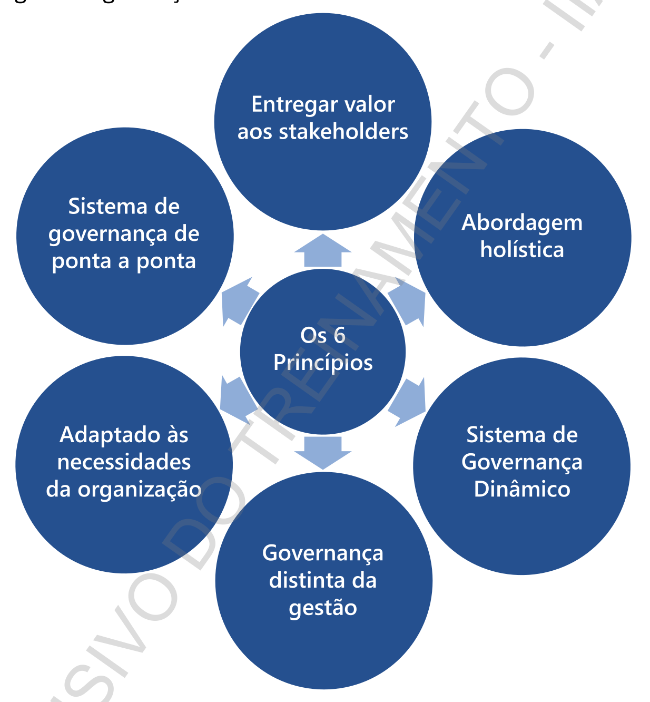

**Princípio 1:** Fornecer valor para as partes interessadas

**Princípio 2:** Abordagem holística - 7 componentes que suportam o sistema de governança:

= Processos

= Estrutura organizacional

= Princípios, políticas e procedimentos

= Informações

= Cultura, ética e comportamento

= Pessoas, habilidades e competências 

= Serviços, infraestrutura e aplicações

**Princípio 3:** Sistema de Governança Dinâmico

Cada vez que um ou mais dos fatores de desenho são alterados (por exemplo, uma mudança de estratégia ou tecnologia), o impacto dessas mudanças no sistema de Governança deve ser considerado

**Princípio 4:** Governança distinta da gestão

Um sistema de governança deve distinguir claramente entre as atividades e estruturas de governança (avaliar, dirigir e monitorar) e gestão (planejar, construir, executar e monitorar)

**Princípio 5:** Adaptado às necessidades da organização

Deve ser adaptado para as necessidades da organização usando um conjunto de fatores de desenho como parâmetros para adaptar e priorizar os componentes do sistema de governança

**Princípio 6:** Sistema de Governança de ponta a ponta

Deve cobrir a organização de ponta a ponta, concentrando-se não apenas na função de TI, mas em toda a tecnologia e processamento de informações que a organização estabelece para atingir seus objetivos

Outro aspecto importante é que o CobiT desde a versão 5 faz uma distinção clara entre governança e gestão. Essas duas disciplinas abrangem e servem a diferentes atividades e estruturas organizacionais.

O domínio de Governança contém 5 processos de governança, onde as práticas de governança avaliar, dirigir e monitorar são definidas. Os quatro domínios de Gestão contêm 35 processos de gestão e estão em linha com as práticas de gestão planejar, construir, executar e monitorar.

Os 5 domínios do modelo são:

EDM - Analisar, Dirigir e Monitorar (governança)
APO - Alinhar, Planejar e Organizar (gestão)
BAI - Construir, Adquirir e Implementar (gestão)
DSS - Entrega, Serviço e Suporte (gestão)
MEA - Monitorar, Analisar e Avaliar (gestão)

A aplicação de um framework (ou estrutura) de TI de mercado é essencial para cumprir com os requisitos de Governançae potencializar os benefícios abaixo:

TI mais comprometida com o negócio, atuando como parceiro estratégico e alinhada aos objetivos da organização

Confiança da Alta administração nos serviços prestados por TI

Maior eficiência e retorno sobre o investimento, com melhor gestão de recursos técnicos e humanos

Melhor gestão de riscos e consequentemente, maior probabilidade de atingimento dos objetivos definidos

Mais transparência e conformidade com normas, leis e regulamentos

Equilíbrio entre riscos e necessidades de negócio

Melhor gerenciamento dos processos com aplicação de melhores práticas mundiais

Maior compartilhamento de informações Maior segurança das informações, de dados e ativos

Redução nos custos da organização, evitando redundâncias e desperdícios.

2.3.6 IPPF 2024

2.3.7 NIST Cybersecurity Framework (CSF) 2.0

NIST Cybersecurity Framework

Fonte: nvlpubs.nist.gov/nistpubs/CSWP/NIST.CSWP.29.pdf

2.3.8 GTAG 17 - Auditando a Governança de TI

Fornece aos auditores internos o conhecimento necessário para cumprir as suas responsabilidades na prestação de serviços de avaliação e consultoria para governança de TI. Descreve estruturas de governança e desempenho, tais como balanced scorecards, modelos de maturidade e sistemas de qualidade.

Esta orientação fornece uma descrição de controles de exemplo que abordam riscos de governança de TI, planejamento de auditoria, verificação, testes e relatórios de ações para auxiliar no desenvolvimento de programas de auditoria prática. Finalmente, fornece diretrizes para facilitar auditorias de governança de TI, fornecendo orientação sobre como escopo do envolvimento, definição de objetivos de auditoria e avaliação de riscos e controles relacionados.

Guia Prático Objetivo

Fornece aos auditores internos uma base necessária para cumprir

GTAG 17 - Auditoria de Governança

## 3. SEGURANÇA DA INFORMAÇÃO

Antes de falarmos de segurança da informação é necessário entender o que é informação. Informação é um conjunto de dados relacionados que traz um significado, um sentido e que permite, a partir deles gerar conhecimento.

A informação pode ser produzida por diferentes formas, como a escrita, comunicação verbal, imagens, vídeos.

A complexidade começa a aumentar, quando pensamos nos meios e tipos de armazenamento diversos. Podemos citar, como exemplo o áudio, o qual pode ser armazenado na nuvem, no celular, discos magnéticos, etc.

E onde ela (informação) está? Imagine que ao fazer por exemplo, uma vídeo chamada, a informação será capturada por uma câmera e microfone, que transmitirão dados no computador/celular/tablet por meio da Internet, passando por roteadores, switches, cabos de comunicação, serviços de nuvem e aí vai.

Para cada um dos recursos há diferentes tipos de produtos, fornecedores, sistemas operacionais, banco de dados, etc.

E para colocar um “tempero” no ambiente, tem o fator humano, que apesar detodaatecnologia envolvida, um clique em um link enviado por uma pessoa desconhecida ou uma senha desprotegida com acessos privilegiados, pode expor uma informação confidencial, abrir portas para pessoas malintencionadas realizar operações indevidas e até provocar indisponibilidade do ambiente.

Por isto o tema segurança da Informação é tão importante e ganhado cada vez mais relevância. Tem como propósito:

Proteger contra:

= Vazamento de informações confidenciais

= Perda da integridade

= Indisponibilidade das informações 

Além disso, visa manter a:

= Privacidade

= Autenticidade das transações

= Não-repúdio

= Confiabilidade

Para exemplificarmos os riscos e prover melhor entendimento da criticidade fizemos uma lista, com base em análises de frameworks como o CobiT, NIST, ITIL, Norma ABNT 27001 e o CIS Controls. Como o assunto é dinâmico, a lista não se limita apenas a esses riscos.

= Ações de segurança de informação desalinhada com os objetivos de negócio da companhia.

= Descumprimento das regras de Segurança da Informação por ausência de planos para divulgação e conscientização das políticas, normas e procedimentos vigentes na empresa.

= Plano de Segurança da Informação incompatível com a infraestrutura tecnológica, cultura, legislação, investimentos e os requisitos de negócio da companhia, dificultando a implementação e expondo a companhia a ameaças.

= Dificuldade ou impossibilidade de atribuição de responsabilidades por ações realizadas no ambiente computacional, expondo a companhia a fraudes e desfalques.

= Operações realizadas por pessoas com privilégios de acesso inadequados e/ou incompatíveis com a função, acarretando perdas financeiras, interrupção do negócio e/ou prejuizo a imagem da companhia.

= Operações realizadas por contas de usuários inválidas ou fictícias, aumentando a exposição a fraudes e desfalques.

= Ausência de monitoramento e revisão dos riscos de Segurança da Informação, possibilitando que vulnerabilidades decorrentes do descumprimento de políticas, mudança do ambiente tecnológico e novas brechas sejam exploradas por pessoas mal-intencionadas.

= Fraudes e desfalques decorrentes de incidentes de segurança não detectados e tratados tempestivamente.

= Inadequada proteção das ferramentas (softwares, hardwares e documentação) utilizadas para Segurança da Informação, possibilitando que ações mal intencionadas sejam realizadas em configurações do ambiente tecnológico para burlar os mecanismos de controle.

= Comprometimento dos mecanismos de controle que evitam o não-repúdio de operações críticas realizadas no ambiente tecnológico, decorrente da perda da confidencialidade e integridade de chaves criptográficas.

= Interrupção dos negócios, roubo de informações e/ou prejuízo a imagem da companhia decorrente de instalação e uso de softwares maliciosos (vírus, worms, spyware, spam) no ambiente tecnológico

Invasão do ambiente tecnológico da empresa por pessoas mal-intencionadas (hackers, crackers, insiders), comprometendo a confidencialidade, disponibilidade dos sistemas e a imagem da companhia.

Transações eletrônicas inválidas e/ou não autorizadas efetuadas com parceiros de negócio (fornecedores, clientes, instituições financeiras), podendo acarretar penalidades legais, perdas financeiras, comprometimento da confiabilidade e imagem da companhia.

Após passarmos por uma relação de riscos bem abrangentes, você pode estar se perguntando. O que uma organização precisa fazer para endereçalos? Considerando que o ambiente de TI é complexo, há um volume de dados enorme trafegando nos mais diversos tipos de tecnologias, além disso precisa atender as necessidades de negócio, mas ao mesmo tempo estar aderentes aos requerimentos legais. A resposta está na implementação de um Sistema de Gestão de Segurança da Informação (SGSI).

Sem a implementação de um SGSI fica muito difícil gerenciar adequadamente os riscos dado os aspectos já mencionados. Conforme a ISO 27001, as etapas de um SGSI consideram o estabelecimento do SGSI, Implementação, Monitoramento e Analise Crítica e a Manutenção e Melhoria.

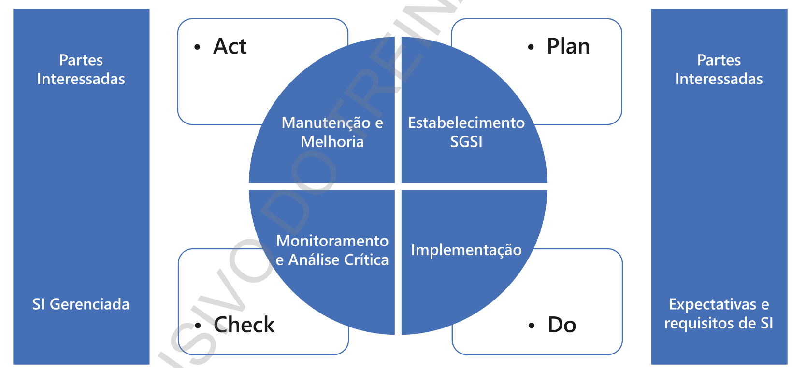

Fonte: Sistema de Gestão da Segurança da Informação - ABNT 27001

A seguir os principais assuntos a considerar em cada uma das etapas: 
= Estabelecimento SGSI consiste em considerar:
» Contexto da organização
» Necessidades e Expectativas
» Liderança e Comprometimento
» Política
» Autoridade, responsabilidades e papéis organizacionais
» Avaliação de riscos
» Tratamento de riscos
» Definição de Objetivos » Determinar e prover recursos
» Conscientização da Política (Benefícios/Implicações)
» Comunicação Interna e Externa relevantes
» Documentação 

= Implementação:
» Implementar e controlar os processos
» Avaliação de riscos de Sl periódica
» Tratamento de Riscos
» Monitoramento, medição, análise e avaliação
» Auditorias periódicas
» Análise crítica pela direção 

= Manutenção e Melhoria:

» Estabelecer ações para as não conformidades e
» Melhoria quanto a pertinência, adequação e eficácia do SGSI

### 3.1 Controles de Acesso

A segurança lógica é baseada em três elementos principais: a identificação dos usuários, a autenticação dos usuários e a definição das necessidades de acesso.

Controlar o acesso dos usuários ao sistema operacional e à rede corporativa não é suficiente para garantir que o acesso às informações corporativas esteja adequadamente controlado. Os controles de acesso aos sistemas aplicativos são tão importantes quanto os controles de acesso ao sistema operacional e rede corporativa.

Não importa o método escolhido para o escopo da revisão dos controles de aplicação, os controles de acesso lógico à aplicação ou módulo (processo, direitos de acesso e senhas) precisam ser revisados periodicamente. Na maioria dos casos, o usuário e os direitos de acesso administrativos (por exemplo, ler, escrever e apagar) são construídos utilizando a plataforma de segurança inerente e ferramentas do aplicativo.

Quando tratamos de controles de acesso de sistemas aplicativos específicos estaremos preocupados em verificar se eles são adequados para garantir que:

= Somente pessoas autorizadas acessem o sistema;

= Às pessoas que tenham acesso ao sistema sejam devidamente registradas e reconhecidas;

= Os usuários do sistema tenham acesso somente aos módulos/ transações necessários para a execução de suas funções, visando não apenas manter a confidencialidade das informações, mas também uma adequada segregação entre as funções executadas;

= As operações realizadas pelos usuários através do sistema sejam devidamente registradas, de forma que os responsáveis pela sua execução possam ser identificados se necessário.

Como os direitos de acesso lógico são criados variam de pacote para pacote. Em alguns casos, os direitos de acesso lógico são concedidos com base em um código de transação ou um nome ou número da tela, enquanto outros, como o SAP R/ 3, usam protocolos mais complexos de segurança baseado em objetos.

Quando uma revisão dos controles de acesso lógico de um aplicativo é executada, é importante assegurar que os controles gerais de segurança de aplicações serão analisados, bem como, incluindo:

= O comprimento do nome ou identificação do usuário. O comprimento da senha.

= Combinações de caracteres de senha.

= Envelhecimento da Senha (por exemplo, os usuários devem alterar suas senhas a cada 90 dias).

= Rotação de senha (por exemplo, os usuários não podem usar qualquer uma das suas cinco últimas senhas).

= Bloqueio de conta do usuário após um determinado número de tentativas de login sem sucesso, conta sem uso, de usuários desligados.

= Tempo limite da sessão (por exemplo, o aplicativo desconecta automaticamente um usuário se o usuário não interagiu com a aplicação durante 15 minutos).

Paralelamente aos controles do aplicativo propriamente dito, deve haver controles internos em funcionamento que garantam que:

= Os dados armazenados pelo sistema não possam ser acessados de outra forma que não seja através do próprio sistema; e

= O código fonte e o executável dos aplicativos estejam devidamente protegidos contra alterações indevidas, bem como a existência de controles que impeçam a instalação não autorizada de novas versões. Dependendo do nível de confidencialidade das informações, deve haver procedimentos específicos de aprovação em nível gerencial, além de ser mantido um controle adequado sobre os destinatários dos relatórios gerados.

### 3.2 Controles de Aplicação

Controles de aplicação são aqueles controles que pertencem ao âmbito de processos de negócios individuais ou sistemas de aplicação, incluindo dados de edições, a segregação de funções de negócios, balanço dos totais de processamento, registro de transações e relatórios de erro. Resumidamente são: os Perfis de Acessos, Parâmetros e Interfaces.

Portanto, o objetivo do controle de aplicação é assegurar que:

= Os dados de entrada sejam precisos, completos, autorizados e corretos.

= Os dados são processados conforme o esperado em um período aceitável,

= Os dados armazenados são precisos e completos.

= Saídas são precisas e completas.

= Um registro é mantido para acompanhar o processo desde a entrada de dados ao armazenamento e eventual saída.

Ao desenvolver controles de entrada de dados, a consideração principal deve ser dada à autorização, validação e notificação de erro.

O ponto mais econômico para corrigir erros de entrada em uma aplicação é o momento no qual os dados são inseridos no sistema.

Por esse motivo, os controles de entrada são o foco principal da avaliação de um auditor interno dos controles de aplicações.

### 3.3 Trilhas de Auditoria

Controle histórico de processamento que permite a administração identificar as transações e eventos, acompanhando as operações desde sua origematé a sua saída e de forma retroativa. Estes controles também monitoram a eficácia de outros controles e identificam o erro mais próximo possível de suas origens.

Além dessas existem outras classificações de controles como preventivos e detectivos.

### 3.4 Cloud Computing

É um serviço que tem sido cada vez mais utilizado tanto por cidadãos comuns com uso de contas da Microsoft, gmail, apple quanto por grandes corporações, institutos, etc. Tem a ver com a facilidade de aumentar sua capacidade, seja de processamento e /ou de serviços, com apenas um “clique” e custo benefício bem atrativos.

De acordo com a ISO 17788 a computação em nuvem possui as seguintes características:

**• Acesso amplo via rede —** recursos físicos ou virtuais disponíveis através de uma rede ampla acessíveis através de mecanismos padrão que permitem o uso por plataformas de cliente heterogêneas. Alto nível de conveniência, acessível por uma variedade de dispositivos

**• Serviço mensurado —** utilização monitorada, controlada, relatada e cobrada. Pagar somente pelo que usa.

**• Multi-inquilinato —** recursos físicos ou virtuais alocados de forma a isolar a computação e os dados de multi-inquilinato. Tornando inacessíveis a outros “inquilinos”.

**• Auto-serviço sob demanda —** possibilidade de provisionar capacidades de computação, quando necessário, de forma automática ou com interação mínima com o provedor. Possibilita redução nos custos, tempo e esforços, já que concede ao usuário a habilidade de fazer o que precisa.

**• Elasticidade e escalabilidade rápidos —** capacidade de adquirir recursos físicos ou virtuais em qualquer quantidade, a qualquer tempo, automaticamente, sujeiotos as restrições do acordo de serviço, sem se preocupar com recursos limitados e planejamento de capacidade.

**• Agrupamento de serviços —** característica em que o provedor de serviço pode agregar recursos físicos ou virtuais para servir a um ou mais clientes.

Os serviços providos em “nuvem” são os mais diversos, considerando comunicação, computação, armazenamento de dados, plataformas, softwares e infraestrutura Abaixo as categorias mais representativas na atualidade:

## Categorias de Serviços em Nuvem

| **Categorias**                               | **Descrição** |
|----------------------------------------------|----------------|
| **Comunicação (CaaS)**                       | Ferramenta de interação e colaboração em tempo real |
| **Computação (CompaaS)**                     | Recursos de processamento necessários à implantação e execução de softwares |
| **Armazenamento de Dados (DSaaS)**           | Armazenamento de dados |
| **Rede (NaaS)**                              | Conectividade e capacidades relacionadas à rede |
| **Plataforma (PaaS)**                        | Capacidade de plataforma |
| **Software (SaaS)**                          | Capacidade de aplicativos |
| **Infraestrutura (IaaS)**                    | Capacidade de infraestrutura |

O sistema de Gestão da Segurança da Informação deve considerar todos os tipos de serviços, incluindo àqueles providos por terceiros que é o caso da computação em nuvem. Para isto, alguns aspectos específicos devem ser considerados na definição da governança e gestão, que inclui:

• Requisitos de computação em nuvem na política de segurança da companhia

• Papéis e responsabilidades claramente definidos (gestão de incidentes, vulnerabilidades, proteção dos logs, controles de acesso, chaves criptográficas, etc)

• Conscientização, educação e treinamento (riscos, legislação aplicável, etc)

• Inventário de ativos, incluindo informações e ativos armazenados no ambiente do provedor

• Classificação da informação 

• Requisitos de acesso do usuário a cada serviço utilizado

• Utilização de técnicas adequadas de autenticação como o máúltiplo fator

• acesso a informação em nuvem possa ser restringido de acordo com a necessidade (serviços, funcionalidades, dados)

• uso de programas utilitários na nuvem apenas se permitido

• criptografia quanto a armazenamento e tráfego dentro e fora do serviço em nuvem

• gerenciamento adequado de chaves de criptografia 

• requisitos de segurança dos backups 

• critérios para coleta, registro e armazenamento de eventos (logs)

• segregação de redes para assegurar o isolamento do ambiente do serviço compartilhado

## 3.5 Cibersegurança

Cibersegurança tem sido um dos temas mais comentados em termos de riscos emergentes, desde a pandemia. Até pela mudança que tivemos nas relações de trabalho, onde para assegurar a continuidade dos negócios, várias organizações tiveram que prover acesso ao seu ambiente computacional, por computadores/notebooks cedidos aos funcionários em “toque de caixa” para que levassem e trabalhassem diretamente de suas residências (Home Office). Por um lado, houve a disruptura quanto ao trabalho 100% online e quebrado alguns paradigmas quanto a possível improdutividade ao se trabalhar de casa, no entanto os desafios quanto a segurança aumentaram.

A tecnologia ajudou a manter as empresas operando em um período extremamente difícil em que pessoas não saiam das suas casas. Por outro lado, as vulnerabilidades quanto à segurança das informações aumentaram; pois em suas casas os indivíduos não estavam totalmente sujeitos aos controles da organização.

A característica do espaço cibernético é de um ambiente de interação entre pessoas, softwares e serviços de internet. Além disso, é suportado por instrumentos físicos de TI e comunicação e redes conectadas e distribuídas pelo mundo inteiro.

Para dificultar um pouco mais, possui vários proprietários cada qual com suas próprias preocupações comerciais, operacionais e regulamentares, que por sinal é distinta entre os países.

Resumindo, os hackers, crime organizado e terroristas virtuais que aproveitam do anonimato na rede, tiveram muito mais alvos para ataques, pois o acesso ao ambiente da organização passa por uma conexão à internet.

Para se proteger, é necessário conhecer as principais ameaças que passam por:

**• Configurações malfeitas —** senhas fáceis, permissões de acesso inadequadas, pastas e arquivos desprotegidos, máquinas de rede que podem ser acessadas por qualquer usuário, roteadores e switches com senha padrão, portas de serviços sem a adequada proteção etc.

**• Softwares com falhas —** todos softwares possuem falhas, qualquer pessoa com algum conhecimento pode explorar - Ex: cvedetails.com

**• Falta de atualizações —** problemas na atualização dos softwares, patches que abrem novas falhas e softwares antigos

**• Redes desprotegidas** (falta de criptografia (HTTP, FTP), redirecionamento de tráfego (ARP Poisoning, DHCP Spoofing, ICMP Redirect ou Port Stealing) Spoofing (IP e DNS Spoofing)

**• Proteções ineficazes —** conexão reversa com tunelamento por http ou ICMP

**• Fator Humano —** Através de técnicas de Engenharia Social via correio eletrônico (Phishing), telefone e sistemas de mensagens instantâneas. 

A manipulação do fator humano causa enormes desastres como: fazer um usuário rodar um cavalo de troia sem saber, conseguir informações privilegiadas sobre a empresa, obter especificações de um novo produto, etc.

Por este motivo é necessário prover a segurança cibernética que tem como principais objetivos, segundo a ISO 27032 — Técnicas de Segurança — Diretrizes para Segurança Cibernética:

= Proteger a segurança geral do espaço cibernético

= Planejar para emergências e crises por meio de participações práticas e planos de respostas e de continuidade de operações atualizados

= Educar as partes interessadas

= Assegurar o compartilhamento oportuno, relevante e preciso de informações de ameaça entre autoridades, comunidades de inteligência e tomadores de decisões no Espaço Cibernético

= Mecanismos de coordenação entre setores e partes interessadas para administrar interdependências críticas, incluindo conscientização situacional do incidente e gestão do incidente entre setores e partes interessadas.

A segurança cibernética necessita atuar no controle de tráfego de rede para identificar qualquer anormalidade, no nível de aplicativo explorado por meio de páginas web inseguras, proteção dos servidores que suportam os serviços e recursos tecnológicos, além dos controles do usuário final. Mas lembre-se, para que tudo isso pode ser feito e implementado de forma sistemática, é necessário que sejam estabelecidos políticas e procedimentos, haja conscientização e treinamento, pessoas competentes, coordenação e protocolos claros para compartilhamento de informações, quando necessário.

Visando auxiliar às organizações a focar e priorizar as ações para proteger seu ambiente contra cyber ataques, a comunidade de profissionais de segurança sem fins lucrativos Center for Internet Security, desenvolveu o framework CIS Controls.

**O CIS Controls estã estruturado com os seguintes elementos:**

**= Visão geral:** Uma breve descrição da intenção do Controle e sua utilidade como ação defensiva.

**= Por que este controle é crítico?** Uma descrição da importância deste Controle no bloqueio, mitigação ou identificação de ataques, e uma explicação de como os invasores exploram ativamente a ausência deste Controle

**= Procedimentos e ferramentas:** Uma descrição mais técnica dos processos e tecnologias que permitem a implementação e automação deste Controle

**= Medidas de Segurança:** uma tabela das ações específicas que as empresas devem realizar para implementar o Controle.

Além disso, o framework trabalha com 03 níveis de segurança denominados de IG1,1G2 e IG3. Cada IG representam uma visão horizontal dos controles CIS adaptados a diferentes tipos de empresas. O Nível IG1 contém um conjunto de medidas de segurança básico é é denominado de “higiene cibernética basica”,

A ideia é que possa ser implementado de acordo com o porte da empresa e nível de maturidade, ajudando a priorizar as ações de forma estruturada, uma vez que o IG2 incluir o IG1 e o I63 inclui todas as medidas de segurança nos anteriores.

## Controles CIS (18 Grupos)

| Nº | Controle |
|----|----------|
| **1** | Inventário e controle de ativos corporativos |
| **2** | Inventário e controle de ativos de software |
| **3** | Proteção de dados |
| **4** | Configuração segura de ativos corporativos e software |
| **5** | Gestão de contas |
| **6** | Gestão de controle de acesso |
| **7** | Gestão contínua de vulnerabilidades |
| **8** | Gestão de registros de auditoria |
| **9** | Proteções de e-mail e navegador |
| **10** | Defesas contra malware |
| **11** | Recuperação de dados |
| **12** | Gestão da infraestrutura de rede |
| **13** | Monitoramento e defesa da rede |
| **14** | Conscientização sobre segurança e treinamento de competências |
| **15** | Gestão de provedor de serviços |
| **16** | Segurança de aplicações |
| **17** | Gestão de respostas a incidentes |
| **18** | Testes de invasão |

**1. Inventário e controle de ativos corporativos —** Gestão ativa (inventariar, rastrear e corrigir) de todos os ativos corporativos (dispositivos de usuário final, incluindo portáteis e móveis; dispositivos de rede; dispositivos não computacionais; Internet das Coisas (loT); e servidores) conectados fisicamente à infraestrutura, virtualmente, remotamente, e aqueles em ambientes de nuvem, para saber com precisão a totalidade dos ativos que precisam ser monitorados e protegidos dentro da empresa.

**2. Inventário e controle de ativos de software —** Gestão ativa (inventariar, rastrear e corrigir) de todos os softwares (sistemas operacionais e aplicações) na rede para que apenas o software autorizado seja instalado e possa ser executado, e que o software não autorizado e não gerenciado seja encontrado e impedido de ser instalado ou executado.

**3. Proteção de dados —** Processos e controles técnicos para identificar, classificar, manusear com segurança, reter e descartar dados.

**4. Configuração segura de ativos corporativos e software —** Configuração segura de ativos corporativos (dispositivos de usuário final, incluindo portáteis e móveis; dispositivos de rede; dispositivos não computacionais/ loT; e servidores) e software (sistemas operacionais e aplicações).

**5. Gestão de contas —** Processos e ferramentas para atribuir e gerenciar autorização de credenciais para contas de usuário, incluindo contas de administrador, bem como contas de serviço, de ativos corporativos e software.

**6. Gestão do controle de acesso —** processos e ferramentas para criar, atribuir, gerenciar e revogar credenciais de acesso e privilégios para contas de usuário, administrador e serviço para ativos e software corporativos.

**7. Gestão contínua de vulnerabilidades —** plano para avaliar e rastrear vulnerabilidades continuamente em todos os ativos corporativos dentro da infraestrutura da empresa, a fim de remediar e minimizar a janela de oportunidade para atacantes. Monitore fontes públicas e privadas para novas informações sobre ameaças e vulnerabilidades.

**8. Gestão de registros de auditoria —** Coleta, alerta, analise e retenção de logs de auditoria de eventos que podem ajudar a detectar, compreender ou se recuperar de um ataque.

**9. Proteções de e-mail e navegador Web —** Proteções e detecções de vetores de ameaças de e-mail e web, pois são oportunidades para atacantes manipularem o comportamento humano por meio do engajamento direto.

**10.Defesas contra malware —** Impedir ou controlar a instalação, disseminação e execução de aplicações, códigos ou scripts maliciosos em ativos corporativos.

**11.Recuperação de dados —** Práticas de recuperação de dados suficientes para restaurar ativos corporativos dentro do escopo para um estado pré-incidente e confiável.

**12.Gestão dainfraestrutura derede —** Gestão ativa (rastreie, reporte, corrija) dos dispositivos de rede, a fim de evitar que atacantes explorem serviços de rede e pontos de acesso vulneráveis.

**13.Monitoramento e defesa da Rede —** processos e ferramentas para estabelecer e manter monitoramento e defesa de rede abrangente contra ameaças de segurança em toda a infraestrutura de rede corporativa e base de usuários.

**14.Conscientização sobre segurança e treinamento de competências —** programa de conscientização de segurança para influenciar o comportamento da força de trabalho para ser consciente em segurança e devidamente qualificada para reduzir os riscos de segurança cibernética para a empresa.

**15.Gestão de provedor de serviços —** processo para avaliar os provedores de serviços que mantêm dados sensíveis, ou são responsáveis por plataformas ou processos de TI críticos de uma empresa, para garantir que esses provedores estejam protegendo essas plataformas e dados de forma adequada.

**16.Segurança de aplicações —** gestão do ciclo de vida da segurança de software desenvolvido, hospedado ou adquirido internamente para prevenir, detectar e corrigir os pontos fracos de segurança antes que possam afetar a empresa.

**17.Gestão de respostas a incidentes —** programa para desenvolver e manter uma capacidade de resposta a incidentes (por exemplo, políticas, planos, procedimentos, funções definidas, treinamento e comunicações) para preparar, detectar eresponder rapidamente a um ataque.

**18.Testes de invasão —** Teste a eficácia e a resiliência dos ativos corporativos por meio da identificação e exploração de fraquezas nos controles (pessoas, processos e tecnologia) e da simulação dos objetivos e ações de um atacante.

## 3.6 Requerimentos de Privacidade

Com o uso abrangente da tecnologia, o meio digital, se tornou um recurso extremamente valioso para realização de vendas. Por isso, as empresas disponibilizam conteúdos gratuitos na internet, realizam promoções, sorteios, concedem descontos, etc em troca de dados pessoais.

Há uma busca incessante das empresas por essa informação; querem conhecer o comportamento de consumo dos indivíduos para oferecer produto e/ou serviço que sirva as suas necessidades ou até gere uma que não tinha.

Algum tempo, não tão distante assim, era comum a venda de maling, compartilhamento de forma indiscriminada dos dados pessoais de indivíduos. Quantas vezes, você já recebeu uma ligação e/ou email de pessoas para as quais você nunca havia disponibilizado seus dados?

Este foi um dos motivos do surgimento de Leis, como a GDPR (General Data Protection Regulation) na Europa e a LGPD (Lei Geral de Proteção dos Dados) no Brasil no intuito de regular a privacidade do indivíduo, equalizando os direitos entre titular dos dados e as organizações e minimizando a ocorrência de incidentes de vazamentos dos dados.

#### REVISAR #### 

LGPD - Lei Geral de Proteção dos Dados

O que é a Lei?

ALei Geral de Proteção de Dados Pessoais (LGPD) é uma legislação brasileira que regulamentaacoleta, armazenamento, tratamento e compartilhamento de dados pessoais. A lei foi sancionada em 14 de agosto de 2018 e entrou em vigor em 18 de setembro de 2020.

Qual seu objetivo?

A LGPD visa garantir a privacidade e a proteção dos dados pessoais, estabelecendo direitos para os titulares dos dados e obrigações para as

empresas que os tratam.

Motivações principais para a criação

Proteção da Privacidade: Garantir que os dados pessoais dos cidadãos sejam tratados de maneira ética e segura.

Segurança Jurídica: Criar um ambiente regulatório claro e uniforme para empresas e organizações que tratam dados pessoais.

Harmonização Internacional: Alinhar a legislação brasileira com padrões internacionais, facilitando a cooperação e o comércio internacional.

Inovação e Desenvolvimento: Promover a inovação tecnológica e o desenvolvimento econômico ao estabelecer regras claras para tratamento de dados pessoais.

Estrutura da LGPD

Capítulo | - Disposições Preliminares: Define os conceitos e o âmbito de aplicação.

Capítulo Il - Dos Dados Pessoais: Estabelece os princípios e as bases legais para o tratamento de dados pessoais.

Capítulo III - Dos Direitos dos Titulares: Define os direitos dos titulares dos dados e as obrigações dos controladores.

Capítulo IV - Do Tratamento de Dados Pessoais pelo Poder Público: Regula o tratamento de dados pelo setor público.

Capítulo V - Da Transferência Internacional de Dados: Estabelece as regras para a transferência de dados para outros países.

Capítulo VI - Dos Agentes de Tratamento de Dados Pessoais: Define as responsabilidades dos controladores e operadores.

Capítulo VII - Da Segurança e das Boas Práticas: Estabelece as medidas de segurança e boas práticas que devem ser adotadas pelos agentes de tratamento.

Capítulo VIII - Da Fiscalização: Cria a Autoridade Nacional de Proteção de Dados (ANPD) e define suas atribuições.

Capítulo IX - Da Responsabilidade e do Ressarcimento de Danos: Estabelece a responsabilidade dos agentes de tratamento e as sanções aplicáveis.

Capítulo X - Disposições Finais e Transitórias: Contém disposições adicionais e transitórias.

Comparação com a GDPR - General Data Protection Regulation

Escopo de Aplicação: O GDPR aplica-se a qualquer organização que trate dados de cidadãos da União Europeia, independentemente de sua localização. A LGPD aplica-se a qualquer operação de tratamento realizada no território brasileiro ou que envolva dados pessoais coletados no Brasil.

Bases Legais para Tratamento: Embora ambas as legislações possuam bases legais semelhantes, há diferenças na forma como algumas dessas bases são definidas e aplicadas.

Autoridade de Supervisão: O GDPR estabelece a existência de autoridades de supervisão independentes em cada país membro da UE. A LGPD cria a Autoridade Nacional de Proteção de Dados (ANPD) como órgão responsável pela fiscalização e aplicação da lei no Brasil

Conceitos Importantes Controlador, Operador e Encarregado

Titular dos Dados Pessoais: Pessoa natural (física) a quem se referem os dados pessoais que são tratados pelos agentes de tratamento.

Dado Pessoal: Informação relacionada a pessoa natural identificada ou identificável. Por exemplo: nome, endereço, telefone, CPF, data de nascimento.

Dado Pessoal Sensível: Informação relacionada a pessoa natural identificada ou identificável. Por exemplo: nome, endereço, telefone, CPF, data de nascimento.

Dado Anonimizado: Dado relativo a titular que não possa ser identificado, considerando a utilização de meios técnicos razoáveis e disponíveis na ocasião de seu tratamento. Por exemplo: dados da pesquisa do CENSO.

Medidas de Segurança da Informação

Definição: Medidas de segurança da informação são práticas técnicas implementadas para proteger dados pessoais contra acessos não autorizados e outras ameaças. Elasincluem controles deacesso, criptografia, backups regulares e monitoramento constante

Controles de Acesso: Garantem que apenas pessoas autorizadas possam acessar dados pessoais, prevenindo acessos não autorizados e protegendo a privacidade dos titulares de dados

Criptografia: A criptografia é uma técnica que torna os dados ilegíveis para pessoas não autorizadas, protegendo as informações durante o armazenamento e a transmissão

Backup: Realizar backups regulares assegura que os dados possam ser recuperados em caso de perda ou falha no sistema, protegendo a integridade e a disponibilidade das informações

Políticas, Normas e Diretrizes de TI: Atualizadas, divulgadas e aprovadas

ANPD: A ANPD é o órgão responsável por zelar, implementar e fiscalizar o cumprimento da LGPD

Tipos de Sanções: = Advertência « Multa Simples « Multa Diária «= Publicização da Infração « Bloqueio dos Dados Pessoais = Eliminação dos Dados Pessoais Auditoria Interna: O auditor interno deve apoiar na garantia visando que as

Organizações tenham processos documentados e políticas de proteção de dados que podem ser apresentadas à ANPD durante uma auditoria.

## 4. DESENVOLVIMENTO E MANUTENÇÃO DE SISTEMAS

Projetos, de acordo com a definição do PMBOK é um esforço temporário empreendido para criar um produto, serviço ou resultado exclusivo. Um projeto pode estar integrado a um programa que trata de um grupo de projetos gerenciados de uma forma coordenada, a fim de se obter benefícios que de uma forma isolada, não seria alcançado.

Ainda existe uma terceira definição importante que é a do Portfólio, que nada mais é que um conjunto de projetos ou programas e ou outros trabalhos agrupados parafacilitar o gerenciamento eficaz desse trabalho afim de atender aos objetivos de negócios estratégicos.

Dada a magnitude, acho que ficou claro que para atingir os resultados esperados e conseguir coordenar vários projetos, programas e portfólios e necessário cuidar da governança do projeto a qual deve:

= desenvolver um framework de governança de projetos, incluindo políticas, processos, procedimentos, diretrizes, papéis e responsabilidades

= ser parte integrante da governança corporativa

= refletir os valores e princípios da organização, bem como o compromisso com os valores éticos e sustentabilidade

= estar alinhado com as políticas e objetivos da organização (Ex: gestão de riscos, competência e talentos, ambientais e de sustentabilidade, etc)

= ter uma comunicação efetiva entre as entidades de governança e gestão

Já vimos anteriormente no módulo de governança de Tl a distinção dos papéis e responsabilidades da Governança e Gerenciamento. Mas vamos recordar:

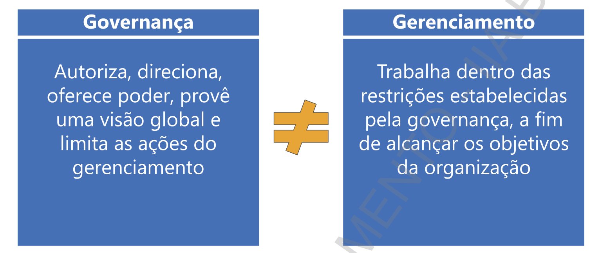

Para realizar um adequado gerenciamento de projetos deve haver a integração entre o escopo, tempo, qualidade, comunicação, das partes interessadas, custos, aquisições, riscos e recursos.

Estas áreas trabalham de forma integradas, de modo que se houver a necessidade de alteração em qualquer uma delas as outras serão afetadas.

Portanto na condução do projeto os papéis devem estar muito bem definidos com relação a desenho do projeto, aprovação, governança, desenvolvimento, segurança da informação e qualidade. As funções mais comuns são:

Gerente sênior — Demonstra comprometimento com o projeto e aprova os recursos necessários para completar o projeto

Gerente de usuário — assume a responsabilidade do projeto e sistemas resultantes, alocando time qualificado e participa ativamente no redesenho do processo de negócio, definição de requerimentos, desenvolvimento de casos de teste, treinamento do usuário e teste de aceitação. Quanto ao desenvolvimento, se preocupa se as

= Funções requeridas estão disponíveis

= Confiabilidade e eficiência

= Facilidade de uso

= Facilidade em migrar os dados do sistema legado

= Possibilidade de adicionar novas funções

**Comitê do projeto (sttering Committee) —** provê uma direção gerale é o responsável final por todas as entregas, custos e cronograma do projeto. Composto por membros executivos que serão impactados com o novo sistema.

**Sponsor do projeto —** provê orçamento para projeto e trabalha próximo do gerente do projeto para definir os fatores críticos e métricas para medição do desempenho. Normalmente é o responsável primário da unidade de negócio que a aplicação irá suportar.

**Gerente de desenvolvimento —** provê suporte técnico de hardware e software para desenvolvimento, instalação e operação do sistema requisitado.

**Gerente de projeto —** provê a gestão diária e liderança do projeto para assegurar que as atividades do projeto permanecerão em linha com a direção geral, assegura que as áreas afetadas serão adequadamente representadas, resolve conflitos, Monitora e controla custos, prazos, e demais áreas de conhecimento.

**Equipe de desenvolvimento —** Executa as tarefas atribuídas, comunica de forma efetiva com os desenvolvedores para envolvimento deles mesmos no processo como um especialista do negócio, assessora o gerente do projeto de desvios do planejado e realizado

**Security Officer —** assegura que os controles do sistema e processo suportado obtenham um nível de proteção adequado, baseado na classificação dos dados alinhado com as políticas e procedimentos corporativos de segurança da informação.

**Quality a Assurance —** revisa os resultados e entregas dentro e ao final de cada fase e confirma conformidade os requisitos

Mas porque ainda existem projetos que apesar de ter uma estrutura e governança bem definidas falham?

= Cliente não sabe exatamente o que quer

= Mudanças constantes dos requisitos

= Falta de entendimento “cliente x equipe”

= Falhanas estratégias de comunicação

= Mudança na estratégia de negócio

= Mudança do processo

= Falta de clareza do escopo do projeto a todos da equipe 

= Não procurar feedback das partes interessadas

= Falta de definição das regras e as responsabilidades de cada um na equipe

= Ausência de critérios para aprovar custos extras

= Não projetar os custos corretamente

= Falha na comunicação e ausência de reuniões regulares

= Excesso de otimismo com datas e prazos

= Escopo do projeto inflexível em mudanças

= Equipe com dúvidas ou sem treinamento adequado para o projeto 

= Desalinhamento do projeto com a visão estratégica da empresa

Esta lista não tem a pretensão de ser completa, mas possivelmente algumas destas situações você já deve ter se deparado.

### 4.1 Desenvolvimento de Sistema —- Metodologia Tradicional

O desenvolvimento de um sistema é normalmente encarado como um projeto e por isso tem um conjunto de requisitos que converge com a metodologia de gestão de projetos.

De forma simplificada possui as seguintes etapas: definição da necessidade, planejamento, execução, monitoramento e controle e encerramento. Este modelo também é chamado de cascata (waterfall).

## Fases do Projeto e Desenvolvimento de Sistemas

| **Fase** | **Atividades** |
|---------|----------------|
| **Definição** | • **Proposta** – necessidade e função de negócio, enviada ao Comitê Diretivo de Projeto • **Estudos de Viabilidade** – determinam tecnologia, recursos econômicos, riscos e operações afetadas • **Comitê Diretivo** – autoriza |
| **Desenho ou Projeto** | • **Desenho lógico** – fluxo e armazenagem (DFD e fluxogramas), assegura não duplicação de dados • **Desenho físico** – interações específicas dos códigos de programa e elementos de dados com a plataforma de *hardware* |
| **Desenvolvimento** | • **Codificação e criação da estrutura de base de dados reais** • **Testes (programadores/usuários)** – isolados ou integrados; usa base de dados de teste • **Aceitação dos usuários** – aprovação final para produção |
| **Implantação** | • **4 estratégias** – paralelo; conversão de corte (antigo desligado); conversão piloto; conversão em fases • **Treinamento e preparação** – documentação física e online; manuais operacionais; layouts; estrutura de base de dados • **Follow-up ou pós-auditoria** – revisão da eficiência e eficácia após algum tempo |

### 4.2 Desenvolvimento de Sistema —- Metodologia Ágil

Uma outra metodologia adotada com o conceito de focar na entrega de valor por meio de iterações e interações é a metodologia ágil.

A metodologia ágil tem os princípios que são declarados em forma de um manifesto:

= Indivíduos e interações mais que processos e ferramentas

= Software em funcionamento mais que documentação abrangente

= Colaboração com o cliente mais que negociação de contratos

= Responder a mudanças mais que seguir um plano

O manifesto considera que haja valor nos itens à direita, porém valoriza mais os itens à esquerda.

A metodologia Agile, trabalha com conceitos de backlog do produto, que é uma lista priorizada de itens sobre os quais o Time de Desenvolvimento trabalhará no decorrer do projeto. Esta lista é obtida por meio de requisitos capturados com as histórias de usuário, que é a ferramenta mais utilizada para esta finalidade na metodologia ágil.

Para definir entregas em um período que normalmente variam de 2 a 4 semanas, é criado o Backlog da Sprint, que é um conjunto de itens do Backlog do Produto selecionados para a Sprint (representado na forma de um Quadro de Tarefas), juntamente com o plano para entregar o incremento "Pronto" e atingir a Meta da Sprint.

Para direcionamento, alinhamento e monitoramento da Sprint são realizadas as reuniões diárias, chamadas de Daily Scrum, com duração de até 15 minutos.

Essa conversa visa entender o que já foi feito, o que precisa ser colocado em prática naquele dia e identificar gargalos que estejam impossibilitando o andamento dos processos.

Além de alinhar os pontos da Sprint, a Daily Scrum é importante, porque mantém a comunicação constante entre a equipe. Ou seja, mantém todos os cientes do rendimento e da conclusão das etapas do trabalho.

Garante também que a equipe esteja sempre engajada a encontrar soluções colaborativas para realizar possíveis ajustes no planejamento.

**Os papéis são descritos da seguinte forma:**

**Dono do Produto — representa o cliente/partes interessadas**
= define requisitos do produto — histórias dos usuários
= prioriza as necessidades de acordo com o valor do negócio
= mantém o backlog atualizado e priorizado
= aceita ou rejeita as entregas

**Scrum Master - Facilitador**
= responsável por remover impedimentos
= especialista em Scrum, busca os recursos necessários para equipe desenvolver os trabalhos, removendo impedimentos para garantir uma equipe funcional e produtiva.

**Equipe Scrum Master — equipe de desenvolvimento**
= composto por 5 a 9 pessoas
= geralmente contém programador, analista, designer, testador
= decidem quais histórias de usuário deverão ser desenvolvidas na iteração que está sendo planejada
= estima os tempos de entrega
= secompromete com a entrega planejada a cada iteração do projeto
= auto-organizada — liberdade para organizar os trabalhos da melhor forma

### 4.3 Comparativo

Considerando as 02 metodologias, a tradicional (waterfall) e a Agile, qual a melhor? Depende da característica do projeto, se for um projeto que deverá ter poucas mudanças, talvez a waterfall seja a melhor opção.

Abaixo um comparativo entre as duas:

## Comparação entre Metodologia Tradicional e Metodologia Ágil

| **Metodologia Tradicional** | **Metodologia Ágil** |
|-----------------------------|------------------------|
| Dirigido por planejamento | Dirigido por valores |
| Seguir um plano, uma vez que os objetivos, necessidades e requerimentos foram identificados | Responder a mudanças e entender o que o cliente quer ao longo do projeto |
| Processos e ferramentas devem ser preenchidos para manter a rastreabilidade | Indivíduos e interações são mais importantes que a documentação |
| Documentação abrangente para garantir que tudo o que foi planejado seja entregue | Produto que funciona |
| Negociação de contrato | Colaboração com o cliente, entregando o que ele precisa e satisfazendo suas necessidades |
| Indicado para projetos com escopo sujeito a poucas mudanças | Indicado para projetos que podem ser repensados, com escopo flexível durante o desenvolvimento |

Com relação a entrega, a metodologia waterfall, está desenvolvida para entregar valor ao término do projeto. A metodologia Ágile por sua vez, trabalha com entregas parciais ao longo do projeto, possibilitando agregar valor antes do término de todo o projeto.

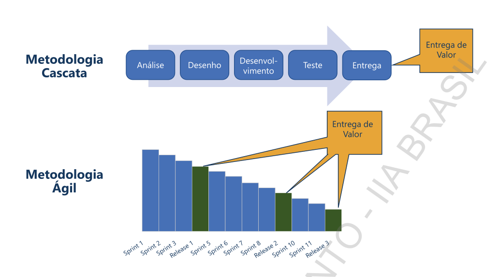

4.4 Riscos e Controles associados ao processo de Desenvolvimento e Manutenção de Sistemas

Independente da metodologia adotada, o processo de desenvolvimento de sistemas apresenta riscos. Abaixo citamos alguns riscos e fatores que podem impactar o processo de desenvolvimento de sistemas:

Abordagem inefetiva e desorganizada para gestão do projeto:

= Falta de clareza das responsabilidades

= prioridades inapropriadas, funções críticas atrasadas, recursos e orçamentos inadequados, riscos não avaliados na aquisição do software

= Soluções alternativas não identificadas

= Alto custo de soluções fragmentadas

= Solução incorreta ou com requisitos faltantes significativos descobertos mais tarde no projeto, causando retrabalhos custosos e atraso na implementação

= Sistemas desenvolvidos em desacordo com as expectativas e requerimentos da administração

= Falhas ao responder problemas no projeto com decisões adequadas e aprovadas

= Gastos desnecessários para desenvolver softwares que poderiam ter sido adquiridos de um fornecedor ou por personalizar softwares de fornecedor que não se enquadrem efetivamente nos negócios da entidade e/ou do ramo de atividade.

= Atrasos em projetos e custos excessivos no desenvolvimento de sistemas

= Projetos importantes não serem desenvolvidos com a prioridade requerida

= Benefícios não serem avaliados antes do desenvolvimento da aplicação

**Sistemas não operarem adequadamente após a implementação**

= Confiança aumentada no pessoal chave, problemas em operações de rotinas e sobrecarga no help desk

= Qualidade de software pobre, testes inadequados e um alto número de falhas

= Fragilidade na segurança do sistema, podendo comprometer a confidencialidade, integridade e disponibilidade das informações

= Distorções nas informações ou dados convertidos de forma incorreta

= Dependência de fornecedores por não possuir o código fonte

= Ambiente de testes, homologação e produção não estarem devidamente segregados

= Comprometimento da confidencialidade e /ou privacidade devido ao uso de dados reais utilizados para testes nos ambientes de desenvolvimento, testes ou homologação

= Inexistência de suporte de fornecedores ou dificuldade de realizar adequação/manutenção de sistemas por falta de contratos de suporte, falta de atualização de versões suportadas pelos fornecedores, ausência de documentação, indisponibilidade do código-fonte

**Para a mitigação destes riscos, hã um conjunto de controles que podem contribuir para mitigação, conforme descrevemos a seguir:**

= As demandas das áreas são capturadas, avaliadas e priorizadas de acordo com os requisitos do framework de gestão de projetos da companhia, considerando dentre outros aspectos, alinhamento à estratégia, retorno sob o investimento, riscos, dentre outros aspectos.

= Projetos são priorizados e atribuídos para assegurar que recursos de informações limitados sejam utilizados apropriadamente e suportem os objetivos de negócio corporativos.

= Uma metodologia ou um processo formal é utilizado para direcionar a aquisição, desenvolvimento e manutenção de hardware, sistemas aplicativos, software de rede e comunicação e software de sistemas.

= A administração aprova todas as decisões para compra ou desenvolvimento de sistemas aplicativos com a finalidade de assegurar que as compras e o desenvolvimento sejam consistentes com os planos e estratégias de sistemas da organização.

= Código-fonte e a documentação técnica são mantidos para os programas de produção executáveis, incluindo a documentação corrente para banco de dados e sistema de gerenciamento de banco de dados.

= Os procedimentos de implementação estabelecidos asseguram que a documentação da operação, técnica e de usuários seja mantida atualizada e disponível para o pessoal apropriado.

= O acesso aos ambientes de testes e produção são apropriadamente restritos.

= Os testes são executados utilizando um conjunto completo e representativo de dados ao invés de dados da produção.

= Novos sistemas aplicativos e modificações nos sistemas aplicativos existentes são testados de acordo com os planos de testes que incluem, se apropriado, testes dos sistemas e de unidades, testes de interface, testes paralelos, testes de capacidade e testes de aceitação do usuário.

= Sistemas aplicativos são desenvolvidos, modificados e testados em um ambiente segregado do ambiente de produção.

= Os procedimentos de implementação de sistemas incluem treinamento de usuários sobre o uso apropriado de sistemas novos ou substancialmente modificados. O cumprimento destes procedimentos é monitorado pela administração. Os novos empregados contratados e os transferidos dentro da entidade, recebem treinamento formal sobre os sistemas aplicativos pertinentes.

= Quando novos sistemas aplicativos são implementados, os dados existentes, depois de convertidos para o novo sistema, continuam válidos, precisos e completos.

= A entidade tem contrato(s) formalizado(s) para obtenção de suporte técnico ou dos aplicativos, com prestadores de serviços externos e/ou fornecedores de softwares, assegurando o fornecimento desse suporte. A administração monitora o cumprimento destes contratos.

= A administração monitora que as versões com suporte adquirido dos softwares de sistemas aplicativos, rede e comunicação e software de sistemas estejam sendo utilizados e que novas versões estejam sendo implementadas.

= O desenvolvimento e a manutenção de softwares ocorrem pela utilização de normas padrão aprovadas pela administração para assegurar a consistência das atividades desenvolvimento e manutenção dentro da organização

= O staff de desenvolvimento está adequadamente treinado e familiarizado com o conjunto de normas padrão, tecnologia e ferramentas em uso pela organização.

= Procedimentos de gerenciamento de alterações asseguram a sincronização entre os códigos fonte e executáveis.

= Código-fonte e a documentação técnica são mantidas para os programas de produção executáveis, incluindo a documentação corrente para banco de dados e sistema de gerenciamento de banco de dados

= Procedimentos de gerenciamento de alterações asseguram a sincronização entre os códigos fonte e executáveis.

= A administração retém versões anteriores de sistemas aplicativos e/ou dados que permitem a recuperação do ambiente na eventualidade de problemas de processamento.

= Solicitações para alterações nos sistemas aplicativos do ambiente de produção são documentadas e aprovadas pela administração. A administração monitora a implementação de todas as alterações.

### 4.5 End user computing

A computação por usuário final, tem como caracteristica o desenvolvimento de sistemas pelos usuários das áreas de negócio. São pessoas que em geral não são programadores, mas que utilizam de ferramentas amigáveis de desenvolvimento para que os usuários finais consigam desenhar e implementar sistemas sem depender de programadores.

Normalmente isto ocorre, pois os usuários necessitam de soluções para suas atividades/áreas que muitas vezes não terão a prioridade na Tl e dificiimente sairão do “papel” ou pela morosidade e pouca flexibilidade no desenvolvimento.

Apesar da facilidade e agilidade em implantar soluções, o desenvolvimento por usuários finais, tende a não considerar os mesmo controles de uma aplicação desenvolvida pela área de TI, expondo a riscos como:

= Perda de integridade, confidencialidade e disponibilidade dos dados por ausência de testes

= Dados incorretos

= Dificuldade no controle de versões, por não estar sujeito a processos de gestão de mudanças ou atualizações

= Proliferação de dados / duplicidade de informação Controles em termos de autorização, autenticação, trilhas de auditoria, encriptação e não repudio podem não ter sido levados em consideração

= Gestão de backups e redundância pode não ter sido endereçado no plano de continuidade de negócio

= Máquinas de usuário possuem limitações de segurança em relação a servidores

## 5. GESTÃO DA CONTINUIDADE DO NEGÓCIO

A Gestão de Continuidade de Negócio (GCN) prepara a organização para futuros incidentes ou crises que pode interferir na realização dos objetivos de negócios. Gestão de crises é o componente chave da GCN e lida com a comunicação de informações pertinentes sobre a crise aos stakeholders da organização. 

A Gestão de Continuidade de Negócios (GCN) tem como propósito:

= Proteger a marca e a reputação da organização

= Melhorar a resiliência da organização contra eventuais interrupções

= Restabelecer, após uma interrupção, a capacidade de realizar negócios em um nível mínimo previamente estabelecido

**A gestão de continuidade de negócios envolve:**

= Identificar os produtos e serviços e as atividades que os entregam

= Analisar os impactos de não retomar as atividades e os recursos dos quais dependem

= Compreender o risco de disrupção

= Determinar prioridades, prazos, capacidades e estratégias para retomar a entrega de produtos e serviços

= Ter soluções e planos para retomar as atividades dentro dos prazos requeridos após uma disrupção

= Garantir que esses arranjos sejam analisados criticamente e atualizados de forma regular para que sejam eficazes em todas as circunstâncias

Os processos que compõe a GCN são:

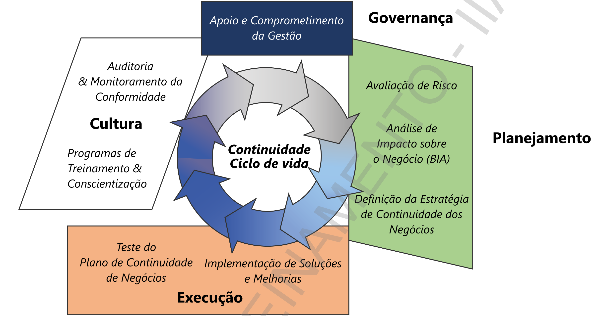

**Apoio e Comprometimento da Gestão — **a gestão deve mostrar apoio para preparar, manter e praticar adequadamente um plano de continuidade de negócios (BCP), atribuindo recursos, pessoas e orçamento.

**Avaliação de Risco e Mitigação de Risco —** Potencialriscos devido aameaças como incêndio, inundação etc., devem ser identificados, e a probabilidade e o impacto potencial para o negócio deve ser determinado. Isto deve ser feito para garantir que os riscos de todos os eventos sejam compreendidos e geridos de forma adequada.

**Análise de Impacto nos Negócios (BIA) —** Um BIA é usado para identificar processos criticos de negócios que devem ser recuperados após um desastre, visando manter a organização funcionando. Além disso, é utilizado para determinar quando e qual o nível de informação que deve ser recuperada após o desastre. Para tanto é definido o: RTO - Tempo de atraso entre o ponto de interrupção e a retomada do processamento normal e o RPO - Representa os dados que serão perdidos, destruídos ou estarão indisponíveis, após a recuperação bem-sucedida.

Héprodução total ou parcial deste material é expressamente proibida

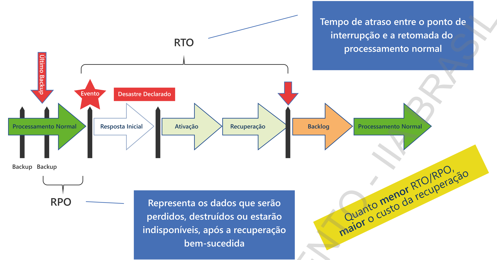

Estratégia de Recuperação e Continuidade de Negócios — Esta estratégia aborda as etapas, pessoas e recursos necessários para recuperar processos críticos para o negócio, identificados durante o BIA. Considera:

= processos manuais que devem ser feitos enquanto o sistema está indisponível

= outsourcing — trabalhos realizados por companhias externa, competidores (acordo de reciprocidade) ou fornecedores

= Recuperação de Desastre para TI — um plano de recuperação de TI para sistemas críticos

= Recursos humanos alternativos: identificar outras pessoas da equipe que poderiam realizar os trabalhos dos processos quando houver necessidade

= Instalações alternativas: identificar instalações alternas onde os funcionários possam trabalhar.

Conscientização e Treinamento — Educação e conscientização sobre o programa de GCN são fundamentais para a execução do plano.

Exercícios  Os funcionários devem participar de exercícios práticos sprogramados regularmente do programa de GCN.

Manutenção - Os recursos e a documentação do GCN devem ser atualizados para garantir que eles permanecem eficazes e alinhados com as prioridades de negócios. Nesta etapa é importante a realização de auditorias para avaliação da conformidade e ajustes caso necessário.

Dependendo do porte da organização outros planos que suportam o GCN podem e devem ser detalhados, tais como

## Planos e Procedimentos

| **Plano** | **Procedimentos para:** |
|-----------|--------------------------|
| **Continuidade dos Negócios (BCP)** | Sustentar as operações essenciais do negócio enquanto se recupera de uma interrupção significativa |
| **Recuperação do Negócio (BRP)** | Procedimentos para recuperar as operações do negócio imediatamente após o desastre |
| **Contingência de TI** | Recuperar uma aplicação importante ou um sistema geral de suporte |
| **Recuperação de Desastre (DRP)** | Recuperar a capacidade de processamento devido a interrupções importantes com impactos de maior duração |
| **Respostas a Incidentes Cibernéticos** | Detectar, responder e limitar as consequências de incidentes maliciosos |
| **Comunicação de Crise** | Disseminar os reportes de situação aos funcionários e ao público |

## 6 OPERAÇÃO DOS SISTEMAS DE INFORMAÇÃO

Responsável por suportar continuamente o ambiente de Tl de uma organização

= Executa as atividades diárias necessárias para gerenciar a infraestrutura de TI, conforme os padrões de performance estabelecidos

= Geralmente é composto por turnos de operadores e que garante que as tarefas operacionais de rotina sejam executadas

« Monitoramento e controle, geralmente ocorre de forma centralizada e dependendo do porte da empresa por um NOC (Network Operations Center).

O NOC é um local centralizado onde uma equipe de operação de rede fornece supervisão, monitoramento e gerenciamento da rede, servidores, bancos de dados, firewalls, dispositivos e serviços externos relacionados. Este ambiente de infraestrutura pode estar localizado no local ou em um provedor baseado em nuvem.

### 6.1 Job Scheduling e a Automação do Processo de Produção

Job Scheduler é uma aplicação para controlar tarefas que devem ser executadas diversas vezes ou em uma determinada data. Contempla:

= interfaces com o usuário para definir workflows e/ou dependênCias com outras tarefas (Jobs)

= submissão automática 

= interface para monitorar as execuções

= prioridades e/ou filas para controlar a ordem de execução

Muitos sistemas operacionais possuem software básico para agendamento de Jobs, como o Cron (Unix) e o Windows Task Scheduler (Windows)

### 6.2 Gestão da Performance e Capacidade dos Serviços

O Processo de gestão da capacidade foi desenhado para garantir que:

= a capacidade dos serviços de Tl e da Infraestrutura de TI atenda aos requisitos relacionados a capacidade e desempenho acordados a custos efetivos e em tempo hábil

= as metas para níveis de performance sejam atingidas ou superadas através da gestão da performance e capacidade de serviços e recursos

= Produzir e manter um plano de capacidade que reflita necessidades atuais e futuras do negócio

= Apoiar diagnóstico e resolução de incidentes e problemas relacionados com capacidade

Para fazer a gestão da capacidade é necessário estar envolvido na avaliação de todas as mudanças, estabelecer os efeitos sobre a capacidade e desempenho. Isto deve acontecer tanto quando as mudanças são propostas, como depois de implantadas. Deve-se prestar atenção em particular nos efeitos cumulativos das mudanças durante um período. Os efeitos cumulativos de uma única mudança podem frequentemente causar problemas nos tempos de resposta, problemas de armazenamento de arquivos, excesso de demanda para processamento etc.

Outras funções dentro do Gerenciamento de Capacidade são as de Administrador de Redes e Gerente de Aplicações e Sistemas. Eles são responsáveis por traduzir os requisitos do negócio para uma capacidade necessária que consiga satisfazê-los e aperfeiçoar o desempenho.

O Gerenciamento da Capacidade oferece os seguintes benefícios:

= Uma visão geral sobre a capacidade atual existente na infraestrutura

= À possibilidade de planejar a capacidade antecipadamente

= Possibilita estimar o impacto de novas aplicações ou modificações

= Economias de custos 

= Melhores serviços em harmonia com os requisitos do negócio.

Alguns problemas comuns que podem ser encontrados na gestão da capacidade são:

= Informações sobre capacidade vindas de fornecedores podem não estar disponíveis, serem muito genéricas ou estar equivocadas.

= À expectativa sobre o que o Gerenciamento da Capacidade pode trazer, ser superestimada. Se uma aplicação for projetada de maneira errada, a capacidade não irá resolver o problema.

= Asinformações da monitoração podem ser muito detalhadas, fazendo com que o processo seja muito caro.

= A informação pode ser difícil de ser obtida. Não é fácil sempre predizer que a capacidade futura será necessária antes de desenvolver uma aplicação.

### 6.3 Gestão do Nível de Serviço

O processo de Gerenciamento do Nível de Serviço gerencia a qualidade dos Serviços de TI conforme os acordos firmados entre os usuários e o departamento de Tl chamados Acordos de Nível de Serviço (ANS).

Tem como propósito assegurar que todos os serviços atuais e planejados sejam entregues com metas mensuráveis e acordadas:

= Define, acorda e documenta níveis de serviço

= Monitora, reporta, analisa criticamente e revisa níveis de serviço 

= Melhora níveis de serviço

Principais funções:

= Determinar, negociar, documentar os Acordos dos Requisitos dos Níveis de Serviço

= Produzir os SLA's, OLA's e Contratos de Apoio

= Analisar e revisar os Acordos (SLA's) e Contratos 

= Monitorar o desempenho do serviço

= Produzir relatórios periódicos das entregas dos serviços acordados no SLA

= (Conduzir a revisão do serviço e estabelecer ações no Plano de Melhoria dos Serviços

= Medir e Melhorar a Satisfação dos Clientes

Para entender o processo de Gerenciamento do Nível de Serviço, é necessário entender alguns conceitos básicos que são usados.

**Requisitos de Nível de Serviços (RNS)**

Este é um documento que contém todos os requisitos do cliente relacionados aos Serviços de TI. Define a disponibilidade e desempenho que os clientes precisam para estes serviços. É o ponto inicial para traçar os Acordos de Nível de Serviço.

**Especificações de Serviço**

A organização de TI rascunha as Especificações dos Serviços baseadas no RNS. É uma transcrição dos requisitos do cliente e “como” a organização de TI irá fornecer estes serviços. Quais são as necessidades técnicas? Ele irá mostrar os relacionamentos entre os ANS's, fornecedores e a própria organização de TI.

**Acordo de Nível de Serviço (ANS)**

O ANS é um documento que define níveis de serviços acordados entre o cliente e o provedor de serviços, por exemplo, entre Tl e o negócio. O ANS deve ser escrito em linguagem que o negócio entenda, clara, concisa e livre de jargões. O ANS não deve incluir diagramas de procedimentos detalhados para outros processos ou informações técnicas que o negócio entenda.

**Contratos de Apoio (CA)**

Com um fornecedor externo ou terceiro que está sendo envolvido na entrega de Serviços de TI, haverá um contrato que garanta que ele fornecerá o serviço dentro de um prazo, custo, nível etc. A organização de TI passa os requisitos do negócio para os fornecedores externos.

Este documento será reflexo dos níveis de serviços definidos nos ANS's. Por exemplo, se o ANS apresenta um conserto de uma impressora em 5 dias, então o CA com o terceiro deverá dar suporte a esta necessidade. Por exemplo, o conserto da impressora e o retorno para a organização em 3 dias.

**Acordo de Nível Operacional (ANO)**

Alguns serviços de TI dependem de outros serviços providos dentro da própria organização de TI. Por exemplo, um sistema que é executado via rede depende da disponibilidade da rede. Acordos sobre a disponibilidade da rede serão desenhados em um Acordo de Nível Operacional (ANO). Assim, como a CA, estes “contratos” internos irão dar suporte aos ANS's da mesma maneira. A diferença é que o foco é voltado para dentro da organização de TI.

**Exemplos de Riscos:**

= Falha no processamento das transações online e/ou em batch comprometendo a integridade, validade e a tempestividade das informações dos sistemas

= Programação incorreta ou ausência de alarmes no processamento dos sistemas

= Dificuldade de recuperação de dados em caso contingência, por falhas na execução dos backups”

= Implementação de programas não autorizados no ambiente de produção

= Serviços prestados em desacordo com os SLA's estabelecidos

= Ausência ou descumprimento de contratos para suporte aos sistemas e/ou infraestrutura da TI

**Controles a serem considerados:**

= O processamento é monitorado para assegurar que seja completado adequadamente e no prazo apropriado, incluindo a revisão e resolução de quaisquer exceções

= Exceções ao processamento normal são registradas, revisadas pela gestão, e prontamente resolvidas

= Procedimentos de processamento em lote e on-line são definidos para assegurar que os trabalhos e/ou transações sejam processados até o término normal ou sejam recuperados e reprocessados

= QOacesso a linguagem de controle do processamento de produção e aos programas executáveis é definido para restringir a pessoas apropriadas, a autoridade para executar, modificar, deletar ou criar.

= Os dados são mantidos de acordo com leis, regulamentos e a política da empresa e de maneira que seja possível recuperá-los quando necessário

= A administração e usuários planejam e programam backups e retenção de dados, bem como a exclusão ou liberação da mídia quando a retenção não é mais requerida.

= Ferramentas de retenção de dados automatizados implementadas para gerenciar o backup e a programação do período da retenção dos dados

= As condições de leitura dos backups e dados retidos são testadas periodicamente através da restauração ou outros métodos

= Os backups são arquivados em outra localidade para minimizar o risco da perda de dados

= Aadministração monitora os níveis de serviço de Tle inicia ações corretivas se a performance não atingir os níveis de serviços esperados.

= À performance e capacidade de utilização do ambiente de processamento informatizado são medidas, reportadas e revisadas pela gerência

= À organização possui contrato formalizado para obtenção de suporte técnico ou dos aplicativos, com prestadores de serviços externos e/ou fornecedores de softwares, assegurando o fornecimento desse suporte. A administração monitora o cumprimento destes contratos.

**6.4 Service Desk**

É a central de serviços que tem como propósito fornece o ponto único de contato entre clientes, colaboradores e parceiros de negócios e garantir que os usuários recebam a ajuda necessária em tempo hábil.

Acaba sendo a vitrine da Tl e influencia diretamente na satisfação dos clientes, ou seja, se a central de serviços não fizer um bom trabalho pode pôr em risco a credibilidade da TI.

Para tanto precisa ter processos muito bem definidos, pois é no service desk que são registradas as entradas e saídas de pedidos de suporte e manutenção da infraestrutura de TI (equipamentos, softwares, etc) para controle, rastreabilidade, priorização e garantia da padronização dos trabalhos.

**Operacionalmente é responsável por:**

= Registrar incidentes e requisições de serviços, categorizar e priorizar

= Investigar e diagnosticar o incidente em primeiro nível 

= Resolver incidentes e requisições, quando possível

= Escalonar incidentes e requisições de serviços para outros grupos para resolução dentro dos prazos acordados

= Atualizar os usuários sobre o progresso dos casos = Encerrar todos os incidentes e requisições de serviço

= Conduzir pesquisas de satisfação

**6.5 Gestão de Configuração e Ativos**

É o processo que garante a informação atualizada sobre todos os ativos e componentes dos serviços de TI. Normalmente suportado por software, se preocupa em manter um repositório de informações sobre todos esses componentes, o qual chamados de item de configuração, em um ou mais banco de dados de informação.

O item de configuração deve ser controlado no nível mais crítico, pois no intuito de querer controlar tudo, pode em um espaço curto de tempo ficar com uma lista desatualizada/obsoleta. Outra informação importante é que, normalmente um item de configuração é parte de outro. Exemplos:

= um servidor é parte de um site de infraestrutura

= Um roteador está conectado em uma rede LAN

= serviço de negócio a um sistema aplicativo

= Sistema aplicativo está hospedado em um servidor

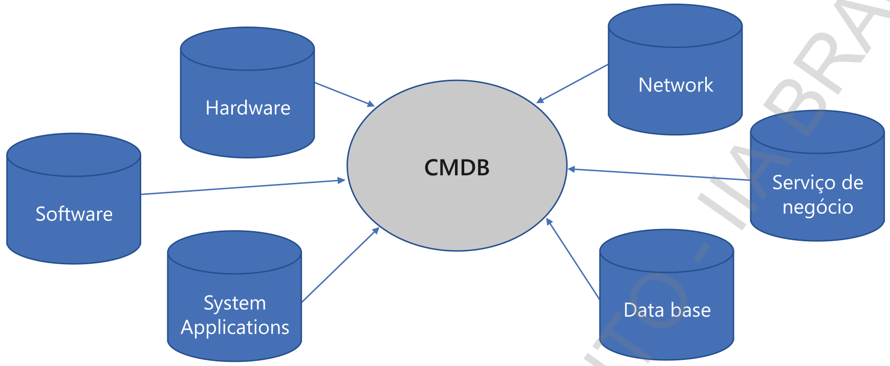

A gestão de configuração e ativos tem como propósito: Garantir que os ativos necessários para entrega de serviços sejam controlados de forma apropriada, e que informações confiáveis e precisas sobre esses ativos sejam disponibilizadas quando necessário.

### 6.6 Gestão de Incidentes

O processo de Gerenciamento de Incidentes tem como missão restaurar a operação normal do serviço o mais rápido possível, e minimizar o impacto adverso nas operações do negócio, garantindo que os níveis de serviço acordados sejam mantidos

**Características:**

= Aberto por usuários ou pelo pessoal técnico através da gerência de eventos

= Tratamento de qualquer evento que interrompa ou possa interromper um serviço ou provoque queda de qualidade do mesmo

= Atua no sintoma. Exemplo dor de cabeça. Dá a aspirina, não atua na causa.

= Procedimento pré-acordado para lidar com um tipo de incidente em particular. Utiliza base de erros conhecido

= Categorização considera normalmente impacto x urgência

= Pode desencadear o acionamento do Plano de Continuidade

**O Processo de Gestão de Incidentes tem como objetivos:**

= Resolver os incidentes o mais rápido possível, restabelecendo o serviço normal dentro do prazo acordado nos ANS's (Acordo de Nível de Serviço - SLA);

= Manter a comunicação dos status dos incidentes aos usuários;

= Escalonar os incidentes para os grupos de atendimento para que seja cumprido o prazo de resolução;

= Fazer avaliação dos incidentes e as possíveis causas, informando ao processo de Gerenciamento de Problemas. Este processo não é responsável por fazer o diagnóstico identificando a causa raiz, apenas auxiliará o processo de Gerenciamento de Problemas que tem este foco.

O escopo do gerenciamento de incidentes é muito amplo e pode incluir aspectos que afetem os serviços ao cliente tais como: falha de hardware, erro de software, solicitações de informações, solicitação de mudança de equipamento, troca de senha, novos funcionários, solicitação de suprimentos, problemas de desempenho, dentre outros.

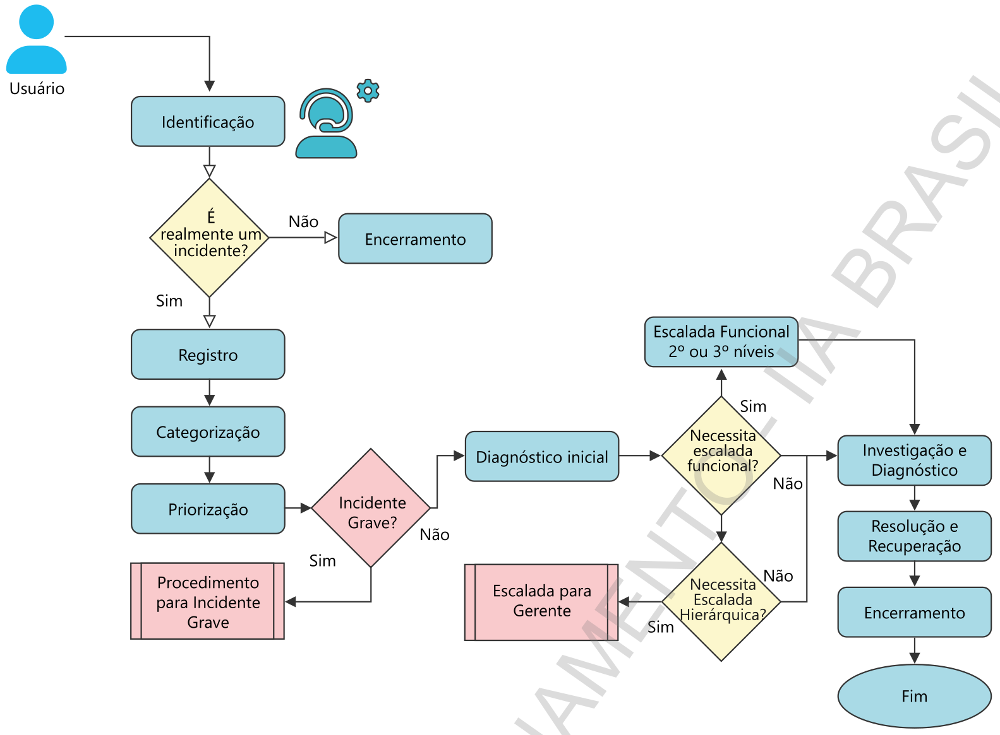

### 6.7 Gestão de Problemas

Muito áreas de TI, tem como tarefa diária apagar incêndios. O grande volume de chamados com erros em sistemas, falhas em hardware acabam criando um gargalo para a equipe de suporte.

A equipe com a correria do dia a dia, acaba fazendo com que os problemas não sejam resolvidos adequadamente, utilizando apenas soluções paliativas para tentar aliviar a pressão dos usuários.

Desta forma, o problema da qualidade da solução faz com que o incidente volte a acontecer, ocupando o tempo da equipe de suporte para resolver o incidente. O que acaba acontecendo é que a equipe de suporte quase nunca resolve o problema de forma definitiva devido à falta de tempo. Tornando um ciclo vicioso.

Parece óbvio, mas uma forma de reduzir a quantidade de incidentes é evitando a sua recorrência. O ITIL define um processo para endereçar esta situação, chamado de Gestão de Problema cujo propósito é o de "Prevenir a ocorrência de problemas e seus incidentes resultantes, eliminar ou reduzir a recorrência de incidentes e minimizar o impacto de incidentes que não podem ser evitados.”

A Gestão de Problemas visa encontrar relacionamentos dos incidentes, problemas e erros conhecidos para “análise da causa raiz”.

Com isto, será possível fazer uma melhor gestão do conhecimento, fazendo com que a maioria dos incidentes seja resolvido no 1º nível de suporte.

É importante que o Processo de Gerenciamento de Problemas venha acompanhado do Gerenciamento de Mudanças, fazendo com que a correção dos erros seja previamente analisada em relação aos riscos. Muitas vezes, a correção de um erro acaba gerando mais incidentes e criando impacto para os usuários.

**Principais conceitos envolvidos neste processo:**

**= Problema:** é a causa desconhecida de um ou mais incidentes

**= Solução de Contorno:** solução não definitiva (em inglês Workaround)

**= Causa:** é um erro em um Item de configuração

**= Erro Conhecido (Known Error):** É um problema cuja causa foi diagnosticada e para qual existe uma solução

**= Solução:** solução definitiva

**= Gestão de Incidentes X Problemas:** foco na Solução rápida x foco na introdução de melhorias confiáveis e robustas na infra-estrutura.

Um Gerenciamento de Problemas com sucesso pode ser medido por:

= Número de Problemas por status, serviços, impacto e classificação;

= Número e impacto dos Incidentes durante a operação do procesSo;

= Percentual de esforço reativo x proativo;

= Esforço, custo e prazo dos diagnósticos;

= Número de Requisições de Mudança geradas pelo processo de Controle de Erros;

= Tempo para Solução de Problemas x Tempo Estimado.

### 6.8 Gestão de Mudanças

A Gestão de mudanças é um dos processos mais críticos do Gerenciamento de Serviços de Tl e tem como propósito controlar todo o ciclo de vida de todas as mudanças, permitindo que sejam bem-sucedidas e com o mínimo de interrupção nos serviços de TI.

Para solicitar uma mudança no ambiente de tecnologia é necessária uma requisição formal com os detalhes da mudança com a finalidade de manter controles de autorização, rastreabilidade, cumprimento de padrões, dentre outros. Esta requisição, normalmente é chamada de RDM.

Quando se trata de mudanças mais complexa, que envolve por exemplo, implementação de novos serviços, que gera impactos em diversas áreas de negócio como faturamento, cobrança, cadastro de produtos, dentre outros é necessário a requisição por meio de uma proposta de mudança.

As mudanças podem ser categorizadas em Normal, Padrão e Emergencial

**Normal —** deveriam ser avaliadas e autorizadas e documentadas antes de serem executadas

**Padrão —** nascem pré-autorizadas; pois são normalmente procedimentos padrão e de baixo complexidade e impacto no ambiente tecnológico. Exemplo: instalação de software para usuários)

**Emergencial —** para uma mudança ser classificada em emergencial deve estar relacionada a falhas não previstas e de alto impacto. Pelanecessidade de se implantar com maior velocidade, a documentação é realizada após a execução. No entanto, deve passar pela autorização de um Comitê de Mudanças Emergenciais antes da implantação.

Uma mudança para ser adequadamente avaliada deve conter pelo menos os 7R's: Requisitante, 
Razão, 
Retorno, 
Risco, 
Recursos, 
Responsável e 
Relacionamento com outras mudanças

Uma forma de monitorar a qualidade do processo é implementar e medir os seguintes indicadores:

= Mudanças não autorizadas

= Interrupções não planejadas

= Baixa taxa de sucesso das mudanças

= Alta número de mudanças emergenciais

= Atraso na implementação de projetos

### 6.9 Riscos e controles relacionados a Gestão de Mudanças

**Riscos**

= Mudanças nos processos de negócio, softwares e ou configurações de sistemas não autorizadas e implementadas em ambiente de produção

= Mudanças não registradas e não rastreáveis 

= Ausência de priorização na implementação das mudanças

= Falta de habilidade no atendimento de mudanças emergenciais

= Impactos negativos ocasionados por mudanças sem um plano de recuperação definido

= Impactos imprevistos decorrente da falta de envolvimento de pessoas chaves no processo de avaliação da mudança

**Controles**

= Apenas o pessoal mínimo necessário para implementar mudanças na produção de TI devem ter acesso ao ambiente de produção (preventivo).

= Processos de autorização devem envolver as partes interessadas para avaliar e mitigar os riscos associados com as mudanças propostas (preventivo).

= Processos de supervisão devem incentivar o gerente e pessoal de Tla realizar suas funções com responsabilidade (preventivo) e ser capaz de detectar os desvios de desempenho (detectivo).

= Mudanças emergenciais são realizadas somente com autorização (preventivo). Controles existem para assegurar que ao fim da crise, todos os passos importantes da mudança emergencial foram documentados / cumpridos (detectivo).

Um aspecto importante a considerar é que o processo de Gestão de Mudanças possui dependências relevantes de controle com outros processos do Gerenciamento de Serviços de TI, a saber: Service Desk, Gestão de Configuração e Ativos, Gestão de Incidentes e Problemas e Gestão de Liberação.

Para entendermos melhor esta correlação, a seguir vamos descrever brevemente o papel de cada um.

## 7 AUDITORIA 4.0

**Definições e Características**

Termo utilizado para abordar a mudança de paradigmas e inovação da auditoria em referência a quarta revolução industrial

Aborda questôesaserem elencadas como próximos passos paraa mudança de mentalidade e cobertura dos riscos dinâmicos da organização, que vai além das avaliações operacionais, considerando a avaliação da estratégia

Não muito tempo atrás, era difícil imaginar um mundo em que a atividade de auditoria interna pudesse ser automatizada.

Aspecto fundamental do argumento de valor da auditoria interna são os julgamentos humanos que devem ser feitos na avaliação da eficácia dos controles internos e das atividades de gerenciamento de riscos.

A automação chegou — surgem incríveis possibilidades para que a tecnologia faça coisas que antes eram consideradas possíveis apenas para seres humanos

Para quea auditoria permaneça relevante e até viável, os novos paradigmas apresentados pela evolução da ciência de dados, incluindo a IA e a RPA, devem ser vistos como uma ameaça à proposta de valor da auditoria como conhecemos hoje.

### 7.1 O que é uma auditoria ágil?

O conceito de auditoria ágil pode ser definido de duas formas:

= Uma auditoria que tornou seus processos mais rápidos e menos dispendiosos, alcançado pela prática de agilizar, por meio de esforços de melhoria dos processos.

= Uma auditoria que adota o uso da metodologia de desenvolvimento de software Agile e uma mudança de mentalidade associada para obter mais valor e agilidade do processo

Não é uma bala mágica, é apenas um caminho para ser explorado na nossa jornada.

No entanto, há um objetivo comum entre ambos, que é o de aumentar a capacidade da função da auditoria interna de ser mais ágil em resposta a cenários de risco dinâmicos

Em específico, dado a mudança de paradigma, onde uma auditoria substitui o modelo cascata (waterfall) e passa a usar a metodologia Agile para realizar seu trabalho. Sempre surge a pergunta. É compatível com as Normas?

Sim, é compatível com as Práticas Profissionais da Auditoria Interna; pois as Normas não determinam metodologia formal de auditoria interna e se baseia em princípios.

**Benefícios**

= Cria oportunidades para obter eficiência

= Constrói relacionamento — valoriza as relações de colaboração com os clientes de auditoria

= Desafia a auditoria a pensar de forma diferente do que é normal na auditoria

= Revigora a “marca” auditoria interna

= Melhora as experiências e ajudam a fornecer uma solução para atender as expectativas dos stakeholders

**Pontos de Atenção**

= Documentação pode ser insuficiente ou negligenciada

= Datas de entrega difíceis de estabelecer

= Produto final pode ser muito diferente do inicialmente concebido, pois é iterativo e envolve a constante priorização de recursos e produtos

= Expectativas podem ser perdidas se os clientes não forem adequadamente envolvidos

**Algumas atividades de Auditoria Ágil**

= “Estufas” — áreas de trabalho com aparência inerentemente mais social para promover a colaboração com a equipe de auditoria e stakeholders

= Sprints — período de um mês ou menos, durante o qual a equipe produz um incremento. Data de inicio e fim determinadas

= Reuniões em formato stand-up meeting Mural Ágil (quadro Kanban) — representa o trabalho “a fazer” “em andamento” e “concluído”

= Retrospectivas — última cerimônia realizada ao fim de cada sprint em que a equipe revisa suas ações

» O que está funcionando bem? O que poderia ser melhorado? O que está nos intrigando? O que poderia ser feito de forma diferente ou o que desejamos?

Auditoria Interna Ágil x Tradicional

## Comparação entre Auditoria Interna Ágil e Auditoria Interna em Cascata

| **Atributo** | **AI Ágil** | **AI Cascata** |
|--------------|-------------|----------------|
| **Foco Central** | Expectativas de valor definidas | Objetivos de Auditoria |
| **Sequência de Trabalho** | Ciclos de trabalhos sequenciais | Estágios / fases lineares |
| **Relacionamento com o Cliente** | Colaborativo | Certa distância para garantir independência e objetividade |
| **Pontos de Auditoria / Descobertas / Conclusões** | Alinhado com estratégias de negócio e objetivos correspondentes; descoberta colaborativa | Focados em riscos e controles com potencial de limpeza excessiva pela gestão |
| **Planejamento** | Iterativo e incremental | Plano principal semirrígido |
| **Propriedade** | Baseada na equipe | Exclusiva à equipe de auditoria interna |
| **Gerenciamento de Recursos** | Feitos em incrementos de tempo definidos | Orçamento principal do trabalho |
| **Avaliação de Riscos** | Avaliações em diversos níveis (executivos, gerentes etc.), vinculadas aos objetivos de negócio | Riscos identificados e avaliados para os objetivos de negócio |
| **Atualizações de Status** | Reuniões diárias (stand-up); leituras incrementais com o cliente e stakeholders | Ad hoc; conforme necessidade ou frequência definida pela metodologia da organização |
| **Documentação** | Racionalizada; baseada em valor; regra 80/20 | Integralidade e precisão valorizadas para garantir trabalho corroborável |
| **Normas Profissionais** | Alinhada ao Framework Internacional de Práticas Profissionais do The IIA | Alinhada ao Framework Internacional de Práticas Profissionais do The IIA |

### 7.2 Data Science — Fatores Importantes

Data Science ou Ciência de Dados é o termo utilizado para definir a extração de informações a partir de dados coletados de diversas fontes. Utiliza um conjunto de habilidades que envolve estatística, computação e conhecimento de negócios.

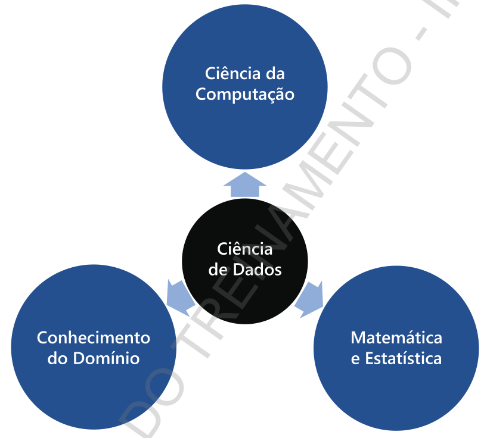

O principal objetivo é extrair e interpretar dados de forma eficaz e apresentá-los em uma linguagem simples e não técnica para os usuários finais. Trazendo isso para uma realidade dos auditores, seria a de obter análises mais precisas sobre a gestão de riscos e apresentá-la de forma mais eficaz às partes interessadas.

Considerando, mas não se limitando. aos seguintes fatores:

= Disseminação dos dispositivos computacionais, incluindo telefones, relógios inteligentes, câmeras de segurança, loT - internet of things (geladeiras, óculos, etc)

= Surgimento de soluções para trabalhar com dados, dentre estas as desenvolvidas em plataformas "open source”.

Os executivos têm desafiado os auditores a acompanharem a evolução e transformação digital, questionando como estamos utilizando a tecnologia para:

= Obter maior cobertura nas avaliações,

= oOlharo futuro e não fixar apenas no passado,

= ter maior autonomia e independência no acesso aos dados

A forma como usamos os dados, trata de uma mudança do valor que entregamos para a organização, atuando não somente no que aconteceu, mas no que pode acontecer. 

A matéria prima do auditor são os dados, que quando relacionados produz informação. A informação associada a outras produz conhecimento e ao integrar diferentes conhecimentos produzimos inteligência. 

**Em termos de categorias, podemos dividir em:**

= Análise descritiva: O que aconteceu? 

É a técnica menos sofisticada e mais usada. Analisa os eventos passados para explicar o que aconteceu. Ex: Baixas de pagamentos em dias não úteis

= Análise diagnóstica: Por que aconteceu?

Utiliza os eventos passados para explicar porque certas tendências ou incidentes específicos ocorreram. Este tipo de análise pode nos informar por exemplo, quais funcionários realizaram baixas manuais em dias não úteis.

= Análise preditiva: O que pode acontecer?

Permite que os extraiam informações de grandes volumes de dados, apliquem certas suposições e desenhem correlações para prever resultados e tendências futuras. Ex: Baixa de pagamentos em dias não úteis para clientes inadimplentes há mais de 90 dias.

= Análise prescritiva: Como fazer acontecer?

Procura recomendar o que deve ser feito com base em uma estimativa do que vai acontecer.

Os dados podem ser classificados, quanto ao formato, em estruturados e não estruturados. Os dados estruturados são representados por colunas, que definem atributos e linhas que contêm os registros de uma tabela. Os dados não estruturados por sua vez, são informações não organizadas, como imagens, áudio, vídeos, arquivos de textos, dentre outros.

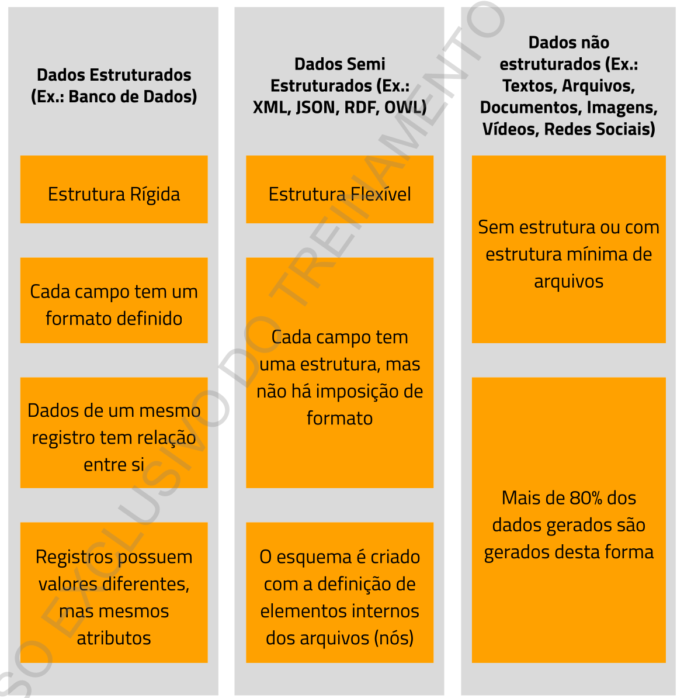

Com o avanço da tecnologia e os seus respectivos resultados, o cenário de negócios ficou ainda mais competitivo. E com isso as empresas tiveram que desenvolver soluções para análise dos dados. A seguir segue os conceitos mais utilizados:

**BIG Data -** termo popular, usado para descrever o crescimento e disponibilidade exponenciais dos dados criados por pessoas, aplicativos e máquinas inteligentes.

O termo também é usado para descrever conjuntos amplos e complexos de dados que vão além das capacidades das aplicações tradicionais de processamento de dados. A proliferação de dados estruturados e não estruturados, combinada com os avanços técnicos do armazenamento, capacidade de processamento e ferramentas analíticas

**Datawarehouse —** grande depósito de dados organizacionais, desenvolvido para análise e reporte. São tipicamente, banco de dados relacionais que armazenam informações de múltiplas fontes.

Ferramentas de ETL (Extract, Transform and Load) ou ELT (Extract, Load and Transform) utilizadas para extrair dados dos diversos sistemas e transformar no formato do data warehouse

**Data Lake —** reservatório de dados para integração, armazenamento e Analytics, seu conceito é mais amplo que um Data Warehouse, pois aceita dados não estruturados e semiestruturados.

**ERP (Enterprise Resources Planning) - Características**

**Sistema de Gestão Integrado**

= Segurança — Possui recursos que permitem criar perfis de acesso e controlar a funcionalidade no nível de objeto

= Integração — possui um conjunto de módulos (Ex. Finanças, Contabilidade, Compras, etc) que estão integrados no mesmo sistema e base de dados, evitando redundância e falta de padrões na definição de informações

= Redesenho de Processos — alavanca a revisão e o redesenho de processos para uso do sistema, bem como a segregação de funções para adequação dos acessos 

= Customização - Por se tratar de um pacote, por muitas vezes as customizações são necessárias. Podendo aumentar custos de manutenção e posterior atualização de versão.

### 7.3 Auditoria Continua x Monitoramento Continuo

**Auditoria continua:**

= compreende avaliação de riscos e controles continuos por intermédio da tecnologia

= avaliações contínuas baseadas em uma conjunto maior de transações ao invés de avaliações periódicas de riscos e controles com base em uma amostra de transações

= Possibilita análise tempestiva de:

= exceções e anomalias (níveis de segurança, incidentes, segregação de funções , etc)

= padrões e tendências, bem como comparação entre pares = transações contra os limites do controle = teste de controles

= Habilita a auditoria interna a reportar áreas de preocupação em um intervalo de tempo menor que a auditoria tradicional

**Monitoramento Continuo:**

= Processo da gestão que monitora de forma continua se os controles estão operando adequadamente

Permite à gestão verificar de forma rápida e acurada os focos de atenção e recursos visando a melhoria dos processos, implementação de correções, e endereçamento dos riscos

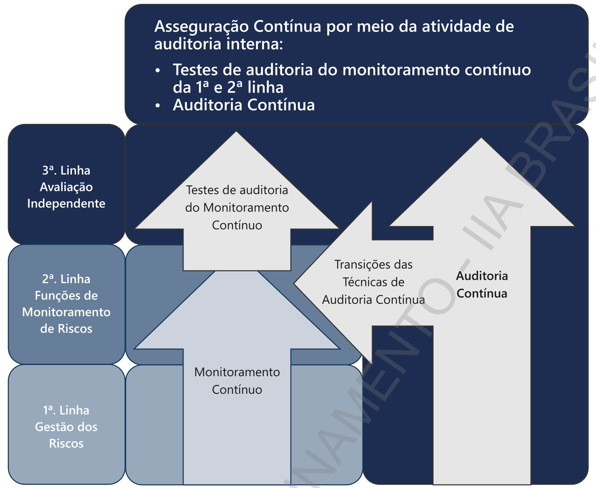

= A função de auditoria continua depende da função de monitoramento continuo de controles

= Relação inversa, quanto maior o papel da Administração menor o papel direto da auditoria interna

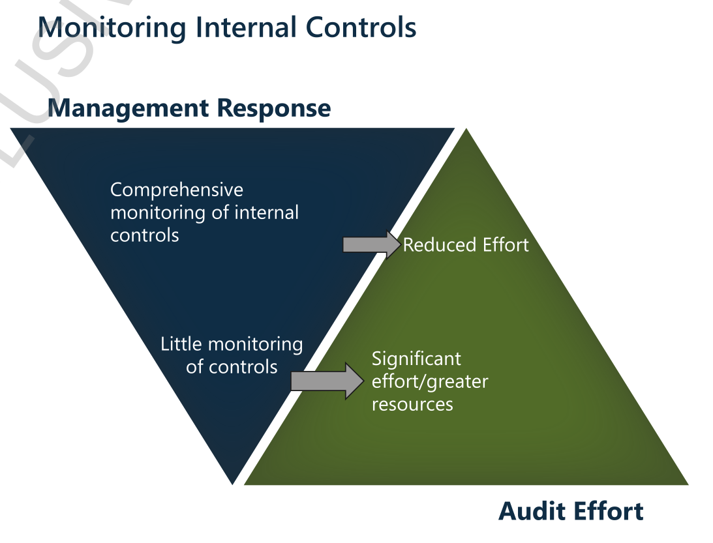

### 7.4 Inteligência Artificial e a Auditoria Interna

= Existem inúmeros estudos que reivindicam tecnologias disruptivas, como inteligência artificial (IA), computação cognitiva, automação de processos robóticos (RPA) e outros processos de automação

= Qualquer tarefa que possa ser claramente definida e isolada em um fluxo de trabalho pode, em princípio, ser automatizada

8 REFERÊNCIAS BIBLIOGRÁFICAS

GARTNER (USA) (org.) Disponível em: https:/www.gartner.com.

AUDITORS, The Institute Of Internal (org.)

AUDITORS, The Institute Of Internaln (org.) Global Technology Audit Guide (GTAGs)

(IBGO). Instituto Brasileiro de Governança Corporativa. Governança Corporativa: Código das melhores práticas de Governança Crporativa

COSO (org.). COSO ICIF

COSO (org). COSO ERM

TIL. ÍTIL Foundation

ISACA. COBIT 2019 Framework

NIST: nvipubs.nist.gov/nistpubs/CSWP/NIST.CSWP.29.pdf

SECURITY, Center for Internet. CIS Controls (https:/www.cisecurity.org/ controls)

ASSOCIAÇÃO BRASILEIRA DE NORMAS TÉCNICAS. NBR ISO/IEC

BRASIL. Lei nº 13.709, de 14 de agosto de 2018 - Lei Geral de Proteção de Dados Pessoais (LGPD)

EUROPA. Lei nº 679, de 27 de abril de 2016 - General Data Protection Regulation GDPR

PMI. Um guia do conhecimento em gerenciamento de projetos. Guia PMBOKO

AGILE (EUA). Manifesto para Desenvolvimento Ágil de Software: Manifesto para Desenvolvimento Ágil de Software