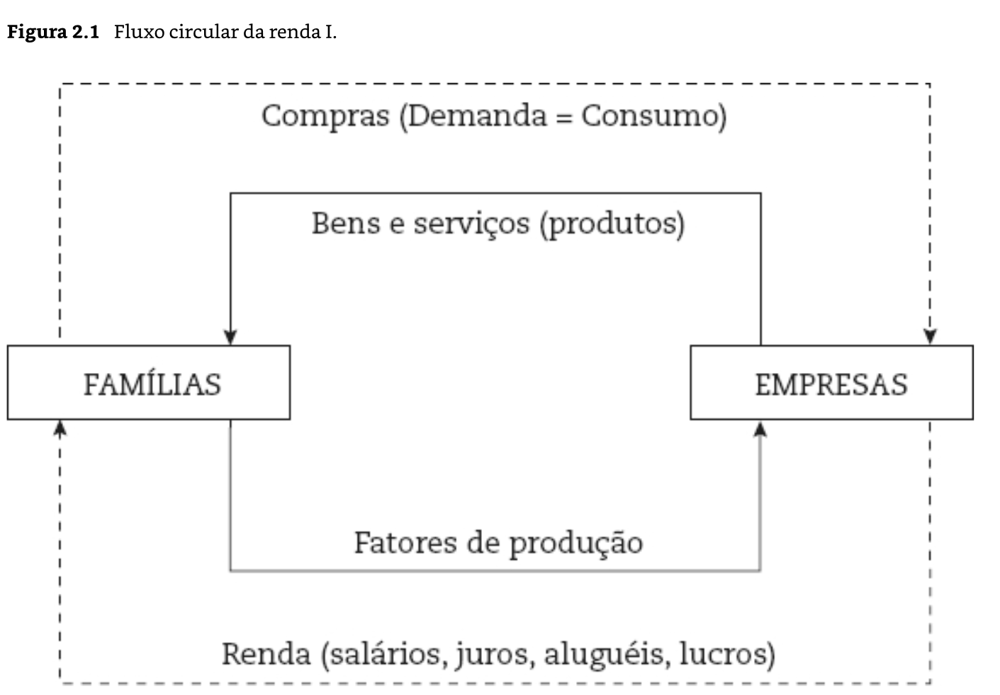
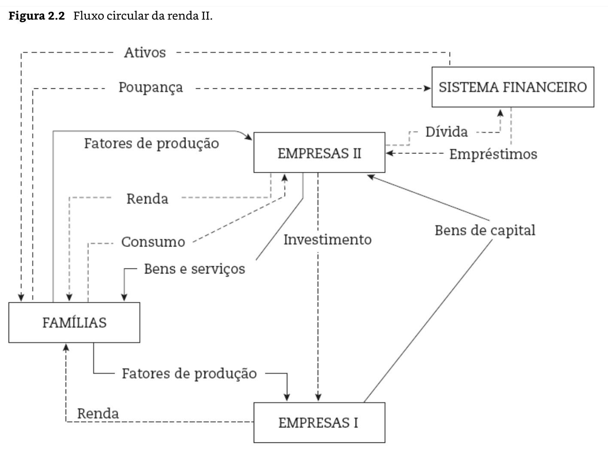
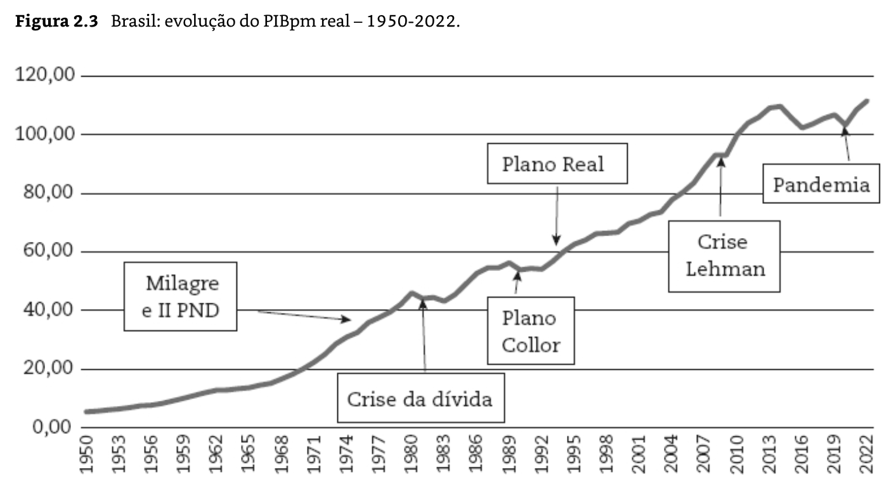
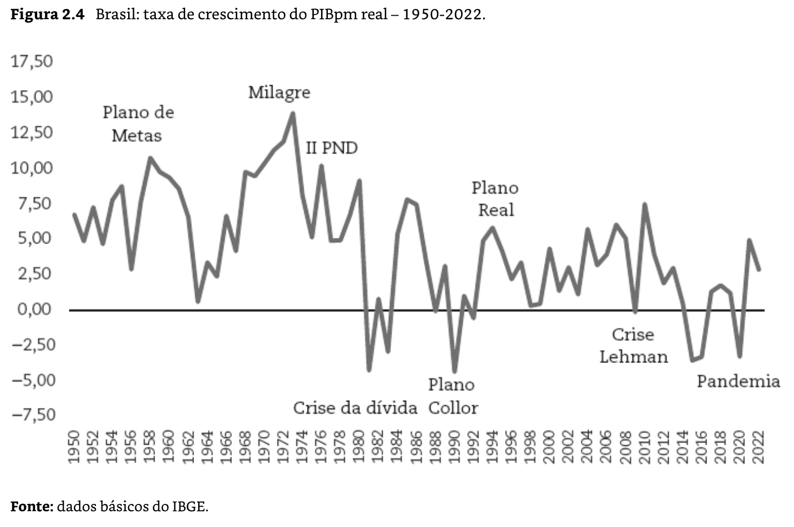

# Capítulo 2 -  Contabilidade Nacional: Agregados Macroeconômicos

## Página 1

Diferentemente da microeconomia, que trabalha com mercados isolados, a macroeconomia estuda todos os mercados em conjunto. Várias dificuldades colocam-se nesse sentido. Quando se analisa um mercado específico, determina-se, por exemplo, qual foi a quantidade produzida e vendida de sapatos e qual foi o preço. Todavia, se o objeto da macroeconomia é a totalidade dos mercados, como se faz para saber qual foi o total produzido e vendido e a que preço? O problema vem do fato de que uma sociedade produz sapatos, automóveis, café, soja, enfim, milhões de mercadorias. Para avaliar-se a riqueza da sociedade, isto é, a quantidade de bens de que dispõe, deverse-ia explicitar o quanto foi produzido de cada uma das milhões de mercadorias, o que seria não operacional e não ilustrativo para o analista. Torna-se necessário buscar medidas que permitam de forma simplificada mostrar o quanto a economia produziu, vendeu etc.

Assim, para que as análises macroeconômicas pudessem avançar, foi necessário o desenvolvimento de **um instrumental que permita mensurar a totalidade das atividades econômicas**. Esse instrumento recebeu o nome de **Contabilidade Nacional**, cuja evolução devese aos trabalhos do inglês Richard Stone (1913-1991), Prêmio Nobel 1984, e o russo naturalizado norte-americano Simon Kuznets (1901-1985), Prêmio Nobel 1971, ainda antes da Segunda Guerra Mundial[1]. A partir do desenvolvimento dessa técnica de mensuração, baseada no **método contábil de partidas dobradas**, houve grande avanço da teoria econômica, uma vez que se tornaram possíveis os **testes empíricos**📌 e uma análise qualitativa mais consubstanciada.

*[1] Deve ser destacada também a contribuição de Wassily W. Leontief (1905-1989), Prêmio Nobel 1973, russo naturalizado norte-americano, que criou a Matriz Insumo-Produto ou Matriz de Relações Intersetoriais, sistema contábil de dupla entrada, no qual são consideradas tanto as vendas como as compras de cada setor para os demais setores. Enquanto o Sistema de Contas Nacionais considera apenas os bens e serviços finais, a Matriz de Leontief mede tanto as transações com bens e serviços finais, como bens e serviços intermediários, que são os insumos que entram na composição dos bens e serviços finais.*

Neste capítulo, serão apresentados os principais agregados macroeconômicos e como mensurálos. Os conceitos básicos trabalhados são os de produto, renda e dispêndio. Espera-se que ao final do capítulo o leitor entenda como se chega a esses valores e os itens que os compõem.

### 2.1 DEFINIÇÃO DE PRODUTO

A economia estuda a alocação de recursos escassos para fins ilimitados, ou seja, como obter o máximo de satisfação para os indivíduos a partir de um estoque dado de recursos. Para satisfazer suas necessidades, o homem envolve-se em um ato de produção. **Produção** é a atividade social que visa adaptar a natureza para o desenvolvimento de bens e serviços que permitam a satisfação das necessidades humanas. No ato de produção, existe a combinação de uma série de elementos chamados de fatores de produção. **Fatores de produção** são os recursos utilizados na produção de bens e serviços. Normalmente, costuma-se separar os recursos em três grandes áreas: terra, capital e trabalho.

<blockquote style="background: linear-gradient(135deg, rgba(255, 184, 108, 0.1), rgba(255, 121, 198, 0.1)); border-left: 5px solidrgb(0, 17, 255); padding: 0.5rem; margin: 0.5rem 0; border-radius: 8px;">**T**erra = Terras agrícolas, Minério de ferro, Petróleo, Gás natural, Água (rios, aquíferos), Florestas (madeira), Carvão mineral.
**C**apital = Máquinas industriais, Equipamentos agrícolas, Edifícios e fábricas, Veículos de transporte de carga, Infraestrutura (portos, estradas, usinas), Tecnologia produtiva (hardware industrial).
**T**rabalho = Operários industriais, Agricultores, Engenheiros, Professores, Médicos, etc.</blockquote>

## Página 2

A produção é a principal atividade econômica a ser medida, uma vez que refletirá a capacidade de satisfação das necessidades dos membros da sociedade. Assim, o primeiro passo para avaliar-se o desempenho de um país é medir seu produto. Este corresponde à soma daquilo que foi produzido em um país durante determinado período. Trata-se, portanto, de um fluxo, por ser medido em dado período.

### Boxe 2.1 - Fluxos e estoques

Na economia, trabalha-se com **variáveis tipo fluxo**, que correspondem aquelas atividades econômicas contínuas, ininterruptas, e como tal devem ser medidas em determinado período, e com **variáveis tipo estoque**, que correspondem a magnitudes medidas em dado instante do tempo. Um exemplo clássico para diferenciar fluxo e estoque é o da caixa-d'água: fluxo corresponde à entrada e saída de água na caixa em determinado período, por exemplo, 10 litros/minuto; estoque corresponde à quantidade disponível de água na caixa em determinado momento, por exemplo, 200 litros. Percebe-se que a relação entre fluxo e estoque é de que todo estoque é alimentado por um fluxo, e, assim, a diferença entre o valor do estoque em dois momentos do tempo fornece o valor do fluxo que alimenta aquele estoque nesse período de tempo.

Alguns exemplos de variáveis fluxos e estoques em economia são:

<blockquote style="background: linear-gradient(135deg, rgba(255, 184, 108, 0.1), rgba(255, 121, 198, 0.1)); border-left: 5px solidrgb(0, 17, 255); padding: 0.5rem; margin: 0.5rem 0; border-radius: 8px;">**Fluxos:** produto, renda, consumo, poupança, investimento, gastos públicos, arrecadação de impostos, déficit público, exportações, importações, déficit em transações correntes etc.
**Estoques:** população, capital (K), dívida externa, dívida interna, estoque de moeda, ativos financeiros, riqueza etc.</blockquote>

Exemplos de relação entre fluxos e estoques:

a. Kt - (Kt-1) = It = Investimento agregado no período (t) — (t —1)

b. Dívida Pública (t) — Dívida Pública (t — 1) = Déficit Público em um dado momento (t)

A partir do produto, podemos avaliar o **crescimento econômico** de um país, que, em determinado período, é definido como o aumento do produto naquele período, ou seja, a elevação na produção de bens e serviços que satisfaçam às necessidades humanas.

<blockquote style="background: linear-gradient(135deg, rgba(255, 184, 108, 0.1), rgba(255, 121, 198, 0.1)); border-left: 5px solidrgb(0, 17, 255); padding: 0.5rem; margin: 0.5rem 0; border-radius: 8px;">A **produção** é a atividade social que visa adaptar a natureza para a criação de bens e serviços que permitam a satisfação das necessidades humanas.
Os **fatores de produção** são os recursos utilizados na produção de bens e serviços. 
O **produto** é a soma daquilo que foi produzido em um país durante determinado período.</blockquote>

O crescimento econômico de um país em determinado período é definido como o aumento do produto naquele período, ou seja, a elevação na produção de bens e serviços que satisfaçam às necessidades humanas.

## Página 3

Existem, porém, alguns problemas para se fazer essa soma, ou seja, para calcular o produto. Primeiro, como se pode somar a produção de bens completamente diferentes, como laranjas e parafusos?

Uma vez que a sociedade é marcada pela divisão do trabalho, ou seja, a produção se dá em diversas unidades produtivas especializadas, os indivíduos, para obterem o que precisam para sobreviver e satisfazer demais necessidades, devem vender seus produtos (e seu trabalho) no mercado para comprar o que necessitam. A maior parte da produção destina-se ao mercado, sendo trocada por certa quantidade de moeda, ou seja, os produtos têm um preço. Assim, surge a possibilidade de se agregarem os diferentes bens produzidos - por meio de seus valores monetários.

Além disso, a produção é um ato contínuo, ininterrupto; para medi-la, necessita-se estipular determinado período. Define-se com isso o **produto como a expressão monetária da produção de uma sociedade em determinado período, em geral, um ano** (é comum, também, um trimestre).

Nem toda etapa produtiva atende diretamente à necessidade dos indivíduos, pois existem certos produtos que são utilizados como insumos na produção de outros, ou seja, é uma mercadoria intermediária que vai compor um bem final. Por exemplo, o aço por si só não é diretamente consumido, mas, quando é utilizado na produção de automóveis, passa a compor o valor destes automóveis. Assim, a medição do produto não se dá pela soma do valor da produção em todas as etapas do processo produtivo, mas corresponde apenas ao valor da produção de bens e serviços finais, isto é, daqueles que sirvam diretamente para a satisfação das necessidades humanas.

Se for incluído no produto tanto o valor do aço como o valor dos automóveis, incorrerá **problema da dupla contagem**, pois o aço já está incorporado no valor do automóvel e, quando este é contabilizado, automaticamente o primeiro também o é. Assim, devem-se contabilizar apenas os **bens finais** no produto, isto é, os bens diretamente destinados à satisfação das necessidades humanas, e eliminar dessa contabilização os **bens intermediários**, que são os utilizados na produção de outros bens. Note-se que o conceito de “bem final” não decorre de nenhuma natureza intrínseca à mercadoria, pois uma mesma mercadoria pode ser utilizada como bem final e bem intermediário; por exemplo, o carvão que alimenta o forno de uma usina é um bem intermediário; o carvão usado para fazer um churrasco é um bem final.

Entretanto, também é possível contabilizar o produto por meio do chamado valor adicionado, considerando em cada etapa da cadeia produtiva aquilo que foi acrescido (adicionado) ao valor dos bens intermediários.

<blockquote style="background: linear-gradient(135deg, rgba(255, 184, 108, 0.1), rgba(255, 121, 198, 0.1)); border-left: 5px solidrgb(0, 17, 255); padding: 0.5rem; margin: 0.5rem 0; border-radius: 8px;">**Valor adicionado**: valor que foi, em cada etapa da cadeia produtiva, acrescido (adicionado) ao valor das matérias-primas utilizadas.</blockquote>

Pelo exposto, percebe-se que existem duas maneiras alternativas de medir o produto:

[1] **pelo valor dos bens finais**, ou
[2] pela agregação dos **valores adicionados** (valor do produto menos valor dos insumos) **em cada etapa produtiva**.

Veja o seguinte exemplo hipotético: um país onde o único bem consumido por seus habitantes seja o pão. Para produzir o pão, contudo, o país também produz a farinha e o trigo. Supondo também que o custo de produção do trigo seja nulo, a produção é feita de acordo com o seguinte esquema:

| Produto  | Valor do Produto | Insumos | Valor Adicionado |
|----------|------------------|---------|-------------------|
| Trigo    | 10               | 0       | 10                |
| Farinha  | 15               | 10      | 5                 |
| Pão      | 20               | 15      | 5                 |

## Página 4

O valor do produto de bens finais é 20, correspondente à produção de pães. Produziram-se também 15 em termos de farinha e 10 em termos de trigo. Ao somar toda a produção de cada um dos bens, chega-se a 45, o que se define como **Valor Bruto da Produção (VBP)**.

Entretanto, está-se contando duas vezes a farinha (por ela mesma e pela participação no valor do pão) e três vezes o trigo (por ele mesmo, no valor da farinha e no valor do pão). O produto final é o pão, cujo valor é 20, sendo que esse valor pode ser obtido pela soma dos valores adicionados dos setores de trigo (10), farinha (5) e pelo próprio pão (5). Assim, o valor do produto medido pela produção de bens finais deve igualar a soma do valor adicionado em cada etapa necessária a sua elaboração. A vantagem de medir por meio do valor adicionado é que permite estipular quanto cada ramo de atividade, ou setor, contribuiu para a geração do produto.

Assim, chega-se ao conceito final de Produto. Dentro de um país, este vem a ser o **Produto Interno Bruto a preços de mercado (PIBpm)**, ou seja, o valor monetário de venda dos produtos finais produzidos dentro do país em determinado período.[3] É por meio desse indicador que se avalia o desempenho de uma economia. A soma do valor dos bens finais ou a soma do valor adicionado em cada etapa do processo produtivo necessariamente será a mesma. Essa maneira de medir o valor do produto é chamada de **“ótica do produto”**.

*[3]. Algumas dificuldades de medição do Produto Interno Bruto (PIB) que se colocam são: (i) ***o mesmo bem pode ser utilizado como bem intermediário e bem final***. O açúcar, por exemplo, utilizado para adoçar o café em casa, é um bem final, já o açúcar utilizado em uma fábrica de refrigerantes no processo produtivo é um bem intermediário; (ii) nem tudo que é produzido se direciona ao mercado; por exemplo, um agricultor leva uma parcela de sua produção ao mercado para obter outros bens de que necessita, mas outra parcela ele pode utilizar para alimentar sua família (produção de subsistência), não sendo medida monetariamente; (iii) alguns serviços devem ser imputados no PIB; por exemplo, um indivíduo que mora de aluguel está pagando um preço pelo serviço de moradia (esse valor entra no PIB), mas o indivíduo que mora em casa própria e não paga aluguel também está consumindo um serviço de moradia e, como tal, o valor deste deve ser imputado no PIB. Há várias outras dificuldades, como diferenciar a atividade da dona de casa e da empregada doméstica; carro adquirido por uma família e por uma empresa etc. Outro ponto, como já foi dito, é que não é uma característica do produto que o define como bem final, mas sua utilização. Uma empresa, por exemplo, adquiriu aço para produzir automóvel, mas chegou o final do ano, o automóvel ainda não havia sido produzido e o aço estava no estoque. No ano seguinte, será considerado produto apenas a diferença entre o valor do automóvel e o do aço (bem intermediário), mas na medida do produto deste ano o aço é um bem final, foi comprado para ficar em estoque, logo entra no cômputo do produto.*

<blockquote style="background: linear-gradient(135deg, rgba(255, 184, 108, 0.1), rgba(255, 121, 198, 0.1)); border-left: 5px solidrgb(0, 17, 255); padding: 0.5rem; margin: 0.5rem 0; border-radius: 8px;">**PIBpm** é o valor monetário de venda dos produtos finais produzidos dentro de um país em determinado período.</blockquote>

### 2.2 PRODUTO, RENDA E DISPÊNDIO

Existem duas outras maneiras de medir o produto, além das discutidas na seção anterior. Podem ser denominadas **“ótica do dispêndio”** e **“ótica da renda”**. De acordo com elas, é possível medir o produto, respectivamente:

i. por meio do dispêndio ou da demanda (compras finais);

ii. por meio da renda gerada no processo produtivo.

O conceito de dispêndio refere-se aos possíveis destinos do produto, isto é, por quem e para que são adquiridos. Como será detalhado adiante, os principais destinos do produto são o consumo e o investimento. O primeiro refere-se aos bens e serviços adquiridos pelos indivíduos para a satisfação de suas necessidades. Pode ser dividido em **consumo pessoal** (das famílias), que se refere aos bens e serviços adquiridos voluntariamente no mercado, e **consumo público** (do governo), que se refere aos bens e serviços oferecidos de forma “gratuita”[4] pelo governo para os indivíduos, e são consumidos coletivamente, como a iluminação das ruas, a educação e saúde pública, a segurança nacional, os serviços do Legislativo, o desenvolvimento tecnológico nos órgãos de pesquisa públicos etc.

*[4] Não significa que os bens são gratuitos, já que são financiados por meio de impostos; são os chamados “bens públicos”, que os indivíduos não revelam diretamente o quanto estão dispostos a pagar por eles (ver Seção 2.4).*

O **investimento**, como detalharemos mais adiante, relaciona-se com a aquisição de mercadorias para ampliar a produção futura, e corresponde ao aumento do estoque de capital físico (máquinas, edifícios etc.) e à variação dos estoques (matérias-primas, produtos acabados etc.).

## Página 5

A soma do consumo (público e privado) e o investimento é definida como **absorção interna**. Essa não corresponde ao produto, por dois motivos: 

(i) parcela do produto gerado não é adquirida pelas famílias (consumo privado), empresas (investimento) e governo (consumo público), mas é vendida para outros países - **Exportações**; e

(ii) parcela dos bens consumidos e investidos não foi produzida no país, mas foram adquiridos do exterior - **Importações**. 

Assim, para medir o produto pela ótica do dispêndio, deve-se considerar a soma de todos os elementos de dispêndio (consumo, investimento, exportações), subtraindo-se a parcela do dispêndio feita com produtos vindos do exterior (importações). A igualdade entre produto e dispêndio vem, portanto, do próprio conceito de dispêndio, que inclui todos os destinos possíveis do produto.

Já o **conceito de renda refere-se à remuneração dos fatores de produção envolvidos no processo produtivo**. Os tipos de remuneração são: salários pagos ao fator trabalho, juros que remuneram o capital de empréstimo, aluguéis pagos aos proprietários dos bens de capital (edifícios, máquinas etc.), lucros que remuneram o capital produtivo (capital de risco). A igualdade entre produto e renda decorre do fato de que o valor adicionado em cada etapa produtiva corresponde à remuneração dos fatores envolvidos naquela etapa. Lembre-se de que o valor adicionado corresponde à diferença entre o valor de uma mercadoria menos o valor das matérias-primas, com o que essa diferença corresponde à remuneração dos agentes envolvidos nesta etapa. Como o produto corresponde à soma do valor adicionado, logo, corresponde à soma das remunerações. Assim, temos a igualdade entre produto e renda.

Portanto, verificam-se as seguintes identidades:

<blockquote style="background: linear-gradient(135deg, rgba(255, 184, 108, 0.1), rgba(255, 121, 198, 0.1)); border-left: 5px solidrgb(0, 17, 255); padding: 0.5rem; margin: 0.5rem 0; border-radius: 8px;">**PRODUTO (Valor agregado) = DEMANDA FINAL (Dispêndio = Consumo + Investimento + Exportações - Importações) = RENDA (salários + lucros + juros + aluguéis).**</blockquote>

Para verificar como se compõem esses conceitos, é ilustrado o funcionamento do sistema econômico em diversas situações. Inicialmente, considere-se uma economia que não se relaciona com o exterior e não tem governo, isto é, existem apenas dois agentes na economia: famílias e empresas. Na sequência, incorpora-se o governo e, finalmente, introduz-se o resto do mundo (o exterior).

Novamente partindo de uma economia simples, que só produz bens de consumo, em que só existam as famílias proprietárias dos fatores de produção (trabalho, capital e terra) e que consomem bens e serviços, e as empresas que adquirem fatores de produção das famílias para combiná-los e gerar uma oferta de bens e serviços, ou seja, são responsáveis pela produção.

Percebe-se a existência de dois mercados na economia: **o mercado de bens finais** e o **mercado de fatores de produção**. No mercado de bens e serviços, a compra das famílias corresponde à receita das empresas, e as empresas utilizam essa receita para adquirir os fatores de produção para poderem produzir; por esses fatores de produção, as empresas pagam um preço (uma renda). Ou seja, a venda dos fatores de produção permite às famílias adquirirem uma renda para poderem demandar (comprar) os produtos gerados pelas empresas. Assim, nessa economia simples, o total de compras dos consumidores é igual ao total da renda gerada pela utilização dos fatores no processo produtivo, e é igual ao total da produção (que, em nível setorial, é igual ao valor adicionado naquela etapa).

## Página 6

Esse processo está exemplificado na Figura 2.1.

O diagrama representa o fluxo circular de renda em uma economia simples, composta por famílias e empresas.

1- Famílias fornecem às empresas os fatores de produção, tais como:
 - trabalho;
 - capital; e
 - terra.
 
2- Em troca desses fatores, as famílias recebem renda, que assume a forma de:
 - salários,
 - juros,
 - aluguéis,
 - lucros.

3- As empresas, utilizando os fatores de produção recebidos, produzem bens e serviços (produtos).

4- As famílias, por sua vez, utilizam sua renda para realizar compras, ou seja, demanda/consumo, adquirindo os bens e serviços produzidos pelas empresas.

Nesse caso, em que só se produzem bens de consumo, o valor dessa produção (o produto) é igual à renda, que é igual ao valor do consumo, já que este é o único componente da demanda e que todos os bens são consumidos (não há acúmulo de estoques). Assim, tem-se:

<blockquote style="background: linear-gradient(135deg, rgba(255, 184, 108, 0.1), rgba(255, 121, 198, 0.1)); border-left: 5px solidrgb(0, 17, 255); padding: 0.5rem; margin: 0.5rem 0; border-radius: 8px;">**Y = C = Remuneração dos Fatores (Renda)** (Equação 1)
Em que: 
Y = o produto nacional;
C = o consumo agregado.</blockquote>

### 2.3 INVESTIMENTO E DEPRECIAÇÃO

Pode-se tornar o sistema cada vez mais complexo. Suponha-se, agora, que nem toda a produção visa atender ao consumo, mas uma parcela direciona-se para investimento. Por **investimento**, entende-se a **aquisição de bens de produção, bens de capital ou intermediários, que visam aumentar a oferta de produtos no periodo seguinte**. Assim, toda compra de máquinas e equipamentos, edifícios ou mesmo o acúmulo de estoques é considerado investimento.

Nesse caso, suponha-se a existência de dois tipos de empresas, uma produtora de bens de consumo (setor II) e uma produtora de bens de capital (setor 1), que produz bens para investimento.

## Página 7

Agora, as famílias trabalhando, alugando suas terras e seu capital, obtêm renda de ambas as empresas, porém adquirem apenas bens de consumo, sendo a oferta de bens de capital do setor I adquirida pelas empresas do setor II. Para que o investimento ocorra, nem toda renda da economia pode ser consumida, pois, caso contrário, não haveria recursos para realizar os investimentos. Assim, uma parcela da renda das famílias deve ser poupada, entendendo como **poupança ("S" - do inglês saving) a parcela da renda não consumida pelas famílias em dado período**.

Essa poupança deve ser transferida para as empresas do setor II, de modo que estas possam adquirir os bens de capital do setor I. Caso não ocorra essa transferência, não haverá a venda dos bens de capital. Nesse ponto, introduz-se um novo agente no sistema econômico, o **Sistema Financeiro**, **cuja principal função é captar os recursos dos poupadores para transferi-los aos investidores**📌. Seu papel, assim, é o de alocar recursos entre tomadores e emprestadores, viabilizando o financiamento do investimento. 

Esse processo pode ser exemplificado pelo fluxo apresentado na Figura 2.2. 

O esquema ilustra uma versão ampliada do **fluxo circular de renda**, incorporando o papel do **sistema financeiro**, a divisão entre **empresas produtoras de bens de consumo (Empresas I)** e **empresas produtoras de bens de capital (Empresas II)**, além do processo de **poupança**, **empréstimos** e **investimento**.

### 1. Famílias

As **famílias** fornecem **fatores de produção** (trabalho, terra e capital) para as empresas I e II.
Em troca, recebem **renda**, composta por salários, aluguéis, juros e lucros.

Com essa renda:

Parte é destinada ao **consumo**, adquirindo **bens e serviços** produzidos pelas Empresas I.
Outra parte é destinada à **poupança**, que é transferida ao **sistema financeiro**, convertendo-se em ativos financeiros.

### 2. Sistema Financeiro

O **sistema financeiro** recebe a **poupança das famílias** e a transforma em **empréstimos** para as empresas.

As **Empresas II**, quando necessitam expandir a produção de bens de capital, recorrem ao sistema financeiro, gerando **dívida**.
Esses empréstimos são utilizados para **investimento**.

### 3. Empresas I (produtoras de bens de consumo)

As **Empresas I**:

Recebem os fatores de produção das famílias.
Pagam renda às famílias.
Produzem **bens e serviços** destinados ao consumo das famílias.
Demandam **bens de capital**, adquiridos das Empresas II, para manter ou ampliar sua capacidade produtiva.

### 4. Empresas II (produtoras de bens de capital)

As **Empresas II** produzem **bens de capital**, que são vendidos às Empresas I.
Esses bens permitem que as Empresas I ampliem sua capacidade de produção.

Além disso:

Empresas II também contratam fatores de produção das famílias, pagando renda correspondente.
Parte de sua expansão decorre de **investimentos** financiados por, **empréstimos do sistema financeiro** e  **recursos internos originados de sua própria renda.**

### 5. Investimento

O **investimento** conecta Empresas II às Empresas I, pois consiste na aquisição de bens de capital por parte das Empresas I.

Percebe-se, pelo exposto, que as famílias têm dois destinos para sua renda: consumir ou poupar; assim, substitui-se agora a equação (1) pela (3):

<blockquote style="background: linear-gradient(135deg, rgba(255, 184, 108, 0.1), rgba(255, 121, 198, 0.1)); border-left: 5px solidrgb(0, 17, 255); padding: 1.5rem; margin: 2rem 0; border-radius: 8px;">**Y = C + S (Equação 3)**</blockquote>

## Página 8

Por outro lado, existem dois tipos de gastos (compras - demanda) na economia: Consumo e Investimento, ou seja, a demanda agregada (DA) é:

<blockquote style="background: linear-gradient(135deg, rgba(255, 184, 108, 0.1), rgba(255, 121, 198, 0.1)); border-left: 5px solidrgb(0, 17, 255); padding: 1.5rem; margin: 2rem 0; border-radius: 8px;">**DA = C + I (Equação 4)**</blockquote>

Como se viu que a renda é igual à demanda, isto é, (3) = (4), temos outra identidade em termos macroeconômicos:

<blockquote style="background: linear-gradient(135deg, rgba(255, 184, 108, 0.1), rgba(255, 121, 198, 0.1)); border-left: 5px solidrgb(0, 17, 255); padding: 1.5rem; margin: 2rem 0; border-radius: 8px;">**Investimento (I) = Poupança (S)**</blockquote>

Ao considerar-se a existência de investimento, cabe introduzir um novo elemento: a depreciação. Os bens de capital (máquinas e equipamentos, edifícios etc.) não são, em geral, consumidos em um único período produtivo, mas ao longo de vários períodos, e são desgastados a cada uso, chegando um determinado momento em que devem ser repostos.

A **depreciação** corresponde à parcela dos bens de capital consumida a cada período produtivo. Assim, nem toda nova produção de bens de capital corresponde a um novo investimento, pois uma parcela do aumento da capacidade produtiva deve repor aquilo que foi depreciado. É preciso, então, diferenciar o **Investimento Bruto (IB)** e o **Investimento Líquido (IL)**, sendo que:

<blockquote style="background: linear-gradient(135deg, rgba(255, 184, 108, 0.1), rgba(255, 121, 198, 0.1)); border-left: 5px solidrgb(0, 17, 255); padding: 1.5rem; margin: 2rem 0; border-radius: 8px;">**IL = IB — Depreciação**</blockquote>

Com isso, como o produto é igual a C + I, quando se considera o IB, está-se medindo o Produto Interno Bruto (PIB) a preços de mercado; se se considerar apenas o IL, medir-se-á o Produto Interno Líquido (PIL) a preços de mercado.

<blockquote style="background: linear-gradient(135deg, rgba(4, 221, 250, 0.23), rgba(0, 38, 255, 0.1)); border-left: 5px solidrgb(0, 17, 255); padding: 1.5rem; margin: 2rem 0; border-radius: 8px;">**PILpm = PIBpm - Depreciação**</blockquote>

## Página 9

### 2.4 GOVERNO

Para completar as entidades que participam da atividade econômica de um país, faltam ainda mais dois agentes, além das empresas e das famílias: o governo e o resto do mundo. Por **governo** entendem-se apenas as funções típicas de governo (administração direta, judiciário, legislativo, provisão de segurança nacional etc.). As **empresas estatais** que oferecem bens e serviços no mercado aparecem classificadas na entidade “empresas”, não governo. O governo tem por função prover os chamados **“bens públicos”**, o que é feito por meio da arrecadação de impostos.

Por **“bens públicos”** entendem-se os bens que não podem ser providos pelo mecanismo de mercado, como a justiça, a segurança nacional etc. O que caracteriza esse tipo de bem é o fato de seu consumo ser **não rival** e **não excludente**, ou seja, o consumo do bem por uma pessoa não impede o consumo desse mesmo bem por outra pessoa. Em função dessas características, os indivíduos não revelam o quanto estão dispostos a pagar para adquirir esses bens, ou seja, as pessoas ficam esperando outros pagarem para consumirem os bens; com isso, geralmente, ninguém pagaria e não haveria a oferta desses bens. Por essa razão, esses bens ou serviços são mais eficientemente ofertados a partir da provisão pública, e seu financiamento deve dar-se compulsoriamente, por meio dos impostos. No caso dos bens públicos, é difícil determinar seu preço no mercado, e o valor de sua produção, em geral, é medido por meio dos custos de produção do governo.

Não somente bens com tais características específicas são providos pelo governo. Serviços e bens oferecidos pelo governo também partem de escolhas sociais. Por exemplo, por mais que haja pessoas dispostas a pagarem por saúde e educação pública, uma sociedade pode optar por oferecer esses serviços gratuitamente por intermédio do governo, visando promover maior igualdade social, observando a proveniência desses serviços como um direito social. O papel do governo em uma economia é, para além de mero corretor de falhas de mercado, fruto de um pacto social.

Os **impostos** arrecadados pelo governo são de dois tipos:

i. **impostos diretos, que incidem diretamente sobre o agente que os recolhe**: são os impostos sobre a renda (imposto de renda de pessoa física ou jurídica) e sobre a propriedade (IPTU, ITR);

ii. **impostos indiretos, que incidem sobre a mercadoria a ser vendida**: são recolhidos pelas empresas, mas são pagos, em última instância, pelo consumidor, uma vez que são embutidos no preço das mercadorias, como ICMS e o IPI.

| Tipo de imposto    | Exemplos              |
| ------------------ | --------------------- |
| Impostos diretos   | IRPF, IRPJ, IPTU, ITR |
| Impostos indiretos | ICMS, IPI             |

Os impostos indiretos fazem com que o preço de mercado seja maior do que o custo de produção de uma mercadoria, ou seja, nem toda a receita com a venda da mercadoria corresponde à remuneração dos envolvidos na produção. Alguns bens não pagam impostos indiretos, e podem, inclusive, receber um subsídio para sua produção. O **subsídio** corresponde ao pagamento pelo governo de parte dos custos de produção, fazendo com que o preço pelo qual o bem é vendido (preço de mercado) seja menor que o custo de produção; nesse caso, o subsídio funciona como um **imposto indireto negativo**📌.

Com o governo, pode-se chegar a outra medida de produto, o **Produto Interno Bruto a custos de fatores (PIBcf)**; este corresponde ao **PIBpm** menos os **impostos indiretos** mais os **subsídios concedidos**📌.

<blockquote style="background: linear-gradient(135deg, rgba(4, 221, 250, 0.23), rgba(0, 38, 255, 0.1)); border-left: 5px solidrgb(0, 17, 255); padding: 1.5rem; margin: 2rem 0; border-radius: 8px;">**PIBcf = PIBpm - impostos indiretos + subsídios concedidos**</blockquote>

| Critério                      | **PIB a preços de mercado (PIBpm)**                      | **PIB a custos de fatores (PIBcf)**                             |
| ----------------------------- | -------------------------------------------------------- | --------------------------------------------------------------- |
| Conceito                      | Valor da produção final aos preços pagos pelo consumidor | Valor da produção segundo a remuneração dos fatores de produção |
| Ótica principal               | Produto / dispêndio                                      | Renda                                                           |
| Inclui impostos indiretos     | Sim                                                      | Não                                                             |
| Inclui subsídios              | Não (embutidos no preço)                                 | Sim                                                             |
| Fórmula                       | PIBpm = C + I + G + (X − M)                              | PIBcf = PIBpm − impostos indiretos + subsídios                  |

## Página 10

Assim, com a introdução do governo, acrescenta-se outro destino para a renda, que é o pagamento de **impostos (T)**, e um novo elemento de demanda, que são os **gastos públicos (G)**. Com relação aos impostos, deve-se notar que o valor dos impostos indiretos está embutido nos elementos de dispêndio (consumo, investimento), pois compõe o preço do produto final. Mas esse valor do imposto recebido pelas empresas incluído no preço de venda das mercadorias não é repassado às famílias (como remuneração dos fatores), mas arrecadado pelo governo. A outra categoria de impostos, os diretos, é uma dedução da renda das famílias e do lucro das empresas; isto é, esses agentes recebem uma renda bruta dada pelos salários, juros, lucros e aluguéis, mas uma parcela desta renda é transferida ao governo na forma de impostos diretos. Note-se, porém, que o governo também realiza transferências de renda para esses agentes. O governo paga aposentadorias, pensões, seguro-desemprego, juros sobre a dívida pública em posse desses agentes etc. Essas **transferências do governo** ampliam a renda desses agentes, podendo ser consideradas um imposto direto negativo, assim como os subsídios no caso dos impostos indiretos, como demonstrado anteriormente.[6]

*[6] O governo ainda possui outras fontes de recursos denominadas em Contabilidade Nacional Outras Receitas Governamentais (ORG), que correspondem aos ganhos de aluguéis do governo, dividendos das empresas estatais etc. Nessa conta, inserem-se com sinal negativo os pagamentos de juros da dívida externa do setor público.*

Outro ponto que deve ser destacado diz respeito aos gastos públicos. Com a definição de governo utilizada, os gastos considerados referem-se ao **consumo do governo**, e os investimentos públicos são computados juntamente com os demais investimentos.

Pode-se definir **imposto T (T de 'Tax')** como a **renda líquida do setor público**, que corresponde à soma dos impostos diretos (Td) e indiretos (Ti) deduzidos os subsídios (Q) e as **transferências R (R de 'redistribution')**. Assim:

<blockquote style="background: linear-gradient(135deg, rgba(255, 184, 108, 0.1), rgba(255, 121, 198, 0.1)); border-left: 5px solidrgb(0, 17, 255); padding: 0.5rem; margin: 0.5rem 0; border-radius: 8px;">T = (Td - R) + (Ti - Q)</blockquote>

Assim, do lado dos indivíduos (famílias), tem-se que a renda familiar (salários + juros + lucros + aluguéis) destina-se ao consumo pessoal (C), ao pagamento de impostos diretos (Td) e à **poupança pessoal (Sp)**. Note-se que na renda dos indivíduos agora se incorporam as transferências feitas pelo governo (R). Para manter-se compatível com a análise do produto e do dispêndio, considerar-se-á como **renda total** a renda familiar mais a soma dos impostos indiretos líquidos (Y = renda familiar mais impostos indiretos menos subsídios) e também serão somados os impostos indiretos líquidos ao lado do destino da renda familiar, de modo a usar-se o conceito de renda líquida do governo (T). Assim, tem-se:?

<blockquote style="background: linear-gradient(135deg, rgba(255, 184, 108, 0.1), rgba(255, 121, 198, 0.1)); border-left: 5px solidrgb(0, 17, 255); padding: 0.5rem; margin: 0.5rem 0; border-radius: 8px;">Y = C + Sp + T (Equação 6)</blockquote>

Do lado do dispêndio, tem-se agora, além do consumo pessoal (C) e do investimento (1), que considera tanto os investimentos das empresas (Ip) como o investimento do governo (Ig), o consumo do governo (G). Tem-se, então:

<blockquote style="background: linear-gradient(135deg, rgba(255, 184, 108, 0.1), rgba(255, 121, 198, 0.1)); border-left: 5px solidrgb(0, 17, 255); padding: 0.5rem; margin: 0.5rem 0; border-radius: 8px;">DA = C + I + G (Equação 7)</blockquote>

de (6) = (7), segue que:

<blockquote style="background: linear-gradient(135deg, rgba(255, 184, 108, 0.1), rgba(255, 121, 198, 0.1)); border-left: 5px solidrgb(0, 17, 255); padding: 0.5rem; margin: 0.5rem 0; border-radius: 8px;">Sp + (T - R) = I + G (Equação 8)</blockquote>

Rearranjando (8), tem-se:

<blockquote style="background: linear-gradient(135deg, rgba(255, 184, 108, 0.1), rgba(255, 121, 198, 0.1)); border-left: 5px solidrgb(0, 17, 255); padding: 0.5rem; margin: 0.5rem 0; border-radius: 8px;">I - Sp = (T - R) - G (Equação 9)</blockquote>

## Página 11

O lado direito desta equação corresponde à chamada **poupança pública (Sg)**. Assim, continua sendo válida a identidade entre poupança e investimento, só que agora se considera tanto a **poupança pessoal (Sp)** como a **poupança pública (Sg)**.

<blockquote style="background: linear-gradient(135deg, rgba(255, 184, 108, 0.1), rgba(255, 121, 198, 0.1)); border-left: 5px solidrgb(0, 17, 255); padding: 0.5rem; margin: 0.5rem 0; border-radius: 8px;">I = Sp + Sg (Equação 10)</blockquote>

Note-se que a poupança pública não corresponde ao conceito de déficit público, que equivale à diferença entre o total de gastos do governo (consumo e investimento) e a arrecadação. O conceito de **déficit público (Dg)** corresponde à diferença entre o investimento público (Ig) e a poupança pública (Sg).

<blockquote style="background: linear-gradient(135deg, rgba(255, 184, 108, 0.1), rgba(255, 121, 198, 0.1)); border-left: 5px solidrgb(0, 17, 255); padding: 0.5rem; margin: 0.5rem 0; border-radius: 8px;">Dg = Ig - Sg (11)</blockquote>

Tomando-se a equação (10), tem-se:

<blockquote style="background: linear-gradient(135deg, rgba(255, 184, 108, 0.1), rgba(255, 121, 198, 0.1)); border-left: 5px solidrgb(0, 17, 255); padding: 0.5rem; margin: 0.5rem 0; border-radius: 8px;">Ip+Ig=Sp+Sg
Ig-Sg=Sp-Ip
Dg=Sp-lp</blockquote>

Percebe-se, portanto, que, sempre que houver um déficit público, isto é, Ig > Sg, ou seja, **o governo gastar mais do que recebe, deve haver um excesso de poupança no setor privado para financiar o governo, isto é, Sp > Ip**.

### 2.5 RESTO DO MUNDO

Finalmente, a última entidade a ser introduzida é o Resto do Mundo. O **Resto do Mundo** é aqui definido como todos os agentes (famílias, empresas, governos) de outros países que transacionam com os residentes do país. O conceito de residente difere da nacionalidade, refere-se aos agentes que estão estabelecidos (residem) no país, independentemente de sua nacionalidade. Assim, um turista brasileiro no exterior é residente (no Brasil), um turista estrangeiro no Brasil é não residente (no Brasil). A filial de uma multinacional no Brasil é residente, seus proprietários que moram no exterior são não residentes.

## Página 12

Os tipos de transações que ocorrem com o Resto do Mundo são:

i. **com bens e serviços (não incluídos os serviços de fatores de produção): exportações**, que correspondem à venda de parte de nossa produção para o exterior, e que se constituem em um elemento de demanda por produção interna; e **importações**, que são aquisições de produção estrangeira para oferecer internamente;

i. **com fatores de produção**: as empresas sediadas no país podem utilizar trabalho e capital vindos do resto do mundo, e como tal devem pagar pela utilização desses fatores, ou seja, devem enviar renda para fora. As famílias residentes no país podem também vender trabalho e capital para entidades situadas no exterior, e como tal recebem uma renda do exterior. Assim, pode-se definir a chamada **renda líquida enviada ao exterior** como a diferença entre aquilo que é **pago por fatores de produção externos** utilizados internamente e aquilo que é **recebido do exterior por fatores de produção nacionais** empregados em outros países📌.

Percebe-se, portanto, que nem todo produto gerado internamente é adquirido por residentes (existem as exportações), nem todo produto adquirido por residentes é feito no país (existem as importações). Outro ponto importante é que nem toda renda gerada no país destina-se aos residentes. Uma parcela é utilizada para pagar fatores de produção estrangeiros (**renda enviada ao exterior**), assim como os fatores de produção nacionais recebem remuneração por serviços prestados no exterior (**renda recebida do exterior**).

Com o Resto do Mundo, pode-se chegar a uma nova conceituação de produto: o **Produto Nacional Bruto a custos de fatores (PNBcf)**. Este refere-se à diferença entre o PIBcfe a renda líquida enviada ao exterior. No caso brasileiro, a renda líquida enviada ao exterior é positiva, principalmente em função do pagamento dos juros internacionais da dívida externa, dos lucros remetidos ao exterior, do pagamento de royalties e assistência técnica pagos aos estrangeiros. Nesse sentido, no caso brasileiro, diferentemente de outros países, tais como os Estados Unidos e a Alemanha, o PIBcf é maior que o PNBcf.

<blockquote style="background: linear-gradient(135deg, rgba(4, 221, 250, 0.23), rgba(0, 38, 255, 0.1)); border-left: 5px solidrgb(0, 17, 255); padding: 1.5rem; margin: 2rem 0; border-radius: 8px;">**PNBcf = PIBcf - Renda líquida enviada ao exterior**</blockquote>

A introdução do Resto do Mundo traz algumas alterações nas identidades macroeconômicas. A oferta agregada é agora composta da produção interna (Y) mais as importações (M). A demanda agregada passa a ser constituída também pelas exportações (X), ou seja, demanda do Resto do Mundo pelo produto do país em questão. Assim, tem-se:

<blockquote style="background: linear-gradient(135deg, rgba(255, 184, 108, 0.1), rgba(255, 121, 198, 0.1)); border-left: 5px solidrgb(0, 17, 255); padding: 0.5rem; margin: 0.5rem 0; border-radius: 8px;">Y+M=C+I+G+X ou Y=C+I+G+(X-M) (13)</blockquote>

Note-se que Y, sob a ótica da renda, engloba agora a Renda Líquida Enviada ao Exterior. Desse modo, tanto as exportações (X) como as importações (M) referem-se às transações com bens e serviços, excluídos os fatores de produção. A diferença entre a renda líquida enviada ao exterior e o saldo das exportações e importações de bens e serviços não fatores[8] é a chamada **poupança externa (Se)**.

[8] A renda líquida enviada ao exterior representa o pagamento dos serviços de fatores, enquanto os serviços não fatores referem-se aos pagamentos a outros serviços externos, como fretes, seguros, viagens internacionais, royalties.

## Página 13

A poupança agregada passa a ser a soma entre as poupanças do setor privado, do setor público e a externa. Consequentemente, a identidade macroeconômica entre poupança e investimento transforma-se em:

<blockquote style="background: linear-gradient(135deg, rgba(255, 184, 108, 0.1), rgba(255, 121, 198, 0.1)); border-left: 5px solidrgb(0, 17, 255); padding: 0.5rem; margin: 0.5rem 0; border-radius: 8px;">I = Sp + Sg + Se (14)</blockquote>

Ou seja, a identidade (14) diz que o investimento agora pode ser financiado tanto com poupança privada como com poupança pública, como com poupança externa. A poupança de cada um dos agentes é dada pela diferença entre sua renda líquida e seu consumo. Assim, tem-se:

Sp = Renda Familiar Líquida (salário + juros + lucros + aluguéis + transferências - impostos diretos) - Consumo familiar

Sg = Renda Líquida do Setor Público (impostos diretos + impostos indiretos + outras receitas do governo - subsídios — transferências) - Consumo do governo

Se = Renda Líquida Enviada ao Exterior (Exportações - Importações)

### 2.6 MEDIDAS DE PRODUTO

Pela explanação da seção anterior, vimos que sempre se verifica a identidade entre produto, renda e dispêndio e, como consequência, a igualdade entre poupança e investimento. Um cuidado que deve ser tomado para chegar-se a essas igualdades é confirmar se está se medindo a mesma coisa. Como dissemos, podem-se utilizar diferentes medidas de produto: interno ou nacional, preços de mercado ou custo de fatores, bruto ou líquido. Para se verificar a igualdade entre produto, renda e dispêndio, deve-se sempre utilizar o mesmo conceito. Assim, por exemplo, se for utilizado o conceito de Produto Interno, do lado da renda deve-se incorporar a Renda Líquida Enviada ao Exterior. Caso se esteja medindo o Produto Bruto, do lado do dispêndio deve-se considerar o IB e do lado da Renda a depreciação deve ser considerada uma fonte de renda. O Quadro 2.1 resume as transformações possíveis em termos de medidas.

Quadro 2.1 Transformações possíveis em termos de medida do produto

Medida original Transformação Medida resultante Bruto Menos depreciação Líquido Preços de mercado menos impostos indiretos mais subsídios Custos de fatores Interno Menos renda líquida enviada ao exterior Nacional

Para fechar-se as medidas de produto e de renda, pode-se definir a chamada Renda Nacional (RN) como o produto nacional líquido a custo de fatores. A partir desta, pode-se ainda definir a Renda Pessoal (RP) como igual à Renda Nacional - lucros retidos pelas empresas - impostos diretos sobre empresas - outras receitas do governo + transferências governamentais (aposentadorias, seguro-desemprego, assistência etc.). Por fim, tem-se a Renda Pessoal Disponível (RPD) = Renda Pessoal - impostos diretos sobre famílias.

## Página 14

<blockquote style="background: linear-gradient(135deg, rgba(4, 221, 250, 0.23), rgba(0, 38, 255, 0.1)); border-left: 5px solidrgb(0, 17, 255); padding: 1.5rem; margin: 2rem 0; border-radius: 8px;">PIBpm = valor monetário de venda dos produtos finais produzidos dentro de um país em determinado período 

PILpm = PIBpm - depreciação

PILcf = PILpm — impostos indiretos + subsídios 

PNLcf = PILcf — renda líquida enviada ao exterior 

RN = PNLcf

RP = RN - lucros retidos — impostos diretos sobre empresas — outras receitas do governo + transferências governamentais

RPD = RP — impostos diretos sobre famílias</blockquote>

### 2.7 PRODUTO REAL E PRODUTO NOMINAL

Um último conceito a ser discutido é a diferença entre produto real e nominal. Como dito antes, o produto é medido em termos monetários, pois é a forma que se possui para reduzir os diversos bens e serviços da economia a um denominador comum e, com isso, agregá-los. O problema é que a moeda está sujeita a oscilações de valor ao longo do tempo. Isto é, na presença de processos inflacionários, o poder de compra da moeda corrói-se em função da elevação do nível geral de preços; já em processos deflacionários, ocorre o contrário.

Assim, de um ano para o outro, o produto pode variar em termos monetários sem que em termos de quantidade física tenha ocorrido qualquer mudança; ou seja, como Y = Pi x Qi (em que Pi é o preço e Qi a quantidade das n mercadorias da economia), o valor de Y pode mudar tanto por mudanças em Pi como em Qi, quanto em ambos.

O que interessa em termos de crescimento é o comportamento de Q; assim, devemos diferenciar entre **Produto Real** — aquele medido a preços constantes — e **Produto Nominal** - aquele medido a preços correntes.

Como o que se observa é o produto nominal, para retirar os efeitos da inflação sobre a medida do produto, utilizamos os chamados **“índices de preços”**[9] para fazer o **“deflacionamento”**. Esses índices correspondem a médias ponderadas das mudanças de preços dos diversos produtos. O índice mais geral é o **deflator implícito do produto (DI)**, que corresponde à variação média dos preços de um ano com relação ao ano anterior. Mais especificamente, é a razão entre PIB nominal e PIB real em dado período.

A partir do produto real, pode-se observar mais de perto a evolução (crescimento) da economia de um país, comparando-se o produto de um ano com relação a outro. Em 2022, o PIB brasileiro alcançou 9,9 trilhões de reais, mas quando se diz que o Brasil cresceu 2,9% em 2022, por exemplo, está-se afirmando que a produção em 2022 (o PIB) é 2,9% maior que a de 2021 em termos reais, isto é, descontada a elevação dos preços dos bens produzidos no ano de 2022.

## Página 15

Pelo gráfico da Figura 2.3, pode-se observar a evolução da produção brasileira desde 1950 em termos reais (sem levar em conta o aumento dos preços). A Figura 2.4 mostra as taxas reais anuais de crescimento do PIBpm. O país cresceu a taxas bastante elevadas durante praticamente 30 anos (com algumas exceções, 1956, 1963, 1965). Nas décadas de 1980 e 1990, porém, a situação mostrou-se mais instável; em alguns anos (1981, 1983, 1988, 1990, 1992), chega-se a ter crescimento negativo, isto é, anos de **recessão**. A partir do Plano Real, em 1994, as taxas de crescimento, embora ainda oscilantes, são positivas, com exceção de 2009 (crise do Lehman Brothers). No período mais recente, porém, há uma queda do crescimento com momentos recessivos na crise do impeachment do governo Dilma-Temer (2014 e 2015) e uma nova recessão durante a pandemia de Covid-19 (2020). As diversas fases do comportamento do PIB brasileiro serão detalhadas ao longo deste livro.

### Figura 2.3 Brasil: evolução do PIBpm real - 1950-2022.

**Descrição explicativa do gráfico**

O eixo horizontal mostra os anos de **1950 a 2022**, enquanto o eixo vertical apresenta um índice do PIB real (com base 2010 = 100). A linha ascendente representa o crescimento acumulado da economia brasileira nesse período, com destaque para fases de aceleração, estagnação e queda.

**1950–1973: Crescimento contínuo e “Milagre Econômico”**

O PIB cresce de forma constante desde os anos 1950.
Entre **1968 e 1973**, ocorre o chamado **Milagre Econômico** e o **II Plano Nacional de Desenvolvimento (II PND)**, quando o crescimento se acelera de maneira intensa, elevando significativamente o nível de produção.

**Início dos anos 1980: Crise da dívida**

A curva perde força e apresenta virtual estagnação.
A **Crise da Dívida Externa** (1980–1983) interrompe o dinamismo econômico, refletindo forte desaceleração do PIB.

**Início dos anos 1990: Hiperinflação e Plano Collor**

O período mostra baixo crescimento e instabilidade.
O **Plano Collor** (1990) aparece no gráfico como um marco que coincide com nova queda e estagnação do PIB.

**A partir de 1994: Plano Real**

Com o **Plano Real**, a economia retoma trajetória de expansão.
O PIB cresce de forma mais estável até o fim dos anos 2000.

**2008–2009: Crise Financeira Global (Crise Lehman)**

Observa-se uma desaceleração brusca em 2009, efeito da crise mundial deflagrada pela quebra do Lehman Brothers.
Após a queda, o PIB volta a subir, mas com menor intensidade do que no início dos anos 2000.

**2014–2016: Recessão brasileira**

Ainda que não explicitamente rotulada na imagem, vê-se queda acentuada no período, refletindo a maior recessão da história recente do país.

**2020: Pandemia da Covid-19**

O gráfico mostra forte contração do PIB em 2020.
Em 2021 e 2022, há recuperação, mas o nível permanece abaixo da tendência pré-pandemia.

Fonte: dados básicos do IBGE (índice 2010 = 100). 

### Figura 2.4 Brasil: taxa de crescimento do PIBpm real - 1950-2022.

**Descrição explicativa do gráfico**

O eixo vertical mostra a **taxa de crescimento anual do PIB** (em %), variando aproximadamente de –7,5% a +17,5%. A linha horizontal representa o **zero**, separando anos de crescimento e anos de retração econômica. O eixo horizontal abrange o período **1950–2022**.

**1950–1960: Crescimento moderado com oscilações**

A economia cresce entre 3% e 8% ao ano, ainda que com certa volatilidade.
Destaca-se o **Plano de Metas** (governo Juscelino Kubitschek, 1956–1961), que impulsiona taxas de dois dígitos em alguns anos.

**1968–1973: Milagre Econômico**

O gráfico evidencia picos expressivos, com crescimento anual superior a 10%.
Esse é o período de maior aceleração do PIB na série histórica recente.

**1974–1979: II Plano Nacional de Desenvolvimento (II PND)**

Ainda há crescimento elevado, porém menor que o do “Milagre”.
A linha mostra oscilações, mas permanece em nível positivo e relativamente alto.

**Início dos anos 1980: Crise da Dívida**

O gráfico cai drasticamente, chegando a valores próximos ou abaixo de –2,5%.
A economia brasileira entra em forte recessão, reflexo da crise da dívida externa e da escalada inflacionária.

**Início dos anos 1990: Plano Collor e recessões**

O crescimento se torna irregular e negativo em certos anos.
O **Plano Collor** coincide com uma queda acentuada, refletindo instabilidade macroeconômica, hiperinflação e contração da atividade.

**1994 em diante: Estabilização com o Plano Real**

Após 1994, o comportamento da série melhora, com crescimento mais estável, embora sem retornos elevados como nas décadas de 1960–1970.
A economia alterna anos de avanço moderado com quedas pontuais.

**2008–2009: Crise Global (Crise Lehman)**

Nota-se uma queda abrupta em 2009, seguida de recuperação rápida em 2010, quando o PIB volta a crescer intensamente.

**2014–2016: Grande recessão brasileira**

A linha mergulha novamente, alcançando valores muito negativos.
Trata-se da pior recessão das últimas décadas, apesar de não estar explicitamente rotulada na figura.

**2020: Pandemia de Covid-19**

O gráfico registra forte contração, refletindo o impacto da pandemia sobre a atividade econômica.
Em 2021, ocorre recuperação significativa, ainda que acompanhada de nova desaceleração em 2022.

Fonte: dados básicos do IBGE.

## Página 16

No gráfico da Figura 1.3, na introdução desta parte do livro, podemos observar a decomposição do PIB a partir dos setores produtivos (Ótica da oferta) e, por exemplo, observamos a diminuição da participação da indústria nesta oferta. Pela Tabela 2.1, podemos comparar o Brasil com outros países no que tange à decomposição do PIB, quando olhamos pelos componentes da demanda, como explicado anteriormente. Percebe-se, por exemplo, que o Brasil tem participação do consumo (das famílias e do governo) bastante elevada e uma formação bruta de capital relativamente baixa. Além disso, as exportações e importações brasileiras como proporção do PIB também são relativamente baixas.

Tabela 2.1 Países selecionados: componentes do PIB - ótica da demanda 2021

| Países         | Consumo final (total) | Consumo governo | Consumo famílias | Formação bruta de capital | Exportações | Importações |
|----------------|------------------------|-----------------|------------------|----------------------------|-------------|-------------|
| Brasil         | 80,1                   | 19,1            | 61,0             | 18,1                       | 19,0        | 11,9        |
| África do Sul  | 81,3                   | 19,6            | 61,7             | 12,8                       | 31,2        | 25,0        |
| Alemanha       | 71,4                   | 22,1            | 49,2             | 23,3                       | 47,0        | 41,7        |
| Austrália      | 73,0                   | 22,3            | 50,7             | 22,8                       | 22,1        | 17,8        |
| Chile          | 75,3                   | 14,4            | 61,0             | 25,3                       | 31,9        | 32,5        |
| China          | 54,3                   | 15,9            | 38,4             | 42,8                       | 20,0        | 17,4        |
| Coreia do Sul  | 64,3                   | 18,2            | 46,1             | 32,1                       | 42,0        | 38,5        |
| Estados Unidos | 82,6                   | 14,4            | 68,2             | 21,1                       | 10,9        | 14,6        |
| Israel         | 71,3                   | 22,1            | 49,2             | 24,8                       | 29,5        | 25,5        |
| Japão          | 75,3                   | 21,4            | 53,8             | 25,3                       | 18,4        | 19,0        |
| Nigéria        | 67,3                   | 5,1             | 62,2             | 33,8                       | 10,7        | 11,8        |
| México         | 77,9                   | 12,0            | 65,8             | 20,6                       | 41,1        | 42,6        |
| Noruega        | 62,4                   | 23,4            | 39,0             | 25,3                       | 41,6        | 29,3        |
| Reino Unido    | 82,8                   | 22,4            | 60,4             | 18,1                       | 27,9        | 28,7        |
| Suíça          | 62,1                   | 12,1            | 49,9             | 26,0                       | 71,4        | 59,5        |

Fonte: dados básicos do Banco Mundial.

## Página 17

### 2.8 CONSIDERAÇÕES FINAIS

O objetivo deste capítulo era apresentar ao leitor os principais agregados macroeconômicos, formas de medi-los e os diversos atores envolvidos no funcionamento da economia (famílias, empresas, governo e resto do mundo). Essa conceituação é necessária para que o leitor se familiarize com alguns termos e conceitos econômicos de modo que possa, nos próximos capítulos, entender como a economia se comporta e analisar a evolução da economia brasileira.

## Página 19

### APÊNDICE 2B

**Comparações internacionais: o conceito de PIB em termos de paridade do poder de compra**

Para comparações internacionais, costumamos utilizar o PIB em dólares de todos os países, mas não o PIB em dólares correntes, porque ele é muito afetado pela política cambial de cada país, e normalmente não reflete o real poder de compra do dólar, na comparação entre os países. Uma desvalorização cambial, por exemplo, reduz o PIB em dólares de imediato, não significando que o país ficou repentinamente mais pobre. Com a desvalorização do real, importamos menos, viajamos menos, mas não perdemos poder de compra internamente (nossos rendimentos não se alteraram), e, sim, o poder de compra externo, em vista da alteração da política cambial.

Para sanar esse problema, exclusivamente para comparações internacionais, a ONU criou o conceito de **Purchasing Power Parity (PIBppp)** ou **Paridade do Poder de Compra (PIBppc)**, inspirado no **Índice Big Mac da revista The Economist**, que coleta o preço do Big Mac em mais de 100 países.[10] No PIBppp, todos os países têm a mesma base de referência, que são os preços em dólares de todas as mercadorias e serviços nos Estados Unidos. Os preços das mercadorias dos Estados Unidos são multiplicados pelas diferentes quantidades produzidas de cada país, da seguinte maneira:

*[10] O conceito de Paridade do Poder de Compra deriva do conceito econômico conhecido como Lei do Preço Único, onde se supõe que o preço de um bem ou serviço terá o mesmo preço em todos os países, independentemente de fatores como custos de transporte, barreiras à entrada de empresas etc. Supõe implicitamente mercados perfeitamente competitivos: se, por alguma razão, um dos bens ou serviços fosse vendido mais barato em qualquer país, sua demanda aumentaria, elevando seus preços, até que todos os países voltassem a praticar os mesmos preços. Se os países produzem um bem idêntico, o preço desse bem deveria ser o mesmo no mundo todo, não importando o país. Apesar de partir de premissas teóricas, tem a vantagem de, em comparações internacionais, eliminar as diferenças entre políticas cambiais entre países.*

## Página 20

PIBppp EUA = Σₚ (US$ * q)  
**ESTADOS UNIDOS**

PIBppp BRASIL = Σₚ (US$ * q)  
**BRASIL**

PIBppp CHINA = Σₚ (US$ * q)  
**CHINA**

Ou seja, tomam-se as quantidades produzidas por cada país, mas não a preços desses países, mas aos preços dos Estados Unidos. Como os preços das mercadorias são os mesmos que vigoram nos Estados Unidos para todos os países (uma **“cesta internacional de bens e serviços”**), as diferenças entre países se darão apenas pela produção de bens e serviços produzidas dos países. Desse modo, o PIBppp representa uma estimativa da variação real da atividade econômica dos países, em termos de poder de compra de sua população, independentemente de variações da política cambial de cada país. É o PIB convertido a dólar internacional, que tem o mesmo poder de compra em todos os países, como tem nos Estados Unidos.

Embora ainda incompleto, pois só são incluídos na cesta bens e serviços comuns em todos os países, isto é, produzidos e consumidos em todos os países, a ONU prefere utilizar o PIBppp como indicador do crescimento econômico dos países, a usar o PIB em dólares correntes, que sofre muita influência das interferências dos governos no câmbio.

Um exemplo numérico torna essa questão mais clara. Vamos considerar o PIB corrente de R$ 8 trilhões. Se a taxa de câmbio for de US$ 1,00 = R$ 5,00, 0 PIB em dólares correntes é de US$ 1,2 trilhão. Supondo uma **desvalorização do real** (uma valorização do dólar), com a taxa de câmbio subindo para US$ 1,00 = R$ 5,50, o PIB em dólares correntes cai para cerca de US$ 1,46 trilhão.

No caso de uma **valorização do real**s (uma desvalorização do dólar), com a taxa de câmbio caindo para US$ 1,00 = R$ 4,50, o PIB em dólares correntes sobe para cerca de US$ 1,78 trilhão! Portanto, o PIB considerado em termos correntes capta as diferenças de políticas cambiais praticadas por cada país, e não reflete o real posicionamento do país em termos de crescimento econômico, quando comparado ao resto do mundo.

Na Tabela 2.2, apresentamos a classificação para alguns países selecionados em 2021, sob esses dois critérios, incluindo as 10 maiores economias do mundo em ambos os critérios (PIB corrente e PIBppp), total (absoluto) e per capita.

## Página 21

Tabela 2.2 PIB em dólares correntes e em dólares PPP em 2021

### Tabela 2.2 – PIB em dólares correntes e em dólares PPP em 2021  
Total de 197 países

| Países        | PIB Nominal – PIB Total (US$ bilhões) | Ranking | PIB Nominal – PIB per capita (US$ bilhões) | Ranking | PIB PPP – PIB Total (US$ bilhões) | Ranking | PIB PPP – PIB per capita (US$ bilhões) | Ranking |
|---------------|-----------------------------------------|---------|---------------------------------------------|---------|------------------------------------|---------|------------------------------------------|---------|
| Estados Unidos | 22996 | 1 | 70 | 7 | 22996 | 2 | 69 | 8 |
| China          | 17734 | 2 | 13 | 64 | 27313 | 1 | 19 | 73 |
| Japão          | 4937  | 3 | 39 | 28 | 5397  | 4 | 43 | 36 |
| Alemanha       | 4223  | 4 | 51 | 19 | 4816  | 5 | 58 | 17 |
| Índia          | 3173.4| 5 | 2  | 139| 10219 | 3 | 7  | 127|
| Reino Unido    | 3187  | 6 | 47 | 22 | 3345  | 10| 50 | 29 |
| França         | 2938  | 7 | 44 | 23 | 3424  | 9 | 51 | 27 |
| Itália         | 2108  | 8 | 36 | 25 | 2713  | 12| 46 | 32 |
| Canadá         | 1988  | 9 | 52 | 18 | 1992  | 15| 52 | 26 |
| Rússia         | 1776  | 10| 12 | 63 | 4785  | 6 | 33 | 56 |
| **BRASIL**     | **1608** | **11** | **8**  | **79** | **3436** | **8** | **16** | **87** |
| Indonésia      | 1186  | 16| 4  | 110| 3566  | 7 | 13 | 98 |
| Argentina      | 492   | 22| 11 | 65 | 1082  | 29| 24 | 65 |
| Turquia        | 815   | 19| 10 | 71 | 2592  | 11| 31 | 49 |
| Grécia         | 216   | 53| 20 | 44 | 334   | 53| 31 | 53 |
| Portugal       | 250   | 50| 25 | 41 | 370   | 48| 36 | 42 |
| Luxemburgo     | 87    | 71| 134| 1  | 86    | 92| 135| 2 |
| Irlanda        | 499   | 25| 100| 2  | 535   | 39| 103| 1 |

*Estimativas.

**Fonte:** Banco Mundial. Disponível em: wikipedia.org/wiki/List_of_countries_by_GDP. Acesso em: 16 abr. 2024.

Países com uma posição melhor no PIBppp, relativamente à sua posição em dólares correntes, têm o poder de compra do dólar relativamente mais elevado. Como mostra a Tabela 2.2, é o caso da China, da Índia, mas também da Rússia, do Brasil e da Indonésia. Significa que, nesse ano, o poder de compra do dólar é maior nesses países, suas moedas desvalorizadas ou depreciadas com relação ao dólar. Por essa razão, o Brasil apresentou uma posição melhor em termos de PPP (8º do mundo) do que em dólares correntes (11º) em 2021. Mas não se pode afirmar que o Brasil é uma das economias mais desenvolvidas do mundo, dado que a posição se deve mais ao tamanho do seu PIB.

Desde 2016, a China assumiu o primeiro posto quanto ao PIBppp em termos absolutos, superando os Estados Unidos. A posição da China constitui-se em um caso excepcional. Isso porque até a década de 1970 ela era um país considerado pobre e estava longe de figurar nesse ranking.

Em termos per capita, China e Índia, assim como o Brasil, Rússia, Indonésia, encontram-se em posição intermediária nos dois critérios, que os colocam ainda distantes de países desenvolvidos, como Estados Unidos, Japão, Alemanha etc. Os dois países mais bem posicionados são Irlanda (primeira colocada em termos de PIBppp per capita e segunda em termos correntes) e Luxemburgo (segundo colocado no dólar PPP e primeiro no dólar corrente). Nota-se que o Brasil, tanto em termos de dólares correntes como PPP, tem um PIB per capita bastante inferior a países menos desenvolvidos (embora não pobres) da Europa, como Portugal, Grécia e Turquia, e mesmo da Argentina, país em crise crônica.

## Página 22

Portanto, para compararmos o tamanho das economias dos países, utilizamos valores em termos de poder de compra (PIB em dólares PPP). Agora, evidentemente, para as transações internacionais, tanto comerciais como financeiras, interessam os dólares correntes, que é como empresas e países consideram em seus resultados financeiros.

7. Deve-se observar, porém, que essa equação corresponde ao seguinte: Y = salários + lucros + juros + aluguéis + impostos indiretos — subsídios, enquanto a renda familiar (Yf) corresponde apenas aos quatro primeiros itens mais as transferências do governo. Assim: Yf= C+ Sp + Td.

