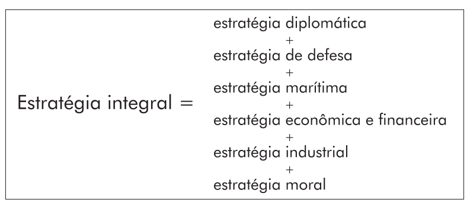
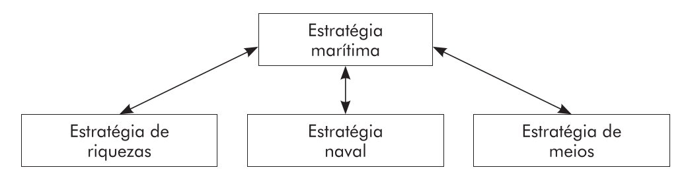

# Capítulo 5 - Em busca de uma estratégia marítima

## Página 107

### Introdução

*“O mar não conhece outra fronteira que não a costa. É a única superfície acessível a todos os Estados e aberta ao comércio, à pesca e a um livre exercício da guerra marítima e do direito de butim dentro da guerra marítima, sem a necessidade de levar em consideração a vizinhança ou as fronteiras geográficas”* CARL SCHMITT

Nós acabamos de observar quanto o campo da ação marítima expandiu-se nessas últimas décadas. Os conflitos de interesses econômicos são cada vez mais importantes, entretanto, a guerra naval tradicional — a luta entre forças organizadas, segundo a expressão de Castex? — não parece mais tão atual. Contudo, nada nos diz que ela não possa voltar. Assiste-se, nos dias de hoje, a um jogo de diplomacia naval cada vez mais tenso entre a China e seus vizinhos nas paragens do mar da China oriental e meridional. Da mesma forma, no oceano Índico, um combate entre forças organizadas não pode ser excluído. Enfim, os russos estão rearmando-se no Báltico, provocando a inquietação de seus vizinhos. A Rússia, além disso, apoderou-se da esquadra ucraniana — por meio de uma operação terrestre! Se a guerra naval tradicional está morta, seu cadáver remexe-se constantemente, para parafrasear uma feliz expressão de Hervé Coutau-Bégarie”.

## Página 108

O domínio das comunicações marítimas é sempre um elemento central da estratégia marítima. Entretanto, isso não é suficiente; é preciso, também, como vimos, levar em consideração os recursos do mar e todas as infraestruturas vitais nele localizadas. Faz-se necessária, então, uma estratégia marítima mais abrangente em relação àquela exposta por Castex. Tal estratégia deve englobar a guerra, certamente, mas também a luta contra a pirataria, o terrorismo e o crime organizado, a fim de assegurar a manutenção da ordem, bem como a segurança e a proteção marítimas em geral.

Nesse sentido, nós partiremos de uma definição de Castex: “A estratégia naval tem o propósito de criar, de favorecer, de incrementar, tanto durante o tempo de paz quanto em tempo de guerra, o poder marítimo de um país”! Como nós estamos buscando uma estratégia marítima, devemos determinar a relação entre os adjetivos “naval” e “marítimo”. É preciso, então, debruçarmo-nos sobre o “poder” em geral e sobre o “poder marítimo” em particular, o que permitirá definir os termos “estratégia marítima” e “estratégia naval”, a fim de construir uma estrutura político-estratégica integrando essas duas estratégias. Estabelecidas essas definições, poderemos dedicarmonos às ligações entre a estratégia marítima e outras estratégias.

Ressaltamos a importância do mar para as operações conjuntas. Ele se encontra, evidentemente, no coração dos escritos de Castex, à medida que se concentra sobre a guerra e os preparativos para a mesma. Falamos aqui de uma estratégia de defesa nacional ou, simplesmente, de uma estratégia de defesa.

A Marinha tem um papel único no seio das Forças Armadas, porque ela pertence, concomitantemente, ao mundo marítimo e a estas.

## Página 109

Ela representa, certamente, um instrumento de guerra, mas tem também a vocação de zelar pelos interesses marítimos do Estado em geral.

Nesse contexto, o oficial de marinha deve ser, ao mesmo tempo, marinheiro e guerreiro. Ele (ou ela) deve ser um verdadeiro profissional do mundo marítimo e do mundo militar. O capitão de mar e guerra Hughes Eudeline, graças a uma longa experiência de comando no mar, explicou muito bem do que se trata: “O comandante de um navio de guerra deve decidir e conduzir ações empregando os homens e o material em um ambiente duplamente hostil, o do mar e o das operações. Ele necessita de uma competência específica, a do profissional do mar, e de uma reflexão pessoal prévia sobre as características próprias aos chefes militares”.

É dessa dualidade que se deve partir para teorizar a “realidade marítima” e sua estratégia. Elas são, ao mesmo tempo, civis, mantendo ligações muito fortes com a estratégia econômica, e militares, uma vez que fazem parte da Defesa nacional. Trata-se de duas facetas de uma mesma realidade.

### Teoria de base

### O marítimo e o naval

O mundo marinheiro está repleto de expressões que são, frequentemente, incorretamente compreendidas. Fala-se de marinheiros que formam as tripulações dos navios de guerra, que, a seu turno, formam uma esquadra. Essa dita esquadra faz parte de uma Marinha, cuja vocação é a guerra no mar ou no mundo marítimo. Essa multiplicidade de termos complica a abordagem do assunto. Mas é justamente por esta razão que nós precisamos de uma terminologia clara e precisa.

## Página 110

Castex emprega, frequentemente, as expressões “estratégia naval" e “estratégia marítima”, “forças navais" e “forças marítimas”, “poder naval" e “poder marítimo” ou, ainda, “poder do mar”. Ele chega a utilizar indistintamente os dois adjetivos “marítimo” e “naval” dentro do mesmo parágrafo. Mas, em outras ocasiões, ele os emprega em acepções diferentes. É preciso, então, estudar seu vocabulário antes de tirar as conclusões que nos servirão de base para o trabalho.

Ao início do Théories Stratégiques, como vimos, Castex fala de “estratégia naval" para designar tudo aquilo que contribui para o “poder marítimo de um país”. Isso representa uma tradução literal da expressão “naval strategy" utilizada por Mahan.

Ele utiliza a mesma expressão quando apresenta o conceito de “dependências.” “A estratégia naval, mais do que outras estratégias, militares ou não, é raramente livre. Ela pode ter sua liberdade de ação dentro da execução técnica de certas operações, mas, muito frequentemente, não mantém tal liberdade nas escolhas dessas operações. Sobre ela pesam graves 'dependências”.

Mais tarde, no tomo V, ele apresenta a “estratégia naval" como a parte naval da estratégia geral: “Uma operação combinada pertence à estratégia geral, que ultrapassa a estratégia terrestre, a estratégia naval e a estratégia aérea, coordenando-as, e que une ao plano superior a ação dos exércitos, das forças navais e aéreas, todas as vezes em que os três tipos de forças entram simultaneamente em jogo".

Entretanto, quando ele retorna à questão das “dependências” no tomo VI, apresenta a “estratégia marítima” como uma das estratégias particulares que servem à estratégia geral.

## Página 111

Por outro lado, no momento em que Castex fala quase que exclusivamente de “estratégia naval” até o tomo IV, inclusive, ele introduz no tomo V uma outra expressão, “estratégia do mar” que, após ter sido utilizada uma única vez”, torna-se “estratégia do poder do mar"?,

No entanto, ele não parece satisfeito com essa expressão. A propósito, ele a utiliza somente para descrever a estratégia do poder marítimo por excelência, a Inglaterra, no contexto das operações em Dardanelos e na Palestina durante a Grande Guerra!. No tomo VI, ele emprega, quase exclusivamente, “estratégia marítima”.

O leitor tem, então, a impressão de uma evolução no pensamento de Castex: ele começa pela “estratégia naval", depois experimenta a “estratégia do poder do mar” para, finalmente, reter a “estratégia marítima”.

Castex insiste, todavia, na necessidade de dispor-se de uma estratégia geral que coordene as estratégias naval e terrestre. Ele nota que essa estratégia geral corresponde ao que Corbett entende por “estratégia marítima": “Por estratégia marítima, nós entendemos os princípios que governam uma guerra onde o mar é um fator significativo. A estratégia naval nada mais é do que a parte que fixa os movimentos da esquadra, quando essa estratégia marítima tenha definido o papel da Marinha com relação àquele das forças terrestres"!S,

Reteremos, provisoriamente, essa hierarquia, na qual a estratégia naval faz parte da estratégia marítima. Ela nos parece, em realidade, suficientemente clara e conforme com as ideias de hoje. Ela tampouco contraria as definições “castexianas”.

## Página 112

O problema seguinte concerne às forças marítimas e às forças navais. Felizmente, Castex é, aqui, mais claro.

No capítulo anterior, descrevemos o domínio marítimo e constatamos que ele é muito vasto, tanto do ponto de vista geográfico como conceitual. Essa ideia reflete-se naquilo que Castex escreve sobre as forças marítimas ou navais, estas fazendo parte das primeiras: “Pela denominação bem genérica de forças marítimas, designamos o conjunto de forças que participam da guerra no mar, ou seja, não somente as forças navais propriamente ditas, de superfície e submarinas, mas também as forças aéreas e mesmo as forças terrestres destinadas à defesa costeira"!*. Ora, Castex limita-se aqui às Forças Armadas. Hoje, quando falamos de forças marítimas, é preciso acrescentar os navios mercantes, os barcos de pesca e todos os outros meios que participam da exploração das riquezas do mar. Essa extensão semântica responde à nossa concepção da relação entre as estratégias marítima e naval, propondo que a primeria englobe a segunda.

Como observamos, Castex fala de “poder marítimo”, mas também de “poder naval”. Nesse instante, as coisas complicam-se, porque essas expressões têm diversos significados.

De forma geral, ele fala de “poder naval" quando trata das capacidades militares das forças navais!””. Um exemplo: “O verdadeiro método do poder naval é o bloqueio, no sentido amplo e completo do nome"!*. Quanto ao “poder marítimo” ele dá um significado mais abrangente: “A França de Luís XIV exerceu uma pressão tão grande sobre os mares quanto sobre a Europa. Desde seus primórdios, Colbert transformou-a em um grande poder marítimo e colonial". Aqui, o “poder marítimo" leva-nos ao conjunto de forças marítimas.

## Página 113

A expressão “poder naval” aparece também na teoria do perturbador: “O poder naval bloqueia e asfixia a irradiação do perturbador em direção ao Oceano”, e ainda: “O poder naval é capaz, individualmente, de salvar os povos em via de serem subjugados pelo perturbador”.

A expressão “potência marítima” diz respeito, frequentemente, ao ator que se opõe ao “poder terrestre”: “O mar, ou, de preferência, a potência marítima cujo suporte e terreno de aplicação dele depende, deve, a maior parte do tempo, em última análise, atacar a terra no momento em que tiver estabelecido a seu favor uma vantagem na parte propriamente naval da guerra, quer dizer, a partir do instante em que consegue adquirir o controle das comunicações essencias de superfície". Mas Castex utiliza também a expressão “potência do mar" para designar aquele que é preponderante em uma área marítima, como a Alemanha no Báltico durante a Grande Guerra”. Enfim, as duas expressões “potência marítima” e “potência naval” servem para Castex designar a Inglaterra.

O poder marítimo é, então, ao mesmo tempo, um ator e uma qualidade; o nível de poder relativo determina as possibilidades de agir contra o “Outro”. Isso aparece de maneira evidente na frase seguinte: “O poder marítimo foi, de acordo com a ocasião, o multiplicador ou o divisor do poder terrestre, reforçando ou minando o esforço decisivo que, ao final das contas, é aquele dos exércitos, que protegem ou conquistam os territórios”.

## Página 114

Essa frase pode, também, ser compreendida como a expressão da finalidade do poder marítimo. Dito de outra forma, na estratégia marítima de Castex, a “potência marítima” tem a vocação de influenciar a situação em terra, onde os homens vivem e onde as decisões políticas são tomadas.

Concluamos: o poder marítimo é uma manifestação da capacidade de ação das forças marítimas, que englobam todos os meios, tanto civis como militares, existentes e potenciais; o poder naval exprime a capacidade de ação das forças navais no seio do poder marítimo. A estratégia, quanto a ela, decide como essa capacidade deve ser utilizada, a fim de atingir os objetivos políticos. Mas o poder marítimo, de que se constitui?

### Poder e estratégia

Castex não discute o que recobre o termo “poder” tornando, portanto, essencial a descoberta de uma boa definição para nosso estudo. É preciso saber o que significa “poder” de forma geral, para abordar o poder marítimo em particular.

Segundo o filósofo Raymon Aron (1905-1983), “o poder sobre a cena internacional é a capacidade de uma unidade política impor a sua vontade a outras unidades” Duas outras definições “aronianas” são, também, úteis: “O poder defensivo é a capacidade de impedir que alguém nos imponha sua vontade; o poder ofensivo é a capacidade que nós temos de impor nossa vontade ao outro. A força, ao contrário, representa os meios que o poder utiliza. Para mobilizá-la, é necessária uma certa capacidade, por exemplo, em termos econômicos e administrativos, assim como uma vontade coletiva, proveniente da vontade do chefe e do apoio do povo”?. Sem essa vontade, o poder não pode traduzir-se em atos.

## Página 115

O poder marítimo poderia, então, ser definido como a capacidade de uma unidade política de impor sua vontade a outras unidades no domínio marítimo. Entretanto, o fato de o poder marítimo atuar no domínio marítimo não quer dizer que as consequências de sua ação estejam limitadas ao dito domínio. Em realidade, como diz Castex, o poder marítimo é um multiplicador ou um divisor do poder terrestre. O poder marítimo está, notadamente, em ligação estreita com o poder econômico e financeiro. Sem finanças, não há poder marítimo e vice-versa... ou quase.

Castex aborda a estratégia sob um ponto de vista muito abrangente, especialmente quando trata de estratégia geral. Mas, na verdade, o núcleo de seu pensamento é baseado na guerra e nos conflitos armados. Mesmo quando ele evoca a estratégia dos tempos de paz, trata-se, sobretudo, dos preparativos da guerra.

Ora, precisamos de uma visão bem mais abrangente que englobe, igualmente, os tempos de paz e de crise e esteja endereçada não somente aos inimigos ou antagonistas, mas também aos amigos, reais ou potenciais. Daí a importância das teorias relativas ao soft power.

É ao autor estadunidense Joseph S. Nye que são atribuídas as expressões de “poder duro” (hard power) e de “poder macio” (soft power). Ele demonstra que essas duas formas de poder não são estanques como o preto e o branco: há um continuum entre uma e outra”. Nye fala, nesse aspecto, de um “espectro de poder” variando do hard power pela interdição e/ou coerção ao soft power pela cooperação e/ou persuasão. Ele defende a combinação da cenoura e do porrete, a qual chama de poder inteligente (smart power): “Se vocês fizerem aquilo que nós queremos, nós os ajudaremos, senão, nós deveremos convencê-los pela força”.

## Página 116

Se, para Aron, a força representa os meios que o poder utiliza, Poirier vai mais longe: para ele, as forças necessárias compõem-se de “vias-e-meios” (voies-et-moyens) potenciais ou existentes”, e “a estratégia é a ciência e a arte de manobrar forças para cumprir os fins da política”.

Por consequência, o que é, então, o poder marítimo? Para alcançá-lo, estima Mahan, um Estado deve preencher certas condições essenciais concernentes à sua posição geográfica, suas características físicas, incluindo-se os recursos naturais e o clima, o tamanho de seu território, de sua população, o caráter dessa população e do governo, as instituições nacionais”. O capitão-demar-e-guerra Eudeline tentou modernizar essa lista de Mahan*”:

1. Condições geográficas: Situação geográfica — Configuração das áreas marítimas próximas à costa — Nível de isolamento — Extensão do domínio marítimo controlado e explorável — Desenvolvimento da faixa litorânea — Equipamento de interface terra/mar das bacias costeiras;

2. Condições econômicas e financeiras: Capacidade de financiamento — Nível de dependência da economia em relação ao comércio marítimo e à exploração dos recursos provenientes do mar (pesca, minerais...);

3. Condições industriais: Importância da indústria marítima — Recursos humanos — Nível de ensino técnico e científico — Poder industrial global, incluindo-se pesquisa e desenvolvimento;

4. Condições políticas: Peso da História, da ideologia e de inimizades tradicionais — Disputas marítimas — Propensão do governo a articular-se para conquistar a adesão da população — Tipo de governo (força, capacidade de levar a termo o rumo geral de um projeto político) — Impacto das relações internacionais sobre as questões marítimas; e

5. Condições militares: Tipo de poder militar — Posse de armamento nuclear ou vontade manifesta de adquiri-lo — Existência ou vontade de possuir uma tríade nuclear — Peso da Marinha no aparelho militar; Nível de integração conjunta — Composição da Marinha, equilíbrio de suas componentes — Nível de desenvolvimento dos meios de projeção de poder e de forças, aí incluída a componente logística — Importância das forças ofensivas e, em particular, dos submarinos — Alianças estratégicas ou acordos de cooperação militar.

## Página 117

Essa classificação exige duas observações. Inicialmente, as condições geográficas têm características difíceis de serem modificadas: elas constituem, então, os elementos mais permanentes da equação. Por outro lado, em nossa avaliação, falta um fator: o poder diplomático, quer dizer, a aptidão de fazer com que outros atores aceitem a vontade do Estado considerado.

De qualquer forma, tal classificação permite comparar o poder marítimo de países diferentes. Nós disso devemos reter, sobretudo, que o poder marítimo repousa sobre um conjunto de fatores complexos.

Mas para colher os frutos desses fatores, para deles tirar-se um efeito positivo, é necessária uma vontade política, um projeto político. Sem vontade, o poder não pode traduzir-se em atos. A Suécia é um triste exemplo. Ela preenche a maior parte das condições necessárias para o poder marítimo e, de fato, teve uma bela história marítima. Entretanto, ela não representa mais um poder marítimo porque seu governo não se interessa pelo mar. Um caso muito grave de “cegueira marítima”.

## Página 118

Completamos agora nossa excursão teórica, partindo mais uma vez da definição dada por Castex para a estratégia naval: “A estratégia naval tem o propósito de criar, de favorecer, de incrementar, tanto durante o tempo de paz quanto em tempo de guerra, o poder marítimo de um país”. Mas nossa proposição diz respeito, de forma mais ampla, à estratégia marítima. Essa última terá, consequentemente, o propósito “de criar, de favorecer, de incrementar, tanto durante os tempos de paz quanto em tempo de guerra” os fatores de poder enumerados anteriormente.

Evidentemente, é preciso, também, explorar esse poder que, segundo Christian Malis, é “ao mesmo tempo fim e “vias-e-meios” da política estrangeira”. Isso é efetuado por meio de operações marítimas que visam a influenciar os decisores políticos em terra.

Finalmente, uma precisão semântica. Hoje, sobretudo na França, fala-se, geralmente, de “forças aeronavais” em vez de “forças navais” Isso se explica, naturalmente, pelo fato de que a guerra naval necessita uma interação estreita entre os navios de guerra e as aeronaves de vocação marítima. Nesse mesmo sentido, fala-se de forças aeroterrestres.

## Página 119

Na presente obra, o termo “marítimo” engloba o termo “naval”. O objetivo da estratégia naval é formulado por meio da estratégia marítima, à qual é hierarquicamente superior. Os meios da estratégia naval são militares, em primeiro lugar aeronavais, com os submarinos inclusos. Agora, nós podemos formular uma definição da estratégia marítima e da estratégia naval:

» À estratégia marítima é a ciência e a arte de manobrar forças para cumprir os fins políticos no domínio marítimo; e

» À estratégia naval é a ciência e a arte da manobra das forças aeronavais para que elas concorram para o sucesso da estratégia marítima.

A estratégia marítima tem duas vocações: criar, favorecer, incrementar os elementos que constituem o poder marítimo, assim como empregar esse poder para realizar os objetivos políticos. Isso inclui, evidentemente, os objetivos da estratégia de defesa. As “forças” manobradas pela estratégia marítima compõem-se de “viase-meios”!: os meios são os componentes do poder marítimo e as vias são as formas de empregá-los.

A estratégia naval é apenas uma das estratégias que dependem da estratégia marítima. Um poder marítimo deve dispor de um conjunto de vias-e-meios, assim como de uma vontade de empregálos. A estratégia marítima articula diversas estratégias gerais, para utilizar a taxonomia de Lucien Poirier*. Quais? Tal questão deve ser respondida a partir de agora.

### Uma estrutura político-estratégica

No intento de analisar a estratégia marítima e suas relações com outras estratégias, vamos nos apoiar sobre a estrutura políticoestratégica formulada por Lucien Poirier.

No topo da hierarquia, encontra-se o “projeto político” Uma entidade política — Poirier entendia como tal um Estado, mas o raciocínio é igualmente aplicável a organizações como a UE — tem, naturalmente, um certo número de objetivos mais ou menos interligados. Tais objetivos refletem uma ideia quanto à maneira de mudar uma determinada situação política (projeto ofensivo) ou quanto à maneira de preservar o status quo (projeto defensivo) *. Em síntese, um projeto político corresponde àquilo que um governo deseja alcançar por intermédio de uma estratégia.

## Página 120

Para obter sucesso, o projeto político precisa de uma estratégia integral. É a estratégia que introduz a ação dentro da política, ou seja, ela é a política em atos. Ela também é válida tanto em tempos de paz como em tempo de guerra”.

Na escala inferior da estratégia integral, encontram-se as três estratégias gerais: militar, econômica e cultural. Essa engloba, então, todas as forças da coletividade“.

A estratégia geral militar tem duas componentes: a estratégia operacional e a estratégia de meios".

A estratégia integral de Lucien Poirier corresponde, grosso modo, à definição “castexiana” da estratégia geral: “Essa estratégia é a arte de conduzir, em tempo de guerra e em tempos de paz, todas as forças e todos os meios de luta de uma nação. Essa estratégia geral, atributo essencial do governo, é a verdadeira estratégia de defesa nacional”*”. A diferença reside, sobretudo, no fato de que Lucien Poirier fala “de executar o conjunto de fins definidos pela política geral”, enquanto Castex está limitado à guerra, ou seja, implicitamente, no hard power.

Indicamos em capítulo anterior (cap. 3) que: estratégia geral = estratégia de defesa = estratégia diplomática + estratégia terrestre + estratégia marítima + estratégia econômica + estratégia financeira + estratégia moral.

## Página 121

No entanto, precisamos de um conceito de estratégia ampliado, onde a estratégia de defesa seja apenas mais uma estratégia, dentre outras estratégias, ao serviço da estratégia integral. Anotamos, também, que a estratégia marítima contemporânea engloba domínios mais amplos do que o da defesa nacional. Enfim, é difícil identificar uma diferença clara entre economia e finanças. Entretanto, deveríamos incluir a estratégia industrial dentro da estratégia geral. Devemos, então, reescrever a fórmula anterior:

Estratégia Integral = estratégia diplomática + estratégia de defesa + estratégia marítima + estratégia econômica e financeira + estratégia industrual + estratégia moral.

Se compararmos essa fórmula com a lista de elementos do poder marítimo estabelecida pelo capitão-de-mar-e-guerra Eudeline, verificamos as similitudes assim como algumas diferenças, ligadas diretamente ao fato de que estamos nos referindo à estratégia, quer dizer, “política-em-atos” dentro do domínio marítimo. Obtemos, a partir daí, o seguinte croqui:

## Página 122

ESTRATÉGIAS MARÍTIMAS NO SÉCULO XXI

É evidente a necessidade de uma coordenação vertical e horizontal. A primeira é feita pela estrutura político-estratégica e pelos objetivos sucessivos mencionados anteriormente. A coordenação horizontal é feita por um sistema de “dependências”.

A estratégia marítima precisa de três subestratégias para estar pronta a atingir seus objetivos políticos. Chamamo-las “estratégia de riquezas” “estratégia de meios” e “estratégia naval”.

A estratégia de riquezas tem como vocação desenvolver e explorar as riquezas do mar. Ela engloba, em princípio, aquilo que a UE denomina o “Crescimento Azul”, ou seja, uma estratégia de longo prazo visando a apoiar o crescimento de todo o setor marítimo. Ela destaca as atividades existentes, emergentes ou potenciais nos domínios dos transportes, da pesca, dos minerais e outros.

A estratégia de meios se encarrega de conceber, de construir, de conduzir os meios necessários à estratégia marítima.

Enfim, a estratégia naval é a estratégia da ação a serviço da estratégia marítima.

Temos, então:

Estratégia marítima Estratégia de Estratégia Estratégia de riquezas naval meios

Notaremos de passagem, que nossa definição da estratégia marítima corresponde, a grosso modo, ao somatório dos projetos marítimos europeus, “Crescimento Azul” e Estratégia de proteção marítima da União Europeia (SSMUE).

## Página 123

### A teoria da estratégia operacional

A estratégia naval é uma estratégia operacional segundo a hierarquia estratégica de Poirier. Em uma situação de conflito, o “Próprio” busca atingir, em detrimento do “Outro”, os objetivos fixados pelo projeto político. Tais objetivos são positivos, uma vez que conduzirão às mudanças desejadas e serão atingidos por meio de ações de coerção, manifestações da vontade do “Próprio” em relação ao “Outro”. Mas enquanto o “Próprio” busca atingir tais propósitos positivos, ele é, entretanto, impelido a conduzir operações de caráter negativo, a fim de preservar sua liberdade de ação necessária à consecução de objetivos positivos. Tais operações são “negativas” porque não contribuem diretamente à consecução dos objetivos. É preciso, então, paralelamente às ações de coerção, conduzir a contento ações de interdição. Graças a essas, o adversário perderá toda a esperança de nos impor sua vontade. Elas nos permitirão conservar nossa liberdade de ação, representando, assim, manobras de proteção”.

Em consequência, cada estratego é obrigado a encontrar o bom equilíbrio entre as exigências das operações negativas e aquelas das operações positivas: a ele cabe a responsabilidade de criar “a economia de métodos e sua combinação”.

A estratégia operacional pode, igualmente, ser dividida em duas partes: a estratégia de emprego real, que visa a reduzir ou aniquilar a liberdade de ação e a capacidade de reação do adversário, atacando seus pontos fracos; e a estratégia de emprego virtual, a qual significa que não utilizamos o efeito direto das forças, mas tomamos como alvo a vontade do adversário. Entretanto, mesmo no emprego real, sempre há uma componente virtual, constituída pela percepção que o adversário tem dos eventos a serem enfrentados. Poirier utiliza analogias com a mecânica: seu vocabulário remete ao fato de que uma força é constituída de diversas componentes, no caso citado, uma componente real e uma componente virtual.

## Página 124

A coerção associada ao emprego real é qualificada de agressão ou de ofensiva. Buscamos tomar a iniciativa para impor nossa vontade ao “Outro”, persuadindo-o, militarmente, de sua inferioridade. A coerção associada ao emprego virtual é qualificada de pressão ou de persuasão “musculosa”. Tal método tem o mesmo propósito, mas não buscamos demonstrar nossa superioridade pela ação.

A interdição associada ao emprego real é qualificada de defesa ou defensiva. O objetivo é coagir o adversário a abandonar sua empreitada porque ela está, manifestamente, fadada ao fracasso ou porque o custo de sua implementação será excessivamente elevado em comparação com seu objetivo. A interdição associada ao emprego virtual constitui a dissuasão. É uma forma preventiva de defesa. Seu efeito modifica as intenções do adversário”. Tudo isso pode ser resumido na tabela a seguir:

| Fins políticos | Propósitos estratégicos     | Métodos estratégicos | Paz (emprego virtual) | Guerra (emprego real)      |
| -------------- | --------------------------- | -------------------- | --------------------- | -------------------------- |
| Conservar      | Ação com propósito negativo | Interdição           | Dissuasão             | Defesa ativa               |
| Modificar      | Ação com propósito positivo | Coerção              | Persuasão             | Ofensiva ou agressão ativa |

Aqui, devemos notar que a gestão de crise exige ações virtuais e reais. Infelizmente, Castex trata quase que exclusivamente dessas últimas: é preciso completar sua abordagem sobre tal aspecto. Devemos notar que há, também, ações de caráter virtual ao longo de guerras que não são totais. Apesar de um número significativo de guerras, a arma nuclear jamais foi realmente utilizada depois de 1945, tendo a dissuasão obrigado os beligerantes a se manterem dentro do terreno convencional. Isso demonstra que, mesmo no seio de um emprego real, podem existir componentes virtuais.

Durante a Guerra Fria, a arma nuclear foi “utilizada” uma única vez, no contexto de uma “estratégia de coerção em seu modo virtual” (para retomar a expressão de Poirier), ou seja, a persuasão pela ameaça. Isso foi no momento da ameaça soviética contra a França e o Reino Unido por ocasião da crise do Canal de Suez em 1956. Senão, as armas nucleares foram “utilizadas” tão somente no contexto das estratégias de interdição, ou seja, para impedir toda a ação por meio da dissuasão.

## Página 125

Até agora, tratamos apenas do hard power. Por conseguinte, é chegado o momento de tratar do soft power, o qual tem um papel verdadeiramente primordial na estratégia naval e, notadamente, na diplomacia naval.

Em realidade, os conflitos e as crises não são, em geral, jogos de soma nula em que possamos aplicar uma estratégia puramente de coerção ou de interdição. É preciso, preferencialmente, descobrir interesses comuns aos protagonistas e empregar uma mistura de cenoura e de porrete. Podemos falar de uma estratégia de influência que visa a angariar amigos ou aliados, ao mesmo tempo em que tentamos influenciar adversários potenciais. Ela visa, também, e isso é relevante, a marcar sua posição dentro de uma organização como a União Europeia.

Um modo de ação[59] que se encontra no cruzamento do hard power e do soft power é a estratégia da “persuasão coercitiva” elaborada por Donald Daniel. Tal estratégia utiliza, judiciosamente, a diplomacia coercitiva ou a persuasão vigorosa, a fim de implementar normas ou mandatos internacionais relacionados às partes envolvidas em uma crise.

[59] É importante relembrar que os franceses empregam, igualmente, o termo “mode daction” (ou “course of action (COA)”, quando operando na OTAN) para caracterizar, dentro do processo de planejamento das operações militares, a “linha de ação” empregada no Processo de Planejamento Militar da Marinha do Brasil.

## Página 126

Tais considerações são particularmente pertinentes no caso de uma ação no seio de uma coalizão multinacional. Um projeto político da UE, por exemplo, é o resultado de um processo conduzido entre os Estados-membros (o raciocínio a ser seguido é, a princípio, válido também para a OTAN). Esse processo é gerenciado pela presidência e pelo Alto Representante da União para os Negócios Estrangeiros e Política de Segurança, mas ele depende, no final das contas, de um consenso entre os Estados-membros. Como se trata de países democráticos, é necessário, ainda, que as populações apoiem a política dos governos ou, ao menos, não sejam francamente hostis.

Em consequência, cada Estado-membro deve elaborar três estratégias. Em primeiro lugar, deve ter uma ideia daquilo que a UE deve fazer — e mais ainda daquilo que ela não deve fazer — e como. Em seguida, deve possuir uma estratégia de influência visando a fazer avançar suas próprias ideias no seio da comunidade dos Estadosmembros. Enfim, ele deve dispor de uma estratégia de informação dirigida à população nacional: trata-se de uma estratégia moral, para empregar o vocabulário de Castex.

## Página 127

### “Dependências”

Sendo a estratégia marítima uma das diversas estratégias provenientes da estratégia integral e tendo essas diversas estratégias interdependências, reencontramos o conceito “castexiano” de “dependências”.

A importância das “dependências” é uma particularidade da estratégia marítima. Ela resulta da dualidade das forças navais, as quais estão, simultaneamente, ao serviço do mundo marítimo civil e das forças conjuntas. Nesse contexto, Castex propõe uma explicação mais profunda do fenômeno:

“Em estratégia, longe de se isolar dentro de sua estratégia própria, assim como o Exército o fazia desde muito tempo, os “marinheiros” haviam reconhecido a existência das estratégias de outros ambientes, mesmo não militares, e estavam nelas interessados, uma vez que tinham discernido as ligações que as uniam, suas ações e reações recíprocas, suas repercussões sobre a estratégia marítima. Ao lado da noção de forças, habitualmente a única considerada nos debates concernentes à guerra terrestre, eles haviam introduzido aquela (noção) dos interesses, representativa dos desideratos de outras estratégias, para designar-lhe um lugar dentro da condução da guerra naval. Eles tinham alcançado, assim, uma concepção estratégica equilibrada, livre de todo particularismo, preocupada com o jogo dos diferentes elementos em presença, sabendo, por instantes, elevar-se facilmente, sem esforço, ao plano da estratégia geral”.

Quanto ao conceito de “dependências”, Castex desenvolve-o nesses termos:

“No fundo, as “dependências” são as ações e reações das diversas estratégias umas sobre as outras. Elas provêm da unidade da guerra, da existência lado a lado de uma guerra militar (nos três ambientes), de uma guerra política, de uma guerra econômica, de uma guerra moral etc., as quais são intimamente ligadas entre si, confundidas em um todo único e que somos obrigados a conduzir simultaneamente, conforme as exigências da “estratégia geral”, que ultrapassa e coordena as estratégias particulares. As “dependências”, que são as ligações internas e necessárias desse conjunto, derivam da noção da “guerra total”.

Para nós, que temos de tratar não somente da guerra, mas também da paz e da crise, não somente da guerra total, mas também da estratégia integral, esse conceito é ainda mais interessante.

## Página 128

### Discussão

A abordagem da estratégia desenvolvida ao longo desta obra é descendente: uma estratégia tem a vocação de atingir os objetivos políticos. Entretanto, no final das contas, temos o direito de nos perguntar se é possível iniciar um movimento estratégico de longo prazo, a partir de objetivos fixados anteriormente por um governo. Tal questão é particularmente pertinente dentro de um campo tão vasto e tão complexo como a estratégia marítima. Mas de maneira mais genérica, é difícil prever o desenvolvimento estratégico global. 

Como escreve Poirier, o “estaleiro” [65] estratégico está sempre aberto: não há solução final.

[65] O termo “chantier”” empregado pelo autor foi traduzido em um sentido mais voltado para o ambiente marítimo, ou seja, “estaleiro”. Em realidade, a ideia a ser passada está sintetizada em dois verbos principais: “projetar e construir”.

Talvez seja melhor, para estratégias de longo prazo, inverter os termos da proposição: cabe à estratégia propor os objetivos políticos realizáveis e ao nível político reter aqueles que ele quer perseguir. Dentro dessa lógica e segundo o general de La Maisonneuve, a estratégia não é tanto uma arte ou ciência, mas sim um método”. Ela representa a tentativa de encontrar o meio “não de fazer qualquer coisa, mas de escolher a via em direção daquilo que é “o bem”[68], esse último entendido no sentido de moral, útil, vantajoso..”.

[68] No sentido explorado dentro do domínio ético: conjunto de valores positivos fundamentais (respeito pela vida e dignidade humana, a justiça, a assistência mútua etc.) promovidos por uma dada sociedade, úteis para o progresso harmonioso, para o moral dos indivíduos e da comunidade.

## Página 129

Estamos, também, no direito de indagar se uma estratégia integral é realmente possível na democracia, exceção feita, eventualmente, às guerras em que a sobrevivência da nação está em jogo. A resposta é, no tocante ao princípio, negativa. Um governo democrático não pode dispor de todos os recursos do país. Há, hoje em dia, um grande número de atores que são pouco dependentes, ou por vezes completamente independentes da ação do Estado: empresas multinacionais, organizações não governamentais — legais ou ilegais — sem falar de tudo aquilo que está relacionado ao ciberespaço. É, também, o caso no domínio marítimo, uma vez que uma grande parte dos navios mercantes arvora um pavilhão de conveniência.

Por outro lado, não se pode esquecer do ator muito importante que é a UE. Em matéria de economia marítima, ela é mais relevante que os Estados-membros. O problema é que a UE não dispõe de meios de ação tais como forças navais e guardas costeiras.

Não se pode, então, ambicionar “a integralidade” de uma estratégia integral. Ela será sempre incompleta e hesitante.

Mas então, para que tantas teorias estratégicas, pergunta-se o leitor com todo direito?

Nossa resposta é que elas são, apesar de tudo, úteis, uma vez que mostram os fatores a serem levados em conta e suas relações recíprocas. Elas devem facilitar a pesquisa de um equilíbrio entre as demandas e as exigências, por vezes contraditórias, notadamente entre o número e a capacidade dos meios. Além do mais, elas facilitam a análise de uma estratégia marítima.

Um outra resposta é que, sem linguagem e sem estrutura, é impossível discutir um tema tão complexo como a estratégia.

Enfim, a estrutura proposta deve auxiliar aqueles que têm por vocação explicar a importância do domínio marítimo ao público e aos decisores.

## Página 130

### O projeto político e a estratégia integral

Um projeto político, dentro do qual a maritimização tenha papel importante, pode apresentar diversas motivações, mas, em princípio, implica uma vontade de ser (ou tornar-se) um poder marítimo. Tal projeto gera expectativas de benefícios importantes, mas, também, de riscos e ameaças. A estratégia integral tem por vocação maximizar os benefícios, mitigando-se os riscos e as ameaças. Para tal, emprega estratégias diplomáticas, de defesa, marítimas, econômicas e financeiras, industriais e morais, ou seja, estratégias gerais, em conformidade com a estrutura político-estratégica formulada por Poirier.

A estratégia integral deve divulgar os objetivos a serem atingidos por essas estratégias gerais. Ela deve se ocupar da boa coordenação entre elas ou, ao menos, impedir que entrem em conflito. É, também, responsável por otimizar a utilização dos recursos do Estado.

Há, igualmente, um determinado número de outras medidas a serem tomadas no seio do Estado, as quais não representam estratégias verdadeiras. O setor marítimo necessita, por exemplo, de pessoal bem formado: são necessárias, então, estruturas de ensino adaptadas. Um projeto de aconselhamento do Conselho Econômico, Social e Ambiental apresenta outros exemplos pertinentes:

» Reforçar a cooperação regional dos territórios ultramarinos em matéria de gestão de recursos do mar;

» Adotar as disposições que permitirão a tais territórios o acesso a Novos recursos;

» Reforçar e atualizar o papel do Secretário Geral do Mar (SGMer); e

» Elaborar uma lei abrangente sobre os oceanos.

## Página 131

### À estratégia marítima

Voltemos, no presente momento, à estratégia marítima e suas subestratégias: a estratégia de riquezas, a estratégia de meios e a estratégia naval. Lembremos, inicialmente, nossa definição: a estratégia marítima é a ciência e a arte de manobrar forças para atingir os fins políticos no domínio marítimo. Na prática, o que isso quer dizer? Quem manobra o quê? E qual é a manobra?

Como a estratégia marítima é dual, a resposta depende da seção considerada: política de defesa nacional ou política marítima. No primeiro caso, a resposta é simples: é o Chef dÉtat-Major des Armées (CEMA)[73] quem manobra em nome do Chefe de Estado ou do Governo.

[73] O Chef d'État-Major des Armées (CEMA), ou Chefe do Estado Maior das Forças Armadas, é um oficial-general de cinco estrelas que possui ascendência hierárquica e funcional sobre os demais Comandantes de Força Singular, centralizando as decisões das FFAA francesas no nível estratégico. Sua indicação obedece a um sistema de revezamento entre as forças. Diversos países europeus adotam essa mesma estrutura, motivo pelo qual o autor responde à questão formulada de forma mais genérica.

Para o outro caso, a resposta à primeira questão depende do país considerado. Na França, a autoridade competente é o SGMer. “Ele assegura a coerência das decisões governamentais em um domínio no qual intervêm quinze departamentos ministeriais. Ele exerce uma missão de controle, de avaliação e de prospectiva em matéria de política marítima e zela para que a política marítima do Governo seja concebida em estreita coordenação com os representantes eleitos e o conjunto de profissionais interessados. Além disso, ele coordena e conduz a ação dos prefeitos marítimos [74]. 

[74] Prefeito Marítimos: É um oficial-general da Marine Nationale Française, cujas funções guardam algumas semelhanças com o Comandante de Distrito Naval na Marinha do Brasil. A diferença mais relevante consiste em sua dupla subordinação: atuando como Prefeito Marítimo (Préfet Maritime), liga-se diretamente ao Primeiro Ministro (poder de polícia e exercício da Ação do Estado no Mar (AEM), inclusive SAR); atuando como Comandante Operacional (commandant de zone maritime), subordina-se ao CEMA, assumindo o controle operacional das forças atuando em sua zona de responsabilidade.

## Página 132

É conveniente citar suas missões:

» trabalho interministerial cotidiano, a fim de levar as administrações a encontrarem juntas as melhores soluções para questões complexas, as quais lhes são submetidas, estando as ações para a solução sujeitas à atuação de várias entre elas. Tal trabalho concerne a uma dezena de ministérios que atuam no mar: Interior; Defesa; Economia; Ecologia; Desenvolvimento Sustentável; Transporte e Moradia; Negócios Estrangeiros e Europeus, Ultramar (Outre-Mer); Pesquisa; Justiça; Agricultura; e Pesca;

» condução da Ação do Estado no Mar;

» operações de polícia no mar: proteção marítima e contraterrorismo marítimo; salvaguarda da vida humana no mar; luta contra o tráfico ilícito de entorpecentes; imigração clandestina por via marítima; combate à pesca ilícita; e combate à poluição do ambiente marinho (voluntária ou acidental);

» valorização, proteção e gestão administrativa dos recursos do mar. No domínio da economia marítima: frota de comércio; portos; turismo litorâneo; e esporte e recreio. No domínio da pesquisa: problemáticas científicas, técnicas e industriais. No domínio do meio ambiente: prevenção da poluição; proteção do ambiente marinho e conservação dos recursos da pesca; biodiversidade, tanto no contexto nacional como no contexto europeu e internacional; recursos minerais; segurança marítima; organização do território; e gestão integrada da zona costeira; e

» política marítima prospectiva: política marítima internacional (em ligação com a Organização Marítima Internacional); política marítima europeia; e política marítima francesa.

## Página 133

Verifica-se que as missões do SGMer aproximam-se bastante da análise que fizemos da estratégia marítima. Encontram-se aí a estratégia de riquezas — valorização, proteção e gestão administrativa dos recursos do mar — e as ações da estratégia naval que não advêm da estratégia de defesa. Por fim, encontra-se uma referência à estratégia de meios: “Pesquisa, problemáticas científicas, técnicas e industriais”,

Evidentemente, nem todos os países dispõem de um organismo equivalente ao SGMer. A Suécia, por exemplo, não tem nada semelhante, mesmo estando em processo de desenvolvimento de uma estratégia marítima”. Infelizmente, o projeto não engloba a ação — a estratégia naval.

Se a direção de uma estratégia pode variar, é evidente que seu conteúdo também pode. Os países e seus governos têm ambições diferentes, mas observa-se, também, diferenças de abordagem entre as instâncias encarregadas de aplicar a estratégia marítima.

As forças navais, as eventuais guardas costeiras e os outros atores estatais são, geralmente, dirigidos pelo governo. Entretanto, uma grande parte dos atores da estratégia marítima não dependem do Estado: é o caso dos industriais, dos empresários, dos armadores, dos pescadores, etc. Não obstante, a estratégia integral e sua componente de estratégia econômica podem, sem dúvida alguma, contribuir para a condução desses atores privados ao encontro da boa direção.

## Página 134

### Estratégia de riquezas

A estratégia marítima, em sua subdivisão “estratégia de riquezas”, tem por vocação maximizar o resultado da estratégia econômica levando em consideração as restrições legais, ecológicas etc., impostas pelas leis internacionais e nacionais.

Castex destacou a ligação entre poder marítimo e economia. O mar, escrevia ele, foi a via real de acumulação de riquezas desde a Antiguidade. Todos aqueles que criaram Marinhas, como Richelieu ou Pedro, o Grande, inspiraram-se na famosa tese de Walter Raleigh: “Quem comanda o mar, comanda o comércio; quem comanda o comércio, toma posse da riqueza do mundo e, consequentemente, domina o próprio mundo””. Castex demonstra, também, que a Revolução Industrial do século XVIII elevou a importância do mar. Como via de transporte, ele constitui o fundamento do desenvolvimento econômico dos países industrializados; por conseguinte, “em um sentido bem abrangente, todas as grandes guerras modernas são guerras navais”*. A importância do mar aumentou ainda mais desde então, como vimos, na proporção das riquezas que ele conserva ocultas, recursos de pesca, energias maremotrizes e eólicas, setor gás e petróleo, produtos biológicos e, finalmente, minerais.

Todos esses recursos legais são potencialmente ameaçados por terroristas ou criminosos. Por outro lado, é preciso contar com a utilização ilegal do mar: o transporte de mercadorias ilícitas (drogas, armas...) e de seres humanos (refugiados, escravos...), assim como a pesca ilegal. Adicionam-se a isso as ameaças contra o meio ambiente resultantes dos atos criminosos, da imprudência ou de diversos acidentes. Enfim, não nos esqueçamos dos perigos inerentes ao próprio ambiente marítimo (ventos, correntes, recifes...).

## Página 135

Otimizar a exploração das riquezas marítimas propicia o favorecimento de sua utilização legal, a diminuição de sua utilização ilegal e a tomada de precauções em face da periculosidade do ambiente marítimo.

Em uma economia moderna e liberal, o Estado, em princípio, não cria riquezas; sua missão restringe-se a criar condições favoráveis ao sucesso dos atores econômicos, a zelar para que as leis nacionais e internacionais sejam respeitadas, além de defender essas riquezas das diferentes ameaças que estão à espreita.

Para tal, a estratégia marítima necessita do concurso de outras estratégias. Ela pressupõe, entre outras:

» uma estratégia integral que coloque o “Crescimento Azul” em situação de destaque, transformando-o em uma prioridade do Estado;

» uma estratégia industrial para construir a infraestrutura essencial (os portos e suas interligações com o transporte terrestre), os navios mercantes e de guerra, assim como todas as estruturas necessárias à exploração das riquezas petrolíferas, de pesca, minerais etc.;

» uma estratégia econômica que facilite a manutenção e o desenvolvimento de uma frota mercante e de pesca sob pavilhão nacional. Trata-se, especialmente, de facilitar o financiamento das infraestruturas e dos navios. É preciso, também, um sistema tributário que dê às empresas nacionais a possibilidade de enfrentar a concorrência segundo regras do jogo justas e imparciais. O objetivo de tais medidas é, evidentemente, fazer com que a estratégia marítima, como estratégia de riquezas, reforce eficazmente a economia nacional;

» uma estratégia moral que crie ligações fortes entre a população e o mundo marítimo;

» umaestratégia diplomática queestejaatentaao desenvolvimento de regras internacionais favoráveis à exploração das riquezas do mar ou, ao menos, que limite aquilo que se oponha a ela. Isso inclui, evidentemente, a preservação do meio ambiente marítimo por meio do desenvolvimento sustentável: luta contra exploração selvagem, a poluição etc.; e

» uma educação nacional capaz de fornecer mão de obra qualificada e abundante aos ofícios do mar.

Enfim, uma estratégia naval apropriada deve assegurar a ordem, a proteção e a salvaguarda do mar contra as ameaças humanas e naturais.

## Página 136

### Estratégia de meios

Sem meios, não há vias estratégicas, logo, não há objetivos políticos possíveis. Mas de que meios está se falando? É preciso admitir que os recursos disponíveis jamais serão suficientes, sendo sempre limitados.

Para a estratégia de riquezas, os meios materiais provêm sobretudo da esfera privada: trata-se, então, de se criar, em primeiro lugar, uma base industrial e de pesquisa.

Para a estratégia naval, a coisa é mais complicada. É preciso, evidentemente, uma política de construção naval a longo prazo que forneça navios, aeronaves, armas etc. em tempo hábil, a fim de que não haja lacunas em termos de capacidades militares. Isso não é fácil, a fortiori, em período de austeridade. A grande questão é a seguinte: que materiais devem ser privilegiados?

Vivemos em uma época que não pertence ao domínio nem da paz, nem da guerra. Um choque entre Estados modernos não parece verdadeiramente plausível. Pode-se, então, por conta disso, concluir que os novos navios de guerra não precisam de armas potentes? Certamente, não! Primeiramente, é impossível afirmar que uma guerra de grandes proporções não ocorrerá mais — basta observar as tensões provocadas pela intervenção da Rússia sobre a Ucrânia. Além disso, grupos terroristas e outros atores não estatais podem dispor de armas muito evoluídas: o ataque do Hezbollah contra a corveta israelense INS Hanit, em 2009, ilustra bem o problema [79]. Enfim, a operação HARMATTAN demonstrou, com clareza, as possibilidades oferecidas pelos sistemas ultramodernos.

[79] Em 14 de julho de 2006, enquanto cruzava a cerca de vinte quilômetros ao largo de Beirute, a corveta israelense Hanit, da classe Sa'ar V, foi atingida por um míssil, provavelmente um C802 Kosar, lançado a partir da costa por homens do Hezbollah.

## Página 137

Aqui, a dualidade das forças navais pressupõe exigências particulares. A estratégia conjunta, mais direcionada para as operações contra adversários fortes, demanda navios de guerra de alta tecnologia, entretanto, para emprego em missões raras e, habitualmente, de curta duração. Como o custo de tais navios é muito elevado, eles são em pequeno número. Inversamente, a estratégia de riquezas requer um número importante de unidades, mas não necessariamente de armas muito evoluídas. Tal problema — a saber, o equilíbrio entre high e low dentro de um hi-low mix — é, provavelmente, o “gargalo” da estratégia de meios.

Um outro eterno problema concerne ao equilíbrio, em um mesmo navio, entre os sistemas de armas, os sistemas de propulsão e o espaço alocado à tripulação — o sistema dito de “habitabilidade”. Também não se pode esquecer, que um navio de guerra deverá ter sua condição operativa restabelecida e atualizada a cada dez anos.

Um terceiro problema está relacionado com o conflito entre as necessidades logísticas e as necessidades operativas. O comando operativo quer, com frequência, poder dispor de meios suficientes para cumprir suas missões. No momento em que os recursos são reduzidos, tal desejo choca-se com as necessidades de reabastecimento, de manutenção e de adestramento.

Um quarto problema, e não dos menores, é que uma Marinha apenas se constrói no longo prazo. Para conceber, construir e testar um novo navio de guerra, é preciso, no mínimo, dez anos. O mesmo acontece com as tripulações. Para poder comandar uma fragata, são necessários de 15 a 20 anos de formação, de adestramento e de experiência. Para fazer funcionar os diversos sistemas que a compõem, há, também, a necessidade de praças altamente qualificadas e, por conseguinte, um alto custo de formação profissional. Não obstante, se o savoir-faire exige muito tempo e investimento, perde-se rapidamente!

## Página 138

Enfim, não se pode esquecer dos homens e das mulheres. Se as tripulações não são bem formadas, bem enquadradas e não gozem de um moral elevado, nada é possível.

Ainda aqui, a estratégia marítima necessita do apoio de outras estratégias. Ela precisa de:

» uma estratégia integral que arbitre entre as exigências de defesa (navios de guerra muito evoluídos) e a estratégia econômica (um grande número de navios mais rústicos);

» uma estratégia industrial que entregue uma capacidade de criar, desenvolver e construir os meios necessários;

» uma estratégia econômica que, graças à exploração, dentre outras, das riquezas marítimas, forneça recursos suficientes para o provimento do material necessário; e

» uma estratégia moral que saiba reunir a nação em torno de tal projeto marítimo.

## Página 139

### A estratégia naval, primeira percepção

A estratégia naval, já dissemos, é a ciência e a arte da manobra das forças aeronavais para que elas concorram ao sucesso da estratégia marítima, encarregada de cumprir os fins da política geral. Em outras palavras, a estratégia naval tem por vocação atingir os objetivos estabelecidos pela estratégia marítima, aí incluídas, também, a estratégia de defesa e econômica. A palavra-chave aqui é a “manobra”; nós retornaremos ao tema. Enquanto esperamos, segue-se uma lista de demandas da estratégia naval vis-à-vis as outras estratégias:

» uma estratégia integral que saiba coordenar e controlar as estratégias gerais, no intento de fornecer à estratégia naval os meios materiais e imateriais para cumprir as exigências da estratégia marítima;

» uma estratégia industrial apta a conceber e construir os navios de guerra e seus componentes aéreos de ponta;

» uma estratégia econômica que entregue meios financeiros suficientes, para que um desenvolvimento contínuo seja possível;

» uma estratégia moral que sensibilize a população para a importância da “ação naval” e, em particular, compense a falta de visibilidade das forças navais: os navios de guerra não podem, evidentemente, participar do desfile do 14 de Julho no Champs-Elysées!;

» uma estratégia diplomática que zele pelo respeito da liberdade de navegação e saiba tirar as vantagens possíveis da diplomacia naval; e

» enfim, uma estratégia de defesa que saiba tirar as vantagens possíveis da “ação naval” e zele pelo equilíbrio entre as Forças Armadas.

## Página 140

### As estratégias em “dependência” (servitude)

### Estratégia diplomática

Se Castex não discutiu muito as questões abordadas anteriormente, ele, ao menos, levou em consideração a estratégia diplomática. Entretanto, ele teve uma visão bastante estreita, evocando, sobretudo, as negociações de desarmamento naval que culminaram com o Tratado de Washington de 1922. Aí está um bom exemplo de “dependência” diplomática oneroso para o poder naval.

Hoje, a estratégia marítima sempre demanda da estratégia diplomática que não a deixe em posição de inferioridade em relação a outras potências. Mas há, também, outros dispositivos a serem implementados, como regras que garantam uma concorrência leal na exploração das riquezas marítimas. Mais precisamente, é necessário que a diplomacia contribua para a diminuição da territorialização dos mares e garanta a manutenção da liberdade de navegação. Ela deve, também, favorecer acordos de cooperação internacional em campos relevantes como a vigilância do “alto mar”, o socorro e salvamento etc. Para a “ação naval? contra a pirataria, por exemplo, a estratégia marítima necessita, constantemente, de uma cooperação internacional que permita definir as regras de comportamento comuns, implementar estruturas de Comando adaptadas, compartilhar a logística etc.

Não obstante, normalmente, é a estratégia diplomática que impõe “dependências” à estratégia marítima. Em um sentido amplo, a estratégia marítima pode concorrer à propagação dos valores de um país. Uma Marinha Mercante bem mantida, dotada de quadros competentes, uma pesquisa marítima dinâmica e desenvolvida com antecipação, marinheiros aptos a ocupar postos-chaves nas organizações internacionais, representam, do mesmo modo, exemplos de apoio marítimo à estratégia diplomática. Boas estruturas de pesquisa marítima representam um trunfo no seio das organizações internacionais, estatais ou não: o país que delas se beneficia pode, em especial, orientar a definição de uma lista de etapas a serem seguidas, ou o enquadramento e estruturação das ações.

## Página 141

A ligação entre a estratégia diplomática e a estratégia naval, via estratégia marítima, é, evidentemente, muito forte, uma vez que as forças navais fornecem as “vias-e-meios” para esse tipo de ações. A pertinência da diplomacia naval se mostra, quase que diariamente, nas áreas marítimas próximas à China: os diferentes Estados da região empregam suas forças navais, a fim de demonstrar suas pretensões quanto à soberania sobre águas potencialmente muito ricas.

Um outro exemplo eloquente de diplomacia naval foi oferecido pela recente cooperação da componente aeronaval francesa e sua homóloga norte-americana durante a Operação “Bois-Belleau” (no Oceano Índico, entre dezembro de 2013 e janeiro de 2014). Sem porta-aviões, essa importante parceria desaparecerá: a França exercerá menos influência junto aos estadunidenses e menos influência no Oceano Índico?!.

### Estratégia econômica e financeira

A estratégia marítima vive em simbiose com a estratégia econômica, uma vez que essa última necessita de transportes e recursos de todo gênero oferecidos pelo mar. Inversamente, a estratégia marítima é dependente da estratégia econômica para a criação de seus meios e o desenrolar das operações. A estratégia marítima tem, também, a vocação, via estratégia naval, de proteger as riquezas do mar e de impedir sua utilização ilegal, por exemplo, o tráfico de entorpecentes, o qual se apropria de uma porção colossal dos recursos da sociedade.

Deve-se sublinhar a volatilidade extrema do mercado marítimo. Se as regras fiscais e financeiras de um dado Estado não são favoráveis aos investidores marítimos, é fácil para eles trocarem de pavilhão. Do mesmo modo, a sede social de um armador pode ser, facilmente, transferida para outro país. Para favorecer a manutenção e o desenvolvimento de uma frota mercante e de pesca sob pavilhão nacional, a estratégia econômica deve, então, facilitar o financiamento das empresas marítimas e não deixar pesar sobre elas uma tributação que as desacredite frente à concorrência.

Em resumo, não se pode esquecer que o mercado marítimo é, majoritariamente, privado. A estratégia econômica e financeira, necessariamente estatal, não pode fazer de tudo. Para uma boa percepção daquilo que se poderia chamar de uma estratégia marítima privada, o leitor poderá consultar o sítio do Cluster Maritime Française.

## Página 142

### Estratégia industrial

Como o homem não pode viver ou trabalhar sobre o mar sem meios tecnológicos evoluídos, a estratégia industrial é de importância vital para um Estado que deseja se dotar de Marinha de guerra ou mercante. Ela engloba uma vasta zona de competências: a pesquisa, o desenvolvimento, a construção de navios e plataformas, a eletrônica, as armas e, para as grandes marinhas, as aeronaves.

Evidentemente, nem todos os Estados podem se dar a gama completa de tais equipamentos. Mas de forma inversa, a riqueza não é o único fator a ser levado em conta: é preciso, ainda, ter as competências necessárias para utilizá-los com bom discernimento. Isso exige, entre outras coisas, um bom sistema de educação.

Aquilo que é verdadeiro para um Estado, também o é, certamente, para o setor privado. Assim, retorna-se à estratégia econômica e financeira, a qual deve zelar pela competitividade de todo o setor marítimo, inclusive sua indústria.

Como o setor marítimo é vasto e ligado à economia e à segurança nacional, o Estado deve favorecer a pesquisa “multidisciplinar”. O projeto sueco “Lighthouse” é um bom exemplo. Trata-se de um projeto lançado pela escola politécnica de Gôteborg (Chalmers), pela escola de comércio dessa mesma cidade, bem como pela associação sueca de armadores. O objetivo é tornar o transporte marítimo mais eficaz, mais ecológico, mais seguro, além de assegurar a competitividade da indústria marítima sueca. O projeto reúne domínios como a construção naval, a hidrodinâmica, o direito marítimo, a segurança, a economia e as finanças.

## Página 143

### Estratégia moral

A mentalidade de um povo e aquela de seus dirigentes em relação ao mar é um fator determinante para a estratégia marítima, como indica Mahan em sua lista de prerrequisitos do poder marítimo evocada anteriormente. Em consequência, a estratégia marítima deve ser sustentada por uma estratégia moral. Castex compreendeu-a bem: “Todas as manobras, sejam elas militares, econômicas, financeiras, políticas etc., devem contar com dados morais”. Não há a menor necessidade de demonstrar, aqui, a importância do moral — aquela dos cidadãos, dos políticos e dos militares — para um país em guerra; é uma evidência cujo testemunho já foi dado, entre outros, pela famosa trindade de Clausewitz.

O fator-chave, aqui, é a compreensão que os cidadãos e seus representantes políticos têm da “realidade marítima”. A França, apesar de sua vasta costa, sempre privilegiou o poder terrestre. Para ela, em realidade, a ameaça vinha, tradicionalmente, do noroeste, da Alemanha e das potências que as precederam. Além disso, o solo francês é particularmente fértil, proporcionando uma prosperidade agrícola que explica o porquê de os franceses terem tido pouca necessidade de voltar-se para o mar. Uma outra explicação de tal orientação para a continentalidade é que foi preciso esperar o ano de 1204 e a incorporação da Normandia ao Reino para que as terras do rei se estendessem até a costa.

A educação nacional e a imprensa têm um grande papel a desempenhar. Quantos franceses sabem que a França dispõe da segunda ZEE do mundo? E quantos refletiram sobre tal questão*“?

Enfim, a estratégia moral deve divulgar e valorizar aqueles que servem à Marinha de Guerra e à Marinha Mercante. Trata-se de pessoal altamente qualificado, mas que pode ser facilmente perdido caso não se cuide de seu moral!

## Página 144

### Outras “dependências”

A estratégia marítima conhece, ainda, outras “dependências” ou restrições. Em primeiro lugar, há um conjunto sempre mais abundante de leis e de regras que pesam sobre o comportamento no mar, sobretudo em tempos de paz. Há, também, o Direito Internacional dos Conflitos Armados — uma “dependência” que Castex já identificava, mesmo que ela não fosse tão desenvolvida no momento em que ele escrevia a obra Théories Stratégiques: “Nós não fazemos aquilo que queremos. As “dependências” jurídicas contribuem de forma notável para nos impedir”. Costumeiramente, os direitos do Homem e as resoluções do Conselho de Segurança da ONU aplicam-se ao mar e aos marinheiros.

Uma “dependência” mais recente diz respeito às regras ecológicas. Conforme vimos, elas são, cada vez mais, restritivas: reservas naturais no mar, combate à poluição, restrições para emprego de sonares de alta potência que incomodam certas espécies etc.

Todas essas regras, mais ou menos internacionais, têm, obviamente, um caráter assimétrico: para Marinhas como a da França, estima-se que elas serão seguidas, enquanto adversários como piratas ou terroristas, certamente não o farão.

## Página 145

### Estratégia de defesa

Para Castex e os homens de sua geração, a estratégia naval era, sobretudo, quiçá exclusivamente, uma ferramenta para fazer ou preparar a guerra. Não obstante, como analisamos, a estratégia marítima não alcança a vitória isoladamente. Dito de outra forma, ela não é suficiente para atingir o objetivo político de um conflito.

A relação entre a estratégia marítima e a estratégia de defesa é diferente das demais estratégias discutidas até aqui. Isso está presente até mesmo na estratégia conjunta: a estratégia marítima é uma parte integrante dela, da mesma forma que a estratégia terrestre ou aérea, e a aeroterrestre. O problema é que a estratégia marítima tem, também, missões — “dependências” — externas ao contexto da estratégia de defesa. Isso resulta da dualidade atinente às forças navais, as quais fazem parte, ao mesmo tempo, do mundo marítimo e das forças conjuntas — um fato que as outras forças singulares não compreendem necessariamente.

Os Livros Brancos franceses de 2008 e 2013 fixam cinco missões estratégicas para a defesa e a segurança francesas: conhecimento e antecipação; prevenção; dissuasão; proteção; e intervenção“. Nós vamos nos debruçar, brevemente, sobre seus significados marítimos. Para tal, vamos empregar a teoria da estratégia operacional mencionada anteriormente. Notemos que a discussão será de ordem geral; não se trata, absolutamente, de descrever, em detalhe, as missões atuais da Marine Nationale.

## Página 146

### Conhecimento e antecipação

Essa missão está na origem de todas as outras missões. Ela se compõe de três subdivisões. A primeira é a pesquisa estratégica, tecnológica e científica. Por sua natureza, a pesquisa é vislumbrada no longo prazo — dez a vinte anos. A segunda subdivisão é a inteligência e a análise das informações coletadas. Essa subdivisão é conduzida, seja no curto prazo, seja no médio ou longo prazo, com o objetivo de trazer uma resposta às seguintes questões: que adversário (potencial), quais capacidades, quais intenções? A terceira subdivisão é a vigilância: quem está no mar, em qual local, por quê? A vigilância deve permitir o estabelecimento de uma “compilação da “imagem” marítima” (recognized maritime picture - RMP), oferecendo, em princípio, a todas as partes concernentes, a mesma visão daquilo que se passa em seu perímetro de responsabilidade. De modo concreto, há, evidentemente, informações que não são compartilhadas, pois elas dizem respeito somente à Polícia ou à Marinha, por exemplo.

A oceanografia operacional, a hidrografia e a meteorologia pertencem, também, à subdivisão “conhecimento e antecipação”. Em realidade, o bom conhecimento dos oceanos é primordial para o planejamento e a condução das operações navais. É preciso conhecer as vantagens e limitações dos sensores e das armas para um dado período e zona de atuação.

As forças navais são dependentes de uma boa capacidade nacional de conhecimento e antecipação. Ela é indispensável para conceber, corretamente, os meios, as estratégias e as táticas. Sem isso, a “ação naval” dependeria do acaso e seus diferentes atores teriam dificuldades para se coordenar.

Mas as forças navais atuam, igualmente, como um ator muito importante nesse domínio. Certamente, uma parte importante da inteligência provém de estruturas militares conjuntas, tais como os satélites, os drones e a análise do ciberespaço. Assim sendo, somente as forças navais têm uma real capacidade de coleta de dados de inteligência relativos àquilo que se passa abaixo da superfície do mar. Além disso, cada navio dispõe de meios de busca de dados de inteligência, normalmente, muito aperfeiçoados. As novas fragatas francesas de defesa antiaérea têm, por exemplo, capacidades realmente impressionantes.

## Página 147

Ao longo da operação HARMATTAN, parte francesa da operação UNIFIED PROTECTOR contra as forças de Kadhafi na Líbia (2011), as fragatas classe “Horizon” puderam exercer o papel de Cº Primary Unit dentro da Air Tasking Order (ATO), ou seja, algo normalmente atribuído a um avião E-3 Sentry AWACS (sistema de detecção e de comando aeromóvel ou SDCA).

Em futuro próximo, os satélites terão, talvez, um papel ainda mais importante para a comunicação e a vigilância. Com o desenvolvimento de satélites muito pequenos, denominados micro ou pico-satélites — os últimos pesando menos de um quilograma — e relativamente baratos, os satélites podem vir a se tornar um sistema tático.

Em suas missões de inteligência, os navios, aviões e outros meios não representam plataformas isoladas: cada um deles é como um nó dentro de uma vasta rede de informações, a qual não inclui somente as outras Forças Armadas, mas também o espaço e o ciberespaço. O navio de guerra tem diversos trunfos nesse campo: uma energia abundante; espaço para computadores potentes; e consoles a serviço de pessoal altamente qualificado.

Convém notar, igualmente, que mesmo uma pequena Marinha como a da Suécia pode empregar um navio especializado em levantamento de dados de inteligência de origem eletromagnética (ROEM — renseignement dorigine életromagnétique). Ele é utilizado, principalmente, no Báltico para monitorar as atividades russas em terra, no mar e no espaço aéreo. Durante a operação HARMATTAN, para registrar um outro exemplo, os submarinos franceses puderam recolher dados de inteligência importantes, não somente no mar, mas também sobre aquilo que se passava em terra, graças a seus sensores ROEM.

Dito isso, o mar é imenso e encontrar nele objetos não é fácil. Logo após o desaparecimento do voo MH370 da Malaysian Airways, os satélites detectaram destroços no oceano Índico. Entretanto, apesar do emprego maciço de meios aéreos e de superfície, sua localização exata permanecia difícil.

## Página 148

### Prevenção

Trata-se deuma estratégia de propósito positivo e, essencialmente, virtual. O objetivo é modificar o status quo a nosso favor. Aqui, as forças navais têm dois modos de ação principais.

Um fundamenta-sesobreacoerção ea persuasão. Demonstrando judiciosamente nossa força, nós impelimos o adversário a mudar sua postura ou a abandonar seu projeto político. A crise dos mísseis de Cuba, em 1962, é um bom exemplo: a US Navy realizou o bloqueio da ilha, a ffm de impelir o adversário a modificar sua estratégia — naquela ocasião, encerrar o desdobramento de mísseis nucleares em Cuba e repatriá-los para a URSS. Tal crise é, também, um exemplo de utilização de uma ação militar no seio de uma negociação diplomática”.

Outro exemplo análogo: no verão de 1989, a Síria fez pressão sobre os cristãos do Líbano. A França já tinha uma fragata na área, mas o presidente Mitterrand tomou a decisão de enviar, também, o porta-aviões “Clemenceau”. Ele calculou que o aparelhamento repentino do navio, bem no meio do período de férias, teria um forte impacto midiático. Tal ação foi completada por uma entrevista com o Chefe de Estado Maior das Forças Armadas (CEMA), o almirante Lanxade. O golpe foi bem calculado, uma vez que a crise se distendeu imediatamente; o “Clemenceau” pôde retornar ao porto sede”.

O segundo modo de prevenção emprega o soft power: ele provém de uma estratégia de influência. Consiste em demonstrar a um amigo (potencial) o quanto ele tem interesse em nos apoiar. Reforçamos, assim, a amizade e, se for o caso, a aliança entre as partes.

## Página 149

### Dissuasão

A dissuasão é uma prima da prevenção. A diferença reside, essencialmente, no fato de que a prevenção visa a modificar o status quo, enquanto a dissuasão visa a mantê-lo. Trata-se de uma estratégia virtual com propósito negativo: impedir alguém de fazer aquilo que quer, em vez de impeli-lo a fazer aquilo que não quer.

Para a Marine Nationale, a dissuasão é, essencialmente, nuclear e baseia-se na presença permanente deum ou mais submarinosnucleares lançadores de mísseis balísticos (SNLE — sous-marin nucléaire lanceur dengins) no mar. Em nossa opinião, é uma visão muito estreita e restrita. Em realidade, há, também, uma dissuasão convencional: em geral, uma força naval bem adestrada e bem equipada possui um efeito dissuasório. Ela indica ao adversário potencial que um ataque contra nossos interesses vitais lhe custaria muito caro.

O objetivo da dissuasão nuclear é evitar uma guerra ou um conflito. Ela joga com a “lei da expectativa político-estratégica”. Segundo essa última, uma empreitada político-estratégica é racional somente se a expectativa de ganho é superior aos riscos no momento da tomada de decisão e durante a realização da empreitada.

## Página 150

A situação dissuasória é fundamentada sobre a dialética entre um atacante potencial “A” e um defensor potencial “D”, “D” tem o objetivo de dissuadir “A”. Para que “A”, que é um ator racional, decida atacar, é preciso que a probabilidade de sucesso seja superior a zero. A ação de “A” será regida pela seguinte fórmula de Poirier:

P = k x G/R = k x EP1/CP2

Aqui, “P” representa a probabilidade de agressão. Para um atacante racional, “P” deve ser superior a 1 (“P” > 1). “K” é uma constante geral. “G” é a expectativa de ganho, “R” o risco. “F” é o valor da questão em disputa, enquanto “C” representa o custo da empreitada ou das perdas imputáveis à reação adversária. “P” designa a probabilidade de sucesso atrelada às operações militares do agressor e “P” a probabilidade de ocorrência da resposta nuclear.

Tal fórmula é útil tanto para a dissuasão convencional quanto para a dissuasão nuclear. A diferença é que, no modo convencional, o agressor se interessa mais pela probabilidade de ganho do que da do risco, enquanto, no caso nuclear, ocorre o inverso.

Um exemplo de dissuasão convencional foi a preparação, por estadunidenses e franceses, de um ataque contra a Síria no verão de 2012. Os dois países desdobraram no Mediterrâneo oriental uma força de superfície equipada com mísseis de cruzeiro; havia, também e, certamente, submarinos norte-americanos cuja presença furtiva reforçava a incerteza dos sírios. Mas o presidente norte-americano e, logo após, seu homólogo francês foram forçados a abandonar a missão em face das implicações a médio prazo (risco de escalada, medo de fazer o jogo dos islamistas...). O resultado foi uma perda importante de credibilidade para os dois países.

A “lei da expectativa político-estratégica” se aplica, de preferência, ao conflito entre o “Próprio” e o “Outro”, excluindo-se terceiros. Segundo a doutrina nuclear francesa, “a dissuasão não se compartilha”? Não obstante, no caso da dissuasão convencional, é realmente possível para um país terceiro dissuadir um país “A” de prejudicar um país “B”, Para fazê-lo, é preciso uma combinação judiciosa de força e diplomacia.

## Página 151

A situação atual no mar da China oriental ilustra este jogo dissuasório mútuo entre a China, o Japão, a Coreia do Sul e os Estados Unidos da América. A questão concentra-se sobre as ilhas e ilhotas, as quais estão associadas ao acesso de uma ZEE%, assim como à liberdade de navegação. Cada país tenta demonstrar, por intermédio de uma presença frequentemente “musculosa”, que está pronto a defender seus interesses, com o emprego da força, caso necessário.

Se a dissuasão fracassa, é preciso modificar o modo de ação e passar do virtual para o real — ou perder a credibilidade, como ilustrado no exemplo sírio citado anteriormente.

### Proteção

A proteção é uma missão real com propósito negativo. A missão principal das forças navais consiste em proteger as comunicações marítimas, sejam elas de vocação militar ou civil. Castex considera-a mesmo o cerne da estratégia naval: “A defesa das comunicações amigas coloca um problema estratégico igualmente permanente, constante, latente, porque é vital. Ou, ainda: “A missão das forças marítimas não é outra senão a dominação das comunicações, capaz de fornecer todos os benefícios que se pode esperar do mar”.

Hoje, isso não é mais suficiente. Como vimos, há outros objetivos a serem protegidos, tais como as infraestruturas marítimas, seu pessoal e os recursos marítimos; de forma mais genérica, é preciso assegurar a boa ordem no mar. Como o pesquisador sueco Stefan Lundqvist sublinhou, a missão de proteção dos transportes marítimos deu lugar a um conceito mais amplo — a necessidade de proteger os cidadãos e as economias nacionais.

## Página 152

Uma outra missão totalmente clássica é a proteção ou defesa da costa. Trata-se de impedir a projeção de poder ou de forças inimigas contra nossos litorais. Nesse contexto, não se pode esquecer que a proteção das comunicações não tem muito valor se nossos portos estão ameaçados. Como Castex diz, “o complemento indispensável da defesa das comunicações é a proteção do “resultado” de tais comunicações em território nacional”,

Essa missão de defesa costeira pode ser de amplitude variável, indo desde a proteção contra simples operações especiais (ações de comandos) até a defesa contra uma invasão, tal qual a da Normandia em 6 de junho de 1944.

Uma missão realmente nova é a defesa aérea de uma área. Certamente, a defesa aérea sempre foi uma missão importante do porta-aviões, entretanto, sempre era conduzida no contexto da defesa de uma força naval ou de uma área relativamente restrita. A novidade é a defesa de um teatro de operações ou de um país inteiro (homeland defense) contra mísseis balísticos ou de cruzeiro, ou contra-ataques aéreos. Os estadunidenses dispõem, hoje, de vinte e oito navios capazes de destruir mísseis balísticos e outros inúmeros países desenvolvem capacidades análogas.

## Página 153

### Intervenção

A intervenção é uma missão real com propósito positivo. Ela engloba uma ampla gama de missões, das mais simples — o que não significa necessariamente que sejam fáceis de cumprir'* — às mais complexas. Entre as missões ditas simples, encontram-se as missões de socorro e salvamento, as missões de abordagem e apresamento de traficantes de todos os tipos e, mais frequentemente, a ação para zelar pela boa ordem no mar. As operações ditas de projeção de poder e de projeção de forças fazem parte das missões complexas. A projeção de poder compreende os tiros de obus ou o lançamento de mísseis de cruzeiro contra a terra e os ataques de caças embarcados, enquanto a projeção de forças implica o desembarque de militares de operações especiais ou de operações anfíbias de grande magnitude. A operação HARMATTAN é um exemplo de projeção de poder, ao passo que a operação OVERLORD contra os alemães na Normandia, em junho de 1944, é um exemplo de projeção de forças. Naturalmente, uma projeção de forças de grande envergadura exige, também, a projeção de poder (bombardeio prévio antes do desembarque, apoio de fogo às tropas desembarcadas etc.).

Nas operações contemporâneas, encontra-se, ainda, toda uma gama de missões que se inscrevem dentro da projeção de poder: comando e controle; inteligência; evacuação de feridos; guerra eletrônica; e, em breve, guerra cibernética. A evacuação de nacionais em caso de catástrofes naturais ou de crises constitui, por assim dizer, uma projeção de forças invertida.

A intervenção é, então, por consequência, o inverso da proteção. Mas ela pode, também, ser uma condição prévia da proteção. Castex exprimiu-a bem: “A missão consiste em obter e conservar o controle das comunicações essenciais de superfície e dele servir-se para cumprir os fins da guerra. Será preciso criar, manter e explorar — caso necessário com a ajuda de forças terrestres, e dominando-se a ação antagonista das forças “vermelhas” — uma situação que nos proporcione o livre uso do mar para cumprir todos os propósitos militares, econômicos e políticos considerados como necessários. Tal situação deverá, ainda, privar os “vermelhos” da mesma vantagem”.

## Página 154

De maneira mais frequente, é pela intervenção, sob a forma de projeção de poder e de forças, que as forças navais agem contra a terra e contra o poder político adverso lá estabelecido: “O habitat normal dos povos é, na realidade, a terra. É dela que eles tiram sua força. O “Oceano” nada mais é do que o caminho que os une e onde eles se confrontam”.

Castex bem exprimiu a interação entre a força de intervenção e a força de proteção no contexto da projeção de poder: “A influência do “poder do mar” nas grandes crises deste mundo é função da força aeroterrestre que ele é capaz de projetar e a influência do “poder da terra” é confrontada, nesses mesmos momentos, pela força aeronaval que ele (“poder do mar”) pode colocar na balança”.

### A União Europeia

No capítulo 4, falamos da UE. Constatamos que ela tem uma política marítima integrada, assim como uma estratégia marítima: a SSMUE. Ela pode vir a ser um poder marítimo? Para saber a resposta, voltemos à grade de análise proposta a seguir.

1. Condições geográficas. A Europa tem costas muito extensas com grande número de portos, assim como comunicações fluviais. Sua área marítima, entretanto, é repartida em diversas subáreas contendo características diferentes. O Báltico e o mar Negro são mares semifechados com um fluxo marítimo muito elevado. Em ambos os casos, e, em particular, no Báltico, a Rússia constitui um poder dominante e uma ameaça potencial. A fachada oeste da Europa, inversamente, não parece ameaçada nos dias de hoje. Quanto ao Mediterrâneo, ele representa a matriz histórica da Europa. Ele conhece um fluxo marítimo muito importante, mas é, também, o lugar onde se cruzam inúmeras ameaças, riscos e perigos. É nesse espaço, em especial, que se encontra a única área de confrontação militar entre um membro da UE e outro país, uma metade do Chipre permanecendo sob ocupação turca. Assim, a Turquia ameaça diretamente a ZEE do Chipre e as jazidas de gás nela contidas.

## Página 155

2. Condições econômicas e financeiras. A Europa é a maior potência econômica do mundo e tem o maior número de navios de comércio. Sua indústria marítima é de grande importância e tem tendência para crescer ainda mais graças ao programa de “Crescimento Azul”.

3. Condições industriais. A Europa sempre teve uma grande indústria no domínio marítimo. Entretanto, é preciso reconhecer que, no tocante aos navios mercantes, ela foi ultrapassada pela China e, sobretudo, pela Coreia do Sul. Condições políticas. A Europa não tem um governo eficaz e unificado. Seus Estados podem, em teoria, concretizar acordos sobre vastos programas como o “Crescimento Azul, mas sua capacidade de conduzir a bom termo uma política complexa está longe de ser assegurada. No domínio da Defesa, ela é, na realidade, fragmentada e não dispõe de uma apreciação unificada de seus interesses vitais.

4. Condições militares. A ausência de cultura naval comum é um “calcanhar de Aquiles” da Europa. Certamente, foi pelo mar que ela desenvolveu vastos impérios coloniais; mas nem todos os seus membros participaram dessa epopeia e, no final das contas, a maior parte deles tem, preferencialmente, uma cultura estratégica continental. A Europa vive sempre assombrada pela herança da Guerra Fria, com o risco de recrudescimento das tensões em sua parte central e oriental. No papel, a Europa tem recursos marítimos relevantes, entretanto, eles não são homogêneos, tendo cada país optado por guardar sua autonomia nesse domínio. Finalmente, os recursos marítimos diminuem e a crise quase não permite o lançamento de grandes programas para conter a tendência.

## Página 156

A Europa apresenta uma carência significativa no campo aeronaval. Ela dispõe tão somente de um único porta-aviões, o “Charles de Gaulle” francês. À medida que os novos porta-aviões britânicos estejam operacionais, eles representarão, evidentemente, uma contribuição importante. Mas eles não serão interoperáveis com aquele da França.

Enfim, existem duas potências nucleares no seio da UE: a GrãBretanha e a França. No entanto, seus arsenais são estritamente nacionais e os outros países europeus são mais hostis ao “nuclear” do que tranquilos por ter essas duas potências nucleares ao lado deles.

Pode-se concluir, então, que a Europa tem diversos trunfos de um poder marítimo, mas lhe faltam um governo eficaz e, sobretudo, uma cultura naval comum.

A UE tem, certamente, um projeto político, com o Tratado de Lisboa sendo a prova. Entretanto, ela não possui uma estratégia integral que possa interligar as dimensões econômicas e de defesa. Ela tem estratégias econômicas, financeiras e industriais, mesmo que quase não sejam orientadas em direção ao mar. Há, no entanto, um embrião de estratégia marítima representado pelo projeto de “Crescimento Azul? e pela SSMUE. Contudo, é muito cedo para saber se a SSMUE pode se traduzir em uma estratégia de ação, uma estratégia naval. Em suma, falta cruelmente à UE uma estratégia moral, não somente para que suas populações compreendam a importância do mar, mas também para unir os cidadãos europeus em torno da causa da Europa.

## Página 157

Quanto ao projeto de defesa europeia previsto pelo Tratado de Lisboa, ele é insuficiente para que a União possa se tornar um verdadeiro poder militar e marítimo. Não são as estruturas e tratados que faltam aos Estados-membros, mas sim uma vontade política.

Posto isso, não há nada que impeça a UE de se tornar um poder marítimo. O que lhe falta é conseguir interligar as estratégias civis, discutidas anteriormente, com uma estratégia de ação naval. Todavia, a SSMUE representa um passo muito importante na boa direção. Resta verificar se ela se transformará em realidade ou permanecerá como um belo projeto. Todos os Estados europeus têm, em todo caso, interesse em uma boa proteção de seus bens, riquezas, leis e ambientes marítimos.

### Conclusão

Ao término deste longo capítulo, uma síntese se impõe. Nós estabelecemos uma estrutura político-estratégica que provém de um projeto político. Colocamos a estratégia marítima no centro de tal projeto e identificamos suas três subestratégias: a estratégia de riquezas; a estratégia de meios; e a estratégia naval. A estratégia de riquezas representa o resultado econômico da estratégia marítima, o “output”. A estratégia de meios tem por vocação fornecer às outras duas as capacidades necessárias, o “input”. A estratégia naval é encarregada da ação nos domínios da defesa de nossos interesses e da intervenção em face de ameaças.

Vimos, também, as ligações estreitas que existem entre a estratégia marítima e as outras atividades de um Estado. A “realidade marítima” espalha-se como um tecido sobre todos os campos da ação e é, por isso, que se fala de “maritimização”.

Vislumbramos a estratégia marítima como parte da estratégia de defesa. Aqui, o efeito operacional é o “output”. Analisamos as possibilidades oferecidas pelas forças marítimas à estratégia conjunta.

## Página 158

É aí que se encontra o cerne do problema da estratégia naval: ela é dual no sentido em que é, ao mesmo tempo, atrelada ao mundo marítimo, de preponderância civil, e às forças conjuntas. Logo, ela tem dois mestres, a política marítima e a política de defesa. Em uma certa medida, isso não causará problema pois em ambos os casos, é preciso assegurar a proteção no mar ou, para retomar o linguajar tradicional da estratégia naval, o domínio do mar. É sobretudo no campo da estratégia de meios que se confronta com um dilema: a estratégia marítima precisa de um grande número de cascos, mas não de capacidades militares evoluídas, ao passo que a estratégia conjunta precisa de navios poderosos, contudo muito onerosos para que possam ser construídos em grande número. Do mesmo modo, as duas lógicas se acham facilmente em situação de concorrência para o emprego dos meios. Por exemplo, uma operação de grande envergadura como a HARMATTAN, tem como consequência o fato de restringir os meios necessários para assegurar os acessos marítimos.

Fundamentamos nossa análise na ideia “castexiana” de “dependências”, bem como na estrutura político-estratégica de Poirier. Pensamos ter demonstrado que essa lógica facilita a discussão em torno da coerência das diferentes estratégias.

Demonstramos aquilo que as forças navais podem trazer de contribuição a uma estratégia de defesa no contexto das cinco missões estratégicas. Seu principal trunfo é a liberdade de navegação, que lhe dá uma flexibilidade estratégica que outras forças singulares são desprovidas.

Por último, mostramos, ao mesmo tempo, as possibilidades e as dificuldades que existem para se construir uma verdadeira estratégia marítima europeia.