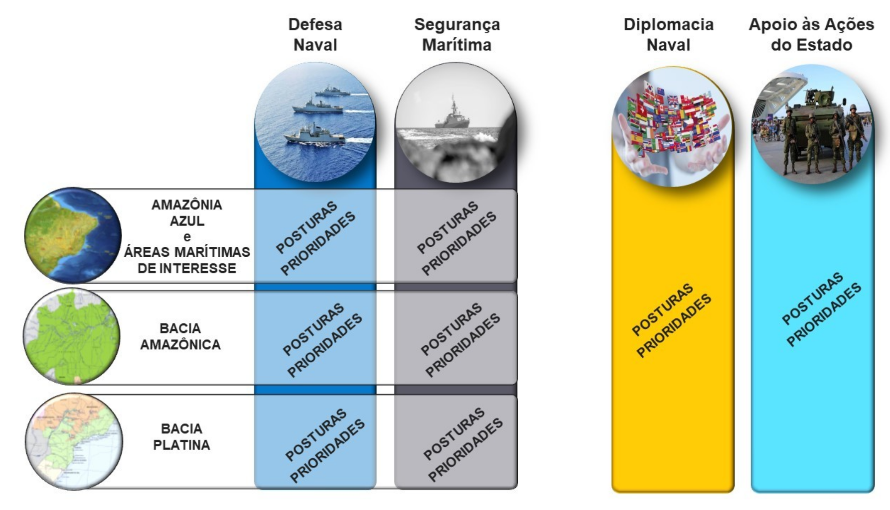
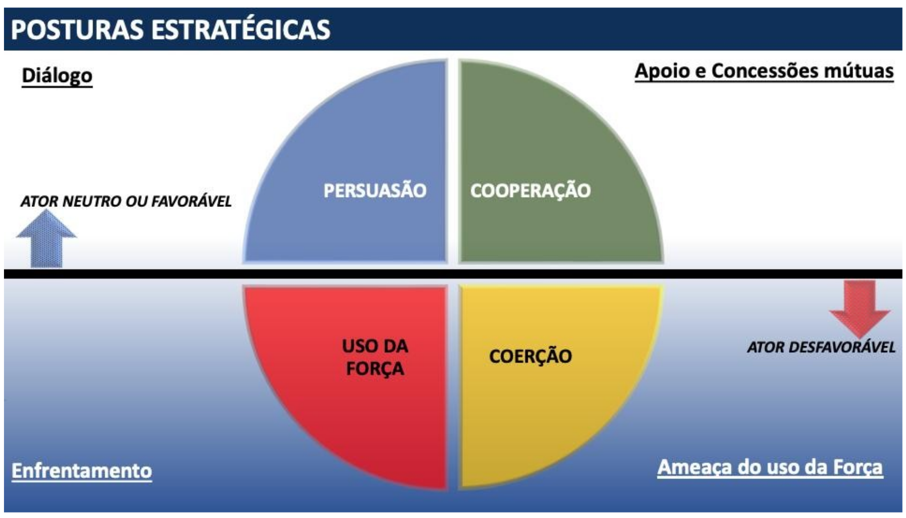

# Cap. 1 - Conceito Estretégico

## Página 9

### 1.1. DEFINIÇÕES

O Conceito Estratégico é a essência da Estratégia de Defesa Marítima (EDM). Ele resulta da integração das análises estratégicas dos desafios (reúnem ameaças e oportunidades) e propicia a elaboração das Diretrizes Estratégicas voltadas para o Preparo e Emprego do Poder Naval. Permite, assim, um Dimensionamento dos Meios necessários para atingir os Objetivos Estratégicos, sobrepujando os desafios identificados. A partir dessas Diretrizes, serão estabelecidos os Objetivos e as Diretrizes de Gestão, que orientarão as ações voltadas à materialização da Força.

O Conceito Estratégico da EDM foi elaborado seguindo a dinâmica FINS-MANEIRASMEIOS (ENDS-WAYS-MEANS), intrínseca a qualquer estratégia, onde os FINS associam-se aos Objetivos Estratégicos, as MANEIRAS às Posturas Estratégicas e os MEIOS às Capacidades Estratégicas para fazer frente a cada desafio, proveniente das análises estratégicas, da Conjuntura e dos Cenários. O Conceito Estratégico considera, ainda, as Prioridades e os Riscos identificados durante o processo de construção da Estratégia.

Dessa forma, os elementos que compõem o Conceito Estratégico serão detalhados a seguir.

### 1.2. OBJETIVOS ESTRATÉGICOS (OBE)

Os Objetivos Estratégicos da Marinha (OBE) são amplos direcionamentos a serem seguidos pela Marinha do Brasil (MB) para o cumprimento da sua Missão. Os OBE foram elaborados com base na compreensão profunda sobre a efetiva contribuição da Instituição para a sociedade brasileira. Eles resultam da análise de documentos condicionantes do mais alto nível político estratégico. Dessa forma, os OBE direcionam as ações e tarefas da MB e, em última análise, justificam a sua existência.

Além disso, é importante ressaltar que os OBE abrangem todos os Campos de Atuação do Poder Naval, quais sejam: Defesa Naval, Segurança Marítima, Diplomacia Naval e Apoio às Ações do Estado. Outra característica relevante a ser ressaltada é o caráter permanente dos OBE intrínseco a cada um deles. Isto posto, foram elaborados onze OBE, cujas descrições podem ser verificadas a seguir.

## Página 10

**1.2.1. OBE 1 — Sobrepujar as ameaças estatais aos interesses nacionais nos ambientes marítimo e fluvial**

O OBE 1 orienta a MB para as atividades relacionadas à Defesa Naval com foco na garantia dos interesses nacionais. Esse OBE prioriza tarefas e ações contra as ameaças estatais que se utilizem dos ambientes marítimo e fluvial para se contrapor aos interesses brasileiros. A entrega deste OBE para a sociedade brasileira está diretamente relacionada à destinação constitucional de Defesa da Pátria.

**1.2.2. OBE 2 — Assegurar a soberania e os direitos de soberania e jurisdição na Amazônia Azul**

O OBE 2 refere-se à superação de ameaças de usurpação da Soberania do Estado brasileiro, em seu viés mais amplo, no que diz respeito à segurança marítima e aos recursos vivos e não-vivos da Amazônia Azul. Este OBE entrega para a sociedade brasileira a proteção do patrimônio nacional no ambiente marítimo sob a jurisdição do Estado brasileiro.

**1.2.3. OBE 3 — Proteger as Infraestruturas Críticas do Poder Marítimo (ICPM)**

O OBE 3 diz respeito, especificamente, à proteção dos ativos do poder marítimo representados, principalmente, pelas instalações portuárias, plataformas e terminais de petróleo e gás e suas estruturas de apoio. O OBE em lide busca garantir o funcionamento normal dessas infraestruturas em momentos de crise e conflito, dada sua essencialidade para o País.

**1.2.4. OBE 4 — Preservar as Linhas de Comunicação Marítimas (LCM) de interesse nacional**

O transporte marítimo responde por 95% das trocas comerciais brasileiras, em volume transportado. Assim, o OBE 4 visa garantir o tráfego marítimo vital para o Brasil e abrange a sua proteção, bem como da carga por ele transportada.

**1.2.5. OBE 5 — Preservar as Linhas de Comunicação Fluviais (LCF) das bacias hidrográficas Amazônica e Platina** 

O OBE 5 visa garantir a segurança marítima nas vias fluviais nas porções brasileiras das bacias hidrográficas Amazônica e Platina. Nesses ambientes operacionais, a MB é responsável por manter as LCF livres de ameaças, permitindo a interligação entre as cidades, a livre navegação e a segurança do comércio.

## Página 11

**1.2.6. OBE 6 — Atuar, de forma integrada, contra os delitos transfronteiriços e ambientais, principalmente na Amazônia Azul, nas LCF e na área ribeirinha de interesse.**

O OBE 6 prioriza as tarefas voltadas ao Apoio às Ações do Estado desenvolvidas pelos Órgãos de Segurança Pública (OSP) nas regiões apontadas. Concretiza-se por meio de ações isoladas, em coordenação ou em cooperação com outros órgãos do Poder Executivo, responsáveis primários na repressão aos delitos em lide, contribuindo para a segurança interna.

**1.2.7. OBE 7 — Prover a Segurança da Navegação Aquaviária e a Salvaguarda da Vida Humana no Mar**

Este OBE se destina a assegurar a salvaguarda da vida humana nas AJB, a segurança da navegação no mar aberto e hidrovias interiores e a prevenção da poluição ambiental por parte de embarcações, plataformas ou suas instalações de apoio. Possui, ainda, relação direta com as atribuições da Autoridade Marítima Brasileira (AMB), exercida pelo Comandante da Marinha em cumprimento a acordos e tratados internacionais e à legislação brasileira, em particular na Lei Complementar 97/1999, na Lei 9537/97 e no Decreto 2596/98.

**1.2.8. OBE 8 — Desenvolver o Setor Estratégico Nuclear de Defesa**

De acordo com a Estratégia Nacional de Defesa (END), a MB é responsável pelo desenvolvimento da tecnologia nuclear para fins pacíficos, no âmbito da Defesa. Assim, este OBE privilegia os projetos e investimentos para o desenvolvimento e operação do submarino convencionalmente armado com propulsão nuclear (SCPN) e das tecnologias e capacitações nacionais que qualifiquem o País para a utilização da energia nuclear para fins pacíficos.

**1.2.9. OBE 9 — Promover o desenvolvimento do Poder Marítimo**

O OBE 9 refere-se às ações da MB voltadas para a promoção da pesquisa e do desenvolvimento no ambiente marinho. O Poder Naval apoia o Poder Marítimo no que tange as atividades de pesquisa voltadas para conservação e exploração sustentável dos recursos marinhos e proteção do meio ambiente, assim como para a integração da Plataforma Continental ao espaço brasileiro, e na cooperação de forma sinérgica, a nível nacional e internacional, com os demais atores do ambiente marítimo. 

**1.2.10. OBE 10 — Exercer a Diplomacia Naval**

O exercício da Diplomacia Naval está relacionado às ações voltadas para a promoção do Poder Nacional no exterior, utilizando o Poder Naval como elemento de apoio à Política Externa. 

**1.2.11. OBE 11 — Atuar, de forma integrada, na defesa dos interesses do Brasil na Antártica**

Este OBE decorre da Política Nacional de Assuntos Antárticos e refere-se às atividades e ações voltadas para o ambiente antártico, nas quais a MB participa direta e decisivamente no apoio à pesquisa.

## Página 12

### 1.3. POSTURAS E PRIORIDADES ESTRATÉGICAS

Uma vez analisadas as Possibilidades de Atuação do Poder Naval[1], levando em conta os Objetivos Estratégicos (OBE) e o Diagnóstico do Poder Naval[2], definiu-se uma série de Posturas e Prioridades Estratégicas que visam orientar a construção do Conceito Estratégico dentro do atual ciclo estratégico(Período de 2024 a 2027). Na figura a seguir, as Posturas e Prioridades são descritas por Campo de Atuação, sendo as de Defesa Naval e Segurança Marítima subdivididas pelas principais áreas geográficas onde o Poder Naval se faz presente.

[1] Possibilidades de Atuação do Poder Naval são eventos identificados nos Cenários ou na Conjuntura que afetam um ou mais OBE e que ensejam o emprego do Poder Naval.

[2] Identificação da situação atual dos principais aspectos que impactam as entregas da MB para a sociedade. Refere-se, entre outros aspectos, à situação dos meios, da manutenção, da capacitação, do adestramento e da gestão da Força Naval.

## Página 13

Figura 1: Campos de Atuação e principais áreas geográficas

1.3.1. Posturas Estratégicas

As posturas estratégicas, também definidas no EMA-301 (Fundamentos Doutrinários da Marinha), referem-se às maneiras (WAYS da lógica estratégica) pelas quais a MB responde aos desafios externos, englobando um conjunto de atitudes ou comportamentos padronizados. As seguintes posturas podem ser adotadas:

**I) Persuasão** — predomina o uso do diálogo e expedientes. Buscam-se os objetivos com a força do argumento;

**II) Cooperação** — caracteriza-se pelo apoio da MB a uma outra Força, outro órgão ou agência (nacionais ou internacionais), em uma situação específica e delimitada no tempo e no espaço. Essa postura permite concessões e trocas proveitosas para as partes envolvidas;

**III) Coerção** — postura na qual são usados majoritariamente recursos de ameaça do uso da força. Lança-se mão de condutas que buscam desencorajar o antagonista quanto às suas intenções ou mesmo impedi-lo, influenciando na sua avaliação de custo-benefício; e

**IV) Uso da Força** — É caracterizada pelo enfrentamento, com a possibilidade do efetivo choque de forças. Pode ser adotada de pronto ou escalonada desde uma Postura Coercitiva, quando o ator antagonista já se posicionou pelo uso da força ou ameaça o uso da força contra os objetivos de interesse brasileiro.

## Página 14

As Posturas Estratégicas estão resumidas no Quadro 1:

Quadro 1: Posturas Estratégicas da Força Naval.

1.3.2. Posturas Estratégicas do Poder Naval por Campos de Atuação

a) Defesa Naval 

Na Amazônia Azul e nas áreas marítimas de interesse, bem como nas áreas ribeirinhas de interesse das bacias Amazônica e Platina, a postura deverá ser Coercitiva.

## Página 15

b) Segurança Marítima

Na Bacia Amazônica, as posturas deverão ser: Cooperativa com os órgãos federais, na repressão aos delitos de repercussão nacional ou internacional, assim como, especificamente, com os órgãos do Poder Executivo na repressão aos delitos transfronteiriços e ambientais; e Coercitiva, isoladamente ou em coordenação, durante a execução da Patrulha Naval e do Patrulhamento nas LCF. Na Amazônia Azul e nas áreas marítimas de interesse, a postura deverá ser: Coercitiva, isoladamente ou em coordenação, durante a execução da Patrulha Naval e do Patrulhamento; e Cooperativa com os órgãos federais, na repressão aos delitos de repercussão nacional ou internacional, assim como, especificamente, com os órgãos do Poder Executivo, na repressão aos delitos transfronteiriços e ambientais. Na Bacia Platina, a postura deverá ser: Cooperativa com os órgãos federais, na repressão aos delitos de repercussão nacional ou internacional, assim como, especificamente, com os órgãos do Poder Executivo, na repressão aos delitos transfronteiriços e ambientais; e Coercitiva, isoladamente ou em coordenação, durante a execução da Patrulha Naval e do Patrulhamento nas águas interiores continentais.

c) Diplomacia Naval

A postura deverá ser Persuasiva nos fóruns de interesse e Cooperativa no uso dos meios em apoio à Política Externa Brasileira e suas diretrizes, prioritariamente com os países que se mostraram atores relevantes nos assuntos afetos às Possibilidades de Atuação (PA) e com relação direta aos interesses da MB.

d) Apoio às Ações do Estado

A postura adotada deve ser Cooperativa, consolidando a MB como elemento capaz de apoiar outros órgãos do Estado, estritamente de acordo com as atribuições afetas à MB por força da lei.

1.3.3. Prioridades Estratégicas

As Prioridades Estratégicas derivam de análises que levam em conta o Diagnóstico do Poder Naval e a Missão da MB. São escolhas que permitem direcionar os esforços empreendidos pela MB na busca de um Poder Naval compatível com os desafios, coadunando o cumprimento da Missão com uma aplicação eficaz de recursos toda ordem. Essas escolhas não são estáticas, mas atendem a um contexto de urgência e necessidade conjuntural, devendo ser revisadas constantemente.

## Página 16

As Prioridades Estratégicas foram divididas por Campos de Atuação e/ou ambientes operacionais de atuação da MB. Assim como os Objetivos Estratégicos, foram numeradas e referenciadas por trigramas, visando a rastreabilidade necessária ao Conceito Estratégico, às Diretrizes de Preparo e Emprego (constante no PCF) e ao Dimensionamento de Força. Tal numeração não estabelece grau de prioridade entre elas. As Prioridades Estratégicas são as seguintes:

a) Defesa Naval (DEF):

I) DEF1 - Ampliar a consciência situacional marítima e fluvial na Amazônia Azul e nas bacias Amazônica e Platina;

II) DEF2 - Ampliar cooperação com o Exército Brasileiro (EB) nas áreas de fronteira;

III) DEF3 - Ampliar o apoio logístico fixo na Bacia Amazônica;

IV) DEF4 - Aprimorar a doutrina do ambiente ribeirinho na Bacia Amazônica;

V) DEFS - Ampliar o comando e controle da Força Naval;

VI) DEF6 - Ampliar a cooperação com a Força Aérea Brasileira (FAB) e o Centro Gestor e Operacional do Sistema de Proteção da Amazônia (CENSIPAM) com foco na Inteligência, Vigilância e Reconhecimento (IVR) e Defesa Aeroespacial;

VII) DEF7 - Incrementar as capacidades antissuperfície, antissubmarino, de defesa antiaérea e IVR dos meios de superfície;

VIII) DEF8 - Incrementar a capacidade de apoio logístico móvel;

IX) DEF9 - Assegurar as capacidades de minagem e contramedidas de minagem (CMM) para no mínimo dois Complexos Portuários;

X) DEF10 - Ampliar o apoio logístico fixo na Amazônia Azul;

XI) DEF11 - Dar continuidade à obtenção de capacidades que permitam uma Postura Coercitiva na Amazônia Azul e áreas marítimas de interesse (atualmente, por meio do Submarino Convencionalmente Armado de Propulsão Nuclear);

XII) DEF12 - Assegurar as capacidades ligadas aos conectores de superfície do Movimento Navio-Terra (MNT);

XIII) DEF13 - Incrementar a capacidade de defender as ICPM consideradas prioritárias - Principais plataformas de petróleo e gás responsáveis diretamente pelo abastecimento interno do País e estruturas portuárias prioritárias, de acordo com o Plano de Configuração de Força (PCF);

XIV) DEF14 - Manter o poder de combate do Com6ºDN;
XV) DEF15 - Aperfeiçoar a doutrina do ambiente ribeirinho nas Bacias Amazônica e Platina;
XVI) DEF16 - Compreender o papel da MB na Guerra Híbrida; e
XVII) DEF17 - Consolidar o Sistema de Defesa Nuclear, Biológica, Química e Radiológica (NBQR) na MB;

## Página 17

b) Segurança Marítima (SMA):
I) SMA1 - Ampliar a consciência situacional nas LCF da Bacia Amazônica;
II) SMA2 - Ampliar as capacidades logística e de inteligência das OM SSTA(Organizações Militares do Sistema de Segurança do Tráfego Aquaviário) na Bacia Amazônica;
III) SMA3 - Ampliar a consciência situacional na Amazônia Azul, incluindo as Ilhas Oceânicas;
IV) SMA4 - Ampliar a cooperação com a FAB com foco em IVR e Patrulha Marítima;
V) SMA5 - Otimizar os meios empregados na Patrulha Marítima;
VI) SMA6 - Ampliar a consciência situacional nas LCF da Bacia Platina; e
VII) SMA7 - Ampliar as capacidades logística e de inteligência das OM SSTA na Bacia Platina.

c) Diplomacia Naval (DIP):
I) DIP1 - Influenciar nas questões marítimas afetas ao Golfo da Guiné, priorizando ações/diretrizes apontadas na análise das PA;
II) DIP2 - Apoiar o MRE no fortalecimento da ZOPACAS; e
III) DIP3 - Ampliar a participação da MB em fóruns internacionais que tratem de assuntos marítimos e do meio ambiente marinho.

d) Apoio às Ações do Estado (AAE):
I) AAE1 - Priorizar o trabalho de inteligência em cooperação com os OSP;
II) AAE2 - Desenvolver doutrina de cooperação com os OSP no contexto da prevenção e da repressão ao crime em águas interiores;
III) AAE3 - Assegurar a presença do Brasil na Antártica;
IV) AAE4 - Continuar com o Planejamento Espacial Marinho; e
V) AAES - Continuar com as ações para difusão da mentalidade marítima na sociedade brasileira.

## Página 18

1.4. ANÁLISE DE RISCO

A EDM foi construída com base em escolhas e prioridades. Assim, quando se faz uma escolha ou se atribui uma prioridade, há riscos associados pelo que não foi escolhido ou ao que foi atribuída baixa prioridade. Cada risco foi classificado através da análise da probabilidade de um evento influenciar a EDM e quais os impactos para os Objetivos Estratégicos, caso esse evento se concretize. A combinação de prioridades com riscos é dinâmica, merecendo acompanhamento e contínua reavaliação conforme se concretize, em qualquer medida.

Tabela 1: Descrição e avaliação dos riscos.

| Risco | Descrição do Risco | Avaliação |
|------:|--------------------|-----------|
| R1 | Degradação das capacidades antissuperfície, antissubmarino, defesa aeroespacial e IVR da Força Naval | Crítico |
| R2 | Inviabilidade, a curto prazo, do Programa Estratégico do Sistema de Gerenciamento da Amazônia Azul (SisGAAz) | Crítico |
| R3 | Interrupção do Projeto Estratégico do Submarino Convencionalmente Armado com Propulsão Nuclear (SCPN) | Crítico |
| R4 | Incapacidade de proteger as Infraestruturas Críticas do Poder Marítimo (ICPM), projetar poder nas Ilhas Oceânicas e outras regiões de interesse, bem como de apoiar a Força Naval no Ambiente Ribeirinho, de forma coordenada | Crítico |
| R5 | Incapacidade da FAB apoiar a MB na Defesa Aérea da Força Naval | Crítico |
| R6 | Ataque cibernético capaz de degradar os Meios Navais ou Sistemas de C5IVR(C5IVR – Comando, Controle, Comunicações, Computação, Cibernético, Inteligência, Vigilância e Reconhecimento.) da MB | Crítico |
| R7 | Evento, de média intensidade, por falta de Comando e Controle | Elevado |
| R8 | Incapacidade de prover Apoio Logístico adequado aos meios da Força Naval | Elevado |
| R9 | Degradação da Capacidade de Proteção Marítima dos Meios Distritais | Elevado |
| R10 | Evento que exija a atuação isolada nas áreas críticas de conflito na Amazônia | Moderado |
| R11 | Evento relacionado a lacunas doutrinárias e degradação do poder de combate da Força Naval em ambiente ribeirinho | Moderado |
| R12 | Evento relacionado à lacuna doutrinária em operações com os Órgãos de Segurança Pública (OSP), principalmente nas Linhas de Comunicação Fluviais (LCF) | Baixo |
| R13 | Desalinhamento da Diplomacia Naval com a Política Externa | Baixo |
| R14 | Infraestrutura de apoio para os Meios Navais afetada por Ameaças Híbridas | Baixo |

## Página 19

### 1.5. CAPACIDADES ESTRATÉGICAS DO PODER NAVAL

Define-se capacidade como a aptidão de um conjunto de meios que realizam determinadas tarefas para atingirem um efeito sob determinadas condições. Entende-se que um efeito, ao ser atingido, produz ou alcança um resultado ou situação favorável em relação a um objetivo ou interesse[7].

Assim, as Capacidades Estratégicas do Poder Naval são as aptidões da MB para gerar efeitos no nível estratégico. Por serem do nível estratégico, estão associadas às Tarefas Básicas do Poder Naval. As Capacidades Estratégicas orientam o Preparo e Emprego do Poder Naval[8]. São elas: Adaptabilidade, Consciência Situacional, Cooperatividade, Expedicionária, Mobilidade, Permanência, Poder de Combate, Presença, Prontidão e Resiliência.

### 1.6. CONCEITO ESTRATÉGICO

Com base nos Objetivos Estratégicos da MB, nas Posturas Estratégicas, nas Capacidades Estratégicas, nas Prioridades deste ciclo estratégico e nos Riscos envolvidos, é possível desenvolver um Conceito Estratégico que fundamenta e orienta as ações da MB, desde o nível estratégico até o nível tático.

Inicialmente, é necessário destacar que o Estado Brasileiro estabeleceu, nos documentos de alto nível de defesa, o seu espaço geopolítico prioritário de influência, conceituado como Entorno Estratégico brasileiro. Ao adotar e aprimorar o referido conceito, a MB prioriza o espaço marítimo desse entorno, atribuindo prioridade ao Atlântico Sul Geopolítico, compreendido pelos seguintes limites: ao norte, o paralelo 16°N; ao sul, o Continente Antártico; a leste, pelo litoral da África Ocidental; e ao oeste, pela América do Sul. O limite 16°N tem o propósito de englobar três importantes áreas: o espaço entre os salientes nordestino e costa ocidental africana, o Mar do Caribe e o litoral brasileiro do Hemisfério Norte.

Esse espaço marítimo apresenta diversos desafios que devem ser explorados pela MB para projetar, defender e assegurar os interesses nacionais em suas águas jurisdicionais e além dessas. Nessa perspectiva, a MB deverá possuir um Poder Naval capaz de detectar, identificar e neutralizar ou explorar, essencialmente nas águas jurisdicionais brasileiras e demais áreas marítimas do Entorno Estratégico, ações ou movimentos, reais ou potenciais, que sejam definidos como desafios, ou seja, aqueles que dificultem (ameaças) ou favoreçam (oportunidades) o cumprimento dos OBE, definidos nesta Estratégia.

[7] A definição de efeito se encontra no EMA-301 (Fundamentos Doutrinários da Marinha).

[8] As Tarefas Básicas do Poder Naval e as Capacidades Estratégicas do Poder Naval estão definidas no EMA-301 (Fundamentos Doutrinários da Marinha).

## Página 20

As atividades que ocorrem no mar ou que podem ameaçar a salvaguarda da vida humana no mar e o meio ambiente marinho demandam ações do Estado brasileiro para assegurar a soberania e os direitos de soberania e jurisdição do Estado brasileiro, assim como seus interesses e suas obrigações internacionais dos quais é signatário. São desafios que, a priori, ensejam ações voltadas à Segurança Marítima e podem representar perigos à segurança nacional, dependendo da ameaça. Assim, os ilícitos praticados no mar envolvem múltiplos interesses e ocorrem em ambiente multifacetado, no qual a identificação real do desafio e atores envolvidos pode ser complexa.

Ao longo da história, o Brasil consolidou suas fronteiras terrestres e conseguiu conferirlhes estabilidade. Adicionalmente, aspectos geográficos como os Andes e a Floresta Amazônica proveem defesas naturais que dificultam tentativas de invasão territorial naquelas regiões. O Oceano Atlântico é, ao mesmo tempo, uma barreira natural e pode representar espaço para manobra de forças navais e outras possíveis ameaças que possuam a capacidade de explorar este potencial. Adicionalmente, as fronteiras das AJB (como os limites da Plataforma Continental estendida) ainda carecem de consolidação.

Para se contrapor às ameaças, a MB executará ações que possam gerar Efeitos Estratégicos, desenvolvendo as Tarefas Básicas do Poder Naval (TBPN)[9] para moldar a situação a favor dos interesses nacionais aos quais se alinham os Objetivos Estratégicos da MB. Para tal, deverá ser capaz de negar o uso do mar; projetar poder; controlar áreas marítimas e águas interiores; realizar proteção marítima; prover a segurança da navegação aquaviária e contribuir para a segurança e desenvolvimento nacional,

[9] As TBPN estão definidas no EMA-301 (Fundamentos Doutrinários da Marinha).

## Página 21

Na busca por uma Força Naval compatível com seus desafios, a definição de posturas e priorização de ações a serem realizadas nas áreas marítimas e fluviais de interesse — nas quais o Poder Naval deverá ser empregado no horizonte temporal de 20 anos — orienta a construção do enquadramento FINS-MANEIRAS-MEIOS (ENDS-WAYS-MEANS), essenciais a qualquer estratégia. Os FINS são consubstanciados nos Objetivos Estratégicos. As MANEIRAS são o modo específico como a MB se comporta diante de cada desafio, representadas pelas Posturas Estratégicas que direcionam como a MB cooperará, influenciará ou enfrentará os atores envolvidos nos desafios. E, por fim, os MEIOS que confrontam os desafios precisam possuir Capacidades Estratégicas, mencionadas anteriormente, que permitem produzir Efeitos Estratégicos, associados às TBPN.

Em relação ao Objetivo Estratégico “Sobrepujar as ameaças estatais aos interesses nacionais nos ambientes marítimo e fluvial”, deve-se adotar a Postura Coercitiva em relação às ameaças e Cooperativa com as demais Forças. Particularmente para o ambiente marítimo, é possível observar que as ameaças que teriam condições de comprometer a segurança do Estado brasileiro possuem Poder Militar e, especificamente, Poder Naval superior ao Brasil, o que reforça a importância da Postura Coercitiva. 

Portanto, para que esta estratégia seja eficaz, é fundamental que o Poder Naval tenha as Capacidades Estratégicas de Consciência Situacional no Atlântico Sul, LCF e nas áreas ribeirinhas de interesse, de Cooperatividade e de Poder de Combate, potencializado pelo desenvolvimento de tecnologias, especialmente a de propulsão naval nuclear aplicada em submarinos, que se coaduna com o Objetivo Estratégico de “Desenvolver o Setor Estratégico Nuclear de Defesa”. Caso a Coerção não seja eficaz, será necessário estar pronto para adotar a Postura Estratégica de Uso da Força para sobrepujar a ameaça. 

Assim, o Poder Naval deverá desenvolver as Capacidades Estratégicas de Poder de Combate missilísticas de médio alcance, associadas à Mobilidade e Permanência na região ou área de interesse, que possibilitem projetar poder sobre alvos de interesse, incluindo os localizados em território adverso. Ainda no contexto da projeção de poder, a exploração das Capacidades Estratégicas, em particular a Expedicionária, proporciona condições para a condução de diversas ações em áreas de interesse como vetor de pronta resposta a conflitos ou outras contingências. 

Nessas ações, estão inseridas aquelas relacionadas às Operações Especiais, sobretudo em ações diretas e de reconhecimento especial. Assim, a MB deverá ser capaz de executar a retirada de nacionais a partir dos litorais de outros Estados, contando com a coordenação do Ministério da Defesa (MD) junto ao Ministério das Relações Exteriores (MRE) e suas representações em cada um dos países identificados.

## Página 22

No que se refere às Águas Jurisdicionais Brasileiras no Arquipélago de São Pedro e São Paulo (ASPSP) e à Plataforma Continental brasileira estendida da Elevação de Rio Grande, o Poder Naval deverá adotar Postura Coercitiva para negar tanto o uso quanto o acesso de embarcações não autorizadas, exercendo as Capacidades Estratégicas de Mobilidade Permanência, Presença, Expedicionária e Poder de Combate.

As Ilhas Oceânicas de Fernando de Noronha e Trindade são posições estratégicas que, caso ocupadas por um ator adverso, podem ser utilizadas para projetar poder no território brasileiro. Por ora, a MB não manterá uma defesa fixa permanente nestas ilhas. Deverá, contudo, manter a consciência situacional e prontidão adequadas para prover a defesa das Ilhas, em tempo oportuno e, se necessário, retomá-las. Para que tal defesa seja bem consolidada, é necessária uma Postura Estratégica Coercitiva que permita o controle de áreas marítimas de interesse e/ou a negação do uso do mar nas mesmas, de forma a evitar ações navais adversas.

Quanto aos Objetivos Estratégicos de “Assegurar a soberania e os direitos de soberania e jurisdição na Amazônia Azul” e “Atuar, de forma integrada, contra delitos transfronteiriços e Ambientais na Amazônia Azul, LC Fluviais e na área ribeirinha de interesse”, a responsabilidade da MB sobre as Águas Jurisdicionais Brasileiras (AJB) afastadas do Mar Territorial torna o Poder Naval essencial na prevenção e repressão a esses ilícitos, inclusive em operações interagências (PF, Receita Federal, ANVISA, IBAMA etc.). A MB deverá adotar a Postura Coercitiva no caso de pesca ilegal e a Postura Cooperativa na participação de operações interagências, incluindo a segurança dos agentes enquanto estiverem embarcados. Para tal, a MB deverá ter as Capacidades Estratégicas de Consciência Situacional, Mobilidade, Permanência, Presença, Expedicionária, Cooperatividade e Poder de Combate.

Quanto ao Objetivo Estratégico de “Proteger as Infraestruturas Críticas do Poder Marítimo (ICPM)”, em especial as dos setores de óleo e gás responsáveis pela maior parte da produção do País, o Poder Naval deverá adotar a Postura Coercitiva, e ser capaz de realizar ações de reconhecimento e ações diretas, que contemplam, inclusive, o emprego de meios não tripulados e ações de contraterrorismo, retomada e resgate, destacamentos de abordagem e reconhecimento especial, em ambiente marítimo, fluvial, ribeirinho, de selva, de montanha e urbano. Para tanto, deverá ser buscado um incremento nas Capacidades Estratégicas de Consciência Situacional, Poder de Combate, Prontidão, Mobilidade e 
Permanência, para proteger e garantir o funcionamento das ICPM. Em relação ao Objetivo Estratégico “Preservar as Linhas de Comunicações Marítimas (LCM) de Interesse Nacional”, o Poder Naval deverá ter as Capacidades Estratégicas de Poder  de Combate, Prontidão, Mobilidade, Permanência e Presença para garantir as Linhas de Comunicação Marítimas, por meio da Postura Coercitiva.

## Página 23

No que diz respeito ao Objetivo Estratégico de “Preservar as Linhas de Comunicações Fluviais”, associadas à Bacia Amazônica, o controle da Foz do Amazonas é fundamental para garantir a segurança das cidades e localidades desta região. Embora haja a predominância dos rios, para prover o nível de controle adequado nesse ambiente, há a necessidade de interações com o EB e FAB, principalmente para garantir a defesa estacionária do território e a defesa aérea da região, respectivamente, adotando uma Postura Coercitiva. O Poder Naval deverá privilegiar, no ambiente ribeirinho, as Capacidades Estratégicas de Presença, Mobilidade, Permanência, Prontidão, Expedicionária e Poder de Combate, visando preservar as LCF dessa região.

Ainda quanto à Bacia Amazônica e em relação ao Objetivo Estratégico de “Atuar, de forma integrada, contra delitos transfronteiriços e ambientais”, observa-se considerável elevação do nível de violência da região, causada principalmente pela carência na presença efetiva e coordenada do Estado brasileiro. Embora a prevenção e repressão aos ilícitos transfronteiriços e ambientais seja atividade subsidiária da MB, o Poder Naval deverá estar pronto, tanto para atuar em coordenação ou em cooperação com órgãos do Poder Executivo quanto para, caso seja determinado, exercer papel relevante na prevenção e repressão a estes ilícitos, por meio da Postura Coercitiva, privilegiando as Capacidades Estratégicas de Poder de Combate, Resiliência, Adaptabilidade e Presença. Dessa forma, deverá ser aproveitada a localização estratégica das Organizações Militares (OM) da região para incrementar a consciência situacional e a capacidade de apoio logístico. Além disso, deverá ser incrementada a segurança orgânica das OM da MB na região e a capacitação do pessoal da MB na repressão a Organizações Criminosas (ORCRIM).

## Página 24

A faixa de fronteira na região da Bacia Platina possui considerável relevância para a Defesa Nacional e, por suas características, apresenta-se como ambiente ribeirinho diverso da Bacia Amazônica. Assim, as Doutrinas de ambientes ribeirinhos para cada uma dessas regiões devem considerar suas respectivas especificidades.

Portanto, visando o Objetivo Estratégico de “Preservar as Linhas de Comunicações Fluviais (LCF)”, associadas à Bacia Platina, a MB deverá adotar Postura Coercitiva e privilegiar, no ambiente ribeirinho, as Capacidades Estratégicas de Presença, Mobilidade, Permanência, Prontidão e Poder de Combate, visando preservar as LCF em toda extensão da Hidrovia Paraguai-Paraná, até o Rio da Prata.

Outro aspecto relevante sobre a atuação da MB na Bacia Platina é o acesso único pelo Rio da Prata, que exige a coordenação e o levantamento de possibilidades de reforços por via terrestre e aérea.

Por outro lado, visando o Objetivo Estratégico de “Atuar, de forma integrada, contra os delitos transfronteiriços e ambientais”, associados à Bacia Platina, a MB deverá, quando solicitado, adotar Postura Cooperativa com os órgãos do Poder Executivo e com o EB e incrementar a segurança orgânica das OM na região. Adicionalmente, quanto ao Lago da Hidroelétrica de Itaipu, a MB adotará Postura Coercitiva, privilegiando as Capacidades Estratégicas de Poder de Combate, Resiliência, Adaptabilidade, Expedicionária e Presença. 

Em relação ao Objetivo Estratégico de “Prover a Segurança da Navegação Aquaviária e Salvaguarda da Vida Humana no Mar”, está prevista a realização e o acompanhamento de ações relacionadas às atribuições da Autoridade Marítima (AM) por parte dos seus agentes e representantes, com o propósito de assegurar a salvaguarda da vida humana e a segurança da navegação, no mar aberto e hidrovias interiores, e a prevenção da poluição ambiental por parte de embarcações, plataformas e suas instalações de apoio. Deverá ser considerada a possibilidade, se não houver impedimento legal, de delegação gradual da execução dessas ações para órgãos federais, estaduais e municipais e, por concessão, a particulares, em áreas definidas de jurisdição, buscando a viabilidade da promoção da segurança da navegação aquaviária e que a MB priorize seu papel de regulação e fiscalização dos responsáveis por exercerem tais ações. Este processo de delegação gradual também inclui a Salvaguarda da Vida Humana nas águas interiores.

## Página 25

Para a Busca e Salvamento no mar, o Poder Naval deverá aproveitar a capilaridade das Capitania, Delegacias e Agências, localizadas no ambiente marítimo, com Capacidades Estratégicas de Consciência Situacional, Mobilidade e Prontidão, de forma a, com meios adequados, reduzir o tempo de reação aos eventos de Busca e Salvamento (SAR) que ocorram até 50 MN de costa. Além desta distância, deverão ser empregados prioritariamente os meios dos Distritos Navais e, somente em extrema necessidade e de acordo com a situação, os meios da Esquadra.

Para prover a segurança da navegação aquaviária nas AJB, a MB deverá apoiar a Autoridade Marítima na normatização e fiscalização das leis nacionais e nas convenções e resoluções internacionais ratificadas pelo Estado brasileiro, além do estabelecimento de auxílios à navegação e na produção e divulgação de informações do ambiente marítimo e fluvial, em conformidade com os padrões internacionais. Deverão ser priorizados os produtos destinados às demandas operativas específicas da MB.

Visando o Objetivo Estratégico de “Promover o desenvolvimento do Poder Marítimo”, é importante que seja elaborado e aprovado o Planejamento Espacial Marinho, coordenado pela Secretaria da Comissão Interministerial para os Recursos do Mar (SECIRM), de forma a permitir o mapeamento preciso das áreas de interesse na Amazônia Azul. O propósito é estabelecer as bases institucionais, normativa e regulatória que serão utilizadas no processo de tomada de decisão relacionado ao uso do mar e seu ordenamento, tanto em âmbito público quanto privado. Outro aspecto relevante é a conclusão da reformulação da Política Marítima Nacional (PMN) e sua posterior aprovação, trabalho que está sendo coordenado pelo Estado-Maior da Armada. Sua finalidade é modernizar o marco regulatório que orienta o desenvolvimento das atividades relacionadas ao uso do mar no País e as águas interiores que a ele sejam interligadas, para orientar a compreensão integrada e harmônica do meio ambiente marinho em suas múltiplas e complexas relações, respeitando os aspectos sociais, econômicos, científicos, legais, ambientais e culturais.

Com relação ao Objetivo Estratégico de “Exercer a Diplomacia Naval”, a MB deverá priorizar as Posturas Persuasiva e Cooperativa nos relacionamentos com as Marinhas Amigas, em especial com os países partícipes da Zona de Paz e Cooperação do Atlântico Sul (ZOPACAS) e da Comunidade dos Países de Língua Portuguesa (CPLP). Além disso, deverá aumentar gradativamente a participação nas iniciativas marítimas interestatais no Golfo da Guiné, cooperando com os países africanos envolvidos na prevenção e repressão aos atos de pirataria e roubo armado no mar, além de possibilitar proatividade na preservação das Linhas de Comunicação Marítima (LCM) de interesse nacional naquela região. Caso a conjuntura indique a necessidade de atuação da MB no âmbito das Operações de Paz e Ajuda Humanitária sob a égide das Nações Unidas e outros organismos internacionais, a demanda será pontualmente atendida com os meios disponíveis, sem dimensionamento específico prévio. Para exercer a Diplomacia Naval, a MB deverá privilegiar as Capacidades Estratégicas Presença, Mobilidade, Expedicionária, Adaptabilidade, Permanência, Cooperatividade e Poder de Combate.

## Página 26

Quanto ao Objetivo Estratégico de “Atuar, de forma integrada, na defesa dos interesses do Brasil na Antártica”, a MB manterá, com prioridade, o apoio logístico às pesquisas brasileiras, permitindo a continuidade da participação brasileira nas decisões afetas ao Continente Antártico. A MB deverá estar pronta para apoiar os interesses na região, por meio de uma postura cooperativa no apoio à pesquisa, privilegiando as Capacidades Estratégicas de Adaptabilidade, Mobilidade, Permanência e Cooperatividade.

Nos desafios identificados, o ambiente cibernético deverá ser permanentemente considerado, de forma a evitar a exploração das vulnerabilidades da MB, com prioridade às ações de defesa nessa área. Assim, a MB priorizará a defesa dos sistemas das ICPM e da Força Naval, bem como explorará as vulnerabilidades dos sistemas adversários e desenvolverá as capacidades cibernéticas com foco nessas prioridades.

Outro aspecto identificado diz respeito à Defesa Nuclear, Biológica, Química e Radiológica (NBQR). Pouco se conhece sobre os desafios nos ambientes operacionais considerados. Assim, primeiramente, será necessário buscar as possibilidades e limitações dos desafios quanto a esse tipo de ameaça e, paralelamente, consolidar o Sistema de Defesa NBOR da MB que melhor responda aos desafios identificados.

Acontecimentos recentes demonstram que o foco das ameaças não se limita à Expressão Militar do Poder Nacional. Outras expressões do Poder Nacional também podem ser exploradas para se atingir o País. Muitas vezes, objetivos no território nacional podem ser atacados sem que se tenha plena consciência disso, em uma modalidade de competição/enfrentamento conhecida como Guerra Híbrida, cuja compreensão do conceito se encontra em aprimoramento na MB. Como ator relevante para a Defesa do Poder Marítimo, a MB deverá aprofundar essa compreensão, ampliando a sinergia com as demais Forças e Ministérios para otimizar as ações nesse setor, explorando todos os recursos de que  o Poder Nacional dispõe para esse fim.

## Página 29

OSTENSIVO EMA-310

CAPÍTULO 2 ORIENTAÇÕES ESTRATÉGICAS DE PREPARO E EMPREGO

2.1. DEFINIÇÕES

Inicialmente, é preciso mostrar o entendimento de Preparo e Emprego para o nível estratégico. O Preparo e o Emprego do Poder Naval são referenciados na Missão da MB e servem para organizar as Diretrizes Estratégicas que realizam a conexão entre o Conceito Estratégico e o Dimensionamento de Força e sua utilização. As Diretrizes Estratégicas de Preparo e Emprego são pautadas pelas instruções deste Capítulo e devem apontar as metas e medidas necessárias para orientar a elaboração e atualização do Plano de Configuração de Força (PCF). As Diretrizes Estratégicas de Preparo e Emprego, com suas metas e medidas,

serão detalhadas no PCF e seguirão o modelo abaixo:

Quadro 2: Modelo de Diretrizes de Preparo e Emprego

MODELO DE DIRETRIZES ESTRATÉGICAS DE PREPARO E EMPREGO

Rastreabilidade: OBE — Objetivo Estratégico

Prioridades DEF — Defesa Naval SMA — Segurança Marítima DIP — Diplomacia Naval AAE — Apoio às Ações do Estado

Capacidades Estratégicas Campos de Atuação

R -— Riscos

Contextualização do Desafio

OSTENSIVO -2-1- ORIGINAL

---

## Página 30

OSTENSIVO EMA-310

As definições de Preparo e Emprego são referenciadas no conceito de capacidade, a qual só é plenamente materializada quando todos os seus atributos (DOPEMAI)ºº são atendidos.

Sempre que algum atributo de capacidade é degradado a ponto de provocar a perda daquela capacidade, as Diretrizes Estratégicas de Preparo tratarão de orientações estratégicas que visam restabelecer essa capacidade. Uma Diretriz de Preparo também será implementada sempre que identificada a necessidade de concepção, desenvolvimento e produção de uma nova capacidade.

Por outro lado, as Diretrizes Estratégicas de Emprego tratam de orientações estratégicas sobre o uso efetivo de capacidades existentes com seus atributos suficientemente atendidos

e integrados.

2.2. PREPARO DO PODER NAVAL

Por meio das análises estratégicas, as Diretrizes de Preparo que serão apresentadas no PCF compõem duas linhas de esforço principais, cada uma calcada em uma Capacidade Estratégica. Uma tem por objetivo incrementar o Poder de Combate, de forma contextualizada com as ameaças e outra visa aumentar a Consciência Situacional da MB nas áreas marítimas e fluviais prioritárias identificadas na EDM. Cada linha de esforço é

composta pelos eixos temáticos, conforme apresentado a seguir.

10 Os atributos de capacidade são: Doutrina, Organização, Pessoal, Educação, Material, Adestramento e Infraestrutura (DOPEMAI).

OSTENSIVO -2-2.- ORIGINAL

---

## Página 31

OSTENSIVO EMA-310

Quadro 3: Eixos Temáticos.

Poder de Combate

e Navios com capacidades antisuperfície, antissubmarino, defesa antiaérea e IVR e Submarinos

e Navios Patrulha

e Meios e Tropas para Operações Ribeirinhas

e Meios de Minagem e CMM

e Conectores do MNT

Consciência Situacional

e SisGAAz e Meios Navais e Aeronavais de IVR (tripulados ou não tripulados) e Capacidade Cibernética

2.2.1. Poder de Combate

A MB deve buscar o incremento do Poder de Combate dando continuidade aos processos de recuperação das capacidades antissuperfície, antissubmarino, de Defesa Antiaérea e IVR dos meios navais, buscando meios com requisitos compatíveis com eventuais ameaças vislumbradas nas análises estratégicas.

Além disso, a extensão das AJB, as Possibilidades de Atuação do Poder Naval e os investimentos já integralizados para a obtenção do Submarino Convencionalmente Armado de Propulsão Nuclear (SCPN) consolidam a escolha deste e dos submarinos convencionais como opção para se contrapor aos desafios identificados, materializando o Poder de Combate necessário para se adotar a Postura Coercitiva. Para tal, o prosseguimento dos Programas PROSUB e PNM são fundamentais para desenvolver o Setor Estratégico Nuclear de Defesa.

Para o fortalecimento do Poder de Combate, deve-se elevar a capacidade de patrulhamento das AJB, sendo necessárias novas aquisições de meios navais para a

segurança marítima na Amazônia Azul. Os esforços devem ser orientados à consolidação de

OSTENSIVO -2-3- ORIGINAL

---

## Página 32

OSTENSIVO EMA-310

uma capacidade de construção naval continuada de projetos competitivos internacionalmente. As quantidades e requisitos dos navios patrulhas devem ser compatíveis com o determinante geográfico, sem prejuízo das tarefas previstas no Campo de Atuação da Segurança Marítima.

É importante ressaltar que os desafios ao Poder Naval nas bacias hidrográficas Amazônica e Platina reforçam a necessidade de preservar as LCF nessas regiões. A MB deverá atuar, de forma integrada, contra os delitos transfronteiriços e ambientais nas LCF e na área ribeirnha de interesse. Para tanto, a MB deve fortalecer, gradualmente, o Poder de Combate na Bacia Amazônica, considerando os desafios, os meios disponíveis na região, o seu atual Poder de Combate, as Possibilidades de Atuação, as Posturas e o ambiente operacional. Também deverá, de forma prioritária e estruturada, desenvolver doutrinas específicas para os ambientes ribeirinhos da Bacia Amazônica e da Bacia Platina.

Ainda no contexto de sobrepujar as ameaças estatais no ambiente marítimo, com a importância dos portos brasileiros para as expressões de Poder Econômico e Militar do Brasil, reputa-se como capacidade essencial para a defesa e proteção dessas infraestruturas críticas a capacidade de minagem e de contramedida de minagem (CMM). Dessa forma, a MB deve desenvolver esforços efetivos para aprimorar essas capacidades, conforme dimensionado.

Outro eixo temático que deve receber atenção no fortalecimento do Poder de Combate do Poder Naval diz respeito às capacidades dos conectores navais do MNT, uma vez que as análises estratégicas apontam desafios que impõem a manifestação do poder de combate da MB sobre uma área terrestre de interesse do Poder Naval.

Vale ressaltar que as iniciativas que visam incrementar o Poder de Combate da Força Naval relacionam-se diretamente à disponibilidade do armamento e munição. É sob essa condição que se erige um Poder Naval crível e adequado ao cumprimento de suas atribuições constitucionais.

2.2.2. Consciência Situacional

Em relação a essa Linha de Esforço, a MB deve primeiramente ampliar a Consciência

Situacional Marítima nas áreas referentes ao Projeto Piloto do Sistema de Gerenciamento da

Amazônia Azul (SisGAAz), buscando o gradualismo que permita a expansão da Consciência

OSTENSIVO - 2-4 - ORIGINAL

---

## Página 33

OSTENSIVO EMA-310

Situacional, sequencialmente, para a Elevação do Rio Grande, para as Ilhas Oceânicas, para a Foz do Rio Amazonas, para a Bacia de Santos, para a Margem Equatorial brasileira e para o Arquipélago de São Pedro e São Paulo.

Os sensores que compõem o SisGAAz devem ser empregados de forma integrada com os meios navais, aeronavais e de fuzileiros navais (tripulados e não tripulados). Por isso, o Preparo das capacidades atreladas a esses meios deve sempre levar em consideração seus requisitos de IVR.

No Preparo, deve-se considerar a necessidade de um nível de Comando e Controle compatível com a arquitetura IVR desejada. As informações dos meios IVR não podem materializar ganho sem um fluxo de informações que cubra todo o processo de decisão, desde a observação até a ação. É imperativo que haja integração e segurança das comunicações (voz e dados) intra-MB e com o MD/outras Forças Singulares. Isso exigirá da MB criar condições para a obtenção de comunicações criptografadas e enlace de dados para os meios operativos e, ao mesmo tempo, aprimorar e consolidar a Doutrina de Comando e Controle no contínuo normalidade, crise e conflito.

Para contrapor-se às ameaças cibernéticas, a MB deverá buscar a seguintes capacidades cibernéticas: identificação de ameaças e de vulnerabilidades dos sistemas digitais de combate próprios, realização de defesa ativa e identificação de alvos de interesse e desenvolvimento de sistemática específica para atualização e multiplicação dos conhecimentos técnicos na área de TI, segurança da informação e cibernética. Deve-se considerar os avanços tecnológicos de diversos atores cibernéticos militares e não militares, assim como o risco aos meios e sistemas de novas classes de navios na MB, com elevado grau de conectividade. A MB deve buscar vantagem por meio do conhecimento de possíveis vulnerabilidades técnicas de seus equipamentos de combate (sistemas de armas, comunicações, controle de propulsão etc.).

Além dos eixos temáticos principais abordados, o PCF deverá abordar, no contexto do Preparo, as necessidades de desenvolvimento de doutrinas e conceitos relacionados à Defesa Aeroespacial da Força Naval, ao Controle da Foz do Rio Amazonas, à Proteção das

ICPM e à Defesa das Ilhas Oceânicas.

OSTENSIVO -2-5 - ORIGINAL

---

## Página 34

OSTENSIVO EMA-310

Por fim, ainda sobre o Preparo da Força, o PCF deve estabelecer diretrizes que abordem as necessidades logísticas e de infraestruturas que apoiam as Linhas de Esforço em

geral.

2.3. EMPREGO DO PODER NAVAL

O emprego do Poder Naval deve ser pautado pelas Linhas de Esforço apresentadas no Quadro 6 que levam em consideração os princípios do treinamento contextualizado, da otimização no uso dos recursos e do alinhamento com as demandas apontadas nas análises

estratégicas.

Quadro 4: Linhas de Esforço.

Contextualizar os Adestramentos

Otimizar o Emprego dos Meios

2.3.1. Contextualizar os Adestramentos

Visando a manutenção de um Poder Naval aprestado para enfrentar os desafios vislumbrados nos Cenários e na Conjuntura, e considerando os adestramentos como parte componente do aprestamento dos meios para o emprego, os Planos e Programas de Adestramento (PGACON e PGADGN) devem ser conduzidos seguindo as prioridades estabelecidas e de forma alinhada com Possibilidades de Atuação que foram identificadas

OSTENSIVO - 2-6 - ORIGINAL

---

## Página 35

OSTENSIVO EMA-310

nas análises estratégicas. Além disso, deve-se buscar a inserção dos Cenários observados nas

PA nos Planos de Trabalho Anual (PTA) da Chefia de Operações Conjuntas do Ministério da

Defesa.

Em relação às Ilhas Oceânicas, é preciso seguir a orientação da END enquanto a Arquitetura de Defesa!” das mesmas não é materializada do ponto de vista do dimensionamento de capacidades. Assim, a inserção da Defesa ou Retomada de Ilhas Oceânicas nas Operações Correntes e Programas de Adestramento da Defesa pode servir como recurso para atingir o objetivo de aprestar a Força Naval para a Defesa ou Retomada de Ilhas Oceânicas com os meios disponíveis.

No que diz respeito ao emprego dos Meios na proteção de ICPM, é necessário mencionar que, em relação ao terminal de São Sebastião e a Bacia de Santos, pode-se aprimorar e consolidar a Doutrina Interagências para Proteção de Plataformas de Petróleo e Instalações Portuárias com os meios da MB já existentes.

2.3.2. Otimizar o Emprego dos Meios

Dadas as dimensões da área de responsabilidade da MB frente aos recursos atuais de IVR, uma forma de atuar sobre o problema, usando os meios atuais, é buscar a sinergia com o EB nas bacias hidrográficas Amazônica e Platina, com a FAB na Amazônia Azul e com o CENSIPAM em suas áreas de cobertura. Logo, a MB deve ampliar a cooperação com o EB com foco na consciência situacional nas áreas ribeirinhas de interesse nas Bacias Amazônica e Platina, priorizando as áreas que demandam as LCF identificadas nas análises, ampliar a cooperação com a FAB com foco nos meios aéreos e espaciais de IVR na Amazônia Azul e ampliar a cooperação com o CENSIPAM.

Sobre os Distritos Navais, há necessidade de preservar a capacidade de proteção marítima da Amazônia Azul e a livre navegação das LCF. Sendo assim, com o intuito de garantir que a substituição dos meios ocorra de forma adequada e oportuna, deve-se avaliar a postergação de baixa dos Meios Navais Distritais.

Para otimizar o emprego dos Meios Navais e Distritais, o ComOpNav deve providenciar de um Plano de Inteligência Operacional, baseado em informações das Estações

Radiogoniométricas de Alta Frequência (ERGAF), dos meios de IVR da MB e de outras Forças

11 Uma Arquitetura de Defesa é composta por uma Concepção Operacional específica para o contexto apresentado, na qual serão apontados, obrigatoriamente, as capacidades requeridas e o dimensionamento de Força para sua consecução.

OSTENSIVO -2-7- ORIGINAL

---

## Página 36

OSTENSIVO EMA-310

e Órgãos (inclusive satelitais), informações interagências, Órgãos e organizações internacionais e demais membros da Comunidade Marítima, conjugando o emprego com tal Plano de Inteligência Operacional. As áreas marítimas que compreendem a ERG, a Foz do Rio Amazonas, a Bacia de Santos, as Ilhas Oceânicas e a Margem Equatorial são áreas marítimas prioritárias.

Quando se trata de capacidade de Defesa Nuclear, Biológica, Química e Radiológica (NBQR), a MB deve consolidar doutrinariamente a organização de seu Sistema de Defesa NBOR.

Em relação às demandas de caráter preventivo e repressivo para o reestabelecimento da ordem pública, em operações de Garantia da Lei e da Ordem (GLO), conforme estipulado na Lei Complementar nº 97/99 e em ações de apoio à Defesa Civil, a MB deve aprimorar e consolidar a Doutrina para atender às eventuais demandas de Apoio às Ações do Estado nas áreas de segurança pública e defesa civil. Não será realizado dimensionamento específico da Força para esses fins, devendo a MB, sempre que demandada pelos instrumentos legais, atender com as capacidades que já possui.

O valor estratégico da presença do Brasil na Antártica e a necessidade de mapear as riquezas do solo marinho na Amazônia Azul, visando ao fortalecimento da expressão econômica nacional, apontam para o envolvimento da MB em contribuição à área de pesquisa no contexto do Poder Marítimo Nacional. Assim, alinhada à Política Nacional para Assuntos Antárticos (POLANTAR) e contribuindo para o desenvolvimento científico marítimo, a MB deve dar continuidade ao Planejamento Espacial Marinho na Amazônia Azul e atender às demandas de apoio às Atividades de Pesquisa Científica no ambiente marítimo sem novo

dimensionamento de Força. Nas Relações Internacionais, a análise das Possibilidades de Atuação do Poder Naval,

em consonância com a Conjuntura e os Cenários nos quais a MB está inserida, indicou a necessidade de fomentar as relações com diversos países. Além disso, a existência de iniciativas de atores extrarregionais no Atlântico Sul recomenda o incremento da inserção brasileira nas questões marítimas afetas ao Entorno Estratégico Marítimo, mais especificamente no Golfo da Guiné, em apoio ao fortalecimento da ZOPACAS. Por isso, devese alinhar os objetivos e planejamentos das relações internacionais com os interesses brasileiros e da MB, em relações aos países e fóruns identificados, em consonância com a

Política Externa brasileira.

OSTENSIVO - 2-8 - ORIGINAL

---

## Página 37

OSTENSIVO EMA-310

CAPÍTULO 3 DIMENSIONAMENTO DA FORÇA

3.1. ASPECTOS DO DIMENSIONAMENTO Durante o processo de dimensionamento, orientado pela Sistemática de Planejamento de Alto Nível da Marinha (SPAN) e derivado do Conceito Estratégico e das Diretrizes Estratégicas de Preparo e Emprego, foram identificados os quantitativos dos sistemas e meios componentes de cada Elemento de Força”. Os requisitos e estimativa de custos são delineados pelo Setor de Material da MB para elaboração de propostas de solução de força. É importante ressaltar que o Dimensionamento proposto levou em consideração Oo Diagnóstico do Poder Naval. O Dimensionamento está estruturado da seguinte forma: a) Elementos de Força dimensionados: |) Força de Intervenção Marítima; II) Força de Proteção Marítima; III) Força de Guerra de Minas; IV) Força C5IVR; V) Força de Desgaste; VI) Força de Projeção; VII) Força de Logística de Combate; VIII) Força de Operações Especiais; IX) Força de Serviços Hidroceanográficos; e X) Força de Apoio à Pesquisa Antártica. b) Elementos de Força ainda não foram dimensionados: |) Força Ribeirinha; Il) Força de Proteção Marítima (Grupamentos de FN); III) Força de Busca e Salvamento (SAR);

12 Conjunto de meios (navios, aeronaves, carros de combate, etc.) e sistemas, doutrinariamente organizados que, por meio da realização de tarefas, atingem um efeito em determinado tempo e espaço.

OSTENSIVO -3-1- ORIGINAL

---

## Página 38

OSTENSIVO EMA-310

IV) Força de Segurança do Tráfego Aquaviário (STA); V) Força de Ensino Profissional Marítimo (EPM); VI) Força Diplomacia Naval; e

VII) Força de Assistência Hospitalar.

OSTENSIVO -3-2- ORIGINAL

---

## Página 39

OSTENSIVO EMA-310

3.2. DIMENSIONAMENTO

3.2.1. FORÇA DE INTERVENÇÃO MARÍTIMA

A Força de Intervenção Marítima foi dimensionada de forma a ser capaz de atingir pelo menos um dos seguintes efeitos:

a) Proteção das Linhas de Comunicações Marítimas (LCM); b) Proteção das Infraestruturas Críticas do Poder Marítimo (ICPM);

c) Defesa de Ilhas Oceânicas; e

d) Controle de Área Marítima de Interesse (em especial a Foz do Rio Amazonas e a região da Elevação do Rio Grande).

. Dimensão Visual do Elemento de Força e Necessidades de Meio Qtd. n Obtenção

Navio Aeródromo

unem io 1 um (NAM)

(capacid. Op. Asa Fixa)

Aeronaves do

NAM (Esclarec., es e a nn e e e e Atq.; e A/S) PE dA de E do E do Escoltas veditnálioo odio elitiniidioar reiiniidio veditniiio eita reitor reiinidioa Aeronaves dos - Escoltas . . . “ (Esclarec./Atq.) tdi, temia nd ent

SARP - a partir de

terra ou dos Am

navios

OSTENSIVO -3-3- ORIGINAL

---

## Página 40

OSTENSIVO EMA-310

3.2.2. FORÇA DE PROTEÇÃO MARÍTIMA

A Força de Proteção Marítima foi dimensionada, primordialmente, de forma a ser capaz de proteger as Infraestruturas Críticas do Poder Marítimo (ICPM) em caso de crise, reprimir a explotação não autorizada de recursos na Amazônia Azul, em situação de normalidade ou crise, e impor o ordenamento jurídico pátrio nas AJB e Plataforma Continental estendida.

A proposta de dimensionamento visa atingir pelo menos um dos seguintes efeitos:

a) Proteção das Linhas de Comunicações Marítimas (LCM) (em caso de crise);

b) Proteção das Infraestruturas Críticas do Poder Marítimo (ICPM) (em caso de crise);

c) Repressão à exploração/explotação não autorizada de recursos na Amazônia Azul; e

d) Repressão a ilícitos transfronteiriços e ambientais.

Meio atd. Dimensão Visual do Elemento de Força e Necessidades de

Navio Patrulha Oceânico

10

Obtenção a E

dá

E E

, a Navio Patrulha dá

de 500 Ton 20

TE mt MH mw tt

di, di

Aeronaves de Patrulha Marítima

i

* As aeronaves de Patrulha Marítima não foram dimensionadas, pois ainda há indefinições na MB e na FAB quanto ao emprego da Asa Fixa em proveito da Força Naval.

OSTENSIVO -3-4 - ORIGINAL

---

## Página 41

OSTENSIVO EMA-310 3.2.3. FORÇA DE GUERRA DE MINAS

As Capacidades de Guerra de Minas dimensionadas foram: Minagem defensiva; e Contramedidas de Minagem sem oposição. O seguinte dimensionamento é proposto para

que os seguintes efeitos desse Elemento de Força sejam alcançados:

a) Negação do uso de Área Marítima de Interesse; e

b) Proteção de Linhas de Comunicação Marítima.

Meio atd. Dimensão Visual do Elemento de Força e Necessidades de

Obtenção Navios de a gata CMM NSS com capacidade de a”, CMM Navios com la! hão! Jo hão! capacidade de Minagem cialdhnto coil cold coil Sistemas não Jk o!

tripulados

GDAE agp

* Sistemas não tripulados: tecnologia em fase de desenvolvimento na MB.

OSTENSIVO -3-5 - ORIGINAL

---

## Página 42

OSTENSIVO EMA-310

3.2.4. FORÇA C5IVR

Esse Elemento de Força mostrou-se relevante no atingimento dos seguintes efeitos: Monitoramento e Vigilância da Amazônia Azul, Monitoramento e Controle do Tráfego de Embarcações; Salvaguarda da Vida Humana no Mar; Produção de Informações de Segurança da Navegação; Fiscalização do Tráfego Aquaviário; Prevenção da Poluição Hídrica por Embarcações; e Produção de Conhecimentos de Interesse para a Defesa dos Direitos de Soberania na AJB. Dessa forma, alguns sistemas foram identificados como mais importantes para compor

esse Elemento de Força:

Dimensão Visual do Elemento de Força e Necessidades de Obtenção

TESCTAVAVA

PLADEPO

' ——-— SISCOM 4 cão

* SisGAAz: vigilância e monitoramento ativo nas seguintes áreas: ERG, Ilhas Oceânicas, Bacia Petrolífera de Santos, Foz do Rio Amazonas e área marítima da Margem Equatorial.

* PLADEPO: ambiente operacionais de maior relevância, identificados nas Possibilidades de Atuação. * SARP: dimensionamento de acordo com o PCF.

* SISCOM: reestruturação de acordo com a alínea e, do inciso 2.2.1 do PCF.

OSTENSIVO -3-6- ORIGINAL

---

## Página 43

OSTENSIVO EMA-310 3.2.5. FORÇA DE DESGASTE

A Força de Desgaste foi dimensionada de forma a ser capaz de atingir pelo menos

um dos seguintes efeitos: Interromper as linhas de Comunicação Marítimas em um porto no

entorno estratégico; e Negar o uso das seguintes áreas marítimas de interesse: ERG; Proximidades de Ilhas Oceânicas, Foz do Rio Amazonas, Bacias Petrolíferas de Santos e Campos. Para

isso, O seguinte dimensionamento é proposto:

Dimensão Visual do Elemento de Força e Necessidades de

Meio Qtd. Obtenção

Submarinos de

propulsão temia ; e ; e =

convencional

Submarino

Convencionalmente

Armado com Propulsão Nuclear A

(SCPN)

OSTENSIVO -3-7- ORIGINAL

---

## Página 44

OSTENSIVO EMA-310

3.2.6. FORÇA DE PROJEÇÃO

A Força de Projeção foi dimensionada de forma a ser capaz de alcançar os seguintes

efeitos: a) Defender/Retomar Ilhas Oceânicas nacionais; b) Neutralização de Alvos de Interesse Militar (em Terra); c) Controle de Área Terrestre de Interesse Naval; e

d) Proteção de Bens, Recursos e Nacionais no exterior.

Dimensão Visual do Elemento de Força e Necessidades de

Meio Qtd. Obtenção

NAM tm

(capacid. Op. Asa Fixa) E” "um

Navios Anfíbios O TR

EDCG/EDVM q Es E da ie rm

Aeronaves para

movimento dio dia

Helitransportado

oii. oiii. Aeronaves de Es Ea escolta e Apoio - ——— s - de Fogo

* De acordo com o Anexo do PCF

OSTENSIVO -3-8- ORIGINAL

---

## Página 45

OSTENSIVO EMA-310

3.2.7. FORÇA LOGÍSTICA DE COMBATE

A Força Logística de Combate foi dimensionada de forma a ser capaz de alcançar o

seguinte efeito: Apoiar a Força de Intervenção, Força de Projeção e Força de Desgaste nos

propósitos para os quais foram dimensionados. Para tal, o seguinte dimensionamento é pro-

posto:

Dimensão Visual do Elemento de Força e Necessidades de Obtenção

Navio de Apoio E E Logístico PA” TP PA” TP

Navio de À e Socorro

Submarino

Navio de Apoio & do é a

Oceânico

Meio Qtd.

Navio de == Tratamento de e A

Baixas

OSTENSIVO -3-9- ORIGINAL

---

## Página 46

OSTENSIVO EMA-310

3.2.8. FORÇA DE OPERAÇÕES ESPECIAIS

Dimensionada para contribuir com a consecução de praticamente todos os efeitos de

acordo com o Capítulo 2 do PCF.

Dimensão Visual do Elemento de Força e

Meio Qtd. Necessidades de Obtenção

Equipe MeC Destacamento de Apoio às OpEsp Destacamento de ComAnf (Pel. Ações de Comando e PelRecon) -— mu

Grupo Especial de Retomada

e Resgate/OpEsp

Grupo Especial de Retomada e Resgate/MeC

OSTENSIVO - 3-10 - ORIGINAL

---

## Página 47

OSTENSIVO EMA-310 3.2.9. FORÇA DE SERVIÇOS HIDROCEANOGRÁFICOS

A Força de Serviços Hidroceanográficos destina-se a cumprir os compromissos internacionais assumidos pelo Estado brasileiro relacionados à vertente safety da Segurança Marítima e para o levantamento de informações necessárias ao conhecimento adequado do

meio ambiente operacional da Força Naval. Dessa forma, o dimensionamento, proposto pelo setor, visa atingir os seguintes efeitos:

a) Produzir Informações de Segurança da Navegação ; e

b) Salvaguardar Auxílios à Navegação. Dimensão Visual do Elemento de Força e Necessidades de

Obtenção Navio Hidr. de 22

classe (NHo-2) pit, ss Elec “asse (No) calo ido ido “tclass (Ho) cab

Aviso Hidro. Fluvial (AvHoFlu) o ur ar ”

Meio Qtd.

Aviso de Pesquisa

Hidro. (AvPqHo) tal,

a o id O o e.

Lancha Hidrográfica

Navio Hidrográfico alho Jolly Balizador cc aloo cc Malla

lancha balizadora o A O DD

Aviso balizador dl il od do cd dl cd À

OSTENSIVO -3-11- ORIGINAL

---

## Página 48

OSTENSIVO EMA-310

3.2.10. FORÇA DE APOIO À PESQUISA ANTÁRTICA

A Força de Apoio à Pesquisa Antártica foi dimensionada de forma a ser capaz de alcançar o seguinte efeito: Apoiar à pesquisa antártica do Brasil, contribuindo para a relevância do país nos comitês e organizações científicas ligadas ao tema. Para tal, o seguinte dimensio-

namento é proposto:

Dimensão Visual do Elemento de Força e Necessidades de

Meio Qtd. Obtenção

Edo cangaloE etiior ator

Pesquisa Antártica

Aeronave = Anti Anti = = “ STITETE; Estação Antártica A PRN

OSTENSIVO -3-12 - ORIGINAL

---