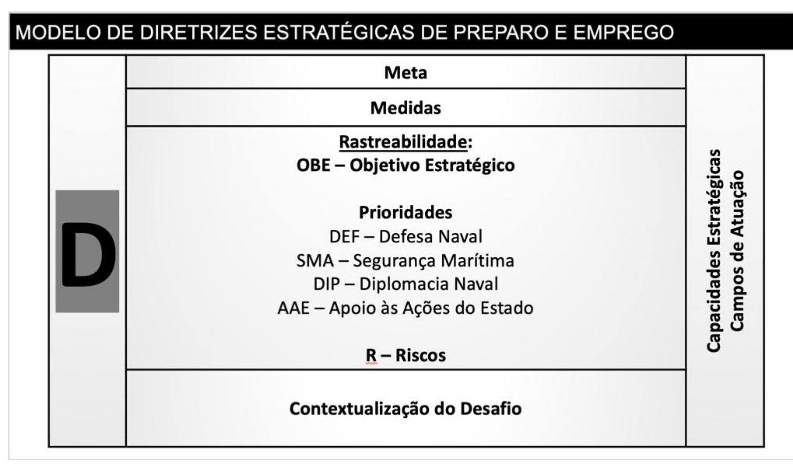
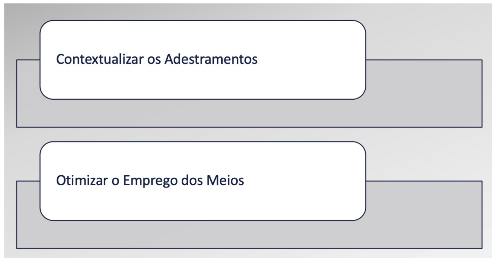

# Cap. 2 - Orientações Estratégicas de Preparo e Emprego

## Página 29

### 2.1. DEFINIÇÕES

Inicialmente, é preciso mostrar o entendimento de Preparo e Emprego para o nível estratégico. O Preparo e o Emprego do Poder Naval são referenciados na Missão da MB e servem para organizar as Diretrizes Estratégicas que realizam a conexão entre o Conceito Estratégico e o Dimensionamento de Força e sua utilização. As Diretrizes Estratégicas de Preparo e Emprego são pautadas pelas instruções deste Capítulo e devem apontar as metas e medidas necessárias para orientar a elaboração e atualização do Plano de Configuração de Força (PCF). As Diretrizes Estratégicas de Preparo e Emprego, com suas metas e medidas, serão detalhadas no PCF e seguirão o modelo abaixo:

Quadro 2: Modelo de Diretrizes de Preparo e Emprego

Prioridades 
DEF — Defesa Naval 
SMA — Segurança Marítima
DIP — Diplomacia Naval
AAE — Apoio às Ações do Estado

## Página 30

As definições de Preparo e Emprego são referenciadas no conceito de capacidade, a qual só é plenamente materializada quando todos os seus atributos (DOPEMAI - Doutrina, Organização, Pessoal, Educação, Material, Adestramento e Infraestrutura) são atendidos.

Sempre que algum atributo de capacidade é degradado a ponto de provocar a perda daquela capacidade, as Diretrizes Estratégicas de Preparo tratarão de orientações estratégicas que visam restabelecer essa capacidade. Uma Diretriz de Preparo também será implementada sempre que identificada a necessidade de concepção, desenvolvimento e produção de uma nova capacidade.

Por outro lado, as Diretrizes Estratégicas de Emprego tratam de orientações estratégicas sobre o uso efetivo de capacidades existentes com seus atributos suficientemente atendidos e integrados.

### 2.2. PREPARO DO PODER NAVAL

Por meio das análises estratégicas, as Diretrizes de Preparo que serão apresentadas no PCF compõem duas linhas de esforço principais, cada uma calcada em uma Capacidade Estratégica. Uma tem por objetivo incrementar o Poder de Combate, de forma contextualizada com as ameaças e outra visa aumentar a Consciência Situacional da MB nas áreas marítimas e fluviais prioritárias identificadas na EDM. Cada linha de esforço é composta pelos eixos temáticos, conforme apresentado a seguir.

## Página 31

Quadro 3: Eixos Temáticos.

## Poder de Combate

- Navios com capacidades antissuperfície, antissubmarino, defesa antiaérea e IVR  
- Submarinos  
- Navios Patrulha  
- Meios e Tropas para Operações Ribeirinhas  
- Meios de Minagem e CMM  
- Conectores do MNT  

## Consciência Situacional

- SisGAAz  
- Meios Navais e Aeronavais de IVR (tripulados ou não tripulados)  
- Capacidade Cibernética  

**2.2.1. Poder de Combate**

A MB deve buscar o incremento do Poder de Combate dando continuidade aos processos de recuperação das capacidades antissuperfície, antissubmarino, de Defesa Antiaérea e IVR dos meios navais, buscando meios com requisitos compatíveis com eventuais ameaças vislumbradas nas análises estratégicas.

Além disso, a extensão das AJB, as Possibilidades de Atuação do Poder Naval e os investimentos já integralizados para a obtenção do Submarino Convencionalmente Armado de Propulsão Nuclear (SCPN) consolidam a escolha deste e dos submarinos convencionais como opção para se contrapor aos desafios identificados, materializando o Poder de Combate necessário para se adotar a Postura Coercitiva. Para tal, o prosseguimento dos Programas PROSUB e PNM são fundamentais para desenvolver o Setor Estratégico Nuclear de Defesa.

Para o fortalecimento do Poder de Combate, deve-se elevar a capacidade de patrulhamento das AJB, sendo necessárias novas aquisições de meios navais para a segurança marítima na Amazônia Azul. Os esforços devem ser orientados à consolidação de uma capacidade de construção naval continuada de projetos competitivos internacionalmente. As quantidades e requisitos dos navios patrulhas devem ser compatíveis com o determinante geográfico, sem prejuízo das tarefas previstas no Campo de Atuação da Segurança Marítima.

## Página 32

É importante ressaltar que os desafios ao Poder Naval nas bacias hidrográficas Amazônica e Platina reforçam a necessidade de preservar as LCF nessas regiões. A MB deverá atuar, de forma integrada, contra os delitos transfronteiriços e ambientais nas LCF e na área ribeirnha de interesse. Para tanto, a MB deve fortalecer, gradualmente, o Poder de Combate na Bacia Amazônica, considerando os desafios, os meios disponíveis na região, o seu atual Poder de Combate, as Possibilidades de Atuação, as Posturas e o ambiente operacional. Também deverá, de forma prioritária e estruturada, desenvolver doutrinas específicas para os ambientes ribeirinhos da Bacia Amazônica e da Bacia Platina.

Ainda no contexto de sobrepujar as ameaças estatais no ambiente marítimo, com a importância dos portos brasileiros para as expressões de Poder Econômico e Militar do Brasil, reputa-se como capacidade essencial para a defesa e proteção dessas infraestruturas críticas a capacidade de minagem e de contramedida de minagem (CMM). Dessa forma, a MB deve desenvolver esforços efetivos para aprimorar essas capacidades, conforme dimensionado.

Outro eixo temático que deve receber atenção no fortalecimento do Poder de Combate do Poder Naval diz respeito às capacidades dos conectores navais do MNT, uma vez que as análises estratégicas apontam desafios que impõem a manifestação do poder de combate da MB sobre uma área terrestre de interesse do Poder Naval.

Vale ressaltar que as iniciativas que visam incrementar o Poder de Combate da Força Naval relacionam-se diretamente à disponibilidade do armamento e munição. É sob essa condição que se erige um Poder Naval crível e adequado ao cumprimento de suas atribuições constitucionais.

**2.2.2. Consciência Situacional**

Em relação a essa Linha de Esforço, a MB deve primeiramente ampliar a Consciência Situacional Marítima nas áreas referentes ao Projeto Piloto do Sistema de Gerenciamento da Amazônia Azul (SisGAAz), buscando o gradualismo que permita a expansão da Consciência Situacional, sequencialmente, para a Elevação do Rio Grande, para as Ilhas Oceânicas, para a Foz do Rio Amazonas, para a Bacia de Santos, para a Margem Equatorial brasileira e para o Arquipélago de São Pedro e São Paulo.

## Página 33

Os sensores que compõem o SisGAAz devem ser empregados de forma integrada com os meios navais, aeronavais e de fuzileiros navais (tripulados e não tripulados). Por isso, o Preparo das capacidades atreladas a esses meios deve sempre levar em consideração seus requisitos de IVR.

No Preparo, deve-se considerar a necessidade de um nível de Comando e Controle compatível com a arquitetura IVR desejada. As informações dos meios IVR não podem materializar ganho sem um fluxo de informações que cubra todo o processo de decisão, desde a observação até a ação. É imperativo que haja integração e segurança das comunicações (voz e dados) intra-MB e com o MD/outras Forças Singulares. Isso exigirá da MB criar condições para a obtenção de comunicações criptografadas e enlace de dados para os meios operativos e, ao mesmo tempo, aprimorar e consolidar a Doutrina de Comando e Controle no contínuo normalidade, crise e conflito.

Para contrapor-se às ameaças cibernéticas, a MB deverá buscar a seguintes capacidades cibernéticas: identificação de ameaças e de vulnerabilidades dos sistemas digitais de combate próprios, realização de defesa ativa e identificação de alvos de interesse e desenvolvimento de sistemática específica para atualização e multiplicação dos conhecimentos técnicos na área de TI, segurança da informação e cibernética. Deve-se considerar os avanços tecnológicos de diversos atores cibernéticos militares e não militares, assim como o risco aos meios e sistemas de novas classes de navios na MB, com elevado grau de conectividade. A MB deve buscar vantagem por meio do conhecimento de possíveis vulnerabilidades técnicas de seus equipamentos de combate (sistemas de armas, comunicações, controle de propulsão etc.).

Além dos eixos temáticos principais abordados, o PCF deverá abordar, no contexto do Preparo, as necessidades de desenvolvimento de doutrinas e conceitos relacionados à Defesa Aeroespacial da Força Naval, ao Controle da Foz do Rio Amazonas, à Proteção das ICPM e à Defesa das Ilhas Oceânicas.

## Página 34

Por fim, ainda sobre o Preparo da Força, o PCF deve estabelecer diretrizes que abordem as necessidades logísticas e de infraestruturas que apoiam as Linhas de Esforço em geral.

### 2.3. EMPREGO DO PODER NAVAL

O emprego do Poder Naval deve ser pautado pelas Linhas de Esforço apresentadas no Quadro 6 que levam em consideração os princípios do treinamento contextualizado, da otimização no uso dos recursos e do alinhamento com as demandas apontadas nas análises estratégicas.

Quadro 4: Linhas de Esforço (Contextualizar os Adestramentos e Otimizar o Emprego dos Meios).

x2.3.1. Contextualizar os Adestramentos

Visando a manutenção de um Poder Naval aprestado para enfrentar os desafios vislumbrados nos Cenários e na Conjuntura, e considerando os adestramentos como parte componente do aprestamento dos meios para o emprego, os Planos e Programas de Adestramento (PGACON e PGADGN) devem ser conduzidos seguindo as prioridades estabelecidas e de forma alinhada com Possibilidades de Atuação que foram identificadas nas análises estratégicas. Além disso, deve-se buscar a inserção dos Cenários observados nas  PA nos Planos de Trabalho Anual (PTA) da Chefia de Operações Conjuntas do Ministério da 
Defesa.

## Página 35

Em relação às Ilhas Oceânicas, é preciso seguir a orientação da END enquanto a Arquitetura de Defesa[11] das mesmas não é materializada do ponto de vista do dimensionamento de capacidades. Assim, a inserção da Defesa ou Retomada de Ilhas Oceânicas nas Operações Correntes e Programas de Adestramento da Defesa pode servir como recurso para atingir o objetivo de aprestar a Força Naval para a Defesa ou Retomada de Ilhas Oceânicas com os meios disponíveis.

No que diz respeito ao emprego dos Meios na proteção de ICPM, é necessário mencionar que, em relação ao terminal de São Sebastião e a Bacia de Santos, pode-se aprimorar e consolidar a Doutrina Interagências para Proteção de Plataformas de Petróleo e Instalações Portuárias com os meios da MB já existentes.

**2.3.2. Otimizar o Emprego dos Meios**

Dadas as dimensões da área de responsabilidade da MB frente aos recursos atuais de IVR, uma forma de atuar sobre o problema, usando os meios atuais, é buscar a sinergia com o EB nas bacias hidrográficas Amazônica e Platina, com a FAB na Amazônia Azul e com o CENSIPAM em suas áreas de cobertura. Logo, a MB deve ampliar a cooperação com o EB com foco na consciência situacional nas áreas ribeirinhas de interesse nas Bacias Amazônica e Platina, priorizando as áreas que demandam as LCF identificadas nas análises, ampliar a cooperação com a FAB com foco nos meios aéreos e espaciais de IVR na Amazônia Azul e ampliar a cooperação com o CENSIPAM.

Sobre os Distritos Navais, há necessidade de preservar a capacidade de proteção marítima da Amazônia Azul e a livre navegação das LCF. Sendo assim, com o intuito de garantir que a substituição dos meios ocorra de forma adequada e oportuna, deve-se avaliar a postergação de baixa dos Meios Navais Distritais.

[11] Uma Arquitetura de Defesa é composta por uma Concepção Operacional específica para o contexto apresentado, na qual serão apontados, obrigatoriamente, as capacidades requeridas e o dimensionamento de Força para sua consecução.

## Página 36

Para otimizar o emprego dos Meios Navais e Distritais, o ComOpNav deve providenciar de um Plano de Inteligência Operacional, baseado em informações das Estações Radiogoniométricas de Alta Frequência (ERGAF), dos meios de IVR da MB e de outras Forças e Órgãos (inclusive satelitais), informações interagências, Órgãos e organizações internacionais e demais membros da Comunidade Marítima, conjugando o emprego com tal Plano de Inteligência Operacional. As áreas marítimas que compreendem a ERG, a Foz do Rio Amazonas, a Bacia de Santos, as Ilhas Oceânicas e a Margem Equatorial são áreas marítimas prioritárias.

Quando se trata de capacidade de Defesa Nuclear, Biológica, Química e Radiológica (NBQR), a MB deve consolidar doutrinariamente a organização de seu Sistema de Defesa NBOR.

Em relação às demandas de caráter preventivo e repressivo para o reestabelecimento da ordem pública, em operações de Garantia da Lei e da Ordem (GLO), conforme estipulado na Lei Complementar nº 97/99 e em ações de apoio à Defesa Civil, a MB deve aprimorar e consolidar a Doutrina para atender às eventuais demandas de Apoio às Ações do Estado nas áreas de segurança pública e defesa civil. Não será realizado dimensionamento específico da Força para esses fins, devendo a MB, sempre que demandada pelos instrumentos legais, atender com as capacidades que já possui.

O valor estratégico da presença do Brasil na Antártica e a necessidade de mapear as riquezas do solo marinho na Amazônia Azul, visando ao fortalecimento da expressão econômica nacional, apontam para o envolvimento da MB em contribuição à área de pesquisa no contexto do Poder Marítimo Nacional. Assim, alinhada à Política Nacional para Assuntos Antárticos (POLANTAR) e contribuindo para o desenvolvimento científico marítimo, a MB deve dar continuidade ao Planejamento Espacial Marinho na Amazônia Azul e atender às demandas de apoio às Atividades de Pesquisa Científica no ambiente marítimo sem novo dimensionamento de Força. Nas Relações Internacionais, a análise das Possibilidades de Atuação do Poder Naval,

em consonância com a Conjuntura e os Cenários nos quais a MB está inserida, indicou a necessidade de fomentar as relações com diversos países. Além disso, a existência de iniciativas de atores extrarregionais no Atlântico Sul recomenda o incremento da inserção brasileira nas questões marítimas afetas ao Entorno Estratégico Marítimo, mais especificamente no Golfo da Guiné, em apoio ao fortalecimento da ZOPACAS. Por isso, devese alinhar os objetivos e planejamentos das relações internacionais com os interesses brasileiros e da MB, em relações aos países e fóruns identificados, em consonância com a Política Externa brasileira.
