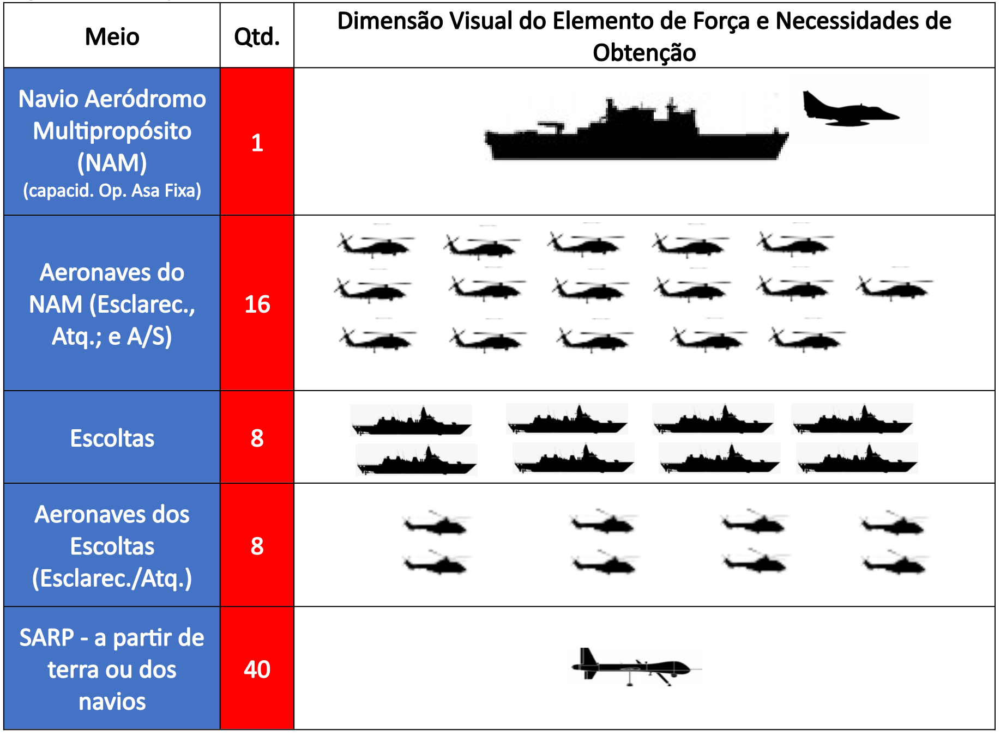
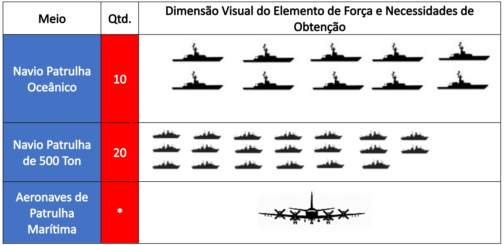
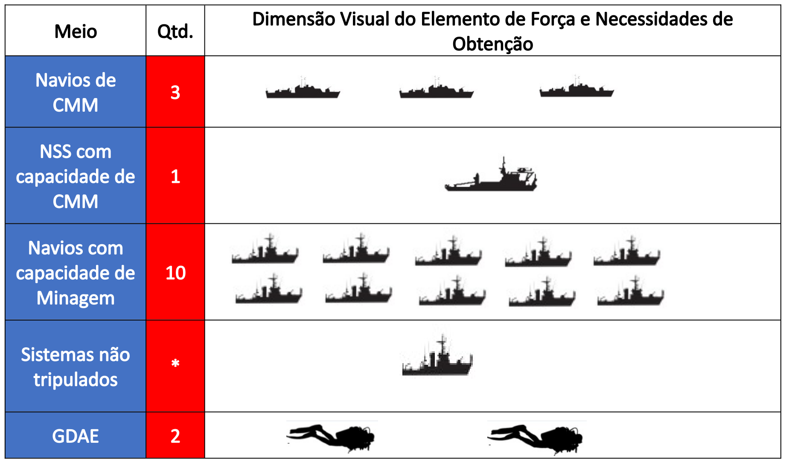
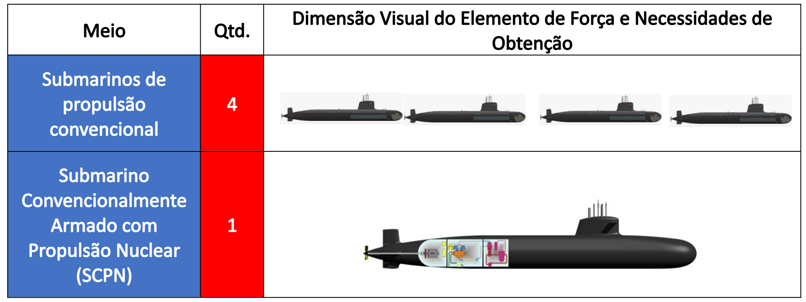
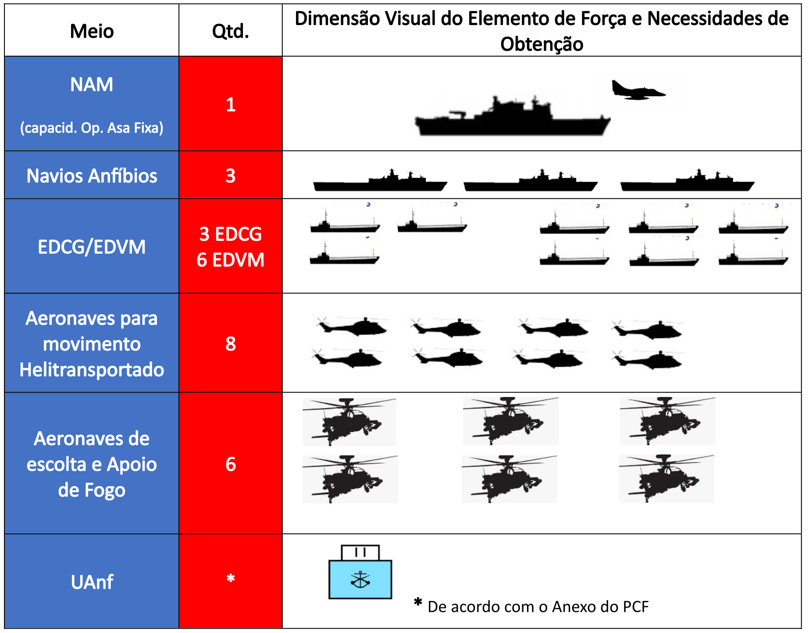
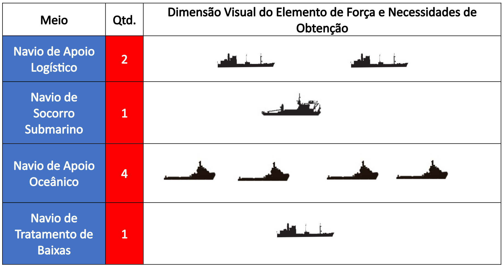
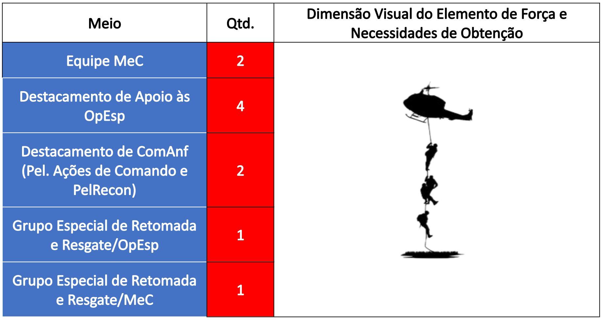
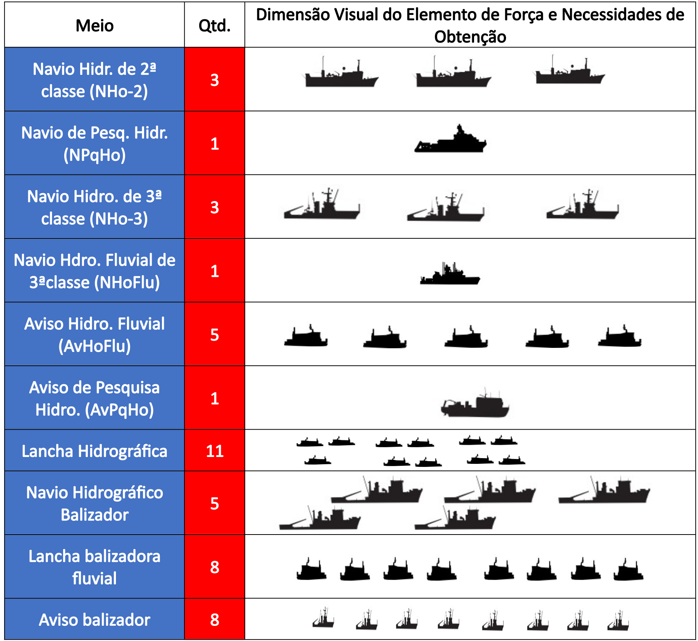
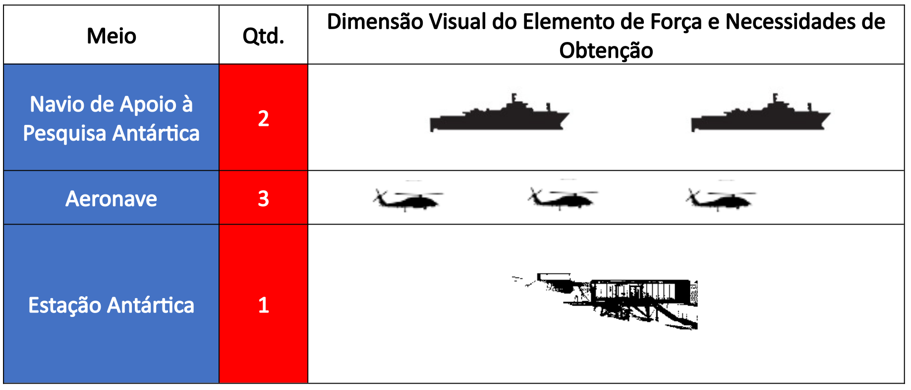

# Cap. 3 - Dimensionamento da Força

## Página 37

### 3.1. ASPECTOS DO DIMENSIONAMENTO

Durante o processo de dimensionamento, orientado pela Sistemática de Planejamento de Alto Nível da Marinha (SPAN) e derivado do Conceito Estratégico e das Diretrizes Estratégicas de Preparo e Emprego, foram identificados os quantitativos dos sistemas e meios componentes de cada Elemento de Força[12]. Os requisitos e estimativa de custos são delineados pelo Setor de Material da MB para elaboração de propostas de solução de força. É importante ressaltar que o Dimensionamento proposto levou em consideração Oo Diagnóstico do Poder Naval. 

[12] Conjunto de meios (navios, aeronaves, carros de combate, etc.) e sistemas, doutrinariamente organizados que, por meio da realização de tarefas, atingem um efeito em determinado tempo e espaço.

**O Dimensionamento está estruturado da seguinte forma:**

a) Elementos de Força dimensionados:
I) Força de Intervenção Marítima;
II) Força de Proteção Marítima;
III) Força de Guerra de Minas;
IV) Força C5IVR;
V) Força de Desgaste;
VI) Força de Projeção;
VII) Força de Logística de Combate;
VIII) Força de Operações Especiais;
IX) Força de Serviços Hidroceanográficos; e
X) Força de Apoio à Pesquisa Antártica.
b) Elementos de Força ainda não foram dimensionados:
I) Força Ribeirinha;
II) Força de Proteção Marítima (Grupamentos de FN);
III) Força de Busca e Salvamento (SAR);
IV) Força de Segurança do Tráfego Aquaviário (STA);
V) Força de Ensino Profissional Marítimo (EPM);
VI) Força Diplomacia Naval; e
VII) Força de Assistência Hospitalar.

## Página 39

### 3.2. DIMENSIONAMENTO

### 3.2.1. FORÇA DE INTERVENÇÃO MARÍTIMA

A Força de Intervenção Marítima foi dimensionada de forma a ser capaz de atingir pelo menos um dos seguintes efeitos:

a) Proteção das Linhas de Comunicações Marítimas (LCM); 

b) Proteção das Infraestruturas Críticas do Poder Marítimo (ICPM);

c) Defesa de Ilhas Oceânicas; e

d) Controle de Área Marítima de Interesse (em especial a Foz do Rio Amazonas e a região da Elevação do Rio Grande).

## Página 40

### 3.2.2. FORÇA DE PROTEÇÃO MARÍTIMA

A Força de Proteção Marítima foi dimensionada, primordialmente, de forma a ser capaz de proteger as Infraestruturas Críticas do Poder Marítimo (ICPM) em caso de crise, reprimir a explotação não autorizada de recursos na Amazônia Azul, em situação de normalidade ou crise, e impor o ordenamento jurídico pátrio nas AJB e Plataforma Continental estendida.

A proposta de dimensionamento visa atingir pelo menos um dos seguintes efeitos:

a) Proteção das Linhas de Comunicações Marítimas (LCM) (em caso de crise);

b) Proteção das Infraestruturas Críticas do Poder Marítimo (ICPM) (em caso de crise);

c) Repressão à exploração/explotação não autorizada de recursos na Amazônia Azul; e

d) Repressão a ilícitos transfronteiriços e ambientais.

* As aeronaves de Patrulha Marítima não foram dimensionadas, pois ainda há indefinições na MB e na FAB quanto ao emprego da Asa Fixa em proveito da Força Naval.

## Página 41

### 3.2.3. FORÇA DE GUERRA DE MINAS

As Capacidades de Guerra de Minas dimensionadas foram: Minagem defensiva; e Contramedidas de Minagem sem oposição. O seguinte dimensionamento é proposto para que os seguintes efeitos desse Elemento de Força sejam alcançados:

a) Negação do uso de Área Marítima de Interesse; e

b) Proteção de Linhas de Comunicação Marítima.

* Sistemas não tripulados: tecnologia em fase de desenvolvimento na MB.

## Página 42

3.2.4. FORÇA C5IVR

Esse Elemento de Força mostrou-se relevante no atingimento dos seguintes efeitos: Monitoramento e Vigilância da Amazônia Azul, Monitoramento e Controle do Tráfego de Embarcações; Salvaguarda da Vida Humana no Mar; Produção de Informações de Segurança da Navegação; Fiscalização do Tráfego Aquaviário; Prevenção da Poluição Hídrica por Embarcações; e Produção de Conhecimentos de Interesse para a Defesa dos Direitos de Soberania na AJB. Dessa forma, alguns sistemas foram identificados como mais importantes para compor esse Elemento de Força:

* SisGAAz: vigilância e monitoramento ativo nas seguintes áreas: ERG, Ilhas Oceânicas, Bacia Petrolífera de Santos, Foz do Rio Amazonas e área marítima da Margem Equatorial.

* PLADEPO: ambiente operacionais de maior relevância, identificados nas Possibilidades de Atuação. 

* SARP: dimensionamento de acordo com o PCF.

* SISCOM: reestruturação de acordo com a alínea e, do inciso 2.2.1 do PCF.

## Página 43

### 3.2.5. FORÇA DE DESGASTE

A Força de Desgaste foi dimensionada de forma a ser capaz de atingir pelo menos um dos seguintes efeitos: Interromper as linhas de Comunicação Marítimas em um porto no entorno estratégico; e Negar o uso das seguintes áreas marítimas de interesse: ERG; Proximidades de Ilhas Oceânicas, Foz do Rio Amazonas, Bacias Petrolíferas de Santos e Campos. Para isso, O seguinte dimensionamento é proposto:

## Página 44

### 3.2.6. FORÇA DE PROJEÇÃO

A Força de Projeção foi dimensionada de forma a ser capaz de alcançar os seguintes efeitos: 

a) Defender/Retomar Ilhas Oceânicas nacionais;

b) Neutralização de Alvos de Interesse Militar (em Terra);

c) Controle de Área Terrestre de Interesse Naval; e

d) Proteção de Bens, Recursos e Nacionais no exterior.

## Página 45

### 3.2.7. FORÇA LOGÍSTICA DE COMBATE

A Força Logística de Combate foi dimensionada de forma a ser capaz de alcançar o seguinte efeito: Apoiar a Força de Intervenção, Força de Projeção e Força de Desgaste nos propósitos para os quais foram dimensionados. Para tal, o seguinte dimensionamento é proposto:

## Página 46

### 3.2.8. FORÇA DE OPERAÇÕES ESPECIAIS

Dimensionada para contribuir com a consecução de praticamente todos os efeitos de acordo com o Capítulo 2 do PCF.

## Página 47

### 3.2.9. FORÇA DE SERVIÇOS HIDROCEANOGRÁFICOS

A Força de Serviços Hidroceanográficos destina-se a cumprir os compromissos internacionais assumidos pelo Estado brasileiro relacionados à vertente safety da Segurança Marítima e para o levantamento de informações necessárias ao conhecimento adequado do meio ambiente operacional da Força Naval. Dessa forma, o dimensionamento, proposto pelo setor, visa atingir os seguintes efeitos:

a) Produzir Informações de Segurança da Navegação ; e

b) Salvaguardar Auxílios à Navegação.

## Página 48

### 3.2.10. FORÇA DE APOIO À PESQUISA ANTÁRTICA

A Força de Apoio à Pesquisa Antártica foi dimensionada de forma a ser capaz de alcançar o seguinte efeito: Apoiar à pesquisa antártica do Brasil, contribuindo para a relevância do país nos comitês e organizações científicas ligadas ao tema. Para tal, o seguinte dimensionamento é proposto:

