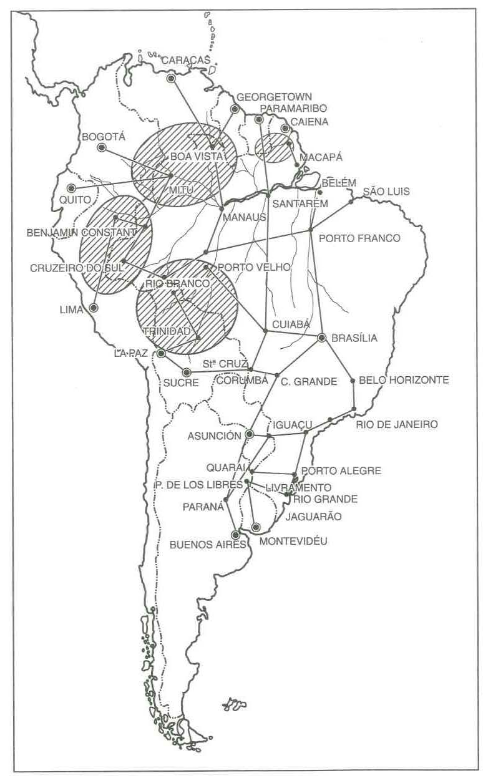

# Anexo 1 - O Pensamento Geopolítico do General Meira Mattos

## Página 108

O interesse pela Geopolítica nos Estados Unidos arrefeceu após a Segunda Guerra Mundial, em conseqüência da geopolitik dos estrategis­tas hitlerianos e só recentemente voltou a despertar. Entretanto, o as­sunto conservou sua influência e vitalidade no Cone Sul da América do Sul - particularmente na Argentina, no Chile e no Brasil -, onde a predo­minância de governos militares, a distância em relação aos Estados Unidos e os problemas nacionais particulares encorajam soluções geopo­líticas tradicionais. Entre esses países lati no-americanos, a geopolítica do Brasil é a mais desenvolvida e difundida.

A tendência brasileira de associar a geografia à política tem origem em uma série secular de geopolíticos ilustres 3, incluindo o Barão do Rio Branco, Maria Travassos, Everardo Backheuser, Golbery do Couto e Silva e Carlos de Meira Mattos, este último representando o mais recente e principal colaborador deste modelo coerente e integrado de pensamento político. Em virtude do conceito que desfruta junto aos altos escalões do Governo brasileiro, Meira Mattos é hoje considerado por muitos, tanto na América Latina como nos Estados Unidos, como a mais destacada autoridade em geopolítica na América do Sul.

As obras de Carlos de Meira Mattos parecem ter sido fortemente influenciadas por dois fatores principais: de um lado, a posição geográfica do BrasiI e as reações dos citados teóricos desta posição; de outro, sua participação no grupo da Sorbonne do Exército Brasileiro.

## Página 109 

Em termos de posição geográfica, o Brasil é a potência dominan­te no Atlântico Sul e do continente sul-americano. Sua fronteira marítima, cujo saliente aponta na direção da África, se estende por 7.400 qui­lômetros, desde acima da foz do Amazonas até o limite sul com o Uruguai. Internamente, a fronteira de 15.500 quilômetros liga o Brasil a todos os países da América do Sul, exceto o Chile e o Equador, e inclui vasta área, largamente subdesenvolvida, de suas regiões ocidental e setentrional. Em 1977, o Brasil era o quinto maior país do mundo em superfície, o sexto em população e o décimo em produção econômica. Estes impressionantes dados estatísticos indicam realmente uma gran­de potência mundial - tema que tem sido vigorosamente defendido por brasileiros através de quase todo século XX e realçado por Meira Mattos em seus trabalhos geopolíticos.

A despeito, porém, desses dados, o Brasil enfrenta vários empeci­lhos. Faltam ao País consistência social e desenvolvimento geográfico, estando sua riqueza concentrada na classe empresarial e nas dos novos tecnocratas, nos grandes centros populacionais de São Paulo e do Rio de Janeiro. O Nordeste continua mergulhado na pobreza e alienado; a Ama­zônia ocidental, despovoada e inexplorada. Conseqüentemente, ao longo da história nacional, a orla marítima permanece dependente das comuni­cações oceânicas; a selva amazônica continua subdesenvolvida e isolada da costa, oferecendo oportunidade para invasões estrangeiras ou insur­reições internas.

Um dos principais temas dos geopolíticos brasileiros tem sido pres­crever certas políticas visando a reduzir tais empecilhos.

Por exemplo: a melhor solução para as fronteiras não ocupadas e desprotegidas pode ser encontrada. segundo alegam esses teóricos, na "marcha para o Oeste", a fim de povoar e desenvolver o interior abando­nado, bem como controlar o "triângulo mágico", formado pelas cidades bolivianas de Santa Cruz. Sucre e Cochabamba, que os referidos teóricos consideram como a região-chave, o coração da América do Sul. Todavia, com o povoamento das fronteiras e controle do triângulo boliviano, deve ser encarado um antagonismo natural contra o Brasil de parte da Argen­tina, do Peru e da Venezuela - situação que representa significativa ameaça externa à nação.

## Página 110

Além de atentar para a segurança contra a fragmentação interna e para o cerco hispano-americano, aqueles geopolíticos argumentam que a manutenção do comércio marítimo brasileiro e das comunicações com o mundo exterior representa fator vital para a sobrevivência do País. Objeto de particular cuidado é a proteção de três "pontos de estrangulamento" nas rotas estratégicas oceânicas: o Corredor do Atlântico médio (a passa­gem Natal-Dacar para o Norte da África), o cabo sul-africano da Boa Espe­rança, que permite o acesso brasileiro ao petróleo do Golfo Pérsico, e os estreitos de Magalhães - Terra do Fogo, a rota mais segura para o Pacífi­co. Nestes dois últimos casos, a Antártica tomou uma importância cres­cente para o Brasil, porque o País se situa adjacente àquelas zonas de estrangulamento, e as necessidades de segurança do Atlântico Sul exi­gem uma presença naval mais poderosa na área.

Todos os geopolíticos brasileiros encaram os Estados Unidos como um importante aliado estratégico, uma vez que os dois países participam de interesses geopolíticos comuns na preservação dos estados america­nos contra ameaças extracontinentais à sua segurança e ideologia. Do mesmo modo, ambos são considerados como nações atlânticas, cada uma com necessidades estratégicas similares para manter equil íbrios de po der favoráveis na África Ocidental e na Europa Ocidental, respectivamen­te. Embora o Brasil não tenha acesso imediato ao Pacífico, seus estrate­gistas consideram a extensão continental e a projeção marítima do País como reflexos de posições mantidas por seu aliado no Norte.

## Página 111

Além destas considerações geopolíticas tradicionais, outra signifi­cativa influência no pensamento de Meira Mattos é conseqüente de seus laços profissionais com o grupo da Sorbonne dentro do Exército Brasilei­ro. Esta facção moderada - uma mi noria de respeitados intelectuais, úni­ca nos meios militares latino-americanos - é distinguida pelas seguintes características: experiência com Força Expedicionária Brasileira (FEB) durante a Segunda Guerra Mundial, que combateu com distinção na Itália e foi atraída pela democracia e pelo sistema de livre empresa dos Estados Unidos, além de repulsa ao fascismo de Mussolini; participação como membro do corpo permanente ou conferencista da Escola Superior de Guerra (ESG)m a "escola que modificou o Brasil", em virtude de seu papel como uma escola militar de estado-maior e um centro de estudos e problemas nacionais; e cursos de aperfeiçoamento nos Estados Unidos ou na França. Além disso, os "intelectuais" da Sorbonne foram os primeiros alunos de suas turmas nas escolas militares, detêm posições no ramo tecnicamente avançado da Artilharia do Exército e servem com destaque nos estados-maiores.

Embora atípicos dentro das Forças Armadas do Brasil, os oficiais da Sorbonne constituíram o núcleo do primeiro governo militar, após a Revolução de 1964, sob a chefia do General Humberto Castello Branco, porque somente esse grupo possuía orientação coerente para dirigir o País e uma liderança respeitada capaz de im plementar planos já elabora­dos pela ESG para o desenvolvimento nacional. Incapazes de consolidar essa posição, os moderados entregaram o poder à facção da "linha dura" em 1969, mas conservaram sua influência em todos os governos subse­qüentes, particularmente no do Presidente Figueiredo.

## Página 112

Esses oficiais do grupo da Sorbonne "internacionalistas liberais" formularam as seguintes premissas políticas básicas:

- a democracia é um estilo de política mais "civilizado" do que o autoritarismo;

- o capitalismo e o setor privado podem criar uma nação fisica­mente poderosa, mais eficazmente que qualquer outro sistema econômico, incluindo forte confiança do setor público;

- deve ser evitado o nacional ismo emocional e exagerado; é preferível o racional planejamento governamental elaborado por autoridades centrais, visando a reforçar as soluções para o desenvolvimento com ênfase nos setores comerciais e indus­triais privados;

- os militares demonstraram competência em dirigir as estraté­gias do desenvolvimento nacional;

- a segurança nacional depende do desenvolvimento e do poder nacionaism ligando o grupo da Sorbonne à análise geopolítica dos pensadores tradicionais citados acima.

## Página 113

Nascido em São Paulo em 1913, Meira Mattos concluiu o curso da Academia Militar das Agulhas Negras em 1936 e, como jovem oficial, serviu em diversas guarnições do Exército, antes de ser enviado para a Itália, integrando a Força Expedicionária Brasileira - um fato que o colo­cou solidamente na facção da Sorbonne. Entre suas principais comissões, destacam-se: adido militar na Bolívia, interventor federal no Estado de Goiás (1964), comandante do contingente brasi leiro da Força Interamericana de Paz enviada para São Domingos (1964), chefe da Divisão de Assuntos Políticos da ESG, comandante da Polícia Militar de Brasília (1966), Vice-Chefe do Estado-Maior das Forças Armadas, Vice-Diretor do
Colégio Interamericano de Defesa em Washington. D.C., Comandante da Academia Militar (1969) - cujo currículo Meira Mattos reviu à luz da dou­trina da ESG, para ajustá-lo às linhas da filosofia do grupo da Sorbonn e Inspetor-Geral da Polícia Militar (1970), Meira Mattos foi promovido a General-de-Brigada em 1968 e a General-de-Divisão em 1973. Ronald Schneider cita o General como amigo íntimo e "assessor militar-chave" do Presidente Castello Branco e como "um oficial que recebeu pelo menos uma delicada missão (política) durante cada um dos quatro anos" do man­dato do Presidente.

Considerado um "instrutor de tática altamente respeitado" e um "escritor prolífico", Meira Mattos foi mencionado por Fontaine como res­ponsável por ligar tradições geopolíticas ao grupo da Sorbonne: "O Gene­ral Meira Mattos prosseguiu do ponto de onde os geopolíticos teóricos geralmente se detêm. Meira Mattos estabeleceu os fundamentos da posição dos oficiais moderados em uma série de livros e artigos publica­dos sob os auspícios do Exército." Entre seus trabalhos. os de maior infl uência geopolítica são: Projeção Mundial do Brasil (1960), Doutrina Política da Revolução de 31 de março de 1964 (1967), Brasil, Geopolítica e Destino (1975 e 1979) , A Geopolítica e as Projeções do Poder (1979) e Uma Geopolítica Pan-Amazônica (1980). Seus n umerosos artigos foram publicados principalmente em A Defesa Nacional, Estratégia (Argentina).

Os trabalhos de Meira Mattos são representativos da escola "rea­lista" da política i nternacional e é dentro desse modelo que ele enquadra suas diretrizes geopolíticas para o Brasil. De acordo com os ditames do realismo político, o conflito mundial caracteriza transações internacionais. Pelo fato de não existir harmonia de interesses entre os esta­dos nem probabilidade de ser alcançada. não é possível haver um mun­do pacífico, exceto onde as di sputas e os confl itos possam ser, pelo menos em grande escala, reprimidos sem violência e transferidos para o domínio da política do poder. Pois que é no poder que as nações encon­tram segurança neste ambiente de ameaças internacionais.

## Página 114

A mais recente dessas ameaças, assinalada por Meira Mattos, é o expansionismo soviético, um perigo aparentemente originário tanto da ideologia comunista como do imperialismo russo. embora o autor não concentre sua análise, pelo menos detalhadamente, no bloco soviético.Outras ameaças mais imediatas, não intimamente ligadas à da Rússia, incluem as expostas fronteiras do Brasil. sua instabilidade política e suas debilidades socioeconômicas. Na solução destes problemas.
o bem-estar do Brasil depende essencialmente do desenvolvimento nacional - um tema que o autor acentua clara e repetidamente. Somente através do desenvolvimento e do poder que esse desenvolvimento propicia poderão ser preservados a segurança e o progresso da Nação. Nesse sentido, conseqüentemente, desenvolvimento e poder são meios visando à obtenção da segurança nacional.

Em sua análise de realismo e poder. Meira Mattos é particularmente influenciado por Hans Morganthau, cujos famosos seis princípios de realismo são cuidadosamente examinados em *A Geopolítica e as Projeções do Poder* (p. 60-63) em adição aos elementos nacionais do poder e doutrinas de equilíbrio de poder- esferas de influência Apesar disso, Meira Mattos apenas cita Morganthau e, em menor grau, Nicholas Spykman e outros realistas, ao formular um quadro geral da política A partir daí, Meira Mattos mostra-se à vontade para apresentar as fórmulas geopolíticas que ele prescreve para o Brasil.

Por exemplo, o General classifica o Brasil como "o bastião do mundo livre" e uma "cidadela da democracia", porque o saliente nordestino do País continuará a ser utilizado pelas forças americanas em operações militares contra a África do Norte, quando surgirem ameaças da massa terrestre Europa-África-Ásia. Em outro exemplo. Meira Mattos invoca assistência militar dos Estados Unidos para a segurança do Atlântico Sul, sugerindo que o bloqueio soviético das linhas de suprimento de petróleo paralisaria a OTAN - o principal instrumento contra a União Soviética". Outras passagens refletem sua preferência pela democracia ocidental, em contraste com o marxismo. 

## Página 115

O poder é definido pelo Generalcomo "a capacidadede alguém impor sua vontade sobre outrem". tanto psicológica como fisicamente, e este conceito é ampliado para incluir uma cuidadosa contribuição das possibilidades do poder brasileiro em relação ao de outros grandes estados. A avaliação do poder nacional relativo é feita por Meira Mattos utilizando a seguinte fórmula:

Pp = ( C+ E + M) x (S + W+ P)

Onde:

Pp = poder perceptível dos estados.

e = massa crítica - população e território.

E = capacidade econômica.

M = capacidade militar.

S = conceito estratégico adotado por um estado.

W = vontade nacional.

P = capacidade para persuadir ou convencer.

Preenchidos os dados, o Brasil aparece em 6º lugar como potência mundial, atrás da União Soviética, Estados Unidos, Alemanha Ocidental, França e China. Considerado o conjunto conceito estratégico vontade nacional-capacidade persuasiva, o Brasil se coloca em segundo lugar, passando para o oitavo se computado apenas o primeiro grupo de indicadores, principalmente em virtude de sua relativamente baixa força econômica. Meira Mattos sustenta que sua nação é “uma potência emergente” que, como a China, apresenta as melhores chances de atingir o *status* de grande potência, perdendo apenas para as duas superpotências.

O conflito entre moralidade e o uso do poder — uma crítica dirigida contra os realistas — é consistentemente tratado por Meira Mattos, que prefere o poder à moralidade. Embora “poder e moralidade sejam inseparáveis e, conseqüentemente, devam ser considerados pelos estadistas… todavia, dos dois, o poder é preferível”. Entretanto, ele ressalva que “os fins não justificam os meios” e que “a interdependência entre os princípios da ética e o exercício do poder obriga o estadista a empenhar-se em um processo de contínua avaliação. Os realistas definem separadamente moralidade de indivíduos e de estados, alegando que é perigoso juntar os dois níveis de análise sob um mesmo sistema de ética. Mais propriamente, segundo Meira Mattos, a moralidade do estado é "acima de tudo, defender os interesses da nação".

## Página 116

À luz dessas ideias, Meira Mattos apoia firmemente os processos democráticos, argumentando que:

*Nas sociedades livres, abertas, predominam os instrumentos de persuasão, baseados na convicção, na participação espontânea, no sentimento de obrigação social e de cidadania; nas sociedades totalitárias, fechadas, ocorrem geralmente os instrumentos de coerção e de revitalização dos mitos carismáticos.*¹⁷

Em outro trecho, ele associa a democracia ao desenvolvimento e postula um objetivo final para uma “sociedade democrática brasileira desenvolvida, estável e feliz”.

Todavia, associadas a esses sentimentos democráticos, estão suas restrições de que liberdade e desenvolvimento devem ser acompanhadas de autoridade. O General escreve, por exemplo: “É necessário utilizar moderada autoridade para estimular a modernização da sociedade brasileira”.¹⁹ Afirma também: “De um ponto de vista militar, uma vez que enfrentamos inevitável competição internacional, devemos medir a força de contenção necessária para garantir a tranquilidade de nosso desenvolvimento”.

Em um assunto relacionado com este, Meira Mattos acentua a importância de elites criativas e enérgicas, das quais as futuras civilizações irão depender.

## Página 117

“Desenvolvimento”, afirma Meira Mattos, “é a componente axial da revolução (de 1964)” e resulta da modernização de setores nacionais, tais como tecnologia, benefícios sociais, participação dos cidadãos, produção industrial, eficiência do governo e integração do território nacional. Com a confiança que se nota em seus artigos, o General reafirma que o Brasil possui os recursos, a vontade do povo e a liderança necessária para “situar-se entre as mais prósperas e poderosas nações do universo” — a histórica “convocação nacional para a grandeza”.

Todavia, o onipresente tema do poder predomina nos trabalhos de Meira Mattos e acentua a importância do desenvolvimento para a consecução dos objetivos nacionais do Brasil, uma vez que desenvolvimento leva ao poder e sem poder “uma sociedade se torna um corpo inerte, sem vontade, incapaz de satisfazer sua própria razão de ser ou que é sua contínua evolução”. E quanto maiores as aspirações e necessidades do Brasil, maior a falta de poder para atendê-las.

Em suma, partindo deste quadro de realismo político, Meira Mattos descreve os problemas de segurança do Brasil contemporâneo e prescreve como remédio uma forte dose de poder — uma consequência do desenvolvimento. Para operar esses parâmetros mais amplos, particularmente na formulação de normas e diretrizes governamentais específicas, o General recomenda que as soluções dos problemas sejam apoiadas em “realidades geográficas”, as que inspiram os grandes estadistas “desde tempos imemoriais”. Segundo a perspectiva brasileira, geografia é destino.

Para Meira Mattos, a Geopolítica é “uma indicação de soluções políticas condicionadas pelas realidades e necessidades geográficas”. É a aplicação da política no espaço geográfico. Em outro trecho ele escreve: “O território condiciona a vida de um Estado e limita suas aspirações”.

## Página 118

A geografia condiciona, torna difícil, inspira, estimula e finalmente apresenta um desafio. Ela força um grupo humano a reagir às condições geográficas: o grupo reage e triunfa, ou não reage e é destruído. Meira Mattos pode ser classificado como um geopolítico estrategista a esse respeito. Segundo Ladis Kristof, os estrategistas clamam por diretrizes e estratégias específicas que eles consideram em face dos fatores geográficos e certos aperfeiçoamentos na política internacional e na tecnologia militar Eles levam em consideração fatores tais como espaço, potencialidades do poder nacional, distribuição de matérias-primas e população, rotas estratégicas e outros. 

De grande importância, como o desenvolvimento nacional, a Geopolítica, se corretamente aplicada, é uma fonte de poder.

Embora exista um “eterno conflito” entre o homem e seu ambiente, Meira Mattos sustenta que “é a vontade do homem que prevalece e triunfa sobre os fatores adversos da geografia”.²⁷ Fortemente influenciado pela tese de Toynbee de desafios e reações, ele afirma que a grandeza nacional é revelada quando o povo mobiliza o poder e a vontade para responder com êxito aos desafios de seu ambiente. Regiões geograficamente desfavoráveis, como existentes no Brasil, desafiam o caráter da nação. Por outro lado, a superação de antigas polarizações, esterilidade e derrotismos criados pelas condições ambientais — o que Meira Mattos julga que pode ser levado a cabo — restaurará a esperança, os ideais e a redenção nacional.

Meira Mattos assinala que o território físico sempre teve grande influência sobre os destinos dos Estados. Assim, por exemplo, nações dispondo de espaço compacto — em contraste com as que possuem território alongado ou fragmentado — mantêm fronteiras menores e, assim, ocorrerão menos conflitos com os vizinhos e serão melhores as condições para defesa militar, o desenvolvimento econômico e a unidade interna.²⁹ Grandes territórios geralmente se traduzem em uma exagerada projeção de poder, porque tais países frequentemente dispõem de mais recursos, população, mobilidade defensiva e melhor liderança.

## Página 119

A respeito deste último ponto, Meira Mattos concorda com o geopolítico alemão Friedrich Ratzel, quando diz que “espaço é poder”.

Estados que contam com extensas costas marítimas desfrutam as vantagens de comércio e contato internacional, menor dependência em relação aos interesses dos Estados vizinhos, fronteiras marítimas naturais e menores probabilidades de guerra ou invasão.³¹ Relativamente a fronteiras territoriais, Meira Mattos acredita que limites entre Estados são pontos críticos para a paz; todavia, existem entre países algumas poucas zonas de demarcação natural. Ele é a favor de Estados-tampão, quando possível, para evitar tensões fronteiriças entre nações poderosas. É de registrar-se que Meira Mattos reconhece a ideia de “concepção de espaço”, dos alemães Ratzel e Karl Ritter.³² Os proponentes deste conceito imaginam fronteiras flexíveis, limitando o domínio territorial das nações, baseando-se no argumento de que “povos fortes e jovens” possuem um conceito mais amplo de espaço geográfico, empenhando-se, por consequência, em obter território maior. Nações menos agressivas, mais satisfeitas, revelam um declínio na concepção de espaço, levando à hipótese de que tais povos se tornam decadentes e finalmente perderão seu território e talvez mesmo sua independência. Assim, as nações mais jovens e mais fortes naturalmente reclamam mais espaço terrestre ou *Lebensraum* (espaço vital); países em decadência mais cedo ou mais tarde deverão enfrentar essa expansão e perder território.

Influenciado pela tese da “concepção de espaço” de Ratzel e Ritter, Meira Mattos escreve que a maioria das fronteiras é inerentemente instável e se assemelha “à pele de um órgão em crescimento”. A esse respeito, cita Ratzel: “Uma fronteira real de um Estado é sempre o resultado de uma fase de sua evolução”, sublinhando as palavras “de uma fase”. O General afirma posteriormente, citando Everardo Backheuser, que “o estabelecimento de fronteiras… é um ato de vontade individual ou coletiva” (sublinhando “é um ato de vontade”).

## Página 120

Meira Mattos conclui este tema apresentando um “quociente de Pressão Demográfica” (copiado do geopolítico alemão Supan):

**Qp =** População do Estado A / População do Estado B

Contudo, não é fornecida qualquer explicação deste quociente que enumere aspectos positivos ou recomendações baseadas em resultados específicos. Parece que tais afirmativas concernentes a fronteiras territoriais deveriam ser alarmantes para os vizinhos amazônicos do Brasil, a despeito das afirmativas de Meira Mattos, em outros trechos, de que as intenções de desenvolvimento das fronteiras de seu País são amistosas e não expansionistas.

Meira Mattos caracteriza o Brasil como tendo, na maioria das vezes, mais benefícios do que prejuízos com estes vários aspectos da geografia. Do ponto de vista da sua forma, a do Brasil é compacta; sua superfície é extensa e sua posição tem as vantagens tanto das longas costas marítimas como das fronteiras territoriais não contestadas pelos vizinhos. Apresentando um “quociente marítimo-continental” para acentuar este ponto, o General classifica o Brasil como um país “misto”, entre fronteiras marítimas e terrestres, semelhante ao caso dos Estados Unidos e da União Soviética, e sustenta que este equilíbrio, ignorado pelos governos de antes de 1964, assegura o potencial para um significativo poder nacional. O General acredita que grandes espaços territoriais dão a seus habitamntes, um "espírito altamente otimista e uma vocação para grandes empreendimentos políticos, econômicos e sociais... daí resultando um formidável estado potencial. Nós brasileiros sentimos bem isso". 

A despeito dos rigores da floresta amazônica, Meira Mattos afirma que esta área também será conquistada e contribuirá para o desenvolvimento brasileiro. De fato, vencer os desafios da selva servirá de estímulo para as qualidades intrínsecas de caráter e determinação do povo do País e o despertará para realizar seu destino de grande potência.

## Página 121

Ademais, o Brasil está dotado de amplos recursos naturais e possui uma crescente base industrial e tecnológica, elementos também indispensáveis para a obtenção do *status* de grande potência.³⁶ Esta estrutura natural é aperfeiçoada pelo homem e representa igualmente uma possibilidade maior para a auto-suficiência nacional do que pode exibir a maioria dos demais Estados. Meira Mattos se refere repetidamente à nova “juventude” e vigor do Brasil, qualidades atribuíveis em parte às corretas diretrizes e à eficaz liderança dos recentes governos “revolucionários” militares. Manifesta aversão e crítica registrada relativamente à “irracionalidade do passado”, ao “nacionalismo plástico”, aos funcionários civis “esquerdistas” que agiram com “mentalidade de papel carbono”, “espírito vazio” e “temperamento abstrato”.

Além de ser um País atualmente bem dirigido, o Brasil é democrático, amante da paz, e seu povo, unido, apoia seus governantes. Meira Mattos louva este espírito nacional, declarando:

*O Brasil, muito mais jovem (do que outros Estados), já se encontra integrado dentro de um espírito nacional. Ninguém é capaz, em boa-fé, de duvidar da existência de um espírito nacional, alerta e sensível aos superiores interesses e aspirações da Nação. Temos unidade de idiomas, de crença religiosa e de aceitação de nossa amálgama racial — sobretudo, uma extraordinária unidade espiritual. No imenso subcontinente brasileiro (todas regiões e cores) vibram com igual intensidade ante a nossa Bandeira e nosso Hino Nacional. Todos são igualmente comovidos pela mesma música, a mesma história… a mesma lenda do Saci-Pererê.*

A propósito do mesmo assunto, o General declara: “Nosso povo é inteligente, tem iniciativa, aprende rapidamente as novas técnicas, deseja progredir e tem orgulho de seu País… Com este povo realizaremos nosso destino.”

## Página 122

Uma vez que o Brasil satisfaz esses pré-requisitos geográficos e humanos para a grandeza nacional, Meira Mattos sustenta enfaticamente que seu País possui “todas as condições para aspirar um lugar entre as grandes potências do mundo” — um tema que é repetido em toda sua obra. Julga também que seu País realizará esse “salto” para atingir o poder completo desenvolvendo sem a destruição provocada nos casos dos modelos chinês e russo, mas dentro da influência ocidental de “democracia com autoridade”.

Tendo atingido o *status* de grande potência, o Brasil assumirá novas responsabilidades segundo Meira Mattos:

*Nossa desenvolvimento acarretará o peso de grandes responsabilidades na área de segurança externa. Seremos uma potência mundial, sem prejuízo de nossa vocação ou dos benefícios desse poder. Em consequência, devemos estar preparados também para exercê-lo, protegendo nossos interesses cujas dimensões, em termos de economia e geoestratégia, adquirirão amplitude mundial.*

Em outro trecho o General afirma: *"Esta ampliação do poder brasileiro no campo internacional representa uma ampliação geográfica dos interesses (brasileiros) que devem corresponder a um acréscimo de responsabilidades estratégicas."* 

De acordo com Meira Mattos, a nova posição do Brasil como potência exige a consolidação e expansão do papel estratégico do País em duas grandes áreas de interesse: o Atlântico Sul e a Bacia Amazônica. A esse respeito ele acrescenta: "O destino do Brasil é condicionado pelas influências tanto continentais
quanto marítimas. 

A nova confiança do Brasil em seu poder e no papel que desempenhará no quadro mundial criou no País uma consciência de segurança no Atlântico Sul. O General Meira Mattos aborda essa necessidade ao escrever: “Devemos chegar ao fim do século XX com um dispositivo militar de segurança, garantindo nossa utilização das rotas marítimas e áreas do Atlântico Sul e criando uma dissuasória força estratégica de alta mobilidade”.⁴² Em outro trabalho declara:

## Página 123

Existe atualmente uma ameaça fundamental contra o Atlântico Sul e isso possibilita o bloqueio soviético das linhas de suprimento de petróleo para os Estados Unidos, a Europa e o Brasil. O bloqueio da rota sul-africana paralisaria a OTAN — o principal instrumento contra a União Soviética.⁴³

Como consequência, o General recomenda um cuidadoso estudo militar da situação, incluindo as posições-chave que devem ser ocupadas em caso de ameaça, quais as alianças internacionais possíveis, de que modo outras forças poderão ser instaladas na região e providências semelhantes.

Paralelamente a esta necessidade de segurança militar na região do Atlântico Sul, existe a de manter o acesso do comércio marítimo aos mercados externos. A fim de evitar “estrangulação econômica” pelo bloqueio das áreas vitais, Meira Mattos defende um ambicioso programa de construção de navios mercantes e de guerra. Com as rotas comerciais protegidas — além da exploração de novos recursos oriundos da plataforma continental e da faixa marítima de 200 milhas da costa — o General prediz que o desenvolvimento brasileiro tornará, consequentemente, o Atlântico Sul “uma das mais prósperas regiões do mundo”.

Lewis Tambs afirma que o Brasil propôs um plano de Linhas Marítimas de Transporte de Petróleo com o Irã, visando à proteção das rotas do Golfo Pérsico para o Atlântico, passando pelo Sul da África, contra ameaças de aliados dos soviéticos na África Com assistência japonesa para acelerar a expansão da esquadra brasileira, o plano também previa possível cooperação argentina e uruguaia na proteção dessas rotas marítimas. Com a queda do Xá, o projeto foi arquivado.

As zonas de segurança do Atlântico Sul que interessam ao Brasil são assim determinadas por Meira Mattos: o eixo Belém–Recife–Dacar é prolongado para o norte até o Trópico de Câncer, incluindo repercussões no Caribe, especificamente o Canal do Panamá, Trinidad-Tobago e as Antilhas orientais, até a Península Ibérica e Gibraltar. Nas extremidades meridionais, as preocupações do General concentram-se principalmente no cone da África do Sul e nos pontos de estrangulamento dos Estreitos de Magalhães — Terra do Fogo. Acentua a importância da Antártica para o cesso brasileiro aos oceanos Pacífico e Índico e apoia as pretensões daquela região apresentadas não apenas pelo Brasil, mas também pela Argentina e pelo Chile.

## Página 124

Meira Mattos acredita que o poder do Brasil nas próximas décadas será insuficiente para vencer as ameaças à segurança nessa área. Recomenda, então, uma presença naval conjunta Brasil–Estados Unidos, uma vez que os dois aliados têm interesses estratégicos similares no Atlântico[*], e a criação de uma “Comunidade do Cone Sul” ou um Tratado da Organização do Atlântico Sul, tendo como partícipes o Brasil, a Argentina, o Uruguai, o Paraguai e o Chile, incluindo posteriormente membros africanos, para a segurança das rotas do Sul.

[*] Esta citação também é atribuída ao General Golbery do Couto e Silva por Fontaine "O General Golbery do Couto e Silva argumenta que o Ocidente necessita do
Brasil, de seus recursos, de seu potencial humano e da sua posição geográfica no Atlântico Sul Perspicazmente, ele acrescenta que, embora o Brasil seja dependente de ajuda do Ocidente, este tem todo o interesse em prestá-la - um Brasil comunista seria um desastre geopolítico."

As relações afro-brasileiras, assegura o General, “são mais importantes para o Brasil do que qualquer outra região do mundo”. As nações africanas, por terem recentemente alcançado a independência, são mais suscetíveis à penetração soviética e, pela primeira vez, se apresentam como uma ameaça potencial à segurança do Brasil. Ademais, como competidores comerciais, os Estados africanos são “altamente prejudiciais ao comércio exterior do Brasil[**]. O desenvolvimento econômico da África representa para nós uma perda súbita de mercados europeus e norte-americanos para os nossos produtos clássicos de exportação, uma vez que a África pode produzir substitutos similares, com mão-de-obra muito mais barata”.

[**] Meira Mattos observa que "foguetes" apontados da África para o Brasil representariam uma séria ameaça à segurança.

## Página 125

Apesar disso, Meira Mattos acrescenta que “o mercado africano seria uma boa saída para os bens industriais brasileiros” e que a rivalida…de comercial ficaria abrandada se o Brasil dependesse menos da exportação de produtos primários. A recomendação do General é no sentido de uma ligação mais íntima com os africanos, a fim de evitar a formação da imagem de “um vizinho inconfortável e perigoso”.

Recomendando uma comunidade Portugal–Brasil–África Portuguesa para a segurança e o progresso econômico, Meira Mattos vê o Brasil também em posição de ser o mediador entre o Ocidente e os Estados afro-asiáticos. Escrevendo no início da década de 1960, ele expôs sua posição:

*Podemos desempenhar um papel importante na verdadeira missão ocidental — a de tentar dissipar as reações ocidentalistas da Afro-Ásia. Através da comunidade luso-brasileira podemos aproximar as novas nações africanas, oferecendo-lhes nossa experiência como uma jovem nação com um passado colonial recente, que está deixando a fase subdesenvolvida, que não foi sobrecarregada com problemas raciais e que está interessada em laços comerciais e econômicos com seus vizinhos do outro lado do Atlântico.*

Esta projeção do poder brasileiro por toda a bacia do Atlântico Sul, argumenta o General, seria outra importante contribuição para conseguir o *status* de grande poder.

Dos temas geopolíticos de Meira Mattos, o do desenvolvimento da Amazônia merece sua maior atenção. Pelo menos cinco justificativas expostas em seus trabalhos acentuam o interesse estratégico do General pela Bacia Amazônica. Inicialmente, Meira Mattos identifica um “Problema Amazônico”, que é a cobiça da área, por parte de nações de fora ou organizações internacionais, em razão de sua esparsa população e inexplorada riqueza ecológica e mineral. Diz ele: “Seria perigoso deixar a vasta Bacia Amazônica despovoada e subdesenvolvida, quando há áreas sofrendo graves problemas de superpopulação — Bangladesh, Indochina e Japão… Não seria desejável para os países amazônicos perder sua soberania sobre essa inexplorada região sob o pretexto de sua incapacidade para explorá-la”.

## Página 126

Respondendo à ameaça geográfica, Meira Mattos descarta a imigração estrangeira para a Amazônia e, em seu lugar, recomenda o aumento da população interna. Meira Mattos cita dados estatísticos de que o Brasil pode comportar mais de um bilhão de habitantes.

Preocupantes também são os fatores de rebelião interna e bloqueio militar de centros costeiros e da foz do Amazonas, que apresentam perigos estratégicos adicionais para o Brasil e permitem que eles se desenvolvam no interior. Por exemplo, o General, em vários de seus artigos, chama a atenção para os problemas de segurança interna que surgem da própria região amazônica: “O inimigo está agora localizado dentro do Brasil, não é uma ameaça de ataque direto através de nossas fronteiras… A verdadeira ameaça internacional é a guerra revolucionária”. A fim de conter esta força centrífuga, a fronteira amazônica deve, segundo recomenda o General, ser desenvolvida e integrada com a costa.⁵³ Em outro trecho, ele se refere ao bloqueio naval alemão durante a Segunda Guerra Mundial e a uma possível repetição de tais práticas pelos soviéticos. Tal “perigosa dependência” da costa pode ser assim resumida:

*Esta política de continentalidade, para ser efetiva, terá de criar um interior menos dependente da tirania do comércio marítimo, ou cinturões marítimos. Terá de assegurar certo nível de interdependência econômica para as regiões ligadas às grandes massas continentais (sul-americanas), favorecendo a criação de uma sociedade próspera e por isso mesmo auto-suficiente.*

## Página 127

Através da integração da Amazônia com a costa e, igualmente, com o Pacífico andino, o imenso interior seria capaz de resolver algumas das dificuldades de rebelião e de ataques estrangeiros.

As perspectivas de grandes riquezas amazônicas aguçam igualmente o interesse de Meira Mattos. Citando recentes descobertas de manganês, minério de ferro, cobre, bauxita e urânio, ele acredita que o desenvolvimento do interior propiciará a descoberta de novas riquezas, a ampliação de um potencial nem sequer suspeitado e sua transformação em poder. Significaria a conquista do espaço interior, e sua utilidade seria amplamente explorada.⁵⁵ Tais benefícios se estenderiam também a todos os países com territórios na Amazônia, representando verdadeiramente uma dádiva para toda a América do Sul.⁵⁶

Finalmente, Meira Mattos imagina a Bacia Amazônica como a área-coração da América do Sul. Francamente ignorando o “triângulo mágico” boliviano, o General avalia a “privilegiada posição geopolítica da Bolívia e do Equador”, por possuírem as passagens estratégicas das montanhas, ligando o interior brasileiro às populações do Pacífico.⁵⁷ Em vez disso, referindo-se ao desenvolvimento sul-americano, ele afirma: “No Brasil de hoje, o cerne do problema de despertar do continente está centralizado na Amazônia”.⁵⁸ A esse respeito, Meira Mattos também sustenta que o “Brasil está em uma posição privilegiada ante os demais possuidores da bacia amazônica, pelo fato de que a maior parte de nosso território é adjacente ao curso da saída para o oceano”.⁵⁹ Em consequência, o desenvolvimento da Amazônia representa a chave não apenas para o do Brasil, mas também do progresso da América do Sul, com as suas duas áreas de futura prosperidade intimamente interligadas.

## Página 128

Para este desenvolvimento continental do interior da América do Sul, o General sustenta que a orientação do Brasil é de “fraternal intercâmbio”, sem isolar-se de seus vizinhos de idioma espanhol nem hostilizá-los. Diz ele:

*Nossa diplomacia reajustou, nos últimos anos, nossas linhas estratégicas, emprestando maior importância à política de aproximação com nossos vizinhos continentais. Em curto espaço de tempo esta diretriz foi coroada de êxito. Reforçamos nossos laços com as nações sul-americanas, por meio de órgãos regionais e sub-regionais. Iniciamos, em curtíssimo espaço de tempo, a mobilização das principais nações da Bacia Amazônica para um Tratado de Cooperação. E, finalmente, alertamos nossos vizinhos, membros do Pacto Andino, para a importância de um reajustamento com o Brasil para benefício de todos.*

A tradicional política exterior brasileira tem sido buscar harmonia com os vizinhos e, embora as fronteiras se tenham expandido vigorosamente para o oeste
e para o norte nos últimos séculos. o Brasil atualmente não enfrenta controvérsia fronteiriça com qualquer vizinho - um fato inusitado na América Latina de hoje. Meira Mattos provavelmente nesta passagem se refere à tentativa da Venezuela, no início da década de 1970 para isolar o Brasil do mundo de idioma espanhol. A habilidade da diplomacia brasileira e os reveses dos Estados Unidos na América Central inverteram esta tendência e reuniram as nações da Amazônia, inclusive a
Venezuela. no Pacto Amazônico, visando ao desenvolvimento conjunto da bacia e assinado em 1978.

Em outro trecho, o General amplia este tema de intenções pacíficas para além do Hemisfério: “A estabilidade e a tranquilidade do mundo representarão o prêmio de nossa história de vocação pacifista e o clima de segurança indispensável ao progresso socioeconômico que desejamos despertar”.

## Página 129

Utilizando o conceito de desenvolvimento de fronteiras “pólos” ou projetos “pólo-amazônicos”, Meira Mattos assinala três zonas polares intermutáveis, ligadas ao platô central e à capital, Brasília, por um novo sistema rodoferroviário: 

1) A área norte de acesso à Guiana, Suriname, Venezuela e Colômbia, por Boa Vista;

2) A passagem ocidental para o Peru e o Equador por Iquitos e Letícia;

3) O canal de sudoeste para o Peru e Bolívia, via Rio Branco e Riberalta. Novas minas, fazendas e estabelecimentos industriais surgirão nessas zonas, desde que o Governo providencie meios de transporte e de telecomunicação, energia, recursos administrativos e assistência.⁶² Estas estações gerarão círculos concêntricos de desenvolvimento, irradiando-se para o exterior e finalmente ultrapassando as fronteiras internacionais, visando a estimular o progresso continental, conforme previsto no Pacto Amazônico.

Iniciado pelo Brasil, o Tratado (Pacto Amazônico) prevê a livre navegação dos rios da Bacia Amazônica, a coordenação das redes de comunicação e de transportes, a proteção da flora e da fauna, a promoção de pesquisas científicas e tecnológicas, a utilização racional dos recursos hidráulicos da região e a melhoria das
condições de saúde e de turismo. O Pacto não é um empreendimento integrado e não tem em vista uma organização supernacional nem projetos de desenvolvimento transnacionais.

Classificando como um desafio toynbeano os esforços em prol do desenvolvimento amazônico, Meira Mattos considera a arremetida do Brasil para oeste semelhante às dos Estados Unidos, da Rússia e da Austrália. Estas nações possuíam certos fatores necessários para dominar seus vastos espaços interiores e cada uma solucionou “o problema de conquistar seu próprio território, de integrar suas porções marítimas e continentais, revelando-nos a importância de uma estratégia de transporte territorial de população, a capacidade de materializar projetos dentro do contexto de geografia e uma determinação política do Estado. Esta determinação, como sabemos, não se traduz no trabalho de um governo, mas realmente na linha de continuidade que inspira as aspirações e os interesses nacionais, cujo curso mantém um traçado coerente passado-presente-futuro, quaisquer que sejam o regime e os governantes”.

O General deixa bem claro, de modo seguro, que o Brasil possui a determinação, a estratégia, a capacidade e a continuidade para ser realizada esta transformação. Assim, com o apoio da análise e do planejamento geopolítico, assegura Meira Mattos, a projeção bem orientada da atuação brasileira na Bacia Amazônica, assim como no Atlântico Sul, proporcionará ao País seu destino nacional — a obtenção do *status* de potência mundial dentro das próximas décadas.

## Página 131

**Conclusões**

Dos trabalhos geopolíticos do General Meira Mattos podem ser delineados pelo menos cinco temas principais:

1. Os fatores geopolíticos são vitais para o desenvolvimento e a segurança nacional do Brasil, baseados em uma integração de planejamento político, espaço e posição territorial, recursos naturais e tecnologia, a coesão e a vitalidade da população e a criatividade da liderança para resolver os problemas internos e internacionais e satisfazer as aspirações nacionais.

2. A posição geográfica do Brasil, além de sua tradicional herança ocidental, coloca a Nação como aliada dos Estados Unidos em oposição a ameaças vindas de fora do hemisfério.

3. A segurança do Brasil está ligada à bacia do Atlântico Sul — uma localização estratégica acentuada primeiro pelo saliente nordestino, projetando-se na direção da África e obrigando à proteção da parte estreita do Atlântico nas rotas para o Norte da África e para a Europa. Ademais, Meira Mattos atribui ao Brasil a responsabilidade pela manutenção da passagem pelos pontos vitais da Antártica no rumo do Sul da África e do cone da América do Sul, além da proteção das costas da África Ocidental.

4. O pensamento geopolítico encarece o planejamento do desenvolvimento regional para a Bacia Amazônica, isto é, segundo os conceitos de pólos de desenvolvimento fronteiriços, redes de comunicações, desafios demográficos, recursos naturais etc. Do mesmo modo, a integração da fronteira com a costa e sua auto-suficiência reduz as ameaças insurrecionistas e estrangeiras contra o interior e podem ser conseguidas dentro do quadro de cooperação e amizade do Brasil com os países hispano-americanos.

5. Desenvolvimento, poder e segurança são intimamente ligados a essa conexão, que, uma vez projetada além da esfera continental para uma dimensão mundial, proporcionará o destino nacional do Brasil — a obtenção do *status* de grande potência.

## Página 132

Os temas geopolíticos de Meira Mattos são inerentemente originais e brasileiros, com menos apoio em fontes britânicas, além ou norte-americanas do que se poderia concluir de uma primeira leitura de seus trabalhos. Embora altamente familiarizado com as escolas geopolíticas e de relações internacionais (suas obras estão repletas de citações e ideias de outros autores), o General não é intelectualmente dependente desses autores ou escolas de pensamento, nem um escravo das tradições geopolíticas brasileiras. Ao contrário, suas contribuições teóricas e de formulação de políticas podem ser caracterizadas como dinâmicas, originais, otimistas, democráticas, não militaristas, consistentes com o quadro político real, mais prescritivas que deterministas na aplicação da geografia à política e pertinentes às condições internacionais prevalecentes no hemisfério.

Especificamente, ele parte da tradicional geopolítica brasileira ignorando o “triângulo mágico” boliviano, substituindo a rivalidade argentino-peruana-venezuelana por uma cooperação regional e harmoniosa, insistindo no desenvolvimento explícito de estratégias estáticas para a Bacia Amazônica e estendendo a zona de segurança de seu País até o Atlântico Sul e Médio, o Oeste da África e a Antártica. Essas ideias coincidem com a transformação contemporânea do hemisfério, por meio da qual as nações de origem espanhola da América do Sul estão evoluindo na direção do eixo brasileiro, como os Estados Unidos revelam sua “síndrome do Vietnã” em sua incapacidade de intervir no Panamá, no Caribe e na América Central, mostrando-se em consequência sem condições para projetar seu poder mais para o Sul.

## Página 133

Com a mesma habilidade, o General integra suas manifestações geopolíticas no molde do realismo, que propicia relacionamentos e também facilita a passagem dos temas geopolíticos para campos além do geográfico, tais como o da democracia, da administração pública, da liderança, da cultura ocidental etc. Todavia, Meira Mattos é menos dogmático do que Morgenthau e, principalmente, Spykman, em sua ênfase a respeito do poder restrito pela moralidade, em seus objetivos democráticos para o Brasil (embora temperados com autoridade), em sua confiança na maturidade política do povo brasileiro, em seu interesse em acumular poder como instrumento para a segurança e mesmo desenvolvimento nacional, não apenas como um fim em si.

Dentro dos contornos da política externa brasileira, as projeções de Meira Mattos são razoáveis, sem exagero. Ele insiste para que sua Nação primeiro se examine e analise detalhadamente suas características, tais como: tradição, recursos naturais e humanos, posição geográfica, problemas reais e potenciais, e objetivos sociopolítico-econômicos. Depois, então, planeje, apoiado nas possibilidades do poder. O General não se mostra preocupado com uma ameaça imediata, nem com o desinteresse dos Estados Unidos em relação à América do Sul. Suas prescrições contra os perigos que ameaçam o Brasil se centralizam muito mais nos remédios econômicos e habilidade diplomática do que na força militar e expansão. De fato, durante a última década, tal orientação elevou o Brasil à liderança entre as nações sul-americanas. O General prediz, com otimismo, a posição do Brasil entre as grandes potências mundiais e, embora a fixação do ano 2000 para atingir tal objetivo possa ser considerada um tanto prematura, a ocupação do Brasil, afinal, de uma posição de autoridade no concerto das nações não é uma hipótese desarrazoada.

Os pontos mais fracos nas teorias de Meira Mattos decorrem de sua dependência às ideias de Toynbee e Ratzel. Estas influências estrangeiras tendem a prejudicar, sob certos aspectos, a contradição dos temas principais da geopolítica do General. Por exemplo, Meira Mattos utiliza a tese de “desafios e respostas” de Toynbee como uma promessa para o êxito do desenvolvimento da Bacia Amazônica e exploração de suas riquezas, em favor da integração e do poder nacional. Isso quer dizer que, se o povo brasileiro fosse realmente ameaçado pela selva tropical, então tal conquista seria inevitavelmente efetivada.

De fato. Toynbee fornece uma avaliação negativa do desafio-resposta da selva brasilerra, quando declara: "O setor equatorial (do Brasil, incluindo a Bacia Amazônica) não é estimulante, mas francamente repousante, e a área de clima ótimo - no sentido da área em que o desafio do ambiente físico provoca a resposta humana mais eficaz (para a borda atlântica da América do Sul)- começa ao sul do paralelo de 20 S e está mais próxima de suas condições ótimas nas vizinhanças do Rio da Prata do que nas do Trópico de Capricórnio. 

## Página 134

Todavia, alguns céticos julgam que essa selva não pode ser facilmente subjugada, e que recentes diretrizes e providências governamentais, inclusive o Programa Polamazônia, foram mediocramente concebidas e mal executadas. Além disso, como pode um país ser organicamente tratado como “jovem”? O Brasil tem menos idade do que a União Soviética ou os Estados Unidos, e essa juventude é conceituada como tendo menos desenvolvimento; será isso então, realmente, uma vantagem para o Brasil? Ou pode-se atribuir um valor positivo à juventude quando o objetivo nacional brasileiro é justamente crescer e desenvolver-se — atributos característicos da maturidade?

Quando Meira Mattos reconhece a tese de “concepção de espaço” de Ratzel sobre a elasticidade das fronteiras nacionais, ele subentende uma ameaça de expansionismo brasileiro contra os vizinhos da América espanhola. Esta passagem, aflorada ligeiramente e apenas uma vez em seu *Brasil, Geopolítica e Destino*, está claramente fora do quadro geral e contradiz seus muito mais notórios pronunciamentos, advogando a paz continental e solução de problemas de fronteiras. A tese de Ratzel é também bastante perigosa para a consecução dos objetivos da política externa brasileira, tão brilhantemente expostos pelo General, porque excita controvérsias e reações a respeito de antigos limites do Brasil e certamente prejudica o desenvolvimento econômico da Amazônia e a segurança do Atlântico Sul.

## Página 135

No contexto mais amplo da aspiração do Brasil — conquistar o *status* de potência mundial —, ainda dentro das dimensões da geopolítica de Meira Mattos, existem certas características dialéticas, algumas talvez já confrontando o País, que foram omitidas. Pode a Nação perseguir e projetar rápida e vigorosamente seu novo poder, quando várias infraestruturas continuam a resistir à modernização e estabilidade a longo prazo, especificamente se o sistema político dominado pelos militares, sua dependência do petróleo e dos investimentos estrangeiros e seus embaraçosos vácuos em progresso social? A hostil vizinhança da América espanhola continuará sendo contida ou a África Ocidental impedida de ameaçar o Brasil, a despeito da diplomacia do poder econômico-militar brasileiro? Não seriam dignos de cuidadosa análise estes dilemas e paradoxos, em aditamento às avaliações de poder, posição e outras que tais?

Esses problemas estruturais, entretanto, não escaparam à percepção de Meira Mattos (ele assinala, por exemplo, a pobreza de verbas, sugere alternativas para a dependência do petróleo e apóia firmemente governos democráticos). Além disso, seus trabalhos geopolíticos estabelecem um quadro consistente e flexível, dentro do qual podem ser inseridas e solucionadas questões dessa natureza. Em suma, os temas geopolíticos do General Meira Mattos contribuíram e contribuirão para um Brasil estável e desenvolvido — um País que está assumindo o lugar que lhe compete, de respeito e liderança entre as nações do mundo.

