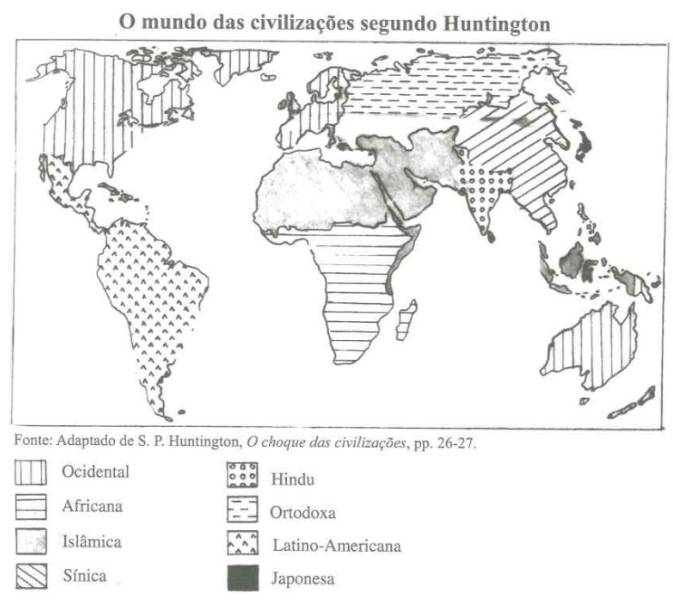
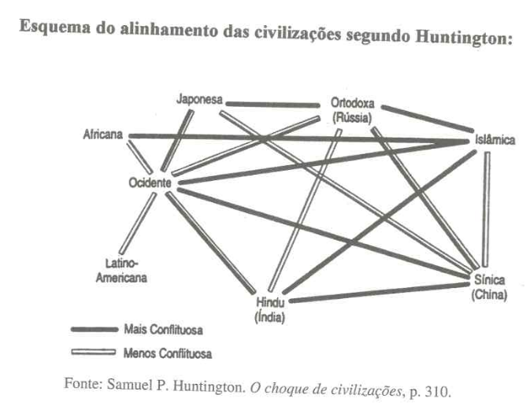

# Os choques culturais marcarão o século XXI?

## Página 52 

## HUNTINGTON - Choque de Civilizações

Samuel P. Huntington, diretor do Instituto de Estudos Estratégicos de Harvard e professor de relações internacionais, além de conhecido estrategista da época da Guerra do Vietnã (ele propôs em 1969 uma “urbanização forçada” da população sul-vietnamita como forma de combater os guerrilheiros e o apoio popular a eles, que era maior no campo que nas cidades), provocou um grande alvoroço em 1993 quando publicou na revista Foreign Affairs um ensaio intitulado “Choque das civilizações?”. O artigo inaugurou uma nova interpretação sobre a geopolítica mundial e logo foi traduzido em quase todo o mundo, suscitando uma onda de discussões.

A ideia fundamental desse ensaio é simples: no mundo pós-guerra fria os conflitos não são mais ideológicos (capitalismo versus socialismo) e nem mesmo econômicos como apregoavam vários autores (EUA versus Europa versus Japão, ou Norte versus Sul, ou ainda as disputas entre os “blocos regionais”), mas **fundamentalmente culturais**: a civilização ocidental contra a islâmica, esta contra a hinduísta, esta contra a chinesa-confuciana etc.

Nas suas palavras:

Minha tese é a de que a fonte fundamental de conflito nesse novo mundo não será essencialmente ideológica nem econômica. As grandes divisões na humanidade e a fonte predominante de conflito serão de ordem cultural. As nações-Estado continuarão a ser os agentes mais poderosos nos acontecimentos globais, mas os principais conflitos ocorrerão entre nações e grupos de diferentes civilizações. O choque de civilizações dominará a política global. As **linhas de cisão** entre as civilizações serão as linhas de batalha do futuro.

## Página 54

Baseado em autores como Arnold Toynbee, para quem a história da humanidade sempre foi antes de tudo uma “história das civilizações” — além, evidentemente, de ver sob essa ótica determinados acontecimentos recentes que evidenciam conflitos culturais (os genocídios e as lutas na ex-Iugoslávia, a reação de simpatia dos povos árabes para com o Iraque na guerra do Golfo etc.) —, Huntington criou o que considerou um “novo paradigma” para explicar os conflitos pós-guerra fria. Ele argumentou que os paradigmas existentes eram insuficientes para explicar os novos acontecimentos, ou seja, os povos já não se agrupariam mais — a seu ver muito parcialmente — em ricos e pobres, democráticos e não democráticos, bloco capitalista ou comunista, Terceiro Mundo etc., havendo então a necessidade de se criar uma nova diferenciação no mapa-múndi.²

Mas o que é uma **civilização**? E quais são as que desempenhariam um importante papel nessa nova ordem mundial que nasceu das ruínas da bipolaridade? Huntington define civilização como a **identidade cultural mais ampla de um povo**: um inglês e um irlandês podem ter diferenças ou tensões culturais, mas eles se identificam como europeus e, no limite, como ocidentais. E um morador de Roma pode se definir como romano, italiano, católico, cristão, europeu e, no limite, ocidental. Além da civilização, para o autor, existiria somente a espécie humana. Citando Toynbee, que identificou 21 grandes civilizações na história, Huntington afirma que poucas delas ainda existem nos dias atuais: a ocidental, a islâmica, a hindu, a eslava ortodoxa, a latino-americana, a japonesa, a confuciana e, possivelmente, a africana.

## Página 55

Somente nos últimos três ou quatro séculos, desde a paz de Westfália até o final da guerra fria, é que a humanidade teria vivido num padrão ocidental de história (baseando-se nos conflitos de reis e depois nações, entre interesses econômicos e ideológicos), tendo deixado, temporariamente, o seu padrão normal que consistiria na predominância dos conflitos civilizacionais. Terminada a fase da guerra fria, a última desse padrão ocidental, devido a um declínio relativo do Ocidente (ou uma nova ascensão de civilizações que voltam a emular com ele: a islâmica, a chinesa-confuciana etc.), então as coisas estariam voltando ao “normal”. O que importa de fato para as pessoas, afirma Huntington, é a família, a fé, as crenças — “por cultura é que se morre” — e, assim sendo, o choque de civilizações seria a abordagem que melhor explicaria os conflitos mundiais dos anos 1990 e do século XXI.

Uma noção fundamental nessa interpretação é a de “linhas de cisão entre as civilizações”, que seriam as áreas do globo onde os choques ocorreriam com maior intensidade. Elas podem ser vistas como “áreas fronteiriças” (no sentido de fronteira ou zona de contato cultural, e não necessariamente de fronteira política), ou seja, locais onde há uma significativa presença de civilizações diferentes e ocorre uma “luta pelo controle do território de cada uma”.

A Bósnia-Hezergovina e o Kosovo são vistas por ele como áreas localizadas exatamente em linhas de cisão: na Bósnia ocorreria uma disputa entre grupos ocidentais (os croatas), islâmicos (os bósnios) e eslavos ortodoxos (os sérvios); e no Kosovo haveria uma disputa entre islâmicos (os kosovares) e eslavos ortodoxos (os sérvios).

## Página 56

## O ESTADO CIVILIZACIONAL NÚCLEO

Em 1996, Huntington publicou um volumoso livro, que é essencialmente uma tentativa de fundamentar melhor — e retrabalhar certos aspectos da — sua interpretação do choque de civilizações. Alguns novos temas são desenvolvidos nessa obra, notadamente o de ordem multipolar e multicivilizacional, de Estado-núcleo e da sobrevivência do Ocidente e em particular da liderança norte-americana.

Ele define a nova ordem mundial como “multipolar e multicivilizacional”. Isso significa, por um lado, que os centros mundiais de poder ainda são Estados, e estes atuam, diz ele — de forma coerente com o chamado realismo —, “pela busca de poder e de riqueza”; mas, por outro lado, os agrupamentos mais importantes de Estados são as sete ou oito grandes civilizações que existem no globo⁵. Isso porque os conflitos ou as guerras intracivilizações — ele menciona os choques de clãs na Somália e de tribos em Ruanda — teriam uma importância somente regional, ao passo que os conflitos intercivilizações — aí ele menciona os choques na Bósnia, na Ásia central e na Caxemira — são os mais perigosos e que têm uma repercussão global.

O conceito de “Estado-núcleo de uma civilização” seria uma categoria nova de poder, diferente das superpotências da guerra fria e das grandes potências, normalmente ocidentais, dos últimos séculos. Huntington afirma que as civilizações são como famílias e os Estados-núcleos representam o chefe, o líder dos demais Estados daquele “bloco civilizacional”, que o veem como um parente cuja liderança proporciona a eles apoio e disciplina. Quando uma civilização carece de um Estado-núcleo (tal como ocorreria hoje com a africana, com a islâmica e com a latino-americana), existem maiores problemas em criar ordem no seio delas e também em resolver disputas entre os seus Estados e outros de civilizações diferentes. Os Estados-núcleos, assim, teriam um importante papel de mediadores nos conflitos mundiais. E encontrar esses líderes para as mencionadas civilizações que ainda não os têm seria algo imprescindível para manter a paz internacional.

## Página 57

O caso mais problemático a esse respeito seria o do mundo islâmico, um bloco civilizacional em emergência e que, segundo o autor, “tem percepção [de si] mas não coesão”. O Islão está dividido em centros de poder competitivos (Arábia Saudita, Irã, Iraque, Paquistão, Egito, Líbia e provavelmente a Turquia), cada um tentando capitalizar a identificação muçulmana com a ummah ou civilização islâmica como um todo. Após fazer um balanço dos prós e contras de cada um desses candidatos potenciais a Estado-núcleo islâmico, Huntington não esconde a sua preferência pela Turquia, que a seu ver (paradoxal herdeira dos lideranças turcas, que antes a conseguiram) só teria sonhado ingressar do país na União Europeia deveria se redefinir, abandonando o seu caráter de Estado laico ou secular, algo que impede que ela volte a desempenhar o seu papel de liderança no mundo muçulmano, e também “abandonar o seu papel frustrante e humilhante de mendiga que implora para ser admitida no Ocidente”⁷.

Quanto às demais grandes civilizações, os problemas de disputas por liderança seriam bem menores. A Rússia é vista como um Estado dividido, mas também como o líder inquestionável da civilização eslava ortodoxa. E a China é a líder inconteste da civilização confuciana ou sínica, assim como a Índia é o Estado-núcleo da civilização hinduísta. Já o Ocidente tem dois polos — Estados Unidos e União Europeia —, mas que tendem a se alinhar por meio da OTAN (que, na sua visão, deveria incorporar somente as nações europeias não ortodoxas, i.e., com cultura ocidental). E as civilizações latino-americana e africana não têm Estados-núcleos, mas não enfrentam conflitos com outras civilizações (com exceção da africana, que reage à expansão islâmica no continente), são relativamente frágeis do ponto de vista de percepção e tendem a se colocar como dependentes do Ocidente.

## Página 58

## QUAL SERIA O PAPEL DOS ESTADOS UNIDOS?

A grande preocupação de Huntington é com o que chama “declínio do Ocidente” e com o papel que os Estados Unidos deveriam desempenhar nessa nova ordem multipolar e multicivilizacional.

Ele afirma que o Ocidente já atingiu o seu auge, e atualmente possui um domínio absoluto sobre uma série de setores mundialmente poderosos: o sistema bancário e as moedas fortes, grande parte da produção industrial, o acesso ao espaço, os meios de comunicações internacionais, a indústria de armamentos de alta tecnologia etc.

Mas estaria ocorrendo um declínio “gradual e inexorável” do poder relativo do Ocidente ante o resto do mundo. O autor menciona que, do ponto de vista territorial, o Ocidente governava cerca de 66 milhões de quilômetros quadrados em 1920, ou cerca de metade das terras continentais do globo, sendo que hoje essa área seria de 32,8 milhões de quilômetros quadrados. Em 1900, continua ele, os ocidentais representavam cerca de 30% da população mundial e governavam outros 45%, ao passo que hoje eles somam pouco mais de 13% desse efetivo demográfico planetário. Menciona ainda que a parcela ocidental do produto econômico mundial vem declinando visivelmente após a Segunda Guerra Mundial: ela representava 84% do total em 1920 e cerca de 57% em 1980. E, por fim, ele argumenta que o poderio militar do Ocidente, apesar de não enfrentar sérios adversários até “as próximas décadas”, também vem conhecendo um declínio relativo: os efetivos militares ocidentais representariam 48% do total mundial em 1920 e somente 21% em 1991⁸.

## Página 59

As conclusões pragmáticas que Huntington tira da sua interpretação sobre a nova ordem mundial são surpreendentes: em primeiro lugar os Estados Unidos e a Europa têm de se manter unidos, ou então “serão destruídos separadamente”. Isso porque, nas suas palavras, são os choques de civilizações – e não as disputas comerciais ou econômicas – que representavam a maior ameaça à paz mundial no século XXI. Inclusive o autor só acredita no sucesso da “melodia comum” se eles forem alicerçados em laços culturais, em segundo lugar, de certo, segundo ele, a União Europeia. Em segundo lugar – daí esta interpretação huntingtoniana ser na prática um contraponto às teorias sobre o “fim da história” que dão ao capitalismo ocidental e à democracia liberal vitória definitiva –, os Estados Unidos ou a OTAN deveriam deixar de se envolver em conflitos que ocorrem em outras civilizações. Huntington não acredita na expansão da democracia para todas as civilizações:

“O conceito de uma civilização universal é um nítido produto da civilização ocidental, que no século XIX ajudou a justificar o ‘fardo do homem branco’, a expansão sobre as culturas não ocidentais; e no final do século XX o universalismo e a ideologia do Ocidente para confrontar outras sociedades, para justificar o seu predomínio cultural.”

## Página 60

Huntington propõe então uma atuação “realista” (termo que ele gosta de enfatizar), na política externa norte-americana. Nada de se envolver em guerras alheias, isto é, de outras civilizações, mesmo que isso envolva o nome “direitos humanos”. Isso é o que ele chama de “regra da abstenção”, ou seja, uma potência como os Estados Unidos, que é Ocidental, deveria se abster de intervir em conflitos de outras civilizações. Esse seria o primeiro requisito para a paz nesse mundo multipolar e multicivilizacional. E a segunda regra seria a da “mediação conjunta”, ou seja, os Estados-núcleos deveriam negociar entre si para conter as guerras que ocorrem nas linhas de cisão entre essas civilizações. O autor até sugere que não se deve impedir a Rússia de dominar os países eslavos ortodoxos da Europa (e, inversamente, a Rússia não deveria se opor à expansão da OTAN até os países da ex-Europa Oriental que têm uma cultura ocidental), e que não se deve intervir no desejo da China de anexar Taiwan e outras áreas, e isso tudo sem manifestar a menor preocupação do ponto de vista das populações que vivem nessas áreas! Um conselho sem dúvida “realista”, de quem acredita que é “inútil e até arrogante” tentar impedir a China de cumprir o seu “destino” de dominar a Ásia oriental.

## AS INSUFICIÊNCIAS DA REALPOLITIK CULTURALISTA

Deixando-se de lado a (problemática) discussão sobre os fatos – “as guerras da Bósnia ou do Kosovo teriam realmente sido conflitos culturais?”, “as grandes ameaças para a paz mundial consistem de fato nas linhas de cisão entre o Ocidente e o islamismo, ou entre este e a civilização hinduísta?” –, a principal crítica que se pode fazer a essa realpolitik culturalista de Huntington é que ela legitima uma espécie de “desconsideração pelos direitos humanos” em culturas não ocidentais.

Uma política externa baseada nessa teoria, que é exatamente o que Huntington sugere para os Estados Unidos, seria na prática o abandono de qualquer universalismo (por exemplo, da “democracia como valor universal”) e uma espécie de “partilha do planeta” entre meia dúzia de Estados-núcleos, cada um podendo fazer o que bem entender na sua zona de influência.

Como entender e apoiar, desse ponto de vista, as lutas das mulheres no Egito e no Irã, que pleiteiam uma maior igualdade com os homens e provavelmente constituem nos dias de hoje a principal oposição à tradição autoritária? E como encarar a aspiração da imensa maioria da população de Taiwan, que, como demonstraram várias pesquisas de opinião, não querem de maneira alguma se unir com a China? E como enfrentar o legítimo desejo das lideranças e da intelectualidade turca, de deixarem definitivamente para trás o seu radicalismo muçulmano e tornarem-se parte da Europa e do Ocidente?

## Página 61

Um acadêmico e assessor do governo japonês, também especialista em relações internacionais, criticou essa realpolitik huntingtoniana afirmando que:

O recuo do Ocidente não é universalmente bem recebido. Uma retirada súbita do apoio dos Estados Unidos a aliados do Oriente Médio e do Pacífico, ainda que improvável, poderia provocar enormes mudanças que não agradariam a ninguém. (...) De todo modo, o Ocidente pode ser tão danoso quanto a dominação ocidental (...). O Ocidente ainda é o repositório dos maiores triunfos e realizações da civilização humana. Muitos valores ocidentais explicam o avanço espetacular da humanidade: a liberdade de pesquisa, a investigação cega, a busca de soluções racionais e o desejo de desafiar premissas. Mas a crença (...) pode conduzir a uma cegueira: a incapacidade de perceber que alguns dos valores que vêm com esse pacote podem ser nocivos. Mas é preciso estar fora do Ocidente para perceber claramente isso e para ver como o Ocidente está fazendo o seu próprio declínio relativo. Huntington também está cego para isso.

Também um especialista em estudos do Oriente Médio, fazendo coro aos críticos dessa realpolitik, assinalou que:

Huntington subestimou a força da modernidade e do secularismo em lugares que seguiram esse caminho com muitas dificuldades. Do seu ponto de vista, fenômenos como a “hinduização” da Índia ou o fundamentalismo islâmico venceram. Mas a herança do secularismo indiano prevaleceu. E o fenômeno que chamamos de fundamentalismo islâmico é menos um sinal de ressurgimento de pânico, espanto e culpa pelo fato de a fronteira com os “outros” ter sido cruzada. (...) Na Argélia e no Egito se trava uma batalha entre os poderosos e uma alternativa islamista. Mas não devemos nos apressar em publicar o necrológio daqueles Estados (...). A Turquia também não vai mudar de rumo, virar as costas para a Europa e perseguir uma tentação imperial nos domínios ressequidos da Ásia Central. Huntington vendeu barato a modernidade e o secularismo daqueles países.

E, finalmente, um dissidente chinês foi enfático ao afirmar:

É irônico que Huntington vislumbre um confucionismo ressurgente no exato momento em que a deterioração moral e espiritual corrói as fundações culturais da China. Os 47 anos de regime comunista destruíram a religião, a educação, o império da lei e a moralidade (...) O século XXI na realidade será uma era em que, através da interação e do consenso, as civilizações poderão se fundir, ajudando os povos a (...) livrarem-se da pobreza e da escravidão, transformando pessoas subjugadas em seres humanos. Isso vai exigir o que há de melhor em cada uma das civilizações, e não que se enfatizem as diferenças entre elas.
