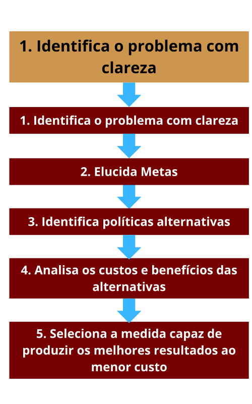
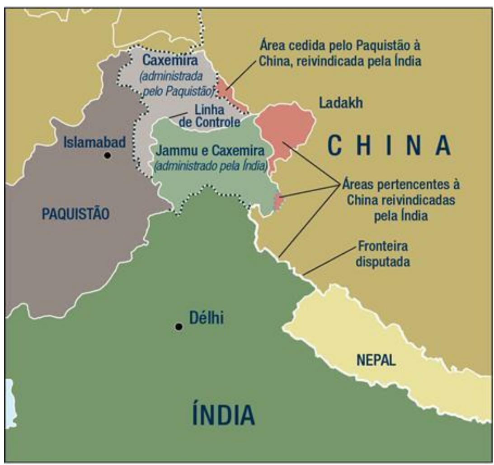

# Capítulo 5 - O Estado

**■ Como se define o Estado, o principal ator nas relações internacionais?**

**■ Quais são as diferentes visões do Estado sustentadas pelas várias perspectivas teóricas?**

**■ Como é medido o poder do Estado?**

**■ Quais são os métodos que os Estados usam para exercitar seu poder?**

**■ O comportamento das democracias é diferente daquele dos Estados que não são democráticos?**

**■ Que modelos nos ajudam a entender como os Estados tomam decisões relacionadas com política externa?**

**■ Quais são os maiores desafios do Estado atualmente?** 

## Página 150

Quando pensamos em relações internacionais, o Estado é central. Grande parte da História abordada no Capítulo 2 foi a história de como o Estado emergiu do referencial pós-vestfaliano e se desenvolveu em sequência, com a soberania e a nação. Duas das perspectivas teóricas – realismo e liberalismo – reconhecem a primazia do Estado. Entretanto, apesar dessa ênfase no Estado, sua conceituação é inadequada. Como lamenta o estudioso James Rosenau, “um número grande demais de estudos postula o Estado como um símbolo sem conteúdo, como um ator cuja natureza, motivação e conduta são tão evidentes por si sós que dispensam qualquer necessidade de conceituação precisa. De fato, o conceito muitas vezes parece empregado como uma categoria residual para explicar aquilo que, do contrário, seria inexplicável na macropolítica”. Precisamos ir além disso. Como os Estados se comportam nas relações internacionais, e qual a sua importância?

**O Estado e a nação**

Para uma entidade ser considerada um Estado, quatro condições jurídicas fundamentais devem ser cumpridas. 

▪️1. A primeira é que um Estado deve ter uma base territorial, com fronteiras definidas em termos geográficos. 

▪️2. A segunda é que, dentro de suas fronteiras, deve residir uma população estável. 

▪️3. Terceiro, deve haver um governo ao qual essa população deve obediência. 

▪️4. Por fim, um Estado tem de gozar do reconhecimento diplomático dos demais Estados.

Esses critérios jurídicos não são absolutos, e estão sujeitos às mais diversas interpretações. Grande parte dos Estados possui uma base territorial, embora as fronteiras exatas não raro sejam objeto de disputa. Enquanto não se concedeu à Autoridade Palestina certa medida de controle sobre a Cisjordânia e Gaza, por exemplo, a Palestina não dispunha de uma base territorial. Entretanto, havia recebido o status de observadora especial em organismos internacionais e era considerada quase um Estado. Em 2012, o território foi promovido a observador sem direito a voto na Assembleia Geral da ONU. A maioria dos Estados conta com uma população estável, mas comunidades migrantes e povos nômades cruzam fronteiras — caso, por exemplo, dos povos massai, do Quênia e da Tanzânia, sem serem detectados pelas autoridades. A maior parte dos Estados dispõe de algum tipo de estrutura institucional para governança, mas nem sempre é possível saber se o povo a obedece ou não — por falta de informações ou em virtude de uma situação problemática, porque a legitimidade institucional do governo está sob constante questionamento. Um Estado não precisa ter uma forma de governo determinada, mas a maioria de seu povo deve reconhecer a legitimidade do governo. Em 2010, o povo do Egito informou ao restante da comunidade internacional que não reconhecia mais a legitimidade do governo liderado por Hosni Mubarak, o que desencadeou uma série de manifestações e acabou levado à queda de seu governo. Por fim, outros Estados devem reconhecer o Estado em termos diplomáticos; porém, é preciso o reconhecimento de quantos Estados para cumprir esse critério? A República do Transkei – minúsculo pedaço de terra recortado da África do Sul – foi reconhecida por apenas um Estado, a própria África do Sul. Tal iniciativa mostrou-se insuficiente para conferir ao Transkei o status de Estado, e o território logo voltou a ser incorporado à África do Sul.

## Página 151

Alguns Estados estão sob contestação. No início de 2008, Kosovo, que já tinha sido uma parte semiautônoma da Iugoslávia e, mais tarde, uma província da Sérvia, declarou sua independência unilateral em relação aos sérvios. Foi promulgada uma constituição e estabelecido um ministério de relações exteriores. Até o final de 2012, 100 países haviam reconhecido a independência de Kosovo, mas não a própria Sérvia. O Gabinete Civil Internacional de monitoramento foi fechado em 2012, e a segurança é mantida por uma força de paz comandada pela OTAN. A Abecásia e NagornoKarabakh também são “meios países, prestes a se converterem em Estados”, que se encontram na “enfermaria pré-natal da comunidade internacional”. Portanto, embora as exigências jurídicas para a condição de Estado proporcionem algum referencial, esse critério não é absoluto.

A definição de Estado difere da de nação. **Uma nação é um grupo de pessoas que compartilham um conjunto de características**. Se um povo qualquer compartilha uma história e uma herança comuns, uma linguagem e costumes comuns, ou estilos de vida semelhantes, então ele constitui uma nação. Foi esse senso de algo em comum, de união das pessoas em torno de determinada causa, que serviu de alicerce para a Revolução Francesa e espalhou-se para as Américas e a Europa Central. Foi o nacionalismo – a crença de que as nações devem formar seus próprios Estados – que impeliu, no século XIX, a formação de uma Itália e uma Alemanha unificadas. No âmago do conceito de nação está a ideia de que as pessoas que têm certos elementos em comum devem fidelidade à nação e a seu representante legal, o Estado. O reconhecimento desses fatores comuns à população (e, por conseguinte, de suas diferenças em relação a outros grupos) foi disseminado pelas novas tecnologias e pela educação. Quando a imprensa passa a ser usada amplamente, as massas podem ler em seu idioma nacional; com os avanços dos métodos de transporte, as pessoas podem se deslocar e observar, em primeira mão, as similaridades e diferenças entre outros grupos. Com meios melhores de comunicação, as elites podem utilizá-los para promover a unidade ou, às vezes, explorar as diferenças.

## Página 152

Certas nações, como Dinamarca e Itália, constituíram seus próprios Estados. Essa coincidência entre Estado e nação, o **Estado-nação**, é o fundamento da autodeterminação nacional, a ideia de que povos que compartilhem determinada identidade como nação têm o direito de determinar como e sob que condições devem viver. Outras nações encontram-se dispersas por vários Estados. Por exemplo, os alemães residiam — e vivem ainda — não só na Alemanha unificada, mas também nos confins do Leste Europeu; os somalis vivem no Quênia, Etiópia e Djibuti, não só na Somália. Outros Estados, ainda, têm dentro de suas fronteiras diferentes nações – Índia, Rússia e África do Sul são bons exemplos. Nos Estados Unidos e no Canadá, várias nações indígenas americanas distintas fazem uma parte do Estado, assim como diversas comunidades de imigrantes. Estado e nação nem sempre coincidem. Nesses casos, porém, com o passar do tempo, foi sendo forjada uma identidade e nacionalidade comuns, mesmo na ausência de similaridades religiosas, étnicas ou culturais. No caso dos Estados Unidos, os valores nacionais que refletem ideias comuns são expressos em rituais públicos que incluem o Juramento de Fidelidade, o hino nacional e o engajamento voluntário de cada um na respectiva comunidade. Estados são entidades complexas e, ao mesmo tempo, em constante transformação.

Algumas das centenas de subgrupos nacionais ao redor do mundo, que contam cerca de 900 milhões de pessoas, identificam-se mais com uma cultura ou religião em particular do que com algum Estado específico, não raro enfrentando discriminações ou perseguições devido à sua identidade. Esse tipo de situação nada tem de novo. A gradual desintegração do Império Otomano, entre a década de 1830 e a Primeira Guerra Mundial, foi reflexo da crescente demanda de autodeterminação por parte de grupos étnicos — desde egípcios e gregos até albaneses, montenegrinos e búlgaros.

Contudo, nem todos os grupos etnonacionais aspiram aos mesmos objetivos. Alguns desejam o reconhecimento de um status único, o direito de falar e escrever determinado idioma ou praticar a sua religião, ou assentos especiais em órgãos representativos, como querem os bascos na Espanha e na França. Alguns procuram soluções em arranjos federativos, na esperança de assegurar autonomia dentro de um Estado estabelecido, caso dos curdos no Iraque. No entanto, a Constituição curda de 2009, que proclamou direitos exclusivos sobre os recursos de petróleo e gás de seu território, sugere que eles talvez almejem mais autoridade. Outros grupos, ainda, querem a separação e o direito de constituir seu próprio Estado, como expressaram os catalães na Espanha em manifestações maciças em 2012. A República do Sudão do Sul, após duas décadas de guerra civil, tornou-se um Estado independente em 2011. E há os que optam pelo **irredentismo**, juntando-se a outro Estado cuja população é composta pelo mesmo grupo etnonacional.

## Página 154

Uma disputa persistente em torno da questão de Estado e nação ocorre entre a República Popular da China (RPC) e Taiwan, também chamada de República da China. Após a Segunda Guerra Mundial, Mao Tsé-Tung e seus revolucionários comunistas tomaram o território e o governo da China continental, forçando o antigo governo nacionalista fugir para Taiwan, uma ilhota cerca de 160 quilômetros a Sudeste. Ambos os governos afirmavam representar a nação chinesa. Por questões ideológicas e geopolíticas, os Estados Unidos a princípio reconheceram a República da China, ao passo que a União Soviética reconheceu a RPC. Com o tempo, no entanto, o crescente poder político e econômico da segunda levou à marginalização da primeira — sobretudo porque, em 1972, a República Popular da China assumiu o assento permanente da China no Conselho de Segurança das Nações Unidas. Hoje, a RPC é reconhecida por 171 países, enquanto a República da China é reconhecida por apenas 23. A RPC sempre defendeu a tese de que Taiwan é uma parte inseparável da China, política que chama de “política da China Única”, apoiada pelos Estados Unidos. A relação entre a China e Taiwan complicou-se desde a instituição, em 1990, da democracia em Taiwan, pois um dos principais partidos políticos apoia a independência de Taiwan, enquanto os demais preferem a continuidade do status quo. A assim chamada questão da China, o conflito em torno do Estado e da nação chinesa, persiste até hoje.

Disputas de território por Estados e o desejo de certas nações de constituir seus próprios Estados têm sido as maiores fontes de instabilidade e mesmo de conflito desde o fim do colonialismo na África e no Oriente Médio — e, mais recentemente, após as dissoluções da União Soviética e da Iugoslávia. Outro desses conflitos ferrenhos é aquele entre judeus israelenses e árabes palestinos, que disputam o mesmo território. O conflito é complicado por vários fatores – o fato de judeus, cristãos, muçulmanos e bahaístas reivindicarem e considerarem sagrados determinadas áreas e monumentos; a intensa oposição dos Estados árabes à existência do de Israel; e a gradual expansão do território de Israel por meio de conflitos armados ou do assentamento de colônias. Desde a fundação de Israel, em 1948, os povos árabe e judeu da Palestina já protagonizaram seis guerras interestatais e três insurreições populares. Civis dos dois lados já foram atingidos e mortos, e muitos seguem vivendo como refugiados. Isso leva a uma importante discussão: Israel e os territórios da Palestina devem ser divididos em dois Estados independentes separados?

## Página 155

## Conceitos concorrentes de Estado

Do mesmo modo como a nação é mais que uma entidade histórica, o Estado é mais que uma entidade jurídica. Há diversos conceitos concorrentes de Estado, muitos das quais dão ênfase a ideias inexistentes da abordagem legalista.

Entre outros conceitos de Estado, há os seguintes: o Estado é uma ordem normativa, um símbolo de uma determinada sociedade e das crenças que unem o povo que vive dentro de suas fronteiras. Também é a entidade que detém o monopólio do uso legítimo da violência dentro de dada sociedade. O Estado é uma unidade funcional, que assume uma série de responsabilidades cruciais, centralizando-as e unificando-as. 

### A perspectiva realista do Estado

Os realistas têm uma visão estatista, ou centrada no Estado. Acreditam que o Estado é um ator autônomo, restringido somente pela anarquia estrutural do sistema internacional. O Estado goza de soberania, isto é, de autoridade para reger assuntos circunscritos às próprias fronteiras e referentes ao seu povo, à sua economia, à sua segurança e à sua forma de governo. Como entidade soberana, possui um conjunto consistente de metas — isto é, um interesse nacional — definido em termos de poder. Diferentes tipos de poder podem ser traduzidos em poderio militar. Embora o poder seja de primordial importância para os realistas, como veremos mais adiante neste Capítulo, em sua avaliação as ideias também têm valor; a ideologia, por exemplo, pode determinar a natureza do Estado, como no caso do Estado da Coreia do Norte sob o comunismo. Porém, em relações internacionais, sempre que o Estado age (seja por poder ou ideias), no entender dos realistas, é como um ator unitário autônomo.

### Em foco - A perspectiva realista do estado 
O Estado é: 
♦ um ator autônomo.
♦ restringido apenas pela anarquia do sistema internacional.
♦ soberano.
♦ pautado por um interesse nacional que é definido em termos de poder.

## Página 156

### A perspectiva liberal do Estado

Do ponto de vista liberal, o Estado goza de soberania, mas não é um ator autônomo. Assim como acreditam que o sistema internacional constitui um processo que se dá entre muitos atores, os liberais veem o Estado como uma arena pluralista, cuja função é assegurar as regras básicas do jogo — as quais garantem que vários interesses (tanto governamentais quanto da sociedade) disputem de maneira imparcial e eficaz o jogo político. Não há um interesse nacional único, explícito ou consistente; há muitos. Esses interesses com frequência competem entre si dentro de uma estrutura pluralista. Os interesses nacionais do Estado mudam ao longo do tempo, refletindo os interesses e as posições relativas de poder de grupos concorrentes internos e, às vezes, também de fora do Estado.

### Em foco - A perspectiva liberal do estado
O Estado é:
♦ um processo, envolvendo interesses em conflito.
♦ um reflexo de interesses tanto governamentais quanto da sociedade.
♦ o repositório de múltiplos e cambiantes interesses nacionais.
♦ o detentor de fontes fungíveis de poder.

### A perspectiva radical do Estado

Os radicais apresentam duas visões alternativas do Estado, ambas sublinhando o papel do capitalismo e da classe capitalista na formação e funcionamento do Estado. A perspectiva marxista **instrumental** vê o Estado como o <u>agente executor da burguesia</u>. A burguesia reage às pressões diretas da sociedade, em especial àquelas da classe capitalista. A perspectiva marxista **estrutural** vê o Estado funcionando dentro da estrutura do sistema capitalista. No contexto desse sistema, o Estado é levado a expandir-se, não em razão da pressão direta dos capitalistas, mas em virtude dos imperativos do sistema capitalista. Nenhuma das duas reconhece um interesse nacional: o comportamento do Estado reflete metas econômicas. Em nenhum dos casos é possível uma soberania real porque o Estado está sempre reagindo às pressões capitalistas externas e internas.

### Em foco - A perspectiva radical do estado
O Estado é:
♦ o agente de execução da burguesia.
♦ influenciado por pressões da classe capitalista.
♦ restringido pela estrutura do sistema capitalista internacional.

## Página 157

### A perspectiva construtivista do Estado

Uma vez que os construtivistas consideram tanto os interesses nacionais quanto as identidades nacionais constructos sociais, sua concepção de Estado é profundamente distinta daquela das demais perspectivas teóricas. Para os construtivistas, os interesses nacionais não são nem materiais nem evidentes; pertencem ao reino das ideias e estão em constante mudança e evolução, em resposta tanto a fatores internos quanto a normas e ideias internacionais. Os Estados compartilham uma variedade de metas e valores em que são socializados por organizações internacionais e não governamentais. Tais normas podem mudar as preferências do Estado, o que, por sua vez, pode influenciar seu comportamento. Portanto, também os Estados têm múltiplas identidades, incluindo uma compreensão comum acerca da identidade nacional, que também muda, alterando as preferências e, portanto, o comportamento do Estado. Em suma, o Estado “faz” o sistema e o sistema “faz” o Estado.

### Em foco - A perspectiva construtivista do estado

O Estado é:
♦ uma entidade construída socialmente.
♦ o repositório de interesses nacionais, que se transformam ao longo do tempo.
♦ moldado por normas internacionais que modificam preferências.
♦ influenciado por interesses nacionais cambiantes, que moldam e remodelam identidades.
♦ socializado por organizações intergovernamentais (OIGs) e organizações não governamentais (ONGs).

### Comparação entre as várias visões de Estado

As quatro conceituações de Estado podem ser comparadas com facilidade usando o exemplo de uma importante commodity – o petróleo.

A interpretação realista postula um interesse nacional homogêneo, articulado pelo Estado. Os Estados consideram determinadas commodities estratégicas vitais para sua segurança nacional; por isso, desejam que sua disponibilidade e preços se mantenham estáveis. Por exemplo, os Estados Unidos precisam ter certeza de que haverá um suprimento garantido e seguro de petróleo, e procuram obtê-lo a preços relativamente uniformes. Ao negociar em fóruns internacionais, seja com Estados fornecedores individuais ou com empresas multinacionais, o interesse nacional do Estado, definido em termos estratégicos, é o aspecto fundamental das negociações. É também o caso da China. O petróleo é o motor de sua economia em rápida expansão e, portanto, o país forjou fortes laços bilaterais com Estados exportadores dessa commodity, tais como Irã, Sudão e Angola, entre outros.

## Página 158

Os liberais acreditam que uma série de interesses nacionais influencia as ações do Estado: grupos de consumidores desejam que o preço do petróleo seja o menor possível; os empregados de indústrias manufatureiras, que dependem de suprimentos a granel para assegurar o funcionamento de suas fábricas, valorizam um suprimento de petróleo estável, do contrário correm o risco de perder o emprego; produtores de petróleo, inclusive em âmbito nacional, querem preços altos, de modo a auferir lucros e ter incentivos para reinvestir em perfuração. O Estado em si não reflete nenhum ponto de vista consistente a respeito; sua tarefa é garantir a **“neutralidade do campo”** e que as regras sejam as mesmas para os vários participantes no mercado. O resultado concreto do jogo – que grupo verá seus interesses predominarem – mudará conforme as circunstâncias, e pouco importa ao Estado. Quando ocorrem negociações, o Estado assegura que os vários interesses tenham voz e proporciona um fórum para as interações. Não há nenhum interesse nacional único ou consistente: às vezes são os preços baixos ao consumidor; outras vezes é a estabilidade dos preços; outras, ainda, preços altos para estimular a produção interna.

Na perspectiva radical, a política do Estado em relação às commodities primárias é reflexo dos interesses da classe capitalista proprietária, alinhada com a burguesia (na perspectiva marxista instrumental) e reflete a estrutura do sistema capitalista internacional (no pensamento marxista estrutural). É muito provável que tanto uma quanto a outra corrente considerem o processo de negociação explorador, no qual os fracos (grupos ou Estados pobres e dependentes) são explorados em favor de capitalistas ou Estados capitalistas fortes. Segundo o pensamento radical, as empresas petrolíferas internacionais são os capitalistas, alinhados com Estados hegemônicos, e têm condições de negociar preços favoráveis — em geral, em detrimento dos Estados produtores mais fracos, como México ou Nigéria. Os radicais podem explicar os interesses americanos e europeus no Oriente Médio em termos da necessidade de um abastecimento de petróleo e gás natural confiável.

Para fins de comparação, embora os construtivistas talvez prestem pouca atenção às concepções materialistas de poder, definidas em termos de recursos de petróleo, eles podem assinalar o modo como as identidades dos Estados são forjadas em torno da posse de um recurso tão valioso. A Arábia Saudita e os Estados do Golfo Pérsico desenvolveram uma identidade baseada em um recurso aparentemente ilimitado e valioso. O petróleo lhes permite mesclar essa identidade com a sua identidade de Estados islâmicos que exportam sua fé para outros países.

Assim, cada teoria defende diferentes pontos de vista acerca do Estado — diferenças que podem ser observadas em quatro subáreas: a natureza do poder do Estado (O que é poder? Quais são as fontes importantes de poder?); o exercício do poder pelo Estado (a importância relativa de diferentes técnicas de exercício do poder pelo Estado); o modo como é conduzida a política externa (a visão estatista versus a burocrática ou pluralista da tomada de decisões); e os determinantes da política externa (a importância relativa de fatores internos em face de fatores internacionais).

## Página 159

## A natureza do poder do Estado

Os Estados são atores críticos porque têm poder, que é a capacidade não apenas de influenciar os outros, mas de controlar os resultados de modo a produzir desdobramentos que não ocorreriam naturalmente. Os Estados têm poder uns em relação aos outros e em relação aos seus atores internos. Todas as perspectivas teóricas reconhecem a importância do poder. Contudo, cada uma presta atenção a diferentes modalidades do mesmo. Tanto realistas e liberais quanto radicais concebem o poder em termos materialistas; os realistas e radicais concentram-se basicamente nas fontes naturais e tangíveis, ao passo que os liberais também atentam para as fontes intangíveis. Os construtivistas enfatizam as fontes não materialistas relacionadas com o poder das ideias, uma das fontes intangíveis. Todos concordam que o poder é multidimensional, dinâmico e situacional.

### Fontes naturais de poder

Por meio do exercício do poder, os Estados influenciam uns aos outros e podem controlar a direção de políticas e eventos. Sua capacidade de influenciar resultados vai depender, em parte, do **potencial de poder** de cada um. O potencial de poder de um Estado depende, em parte, de suas fontes naturais de poder, cruciais para as perspectivas realista e radical. As três fontes naturais de poder mais importantes são o tamanho e a posição geográfica, os recursos naturais e população.

O tamanho e a posição geográfica são as fontes naturais de poder reconhecidas em primeiro lugar pelos teóricos das relações internacionais. Uma grande extensão geográfica confere poder automático a um Estado (quando pensamos em poder, são os Estados grandes que nos vêm à mente — Rússia, China, Estados Unidos, Austrália, Índia, Canadá ou Brasil, por exemplo). Todavia, fronteiras extensas podem ser uma fraqueza: têm de ser defendidas, uma tarefa cara e, muitas vezes, problemática.

Dentro da tradição realista, surgiram na virada do século duas perspectivas distintas acerca da importância da geografia em relações internacionais. No final da década de 1890, o oficial da Marinha e historiador Alfred Mahan (1840–1914) escreveu sobre a importância do controle dos mares. A seu ver, o Estado que controla as rotas marítimas controla o mundo. Para Mahan, a soberania em terra não era tão crítica quanto o acesso e controle das rotas oceânicas. Em 1904, o geógrafo britânico Sir Halford Mackinder (1861–1947) se contrapôs a esse ponto de vista. Para Mackinder, o Estado mais poderoso seria aquele que controlasse o “coração” geográfico da Eurásia: “Quem domina a Europa Oriental domina o coração da Eurásia; quem domina o coração da Eurásia comanda a ilha mundial da Europa, Ásia e África, e quem comanda a ilha mundial comanda o mundo.”

As duas perspectivas possuem validade empírica. O poder britânico nos séculos XVIII e XIX foi em grande parte determinado por seu domínio dos mares — um poder que permitiu à Grã-Bretanha colonizar lugares distantes, entre eles Índia, grande parte da África e as Américas Central e do Norte. A falta de acesso fácil ao mar pela Rússia e sua consequente incapacidade de ostentar poder naval é considerada uma persistente deficiência do potencial de poder desse país. O controle de pontos de estrangulamento cruciais dos oceanos – os Estreitos de Málaca, Gibraltar e Ormuz; o Estreito de Dardanelos; o Golfo Pérsico e os Canais do Panamá e de Suez – é tido como um indicador positivo de potencial de poder.

## Página 160

No entanto, a posição geográfica do coração da Eurásia destacado por Mackinder também mostrou constituir uma significativa fonte de potencial de poder. Mais do que qualquer outro país, a Alemanha agiu para assegurar seu poder por meio do controle do coração da Eurásia, agindo em clara consonância com a tese de Mackinder, tal como interpretada pelo geógrafo alemão **Karl Haushofer📌 (1869–1946)**. Haushofer, que tinha servido nos Exércitos bávaro e alemão, ficou desapontado com a derrota da Alemanha na Primeira Guerra Mundial. Defendendo que a Alemanha poderia se tornar um Estado poderoso se conseguisse capturar o coração da Eurásia, ele decidiu fazer da geopolítica uma área legítima de investigação acadêmica. Fundou um instituto e um periódico e alçou-se à posição de principal partidário e proponente da expansão nazista.

Entretanto, o potencial de poder geográfico é ampliado ou restringido por recursos naturais, uma segunda fonte de poder natural. O controle de uma vasta expansão geográfica não se constitui em componente positivo de poder, a menos que o referido território possua recursos naturais. Países exportadores de petróleo como Kuwait, Catar e os Emirados Árabes Unidos, que são pequenos em termos geográficos mas são detentores de um recurso natural crucial, têm um potencial de poder maior do que o que seu tamanho poderia sugerir. Os Estados precisam de petróleo e estão prontos não só a pagar caro por esse produto como até mesmo a ir à guerra quando o acesso a ele lhes é negado. Os Estados possuidores desses recursos naturais valiosos, independentemente de sua posição geográfica, exercem poder sobre os que não os têm. Estados Unidos, Rússia e África do Sul exercem vasto potencial de poder em razão da diversidade de recursos naturais – petróleo, cobre, bauxita, vanádio, ouro e prata — que possuem. A Rússia tem alavancado seu poder derivado do controle de recursos naturais para influenciar os resultados políticos em outros Estados. Por exemplo, cortou o fornecimento de gás natural à Ucrânia, retardando assim o fornecimento para a Europa, que recebe um quarto de seu gás através desse país. O conflito, que começou como uma disputa comercial em torno dos preços, converteu-se em uma ferramenta de que a Rússia dispõe para punir a Ucrânia por ter alçado um governo antirrusso ao poder, durante a **Revolução Laranja de 2005**, e por sua aproximação com o Ocidente. A China continental, que atende mais de 95% da demanda dos assim chamados minerais de terras raras essenciais para a fabricação de itens de alta tecnologia, utilizou seu monopólio para negar acesso aos mesmos, tanto para fins políticos quanto para elevar os preços. No entanto, o monopólio da China pode não durar, já que os preços elevados estão levando à abertura de novas minas na Austrália, Estados Unidos, Índia e Vietnã. Mesmo o poder baseado em recursos naturais pode ter seus limites.

Evidentemente, possuir um recurso muito visado pode se constituir em uma vulnerabilidade, na medida em que converte os Estados em alvos de ações agressivas, como tão dolorosamente constatou o Kuwait em 1990. Por outro lado, a ausência de recursos naturais não significa que um Estado não tenha nenhum potencial de poder; o Japão não é rico em recursos naturais, mas negocia outros elementos de poder para tornar-se uma potência econômica.

## Página 161

A população é uma terceira fonte natural de poder. Populações de tamanhos consideráveis como a da China (1,3 bilhão de habitantes), Índia (1,2 bilhão), Estados Unidos (314 milhões), Indonésia (237 milhões), Brasil (192 milhões) e Rússia (143 milhões) resultam automaticamente em potencial de poder e, com frequência, em vasto status de poder para o Estado. Embora uma grande população produza uma variedade de bens e serviços, as características da mesma (condições de saúde, distribuição etária, nível dos serviços sociais) podem ampliar ou restringir o poder do Estado. Estados de população pequena mas com elevado nível educacional e grau de competência, como Suíça, Noruega, Áustria e Cingapura, podem ocupar nichos econômicos e políticos desproporcionalmente substanciais. Estados com grandes populações, mas relativamente pobres, como a Etiópia (com 84 milhões de habitantes, mas um produto nacional bruto de apenas US$390 per capita), tenderão a exercer menos poder. Estados com a população em declínio ou em acelerado processo de envelhecimento podem vir a sofrer uma queda desta fonte de poder: segundo previsões, tanto China quanto Rússia apresentarão um aumento da parcela da população que, devido ao envelhecimento, vai cada vez mais necessitar do apoio financeiro de uma população ativa em declínio, o que deve solapar uma fonte natural de poder.

Na medida em que essas fontes naturais de potencial de poder são convertidas em poder real pode ser afetada por fontes tangíveis e intangíveis, que são usadas para aprimorar, modificar ou restringir o potencial de poder, como mostra a Figura 5.1.

**FIGURA 5.1 Componentes do potencial de poder do Estado**

## Página 162

**Fontes tangíveis de poder**

Entre as fontes tangíveis de poder, o desenvolvimento industrial, a diversificação econômica, o nível de infraestrutura e as características das Forças Armadas figuram entre as mais críticas. Com uma capacidade industrial avançada, as vantagens e desvantagens geográficas diminuem. A aviação, por exemplo, por um lado reduz a importância da vastidão geográfica como barreira para o comércio, mas por outro aumenta a vulnerabilidade em termos militares, mesmo dos Estados mais vastos. Com a industrialização, a importância da população também é modificada. Exércitos numerosos, mas mal equipados não são páreo para exércitos pequenos munidos de equipamentos de ponta. De modo geral, os Estados industrializados têm níveis educacionais mais altos, tecnologia mais avançada e utilização mais eficiente do capital; tudo isso aumenta seu potencial de poder tangível.

**Fontes intangíveis de poder**

As fontes intangíveis de poder – imagem nacional, qualidade do governo, apoio público, liderança e moral – podem ser tão importantes quanto as tangíveis, embora não para os radicais, que enfatizam as fontes materiais de poder. O povo de cada Estado tem imagens do potencial de poder de seu próprio Estado – imagens que se traduzem em um componente intangível de poder. Os canadenses normalmente se veem, na esfera internacional, como responsáveis e dispostos a participar de missões de paz multilaterais, oferecendo generosos pacotes de ajuda externa e atendendo com altruísmo às emergências internacionais. O Estado não só se beneficia dessa imagem como contribui para forjá-la, tornando o país um ator mais poderoso do que sua pequena população (34 milhões) poderia, de resto, indicar.

A percepção que outros Estados têm do apoio público e da coesão de cada Estado é outra fonte intangível de poder. O poder chinês foi ampliado durante a liderança de Mao Tsé-Tung (1893-1976), quando liderança comunista parecia gozar de um apoio público sem precedentes e um elevado grau de coesão social. O apoio efetivo dado ao governo de um Estado por sua população também pode funcionar como um poderoso mediador de seu poder. As bem-sucedidas campanhas de Israel no Oriente Médio, nas guerras de 1967 e 1973, podem ser em grande parte atribuídas ao forte apoio público, que incluía a disposição dos cidadãos israelenses a pagar o preço de morrer por seu país, se fosse o caso. Quando esse apoio público não existe, em particular nas democracias, o potencial de poder do Estado cai. Testemunha disso foi a derrota dos Estados Unidos na guerra do Vietnã, quando os desafios e a discordância em relação ao esforço de guerra minaram a eficácia militar. A perda do apoio público também pode inibir sistemas autoritários. Tanto na Guerra do Golfo de 1991 quanto na do Iraque, em 2003, o apoio a Saddam Hussein por parte de suas próprias tropas mostrou-se gravemente reduzido; muitos não estavam dispostos a morrer pelo regime iraquiano e fugiram. Na Líbia, em 2011, as Forças Armadas de Muammar Qaddafi, compostas de mercenários de países vizinhos pobres, não se mostraram dispostas a seguir lutando por tempo indeterminado.

## Página 163

A liderança é outra fonte de poder intangível. Líderes visionários e carismáticos como Mohandas Gandhi (Índia), Charles de Gaulle (França), Otto von Bismarck (Alemanha) e Winston Churchill (Grã-Bretanha) conseguiram aumentar o potencial de poder de seus Estados tomando iniciativas audaciosas. Maus líderes, que esbanjam recursos públicos e abusam da confiança do público, como Robert Mugabe (Zimbábue) e Saddam Hussein (Iraque), reduzem não só o poder do Estado como sua capacidade de exercer poder no longo prazo. Os liberais dão especial atenção à questão da liderança: bons líderes podem evitar recorrer à guerra; maus líderes podem não conseguir evitá-la.

De modo mais geral, pode-se exercitar as características intangíveis de poder — o que **Joseph S. Nye**📌 chama de **poder brando [soft power]**, isto é, a capacidade de atrair os demais por meio da legitimidade dos valores do Estado ou suas políticas. Em vez de exercer seu poder natural e tangível, o Estado com essas características influencia os outros por ser o que é. No caso dos Estados Unidos, seus recursos de poder brando podem incluir seu modelo funcional de democracia e seu compromisso com os direitos políticos e civis.

Evidentemente, quando aliadas às fontes tangíveis de poder, as intangíveis podem vir a aumentar a capacidade do Estado ou diminuir seu poder. Os liberais, que têm uma noção mais ampla de poder, provavelmente darão maior peso a esses componentes intangíveis, visto que vários deles são características de processos internos. No entanto, diferentes combinações das várias fontes de poder podem levar a resultados variáveis. As vitórias da aliança da OTAN sobre as forças iugoslavas de Slobodan Milošević, em 1999, e sobre a Líbia, em 2011, podem ser explicadas pelas impactantes fontes naturais de poder da organização, aliadas às suas substanciais fontes tangíveis de poder. Porém, como explicar a vitória do Afeganistão sobre a União Soviética, no início da década de 1980; ou a dos norte-vietnamitas sobre os Estados Unidos, na década de 1970; ou, ainda, a da Argélia sobre a França, no início da década de 1960? Em todos esses casos, países com limitadas fontes naturais e tangíveis de poder lograram prevalecer sobre outros dotados de fontes naturais e tangíveis bem mais consideráveis de poder. Nesses casos, são as fontes intangíveis de poder — entre elas a disposição das respectivas populações a continuar lutando, apesar de toda a disparidade — que explicam a vitória do lado objetivamente mais fraco. O êxito envolve o uso das mais diversas formas de poder do Estado — é o que **Nye** chama de **poder inteligente [smart power]**📌, a associação entre o poder duro da economia e de coerção e o poder brando da persuasão e da atração, sendo a medida apropriada da combinação dependente do contexto.

Já os **construtivistas** oferecem uma visão de poder sem paralelo. Em seu entender, o poder não inclui apenas fontes tangíveis e intangíveis. Além disso, inclui o poder das ideias e da linguagem — distintas da ideologia, que alimentou a vitória improvável do lado objetivamente mais fraco nos casos citados. É graças ao poder de ideias e de normas que as identidades de Estado e o nacionalismo são forjados e transformados.

## Página 164

### O exercício do poder do Estado

**<mark>D(I) - Diplomacia</mark>**
**<mark>M - Militar</mark>**
**<mark>E - Economia</mark>**

Segundo todas as perspectivas teóricas, o poder não é apenas para se possuir, é para ser exercido. Porém, usar o poder do Estado é uma tarefa difícil.

Os Estados recorrem a uma variedade de técnicas para traduzir o potencial de poder em poder de fato, tais como a **diplomacia**, o **poder econômico** do Estado e a **força**. Em uma determinada situação, o Estado pode começar por uma abordagem e experimentar várias outras para influenciar o alvo visado. Em outros casos, várias técnicas diferentes podem ser utilizadas simultaneamente. As técnicas que os cientistas políticos acham que os Estados enfatizam variam de uma linha teórica para outra. Além disso, diferentes tipos de Estados podem fazer escolhas diferentes.

### A arte da diplomacia

A **diplomacia tradicional** acarreta necessariamente a tentativa dos Estados de influenciar o comportamento de outros atores por meio da negociação, da tomada ou abstenção de certas iniciativas ou da diplomacia pública.

Segundo **Harold Nicolson**📌, diplomata e escritor britânico, a diplomacia em geral começa com a negociação por comunicação direta ou indireta, na tentativa de chegar a um acordo. A negociação pode ser conduzida de maneira tácita entre as partes, em que ambas reconhecem que um movimento em uma direção vai acarretar uma reação estratégica por parte da outra. A negociação pode ser conduzida abertamente, em negociações formais, nas quais um lado apresenta uma proposta formal e o outro responde na mesma moeda; em geral, o processo se repete muitas vezes, até que se chegue a um compromisso. Em todo caso, normalmente há reciprocidade, isto é, cada lado reage à altura aos movimentos do outro.

Entretanto, para as negociações serem bem-sucedidas, ambas as partes precisam gozar de credibilidade, isto é, precisam fazer declarações críveis, assumir posições prováveis e mostrar-se capazes de sustentar suas decisões com atos concretos. Partes bem-intencionadas e dignas de crédito terão maior probabilidade de engajar-se em negociações bem-sucedidas.

Os Estados raramente se envolvem em permutas ou negociações diplomáticas em níveis de poder equiparados. Cada qual conhece seus próprios objetivos e potencial de poder, claro, e faz alguma ideia dos objetivos e do potencial de poder do adversário, por mais imperfeitas, incompletas ou mesmo erradas essas informações possam ser. Assim, embora o resultado da permuta seja quase sempre benéfico para ambas as partes (se não fosse, para que se dar ao trabalho de participar dela?), dificilmente agradará igualmente às duas. Ademais, o grau de satisfação de cada parte pode mudar à medida que novas informações vierem à tona ou que as condições mudem, com o passar do tempo.

## Página 165

Permutas e negociações são processos complexos, complicados por pelo menos dois fatores críticos. Em primeiro lugar, a maioria dos Estados faz uso de dois níveis simultâneos de negociação: aquela que se dá na esfera internacional, entre um ou mais Estados, e aquela que deve ocorrer entre os negociadores do Estado e seus vários públicos internos, a fim tanto de chegar a uma posição de negociação quanto de ratificar o acordo firmado pelos Estados. É o que o cientista político Robert Putnam chama de “jogo de dois níveis”11 — categoria em que se enquadram as negociações de comércio internacional no âmbito da Organização Mundial do Comércio (OMC). Em 2008, as negociações da Rodada de Doha chegaram a um impasse entre os Estados Unidos e a União Europeia, de um lado, e os Estados emergentes da Índia, China e Brasil, do outro. Os dois primeiros se opunham a cortes significativos de subsídios agrícolas, ao passo que Índia e China desejavam, se não o fim dos subsídios, ao menos salvaguardas especiais para seus agricultores pobres. Todos os países estavam conduzindo duas séries de negociações: uma com os Estado estrangeiros e outra na arena política interna. O que torna o jogo extraordinariamente complexo é que “jogadas que são racionais para um jogador em uma das mesas de negociação (…) podem ser contraproducentes em termos políticos para esse mesmo jogador na outra mesa”. O negociador é o elo formal entre os dois níveis. Os realistas entendem que o jogo de dois níveis é restringido essencialmente pela estrutura do sistema internacional, enquanto os liberais são mais prontos a reconhecer as pressões e incentivos internos.

Em segundo lugar, permutar e negociar ocorrem, em parte, dentro de determinado contexto cultural. As abordagens variam de uma cultura para outra – uma visão aceita entre os liberais, que dão importância às diferenças entre os Estados. Foram identificados pelo menos dois estilos de negociação, que podem levar a resultados contrastantes. Os Estados industrializados mais avançados, como Estados Unidos, GrãBretanha e Alemanha, preferem a discussão de detalhes específicos aos grandes debates filosóficos, abordando os problemas concretos e resolvendo questões singulares antes da cristalização de princípios mais amplos. Outros Estados, muitos dos quais em desenvolvimento, debatem em um estilo dedutivo — dos princípios gerais para as aplicações específicas. Essa abordagem pode mascarar conflitos em torno de detalhes, adiando-os para uma fase posterior do processo. Essas diferenças de abordagem das negociações podem acarretar um impasse ou mesmo o fracasso da negociação, como ocorreu nas discussões acerca da **Nova Ordem Econômica Internacional (NOEI)**.

## Página 166

A **diplomacia pública**, técnica cada vez mais popular em um mundo interligado pela comunicação, implica <u>dirigir-se à opinião pública e às elites estrangeiras, na tentativa de criar uma imagem geral que realce a capacidade de um país de alcançar seus objetivos diplomáticos</u>. Por exemplo, como secretária de Estado, **Hillary Rodham Clinton**📌 esteve em mais de 100 países, destacando o papel das mulheres e promovendo determinados valores, a democracia e os direitos humanos. A diplomacia pública da China tem utilizado Institutos Confúcio para promover a língua e a cultura do país em todo o mundo. Antes e durante a Guerra do Iraque em 2003, a diplomacia pública foi um instrumento diplomático particularmente útil. Autoridades americanas não só defenderam a guerra perante o povo de seu país em entrevistas no noticiário e artigos de opinião publicados nos jornais, como também se dedicaram ao lobby junto a Estados amigos e adversários, tanto por meio de negociações diretas quanto, indiretamente, através de vários meios de comunicação — inclusive veículos árabes independentes, como a rede de televisão Al Jazeera, financiada pelo Catar. O Departamento de Estado estabeleceu a Middle East Radio Network [Rede de Rádio Oriente Médio], composta das emissoras Sawa e Alhurra. A programação da primeira consiste em música popular ocidental e do Oriente Médio, entremeada de boletins de notícias periódicos. A segunda, mais controversa, fundada em 2004, conquistou uma boa fatia do mercado iraquiano; durante a Primavera Árabe no Egito, estima-se que 25% da população do Cairo e de Alexandria ouviam essa fonte de notícias. A Al Jazeera continua sendo a principal fonte de informações para estimados 55% do mundo árabe. Na era da comunicação, os Estados claramente dispõem de mais um instrumento diplomático, por mais discutível que seja a influência dessa modalidade diplomática sobre a opinião pública.

A **diplomacia de celebridades** é outra forma de diplomacia pública, embora pretenda não só influenciar o público como também convencer os responsáveis pela tomada de decisões. Celebridades como Bob Geldof, Bono, Angelina Jolie e George Clooney podem usar seu acesso aos meios de comunicação para apoiar determinadas causas, fazer lobby em prol de certas iniciativas e dirigir-se diretamente a líderes mundiais. Nenhuma celebridade tem sido tão eficaz quanto George Clooney e seu trabalho em favor do povo de Darfur e do Sudão do Sul. Chamado de “estadista do século XXI”, Clooney se tornou um especialista no assunto, tendo angariado fundos privados para financiar um satélite de monitoramento de movimentos militares. A seu ver, seu papel consiste em ajudar “o noticiário a manter o foco onde a imprensa abdicou de sua responsabilidade. Nós não temos o poder de definir políticas, mas hoje mais do que nunca estamos em condições de ‘incentivar’ os políticos”.

Entretanto, a diplomacia talvez precise abranger mais do que a condução de negociações e o convencimento do público. <u>Os negociadores podem se deparar com a necessidade de lançar mão de outras formas de exercício de poder, seja sob a forma de incentivos positivos (como o reconhecimento diplomático e a oferta de ajuda externa em troca de medidas desejadas) ou da ameaça de consequências negativas (redução ou eliminação de ajuda externa, corte de relações diplomáticas, uso de força coercitiva) caso o Estado visado insista em tomar determinado rumo. As ferramentas ao alcance dos Estados não são apenas de cunho diplomático, mas também econômico e militar.</u>

Do ponto de vista liberal, conversar, mediante todos os canais diplomáticos, é melhor do que a recusa a falar com os adversários. Quaisquer que sejam as diferenças, afirmam os liberais, a discussão vai esclarecer a questão, reduzir as diferenças e incentivar a negociação. O emprego de medidas mais enérgicas, como o exercício do poder econômico e o uso da força, pode reduzir a eficácia da diplomacia e deve ser utilizado apenas como último recurso. Os realistas são mais céticos quanto ao valor da diplomacia. Embora não ignorem alguns benefícios, tendem a considerar os objetivos dos vários Estados intrinsecamente conflituosos entre si. Assim, a seu ver, as negociações e a diplomacia só serão eficazes se contarem com o apoio da força, seja econômica ou militar.

## Página 167

### O exercício do poder econômico pelos Estados

Os Estados usam mais do que palavras para exercer poder. Podem usar seu poder econômico – sanções positivas e negativas – para tentar influenciar outros Estados.

Sanções positivas implicam a oferta de uma “isca” que instigue o Estado visado a agir da maneira desejada, recompensando suas atitudes na direção pretendida. A premissa é que incentivos positivos o levarão a mudar de comportamento. Contudo, as sanções negativas são mais comuns: ameaçar agir ou efetivamente tomar medidas no sentido de punir o Estado visado por atitudes contrárias ao objetivo. A finalidade do uso do “açoite” (sanções negativas) pode ser punir ou repreender o Estado–alvo por determinadas iniciativas, ou tentar mudar seu comportamento futuro. A Tabela 5.1 apresenta exemplos de sanções positivas e negativas adotadas no exercício do poder econômico dos Estados.

**Tabela 5.1 Tipos de sanção no exercício do poder econômico pelo Estado**

| **SANÇÃO** | **EXEMPLO** |
|-------------|-------------|
| **Sanções Positivas** |  |
| Conferir ao outro Estado os mesmos privilégios comerciais concedidos a seu melhor parceiro comercial (nação mais favorecida – NMF) como incentivo para mudança de política. | Os Estados Unidos concederam *status* de NMF à China, apesar do histórico negativo daquele país na questão dos direitos humanos. |
| Permitir o comércio de itens sensíveis com o outro Estado, incluindo equipamento útil para as Forças Armadas. | França e Alemanha exportam equipamentos para o Irã, embora o governo desse país seja hostil ao Ocidente. |
| Conceder às corporações garantias de investimento ou incentivos fiscais como estímulos para investir no Estado-alvo. | Os Estados Unidos ofereceram seguros para empresas americanas que se dispusessem a investir na África do Sul *pós-apartheid*. |
| Permitir a importação de produtos do Estado-alvo para seu país com tarifas melhores. | Estados industrializados permitem importações de países em desenvolvimento a tarifas mais baixas. |
| **Sanções Negativas** |  |
| Congelar ativos do Estado. | Os Estados Unidos congelaram ativos iranianos durante a crise dos reféns, em 1979; as Nações Unidas congelaram ativos líbios em 1993–1999, e do Afeganistão sob o talibã entre 1999 e 2001. |
| Colocar o Estado-alvo na lista negra. | Os Estados árabes colocaram na lista negra as empresas que faziam negócios com Israel. |
| Boicotar bens e serviços do Estado-alvo. | A África do Sul sofreu boicote em razão da política de *apartheid* nas décadas de 1970 e 1980; foram proibidas as exportações de tecnologias de uso dual para Iraque, Irã, Síria, Líbia, Coreia do Norte e Sudão, na década de 1990 e após, em razão do apoio dado ao terrorismo. |
| Banir as importações de um ou todos os produtos do Estado-alvo. | O Iraque foi proibido de vender petróleo no mercado internacional de 1991 a 2003 como punição pela Guerra do Golfo de 1991; as Nações Unidas impuseram sanções contra o Haiti em 1990 e 1993–94, a fim de tentar depor o regime militar lá instalado. |

Desde meados da década de 1990, os Estados cada vez mais vêm impondo **sanções inteligentes**, tais como o congelamento de ativos de governos e/ou indivíduos e a imposição de sanções a certas commodities (por exemplo, petróleo, madeira ou diamantes). O procedimento envolve não só “o que”, mas também “quem”, na medida em que a comunidade internacional tem procurado atingir indivíduos específicos e grupos rebeldes, reduzir ambiguidades e lacunas e evitar os altos custos humanitários das sanções genéricas. Apesar dessas mudanças, os liberais ainda veem as sanções com suspeita, acreditando que a diplomacia seja uma forma mais eficaz para os Estados atingirem suas metas internacionais. Já os teóricos realistas, por sua vez, postulam a necessidade, no exercício do poder, de recorrer a sanções ou à força, ou ameaçar usá-las, com maior regularidade.

A capacidade de cada Estado de fazer uso desses instrumentos de coerção econômica depende de seu potencial de poder. Estados que possuam uma maior variedade de fontes de poder têm mais instrumentos ao seu dispor. Naturalmente, somente países em boa situação econômica podem conceder licenças, oferecer garantias a investimentos, dar preferência a determinados países, abrigar ativos estrangeiros ou promover um boicote eficaz. Os radicais costumam indicar esse fato para ilustrar a hegemonia do sistema capitalista internacional.

## Página 168

Embora os radicais discordem, os liberais acreditam que os Estados em desenvolvimento, sob determinadas circunstâncias, possuem algum poder econômico a exercer. Se um Estado ou grupo de Estados controlar um recurso crucial, cuja produção seja limitada, seu poder fica fortalecido. Entre as commodities primárias, somente o petróleo tem esse potencial, o que conferiu aos membros árabes da Organização dos Países Exportadores de Petróleo (OPEP) a possibilidade de impor sanções petrolíferas aos Estados Unidos e à Holanda quando esses dois países manifestaram seu apoio a Israel na guerra entre árabes e israelenses em 1973.

A possibilidade de as sanções modificarem o comportamento de determinado Estado parece dúbia. A África do Sul é um exemplo de relativo sucesso na utilização de sanções econômicas. Quando a política de sanções positivas — sob a forma do “engajamento construtivo” — da administração Reagan falhou, o Congresso dos Estados Unidos aprovou sanções duríssimas contra o regime sul-africano do apartheid em 1986, derrubando um veto presidencial. Sob o Comprehensive Anti-Apartheid Act (Lei Abrangente Antiapartheid), os Estados Unidos uniram-se a outros países e às Nações Unidas, que já tinham imposto sanções econômicas. Em 1992, o regime branco da África do Sul anunciou uma abertura política que levaria ao fim do apartheid e do governo da minoria branca. A maioria dos observadores conclui que as sanções provavelmente exerceram um considerável impacto sobre a decisão do regime de mudar sua política. Todavia, de modo geral, as sanções econômicas não logram muito êxito. Em 1960, os Estados Unidos impuseram um embargo econômico, comercial e financeiro a Cuba, com o objetivo de punir o regime comunista de Fidel Castro; essas restrições foram reforçadas e sistematizadas em 1992, tornando-se o mais longo embargo comercial da História. Só em 2000 algumas das restrições foram relaxadas, nos setores de agronegócio e medicina. Apesar de seu custo para as empresas americanas e sua incapacidade de enfraquecer o regime, o embargo prossegue. É o poder político da comunidade de refugiados cubanos na Flórida que explica a persistência dessa política, por mais que suas finalidades não tenham sido atingidas.

O Iraque constitui outro caso de sanção com resultados ambíguos. Entre 1991 e 2003, o regime do país foi submetido a amplas restrições, a fim de induzir o regime de Saddam Hussein a desmantelar suas armas de destruição em massa e, mais à frente, derrubar o governo. Embora as sanções talvez tenham atingido seu primeiro objetivo, Saddam se manteve firme no poder — enquanto o povo sofria. Da mesma forma, as medidas tomadas pelos Estados Unidos e a União Europeia em 2011-13 para isolar o Irã do sistema financeiro internacional e impor sanções a empresas das indústrias petroquímicas e petrolífera cortaram o fluxo de receita (cerca de US$9 bilhões por trimestre) e provocaram uma queda vertiginosa no valor de sua moeda, enfraquecendo a economia do país. Todavia, o objetivo final – convencer os líderes a renunciar ao programa nuclear iraniano – não foi alcançado. A ambiguidade desses resultados leva os teóricos realistas à conclusão de que, para atingir seus objetivos, os Estados devem se valer da ameaça de força.

## Página 169

### O uso da força

A força (e a ameaça de força) é outro instrumento crítico do exercício de poder pelo Estado, sendo crucial para o pensamento realista. Como no caso do poder econômico, pode-se recorrer ao uso da força (ou à sua ameaça) a fim de obrigar um Estado a fazer algo, ou a desfazer algo que fez (coerção), ou para impedir um adversário de fazer algo (dissuasão).16 Os teóricos liberais tenderão a defender estratégias de coerção, passando com cautela à dissuasão, ao passo que os realistas promovem diretamente a dissuasão. 

Ao empregar a estratégia da **coerção**, um Estado tenta obrigar outro, ameaçando utilizar a força, a fazer ou desfazer algo. O prelúdio da Guerra do Golfo, em 1991, é um excelente exemplo: os Estados Unidos, as Nações Unidas e os membros da coalizão tentaram induzir Saddam Hussein a mudar suas atitudes pela estratégia coercitiva da escalada das ameaças. A invasão do Kuwait pelo Iraque foi alvo de ampla condenação desde o início. Medidas formais do Conselho de Segurança da ONU conferiram legitimidade multilateral à condenação. Em seguida, os ativos econômicos do Iraque no exterior foram congelados, com a imposição de sanções econômicas. Por fim, as forças militares dos Estados Unidos e da coalizão foram mobilizadas e posicionadas, com a definição de prazos específicos para o Iraque se retirar do Kuwait. A cada etapa da estratégia coercitiva de escalada, uma mensagem era comunicada ao Iraque: retire-se do Kuwait ou serão tomadas providências mais graves. A aliança do Ocidente se valeu de estratégia similar para tentar fazer a Sérvia parar com os abusos contra os direitos humanos dos albaneses do Kosovo e retirar suas forças militares da região. A coerção também foi usada antes da guerra do Iraque em 2003, quando os Estados Unidos, entre outros, ameaçaram Saddam Hussein avisando que, se não fossem tomadas certas medidas, seria declarada guerra. As ameaças começaram quando George W. Bush classificou o Iraque como membro do “eixo do mal”; foram se intensificando quando as Nações Unidas constataram que o Iraque havia incorrido em violação material de uma resolução sua. Então, em março de 2003, a Grã-Bretanha, um dos integrantes da coalizão, deu 19 dias de prazo para o Iraque cumprir a resolução da ONU. Por fim, em 17 de março, foi feita a última ameaça coercitiva: Bush deu ao regime baathista de Saddam 48 horas para deixar o Iraque, como última possibilidade de evitar a guerra. Em todos esses casos, foi necessário recorrer a uma invasão porque a coerção via escalada de ameaças não deu resultado. Observe que a coerção termina assim que começa o uso da força.

Ao adotar a estratégia de dissuasão, os Estados comprometem-se a punir um determinado Estado caso este tome uma iniciativa inconveniente. Ameaças de guerra real são usadas como um instrumento político para dissuadir um Estado de seguir certos cursos de ação. Se este não tomar a medida indesejável, a dissuasão terá sido bem-sucedida e o conflito, evitado. Se decidir agir apesar da ameaça, o outro Estado provavelmente aplicará um golpe devastador.

## Página 170

Desde o advento das armas nucleares, em 1945, a dissuasão adquiriu um sentido específico. Hoje, se um Estado decidir recorrer à violência contra um Estado nuclear, existe a possibilidade do lançamento de armas nucleares como retaliação. Nesse caso, o custo da agressão será inaceitável, sobretudo se ambos dispuserem de um arsenal nuclear — nesse caso, a viabilidade das duas sociedades estará em jogo. Portanto, teoricamente, Estados que reconhecem a capacidade de destruição das armas nucleares vão hesitar em tomar iniciativas agressivas. Dificilmente um Estado saberá com absoluta certeza que pode aniquilar a capacidade nuclear do adversário (denominada de **capacidade de lançar o primeiro ataque**), e até a possibilidade de resposta do oponente, com sua **capacidade de lançar o segundo ataque**, resultará em restrição. Portanto, a dissuasão é bem-sucedida.

Para que a coerção ou a dissuasão sejam eficazes, os Estados têm de preparar o terreno. Devem comunicar com clareza e abertamente seus objetivos e possibilidades, estar dispostos a levar a cabo as promessas ou ameaças feitas e ter a capacidade de cumprir seus compromissos. Em suma, a credibilidade de um Estado é essencial para a coerção e a dissuasão. Entretanto, não se trata de um processo unilateral, nem com um lado apenas; trata-se de uma interação estratégica, na qual o comportamento de cada Estado é determinado não apenas por suas próprias atitudes, mas também pelas ações e reações do outro.

Contudo, coerção e dissuasão podem falhar — e, se falharem, os Estados podem ir à guerra; porém, mesmo durante guerras, os Estados têm opções. Escolhem o tipo de armamento (nuclear ou não nuclear, estratégico ou tático, convencional ou químico e biológico), o tipo de alvo (militar ou civil, urbano ou rural) e o local geográfico (cidade, Estado, região) a serem visados. Podem preferir responder na mesma moeda, reduzir ou aumentar a intensidade. Durante uma guerra ocorrem negociações implícitas e explícitas, tanto relacionadas com lutar quanto com encerrar a guerra.

## Página 171

### Democracia e política externa

Embora todos os Estados façam uso da diplomacia, economia e força para conduzir sua política externa, será que suas escolhas nesse campo variam conforme o tipo de governo? Especificamente, será que Estados democráticos conduzem sua política externa e fazem escolhas políticas diferentes daquelas praticadas por Estados e líderes autoritários? Seria de se esperar que, em Estados democráticos, as fontes intangíveis de poder – imagem nacional, apoio público e liderança – se revestissem de maior importância, visto que os líderes têm de prestar contas ao público, por meio do processo eleitoral. Sendo assim, será que o comportamento dos Estados democráticos com relação à política externa é diferente daquele dos Estados não democráticos ou autoritários?

A questão ocupou filósofos, historiadores da diplomacia e cientistas políticos durante séculos. Em **Paz perpétua (1795)**, **Immanuel Kant**📌argumenta que a disseminação da democracia mudaria a face da política internacional pela eliminação da guerra. Ele argumenta que o público usaria da maior cautela antes de apoiar qualquer guerra, na medida em que provavelmente seria ele a sofrer os efeitos mais devastadores do conflito. Assim, os líderes agiriam de maneira controlada e tenderiam a abster-se de envolver-se em conflitos armados em decorrência das restrições internas. Dos tempos de Kant para cá, outras explicações vieram se somar à hipótese da paz democrática. Os liberais atribuem a paz entre as democracias à noção de normas internas compartilhadas e ao pertencimento coletivo a instituições internacionais. E como os Estados democráticos realizam um intercâmbio comercial mais intenso uns com os outros, prefeririam tirar proveito dos ganhos econômicos auferidos em tempos de paz. Muitas dessas ideias encontraram ressonância em **Woodrow Wilson**📌, grande defensor da paz democrática. Também os realistas são adeptos da tese da paz democrática. Como pertencem às mesmas alianças, os Estados democráticos são mais eficazes na prática do equilíbrio de poder, diminuindo a probabilidade de guerra.

## Página 172

Os cientistas políticos desenvolveram um vasto campo de pesquisa relacionado com a hipótese da **paz democrática**. Será que as democracias são mais pacíficas do que as não democracias? Mais especificamente: as democracias lutam menos entre si do que as não democracias? As democracias lutam contra não democracias mais do que umas contra as outras? Os pesquisadores propuseram-se a abordar essas questões coletando dados sobre diferentes tipos de conflitos armados ao longo de vários séculos. Um estudo confirmou a hipótese de que as democracias não entram em guerra umas contra as outras: desde 1789 não se travou nenhuma guerra estritamente entre Estados independentes com governos eleitos democraticamente. Outro estudo constatou que guerras envolvendo democracias tendem a ser menos sangrentas, mas mais prolongadas, ainda que entre 1816 e 1965 os governos democráticos não tenham se mostrado mais propensos à paz nem à passividade.18 Porém, as evidências não são tão cristalinas assim, e as explicações são parciais. Por que Estados que se encontram em meio à transição para a democracia são mais inclinados ao conflito? Como podemos explicar que o fato de Estados democráticos não terem se envolvido em guerras? Talvez, no fim das contas, isso não esteja tão relacionado com seu caráter democrático.

Por que algumas das conclusões acerca da paz democrática apresentam profundas discrepâncias? Até dentro de um mesmo programa de pesquisa pode-se verificar diferenças consideráveis nos resultados, conforme os pressupostos adotados pelos pesquisadores ou os métodos usados. Estudiosos adeptos da abordagem comportamental indicam algumas das dificuldades. Alguns pesquisadores que analisam a paz democrática usam definições distintas das variáveis básicas, democracia e guerra. Outros estabelecem uma distinção entre as democracias liberais, como os Estados Unidos e a Alemanha, e as não liberais, como a Iugoslávia no final da década de 1990. Além disso, os dados para a guerra seriam diferentes se fossem incluídas as guerras com menos de mil mortos, caso de alguns estudos. Outros estudos, ainda, examinam períodos diferentes. Essas diferenças no protocolo das pesquisas levam a constatações diversas. Entretanto, mesmo com esses senões, a constatação básica é que as democracias não entram em conflitos armados entre si. Essa observação é estatisticamente significativa, isto é, não ocorre ao acaso. De modo geral, as democracias não são mais pacíficas do que as não democracias; elas apenas não lutam entre si. Com efeito, as autocracias são tão pacíficas entre si quanto os governos democráticos.

## Página 173

## Modelos de tomada de decisões em política externa

Como são tomadas decisões específicas referentes à política externa? As democracias fazem escolhas nesse campo distintas das não democracias? Como cada linha teórica encara esse processo de tomada de decisões? As diferenças dependem, em grande parte, de como os atores subnacionais — grupos de interesse, **organizações não governamentais (ONGs)** e empresas — são vistos.

## O modelo racional

A maioria das autoridades, especialmente durante crises, e a maioria dos realistas começam pelo modelo racional, no qual a política externa é concebida como uma série de atitudes escolhidas pelo governo nacional para maximizar suas metas e objetivos estratégicos. Parte-se do princípio de que o Estado é um ator unitário com metas estabelecidas, um conjunto de opções e um algoritmo para decidir que opção melhor atenderá suas metas. O processo é relativamente direto, como mostra a Figura 5.2. Tomando como exemplo o incidente ocorrido em 1996, quando a **República Popular da China (RPC)** realizou testes de mísseis lançando-os sobre a **República da China (Taiwan)**, uma abordagem racional veria o processo de tomada de decisões de Taiwan girando em torno de como reagir, da seguinte maneira: 

 1. A RPC fez testes de mísseis sobre a República da China para fazer uma ameaça direta à segurança nacional desta última, pouco antes das primeiras eleições democráticas ali realizadas.
 2. A República da China e seu maior aliado, os Estados Unidos, tinham como meta a cessação imediata dos lançamentos.
 3. Os responsáveis pela tomada de decisões na República da China tinham várias opções: não fazer nada; esperar pelo fim das eleições, na esperança de que a RPC parasse; fazer protestos diplomáticos; levar o assunto ao Conselho de Segurança das Nações Unidas; ameaçar conduzir ou conduzir de fato operações militares contra a RPC, bombardeando seus depósitos de mísseis ou orquestrando uma invasão por terra; ou ameaçar lançar mão do poder econômico do Estado (interromper as relações comerciais, impor sanções ou embargos).
 4. Os líderes da República da China analisaram os prós e contras das seguintes opções: a RPC exerceria seu poder de veto no Conselho de Segurança da ONU; medidas de ordem econômica ou militar tomadas pela República da China dificilmente seriam bemsucedidas contra um adversário mais forte, o que poderia acarretar a destruição de Taiwan, um efeito colateral inaceitável.
 5. A República da China, com o apoio dos Estados Unidos, optou pelo protesto diplomático como seu primeiro passo, na esperança de que os testes de mísseis cessassem após as eleições. Nada fazer teria sido uma clara indicação de que os testes eram aceitáveis, o que não eram. Medidas militares contra a China constituiriam uma opção demasiadamente extrema, com consequências possivelmente desastrosas.

## Página 174

**FIGURA 5.2 O modelo racional de tomada de decisões**

Crises como o exemplo anterior têm um conjunto único de características: os tomadores de decisões defrontam-se com circunstâncias surpreendentes e ameaçadoras; dispõem de pouco tempo para resolver como reagir; em geral, um número restrito de autoridades toma parte de procedimentos ultrassecretos; e há pouco tempo para que atores subestatais exerçam grande influência. Num contexto desses, usar o modelo racional como meio de avaliar o comportamento do outro lado é uma escolha adequada.

Em uma situação que não seja de crise, quando um Estado sabe muito pouco sobre os processos internos de outro — caso, por exemplo, dos Estados Unidos em relação à China continental durante a era de Mao Tsé-Tung —, não restam aos responsáveis pela tomada de decisões muitas alternativas além de presumir que o outro seguirá o modelo racional. Com efeito, na ausência de melhores informações, a maioria das avaliações feitas pelos americanos das decisões tomadas pela União Soviética durante a Guerra Fria foi baseada em um modelo racional: a URSS tinha metas, suas alternativas estavam definidas com clareza e as decisões eram tomadas de modo a maximizar o cumprimento de seus objetivos. Somente após a abertura dos arquivos do governo soviético, após o final da Guerra Fria, é que os historiadores constataram que, na verdade, a URSS não tinha nenhum plano concreto para transformar Polônia, Hungria, Romênia ou outros Estados do Leste Europeu em ditaduras comunistas ou economias socialistas, como acreditavam os Estados Unidos. Os soviéticos parecem ter se orientado por eventos que ocorriam na região, não por metas ideológicas ou planos racionais específicos.19 Os americanos erraram ao imputar o modelo racional ao processo soviético de tomada de decisões; porém, na ausência de informações completas, essa era a abordagem menos arriscada: a anarquia do sistema internacional leva cada Estado a supor que seus oponentes aderem à tomada racional de decisões.

## Página 175

### Teoria em resumo - A perspectiva realista do poder e política de Estado

| **Aspecto** | **Descrição** |
|--------------|----------------|
| **Natureza do Estado** | Ênfase no poder como conceito básico nas relações internacionais; geografia, recursos naturais e população são particularmente importantes. |
| **Utilização do poder do Estado** | Ênfase em técnicas coercitivas de poder; utilização da força é aceitável. |
| **Como é conduzida a política externa** | Ênfase no modelo racional de tomada de decisões; entende-se o Estado como ator unitário, uma vez tomada a decisão. |
| **Determinantes da política externa** | Em grande parte, determinantes externos/internacionais. |

## O modelo burocrático/organizacional

Nem todas as decisões ocorrem durante crises, e nem todas as decisões são tomadas com tão pouco conhecimento da política interna de outros países. Nesses casos, as decisões de política externa podem ser frutos de organizações governamentais subnacionais ou burocracias (departamentos ou ministérios do governo). A **política organizacional** enfatiza os procedimentos e processos operacionais padronizados de uma organização. As decisões que emergem de processos organizacionais têm uma profunda dependência de precedentes; é improvável que se deem mudanças de política muito substanciais. Podem ocorrer conflitos quando diferentes subgrupos internos à organização têm diferentes metas e procedimentos. Muitas vezes esses objetivos divergentes sofrem forte influência de grupos de interesses específicos ou ONGs.

Por outro lado, a **política burocrática** se dá entre membros da burocracia que representam interesses distintos. As decisões determinadas pela política burocrática decorrem do cabo de guerra entre esses departamentos, grupos ou indivíduos. qualquer que seja o cenário político, a decisão final depende da força relativa dos atores burocráticos individuais ou das organizações por eles representadas (Figura 5.3).

## Página 176

**FIGURA 5.3 Modelo burocrático/organizacional de tomada de decisões**

As políticas comerciais e ambientais são exemplos proeminentes do modelo burocrático/organizacional em ação. As burocracias dos Ministérios da Agricultura, da Indústria e do Trabalho, no caso do comércio, e do Meio Ambiente, Economia e Trabalho, no campo das questões ambientais, travam batalhas particularmente duras dentro de seus próprios governos por políticas favoráveis aos seus interesses. Grupos subestatais desenvolvem laços estreitos com esses ministérios a fim de garantir resultados favoráveis. Quando o tempo não chega a constituir uma restrição concreta, os grupos informais e departamentos burocráticos ficam livres para se mobilizar. Realizam-se reuniões nas quais se vão forjando posições capazes de satisfazer todos os interesses concorrentes. As decisões assim tomadas nem sempre são as mais racionais; todavia, os grupos se contentam com uma **satisfação suficiente (satisficing)** — ou seja, chega-se a uma decisão capaz de satisfazer as diferentes partes sem excluir ninguém, mesmo que não seja o melhor resultado possível.

### Teoria em resumo - A perspectiva realista do poder e política de Estado

| **Aspecto** | **Descrição** |
|--------------|----------------|
| **Natureza do Estado** | Ênfase no poder como conceito básico nas relações internacionais; geografia, recursos naturais e população são particularmente importantes. |
| **Utilização do poder do Estado** | Ênfase em técnicas coercitivas de poder; utilização da força é aceitável. |
| **Como é conduzida a política externa** | Ênfase no modelo racional de tomada de decisões; entende-se o Estado como ator unitário, uma vez tomada a decisão. |
| **Determinantes da política externa** | Em grande parte, determinantes externos/internacionais. |

Os liberais, em especial, recorrem a esse modelo de tomada de decisões em suas análises porque, a seu ver, o Estado em si não passa de um palco; os atores são os interesses rivais nas burocracias e organizações. O modelo é mais relevante em países grandes e democráticos, cujas estruturas institucionais para tomada de decisões na política externa em geral são muito diferenciadas e nos quais a responsabilidade e a jurisdição são divididas entre várias unidades distintas. Porém, para utilizar esse modelo para analisar ou prever o comportamento de outros Estados, em círculos políticos, ou para analisar decisões, para fins acadêmicos, é preciso ter minucioso conhecimento das estruturas e burocracias da política externa de um país. Na falta de tais informações e em situações de crise, quando a política deve ser determinada rapidamente, o modelo racional é a melhor alternativa.

## Página 177

### O modelo pluralista

O modelo pluralista, diferentemente das outras duas alternativas, atribui as decisões à negociação realizada entre fontes internas – público, grupos de interesse, movimentos de massa e corporações multinacionais (Figura 5.4). Em situações que não sejam de crise e em determinadas questões, em especial as econômicas, os diferentes grupos da sociedade podem desempenhar papéis muito significativos. Ninguém duvida da capacidade do lobby dos produtores de arroz no Japão e na Coreia do Sul de impedir a importação do arroz barato cultivado nos Estados Unidos. Ninguém nega o êxito dos fabricantes de sapatos americanos no apoio às medidas de restrição da importação de sapatos fabricados no Brasil, apesar das iniciativas do governo dos Estados Unidos no sentido de permitir importações de países em desenvolvimento.

### FIGURA 5.4 O modelo pluralista do processo de decisão

Os grupos sociais dispõem de uma variedade de meios para forçar decisões a seu favor ou restringir decisões adversas. Podem mobilizar os meios de comunicação e a opinião pública, fazer lobby junto às agências governamentais responsáveis pela tomada de decisões, influenciar os órgãos representativos relevantes (o Congresso dos Estados Unidos, a Assembleia Nacional da França, a Dieta japonesa), organizar redes transnacionais de pessoas com interesses semelhantes e, no caso dos altos executivos de corporações multinacionais, entrar em contato direto com os representantes mais graduados do governo. A decisão tomada refletirá esses diversos interesses e estratégias sociais – resultado particularmente compatível com o pensamento liberal. O movimento pelo banimento das minas terrestres, na década de 1990, é um exemplo de decisão pluralista de política externa baseada em pressões sociais, um processo que reflete práticas democráticas.

## Página 178

Realistas e liberais reconhecem que os Estados têm opções reais na política externa, independente de que modelo explique seu comportamento; contudo, os radicais veem menos opções reais. Segundo seu ponto de vista, os interesses do Estado capitalista são determinados pela estrutura do sistema internacional, e suas decisões são ditadas pelos imperativos econômicos da classe dominante. As elites internas foram cooptadas por capitalistas internacionais, como as corporações multinacionais.

Os construtivistas afirmam que decisões de política externa são baseadas na adesão aos responsáveis pela tomada de decisões às normas internacionais. Como a socialização da elite nas normas internacionais é evidente para o público (em contraste com o interesse pelo poder que, no entender de neorrealistas e neoliberais, é a base das decisões), os líderes tendem a desenvolver políticas através de processos abertos às sociedades civis nacional e internacional, à mídia de massa e aos parceiros internacionais. As decisões relacionadas com a política externa são determinadas pelas crenças dos líderes de que seus atos estão de acordo com as normas internacionais de que se apropriaram.

Cada modelo alternativo oferece uma simplificação do processo de tomada de decisões em política externa. Cada um proporciona um olhar de como os grupos (governamentais e não governamentais) influenciam o processo da política externa. Entretanto, esses modelos não dão respostas a outras questões críticas. Não nos informam o conteúdo de uma decisão específica nem indicam a eficácia da implementação da política externa.

### Teoria em resumo - A perspectiva radical do poder e política de Estado

| **Aspecto** | **Descrição** |
|--------------|----------------|
| **Natureza do Estado** | Poder econômico organizado em classes. |
| **Utilização do poder do Estado** | Estados fracos dispõem de poucos instrumentos de poder. |
| **Como é conduzida a política externa** | Os Estados não têm opções reais; as decisões são ditadas pelas elites econômicas capitalistas. |
| **Determinantes da política externa** | Em grande parte determinantes externos; elementos internos cooptados. |

---

### Teoria em resumo -  A perspectiva construtivista do poder e política de Estado

| **Aspecto** | **Descrição** |
|--------------|----------------|
| **Natureza do Estado** | Poder sujeito à socialização na norma. |
| **Utilização do poder do Estado** | Poder como instrumento das elites para socializar as sociedades através de normas. |
| **Como é conduzida a política externa** | Decisões baseadas em normas que regulam o setor de políticas. |
| **Determinantes da política externa** | Determinantes externas, em combinação com a sociedade civil nacional. |

## Página 179

## Desafios para o Estado

O Estado, apesar de sua centralidade nas relações internacionais, vem enfrentando os desafios representados pelos processos de **globalização, movimentos transnacionais de base religiosa e ideológica, movimentos etnonacionais, crime transnacional e Estados falidos** (Tabela 5.2). Em cada um desses processos, tecnologias novas e intrusivas — email, Facebook, Twitter, telefones celulares com câmeras, transmissão direta via satélite, redes de televisão de alcance mundial, como a CNN — cada vez mais solapam o controle do Estado sobre a informação e, portanto, seu controle sobre seus cidadãos, grupos não governamentais e suas atividades. Tanto os países do Golfo Pérsico quanto a China têm travado batalhas perdidas na tentativa de “proteger” suas populações dos valores ocidentais em estado bruto e das perigosas ideias políticas transmitidas através dos modernos meios de comunicação. Essas novas tecnologias de comunicação têm facilitado a organização de movimentos transnacionais e etnonacionais e favorecido a criminalidade transnacional. Como explica Jessica Mathews, “as mais poderosas causas de mudança no declínio relativo do Estado e na ascensão de atores não estatais são o computador e a revolução das telecomunicações, cujas profundas consequências políticas e sociais têm sido quase completamente ignoradas. (…) Em todas as esferas de atividade, o acesso instantâneo à informação e a capacidade de utilizá-lo multiplicam o número de jogadores de importância, por um lado, e, por outro, reduzem o número dos detentores de grande autoridade”.20

### Tabela 5.2 - Desafios ao poder do Estado

| **Forças** | **Efeitos sobre o Estado** |
|-------------|-----------------------------|
| Globalização política, econômica, cultural | Mina a soberania do Estado; interfere no exercício de poder pelo Estado; exacerbada pela ascensão dos novos meios de comunicação. |
| Movimentos religiosos e ideológicos transnacionais | Buscam fidelidade e compromisso de indivíduos e grupos que transcendem o Estado; mudam o comportamento do Estado em determinado problema ou questão. |
| Movimentos etnonacionais | Procuram apropriar-se do Estado; tentam substituir o governo atual por um que represente os interesses do movimento. |
| Crime transnacional | Desafia a autoridade do Estado. |
| Estados falidos | Põem em risco as vidas da população do Estado e a segurança de outros Estados no sistema internacional. |

### Globalização

Externamente, o Estado é fustigado pela globalização, a crescente integração do mundo em termos políticos, econômicos e culturais — um processo que cada vez mais põe em xeque a soberania do Estado tradicional. Em termos políticos, os Estados (dos quais um número esmagador agora corresponde a democracias) são confrontados com questões transnacionais — degradação ambiental, doenças, crimes e tecnologias intrusivas — que os governos não têm como administrar sozinhos, como discutido no Capítulo 11. Cada vez mais, as ações cooperativas necessárias para abordá-las exigem que os Estados comprometam a própria soberania. Na esfera econômica, os mercados financeiros são interligados por laços cada vez mais indissolúveis; as corporações multinacionais e a internacionalização da produção e do consumo fazem com que seja cada vez mais difícil para os Estados regular suas próprias políticas econômicas e tornam-nos cada vez mais sujeitos a forças internacionais, como discutido no Capítulo 9. Em termos culturais, a globalização acarretou processos de homogeneização e diferenciação. Por um lado, pessoas do mundo inteiro partilham uma cultura comum, assistindo aos mesmos filmes e ouvindo as mesmas músicas. Por outro lado, as pessoas também se mostram cada vez mais ávidas por diferenciar-se dentro dessa força cultural homogeneizante, mantendo idiomas locais ou fazendo pressão pela autonomia política local. Em decorrência da globalização, tem-se visto, ao mesmo tempo, o aumento da democratização e o poder emergente dos movimentos transnacionais.

## Página 180

### Movimentos religiosos e ideológicos transnacionais 

Os **movimentos transnacionais**, especialmente os de cunho religioso e ideológico, tornaram-se forças políticas em si mesmos. Sempre existiram diferentes religiões, e seus números atuais revelam a diversidade (2,1 bilhões de cristãos, 1,5 bilhão de muçulmanos; 900 milhões de hindus; 376 milhões de budistas; 14 milhões de judeus, 900 milhões de ateus). O que mudou é que a crescente democratização, subproduto da globalização, engendrou uma abertura para que os membros de cada religião se organizassem em âmbito transnacional — e, assim, ampliassem sua influência política. Agora capazes de se comunicar com seus seguidores e disputar poder político, tanto no interior dos Estados quanto na esfera transnacional, alguns desses grupos, antisseculares e antimodernos, constituem violentos desafios para as autoridades estatais e internacionais.

O **fundamentalismo islâmico extremista** representa uma dupla ameaça. Embora os extremistas islâmicos procedam dos mais diversos países e sejam partidários da adoção de estratégias distintas para a consecução de seu objetivo final, os fiéis são unidos por sua crença de que a autoridade política e social deve ser baseada no Corão. Esse movimento apresenta tanto uma crítica fundamental do que há de errado em muitos Estados seculares quanto uma solução que exige a radical transformação dos mesmos. Os extremistas islâmicos percebem uma discrepância de longa data entre as aspirações políticas e econômicas dos Estados e as condições reais de desigualdade na distribuição econômica e corrupção do governo pelas elites. Os grupos extremistas defendem a violência como meio para derrubar esses governantes corruptos e instalar autoridades religiosas em seu lugar.

A luta dos afeganes e seus partidários islâmicos contra a União Soviética, na década de 1980, teve um efeito galvanizador para o fundamentalismo islâmico extremista. Uniu jovens islâmicos de todo o mundo, comprometidos com a religião, porém ainda não afetados por questões políticas e econômicas; dar combate ao inimigo “ímpio” forjou a coesão coletiva, e enfrentar o exército soviético, mais bem equipado, ajudou-os a aprimorar suas táticas de guerrilha. Esses **mujaedins (guerreiros santos)** ganharam confiança ao forçar os soviéticos a bater em retirada. Quando retornaram às respectivas terras natais — Arábia Saudita, Egito e outras partes do Oriente Médio — estavam imbuídos de uma missão: travar a **jihad (guerra santa)** contra o que consideravam regimes ilegítimos. Durante a guerra no Afeganistão, Osama bin Laden, de nacionalidade saudita, emergiu como um líder carismático. Quando o Talibã assumiu o poder no Afeganistão, em 1996, bin Laden e o que restou dos mujaedins formaram a AlQaeda. Entretanto, como veremos no Capítulo 8, esta é apenas um dos numerosos grupos fundamentalistas islâmicos, embora seus bem-sucedidos atentados terroristas em 11 de setembro de 2001 a tenham transformado no mais conhecido deles.

## Página 181

Embora os fundamentalistas islâmicos extremistas representem apenas uma pequena proporção do mais de 1,5 bilhão de muçulmanos espalhados pelo mundo, ainda constitui um poderoso movimento transnacional e um desafio aos Estados, das Filipinas e Indonésia à Nigéria e Argélia, passando pela Arábia Saudita, Irã e Paquistão. Na Nigéria, por exemplo, o Boko Haram (que significa “a educação ocidental é pecaminosa”) surgiu após a onda de violência sectária no Nordeste do país, em 2009. Desde então, mais de mil pessoas foram mortas em atentados contra a polícia, em igrejas e restaurantes. Os seguidores do Boko Haram consideram o Estado nigeriano seu inimigo, um regime corrupto que discrimina sistematicamente a população do Norte da Nigéria, levando à privação econômica da região. O grupo defende a adoção da charia em lugar do Estado existente. Embora suas ações violentas sejam basicamente locais, o grupo tem ligações com a Al-Qaeda no Magrebe Islâmico. Mais recentemente, o Estado do Mali tem sofrido ataques tanto de parte de seu próprio grupo étnico tuaregue quanto de extremistas de países vizinhos — que vêm aterrorizando os habitantes do Norte do Mali, tentando impor-lhes a charia à sua revelia, levando milhares de refugiados a buscar refúgio na Mauritânia e pondo em risco a viabilidade do Estado do Mali — situação que levou a uma intervenção militar francesa em 2013. Esses exemplos levaram alguns a acreditar nas previsões de Samuel Huntington, feitas há 20 anos, de que o próximo grande conflito internacional seria um “choque de civilizações” decorrente das diferenças subjacentes entre a democracia liberal ocidental e o fundamentalismo islâmico.

Também os membros de **grupos cristãos extremistas** têm criado graves problemas para a autoridade do Estado. Um desses grupos, <u>The Covenant, the Sword, and the Arm of the Lord (A Aliança, a Espada e o Braço do Senhor)</u>, é examinado na reveladora obra de Jessica Stern, Terror em nome de Deus. O culto começou como uma comuna cujos membros viviam em condições primitivas e compartilhavam leituras bíblicas e orações, mas pouco a pouco foi se isolando do mundo exterior. Seus membros passaram a acreditar que sionistas, socialistas, comunistas e outros tinham tomado o poder nos Estados Unidos, de que as Nações Unidas, o Fundo Monetário Internacional (FMI) e o Conselho de Relações Exteriores — todos indícios do poder de Satanás — seriam exemplos. Unindo forças com outros grupos de extrema-direita, eles planejaram — crendo-se conduzidos por Deus — envenenar a população de certas cidades americanas, a fim de destruir o chamado Governo Ocupado Sionista. Embora as autoridades federais tenham desbaratado a trama, o grupo, desde então, juntou-se ao Christian Identity (Identidade Cristã), um grupo racista antigovernamental. Entre seus adeptos estava Timothy McVeigh, responsável pelo atentado a bomba no Edifício Federal da cidade de Oklahoma, em 1995.

Nem todos os movimentos transnacionais propõem tais desafios diretos ao Estado. Na verdade, muitos deles, em vez de se constituírem em torno de objetos de cismas substanciais, como questões de ordem religiosa ou ideológica, como acabamos de discutir, desenvolvem-se ao redor de metas progressistas, relacionadas com meio ambiente, direitos humanos e desenvolvimento, ou conservadoras, tais como a oposição ao aborto, ao planejamento familiar ou à imigração. Muitas vezes instigados por organizações não governamentais, que estruturam a questão e mobilizam recursos, esses movimentos sociais reivindicam mudanças, desenvolvem novas abordagens para os problemas e pressionam os governos a agir — mas, de modo geral, não solapam a soberania do Estado.

## Página 184

## Movimentos etnonacionais

Outro desafio dramático para o Estado encontra-se nos movimentos etnonacionais. O fim da Guerra Fria testemunhou a derrocada de Estados multiétnicos, como a União Soviética e a Iugoslávia, seguida da ascensão de Estados democráticos em seu lugar. Essa transformação política, aliada à revolução nas comunicações ocasionada pelo advento do fax, do telefone celular e da internet, resultaram no aumento das reivindicações por parte de movimentos etnonacionais. Embora haja diferenças quantitativas e qualitativas entre suas reivindicações, todos representam uma ameaça para a viabilidade e a soberania dos Estados estabelecidos.

Um dos movimentos etnonacionais mais complexos com implicações internacionais envolve a Caxemira — uma região montanhosa na interseção da Índia, Paquistão e China — e os caxemires, um povo em sua maioria muçulmano, mas tradicionalmente governado por hindus. Quando a Índia (dominada por hindus) e o Paquistão (dominado por muçulmanos) separaram-se em dois Estados independentes em 1947, o marajá da Caxemira, Hari Singh, optou por juntar-se à Índia — para grande descontentamento da maioria da população, que queria afiliar-se ao Paquistão. Em 1947–1948 e novamente em 1965, Índia e Paquistão pegaram em armas pelo território, que desde então é assolado por tensões e escaramuças periódicas. Uma Linha de Controle (LC) foi restabelecida em 1972, dividindo a Caxemira em duas: a Leste e ao Sul, administrada pela Índia, com 9 milhões de pessoas; ao Norte e a Oeste, administrada pelo Paquistão, com 3 milhões de pessoas. Além das reivindicações rivais de Índia e Paquistão, desde 1989 um violento e crescente movimento separatista luta contra o governo indiano no território. O grupo separatista mais proeminente é o Hizbul Mujahideen, pró-Paquistão, que busca a união com esse país. O maior grupo pró-independência é a Frente de Libertação do Jammu e Caxemira, mas sua influência vem declinando. O conflito etnonacional da Caxemira é particularmente difícil porque suas facções não lutam somente pelo controle de território, mas estão também ligadas ao conflito mais amplo entre Índia e Paquistão. Em 2003, esses dois países assinaram um cessar-fogo ao longo de suas fronteiras na Caxemira e estabeleceram relações diplomáticas, reabrindo os canais de transporte. Entretanto, apesar das rodadas de negociação de paz indo-paquistanesas, a disputa prossegue. Em 2007, um devastador atentado a bomba em um trem deflagrou a explosão de uma onda de violência, e em 2012 morreram soldados dos dois lados nas escaramuças.

## Página 185

Os movimentos etnonacionalistas representam um desafio até mesmo para os Estados mais fortes. Ao longo das últimas décadas, a China tem se confrontado com revoltas étnicas da minoria uigur muçulmana, na Região Autônoma Uigur de Xinjiang, sua província mais a Noroeste. Hoje, Xinjiang (nome que os uigures consideram ofensivo), que corresponde a um sexto da área terrestre da China, é lar de 20 milhões de habitantes e 13 grupos étnicos. Destes, 45% são uigures e 40%, da etnia han. Os uigures migraram para a região de fronteira da China, vindos das estepes da Mongólia, no século X, e constituem um grupo de língua turcomana, adepto de um ramo do islamismo sunita. Embora sua diáspora esteja centrada nessa área, os uigures também vivem no Cazaquistão, Quirguistão e Uzbequistão e, em menor número, Mongólia e Afeganistão. Têm uma longa história de luta por sua independência como Uiguristão ou Turquestão Oriental.

Quando vastos depósitos de minérios e petróleo foram encontrados em Xinjiang, na década de 1950, os chineses han começaram a se deslocar para a região, instados pelo governo, que lhes prometeu infraestrutura e trabalho para que lá se instalassem. Mas, para os uigures, os imigrantes han não passam de colonizadores; sua fé islâmica, idioma tradicional e prosperidade econômica vêm sendo reprimidos pelas políticas oficiais dos chineses han.

Após o 11 de Setembro, o governo chinês começou a chamar os uigures de terroristas, ao que se seguiu uma intensificação da repressão. Eclodiram manifestações no verão de 2009, quando a polícia tentou impedir mil uigures de protestar contra a discriminação judicial. Os uigures atacaram os han, que responderam na mesma moeda. Mais de 200 pessoas foram mortas, e duas mil ficaram feridas. O governo chinês teme a ocorrência de revoltas étnicas e instabilidade dentro de suas fronteiras, e justifica a sua própria reação como uma guerra ao terror. Em 2012, as autoridades chinesas alegaram que militantes uigures, que se autointitulariam de Movimento Islâmico do Turquestão Oriental, estariam ligados a grupos terroristas baseados no Paquistão.

A política chinesa em relação às minorias é de reconhecimento oficial e concessão de uma autonomia limitada, com um intenso empenho no controle central. Embora apenas 9% da população da China sejam compostos de minorias étnicas, estas encontram-se espalhadas por áreas ricas em recursos. Na verdade, são a maioria da população em áreas fronteiriças de importância estratégica — não só Xinjiang, mas também o Tibete, Mongólia Interior e Yunan. Essas minorias também têm taxas de natalidade mais altas do que os chineses da etnia han, devido a políticas que permitem que as minorias tenham mais filhos.

As supressões, pelo governo chinês, do Tibete (em 1959 e 2008) e de Xinjiang (em 2009) demonstram a determinação de Pequim a exercer o domínio e a autoridade sobre a totalidade do país. No entanto, diante do recrudescimento das dificuldades econômicas e das disputas internas pela sucessão, o Estado pode continuar a ser desafiado por minorias étnicas.

## Página 186

Caxemira, 2012 Nota: A Linha de Controle separa os dois lados no conflito da Caxemira.

Certos desafios etnonacionais acarretam conflitos e mesmo guerras civis, como ilustra o caso da Caxemira. O cientista político Jack Snyder identifica o mecanismo causal por meio do qual os etnonacionalistas desafiam o Estado com base na legitimidade de seu idioma, cultura ou religião. Elites internas a esses movimentos etnonacionais, sobretudo quando as instituições estatais compensatórias são fracas, podem conseguir incitar as massas à guerra. A Tabela 5.3 apresenta uma lista de grupos com reivindicações etnonacionais no mundo atual.

### Tabela 5.3 - Desafiantes etnonacionais: casos representativos

| **Estado(s)** | **Grupos etnonacionais** |
|----------------|---------------------------|
| Indonésia | Timorenses, papuas, molucanos |
| República Popular da China | Tibetanos, uigures, manchus |
| Nigéria | Iorubas, ibos |
| Burundi, Ruanda | Hutus, tútsis |
| Síria, Iraque, Irã, Turquia | Curdos |
| Moldávia | Ucranianos, russos |
| Sérvia, Macedônia | Albaneses |
| México, Guatemala | Maias, zapotecas, mixtecas |
| Birmânia, Tailândia | Carenes |
| Índia | Caxemires |
| Afeganistão | Pachtos, hazaras, tadjiques, uzbeques, turcomanos |
| Geórgia | Abecazes, ossetos |

## Página 187

### Crime transnacional

Em nenhuma área o desafio ao Estado é mais evidente do que na ascensão do crime transnacional – atividades ilícitas que a globalização veio a facilitar. Com valores crescentes, escopos mais amplos e cada vez mais altamente especializadas, essas atividades são facilitadas pela multiplicação das rotas de transporte cada vez mais rápidas, a rapidez das comunicações e as redes eletrônicas de financiamento. O crime transnacional vem levando à aceleração do deslocamento de drogas ilícitas e mercadorias falsificadas, contrabando de armas, lavagem de dinheiro, comércio de partes do corpo humano, pirataria e tráfico de pessoas pobres e exploradas. (Isto é mais explorado no Capítulo 11.) Organizado em redes flexíveis e rotas de tráfico sinuosas e lubrificado pela transferência eletrônica de recursos monetários, o crime transnacional vem gerando novos negócios e, ao mesmo tempo, distorcendo economias nacionais e regionais inteiras. Estados e governos se veem, em grande parte, incapazes de reagir: burocracias rígidas, procedimentos trabalhosos, disputas burocráticas internas e funcionários corruptos solapam os esforços estatais. Com efeito, determinados Estados – como China, Coreia do Norte e Nigéria – participam ativamente dessas atividades ilícitas, ou nada fazem para coibi-las porque parcelas cruciais de suas elites auferem daí grandes lucros.

Outros Estados, como o México, têm feito esforços coordenados para impedir o crime transnacional. Desde 2006, o México vem empreendendo um enorme esforço para desbaratar os cartéis de drogas — tentativa que tem levado a uma escalada da violência, que matou um número estimado de 55 mil pessoas desde 2006, em sua maioria membros do cartel, mas também mil crianças e quase 100 funcionários públicos e jornalistas. Seu empenho tem tido implicações transnacionais. As armas de pequeno porte contrabandeadas para o México dos Estados Unidos alimentam a violência; a violência das gangues atravessa a fronteira e invade cidades americanas; os turistas americanos estão se mantendo longe de balneários mexicanos, o que tem efeitos adversos sobre a economia. Para não poucos Estados é muito difícil controlar e punir os transgressores, minando sua própria soberania e a de seus vizinhos.

### Estados falidos

“Ilegalidade generalizada, ineficácia governamental, terrorismo, insurgência, criminalidade e os tão conhecidos ataques de piratas a embarcações estrangeiras” — essa é a descrição de um Estado falido. A expressão entrou para o léxico político em 1992, a partir do caso da Somália. Em 2012, o índice de Estados falidos, baseado em 12 indicadores sociais, econômicos e políticos publicados na revista Foreign Policy, ostentava mais uma vez a Somália no topo da lista, seguido pela República Democrática do Congo, Sudão, Chade, Zimbábue, Afeganistão, Haiti, Iêmen, Iraque e República Centro-Africana. Outras expressões costumam ser usadas no lugar de Estados “falidos” – “vulneráveis”, “fracos”, “fracassados”, “inviáveis” ou “disfuncionais”, para citar apenas alguns. As implicações, porém, são as mesmas.

Os Estados falidos representam uma ameaça interna para os residentes naquele território. O Estado deixa de cumprir uma de suas mais importantes atribuições — a proteção de seu povo da violência e do crime. Direitos políticos, civis e econômicos da sua população encontram-se em constante risco. Os Estados falidos são incapazes de servir a seus cidadãos, um dos requisitos de soberania.

## Página 188

### Teoria em resumo - Perspectivas concorrentes sobre poder e política de Estado

| **Aspecto** | **Liberalismo / Institucionalismo Neoliberal** | **Realismo / Neorrealismo** | **Radicalismo / Teoria da Dependência** | **Construtivismo** |
|--------------|-----------------------------------------------|------------------------------|------------------------------------------|--------------------|
| **Natureza do poder do Estado** | Múltiplas fontes de poder; fontes tangíveis e intangíveis. | Ênfase no poder como conceito básico nas relações internacionais; geografia, recursos naturais e população são particularmente importantes. | Poder econômico organizado em classes. | Poder sujeito à socialização na norma. |
| **Utilização do poder do Estado** | Vasta gama de técnicas de poder; preferência por alternativas não coercitivas. | Ênfase em técnicas coercitivas de poder; utilização da força é aceitável. | Estados fracos dispõem de poucos instrumentos de poder. | Poder como instrumento das elites para socializar as sociedades através de normas. |
| **Como é conduzida a política externa** | Modelos organizacional/burocrático e pluralista de tomada de decisões. | Ênfase no modelo racional de tomada de decisões; entende-se o Estado como ator unitário, uma vez tomada a decisão. | Os Estados não têm opções reais; as decisões são ditadas pelas elites econômicas capitalistas. | Decisões baseadas em normas que regulam o setor de políticas. |
| **Determinantes da política externa** | Determinantes em grande parte internos. | Em grande parte, determinantes externos/internacionais. | Em grande parte determinantes externos; elementos internos cooptados. | Determinantes externas, em combinação com a sociedade civil nacional. |

## Página 189

## Resumindo: O Estado e os desafios pela frente

A centralidade do Estado na política internacional é incontestável. Neste Capítulo, o Estado foi definido segundo diferentes perspectivas teóricas. Examinamos o Estado para descrever as várias formas assumidas por seu poder; discutimos os modos como cada Estado consegue usar o poder, por meio de ferramentas diplomáticas, econômicas e coercitivas. Investigamos se determinados tipos de governo – sobretudo as democracias – comportam-se de modo diferente das não democracias. Desagregamos os atores subnacionais internos ao Estado para identificar diferentes modelos de tomada de decisões na política externa. Por fim, estudamos o modo como a globalização, os movimentos transnacionais de cunho religioso e ideológico, os movimentos etnonacionalistas, o crime transnacional e os Estados falidos, representam ameaças à soberania do Estado e à estabilidade do sistema internacional. Todavia, tais movimentos dependem de indivíduos; são estes os desafiantes. Alguns são membros da elite, líderes carismáticos e poderosos por seu próprio mérito. Outros fazem parte de um movimento de massa. São esses indivíduos que estudaremos a seguir.

## Para reflexão 

 1. Você é o líder de uma economia emergente, como a da Indonésia. Que ferramentas para o exercício do poder do Estado você tem à sua disposição para influenciar seus vizinhos? E se, em vez disso, você for o líder de uma potência em ascensão, como a República Popular da China? Que ferramentas você pode usar?
 2. Encontre dois artigos de jornal que sugiram o uso de poder brando. Como você pode dizer se o poder brando “funciona”?
 3. Os movimentos etnonacionalistas são uma substancial fonte de instabilidade do Estado. Compare dois casos recentes de conflitos desse gênero. Como os Estados em questão estão cuidando — se é que estão cuidando — do assunto?
 4. Escolha um Estado considerado falido. Que recomendações você pode fazer para convertê-lo em um Estado viável?

## Palavras-chave
capacidade de lançar o primeiro ataque (p. 123)capacidade de lançar o segundo ataque (p. 123)
coerção (p. 122)
diplomacia (p. 117)
diplomacia de celebridades (p. 119)
diplomacia pública (p. 118)
Estado (p. 105)
Estado falido (p. 140)
Estado-nação (p. 107)
fundamentalismo islâmico extremista (p. 133)
grupos cristãos extremistas (p. 134)
irredentismo (p. 135)
movimentos etnonacionais (p. 136)
movimentos transnacionais (p. 133)
nação (p. 106)
organizações não governamentais (ONGs) (p. 126)
paz democrática (p. 125)
poder brando (p. 116)
poder inteligente (p. 116)
política burocrática (p. 128)
política organizacional (p. 128)
potencial de poder (p. 112)
sanções (p. 119)
sanções inteligentes (p. 121)
satisfação suficiente (satisficing) (p. 129)
