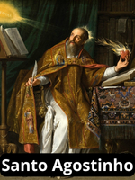
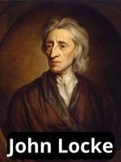
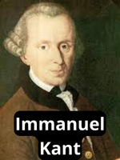

# Principais Teóricos de Relações Internacionais

## Antiguidade Clássica (c. 460–347 a.C.) 

| Teórico | Descrição | Frase / Obra Principal |
|----|----------|------------|-----------------|----------------|
| | **Tucídides** (460–401 a.C.) O **Estado** é o **ator principal**. O Estado é um **ator unitário**: ele age com **uma voz única**. Os tomadores de decisão são **racionais**. A guerra é causada pela mudança na distribuição de poder (o recrudescimento do poder de Atenas, gerou temor em Esparta, o que tornou a guerra inevitável). Considerado um **precursor do Realismo**. Preocupava-se com **questões de segurança** – a necessidade do Estado de se **defender dos inimigos, tanto externos como internos** | **“Os fortes fazem o que podem e os fracos sofrem o que devem.”**   📚 *História da Guerra do Peloponeso* |
|  |**Platão** (427–347 a.C.) Filosofia Clássica / Influência para o Realismo/Radicalismo. No **“Estado perfeito”**, os governantes devem ser **reis-filósofos** detentores de conhecimentos superiores de filosofia e guerra. A força vital humana é a **inteligência**. Introduziu a <mark>**análise de classe**</mark> e o <mark>**raciocínio dialético**</mark> (diálogo que leva a contradições nas premissas originais), que seriam bases futuras para os analistas **Marxistas (Radicalismo)**. | **“A justiça só é possível quando cada classe cumpre seu papel.”**  📚 *A República* |
|  | **Aristóteles** (384–322 a.C.) *Filosofia Clássica / Empirismo Político* Buscou um sistema político **internamente equilibrado**.<u>  Substância (a busca de um sistema político interno ideal) e ao método (o método comparativo)  A ascensão e queda dos Estados resultam de **fatores internos**</u>. Analisou 168 constituições e defendeu o estudo comparado de constituições e o governo misto como ideal. |  **“O homem é, por natureza, um animal político.”**  📚 *Política* |

## Período Medieval (c. 354–430 d.C.)

| Teórico | Descrição | Frase / Obra Principal |
|----------|------------|-----------------|----------------|
|  | **Santo Agostinho** (354–430) Seis séculos após Tucídides, Agostinho enxergava a humanidade como **falha, egoísta e egocêntrica**, embora não predestinada a ser assim Atribuiu a culpa das guerras a essas características humanas fundamentais. Embora realistas posteriores questionem a justificativa bíblica dada por Agostinho para a natureza falha e egoísta da humanidade, poucos põem em dúvida o fato de que os humanos são, em essência, **ávidos por poder e absortos em si mesmos**. | **Realismo**  ***“Todo ato é um ato de autopreservação da parte dos indivíduos.***”  📚 A Cidade de Deus |

## Séculos XVI–XVII

| Teórico | Descrição | Frase / Obra Principal |
|----------|------------|-----------------|----------------|
| | **Nicolau Maquiavel** (1469–1527)  O filósofo italiano Maquiavel aprofundou as implicações da **natureza falha da humanidade** para o Estado. Ele é considerado um dos **Principais Teóricos do Realismo**.  Sua obra elucida as qualidades necessárias ao líder para assegurar a **força e a segurança do Estado**. Defende que o líder deve permanecer sempre **atento a ameaças** tanto à sua segurança pessoal quanto à do Estado, advertindo contra a **excessiva contenção**. É lembrado por sua defesa do uso hábil de <mark>**alianças e de estratégias ofensivas e defensivas para proteger o Estado**</mark>. |"Os fins justificam os meios"   **“O príncipe responsável deve estar preparado para tomar qualquer iniciativa, desde que tenha em vista a preservação do Estado.”**  📚 *O príncipe* |
|  | **Jean Bodin** (1530–1596)  Filósofo francês que contribuiu para o desenvolvimento do conceito de **soberania**. A soberania é um conceito fundamental nas relações internacionais contemporâneas. Para Bodin, a soberania **não reside em um indivíduo, mas em um Estado**. Ele forneceu o arcabouço conceitual da soberania que emergiria dos Tratados de Vestfália (1648). A soberania, embora idealmente absoluta, é restringida pela lei divina, pela lei natural e pelas "leis constitucionais do reino". | **Soberania** era o **“poder absoluto e perpétuo investido em uma comunidade”**.  Soberania é a **“marca distintiva do soberano”**, que faz as leis para seus súditos e revoga as existentes. |
|  |**Thomas Hobbes** (1588–1679)  Filósofo político inglês. Suas ideias são centrais para o Realismo. Ele imaginou um **estado de natureza** (mundo sem autoridade governamental). Nesse estado, os seres humanos seriam governados por paixões e viveriam em constante incerteza quanto à sua segurança. Extrapolando para o nível internacional, na ausência de autoridade, a sociedade encontra-se em **“estado de natureza” ou anarquia**. Para Hobbes, a vida do Homem é “solitária, egoísta e mesmo brutal.”**   Sistema Internacional é **Anárquico**. A solução para o dilema da guerra perpétua interna é o surgimento de um **Estado unitário – um Leviatã –** em que o controle do poder é centralizado e absoluto (Hegemonia). | **“O homem é lobo do próprio homem.”**  Na anarquia internacional, a norma para os Estados é **“ter as armas apontadas e os olhos fixos uns nos outros”**.  📚 *O leviatã* |

## Século XVIII (Iluminismo)

| Teórico | Descrição | Frase / Obra Principal |
|----------|------------|-----------------|----------------|
|  |**John Locke** (1632–1704)  **Liberalismo (Fundamento)** O Estado é uma instituição benéfica, criada por **homens racionais** para proteger seus **direitos naturais** (vida, liberdade e propriedade). Locke argumentou que o **poder político reside nas mãos do povo**, não do monarca, e o líder deriva sua legitimidade do **consentimento dos governados**. | O homem é essencialmente bom.   *Dois tratados sobre governo* |
|  |**Montesquieu** (1689–1755)  Liberalismo (Otimismo Iluminista)  Expressa o **otimismo iluminista**. A **guerra é um produto da sociedade**, e não um atributo inerente aos indivíduos. A **educação é imprescindível** para superar os problemas da sociedade. Argumentava que em tempos de paz, cada nação deve fazer todo o bem que puder às demais. | “em tempos de paz, cada nação deve fazer todo o bem que puder às demais — e, em tempos de guerra, deve causar o mínimo de dano possível, sem prejudicar seus reais interesses”. "A guerra é produto da sociedade"   📚 *O Espírito das Leis* |
|   |**Jean-Jacques Rousseau** (1712–1778)  Liberalismo **(Contrato Social)** / **Radicalismo** Radicalismo (Influência) Descreveu o **estado de natureza como egocêntrico**, onde a preocupação primária do homem é a autopreservação. Em contraste com Hobbes, ele vislumbrou uma solução diferente, preferindo a criação de **comunidades menores** por meio do **contrato social**. Nesses espaços, os indivíduos se unem sob a direção da **"vontade geral"** para cumprir o bem comum. Seu trabalho apresenta o **dilema do cervo e da lebre**, que questiona se os Estados visam a interesses de curto prazo ou reconhecem os benefícios do interesse comum. | *Discurso sobre a origem e os fundamentos da desigualdade entre os homens* |
|   |**Immanuel Kant** (1724–1804)  Base da Escola Idealista / Liberalismo (Fundamento da Paz Democrática) Postulou que a **anarquia internacional pode ser superada** por meio de **ação coletiva** (Homem: Egoísta, mas pode aprender universalismo). Vislumbrou uma **federação de Estados (repúblicas)** vinculadas pelo Estado de Direito para alcançar a paz perpétua (ordem federal é “superleviatã”). Argumentou que a disseminação da democracia mudaria a política internacional ao eliminar a guerra, pois o público, que arca com o ônus dos embates, seria cauteloso em apoiá-la (teoria da **Paz Democrática**). Não exigia atores morais; supunha que os Estados agiriam por interesse próprio, sendo levados a uma zona de paz em expansão, mesmo por "demônios racionais". | *Ideia para uma história universal*, *A paz perpétua* |
|   |**Adam Smith** (1723–1790)  Liberalismo Econômico (Capitalismo) Argumentou que os indivíduos, ao buscarem seus próprios interesses, são guiados por uma **"mão invisível"** para o bem coletivo (aumento da riqueza). Deve-se permitir o **livre comércio**, sem regulamentações estatais excessivas. O livre comércio gera uma **interdependência** entre os Estados que **eleva o custo da guerra** e reduz sua probabilidade de ocorrência. | *Uma inquirição sobre a natureza e causas da riqueza das nações* (*A riqueza das nações*) |

## Século XIX e Início do Século XX

| Teórico | Descrição | Frase / Obra Principal |
|----------|------------|-----------------|----------------|
|  |**Karl Marx** (1818–1883)  Radicalismo / Marxismo Sua obra é **fundamental para todo o pensamento radical**. Baseou sua teoria na **mudança econômica e no conflito de classes econômicas**. No sistema capitalista, interesses privados controlam o trabalho, e a sociedade é dividida em duas classes econômicas: a **burguesia** (proprietária dos meios de produção) e o **proletariado** (mão de obra explorada). Prevê um **choque inevitável** entre essas classes, resultando na vitória do proletariado e no surgimento de uma nova ordem socialista. Presume a **primazia da economia** para explicar virtualmente todos os outros fenômenos. Para os radicais, o Estado é um **agente do capitalismo internacional** e o sistema internacional é **altamente estratificado**. | Não há obra principal específica citada nas fontes, mas seu pensamento está baseado em sua teoria sobre a evolução do capitalismo. |
|   |**John A. Hobson** (1858–1940)  Radicalismo **Condenava o imperialismo** como irracional, arriscado e potencialmente conflituoso, embora não o visse como necessariamente inevitável. Teorizou que a expansão imperialista é impulsionada por **três condições nos Estados mais desenvolvidos**: **superprodução** de bens e serviços, **subconsumo** (devido aos baixos salários das classes mais baixas) e **excesso de poupança** pelas classes mais altas. A expansão para o exterior visa resolver esses problemas econômicos, encontrando novos mercados e mantendo baixos os salários internos. | Não há obra principal específica citada nas fontes. |
|   | **V. I. Lênin** (1870–1924)  Radicalismo / Marxismo Para Lênin e outros marxistas, o problema capitalista não é de demanda insuficiente, mas de **taxas decrescentes de retorno sobre o capital**. Postulava que o **Imperialismo** é a **busca inevitável de novas fontes de matérias-primas** e, portanto, **necessariamente resulta em guerra** entre Estados capitalistas pelo controle de regiões em desenvolvimento. Os Estados capitalistas dependem de mercados e recursos externos devido à sua distribuição desigual. | Não há obra principal específica citada nas fontes, mas as fontes mencionam sua reinterpretação do Marxismo ligando o imperialismo à guerra. |
|   |**Woodrow Wilson** (1856–1924) Idealismo / Liberalismo Foi o principal propositor do **idealismo wilsoniano** no século XX. Sua premissa básica era que a **guerra pode ser evitada por meio da ação coletiva dos Estados**. Defendeu a **autodeterminação** para grupos nacionais, a **diplomacia aberta** e a **remoção de barreiras econômicas** entre as nações para manter a paz. Propôs uma ordem internacional assegurada pela **Liga das Nações**, baseada na **segurança coletiva** (agressão de um Estado seria combatida pela reação coletiva automática). | **Pacto da Liga das Nações** (faz parte dos seus Quatorze Pontos). |

##  Pós-Segunda Guerra Mundial (Realismo Clássico)
**George Kennan** (1904–2005) | Realismo Baseou-se em Morgenthau.  Arquiteto da política de **Contenção**. Baseou sua análise no equilíbrio de poder, buscando impedir a expansão soviética e evitar a guerra. | Foreign Affairs, o célebre artigo “X”. | Sua tese foi a pedra angular da política externa dos Estados Unidos durante a Guerra Fria.

**Hans Morgenthau** (1904–1980) | Realismo Clássico | A política internacional é caracterizada como uma **luta por poder**. O **interesse nacional** é definido em termos de poder. A moralidade é determinada pelas consequências políticas. | *Política entre nações*. | Sua obra sintetizou o Realismo, tornando-o a teoria dominante pós-Segunda Guerra Mundial, em contraste com o Idealismo anterior.

| Teórico | Perspectiva | Descrição | Obra / Ideia Principal |
| :---: | :---: | :--- | :--- |
| **Henry Kissinger** (1923) | Realismo Clássico Realismo Baseou-se em Morgenthau.  Estudioso e assessor de política externa que **baseava suas recomendações políticas na teoria realista**. Ele incentivou o **equilíbrio de poder do realismo clássico** na década de 1970. | Promoveu o equilíbrio de poder para contrabalançar potências rivais (exemplo: apoio à China e ao Paquistão contra a União Soviética e a Índia). |
| **Paul Kennedy** | Realismo (Estabilidade Hegemônica) | Em sua obra *Ascensão e queda das grandes potências*, argumenta que a **unipolaridade (hegemonia)**, quando o ator dominante se dispõe a agir, leva ao sistema internacional mais estável. Ele cita a hegemonia da Grã-Bretanha no século XIX e a dos EUA após a Segunda Guerra Mundial como exemplos de estabilidade hegemônica. | Teoria da Estabilidade Hegemônica, que se alinha ao Realismo ao enfatizar a distribuição de poder, mas diverge do Neorrealismo (como o de Waltz) quanto à polaridade mais estável (defende unipolaridade). Ele postula que a **unipolaridade** – a predominância de uma única superpotência que se dispõe a impor normas – é a estrutura que proporciona a **maior estabilidade** ao sistema internacional. |

## **Pós-Guerra Fria (Neorrealismo/Realismo Estrutural)

| Teórico | Perspectiva | Descrição | Obra / Ideia Principal |
| :---: | :---: | :--- | :--- |
| **John Mearsheimer** (1947–) | Realismo / Neorrealismo | Realista ofensivo que argumenta que o mundo **sentiria falta da estabilidade e previsibilidade** do sistema bipolar da Guerra Fria. Ele defende que a anarquia no sistema internacional implica a ausência de uma autoridade central, o que ele chama de **“problema da chamada de emergência”**. Para ele e outros realistas, a guerra contra o Iraque em 2003 era dispensável, pois qualquer ameaça de Saddam poderia ter sido **contida eficientemente** pelo poderio militar dos EUA. No contexto da Guerra do Iraque em 2003, Mearsheimer e Stephen Walt argumentaram, de uma perspectiva realista (ofensiva e defensiva, respectivamente), que **a guerra não era necessária**. Seu trabalho também aborda o conceito de anarquia, que ele descreve como o **"problema da chamada de emergência"** (ou "911 problem"), referindo-se à ausência de uma autoridade central à qual um Estado ameaçado possa recorrer em busca de ajuda. | Crítico da Guerra do Iraque de 2003; Anarquia e o “Problema da Chamada de Emergência”. |

**Kenneth N. Waltz** (1924–2013) | Neorrealismo / Realismo Estrutural Dá primazia à **estrutura do sistema internacional** como fator explanatório (anarquia e distribuição de poder/polaridade). Argumenta que a **bipolaridade** é a estrutura mais estável. Anarquia do SI que justifica o comportamento dos Estados. | *Teoria das relações internacionais*, *O homem, o Estado e a guerra*. Primeiro a usar os níveis de análises (individual estado e internacional). A estrutura do SI é seu princípio ordenador -a presença ou auseĉnaide uma autoridade abrangente e a Distribuiçlão de Recursos entre os Estados| Criou o Neorrealismo, simplificando o Realismo clássico e conferindo-lhe maior rigor teórico. Influenciou a análise do sistema internacional em termos de polaridade (multi/bi/uni). |
J. David Singer (1925–2009)
Cientista político que, junto com Melvin Small, iniciou o projeto Correlatos da Guerra (Correlates of War - COW) a partir de 1963.
Fundamental para o desenvolvimento da abordagem behaviorista e quantitativa nas RI. Sua motivação era a preocupação filosófica normativa: como conquistar a paz?. Ampliou os níveis de análises (individual, estado e internacional_ usados por kenneth Walts. Quanto maior o número de alinaças forjadas, mais guerra. Quanto mais proximo da bipolaridade, mais guerra.)

**Robert Gilpin** (1930–) | Realismo (Ciclos Hegemônicos) | Examina ciclos de ascensão e queda de potências dominantes. A decadência do Estado hegemônico é causada por fatores econômicos (custos de império, declínio de investimento, difusão de tecnologia). Grande importância ao Poder Economico. Mudanças podem ocorrer por diferentes taxas de crescimento (redistribuiçlão de poder). O desequilíbrio substituiu o equilíbrio e o mundo parte para uma nova rodada de conflito hegemnico. As caracteristicas do SI podem ser alterads pela atitude de poucos. | *War and Change in World Politics*. | Uma reinterpretação realista que introduz a dinâmica cíclica da mudança sistêmica, focando no poder econômico. |

## Pós-Guerra Fria (Neoliberalismo)

| **John G. Ikenberry** | Institucionalismo Neoliberal / Liberalismo | Defende que o realismo **não explica a estabilidade pós-Guerra Fria**. Vê o sistema internacional como uma **ordem internacional liberal**. Argumenta que uma potência dominante deve **estabelecer regras duráveis e legítimas** que limitem sua própria autonomia para que atendam aos interesses de longo prazo do Estado principal. Ele critica o realismo, argumentando que este **não consegue explicar a estabilidade duradoura** que se seguiu ao colapso da União Soviética. | *After Victory* (Implica que as instituições pós-guerra são cruciais para a estabilidade). |

| **Francis Fukuyama** | Liberalismo | Vê o fim da Guerra Fria como a **vitória do liberalismo internacional**. Argumenta que existe a possibilidade da **“universalização da democracia liberal ocidental como forma final de governança humana”**. | Universalização da democracia liberal. |

**R. Keohane** (1941–) e **J. Nye** | Institucionalismo Neoliberal / Liberalismo | O sistema internacional é **interdependente**. Os Estados cooperam em anarquia porque a **interação contínua** torna a colaboração racional (**dilema do prisioneiro repetido**). As **instituições** facilitam a cooperação, reduzem custos de transação e fraude, e ampliam o fluxo de informações. | *Poder e interdependência*. | Renascimento do Liberalismo pós-1970. Sua visão contrasta com o pessimismo realista sobre a cooperação, ao focar nos ganhos mútuos absolutos (em vez de ganhos relativos).

## Pós-Guerra Fria (Radicalismo)

**Teóricos da Dependência** (Ex: Prebisch, Faletto, FHC) | Radicalismo / Teoria da Dependência | A estrutura internacional é hierárquica e exploradora. As **Corporações Multinacionais (CMNs)** e bancos são agentes de penetração que mantêm as relações de dependência. Estados periféricos (Sul) têm poucas opções, cooptados pelas elites internas. | N/A | Base do pensamento radical latino-americano. Concentra a análise na **estratificação** econômica do sistema, causada pelo capitalismo.

## Pós-Guerra Fria (Behaviorismo / Método Científico)

## Pós-Guerra Fria (Pós-Modernismo / Abordagens Alternativas. )

Cynthia Weber

Sua análise de soberania desafia o entendimento convencional de filósofos tradicionais.

Pesquisadora que trabalha com a desconstrução de conceitos básicos, como a soberania, mostrando que suas conceituações estão em constante mutação, de acordo com as exigências do momento.

## Pós-Guerra Fria (Construtivismo)

| Teórico | Perspectiva | Contribuição / Ideia Principal | Nível de Análise / Contexto |
| :---: | :---: | :--- | :--- |
| **J. Ann Tickner** | Feminismo (Teoria Crítica) | Argumenta que o Realismo Clássico se baseia em concepções **extremamente limitadas e masculinas** de natureza humana e poder. Defende uma reorientação da teoria de Relações Internacionais (RI) para uma noção mais abrangente de poder como **capacidade de agir em consonância e conexão** (não apenas dominação e autonomia). | Crítica às premissas do Realismo e redefinição do conceito de poder. |
| **Cynthia Enloe** | Feminismo (Teoria Crítica) | Teórica feminista que, juntamente com Tickner e Sylvester, questiona as premissas masculinas do discurso teórico em RI. Seu trabalho busca um **olhar mais humanista** para a segurança e saúde mundial. | Busca uma compreensão mais produtiva das ameaças e soluções, destacando a necessidade de maior participação feminina na elaboração de políticas. |
| **Ted Hopf** | Construtivismo | Argumenta que as **estruturas do sistema não são determinadas apenas por fatores materiais** (como a distribuição de poder). Para prever resultados em situações de crise, é preciso **conhecer a cultura, normas, instituições e práticas sociais** que constituem os atores e a estrutura. | Ilustra o Construtivismo, mostrando que a anarquia é o que os Estados fazem dela. |
| **Karen T. Litfin** | Pós-modernismo / Construtivismo | Demonstra como as **normas de soberania se modificam** para se adequar a questões como a destruição do meio ambiente, embora esse processo seja controverso. | Demonstra o caráter mutável dos conceitos centrais de RI (como a soberania), que são condicionados pelo tempo, lugar e circunstâncias históricas. |
| **Martha Finnemore** | Construtivismo | Argumenta que o **conceito de sistema internacional é uma ideia europeia** e que as estruturas materiais não explicam tudo. Sugere que o que define uma ordem internacional (ex: um concerto vs. Guerra Fria) não é a distribuição de recursos materiais, mas sim os **"significados compartilhados e as interpretações"** impostas pelos participantes. | Analisa como as normas sociais mudam através de coerção, direito, movimentos sociais e instituições internacionais. |

**Alexander Wendt** (1958–) | Construtivismo | A realidade não tem significado fixo ou inerente; o significado é **construído socialmente através da interação** (discurso). **"Anarquia é o que os Estados fazem dela"**. Identidades e interesses dos Estados são maleáveis e transformáveis por meio de normas e ideias. | *Social Theory of International Politics*. | Estabelece uma ruptura com o materialismo do Realismo e Liberalismo, focando no **poder das ideias, da cultura e da linguagem** (poder discursivo). |

## Teóricas Feministas

(Ex: Tickner, Enloe) | Feminismo (Crítica) | O discurso teórico é dominado por uma perspectiva masculina. O poder deve ser definido como capacidade de agir em **consonância e conexão** (não apenas dominação e autonomia). Questionam o conceito de "ameaça". | N/A | Vertente crítica que questiona as premissas masculinas do Realismo clássico e buscam um olhar mais humanista para a segurança e a saúde mundial. |

Christine Sylvester

Sua investigação foca em encontrar as vozes dos "outros", daqueles indivíduos marginalizados nas relações internacionais.

Stephen Walt (1955–)

Cientista político que enfatiza que nenhuma perspectiva sozinha pode captar a complexidade da política mundial contemporânea e defende que "é bem melhor dispormos de um conjunto diversificado de ideias concorrentes".
As guerras não beneficiam estados que iniciam guerradas. Realismo Defensivo.

Teoria das Relações Internacionais (Meta-Teoria). Sua citação é usada para justificar a necessidade de se estudar múltiplas abordagens teóricas (realismo, liberalismo, radicalismo, construtivismo).

Joshua Goldtein
A análise de Goldstein mostra que a frequência e a intensidade das guerras interestatais caíram vertiginosamente nas últimas quatro décadas — a ponto de ele considerar que “a guerra contra a guerra está vencida”

### Detalhamento das Contribuições

#### Teóricas Feministas (Tickner e Enloe)
J. Ann Tickner e Cynthia Enloe são figuras centrais na **Teoria Feminista** das Relações Internacionais, que está relacionada com o **Construtivismo**.

*   **Tickner** critica o Realismo Clássico por se basear em noções **masculinas** de natureza humana (egoísta e em busca de poder) e poder (dominação e controle físicos). Ela propõe uma redefinição do poder, que deve incluir a **capacidade de agir em consonância e conexão** (ou seja, relações simbióticas), e não apenas em conflito ou autonomia.
*   A perspectiva feminista de **Enloe** (juntamente com Tickner e Christine Sylvester) defende que o discurso teórico foi dominado por uma visão masculina. Elas argumentam que uma **maior participação das mulheres** nos processos de formulação de políticas poderia levar a uma compreensão mais produtiva das ameaças e soluções.

Essa abordagem sugere que o foco tradicional em ameaças agudas e diretas, em detrimento de questões crônicas e indiretas (como a infraestrutura de saúde), pode ser um reflexo da **perspectiva masculinista** das comunidades epistêmicas e burocracias estatais.

#### Construtivistas (Hopf, Litfin e Finnemore)
Esses teóricos contribuíram para a perspectiva **Construtivista**, que enfatiza a natureza social e intersubjetiva da política internacional.

*   **Ted Hopf** ilustra que a estrutura, mesmo em situações aparentemente determinadas (como um incêndio em um teatro), torna-se **indeterminada** na ausência de normas e práticas sociais. Ele argumenta que para determinar o resultado, é preciso **conhecer a cultura, as normas e as instituições**, e não apenas a distribuição de poder material (crítica direta ao Realismo). No contexto da política internacional, isso leva à famosa proposição de que **"a anarquia é o que os Estados fazem dela"**.
*   **Karen T. Litfin** aplica a lente pós-modernista para mostrar a mutabilidade dos conceitos básicos. Especificamente, ela demonstra como as normas de **soberania** se alteram para incorporar as preocupações com a **destruição do meio ambiente**. Ela concorda que as conceituações de soberania estão em **constante mutação**, conforme as exigências do momento e os valores de diferentes comunidades.
*   **Martha Finnemore**, em *The Purpose of Intervention*, sugere que o conceito de sistema internacional é um **constructo social e uma ideia europeia**. Ela argumenta que o que distingue diferentes ordens internacionais (como o Concerto Europeu do século XIX e a Guerra Fria do século XX) não é primariamente a distribuição de recursos materiais, mas sim os **significados compartilhados** e as interpretações que os atores impõem a esses recursos. Finnemore enfatiza o papel das normas sociais e da cultura no moldar da política de segurança nacional.

#### Realismo/Estabilidade Hegemônica (Paul Kennedy)
**Paul Kennedy**, em *Ascensão e queda das grandes potências*, está associado à **Teoria da Estabilidade Hegemônica**, uma vertente que se encaixa na tradição realista.  Ele cita as hegemonias britânica (século XIX) e americana (pós-Segunda Guerra Mundial) como períodos de estabilidade. Essa visão diverge do Neorrealismo, que muitas vezes defende que a bipolaridade é a forma de sistema mais estável. Kennedy também destaca que a **perda de recursos materiais** por parte do Estado hegemônico (por exemplo, devido a custos de império ou difusão de tecnologia, conforme Robert Gilpin) pode comprometer a estabilidade do sistema.