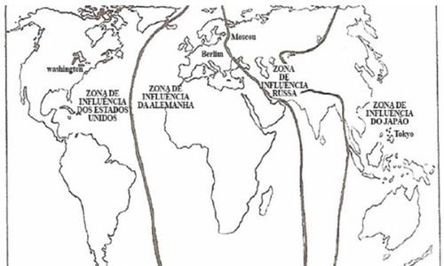

`NOTA: este resumo é o do CC (IM) Mello e CC (IM) Marques com poucos ajustes. O original foi confeccionado à luz da leitura dos livros “Geopolítica e Modernidade – Geopolítica Brasileira” (MATTOS), “Novas Geopolíticas” (VESENTINI) e “A Vingança da Geografia: a construção do mundo geopolítico a partir da perspectiva geográfica” (KAPLAN). Aproveitou-se, também, os resumos do CC Lázaro, do CC (FN) Pessanha e do CC Dibo.`

# LIVRO: GEOPOLÍTICA E MODERNIDADE – GEOPOLÍTICA BRASILEIRA (MATTOS, Carlos de Meira, pág 15 a 148)
## PARTE I - FUNDAMENTOS E MODERNIDADE DA GEOPOLÍTICA

### Cap I – As Raízes da Geopolítica
A Geopolítica não foi invenção de políticos sedentos de mando, buscando uma justificativa científica para satisfazer sua ambição de poder. A Geopolítica é o produto da evolução da observação gradual da ação do homem na exploração do meio natural, percorrendo o caminho iniciado no estágio de atenção normativa até se consolidar em conhecimento sistemático e, daí, em teoria positiva.

Galileu, em seu livro *Discorsi i Dimonstrazioni Mathematiche*, desenvolveu a teoria do método experimental. Aplicando-o, o filósofo Francis Bacon, em 1620, lançou a sua obra clássica *Novum Organon*, na qual abriu a porta para a consagração científica das Ciências Sociais.

A Geopolítica, antes de ter um nome que a caracterizasse como ramo de conhecimento distinto, foi precedida pelas observações sobre a influência da geografia na ação do homem sobre a Terra.

Assim, Heródoto observou a influência do clima e da natureza do solo no progresso dos grupos humanos. Hipócrates realça a importância do ar, da água e da posição geográfica sobre a atividade do homem. Platão e Aristóteles indicaram as vantagens e desvantagens das populações quando litorâneas ou interioranas. Estrabão, na sua Geografia, indica a posição geográfica da Itália como fator importante para o sucesso do Império Romano. Na Idade Média, surge a tentativa pré-científica do geógrafo **Jean Bodino**📌 de ordenação do pensamento geográfico-político, valorizando a relação Estado-meio físico. Contribuições valiosas ao encaminhamento da reflexão normativa sobre esta correlação dos dois fatores acima referidos encontramos nas obras de **Emmanuel Kant, Montesquieu e Hegel**📌. Este último, no seu livro Filosofia da História, dedica um Capítulo inteiro à “Base Geográfica da História". Nesse Capítulo, Hegel desenvolve vasta e erudita apreciação sobre a influência da geografia na modelação do homem político e da sociedade política. Napoleão Bonaparte, no apogeu de sua glória, sentenciou: ***"A Geografia indica o destino das nações”***.

As opiniões acima vieram ordenando uma reflexão normativa sobre a relação <u>política-geografia</u>, possibilitando o surgimento, no campo das ciências, sucessivamente, da Geografia Humana (ou Antropogeografia), da Geografia Política e, finalmente, da Geopolítica.

<u>O final do século XIX e primeiras décadas do século XX</u> marcaram a época do grande progresso nos estudos das ciências sociais e da ciência geográfica. No campo da Geografia, surgiram, na Alemanha, os livros Antropogeografia e *Geografia Política*, de **Friedrich Ratzel**📌, e a obra pioneira *Geopolítica*, de **Rudolf Kjellen**📌 (*Sueco, pai do termo Geopolítica - As grandes Potências-1905*), <u>esta já transpassando a Geografia Política, estática, panorâmica, para um cenário vivo, movimentado, prospectivo</u>. Comparando, Ratzel disse que a Geografia Política era como a fotografia, enquanto a Geopolítica era a cinematografia. <u>É o produto da interação dinâmica dos três fatores: **Política**, **Geografia** e **História**</u>, conduzindo a uma prospectiva dos acontecimentos do Estado. A Geopolítica teria que se desprender da área das Ciências Geográficas e vir a ocupar o seu lugar como um dos ramos da Ciência Política.

Das obras pioneiras de Ratzel e Kjellen, ressaltamos alguns conceitos que se destacaram <u>por sua projeção no tempo</u>. Ratzel, no seu ***livro Leis do Crescimento Territorial dos Estados***, lançou as famosas **"Sete Leis do Expansionismo"**💡:

#### Sete Leis do Expansionismo

| Nº | Lei                                                                                                                                            |
|----|------------------------------------------------------------------------------------------------------------------------------------------------|
| 1  | O espaço dos Estados deve crescer com a sua cultura.                                                                                           |
| 2  | O crescimento dos Estados apresenta outros sintomas de expansão: ideias, intercâmbio comercial, atividades missionárias.                       |
| 3  | O crescimento do Estado manifesta-se pela adição de novos estados, dentro do processo de amalgação.                                            |
| 4  | A fronteira é o **órgão periférico do Estado** e, como tal, prova do crescimento, da força e das mudanças desse organismo.                         |
| 5  | Em seu crescimento, o Estado luta pela absorção de áreas politicamente valiosas: litorais, planícies, regiões ricas em recursos.               |
| 6  | O primeiro impulso de crescimento territorial chega ao Estado primitivo de fora, de uma civilização superior.                                  |
| 7  | A orientação geral da amalgação transmite a tendência de crescimento territorial de Estado para Estado e aumenta esta tendência no processo de transmissão (é como um apetite que vem comendo). |

**Autores alemães** formaram uma "escola", chamada **“determinista"**, pois consideraram a preponderância do fator geográfico no estudo da interação homem-geografia (o fator geográfico seria determinante no processo civilizatório). Nos primeiros anos do século XX, **autores franceses** Vidal de La Blache, Brunhes e Vallaux, todos de substância teórica, tendentes a considerar o fator geográfico, na interação acima citada, menos ponderável que o fator político. Criaram uma escola chamada **"possibilista”**, em contraposição à escola alemã, "determinista".

#### Determinismo (Alemão) x Possibilismo (Francês)
| Aspecto                          | Autores Alemães (Escola Determinista)                                                                 | Autores Franceses (Escola Possibilista)                                                                 |
|----------------------------------|--------------------------------------------------------------------------------------------------------|----------------------------------------------------------------------------------------------------------|
| **Período**                      | Final do século XIX                                                                                    | Primeiros anos do século XX                                                                             |
| **Principais Autores**           | Autores alemães                                                            | Vidal de La Blache, Brunhes e Vallaux                                                                   |
| **Ideia Central**                | O fator geográfico é **determinante** no processo civilizatório.                                       | O fator geográfico é **menos ponderável** que o fator político na interação homem-geografia.             |
| **Relação entre Homem e Geografia** | A geografia **determina** o desenvolvimento das civilizações.                                          | O homem **atua com liberdade relativa**, aproveitando as possibilidades oferecidas pelo meio geográfico. |

Vários autores pragmáticos, factuais, intuitivos produziram verdadeiros clássicos da Geopolítica. Dentre eles cita-se o Almirante norte-americano **Alfred Thayer Mahan**📌, autor de *Influência do Poder Naval na História (1890)*, e o inglês **Halford J. Mackinder**📌, que publicou *Democratic Ideals and Reality e Geographical Pivot of History (1904)*.

<u>Mahan e Mackinder</u> são considerados inspiradores, respectivamente, da <u>política do Poder Marítimo</u> e da <u>política do Poder Continental</u>. O inglês Mackinder, desejoso de alertar os políticos britânicos para o perigo de vir a se criar no continente europeu um poderoso núcleo político que viesse ameaçar o seu país, formulou uma <u>teoria de poder mundial</u>, baseada na <u>amalgação da massa continental europeia</u> em torno de uma área central, a <u>“área pivô” (Heartland)</u>. A <u>polarização política da massa continental europeia</u>, constituindo um único poder, formaria a <u>“ilha mundial”</u>, em torno da qual as áreas adjacentes — o <u>“Crescente Interior” e o “Crescente Exterior”</u> — teriam que se submeter. <u>Estaria criado o ambicionado poder mundial único</u>, com base no domínio da região central continental.

Esta concepção mackinderiana, sobre a possibilidade de criação de um Poder Mundial tendo como centro uma base continental, contrariava a teoria anterior do Almirante Mahan, que concebera um Poder Mundial baseado no domínio dos mares, segundo o lema "quem dominar os mares dominará o mundo".

#### Heartland (Mackinder) x Rimland (Mahan)
| Aspecto                          | **Teoria do Poder Marítimo – Mahan (Rimland)**                                            | **Teoria do Poder Continental – Mackinder (Heartland)**                                        |
|----------------------------------|--------------------------------------------------------------------------------------------|------------------------------------------------------------------------------------------------|
| **Autor**                        | Alfred Thayer Mahan (EUA)                                                                 | Halford J. Mackinder (Reino Unido)                                                             |
| **Obras Principais**             | *The Influence of Sea Power upon History* (1890)                                          | *Democratic Ideals and Reality* (1919) e *The Geographical Pivot of History* (1904)            |
| **Base Geopolítica**             | **Poder Marítimo** – domínio das rotas oceânicas e das áreas costeiras                    | **Poder Continental** – controle da massa territorial euroasiática, o “Heartland”              |
| **Lema Central**                 | “Quem dominar os mares dominará o mundo.”                                                 | “Quem dominar o Heartland dominará a Ilha Mundial; quem dominar a Ilha Mundial dominará o mundo.” |
| **Área Estratégica**             | **Rimland** – faixas litorâneas e regiões periféricas do continente                       | **Heartland** – área central da Eurásia (“área pivô”)                                          |
| **Concepção de Poder Mundial**   | O poder decorre do **controle marítimo e do comércio internacional**                      | O poder decorre do **domínio territorial e da coesão continental**                             |
| **Risco Identificado**           | Perda do controle dos mares significaria a decadência do poder global                     | Unificação política do continente europeu criaria um **poder mundial único**                   |
| **Orientação Estratégica**       | Expansão naval, bases marítimas e rotas comerciais                                        | Expansão territorial e controle das rotas terrestres                                           |

*Teoria do Heartland de Mackinder: a área pivô (Heartland) no centro da Eurásia, cercada pelo Crescente Interior (Inner Crescent) e pelo Crescente Exterior (Outer Crescent)*

No período de entre guerras, desenvolveu-se um processo de refutação e progressiva desobediência do governo de Berlim ao Tratado de Paz de Versalhes. Nesse clima de inquietação e de frustração da nação alemã, nasceu a liderança de Hitler.

#### Haushofer - Ordem Mundial Ideal
Nesse período, a Geopolítica alemã atingiu grande prestígio no país graças às obras do **General Karl von Haushofer**📌, professor da Universidade de Munique. Haushofer criou na referida universidade o Instituto de Geopolítica, cujos estudos empolgaram o espírito de Hitler e dos principais líderes do Partido Nazista.

O imperialismo da Alemanha de Hitler buscou, nos estudos acadêmicos do Instituto de Geopolítica de Munique, **um endosso científico para as suas teses expansionistas**. Isto gerou no Ocidente um clima de desconfiança quanto à autenticidade científica da Geopolítica. 

O pensamento geopolítico de Haushofer é uma combinação das teses de Kjellen, Mackinder e Mahan. Visualiza o planeta dividido em **quatro grandes regiões naturais, cada uma submetida a um Estado-Diretor**. Assim discrimina as suas grandes regiões:
 
| **REGIÃO**                       | **ÁREA**                                         | **ESTADO-DIRETOR** |
|----------------------------------|--------------------------------------------------|--------------------|
| Pan-América                      | Continente americano                             | EUA                |
| Eurásia                          | Europa, Oriente Próximo e África                 | Alemanha           |
| Pan-Rússia                       | Rússia, Irã e Índia                              | Rússia             |
| Co-Prosperidade da Grande Ásia   | China, Japão, Coréia, Indonésia e Oceania        | Japão              |

Ao se avizinharem os perigos da Segunda Guerra Mundial, diante da arrogância ameaçadora de Hitler, fundamentando sua ambição expansionista em teses que a justificava, os acadêmicos norte-americanos, então, acordaram para a Geopolítica. 

A partir da década de 1940, surgiram dezenas de estudos e livros de acadêmicos e diplomatas divulgando a Geopolítica germânica e tentando atualizar a teoria de Poder Marítimo deixada por Mahan. Renovaram o pensamento geopolítico norte-americano: Nicholas Spykman e George Kennan. 

Spykman contestou o conceito generalizado nos meios políticos e diplomáticos de que, protegidos por dois oceanos e tendo nas suas fronteiras terrestres dois vizinhos fracos, os Estados Unidos, em termos de segurança, poderiam isolar-se da Europa e da Ásia. Defendeu o conceito geopolítico de que a posição geográfica não representava por si só uma proteção estratégica, e que esta tinha que se basear no equilíbrio de poder, assegurado pela aliança com países amigos. 

#### Teoria da Estratégia de Contenção de Truman

Kennan, mobiliou este conceito de equilíbrio de poder e de alianças lançado por Spykman, oferecendo uma resposta norte-americana à concepção de Poder Mundial de Mackinder, perfilhada pelos alemães. 

A chamada Containment Theory, lançada por Kennan em 1947, dominou a diplomacia norte-americana da Guerra Fria. Baseava-se numa contestação ao conceito de Poder Mundial de Mackinder, assumido por Moscou, de que quem dominasse o heartland dominaria o planeta. O Containment de Kennan poderia, em termos geopolíticos, ser expresso como "quem dominar as regiões costeiras da grande ilha eurasiática (a “ilha mundial"), dominará o heartland. 

Da oficialização deste conceito veio a teoria da estratégia de contenção de Truman e as variadas ações diplomáticas e militares de valorização estratégica das chamadas fringe areas, que resultaram na participação dos Estados Unidos no (1) Pacto no Atlântico, na (2) pressão diplomático-militar sobre a Grécia e Turquia, no (3) engajamento militar nas guerras da Coréia e do Vietnã, no (4) Tratado do Sudeste Asiático e em outras iniciativas de menor vulto.
Sem serem geopolíticos - mas internacionalistas - Brzezinsk e Kissinger vêm inspirando as grandes linhas da Geopolítica e da consequente orientação estratégica da política internacional estadunidense nestes últimos anos.

A União Soviética da Guerra Fria perfilhou a Geopolítica de Mackinder. Sua posição de potência terrestre, localizada no coração continental, ambiciosa por um Poder Mundial, a atraiu naturalmente para a doutrina geopolítica do professor e diplomata inglês.

A ameaça de um isolamento estratégico, em virtude do domínio dos mares pelo Ocidente democrático, inspirou o Almirante russo Gorshkov a criar uma doutrina geopolítica, geoideológica, justificando a instalação de bases navais soviéticas espalhadas em países de governo comunista ou pró-Moscou.
Hoje, vem-se esboçando uma Geopolítica globalista, baseada no controle do universo geográfico por um poder central, que ditaria a todos os países a política mais conveniente à garantia da ordem econômica, da paz e da segurança da humanidade. Observa-se no grupo dos "7 grandes” duas disputas subterrâneas: aceitar ou não como novo membro integral o governo de Moscou e a competição interna de poder entre os Estados Unidos e o grupo europeu. Embora estas discrepâncias venham enfraquecendo a ação política dos "grandes", sua ação de ingerência não tem deixado de acontecer, como foi o caso da agressão ao Estado da Iugoslávia e das pressões intervencionistas que vêm sendo sofridas pelos governos considerados fora de sua receita de comportamento.

 
Visão geopolítica de Spykman, área do Rimland da Eurásia, 
envolvendo o Heartland de Mackinder
Resumo
A Geopolítica foi, durante o século XX, a principal inspiradora da Estratégia de Poder das superpotências políticas. Em termos da disputa pelo poder mundial, assistimos ao constante antagonismo entre as concepções geopolíticas de Poder Terrestre inspiradas pelo inglês Mackinder (The Geographical Pivot of History, 1904) e a do Poder Marítimo, formalizada pelo norte-americano Almirante Mahan (The Influence of Sea upon History, 1890).
Da teoria geopolítica do Poder Terrestre decorreu a estratégia fundamentada no centro do poder mundial situado na área pivô (núcleo central englobando os territórios da Alemanha, Polónia e Rússia), irradiando seu domínio em todas as direções rumo ao mar, em busca da incorporação das faixas litorâneas da imensa massa eurasiática (a grande Ilha Mundial).
Da teoria geopolítica do poder marítimo, nasceu a estratégia baseada no centro do poder mundial localizado no território bioceânico norte-americano (enorme subcontinente debruçado sobre os dois maiores oceanos do planeta) e domínio dos estreitos e passagens oceânicas. Mais tarde, os norte-americanos Spykman e George Kennan acrescentaram à estratégia de Mahan a importância do domínio, também, das fringe areas, faixas costeiras da "Ilha Mundial" eurasiática.
Os cinquenta anos de Guerra Fria viveram a disputa de poder entre os governos de Washington e Moscou, lutando cada um pelo domínio mundial, inspirados na aplicação de sua estratégia - Washington, a de domínio dos mares e das áreas costeiras da massa continental eurasiana; e Moscou, buscando a conquista de toda a Eurásia, através da irradiação do seu domínio a partir da área pivô.
A desagregação da União Soviética, após a queda do Muro de Berlim (1989), resultou no fim deste antagonismo estratégico bilateral e fez surgir os Estados Unidos como superpotência hegemónica. No futuro visível, poderão vir a contestar esta hegemonia de poder norte-americano a China e a União Europeia.
A Federação Russa, núcleo de poder de Moscou que resistiu ao processo de desagregação da União Soviética, está se reestruturando a fim de vir a ocupar o seu lugar no cenário estratégico mundial. Após dez anos de instabilidade política e económica, agora, sob a liderança do Presidente Putin, a Federação Russa anuncia sua nova estratégia: a criação de um centro de poder eurasiático. Isto implica, sem abandonar a sua doutrina geopolítica de Poder Terrestre de Mackinder, a formulação de uma nova estratégia que pretende deslocar a "área pivô”, predominantemente europeia, para uma posição mais a leste, abrangendo maior faixa de território centro-asiático.
É muito cedo para uma análise mais profunda desta estratégia eurasiática anunciada por Moscou. Entretanto, ela deve ter tido sua origem numa nova opção cultural da Rússia, país geograficamente eurasiático. O Imperador Pedro, o Grande, optou, no primeiro quarto do século XVIII, pela adoção da cultura europeia. Desde esta época a política de Moscou tem sido de matiz essencialmente europeu. Ao que tudo indica, após as reflexões revisionistas destes últimos dez anos, os russos, agora, desejam fortalecer as suas raízes asiáticas, equilibrando os estímulos europeu e asiático de seu território e de seu povo. Tratar-se-ia, portanto, de uma revisão de foco cultural, com reflexos na estratégia da nação.

### Cap II - Contribuição do FATOR GEOGRÁFICO para a Formulação da Geopolítica
Afirmamos que a Geopolítica é um ramo da Ciência Política que se formou pela interação dinâmica de três ramos de conhecimento: a Geografia (espaço físico), a Política (aplicação do Poder à arte de governar) e a História (experiência humana).
Conceitua-se, sinteticamente, a Geopolítica como a aplicação da política aos espaços geográficos, sob a inspiração da História. Observemos a importância do espaço geográfico para o seu uso político.
Devemos consignar que o espaço geográfico natural, através dos tempos, vem sendo politicamente enriquecido por instrumentos e adaptações artificiais implantados pelo homo operandi, tais como pontes, túneis etc. Os progressos da ciência e da tecnologia têm oferecido, historicamente, ao homem operativo os recursos que a sua iniciativa pede para vencer as dificuldades encontradas na superação dos obstáculos do meio natural.
Na época em que os principais fundadores da Geopolítica - Friedrich Ratzel, Rudolf Kjellen e Vidal de La Blache - formularam suas teorias, no final do século XIX e primeira década do século XX, o espaço geográfico sobre o qual assentaram seus pensamentos já era beneficiado por instrumentos e técnicas consideradas avançadas. Conhecia-se, a eletricidade, a máquina a vapor, as ferrovias e as comunicações com fio, a engenharia, as técnicas de agricultura e a medicina avançavam.
Este espaço geográfico, em que os instrumentos e as técnicas daquela época inspiraram os fundadores da Geopolítica, supervalorizou-se em termos de recursos artificiais. Hoje, tem-se o domínio do espaço aéreo, do estratosférico e pesquisa o sideral; aviões, mísseis e satélites cruzam os espaços transportando pessoas, engenhos científicos de observação, equipamentos fotográficos e, também, armas poderosas. A tecnologia eletrônica e as comunicações permitem a instantaneidade das mensagens sonoras e visuais, alcançando qualquer parte da Terra. A informática, a Internet, dominam o campo da informação mundial, utilizadas pela política, comércio, operações bancárias e fins militares. A urbanização disseminou-se e criou imensos núcleos populacionais superpovoados. Não resta dúvida que o espaço artificial, assim enriquecido, precisa ser reavaliado pela Geopolítica. Há que se considerar, igualmente, na operacionalidade do homem moderno no espaço, a vertiginosidade do fator tempo. Os transportes, as comunicações e a informática reduziram drasticamente o tempo operativo, o tempo-uso do instrumental colocado à disposição do progresso.
Ao lado disso, o planeta tornou-se superpovoado, gerando novas preocupações aos agentes políticos, tais como: a poluição e a preservação do meio ambiente.
O fato histórico está sempre relacionado a dois fatores: espaço e tempo. O espaço geográfico, na modernidade, recebeu variados artefatos artificiais que facilitaram e facilitam a operacionalidade do homem-político, entretanto, quanto à sua forma e posição, não mudou. O que mudou enormemente foi o fator tempo, o fator do acontecer.
A quase instantaneidade da comunicação da imagem e do som a qualquer quadrante da Terra, assim como o encurtamento drástico das distâncias pelos novos meios de transporte, volatizou o fator tempo.
Constatamos que a incidência sobre os anseios, hábitos e costumes da sociedade, provocada pelos extraordinários avanços tecnológicos, alterou muito mais o fator tempo do que o fator espaço. Descartes já observara: "O espaço é concreto, o tempo não". O contexto físico do espaço, objeto da Geopolítica, continua inalterado; sua extensão, forma e posição inamovíveis, só que agora são operacionalizados por agentes políticos dispondo de instrumentos de progresso mais eficazes.
Nos seus estudos sobre o espaço na modernidade, o Geógrafo Milton Santos, da Universidade de São Paulo (USP), oferece-nos conceitos bastante elucidativos que transcreveremos abaixo:
"Encontramos no território, hoje, novos recortes, além da velha categoria de região e isso é um resultado da nova construção do espaço e do novo funcionamento do território, daquilo que estou chamando de horizontalidades e verticalidades.
🎯As horizontalidades serão os domínios da contiguidade, daqueles lugares vizinhos ligados por uma continuidade territorial, enquanto as verticalidades seriam formadas por pontos distantes uns dos outros, ligados por todas as formas de processos sociais." - "O território hoje pode ser formado de lugares contíguos e de lugares em rede."
O conceito de "lugares em rede" seria o daqueles espaços descontínuos ligados por fluxos eletrônicos e informáticos que criam sistemas solidários políticos, económicos e técnicos; estão no domínio da verticalidade, acima referidos pelo Professor Milton Santos.
Mais adiante, o Professor citado expõe a sua ideia sobre que poderíamos chamar de controle político do espaço:
"São os mesmos lugares, os mesmos pontos, mas contendo simultaneamente funcionalizações diferentes, quiçá divergentes ou opostas. Esse acontecer simultâneo, tornado possível graças aos milagres da ciência, cria novas solidariedades: a possibilidade de um acontecer solidário, malgrado todas as formas de diferença, entre pessoas, entre lugares. Na realidade, esse ACONTECER SOLIDÁRIO se apresenta sob três formas no território atual: um acontecer (1) homólogo, um acontecer (2) complementar e um acontecer (3) hierárquico." 
"No caso do acontecer homólogo e do acontecer complementar, isto é, nas áreas de produção homóloga no campo ou da produção homóloga na cidade, o território atual é marcado por um cotidiano compartido mediante regras que são formuladas ou reformuladas localmente. Trata-se, nesse caso, do uso da informação que tende a se generalizar. Quanto ao acontecer hierárquico, trata-se, ao contrário, de um cotidiano imposto de fora, comandado por uma informação privilegiada, uma informação que é segredo e é Poder. No acontecer homólogo e no acontecer complementar, temos o domínio de forças que são localmente centrípetas, enquanto no acontecer hierárquico o domínio é das forças centrífugas. Há, sem dúvida, um centripetismo, neste último caso, mas é um centripetismo do outro. Nas primeira e segunda hipóteses, temos a primazia das formas com a relevância das técnicas, já que estas, de mais em mais, produzem as formas utilizadas. No caso do acontecer hierárquico, temos a primazia das normas, não mais com a relevância da técnica, mas da Política.
Afirma-se, cada vez mais, a dialética no território e, ousaria dizer, a dialética do território, já que o território usado é humano, podendo, desse modo, comportar uma dialética. Essa dialética se afirma mediante um controle "local" da parcela "técnica" da produção e um controle "remoto" da parcela política da produção. A parcela técnica da produção permite que as cidades locais ou regionais tenham um certo controle sobre a porção de território que as rodeia. Este comando se baseia na configuração técnica do território, na sua densidade técnica e também, de alguma forma, na sua densidade funcional, que podemos igualmente chamar de densidade informacional. Já o controle distante, localmente realizado sobre a parcela política da produção, é feito por cidades mundiais e nos seus "relais" os territórios diversos. O resultado é a aceleração da alienação dos espaços e dos homens, do qual um componente é a atual enorme mobilidade das pessoas: aquela máxima do direito romano "ubi pedis ibi patria" (onde estão os pés aí está a pátria) hoje perde ou muda o seu sentido. Por isso, também o direito local e o direito internacional estão se transformando, para reconhecer naqueles que não nasceram num lugar o direito também de intervir na vida política desse lugar".
A nova visão da funcionalidade política do território, estudada pelo Professor Milton Santos, acima resumidas, a nosso ver reflete tendências bastante acentuadas produzidas pela influência da tecnologia no uso dos espaços, entretanto, não representam um compromisso do Estado Nacional - principal ator da Política - em se enquadrar cegamente a elas, sem considerar os aspectos de alienação da identidade nacional que elas contêm.
Assim, afirma-se que o diploma científico da Geopolítica não foi sequer arranhado com as inovações e acréscimos recebidos no território pelos instrumentos da modernidade. Algumas teorias particulares de seus fundadores e seguidores podem estar ultrapassadas, entretanto, o fundamental, a base geográfica, o espaço operativo onde o homem-político aplica o seu Poder, permanece insubstituível. O espaço geográfico modificado, enriquecido, verticalizado, informatizado, continua sendo o único suporte do Poder - é a razão de sua existência.
Se as características do espaço mudaram, cabe aos geopolíticos - especialistas no saber e arte de aplicar o Poder ao Espaço Geográfico - ajustarem o seu conhecimento a esta nova realidade.
Em livro recente, Critical Geopolitics, o Geógrafo inglês Gearoid O. Tuathail propõe-se a desqualificar a Geopolítica como ramo da Ciência Política, apontando-a como uma miragem. Entretanto, este mesmo autor sua obra mostra-se fiel ao conceito de Geo-Power ("Geografia é Poder"). Então, não se trata de uma rejeição à Geopolítica como ramo de conhecimento, mas de uma rejeição da palavra, ou talvez das teorias específicas de alguns de seus autores.
Cap. III - Contribuição do FATOR POLÍTICO para a Formulação da Geopolítica
O Sociólogo francês Maurice Duverger diz: "Política é Poder". Realmente, em termos práticos os dois conceitos se fundem. Quem não tem poder não pode perseguir objetivo político. 
A Política é a arte de escolher e conquistar objetivos; o Poder é a existência de meios, de recursos, materiais e psicológicos, a serem empenhados visando à obtenção destes objetivos.
O Filósofo-político italiano Norberto Bobbio concorda com essa interação e acrescenta nesta interdependência o conceito de Estado. Considera inseparáveis os conceitos de Política, Poder e Estado. No seu livro Estado, Governo, Sociedade, Bobbio escreve: 
"Aquilo que o Estado e a Política têm de comum (e é inclusive a razão de sua intercomunicabilidade) é a referência ao fenômeno Poder. Não há teoria política que não parta, em alguma maneira, direta ou indiretamente, de uma definição de Poder e de uma análise do fenômeno Poder." 
A modernidade na área da Política está representada principalmente pela presença, cada vez mais acentuada, do Poder Extraterritorial, exercido pelo Estado ou grupo de estados poderosos. Dotados de supremacia econômica e de alta tecnologia informática, os estados poderosos penetram verticalmente, através de suas redes de comunicação, nos espaços territoriais de outros países, levando a informação que interessa a sua cultura, a sua política e a sua economia.
Os tradicionais meios de proteção territorial dos estados soberanos mostram-se, hoje, incapazes de impedir esta invasão de mensagens sonoras e visuais, difundindo idéias, propaganda e operações financeiras de empresas multinacionais.
Não resta dúvida que esta interferência de fora representa um capitis diminutio a soberania desses territórios nacionais. Isto tem posto em discussão o valor dos conceitos tradicionais de Estado-Nação e de Soberania.
Fala-se, hoje, em um novo "colonialismo tecnológico" imposto pelos estados poderosos.
O pontífice do liberalismo, Milton Friedman, interrogado sobre a substituição do Estado-Nação por um mundo dirigido pelo mercado, pela livre movimentação do capital e do trabalho, respondeu: 
“não acho que o Estado-Nação esteja morto, e todas as tentativas para livrar-se do Estado-Nação têm sido um completo desastre".

Miguel Reale, em um de seus últimos livros, Pluralismo e Liberdade, reafirma o valor e a necessidade de se preservar o Poder Nacional nesta fase de reavaliações estratégicas que estamos vivendo. Suas palavras:
"O respeito aos valores universais não significa que, nas atuais conjunturas históricas, seja possível ou necessário resolver os problemas da sociedade, fora dos quadros nacionais, apelando-se para uma solidariedade de classe superior às exigências de coesão interna de cada povo. O internacionalismo concebido em antítese às pátrias é uma ilusão perigosa, que só serve para enfraquecer certos estados, deixando-os à mercê dos que se arvoram ideológicos do alardeado ideal de universalidade.
Assim sendo, a renovação do direito não há de se operar como dádiva de uma ordem social superior aos estados nacionais, visto como cada povo vive e constrói o seu direito a seu modo, e é nessa experiência que reside a sua melhor garantia."
A Política é o agente mais ativo do trinômio da Geopolítica: Política-Geografia-História.
Conclui-se que o pensamento político predominante entre os estadistas e acadêmicos modernos abriga as seguintes ideias:
1	tomada de consciência de que o mundo se tornou menor e mais intercomunicável;
2	constatação de que a paz, harmonia e segurança da sociedade mundial exige dos estados nacionais maior habilidade, agilidade e compreensão, a fim de, através de tratados, ajustarem seus interesses coletivos legítimos, oriundos da nova realidade espacial e tecnológica;
3	reafirmação do poder político do Estado-Nação como agente único e indispensável da harmonia internacional.
A soberania, direito imprescindível do Estado-Nação de autodeterminar-se no campo interno e nas suas relações internacionais, era, tradicionalmente, resguardada por determinados zelos preventivos, particularmente nas áreas de informações e proteção territorial. A invasão territorial inevitável pela informação de todo tipo e a rapidez dos transportes modernos, encurtando drasticamente as distâncias, vêm obrigando os estados a reverem os antigos critérios de zelo pela preservação preventiva de sua soberania. Esta revisão vem refletida, particularmente, nos textos das alianças militares e pactos económicos firmados a partir do fim da Segunda Guerra Mundial. 
Por exemplo, até o seu início, era considerado inadmissível, em termos de zelo soberano, exceto em situação de beligerância, um Estado permitir o estacionamento de tropa estrangeira, mesmo aliada, em seu território. Este zelo de avaliação da soberania já não existe, desde que aceito pelas partes soberanas em tratado. O mesmo acontece com o que dizia respeito a admitir comando estrangeiro às suas tropas, quando aliados. Este zelo era tão forte que durante a Primeira Grande Guerra (1914-18), tentado no decorrer dos quatro anos de conflito bélico, não foi possível estabelecer-se o comando único das forças combatentes, preferindo os aliados arcarem com os imensos prejuízos estratégicos que isto acarretou.
O apequenamento do planeta e o devassamento dos territórios têm feito crescer os ajustes entre os estados, em que a compreensão das necessidades conjunturais permite concessões que não firam a essência das soberanias nacionais pactuantes. Nestes ajustes internacionais deve ser mantido, sempre, o princípio de consentimento soberano das partes.
Resumo
Dentro deste critério é possível atender-se as alegadas necessidades de preservação ecológica e de facilidades de tráfego fronteiriço, regulando-as por tratados internacionais ou multinacionais, sem lesão à soberania dos estados nacionais. Havendo consentimento nacional formal não há lesão de soberania.
Nos últimos dois séculos, a sociedade mundial esteve alicerçada na figura do Estado-Nação, cujos suportes fundamentais foram o respeito aos princípios de soberania e de autodeterminação dos povos. Toda jurisprudência do Direito Internacional, consolidada arduamente através do último século, entregue ao resguardo do Tribunal de Haia, consagra a legitimidade destes dois princípios basilares. A estrutura política do mundo está baseada no reconhecimento da legitimidade destes dois princípios. Os dois tratados internacionais mais importantes dos últimos cem anos, o Tratado de Paz de Versalhes (1919) e a Carta de S. Francisco (1945), fundamentaram a obtenção da desejada paz e segurança da sociedade mundial no respeito aos princípios de soberania nacional e autodeterminação dos povos. A violação deles, como imposição da modernidade, ou da globalização como preferem outros, derruirá toda a estrutura que assegura a estabilidade da sociedade internacional. – A que preço?
O Estado-Nação moderno, encarando a nova realidade, está apto a dar o seu consentimento soberano a tratados, pactos, acordos internacionais econômicos, militares, ecológicos e outros sugeridos pela conjuntura atual, sem abdicar de seus direitos fundamentais.
Vários autores de renome - Mac Luhan (A Aldeia Mundial), Alvin Toffler (As Mudanças do Poder), entre outros - vêm classificando as incertezas por que atravessa o mundo contemporâneo como um fenômeno de transição.
O escritor francês Pascal Boniface, no seu livro La Volonté D'Impuissance, destaca a principal característica desse fenômeno: as contradições estratégicas que produz. Assim ele alinha estas contradições:
	Desaparecimento da grande ameaça bélica, mas multiplicação dos conflitos armados;
	desarmamento nuclear e químico, mas proliferação atómica e balística;
	hegemonia norte-americana, mas multipolarização do planeta;
	mundialização, mas radicalização dos particularismos;
	crise do Estado-Nação, mas maré montante dos nacionalismos, proliferação de reagrupamentos regionais e desencadeamento dos micronacionalismos;
	proliferação de estados, mas enfraquecimento do poder do Estado como autor central das relações internacionais;
	abertura integral e imediata sobre o mundo graças ao desenvolvimento dos meios de comunicação, mas o surgimento de zonas de sombra e de terrae incognitai;
	curiosidade intelectual, mas aumento das vaidades restritivas;
	generosidade internacional, mas egoísmo sagrado;
	desejo agudo de compreender o mundo, mas simplificações abusivas.
Conclui, o autor francês, que estas contradições confundem as pessoas, criam inevitáveis vacilações de comportamento e influem no exercício do poder pelo Estado.
O governo da França publicou em 1994 o Livre Blanche sur la Defense. Este livro faz uma profunda análise das novas ameaças que pairam sobre o Estado francês, em face das contradições, incertezas e vacilações geradas pelo fenômeno da transição. Depois de avaliar todos os perigos, conclui o Livre Blanche: "A defesa de nossos interesses vitais está ligada à sobrevivência da nação, nossa identidade nacional deve ser preservada a qualquer custo."
Note-se que a avalanche mudancista levou, já em 1994, os estrategistas franceses a se preocuparem com a preservação da identidade nacional.
Também preocupado com o poder político do Estado-Nação neste período de emergência de um mundo em transição, o politicólogo e sociólogo brasileiro Vamireh Chacon, Professor da Universidade de Brasília, no seu livro Globalização e Estados Transnacionais, destaca a importância que assumiu, nos nossos dias, a associação Estado-Empresa na projeção transnacional da economia. A projeção da economia é o objetivo imdiato e visível, mas atrás vêm os interesses políticos e a exportação cultural do Estado líder da empresa transnacional. Chacon:
“... estados-transnacionais: seu poder econômico lhes é dado por suas empresas, também transnacionais, no sentido antes definido, de sediadas num Estado-Nação e projetadas em outros. Empresa transnacional e Estado transnacional acompanham-se, braços da mesma cultura-civilização que os gerou e mantém, cultura significando o que são os seus homens e civilização, o que fazem, aquela enquanto seiva desta".
O escritor Samuel Huntington, em seu livro de sucesso internacional The Clash of Civilizations, desenvolve a tese de que o grande conflito político do futuro será entre civilizações. Toma como exemplo os conflitos contemporâneos no Golfo Pérsico, no Afeganistão, Iugoslávia, Bósnia, Croácia, Kosovo, Cáucaso, índia, Caxemira, Indonésia, Argélia, predominando em todos, como ingrediente mais ativo, a penetração e o radicalismo da civilização muçulmana.

### Cap IV - Contribuição da HISTÓRIA Moderna na Formulação da Geopolítica

Quase todos os historiadores reconhecem no italiano Giovanni Vico (1668-1744) o principal inovador dos estudos da ciência histórica. Antes predominantemente descritivo e factual, o estudo de Vico adquire nova autenticidade com a análise do ambiente sociológico do local e da época em que se deram os fatos e o enfoque psicológico dos principais personagens.
Na opinião do historiador norte-americano Edmund Wilson, Vico foi o primeiro historiador a apreender o caráter orgânico da história da sociedade humana e a importância de reintegrar, através da História, as diversas forças e fatores que compõem a vida humana.
Demos a palavra a Vico:
“Os governos se adaptam necessariamente à natureza dos governados, são resultados mesmo dessa natureza...” 
O pensamento de Vico fundamenta-se essencialmente no princípio da unidade orgânica da História e na consciência do valor da sua interpretação sociológica.
Apoiado na doutrina de Vico, surge o historiador francês Jules Michelet (1798-1874), seu seguidor e principal divulgador. Michelet escreveu a História da Revolução Francesa, aplicando e aperfeiçoando o método analítico-interpretativo de Vico. Michelet reuniu em 23 volumes os fatos e a interpretação histórico-sociológica desse movimento político de 1789, que modificou profundamente a concepção política de governo, vigente até então. 
Arnold Toynbee (1889-1975), em sua obra monumental Study of History, analisa a história de 21 civilizações que povoaram o mundo desde a mais remota antiguidade. Na sua pesquisa aplica o método interpretativo de Vico, ao qual acrescenta a sua teoria "do desafio e da resposta". Enfoca as razões de êxito ou fracasso no processo histórico das civilizações à sua capacidade de responder, no curso de sua existência, aos desafios de sua geografia e de sua coesão interna.
A teoria do "DESAFIO E RESPOSTA" de Toynbee fica bem explicitada nos seguintes conceitos:
1.	Foram vitoriosas as sociedades que se mostraram capazes de responder ao desafio do meio físico (geografia) e de suas próprias contradições psicossociais, e fracassadas aquelas que não tiveram capacidade de responder a estes desafios.
2.	A geografia condiciona, dificulta, sugere, inspira, estimula, enfim, apresenta os seus desafios, caberá ao homem responder a estes desafios. Ou os responde e os supera ou não os responde e é derrotado.
Esta teoria toynbeana elimina os traços das doutrinas etnocentristas e geocentristas, erigidas, respectivamente, no preconceito de raça superior e de posição e clima privilegiados como razão determinista de cultura superior. O homem ativo de qualquer raça, habitante de qualquer latitude ou longitude, se responder o desafio toynbeano, poderá triunfar no processo evolutivo da sociedade.
As doutrinas etnocentristas e as geocentristas, muito apreciadas pelos europeus, negam às sociedades de raças não brancas, habitantes de latitudes tropicais ou frias, a capacidade de virem a criar uma civilização.
Toynbee utiliza na sua pesquisa o critério de definir o espaço a ser investigado, que ele mesmo apelidou de "campo inteligível do estudo histórico". A aplicação deste critério, na investigação de uma sociedade considerada, obriga a estudá-la a partir de suas raízes culturais e étnicas.
Depois de estudar 21 civilizações selecionadas, investigar suas fases de progresso e de estagnação, sua fossilização e desaparecimento, sua contribuição cultural à formação de novas sociedades, Toynbee considerou sobreviventes, cinco sociedades assim designadas: ocidental, cristã ortodoxa, islâmica, hindu e chinesa.
O método de investigação histórica de Toynbee, cujas fontes podem ser encontradas em Vico e Michelet, apoia-se em três critérios principais:
1.	definição de "um campo inteligível de estudo histórico" para cada sociedade;
2.	criação de um esquema típico baseado na teoria do "desafio e da resposta", aplicado nas avaliações;
3.	separação da teologia da política nas avaliações de contribuição histórica, considerando a participação das religiões universais como crisálidas (embrião) de intrafiliações entre civilizações.
Na França contemporânea, um grupo de intelectuais reunidos em torno da revista Annales mantém viva a chama de La Nouvelle Histoire, pelos então jovens historiadores Lucien Febvres e Marc Bloch.
Fundada em 1929, na Franca, a chamada escola de Annales - seguidora do mestre Michelet - hoje, tem como característica particular sua discordância em dar ao estudo da História a predominância do fato político. Defende a abrangência da historiografia aos campos da geografia, sociologia, psicologia, economia, antropologia etc.
Ortega Y Gasset no seu livro Una Interpretación de la Historia Universal dedica-se essencialmente à análise crítica da doutrina de Toynbee. O escritor espanhol contesta, principalmente, o conceito toynbeano de "campo inteligível de estudo da História" e a teoria do "desafio e da resposta". No primeiro caso, a discordância parece apenas especulativa, de avaliação do que é "um campo inteligível”. No segundo caso, o que refuta Gasset é Toynbee ter transformado em princípio fenômenos históricos fatuais – acontecidos algumas vezes na luta civilizatória.
Sintetizando-se as refutações de Ortega y Gasset à obra de Toynbee, verifica-se que o filósofo e historiador espanhol considerou que a doutrina de interpretação da História de Toynbee metodizou demais uma ciência social, que "é permanente inquietação, surpresa e mudança". Entretanto, no fundo, não a desmerece.
Em 1989, Barbara Tuchman – historiadora americana – lançou um de seus últimos livros, Prática da História, na qual analisa as principais obras publicadas desde a antiguidade e investiga as que resistiram ao tempo, tornando-se clássicos. Nesta obra, a historiadora enfoca sua visão sobre o papel da História na sociedade moderna:
"Pode ser que numa época de crescente incerteza e de preocupação crónica a voz do historiador seja a mais necessária, e mais ainda porque as outras parecem inadequadas com absurda frequência. Embora as razões possam ser discutidas, creio que o historiador tem uma clara oportunidade de tornar-se o principal intérprete, na ciência literária, do papel do homem na sociedade. A sua tarefa de proporcionar tanta matéria que satisfaça o interesse do público, quanto à compreensão humana, sem a qual qualquer leitura é insípida."
Com este repasse às principais obras e autores da moderna Ciência Histórica, pode-se concluir que os progressos alcançados nesta área de conhecimento só vieram fortalecer a sua inserção como inspiradora da Política e, por consequência, da Geopolítica. 

### Cap V - A Geopolítica na Modernidade

Sintetizando a apreciação do efeito modernidade sobre cada um dos três principais ramos de conhecimento que compõem a Geopolítica: o geográfico, o político e o histórico, chegamos à conclusão que o primeiro, o geográfico, foi o que recebeu o maior impacto modificador provocado pelos avanços da tecnologia.
O uso do meio geográfico pelo homem foi enormemente favorecido, neste último século, pela agregação ao dos novos recursos oferecidos pela engenharia de transportes, pelas telecomunicações e peia informática. As distâncias se encurtaram e a informação visual e sonora alcança quase instantaneamente qualquer parte do planeta. A exploração do espaço geográfico pelo homem-operativo, que só se fazia horizontalmente, ganhou nova via, a via vertical, por onde transitam as mensagens e imagens lançadas por meios eletrónicos.
O meio geográfico natural, enriquecido pelos recursos artificiais que lhe foram agregados, tornou muito mais favorável à sua utilização pelo homem, e isto vai influir na sua potencialização política.
Em termos de utilização política do meio geográfico, dois fatores principais sempre foram considerados - sua extensão e sua posição. O valor da extensão tem peso político QUANTITATIVO pela população e riquezas naturais que pode abrigar. A posição do território tem peso QUALITATIVO que pode ser apreciado por sua localização geodésica, que determina as condições climáticas, pela natureza do solo, por sua característica de maritimidade ou de continentalidade e por sua localização relativa a outros centros de poder. 
O fato político sempre foi influenciado pelos fatores espaço e tempo. Estes foram atingidos com intensidades desiguais pela tecnologia moderna. A quase instantaneidade da comunicação da imagem e do som a qualquer quadrante da terra, assim como o encurtamento drástico das distâncias pelos novos meios de transporte, volatizaram o fator tempo. O espaço, entretanto, vem se apresentando como o fator mais estável do binómio. 
Entretanto, a incidência sobre os hábitos e costumes da sociedade, provocados por extraordinários avanços tecnológicos, atingiu muito mais o fator tempo do que o fator espaço. A França, os Estados Unidos, a China, o Japão e o Brasil conservam quase que o mesmo território que possuíam há cem anos. Sobre estes territórios, o homem tecnotrônico moderno adquiriu novos e extraordinários instrumentos de ação para dominar os obstáculos da natureza e colocá-la a seu serviço. Através dos modernos meios de comunicação, ele invade o espaço de todos os quadrantes do planeta com suas mensagens faladas e escritas. Os meios de transporte aproximam todos os países.
Assim, os recursos da modernidade, incidindo e interagindo na Geografia e na Política, ramos de conhecimentos científicos formadores da Geopolítica, só vieram torná-la mais apta a oferecer avaliações referentes à aplicação do Poder do Estado ou das alianças interestados.
Finalmente, a História, o terceiro ramo científico que contribui na formação do pensamento geopolítico, foi enriquecida neste último século pelo método de interpretação de Toynbee (cujas raízes estão em Vico e Michelet), pelas obras do historiador francês Lucien Febvres e pelo estilo modernizante da norte-americana Barbara Tuchman.
Constatamos que os três ramos científicos formadores da Geopolítica saíram enriquecidos da batalha da modernidade, assegurando a plena vitalidade conjuntural da ciência que integram, agora mais capacitada do que há cem anos, quando nasceu, a oferecer ao estadista a visão prospectiva dos interesses políticos do Estado ou do grupo de estados aliados. A Geopolítica, hoje, está muito melhor aparelhada, para avaliar o interesse nacional ou internacional de sua causa.

## PARTE II - O PENSAMENTO GEOPOLÍTICO BRASILEIRO: PREDECESSORES E GEOPOLÍTICOS

### Cap VI – Os Predecessores

Antes mesmo que o pensamento geopolítico adquirisse foros de conhecimento científico, no final do século XIX, já havia, a respeito do Brasil, prognósticos que previram para o nosso País um destino de grandeza.
O Embaixador JOSÉ OSWALDO MEIRA PENNA, no seu livro Política Externa, cita o Tratado de Tordesilhas (1494) como o marco inicial da imposição geopolítica sobre a história colonial do Brasil, determinando a nossa política externa – traçado inicial das grandes servidões geopolíticas do Brasil.
De fato, podem ser descritos como alicerces (elementos fundamentais) da vida internacional (política externa) do Brasil:
(1) Tratado de Tordesilhas (o mais importante evento histórico do Brasil Colônia)
(2) A segurança da orla marítima (tentativas e invasões francesas e holandesas)

Destacou o Embaixador Meira Penna a presença já nos primórdios do século XVI, dos dois desafios vitais da segurança externa do Brasil Colônia, que exigiriam da diplomacia colonial portuguesa, imperial e republicana preocupação constante, negociação permanente e luta armada:
(1) proteção das fronteiras terrestres a oeste (dificuldade de interiorização)
(2) proteção da fronteira marítima a leste (extensão do litoral brasileiro)

O historiador português GABRIEL SOARES DE SOUSA apresenta a mais antiga visão prospectiva sobre o futuro do Brasil (em 1587): 
“Perspectiva do Brasil se tornar um grande império, soberano e será um dos grandes Estados do Mundo”.
Antes da nossa independência, em 1821, JOSÉ BONIFÁCIO produziu o documento “Lembranças e Apontamentos”, uma orientação aos deputados da Província de São Paulo, eleitos para a corte de Lisboa, que iria elaborar a nova constituição para o Império Português, para a manutenção da unidade nacional no Brasil, visando uma futura independência, revelando-se uma extraordinária visão geopolítica de nossa territorialidade; e defendia a necessidade de interiorização da capital do País, curiosamente para um local a 200 km ao sul da atual Brasília, nas proximidades de Paracatu. Essa mudança era fruto da imensidão geográfica e da característica continental-marítima do Brasil e sua a necessidade de se defender das potências imperialistas marítimas, bem como a necessidade de uma administração central, que seja polo de atração das periferias.
Outra figura de visão geopolítica foi ALEXANDRE DE GUSMÃO, brasileiro e diplomata da Corte portuguesa de D. José I, considerado o inspirador do Tratado de Madri de 1750, que legitimou as conquistas dos bandeirantes paulistas e nortistas - até então contestadas pelos espanhóis -, quando ficaram esboçadas as fronteiras políticas atuais do Brasil.
IMPORTANTE - Integração e Interiorização em José Bonifácio
José Bonifácio sugere um local para o novo centro de poder político, nas proximidades de Paracatu, a 200km ao sul da atual Brasília, justificando as seguintes razões para mudança da capital:
(1) imensidão geográfica
(2) característica continental-marítima
(3) motivo de defesa (proteção da corte de um ataque surpresa das potências imperialistas marítimas), 
(4) necessidade de uma administração central, que seja polo de atração das periferias.
- Assim, temos os três precursores intuitivos da geopolítica brasileira, o historiador GABRIEL SOARES DE SOUSA, o diplomata ALEXANDRE DE GUSMÃO e o estadista JOSÉ BONIFÁCIO de Andrada e Silva.

Os Geopolíticos
Foi no início do século XX que os maiores pensamentos geopolíticos acerca do Brasil vieram à tona. O Capitão do Exército MARIO TRAVASSOS e o Professor acadêmico EVERARDO BACKHEUSER foram saudados pela intelectualidade brasileira (Alberto Torres, Oliveira Vianna, Pandiá Calógeras, entre outros).
O livro PROJEÇÃO CONTINENTAL DO BRASIL foi a 1ª obra geopolítica publicada no Brasil. Nele, Mario Travassos traçou os grandes rumos de uma política nacional destinada a levar o Brasil à posição de maior potência sul-americana.
Travassos destaca os dois grandes antagonismos geográficos de nosso subcontinente - do Atlântico e do Pacífico, ressaltando a importância da cordilheira andina como divisor desses antagonismos e os “nudos” (passagem na cordilheira), pontos de rebaixamento que oferecem passagem mais fácil de uma vertente para outra.
Ao analisar a posição atlântica do Brasil, identifica outros dois antagonismos geográficos: o Amazonas e o Prata, salientando que na Bacia do Prata há uma força convergente que conduz para Buenos Aires a influência sobre as bacias dos seus rios formadores (Uruguai, Paraná e Paraguai).

A TEORIA DOS ANTAGONISMOS GEOGRÁFICOS DE MARIO TRAVASSOS
1º ANTAGONISMO GEOGRÁFICO	Atlântico / Pacífico
Cordilheira dos Andes como divisora e a presença de “nudos” que facilitam sua passagem
2º ANTAGONISMO GEOGRÁFICO	Bacias do Amazonas / do Prata
Força convergente para Buenos Aires
TRIÂNGULO GEOPOLÍTICO BOLIVIANO
Travassos realça a importância do triângulo geopolítico boliviano (Santa Cruz de la Sierra/Cochabamba/Sucre) como polo de convergência das influências Atlântico-Pacífico. Santa Cruz na bacia amazônica, Cochabamba andina e Sucre próxima a um dos “nudos”.

IDEIA CHAVE DE MARIO TRAVASSOS
Afirma que o poder sul-americano que conseguir controlar esse triângulo-chave - uma região de convergência das três forças geográficas que operam no subcontinente (Amazônia, Andes e Prata) - dominará a política continentalista regional.

Visando a superação dos óbices oferecidos pela geografia da América do Sul, Travassos sugere soluções 
(política de transportes):
(1) uma rede ferroviária que leve para os portos brasileiros do Atlântico (Santos, Paranaguá, São Francisco, Porto Alegre e Rio Grande) os interesses das regiões interiores brasileiras, a fim de neutralizar, a nosso favor, as “influências platinas” (atração hidroviária de Buenos Aires, haja vista sua posição privilegiada na foz do Prata), exercidas sobre as regiões brasileiras da Bacia Platina (rios Paraná, Paraguai e Uruguai). Os atuais “corredores de exportação” são parte do projeto geopolítico citado acima, apresentado por Travassos, em 1931.
(2) uma ferrovia até Santa Cruz de La Sierra e, depois, a Arica (Chile), articulando as grandes regiões platina (Atlântico) e andina (Pacífico), transpondo a cordilheira nos nudos;
(3) a construção de ramais da Estrada de Ferro Noroeste do Brasil, para o Paraguai.

Ainda nesse contexto, sugeriu ampla conjugação das redes ferroviária, hidroviária e aérea (sistemas intermodais), além de um sistema aéreo interligando todas as capitais dos países de nosso subcontinente austral, superando as dificuldades de transporte terrestre oferecidas pela geografia, além de antever o desenvolvimento do transporte rodoviário para longas distâncias.
Mario Travassos, participou da Força Expedicionária Brasileira (FEB) na II GM ainda como Coronel, chegando ao posto de General de Divisão e foi reformado como Marechal. As análises e formulações geopolíticas de Travassos tiveram bastante influência nas escolas de estado-maior das FFAA e foram amplamente discutidas nos países sul-americanos, em especial na Argentina.
As propostas geopolíticas sugeridas por Travassos visando à articulação vial (ferroviária, hidroviária e aérea) do território foram incorporadas aos projetos de sucessivos governos, contribuindo para a consolidação da integração territorial brasileira e a construção de uma base cultural e econômica da América Latina.
O geopolítico Mario Travassos transpôs o conceito mackinderiano de heartland para os altiplanos bolivianos, onde se dava a hegemonia de Buenos Aires, que ainda detinha a vantagem da situação geográfica em relação a extensa Bacia do Prata. Em face disto, Travassos concebe toda uma articulação transversal rodoferroviária do “triângulo estratégico boliviano” até os portos atlânticos brasileiros do Centro-Sul e ao complexo ferro-hidroviário Madeira-Mamoré, visando a “soldadura do Brasil Platino ao Brasil Amazônico” e a projeção das comunicações brasileiras pelos Andes.
	Para as demais regiões naturais do país, o geopolítico propunha o desenvolvimento de artérias longitudinais, verdadeiras vias de integração nacional que se somariam à vantagem situacional brasileira em relação a penetração do rio Amazonas para o oeste.
Travassos sugeria a criação de um sistema vial terrestre (atuais corredores de exportação) que atraísse para os nossos portos atlânticos do Sul o interesse das regiões platinas brasileiras, propondo uma correção geopolítica que neutralizasse a força carreadora sobre o nosso território da rede fluvial platina. Os hoje chamados “corredores de exportação” não são outra coisa senão parte do projeto geopolítico de Travassos, apresentado em 1931.

O professor EVERARDO BACKHEUSER é considerado o precursor dos estudos de geopolítica no nosso País. Backheuser teve grande influência na política de fronteira e na criação de territórios nas regiões lindeiras mais críticas. Ele apontou a fraqueza mais inquietante do Brasil: o quase abandono da imensa fronteira continental, onde pequenos efetivos do EB realizavam precária vigilância.
IMPORTANTE
Backheuser, ao estudar a Política de Fronteiras, condensou as conclusões obtidas no livro Geopolítica Geral do Brasil. A obra influenciou a adoção pelo governo de uma nova política de fortalecimento de fronteiras e na criação dos territórios nas regiões limítrofes mais críticas. Tal política foi decisiva para a criação dos territórios do Amapá, Roraima, Rondônia, Fernando de Noronha, Ponta Porã e Foz do Iguaçu.

Esse processo tinha a finalidade de povoar e fortalecer esses territórios. Ato contínuo, os três primeiros foram transformados em estados e os demais reincorporados aos antigos estados. Para Backheuser, a política de fronteira não deve ser atribuição regional, mas federal.

O Brigadeiro LYSIAS RODRIGUES publicou o livro “Geopolítica do Brasil”, em 1947. Neste livro, ele destaca o importante papel presente e futuro da aviação para o desenvolvimento das áreas longínquas e despovoadas de nosso território, principalmente as fronteiras terrestres, com maior preocupação as fronteiras do norte, em especial com as fronteiras com os estados europeus ocupantes das Guianas. (nossa região limítrofe da Amazônia e do Oeste).
Ele propôs a inclusão da aviação no nosso sistema de transporte e defendeu uma política de interiorização, de mudança da Capital e de redivisão territorial.
O jornalista CASSIANO RICARDO publicou o livro “Marcha para o Oeste”. Na obra, Cassiano revela o destino continentalista brasileiro e defende a interiorização e transformação das áreas em mananciais de riquezas.
O Tenente-Coronel GOLBERY DO COUTO E SILVA, na década de 50, desponta no horizonte geopolítico brasileiro, defendendo o projeto desenvolvimentista brasileiro, fazendo uma radiografia do Brasil e sugerindo ações políticas. (As indicações de Golbery foram por uma rearticulação do território para estimular a ampla manobra estratégica, visando à integração definitiva e o desenvolvimento de todo o espaço nacional).
Quanto à radiografia do Brasil, teve as seguintes conclusões:

(1) ampla frente marítima e dilatada fronteira continental equidependentes, quase simétricos no eixo Norte-Sul; e

(2) as regiões geopolíticas brasileiras e sua dinâmica:
a) reserva geral ou de manobra – SP, RJ, ES, MG, sul de GO com o DF;
b) ala Norte – estados do NE, desde a BA até o MA;
c) ala Sul – PR, SC e RS;
d) do Oeste, reajustada aos contornos de MT e RO; e
e) da Amazônia – PA, AC, AM, AP, RR e RO.

Com relação às ações políticas, Golbery aportou os seguintes comentários:
➢	Ações que coincidiram com os períodos de maior desenvolvimento nacional: período juscelinista e “Brasil Grande”, sendo a primeira fase dos governos militares
➢	Ações voltadas para o interior, destacando a Amazônia
➢	Ações na área de segurança, propondo uma articulação diplomática de sólida aliança hemisférica, nela indicando, como pólo importante, as boas relações com os EUA
Durante seus primeiros 15 anos, a ESG formulou sua doutrina de Segurança Nacional e pesquisou profundamente no campo do desenvolvimento. O principal defensor desta doutrina foi o Presidente CASTELLO BRANCO, que apresentou dois conceitos:
1	Defesa Nacional: ênfase sobre os aspectos militares de segurança e os problemas de agressão externa; e
2	Segurança Nacional: mais abrangente, compreende a defesa global das instituições (incorporando aspectos psicológicos), preservação do desenvolvimento e da estabilidade política interna (preocupação com a agressão interna, fruto de infiltração e subversão ideológica, movimentos de guerrilha).
Desenvolvimento e segurança estão intrinsecamente ligados por uma relação de mútua causalidade, onde a verdadeira segurança pressupõe um processo de desenvolvimento econômico - relação entre o poder militar e a base industrial e tecnológica do País - e/ou social (uma má distribuição da renda pode gerar tensões e lutas que impactariam o próprio desenvolvimento econômico e a segurança do País). De outro lado, o desenvolvimento econômico e social pressupõenum mínimo de segurança e estabilidade das instituições.
A professora THEREZINHA DE CASTRO (ESG e Escolas Militares), na década de 70, dentro dos temas geopolíticos e geoestratégicos, destacam-se as seguintes ideias:
(1) Geoestratégia do Atlântico Sul, defendendo uma presença ativa do Brasil no Atlântico Sul
(2) Importância estratégica da ocupação da Antártida - concretizada com a instalação da Base Brasileira na Antártica em 1983
(3) Política de integração com os países do Cone Sul - concretizada com a criação do Mercosul
(4) A importância da Bacia do Caribe para o Brasil - ponto de estrangulamento do Atlântico Norte e Sul
(5) os problemas da região amazônica.

Therezinha de Castro foi uma das pioneiras e a mais insistente sobre a necessidade de o Brasil instalar uma base na Antártica, haja vista sua importância estratégica num futuro próximo, tomando como base sua posição de defrontação com todo o Hemisfério Sul do planeta. Defendia que o Brasil reivindicasse sua participação territorial na Antártica, com base no Princípio de Defrontação*, a semelhança do adotado na questão do Ártico.
* O Princípio da Defrontação se baseia na teoria da projeção das costas sul-americanas sobre as costas da Antártica mediante os mesmos meridianos. Os pontos costeiros mais extremos ao ocidente e ao oriente de cada país definem os meridianos que se projetariam sobre a Antártica.
MATERIALIZAÇÃO DO IDEÁRIO DE THEREZINHA DE CASTRO
Alinhada a essa perspectiva, em 1983 é instalada a Estação Antártica Comandante Ferraz. De fato, Therezinha de Castro defendia estratégia de presença brasileira no Atlântico Sul, além de uma política de estreitas relações com os países do Cone Sul, que na década de 1990 se materializou com o Mercosul.

A geopolítica do General MEIRA MATTOS
O General Meira Mattos define geopolítica como a “indicação de soluções políticas condicionadas pelas realidades e necessidades geográficas”. Para Meira Mattos, em seu primeiro livro de geopolítica (1960), após analisar o espaço e a posição geográfica do Brasil, suas riquezas potenciais, a coesão de seu povo e sua história, além da opinião de vários autores estrangeiros, concluiu que o Brasil tinha condições de, no futuro, figurar entre as grandes potências mundiais.
Seus dois seguintes livros (em 1975 e 1977) foram concebidos e publicados sob a influência do espírito de otimismo e fé nos destinos do Brasil na década de 70, marcados pelas expressões “Brasil Grande” e “Pra Frente Brasil”, quando o crescimento econômico beirava os 10% ao ano. Os EUA elegeram o Brasil como aliado preferencial e as projeções do 1º livro de Meira Mattos estavam sendo validadas.
As ideias de Meira Mattos foram apresentadas ao longo de suas seis obras, destacando-se:

➢	Brasil possui condições de vir a ser uma potência mundial
Com base na Teoria de “desafio e resposta” (Toynbee) e nos Fatores de Poder Político (da fórmula de Ray Cline), julgou que o Brasil chegou a uma “plataforma de lançamento para alcançar o nível de potência política”. Para tanto, bastava dar prosseguimento ao Projeto de Desenvolvimento Nacional, iniciado por Castello Branco, seguido de Costa e Silva e Médici.
Cita que a crise internacional provocada pela OPEP (iniciada em 1973), que aumentou muito o valor de petróleo (à época o principal produto de importação), afetou o Plano de Desenvolvimento.
Considerou que o Brasil se alinharia entre as grandes potências do mundo em 2000 e acredita não ter errado na previsão, mas somente no tempo, vislumbrando esse cenário para 2020.

➢	Empreender amplo Projeto de Desenvolvimento Econômico e Social
O Desenvolvimento Nacional exige uma política de interiorização, de valorização da massa continental, particularmente Amazônia e Centro-Oeste carentes de infraestrutura de transporte, comunicação e povoamento. Além disso, a garantia da Segurança Interna e da Defesa Externa deve ser considerada nos projetos de desenvolvimento. Também deverão ser respeitadas a vocação e estilo de vida democrático do povo.
➢	O projeto, visando todo o território, deve priorizar o Desenvolvimento da Amazônia
Analisa que no Tratado Pan-Amazônico (1978), firmado pelos oito países condôminos desta bacia, os países deixaram suas rivalidades e se uniam num projeto regional comum de desenvolvimento, respeitando a vocação e o estilo de vida democráticos do povo, abarcando: proteção da soberania dos países, assegurar a preservação equilibrada da natureza e promover o progresso econômico-social.
➢	O avanço do projeto de desenvolvimento demanda aumento na Segurança Nacional
O Projeto Calha Norte, iniciado em 1985, visa ao desenvolvimento e defesa, ao norte da calha dos rios Solimões e Amazonas.
Meira Mattos propôs um plano estratégico para esse desenvolvimento dessa região, que consistia em:
➢	Selecionar a área mais crítica da região (Amazônia Ocidental) como alvo prioritário para o desenvolvimento
➢	promover o desenvolvimento da Amazônia Ocidental por 3 frentes: da (1) foz e subindo o rio; do (2) planalto central brasileiro; e (3) descendo dos andes e do sistema guiano
➢	estimular nas áreas fronteiriças a criação de polos binacionais de desenvolvimento social – “áreas interiores de intercâmbio fronteiriços”.
➢	Estimular em toda a Amazônia brasileira a execução de projetos e programas de transporte, navegação, aeroportos, educação, saúde, saneamento básico, telecomunicações, agricultura, pecuária e indústria.
IMPORTANTE
As três áreas de interesse (polos) segundo Meira Mattos para o desenvolvimento fronteiriço compreendem:
(1) Área Norte: acesso à Guiana, Suriname, Venezuela e Colômbia (por Boa Vista)
(2) Passagem Ocidental: acesso ao Peru e Equador (por Iquitos/Letícia)
(3) Canal de Sudoeste: acesso ao Peru e Bolívia (por Rio Branco/Ribeiralta)

Meira Mattos propôs, ainda, o fortalecimento das fronteiras, especialmente as amazônicas, haja vista o interesse regional comum dos países amazônicos, bem como o estímulo ao desenvolvimento das “áreas interiores de intercâmbio fronteiriço”, com livre cooperação econômica e social (seguindo o exemplo do sul do país), e sua articulação com o sistema de transporte (vertebração da Amazônia).
Quanto à defesa da Amazônia, contra possíveis ameaças militares, Meira Mattos sugere a estratégia de dissuasão, mantendo uma força combinada adestrada para o combate na selva e capaz de tornar cara (perdas de vida e duração) qualquer aventura bélica.
IMPORTANTE
Duas ideias de Meira Mattos, preconcebidas por Mário Travassos, alinhadas com os planos de desenvolvimento do governo:
(1) Projeto Calha Norte: visa desenvolver e fortalecer as áreas de fronteira mais despovoadas e desguarnecidas.
(2) Projeto “Avança Brasil”: considera os eixos de integração priorizados para a unir o Brasil, favorecendo as saídas para o comércio exterior por vias intermodais, reduzindo o “Custo Brasil”.

### CAP VII – SÍNTESE DE SETENTA ANOS DE PENSAMENTO GEOPOLÍTICO BRASILEIRO

As proposições de vários pensadores seguiram os seguintes rumos (“unidade ideológica” ou unidade doutrinária):
➢	A “Ideia de Império” (vasta extensão para governar) dominou o espírito de vários pensadores.
➢	A necessidade de uma política de interiorização, visando a integrar e incorporar a massa continental inexplorada ao processo de povoamento, enriquecimento e de fortalecimento do poder nacional.
➢	A prioridade ao desenvolvimento e defesa da região amazônica
➢	O valor da maritimidade do Brasil será sempre associado à estratégia de presença efetiva e atuante no Atlântico Sul (Antártica e integração Cone Sul)
➢	O desenvolvimento aeronáutico (transporte, vigilância e defesa) constitui-se em fator indispensável à integração territorial (país continental)
➢	A política de desenvolvimento econômico, social, científico e tecnológico abrangente para todo o território (suporte às demais).
➢	O reconhecimento de que o Brasil tem condições de ser uma grande potência mundial. Existe uma ideia clara de todos os autores: o Brasil possui todas as condições geográficas e humanas para se tornar uma grande potência, mas que depende de um melhor desempenho administrativo e desenvolvimento.
➢	A necessidade de o Brasil possuir uma força militar de dissuasão estratégica, em face das ambições internacionais e riquezas inexploradas (desenvolvimento traz poder).
➢	O Brasil terá que se apoiar numa diplomacia firme e convincente para a defesa de seus objetivos.

### CAP VIII – UMA VISÃO PARA NOSSA GEOPOLÍTICA FUTURA

Ideia clara de todos os autores: o Brasil possui todas as condições geográficas e humanas para se tornar uma grande potência (sociedade política de primeira classe). O General Meira Mattos foi capaz de elaborar um cenário para o ano 2000 muito próximo ao que temos em 2020.
Também é nítido entre os grandes geopolíticos brasileiros, incluindo seus predecessores, a percepção do Brasil como um Império, no seu sentido de vasta extensão para governar. Quanto às propostas para alcançarmos o status de potência política mundial, os geopolíticos sempre se preocupam com:
➢	Integração territorial
➢	Interiorização (Prioridades variando entre: transportes, povoamento, expansão da fronteira econômica ou uma combinação entre elas)
➢	Importância da Amazônia
➢	Presença efetiva e atuante no Atlântico Sul (conduziu o interesse pela Antártica)
➢	Desenvolvimento econômico e social
➢	Necessidade de Segurança Interna e Externa
A maior impulsão ao desenvolvimento do País, iniciada na década de 1950 pelo presidente Juscelino Kubitschek, atingiu o resultado mais expressivo no período de 1964-84 (Governos Militares). Ao longo desses 20 anos, o Brasil saltou de 48ª para 8ª economia do mundo, crescendo em média 6,6% ao ano. Depois de 1984, perdemos o ritmo de desenvolvimento social e econômico.
Merecem destaque as medidas adotadas por José Sarney (1985-1990) no sentido de retomar o desenvolvimento:
➢	Por meio da “Diplomacia Presidencial”: aproximou-se da Argentina, criando condições para que se criasse o Mercosul, beneficiando as economias do Brasil, Argentina, Uruguai e Paraguai. A relação com a Venezuela propiciou a conclusão da rodovia internacional Boa Vista - Caracas, permitindo nosso acesso à região do Caribe.
➢	Iniciou o Projeto Calha Norte: objetivo de proporcionar condições de segurança e de desenvolvimento social e econômico à região amazônica da fronteira Norte e estimular contatos terrestres com países vizinhos (Peru, Colômbia, Venezuela, Guiana, Suriname e Guiana Francesa). Nas bacias dos rios Amazonas e Solimões, apenas as FFAA cumpriram compromisso, onde: o EB aumentou a presença; a FAB aumentou sua frota de transporte, campos de pouso e vigilância e informação; e a MB reforçou a flotilha.
➢	Iniciou a construção da Ferrovia Ferro-Norte: ligando o sistema E. F. Carajás ao Sistema Sul em Anápolis-GO, favorecendo o escoamento da produção agropecuária do Tocantins por Maranhão e São Paulo.
➢	Programa Nossa Natureza: visava a conter a campanha ambientalista internacional e nacional contrária aos nossos projetos desenvolvimentistas na Amazônia. Esse projeto reviu a política de meio ambiente e estabeleceu as condições para adequada e correta utilização e conservação da floresta tropical.

Revendo, para o futuro, as principais diretrizes geopolíticas propostas pelos geopolíticos brasileiros nos últimos 70 anos, abaixo temos aquelas onde o trabalho deve continuar. Tais esforços devem contar, agora, com as ferramentas que a modernidade oferece:
➢	Interiorização 
Iniciou-se na época dos bandeirantes e se estende no tempo. Deve ser meta prioritária, pois 2/3 do território continental encontra-se subdesenvolvido e despovoado.
➢	Integração Territorial 
Deve caminhar junto da Interiorização por meio de plano de ação governamental. Deve ser equacionado um sistema misto de transportes: ferroviário, rodoviário, hidroviário e aeroviário. O avanço das telecomunicações vem facilitando esse processo.

Nosso comércio internacional depende essencialmente do transporte marítimo. Precisa-se aumentar a capacidade e modernizar nossos portos, dinamizar o serviço nos terminais, revisar a legislação portuária, revitalizar a indústria naval e implantar uma política de nacionalização do transporte marítimo.

A aviação, com o CAN, foi o elo de preservação da unidade nacional. Sua missão para o futuro será indispensável para a consolidação de metas de desenvolvimento econômico e social.
Faz-se necessário a atualização e finalização de projetos inacabados do Programa “Avança Brasil” (1998), por meios de 12 Eixos que viabilizariam saídas, marítima e terrestre, para o comércio exterior. Os 12 eixos selecionados respondem a antigos anseios geopolíticos de interiorização, de integração territorial, de povoamento planejado, de interação terra-mar, de integração sul-americana, de vigilância e defesa da fronteira marítima e terrestre.
Pacto Pan-Amazônico – Chefes de governo de todos os países da América do Sul se reuniram, em 2000, discutir a questão da integração econômica e de infraestrutura da região, desfocou por conta da temática do combate ao narcotráfico e proteção do meio ambiente.
 
➢	Segurança Interna e Externa 
Questão Amazônica - exige especial atenção estratégica, diante do questionamento mundial quanto à extensão e os efeitos ambientais da devastação da floresta amazônica. As ONG divulgam internacionalmente o “perigo da devastação da floresta para a humanidade”, junto da nossa incapacidade nacional para contê-lo, revestidas de conceitos científicos e mundialistas, mas com ambições de poder ocultas. Alguns Chefes de governo de grandes países defendem a internacionalização da área, como área de interesse para a sobrevivência da humanidade. O Brasil deve dispor de um posicionamento diplomático de preservar a nossa Amazônia, acompanhado por uma reestruturação militar para dispor de uma força militar de dissuasão estratégica, exigindo do adversário um preço alto, em vidas e recursos materiais.
Questão Energética – O Plano de Desenvolvimento da Energia iniciado na década de 70, para este fim, foi descontinuado na década de 80. Precisamos de um programa energético que explore todas as fontes de energia de nosso território (diversificação). Pressões internacionais levaram governos a renunciarem à plenitude do uso da energia nuclear e a aceitarem ingerência externa na questão da delimitação de terras indígenas. Essas ingerências na energia e índios são fraquezas que precisam ser corrigidas.
➢	Fortalecimento da presença estratégica no Atlântico Sul
A integração da América do Sul terá um peso político e econômico respeitável no comércio internacional. Integração do Mercosul ao Pacto Andino permitiria que todos tivessem acesso aos mercados do Atlântico e Pacífico. (teoricamente concretizado pela UNASUL)
➢	Política de Desenvolvimento Econômico e Social
Projetos de infraestrutura – a complementação e atualização do Programa “Avança Brasil” (1998 – FHC), com seus eixos de integração que foram priorizados, visando à integração regional e favorecimento de saídas para o comércio exterior por via marítima e terrestre, junto de comunicações, educação, saneamento, saúde, habitação, preservação ambiental, produção agrícola e industrial.
Educação Moral e Cívica – essa disciplina vem sumindo dos currículos escolares gradualmente e não se pode esquecer que uma grande nação se forma cultivando o sentimento de orgulho nacional e autoestima
ANEXO 1 – O PENSAMENTO GEOPOLÍTICO DO GENERAL MEIRA MATTOS
Trata-se de um estudo crítico do Professor Doutor Philip L. Kelly, PhD em Ciência Política pela Universidade do Kansas sobre o pensamento geopolítico do General Meira Mattos, apresentada em 1982. Meira Mattos é hoje considerado por muitos, tanto na América Latina como nos Estados Unidos, como a mais destacada autoridade em geopolítica da América do Sul.
As obras de Meira Mattos foram influenciadas por 2 fatores: (1) a posição geográfica do Brasil (e as reações de outros teóricos brasileiros) e (2) sua participação no grupo da Sorbonne do EB.
Apesar da posição geográfica, recursos naturais, suas dimensões continentais e excelentes dados estatísticos, dignos de uma grande potência mundial, o Brasil carece de consistência social e desenvolvimento geográfico, apresentando problemas como:
➢	concentração de riquezas na classe empresarial, tecnocratas e nos grandes centros (SP e RJ)
➢	Nordeste continua mergulhado na pobreza e alienado
➢	Amazônia Ocidental continua despovoada e inexplorada
➢	Risco de invasões estrangeiras pela orla marítima ou pela selva amazônica
Principais temas dos trabalhos dos geopolíticos brasileiros:
➢	Interiorização: povoar e desenvolver o interior abandonado, bem como controlar o “triângulo boliviano” (Santa Cruz de La Sierra, Cochabamba e Sucre), o heartland sul-americano. Os fatores geopolíticos são vitais para o desenvolvimento e a segurança nacional do Brasil.
➢	Posição geográfica do Brasil: o coloca como aliado dos EUA contra ameaças extracontinentais à segurança e ideologia.
➢	Segurança do Brasil está ligada à bacia do Atlântico Sul: destacando os pontos de passagem. A manutenção do comércio marítimo e das comunicações são vitais para o Brasil, cabendo preocupação com a proteção de 3 “pontos de estrangulamento” nas rotas oceânicas:
1.	Corredor Atlântico Médio – passagem Natal-Dacar para o norte da África;
2.	Cabo sul-africano da Boa Esperança – acesso brasileiro ao petróleo do Golfo Pérsico; e
3.	Estreito de Magalhães-Terra do Fogo – rota mais segura para o Pacífico.
A importância crescente da Antártica, permite uma presença naval no Atlântico Sul, garantindo o acesso aos 2 últimos pontos de estrangulamento e, assim, aos oceanos Pacífico e Índico.
Além destas condições geopolíticas tradicionais, o pensamento de Meira Mattos foi bastante influenciado por:
➢	Participação no grupo da Sorbonne do EB - considerada uma facção moderada (minoria de respeitados intelectuais) com as seguintes características: experiência com a FEB na II GM e repulsa ao fascismo de Mussolini, além da participação como membros permanentes ou conferencistas da ESG e cursos de aperfeiçoamento nos EUA ou na França.
O Grupo da Sorbonne constituiu o núcleo do 1º Governo Militar, sob a chefia do General Castello Branco, que incorporou no plano de governo as doutrinas já discutidas na ESG. Após passar o poder para “linha dura”, 1969, ainda conservaram influência em todos os governos militares, principalmente no governo Figueiredo.
Os trabalhos de Meira Mattos (particularmente influenciado por Hans Morganthau) são representativos da escola “realista” da política internacional, segundo a qual o conflito mundial caracteriza transações internacionais para as quais não existe harmonia de interesses entre os estados nem probabilidade de ser alcançada, não sendo possível haver um mundo pacífico.
Algumas ameaças assinaladas por Meira Mattos foram: expansionismo soviético (ideologia comunista); fronteiras expostas; instabilidade política; debilidades socioeconômicas. Nesse sentido, desenvolvimento e poder são visando à obtenção da segurança nacional (estão intimamente ligados).
Esses oficiais do grupo da Sorbonne "internacionalistas liberais" formularam as seguintes premissas políticas básicas:
•	a democracia é um estilo de política mais "civilizado" do que o autoritarismo;
•	o capitalismo e o setor privado podem criar uma nação fisicamente poderosa, mais eficazmente que qualquer outro sistema econômico, incluindo forte confiança do setor público;
•	deve ser evitado o nacionalismo emocional e exagerado; é preferível o racional planejamento governamental elaborado por autoridades centrais, visando a reforçar as soluções para o desenvolvimento com ênfase nos setores comerciais e industriais privados;
•	os militares demonstraram competência em dirigir as estratégias do desenvolvimento nacional;
•	a segurança nacional depende do desenvolvimento e do poder nacionais, ligando o grupo da Sorbonne à análise geopolítica dos pensadores tradicionais.
Poder, segundo Meira Mattos, é a “capacidade de alguém impor sua vontade sobre outrem”. A questão da percepção do Poder nacional relativo, é feita por Meira Mattos, utilizando a seguinte fórmula:
Pp = (C+E+M) x (S+W+P), onde:
Pp = poder perceptível dos estados
C = massa crítica (população e território)
E = capacidade econômica (+ tecnológica)
M = capacidade militar
S = estratégia (projeto nacional)
W = vontade nacional
P = capacidade para persuadir ou convencer
Ao aplicá-la ao Brasil, Meira Mattos conclui que: “O Brasil é uma potência emergente que, como a China, apresenta as melhores chances de atingir o status de grande potência, perdendo apenas para as duas superpotências”.
Talvez uma das maiores contribuições de Meira Mattos para a análise geopolítica foi a teorização do conceito de Poder, sob a forma de “Poder Relativo”.
A concepção inicial de avaliação do Poder Perceptível (Pp) pertence ao estudioso Ray Cline, que era então professor da Universidade de Georgetown nos EUA. Meira Mattos toma emprestado o conceito, ajustando a ideia com a inclusão da variável “P”. A partir da fórmula completa o Brasil apareceria em 6º lugar como potência mundial, atrás da URSS, EUA, Alemanha Ocidental, França e China.
O conflito entre moralidade e o uso do poder – uma crítica geralmente dirigida a realistas – foi bastante abordado por Meira Mattos, pois acreditava que, embora sejam inseparáveis e devam ser considerados pelos estadistas, o poder é preferível. Apesar disso, ele fazia a ressalva de que “os fins não justificam os meios”.
Meira Mattos sempre reafirma em seus estudos que o Brasil possui recursos, a vontade do povo e a liderança necessária para situar-se entre as mais prósperas e poderosas nações do universo.
Meira Mattos (que pode ser considerado um geopolítico “estrategista”) assinala que o território físico tem grande influência sobre os destinos dos estados, mas a vontade do povo para responder aos desafios geográficos prevalecem – tese fortemente influenciada pela teoria de “desafio e resposta” de Tooynbee.
Assinala, também, que o território físico sempre teve grande influência sobre os estados. Grandes territórios se traduzem em projeção de poder, pela abundância de recursos, população, mobilidade defensiva e melhor liderança. Assim como o geopolítico alemão Friedrich Ratzel, Meira Mattos acreditava que Espaço é Poder. 
Lebensraum (Espaço Vital) é o território necessário à completa autorrealização (prosperidade) de um povo, gerando disputas por novos territórios (expansionismo). Esse conceito torna as fronteiras instáveis, demandando constante vigilância e proteção. (Ratzel – Espaço/posição e Território/povo).
Apresentando um “quoeficiente marítimo-continental”, o General classifica o Brasil como um país “misto”, entre fronteiras marítimas e terrestres, semelhante ao caso dos Estados Unidos e da URSS. De acordo com Meira Mattos, o destino nacional de grande potência, exigirá a consolidação e expansão do papel estratégico do País em duas grandes áreas de interesse: o Atlântico Sul e a Bacia Amazônica.

➢	Atlântico Sul:
- Segurança militar, por meio de Marinhas de Guerra e Mercante fortes
- Manter o comércio marítimo aos mercados externos
- Importância da Antártica, como meio de acesso aos oceanos Pacífico e Índico
- Alianças estratégicas com EUA e com os países do Cone Sul, para a segurança das rotas do Sul
- Manter relações com nações africanas para segurança e progresso econômico (Ex: CPLP). 
Referente as relações afro-brasileiras, Meira Mattos assegura serem as mais importantes para o Brasil do que qualquer outra região do mundo. Por terem alcançado a independência a pouco tempo estariam mais suscetíveis à penetração soviética e, pela primeira vez, se apresentariam como uma ameaça potencial à segurança do Brasil.
➢	Bacia Amazônica (as cinco justificativas):
- Identifica um Problema Amazônico (questão de soberania): cobiça da área por parte de nações de fora ou organizações internacionais devido ao despovoamento e inexploradas riquezas ecológica e mineral. Meira Mattos sugere o povoamento com a população interna (sem imigração).
- Integração entre as regiões do Brasil: visando a diminuir a dependência do comércio marítimo, especialmente em situações de bloqueios externos por grandes potências.
- Riquezas Amazônicas: As riquezas naturais (manganês, minério de ferro, cobre, bauxita, urânio entre outros) como força econômica motriz para o desenvolvimento da região, representando uma dádiva para toda a América do Sul.
- Coração da América do Sul (heartland): imagina a BACIA AMAZÔNICA como área coração da América do Sul. Francamente ignorando o “triângulo mágico” boliviano, o General avalia a “privilegiada posição geopolítica da Bolívia e do Equador”, por possuírem as passagens estratégicas das montanhas, ligando o interior brasileiro às populações do Pacífico. O general acreditava que a AMAZÔNIA representava a chave para o progresso do Brasil e da América do Sul. A esse respeito o General também sustenta que o Brasil está em uma posição privilegiada ante os demais possuidores da bacia amazônica, pelo fato de que a maior parte de nosso território é adjacente ao curso da saída para o oceano.
- Pólos-amazônicos: assinala três zonas polares intermutáveis, ligadas ao platô central e a capital (Brasília) por um novo sistema rodoferroviário:
(1) Área Norte: Guiana, Suriname, Venezuela e Colômbia, por Boa Vista; 
(2) Passagem ocidental para o Peru e Equador por Iquitos e Leticia; 
(3) Canal Sudoeste para o Peru, Bolívia, via Rio Branco e Riberalta.
Conclusões 
Dos trabalhos geopolíticos de Meira Mattos podem ser delineados pelo menos 5 temas principais:
(1)	 Os fatores geopolíticos são vitais para o desenvolvimento e a segurança nacional do Brasil: integração de planejamento político; espaço e posição territorial; recursos naturais e tecnologia; coesão e a vitalidade da população; e criatividade da liderança para resolver os problemas internos e internacionais e aspirações nacionais.
(2)	 A posição geográfica do Brasil o coloca como aliado dos EUA em oposição a ameaças vindas de outro hemisfério.
(3)	 A segurança do Brasil está ligada à bacia do Atlântico Sul – Meira Mattos defende um ambicioso programa de construção de navios mercantes e de guerra, visando a manutenção do comércio marítimo e a preocupação com a proteção de 3 “pontos de estrangulamento” nas rotas oceânicas:
1.	Corredor Atlântico Médio: passagem Natal-Dacar para o norte da África
2.	Cabo sul-africano da Boa Esperança – acesso brasileiro ao petróleo do Golfo Pérsico
3.	Estreito de Magalhães-Terra do Fogo – rota mais segura para o Pacífico (importância crescente da Antártica que permite uma presença naval na área dos últimos dois casos, permitindo, assim, o acesso aos oceanos Pacífico e Índico).
(4)	 O pensamento geopolítico encarece o planejamento do desenvolvimento regional da bacia amazônica, isto é, segundo os conceitos de polos fronteiriços, redes de comunicação, desafios demográficos, recursos naturais etc. Do mesmo modo, a integração da fronteira com a costa e sua autossuficiência reduzem as ameaças estrangeiras e insurrecionistas.
(5)	 Desenvolvimento, poder e segurança estão intimamente ligados.
Acredita-se que os pontos mais fracos nas teorias de Meira Mattos decorrem de sua dependência e de contradições às ideias de Toynbee (“desafios e respostas” x desenvolvimento amazônico) e Ratzel (expansionismo x personalidade pacífica do Brasil). 
Toynbee fornece uma avaliação negativa do desafio-resposta da selva brasileira – o desafio do ambiente físico provoca uma resposta humana mais eficaz para a borda do atlântica da América do Sul. Já a tese de Ratzel sobre a “concepção do espaço” subentende uma ameaça de expansionismo brasileiro sobre a América Espanhola. 
ANEXO 2 – FRONTEIRAS E GEOPOLÍTICA
Trata-se dos comentários do Professor Doutor Philip L. Kelly, PhD em Ciência Política pela Universidade do Kansas sobre o livro Geopolítica e Teoria de Fronteiras – Fronteiras do Brasil, do General Meira Mattos, publicado em português em 1992.
Em relação aos aspectos de fronteiras, Meira Mattos argumenta:
(1)	 Com o aumento das populações nacionais, crescem as pressões fronteiriças, podendo ser o primeiro passo para o conflito entre estados. A diplomacia tem importante papel na resolução pacífica de disputas.
(2)	 Duas modalidades básicas de linhas de fronteiras: limites naturais e delimitações artificiais. Meira Mattos acredita que em regiões de elevada densidade demográfica, como na Europa, as fronteiras naturais tendem a predominar.
(3)	 As fronteiras são a “epiderme do corpo estatal”, a sensível camada que espelha o vigor de um povo, uma cultura e um Estado.
(4)	 Existem duas categorias de países: estados imperialistas (buscam expandir territórios e gerando conflitos) e estados satisfeitos (buscam desenvolver, e não expandir, patrimônio. É o caso do Brasil).
Meira Mattos afirma que, no Brasil de 1991, não existem fronteiras de tensão ameaçando nossa soberania. Contudo, apesar de existirem 11 áreas limítrofes em processo de litígio, o Brasil não enfrenta ameaça militar por parte de seus vizinhos.
Meira Mattos delineia 4 estágios na evolução da política de fronteiras luso-brasileira: (Ex REDEPO)
(1)	 Expansionista – durante o período colonial quando a intenção era dilatar os limites para além do Tratado de Tordesilhas, motivado pelo perigo de invasões europeias (Inglaterra, França e Holanda).
(2)	 Regularização – dar um fim para a expansão territorial e a normalização das fronteiras.
(3)	 Demarcações – estabelecimento das dimensões da fronteira legal, conforme diplomacia e negociações.
(4)	 Povoamento e desenvolvimento – fronteiras colonizadas, tornadas economicamente viáveis e integradas ao restante da nação. (Papel essencial das FFAA nesse estágio – adequação de territórios virgens)
Nesses quatro períodos, a segurança das longínquas regiões periféricas foi motivo de preocupação para os líderes nacionais. Nos três primeiros ocorreram ameaças externas, mas os perigos surgidos no quarto estágio, bem adiantando atualmente, são talvez os mais sérios, um potencial para a sublevação regional, a fronteira voltando-se contra o litoral Atlântico, trazendo como ameaça a fragmentação nacional. Para o general Meira Mattos, isto representa a mais grave ameaça internacional ao país, e a solução para o problema está no desenvolvimento nacional e na integração, um tema que também tem sido explorado em muitos de seus livros anteriores.
O General adverte para o perigo do povoamento da Bacia Amazônica por refugiados de diversas partes do mundo, trazendo consigo uma grande variedade de culturas. Philip Kelly traz, neste contexto, a tese imperial, que segundo ele ajuda a explicar a conexão existente entre expansão territorial e sublevação nas fronteiras.
Meira Mattos afirma que as guerras estão altamente correlacionadas com as fronteiras, que a maioria delas está associada a questões de limites. Quanto ao assunto de fronteiras, o escritor de geopolítica colombiano, General Júlio Londoño tem questionado que áreas de pontos tríplice, em que o limite de três estados se encontra, são zonas de fronteira particularmente sensíveis. Tal autor também descreve a Lei dos Pontos de crescimento, que são os pontos de fronteira onde o crescimento de um país é mais significativo de que o dos seus vizinhos. Muitas dessas áreas estão distribuídas pela periferia brasileira e Meira Mattos bem a par de tais teorias.
Por fim o Dr. Philip Kelly traz (3) considerações:
1-	Questiona a assertiva do general Meira Mattos de que o Brasil possui fronteiras livres de tensão externa, ou seja, de conflitos internacionais (questão internacional da Amazônia);
2-	Acredita que estados que desfrutam de graus mais elevados de unidade estão situados, total e exclusivamente, dentro de bacias hidrográficas, enquanto grandes rios dividem entidades políticas e povos, ampliando o potencial de conflito; e
3-	Possibilidade de uma federação ou confederação da América do Sul, sob o rótulo de integração.
O autor norte-americano destaca, em sua visão, duas das importantes contribuições do General Meira Mattos no campo da geopolítica sul-americana:
1-	Legitimação de fronteiras; e
2-	Exercício da liderança continental (ou subcontinental) pelo Brasil.

LIVRO: NOVAS GEOPOLÍTICAS
(VESENTINI, José W. – Págs: 31 a 114)
PARTE IV - A GEOPOLÍTICA CONTEMPORÂNEA: OS CHOQUES CULTURAIS, A NOVA ORDEM, AS MUDANÇAS NO PODERIO MILITAR E AS REDEFINIÇÕES GEOESTRATÉGICAS
AS DISPUTAS MUNDIAS DE PODER SÃO ESSENCIALMENTE ECONÔMICAS?
Luttwak e Thurow: a Geoeconomia e a ideia de competição/cooperação
Edward Luttwak, professor do Centro de Estudos Estratégicos e Internacionais de Washington, foi talvez o primeiro autor que, em plena crise do mundo socialista e início do final da guerra fria, proclamou que as guerras militares foram agora substituídas pelos conflitos econômicos.
Luttwak publicou, em 1990, na revista americana The National Interest o artigo “Da Geopolítica à Geoeconomia”, afirmando que o poder militar diminuiu de importância depois da queda da URSS em detrimento do poder econômico no contexto da hegemonia global.
Nesse contexto, estabelece o conceito de “GEOECONOMIA” - demonstrando a importância da lógica do comércio, parafraseando a afirmação de Clausewitz de que “A Guerra é a política continuada por outros meios” por “A lógica da Guerra está subsumida (incorporada) à gramática (às regras) do comércio”.

O PENSAMENTO DE EDWARD LUTTWAK
NOVOS AGENTES DE MUDANÇA	Os Estados passaram a dividir parte de seu antigo poderio mundial com outros agentes:
a) organizações globais mais fortes;
b) empresas transnacionais;
c) novas tecnologias (Internet).
Com as privatizações, diminuiu-se o espaço de ação do poder público.
SOBERANIA	A economia torna os Estados interdependentes
Interferência em outro Estado, desde que em prol dos direitos humanos ou do sistema global (a Guerra do Kosovo confrontou o sistema westfaliano)
NOVOS CONFLITOS	Conflitos agora se dariam não por questões militares ou ideológicas, mas sim por conquista de mercados, déficits na balança comercial, corrida pelas novas tecnologias e seus ganhos monetários.

O conceito de soberania estatal em cheque
Para Luttwak, a guerra do Kosovo teria consagrado uma radical mudança no tema “Soberania”, que foi definido pelo tratado de Westfália (1648): “o direito de um Estado fazer o que bem entender sobre o seu território, ou seja, uma não-ingerência estrangeira no seu espaço de domínio”. De fato, a guerra do Kosovo e os bombardeios no Iraque teriam iniciado uma nova era, com o enfraquecimento do Estado Nacional, onde se pode interferir dentro de um território nacional em nome dos direitos humanos ou do sistema global.
Para ele, os conflitos agora se dariam não por questões militares (corrida armamentista) ou ideológicas (comunismo x capitalismo), mas sim por novos mercados (rivais comerciais), para evitar os déficits da balança comercial e por novas tecnologias e seus ganhos monetários.

Thurow e a coorperação econômica para o desenvolvimento
Lester Thurow foi professor de economia do MIT e ex-assessor do presidente Bill Clinton. Voltando-se para a perspectiva econômica da nova ordem mundial após a queda do socialismo, desenvolveu de forma inovadora a ideia de que as guerras econômicas passariam a dominar o mundo após a Guerra Fria, substituindo os conflitos militares.
Na sua obra de grande impacto: Head to Head, publicada em 1992, após o esfacelamento da URSS, afirma que:
“O confronto agora deixou de ser militar para se tornar econômico (...) Em última análise, confrontos militares representam um desperdício de recursos. As competições econômicas são exatamente ao contrário. Na competição econômica o mundo não está mais dividido em parceiros ou inimigos. O jogo será simultaneamente competitivo e cooperativo. É possível ser amigo e aliado e, no entanto querer vencer.”
A obra traz uma pergunta inquietante: Quem vai dominar o mundo no século XXI? Neste contexto, afirma que o século XIX foi britânico e o século XX foi norte-americano.
A questão agora não é ter mais territórios ou produzir mais armamento, e sim produzir bens melhores e ampliar a produtividade, o nível tecnológico e educacional, e o padrão de consumo da população, em face da crescente interdependência entre as economias.
As disputas, incluindo entre os três centros mundiais de poder (Japão, Europa e os EUA), não seriam mais para arrasar o adversário, pois a interdependência econômica faria com que houvesse a necessidade de concorrer, associar-se e crescer conjuntamente, uma vez que uma crise afeta a todos, dado o efeito da globalização. Por outro lado, a expansão de uma área beneficiaria a todos, com o objetivo de produzir mais e melhores bens e serviços, ampliando a produtividade, o nível tecnológico e educacional, o padrão de consumo e não produzir mais armamentos ou anexar territórios, sugerindo uma atmosfera de cooperação internacional para um mundo de paz e de alto padrão de vida.
A recessão da economia japonesa, a ascensão da economia chinesa e os conflitos nos anos 1990 (em especial o dos Bálcãs em pleno coração da Europa), de fato, trouxeram críticas à sua teoria. Em 1996, na obra “The future of capitalism”, Thurow revisa suas teorias anteriores e argumenta que nunca afirmou que os conflitos militares acabaram, mas que são as competições econômicas que decidem os destinos dos povos. Deu alguma atenção à China e à ex-URSS, enfatizando o que chamou de CINCO PLACAS TECTÔNICAS que estão se mexendo e alterando a geografia política do mundo.
A TEORIA DAS CINCO PLACAS TECTÔNICAS DE LESTER THUROW (TG3M)
Tendência Econômicas Invisíveis
TRANSIÇÃO SOCIALISMO - CAPITALISMO	Thurow enxerga uma transição problemática do socialismo para o capitalismo em nações, envolvendo 1/3 da população mundial.
GLOBALIZAÇÃO	A globalização da economia enseja um equilíbrio instável do capitalismo pela possibilidade cada vez maior de crises econômicas internacionais.
MUDANÇAS TECNOLÓGICAS	Diminuem a importância dos recursos naturais e do capital e valorizam o conhecimento (poder cerebral). Os avanços tecnológicos trarão o desafio de uma sociedade centrada em redes.
MULTIPOLARIDADE	Ausência de uma potência mundial dominante que dite as regras do jogo. Cada vez mais atores no globo com poderes variados moldam o jogo do poder.
MUDANÇAS DEMOGRÁFICAS	O envelhecimento da população e os significativos fluxos migratórios, que vão das regiões pobres para as desenvolvidas, colocam em xeque as políticas de direitos humanos e a relação entre Estados mais ou menos desenvolvidos.

IMPORTANTE
No século XXI, Thurow conclui que não haverá uma única potência dominante, sendo o jogo do poder marcado pela disputa entre três centros mundiais: Japão, EUA e Europa (liderada pela Alemanha).
Na sua obra posterior “O Futuro do Capitalismo”, Thurow revê seus conceitos, dando alguma atenção (mas não muita) à China e à ex-URSS.

De uma forma denominada “ocidentalcêntrica” - sob a ótica do Ocidente (EUA, Canadá, Europa Ocidental, Austrália e Nova Zelândia) – Thurow enxerga as perspectivas mundiais para o século XXI com “o futuro do capitalismo” voltado à economia de mercado, à globalização capitalista e da ideologia do progresso, descartando qualquer outro caminho ou opção para um mundo de paz e elevado padrão de vida.
Entretanto, destaca que todos os concorrentes do capitalismo no século XX – nazifascismo e comunismo – fracassaram e o único perigo realmente sério para o futuro do capitalismo seria ele próprio, as desigualdades e as injustiças que muitas vezes o mercado ocasiona, devendo o capitalismo, segundo Thurow, mudar para sobreviver.
Nesse contexto, como um geopolítico, Thurow incita os norte-americanos a jogarem esse “novo jogo” - competitivo/cooperativo que irá definir os rumos do século XXI, evitando os perigos/descontentamento pelas injustiças, dificuldades e migrações. Evitando, assim, ressuscitar antigos fantasmas como o racismo e o neonazismo, e promover as condições para o seu país continuar liderando o mundo no século XXI, incluindo investir mais e melhor em: pesquisa e desenvolvimento; projetos de infraestrutura; em reformas nos programas de pensão e assistência médica para os idosos; em educação e qualificação da força de trabalho.
IMPORTANTE
O único inimigo do capitalismo é o próprio capitalismo, devido as desigualdades sociais e injustiças.
Thurow vê as perspectivas mundiais para o século XXI como “o futuro do capitalismo” (economia de mercado, globalização capitalista e da ideologia do progresso).

NOTA
Enquanto Luttwak enxerga a economia como um jogo de conflito entre os Estados, Thurow enxerga a economia como uma possibilidade de cooperação entre eles, pois, ao seu ver, o capitalismo é a chave para a paz mundial, mas ele é também seu próprio adversário.

	Os acontecimentos atuais estão colocando em xeque a forma ocidentalcêntrica, que enxerga o mundo sob a ótica do que normalmente se apelida como Ocidente: EUA, Canadá, Europa Ocidental, Austrália e Nova Zelândia. De fato, as potências emergentes, lideradas pela China, estão adotando uma ordem paralela de lidar com o confronto direto com os EUA. O capitalismo pós ocidental poderá se materializar em breve.
Os Megablocos ou Mercados Regionais
A teoria dos Megablocos ou Blocos Regionais ganhou força e se popularizou, dizendo respeito à disputa de poder pelo mundo no pós-Guerra Fria, onde os Estados Nacionais deixariam de ser os atores principais e poderiam ser substituídos pelos Megablocos ou Blocos Regionais.

TEORIA DOS MEGABLOCOS – AS DIVISÕES DOS BLOCOS REGIONAIS
BLOCO AMERICANO	Liderado pelos EUA.
BLOCO EUROPEU	Incluiria a África. Liderado pela Alemanha.
BLOCO ASIÁTICO OU ORIENTAL	Incluiria a Oceania. Liderado pelo Japão e/ou China.
* Especula-se também a respeito de um “Bloco” liderado pela Rússia (CEI – Comunidade dos Estados Independentes) e de um potencial ou hipotético “Bloco Islâmico”.

O sucesso da integração europeia contribuiu para a consolidação da teoria dos megablocos impulsionando a formação de blocos econômicos pelo mundo – Nafta, Mercosul, Apec, tentativas de criar a ALCA, entre outros. Era o nascimento de uma nova ordem mundial plural, marcada pelas associações de países ao redor de um Estado núcleo ou central.
Do ponto de vista geopolítico a ideia de “blocos de poder” é duvidosa. Os mercados regionais atualmente existentes, de maneira menos coesa do que os Estados, são de cunho econômico prioritariamente, não abrangendo o aspecto político-militar em seus acordos (exceção parcial para a União Europeia - UE). A natureza econômica enfraquece, do ponto de vista geopolítico, a ideia de “Blocos Internacionais de Poder”, pois tem atuação essencialmente comercial, e nos assuntos políticos e militares (exceção parcial da UE) não atuariam como sujeitos.
Por exemplo, os EUA, que não consultam seus parceiros do Tratado Norte-Americano de Livre Comércio (NAFTA) em suas investidas militares (Guerra do Golfo -1991 – bombardeios na Sérvia – 1999). E mesmo a UE tem postura geopolítica dividida (Inglaterra alinhada com EUA e França antiamericana, dentro de certos limites).
Segundo Vesentini, conclui-se que, na prática, os Megablocos (e seus mercados regionais) são somente uma das formas que a Globalização avança e não são uma nova divisão do mundo ou um fechamento dos continentes em “blocos” alternativos.

O Sistema-Mundo e sua Lógica (os pessimistas)
Segundo alguns autores mais recentes, a base fundamental da nova Geopolítica do mundo é o “Sistema Global” ou “Sistema-Mundo”. Tal Sistema é uma espécie de ator muito mais importante que os Estados Nacionais ou as Associações Internacionais (regionais), como a União Europeia. Essa interpretação, que possui diferentes versões possui em comum a crença no enfraquecimento do Estado-nação, que teria deixado de ser o ator privilegiado no cenário internacional. O alicerce desse Sistema Mundo, ou Sistema Global, é o capitalismo, ou melhor, ele consiste basicamente na economia capitalista globalizada.
Um dos autores do Sistema-Mundo mais influente foi o historiador e economista norte-americano Immanuel Wallerstein, que analisou a teoria sob a ótica do marxismo e da Escola historiográfica francesa dos Annales (École des Annales) a respeito do capitalismo como sistema global, segundo uma ideia dialética, onde a economia e não mais a geopolítica que determinaria o(s) Estado(s) que exerceria(m) a hegemonia no interior do Sistema-Mundo.
Assim, apesar das “potências hegemônicas”, quem controla as mudanças no mundo é a lógica do Sistema Global (economia capitalista mundializada). O “Sistema- Mundo” é composto de três eixos destacados na tabela abaixo:

TEORIA DO SISTEMA-MUNDO
ESTADOS CENTRAIS	Potências hegemônicas - Estados de grande desenvolvimento tecnológico e de produção de itens complexos.
ESTADOS DA SEMI-PERIFERIA	Potência regionais - Estados que pertencem à periferia do Sistema Capitalista, mas possuem um nível de industrialização elevado, exercendo às vezes o papel de subcentros ou subpolos (Ex: Coreia do Sul, Brasil e Índia).
ESTADOS DA PERIFERIA	Estados fornecedores de matéria-prima, produtos primários e força de trabalho para o centro.

Os teóricos do Sistema-Mundo são conhecidos pelo movimento antiglobalização e possuem uma visão negativa do processo globalizante, devido à desigualdade hierárquica criada pelo capitalismo (Estados Centrais, Semi-Periferia e Periferia), denotando a eventual crueldade do capitalismo. Ademais, o Sistema-Mundo e o próprio Wallerstein são considerados anti-geopolíticos, ou uma espécie de geopolítico às avessas, pelo discurso antisistêmico desafiador do papel central do Estado e das organizações globais nele alicerçadas.
Outro pensador adepto à Teoria do Sistema-Mundo é o geógrafo inglês Peter J Taylor que defendeu ser necessário ir além da perspectiva do Estado Nacional na abordagem da geografia política. Assim, a análise do Sistema-Mundo seria uma contribuição valiosa.
Ele talhou (lapidou) o sistema-mundo de Wallerstein, conferindo à teoria uma abordagem político-geográfica.
TEORIA DO SISTEMA-MUNDO – AS ESCALAS GEOGRÁFICAS DE TAYLOR
LOCAL-URBANO	Predomínio da experiência e onde ocorrem as “crueldades” do capitalismo
NACIONAL	Predomínio da ideologia
GLOBAL	Realidade sistemática
* Segundo Peter Taylor, o Sistema Mundo serviria para evitar a separação desses três níveis e dar coerência na abordagem do Local, do Nacional e do Mundial.

O grande problema dessa construção teórica (Sistema Mundo), é pretender deduzir as partes do todo – a lógica do sistema-mundo precede as ações dos atores (Estados, empresas, associações internacionais) – e com isso perde-se a contingência das ações humanas, perde-se enfim a politica entendida como o entrecruzamento conflituoso de ações/projetos de grupos com vistas ao exercício do poder. Assim sendo, uma das principais críticas ao Sistema-Mundo é que, normalmente, sua teoria não leva em consideração os aspectos culturais das civilizações envolvidas, atendo-se à figura do Estado em si.
Globalização e descentralização são sinônimos? (Perspectiva mais positiva)
Para alguns autores, a Globalização leva ao enfraquecimento dos grandes atores do cenário mundial, em especial os Estados, e favorece os atores menores – regiões, lugares, pequenas empresas, indivíduos e outros. Apesar das semelhanças com o sistema-mundo (ênfase no global e a crença no enfraquecimento dos Estados Nacionais), esta interpretação é praticamente oposta: o sistema global é visto como algo bastante positivo, sendo a garantia da humanidade para um mundo de prosperidade e diminuição do autoritarismo e conflitos militares.
Os adeptos dessa interpretação, que possui vários nuances, constituem os forjadores do termo “globalização” tal como vem sendo utilizado desde os anos 1980. Assim, a crescente interdependência de todas as economias nacionais numa rede ou sistema global torna o mercado mundial mais importante do que o nacional, impulsionada por novas tecnologias, em especial na telemática.
Um dos teóricos desse pensamento é o japonês Kenechi Ohmae (“The Borderless World” e “The End of Nation-State”). A ideia básica de Ohmae é que o mercado nacional com suas fronteiras ou barreiras alfandegárias, sua moeda nacional e seu espaço econômico é algo cada vez menos importante e um entrave ao progresso.
Segundo ele, o verdadeiro motor da economia são os “Estados-Regiões”, economias regionais tais como no norte da Itália, Alto Reno, São Paulo etc, onde ficam as indústrias. Com os Estados-Regiões, a economia global estaria alicerçada em quatro “Is”: 

TEORIA DOS ESTADOS-REGIÃO DE OHMAE (os 4 I's)
Esses quatro fatores seriam mundiais, móveis e independentes dos governos nacionais.
INDÚSTRIAS	Caracterizadas pelas empresas transnacionais
INDIVÍDUOS	Seriam o mercado consumidor (sem fronteiras)
INFORMAÇÕES	A tecnologia da informação une a todos (rede/internet)
INVESTIMENTOS	O sistema financeiro é global e interdependente
IDEIA FORÇA DE OHMAE
Para Ohmae, o sucesso de uma economia é sempre um fator regional e não nacional
Quando os quatro I's funcionam bem, o papel do Estado em si se torna obsoleto. Desta feita, o mapa-múndi é uma ilusão cartográfica, segundo Ohmae, pois na realidade, deveriam ser expostos os Estados-Região. O fenômeno dos Estados-Região é mundial, onde algumas regiões dinâmicas em cada nação sustentam as demais (Exemplo do Sudeste no Brasil).
A dependência passiva das cidades sustentadas por regiões dinâmicas, evidencia que as artérias econômicas dos Estados estão obstruídas, pelo intervencionismo privativo dos Estados Nacionais, e, para corrigir isso, os Estados devem ser mais liberais, menos intervencionistas, deixando as regiões com maior autonomia econômica nas decisões, na chamada “oscilação do pêndulo” – uma forma de organização que “liberará energias” e deixará os verdadeiros impulsionadores da economia global – os Estados-Regiões – livres dos entraves.
Outro teórico alinhado às ideias de Ohmae é o economista e administrador de empresas Jonh Naisbitt. Segundo ele, em sua obra “Paradoxo Global”, na globalização, paradoxalmente, não são os grandes atores que saem ganhando (grandes empresas, Estados nacionais imensos) e sim os pequenos atores (pequenas e médias empresas, Estados menores, os indivíduos).
Para Naisbitt, os pequenos atores possuem importantes atributos relacionados à flexibilidade e velocidade, dentro do conceito de economia de escopo, que substituiria a economia de escala. As pequenas empresas levariam vantagens que obrigaria as grandes ao downsizing (redução) e à reengenharia, para poderem ser mais competitivas em vários níveis. Essas empresas gigantes se subdividiriam para sobreviver. A noção de filial e matriz estaria superada pela ideia de “empresas coligadas”. Seria a “deseconomia de escala” das organizações. 
IMPORTANTE
Na visão de Naisbitt, quanto mais globalizado, mais fragmentado o mundo fica. Desta forma, seu pensamento antagoniza e questiona o de Ratzel, que não acreditava na viabilidade dos pequenos Estados.

Segundo Naisbitt, os Megablocos estão fadados ao fracasso e os pequenos Estados, por serem ágeis, se multiplicarão no futuro, por serem mais “administráveis”. O atual liberalismo econômico e político conduziria o mundo a uma fragmentação articulada, uma descentralização do poder econômico e do poder político.
Assim, ele faz uma releitura da democracia até o limite do Estado (um mundo, como se fosse um país democrático, onde os Estados são as pessoas):
O PARADOXO GLOBAL DE NAISBITT
EXERCÍCIO DO PODER	Está mudando de vertical (pirâmide) para horizontal (redes)
ECONOMIA	Está mudando de uma economia de escala (volume) para uma economia de escopo (flexibilidade e velocidade)
ESTADOS E EMPRESAS	Serão menores e mais fragmentados sempre buscando coligações
A noção de empresa matriz e filiais será superada (empresas coligadas)
Progressiva multiplicação de empresas. Para cada grande empresa criada, milhares de pequenas e médias empresas expandindo sua fatia no mercado
Os pequenos Estados são mais apropriadas para o novo cenário mundial, pois são mais ágeis, mais flexíveis, mais democráticos, e mais fáceis de administrar.
GLOBALIZAÇÃO	Quanto mais globalizado estiver o mundo, mais multiplicado localmente ele será
Aumento na quantidade de países (final do século XXI seriam mais de mil)
Blocos são coisa do passado. O liberalismo econômico e político levaria a uma fragmentação articulada, descentralizando os poderes econômicos e políticos
DIREITA / ESQUERDA	A visão política de esquerda e direita será substituída pela visão GLOBAL / LOCAL (o dilema atual é o tribalismo, ou seja, o tribal x global). O local não se define pelo lugar físico, mas pela identificação a uma tribo (ex. físicos, historiadores etc).
DEMOCRACIA	No futuro, assim como no passado, haveria a participação direta do cidadão na gestão da cidade (rede de computadores e acesso amplo à internet por todos).
Similaridade às Cidades-Estado.
IDEIA FORÇA DE NAISBITT
Pense localmente (como tribo), aja globalmente 
(com toda repercussão que as comunicações mundiais em rede permitem)

Crítica ao pensamento de Naisbitt
A sua teoria omite as enormes desigualdades internacionais e também os conflitos entres os povos e Estados, ou seja, a questão da violência. Ele pressupõe população relativamente homogênea (cultural e economicamente) e com alto nível educacional e de consumo, inclusive com acesso a tecnologias modernas. 
O grande desafio seria conciliar os ideais de Naisbitt com a dura realidade da enorme pobreza nos países subdesenvolvidos, além dos choques culturais, com a marcante presença de elites conservadoras e que vivem em simbiose com as burocracias estatais, e dos Estados-nações com forte poderio militar e pretensões de conquistas. 
- Como conciliar essa interpretação do enfraquecimento do Estado-Nação (tanto em Naisbitt quanto em Ohmae) com a significativa presença d poderio militar e dos perigos de guerras de conquista ou de extermínio?

SISTEMA-MUNDO x GLOBALIZAÇÃO
SEMELHANÇAS
SISTEMA-MUNDO	Ênfase no Global
Crença no enfraquecimento dos Estados
GLOBALIZAÇÃO	
DIFERENÇAS
SISTEMA-MUNDO	GLOBALIZAÇÃO
Visão negativa do sistema	Visão positiva do sistema
Ceticismo quanto ao futuro (crise do capitalismo)	Futuro de Prosperidade
Aumento dos conflitos	Diminuição dos conflitos

As disparidades Norte / Sul levam a conflitos?
Para alguns autores, o maior problema e fonte mais importante de potenciais conflitos na nova ordem mundial é a crescente disparidade entre o Norte e o Sul, entre uma minoria de nações ricas e uma imensa maioria de países subdesenvolvidos.
Paul Kennedy, liberal de esquerda inglês radicado nos EUA, autor da obra “A Ascensão e Queda das Grandes Potências”, de 1988, corroborou com a teoria de que a desigualdade Norte-Sul é o principal fator para gerar novos conflitos.
Ele procura demonstrar que as desigualdades irão aumentar no século XXI e quais “novos desafios” do mundo neste século. Desta forma, ele lista os fatores que podem piorar as desigualdades entre o Norte e o Sul:

PERIGOS DA DESIGUALDADE NORTE/SUL SEGUNDO PAUL KENNEDY (Novos Desafios)
NOVA EXPLOSÃO DEMOGRÁFICA	Migrações em massa para regiões ou países ricos
Intolerância e racismo
Clima de discórdia
GLOBALIZAÇÃO	Expansão do sistema financeiro e das telecomunicações
Podem arruinar as economias frágeis conforme variações dos investidores nos países ricos
Economias interdependentes prejudicam os mais pobres
Enfraquecimento dos Estados-Nacionais
QUESTÃO AMBIENTAL	Reclamações contra emissões de CO2 na China e Índia pelos ricos (que fizeram o mesmo no passado)
Desmatamento da Amazônia (europeus e estadunidenses desmataram suas florestas no séc. XIX e um estadunidense consome média de 15x mais energia que um brasileiro)
Kennedy não é adepto do “progresso a qualquer preço”, apesar das críticas
NOVA REVOLUÇÃO INDUSTRIAL	Aumento da produtividade e desemprego em massa
Avanços da biotecnologia irão gerar menos necessidade de produtos vindos de países pobres
Revolução industrial e robótica é imprópria aos países do Sul (grande população e necessidade de preservar emprego)

Cabe destacar que sua obra não é um “convite” para uma guerra entre os mundos geoeconômicos (enfrentamento militares entre o Norte e o Sul), mas uma crítica a inconfiabilidade do sistema ou do mercado livre, e sugere reformas no sentido de torná-lo mais confiável, tais como: expansão da educação, pesquisa tecnológica, posição das mulheres nos países pobres, negociações internacionais sobre aquecimento global, regulamentação do sistema financeiro internacional, crescimento demográfico e migrações.
Crítica ao pensamento de Paul Kennedy
Resta-nos considerar que mesmo no Sul há países mais desenvolvidos que no Norte. Isso leva a crer que o futuro analisado apenas pelo prisma das tensões Norte-Sul não pode ser corretamente previsto, conforme pensou Paul Kennedy. Norte e Sul não atuam coesos em discussões internacionais. A teoria de Kennedy apresenta um elevado nível de generalização. Norte e Sul são duas concepções geoeconômicas demasiadamente genéricas, que se tornaram célebres ao serem amplamente difundidas pela mídia (discurso panfletário), contudo, não representam uma divisão de mundo no que tange à geração de riquezas.

CHOQUES CULTURAIS MARCARÃO O SÉCULO XXI?
Huntington e o novo paradigma
Samuel P. Huntington, cientista político norte-americano e diretor do Instituto de Estudos Estratégicos de Harvard, foi muito influente no círculo político mais conservador. Foi estrategista na Guerra do Vietnã, quando propôs, em 1969, uma urbanização forçada dos sul-vietnamitas como forma de combater os guerrilheiros.
Em 1993, publicou o ensaio “Choque de Civilizações?” que inaugurou uma nova interpretação sobre a geopolítica mundial com a seguinte ideia:
“No mundo pós-guerra fria, a nova motivação dos conflitos não é a economia, nem os Blocos Econômicos, nem a ideologia. O novo ponto de conflito é cultural: a civilização ocidental contra a islâmica, esta contra a hinduísta, esta contra a chinesa-confuciana, etc.”
Em sua teoria política, usou as ideias de civilização de Arnold Toynbee, assim, criou um novo paradigma para explicar as divergências (não mais capitalista x socialista; pobres x ricos; democráticos e não-democráticos, etc..) havendo assim a necessidade de uma nova diferenciação que mostrasse esse paradigma no mapa-múndi.
NOTA
•	Conceito de Civilização: 
É a identidade cultural mais ampla de um povo. Acima dela, só existiria a espécie humana.
•	Civilizações de hoje segundo Huntington: 
Ocidental, Islâmica, Hindu, Eslava Ortodoxa, Latino-Americana, Japonesa, Confuciana e Africana.

Para ele, somente no período desde a paz westfaliana até o período da Guerra Fria é que a Guerra foi “ocidentalizada”, mas agora ela voltaria à normalidade com os conflitos novamente se tornando culturais. Huntington é categórico ao afirmar que é “por cultura é que se morre”, e que essa seria a melhor abordagem para os conflitos mundiais dos anos 1990 e do século XXI.
Huntington fez uma análise das guerras para saber como se deram os antagonismos e os resultados de seu estudo foram publicados no livro “O Choque de Civilizações”, um sucesso desde o lançamento.
(1) Até a Revolução Francesa (1789): as guerras ocorreram entre Reis.
(2) Com a criação dos Estados Nacionais até a 1ª GM: guerras entre Nações.
(3) Da I GM até o final da Guerra Fria: conflitos entre ideologias.
(4) Após a Guerra Fria: os conflitos e guerras ocorrerão entre civilizações.

Conflitos Segundo Huntington:
Os conflitos ocorreriam ao longo das “LINHAS DE CISÃO ENTRE AS CIVILIZAÇÕES”, que são áreas do globo propensas a maior intensidade de choques – onde há uma significativa presença de civilizações diferentes (áreas fronteiriças - no sentido de fronteira ou zona cultural e não política). Exemplos:
➢	Conflito na Bósnia-Herzegovina: disputa entre ocidentais (croatas), islâmicos (bósnios) e eslavos ortodoxos (sérvios).
➢	Conflito em Kosovo: disputa entre islâmicos (kosovares) e eslavos ortodoxos (sérvios).

O Estado Civilizacional Núcleo
Para Huntington, a nova ordem mundial é caracterizada por ser Multipolar e Multicivilizacional. Os centros mundiais de poder ainda são os Estados, os quais atuam dentro do realismo (acúmulo de poder e riqueza), mas os agrupamentos mais importantes de Estados são os das sete ou oito grandes civilizações ao redor do globo. os conflitos seriam de dois tipos:
a) Intra-civilizações: clãs na Somália e tribos de Ruanda, com importância local.
b) Inter-civilizações: Bósnia e Caxemira, são os mais perigosos e tem repercussão global.
O autor trouxe também o conceito de “Estado-Núcleo de uma Civilização” como sendo uma nova categoria de poder, onde as civilizações são como famílias e os Estados-núcleos representam o líder dos demais Estados daquele “bloco civilizacional”, onde o veem como parente cuja liderança proporciona apoio e disciplina, tendo a importante tarefa de mediadores em eventuais conflitos mundiais.
Trata-se do “pai de família”. Por isso, as civilizações sem Estado-núcleo sofrem mais para criar ordem em seu seio.  Em sua teoria, os Estados-núcleo seriam: Rússia (eslava ortodoxa), EUA e UE (ocidental), Japão (japonesa), China (confuciana ou sínica) e Índia (hindu). Faltam um Estado-Núcleo para as civilizações africana e a islâmica (muito dividida) e a latino-americana.
No caso particular do Islã, a busca pela liderança está dividida entre Arábia Saudita, Irã, Iraque, Paquistão, Egito, Líbia e Turquia, esta última a preferida de Huntington, mas que precisaria antes abandonar o estado laico e o papel frustrante de tentar entrar para a União Europeia (civilização ocidental).
Qual seria o papel dos EUA?
A grande preocupação de Huntington é com o “declínio do ocidente” e com o papel dos EUA nessa nova ordem multipolar e multicivilizacional. Ele acredita que o ocidente atingiu o auge - econômico, populacional e bélico - em 1920, chegando às seguintes conclusões:
(1)	 Se EUA e UE não se unirem serão eliminados separadamente, pois são os choques civilizacionais, e não as disputas comerciais ou econômicas, a grande ameaça à paz mundial do século XXI.
(2)	 Os EUA e seus aliados da OTAN (ocidente) devem se abster de envolvimentos em conflitos de outras civilizações.
Inclusive o autor só acredita no sucesso de mercados regionais se houver uma componente cultural, como na UE. E, segundo lugar essa interpretação é um contraponto às teorias sobre o “fim da história”, desincentivando a expansão da democracia para todas as civilizações.
IMPORTANTE
Adotando uma visão de atuação “realista”, como requisitos para paz no mundo multipolar Huntington receita:
(1)	os EUA e seus aliados da OTAN (ocidente) devem se preocupar em resolver seus conflitos e não em entrar em conflitos de outras civilizações, aplicar a chamada “Regra de Abstenção”; e
(2)	aplicar a regra da “Mediação Conjunta”, os Estados-núcleos dos blocos deveriam negociar entre si a fim de evitar os conflitos inter-civilizações.
Nessa tônica realista, Huntington sugere que não se deve impedir a Rússia de dominar os países eslavos ortodoxos da Europa; Inversamente, a Rússia não deveria se opor à expansão da OTAN até os países da Ex-Europa Oriental que têm cultura ocidental; não se deve intervir no desejo da China anexar Taiwan ou cumprir seu “destino” de dominar a Ásia Oriental.
As insuficiências da “Realpolitik Culturalista”
A principal crítica às ideias Realpolitik Culturalista Huntingtoniana é que ela legitima uma “desconsideração pelos direitos humanos” em culturas não ocidentais, um abandono do universalismo, da democracia como valor universal, cultuando uma espécie de partilha do planeta entre os Estados-Núcleos que poderão fazer o que bem entenderem em suas áreas de influência.
Neste contexto, como entender a força de outras fontes de conflitos, tais como a luta de mulheres no Egito e no Irã que pleiteiam uma maior igualdade com os homens, ou a rejeição da imensa maioria da população de Taiwan à uma anexação à China, entre outros.
A DEMOCRACIA LIBERAL TENDE A DOMINAR TODO O MUNDO?
Fukuyama e a fase Pós-Histórica
O cientista político norte-americano Francis Fukuyama, funcionário público do Departamento de Estado dos EUA, escreveu, em 1989, um artigo cujo título era “The end of History?” (O fim da História?), que desencadeou um intenso debate em todo o mundo ao implicar uma nova visão geopolítica.
“O fim da história” não quer dizer o fim dos eventos, isto é, das guerras, dos conflitos violentos, dos choques econômicos, culturais ou militares, e sim a chegada ao seu “destino teleológico” (final), a um modelo societário que representaria o estágio final da humanidade. Esse modelo ou estágio final seria a Democracia Liberal, que teria se tornado a única alternativa política após o fracasso do marxismo-leninismo.
Fukuyama acreditava que a história da humanidade consistiria numa progressão de etapas ou estágios (comunidades primitivas, sociedades tribais, escravagismo, teocracias) até chegar a fase democrática-igualitária, que hoje se confunde com a ideia de Homem. Seria a vitória da racionalidade, a chegada da história ao seu “momento absoluto”, algo que, segundo ele, mesmo desagradando aos relativistas, seria verdadeiro.
Fukuyama lembra ainda do sucesso do Japão e dos NICS (Newly Industrializing Countries ou “Tigres Asiáticos”) na Ásia, afirmando que isso se deveu à adoção do liberalismo econômico seguido pelo político, no que ele enxerga mais uma vitória do “Estado universal homogêneo” hegeliano de 1806. O fracasso da economia planificada e o colapso do socialismo ocorreram pela vitória da “vida protestante” (segundo Weber: a ética protestante como impulsionadora do desenvolvimento capitalista). Após a queda da URSS a humanidade caminharia no sentido de haver somente um modelo racional possível para o futuro, qual seja a democracia liberal.

FIM DA HISTÓRIA DE FUKUYAMA E A VITÓRIA DA DEMOCRACIA LIBERAL
DEMOCRACIA LIBERAL	•	Vitória sobre o marxismo-leninismo
•	Consumação do destino teleológico da humanidade
•	Único modelo racional para o futuro

DESAFIOS OU “CONTRADIÇÕES” 
DA DEMOCRACIA LIBERAL
	O Estado Teocrático (fundamentalismo religioso), que ofereceria uma alternativa tradicionalista à democracia liberal, porém atrai pouca gente fora do mundo islâmico.
	O Nacionalismo e outras formas de consciência étnica, fortes ainda no terceiro mundo, mas que talvez não seja totalmente irreconciliável com o liberalismo.
EXPANSÃO DO LIBERALISMO ECONÔMICO	O imperialismo das grandes potências e a crença na legitimidade do uso da força contra o estrangeiro já não têm sentido com a progressiva uniformização dos regimes políticos e econômicos.

Basicamente, diz Fukuyama, podemos firmemente questionar a popular teoria realista, derivada de Hobbes, que afirma que a agressão e a insegurança fazem parte da natureza humana e os conflitos entre Estados, cada um defendendo os seus próprios interesses, é algo normal e até inerente às relações internacionais. Isso só valeria durante embates ideológicos e expansionistas, o que deixaria de existir com o avançar da democracia liberal. O grande perigo deste mundo pós histórico seria a nostalgia do tempo que a história existia que pode conduzir a uma volta ao passado.
A História (teleológica – com H maiúsculo) e a progressão direcional da evolução humana, esse sim teria se completado com a disseminação do “mercado livre” e a universalização da democracia liberal. Mas a história (com h minúsculo), essa continuaria seu fluxo.
Os regimes autoritários foram alijados pela ideia de democracia. Como o “desejo de reconhecimento” seria a força motora da História, segundo a dialética do senhor e do escravo de Hegel, a guerra também seria basicamente ocasionada pelo desejo de reconhecimento e, com a universalização do liberalismo, “um mundo feito de democracias liberais teria então menor incentivo para as guerras”.
O autor enceta um dialogo com a ideia do “último homem”, isto é, o homem com peito, agressivo, guerreiro, que luta por uma causa, que adviria com o final da História seria um homem sem causas para lutar. Nietzsche, segundo Fukuyama, teria considerado medíocre esse “novo homem” (ou pós-homem) que nasceria com o final da História, já que ele teria uma educação relativista e se contentaria em ficar em casa, congratulando-se por sua liberdade e falta de fanatismos. Mas Fukuyama discorda dessa visão pessimista da pós-História, afirmando que essa identificação do Homem com as lutas é uma dispensável herança hobbesiana e que existiriam “novos desafios” a serem enfrentados após o final da História. Novos desafios de Fukuyama:
➢	Seres humanos são por natureza criaturas sociais e morais - e o “estado de guerra” descrito por Hobbes é falso. Mas a atual evolução tecnológica estaria desestabilizando a ordem social e o grande desafio da democracia liberal vitoriosa seria reconstruir essa ordem.
➢	Problemas como criminalidade em expansão, declínio das relações familiares, aumento da desconfiança, cultura individualista e a falta de respeito às regras, enfim, a desordem social estaria solapando a base do “capital social” das nações desenvolvidas, algo precioso para o futuro da democracia liberal.

A História, assim sendo, teria dois processos paralelos:
1.	a esfera política e econômica, progressiva e direcional, que chegou ao seu extremo com a vitória da democracia liberal como a única alternativa viável para as sociedades avançadas; e
2.	a esfera social e moral, na qual o processo parece ser cíclico, com rupturas e reconstituições sucessivas da ordem social, e hoje estaríamos vivendo num ciclo de ruptura.

Crítica ao ideário de Fukuyama
Sob o ponto de vista geopolítico, a questão essencial por trás dessa interpretação de Fukuyama não é se chegamos ao fim da História, mas sim se a democracia e os direitos humanos são - ou estão se tornando - universais, e se em nome deles é possível intervir no estrangeiro e legitimar uma nova estratégia nas relações internacionais. 
De fato, tornou-se comum (EUA) a desconsideração da soberania em prol dos “Direitos Humanos”, além de atitudes intervencionistas em Estados mais fracos para questões econômicas e políticas diversas. A política externa feita pelos Estados estaria atuando, continuamente, sem considerar as pressões sociais. 
Adicionalmente, a tecnologia poderia, de certa forma, desestabilizar a ordem social, o que corrobora com a tese de que o atual momento é de um ciclo de ruptura.

A democracia e os direitos do homem são universais?
A resposta do historiador e filósofo indiano Raimond Panikkar, foi um sim e não, na medida em que seus valores podem não ser bem recebidos por determinadas culturas, ainda que, hoje em dia, todos os países dizem caminhar “rumo à democratização”.
O fato é que as revoluções americana e francesa expandiram a ideia de direitos do homem. Mas será que é possível levar esse conceito a uma implementação mundial? Não seria esse conceito apenas uma “desculpa” para intervenções estrangeiras em outros países? O sim e não de Panikkar parece a resposta mais lógica possível nesse caso.
Segundo Panikkar, os direitos do homem como as lutas contra privilégios, contra autoridades, contra visão religiosa, a valorização do individualismo (embutida na concepção ocidental de democracia) certamente não é universal. Na realidade, não existira nenhum valor transcendental à pluralidade das culturas, pela simples razão de que um valor só existe como tal num determinado contexto cultural.
Pannikar afirma que o mundo não deve renunciar a colocar em prática a Declaração dos Direitos do Homem, aprovada em 1948 pela Assembleia Geral da ONU, cuja a defesa desses direitos é uma necessidade que se impõe para diminuir conflitos e construir um mundo com maior cooperação e civilidade.
É inegável que todos os governos da atualidade afirmam trilhar os princípios democráticos, porém as democracias não são exatamente iguais em todos os países. Cada vez mais minorias (mulheres, etnias, orientações sexuais, outros) exigem ampliação dos seus “direitos”.
No momento em que se universaliza, o modelo democrático ocidental é colocado em xeque pelo avançar da globalização (e as novas configurações comunitárias); e pelo o enfraquecimento dos Estados nacionais.
A expansão dos problemas comuns da humanidade, desde econômicos até ambientais, diminui o espaço para a democracia. Ela tentará expandir os direitos dos cidadãos sim, mas não deverá esquecer que eles não estão 
(e provavelmente nunca estarão) definidos ou acabados, sempre se recriando e incorporando novos atores que expandirão continuamente os horizontes da democracia.

A ONU ou as Grandes Potências têm o Direito de Intervir nos diversos recantos do Planeta?
Acontecimentos na década de 1990 demonstraram uma significativa mudança na política internacional, desconsideração da soberania em prol de uma defesa mais agressiva dos Direitos Humanos. Exemplos:
(1)	 Criação de zonas de exclusão aérea no Iraque, para proteção dos curdos e dos xiitas;
(2)	 Guerra do Kosovo, por meio da intervenção da ONU dentro de território iugoslavo para proteger a população kosovar de um extermínio;
(3)	 Ameaça da Comunidade Internacional feita à Indonésia, em 1999, praticamente obrigando esta a promover um plebiscito para a população do Timor Leste definir seu status como província Indonésia ou Estado independente;
(4)	 Prisão em Londres de Augusto Pinochet, ex-ditador chileno; e
(5)	 Pressões internacionais contra a candidatura de neonazistas na Áustria no início de 2000.
Um consenso sobre normas e princípios de governo, entre os estados mais poderosos, gerando uma erosão positiva do princípio de soberania - seria o esvaziamento dos princípios da Paz de Westfália, pregado por Fukuyama e Luttwak - porém aplicado somente aos Estados mais fracos.
Quem se atreveria a fazer essas ameaças aos EUA, Alemanha ou China? Ademais, ninguém garante também que um país hoje democrático não passe a ser totalitário, como a Alemanha na década de 1930 o fez, apesar do nível cultural de seu povo.
A apologia da democracia liberal e do enfraquecimento da soberania nacional em prol dos direitos humanos, apesar de encerrar um aspecto positivo, ou seja, o ideal da democracia sendo operacionalizado também nas relações internacionais, na realidade generaliza demais e cai num otimismo infundado, pois:
➢	Nada garante que os regimes hoje democráticos continuarão a sê-lo indefinidamente;
➢	A ideia de que a democracia está se espalhando pelo mundo, apesar de ter um fundo de verdade, pode ser relativizada. O que está se expandindo é a ideia de eleições periódicas, partidos políticos e um mercado mais ou menos livre. Falta uma cultura democrática, com valores igualitários, uma ética que separa o privado do público e valoriza o trabalho e a educação. Na América Latina pós-ditaduras ocorreram democratizações diferentes, onde persistiu uma cultura patrimonialista (contraposição à cultura democrática), onde não existe diferença entre o público e o privado e que favorece a corrupção e geram enormes desigualdades sociais (que se aprofundam cada vez mais); e
➢	As intervenções no estrangeiro, ou melhor, em Estados fracos, sob o pretexto - que às vezes é verdadeiro - de defender os direitos humanos de grupos minoritários, também escondem interesses econômicos e políticos, que muitas vezes nada têm de democráticos.
O grande desafio da democracia moderna é incorporar os “outros” (estrangeiros), ou seja, considerar os direitos das minorias internas e também das nações estrangeiras. O embrião para essa nova consciência viria da ação das organizações que se preocupam com a atuação internacional de seus governos e de suas empresas (ONG), que denunciam desrespeitos aos direitos humanos ou agressões ambientais no exterior (porém podem conter interesses econômicos e políticos ocultos).
O mundo cada vez mais globalizado deve (re)construir um sistema internacional de regras para a coexistência democrática entre os povos, por meio de um sistema jurídico que permita efetivamente a aplicação de sanções aos Estados que infringirem as regras. Mas a ação coercitiva deveria estar sob a égide de uma instituição internacional legítima (uma ONU reformulada) e não sob responsabilidade de uma ou mais potências militares.

A NOVA (DES)ORDEM SERIA CAÓTICA OU DESPROVIDA DE SENTIDO?
O Caos ou a Desordem Mundial
O mundo pós-guerra fria, segundo alguns, seria na realidade uma “desordem mundial”, um caos no sentido de ausência de regulação, de predomínio do mercado instável, da multiplicação de conflitos, máfias, gangues, criminalidade e exclusões de todos os tipos.
O professor universitário e editor do jornal francês “Le Monde Diplomatique”, Ignácio Ramonet, possuía a visão que o mundo pós-Guerra Fria seria caótico e instável, ou seja, a Nova Ordem Mundial seria caracterizada como uma desordem (caos). A civilização correria o perigo de soçobrar nesse oceano de anarquia. Não se sabe mais quem governa o mundo, qual seria o verdadeiro poder da mídia, dos lobbies, das ONG, das empresas transnacionais, dos grandes investidores financeiros, etc.
Segundo ele, o Sistema Mundial se apoia em dois pilares:
a) O mercado; e
b) A ideologia da comunicação (em substituição à ideologia do progresso).
A ausência de regulação por parte dos Estados, especialmente no sistema financeiro internacional e em redes mundiais de comunicações, faria com que o mercado global predominasse, algo que serviria unicamente aos interesses do neoliberalismo, “com a sua nova aristocracia planetária da finança, mídia, computadores, telecomunicações, transportes e lazer”.
Existiria uma ausência de lógica ou de ordem na situação mundial pós-guerra fria. Por um lado, alguns Estados procuram aliar-se, fundir-se, com outros a fim de constituir uniões, sobretudo econômicas, por outro lado, alguns Estados conhecem movimentos separatistas e estão se dividindo ou desmembrando. Ramonet afirma que existiria nessa “contradição” um importante confronto do final do século XX: a opção entre o federalismo (fusões) ou barbárie (separatismo).
Mas o principal alvo de críticas é o NEOLIBERALISMO, que dominaria o mundo com a globalização e o enfraquecimento dos Estados nacionais. Esse neoliberalismo (neo-hegemonia americana), seria como uma maneira dos EUA controlarem o planeta por meio da propagação de um novo modelo de Estado Reduzido, com novas tecnologias (internet, novas mídias) e novos investidores (os fundos de pensão) que controlariam o sistema financeiro internacional.
Outra ameaça seriam as EMPRESAS GLOBAIS (não confundir com multinacionais), desprovidas de cabeça ou coração, seriam uma forma de “rede” disseminada pelo planeta, sem preocupação com uma nacionalidade, onde o principal fim seria a produtividade e a rentabilidade (neste caso nem os EUA poderiam escapar da desordem).
A proposta de Ramonet para superar essa aparente desordem seria:
(1)	 Maior intervencionismo do Estado, com mais controle, mais autoridade, mais regulamentações (protecionismo), em especial na Europa.
(2)	Advoga uma reformulação na ONU, incluindo novos membros no Conselho de Segurança.
(3)	Manutenção do “Estado Providência”, manutenção dos benefícios sociais e empregos, a qualquer preço.
Ele lamenta que a inovação tecnológica – em parte gerada para ampliar a produtividade – não garante empregos. Seu clamor contra exclusão e desigualdades soa incoerente com os apelos que faz para novas regulamentações que garantam o emprego e a atividade agrícola na Europa. 
Uma Ordem Pós-Moderna?
Segundo Zaki Laidi, cientista político na França, a nova ordem mundial é pós-moderna e desprovida de sentido ou senso (ordem). Na época da Guerra Fria, a bipolaridade tinha um sentido ou senso, o fator político-ideológico prevalecia sobre os demais, havia uma verticalidade no sentido de um conflito (Leste x Oeste) se impor como central perante os demais.
Já a nova ordem mundial pós-guerra fria seria “relaxada” ou distendida, teria perdido a lógica ou sentido, em que predominaria uma horizontalidade, ou seja, a diferença entre o centro (grandes potências) e as periferias teria se diluído em grande parte, não existiria mais uma hierarquia entre os conflitos nem mesmo uma coerência ou correspondência entre o poderio econômico e o político-militar. (Ex. Japão)
A nova ordem é pós-moderna, caracterizada pelo instável, pelo transitório, pelo ambivalente e pelo desarticulado. O que é encontrado no cenário internacional pela falência dos modelos interpretativos clássicos. Nessa nova ordem pós-moderna existiriam atores estatais e não estatais, o conceito de soberania nacional estaria em declínio e haveria uma desterritorialização no sentido de que a localização perdeu sua antiga importância.
O tempo mundial
A ideia de “tempo mundial” exprimiria muito bem essa ambivalência pós-moderna, em que o fim da Guerra Fria levaria o mundo a uma marcha da democracia, pela hegemonia do liberalismo econômico e político. Existiriam duas contradições que anulariam essa ideologia do “tempo mundial esclarecido”: a diferença entre legitimidade e efetividade e entre desenvolvimento e democracia.
➢	Legitimidade e efetividade – se a democracia é legítima hoje (se impôs como o modelo ideal e único), a sua prática não é efetiva. Os acontecimentos seriam apenas caricaturas dos conceitos (de liberalismo econômico e político). Por trás da aparente hegemonia do “tempo mundial” existiria uma reafirmação dos “tempos locais”, dos ritmos tradicionais, das culturas enfim. 
➢	Desenvolvimento e democracia – Defasagem entre desenvolvimento e democracia. Os casos empíricos não fundamentariam essa ideia de que o liberalismo e a democracia seriam bons para o crescimento econômico e, pelo contrário, poder-se-ia levantar a hipótese contrária, a de que o autoritarismo seria melhor para o desenvolvimento.
É uma teoria interessante, que acrescentou novos conceitos (apolaridade e pós-modernidade) na nova ordem mundial, mas não se mostra criativa para explicar os fenômenos atuais, mostrando perplexidade, uma “descoberta” da falência de modelos clássicos em explicarem a realidade. Passa a ideia de que seria melhor uma “ordem unívoca”, uma busca de estabilidade e segurança por meio do empobrecimento dos conflitos, dos atores e do pluralismo. Em última análise, contrapôs Fukuyama ao afirmar que a humanidade ainda não chegou ao “fim da História”.
Da “Nova Idade Média” à Globalização Vantajosa
Teoria da “história cíclica” do cientista político francês Alain Minc, especula que hoje o mundo se encaminharia para uma nova idade média.
Com o fim da URSS e as mudanças no Leste Europeu, com a abertura da China ao capitalismo, o mundo não teria mais um centro nem mesmo um inimigo preciso e localizável, e sim três principais espaços: América, Europa e Ásia, sendo que o restante do mundo ficaria à margem, não passariam de “zonas de transição” ou “regiões de abandono”, onde, em alguns casos, haveria uma regressão até uma verdadeira Idade Média, com aumento nas taxas de mortalidade, epidemias que matam milhões, fome e enfrentamentos tribais. Nessas “zonas cinzentas” haveria uma nova ideologia em expansão, o TRIBALISMO, que se alimentaria do pessimismo. Essa nova ordem permitiria a proliferação de exclusões e de criminalidade e, com isso, alimentaria uma difusa ideologia oposta a ela, que seria Tribalista com ingredientes fascistas, nacionalistas e até ecológicos, no sentido de “culto à pureza e apego ao passado conservador”.
Anos mais tarde, Minc retoma essa discussão, deixando de lado a ênfase na “nova idade média” procurando assinalar as “vantagens da globalização” para os atores (evidentemente pensando na França) que souberem como aproveitá-la. Com a globalização, a economia converteu-se na senhora absoluta do mundo, porém existem alguns percalços no caminho, riscos para a globalização, segundo Alain Minc:
➢	Existiria uma “linha vermelha” na Eurásia, uma série de possíveis conflitos que poderiam fazer a economia ocupar novamente um lugar secundário ante a geopolítica;
➢	Perda de legitimidade devido ao crescimento das desigualdades internacionais; e
➢	Conflitos intra-Estados, uma oposição entre a uniformidade aparente da globalização e a crescente busca por uma identidade.
Os franceses ainda confundem o Estado com os interesses públicos e, de forma maniqueísta, opõem o Mercado (representante dos interesses particulares e mesquinhos) ao Estado (expressão dos interesses sociais). Diante do avanço da globalização, Alain Minc argumenta que existiriam apenas três caminhos possíveis:

CAMINHOS DIANTE DO AVANÇO DA GLOBALIZAÇÃO
TODO-ESTADO	O primado teórico da igualdade, mas que foi condenado pela história, com o fracasso do socialismo real.
TODO-MERCADO	Pretenso o culto à desigualdade. Seria, segundo Minc, o modelo dos EUA, seguido pela Inglaterra e pelos Tigres Asiáticos.
TERCEIRA-VIA	Fundamentada na dialética entre o mercado e o interesse geral, entre concorrência e equidade. Segundo Minc seria o ideal para o caso francês, combinando o mercado e o interesse geral.
Minc reafirma que é inútil tentar se contrapor à globalização, que a vitória do mercado é irreversível, que as privatizações vão continuar avançando e que a concorrência penetrará progressivamente em todo serviço público. Diferentemente de seus compatriotas, não enxerga a globalização como algo a ser combatido, fruto de suas consequências, e sim uma oportunidade de melhoria para reconstrução do mundo sob novas bases.
AS MUDANÇAS NO PODERIO MILITAR E AS REDEFINIÇÕES GEOESTRATÉGICAS
A renovação do poder militar
Nada indica que a guerra militar acabou ou sequer que ficou menos frequente no mundo pós-guerra fria. Mas existem inúmeras evidências que apontam para uma radical mudança nos seus objetivos e na sua estratégia, na concepção de inimigo, nos armamentos, na seleção e preparação dos soldados e na logística.
A visão do ex-Secretário de Defesa dos EUA, Willian J. Perry, é a que:
➢	existiria um redirecionamento da pesquisa e da produção bélicas, que deixariam de lado a ênfase nos meios de destruição em massa e enfatizariam novas tecnologias de precisão. O importante hoje, na época da globalização e do liberalismo, não é mais eliminar o inimigo, mas sim conquistá-lo, inseri-lo no mercado global. Assim, no lugar de armamentos nucleares, químicos ou bacteriológicos, o importante agora são tecnologias de precisão (mísseis), sistemas de informação (e de contrapropaganda) mais sofisticados, aviões completamente informatizados e com tecnologia stealth. Mas, como herança da Guerra Fria, tornou-se mandatório conter a fabricação de bombas nucleares e das armas químicas e biológicas. Os países que ainda possuem armas nucleares são forçados constantemente a desativá-las (Rússia, Ucrânia, Cazaquistão e Bielorrússia). Os países que se recusam são nitidamente pressionados a fazê-lo.
➢	Conceito de defesa, que deixa de ser o de emular e ameaçar o inimigo para ser PREVENTIVA. Na guerra fria havia um estado permanente de prontidão e um inimigo bem definido. Hoje, não há um inimigo definido ou permanente, e sim “possíveis ameaças”, dispersas e difusas, que podem vir de grupos terroristas, de algum Estado que os apoie, de crises inesperadas, de instabilidades regionais que podem ameaçar o sistema global, etc. Essa nova característica das possíveis ameaças implica não mais em mísseis com ogivas nucleares apontando para o inimigo e sim armamentos móveis e de precisão, que envolvem cada vez menos riscos para os soldados e minimizam a possibilidade de reclames da sociedade civil sobre perdas de vidas desnecessárias, realizando ações mais “cirúrgicas” no sentido de eliminar os pontos estratégicos do adversário.
➢	Mudou a concepção do soldado. No lugar do alistamento obrigatório entra o engajamento voluntário ou até a disputa no mercado de trabalho por profissionais altamente qualificados. Conhecimento ou informação é hoje, até mesmo nos meios militares, um atributo muito mais importante que a mera força bruta ou habilidade física.
Em resumo, a informação, e a velocidade com que ela é obtida, o controle de qualidade e o just-in-time tornam-se muito mais importante que a força bruta ou que a produção e destruição em massa (revolução estratégica militar dos EUA e alguns países desenvolvidos).
Contudo, países como Paquistão, Índia e China ainda vivem numa realidade onde armamentos nucleares e a estratégia de destruição em massa ainda são válidos. Em outras áreas do mundo subdesenvolvido (com, por exemplo, disputas entre etnias rivais) a guerra de extermínio ou de conquista territorial ainda são empregadas.
É notório nos dias de hoje que o poderio nuclear é fator dissuasivo e habilita o país a impetrar toda sorte de arbitrariedades dentro de seu território e de seus vizinhos. A contrapartida mundial a eventuais arbitrariedades são as sanções econômicas na maioria esmagadora das vezes e isso, associadas ao fato de que espaço físico e recursos naturais não tem mais tanto valor como antigamente e normalmente esse território ocupado conta com uma população subjugada e insurgente que custa mais do que fornece ganhos, há um desestímulo à proliferação nuclear.
Essa preocupação de Perry veio após suas observações quanto à campanha da coalizão liderada pelos EUA na I Guerra do Golfo, considerando que era a hora de haver uma Revolução da Estratégia Militar, sendo um propugnador da chamada Revolução dos Assuntos Militares (RAM), que tende a se espalhar rapidamente por todo o globo.

PRINCIPAIS MUDANÇAS NO PÓS-GUERRA FRIA SEGUNDO WILLIAM PERRY
CONCEITO DE DEFESA	Mudança no conceito de defesa que deve ser o de emular e ameaçar o inimigo, passando a ser PREVENTIVA. Na Guerra Fria havia uma condição permanente de prontidão e um inimigo bem definido. Hoje o inimigo está disperso e difuso (possíveis ameaças).
ARMAS DE PRECISÃO E LOGÍSTICA	Os ataques passam a ser cirúrgicos, a fim de minimizar a possibilidade de reclames da sociedade civil sobre perdas de vidas desnecessárias. Hoje, mesmo entre os militares, a revolução tecnológica fez com que a informação, a velocidade com que ela é obtida, o controle de qualidade e o “just in time” tornarem-se mais importantes do que a destruição em massa nos campos de batalha modernos.
CONCEPÇÃO DO SOLDADO	Mudou a concepção do soldado. Passam a ser profissionais alistados e não recrutados. É flagrante o alto nível técnico entre homens e mulheres que ingressam nos quadros das Forças Armadas, e isso tudo atenua a diferença entre militares e civis. A sociedade, por sua vez, passa a ter mais consciência da necessidade da segurança e da defesa da nação.

MÍDIA
(media hack)
“Efeito CNN”, onde a mídia afeta a política, sendo no caso de Defesa, o terceiro protagonista nos conflitos: “a mídia não toma nenhum dos lados do conflito, pois ela mina os dois, moldando a percepção da opinião pública”. Assim, as partes em conflito possuem outra “guerra” a vencer, qual seja, ganhar a disputa na mídia, minando os circuitos de informação do inimigo (contrainformação), usando de forma inteligente a propaganda.
IDEIA CHAVE DE WILLIAM PERRY
“Conhecimento é Poder!”
O papel das informações na guerra do século XXI
A redefinição do poderio militar renova a importância das informações, existindo hoje uma Geopolítica das Informações e das Comunicações:
➢	a expansão das redes televisivas, com cobertura mundial instantânea, mudou a política internacional (“efeito CNN” como dizem s norte-americanos ou “ideologia da comunicação”, como afirmam os franceses). Essa ideologia influencia ou mesmo molda a opinião pública e a política das sociedades.
➢	A “Guerra de Informações” seria mais um aspecto do front na competição militar. Essa guerra visa a ganhar a disputa pela mídia e minar os circuitos de informações do adversário. Hoje, ela é um poderoso instrumento da estratégia militar que os EUA criaram um Centro de Guerra Cibernética, localizado em Colorado Springs.
Na Guerra do Golfo de 1991, considerada a primeira do Século XXI (tecnologia e telemática), um grama de silício num computador pode ter tido mais efeito do que uma tonelada de urânio. Na II GM, um piloto de avião militar poderia ser posto em ação após algumas horas de treino. Na guerra do Golfo, por trás de cada piloto de F-15 existiu um treinamento de vários anos que custou milhões de dólares. A nova estratégia militar “inteligente” não somente leva a necessidade de um efetivo menor de soldados, porém mais qualificados, como também amplia a importância dos centros de informação.
Essa importância política e estratégica das comunicações leva ao embate entre o Estado (com seus “falcões” - pessoal ligado a segurança e ao complexo militar), o mercado e a sociedade civil. Tal embate vai opor de um lado os que pretendem controlar as informações, com o argumento de que elas são estratégicas e podem ajudar o inimigo, e de outro lado aqueles que acham que elas devem ser totalmente livres de restrições e influenciadas somente pelo mercado, isto é, pelo público consumidor.
	A CNN mostrou, na guerra dos Bálcãs (Bósnia e Kosovo), incomodando ambos os lados, que não está necessariamente do lado de ninguém (relativa autonomia). Pode-se concluir então que os meios de comunicação, em especial as redes de televisão, exercem o papel de terceiro protagonista nos conflitos militares. Isso é mais um indicador de que o jogo de poder no cenário mundial, até mesmo na guerra, cada vez mais deixa de ser uma exclusividade do Estado e passa a contar com inúmeros outros agentes e protagonistas.
Kissinger e Brzezinski: o “Realismo Geoestratégico” na Nova Ordem Mundial
Os cientistas políticos Henry Kissinger e Zgbigniew Brzezinski foram ex-Secretários de Estado dos EUA de Richard Nixon e de Ford / Jimmy Carter, respectivamente, na crise dos reféns do Irã e na Invasão do Afeganistão pela URSS. Ambos renegam o idealismo (política externa direcionada pelos ideais da democracia) e se identificam com o realismo (defesa dos interesses americanos por meio de valores relativos). Entendem que nada mudou significativamente no cenário mundial pós-Guerra Fria, já que as disputas entre os Estados Nacionais prosseguem, apenas sem a possibilidade factível do holocausto nuclear.
Henry Kissinger (“falcão” de Nixon e a conciliação de interesses)
É notável que Kissinger reiteradamente pensa na segurança dos interesses norte-americanos no globo, ou seja, um mundo de paz e cooperação, onde os negócios possam prosseguir tranquilamente, detectando e enfrentando as ameaças com a moldagem da realidade por meio de suas nuanças de maneira pura e simples.
Para Kissinger, abrandada a ameaça soviética, o grande problema agora estaria na Ásia: no Japão, visto como um competidor econômico e que está “se desgarrando das políticas de segurança e externa dos EUA”, além de supostamente estar “gastando cada vez mais na defesa”. Na Índia, Paquistão e Coreia do Norte, que insistem nas armas nucleares e podem desestabilizar a região. E na China, que disputa com o Japão a liderança do Leste Asiático e também continua a renovar sua Defesa, inclusive com a expansão dos armamentos nucleares, o que a faz ser cada vez mais vista pela opinião pública norte-americana como a “nova grande ameaça”, e que segundo Kissinger deveria ser tratada com cautela: “os radicais, democratas ou republicanos, têm que entender que, em vez do confronto, é melhor conciliar interesses”. Ainda segundo Kissinger, o grande problema das relações EUA-China seriam os crescentes superávits comerciais da China e não as diferenças político-ideológicas.
Na visão de Kissinger, na era Clinton isso não ocorreu, portanto, criticou severamente a política idealista e universalista desse presidente democrata (intervenção no Kosovo, por exemplo). Para Kissinger, a ética do cidadão é distinta da ética do Estado (o mesmo que Maquiavel e Hobbes propagavam).

IDEIA FORÇA DE KISSINGER
O que interessa são os interesses norte-americanos: paz para seguir com seus negócios. “O que é melhor para os EUA na região em termos socioeconômicos?” Kissinger, desta forma, elaborou uma Estratégia Geopolítica e não uma teoria em si.
Exemplo da Realpolitik de Kissinger: “Taiwan é problema interno da China e os EUA tem a obrigação de se opor à independência de Taiwan, ao seu ingresso na ONU ou às suas instituições próprias de Estado soberano”.

A ESTRATÉGIA GEOPOLÍTICA DE KISSINGER
INTERESSE ECONÔMICO	Busca da conciliação de interesses em nome da maximização dos lucros e do superávit comercial, em nome dos interesses econômicos dos EUA. Um mundo de paz e cooperação é ideal para o máximo lucro dos EUA, pois podem controlar o comércio.
DEMOCRACIA	Só tem lugar nas relações internas de uma sociedade. Na política externa devem prevalecer os “interesses nacionais”, mesmo que sejam contrariados os princípios democráticos, pois esses não valem na “arena internacional”. Nesta “arena”, o que vale é o dinheiro. O interesse do Estado é diferente da ética do cidadão.
DIPLOMACIA	Visão realista e até certo ponto isolacionista, onde a política externa não deve ser comandada pelo idealismo da democracia.
Traçou as seguintes recomendações para a diplomacia americana:
a) não exagerar no controle à proliferação de armas nucleares (principalmente dos poderosos: China, Índia e Rússia, podendo ser menos flexível com Coreia do Norte ou Iraque)
b) não exagerar na defesa dos direitos humanos no exterior;
c) ignorar a opinião ou os reclames de um povo; (Ex. Taiwan)
d) pensar somente em termos geopolíticos: ignorar os interesses de um povo quando eles forem de encontro aos interesses econômicos-comerciais dos EUA na região. 
DISSUASÃO	“É impossível abolir as armas nucleares”, sendo importantíssimas para a estratégia internacional dos EUA e uma política universalista que abomina qualquer novo teste nuclear seria um risco na medida que representaria “um desarmamento psicológico dos EUA”. Não se alinhar ao Japão ou à China mantendo boas relações comerciais com ambos. Pressionar a Coréia do Norte, pois a corrida armamentista cria um clima de insegurança em seus vizinhos. 
- China a nova grande ameaça > entretanto, os EUA devem manter relações de interesse pragmático com a China e afastar questões ideológicas (interesse econômico).
 (Não permitir a união da China com a Rússia) 
	
Zgbigniew Brzezinski (“falcão” de Carter)

Brzezinski tem origem polonesa e, coincidentemente, possuía uma percepção similar a de Kissinger, entretanto, resgatou a importância da Rússia, preparando uma estratégia geopolítica para a diplomacia americana na Eurásia, nos moldes mackinderianos, o centro do poder mundial. Situação paradoxal, porque seriam os EUA a única grande potência global e a Eurásia (não o continente americano) continuaria sendo a “chave geopolítica”, a região pivot do poder no âmbito global.
Com o colapso da URSS os EUA passaram a ser o “primeiro e único poder global”, detendo a supremacia em quatro domínios decisivos: o militar, o econômico, o tecnológico e o cultural. Mesmo se a Rússia e China se unissem, argumenta ele, só disporiam de armamentos para iniciar um “suicídio nuclear”, mas não de condições para vencer ou mesmo emular a hegemonia americana. 
Todavia, Brzezinski entendeu que o poder esteve sempre na Eurásia e, pela primeira vez, migrou, temporariamente (sua duração dependerá da estratégia dos EUA para manter a supremacia na Eurásia), para fora dela. Nesse contexto, os norte-americanos devem se preocupar com uma geopolítica para a Eurásia, onde o controle dessa implica a eventual dominação da África e da Oceania (periferias geopolíticas). O gerenciamento efetivo da América na Eurásia é a questão fundamental da política internacional, pois a falência da supremacia norte-americana faria com que o mundo tivesse “mais violência, menos democracia e menor crescimento econômico”.
Brzezinski, repetindo a visão napoleônica onde “A política externa de um Estado está na sua geografia”, afirma ser necessário atualizar a geopolítica e a geoestratégia clássicas à nova realidade do poder. Ele enfatiza que os Estados-nações ainda são as unidades básicas do Sistema Mundial e define a figura do ATOR GEOESTRATÉGICO como um Estado que possui capacidade e vontade de exercer poder ou influência para alterar a situação geopolítica. No novo mapa político da Eurásia existiriam cinco (5) atores geoestratégicos fundamentais: França, Alemanha, Rússia, China e Índia; e secundariamente (atuação geoestratégica importante): Irã, Turquia, Ucrânia, Azerbaijão, Coréia do Sul. 
Reino Unido, Japão e Indonésia seriam “países importantes”, mas atores geoestratégicos praticamente nulos, pois não possuem vontade (projetos) e atuações para modificar o status geopolítico do continente ou do globo. Como o objetivo central dos EUA seria a de manipular os principais atores geoestratégicos da Eurásia, no sentido de que sua supremacia global tenha longevidade e estabilidade, ele traça algumas alternativas possíveis e examina as sequelas de cada uma delas.
Enxergando a Eurásia como um grande tabuleiro de xadrez (coerente com o título de seu livro, The Grand Chessboard: American Primacy and Its Geostrategic Imperatives - 1997), procura antever quais seriam as consequências e alternativas ante os possíveis movimentos de cada ator geoestratégico. Preimeiro, em relação aos cenários virtuais desfavoráveis aos interesses dos EUA, que devem ser evitados por AÇÕES PREVENTIVAS. O cenário mais perigoso para os EUA seria uma coalizão hegemônica que reunisse China (líder), a Rússia e o radicalismo islâmico, por meio do Irã. Outro cenário mais remoto seria a “asianização”, com a associação de dois povos combativos, os chineses e os japoneses (eixo sino-nipônico como contraponto à supremacia americana). Também remoto, mas não totalmente descartável, seria um realinhamento europeu fazendo a Franca ou Alemanha (ou ambas) virar as costas para os EUA e fazer uma aliança com a Rússia recuperada e fortalecida.

Brzezinski divide o tabuleiro eurasiano em quatro Regiões Geopolíticas:

A DIVISÃO GEOPOLÍTICA DA EURÁSIA SEGUNDO BRZEZINSKI
DIVISÃO	LOCALIZAÇÃO	SITUAÇÃO EUA
OESTE	“Cabeça-de-Ponte Democrática”
(Europa)	Aliada natural dos EUA e a verdadeira cabeça de ponte para o controle da Ásia, o ideal seria estreitar os laços por meio do fortalecimento e expansão da OTAN. Essa aproximação seria ameaçada pela França e sua tradição nacionalista. Alemanha, nação economicamente mais forte e que é aliada atualmente dos EUA via OTAN pensa que tanto a UE, quanto a OTAN devam se expandir para o leste. O principal objetivo dos EUA seria de auxiliar a unificação (e expansão para o leste) da Europa numa “conexão franco-germânica”, pois sem esses dois países não há Europa integrada (preferência norte-americana pela liderança Alemã).
ESPAÇO MÉDIO	“Buraco Negro”
(ex-URSS)	Gerado pelo esfacelamento da URSS, a preocupação dos EUA seria o de incentivar a democratização na Rússia, associado à sua recuperação econômica, desde que baseada em uma verdadeira econômica de mercado, e evitar que se concretize o antigo sonho do vasto império eurasiano. A Rússia só perdeu com a não adesão das repúblicas Bálticas (grande parte de seu acesso ao mar) à CEI e com a postura firme da Ucrânia (controle do Mar Negro). A Rússia é fraca para ser considerada um parceiro global (os EUA só poderiam aceitar a China, o Japão e a Alemanha segundo Brzezinski), mas forte ainda para ser ignorada. Ela poderia ser no máximo um parceiro regional em algumas áreas. Os governantes russos deveriam definir quais os rumos da Rússia e esquecer o passado. Para os EUA, o melhor rumo para a Rússia é o da redemocratização, europeização e federalização. Uma Rússia ocidentalizada traria mais paz à região.
LESTE	“Âncora Oriental”: Extremo Oriente, Sudeste Asiático	Brzezinski a vê como local decisivo onde podem vir a ocorrer grandes alterações globais. Atualmente, a região testemunha a ascensão da China (inquestionável potência regional), a queda da Rússia, a crescente militarização do Japão e a virtual reunificação das Coreias. Não deve confrontar diretamente a China, mas procurar torná-la aliada na manutenção da estabilidade do sudeste asiático e extremo oriente.
SUL	“Bálcãs eurasianos”: Oriente Médio; centro e sul da Ásia	Da Turquia à Índia e o extremo Oeste da China. Região muito instável onde os EUA exerceriam, em última análise, papel de árbitro. Muito rica em recursos energéticos e minerais. Existem movimentos separatistas, étnicos e religiosos. Um verdadeiro “caldeirão étnico”, possui como países candidatos a potências regionais o Cazaquistão e o Uzbequistão (maior homogeneidade étnica do que o Cazaquistão). Os EUA devem ter cautela nessa área já que está longe fisicamente, mas ainda é influente. A ideia seria impedir a ascensão de um país apenas como hegemônico (Rússia, Turquia, Irã ou China), mantendo uma multipolaridade e integrando a região o mais possível ao mercado global.
A China inquestionavelmente uma potência regional tem ambição de se tornar uma potencia Global, algo que deve acontecer em algumas décadas, mas antes deverá superar ENORMES desafios:
➢	modernização das FFAA, consumindo grande parte do PNB (possível efeito negativo na economia);
➢	importação de comida, para alimentar a crescente população;
➢	alto consumo de energia que já começa a ultrapassar a produção nacional;
➢	tensões políticas, sociais e étnicas podem se agravar com a crescente disparidade social e espacial;
➢	Geopolíticos: o crescimento econômico e militar acelerado da Índia / a ameaça da Rússia na Ásia Central (poderiam se unir e “frear” o expansionismo chinês) / A Coreia unida e ocidentalizada / a oposição do Vietnã e da Indonésia também enfraqueceria a China.
Por tudo isso a China ficaria contida como potência regional e se aproximaria dos EUA, por quem não tem o ódio que nutrem pelo Japão e Rússia. É interessante recordar que o jogo geopolítico da China se caracteriza pelo “vencer sem lutar”. Japão vive um dilema, sendo importante ator econômico e fraco ator geopolítico. Os EUA deveriam permitir uma maior projeção japonesa, passando a influir mais no cenário global, mas ainda sob a sombra da hegemonia regional da China.
Os EUA deveriam, não confrontar a China diretamente (isso nem seria necessário face aos desafios que a mesma enfrenta), e sim procurar torná-la uma aliada na manutenção da estabilidade no Sudeste Asiático e no Extremo Oriente. O ideal para os EUA, opina Brzezinski, seria atuar cuidadosamente no sentido de estabelecer um arranjo: a China se contentaria como a potencia regional nessa parte da Eurásia e o Japão teria uma atuação internacional mais ativa, passando a se envolver diplomaticamente e economicamente (não militarmente), nos problemas globais e, talvez até, se especula, conseguindo um assento permanente no Conselho de Segurança da ONU.
Em síntese
Kissinger e Brzezinski (e também com importante nuances, Huntington) são realistas, ou seja, o Estado como protagonista no cenário mundial e sua atuação tem por base interesses materiais, e não por ideias (democracia, direitos humanos, igualitarismo, etc.). São quase “geopolíticos clássicos”. Raciocinam em termos geoestratégicos e estão preocupados com a posição dos EUA no cenário mundial e como ele fará para realizar a manutenção de sua hegemonia global. O grande problema do pensamento deles é não considerar os outros atores como relevantes. Não ousaram, permanecendo sobre a antiga linha de raciocínio geopolítico.
Existem outras determinações e novos atores, que ambos ignoraram. Com a expansão dos problemas comuns da humanidade, com a atuação global cada vez mais importante de organizações não governamentais, de empresas “sem pátria” e até de instituições oficiais, mas não ancoradas em nenhum governo específico, com a crescente percepção de que os “problemas internacionais” também devem ser alvos de pressões e controle sociais, já não é mais possível continuar a enxergar o cenário mundial somente como um jogo de xadrez entre os Estados nacionais.
Ohmae, Nasbit, Thurow, Luttwak e Huntington conseguiram visualizar novas determinações no mundo, percebendo que ele é mais complexo que uma simples disputa entre Estados.

CONSIDERAÇÕES FINAIS
Verdade é poder. Não existe uma só “verdade”, existem várias, mas isso não é relativismo, tampouco ecletismo, seria a ideia do pluralismo: todo pensamento que admite múltiplas verdades, e que, mantendo a sua lógica ou coerência de pensamento, dialoga sem preconceitos com interpretações variadas. Não existe uma definição clara sobre qual a corrente irá realmente “vencer” - talvez mais de uma -, mas haverá conflito e ele poderá até gerar outras modificações históricas ainda não previstas.
Os atuais conflitos no espaço mundial são concomitantemente, em maior ou menor grau, dependendo do caso, econômicos, políticos, culturais, militares e até, no extremo, sem lógica no sentido da racionalidade cartesiana. Em certa medida, as “novas geopolíticas” retratam pelo menos um aspecto da realidade.
As “novas geopolíticas” são exatamente tentativas de repensar a realidade pós-guerra fria, o mundo da globalização e da terceira revolução industrial.
Não podemos nos deixar levar pelo REALISMO, nem superestimar os atores secundários, pois a história está sempre em um equilíbrio instável entre a necessidade (as determinações, as condições dadas) e a contingência (o acaso, as lutas, o advento do novo). A história nos fornece inúmeros exemplos de processos cujos resultados foram diferentes dos projetos inicialmente em choque, em que no final ocorreu a uma mescla de propostas e inclusive o surgimento do novo. O desconhecido não está cartografado.
De qualquer forma, segundo Trotski: “Você pode não estar interessado na guerra, mas ela está interessada em você”.
RESUMO DOS PENSADORES
CAI  TODO ANO (CORRELACIONE)
PENSADOR	CONTEXTO
Luttwak e Thurow	Geoeconomia
Competição / Cooperação econômica
Wallerstein e Peter Taylor	Visão Sistêmica (Sistema-Mundo)
Centro/Semi-Periferia/Periferia
Global/Nacional/Local-Urbano
Megablocos > Estados (pessimismo)
Ohmae e Naisbitt	Globalizadores
Megablocos > Estados (otimismo)
Samuel Huntington	Choque de civilizações (oito civilizações atualmente / Estados-Núcleo)
Linhas de cisão
Declínio da civilização ocidental / papel dos EUA
Fukuyama e Pannikar	Democracia liberal (destino final / caminho / direitos universais)
Ramonet, Zaki Landi e Alain Minc	Desordem mundial e Caos
Regulação Estatal
Tempo mundial esclarecido
Zonas Cinzentas e Terceira-Via (FRA)
William Perry, Huntington, Paul Kennedy, Kissinger e Brzezinski	Realistas
Informação e Propaganda
Estado-Núcleo e Choque de Civilizações
Norte / Sul
Interesses econômicos
Preocupação com a Eurásia
ATORES GEOESTRATÉGICOS FUNDAMENTAIS NA EURÁSIA SEGUNDO BRZEZINSKI	
		ATORES	CONSIDERAÇÕES PARA OS EUA	
ATORES FUNDAMENTAIS (5)
FRANÇA / ALEMANHA / RÚSSIA
CHINA / ÍNDIA	- O principal objetivo dos EUA seria de auxiliar a unificação (e expansão para o leste) da Europa e OTAN numa “conexão franco-germânica”, pois sem esses dois países não há Europa integrada (preferência norte-americana pela liderança Alemã)
- Os atores geoestratégicos fundamentais possuem capacidade e vontade de exercer influência, devendo ser manipulados.	
ATORES IMPORTANTES (5)
IRÃ / TURQUIA / UCRÂNIA / AZERBAIJÃO / COREIA DO SUL	Dificultar a coalizão anti-hegemônica (China, Rússia, Irã), bem como o eixo sino-nipônico, pelo realinhamento europeu (França, Alemanha, Rússia).
Evitar a anti-hegemonia mantendo uma multipolaridade e integrando os atores importantes e fundamentais tanto quanto possível ao mercado global.	
ATORES QUASE NULOS
REINO UNIDO / JAPÃO / INDONÉSIA	Utilizar esses países para manipular os demais atores geoestratégicos, conferindo longevidade e estabilidade para a supremacia global dos EUA, tendo em vista que esses atores não querem alterações significativas no status quo.	

IDEIA CHAVE DE BRZEZINSKI
Atender sua principal preocupação geopolítica, implementando uma adequada estratégia para a Eurásia.

# LIVRO - A VINGANÇA DA GEOGRAFIA: A CONSTRUÇÃO DO MUNDO GEOPOLÍTICO A PARTIR DA PERSPECTIVA GEOGRÁFICA (KAPLAN, Robert. – Cap X ao XII)

## PARTE VI – ASPECTOS MAIS RELEVANTES SOBRE A GEOPOLÍTICA DA RÚSSIA, DA CHINA, DA ÍNDIA E DO IRÃ

### CAP X - A RÚSSIA E O HEARTLAND INDEPENDENTE

Ao longo da história, o Cáucaso inspirou temor e reverência nos russos, sobretudo, nos nacionalistas mais aguerridos, como o célebre escritor russo Alexander Soljenítsin - um ícone do século XX pela oposição ao regime soviético. Nesta região - entre os mares Negro e Cáspio - desde o século XII, colonos russos tentam subjugar uma variedade de povos orgulhosos: tchetchenos, inguches, ossetas, daguestaneses, abecazes, kartvelianos, kakhetianos, armenos, azeris e outros. A complexa reação emocional dos russos à existência do Cáucaso, que ao mesmo tempo que lhes é terrível, abre uma janela para a história russa como um todo.
A Rússia é a mais proeminente potência terrestre do mundo. Sua principal via de acesso ao mar é pelo Norte, que, porém, encontra-se bloqueado pelo gelo ártico durante vários meses do ano. Como Mahan previra, a potência terrestre que não tenha o mar para lhe proteger, é atormentada por uma constante insatisfação que a obriga a se expandir de maneira contínua se não quiser ser, por sua vez, conquistada.
É o caso especialmente dos russos, cujo território plano é quase desprovido de fronteiras naturais e proporciona pouca proteção. Seu temor de uma invasão por terra é um dos temas centrais de Mackinder.
Na Teoria do Poder Terrestre, identifica-se um “destino manifesto” russo, ocasionado pelo tormento constante com possíveis invasões ao seu território, uma vez que possui parcas regiões como possíveis fronteiras naturais. Desta forma, os russos:
(1) Avançaram sobre o centro e o leste europeus (para cortar o caminho da França no século XIX e da Alemanha no século XX);
(2) Marcharam sobre o Afeganistão (para fazer frente aos britânicos na Índia e buscar acesso às águas mais quentes do Índico); e
(3) Expandiram-se para o Extremo Oriente (a fim de bloquear a China).
A importância do Cáucaso
As montanhas do Cáucaso constituem a barreira que os russos têm de dominar a fim de se protegerem das invasões políticas e religiosas do grande Oriente Médio.
Outro fator geográfico a respeito da Rússia é o frio severo. Devido à latitude, à distância de mares abertos, às barreiras impostas pelas montanhas e à continentalidade, o clima russo torna o país frio e árido para a habitação permanente e em larga escala. O escritor Philip Longworth acredita que a intensidade do frio tenha desenvolvido nos russos uma capacidade para o sofrimento, uma disposição em sacrificar o indivíduo pelo bem comum (comunalismo).
Para o escritor G. Patrick March, o jugo (submissão) tártaro instilou nos russos maior tolerância à tirania, ao mesmo tempo habituando-os às privações e afligindo-os com um medo paranoico de invasões. Para James H. Billington, a insegurança é o principal sentimento nacional russo.
A própria planura da Rússia, com sua extensão da Europa ao Extremo Oriente quase destituída de qualquer fronteira natural e a tendência a configurar-se mais em povoados dispersos do que em concentrações urbanas, por longos períodos induziu a um cenário de anarquia, em que a insegurança permanente se impunha a todos os grupos.
Assim, encurralados nas florestas, com seus inimigos emboscados nas estepes, os russos refugiaram-se tanto no animismo quanto na religião, o cristianismo ortodoxo oriental. Nesse sentido, o comunismo russo não passou de mais uma forma da religião nacional:
“[...]o ícone constituía um vívido lembrete ao atormentado habitante de fronteira do poder de sua fé ortodoxa, bem como a segurança e o elevado propósito por ela conferidos, ao passo que o machado era o implemento básico da Grande Rússia: o meio indispensável para subordinar a floresta a seus próprios fins”. (Billington, “O Ícone e o Machado”)
Enquanto outros impérios viveram um período de ascensão, expansão e colapso - para deles nunca mais se ouvir falar-, o Império Russo expandiu-se, ruiu e renasceu inúmeras vezes. Seu ressurgimento nos dias atuais, após a dissolução do Império Soviético, é parte integrante de uma longa história.
O Principado de Kiev (avanço do cristianismo ortodoxo)
O primeiro grande império da Rússia (e a rigor, o primeiro grande corpo político do Leste Europeu) foi o Principado de Kiev que despontou em meados do século IX, na região de Kiev. Sua posição geográfica lhe permitiu entabular um contato regular com o Império Bizantino, ao sul, facilitando a conversão dos russos ao cristianismo ortodoxo, que seria enriquecido pela intensidade particular que os russos, a parte do encontro com a sua paisagem invernal, lhe conferiram.
Da mesma forma, a geografia decretou que o Principado de Kiev se constituísse, em termos demográficos, num misto de vikings escandinavos e os eslavos orientais nativos da região. A pobreza dos solos locais impôs a necessidade de conquistar tratos de terra mais amplos a fim de assegurar o suprimento de víveres, e assim começou a se delinear um império que reuniu duas forças regionais dinâmicas, vikings e bizantinos. A Rússia como conceito geográfico e cultural, nasceu daí.
O Principado de Kiev vivia em luta permanente contra os nômades das estepes. Em meados do século XIII foi devastado pelos mongóis comandados por Batu Khan, neto de Gêngis Khan. Mediante um sem número de movimentos e contramovimentos em tentativa de expansão, a história russa foi paulatinamente se deslocando para o Norte. Dentre diversas novas cidades que se formaram, Moscou foi a que despontou com maior força nos séculos finais da Idade Média (Moscóvia Medieval). Favorecida por sua posição vantajosa para o comércio.
 
Principado de Kiev e circunvizinhança
A Moscóvia Medieval - Ivan IV, “o Terrível” (1553 - 1584)
A Moscóvia Medieval era cercada e praticamente não tinha acesso ao mar (apenas o Mar Branco, no Ártico). Com a queda de Constantinopla em 1453, os bizantinos se refugiaram em Moscou, levando conhecimentos políticos, militares e administrativos cruciais para a construção de um império.
Ivan foi o primeiro grande imperialista da Rússia, papel que lhe foi imposto, em parte pela História e pela Geografia. Ao tornar-se czar, Ivan conquistou o acesso aos Urais, ao derrotar os tártaros em Cazã, e mais tarde deu um passo fundamental rumo à conquista da Sibéria ao derrotar os mongóis na região a noroeste da atual Mongólia. Sob a liderança do astuto e cruel Ivan, em menos de seis décadas, os russos estavam no Mar de Okhotsk, às margens do Oceano Pacífico, sendo por isso chamado de czar da Sibéria.
Ivan visava também ao Sul e ao Sudeste, especialmente a região do estuário do Volga e as estradas que levavam ao Cáucaso, à Pérsia e à Ásia Central. Ele era infatigável. Impulsionado após obter vitória no Sul, partiu para a guerra na região das atuais Estônia e Letônia a fim de assegurar um bastião no Báltico, mas acabou derrotado por uma aliança entre a Liga Hanseática e a Ordem Livoniana germânica, isolando a Rússia do ocidente, praticamente arruinando a economia do Grão-Ducado de Moscovo (Moscóvia Medieval).
Nikolai Gogol era um nacionalista russo, mas considerava como Rússia verdadeira e primordial a Ucrânia (“terra de fronteira”), cujas estepes desimpedidas e intermináveis haviam tornado beligerantes seus povos em constante conflito.
O império de Ivan IV continuou se expandindo sob o comando de Boris Godunov (1598-1605), sobretudo na direção sudeste de Stalingrado (atual Volgogrado), dos Urais e das estepes cazaques. Nesse período a Igreja Ortodoxa Russa foi separada totalmente do Estado. A morte de Godunov e os problemas oriundos da sucessão ao trono fizeram com que houvesse, no início do século XVII, um período de caos na Moscóvia Medieval - que até então se autointitulava de a “Terceira Roma” - o Tempo de Dificuldades. Poucos anos mais tarde, Mikhail Romanov subiu ao trono como czar, em 1613, marcando a queda da Moscóvia medieval e o surgimento do Czarado da Rússia, sob o absolutismo czarista dos Romanov, que duraria mais de 300 anos, vindo a cair somente com a Revolução Russa de 1917.

 
Moscóvia medieval
Czarado da Rússia
Foi a dinastia Romanov que veio a definir a Rússia moderna, trazendo mecanização e maior organização administrativa para o imperialismo russo, um avanço em relação ao caráter relativamente romântico e improvisado das pilhagens da Moscóvia medieval. Ao longo dos 300 anos dos Romanov, a Rússia:
➢	Subjugou a Polônia e a Lituânia;
➢	Destruiu a Suécia;
➢	Humilhou a França napoleônica;
➢	Reconquistou a Ucrânia;
➢	Expandiu-se para a Criméia e os Bálcãs, em detrimento dos turcos otomanos;
➢	Ampliou e formalizou seu domínio sobre o Cáucaso, a Ásia Central e a Sibéria, chegando até a China e o Pacífico;
➢	Recuperou-se dos reveses nas Guerras da Crimeia (1853-1856) e Russo-Japonesa (1904-1905)
Retração do Império: perderam a Polônia em 1812; perderam a porção mais ocidental para o Exército de Napoleão, recuperando esta última logo em seguida.

Pedro, o Grande (1672 - 1725)
Pedro foi para a Rússia (dinastia Romanov) o que Ivan IV havia sido para a Moscóvia medieval. Um indivíduo extraordinário cujos atos demonstram que a geografia é apenas uma parte da história. Sob seu reinado, modernizou a Rússia, que já se encontrava defasada em relação às demais nações europeias. A grande realização de Pedro, a construção de São Petersburgo (Guerra com o Império Sueco), consolidando o litoral Báltico russo, - capital voltada para a Europa - que se tornou a capital do Czarado, numa tentativa de modificar a identidade política e cultural do país - acabaria fracassando.
Enquanto os impérios marítimos da França e da Grã-Bretanha depararam-se com inimigos implacáveis no além-mar, os russos enfrentaram os seus opositores dentro do próprio território. Desse modo, muito cedo aprenderam a se manter ansiosos e vigilantes. Construíram uma nação que, de alguma maneira, esteve sempre em guerra.
As demais conquistas, em todas as direções, fizeram a Rússia continuar sendo o arquétipo do país Eurasiano – o único nessa situação, a despeito de seus esforços para assumir caráter europeu, enquanto a geografia e uma história de invasões negavam-lhe este status. 
O Cáucaso muito contribuiu para tornar dura a face do imperialismo russo. Esta região é, com frequência, o destino das potências terrestres, com sua recorrente necessidade de conquistar.
Assim, a pressão russa inspirou Mackinder a formular sua teoria do pivô a partir de um surto de construção de ferrovias no país na segunda metade do século XIX: 25.000 km de linhas instaladas entre 1857 e 1882, que conectaram Moscou a fronteira prussiana, a oeste, e a Nijini Novgorod, a leste, bem como a Crimeia, às margens do Mar Negro, ao sul, incluindo a ferrovia que ligaria os Urais ao Pacífico.
Em virtude da proximidade do subcontinente indiano, onde o poderio britânico encontrava-se então em seu ápice, essa investida imperial russa integrou-se ao “Grande Jogo” disputado entre Rússia e Grã-Bretanha pelo controle da Ásia. Em 1904 havia 61.000 km de ferrovias na Rússia, conferindo a Sã Petersburgo acesso a onze fusos horários e chegando ao Estreito de Bering, entre Rússia e o Alasca. A principal motivação dessa nova versão de Destino Manifesto foi, mais uma vez, a insegurança – a insegurança de um poder terrestre que precisava manter-se em permanente ataque e exploração em todas as direções, a fim de não se ver, por sua vez, sobrepujado.
No mapa topográfico da Eurasia, a planície que abarca o Heartland de Mackinder se estende das enseadas árticas dos mares Branco e de Kara ao Cáucaso e às cordilheiras do Hindu Kush e Zagros, no Afeganistão e Irã, constituindo uma tentação perene para o imperialismo russo, sob a forma da vaga esperança de obter uma saída para as águas mornas do Oceano Índico, tão próximo. 
Muito mais que os Urais, o rio Ienissei é a verdadeira linha divisória entre as duas Rússias, separando as metades Oeste e Leste da Sibéria. Foram as peles de animais que primeiro atraíram exploradores para o norte, tendo em vista as temperaturas extremamente rigorosas. Posteriormente, os recursos naturais constituíram-se no principal atrativo (petróleo, gás natural, carvão, ferro, ouro, cobre, grafite, alumínio, níquel, etc) além da energia elétrica gerada pelos poderosos rios siberianos.
As minas que vieram pontilhar essa paisagem constituíram o coração dos sistemas penais czarista e soviético. Com efeito, a geografia siberiana é sinônimo de crueldade e riqueza estratégica, fazendo da Rússia, ao longo das décadas, uma potência pródiga em energia, mas sombria em termos morais.
A Rússia como potência energética
O súbito aparecimento da Rússia entre as grandes potências europeias do século XVIII estava relacionado aos ricos depósitos de minério de ferro das florestas dos Urais, perfeitos para a produção de canhões e mosquetes imprescindíveis para a guerra moderna. Do mesmo modo, a descoberta, na década de 1960, de vastos campos de petróleo e gás natural no Noroeste da Sibéria tornaram a Rússia uma hiperpotência energética do começo do século XXI. A conquista da região introduziu a Rússia na geopolítica do Pacífico, pondo-a em conflito tanto com o Japão quanto com a China. A disputa Russa com a China estava no cerne da dinâmica da Guerra Fria – e ocuparia um lugar central na estratégia americana para lidar com ambas as potências no século XXI.
A geografia comanda sempre as tensas relações entre Rússia e China
A área fronteiriça entre o Extremo Oriente russo e a Manchúria chinesa foi objeto de contenda entre a Rússia czarista e a China Qing (manchu) desde meados do século XVII. O processo culminou em 1860, quando uma China enfraquecida por uma dinastia decadente, aceitou transferir considerável porção do seu território (905.000 km2) para a Rússia, definindo as fronteiras atuais.
Atualmente, com uma China forte e uma Rússia relativamente fraca, observa-se pressão por parte de empresas e colonos chineses que ensaiam avançar para o Norte, a fim de tirar proveito de petróleo, gás natural, madeira e demais recursos da região. A geografia comanda sempre as tensas relações entre Rússia e China, obscurecidas neste momento pela aliança tática e um tanto ou quanto antiamericana dos dois países.
O CEMFA da Rússia, Nikolai Makarov, classificou em 2009 que a OTAN e a China eram os mais perigosos rivais geopolíticos. A Rússia, historicamente, tem sido parte integrante da dinâmica do poder no Leste da Ásia. A guerra Russo-japonesa (1904-1905) foi, em parte, instigada pela exigência nipônica de que a Rússia reconhecesse a soberania chinesa na Manchúria (e a liberdade no Japão intervir na Coréia), à qual os russos objetavam.
Mais tarde, a Revolução Russa de 1917 e o caos subsequente levaram a Rússia a perder o controle do seu próprio território no Extremo Oriente. China, Japão e EUA assumiram o controle de trechos da estrada de ferro Transiberiana entre o Lago Baikal, a oeste, e o porto de Vladivostok, a leste, enquanto esta permaneceu ocupada pelos japoneses entre 1918 e 1922.
A Revolução Russa e o “novo imperialismo”
Pouco a pouco o Exército Vermelho de Lenin foi logrando êxitos na guerra civil (contra os russos brancos), conseguindo retomar seus territórios marginais, outrora perdidos pelos descontroles oriundos pelo desencadeamento da Revolução Russa.
Os bolcheviques passaram a enfrentar o problema de toda potência que - como a Rússia - possui uma vasta massa de terra plana que avança sobre os Estados contíguos em todas as direções: a ameaça de ataque às suas periferias. Assim, para compensar, eles tornaram-se imperialistas, mais ainda que os czares, seus predecessores.
Seguindo os ditames da geografia, os bolcheviques retornaram com sua capital para Moscou, restaurando o caráter essencialmente asiático que foi central à realidade russa. A nova União Soviética passou a ser compostas por 3 Repúblicas da União: Rússia, Ucrânia e Bielorrússia, mais 11 Repúblicas Autônomas e sub-regiões, sendo que seus limites não correspondiam exatamente às fronteiras étnicas.
O cárcere de nações - fronteiras geográficas não correspondiam com as fronteiras étnicas - da União Soviética mostrou-se mais agressivo do que nunca no século XX:
➢	1929: a URSS atacou a borda ocidental da Manchúria a fim de adquirir controle sobre uma ferrovia que atravessava território chinês.
➢	1935: a URSS transformou a província de Xinjiang, no Oeste da China, praticamente em um satélite seu e a Mongólia Exterior tornou-se República Popular da Mongólia, estreitamente alinhada com a URSS.
➢	1939: a assinatura do pacto Russo-Germânico permitiu a Stalin anexar o Leste da Polônia e da Finlândia, a Bessarábia e os países bálticos (Lituânia, Letônia e Estônia). Agora, na forma de URSS, a Rússia estendia-se da Europa Central à Península Coreana. Mesmo assim, a URSS ainda não se encontrava em segurança: a interferência da geografia permanecia.
➢	 1941: Hitler avançou para o Leste sobre a planície da Rússia europeia e levou as tropas alemãs até as proximidades de Moscou e ao alcance do Mar Cáspio, até serem paradas em Stalingrado, em 1943.
Após o colapso da Alemanha nazista e do Japão fascista, a URSS amealhou toda a metade oriental da Europa ao construir o sistema de Estados-satélites comunistas, mantido, na maioria das vezes, pela presença de tropas militares. O império soviético, agora, penetrava mais fundo no coração da Europa Central do que o Império dos Romanov (1613-1917), abraçando todo o território prometido à Rússia no pacto nazista-soviético.
No extremo oposto, Moscou apoderou-se das ilhas Curilas e de Sacalina, ao Norte do Japão, expandindo o Extremo Oriente russo. Adicionalmente, o caótico e enfraquecido Estado da China, devido à ocupação Japonesa e aos conflitos internos entre os comunistas de Mao Tsé-Tung e os nacionalistas de Chiang Kai-Shek permitiram:
➢	A presença de numeroso contingente de tropas russas na Manchúria;
➢	A consolidação de uma Mongólia Exterior pró-soviética; e
➢	Instalação de um regime comunista amigo na metade Norte da Península Coreana.
Ao avançar na península coreana o poder terrestre soviético – bem como o da futura Comunista China - defronta-se com o poder naval americano, o que ajudaria a precipitar a guerra da Coreia, cinco anos depois da II GM.
IMPORTANTE
A II GM teve como resultado direto o estabelecimento da potência mackinderiana do Heartland, sob a forma da Rússia soviética (Eurasia), justaposta ao grande poder marítimo de Mahan e Spykman, sob a forma dos EUA.

MUITO IMPORTANTE - A verdade geográfica da Guerra Fria
Assim, os destinos de Europa e China seriam ambos afetados pela expansão do poder soviético pelo Heartland, enquanto o Grande Oriente Médio e o Sudeste Asiático, no Rimland eurasiano, sentiriam a pressão do poder marítimo e aéreo americano. Esta foi a verdade geográfica da Guerra Fria, que a ideologia comunista de Moscou e o ideal democrático de Washington obscureceram.

Os ciclos de ascensão e queda russos – geografia peculiar e povos subjugados
Entretanto, a Guerra Fria provou ser apenas mais uma fase da história russa. A tentativa de reforma do comunismo soviético por Mikhail Gorbachev na década de 1980 veio revelar a verdadeira natureza do sistema: Um império inflexível de povos subjugados, em muitos casos habitando as estepes e as montanhas na periferia das florestas e das planícies russas.
Após Gorbachev anunciar que os preceitos ideológicos sobre os quais o império se ergueu eram profundamente falhos, o sistema inteiro começou a ruir a partir das peças marginais, assim como o Principado de Kiev (Séc. XIII), a Moscóvia medieval (Séc. XVII) e a Rússia czarista (Séc. XX).
Segundo Philip Longworth, a recorrência do ciclo de expansão e colapso, em uma topografia basicamente plana, é uma característica central da história russa.
Por mais que a fronteira aberta e o ônus militar engendrado pela Rússia tenham fomentado a centralização do Estado russo, a Rússia era um Estado fraco, porque os czares não desenvolveram instituições administrativas robustas nas províncias remotas, o que tornou a Rússia mais vulnerável a invasões. “Denis Shaw”
Em 1991, quando a URSS foi oficialmente desmantelada, a Rússia foi reduzida a seu menor tamanho desde o reinado de Catarina, a Grande. Perdeu até a Ucrânia, o núcleo original do Principado de Kiev. Porém, mesmo perdendo uma considerável parcela de seus domínios, a Rússia ainda ultrapassava qualquer outra nação da terra em termos de território, cobrindo um terço da seção continental da Ásia, com fronteiras terrestres que ainda se estendiam por quase metade dos fusos horários do planeta, do Golfo da Finlândia ao Mar de Bering.
A atual vulnerabilidade geográfica russa com o fim da URSS
Contudo, toda essa vasta extensão de terra, agora precisava ser protegida por uma população que correspondia a apenas pouco mais da metade daquela da ex-URSS. Talvez nunca antes em tempos de paz a Rússia tenha se visto em tamanha vulnerabilidade geográfica.
Líderes russos não tardaram a perceber a importância da geopolítica (demonizadas nos tempos da URSS como apenas uma ferramenta do militarismo capitalista) ocasionando não só a reabilitação da disciplina no país, como também as reputações de Mackinder, Mahan e até de Haushofer (4 pan-regiões).
Assim, diante dos altos e baixos de sua história, a Rússia não teve outra escolha senão tornar-se uma potência revisionista, decidida a reconquistar (de qualquer maneira) seu exterior imediato na Bielorrússia, na Ucrânia, na Moldávia, no Cáucaso e na Ásia Central, locais em que ainda viviam 26 milhões de pessoas de etnia russa.
IMPORTANTE
A atual fragilidade russa na Eurásia fez da geografia uma verdadeira obsessão nacional na virada do século XXI. Segundo Brzezinski, a fim de arregimentar os povos não russos da ex-URSS, os russos começaram a ressuscitar a doutrina oitocentista do “eurasianismo” como uma alternativa ao comunismo.

Todavia, não é porque a Eurásia pode vir a se constituir num conceito ainda mais útil para geógrafos e geopolíticos nos próximos anos que georgianos, armênios ou uzbeques vão começar a se considerar “eurasianos” (são povos acompanhados de bagagem histórica e emocional, alguns ainda anseiam por serem europeus, e não aparentam estarem dispostos a morrer por um “eurasianismo”).
Assim, a geografia não se constitui como uma explicação para tudo, tampouco é a solução. A geografia é apenas o pano de fundo imutável contra o qual a batalha de ideias é travada. Mesmo quando a geografia é um fator de unificação, os ideais de democracia, liberdade e sionismo (nos casos de EUA, Grã-Bretanha, Índia e Israel) são fundamentais para a identidade nacional. E quando um povo não tem nada além da geografia a uni-lo, o Estado se vê assolado por um mal esmagador: pode ser estável, graças a geografia, mas somente isso.
A Rússia, despida do czarismo e do comunismo, precisa de um ideal que a anime e a unifique para além da geografia, caso pretenda conseguir atrair de volta seus antigos vassalos, sobretudo numa época em que sua própria população, já escassa, se encontra em acentuado declínio devido aos baixos índices de natalidade; altos índices de mortalidade; alta incidência de abortos; e baixa imigração. Enquanto isso, a comunidade muçulmana do país (que está em expansão e poderá compor até 20% da população russa em uma década) além de ter uma tendência ao separatismo regional, pode envolver-se em terrorismo urbano. Dificilmente o mero apelo a geografia, que está no cerne do eurasianismo e da correspondente CEI, vai possibilitar o retorno de um império russo como os do passado.
Dimitri Trenin defende que o “poder da atração supera o da coação”, e, portanto, o poder brando ou “soft power” deveria desempenhar um papel central na política externa russa. A rigor, Trenin entende que a Rússia deveria dar mais atenção às suas extremidades (Europa e Pacífico) que ao seu núcleo eurasiano. A ênfase na cooperação com a Europa deveria deslocar a atitude russa para o Ocidente. Segundo essa linha de pensamento, a democracia liberal é o único ideal capaz de permitir à Rússia cumprir seu destino geográfico.
Embora a Rússia se estenda por 11 fusos horários, a maioria esmagadora da população vive no extremo oeste, adjacente à Europa. Nesse contexto, Trenin defende que a sua capital seja remanejada para Vladivostok no séc. XXI.
Para a Rússia, uma estratégia seria ligar-se politicamente à Europa e economicamente ao Leste Asiático (Círculo do Pacífico – capitalismo de mercado). Assim, o país resolveria seus problemas no Cáucaso e na Ásia Central, tornando-se de fato atraente para ex-repúblicas soviéticas, cujos habitantes anseiam pelas liberdades e pelos padrões de vida encontrados nas bordas ocidental e oriental da Eurásia
Em 1917, a revolução bolchevique significou uma rejeição total da orientação semiocidental da Rússia. Analogamente, o autoritarismo de Vladimir Putin, desde o ano 2000, constitui um repúdio ao experimento extremo com a democracia ocidental e o capitalismo de mercado que fez a Rússia caótica cair de joelhos na década de 1990, após o colapso do comunismo.
A falta de uma política para o oriente e o Pacífico
Putin e Dimitri Medvedev, nos últimos anos, não vêm exatamente voltando a Rússia para a Europa e o Pacífico, portanto, não têm promovido no país reformas que façam da Rússia uma potência atraente aos olhos dos povos que lhe eram vassalos.
Embora Putin não discurse como um imperialista, o mais novo império russo está sendo erguido à custa da riqueza dos imensos recursos naturais do país (maiores reservas de gás natural do mundo, segunda maior reserva de carvão, oitava maior de petróleo, imensas reservas hídricas), bastantes demandados por chineses e europeus, com todo o lucro e coação que os acompanham.
Putin e Medvedev não tem ideias inspiradoras ou ideologia a oferecer, tendo em seu favor apenas a geografia. E isso não basta. Em virtude da geografia, os russos aceitaram uma arraigada militarização de sua sociedade e a interminável busca por segurança por intermédio do estabelecimento de um império terrestre, graças ao seu “califado energético” explorado por Putin.
Putin optou por um expansionismo neoczariano - no curto prazo, os abundantes recursos naturais do país tornam possível - ao invés de liberalizar a Rússia e estender seu “soft power” em todo o seu potencial pela ex-URSS e o Rimland eurasiano adjacente.
A fixação de Putin pela Ucrânia como parte de um projeto mais amplo no sentido de restabelecer uma esfera de influência sobre os vizinhos imediatos é a prova de seu desejo de ancorar a Rússia na Europa, ainda que em termos não democráticos.
A importância da Ucrânia
A Ucrânia é o pivô capaz, por si mesmo, de transformar a Rússia. Pode-se dizer que a sua independência da Ucrânia mantém a Rússia, em grande medida, fora da Europa. Para Zbigniew Brzezinski, sem a Ucrânia, a Rússia pode ainda ser um império, mas “predominantemente asiático”, imerso em conflitos com os Estados caucasianos e centro-asiáticos. Com a Ucrânia sob dominação russa, a Rússia agregaria 46 milhões de pessoas à sua própria população orientada para o Ocidente, o que se converteria num desafio para a Europa e, ao mesmo tempo, a integraria ao continente.
Nesse caso, a Polônia, também cobiçada pela Rússia, se converteria no pivot geopolítico a determinar o destino do Centro e do Leste Europeu e, por conseguinte, da própria União Europeia.
Apesar do colapso do comunismo, os europeus continuam precisando do gás natural russo, 80% do qual chega à Europa pela Ucrânia.
Os ucranianos, sob intensa pressão russa, concordaram em prorrogar o arrendamento da base da frota russa no Mar Negro em troca de uma redução no preço do gás natural, enquanto o Kremlin tenta assumir o controle da rede de gasodutos da Ucrânia, os quais também dependem da Rússia para a maior parte de suas atividades comerciais.
Como no passado, o futuro da Europa gira, em grande medida, mackinderianamente em torno dos acontecimentos do leste.
A Rússia também possui outros fatores de superioridade:
(1)	Uma poderosa base naval no Kaliningrado (enclave russo entre Polônia e Lituânia);
(2)	Presença de vastas minorias russófonas nos Países Bálticos, no Cáucaso e na Ásia Central;
(3)	Uma Armênia pró-Rússia;
(4)	Uma Geórgia ameaçada pelo separatismo pró-russo das províncias de Abecásia e Ossétia do Sul;
(5)	Área de teste de mísseis e uma base aérea no Cazaquistão;
(6)	Uma base aérea no Quirguistão (com o Afeganistão, China e o subcontinente indiano no raio de alcance); e
(7)	Um Tajiquistão que permite que tropas russas patrulhem sua fronteira com o Afeganistão.
A Rússia, da Tchechênia ao Tadjiquistão, tem que lidar com o ressurgimento do Islã ao longo de uma vasta fronteira meridional. Por conseguinte, a recuperação das repúblicas perdidas pela Rússia, mediante uma esfera de influência que as abrace, depende da cordialidade de um Irã que não dispute essas áreas com os russos e não exporte para lá o radicalismo islâmico.
No início do século XX, os soviéticos estabeleceram nas vastas estepes e no planalto da Ásia Central, Estados individuais incoerentes com as fronteiras étnicas, como forma de inviabilizar qualquer tentativa de secessão da União Soviética, que degeneraria em uma guerra interétnica. O que se desenvolveu na Ásia Central, portanto, foi menos um nacionalismo étnico que certo “sovietismo”, como técnica de controle e poder. O sovietismo e a falta total de identificação de cada Estado com um único grupo étnico levaram, ironicamente, a uma modesta estabilidade na Ásia Central.
Essa dinâmica, escorada em uma incalculável riqueza em recursos naturais, conferiu a alguns dos Estados da Ásia Central um considerável poder de barganha junto às principais nações eurasianas (Rússia e China). Por exemplo, a Rússia necessita do gás centro asiático, que transporta até os mercados europeus e lhe confere uma vantagem sobre a Europa. Sua posição, contudo, vem sendo ameaçada pela China, também compradora do gás natural produzido na Ásia Central.
Dados das riquezas na Ásia Central, que se encontra em posição privilegiada:
➢	Cazaquistão: acredita-se possuir o dobro das reservas de petróleo da Encosta Norte do Alasca;
➢	Turcomenistão: possui a terceira maior produção de gás natural do mundo;
➢	Quirguistão: era o maior produtor de mercúrio e antimônio da ex-URSS e possui vastos depósitos de ouro, platina, paládio e prata.
A prodigalidade em recursos naturais, aliada ao persistente ressentimento com relação à ocupação soviética, fizeram o Uzbequistão abrir uma ponte ferroviária que liga ao Afeganistão para o tráfego da OTAN, o Turcomenistão a diversificar suas rotas energéticas em vez de manter sua total dependência da Rússia e o Cazaquistão a recorrer a engenheiros europeus para explorar suas reservas petrolíferas na plataforma continental do Mar Cáspio.
Assim, será um desafio preservar a esfera de influência russa, que, até certo ponto, será refém dos caprichos dos preços globais de energia, visto que a própria economia do país gira, basicamente, em torno dos recursos naturais, do mesmo modo como os da Ásia Central.
A questão do Cazaquistão
O Cazaquistão é um Estado próspero de renda média, do tamanho da Europa Ocidental, com um PIB maior que todos os demais países da Ásia Central juntos, e com uma população predominantemente étnica russa. O Cazaquistão vem se firmando como legítima potência independente. Está desenvolvendo três campos supergigantes 
(os elefantes): de petróleo, gás e condensado, sendo dois deles no Mar Cáspio. De fato, o Cazaquistão:
➢	Está prestes a se tornar o maior produtor de urânio do mundo;
➢	Possui a segunda maior reserva mundial de cromo, chumbo e zinco;
➢	Possui a terceira maior reserva de manganês;
➢	Possui a quinta maior reserva de cobre; e
➢	Figura entre as dez maiores reservas de carvão, ferro e ouro.
O Cazaquistão é o verdadeiro Heartland de Mackinder, rico em todos os recursos naturais estratégicos do planeta, encontra-se bem ao meio da Eurásia. Mackinder acreditava que alguma grande potência ou superpotência assumiria o controle do Heartland. Entretanto, atualmente, o Heartland encontra-se nas mãos de suas populações locais, enquanto grandes potências como Rússia e China se digladiam por seus recursos naturais.
A Rússia pode influenciar o Cazaquistão e, sob determinados aspectos, exercer sobre ele uma pressão substancial. Suas economias são entrelaçadas e o Cazaquistão não tem condições para defender-se das Forças Armadas russas. Porém, as chances de a Rússia arriscar-se a invadir o Cazaquistão são restritas devido aos seguintes fatores:
(1)	A desaprovação internacional e o isolamento diplomático que sofreria;
(2)	O crescimento da influência chinesa na região, país que a Rússia compartilha uma imensa fronteira mais ao Oriente; e
(3)	Impulso a Organização para Cooperação de Xangai, grupo do qual o Cazaquistão faz parte e que objetiva, dentre outras coisas, contrabalancear a influência dos EUA.

A rixa China / Rússia
Se as rixas russo-chinesas têm como resultado direto o reforço da influência norte-americana e europeia na Eurásia, a Rússia deve disciplinar seu comportamento na Ásia Central e, provavelmente, renunciar a todo e qualquer tentativa de recuperar trechos do Heartland de Mackinder à força.
A posição da Rússia pode se ver enfraquecida na Ásia Central em decorrência da ascensão da China e do desejo dos centro-asiáticos de estreitar seus laços comerciais com países menos agressivos e fornecedores de alta tecnologia, como Coreia do Sul e Japão. Assim, embora as opções militares da Rússia sejam restritas, ela ainda dispõe de elevada capacidade de deslocar tropas pela Ásia Central como nenhuma outra potência possui.
Segundo Dimitri Trenin, no longo prazo, a melhor esperança concreta da Rússia reside na liberalização de sua economia e política, a fim de tornar-se atraente para os cazaques e demais povos que já lhe estiveram subjugados.
Afinal, o Heartland, com o colapso do comunismo e o despontar da globalização, tornou-se uma potência em si, um estado independente (Cazaquistão).
Curiosamente, Mackinder, que temia a divisão do mundo em classes e ideologias, acreditava que o equilíbrio de poder seria acompanhado da divisão vertical do mundo em pequenos grupos e Estados (provincianismo), que ajudaria a garantir a liberdade.
 
QUADRO-RESUMO
A RÚSSIA E O HEARTLAND INDEPENDENTE
GEOGRAFIA	Mais proeminente potência terrestre do mundo.
Principal via de acesso ao mar é pelo Norte (bloqueado pelo gelo ártico durante vários meses do ano).
Atormentada por uma constante insatisfação que a obriga a se expandir de maneira contínua se não quiser ser, por sua vez, conquistada. Aqui as Leis do Expansionismo de Ratzel ou Lei do Impulso Externo, assumem sua expressão com o “destino manifesto de expansão russo”.
Território plano é quase desprovido de fronteiras naturais que proporciona pouca proteção. Seu temor de uma invasão por terra é um dos temas centrais de Mackinder.
TOPOGRAFIA / RELEVO	Dos Cárpatos, a oeste, ao planalto central siberiano, a leste, não há nada além de planícies de baixada, com os Montes Urais de permeio não passando de uma pequena erupção nessa paisagem plana, do tamanho de um continente.
Esta característica se constituiu em uma tentação perene para o imperialismo russo, sob a forma da vaga esperança de obter uma saída para as águas mornas do Oceano Índico, tão próximo. (=> invasão AFEGANISTÃO)
Muito mais que os Urais, o Rio Ienissei é a verdadeira linha divisória entre as duas Rússias, separando as metades oeste e leste da Sibéria. Assim como o Ienissei separa a Sibéria Ocidental da Oriental, o Lena marca o limite entre esta e o Extremo Oriente russo.
Enquanto os grandes rios correm de S para N, seus tributários estendem-se a L e a O, dando origem a uma ampla rede de transporte fluvial e terrestre.
Os recursos naturais constituem-se no principal atrativo (petróleo, gás natural, carvão, ferro, ouro, cobre, grafite, alumínio, níquel etc.) além da energia elétrica gerada pelos poderosos rios siberianos.
CLIMA	Frio severo e aridez que torna a habitação permanente e em larga escala complexa.
A exceção desse princípio é o Cáucaso e os trechos do Extremo Oriente russo, próximos à fronteira com a Coreia do Norte.
O escritor Philip Longworth acredita que, tanto o comunismo russo quanto um certo desdém em relação à liberdade pessoal em vigor na Rússia tiveram suas raízes na frigidez da paisagem.
ECONOMIA /
RECURSOS NATURAIS	O súbito aparecimento da Rússia entre as grandes potências europeias no início do século XVII estava relacionado aos ricos depósitos de minério de ferro das florestas dos Urais.
Do mesmo modo, a descoberta, na década de 1960, de vastos campos de petróleo e gás natural no noroeste da Sibéria tornaram a Rússia uma superpotência energética no começo do século XXI.
A conquista da região introduziu a Rússia na geopolítica do Pacífico, pondo-a em conflito com Japão e China.
O Cáucaso representa um grande trunfo geopolítico para a Rússia, das questões psicossociais, passando pela economia e chegando à expressão militar, a área representa uma saída excelente para águas quentes, além de possuir ricos recursos minerais.

OS QUATRO (CINCO?) GRANDES IMPÉRIOS RUSSOS
PRINCIPADO DE KIEV	A insegurança é o principal sentimento nacional russo.
A fim de garantir a própria segurança, a Rússia precisou lançar-se à conquista de territórios desde a Alta Idade Média (grande planície quase sem fronteiras naturais) – Destino Manifesto Russo
Tendência a configurar-se em povoados dispersos induziu a um cenário de anarquia, em que a insegurança permanente se impunha a todos os grupos.
Enquanto outros impérios viveram um período de ascensão, expansão e colapso (associar com a concepção organicista do Estado – Ratzel), o Império Russo expandiu-se, ruiu e renasceu várias vezes.
O Principado de Kiev despontou em meados do século IX. Sua posição geográfica lhe permitiu reunir duas forças regionais dinâmicas, vikings e bizantinos.
A pobreza dos solos locais impôs a necessidade de conquista, assegurando o suprimento de víveres (associar com o conceito de Lebesraum de Haushofer e da Lei do Arredondamento do Espaço possuído de Ratzel).
A Rússia, como conceito geográfico e cultural, nasceu daí.
MOSCÓVIA MEDIEVAL	Em meados do século XIII, o Principado de Kiev foi devastado pelos mongóis comandados por Batu Khan, neto de Gengis Khan.
A história russa foi se deslocando para o norte. Moscou foi a que despontou com maior força nos séculos finais da Idade Média. Favorecida por sua posição vantajosa para o comércio, Moscou constituiu-se em um eixo a partir do qual as grandes vias fluviais russas se espraiavam.
A Moscóvia Medieval era cercada e praticamente não tinha acesso ao mar. Os russos não tinham outra escolha senão tentar romper o cerco, o que aconteceu com Ivan IV.
Ivan, o Terrível, foi o primeiro grande imperialista da Rússia. Em menos de seis décadas, os russos estavam no Mar de Okhotsk, às margens do Oceano Pacífico.
A ascensão da dinastia Romanov acaba com a Moscóvia medieval, que se intitulava a Terceira Roma, sucessora de Roma e Constantinopla.
CZARADO DA RÚSSIA	Em 1613, Miguel Romanov subiu ao trono como czar, dando início a um novo Capítulo na história russa. A dinastia Romanov definiu a Rússia moderna.
Ao longo dos 300 anos dos Romanov, a Rússia: subjugou Polônia, Lituânia e Suécia; humilhou a França napoleônica; reconquistou a Ucrânia; expandiu-se para a Crimeia e os Bálcãs; e ampliou e formalizou seu domínio sobre o Cáucaso, a Ásia Central e a Sibéria, chegando até a China e o Pacífico.
Pedro, o Grande, (XVII e XVIII) foi para a dinastia Romanov o que Ivan IV havia sido para a Moscóvia medieval. Sua grande realização, a consolidação do litoral báltico russo, com o estabelecimento de uma capital voltada para a Europa, na tentativa de modificar a identidade política e cultural do país, acabaria fracassando.
Enquanto os impérios marítimos da França e da Grã-Bretanha depararam-se com inimigos no além-mar, os russos enfrentaram os seus dentro do próprio território.
O Cáucaso em muito contribuiu para tornar dura a face do imperialismo russo. Esta região é, com frequência, o destino das potências terrestres, com sua recorrente necessidade de conquistar.  A pressão russa inspirou Mackinder a formular sua teoria do pivô a partir de um surto de construção de ferrovias no país na segunda metade do século XIX. Essas novas artérias imperiais sucederam os avanços militares russos na Ásia Central e aproximaram os russos do subcontinente indiano, levando-os para dentro da esfera de influência do poderio britânico, então no seu ápice. Em 1904, havia 61.000 Km de ferrovias na Rússia (ano em que Mackinder publicou O Pivô Geográfico da História). A principal motivação russa era sua insegurança e um poder terrestre que deveria manter-se em permanente ataque e exploração em todas as direções a fim de não se ver sobrepujado. (associar com o conceito de Espaço Vital).
RÚSSIA COMUNISTA	Após a queda do czarismo e a Revolução Russa de 1917, os bolcheviques retornaram com sua capital para Moscou, restaurando o caráter essencialmente asiático que foi central à realidade russa e a nova União Soviética passou a ser compostas por três Repúblicas da União: Rússia, Ucrânia e Bielorrússia, mais 11 Repúblicas Autônomas e sub-regiões, sendo que seus limites não correspondiam exatamente às fronteiras étnicas, o que tornaria a secessão impossível sem uma guerra civil. Assim a URSS converteu-se num cárcere de nações. Esse cárcere de nações mostrou-se mais agressivo do que nunca no século XX (Manchúria, Xinjiang e Mongólia Interior), além do Pacto Ribentrop-Molotov.
Após o colapso da Alemanha nazista e do Japão fascista, a URSS amealhou toda a metade oriental da Europa ao construir o sistema de Estados-Satélite comunistas.
O império soviético, agora, penetrava mais fundo no coração da Europa Central do que o Império dos Romanov (1613-1917), até sua ruína em 1991.
EURASIANISMO	Em 1991, quando a URSS foi oficialmente desmantelada, a Rússia foi reduzida a seu menor tamanho desde o reinado de Catarina, a Grande. Perdeu até a Ucrânia, o núcleo original do Principado de Kiev.
Atualmente, a Rússia tem propalado a ideia do quinto grande império da Rússia, qual seja o EURASIANISMO, em muito devido à ação de Vladmir Putin insuflando a etnia russa à retomada de seu brilho. Naturalmente a URSS jamais será reconstituída. Entretanto, talvez ainda seja possível estruturar uma forma mais frouxa de união, chegando às fronteiras do Oriente Médio e do subcontinente indiano.

CAP. XI - A GEOGRAFIA DO PODER CHINÊS
No final de seu célebre artigo The Geographical Pivot of History, Mackinder faz uma perturbadora referência à China. Depois de esclarecer porque o interior da Eurásia constitui o esteio da potência geoestratégica mundial, ele sugere que os chineses talvez venham a oferecer um perigo amarelo à liberdade no mundo, tendo em vista que eles agregariam uma frente oceânica aos recursos do grande continente, vantagem até então negada ao dominador russo dessa região-pivô.
Segundo a análise de Mackinder:
(1)	Rússia: potência terrestre cuja única frente oceânica é, em sua maior parte, bloqueada pelo gelo ártico.
(2)	China: também é uma potência de dimensões continentais. Porém, seu alcance potencial não só penetra no estratégico cerne centro-asiático da ex-URSS (com toda a sua riqueza mineral e de hidrocarbonetos) como também se estende às principais rotas de navegação do Pacífico (pois desfruta de 14 mil quilômetros de litoral repleto de bons portos naturais, em sua maioria, livres de gelo).
Assim, se a Eurásia e a África juntas formam a “Ilha Mundial”, a China, sendo a maior nação continental eurasiana, ocupa a posição mais vantajosa do globo. Mackinder prevê na conclusão de sua obra que junto com os EUA e a Grã-Bretanha, a China se tornaria um líder do mundo.
A história e a geografia do poder chinês
Ao longo dos milênios, o perigo chegou à China pelas estepes eurasianas do Norte e Nordeste, as mesmas que, da direção contrária, representavam um risco para a Rússia. Assim, a interação entre os chineses nativos e os povos manchurianos, mongóis e turcomanos do deserto constitui um dos eixos centrais da história chinesa.
Por isso as capitais das primeiras dinastias chinesas em geral eram construídas no Rio Wei, onde o regime pluviométrico é favorável para a agricultura sedentária e a população se encontrava a salvo dos nômades do planalto da Mongólia Interior, imediatamente ao Norte. Os grandes rios chineses Wei, Han, Amarelo e Yangtzé correm de Oeste para Leste, dos altos e áridos platôs do interior eurasiano para as terras agrícolas mais úmidas junto à costa do Pacífico.
IMPORTANTE
A abertura do grande canal entre 605 e 611, interligando os rios Amarelo e Yangtzé - bem como o Norte, propenso à escassez, e o Sul, economicamente mais produtivo, com seus excedentes de arroz - foi a chave da unidade chinesa, na medida que facilitou a conquista do Sul pelo Norte, durante as dinastias medievais Tang e Song. Isso ajudou a consolidar a geografia básica da China agrária.

O Senso chinês de identidade ergue-se sobre as diferenças culturais entre a faixa desértica circundante e as terras agrícolas (pastoril e arável) da China. A geografia étnica da China reflete essa estrutura centro-periferia, com o centro correspondendo à planície central cultivável ou China interior, e a periferia correspondendo às fronteiras pastoris, ou China exterior. Em última instância, foi esse o propósito da construção da Grande Muralha, que cumpriu a função de reforçar a distinção ecológica que se traduziu em diferenças políticas.
                                                                                            O canal Amarelo-Yangtzé                              A Grande Muralha da China
O fato de que o Estado chinês atual compreende tanto o deserto quanto terras agrícolas, ambos em escala continental, corresponde ao clímax de um longo e plenamente triunfante processo histórico que constitui o fundamento geográfico do poderio chinês. O processo de ampliação teve início no “berço” em torno dos rios Wei e baixo Amarelo. A China cresceu para fora, a partir desses rios.
No período dos Reinos Combatentes (403-221 a.C.), compreendendo os reinos de Qin, Qi ou Chin, Zhao, Han, Wei, Chu e Yan), quando a China viu seu número de corpos políticos despencar de 170 para 7, a civilização chinesa deslocou-se mais para o sul, penetrando em áreas de cultivo de arroz e chá, abraçando a região da Xangai de hoje. Ainda assim, o poder político permaneceu no Norte, área que compreendia a Pequim atual.
1. Dinastia Qi ou Chin:
Foi a dinastia da qual, segundo algumas etimologias, a China tomou o nome.

2. Dinastia Han:
Um misto de manobras diplomáticas e incursões militares permitiu aos imperadores Han instituir relações de vassalagem entre os hunos nômades (Xiongnu) na Mongólia Exterior e no Turquestão Oriental (Xinjiang), bem como no sul da Manchúria e ao Norte da Coreia.
Naquele momento, havia se estabelecido um padrão. A civilização agrícola que se instaurou na China precisava investir continuamente na constituição de um tampão contra os povos nômades dos planaltos mais áridos que a cercavam por três lados, desde a Manchúria até o Tibete.
É um dilema histórico de estrutura semelhante à dos russos, que também necessitam de tampões. Contudo, enquanto estes se espalhavam por 11 fusos horários com uma população escassa, a China apresentou maior coesão e uma população relativamente mais densa desde a Antiguidade. Com menos a temer, em termos comparativos, tornou-se uma sociedade menos militarizada.
3. Dinastia Tang:
Sob seus imperadores, os feitos militares se multiplicaram, junto com a literatura e as artes. Seus exércitos abriram caminho através do espaço que separava a Mongólia do Tibete estabelecendo protetorados por toda a Ásia Central, expandindo, desta forma, o caminho da seda. O período Tang é considerado a época de ouro da China medieval. Entre as glórias da antiga China, estava o pacifismo racional. Esse pacifismo é às vezes imputado ao fato de que, no exato momento em que a China invadia as pradarias e as terras altas, os nômades pastoris, por sua vez, invadiam a China.
4. Dinastia Qing:
Após sucessivas perdas territoriais, recuperou o interior da Ásia, do Tibete e do Turquestão Oriental à fronteira com o Extremo Oriente russo, passando pela Mongólia. Neste período, o território multiétnico hoje controlado pelo Estado chinês foi “demarcado”, ou ao menos vislumbrado: Taiwan foi adquirida em 1683.
A China tornou-se um vasto continente em face do contínuo vaivém de suas interações com um interior da Ásia, constituído por estepes que se estendiam até o Heartland de Mackinder. É esse o quadro que move a realidade política da China atual.
Com efeito, resta verificar se a etnia dominante Han (com cerca de 90% da população da China e vivem na superfície mais arável do país) serão capazes de manter o controle permanentemente e com o mínimo de agitação, dos tibetanos, uigures turcos e mongóis que vivem na periferia. O destino último do Estado chinês vai depender desse fato, especialmente quando o país passar pelas transformações econômicas e sociais.
Por ora, a China encontra-se no auge de seu poder continental, ao mesmo tempo em que as feridas de sua violação territorial pelas nações da Europa, Rússia e Japão encontram-se, ainda, pelos próprios parâmetros históricos da China, extremamente frescos. Afinal, no século XIX, quando a dinastia Qing tornou-se o ponto mais fraco do leste asiático, a China perdeu grande parte de seu território para a Grã-Bretanha, França, Japão e Rússia.
No século XX, sobrevieram as conquistas japonesas da península de Shandong e da Manchúria, no coração do país. Tudo isso além das humilhações impingidas aos chineses pelos acordos de extraterritorialidade dos séculos XIX e começo do XX, por meio dos quais países ocidentais adquiriram controle de partes de cidades chinesas.
A grande marcha, a expulsão dos japoneses – nacionalistas e comunistas
Na década de 1950, Mao Tse-Tung, que havia consolidado a China continental pela primeira vez desde o Grande Qing, foi claramente um irredentista, que havia internalizado as feridas de um Estado outrora vasto e imperial - que havia sobrevivido aos séculos só para vir a ser humilhado no passado recente.
Com o fim da II GM e a expulsão dos japoneses, Mao uniu a China sob a égide do socialismo, separando-se dos nacionalistas que se refugiaram em Taiwan.
Embora as atuais fronteiras chinesas abarquem a Manchúria, a Mongólia Interior, o Turquestão Oriental e o Tibete, as próprias estratégias econômicas e diplomáticas dos governantes chineses de hoje apontam para uma concepção do país que ultrapassa em muito a extensão territorial mesmo dos períodos Tang e Grande Qing.
A China, titã demográfico com a economia mais vibrante do mundo nas últimas três décadas, vem, ao contrário da Rússia, ampliando sua influência territorial muito mais por meio do comércio do que pela coação.
A geografia indica que, ainda que o caminho percorrido pela China rumo ao poder global cada vez maior possa não ser linear (crescimento PIB de mais de 10% ao ano não tem como ser mantido), o país, mesmo em desarranjo socioeconômico, permanecerá no centro da geopolítica. Ou seja, a China dificilmente mergulhará no caos.
Fazendo eco a Mackinder, pode-se dizer que a China combina modernidade extrema, ao melhor estilo ocidental, com uma civilização hidráulica do tipo comum aos antigos Oriente e Oriente Próximo, isto é, combina um controle centralizado com um regime que compreende vastos projetos hídricos e outras obras de engenharia que utilizam a mão de obra de milhões de pessoas. Isso torna a China incansável e dinâmica em sentidos distintos daqueles das democracias ocidentais.
Tendo em vista que os governantes nominalmente comunistas do país constituem a mais recente dentre aproximadamente 25 dinastias chinesas que remontam a 4000 anos, a absorção da tecnologia e das práticas ocidentais se dá dentro da estrutura disciplinada de um elaborado sistema cultural.
A dinâmica interna da China, a despeito da agitação civil e suas ineficiências, provoca ambições externas. Raramente se busca conscientemente construir um império. Em vez disso, à medida que os Estados se tornam mais fortes, desenvolvem necessidades e - ao contrário do que possa parecer à primeira vista - toda uma série de novas inseguranças, são fatores que os levam a expandir-se de maneira orgânica.
O avanço chinês expansivo – busca de segurança sem viés missionário
A China vem consolidando suas fronteiras terrestres e começa a se voltar para o exterior. Ao contrário dos EUA, ela não vem munida de uma abordagem missionária às questões mundiais. Não conta com uma ideologia ou um sistema de governo que pretende difundir. O progresso moral na política internacional é um objetivo americano, não chinês.
O que a impele ao exterior é a necessidade de assegurar energia, metais e minerais estratégicos, a fim de sustentar o padrão de vida em ascensão de aproximadamente um quinto da humanidade.
A fim de levar a cabo essa tarefa, a China vem construindo relações vantajosas de poder tanto em territórios contíguos quanto em lugares remotos, que oferecem uma abundância desses mesmos recursos de que o país necessita para alimentar seu crescimento.
China: uma potência hiper-realista
Uma vez que o que impele os chineses para além de suas fronteiras oficiais guarda relação com um interesse nacional vital, a sobrevivência e a expansão econômicas, o país pode ser definido como uma potência hiper-realista, empenhada em, por um lado, desenvolver uma presença espectral, como nas relações coloniais, com setores da África Subsaariana ricos em petróleo e minerais, e, por outro, assegurar acesso portuário a todo o Mar da China Meridional e no vizinho Oceano Índico, que conectam o mundo árabe-persa, rico em hidrocarbonetos, à orla marítima chinesa.
Pequim pouco se importa com o tipo de regime com que se envolve, tudo de que precisa é estabilidade, não virtude, tal como concebida no Ocidente. A busca chinesa por recursos mundo afora a põe em rota de colisão não só com os EUA e suas pretensões missionárias, mas também com países como Índia e Rússia.
A China não constitui uma ameaça existencial. A possibilidade de uma guerra entre EUA e China é extremamente remota. O país oferece um risco militar, porém indireto.
O desafio geográfico da China
O desafio representado pela China é geográfico, além de questões críticas como dívida, comércio e mudança climática. A emergente área de influência chinesa na Eurásia e na África (ilha mundial de Mackinder) está crescendo, não no sentido imperialista do século XIX, mas de maneira mais sutil, mais adequada à era da globalização. Ao assegurar suas necessidades econômicas, a China modifica o equilíbrio de poder no Hemisfério Oriental, o que afeta os EUA de maneira substancial.
A China é uma potência continental em ascensão e, segundo as célebres palavras de Napoleão, “as políticas desses Estados são inerentes à sua geografia”.
Em terra e no mar, a posição da China no mapa do Centro-Leste asiático é privilegiada, e a influência chinesa emana da Ásia Central ao Extremo Oriente Russo e do Mar da China Meridional ao Oceano Índico. Contudo, a China do século XXI encontra-se perigosamente incompleta:

➢	Mongólia Exterior (ao Norte): A Mongólia possui uma baixa densidade demográfica e teme sofrer com fluxos imigratórios de chineses. A China pode tender a conquistar a Mongólia por meio da globalização. O país cobiça seu petróleo, carvão, urânio e demais minerais estratégicos, bem como as ricas e desabitadas pradarias de sua antiga possessão Qing/Manchu. A construção, pelos chineses, de estradas de acesso à Mongólia, deve ser considerada sob esse prisma. Com sua industrialização e urbanização desenfreadas, a China é o maior consumidor de alumínio, cobre, carvão, chumbo, níquel, zinco, estanho e minério de ferro, todos presentes abundantemente na Mongólia. Tendo em vista que a China já absorveu o Tibete, Macau e Hong Kong no continente, a Mongólia será a pedra de toque para julgar as futuras intenções Chinesas. Dois fatores são capazes de subverter os planos chineses para a Mongólia:
a) Exposição dos pontos fracos peculiares de Estados multiétnicos (em caso de agitações étnicas na Mongólia interior chinesa); e
b) O recente desenvolvimento econômico acelerado daquele país (Mongólia Exterior), que vem atraindo uma multidão de investidores de todo o mundo e restringindo, pois, a influência de Pequim.

➢	Extremo Oriente Russo: Ao norte da Mongólia e das três províncias da Manchúria, a Rússia expandiu-se para essa região durante um surto de imperialismo nacionalista nos séculos XIX e XX, num período de fraqueza dos chineses que ficou, há muito, para trás. Devido a enorme diferença demográfica entre essa região e a Manchúria, aos poucos, migrantes chineses estão se infiltrando por essa fronteira. O Extremo Oriente russo é repleto de pródigas reservas de gás natural, petróleo, madeira, diamantes e ouro. Lá, como na Mongólia, a questão não é um exército invasor nem uma anexação formal, mas o insinuante controle demográfico e empresarial chinês na região, grande parte da qual já esteve em mãos chinesas, durante as dinastias Ming e Qing.
Durante a Guerra Fria, a disputa de fronteiras entre a URSS e a China desdobrou-se em confrontos militares, em que centenas de milhares de soldados foram reunidos no fim de mundo siberiano. Com o fito de aliviar a pressão em seu flanco ocidental, de modo a concentrar-se no Extremo Oriente, Leonid Brejnev lançou a política de détente (alívio nas tensões) em relação aos EUA.
A China viu-se praticamente cercada pela URSS (Estado satélite soviético da Mongólia, um Vietnã do Norte pró-soviético, além do Laos e da Índia, também aliados soviéticos). Todas essas tensões levaram à cisão sino-soviética, da qual a administração Nixon conseguiu tirar proveito em sua abertura para a China, em 1971-1972.
Atualmente, pergunta-se se a geografia poderá separar novamente a China e a Rússia, tal como nos tempos de Guerra Fria - que hoje possuem uma aliança tática - e se o beneficiário poderia ser os EUA. No entanto, dessa vez sendo a China a maior potência, os EUA talvez se associassem à Rússia numa aliança estratégica que poderia contrabalançar o Reino do Meio, de modo a desviar as atenções chinesas da Primeira Cadeia de Ilhas do Pacífico para suas fronteiras terrestres.
Com efeito, a capacidade de obstacularizar o crescimento da presença naval chinesa perto do Japão, da Coreia do Sul e de Taiwan vai depender da pressão exercida pelos norte-americanos a partir de suas bases na Ásia Central, próximas à China, tanto quanto um relacionamento amistoso com a Rússia. A pressão por terra pode ajudar os EUA a deter a China no mar.
Outro desdobramento muito mais otimista e benéfico para os próprios habitantes do Norte da Manchúria e do extremo oriente russo (versão que remonta ao período anterior a 1917): a infiltração demográfica chinesa e do comércio chinês promoveriam um renascimento econômico naquela região, inclusive com a influência mais liberal russa. Esse quadro geraria um desenvolvimento da área por meio do reposicionamento do porto de Vladivostok como um centro de convergências global do nordeste da Ásia, isso poderia levar a uma possível melhoria no regime da Coreia do Norte, por meio de um nordeste asiático mais dinâmico e com fronteiras mais abertas no mar do Japão.

➢	As ex-repúblicas soviéticas da Ásia Central: Xinjiang (“Novo Domínio”) ou Turquestão Oriental, só se tornou parte do país em meados do século XVIII, quando o imperador Qing conquistou enormes trechos do território a Oeste, dobrando, assim, o tamanho da China e estabelecendo uma “firme fronteira ocidental” com a Rússia. Desde então a história da província foi marcada pela turbulência ininterrupta. Os uigures, que somam cerca de 8 milhões, correspondem a menos de 1% da população da Cina, mas constituem 45% dos habitantes de Xinjiang, que é a maior província da China, com duas vezes o tamanho do Texas.
A população da China concentra-se majoritariamente nas regiões costeiras junto ao Pacífico e nas baixadas ribeirinhas e vales aluviais no centro do país; os planaltos dos vastos Oeste e Sudoeste permanecem relativamente vazios e são o lar das minorias antichinesas uigur e tibetana. A China Oriental nasceu nos vales dos rios Amarelo e, sobretudo, Wei, onde provavelmente já havia seres humanos desde a pré-história e a partir dos quais a China, como conceito civilizacional, foi se disseminando de maneira orgânica ao longo de grandes rios que, para os chineses, atendiam aos mesmos propósitos que as estradas tinham para os romanos.
O território chinês atual abarca não só esse núcleo ribeirinho original, mas também a Ásia Central turcomana e o Tibete histórico, e esse é o grande desafio cartográfico de Pequim - Aos olhos de Pequim, não há outra opção senão o controle chinês dos planaltos contíguos.
Se, por um lado, o Tibete, onde se situam as cabeceiras de diversos rios, constitua o mais gigantesco manancial de água doce do mundo, por outro se estima que a China, em 2030, estará 25% aquém da capacidade de suprir sua demanda de água. Assegurar essas áreas, sob cujo solo existem bilhões de toneladas de petróleo, gás natural e cobre, significou povoá-las, ao longo das décadas com imigrantes chineses Han oriundos do núcleo demográfico da nação e, no caso de Xinjiang, implicou em cortejar agressivamente as repúblicas independentes de etnia turcomana da Ásia central, de modo a evitar que os uigures disponham de uma base política e geográfica em sua retaguarda com a qual poderiam contestar a submissão a Pequim.
Na Ásia Central, como na Sibéria Oriental, a China trava com a Rússia uma acirrada disputa por uma esfera de influência. O comércio entre a China e a antiga Ásia Central soviética saltou de USD 527 milhões em 1992 para USD 25,9 bilhões em 2009. Toda via, o meio para que Pequim exerça sua influência, por ora, serão dois grandes dutos, um que transportará petróleo do Mar Cáspio a Xinjiang, passando pelo Cazaquistão, e outro que levará gás natural da fronteira entre Turcomenistão e Uzbequistão, também a Xinjiang, cruzando o Uzbequistão e o Cazaquistão. Não haverá necessidade de grande esforço para que a Grande China avance sobre o Heartland eurasiano de Mackinder, em decorrência de sua insaciável demanda energética e do perigo interno representado por suas próprias minorias étnicas.
A China se dedica à mineração de cobre, ferro, ouro, urânio e pedras preciosas no Afeganistão. O país considera o Afeganistão, e o Paquistão, um conduto seguro para estradas e dutos energéticos que lhe tragam recursos naturais dos portos do Oceano Índico. A China tem se mostrado excepcionalmente ativa na construção de estradas que ligarão Xinjiang ao Quirquistão, ao Tadjiquistão e ao Afeganistão. O país está aprimorando infraestruturas ferroviárias que abordam o Afeganistão de diversas direções, afinal, intervenções militares, como as do EUA, são efêmeras; rodovias, estradas de ferro e dutos energéticos duram praticamente para sempre (infraestrutura chinesa como base de dominação).
A questão do Tibete e a rivalidade China-Índia
O planalto tibetano, que constitui grande parte do território da China, é rico em cobre e minério de ferro. Pequim enxerga com alta aversão uma possível autonomia tibetana. Sem o Tibete, haveria uma China muito reduzida e um subcontinente indiano virtualmente expandido, o que explica o ritmo dos projetos rodoviários e ferroviários chineses através do maciço tibetano.
A China e a Índia são rivais, principalmente devido as características culturais, populacionais e geográficas de ambos os Estados. O problema do Tibete só faz inflamar essa rivalidade.
A Índia abriga, em Dharamsala, o governo do Dalai Lama no exílio, o que lhe permite manter viva a causa tibetana no tribunal da opinião pública global. Daí a grande preocupação da China, dada a possibilidade de que o sucessor de Dalai Lama seja designado fora da China, no cinturão cultural tibetano que se estende pelo norte da Índia, do Nepal e do Butão.
A China também vem expandindo a sua influência militar para o instável Estado-Tampão himalaico do Nepal, de predominância maoísta, mas que a Índia procurou contrabalançar com o acordo indiano-nepalês de cooperação defensiva. China e Índia disputarão um grande jogo não só aí, mas também em Bangladesh e no Sri Lanka. A pressão exercida do Norte pelos chineses sobre a Índia (estopim de uma guerra em 1962) deve continuar sendo um meio de consolidar a dominação chinesa no Tibete.
A China está praticamente cercada. Entretanto, considerando-se a expansão econômica e demográfica do país nas últimas décadas e suas razoáveis perspectivas de crescimento econômico continuado, ainda que reduzido, suas muitas fronteiras terrestres podem também ter um efeito de multiplicação de forças, na medida em que é a China que está avançando sobre essas áreas menos dinâmicas e povoadas, não o contrário.
A diferença na ocupação do norte e do sul da China
O problema da China não são as fronteiras, mas a sociedade: quanto mais próspera esta se torna e quanto menores são os índices de crescimento econômico do país, mais se intensifica o espectro de algum tipo de agitação política, e agitações mais graves talvez acarretem uma súbita vulnerabilidade nas periferias do país.
O escoadouro mais vantajoso para as ambições chinesas é na direção dos Estados relativamente fracos do Sudeste Asiático. Também aqui a geografia da China está incompleta.
A inexistência de uma grande muralha no Sudeste da China deveu-se não só às florestas acidentadas e às íngremes encostas que separam o país desde a Birmânia (oeste) até o Vietnã (leste), mas também ao fato de a expansão chinesa ao longo de toda essa fronteira ter ocorrido de maneira mais fluida que no norte da China.
A China, transbordante de dinheiro, vem cultivando relações militares bilaterais não só com a Tailândia, mas também com outros países do Sudeste Asiático. A seguir são listados alguns Estados do sul e sudeste asiático e suas possíveis intercorrências com a China:
➢	Myanmar: Myanmar (antiga Birmânia) é o maior e principal dos Estados do Sudeste Asiático, que possui abundância de metais, hidrocarbonetos e demais recursos naturais de que a China tem desesperada necessidade.
➢	Malásia: A predominância islâmica dentro da etnia malaia, levou cerca de 700 mil chineses a abandonar o país ao longo das duas últimas décadas, ao mesmo tempo que o país se vê cada vez mais à sombra da China em termos econômicos, já que a maior parte das importações malaias vem dali.
➢	Cingapura: a população de etnia chinesa supera a de etnia malaia em mais de 60%. Não obstante, o permanente receio de se tornar um Estado-Vassalo chinês fez com que Cingapura mantivesse uma relação de treinamento militar com Taiwan e pedisse publicamente que os EUA mantivessem sua presença diplomática e militar na região.
➢	Indonésia: está encurralada entre a necessidade de uma presença naval americana que a proteja da China e o receio de que, caso pareça demais uma aliada dos EUA, acabe enfurecendo o restante do mundo islâmico.
➢	Vietnã: é o elemento complicador no Sudeste Asiático. É adversário histórico da China e possui vastos exércitos e bases navais de localização estratégicas, que podem servir com potencial barreira contra os chineses, junto com a Índia e o Japão. Contudo, acaba sendo dependente da China nas questões econômicas.
➢	Mongólia, o Extremo Oriente russo, a Ásia Central e o Sudeste Asiático: são todas zonas naturais de influência e expansão chinesa, ainda que as fronteiras políticas permaneçam as mesmas.
A área de livre-comércio recém-inaugurada entre a China e a ANSEA (Associação das Nações do Sudeste Asiático) demonstra a relação de vassalagem que vem se desenvolvendo entre a China e seus vizinhos do sul. Em função de sua estratégia de “dividir para conquistar”, os chineses mantêm negociações individuais com cada país da ANSEA, não com o bloco, usando a associação como mercado consumidor de seus bens manufaturados de alto valor e importando do Sudeste Asiático produtos agrícolas de valor mais baixo, num relacionamento ao clássico estilo colonial (superávit comercial à China).
A península coreana – reservas de petróleo e o “Estado-Tampão” norte coreano
É na península coreana que a China está mais incompleta. A Coreia do Norte é o verdadeiro pivô do Leste Asiático, cujos desdobramentos afetariam o destino da região inteira pelas décadas vindouras. Projetando-se da Manchúria, da qual é um apêndice geográfico natural, a península coreana comanda todo o tráfego marítimo do Nordeste da China e, mais particularmente, encurrala em seu abraço o Mar de Bohai, onde se encontram as maiores reservas chinesas de petróleo offshore.
A China nunca conseguirá anexar nenhuma parte da Coreia, mas a soberania coreana constitui para ela uma fonte de frustração. É com cobiça que a China olha para a geografia norte-coreana, com seus escoadouros adicionais para o Pacífico junto à Rússia.
O objetivo da China para a Coreia do Norte deve ser um Estado-Tampão “gorbacheviano” autoritário e mais moderno entre seu próprio território e a vibrante democracia de classe média da Coreia do Sul.
Por mais que veja com temor uma improvável unificação das Coreias, o mais plausível é que, caso ocorra, a China acabasse tirando proveito dela. Um grande Estado coreano unificado estaria mais ou menos sob controle de Seul, e a China é o maior parceiro comercial dos sul-coreanos.
Uma Coreia reunificada teria um caráter nacionalista, com correntes subterrâneas de hostilidade em relação aos seus vizinhos maiores, China e Japão, entretanto a rivalidade com o Japão é maior em virtude da ocupação da península entre 1910 e 1945. Por outro lado, a atração econômica chinesa será mais forte que a japonesa.
IMPORTANTE
Assim, com a China fazendo incursões no Heartland centro-asiático de Mackinder, é igualmente provável que ela exerça uma influência significativa sobre o Rimland de Spykman, do qual fazem parte tanto o Sudeste Asiático quanto a península coreana.
Com exceção do subcontinente indiano e a península coreana, a China mais se limita a preencher vácuos do que a investir contra Estados rivais. Ademais, as forças terrestres do Exército da Libertação Popular (ELP) levarão anos para desenvolver sua capacidade expedicionária. Porém, o mero fato de a China preencher vácuos de poder em suas fronteiras sem o reforço de uma força terrestre efetivamente expedicionária indica o quanto o país provavelmente se encontra em uma situação de segurança terrestre.
A China assinou acordos militares com a Rússia, o Cazaquistão, o Quirguistão e o Tadjiquistão. A estabilização das fronteiras terrestres chinesas talvez seja uma das mais substanciais mudanças geopolíticas na Ásia nas últimas décadas.
A projeção naval da China
Desde a antiguidade, a China sempre esteve preocupa em repelir invasões por terra, inclusive com a construção da grande muralha, no séc. III a.C. para impedir os invasores turcomanos. Foi uma invasão mongol ao Norte, no séc XV, que pôs fim às incursões Ming no Oceano Índico, no século XV.
Em contrapartida, foi a recente situação mais favorável em terra, mais do que qualquer outra variável, que permitiu que os chineses começassem a construir uma grande marinha e restabelecessem o Pacífico, e talvez até o Índico, como parte de sua geografia. Assim, o mero fato de o país lançar-se ao mar, como vem fazendo, demonstra a confortável situação da China em terra, no coração da Ásia.
Enquanto as cidades-estados litorâneas e as nações insulares, sejam elas de pequenas ou grandes dimensões, têm necessariamente de desenvolver seu poder naval, para uma nação continental e historicamente insular como a China trata-se, em parte, de um luxo, que assinala o desabrochar de uma espécie de império.
O Leste Asiático agora joga o poder terrestre chinês contra o poder naval americano, com Taiwan e a península coreana como focos principais. Por décadas, as preocupações chinesas em terra concentravam-se em lugares onde os EUA, especialmente desde suas desventuras no Vietnã, não tinham o menor desejo de ir. Os EUA continuam não tendo tais apetites na Ásia, sobretudo depois de seus calvários no Iraque e no Afeganistão. A China, contudo, está dando seus primeiros passos no processo de tornar-se uma potência também marítima, além de terrestre, e essa é a grande virada na região.
Em termos de geografia, a China é tão abençoada por sua orla marítima e proximidade da água quanto por seu interior continental. Domina o litoral leste-asiático no Pacífico, e em sua face Sul encontra-se perto o bastante do Oceano Índico (possibilidade de se conectar a ele por rodovias e dutos energéticos). Se em suas fronteiras terrestres a China se encontra em posição favorável, no mar o país enfrenta um ambiente mais hostil
A “Primeira Cadeia de Ilhas”
A Marinha chinesa enxerga problemas e frustração no que chama de “Primeira Cadeia de Ilhas”, que, indo do norte ao sul, compreende o Japão, as Ilhas Ry Ky, a “meia ilha” da península coreana, Taiwan, as Filipinas, a Indonésia e a Austrália. Todos esses lugares, à exceção da Austrália, são potenciais pontos de deflagração, conforme os possíveis cenários abaixo:
➢	O colapso da Coreia do Norte ou uma guerra intercoreana
➢	Uma possível disputa por Taiwan contra os EUA
➢	Atos de terrorismo ou pirataria que poderiam impedir o acesso da frota mercante da China ao Estreito de Malaca ou outros da Indonésia.
➢	As disputas territoriais chinesas em torno do leito oceânico do mar da China meridional (disputa com o Japão a soberania das Ilhas Senkaku/Diaoyu) e oriental (as disputas pelas ilhas Spratly com Taiwan, Filipinas e Vietnã e pelas Ilhas Paracel com o Vietnã), provavelmente ricos em energia. Os chineses têm também outros graves conflitos territoriais no Mar da China Meridional com Malásia e Brunei. Particularmente no caso das Ilhas Senkaku/Diaoyu, a querela, sempre que necessário, serve a Pequim para alimentar o combustível nacionalista. 
De resto (as outras disputas com exceção das Ilhas Senkaku/Diaoyu), porém, é uma paisagem marítima um tanto ou quanto sombria para os estrategistas navais chineses, que, olhando de seu litoral pacífico para essa Primeira Cadeia de Ilhas, se deparam com uma espécie de “GRANDE MURALHA ÀS AVESSAS”, uma linha bem ordenada de aliados americanos, na qual o equivalente a torres de vigia estende-se do Japão à Austrália, todas com o potencial de bloquear o acesso da China ao alto-mar.
Diante desse mapa, os estrategistas chineses ficam furiosos ao verem sua Marinha assim encurralada no mar da China meridional, o que a faz adotar uma postura surpreendentemente agressiva.
A China, que no século XXI projetará sua capacidade de intimidação (hard power), por meio de sua Marinha, deve ter como preocupação central a livre movimentação do comércio e a preservação de um sistema marítimo pacífico. Entretanto, o país não atingiu esse estado de autoconfiança. Os chineses, no tocante ao mar, ainda tem uma mentalidade territorial, como uma insegura potência terrestre, que procura expandir-se em círculos concêntricos, de uma maneira sugerida por Spykman.
É interessante notar que as expressões utilizadas pelos chineses de “Primeira Cadeia de Ilhas” e “Segunda Cadeia de Ilhas” possuem conotação alinhadamente terrestre, o que leva a crer que os chineses enxergam essas ilhas como extensões territoriais de seu próprio país.
Com efeito, a China absorveu a agressiva filosofia de Alfred Thayer Mahan sem ter ainda consolidado a força oceânica que lhe permitiria aplicar as teorias mahanianas, como por exemplo: em 2006, um submarino chinês perseguiu o USS Kity Hawk e veio à superfície, provocativamente, tendo-o ao alcance dos torpedos; e em 2007, os chineses recusaram permissão de entrada no porto de Hong Kong a um “Carrier Strike Group” americano, mesmo com a deterioração das condições meteorológicas e de mar.
Uma prova da “agressividade” chinesa no trato com as questões marítimas é o desenvolvimento de recursos específicos antiacesso próprios para enfrentamentos assimétricos, a fim de negar à Marinha dos EUA a fácil entrada no mar da China oriental e outras águas costeiras.
A China provavelmente não tenha a menor intenção de atacar um porta-aviões norte americano, o que se objetiva com esse contexto é a dissuasão. A essência da dissuasão é criar a credibilidade que faça o adversário ter seu comportamento afetado.
Assim se concretiza a Grande China em termos marítimos: os chineses estão aumentando e modernizando sua frota naval, mediante desenvolvimento e aquisições navais, aéreas e de mísseis, demonstrando uma evidente territorialidade, mudando a geografia estratégica do Pacífico Ocidental.
A questão de Taiwan
Taiwan ilustra um dado básico da política mundial: o fato de que as questões morais são, imediatamente abaixo da superfície, com frequência questões de poder. O caso de Taiwan costuma ser debatido do ponto de vista moral, mas sua soberania, ou falta dela, implica em consequências geopolíticas fundamentais. A China refere-se a Taiwan em termos da consolidação de um patrimônio nacional, da unificação do país para o bem de todos os de etnia chinesa. Os EUA abordam Taiwan em termos de preservação de uma democracia-modelo. Geopoliticamente, para os EUA, nas palavras do General Douglas MacArthur, Taiwan é um porta-aviões inafundável, que domina o ponto central da convexa orla marítima chinesa, a partir do qual um poder externo como os EUA pode irradiar poder por toda a periferia litorânea da China.
Nesse contexto, não há nada que irrite mais os estrategistas navais chineses do que a independência taiwanesa. Caso a China consiga resgatar Taiwan, não só sua marinha passará a uma posição de vantagem estratégica em relação à “Primeira Cadeia de Ilhas” como as energias do país, sobretudo as militares, ficarão radicalmente livres para que o poder chinês se projete para fora, numa medida que hoje é impensável.
Será a virtual fusão de Taiwan com o continente que marcará, em sentido militar, o real surgimento de um mundo multipolar.
A estratégia naval chinesa de antiacesso visa não só manter afastadas as forcas norte-americanas, mas especificamente facilitar a conquista de Taiwan. A China está envolvendo Taiwan não só em termos militares, mas também econômicos e sociais. Com isso, a necessidade de uma invasão será cada vez menor, à medida que o embate econômico sutil for alcançando os mesmos resultados, e, assim, assistimos à derrocada do movimento separatista de Taiwan.
Para os EUA, abandonar Taiwan poderia significar rupturas nas relações bilaterais com Japão, Coreia do Sul, Filipinas, Austrália e outros aliados do Pacífico, para não falar da Índia e de alguns países africanos, os quais começariam a duvidar da capacidade dos EUA em manter outros acordos bilaterais assumidos, estimulando-os a se aproximarem da China, dando origem a uma Grande China de proporções verdadeiramente hemisféricas.
Os EUA e Taiwan devem examinar suas próprias possibilidades qualitativas e assimétricas de contrapor-se militarmente à China. Objetivo seria tornar o conflito caro demais para que os chineses possam considerá-lo uma perspectiva concreta, induzindo-os a tolerar a independência funcional de Taiwan por tempo suficiente para que seu próprio país se torne uma sociedade mais liberal. A defesa de Taiwan é vital para a posição americana na Eurásia como um todo.
Mar da China Meridional
Um terço de todos os itens comerciais transportados por mar no mundo e a metade das necessidades energéticas do nordeste da Ásia passam pelo mar da China meridional. Como porta de entrada do Oceano Índico, ele deve, em algum momento futuro, vir a ser praticamente dominado pela Marinha chinesa caso a Grande China de fato se torne realidade.
Temos os desafios da pirataria, do radicalismo islâmico e da ascensão naval da Índia, somados aos gargalos geográficos dos vários estreitos indonésios (Malaca, Sunda, Lombok e Macáçar), pelos quais uma grande parcela dos petroleiros e da frota mercante da China têm de passar. Há também substanciais depósitos de petróleo e gás que os chineses esperam explorar, o que faria do mar da China Meridional um “segundo Golfo Pérsico”, segundo algumas estimativas.
Spykman observou que, ao longo da História, os Estados investiram em “uma expansão circunferente e ultramarina” a fim de obter o controle dos mares adjacentes:
➢	Grécia buscou o controle do Egeu;
➢	Roma, do Mediterrâneo;
➢	Os EUA, do Caribe (mediterrâneo americano); e
➢	Seguindo essa mesma lógica, a China almeja o Mar da China Meridional (mediterrâneo asiático).
A ação dos EUA e o equilíbrio de poder na Eurásia
Os EUA estão jogando segundo outras regras e com aliados como Vietnã e Filipinas, empenhando-se em manter o Mar da China Meridional como uma via verdadeiramente internacional. É o medo da China que coloca o Vietnã como aliado dos EUA, antigos inimigos.
A China está lançando mão de todas as formas de seu poder nacional (político, diplomático, econômico, comercial, militar e demográfico) para se expandir para além de suas fronteiras legais, marítimas e terrestres, de modo a abarcar os limites da China imperial em seus apogeus históricos.
Ela está decidida a impedir a entrada em seus mares costeiros. Entretanto, a negação de acesso sem a capacidade de proteger suas próprias linhas de comunicação marítimas tornaria inútil um ataque, visto que ainda seria possível para a Marinha dos EUA interromper o fornecimento de energia para a China mediante a interceptação de navios chineses nos Oceanos Pacífico e Índico.
Aparentemente os chineses estão erigindo primeiro a Grande China, em cujo centro estarão o Mar da China Meridional e o Sudeste Asiático, ao mesmo tempo que têm planos mais no longo prazo para uma frota de águas azuis – uma Marinha de águas – uma força marítima capaz de operar em águas internacionais. Tal Força será acompanhada da capacidade de proteger suas próprias LCM que cruzam o Oceano Índico e ligam o país ao Oriente Médio – tornando o conflito militar com os EUA, assim, uma perspectiva menos inviável do ponto de vista chinês.
Os chineses têm um patrimônio de matérias-primas cada vez maior a proteger na África Subsaariana, na margem oposta do Oceano Índico, todos a serem interconectados por estradas e ferrovias construídas pelos chineses e, por sua vez, ligados a portos nos Oceanos Atlântico e Índico:
➢	mercados de petróleo no Sudão, Angola e Nigéria;
➢	minas de minério de ferro na Zâmbia e no Gabão; e
➢	minas de cobre e cobalto na República Democrática do Congo,
Sem dúvida, o controle e o acesso às LCM são mais importantes hoje que na época de Mahan, e a preponderância americana sobre tais rotas talvez não esteja fadada a continuar para sempre.
Tudo isso significa que o empenho americano em prolongar a independência de fato de Taiwan tem implicações que vão muito além da defesa da ilha em si. Afinal, o futuro de Taiwan e da Coreia do Norte constitui o pivô em torno do qual gira boa parte do equilíbrio de poder na Eurásia.
IMPORTANTE
A atual situação de segurança na Ásia é fundamentalmente mais complexa e, portanto, mais instável que aquela existente nas décadas posteriores à II GM. A unipolaridade de poder norte-americana vem caindo em virtude do crescimento econômico e das forças armadas chinesas. Ademais, há uma corrida armamentista em curso, que está acontecendo na Ásia (China, Índia, Japão, Coreia do Sul, Taiwan). 

As tensões no mar serão sustentadas por aquelas em terra, pois, como vimos, a China vem preenchendo vácuos que, com o tempo, a porão em um desconfortável contato com Rússia e Índia. Os espaços vazios no mapa estão ficando repletos com mais gente, rodovias e dutos energéticos estratégicos e embarcações nas águas, círculos concêntricos e sobrepostos de mísseis. A Ásia está se tornando uma geografia fechada, com uma iminente crise de “espaço”.
A importância estratégica da Oceania
Um plano que circulou no Pentágono, em 2010, elaborado pelo Cel. Pat Garrett, traça um esboço de uma cartografia naval americana do século XXI, que procura “contrabalançar o poder estratégico chinês (...) sem um confronto militar direto”. Esse plano introduz na equação do Rimland eurasiano a importância estratégica da Oceania, justamente num momento em que a presença militar americana na Ilha de Guam está crescendo drasticamente.
A Oceania ganha importância por ser próxima o bastante do Leste Asiático e, ao mesmo tempo, estar fora da bolha antiacesso da China, além do que futuras bases na Oceania não constituem provocação indevida, ao contrário de bases no Japão, Coreia do Sul e Filipinas.
A Marinha e a Aeronáutica americanas, segundo o plano de Garrett, tirariam proveito da geografia da Oceania a fim de constituir uma “presença regional em potencial”, situada “logo depois do horizonte” em relação às fronteiras virtuais da Grande China e das principais rotas de navegação da Eurásia.
IMPORTANTE
Na Geopolítica dos EUA para a Oceania:
➢	Presença regional em potencial: é uma variante da “frota em potencial” do estrategista naval britânico Julian Cobertt, de cem anos atrás, um conjunto disperso de embarcações capazes de se agregar rapidamente numa esquadra unificada, quando necessário.
➢	Logo depois do horizonte: refere-se a uma confluência de equilíbrio offshore e participação no concerto das potências.
A ideia de fortalecer a presença marítima e aérea americana na Oceania reflete um meio-termo entre resistir a todo custo ao estabelecimento da Grande China e certa aquiescência a uma futura participação da Marinha Chinesa no policiamento da “Primeira Cadeia de Ilhas”, ao mesmo tempo impondo à China um elevado preço por uma eventual agressão militar a Taiwan.
Esse plano tira o peso das bases americanas no Japão e Coreia do Sul e diversifica a presença americana por toda a Oceania, evitando “matrizes” que seriam alvos fáceis, como é o caso de Guam, território insular dos EUA, na região oeste do Oceano Pacífico. A supremacia americana no Pacífico é um legado obsoleto da II GM.
Em todo o caso, o domínio americano da “Primeira Cadeia de Ilhas” começa a afrouxar. As populações locais são menos receptivas a bases estrangeiras, ao passo que a ascensão da China funciona simultaneamente como um fator de intimidação e de atração, capaz de complicar as relações bilaterais dos EUA com seus aliados no Pacífico (soft power chinês).
A Grande China vai emergindo em termos políticos e econômicos no Centro-Leste Asiático e no Pacífico Ocidental, com uma dimensão naval significativa nos mares da China Meridional e Oriental, ao passo que paralelamente, Pequim participa de projetos de construção de portos e transferências de armas no litoral do Oceano Índico. Apenas uma substancial agitação política e econômica em território chinês poderia modificar essa tendência.
Parafraseando John Mearsheimer (realista ofensivo): “Os EUA, com sua hegemonia regional no Hemisfério Ocidental, vão tentar impedir que a China alcance a hegemonia regional em boa parte do Hemisfério Oriental, o que talvez venha a ser o drama que marcará esta era. Mackinder e Spykman não se surpreenderiam com isso.”

A CHINA E SUA GEOGRAFIA INCOMPLETA SEGUNDO KAPLAN
MONGÓLIA EXTERIOR	A China pode tender a conquistar a Mongólia por meio da globalização.
EXTREMO ORIENTE RUSSO	A Rússia expandiu-se para essa região durante um surto de imperialismo nos séculos XIX e XX, num período de fraqueza dos chineses que ficou para trás. A enorme diferença demográfica entre essa região e a Manchúria leva migrantes chineses a se infiltrar por essa fronteira. Na região, há pródigas reservas de gás natural, petróleo, madeira, diamantes e ouro. Como na Mongólia, a questão não é um exército invasor nem uma anexação formal, mas o insinuante controle demográfico e empresarial chinês na região.
As ex-repúblicas soviéticas da Ásia Central (Xinjiang)	Xinjiang (Uiguristão, Turquestão Oriental) só se tornou parte do país em meados do século XVIII, quando o imperador Qing conquistou enormes trechos do território a oeste, dobrando, assim, o tamanho da China. Desde então a história da província foi marcada pela turbulência ininterrupta. A população da China concentra-se majoritariamente nas regiões costeiras junto ao Pacífico e nas baixadas ribeirinhas e vales aluviais no centro do país; os planaltos dos vastos oeste e sudoeste quase vazios e são o lar das minorias antichinesas uigur e tibetana.
SUL e NORTE	A inexistência de uma grande muralha no Sudeste da China deveu-se não só às florestas acidentadas e às íngremes encostas que separam o país da Birmânia (atual Myanmar), mas também ao fato de a expansão chinesa ao longo de toda essa fronteira ter ocorrido de maneira mais fluida que no norte da China.
MYANMAR	O maior e principal dos Estados do Sudeste Asiático é Myanmar, que possui abundância de metais, hidrocarbonetos e demais recursos naturais de que a China tem desesperada necessidade. A China, transbordante de dinheiro, vem cultivando relações militares bilaterais não só com a Tailândia, mas também com outros países do Sudeste Asiático.
MALÁSIA	Apesar de a crescente islamização da Malásia, levando 700 mil chineses a abandonar o país ao longo das duas últimas décadas, o país se vê cada vez mais à sombra da China em termos econômicos.
CINGAPURA	Em Cingapura, a população de etnia chinesa supera a de etnia malaia em mais de 70%. Não obstante, o permanente receio de se tornar um Estado-Vassalo chinês fez com que Cingapura pedisse publicamente que os EUA mantivessem sua presença diplomática e militar na região.
INDONÉSIA	Está encurralada entre a necessidade de uma presença naval americana que a proteja da China e o receio de que, caso pareça demais uma aliada dos EUA, acabe enfurecendo o restante do mundo islâmico
TAIWAN	A China refere-se a Taiwan em termos da consolidação de um patrimônio nacional, da unificação do país para o bem de todos os de etnia chinesa. Geopoliticamente, para os EUA, Taiwan é um porta-aviões inafundável, a partir do qual um poder externo pode irradiar poder por toda a periferia litorânea da China. Nesse contexto, não há nada que irrite mais os estrategistas navais chineses do que a independência, de facto, taiwanesa. Caso a China consiga resgatar Taiwan, não só sua marinha passará a uma posição de vantagem estratégica em relação à “Primeira Cadeia de Ilhas” como as energias do país, sobretudo as militares, ficarão radicalmente livres para que o poder chinês se projete para fora, numa medida que hoje é impensável.
MAR DA CHINA MERIDIONAL	Um terço de todos os itens comerciais transportados por mar no mundo e a metade das necessidades energéticas do nordeste da Ásia passam pelo mar da China meridional. Como porta de entrada do Oceano Índico, ele deve, em algum momento futuro, vir a ser praticamente dominado pela Marinha chinesa caso a Grande China de fato se torne realidade.

A GEOGRÁFIA DO PODER CHINÊS
GEOGRAFIA / HISTÓRIA	Ao longo dos milênios, o perigo chegou à China pelas estepes eurasianas do norte e nordeste, as mesmas que, da direção contrária, representavam um risco para a Rússia. Assim, a interação entre os chineses nativos e os povos manchurianos, mongóis e turcomanos do deserto constitui um dos eixos centrais da história chinesa.
Os grandes rios chineses Wei, Han, Amarelo e Yangtzé correm de Oeste para Leste. A abertura do grande canal interligando os rios Amarelo e Yangtzé foi a chave da unidade chinesa, na medida em que facilitou a conquista do sul pelo Norte durante as dinastias medievais Tang e Song. Isso ajudou a consolidar a geografia básica da China agrária.
A geografia étnica da China reflete essa estrutura centro-periferia, com o centro correspondendo à planície central cultivável ou China interior, e a periferia correspondendo às fronteiras pastoris, ou China exterior. Em última instância foi esse o propósito da construção da Grande Muralha. Ela cumpriu a função de reforçar a distinção ecológica que se traduziu em diferenças políticas. O Estado chinês atual compreende tanto o deserto quanto terras agrícolas em escalas continentais, o que corresponde ao fundamento geográfico do poderio chinês
TOPOGRAFIA / RELEVO	A China tornou-se um vasto continente graças ao contínuo vaivém de suas interações com um interior da Ásia constituído por estepes que se estendiam até o Heartland de Mackinder, e é esse o quadro que move a realidade política da China atual.
O Tibete constitui o mais gigantesco manancial de água doce do mundo, mas estima-se que a China, em 2030, estará 25% aquém da capacidade de suprir sua demanda de água. Aos olhos de Pequim, não há outra opção senão o controle chinês dos planaltos contíguos.
Assegurar essas áreas, sob cujo solo jazem também bilhões de toneladas de petróleo, gás natural e cobre, significou povoá-las, ao longo das décadas, com imigrantes chineses oriundos do núcleo demográfico da nação.
CLIMA	A China é um gigante continental com vastas dimensões tanto no eixo norte/sul quanto no leste/oeste. Desde as cidades mais ao norte até o Sul, abaixo do Trópico de Câncer, as temperaturas variam sobremaneira. Ademais, no sentido leste/oeste é possível observar, no extremo oeste o Deserto de Gobi, influenciado pelas Cadeias do Himalaia e do Afeganistão, além de florestas úmidas e planícies alagadas, aptas ao cultivo de arroz e outros cereais.
ECONOMIA /
RECURSOS NATURAIS	A economia chinesa é dinâmica e vem apresentando, em embora em ritmo menos acelerado, elevadas taxas de crescimento. Esse quadro gera ampla demanda por commodities que existem em seu entorno estratégico, bem como recursos minerais existentes em abundância em seu território, contudo, a grande população e o crescimento acelerado fazem com que a China se lance em empreitadas na África Subsaariana, além do entorno da Ásia, a fim de angariar recursos para alimentar seu setor secundário e terciário. Os rios oferecem quantidade descomunal de energia, aproveitada por grandes hidrelétricas.
DIPLOMACIA	A China vem, ao contrário da Rússia, ampliando sua influência territorial muito mais por meio do comércio do que pela coação. A China não busca construir um império, mas, à medida que os Estados se tornam mais fortes, desenvolvem necessidades que os levam a expandir-se de maneira orgânica. Comparando a China com a experiência americana de crescimento (segunda metade do século XIX e primeira do XX), os americanos, à medida que intensificavam seus laços comerciais com o mundo externo, foram desenvolvendo interesses econômicos e estratégicos em lugares remotos, que levaram ao envio de tropas americanas à América do Sul e ao Pacífico. Outro fator que levou os EUA a se concentrarem no exterior foi a consolidação do continente interior.
Da mesma forma, a China vem consolidando suas fronteiras terrestres e começa a se voltar para o exterior. Ao contrário dos EUA, ela não vem munida de uma abordagem missionária às questões mundiais. Não conta com uma ideologia ou um sistema de governo que pretende difundir. A China não se importa com o tipo de regime com que se envolve. Tudo de que precisa é estabilidade, não virtude, tal como concebida pelo Ocidente. O que a impele para o exterior é a necessidade de assegurar energia, metais e minerais estratégicos a fim de sustentar o padrão de vida em ascensão de aproximadamente um quinto da humanidade
ÍNDIA e CHINA	Se considerarmos o Paquistão uma futura zona da Grande China, e se incluirmos os Estados relativamente fracos do Sudeste Asiático na mesma categoria, a Índia converte-se numa rombuda cunha geográfica que punciona essa ampla esfera de influência chinesa. 
O planalto tibetano, grande parte do território da China, é rico em cobre e minério de ferro. Pequim enxerga com alta aversão uma possível autonomia tibetana. Sem o Tibete, haveria uma China muito reduzida e um subcontinente indiano virtualmente expandido, o que explica o ritmo dos projetos rodoviários e ferroviários chineses através do maciço tibetano
Índia e China são fadadas a serem rivais, principalmente devido às suas características culturais, populacionais e geográficas. O problema do Tibete só faz inflamar essa rivalidade.
A China também vem expandindo a sua influência militar para o instável Estado-Tampão himalaico do Nepal. China e Índia disputarão um grande jogo não só aí, mas também em Bangladesh e no Sri Lanka. A pressão exercida do Norte pelos chineses sobre a Índia deve continuar sendo um meio de consolidar a dominação chinesa no Tibete
GEOESTRATÉGIA DO PODER CHINÊS	A China é uma potência terrestre, mas suas forças terrestres, apesar de serem as maiores do mundo, levarão anos para desenvolver sua capacidade expedicionária.
No caso de aventuras expansionistas, as hipóteses mais prováveis seriam no caso de um conflito em terra com a Índia, ou para preencher uma lacuna em caso de colapso do regime norte-coreano.
Não há mais um exército soviético debruçado sobre a Manchúria, como na Guerra Fria, o que fazia a China concentrar seu orçamento no Exército e negligenciar os mares de forma gritante.
A situação favorável em terra permite que os chineses comecem a construir uma grande Marinha e restabelecessem o Pacífico e o Índico como parte de sua geografia, o que assinala o desabrochar de uma espécie de império, ambicionando ser uma Marinha de águas azuis.
O Leste Asiático agora joga o poder terrestre chinês contra o poder naval americano, com Taiwan e a península coreana como focos principais. A China está dando seus primeiros passos no processo de tornar-se uma potência também marítima, além de terrestre. Essa é a grande virada da região.

CAP. XII – O DILEMA GEOGRÁFICO DA ÍNDIA
À medida que os EUA e China tornam-se grandes potências rivais, a direção para a qual a Índia pender pode vir a determinar o curso da geopolítica na Eurásia no século XXI. Ou seja, a Índia vem surgindo como o Estado-pivô em essência, constituindo-se, segundo Spykman, o exemplo máximo de poder terrestre do Rimland.
Mahan comentou que a Índia, bem no meio do litoral do Oceano Índico, é crucial para a penetração tanto do Oriente Médio quanto da China em direção ao mar. Assim, os norte-americanos deverão entender o mais rápido possível, como se dá a instável geopolítica da Índia, especialmente no que diz respeito à China, ao Afeganistão e ao Paquistão, para não incorrer em sérios equívocos no trato com aquele país.
A história da civilização do subcontinente indiano no contexto da Eurásia e os desafios atuais
Com a dominação da massa de terra eurasiana pela Rússia, mesmo com sua reduzida densidade populacional, os quatro grandes centros demográficos do supercontinente encontram-se em suas margens: Europa, Índia, Sudeste Asiático e China.
As civilizações chinesa e europeia, como escreveu o geógrafo James Fairgrieve em 1917, ocorreram de forma orgânica de dentro para fora, a partir de seus berços no vale do rio Wei e no Mediterrâneo. No sudeste asiático, a ideia foi similar. Entretanto, a Índia constitui um caso inteiramente diverso. Como a China, a Índia segue uma lógica geográfica circunscrita pelo mar da Arábia a oeste e sudoeste, pelo golfo de Bengala a leste e a sudeste, pelas selvas montanhosas de Mianmar a leste, assim como pelo Himalaia e o conjunto Karakoram e do Hindu Kush a norte e noroeste. Também como a China, possui vasto interior, em menor escala que os chineses, faltando aos indianos um centro singular de organização demográfica, como os vales do Wei e do baixo Amarelo, a partir do qual o corpo político pudesse irradiar em todas as direções.
Nem mesmo o vale do Ganges foi uma plataforma suficiente para a expansão do Estado indiano unitário para o sul profundo no subcontinente peninsular, tendo em vista que diversas bacias hidrográficas além do Ganges subdividem o território.
Ademais, a Índia conta com um clima mais quente e com paisagens ricas em todos os eixos eurasianos. Assim, Fairgrieve afirma que os indianos foram poupados da necessidade de erigir estruturas para organização de seus recursos, quando comparados aos chineses e europeus do clima temperado. Como Mackinder se preocupava com o “perigo amarelo” supostamente representado pela China, a análise de Fairgrieve da Índia é não só válida, como perspicaz.
Embora o subcontinente indiano tivesse, da forma como pontuou Fairgrieve, constituído sua própria civilização de forma singular, ela foi privada da unidade política da China além de permanecer exposta a invasões concentradas pelo Noroeste, a menos definida e resguardada de suas regiões de fronteira, onde a Índia encontra-se perigosamente próxima tanto das estepes centro-asiáticas quanto do planalto persa-afegão com suas civilizações mais “viris” da zona temperada.
O elemento motivador das invasões ao longo da história foi a acolhedora fecundidade, reforçada pela precipitação pluviométrica não muito excessiva, que caracteriza a planície do Punjab, banhada pelo rio Indo e seus afluentes no exato ponto em que o planalto persa-afegão encontra o subcontinente ao nível do mar. De fato, foram as estrondosas invasões e infiltrações do Oeste e da Ásia Central que abalaram a busca de unidade e estabilidade no subcontinente até bem recentemente no período moderno. 
Como assinalou Mackinder: “no Império Britânico não há senão uma região de fronteira em que é preciso estar sempre pronto para a guerra. É a fronteira Noroeste da Índia”.
Assim, as vantagens e desvantagens que gozam os indianos em sua busca pelo status de grande potência neste começo de século XXI são ainda inerentes a essa geografia. Com efeito, assim como a China atual representa o apogeu triunfante da relação entre as estepes do interior da Ásia e as planícies de inundação de seu núcleo territorial, a Índia manteve-se, por milênios, sob a pesada influência de suas zonas de sombra de maior altitude, que, ao contrário dos vizinhos chineses, ela ainda precisa dominar – e por isso segue como potencia inferior.
Laços antigos e fragilidades nas fronteiras – o dilema geográfico da Índia
Os laços entre a Índia subcontinental e o Sudeste do Afeganistão são evidentes em função de sua contiguidade, mas aqueles que ligam a Índia e as estepes centro-asiáticas, e a Índia e o planalto iraniano, são igualmente estreitos.
IMPORTANTE - O Dilema Geográfico da Índia
A chave para se compreender a Índia, portanto, está no reconhecimento de que suas fronteiras naturais são bastante vulneráveis em determinados aspectos. De fato, o atual estado indiano ainda não está em conformidade com as fronteiras do subcontinente, e esse é o cerne do seu dilema, já que Paquistão, Bangladesh e, em menor medida, o Nepal também se situam dentro do subcontinente indiano e constituem significativas ameaças à segurança da Índia, roubando-lhe uma energia política vital que, de outro modo, ela poderia usar para projetar poder por uma considerável parte da Eurásia
História da formação da Índia
Não que o assentamento humano desde os primórdios da antiguidade não tenha aderido à geografia subcontinental (desde o domínio dos Persas de VI a IV a.C., até os Mongóis entre XVI e XVII). Pelo contrário, o caso é que a geografia indiana em si é sutil, sobretudo no Noroeste, e conta uma história distinta daquela que o mapa deixa entrever à primeira vista.
Até 1000 a.C., quando surgiu a Índia como entidade política, o sul da Ásia era uma rede complexa de clãs estabelecidos sob um controle central, a civilização de Harappa. A fusão de tantas cidades-estados e clãs em um sistema único e coerente, com um comércio vigoroso entre eles, foi inspirada pela ameaça representada por Alexandre, o Grande, que estava na iminência de conquistar o Vale do Ganges, em 326 a.C. Outro fator que contribuiu para a unidade foi o surgimento de novas ideologias pan-subcontinentais do budismo e do jainismo, que captaram a lealdade dos povos mercantis.
No século I a.C., o subcontinente voltou a se fragmentar em dinastias regionais: Shunga, Pandyan, Kuninda, etc. O Império Gupta (320-550 d.C) veio a restituir uma aparência de unidade ao subcontinente. Por mais de 6 séculos após o declínio dos Gupta, predominou um amontoado de pequenos Estados, indicando, novamente, que a Índia não era como a China, com propensão à centralização e à unidade política. Foi a partir do Sul não Gupta que o hinduísmo devocional se espalhou para o Norte, chegando até o Ganges.
Durante os séculos VII ao XVI, uma sucessão de povos muçulmanos penetrou na Índia. Os árabes, pela costa, e, em seguida, os turcos, através do Planalto do Irã e do Afeganistão. Destacam-se também a ocupação dos árabes iraquianos, no começo do século VIII. A rigor, o subcontinente tornou-se um anexo do Grande Oriente Médio.
A escolha de Délhi por esses invasores como capital da Índia ocorreu em função da geografia. Às costas da cidade, ficava o mundo islâmico; à sua frente, o hindu. O budismo, a essa altura, já havia desaparecido da Índia, sua terra natal, tendo se deslocado para o leste e o nordeste. A geografia determinou que o noroeste do subcontinente fosse não só uma fronteira fixa, mas uma interminável série de gradações, que tem início no Irã e no Afeganistão e acabam em Délhi.
Sob o domínio do império Mogol, entre 1500 e 1720, e a sobreposição de inúmeros grupos étnicos e religiosos, a Índia tornou-se um repositório das tendências culturais e políticas em voga no vizinho Oriente Médio. O planalto do Decão sempre constituiu um baluarte central da Índia. Os povos do Vale do Ganges nunca conseguiram submetê-lo. Ademais, o fato de os rios correrem de oeste para leste em um subcontinente orientado de norte para sul, dificultou a tarefa do norte de governar o sul. São poucas as vias de conexão geográfica entre o norte e o sul da Índia.
Com a elite Mogol “isolada” no norte e ocupada com a Rebelião no Sul da Índia, foi mais fácil para as Companhias das Índias Orientais holandesa, francesa e inglesa estabelecer cabeças de ponte no litoral, o que culminaria na dominação britânica na Índia.
A vasta região que hoje compreende o norte da Índia, o Paquistão e grande parte do Afeganistão com frequência esteve sob um mesmo corpo político, enquanto a soberania sobre o Sul da Índia era questionada. Assim, para as elites indianas, considerar não só o Paquistão, mas também o Afeganistão, parte do seu território natal é não só natural, como também historicamente justificável.
Isso não significa que a Índia tenha pretensões territoriais sobre o Afeganistão, mas sim que, para Nova Délhi, é da maior importância não só quem está no poder no Afeganistão, como também as relações amigáveis estabelecidas como a Índia.
O Decão é um vasto planalto, localizado na Índia, que conforma a maior parte do centro e do sul do país. Encontra-se ao sul da Planície Indo-Gangética e é limitado a oeste pelos Gates ocidentais, a leste pelos Gates orientais e ao norte pelos montes Víndias. Estas três cordilheiras juntas formam um triângulo que circunda o planalto. 
A região está sujeita a abalos sísmicos e s instabilidades geológicas da região, resultantes do encontro de placas tectônicas, que originam os abalos sísmicos e vulcanismos da região. É um planalto de origem antiga. É baixo, de altitudes modestas, mas rico em minerais.
O Domínio Britânico – a união e a separação traumática
Os britânicos, ao contrário dos governantes anteriores da Índia, eram um poder muito mais naval do que terrestre. Foi a partir do mar que lograram conquistar a Índia, com proeminência de Bombaim, Madras e Calcutá, pontos focais de seu domínio. Por conseguinte, restituíram à Índia, como fato político, a verdade fundamental de sua geografia: o de ser, de fato, um subcontinente.
Os britânicos deixaram uma infinidade de linhas férreas instaladas, que percorriam, como artérias, o subcontinente inteiro. A tecnologia veio permitir que o vasto espaço interior do subcontinente fosse finalmente unificado sob um corpo político, e não dividido entre vários deles ou administrado por algum frouxo sistema imperial de alianças.
Apesar dos britânicos terem unificado o subcontinente indiano com sua moderna burocracia e sistema ferroviário, a pressa e o tumulto com que os britânicos partiram, em 1947, contribuíram para dividir o subcontinente indiano de uma maneira ao mesmo tempo mais profunda e mais formalizada do que qualquer derrocada imperial anterior.
Da perspectiva histórica da Índia, o Paquistão é muito mais do que um adversário de posse de armas nucleares, um Estado patrocinador do terrorismo e um vasto exército convencional à espreita logo depois da fronteira. O Paquistão, localizado a Noroeste da Índia, onde as montanhas encontram a planície, é a própria encarnação geográfica e nacional de todas as invasões muçulmanas que se abateram sobre a Índia ao longo de sua história.
A questão da Índia – Paquistão/ Religião e Litígio Histórico 
Sem dúvida, as autoridades indianas não são anti-islâmicas. Mesmo possuindo 154 milhões de muçulmanos, a Índia se tornou uma democracia secular justamente por ter buscado fugir à política da religião, a fim de reparar a divisão entre hindus, maioria da população, e muçulmanos.
O Paquistão, como república islâmica, para não falar em seus elementos radicais, constitui, sob determinados aspectos, uma afronta aos princípios liberais sobre os quais a Índia se ergue. Porém, o Paquistão não é o único país a encarnar, de certo modo, a ameaça de um novo assalto Mogol, o Afeganistão também.
Quando os indianos olham seus mapas do subcontinente, enxergam o Afeganistão e o Paquistão, a Noroeste, assim como Nepal, Butão e Bangladesh, a Nordeste, como partes da esfera de influência imediata de seu país - com o Irã, o Golfo Pérsico, as ex-repúblicas soviéticas centro-asiáticas e Myanmar como zonas de sombra críticas. Deixar de considerar esses lugares seria, do ponto de vista de Nova Délhi, ignorar as lições da História e da geografia.
Somente aos olhos ocidentais o Afeganistão se situa na Ásia Central, enquanto que para os Indianos faz parte do subcontinente. A geografia afegã faz do país uma peça central não só como principal rota de invasão da Índia (exércitos ou terroristas), mas como base de retaguarda vital, em termos estratégicos, para os paquistaneses, inimigos primários dos indianos.
O Paquistão
Fundado em 1947, sob as mãos de Mohammad Ali Jinnah, o Paquistão foi construído sobre uma premissa ideológica: ser um lar para os muçulmanos do subcontinente indiano. De fato, a maioria dos muçulmanos do subcontinente vivia no Paquistão Ocidental e no Oriental (atual Bangladesh).
Se a lógica geográfica da Índia não é perfeita, o Paquistão, no ângulo exato para atender ao curso das invasões passadas é destituído de toda e qualquer lógica nesse campo, que no Afeganistão é igualmente insuficiente. De fato, o território do Paquistão pode ser encarado como um quebra-cabeças artificial, espalhado pelos limites entre o planalto iraniano-afegão e as baixadas do subcontinente. Ali, onde o rio Indo deveria constituir uma espécie de fronteira, o Paquistão se estende pelas duas margens.
Assim, ele abriga quatro etnias, todas hostis entre si, cada qual ancorada em uma localização específica do país. O Islã, que supostamente deveria servir como elemento aglutinador para o Estado, fracassou notoriamente sob esse aspecto. Esse terreno se torna um solo fértil para fundamentalistas islâmicos como como o talibã, sob a etnia dos patchtos, na região de fronteira com o Afeganistão. Sem o exército, dominado pela etnia punjabi, talvez o Paquistão deixasse de existir, com as regiões semianárquicas d Baluchistão e do Sind atraídas para a órbita da Índia.
A história de invasões e migrações do subcontinente engendrou um abundante misto étnico, religioso e sectário. Por exemplo, a Índia é a terra natal de uma variedade de religiões: hinduísmo, budismo, jainismo e siquismo. Diferentes religiões viveram na Índia por centenas e milhares de anos. A filosofia do Estado indiano aceita essa realidade e a celebra. A filosofia do Estado paquistanês é muito menos inclusiva. Em parte, é por isso que a Índia é estável e o Paquistão, não.
Nesse caso, contudo, olhando de outro ponto de vista, o Paquistão faz um impressionante sentido geográfico como intermediário entre civilizações e conduto de rotas comerciais interligando o subcontinente e a Ásia Central, o coração do mundo indo-islâmico. O verdadeiro núcleo geográfico da planície subcontinental é o Punjab, que se encontra dividido entre os dois países; assim, ficam ambos incompletos de qualquer ponto de vista histórico ou geográfico.
Diferentemente do que ocorreu ao longo da História, quando o Ganges e o Indo eram controlados pelo mesmo corpo político, a geografia política atual apresenta uma peculiaridade sem precedentes: um Estado do vale do Indo (Paquistão) e um poderoso Estado gangético (Índia) disputando o controle da vizinha região centro-asiática independente. 
O Afeganistão
O Afeganistão é um dos últimos classificados em termos de IDH das Nações Unidas. Em termos de geografia, mal chega a constituir um país. Começou a emergir como país no século XVIII, justamente com a função de zona-tampão entre a Rússia Czarista e a Índia britânica. No período de 1930 a 1970, sob a monarquia constitucional de Zahir Xá, o Afeganistão conheceu um período de governo moderado e construtivo, interrompido por crises políticas provocadas tanto pela então União Soviética, desestabilizando a política, como pelos afegãos (atuação dos mujahedin islamistas pró-paquistaneses).
O Afeganistão, como tampão geográfico entre o planalto iraniano, as estepes centro-asiáticas e o subcontinente indiano, é assombrosamente estratégico, o que o torna alvo da cobiça não só dos russos, mas também dos iranianos e paquistaneses. As autoridades indianas são igualmente obcecadas por ele.
Se o Afeganistão caísse nas mãos do Talibã, poderia criar uma sucessão de sociedades islâmicas radicais desde a fronteira indo-paquistanesa até a Ásia Central. Seria, de fato, um Grande Paquistão.
Em contrapartida, um governo mais ou menos liberal de Cabul, abriria para Nova Délhi a possibilidade tanto de se livrar de seu pesadelo histórico em sua fronteira Noroeste quanto de desafiar o Paquistão em suas fronteiras ocidental e oriental, motivo pelo qual a Índia apoiou o regime-fantoche soviético instituído na década de 1980 e apoia o atual governo de Hamid Karzai em Cabul.
Os indianos são capazes de pressentir as vantagens que um Afeganistão tranquilo poderia lhes proporcionar, apesar das mais de três décadas de violência. Afinal, a paz viria incentivar a construção de estradas, ferrovias e dutos energéticos em todas as direções não só no Afeganistão, mas também no Paquistão. Assim, a maior beneficiada pela paz seria a própria Índia, cuja economia supera em muito a de qualquer outro Estado da região, com exceção da China.
IMPORTANTE
Um Afeganistão estável e razoavelmente moderado se converteria no verdadeiro eixo da Eurásia.
O Heartland de Mackinder existe na convergência de interesses da Rússia, da China, da Índia e do Irã em favor de corredores de transporte através da Ásia Central, e os mais potentes motores das rotas comerciais eurasianas são as economias chinesa e indiana.

A Grande Índia
Atualmente o Grande Subcontinente Indiano figura entre as regiões menos estáveis e geopolíticas do mundo. A Grande Índia é como um mapa da Europa do começo da era moderna, ainda que agravado pela existência de armas nucleares. Na Europa do início dos tempos modernos, havia grupos nacionais e étnicos rivais que estavam em processo de se consolidar em Estados burocráticos ao mesmo tempo que participavam de complexos arranjos de equilíbrio de poder, que ocasionalmente deflagravam conflitos armados.
O nacionalismo moderno atravessava uma fase jovem e vigorosa, como hoje no Sul da Ásia. Ao contrário da multipolaridade da Europa no começo do mundo moderno, o Sul da Ásia ostenta um embate bipolar entre Índia e Paquistão, tendo o Afeganistão como um campo de batalha e o disputado estado himalaico da Caxemira como outro. Não se trata de um choque de ideologias. Trata-se de um choque entre um Estado de maioria hindu, ainda que secular, e outro muçulmano; ambos atravessando uma fase de acalorado nacionalismo moderno e separados por uma superpovoada fronteira comum, com capitais e grandes cidades próximas.
A rivalidade indo-chinesa
A Índia quer desesperadamente furtar-se a essa geografia e essa história; e sua própria concorrência e fixação com a China constituem uma possível válvula de escape. A rivalidade indo-chinesa é completamente distinta daquela com o Paquistão: é mais abstrata, menos emocional e menos volátil, além de não ter nenhuma história real como pano de fundo.
Passou-se quase meio século desde que a Índia travou uma guerra limitada com a China em torno de uma disputa de fronteira no Himalaia. O contexto desse conflito, em 1962, foi um levante ocorrido em 1959, no Tibete, que culminou no exílio de Dalai Lama na Índia, após a invasão do Tibete pelos chineses em 1950.
A China conta com uma vasta frota mercante e ambiciona ser uma Marinha de águas azuis, capaz de resguardar seus interesses e proteger suas rotas comerciais entre o Oriente Médio, rico em hidrocarbonetos, e a costa pacífica do país. Paralelamente, a Índia tem aspirações a uma presença no estilo da Doutrina Monroe por todo o Oceano Índico, do Sul da África à Austrália.
A ampla sobreposição das duas esferas de interesse naval tem o efeito de agravar as ainda proeminentes disputas de fronteiras no norte himalaico (Linha de Cisão entre as civilizações Hindu e Islâmica).
Enquanto a China está apenas tentando proteger suas próprias linhas de comunicação marítimas com uma rede de portos amigos (em Myanmar, Bangladesh, Sri Lanka e Paquistão) e com o que há de mais avançado e instalações portuárias, a Índia está se sentindo cercada.
Um fator a impelir a Índia para o mar é a ameaça representada pela própria China, na medida em que as aspirações navais dos próprios chineses os empurram para além do Pacífico Ocidental, Oceano Índico adentro.
Vale relembrar que, a rivalidade indiano-chinesa representa uma disputa que não tem a força da história por trás. A despeito da questão tibetana, a alta muralha do Himalaia praticamente isola as populações dos dois países uma da outra. Só nas últimas décadas, com o desenvolvimento, pelas Forças Armadas dos países orientais, de um poderio marítimo, aéreo e de mísseis, vem ganhando destaque uma nova geografia do conflito, no âmbito de toda a Eurásia. É a eliminação das distâncias, muito mais que divisões entre civilizações, que perturba as relações indo-chinesas. As elites políticas indianas são as únicas a se preocuparem com a China, ao passo que o problema do Paquistão consome o país inteiro, sobretudo a região Norte.

NOTA - Tese de Bracken
As tecnologias da guerra e a geração de riquezas caminham juntas e de que o tamanho finito da Terra é cada vez mais um fator de instabilidade, à medida que, cada vez mais, os novos recursos físicos e lógicos militares promoverem o encurtamento das distâncias no mapa geopolítico

E essa descrição não se aplica apenas ao caso da Índia e da China, mas a Estados da Eurásia em toda sua extensão – Israel, Síria, Paquistão, Coreia do Norte e assim por diante, que hoje se encontram em um novo e mortal abraço geográfico de alcances sobrepostos de mísseis.
O subcontinente indiano, rodeado por mares e montanhas ainda dispõe de vasto espaço interno e sua falta de base natural para uma organização e unidade política precoce ainda se faz sentir, na medida em que a China continua sendo bem mais organizada e governada que a Índia - em que pese o fato da falta de democracia entre os chineses. A China utiliza com muito mais efetividade a introdução de modernas infraestruturas para exercer sua influência fora de suas fronteiras.
Os indianos encontram-se diante de um enigma. O status de grande potência do país no novo século será reforçado por sua própria disputa política e militar com a China, mas suas fronteiras com Estados fracos e parcialmente disfuncionais no seio do subcontinente constituirão para a Índia um empecilho (Afeganistão, Paquistão, Nepal e Bangladesh).
Nepal
Jamais colonizado, o Nepal não herdou qualquer forte tradição burocrática dos britânicos. O governo não tem controle de sua região rural, onde vivem 85% da sua população. Caso o governo não consiga ampliar sua capacidade de Estado, corre o risco de, pouco a pouco, se dissolver.
Bangladesh
Bangladesh, ainda mais que o Nepal, não possui defesas geográficas com que o Estado possa contar. Essa bolha artificial de território (Bengala, Bengala Oriental, Paquistão Oriental e Bangladesh) poderia metamorfosear-se conforme os ventos da política regional, o extremismo religioso muçulmano e a mudança climática. A despeito disso, Bangladesh ainda pode se converter em um eixo de comércio terrestre e rotas energéticas interligando a Índia, a China e uma futuramente livre e democrática Mianmar
A questão da Caxemira
A Caxemira é um território confinado entre Paquistão, Afeganistão, Índia e China, no extremo norte do subcontinente e representa um dos mais importantes conflitos da atualidade que envolve diferenças étnicas e disputas pela divisão de fronteiras nacionais.
Os estados indianos de Jammu e da Caxemira contam com uma maioria islâmica de 75%, fato que há anos vem ajudando a alimentar rebeliões jihadistas (Osama Bin Landen era contrário a essa dominação da Caxemira pela Índia Hindu). A Caxemira tem vital importância em virtude de seus recursos hídricos, abrangendo a localização das nascentes dos rios Ganges e Indo, os principais rios da Índia e do Paquistão, respectivamente.
A Caxemira, como a Palestina, graças ao efeito do ciberespaço e dos novos meios de comunicação, ainda é capaz de desencadear o ódio de milhões, acenando para uma solução de seus problemas ainda fora de alcance, tendo como pano de fundo questões étnicas, religiosas, econômicas, sociais, diplomáticas e políticas.
Até 1947, no período anterior à independência da Índia e da fragmentação do território indiano, estiveram sob o domínio do Marajá Hari Singh Bahadur, sendo composta dos territórios de Jammu, Caxemira, Ladakh, Aksai Chin, Gilgit, e Baltisan Partition. No entanto, com as transformações que ocorreram após a II GM, esse território foi dividido entre Índia, Paquistão e China.
A Índia ganhou o controle de Jammu, Caxemira e Ladakh. O Paquistão tomou o controle de Gilgit, Baltisan, e a parte ocidental da Caxemira. Atualmente, o estado indiano formado por Jammu, Caxemira e Ladakh é oficialmente chamado Jammu e Caxemira, equivalendo a 141.338 km² da área total. O Paquistão detém 85.846 km² e a China possui uma área relativamente menor, com 37.555 km².
O fato é que desde 1989, a área indiana da Caxemira vem sofrendo atentados terroristas por parte dos militantes muçulmanos e políticas de segurança opressivas do exército indiano. Por vezes, militantes islâmicos paquistaneses têm atravessado a fronteira para lutar contra o controle indiano na região.
Estima-se que cerca de 600.000 soldados indianos operam na região da Caxemira para reprimir as insurgências. O governo do Paquistão afirma que os rebeldes são nativos da Caxemira e que são forçados à rebelião por conta de políticas repressivas da Índia e da corrupção do sistema indiano. Em resposta, o governo da Índia afirma que o Paquistão é a fonte do problema por ter criado campos de treinamento terroristas no início de 1980 para ajudar os afegãos a resistir a invasão da União Soviética no Afeganistão. Também afirma que ocorre tráfico de armas que saem da Caxemira paquistanesa em direção à da Índia, o que auxiliaria os grupos extremistas que promovem atentados na região.
CONCLUSÃO
O subcontinente indiano é um fato geográfico nu, mas a definição de suas fronteiras é um problema sem fim. Se as dinastias chinesas de outrora mantiveram-se praticamente circunscritas às fronteiras atuais da China, esse já não é o caso das dinastias de que a Índia é herdeira.
Os indianos encontram-se diante de um enigma. O status de grande potência do país no novo século será reforçado por sua própria disputa política e militar com a China, mas suas fronteiras com Estados fracos e parcialmente disfuncionais no seio do subcontinente constituirão para a Índia um empecilho (Afeganistão, Paquistão, Nepal e Bangladesh).
Se as dinastias chinesas de outrora mantiveram-se praticamente circunscritas às fronteiras atuais da China, esse já não é o caso, como vimos, das dinastias de que a Índia é herdeira. Assim, os indianos encaram o Afeganistão e suas demais zonas de sombra com menos serenidade do que têm os chineses em relação às suas. A Índia é uma potência regional enquanto permanecer encurralada pela própria geografia; e será uma grande potência se conseguir transcendê-la.

O DILEMA GEOGRÁFICO DA ÍNDIA
GEOGRAFIA / HISTÓRIA	Geologicamente, a noção de subcontinente baseia-se no facto de que esta região assentar numa placa tectônica própria, separada do resto da Ásia. A parte sul do subcontinente forma uma enorme península enquanto que o norte é composto pela cordilheira do Himalaia, que age como barreira geográfica e cultural com a China e com a Ásia Central. Foi durante séculos uma região estratégica, ponto de encontro da Rota da Seda, percurso chave para a troca de mercadorias e intercâmbio cultural entre o Império Chinês e o mundo ocidental.

TOPOGRAFIA / RELEVO	A maior parte do território indiano localiza-se sobre o planalto de Decão, que encobre as porções sul e central do país. Este planalto é rico em minerais e não apresenta elevadas altitudes. A oeste, emerge na paisagem os Gates Ocidentais, cadeia de montanhas com cerca de 900 metros, considerada patrimônio mundial da UNESCO.
A hidrografia indiana é dividida em dois cursos básicos: um com rios que desembocam no mar da Arábia (oeste), como o Narmada e o Mahi, e outro com rios que desaguam no golfo de Bengala (leste), como o Ganges e o Mahandi.
CLIMA	A Índia tem a maior parte do seu território inserido na zona tropical do planeta. Seu clima é influenciado pelas variações de latitude. O sul (mais próximo ao Equador) é quente e, conforme se avança para o norte, as temperaturas costumam abaixar. Na paisagem do país podemos encontrar desertos, savanas e bosques. Durante o verão, a Índia fica sob o efeito das monções, com altos índices pluviométricos em quase todo o país e inundações nas grandes cidades.
INDIA e PAQUISTÃO	O Sul da Ásia ostenta um embate bipolar entre Índia e Paquistão, tendo o Afeganistão como um campo de batalha e o disputado estado himalaico da Caxemira como outro. Trata-se de um choque entre um Estado de maioria hindu, ainda que secular, e outro muçulmano. (tese de Huntington - Choque de Civilizações - Linha de Cisão entre as civilizações Hindu e Islâmica)
O Paquistão, como república islâmica, para nem falar em seus elementos radicais, constitui, sob determinados aspectos, uma afronta aos princípios liberais sobre os quais a Índia se ergue. Quando os indianos olham seus mapas do subcontinente, enxergam o Afeganistão e o Paquistão, a Noroeste, assim como Nepal, Butão e Bangladesh, a Nordeste, como partes da esfera de influência imediata de seu país
CAXEMIRA	A Caxemira tem vital importância em virtude de seus recursos hídricos, abrangendo a localização das nascentes dos rios Ganges e Indo, os principais rios da Índia e do Paquistão, respectivamente.
O fato é que desde 1989, a área indiana da Caxemira vem sofrendo atentados terroristas por parte dos militantes muçulmanos e políticas de segurança opressivas do exército indiano
ÍNDIA e CHINA	Se considerarmos o Paquistão uma futura zona da Grande China, e se incluirmos os Estados relativamente fracos do Sudeste Asiático na mesma categoria, a Índia converte-se numa rombuda cunha geográfica a puncionar essa ampla esfera de influência chinesa.
Índia e China são fadadas a serem rivais, principalmente devido às suas características culturais, populacionais e geográficas. O problema do Tibete só faz inflamar essa rivalidade.
A China também vem expandindo a sua influência militar para o instável Estado-Tampão himalaico do Nepal. China e Índia disputarão um grande jogo não só aí, mas também em Bangladesh e no Sri Lanka. A pressão exercida do Norte pelos chineses sobre a Índia deve continuar sendo um meio de consolidar a dominação chinesa no Tibete.

