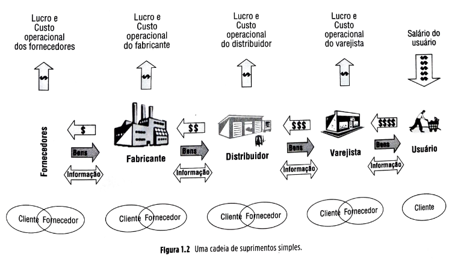
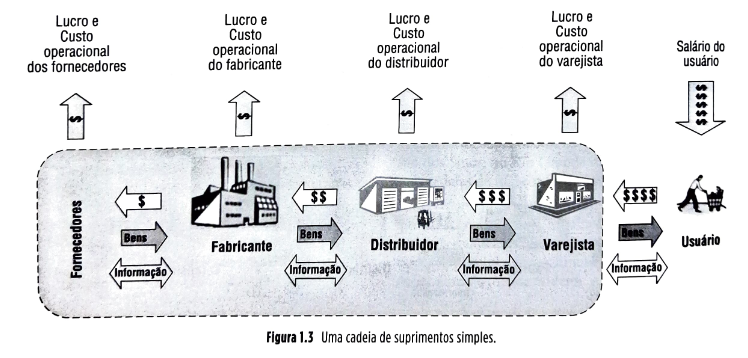
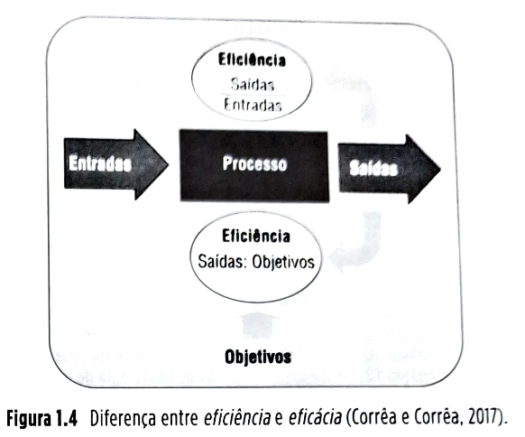
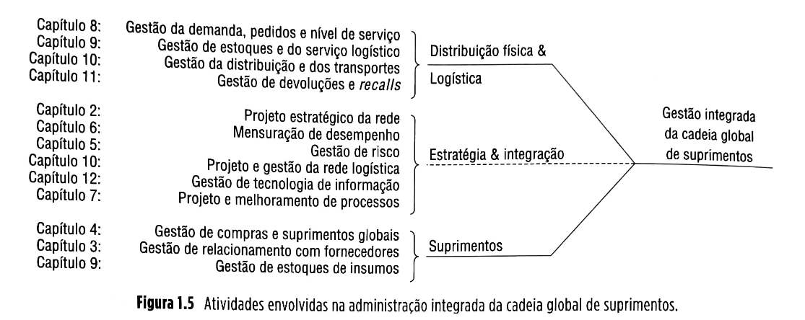
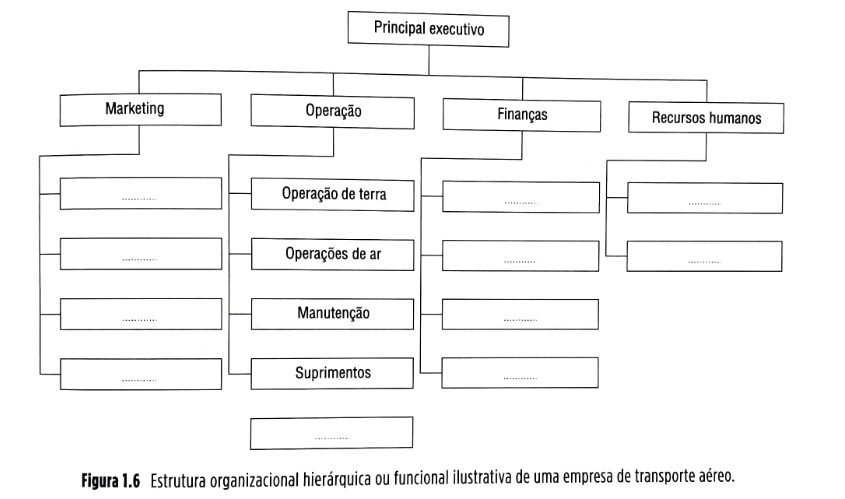
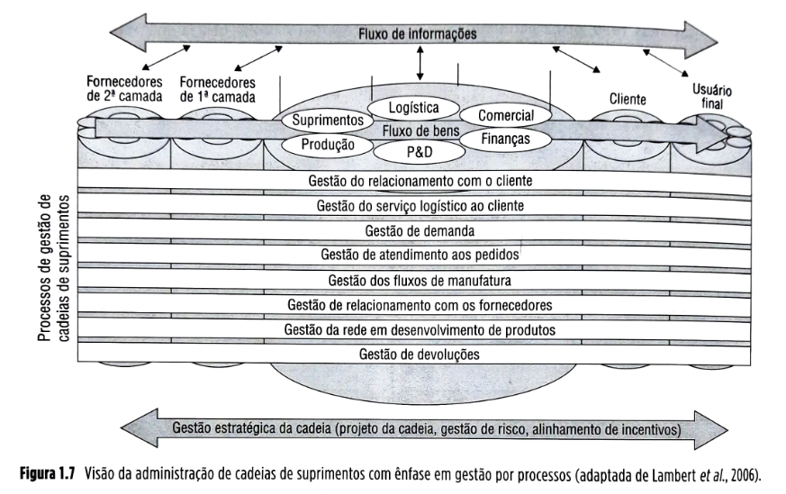
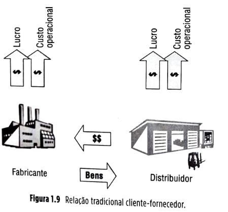
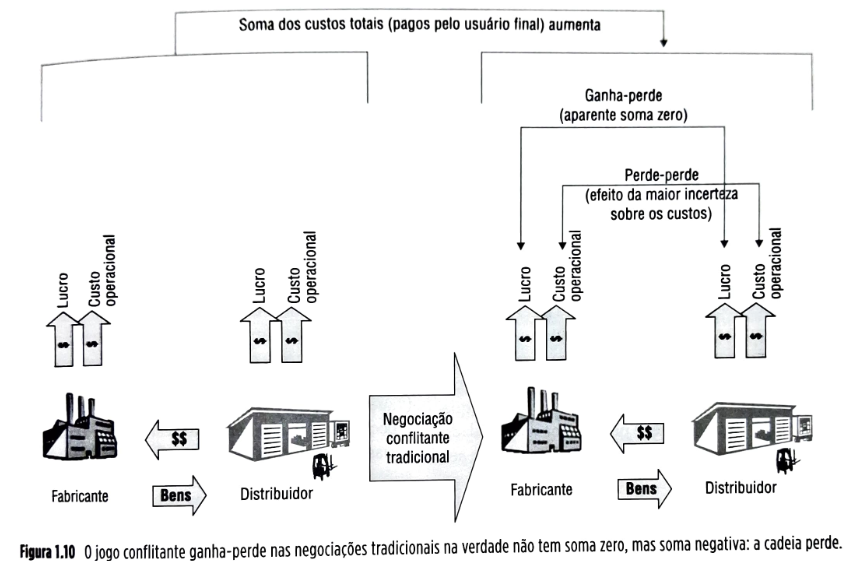
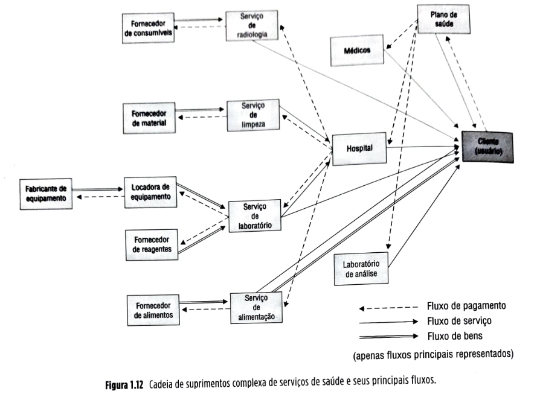
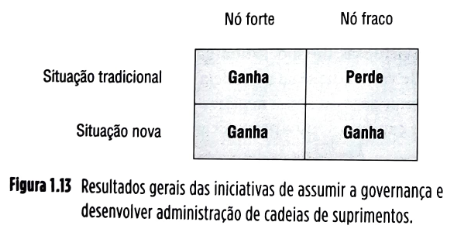

# Capítulo 1 Introdução à administração de cadeias globais de suprimentos

## Página 1

## OBJETIVOS DE APRENDIZAGEM

📌 Explicar por que o interesse na administração de cadeias de suprimentos cresceu tanto nas últimas três décadas.

📌 Ser capaz de examinar e avaliar como a administração das cadeias de suprimentos pode influenciar a competitividade e o desempenho financeiro da organização. 

📌 Elencar as principais atividades envolvidas na administração de cadeias de suprimentos.

📌 Classificar os principais tipos de cadeias de suprimentos existentes.

📌 Argumentar sobre questões de governança, ou seja, a quem cabe a responsabilidade pela administração das cadeias de suprimentos.

## 1.1 INTRODUÇÃO 

A administração de cadeias de suprimentos tem estado, já há duas décadas, no topo da agenda dos principais executivos das empre sas, sejam elas fornecedoras de bens ou de serviços. Para grande número destas empresas, a cadeia de suprimentos é o aspecto individual com maior potencial de tornar-se o mais po deroso fator na obtenção de vantagens com petitivas nos mercados globais, assim como no aumento de lucratividade e crescimento das empresas.

Um exemplo de excelência na administração de cadeias de esuprimentos, alavancando enorme Sucesso no mercado, crescimento e lucrativida de, é dado pela história do Walmart.

## Página 2

### A maior empresa do mundo

O Walmart é a maior empresa do mundo segundo o ranking "Fortune 500" publicado em 2017 pela revista Fortune, com um faturamento de US$ 485,9 bilhões (mais que o dobro do faturamento da sexta maior empresa do ranking, a Volkswagen) e lucro líquido de US$ 9,86 bilhões. Seu faturamento mundial é maior que o produto nacional bruto de países como a Áustria, África do Sule Noruega - se fosse um país, teria a 26ª maior economia do mundo. Nos Estados Unidos, seu impacto na economia é tão grande (estima-se que tenha atingido 21,5% do mercado de varejo em que atua), que suas agressivas políticas de preços baixos são frequentemente apontadas por analistas como um importante fator para a manuten ção dos baixos índices americanos de inflação das últimas décadas. Curiosamente, as vendas on-line do Walmart são de menos de 4% do seu total em vendas.

Uma corporação que gerencia uma cadeia de grandes "supermercados de desconto", a Walmart Stores, Inc. foi fundada em 1962 por um empreendedor americano chamado Sam Walton, e hoje é a maior empregadora privada do planeta, com mais de 2,3 milhões de funcionários, sendo 67 mil no Brasil, onde começou a operar em 1995 com dois Supercenters e três lojas Sam's Club. Depois de alguns percalços iniciais, tornou-se, em 2008, a terceira maior rede varejista do país. Esse crescimento da operação brasileira se deu tanto organicamente quanto por meio de aquisições. Hoje, são parte da corporação Walmart as seguintes marcas de varejo atuantes no Brasil, além das originais: Todo Dia, Bompreço (118 lojas adquiridas em 2004 no Nordeste), BIG (140 lojas adquiridas do grupo português Sonae em 2005), Nacional, Mercadorama e Maxxi Atacado, hoje totalizando 465 lojas. Além dos Estados Unidos e do Brasil o Walmart atua em outros 25 países ao redor do mundo e, em 2018, serviu 200 milhões de clientes por semana, segundo o website da empresa.

A competência-chave que permitiu ao Walmart seu Crescimento e sucesso está na administração de sua cadeia de suprimentos. Em 1989, por exemplo, quando foi considerado "Varejista da década", seus custos totais de distribuição foram estimados em 1,7% dos seus custos totais, contra, por exemplo, custos de 3,5% das vendas de concorrentes importantes, como o varejista Kmart. No mercado de grande varejo, com margens de lucro apertadas (normalmente em torno de 3 a 5% das vendas), essa diferença de custo tem uma alavancagem enorme nos resultados da organização. Sua organização logística, que apoia a administração de sua cadeia de suprimentos, é impressionante são 88 mil funcionários, 150 centros de distribuição, 51 escritórios de transporte, 6.100 cavalos mecânicos, 61 mil reboques e 7.800 motoristas servindo mais de 6.200 lojas no mundo; números impressionantes se considerarmos que sua cadeia de distribuição começou nos anos 1960 em uma garagem alugada e que o primeiro centro de distribuição foi aberto em 1970.

### Evolução da cadeia de suprimentos do Walmart

Sam Walton, antes de fundar o Walmart, era um franqueado de uma cadeia de lojas chamada Ben Franklin Stores. Ele, embora por contrato fosse obrigado a comprar a maioria de suas mercadorias da Ben Franklin, podia, para certos itens, comprar maiores volumes de outros fornecedores, transportando-os diretamente para suas lojas.

Quando o mercado norte-americano começou a valorizar mais os "varejistas de desconto", nos anos 1960, Sam Walton viu a oportunidade de abrir lojas grandes de desconto com aparência de armazéns, chamadas Walmart Discount City. Para estocá-las, ele se viu forçado a incrementar seus esforços de compras e suprimentos. Em razão da localização remota (na cidade de Bentonville, interior do Arkansas, um estado rural do centro-sul dos Estados Unidos), os fornecedores se negavam a fazer entregas nas lojas, forçando o Walmart a desenvolver um sistema próprio de distribuição.

## Página 3

Sam Walton estabeleceu escritórios de compras em Nova lorque, adotando a prática de compras diretas e eliminando os tradicionais intermediários (distribuidores e atacadistas). Com o crescimento dos anos seguintes, muitos dos fornecedores passaram a fixar escritórios com vendedores e analistas em Bentonville. Adicionalmente, o Walmart começou cedo a procurar fornecedores globalmente, abrindo na China, no meio dos anos 1980, o primeiro de uma série de escritórios internacionais de compras. Esses escritórios trabalhavam diretamente com fabricantes que manufaturavam produtos da marca própria do Walmart.

O conceito de marca própria foi adotado pelo Walmart nos anos 1980 e é hoje responsável por aproximadamente 40% das vendas, com maiores margens que a venda de produtos de marcas não próprias. Pelos volumes impressionantes, a empresa desenvolveu enorme poder sobre seus fornecedores. Em 2005, por exemplo, as vendas parao Walmart representavam 17% da receita da gigante Procter & Gamble (P&G), enquanto os produtos Procter & Gamble representavam menos de 8% das vendas do Walmart.

A empresa usa esse poder para obter vantagens nas suas negociações por preço e também para fazer com que seus fornecedores utilizem seus próprios recursos para analisarem dados de vendas de seus produtos e as sumirem parte da responsabilidade pela administração dos estoques de produtos nas lojas. Para isso, o Walmart disponibiliza aos fornecedores grandes volumes de dados de vendas por meio de um portal na internet chamado Retail Link.

A decisão de abertura de novas lojas do Walmart durante a fase de crescimento explosiva que se seguiu à sua inauguração era diretamente subordinada à sua estratégia de distribuição. *A inauguração do primeiro centro de distribuição nos anos 1970 representou um relevante investimento, portanto, Sam Walton insistiu que a área ao redor fosse saturada de lojas dentro do raio de "um dia de viagem rodoviária", para que se obtivessem economias de escala. Ao longo dos anos, esse arranjo (chamado spokes and hub ou raios e eixo, numa referência à roda de bicicleta)* se mostrou muito eficiente, e muitos concor rentes copiaram o modelo, no qual um grande centro de distribuição era circundado por um aglomerado de lojas. Essa estratégia de expansão persistiu ao longo das duas décadas seguintes, resultando em milhares de novas lojas. As lojas eram localizadas em locais suburbanos, com baixos custos de aluguéis e próximos de estradas. Em contraste, as cadeias de lojas de concorrentes, Como a Kmart, eram dispersas ao longo do país e as lojas eram localizadas em pontos urbanos caros.

Antes que a concorrência pudesse reagir, o Walmart já havia construído a cadeia logística mais eficiente do mercado. *Os produtos eram coletados pelos caminhões da empresa nos armazéns dos fornecedores e levados aos centros de distribuição e de lá para as lojas, em geral usando o sistema de **cross-docking**, em que os produtos são transferidos diretamente dos caminhões que trouxeram as mercadorias dos fornecedores para os caminhões que as levarão às lojas, sem estocagem intermediária.* Para evitar ociosidade no transporte, os caminhões em geral trazem de volta das lojas os produtos não vendidos para redistribuição ou devoluções e o espaço adicional de carga é vendido ao mercado, um negócio hoje de mais de US$ 1 bilhão por ano. Para garantir fluxo suave e eficiente ocupação dos meios de transporte, o Walmart trabalha intensamente com os fornecedores a fim de padronizar tamanhos de embalagens e rotulagem de cargas. Na sua estratégia de baixos custos, uma das políticas mais importantes da empresa (e que a diferenciaram da concorrência) foi a de **"preço baixo todo dia"**, com as mercadorias apresentadas sempre com preços estáveis, sem descontos temporários ou promoções frequentes. *Num ambiente de descontos frequentes, os estoques de antecipação necessários para preparar as vendas maiores que virão com os descontos fazem com que os estoques cresçam e a demanda vista pelos fornecedores flutue, num efeito chamado **efeito chicote**, acarretando custos maiores para a cadeia de suprimentos.* O Walmart, com preços estáveis, suaviza a demanda evitando esses cus o resultado são preços ao consumidor em média tos 8 a 27% mais baixos que os da concorrência. Como o Walmart tem informações on-line das vendas de cada loja, a reposição de mercadorias pode ser automatizada, em fluxo quase contínuo. Essas informações também são compartilhadas com os fornecedores, a fim de promover melhor planejamento e consequentemente custos mais baixos.

Sam Walton sempre teve muita preocupação com a análise dos dados sobre a operação de sua empresa. Em 1966, quando tinha apenas 20 lojas, ele participou de um curso na IBM com a intenção de contratar o melhor aluno da sala para "computadorizar" sua operação. A partir daí, sempre investiu muito em sistemas com base em tecnologia da informação, tendo nos anos 1980 investido numa base de dados central, sistema de coleta de dados no ponto de venda e cadeia por satélite para comunicação de dados. Isso, aliado à adoção da tecnologia de código de barras, permitiu a obtenção centralizada e quase instantãnea de informações para análise.

## Página 4

O desenvolvimento do Retail Link se deu no início dos anos 1990, na época, a maior base de dados de uso civil do planeta. Em troca do fornecimento de dados de venda históricos e atuais aos fornecedores via Retail Link, o Walmart espera que eles proativamente monitorem e reponham produtos de forma suave e contínua, uma prática chamada VMI ou *vendor managed inventory*, ou ainda, **"estoques gerenciados pelo fornecedor"**.

Isso deu origem a uma iniciativa adotada pela empresa nos anos 1990, chamada CPFR (collaborative planning forecasting and replenishment, ou "planejamento, previsão e reposição colaborativa"), em que se compartilham entre membros da cadeia de suprimentos informaçoes, planos e decisães operacionais para maior coordenação e consequente eficiência. 

Uma das mais recentes iniciativas de uso de tecnologia na administração de sua cadeia de suprimentos é a adoção gradual de RFID (identificaçào do produto com etiquetas de radiofrequência) pelo Walmart. Estas aumentam em muito a capacidade de rastreamento de produtos, aumentando a visibilidade, o nível de serviço ao cliente (por exemplo, o Walmart afirma que suas faltas em lojas diminuíram em 16% depois da adoção de RFID) e a rapidez das transações de reposição de mercadorias e check-out (pagamento no caixa). Também merece ser destacada a iniciativa do Walmart de fazer crescer suas vendas on-line. 

Sua loja virtual (www.walmart.com), inaugurada em janeiro de 2000, oferece mais de um milhão de produtos com várias opções de entrega nos Estados Unidos, além de oferecer formas inovadoras de comercialização no caso de alguns deles, como download de músicas e revelação de fotos em uma hora, com upload on-line. Com o aumento das vendas on-line, hoje responsável por cerca de 4% das vendas totais da empresa, ea correspondente necessidade de políticas ainda mais tolerantes de aceite de devoluções que aquelas vigentes nas lojas físicas, o Walmart também tem processos avançados de logística reversa, visando ao eficiente fluxo das devoluções: do cliente para os armazéns de triagem de produtos devolvidos e daí a suas várias possíveis desti nações (remanufatura, reciclagem ou outra).

Recentemente o Walmart tem se engajado no desenvolvimento de práticas que levam em conta a sustentabilidade e a responsabilidade social. Várias iniciativas junto a fornecedores e relacionadas aos seus próprios recursos (lojas, frotas, escritóriose armazéns) apresentam objetivos explícitos: "100% de suprimentos de energia renovável, produção zero de lixo/emissões e venda de produtos que conservem nossos recursos e meio ambiente", além de adotar códigos de conduta para seus fornecedores quanto a padrões mínimos de qualidade, condições sociais (por exemplo, quanto a trabalho infantil) e ambientais (por exemplo, quanto a condições poluidoras).

### 1.2 CONCEITOS

### 1.2.1 Por que o interesse crescente em administração de cadeias de suprimentos?

Quem vive o ambiente empresarial de hoje, em que o termo "administração de cadeias de suprimentos" (ou o correspondente termo em inglês supply chain management) incorporou-se definitivamente ao jargão gerencial, pode achar difícil crer que há pouco mais de 30 anos esse não era um termo amplamente conhecido, tendo sido cunhado por consultores apenas no início dos anos 1980 (Lambert e Cooper, 2000). Quando comparado à idade que a moderna concepção da área de administração de produção e operações tem, em torno de 250 anos, com acelerada evolução no último século (Corrêa e Corrêa, 2017), fica claro que a área de administração de cadeias de suprimentos é uma área ainda jovem que ganhou grande visibilidade, principalmente nas últimas duas décadas.

| 🔵**SAIBA MAIS**{bg=azul}|
|----------------|
|A evolução de tecnologia e os retornos decrescentes justificam o aumento recente do interesse por administração de cadeias de suprimentos.  **Evolução tecnológica** Nunca em épocas passadas a tecnologia evoluiu a passos tão rápidos. Isso faz com que seja difícil para empresas manterem internamente os processos de atualização e desenvolvimento tecnológico em todas as áreas que contribuem para os produtos e serviços que oferecem ao mercado. Na esperança de evitar que se tornem “medíocres em tudo, mas tentarem ser excepcionais em tudo”, têm preferido delegar a terceiros parcelas cada vez mais substanciais não só da produção de partes de seus produtos e serviços, mas também do desenvolvimento destas partes. Isso aumentou substancialmente a quantidade e a intensidade de trocas nas interfaces entre as empresas e as cadeias de suprimentos em que as empresas se encontram, tornando-as mais complexas. A administração das cadeias de suprimentos passou, portanto, a ganhar muito mais atenção gerencial.  **Retornos decrescentes dos esforços internos de melhoria**  Em paralelo, nota-se um desbalanceamento, dentro da área de administração de operações, entre o tratamento de operações dentro das empresas da cadeia de suprimentos e entre as empresas da cadeia de suprimentos. Historicamente, a grande ênfase dos modelos, das práticas, do ensino e da pesquisa em operações tem sido na administração de “empresas”. Há numerosas escolas de administração de empresas no Brasil e no mundo, mas nenhuma dedicada à administração de cadeias de empresas. Não se advoga aqui que haja essas escolas, apenas se pretende que isso ilustre para onde é que tem se direcionado a ênfase dessa área do conhecimento. Apenas ultimamente a área de administração de operações passou a debruçar-se sobre as questões de como tratar as relações entre empresas numa cadeia. As principais técnicas desenvolvidas (e usadas) ao longo destes últimos dois séculos e meio de evolução predominantemente centram-se na busca por aumentos de produtividade e qualidade dentro das organizações.  Anteriormente aos anos 1990, foram raras as iniciativas que consideravam as cadeias de empresas e seu desempenho sistêmico. Isso de certa forma ajuda a explicar por que hoje grande número de empresas tem notado que os custos marginais de melhorias em qualidade e produtividade dentro das empresas da cadeia de suprimentos são grandes e crescentes (já que grande esforço já alocado em melhorias, ao longo de muitas décadas, leva a retornos decrescentes), enquanto o (relativamente) pequeno esforço colocado historicamente em melhorias nos relacionamentos entre empresas da cadeia faz com que os esforços de melhoria ainda tenham retorno relativamente alto que os esforços internos. Isso tem feito com que empresas procurem voltar sua atenção gerencial para melhorias em temas como logística e administração de cadeias de suprimentos.|

## Página 5

#### Explorando as origens 

Argumenta-se que a administração de cadeias de suprimentos não se iniciou a partir de uma "folha em branco", nos anos 1980, mas que representa mais uma etapa num processo de evolução que teria se iniciado nos anos 1960 e 1970, com o desenvolvimento do conceito de distribuição física, Este procurava de certa forma integrar alguns aspectos da logística "de distribuição" - tratados de forma isolada anteriormente -, como a administração dos transportes e dos armazéns de produtos acabados ea administração de embalagens de transporte.

A atenção sobre a questão da integração sistêmica destas atividades, por sua vez, teria resultado do desenvolvimento conceitual da "administração sistêmica" das anos 1950 e 1960. O foco da "distribuição física" é o dos custos totais (sistêmicos) de distribuiçán, analisando opções para se chegar ao menor custo total do sistema em vez de tentar reduzir custos dos elementos logísticos isoladamente. Nos anos 1980, nos Estados Unidos, a desregulamentação dos sistemas de transporte e o desenvolvimento dos sistemas de informação deram aos analistas de distribuição física mais ferramentas e opções para a integração. O passo adicional seria, com estas novas opções, procurar integrar também a logistica "de entrada' (insumos) das organizaçöes, já que alguns transportadores poderiam se beneficiar, por exemplo, de menos fretes vazios de retorno.

Além disso, nos anos 1980, a globalização econômica se acelerou, e estava em curso a rápida evolução das empresas japonesas. Estas haviam recentemente sido alçadas à posição de importantes concorrentes globais em mercados como o automobilístico, o de produtos eletrônicos e o de aço, ganhando fatias importantes de mercados como o americano e o europeu.

Empresários, profissionais práticos e acadêmicos ocidentais passaram então a analisar as práticas e técnicas japonesas, responsáveis pelos níveis altíssimos de qualidade e produtividade que seus produtos apresentavam. O Ocidente aprendeu que práticas como o *Just in Time (que originou a abordagem lean)* e a abordagem japonesa inovadora para a qualidade eram responsáveis por boa parte do excelente desempenho das fábricas japonesas, mas um aspecto adicional também tinha um papel muito importante - o uso das chamadas *keiretsus, ou 'cadeias de compradores-vendedores".*

Usando esse conceito, a Toyota e a Honda terceirizavam a fornecedores o equivalente a algo como **80% do valor** dos carros que produziam (valores muito superiores aos **30%** de terceirização dos concorrentes ocidentais como General Motors e Ford, que tinham altos níveis de integração vertical, ou seja, produzindo a grande maioria dos componentes dos seus carros internamente). Relações altamente cooperativas com fornecedores (frequentemente apenas um ou dois para cada item) eram frequentes nas keiretsus, em oposição à lógica geral ocidental de manter relacionamentos tênues com vários fornecedores de cada item, tanto para diluir riscos como para colocar os vários fornecedores concorrentes uns contra os outros, em processos de cotação que visavam reduzir os preços dos componentes.

## Página 6

| ❓**Para refletir**❓{bg=vermelho}|
|----------------|
|A exemplo do *Just in Time* em relação às práticas internas de manufatura, as *keiretsus* japonesas e seu sucesso fizeram com que as empresas ocidentais passassem a repensar suas próprias práticas, passando a apreciar as vantagens de mais altos níveis de terceirização e relações mais cooperativas com fornecedores, abrindo caminho para o desenvolvimento de conceitos estratégicos importantes em administração de cadeias de suprimentos, como as decisões estratégicas de terceirizar ou fazer, os relacionamentos mais próximos e cooperativos com fornecedores e o uso de fornecedores como fontes importantes de conhecimento e competências na cadeia de suprimentos.|

| 🔵**SAIBA MAIS**{bg=azul}|
|----------------|
|As *keiretsus* surgiram no Japão depois da II Grande Guerra Mundial, durante o “milagre japonês”, quando os aliados, vencedores da guerra, desmantelaram as chamadas *zaibatsus* (grupos empresariais dominados por grupos familiares tradicionais). As empresas resultantes do desmantelamento foram reintegradas por meio de aquisições cruzadas de participação acionária, formando alianças integradas horizontalmente, cruzando fronteiras entre setores industriais.|

Onde possível, as empresas pertencentes às *keiretsus* forneciam apenas umas para as outras. As maiores *keiretsus* foram formadas em torno de bancos que emprestavam dinheiro para as empresas participantes e possuíam participação acionária nestas, mantendo sobre elas certo nível de controle. As *keiretsus* são intrincadas redes de empresas interdependentes.

Dada a totalmente diferente estrutura de formação das *keiretsus* quando comparadas às cadeias de fornecimento ocidentais (nas quais em geral não há grandes conglomerados de empresas com participação acionária cruzada e relação de relativa exclusividade de fornecimento), foi praticamente impossível às empresas ocidentais meramente “adotarem” esse modelo. Entretanto, as lições aprendidas com o modelo japonês de administração de cadeias de suprimentos, principalmente no sentido de valorizar muito mais as relações cooperativas com fornecedores, tiveram uma importância grande no desenvolvimento da área no Ocidente.

As *chaebols* são a versão coreana das *keiretsus* japonesas, embora sejam mais similares às *zaibatsus* japonesas do período anterior à II Grande Guerra Mundial. As *chaebols* também são frequentemente mencionadas quando se discutem as diferentes formas de configuração e gerenciamento de cadeias de suprimentos, constituindo-se em grandes conglomerados industriais, controlados e gerenciados por grupos familiares coreanos e fortemente apoiados pelo governo. Exemplos de *chaebols* são a Samsung, a Hyundai e a LG. Embora sejam frequentemente comparadas com as *keiretsus*, e ambos os modelos gerenciem relações colaborativas e com alta interdependência e coordenação entre empresas fornecedoras e empresas clientes, algumas diferenças entre elas são importantes:

▪️*Chaebols* são controladas e gerenciadas por grupos familiares, enquanto *keiretsus* são gerenciadas por profissionais;
▪️*Chaebols* são centralizadas em termos de propriedade acionária, enquanto *keiretsus* são mais dispersas pela propriedade acionária cruzada entre empresas componentes;
▪️*Chaebols* formam subsidiárias para produção de componentes de produtos visando à exportação, enquanto *keiretsus* usam subcontratados;
▪️*Chaebols* são proibidas de possuírem bancos, que têm papel essencial na configuração de *keiretsus*.

#### A concorrência hoje não é mais entre empresas, mas entre cadeias de suprimentos

Muitos autores afirmam que, hoje, a concorrência pelos mercados não é mais entre empresas, mas entre cadeias de suprimentos. Isso é verdadee deve ser bem entendido. Algumas cadeias de suprimentos concorrentes são auto contidas e de certa forma isoladas", não compartilhando parceiros com as cadeias concorrentes. Um exemplo é a indústria de calçados. Os fabricantes chineses têm suas cadeias locais de suprimento e possivelmente não compartilham parceiros (exceto talvez no nível do varejo) com as cadeias de suprimentos do polo calçadista do Vale do Rio dos Sinos, no Rio Grande do Sul, que também tem suas cadeias de fornecedores, basicamente locais.

É evidente, portanto, que aquivale a afirmativa de que são cadeias competindo, em vez de empresas competindo, quando se pensa na concorrência entre uma empresa gaúcha e uma chinesa. Pense, por outro lado numa Situação menos evidente, como ocorre no mercado de sabões em pó.

Imagine dois dos grandes concorrentes nesse mer cado no Brasil: Unilever (dona de marcas como OMO e Minerva) e Procter & Gamble (dona de marcas como Ariel e Ace). Ambas as empresas compartilham a maioria dos seus fornecedores de produtos químicos (grandes empresas químicas, capazes de fornecer os grandes volumes necessários à producão de sabão em pó das duas empresas), assim como compartilham parceiros en suas estruturas de distribuição. Grandes distribuidores e atacadistas, como Martins e Ciro, e grandes cadeias de supermercados, como CBA (Pão de Açúcar), Carretour e Walmart, distribuem e vendem produtos de ambos os concorrentes. Isso pode dar a impressão de que a concorrência neste caso continua sendo como tradicionalmente. entre empresas e não entre cadeias.

## Página 7

Na verdade, entretanto, aqui também a concorrência hoje ocorre entre cadeias: embora compartilhem muitos dos parceiros, o nível de competência com que estas empresas conseguem integrar-se aos seus parceiros compartilhados pode ser completamente diferente. Se a Unilever, por exemplo, estiver mais bem integrada com um grande varejista do que a P&G por exemplo, sua cadeia será mais eficaz, embora ambas estejam se relacionando com o mesmo varejista.

|💡**Fique atento**💡{bg=amarelo}|
|----------------|
|A concorrência pelos mercados hoje se dá entre "cadeias de Suprimentos" e não mais entre "empresas", mesmo quando grande parte dos elementos das cadeias concorrentes seja comum e compartilhada.**|

#### Uma poderosa arma competitiva 

Numa área em que os modismos gerenciais são uma constante, hoje é evidente que este não é o caso da administração de cadeias de suprimentos, que pode ser uma fonte real e importante de vantagens competitivas sustentáveis. 

*A palavra-chave para entender a moderna administração de cadeias de suprimentos é **"integração"**.*

Vamos imaginar uma cadeia de suprimentos simples para ilustrar o conceito. Veja a Figura 1.2. Imaginemos que essa cadeia está fornecendo um produto, por exemplo, sabonete, para clientes finais (os usuários do produto).

Nela, um Fabricante recebe insumos (componentes do sabonete) de seus Fornecedores, agrega valor a eles por meio da atividade de manufatura e vende os sabonetes acabados para um Distribuidor. Este então agrega valor ao produto final por intermédio da atividade de distribuição, fazendo o produto chegar ao Varejista, que lhe agrega valor pela provisão de disponibilidade e conveniència ao Usuário final, que então adquire e usa o produto.

As entidades envolvidas aqui (fabricante, distribuidor, varejista e usuário) são muitas vezes chamadas de "nós" da cadeia de suprimentos, assim como as "ligações" (o relacionamento, os fluxos físicos de bens, os fluxos financeiros e os de informações) entre as entidades são denominados "elos" da cadeia.

Figura 1.2 Uma cadeia de suprimentos simples.

## Página 8

Observe que todos os "nós" dessa cadeia de suprimentos têm um caráter duplo: são clientes (dos seus fornecedores) e fornecedores (dos seus clientes), exceto o usuário final. Este compra o sabonete para seu uso e não para vendê-lo, portanto, não tem clientes. Assim, o usuário não é um "fornecedor".

O usuário final vai ao varejista e compra sabonete. A transferência do sabonete do varejista para o usuário é representada pela seta "Bens" entre esses dois nós. Contra o recebimento do sabonete, o usuário paga ao varejista. O fluxo financeiro correspondente é representado na Figura 1.2 pela seta "$$$$". Como o usuário não tem clientes para quem vender o sabonete, não tem fluxo financeiro de entrada correspondente à venda do sabonete. Ele tem, portanto, que usar dinheiro que recebe de outras fontes, por exemplo, seu salário, conforme ilustra a Figura 1.2, para comprar o sabonete.

Consideremos o varejista, agora. Com a receita que obtém do pagamento feito pelo usuário, o varejista paga seus Custos Operacionais (salários, depreciação, energia etc., exceto materiais, na ilustração da figura) e paga dividendos aos acionistas na forma de Lucro (representados pelas setas verticais acima do nó).

Com o resto do dinheiro, ele adquire os bens e serviços que nccessita para operar - entre cles, sabonetes comprados do distribuidor. Note que o fluxo financeiro entre varejista e distribuidor "$$$" é menor que o fluxo financeiro entre usuário e varejista "$$$$" justarmente porque uma parte do fluxo "$$$$" foi usada para pagar custos operacionais e lucros do varejista "$".

Com o distribuidor ocorre o mesmo: com a receita que obtém do varejista pela venda de sabonetes, paga seus custos operacionais (salários, depreciação, enetua etc., exceto materiais) e paga dividendos aos acionistas na forma de lucro (representados pelas setas verticais acima do nó). Note que uma vez mais o fluxo "horizontar" referente às "trocas" na cadeia, diminui à medida que viaja para montante da cadeia (no sentido dos clientes para os fornecedores), em razão das saídas financeiras que necessitam ocorrer em cada "nó" fim de pagar seus respectivos custos operacionais e remunerar seus acionistas.

Vamos agora olhar não para os nós individuais da cadeia, mas para a cadeia inteira, como um todo, fechando uma "caixa-preta" ou um "volume de controle", como se costuma chamar na análise de sistemas, em torno do conjunto de nós que representa a cadeia de suprimentos, deixando apenas o usuário final de fora.

Veja a Figura 1.3.

A Figura 1.3 mostra que, quando se adota uma visão global da cadeia, o sistema passa a ter uma só entrada financeira (o dinheiro pago pelo usuário pelo produto final) e várias saídas: os custos operacionais e lucros de todos os nós da cadeia. Ou seja, o usuário final é o único nó "pagante da cadeia de suprimentos.

O preço pago pelo usuário final, portanto, é o somatório de todo o custo operacional e de todo o lucro obtido por todos os nós da cadeia; isso implica que, mesmo que um nó da cadeia tenha alta eficiência (refletida em custos operacionais baixos), se os outros nós da cadeia forem ineficientes, com custos operacionais maiores, esses custos maiores somar-se-ão, resultando em preços altos ao usuário final, ou em margens de lucro menores ou ambos, com consequentes níveis piores de competitividade da cadeia como um todo.

## Página 9

Com menos competitividade e preços mais altos, a cadeia venderá menos produtos, porque o usuário final, único pagante, poderá preferir comprar de uma cadeia mais eficiente - por preços menores. Ora, como a única fonte de dinheiro "novo" da cadeia do usuário final, se este deixa de comprar, a fonte "secará" para essa cadeia inteira: não apenas os nós ineficientes serão penalizados, mas todos os nós, inclusive aqueles que, vistos individualmente, poderiam ser considerados eticientes.

|💡**Fique atento**💡{bg=amarelo}|
|----------------|
| Hoje para uma empresa ser competitiva e bem-sucedida, não basta que tenha eficiência nas suas operações internas - suas parceiras de cadeia de suprimentos (os outros nós a montante e a jusante na cadeia) devem ser internamente eficientes e, além disso, os elos (fluxos físicos, financeiros, de informação e de relacionamento entre os nós) também devem ser eficientes. Isso só se obtém com uma adequada integração na administração dos nós e elos da cadeia de suprimentos.**|

#### Administração de cadeias de suprimentos envolve mais que apenas a gestão de custos

O raciocínio simplificado acima é ilustrativo, mas a administração de cadeias de suprimentos não afeta apenas custos. Afeta também outros aspectos de desempenho, como a velocidade e confiabilidade das entregas, a qualidade dos produtos, a flexibilidade com que a cadeia pode se adaptar a mudanças internas/ambientais, o nível de inovação e sustentabilidade da cadeia.

O usuário final toma sua decisão de compra (de que cadeia de suprimentos comprar) baseado na consideração ponderada de vários critérios, levando em conta suas expectativas/necessidades e as ofertas concorrentes. O importante, portanto, para uma cadeia de suprimentos não é apenas ser "eficiente', mas ser "eficaz".

Os termos eficiência e eficácia têm de ser usados com precisão nesse contexto. 

**Eficácia** - refere-se a quanto os objetivos do sistema são atingidos, ou seja, em que grau as necessidades dos clientes e outros grupos de interesse da organização (por exemplo, funcionários, governo, sociedade) são satisfeitas. Eficácia pode resultar em vantagem competitiva porque clientes mais satisfeitos tendem a ser mais fiéis e recomprar, além de recomendar.

**Eficiência**, por outro lado, é a medida de quão economicamente os recursos da organização são utilizados quando provendo determinado nível de satisfação dos clientes e de outros grupos de interesse. Eficiência pode resultar em vantagem competitiva porque permite preços mais baixos e pode também resultar em margens mais altas.

A Figura 1.4 Diferença entre eficiência e eficácia.

O nível de desempenho de uma cadeia de suprimentos é uma função dos níveis de eficiéncia e eficácia que, não as empresas individuais, mas o conjunto de empresas que interagem na cadeia de suprimentos tem.

|💡**Fique atento**💡{bg=amarelo}|
|----------------|
|Hoje para uma empresa ser competitiva e bem-sucedida, não basta que seja eficiente e eficaz nas suas operações internas - Suas parceiras de Cadeia de suprimentos (os outros nós a montante e a jusante da cadeia) também devem ser internamente eficientes e eficazes, e os elos (fluxos físicos, financeiros, de informação e relacionamento entre os nós) também devem ser eficientes e eficazes. Isso só se obtém com uma adequada administração integrada da cadeia de suprimentos.**|

### 1.2.2 Atividades envolvidas na administração de cadeias de suprimentos

Administração de cadeias de suprimentos envolve a administração integrada de uma multiplicidade de atividades, todas discutidas nos Capítulos subsequentes deste livro. Uma lista delas, com menção aos respectivos Capítulos onde são discutidas, pode ser encontrada na Figura 1.5, que ilustra a ideia de níveis crescentes de integração, de atividades para a ideia de distribuição física & logística integrada e de administração integrada de suprimentos e daí para a ideia de integração total da cadeia e seu uso estratégico como fator de diferenciação competitiva. 

## Página 10 

É importante observar que os conceitos de administração integrada de cadeias de suprimentos não se aplicam apenas a cadeias de produtos físicos, mas também a serviÇos. Evidentemente, as diferentes atividades terão importâncias relativas diferentes quando se analisam cadeias de produtos fisicos, como a cadeia de suprimentos automotiva, e cadeias de serviço, como a cadeia de suprimentos de entretenimento on-line - comoo site iTunes, da Apple Corporation, que vende músicas e filmes por download, por intermédio da internet, em que a administracão de tecnologia da informação é muito mais importante que a administração de estoques. A Figura 1.5 ilustra esse ponto com outro exemplo.

Figura 1.5 Atividades envolvidas na administração integrada da cadeia global de suprimentos.

| 🔵**SAIBA MAIS**{bg=azul}|
|----------------|
|Para consumidores mais tradicionalistas, que ainda usam DVDs para assistirem a seus filmes, os varejistas criaram uma operação inovadora, dando acesso instantâneo a milhares de títulos cuja manutenção em estoque físico seria impossível ou inviável de outra forma. O cliente consulta um enorme menu de títulos em quiosques localizados em supermercados e o filme é então baixado e impresso num DVD virgem.  Trata-se de uma associação americana chamada Associação para Controle de Cópias de DVDs – um consórcio entre os estúdios cinematográficos e os fabricantes de hardware e software responsáveis pelos sistemas que impedem que DVDs “piratas” sejam produzidos domesticamente, permitindo que esses sistemas sejam licenciados mais amplamente. Isso abre as portas para a possibilidade de venda, em quiosques, de DVDs gravados no local. Grandes cadeias varejistas, como as cadeias de farmácias e lojas de conveniências americanas Walgreens e Publix já instalaram quiosques em suas lojas. Ter disponível o conteúdo dos grandes estúdios produtores de filmes fortalece o potencial de aumentar o fluxo de clientes nas lojas. Para os estúdios, adotar os quiosques permite vender os milhares de produtos recentes e mais antigos de seu catálogo sem terem que fisicamente produzir, armazenar e distribuir os DVDs.  Além disso, com o uso dos quiosques os varejistas não precisam destinar espaço precioso de prateleira para estocar DVDs. Evidentemente, os clientes menos conservadores já não usam DVDs, preferindo downloads e streaming feitos diretamente pelo usuário final em televisores inteligentes ou *tablets*, computadores ou smartphones. Entretanto, enquanto ainda houver clientes que insistem em usar DVDs, os quiosques serão uma alternativa interessante, que já muda bastante a forma de distribuição de filmes.|

## Página 11

#### Visão por processos é fundamental na administração de cadeias de suprimentos

Por trás do desenvolvimento o da administração de cadeias suprimentos está a chamada "administração por processos de negócios."

O conceito de organizar as atividades de uma empresa por processos foi introduzido nos anos 1980 e se tornou muito popular nos anos 1990, principalmente com a publicação do livro Reengineering the corporation: a manifesto for business revolution (Hamer e Champy, 1993).

Tradicionalmente, as organizações se estruturavam de forma "funcional", em que as várias funções eram "compartimentalizadas", resultando nos tradicionais organogramas funcionais ou hierárquicos. Nesse arranjo, no topo da estrutura, o principal executivo da empresa coordena a atividade dos vários grupos funcionais, que podem ser de marketing, de operação, de finanças, de recursos humanos, e assim por diante. Cada uma destas funções, por sua vez, sofre também subdivisões com base funcional. O resultado é uma estrutura conforme ilustra a Figura 1.6.

Figura 1.6 Estrutura organizacional hierárquica ou funcional ilustrativa de uma empresa de transporte aéreo.

| ⚠️**Conceito-chave**⚠️{bg=verde}|
|----------------|
|Um *processo de negócios* pode ser definido como um conjunto estruturado e encadeado de atividades com resultados que atendem a clientes (Davenport e Beers, 1995).**|

O problema com a estrutura funcional é que, como pode ser visto pelas linhas verticais, as estruturas de coordenação e comunicação são predominantemente chefe-subordinado. Isso tende a fazer com que as respostas ao cliente, que na verdade está na ponta de encademantos de relações cliente-fornecedor internos que cruzam transversalmente a estrutura funcional, fiquem mais demoradas e falhas, exatamente porque os clientes e fornecedores internos não têm linhas diretas de comunicação e coordenação.

Além disso, as *funções separadas umas das outras tendem a tornar-se feudos (ou "silos") isolados e auto justificados.* Essas funções acabam lutando contra as outras funções em busca de poder, recursos e influência na organização, favorecendo objetivos individuais e locais e não objetivos da organização como um todo. À medida que as organizações se tornam grandes, as desvantagens das estruturas funcionais vão se tornando mais e mais claras até que a lentidão de resposta resultante as torna inviáveis para ambientes dinâmicos. A solução passa pelas estruturas organizacionais com maior ênfase na gestão "por processo, em que linhas de fluxo de informação e decisão são definidas de forma a encadear sequências de relações fornecedor-cliente, em que uma atividade usa como entradas" as "saídas" ou resultados da atividade anterior. É importante, portanto, que uma visão sistêmica (entrada-processo-saída) seja usada quando se adota a visão por processos.

Inicialmente, processos de negócios eram vistos como uma forma de integrar funções dentro das empresas, mas hoje são usados também para estruturar atividades entre membros da cadeia de suprimentos - a cadeia toda fun cionando para atender o cliente usuário final, que está na extremidade de sequências de atividades encadeadas na forma de relações fornecedor-cliente e que cruzam não só os limites funcionais internos das organizações, mas também as próprias fronteiras das organizações, a fim de incluir atividades de parceiros na cadeia de suprimentos. Omodelo da Figura 1.7 ilustra a visäo de administração cadeia de suprimentos com ênfase na gestão por processos.

Figura 1.7 Visão da administração de adeias de suprimentos com ênfase em gestão por processos (adaptada de lambert et al, 2006).

Observe como os processos listados cruzam transversalmente os limites das funções organizacionais (logistica, comercial, finanças, pesquisa e desenvolvimento, produção, suprimentos) e cruzam também as fronteiras da organização, englobando fornecedores, fornecedores de fornecedo res e clientes até os usuários finais. Imagine, por exemplo, a administração do processo "gestão do relacionamento com o cliente', na cadeia de suprimentos automobilística.

O cliente usuário final de uma cadeia automobilística é o indivíduo que adquire seu veículo. Entretanto, uma montadora, como a General Motors, não estabelece um relacionamento direto, na maioria das vezes, com o usuário do carro - o relacionamento se dá por intermédio da sua rede de concessionárias, que são os clientes imediatos da montadora. Isso significa que grande parte das atividades de relacionamento com o usuário final da montadora tem que envolver atividades realizadas pelo seu cliente imediato (a concessionária).

O relacionamento com o cliente se dá em vários níveis: há interações financeiras, logísticas (bens) e de informações entre a cadeia de suprimentos e o usuário final. Ou seja, o processo de relacionamento deve cruzar as fronteiras funcionais (tanto na concessionária quanto na montadora e nos fornecedores). O usuário final pode, em certo momento, contatar a concessionária sobre alguma dúvida ou problema específico com algum acessório de seu carro que demande uma resposta direta do fornecedor, ou do fornecedor do fornecedor da montadora, e isso requer coordenação "horizontal", de processos, entre concessionária, montadora e fornecedores.

| ❓**Para refletir**❓{bg=vermelho}|
|----------------|
| Numa visão meramente funcional, ou segmentada, dos atores da cadeia de suprimentos, o cliente sofrerá as consequências da ausência de linhas de fluxo de comunicação, coordenação e colaboração entre as funções e empresas envolvidas — percebe custos mais altos, demoras, desencontro de informações, por exemplo. Daí o poder da abordagem por processos em administração de cadeias de suprimentos, principalmente aquelas cadeias que operam em ambientes dinâmicos e competitivos. A abordagem por processos reconhece o cliente como origem e destino principal das atividades da cadeia.|

### 1.2.3 Administração de cadeias de suprimentos: uma definição operacional

Para os objetivos deste texto, podemos definir administração de cadeias de suprimentos como abaixo:

| ⚠️**Conceito-chave**⚠️{bg=verde}|
|----------------|
| Administração de cadeias de suprimentos é a administracão integrada dos processos principais de negócios envolvidos com fluxos físicos, financeiros e de informações, englobando desde os produtores originans de insumos basicos até o consumidor final. na geração e fornecimento de bens, serviços e informações, de forma a agregar valor para todos os clientes - intermediários e finais - e para outros grupos de interesse legítimos e relevantes para a cadeia (acionistas, funcionários, gestores, comunidade, governo).**|

#### Impactos da administração de cadeias de suprimentos no resultado financeiro da organização

Não é à toa que a administração de cadeias de suprimentos tem ocupado o topo da agenda dos executivos nos últimos anos. De fato, a administração de cadeias de suprimentos pode ter grande impacto no resultado financeiro da organização, que influencia diretamente o valor para o acionista, a quem os executivos respondem. O valor das ações de uma empresa no mercado é influenciado por vários fatores, alguns bastante voláteis. Entretanto, mais a longo prazo, tende a ser influenciado pela lucratividade da empresa, relacionada ao valor econômico agregado por ela (ou **Economic Value Added - EVA**). O EVA define o lucro real que a empresa gera depois de descontados os custos totais de fazer negócios (custos operacionais, impostos e custos de capital): permite aos acionistas avaliar se estão tendo um retorno adequado sobre seu investimento. Os três principais fatores que influenciam positivamente o EVA são crescimento de receitas, redução de custos e uso de menos ativos.

A Figura 1.8 faz uso de um modelo simples de cálculo de EVA para ilustrar como as atividades da administração de cadeias de suprimentos influenciam diretamente os três fatores que, por sua vez, definem o valor econômico agregado das empresas.

## Página 14 

|💡**Fique atento**💡{bg=amarelo}|
|----------------|
| A administração de cadeias de suprimentos pode ser uma importante arma competitiva, com impactos claros e relevantes no resultado econômico das empresas componentes.**|

#### Com a administração de cadeias de suprimentos todos podem ganhar

Um dos mais importantes resultados da administração de cadeias de suprimentos é que ela permite que todos na cadeia ganhem colaborativamente, em vez da tradicional abordagem conflituosa na qual, para alguns membros da cadeia ganharem, outros necessariamente têm de perder. Vejamos como isso ocorre analisando um processo de negociação tradicional.

Muitas vezes, as várias organizações componentes das cadeias de suprimentos e suas lideranças não só têm objetivos diferentes, mas, mais do que isso, têm objetivos conflitantes. Quando dois executivos de duas empresas que integram uma cadeia de suprimentos e têm relações comerciais diretas se sentam para negociar a compra e venda de um determinado produto ou serviço, cada um está imbuído do interesse de maximizar o resultado econômico de sua empresa individual.

Isso porque é com base nesse objetivo que suas recompensas como funcionário (salários, bônus, promoções) se baseiam. Analisemos como tradicionalmente se dá o pro cesso de negociação numa parte da cadeia de suprimentos simplificada que usamos anteriormente neste Capítulo. Essa parte está representada na Figura 1.9.

Figura 1.9 Relação tradicional cliente-fornecedor.

Imbuído do objetivo de obter mais lucro para a sua empresa, o vendedor do nó fabricante procura negociar preços maiores pelo seu produto, assim como o comprador do nó distribuidor procura negociar preços mais baixos. Ambos têm objetivos conflitantes aqui. É como uma competição de "queda de braço"; um sairá ganhador e um sairá perdedor.

Quem sair vitorioso dessa negociação terá aumentado o lucro da sua empresa ao custo da redução do lucro empresa do seu oponente, numa clara ilustração de relação "ganha-perde". Na soma, não houve ganho líquido para a cadeia que pudesse, por exemplo, ser ao menos parcialmente repassado ao cliente final - o custo total da cadeia continua o mesmo, assim como a soma total de lucro dos nós da cadeia. Portanto, o preço total a ser pago pelo cliente final da cadeia continua o mesmo.

Foi um jogo de "soma zero". Soma zero já seria ruim o bastante como resultado de esforços gerenciais, num mundo extremamente competitivo como o atual. A questão aqui é que o jogo não é meramente de soma zero, mas de soma "negativa" - todos perdem com uma postura conflitante, de queda de braço, num processo tradicional de negociação. Vejamos o porquê.

Os profissionais com o encargo de realizarem o processo de negociação tradicional representando suas empresas são, em geral, competentes e experientes nas suas funções e sabem muito bem o que se espera deles: que saiam vitoriosos das quedas de braço com os seus "oponentes" na cadeja.

Um profissional competente numa competição de queda de braço achará formas de reforçar seu braço, a fim de ser mais e mais competitivo neste jogo. E descobrirá rapidamente que uma das formas mais elementares de se ter vantagem numa negociação é ter mais e melhor informação que o oponente (o clichê empresarial quem tem informação tem poder vale aqui).

Para criar essa **"assimetria de informação"** em relação ao oponente, o negociador percebe que uma das formas é não compartilhar com ele e, muitas vezes, até mesmo esconder ou distorcer suas informações. Por exemplo, o distribuidor pode ter a informação de que sua demanda está crescente, mas prefere não compartilhar isso com o fabricante, porque, se este souber, terá motivo para relutar em, por exemplo, ceder a solicitações de desconto do distribuidor.

Por sua vez, o fabricante também procurará, pelo mesmo motivo, não compartilhar informações. Como ambos não compartilham suas informações, estão fazendo o oponente trabalhar sob maior incerteza. O resultado que todos os nós envolvidos acabam tendo de lidar com maior grau de incerteza e isso prejudica a eficiência todos - os custos de todos, para lidar com mais incerteza, trabalhar serão maiores (por exemplo, sendo forçados a capacidade com maior estoque de segurança e/ou com extra para lidar com o incerto).

## Página 15

Na Figura 1.9, como o lucro de um parceiro aumentou na mesma proporção, o do outro diminuiu, aparentemente a cadeia teve "soma zero, mas isso só é verdade quando levamos em conta apenas o lucro (representado por uma das setas verticais sobre os nós). Quando se considera o efeito colateral decorrente do jogo conflitante "ganha-perde", que é um maior nível global de incerteza, notamos que o resultado liquido não é zero, mas negativo, já que os custos totais da cadeia serão maiores e isso será repassado na forma de preços menos competitivos ao usuário final! Veja a Figura 1.I0.

Figura 1.10 0 jogo conflitante ganha-perde nas negociações tradicionais na verdade não tem soma zero, mas soma negativa: a cadeia perde.

|💡**Fique atento**💡{bg=amarelo}|
|----------------|
| Pelo menos em determinadas situações, relações mais colaborativas em que se compartilham informações e se coordenam processos decisórios podem ser mais indicadas que as relações conflituosas tradicionais. Mais colaboracão resulta em reduções importantes do nível de incerteza e aumento do nivel de integração na cadeia. Para isso, é necessário que haja uma administração de cadeia de suprimentos em que as acões sejam coordenadas e colaborativas, com algum mecanismo gestor por trás das ações dos vários nós para garantir essa coordenação.**|

#### Alinhamento de atividades e competências nas cadeias de suprimentos

Há outras situações que ilustramo o potencial que a administração de cadejas de suprimentos tem para melhorar o desempenho percebido pelo usuário pagante das cadeias.

Uma importante é o potencial para melhor alinhar as várias competências presentes na cadeia com as várias atividades que a cadeia tem de executar para satisfazer seus clientes.

Em outras palavras, a administração de cadeias de suprimentos permite uma melhor distribuição de atividades, alocando atividades a atores da cadeia que tenham maior competência para realizá-las. Um exemplo pode ilustrar essa ideia. Pense na relação entre um fabricante de inseticida e uma cadeia de supermercados do Rio de Janeiro, por exemplo, que tem clima quente.

Dentro da empresa fabricante do inseticida há gestores absolutamente focados nesse mercado. Sabem, por exemplo, que se no verão dois dias de chuva são seguidos por dois dias de sol forte e calor, haverá aumento na população de pernilongos em determinadas áreas da cidade - o que fará com que nesses locais a demanda por aerossóis de mata-mosquitos aumente nos próximos dias. Por ser focado e por conhecer mais o uso dos seus produtos, o fabricante de inseticida tem uma grande com petência para identificar padrões e prever tendências de consumo dos seus produtos. 

## Página 16 

Além disso, como vende seus produtos para várias cadeias de supermercados, detém informações bastante ricas sobre demandas dos produtos e suas correlações com várias outras variáveis que podem fazer com que suas previsões sejam ainda mais precisas e, sobretudo, mais que aquelas feitas pelo gestor de um supermercado individual que venda o produto.

Isso porque a administração de estoques num super mercado não é tarefa trivial, envolvendo um portfólio de produtos que pode chegar a mais de 30 mil diferentes itens. Para cada um desses itens, é necessário que o gestor do estoque, para tomar suas decisões de reposição, faça previsões de vendas.

Quando as condições climáticas ou outras condições relevantes mudam, o gestor do supermercado tem de avaliar o efeito delas não para alguns, mas para 30 mil itens - continuamente!

Por sua própria posição na cadeia de suprimentos, e nesse caso pelo maior foco, o fabricante tem muito melhores condições que o supermercado para fazer previsões de vendas de curto prazo dos seus produtos e, portanto, está numa posição mais privilegiada para fazer a administração de estoques do supermercado do que o próprio gestor de estoques do supermercado! Isso significa que em certas situações pode valer a pena realocar a atividade de "previsão das vendas ao consumidor": em vez de ser realizada pelo supermercado, passar a ser realizada nela fabricante (essa prática se chama **estoque gerenciado pelo fornecedor - VMI** e é utilizada em muitas situações).

|💡**Fique atento**💡{bg=amarelo}|
|----------------|
| Muitas vezes, as atividades da cadeia têm que ser realocadas para nós que tenham mais competência para realizá-1as e isso só é possível com a abordagem global e por processos que a administração de cadeias de suprimentos adota.**|

### 1.2.4 Tipos de cadeias de suprimentos e empresas focais

Há vários tipos de cadeias de suprimentos, com estruturas das mais simples às mais complexas. Na identificacão das cadeias e suas estruturas, é necessário identificar as empresas participantes. A inclusão de todas as empresas participantes pode fazer com que a representação e análise da cadeia se torne excessivamente complexa, pois o número de participantes aumenta exponencialmente quando se adicionam camadas de fornecimento. A chave é identificar quais membros são críticos para o sucesso da empresa focal (aquela que é o foco da análise) e alocar atenção e recursos especial e prioritariamente para estes. A Figura 1.1 ilustra várias configurações de cadeias de suprimentos de bens.

Figura 1.11 Representação de três tipos de cadeias de suprimentos de bens.

## Página 17

#### Cadeias simples de bens

Nestas, produtor individual lida diretamente com o consumidor final. Um exemplo seria uma pequena fábrica de geleia do interior de Minas Gerais, que adquire frutas de um produtor local, prepara e embala as geleias c as entrega diretamente aos usuários. 0 coontrole dessa cadeia ¢ muito simples e todos os fluxos são controlados pclo fabricante. pois cle tem contato direto como cliente a jusante e, a montante, em relação aos fornecedores, a complexidade da cadeia é baixa. 

#### Cadeia de bens com mútiplos escalões 

As cadeias de múltiplos escalões são mais complexas, porque necessitam de armazéns de distribuição e pontos de venda, para que níveis de escala viáveis sejam atingidos no transporte a clientes localizados a distâncias maiores. A preocupação adicional com a administração dos fluxos logisticos e de informações pelos vários escalões e a administração dos múltiplos estoques envolvidos são a razão da complexidade adicional. Um exemplo seria uma fábrica de jeans, que produz mais altos volumes e tem sua produção escoada por intermédio de uma cadeia de distribuidores regionais que fazem chegar seu produto a numerosos pontos de varejo dispersos geograficamente.

Cadeias complexas de bens Nessa situação, que de fato ilustra a situação enfrentada pela maioria das grandes empresas, a complexidade é grande. A empresa tem várias unidades produtivas, uma complexa cadeia de fornecedores e subfornecedores e, ao mesmo tempo, uma complexa cadeia de distribuição, que tem ramificações com vendas diretas ao varejo e vendas a estruturas de distribuição mais intrincadas, passando por grandes distribuidores, atacadistas que, então, fazem o produto chegar ao varejo. Um exemplo seria uma grande fabricante de produtos de consumo, como cereal matinal. Empresas grandes, como a Kellogg's e a Nestlé, que produzem cereal matinal, têm uma cadeia bastante complexa a montante, Om numerosos fornecedores de insumos, embalagens, Consumíveis, entre outros, e também complexa a jusante. As chamadas key accounts ou contas-chave são clientes atendidos diretamente, como as grandes cadeias de supermercado. Entretanto, o pequeno varejo também é bastante importante, mas é inviável atendê-lo diretamente, por questões de escala operacional no transporte. Então, nesse caso, há grandes distribuidores regionais que podem fazer os produtos chegarem ao varejo diretamente ou, ainda, utilizar atacadistas que "quebram" as embalagens de grande volume como páletes de produtos, fazendo a distribuição em menores quantidades com carga mista para os pequenos varejistas. Diferentes es truturase estratégias são necessárias, por exemplo, para atender um pequeno varejista presente no interior rural e um pequeno varejista presente num aglomerado urbano com população de baixa renda, como as comunidades de alguns morros do Rio de Janeiro. A diversidade, então, agrega complexidade à administração de cadeias como estas.

#### Cadeias complexas de serviços 

Serviços também têm suas cadeias de suprimentos e sua administração também é bastante complexa. Além das complexidades já descritas pelas cadeias complexas de bens, há um fator adicional: muitas vezes não só a empresa focal tem contato direto com o cliente, mas seus fornecedores e fornecedores dos fornecedores também têm. Um exemplo são as cadeias de serviços de saúde. Se considerarmos a empresa focal como a empresa de seguro saúde, ela tem que gerenciar uma complexa cadeia de distribuidores as corretoras de seguros de saúde e uma complexa cadeia de fornecedores: esta inclui hospitais, clínicas, médicos individuais, laboratórios de análises etc. Os fornecedores principais, por exemplo, os hospitais, tem suas próprias cadeias complexas de suprimento de bens (remédios, materiais etc.) e de serviços (muitas vezes, alguns serviços médicos, como radiologia, e a maioria dos serviços de apoio, como limpeza, hotelaria e alimentaçãa são terceirizados). Ocorre que, numa cadeia como esta, o contato com o cliente, uma atividade tão importante quanto complexa para os negócios, não pode ser concentrada, mas tem necessariamente que ser dispersa: o cliente não só tem contato direto com o corretor de seguro, como com a empresa de seguro saúde em si, com o hospital, com as empresas terceiras que prestam serviços de radiologia, limpeza, alimentação e assim por diante. A Figura 1.12 ilustra uma cadeia complexa de serviços.

Figura 1.12 Cadeia de Suprimentos complexa de serviços de saúde e seus principais fluxos.

A terceirização de atividades de apoio é outro importante aspecto das cadeias de suprimentos de serviços. Atividades de apoio são processos que não estão totalmente vinculados aos processos logísticos principais da organização, mas são cruciais no apoio a estes. Como exemplo, podemos citar os serviços de contas a pagar e receber, folha de pagamento, contabilidade, entre outros. Eles basicamente são processos que lidam com informação e que, ao mesmo tempo, não necessitam contato direto como cliente e podem ser feitos em back office ou na "retaguarda" da operação. Muitas corporações, como a Unilever, usam "centros de serviço compartilhado" (terceirizados ou não) em que recursos são compartilhados por todas as empresas do grupo, visando a ganhos de escala. A terceirização de serviços de apoio se configura numa importante ilustração de cadeias de suprimentos de serviços. Esse assunto será abordado em mais detalhes no Capítulo 4.

#### Arranjos produtivos locais 

Uma outra configuração que tem ganhado muita visibilidade, em termos de configuração de cadeias de supri mentos, é uma cadeia complexa em que é acrescentada a dimensão espacial; são os chamados arranjos produ tivos locais ou, na língua inglesa, clusters. Trata-se da ideia de que quando as cadeias de suprimentos de um mesmo determinado setor industrial se concentram territorialmente (muitas vezes em torno de uma ou algumas empresas "âncoras") em certa regiãäo, o caldo cultural favorece a criação de competências focalizadas. Além disso, a proximidade logística e a possibilidade intensa de interação entre membros das cadeias colocalizadas (incluindo concorrentes) cria vantagens comparativase fomenta o desenvolvimento e difusão tecnológica na região. Internacionalmente, esse fenômeno é observado em regiões que experimentaram grande progresso em relação à competitividade das cadeias que lá se concentraram: o Vale do Silício na Califórnia, EUA, arranjo produtivo local de produtos de alta tecnologia e a chamada Terceira Itália, um arranjo extremamente competitivo no norte da ltália, com indústrias como a têxtil e de máquinas. 

Pelo potencial de alavancar competitividade, os governos e órgãos de fomento têm tratado os arranjos produtivos locais como alternativa importante de desenvilvimento regional. No Brasil, há vários arranjos locais, como o aeronáutico (em torno da Embraer) em São Paulo; o de vinho (na Serra Gaúcha), no Vale do Rio dos Sinos, no Rio Grande do Sul; o e de vestuário em Santa Catarina, entre outros.

### 1.2.5 A globalização e a administração de cadeias de suprimentos

A tendência recente no sentido de crescente globalização das cadeias de suprimentos tem feito com que os profissionais práticos e acadêmicos questionem o que globalização signitica para as pessoas que têm de gerenciar processos de criação de valor. Claramente, no domínio administração dc cadeias de suprimentos, globalização implica fluxos de materiais que cruzam fronteiras nacionais com a complexidade logística, cultural e legal que isso traz. Exemplos são: 

▪️o aumento das distâcias percorridas pelos materiais que vem e vão a países muitas vezes localizados do outro lado do mundo;
▪️o aumento dos riscos associados a interrupções de fluxos mais longos e complexos;
▪️a emergência de concorrentes internacionais e suas cadeias, agora muito mais presentes até mesmo nos mercados domésticos;
▪️o surgimento de inúmeras oportunidades de exploração de fontes de suprimentos internacionais.

A enorme exposição a novos e aumentados riscos e retornos leva as empresas a encarar desafios, com a globalização, que vão muito além do portfólio de competências que as fazia desempenharem-se bem num mundo mais restrito de concorrência apenas por mercados domésticos (Mentzer et al., 2007, p. 40). O movimento de globalização não parece dar sinais de reversão no médio prazo e provavelmente nem no longo prazo. Tratar de administração de cadeias de suprimentos, hoje, é tratar de cadeias globais de suprimentos,o que faz com que o termo "globais' na frase anterior seja, até certo ponto, redundante. 

### 1.2.6 Governança das cadeias de suprimentos

Governança se refere à forma com que uma organizaçao gerenciada e controlada pela autoridade exercendo a liderança. Numa cadeia de suprimentos, a governança um assunto controverso, pois não existe uma clara "autoridade" exercendo líderança (como seria o caso do corpo diretivo ou do proprietário de uma empresa privada, por exemplo). De fato, muito é discutido nas empresase na literatura a respeito da "administração de cadeias de suprimentos", mas raramente se fala explicitamente do "gestor" da cadeia de suprimentos. Isso porque, numa cadeia de suprimentos, diferentemente de uma empresa isolada, há inúmeros atores (os nós da cadeia), que têm seus próprios objetivos e cujos gestores sofrem pressões de diferentes grupos de interesse (seus próprios acionistas, seus próprios funcionários etc.), o que dificulta a administração da cadeia como um todo.

Não há em geral "um chefe" ou "um dono" usar seu poder hierárquico ou acionário para "gerir" todas as atividades realizadas em uma cadeia de de forma que elas atendam um grande objetivo comun e bem focalizado.

Parece plausível que a responsabilidade repouse sobre algum dos participantes da própria cadeia, ou seja, um dos nós da cadeia. Dentre os nós da cadeia, há os que são mais fortes (por serem compradores mais importantes, detentores de tecnologia, de marcas - ou por outra com petência ou característica relevante) e os que são menos fortes, os coadjuvantes da cadeia. Parece tarmbém plaustvel que, se algum dos nós lograr sucesso na tarefa de assumir atividades gestoras da cadeia toda, induzindo comportamentos nos seus vários nós (por exemplo, realocando atividades de um nó para outro), será um dos nós fortes. Isso porque os nós mais fracos dificilmente terão poder para induzir comportamento nos outros. A partir dai podemos formular uma proposição:

**Proposição 1 - A iniciativa ea responsabilidade por iniciativas de administração de cadeias de suprimentoS em geral recaem sobre os elos mais fortes da cadeia.**

O interesse por uma administração de cadeias de suprimentos, entre outros, vem do fato de que é conveniente que as tradicionais relações negociais do tipo "ganha-perde", entre elos da cadeia sejam substituídas por relações mais virtuosas, do tipo "ganha-ganha", com efetiva agregação de valor adicional na cadeia e escapando da situação de soma-zero ou soma negativa discutida anteriormente neste Capítulo. Outra proposição:

**Proposição 2 - Iniciativas de administração de cadeias de suprimentos visam prin cipalmente a substituir as relações "ganha-perde", dentro da cadeia, por relações "ganha-ganha".**

Entretanto, de forma mais pragmática, quando se analisa a história das relações "ganha-perde" tradicionais, percebe-se que numa relação negocial interna à cadeia, nos moldes tradicionais, em geral, os nós que acabavam "do lado ganhador" na relação "ganha-perde" eram exatamente os nós que tinham o poder para lá estarem - ou seja, os nós mais fortes. Daí outra proposição:

**Proposição 3 - Nas relações tradicionais do tipo "ganha-perde", em geral, os elos mais fortes acabavam no lado ganhador e oS mais fracoS acabavam no lado perdedor.**

Agora imagine um nó forte pensando nas suas opções de ação. Se disparar uma iniciativa de sensibilização, coordenação, integração e/ou outras, com objetivo de obter uma administração coesa e integrada da cadeia em que se encontra, isso demandará um esforço gerencial relevante e, certamente, sob sua ótica, custos relevantes a serem incorridos. O resultado da iniciativa é a troca de relações "ganha-perde" por relações "ganha-ganha", conforme o esquema da Figura 1.13.Analise a Figura l.13.O nó forte certamente a analisa tendo em vista o retorno esperado sobre seu investimento na iniciativa de desenvolver uma administração de cadeia. E a conclusão a que alguns têm chegado é clara: aparentemente, o maior beneficiário (pelo menos no curto e médio prazos) de iniciativas como essa são os nós fracos. Uma outra proposição:

**Proposição 4 - Os elos fortes das cadeias, que têm maior probabilidade de êxito, têm relativamente pouco interesse em disparar iniciativas de administração de cadeia, visto que não são aparentemente os maiores beneficiários, pelo menoS no curto prazo.**

Figura 1.13 Resultados gerais das iniciativas de assumir a governança e desenvolver administração de cadeias de suprimentos.

| 🔵**SAIBA MAIS**{bg=azul}|
|----------------|
|Ilustremos a dificuldade que algumas cadeias de suprimentos às vezes têm de escapar do paradoxo de governança (os atores fortes da cadeia de suprimentos que teriam o poder de fazer acontecer uma administração mais colaborativa da cadeia de suprimentos na qual se insere, muitas vezes não têm o interesse de fazer com que isso aconteça por um motivo simples: ganha mais, pelo menos no curto prazo, mantendo o *status quo*). Uma destas ilustrações é a postura que algumas grandes cadeias de varejo no Brasil mantiveram durante boa parte dos anos 1980 e 1990, com uma relação altamente conflituosa com os seus fornecedores a fim de se beneficiar do grande poder de barganha que tinham por operarem vivendo um momento de grande concentração de cadeias de supermercados no país. O texto ilustra um resumo (o original completo tem 32 “artigos”) de um suposto “Manual do Comprador” que uma delas alegadamente utilizava para treinar seus compradores. Não se nota muito, no clima geral do manual, assim como na abordagem eticamente questionável de alguns assuntos, uma disposição de cooperar ou colaborar para uma melhor administração da cadeia como um todo.

**“MANUAL DO COMPRADOR”**

**Leia com atenção:**

▪️Nunca demonstre simpatia a um vendedor, mas diga que é parceiro.
▪️Considere o vendedor como inimigo nº 1.
▪️Jamais aceite a 1ª oferta, deixe o vendedor implorar, isto dá margem maior barganha para nós.
▪️Use sempre o lema “você pode fazer melhor do que isso”.
▪️Quando o vendedor cai facilmente ou pede para ir ao banheiro ou telefonar e vem com a aprovação, considere que o que ele está dando já poderia ser dado, peça mais.
▪️Seja inteligente, finja-se de idiota.
▪️ faça concessões sem contrapartida.
▪️Lembre-se de que o vendedor não oferece, já está esperando que o comprador peça e em geral não exige nada em troca.
▪️Não tenha dó do vendedor, jogue o jogo dos “maus”.
▪️Não hesite em usar argumentos, mesmo que sejam falsos. Por exemplo: o concorrente do vendedor sempre tem melhor oferta, maior giro e maior prazo.
▪️Mantenha-se repetindo as mesmas objeções, mesmo que sejam absurdas, e de tanto repeti-las o vendedor acaba acreditando.
▪️ Nunca se esqueça de que devemos obter o máximo de informações sobre a personalidade e as necessidades dos vendedores que nos visitam diariamente. Descubra o ponto fraco deles.
▪️ Sempre convide o vendedor a participar de uma promoção, acerte com volume alto, consiga o máximo de descontos que puder, faça a promoção rápida e lucre com o saldo.
▪️ Desestabilize o vendedor exigindo coisas impossíveis, ameace romper a negociação a qualquer momento. Deixe-o esperando, marque horário e não cumpra, faça outro vendedor passar à frente dele; ameace tirar os produtos dele de linha; ameace diminuir os espaços de seus produtos na gôndola; expulse o promotor da loja de seu tempo para ele decidir; faça cálculos mesmo que sejam falsos; o vendedor acaba dando mais.
▪️ Fuja do assunto “margem” como o “dito fogo da cruz”.
▪️ Se o vendedor demorar para dar a resposta, diga que fechou com o concorrente dele; assim ele fará mais concessões.
▪️ Jamais deixe o vendedor questionar qualquer promoção.
▪️ Evite que o vendedor fique lendo nossas informações no visor — quanto mais desinformado o vendedor for, mais ele acreditará em nós.
▪️ Se o vendedor estiver acompanhado de um superior, exija mais descontos, mais participação nas promoções, ameace tirar de linha seus produtos. O superior não vai querer perder o pedido e o cliente na frente do vendedor.

Finalmente, não se esqueça da regra de ouro de um bom comprador: “não perca tempo com vendedores profissionais, invista seu tempo no vendedor despreparado, não se assuste com grandes marcas (por trás de uma grande marca pode estar um vendedor despreparado que só conta com a marca), invista seu tempo no vendedor que não faz cálculos, que cede facilmente, quer entrar ou tem medo de sair da cadeia”.

Ora, o que então, do ponto de vista pragmático de negócio, faria com que os nós fortes se sensibilizassem para exercer a governança e disparar iniciativas de administraçao de cadeia que só eles, em princípio, têm o poder de fazer acontecer? Em geral, não são ocorrências internas à cadeia aquelas capazes de fazer os elos fortes tomarem estas iniciativas, mas externalidades à cadeia. Dai podemos formular outra proposição:

**Proposição 5 - Iniciativas dos elos fortes para desenenvolver uma lógica de administração de cadeias de suprimentos, são mais prováveis de ororrerem quando uma erternalidade relevante póe em risco a cadeia como um todo e, por conseguinte, a até então segura posicão dos nós fortes.**

Isso fica claro, por exemplo, em algumas situações da História recente: empresas do setor automob1listico no Brasil, como a General Motors, apenas dispararam ações sérias para melhoria de sua administração de cadeia a jusante (relações com as suas concessionárias), no que se refere a serviços e peças de reposição, após 1990, quando o Governo Federal reduziu drasticamente o imposto de importação para veículos, o que trouxe muitos novos concorrentes internacionais para o mercado com práticas muito melhores que aquelas então vigentes e usadas pelos quatro únicos concorrentes da época: Fiat, General Motors, Ford e Volkswagen.

Algo similar ocorreu com a indústria farmacèutica no final dos anos 2000, quando tambémo Governo Federal regulamentou o uso de medicamentos genéricos no Brasil. Os laboratórios tradicionais, em uma posição até então relativamente confortável, protegidos por suas marcas, viram a chegada de novos concorrentes, fabricantes de genéricos, e só então passaram a disparar ações mais enfáticas de coordenação de suas cadeias de distribuição de remédios.

**FIQUE ATENTO - A questão de governança de cadeias de suprimentos ainda e uma questão controversa e em estudo. No caso d¹ cadeias Com nós fortes bem definidos, a tendência parece sinalizar que estes são os atores que têm mais probabilidade de sucesso quando se dispõema liderar iniciativas de administração de cadeias de Suprimentos, embora em muitos casos possam não ter interesse imediato em fazê-lo em razão de presSões e visões de curto prazo.**

### 1.2.7 Alinhamento de incentivos na cadeia

Em que pese o papel importante dos chamados "nós fortes" ou de terceiros independentes na governança e administração de cadeias de suprimentos, há um fator dos adicional que tem papel essencial na coordenação objetivos coatores das cadeias de forma que busquem alinhamento de muns da cadeia, e não individuais incentivos. É impossível ou muito difícil exigir que os nós das cadeias de suprimentos abram mão de seus i individuais em prol do interesse da cadeia. Isso é simplesmente incompatível com os princípios mais do capitalismo, com a obrigacão fiduciária dos 8 e, portanto, não sustentável num mercado E, portanto, necessário que se desenvolvam mecanismos a fim de alinhar os interesses individuais das empresas da cadeia com os interesses da cadeia em si. Isso passa por novas formas de contratação, com que riscos, custos e beneficios são mais bem distribuidos, de modo mais racional, ao longo dos atores da cadeia (esse importante tópico será discutido com detalhes no Capítulo 6). Isso exige niveis elevados de confiança e cooperação entre os atores da cadeia.

#### Conclusão

A administração de cadeias de suprimentos representa tremendo potencial de, se bem feita, trazer enormes benefícios às empresas participantes e seus clientes. As Discussões do Capítulo 1 deixam muito claro, entretanto, a boa administração de cadeias de suprimentos não é tarefa trivial. Requer técnicas, conceitose abordagens que não são exatamente os mesmos que têm sido desenvolvidos, aperfeiçoados e usados largarmente na administração operacional interna das empresas, consagrados ao longo dos últimos dois séculos e meio. São necessárias novas abordagens e certamente uma visão mais ampla dos processos empresariais. Essas novas abordagens serão descritas e analisadas detalhadamente nos Capítulos subsequentes deste livro. Usaremos, como um "guia" ou "mapa", o quadro de referência da Figura 1.14. No início de cada Capítulo, esse quadro de referência aparecerá, com ênfase na parte a ser tratada, para que o leitor sempre saiba onde os assuntos do Capítulo se encaixam no quadro geral.

## 1.4 RESUMO

1. O aumento crescente de interesse pela administração de cadeias de suprimentos está ligado à evolução tecnológica (que levou a um aumento da terceirização e meios de transporte e comunicação mais eficientes), à globalização e aos retornos decrescentes dos esforços de melhoria interna.

2. As keiretsus (cadeias de suprimentos em conglome rados japoneses) serviram de inspiração para que o Ocidente buscasse formas mais colaborativas de rela cionamento con parceiros da cadeia. 

3. As chaebols são cadeias de suprimentos de conglomerados coreanos e são diferentes em sua estruturação; entretanto, também apresentam níveis altos de cooperação.

4. A concorrência hoje não se dá mais entre empresas, mas entre cadeias de suprimentos.

5. As cadeias de suprimentos bem gerenciadas têm alto potencial de serem armas competitivas poderosas, pois, bascando-se em relações "ganha-ganha em Vez de "ganha-perde", permitem que parte das vantagens obtidas sejam repassadas ao consumidor.

6. O usuário é quem paga por todos os custos operacionais e por todo o lucro gerado na cadeia de suprimentos. 

7. Uma boa administraço de cadeias de suprimentos permite que não só se obtenham vantagens em custo, mas também em serviço ao cliente. 

8. As principais atividades de uma administraação integrada de cadeias de suprimentos são: distribuição física e logística, estratégia e integração e suprimentos.

9. Um processo de negócios é um conjunto estruturado e encadeado de atividades com resultados que atendam a clientes.

10. Uma gestão por processos é essencial para uma boa administração de cadeias de suprimentos.

11. Administração de cadeias de suprimentos é a administração integrada dos processos principais de negócios envolvidos com fluxos físicos, financeiros e de informações, englobando desde os produtores originais de insumos básicos até o consumidor final, na geração e fornecimento de bens, serviços e informações, de forma a agregar valor para todos os clientes - intermediários e finais - e para outros grupos de interesse legítimos e relevantes para a cadeia (acionistas, funcionários, gestores, comunidade, governo).

12. Uma boa administração de cadeias de suprimentos tem impacto relevante no resultado financeiro da organização.

13. A administração tradicional de relações "ganha-perde nas cadeias de suprimentos não são na verdade "jogos de soma zero, mas jogos de resultado negativo, visto o aumento de incerteza que o processo negocial tradicional tende a acarretar.

14. É importante alinhar competências (atividades alocadas para os recursos mais aptos a realizá-las) e incentivos (o que é bom para o nó está alinhado com o que é bom para a cadeia) em cadeias de suprimentes.

15. Há vários tipos de cadeia de suprimentos: cadeias simples de bens, cadeias de bens de múltiplos escalões, cadeias de bens complexas, cadeias complexas de serviços e arranjos produtivos locais.

16. A governança das cadeias de suprimentos é uma atividade complexa, porque nem sempre os nós da rede que detêm o poder para administrar a cadeia têm o interesse de fazer isso pelo menos no curto prazo.