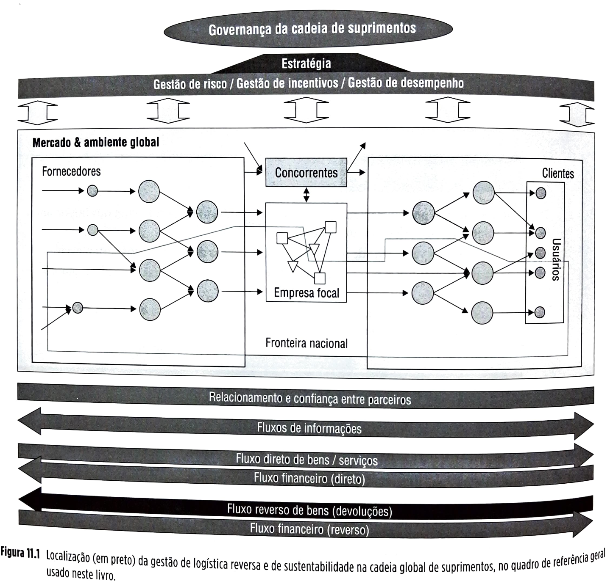
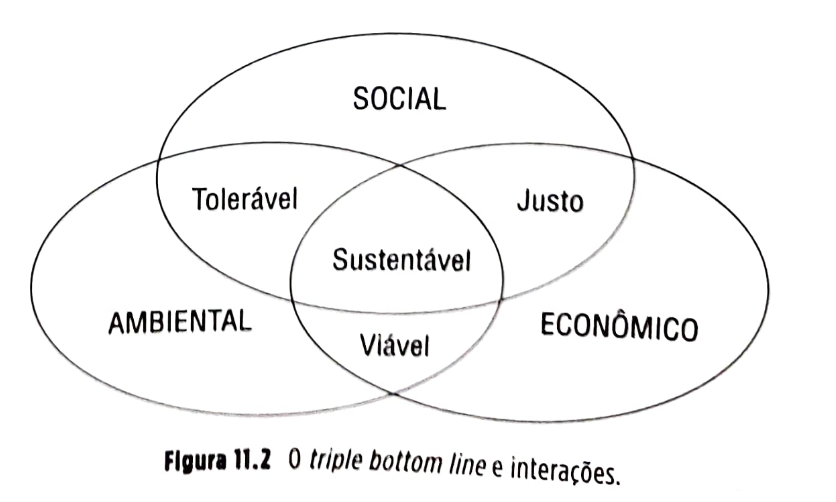
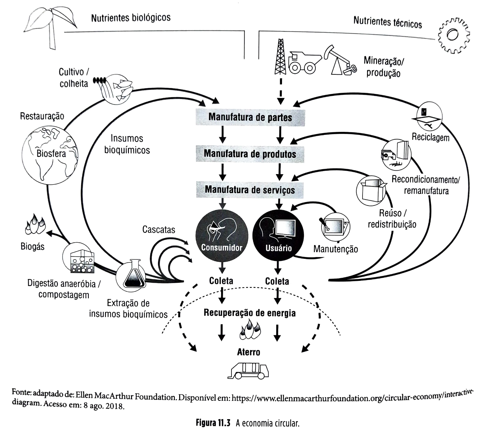
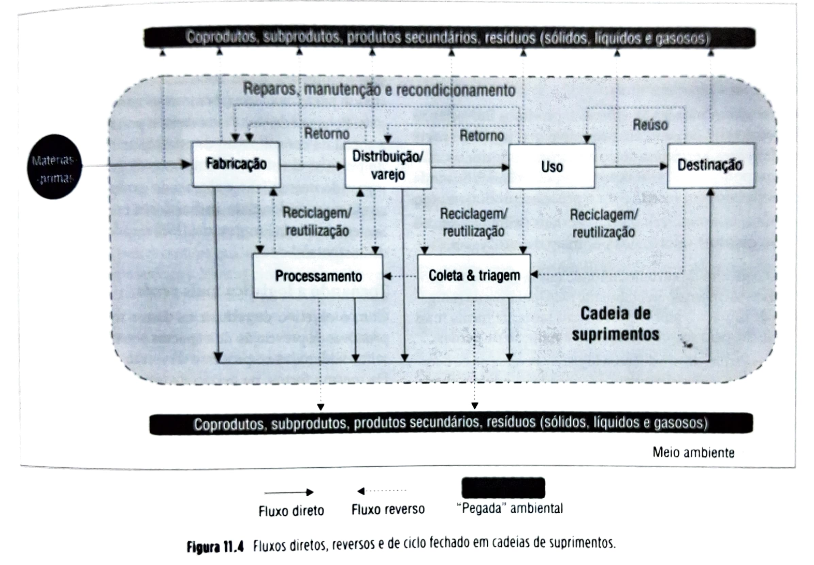

# CAPÍTULO 11 - Logística reversa e sustentabilidade na cadeia global de suprimentos

**11.1** Introdução, 327
**11.2** Conceitos, 330
**11.2.1** Sustentabilidade, 330
**11.2.2** As regras da biosfera e a economia circular, 333
**11.2.3** Pegada ecológica, 334
**11.2.4** A pressão por maior sustentabilidade, 336
**11.2.5** Tipos de ciclo fechado em cadeias de suprimentos, 339
**11.2.6** Aspectos gerenciais das cadeias de suprimentos de ciclo fechado, 342
**11.2.7** Configuração logística de cadeias reversas, 346
**11.2.8** Aspectos de planejamento e controle em cadeias de ciclo fechado, 348
**11.3** Estudos de caso, 349
**11.3.1** Estudo de caso I: Remanufatura na Xerox, 349
**11.3.2** Estudo de caso II: Cadeia de ciclo fechado na Hewlett Packard, 352
**11.4** Resumo, 354

## Página 327

### 0BJETIVOS DE APRENDIZAGEM

📌 Sintetizar o porquê de a sustentabilidade ter ganhado força como um dos importantes objetivos das cadeias de suprimentos.

📌 Entender as vantagens de se desenvolverem cadeias de suprimentos sustentáveis.

📌 Explicar as relações entre a sustentabilidade e a logística reversa em cadeias globais de suprimentos.

📌 Conceituar os principais fluxos envolvidos na logística reversa e nas cadeias de suprimentos de ciclo fechado e como gerenciá-los.

📌 Saber como definir a estrutura logística reversa em cadeias de suprimentos.

## 11.1 INTRODUÇÃO

Este capítulo trata da gestão de logística reversa (fluxos materiais de sentido contrário àquele que vai dos fornecedores das matérias-primas para o usuário), das cadeias de suprimentos de ciclo fechado (*closed loop supply chains*) e da sustentabilidade nas cadeias globais de suprimentos. Sustentabilidade em cadeias de suprimentos, de forma bem simples, visa garantir que o atendimento de necessidades *correntes* da cadeia de suprimentos não comprometa o atendimento, pelas gerações *futuras*, das *suas* necessidades. Os dois temas – logística reversa/cadeias de ciclo fechado e sustentabilidade – são aqui tratados num mesmo capítulo porque são conceitos interligados. Na verdade, muitos dos fluxos de logística reversa em cadeias de suprimentos são estabelecidos como parte do esforço de criar cadeias de suprimentos mais sustentáveis. Um exemplo são os fluxos reversos de embalagens usadas de alumínio (latas), indo do usuário final para os fabricantes visando à sustentabilidade, ou seja, aumentar a parcela de matéria-prima reciclada na produção de novos produtos feitos do material, diminuindo a probabilidade de exaustão futura das jazidas de bauxita (o mineral do qual se extrai o alumínio), o que mais cedo ou mais tarde ocorreria se todas as latas de alumínio usadas acabassem nos aterros e lixões, sem reutilização ou reciclagem.

Quanto ao aspecto econômico da questão, embora as opções associadas aos fluxos reversos, como a reutilização, a remanufatura, a reforma, a reciclagem e outras, tenham sido frequentemente associadas a atividades geradoras apenas de custo, a boa gestão de logística reversa em cadeias de suprimentos deve visar não apenas à minimização de custos dos fluxos reversos, mas também a geração, manutenção e recuperação do *valor* potencialmente gerado por eles. Por exemplo, fabricar novos produtos de alumínio a partir de material reciclado não só ajuda o objetivo de sustentabilidade, mas também é muito mais barato que produzir alumínio a partir de matéria-prima virgem. A produção de uma lata de alumínio a partir de latas recicladas consome apenas 4% da energia necessária para produzir a mesma lata a partir de bauxita. De forma similar, fluxos reversos eficientes também ajudam na geração de valor das cadeias que produzem e entregam produtos de alumínio.

## Página 328

A Figura 11.1 ilustra, no quadro geral de referência deste livro, onde se localiza a gestão de logística reversa e sustentabilidade na cadeia global de suprimentos.

### Empresas conciliam restrições de consumo de recursos naturais com a oportunidade de ser mais eficientes

Empresas em todo o mundo vêm se empenhando a fim de dar um choque de ecoeficiência à sua gestão. A perspectiva de escassez de água limpa, a elevação dos custos de energia a partir de fontes não renováveis e a crescente demanda da sociedade por uma atitude mais ambientalmente responsável criaram um novo e desafiador cenário para as empresas – e também uma série de oportunidades de conciliar a diminuição do impacto ambiental com uma produção mais eficiente. Uma estimativa recente elaborada pela ONG inglesa The Climate Group (www.theclimategroup.org) aponta que a economia de países e empresas com programas de uso eficiente de recursos, como água e energia, pode chegar a 2,5 trilhões de dólares por ano. A seguir, dois casos de empresas que dispararam medidas relevantes nesse sentido.

## Página 329

### Roche

A Roche ([www.roche.com](https://www.roche.com)) é a empresa mais sustentável do setor de saúde do Índice Dow Jones de Sustentabilidade por nove anos consecutivos. Um minucioso arsenal de metas e medidas levou a indústria farmacêutica suíça a um dos mais abrangentes programas de reestruturação energética em todo o planeta. Há objetivos ambiciosos e verificados ano a ano para reduzir o consumo de diversos insumos e as emissões de gases de efeito estufa. Como resultado, enquanto as vendas anuais quase quintuplicaram de 1996 a 2017, alcançando cerca de 53 bilhões de dólares, o consumo energético manteve um ritmo menos acelerado e cresceu, proporcionalmente, muito menos, em torno de três vezes. O consumo por empregado, uma das métricas mais usuais para verificar os resultados de um plano de eficiência energética numa empresa em expansão, foi reduzido em mais de 30% em 20 anos. A companhia criou até seu indicador de ecoeficiência, conhecido pela sigla em inglês EER (ou taxa de ecoeficiência), que decuplicou no mesmo período. Uma das principais rupturas no caso da Roche foi substituir o carvão por outros combustíveis renováveis em suas fábricas em cerca de 150 países a partir de 2005. Essa mudança foi fundamental para a redução drástica de suas emissões de carbono. Desde 2010, 1.411 projetos de substituição de equipamentos por outros mais eficientes foram completados e em 2017 resultaram em uma redução de 177.050 toneladas de CO2. Também o consumo de energia da empresa como um todo, de 2015 a 2017, foi reduzido em 9%, e o de água, em 11%.

Um dos grandes aliados da Roche para acelerar seus programas de redução de consumo de energia é um programa de incentivo à participação de funcionários com ideias inovadoras. A empresa criou em 1995 uma competição chamada Ecompetition, em que os funcionários concorrem com ideias que possam melhorar os índices de ecoeficiência. Os vencedores ganham uma viagem de fim de semana à Suíça. Em 2004, por exemplo, uma equipe dos Estados Unidos foi uma das 18 vencedoras com um projeto que em três anos diminuiu o consumo de energia em 30% num laboratório da fábrica da Roche em Palo Alto, na Califórnia.

A busca pela eficiência exigiu que a Roche passasse uma espécie de pente-fino em todos os seus processos. A empresa iniciou programas de reaproveitamento de gases para a produção de energia, substituiu lâmpadas incandescentes por fluorescentes, substituiu equipamentos, melhorou o isolamento das paredes de seus prédios (para reduzir a necessidade de aquecimento em dias frios) e vem ampliando sua frota de carros híbridos, que, movidos a gasolina ou eletricidade, já representam parcela substancial da frota de veículos da empresa nos Estados Unidos. A empresa contrata regularmente centenas de auditores para verificar os mais de 120 prédios, entre escritórios e fábricas da companhia ao redor do mundo, a fim de acompanhar o cumprimento das metas – revistas e ampliadas a cada cinco anos.

### Unilever

A Unilever ([www.unilever.com](https://www.unilever.com)) também, no seu setor de cuidados pessoais e com a casa, foi a empresa mais sustentável do Índice Dow Jones de sustentabilidade em 2017, classificação obtida 18 vezes desde 1999. Entre os anos de 2008 e 2017, o consumo de CO2 por tonelada de produto produzido pela Unilever foi reduzido em 47%, e o de água, em 39%.

Muitas empresas que se propõem a reduzir o uso de recursos costumam centrar fogo apenas no consumo de suas linhas de produção. A Unilever, contudo, decidiu assumir uma postura ainda mais abrangente. Nos anos 1990, seus executivos, a partir de análises do ciclo total de vida dos seus produtos, concluíram que as operações fabris representavam menos de 5% do que eles chamaram de *water imprint* – os "rastros" de consumo de água em toda a cadeia que precede a produção até o consumo final. A maior parte desses rastros estava associada ao cultivo de matérias-primas de seus alimentos e ao uso pelos consumidores de seus produtos de limpeza e higiene pessoal. A conclusão foi vital para que a empresa adotasse um enfoque inovador em relação ao tema. Em vez de se preocupar apenas com suas operações, a Unilever passou a desenvolver projetos que envolvessem seus fornecedores e também estimulassem os clientes a usar menos água. No caso dos produtores, a empresa começou a disseminar técnicas de irrigação por gotejamento nas lavouras de tomate, espinafre, chá e ervilhas. Na outra ponta, ao consumo, a abordagem também foi audaciosa. Em 2005, a empresa decidiu que sua área de pesquisa e desenvolvimento de produtos domésticos e de cuidado pessoal precisaria reavaliar a integração dos aspectos social, econômico e ambiental no desenvolvimento de novas marcas e também na revisão de produtos existentes. Na prática, o resultado foi a criação de produtos como o detergente para lavar roupas All Small and Mighty, com dois terços a menos de água em sua composição do que seus concorrentes. Lançado inicialmente nos Estados Unidos, o produto também possibilitou reduzir o tamanho das embalagens, que ficaram com apenas um terço das dimensões do modelo antigo. Outra investida foi a reformulação do detergente para lavar roupas Surf Excel, à venda na Índia.

O objetivo foi fazer com que o produto gerasse menos espuma, poupando até dois baldes de água por lavagem.

Dentro de casa, a empresa também vem colhendo bons resultados. Em regiões secas, muitas das unidades da Unilever perseguem a meta de zerar o despejo de efluentes líquidos nos rios, reciclando-os para uso na irrigação ou na lavagem das fábricas. Na Índia, a quase totalidade das 48 unidades da companhia já alcançaram o objetivo. A empresa não revela quanto economiza por ano em todo o mundo com suas metas de redução de consumo de água; alguns pequenos exemplos, porém, demonstram a dimensão dessa economia. A iniciativa em uma de suas fábricas, localizada em Caivano, no sul da Itália, por exemplo, impediu a perda de quase 20% de toda a água consumida pela unidade – antes evaporada em torres de resfriamento. Com isso, deixou de gastar 130 mil dólares por ano.

## Página 330

Mas por que sustentabilidade tem ganhado tanta atenção dentro das empresas e na sociedade em geral?

## 11.2 CONCEITOS

### 11.2.1 Sustentabilidade

| ⚠️**Conceito-chave**⚠️{bg=verde} |
| --- |
| Desenvolvimento sustentável, segundo a Comissão Mundial de Ambiente e Desenvolvimento (WCED, 1987 – Brundtland Report), é desenvolvimento que atende as necessidades do presente sem comprometer a habilidade de as gerações futuras atenderem suas próprias necessidades. |

Essa definição é considerada vaga e geral por alguns autores, fazendo com que muitos chamem a atenção para o fato de que ela pode até suscitar mais perguntas que respostas. Algumas delas são (Linton *et al.*, 2007):

▪️Quais recursos as futuras gerações necessitarão?
▪️Em que níveis os poluentes podem ser liberados sem que exerçam impacto nas futuras gerações?
▪️Quanto de novos recursos utilizáveis serão descobertos no futuro?
▪️Em que medida os recursos renováveis podem ser explorados de forma que *continuem* renováveis?
▪️Quanto a tecnologia pode resolver o paradoxo da necessidade de uso sustentável de recursos com a crescente demanda mundial por riqueza material?
▪️Em que medida o mercado pode induzir esforços de sustentabilidade?
▪️O estilo de vida atual de mudar? Se sim, como?
▪️Quais políticas são necessárias para se atingir sustentabilidade?

Tem ficado cada vez mais claro para a sociedade como um todo, entretanto, que lucro não deve ser o único elemento definidor de sucesso de empresas e economias. Também importantes são os futuros das pessoas (internas e externas à organização em foco) e do planeta (Kleindorfer *et al.*, 2005). Essas preocupações são capturadas por medidas de desempenho organizacional mais abrangentes como o *triple bottom line* (3BL), que representa algo como “tripla linha de baixo” dos demonstrativos financeiros: avaliações de desempenho organizacional quanto aos três Ps – de Pessoas, *Profit* (lucro) e Planeta –, crescentemente adotado por empresas que lideram esse movimento.

Essas preocupações ganharam muita força com o crescimento econômico mundial das últimas três décadas, em que países como Brasil, Rússia, Índia, China e África do Sul (os chamados países BRICS, grandes economias que têm passado, não sem alguma turbulência, por acelerado desenvolvimento) e outros se juntaram às economias mais desenvolvidas, aumentando tremendamente a taxa de consumo de recursos naturais (incluindo os não renováveis) demandados para atender as necessidades e desejos de consumo das centenas de milhões de pessoas destes e de outros países em desenvolvimento.

Além disso, há outros impactos potencialmente danosos de um crescimento nos moldes atuais: por um lado, para atender as necessidades energéticas e de outros recursos de produção para o desenvolvimento acelerado, o mundo tem gerado quantidades crescentes de emissões poluentes que, além de prejudicarem a qualidade do ar, da água e do solo, também, argumentam os cientistas, têm sido responsáveis pelo gradual aquecimento do planeta, o que, se continuar, trará consequências desastrosas. Adicionalmente, a disposição de produtos, embalagens e outros materiais, depois do seu uso, tem enchido os aterros sanitários e lixões numa taxa sem precedentes e, certamente, não sustentável por muito tempo.

## Página 331

### Lei dos grandes números

Para ilustrar o efeito de se terem milhões (ou, mais provavelmente, bilhões) de novos consumidores com acesso a produtos no mundo: segundo estimativas da ONU, a população mundial vai crescer dos atuais 6,7 bilhões para 9,2 bilhões em 2050. Além disso, já ocorre a expressiva entrada de milhões de habitantes atuais no mundo do consumo, prevista para aumentar muito nos anos futuros.

Se a cada um de um bilhão de novos consumidores for dada uma lâmpada (mesmo as econômicas lâmpadas LED) de 8,5W (correspondente, em termos de luminosidade, a uma lâmpada incandescente de 60W), uma só, o peso combinado destas lâmpadas seria equivalente a 20 mil toneladas, ou aproximadamente 15 mil carros médios.

Isso, por si só, já consome bastantes recursos, energia e gera poluentes para ser produzido. Se depois de usadas forem meramente descartadas, essas lâmpadas ocuparão um bom espaço nos aterros sanitários.

Ainda, se cada um destes novos consumidores acendessem a sua lâmpada por quatro horas num dia, isso consumiria 1.400 megawatts em qualquer momento durante essas horas. Apenas para gerar essa energia, seriam necessárias algo como três novas usinas termoelétricas médias, queimando enormes quantidades de carvão (que é um mineral não renovável) e gerando emissões poluentes.

Isso sem considerar que as necessidades e desejos de qualquer novo bilhão de consumidores não vai se restringir a uma simples lâmpada ligada quatro horas por dia. Pense na energia necessária para equipar os televisores, os computadores, os iPads, os aquecedores de água, aparelhos de ar-condicionado e geladeiras que eles também utilizarão... É fácil concluir que é melhor que o mundo ache rapidamente formas mais eficientes de produzir (e dispor de) produtos e gerar energia se quiser que as futuras gerações continuem sendo capazes de atender suas necessidades e desejos.

| ❓**Para pensar**❓{bg=vermelho} |
| --- |
| Um computador médio tipo *notebook* pesa algo em torno de 2,4 kg e obsolesce em cinco anos. Faça uma conta rápida e calcule qual o peso equivalente dos computadores que 10 milhões de usuários fariam chegar, a cada cinco anos, aos aterros sanitários se meramente jogassem fora seus *notebooks* ao final de sua vida útil, só na região da Grande São Paulo. |

### Logística reversa

Os fluxos reversos têm crescido em importância. Contra a corrente dos fluxos diretos, eles fluem da ponta do consumo para trás. Exemplos são os materiais e componentes de produtos ou de processos que, após serem consumidos ou utilizados, são coletados e transportados para trás nas cadeias de suprimentos a fim de serem reutilizados ou reciclados e reincorporados, ou à mesma cadeia de suprimentos (como o caso de latas de alumínio, coletadas após o uso e enviadas para serem recicladas e virarem novas latas) ou a outras cadeias (como no caso de embalagens de garrafas PET, que são coletadas após o uso, recicladas e utilizadas, por exemplo, na produção de fibras têxteis).

Outro exemplo são as devoluções comerciais de produtos que fluem no sentido reverso (para "montante") com intuito de passarem por operações de limpeza, reparo, remanufatura ou outras, para novamente serem enviados para "jusante", até o consumo.

Por se tratar de fluxos reversos em relação aos fluxos diretos tradicionais das cadeias de suprimentos, a parte da logística que gerencia os recursos e processos referentes aos fluxos reversos é chamada de "logística reversa".

### Cadeias de suprimentos de ciclo fechado

Como esses fluxos reversos normalmente visam à reincorporação dos materiais ao sistema produtivo direto, para revenda, frequentemente esses sistemas são chamados de cadeias de suprimentos de "ciclo fechado", ou, em língua inglesa, *closed-loop supply chains*. As cadeias de suprimentos de ciclo fechado, portanto, são aquelas compostas de fluxos diretos e reversos, formando "ciclos" que fazem materiais (usados ou não) retornarem a pontos anteriores da cadeia para reutilização ou reprocessamento para nova utilização.

### Sustentabilidade e o *Triple Bottom Line* (TBL ou 3BL)

Conforme já mencionado, na inserção do conceito de sustentabilidade no ambiente empresarial, um conceito de grande relevância é o do *triple bottom line* (TBL ou 3BL), uma referência à linha de baixo — do resultado — dos demonstrativos financeiros. O TBL representa o tripé da sustentabilidade. Segundo esse conceito, requisitos sociais, ambientais e econômicos das atividades produtivas devem ser geridos de forma integrada (Elkington, 1997). O TBL também pode ser entendido como o equilíbrio entre os três Ps (em língua inglesa), ou seja, aos três tipos de "resultado", relacionados a: Pessoas (*People*, "Social"), Lucro (*Profit*, "Econômico") e o Planeta (*Planet*, "Ambiental").

Figura 11.2 O *triple bottom line* e interações. 

## Página 332

Enquanto o foco usual das empresas é obter ganhos financeiros e vantagem competitiva no mercado, segundo a proposta do TBL, deve-se priorizar um meio ambiente socialmente justo, ecologicamente correto e economicamente viável. As interações entre as esferas social, ambiental e econômica podem resultar em diferentes aspectos da sustentabilidade. Enquanto a interface da esfera econômica com a social prioriza a geração de emprego e renda que favoreçam o social, a interseção entre as esferas econômica e ambiental enfatiza ações ambientais que sejam economicamente viáveis. Na interação das esferas social e ambiental são estimuladas as atividades sociais que não impactem o meio ambiente de forma intoleravelmente danosa. Na interseção das três esferas se encontra a sustentabilidade num sentido mais abrangente.

### Sustentabilidade como vantagem competitiva

A prática da sustentabilidade gradativamente tem sido percebida como uma potencial fonte de vantagem competitiva estratégica.

A busca da sustentabilidade ocorre tanto por meio da redução dos impactos (econômicos, sociais e ambientais) quanto por meio da prática de medidas compensatórias. Um exemplo de medida compensatória é a negociação de cotas de carbono mediante critérios estabelecidos pelo conceito de Mecanismo de Desenvolvimento Limpo – MDL (ou *Clean Development Mechanism*).

Várias empresas hoje incluem em seus relatórios anuais de resultados quesitos como emissões atmosféricas, consumo de água e energia e impacto socioambiental como métricas de avaliação do desempenho ambiental organizacional. Por um lado, estabelecem metas para a redução ou mitigação dos impactos negativos (como é o caso das emissões), e, por outro, buscam a potencialização dos impactos positivos (como a geração de empregos e melhoria da qualidade de vida).

| 🔵**SAIBA MAIS**{bg=azul} |
| --- |
| **Walmart Brasil lança Projeto Sustentabilidade de Ponta a Ponta**  O Walmart Brasil e alguns dos seus principais fornecedores lançaram no final dos anos 2000 o projeto Sustentabilidade de Ponta a Ponta, contemplando um universo de 7 mil fornecedores e 60 mil itens. As empresas parceiras desenvolveram alterações significativas em produtos do seu portfólio, a fim de reduzir seus impactos socioambientais. Além da sustentabilidade na produção, o projeto visa colaborar ainda com o consumo consciente, afirma o presidente do Walmart Brasil, Héctor Núñez. Segundo ele, "Os produtos trazem diferenciais que vão da redução ou alteração do tipo de embalagem e matéria-prima utilizados, optando por opções recicláveis ou certificadas, à diminuição no consumo de energia, água e dos resíduos sólidos gerados". O papel do Walmart foi fornecer suporte técnico – representado pelo CETEA (Centro de Tecnologia de Embalagens), ligado ao Instituto de Tecnologia de Alimentos (ITAL), do Governo de São Paulo – para todo o processo de desenvolvimento do produto, avalizando os resultados apresentados pelas empresas do início ao fim da cadeia produtiva. Além disso, a empresa ofereceu a garantia de compra, a visibilidade e exposição diferenciada desses itens no ponto de venda.  O projeto contou com reuniões mensais que envolviam o mapeamento da cadeia produtiva do produto, a identificação de oportunidades de otimização e reduções de impactos ao meio ambiente em cada etapa de seu desenvolvimento, além de mais de 3 mil horas de consultoria técnica, com reuniões entre o fornecedor, o Walmart e o CETEA (Centro de Tecnologia de Embalagens).  Ao todo, dez produtos vendidos na Walmart foram "esverdeados". São eles: ■ o achocolatado Toddy Orgânico, da Pepsico; ■ a linha de águas Pureza Vital, da Nestlé; ■ o amaciante Comfort Concentrado, da Unilever; ■ o Band-Aid, da Johnson&Johnson; ■ o desinfetante Pinho Sol, da Colgate-Palmolive; ■ a esponja de banho Ponjita Naturals Curauá, da 3M; ■ a fralda Pampers Total Comfort, da Procter&Gamble; ■ o Matte Leão Orgânico, da Coca-Cola Brasil; ■ a linha de óleos vegetais Liza, da Cargill; e ■ o sabão TopMax, do Walmart, fabricado pela gaúcha Bertolini. Somada a essa iniciativa, CEOs de 20 grandes indústrias firmaram o Pacto pela Sustentabilidade Walmart Brasil, em prol de práticas mais sustentáveis em toda a cadeia de suprimentos. Entre os pactos, na área de cadeia produtiva e redução de embalagem, as empresas se comprometeram a: 1. Compras responsáveis ■ reduzir em 70% o fosfato nos detergentes para lavanderia e cozinha até 2013; ■ oferecer produtos de lavanderia, no mínimo, duas vezes mais concentrados até 2012; ■ oferecer pelo menos um produto orgânico por categoria de alimentos até 2012; ■ estimular as vendas de produtos com diferencial em sustentabilidade; ■ apoiar e estimular o desenvolvimento de produtos de ciclo fechado; ■ produtos de marca própria do Walmart Brasil devem liderar pelo exemplo em sustentabilidade.  2. Redução de resíduos ■ reduzir as embalagens em 5% até 2013; ■ implantar o *Packaging Scorecard* até 2009; ■ reduzir o consumo de sacolas plásticas em 50% até 2013. |

## Página 333

### 11.2.2 As regras da biosfera e a economia circular

Unruh (2008) propõe uma abordagem interessante para a gestão de recursos naturais denominada Regras da Biosfera. De acordo com o autor, deve-se partir de um entendimento biológico a partir do qual se utilizam os recursos e estrutura dos diferentes ecossistemas para suportar a vida em suas diferentes dimensões, em contraste ao entendimento industriológico da manufatura. Este último assume que é possível utilizar livremente uma enorme gama de materiais sintéticos a serem transformados em processos produtivos, o que não necessariamente é sustentável.

O autor propõe três regras da biosfera básicas para apoiar o entendimento biológico, mais sustentável, conforme a seguir:

**Regra 1. Uso de uma paleta parcimoniosa**
Os elementos químicos da tabela periódica são os elementos básicos de tudo o que há na natureza e no mundo sintético. No entanto, de forma surpreendente, apesar da existência de mais de 118 elementos, a natureza se utiliza basicamente de quatro desses — carbono, hidrogênio (H), oxigênio (O) e nitrogênio (N) — para produzir todas as coisas vivas. Noventa e oito por cento da massa de um ser humano são constituídos por apenas esses três elementos (H, O e N). A parcimônia no uso dos recursos nos sistemas naturais favorece a reciclagem, em contraste com a utilização de uma ampla variedade de recursos e baixo potencial de reciclabilidade da maior parte dos produtos produzidos nos sistemas industriais.

**Regra 2. Cycle up**
A padronização garante que as matérias-primas estejam sempre disponíveis aos organismos, não havendo necessidade de triagem ou seleção. Na natureza, com a morte de um organismo a biosfera recupera os materiais e os reinsere em outros processos de forma eficiente e constante, para o mesmo uso original ou uso superior, o que é chamado de *upcycling* (exemplos são o alumínio e o vidro). O *downcycling*, ao contrário, destrói o valor original, como ocorre às vezes com a redução da qualidade dos produtos produzidos a partir de material reciclado (por exemplo, pneus virando material de pavimentação de ruas). A biosfera não possui processos de *downcycling*, mas os sistemas industriais sim. A biosfera ainda se utiliza da obsolescência biológica "planejada" para a realização dos processos de reciclagem. O processo de formação de novos organismos ocorre a partir de elementos resultantes da degradação ou morte de organismos mais antigos. Desta forma, o potencial produtivo de organismos mais novos e sadios garante a permanente eficiência do sistema.

**Regra 3. Exploração do poder das "plataformas"**
Desde os organismos mais simples, a biosfera vem passando por um permanente processo evolutivo que vem tornando os organismos mais complexos e, ao mesmo tempo, mais eficientes e adequados ao ambiente no qual se inserem. Em outras palavras, o *design* dos organismos passa por constante adequação com a finalidade de adaptação às adversidades ou facilidades que o ambiente propicia. Esse *design* é a *plataforma* para a construção da biodiversidade que conhecemos hoje.

Assim como os sistemas biológicos, os sistemas industriológicos têm explorado o poder das plataformas. A esse respeito é observada uma analogia com os sistemas informatizados — plataformas operacionais que possuem uma ampla diversidade de aplicações em constante processo de adaptação. Da mesma forma, o processo de manufatura no setor automobilístico, por exemplo, usa intensamente as "plataformas". Observe, por exemplo, um VW Beetle e um Audi TT.

Ambos os veículos são produzidos a partir de uma plataforma comum (chassi, estrutura, entre outros). No entanto, em outras indústrias do sistema industriológico, tem sido priorizado o critério de usar componentes e peças específicos que irão gerar um produto diferenciado, em vez de se buscarem materiais mais padronizados, poucos elementos fundamentais a partir dos quais componentes e produtos finais são construídos para que seja facilitada a reciclagem.

## Página 334

A proposta de Unruh (2008) possibilita aprendizado a respeito de eficiência e interconexão entre ecossistemas – sejam eles industriais ou naturais.

Similarmente, a Fundação Ellen MacArthur propõe o conceito de economia circular. Veja a Figura 11.3.

O princípio da economia circular está pautado no conceito da ecologia industrial e compreende a interação de diferentes agentes em diferentes sistemas.

**Figura 11.3** A economia circular.

### 11.2.3 Pegada ecológica

A expressão "pegada ecológica" foi usada pela primeira vez por dois professores universitários canadenses, William Rees e Mathis Wackernagel. Pretende ser uma medida para calcular o impacto anual (devido aos recursos naturais que, direta ou indiretamente, consomem) dos seres humanos no ambiente quando vivem de acordo com o seu estilo de vida habitual. A pegada ecológica tem sido usada como indicador de sustentabilidade ambiental. É uma ferramenta que permite avaliar até que ponto o nosso impacto já ultrapassou o limite, ajudando-nos a perceber se vivemos de forma sustentável.

A mitigação dos impactos ambientais consiste num dos principais aspectos a serem geridos na busca pela sustentabilidade. A partir da identificação dos danos ambientais atuais e potenciais, bem como da mensuração das pegadas ecológicas de produtos e processos, é possível a quantificação dos impactos. Isso permite a redução de incertezas e o aumento da eficiência na gestão dos processos produtivos.

## Página 335

A Figura 11.4 ilustra os vários fluxos, diretos, reversos e de ciclo fechado que muitas empresas contemporâneas têm de gerenciar. Todos os fluxos de saída que cruzam as "fronteiras" do sistema representado pela cadeia de suprimentos representam fatores que podem contribuir para a pegada ecológica da cadeia: emissões (gases como o gás carbônico, por exemplo, que contribuem para o chamado efeito estufa e outros), efluentes (como líquidos resultantes de processos, drenados para ou despejados nos sistemas fluviais) e descartes sólidos em geral (como produtos e embalagens usados jogados fora, em aterros sanitários, ou incinerados). Quanto mais relevantes forem os fluxos reversos e de ciclo fechado, internos à cadeia de suprimentos (materiais tomando parte de ciclos de reciclagem, recuperação ou reutilização) e quanto mais eficientes forem os processos internos à cadeia, menos relevantes serão os fluxos que saem do sistema e menores serão as pegadas ecológicas desta.

Figura 11.4 Fluxos diretos, reversos e de ciclo fechado em cadeias de suprimentos.

**Os fluxos nos sistemas de logística direta e reversa**

O sistema produtivo tem início a partir da obtenção da matéria-prima a ser processada. As matérias-primas podem ser classificadas como naturais (madeira, água, minerais), compostas (compósitos, fibras e aglomerados), maciças metálicas (ferrosas e não ferrosas) e maciças não metálicas (cerâmicas, polímeros e semicondutores). Os recursos ou matérias-primas naturais podem ser classificadas como renováveis e não renováveis. O conceito de sustentabilidade reside, entre outros aspectos, na priorização do uso de recursos renováveis e na reciclagem dos resíduos, subprodutos, matérias secundárias e coprodutos.

A seguir, algumas definições relevantes a esse respeito:

▪️**Matérias-primas/componentes:** toda substância a partir da qual se fabrica um produto e da qual é obrigatoriamente parte integrante. Provenientes da natureza, com ou sem processamento anterior. Podem ser classificadas em renováveis e não renováveis.

▪️**Coprodutos ou produtos secundários:** resultam necessariamente da produção do produto principal, não se integram ao produto final e podem ter valor significativo. Na cadeia do biodiesel, por exemplo, a glicerina e a torta são exemplos de coprodutos do biodiesel que podem ser utilizados como insumo no setor químico e na alimentação animal, respectivamente. Exemplos de coprodutos gerados na produção do aço são as escórias de aciarias, as escórias granuladas de alto-forno, os pós dos sistemas de despoeiramento, as lamas das estações de tratamento de água, alcatrão, entre outros. De acordo com a NBR ISO 14.044, de 2009, coprodutos são dois ou mais produtos procedentes do mesmo processo elementar ou sistema produtivo.

## Página 338

▪️**Subprodutos:** também produzidos com o produto principal, porém, com valor de mercado significativamente inferior. No caso da industrialização de carne bovina, os ossos, chifres e cascos seriam subprodutos.

▪️**Produtos intermediários:** produtos acabados de um processo produtivo que exercem sua funcionalidade integrando-se à estrutura de outro produto de outro processo. Os pneus, por exemplo, constituem um produto intermediário na indústria automotiva, enquanto os feixos e botões são produtos intermediários na indústria de vestuário e as placas de circuito impresso são produtos intermediários na indústria dos equipamentos eletroeletrônicos.

▪️**Resíduos, emissões ou efluentes:** produtos indesejáveis resultantes do processo produtivo que, na maior parte das vezes, acarretam custo em ações mitigatórias, mas que podem, em casos específicos, ser evitados ou ainda revertidos em receita para o processo produtivo.

▪️**Matéria-prima secundária:** resíduos (sólidos, líquidos ou gasosos) valorizados por meio da reciclagem.

O conceito de sustentabilidade nas organizações produtivas foi inserido inicialmente pela tentativa de mitigação de impactos ambientais e, mais tarde, de forma mais eficiente, pelo reaproveitamento e redução de perdas.

Nas etapas de produção, a logística reversa pode ocorrer com o reaproveitamento de coprodutos e subprodutos, enquanto no estágio pós-consumo a logística reversa ocorre com o processamento de produtos usados para potencial reúso como matéria-prima secundária. Com isso, a gestão de produção e logística passou a incorporar aspectos de sustentabilidade ambiental aos seus processos operacionais tradicionais.

### 11.2.4 A pressão por maior sustentabilidade

Os consumidores e outros membros da sociedade hoje não se satisfazem apenas com a informação sobre os impactos ambientais negativos dos produtos nas fases de consumo e pós-consumo, mas querem informações a respeito da origem da matéria-prima, das técnicas utilizadas para o processamento dos materiais envolvidos e informações sobre o que os componentes da cadeia de suprimentos fazem para mitigar ou reduzir esses impactos desde o projeto e desenvolvimento dos produtos.

Ao ser incorporado como componente da gestão organizacional por pressões da sociedade organizada (ONG's e governo) e dos mercados, portanto, o conceito de sustentabilidade ambiental passou a exigir a adequação das ferramentas disponíveis no ambiente empresarial com vistas à inclusão do que pode ser chamado de "gestão ambiental" em seus processos operacionais.

A pressão por uma gestão mais "ambiental" induziu que a gestão de recursos e processos logísticos fosse adequada de forma a permitir que uma menor "pegada ecológica" fosse gerada pelo sistema produtivo por meio do uso mais intenso de conceitos como a reutilização, a reciclagem, e de formas mais adequadas de dispor dos resíduos não reutilizáveis e não recicláveis.

Os processos de reutilização e reciclagem se utilizam intensamente da logística reversa e da logística de ciclo fechado.

### Sustentabilidade e gestão logística

A inclusão de práticas de sustentabilidade ambiental na gestão logística ainda ocorre de forma incipiente e, na maior parte das vezes, como resposta às exigências legais. Poucas empresas percebem o potencial econômico e social da consolidação de estratégias e implementação de práticas ambientais. Empresas de grande porte têm investido nesse nicho e alcançado ganhos significativos, conforme evidenciam indicadores como o Índice de Sustentabilidade Empresarial (ISE) ou o Índice Dow Jones de Sustentabilidade.

### Tornando a logística mais *verde*

Com o objetivo de reduzir os danos ambientais, ações proativas de prevenção de impactos potenciais passaram a ser consideradas no processo de gestão das organizações. Da mesma forma, na gestão de resíduos sólidos, percebeu-se que a redução da geração de resíduos pela redução do consumo seria uma forma complementar de atacar o problema. No entanto, não é interesse das empresas reduzir, mas sim aumentar o consumo para atingir suas metas de desempenho econômico. Como seria possível equacionar a questão ambiental sem impactar o desempenho econômico?

### Desenvolvimento sustentável

Essa foi a principal questão que permeou as discussões no âmbito ambiental, ao longo das décadas de 1970 e 1980, até que foi proposto o conceito de desenvolvimento sustentável, que sugere o equilíbrio entre crescimento econômico e conservação ambiental. Ferramentas de gestão ambiental têm, desde então, sido propostas como forma de gerenciamento e avaliação ambiental.

Com o aumento da pressão da sociedade organizada para uma gestão ambiental mais sustentável e responsável, algumas empresas se ressentiram da falta de capacitação interna e de orientações gerais que permitissem tornar sua logística mais ambientalmente responsável, assim como da falta de mecanismos que permitissem que essas empresas exercessem algum tipo de influência sobre o comportamento de outros membros das suas cadeias de suprimentos no sentido de obter uma melhor gestão ambiental da cadeia de suprimentos como um todo.

## Página 337

**ISO 14000**

Nos anos 1990, parcialmente em resposta a essa carência, foram desenvolvidos procedimentos de certificação internacional, como aqueles da série ISO 14000, que "abordam vários aspectos da gestão ambiental. Elas oferecem ferramentas práticas para empresas e organizações, buscando identificar e controlar seus impactos ambientais e melhorar constantemente seu desempenho ambiental" (ISO 14000, 2018). Como muitas empresas ao redor do mundo passaram a se guiar pelas normas da série ISO 14000 para ajustar suas próprias operações e passaram a exigir que seus parceiros da cadeia de suprimentos (como seus fornecedores e clientes) também buscassem se certificar, verificou-se um crescimento da demanda sobre as empresas para adequarem os tradicionais critérios de mercado a padrões mais ambientalmente adequados.

Em outras palavras, empresas exportadoras precisaram adequar seus produtos e processos aos requisitos legais ambientais, não apenas dos seus próprios países, mas também aos dos países com os quais estariam negociando seus produtos e serviços. Muitas empresas perderam espaço no mercado internacional por não terem tido flexibilidade suficiente para se adequar. A questão ambiental se tornou um importante requisito de mercado, capaz inclusive de favorecer ou limitar a negociação entre empresas e até entre países.

**Integração entre logística e meio ambiente**

Nos Estados Unidos na década de 1990, o estabelecimento de limites legais quanto a emissões de determinados modos de transporte (usualmente chamados "modais" no jargão da logística) em alguns estados pode ser considerado um importante marco na interação entre a logística e o meio ambiente.

Bowman (1995) menciona empresas de grande porte como a DuPont e a Santa Fe Railway como pioneiras no desenvolvimento de estratégias e técnicas de segurança e sustentabilidade ambiental para o transporte de produtos perigosos e gerenciamento de emissões atmosféricas.

Os Protocolos de Montreal (década de 1980) e de Kyoto (década de 1990) foram os precursores do estabelecimento de metas quanto a limites de emissões atmosféricas. Metas de gestão foram então estabelecidas dentro das organizações tendo em vista a necessidade da redução das emissões atmosféricas dos Gases do Efeito Estufa (GEE).

As organizações tiveram de se adequar reorientando metas gerenciais e alocando/gerenciando recursos de forma mais ambientalmente eficiente. Entretanto, foi o Acordo da Basileia (década de 1990), do qual o Brasil é signatário, que estabeleceu os padrões mais importantes para a interface entre logística e meio ambiente por intermédio de considerações sobre a movimentação transfronteiriça de resíduos perigosos.

Os protocolos mencionados tiveram e têm, portanto, impacto direto na gestão organizacional, assim como se fizeram refletir nas políticas públicas.

Muitos países se adequaram aos limites de emissões promovendo a migração de parques industriais para outros países onde as exigências legais e normativas não estabeleciam restrições aos padrões de emissão atmosférica. Por meio desse mecanismo, muitas operações poluentes de empresas multinacionais se estabeleceram em países em desenvolvimento.

O Acordo da Basileia teve impacto também nas políticas do comércio internacional, uma vez que a movimentação de resíduos perigosos passou a ser regulamentada em comum acordo entre alguns países signatários. O objetivo central desse acordo foi estabelecer limites para a migração de resíduos dos países desenvolvidos para os países em desenvolvimento, o que ainda ocorre nos dias de hoje. Países da África e da Ásia, por exemplo, são ainda o principal destino de resíduos de equipamentos eletroeletrônicos (REEE).

**Fatores que fazem as empresas buscarem sustentabilidade e 3BL**

As empresas têm sofrido enormes pressões da sociedade, da legislação, de ONGs e outros grupos legítimos de pressão para medir seu impacto ambiental e usar a lógica embutida no 3BL em seus relatórios anuais para reportar a quantidade de energia e outros recursos que usam e a "pegada ecológica" que deixam para trás, no ambiente, com sua atuação.

**A Natura Cosméticos reporta seu resultado usando princípios 3BL**

A Natura Cosméticos é uma multinacional brasileira que comercializa seus produtos cosméticos e de bem-estar por meio de marketing direto, contando hoje com mais de 6,3 mil colaboradores, 1,7 milhão de consultores individuais independentes (que fazem o papel de distribuidores dos produtos na venda direta ao consumidor). A receita líquida, no ano fiscal de 2017, foi de 7,7 bilhões de reais, com crescimento de 7,8% sobre o ano anterior.

## Página 338

Em seu relatório anual de 2017, eis como a empresa descreve seu perfil:

A Natura é a maior multinacional brasileira do setor de cosméticos e uma empresa comprometida com a geração de impacto socioeconômico-ambiental positivo em todos os negócios, marcas e geografias em que atua. Chegamos a milhões de consumidores por diversos canais, sendo o principal deles cerca de 1,7 milhão de consultoras no Brasil, na Argentina, no Chile, na Colômbia, no México e no Peru. Além desses países, temos lojas físicas e *e-commerce* nos Estados Unidos e na França, e vendemos produtos na Bolívia por meio de um distribuidor local. No varejo, atuamos por meio de lojas próprias, franquias administradas por consultoras com perfil empreendedor e em parcerias com cadeias de farmácia. Com o Cadeia Natura, somos uma das maiores plataformas de vendas *on-line* de produtos de beleza do Brasil, e já implementamos o comércio digital no Chile, na Argentina, na França e nos Estados Unidos.

A Natura conta com mais de 6,3 mil colaboradores e foi a primeira companhia de capital aberto a receber a certificação Empresa B no mundo, em 2014, renovada em 2017. O movimento Sistema B caracteriza companhias que dão igual peso a seus resultados econômicos e socioambientais. Somos uma companhia aberta com ações na B3 (a bolsa de valores de São Paulo).

Em 2017, pelo quinto ano consecutivo, a Natura recebeu o prêmio World’s Most Ethical Companies, que relaciona as empresas mais éticas do mundo. O reconhecimento é do Etisphere Institute, organização global que atua para o aprimoramento de práticas empresariais éticas. Nossa estrutura é composta de sede administrativa em São Paulo (SP), fábricas em Cajamar (SP) e Benevides (PA), produção terceirizada na Argentina, na Colômbia e no México, oito centros de distribuição no Brasil e cinco na América Latina, um *hub* logístico em Itupeva (SP) e centros de pesquisa e tecnologia em São Paulo e Benevides.

Trabalhamos com uma cadeia de parceiros para promover inovação e atuamos em meio a toda a nossa cadeia para reduzir o impacto de nossos produtos, investindo no uso de materiais reciclados e na vegetalização de nossas fórmulas, taxa que alcança o patamar de 81%. Sempre que possível, acrescentamos ao que há de melhor na ciência cosmética o conhecimento tradicional de comunidades envolvidas na cadeia de ativos da sociobiodiversidade brasileira e temos aumentado progressivamente o número de famílias fornecedoras de insumos para nossos produtos. Também somos uma empresa carbono neutro desde 2007 – ou seja, compensamos todas as emissões de gases de efeito estufa (GEE) não apenas da Natura, mas de toda a nossa cadeia produtiva – e investimos em ações contínuas para a redução do volume de emissões. Para todos esses temas, temos metas estabelecidas na nossa Visão de Sustentabilidade 2050, cujo primeiro ciclo se encerra em 2020. A Visão serve como guia para transformar a Natura em uma empresa geradora de impacto positivo.

### UMA COMBINAÇÃO TRANSFORMADORA

Além de nossa atuação multinacional com a marca Natura, demos um passo decisivo para nos tornar um grupo global de cosmética, multimarca, multicanal e movido por propósitos, com a aquisição, em setembro de 2017, da The Body Shop.

Em seguida, apresenta dados que relatam o desempenho da empresa em cada uma das etapas de sua cadeia de valor (ou cadeia de suprimentos). Note a preocupação explícita em reportar medidas quanto às pessoas envolvidas no processo (distribuição de riqueza, índices de satisfação) e ao planeta (efeito estufa), no seu relatório anual, um documento que tradicionalmente se concentra nos resultados financeiros das empresas. Note também que o relatório de desempenho 3BL não se restringe às operações internas da empresa, mas se estende para trás e para frente na sua cadeia de suprimentos. Evidentemente, os resultados financeiros também são reportados, mas aparecem em último lugar no relatório de 2017 (e traz resultados econômico/financeiros muito bons, ou seja, não se trata de tentativa de subenfatizar aquela parte).

## Página 339

Os dados da tabela da Figura 11.5 constam do relatório anual da Natura de 2017:
| **Emissões na cadeia de valor (t)** | **2015** | **2016** | **2017** |
| --- | --- | --- | --- |
| Extração e transporte de matérias-primas e embalagens (processo e transporte até fornecedores diretos) | 127.788 | 122.337 | 119.101 |
| Fornecedores diretos (processo e transporte à Natura) | 31.731 | 30.378 | 29.574 |
| Processos industriais e internos | 18.557 | 15.633 | 16.754 |
| Venda de produtos (transporte e distribuição) | 66.749 | 63.465 | 62.751 |
| Uso de produtos e descarte de embalagens | 76.442 | 71.611 | 79.868 |
| **Total geral** | **321.267** | **303.424** | **308.048** |

**Figura 11.5** Emissões na cadeia da Natura Cosméticos.

### 11.2.5 Tipos de ciclo fechado em cadeias de suprimentos

Segundo Flapper *et al.* (2005), há vários tipos de cadeias de ciclo fechado, na prática, referentes às várias fases da cadeia de suprimentos: produção, distribuição, uso e fim de vida do produto. As empresas, quando definem suas cadeias globais de suprimentos devem decidir em quais fases vão "fechar ciclos".

#### Ciclos fechados na fase de produção

Três grupos principais de cadeias de ciclo fechado podem ser identificados em relação à fase de produção (que inclui a produção de componentes, semiacabados e produtos acabados):

▪️*Materiais produtivos obsoletos e consumíveis* (por exemplo, óleo lubrificante usado em processos), paletes e contêineres de transporte interno em fim de vida útil, entre outros, que podem ser reprocessados, reparados ou reciclados.

▪️*Refugo de produção*, como materiais e componentes que não possam ser localmente utilizados, como refis e sobras de processos de corte de chapas, papel, tecido e outros.

▪️*Produtos defeituosos* que não atendem a padrões correntes de qualidade. Alguns podem ser reprocessados e recuperados para uso similar ou diferente daquele inicialmente pretendido e vendidos como produtos de segunda qualidade.

#### Ciclos fechados na fase de distribuição

▪️*Devoluções ou retornos comerciais*, que são produtos vendidos com uma opção de devolução ao cliente. Nos Estados Unidos, por exemplo (diferentemente de outras regiões do globo), a maioria dos varejistas tem políticas de aceitar devoluções de produtos sem fazer perguntas, o que leva os percentuais de produtos devolvidos a serem substancialmente maiores que no Brasil ou na Europa. Para varejistas americanos como a Target ou Costco, chegam a ser retornados 6% dos produtos vendidos, enquanto na Europa esse percentual é de apenas cerca de 1%. Com o aumento das vendas de varejistas da internet, entretanto, as devoluções aumentaram muito em todas as regiões do mundo, chegando em algumas situações a atingir 50% (como na venda *on-line* de sapatos).

▪️*Entregas erradas*, com clientes devolvendo produtos porque foram entregues muito cedo, muito tarde, com defeito ou fora das especificações do pedido.

▪️*Recalls*, com produtos devolvidos quando defeitos reais ou potenciais são identificados pelo próprio fabricante e os clientes são solicitados a devolverem os produtos defeituosos para reposição ou reparo. Exemplos são brinquedos que possam colocar os pequenos usuários em risco, pneus, peças de carros etc.

▪️*Contêineres de distribuição*, como cartuchos de tinta para impressora, garrafas retornáveis de bebidas, entre outros, que são itens usados para facilitar a distribuição adequada dos produtos.

▪️*Produtos em final de leasing*, que são então devolvidos ao fabricante, como carros, copiadoras, máquinas operatrizes, aviões etc.

## Página 340

| 🔵**SAIBA MAIS**{bg=azul} |
| --- |
| **A política de devoluções do grande varejista americano Costco**  O Costco ([www.costco.com](https://www.costco.com)) é um dos gigantes do varejo norte-americano, com faturamento de 129 bilhões de dólares em 2017. Um dos principais concorrentes do Sam's Club, do Walmart, o Costco tem a seguinte política de devoluções para seus produtos, explícita em seu website:  "Nós garantimos sua satisfação com qualquer produto que vendemos e devolveremos o preço pago (sem perguntas), exceto: **Eletrônicos:** a Costco aceitará devoluções em até 90 dias (a partir do dia do recebimento do produto pelo cliente) de televisores, displays, projetores, eletrodomésticos grandes (refrigeradores, freezers, fogões, micro-ondas, lavadoras de pratos, lavadoras e secadoras de roupas), computadores, tablets, relógios inteligentes, câmeras, drones, camcorders, MP3 players e telefones celulares. **Diamantes – 1,00 ct ou maior:** membros, ao devolver um diamante maior que 1,00 ct, devem apresentar a documentação apropriada (certificados IGI/GIA) e receberão um memorando de crédito de joia. Em 48 horas, nosso especialista inspecionará a peça para autenticidade. **Cigarro e bebidas alcoólicas:** a Costco não aceita devoluções destes produtos em localidades onde são proibidas por lei. **Produtos com vida útil limitada,** como pneus e baterias, podem ser vendidos com uma garantia específica.  O processo de devolução em varejistas como o Costco é tão simples que o cliente nem mesmo precisa ter consigo o recibo de compra para efetuar a devolução. Se a compra foi feita por cartão de crédito, por exemplo, com o mesmo cartão em mãos, o funcionário encarregado localiza a compra no sistema de informação da loja e executa o reembolso usando o mesmo meio de pagamento da compra. Essa facilidade de devolução de produtos tem um efeito interessante nos consumidores que cedem mais facilmente ao impulso de comprar, por terem a certeza da facilidade de devolver em caso de arrependimento posterior. Esse fato é frequentemente usado pelos vendedores das lojas como arma de venda: “Leve, se não gostar é fácil devolver...”. É claro que essa facilidade também tem lados negativos. Por exemplo, é notório o aumento de vendas de grandes televisores LED, de tela plana ou curva, nas vésperas de jogos importantes de futebol americano, como aqueles do chamado Super Bowl. Notório também é o aumento, mais do que proporcional, das devoluções de grandes televisores de tela plana ou curva, na segunda-feira seguinte ao Super Bowl para um reembolso total.|

### Ciclos fechados na fase de uso

▪️*Itens que deverão retornar aos seus próprios donos ao final do ciclo*, como itens que sofrem recall ou sob garantia, que são devolvidos, reparados e enviados de volta ao usuário.

### Ciclos fechados na fase final de vida econômica

▪️*Produtos em final de vida útil que são enviados de volta ao produtor ou distribuidor para que possam ser reprocessados e reutilizados* (como no caso de copiadoras, por exemplo – veja o Estudo de caso 2, ao final deste capítulo) ou ter seus componentes e materiais reutilizados em outros produtos (como no caso de telefones celulares, pilhas, baterias, pneus, computadores e outros).

▪️*Embalagens em final de vida útil que são enviadas de volta para reutilização ou reciclagem para uso como embalagem ou outros produtos.* Hoje as garrafas PET usadas para armazenar refrigerantes, água e outros líquidos, são recicladas não apenas para se transformarem em novas garrafas, mas também em jeans, camisetas e outros produtos.

## Página 341

| 🔵**SAIBA MAIS**{bg=azul} |
| --- |
| **Nokia e a reciclagem de telefones celulares**   Um dos maiores fabricantes de telefones celulares do mundo, a Nokia ([www.nokia.com](https://www.nokia.com)) está à frente de uma disputada corrida pela reciclagem de equipamentos descartados. Poucos aparelhos eletrônicos se tornaram tão descartáveis quanto o telefone celular. Hoje, existem cerca de 6,8 bilhões de linhas de telefones celulares ativas – quase o equivalente à população do planeta. Em média, essa multidão troca o aparelho a cada dois anos. O descarte acelerado desses equipamentos representa um dos problemas ambientais mais graves da atualidade. Uma pesquisa da americana ReCellular ([www.recellular.com](https://www.google.com/search?q=https://www.recellular.com)), uma das maiores recicladoras de telefones celulares do mundo, mostra que mais de 150 milhões de aparelhos são descartados por ano, só nos Estados Unidos. Esse volume equivale, considerando o peso médio de 130 gramas por aparelho, a quase 20 mil toneladas de placas, circuitos, plásticos e baterias com substâncias tóxicas, além de metais pesados, como chumbo, lítio e cromo. Com a crescente pressão de ONGs e dos próprios consumidores, a capacidade de não deixar (ou pelo menos diminuir) essas pegadas no meio ambiente se tornou a nova base de competição entre as grandes fabricantes de celulares. Além de lançar o modelo mais fino, leve, colorido, funcional e inovador, essas empresas agora correm para criar os equipamentos mais verdes do mercado – que consomem menos energia e possuem menos materiais tóxicos e mais peças recicláveis.   Por trás dessa corrida existe uma mudança radical na maneira como as empresas pensam e estruturam seu negócio – desde a concepção dos produtos até a criação de novos caminhos para trazê-los de volta, com logística reversa. A pioneira nesse campo é a finlandesa Nokia, maior fabricante de celulares do mundo, com vendas de 27 bilhões de dólares em 2017. O pontapé inicial em seu programa de reciclagem aconteceu em 1995, com uma então tímida iniciativa de coletar aparelhos em lojas de assistência técnica – antes mesmo que existisse uma legislação a esse respeito. (A fabricante de celulares americana Motorola, por exemplo, iniciou a coleta de aparelhos usados em 2004.) Hoje, até 80% de um telefone celular Nokia pode ser reciclado, 15 pontos percentuais acima da atual norma da União Europeia, a mais rigorosa do mundo. A empresa estima que é responsável pela coleta de 2% dos telefones celulares de todas as marcas descartados anualmente – algo como cinco milhões de aparelhos (parte do material reciclado é reaproveitada pela própria empresa e o restante é vendido a terceiros). [...]    Uma das etapas mais críticas para fazer a estratégia verde dar certo é uma preocupação absolutamente inédita para essas fabricantes – convencer os consumidores a devolver os aparelhos em vez de simplesmente colocá-los na gaveta ou jogá-los no lixo. [...] A Nokia não divulga o investimento para estimular o retorno de aparelhos, mas hoje realiza campanhas em países da Europa, da América do Norte e da Ásia (principalmente China, Índia e Paquistão). Mais recentemente, a companhia intensificou a atenção aos países asiáticos, uma das regiões do mundo onde o consumo de aparelhos mais cresce. Uma de suas primeiras campanhas na região foi lançada em dezembro de 2005, na China, em parceria com a Motorola e a China Mobile, maior operadora do mundo, com 360 milhões de clientes. Cada aparelho devolvido à operadora dava direito a minutos de ligações e créditos para envio de mensagens por celular. Só nos dois primeiros meses, mais de 30 mil celulares foram recolhidos e, no ano seguinte, a parceria foi ampliada para incluir Panasonic, NEC e fabricantes chineses. [...]    A ampla cadeia de distribuição e assistência técnica da Nokia, com mais de quatro mil lojas em todos os 85 países em que atua, é um trunfo para ampliar a escala da coleta, mas ao mesmo tempo a torna mais complexa. (Para aumentar ainda mais o escopo de sua coleta e reduzir os custos da logística reversa, a Nokia não faz restrição de marca para receber aparelhos usados, ao contrário de suas concorrentes.) Tão difícil quanto fazer o consumidor entregar seu celular usado para reciclagem é garantir que os postos de coleta de aparelhos operem de maneira eficiente. Essa é também a parte mais cara de todo o processo. Estima-se, por exemplo, que as empresas instaladas nos países da União Europeia invistam até 600 milhões de euros por ano na coleta de equipamentos. A Nokia teve de repensar alguns dos aspectos mais relevantes de seu negócio para montar seu programa de reciclagem de aparelhos.    Entre 65% e 80% das peças dos celulares da Nokia podem ser recicladas hoje, um percentual que varia de acordo com o modelo. Há duas décadas, apenas um terço das peças era reciclado. O material também pode ser reaproveitado em outras indústrias. Os metais não reciclados na própria cadeia de telefones celulares, por exemplo, viram joias e material de construção. |

## Página 342

| 🔵**SAIBA MAIS**{bg=azul} |
| --- |
| **A Coca-Cola investe na reciclagem de garrafas plásticas**   Uma pesquisa realizada recentemente pela consultoria inglesa International Business Report (IBR) chegou a uma conclusão surpreendente. Após entrevistar 7.200 empresas de 36 países (no Brasil foram 150), o estudo demonstrou que os empresários ficariam divididos se tivessem de escolher entre preservar o meio ambiente ou manter a rentabilidade de seus negócios. De acordo com o trabalho, 51% dos executivos afirmaram que adotariam práticas ecologicamente corretas, mesmo se isso afetasse os lucros. No Brasil, 43% disseram que colocariam a temática verde à frente do desempenho financeiro de suas companhias. O levantamento é um retrato preciso da importância que a sustentabilidade ganhou nos últimos anos. Nesse campo, nenhum tema tem preocupado tanto as grandes corporações quanto a reciclagem. É fácil de entender. A reutilização de materiais diminui o acúmulo de dejetos, poupa a natureza da extração de seus recursos e ajuda a reduzir a poluição da água, do ar e do solo. No Brasil, a Coca-Cola, por exemplo, investe por ano R$ 1,5 milhão em programas de reciclagem realizados em 21 estados brasileiros.    Por meio do Instituto Coca-Cola, a maior companhia de refrigerantes do mundo mantém parceria com mais de 70 cooperativas que realizam o trabalho de coleta e preparação de materiais que serão reutilizados pela indústria. O executivo responsável afirma que o foco do programa é o benefício social que ele pode gerar: a Coca-Cola incentiva a criação das cooperativas, ajuda na capacitação dos trabalhadores e doa materiais, desde roupas, equipamentos de segurança e esteiras industriais até caminhões para o transporte dos produtos. "Nosso interesse é ajudar quem tem pouca ou nenhuma formação e capacitar esses trabalhadores", diz o executivo. O valor captado pelas cooperativas não é repassado para a empresa, nem em forma de desconto na compra de matéria-prima. "O programa atua na integração da sociedade, diminuindo riscos sociais, melhorando condições de vida e criando futuros consumidores", afirma. Evânia Roque de Almeida, 37 anos, é exemplo disso. Antes de ser contratada como ajudante da Rio Coop 2000, cooperativa localizada no Rio de Janeiro e que tem o apoio da Coca-Cola Brasil, era catadora em um depósito de lixo. "Na cooperativa, tenho renda maior e não enfrento o perigo e a falta de higiene do trabalho anterior", diz Evânia. A Coca-Cola é uma das maiores usuárias do mundo de garrafas PET. Embora sejam práticas e seguras no manuseio, ao contrário das antigas embalagens de vidro, elas cobram um preço ambiental. Sua decomposição pode levar centenas de anos. Iniciativas como as realizadas pela Coca-Cola são vitais, portanto, para a preservação da natureza. O Brasil é um dos campeões mundiais em reciclagem. O índice brasileiro é duas vezes maior que o dos Estados Unidos.|

### 11.2.6 Aspectos gerenciais das cadeias de suprimentos de ciclo fechado

Segundo Flapper *et al.* (2005), aspectos gerenciais deveriam ser levados em conta nas decisões de fechar ou não o ciclo de certa etapa da cadeia de suprimentos, como a motivação empresarial de fazê-lo, os aspectos técnicos e operacionais envolvidos.

#### Motivação empresarial

O primeiro aspecto a considerar é o *porquê* de fechar o ciclo. Conforme já discutido, há várias possíveis motivações, em geral se encaixando em um dos três grandes rótulos: Lucro, Pessoas e Planeta. A compreensão dos motivos que levam a empresa a querer (ou ser forçada a) fechar seus ciclos norteará as formas com que ela executará essas atividades.

▪️*Lucro*: fechar o ciclo da cadeia de suprimentos pode reduzir custos (por exemplo, o custo de energia de produzir alumínio a partir de alumínio reciclado é uma fração (em torno de 4%) daquele de produzir a partir da bauxita) e pode facilitar o acesso a determinados mercados. Por exemplo, empresas podem decidir ceder produtos dentro de contratos de *leasing* para clientes (incluindo o retorno ao final do contrato) que de outra forma não adquiririam o produto, ou podem incentivar a prática de devoluções facilitadas de produtos a fim de melhorar as vendas por impulso. Empresas podem ainda se engajar em iniciativas de reciclagem de produtos ou suas embalagens para exibir uma imagem de ecologicamente consciente, ganhando prestígio junto a mercados que valorizam essas preocupações. Ciclos eficientemente fechados também podem ser importantes para a imagem de empresas que com certa frequência estão envolvidas com *recall* de produtos.

## Página 343

▪️*Motivação quanto a pessoas:* os mercados consumidores estão ganhando força, apoiados por legislações de proteção ao consumidor. Em muitos países, incluindo o Brasil, as empresas são obrigadas a aceitar devoluções de produtos, sob certas condições, dentro de certo período após a compra. Há também uma crescente preocupação de empresas para melhorar seus ciclos fechados quando estes se destinam a reciclar materiais perigosos ou insalubres. Grande parte dos computadores em final de vida nos Estados Unidos é enviado em grandes quantidades para regiões pobres na Índia e China, onde pequenas empresas utilizam mão de obra desqualificada local para recuperar metais valiosos como o ouro e o cobre, usados em pequenas quantidades nos circuitos de aparelhos eletrônicos. Ocorre que essas operações envolvem o uso de ácidos potencialmente prejudiciais à saúde das pessoas que executam essas operações se não forem tomados os cuidados devidos. ONGs – visite por exemplo o *site* da Silicon Valley Toxics Coalition (www.svtc.org), especialmente preocupada com o descarte de materiais tóxicos no ambiente, sobretudo vindos de produtos eletrônicos descartados – têm tido um importante papel para que as empresas tenham maior responsabilização sobre as formas como os ciclos são fechados, para que as pessoas envolvidas não sofram as consequências.

▪️*Motivação ecológica:* é também crescente o número de países que têm estabelecido legislações forçando empresas a fecharem ciclos em suas cadeias de suprimentos em razão da rápida exaustão da capacidade de o meio ambiente absorver os descartes ou de prover os insumos dos processos envolvidos com as cadeias de suprimentos. Hoje na Europa as empresas montadoras de veículos têm grande parte da responsabilidade por dar destinação aos carros descartados ao final da sua vida útil. O mesmo ocorre com pneus e baterias, potencialmente prejudiciais ao meio ambiente se não reciclados e descartados de forma imprópria. Não apenas a legislação atua no sentido de pressionar empresas a fecharem ciclos com vistas a melhorar as condições ecológicas do planeta; também ONGs como o Greenpeace (www.greenpeace.org) têm conseguido exercer grande influência na tomada de decisão de empresas de fechar ciclos em suas cadeias de suprimentos.

**Aspectos técnicos do fechamento dos ciclos**

Dependendo de onde na cadeia de suprimentos se dá o fechamento dos ciclos, há vários aspectos técnicos a considerar. Por exemplo, quais os critérios técnicos para aceitar a devolução de um produto? Como definir “sem uso” ou “em boas condições” técnica e objetivamente? Como, a partir do recebimento do produto, decidir o que fazer com ele? Possivelmente, a loja que recebe a devolução pode colocar o produto diretamente na gôndola de novo, ou apenas limpá-lo e reembalá-lo, ou pode ser necessário algum trabalho de reparo e revisão.

Quais as condições adequadas de transporte do produto retornado? Se necessário reparo, como identificar as condições de uso segundo as quais o produto foi utilizado? Quais as exigências legais e técnicas para o reparo (como, por exemplo, a possível necessidade de lidar com materiais perigosos, como CFC)? Qual a composição exata do produto devolvido em particular? Há disponível o desenho do projeto? Há disponível a lista de componentes usados no lote deste produto? Há restrições sobre o uso de determinadas peças novas de reposição com as peças antigas deste particular produto? Para quais usos o produto recuperado se prestará? Qual arranjo físico será...

## Página 344

usado nas operações de triagem e reprocessamento? Qual configuração terá a cadeia de suprimentos reversa? Mais centralizada ou mais descentralizada?

### Aspectos operacionais do fechamento dos ciclos

Aqui pode ser aplicada uma lógica similar àquela usada para decidir sobre centralização *versus* descentralização da estrutura logística, discutida no Capítulo 10.

Naquela discussão, o aspecto mais relevante da decisão dizia respeito ao compromisso (*trade-off*) que há nesta decisão, entre eficiência e tempo de resposta.

Em fluxos diretos na cadeia de suprimentos, estruturas logísticas mais centralizadas favorecem mais as economias de escala, portanto, a eficiência e as estruturas mais descentralizadas favorecem mais os tempos rápidos de resposta ao cliente.

Como esclarecem Blackburn *et al.* (2004), entretanto, nos fluxos reversos, é necessário enfatizar outras variáveis na hora de decidir sobre a estrutura logística mais adequada e estas são referentes ao valor dos produtos retornados no tempo (VPRT).

Isso porque, em certas situações, principalmente em devoluções comerciais, as empresas têm fluxos reversos com grande valor envolvido, e esse valor pode se perder a taxas muito altas, por alguns motivos, discutidos a seguir.

### Perda e recuperação de valor em devoluções comerciais

O primeiro motivo é que um produto qualquer, quando devolvido, perde valor **sempre**. O ideal, evidentemente, do ponto de vista de valor gerado para a organização, é que não houvesse qualquer devolução e o lucro com a venda do produto em fluxo direto, pela primeira vez, fosse o faturamento com o produto menos os custos do fluxo direto.

Quando, entretanto, um produto é devolvido, duas coisas ocorrem: por um lado, agregam-se os custos referentes aos fluxos reversos. Por outro lado, muitas vezes, os produtos devolvidos, quando recomercializados, terão faturamento reduzido (com descontos por ter passado por reprocessamento e, portanto, não ser um produto "novo"). Blackburn *et al.* (2004) usam o esquema da Figura 11.8 para ilustrar quantitativamente as perdas sofridas em fluxos reversos.

---

**Fluxo de devoluções**
Valor original $ 1.000

* **20% intactos (reestocagem):** Valor recuperado $ 190
* **Perda no valor do ativo > 45%**
* **10% em boas condições (retoques):** Valor recuperado $ 75
* **45% danificados (remanufatura):** Valor recuperado $ 250
* **10% irrecuperáveis (recuperação de componentes):** Valor recuperado $ 20
* **15% viram refugo:** Valor recuperado $ 0

## **Figura 11.8** Perda de valor representativa em cadeias reversas em retornos comerciais.

Observe que, na ilustração (que é representativa), quase 50% do valor global das devoluções é perdido no processo reverso. Isso passa uma mensagem clara para as organizações, que é a de, sempre que possível, prevenir a ocorrência de devoluções, satisfazendo o cliente logo da primeira vez.

| 💡**Fique atento**💡{bg=amarelo} |
| --- |
| Se for possível tomar ações preventivas para diminuir o fluxo de devoluções, atacando suas causas evitáveis, essa é uma opção preferível, do ponto de vista de geração de valor para a empresa, a lidar com as devoluções depois que elas ocorrem. |

Gostaria que eu transcrevesse outra página ou analisasse os dados da Figura 11.8?

## Página 345

**Causas evitáveis de devoluções comerciais**

Alguns exemplos de causas evitáveis de devoluções são:

* defeitos ou danos no produto (hardware ou software) causados nos processos produtivos ou nos processos de distribuição;
* cliente com informações insuficientes a respeito da especificação técnica e desempenho do produto faz a devolução porque o produto não consegue atender suas necessidades;
* cliente com informação insuficiente sobre como instalar o produto faz a devolução porque não se vê capacitado a fazer o produto operar ou porque danificou o produto na tentativa de instalá-lo; ou
* cliente com informação insuficiente sobre o uso do produto faz a devolução porque, não sabendo utilizá-lo, não consegue ter sua necessidade atendida.

Muitas das causas listadas podem ser evitadas por um processo mais eficiente de comunicação e ajuste de expectativas do cliente, pelo uso de embalagens mais bem desenhadas e vendedores varejistas mais bem preparados com incentivos mais bem alinhados. Se o vendedor é premiado por fazer a venda, mas não sofre qualquer consequência se o produto for posteriormente devolvido, sentir-se-á motivado a inflacionar a expectativa do cliente sobre o produto para fechar a venda, mesmo sabendo ser a devolução uma possibilidade provável de ocorrer no futuro.

**Perda de valor no tempo de produtos devolvidos**

Por causas evitáveis ou não, uma vez que as devoluções ocorrem, as cadeias de suprimentos têm de lidar com elas. As perdas que acontecem apenas pelo fato de o cliente ter devolvido um produto são substanciais.

| 💡**Fique atento**💡{bg=amarelo} |
| --- |
| A perda de valor no tempo de um produto devolvido pode ser mais ou menos acentuada por dois fatores: o tempo que leva para os processos e ciclos reversos acontecerem e a taxa segundo a qual o produto retornado perde valor por questões de obsolescência. |

A Figura 11.9 ilustra o ponto.

[Descrição da Imagem: Gráfico da Figura 11.9 intitulado "Perda de valor no tempo do produto devolvido (baseada em Blackburn et al., 2004)". O eixo vertical representa o "Valor do produto" e o eixo horizontal representa o "Tempo". O gráfico mostra o declínio do valor desde o "Lançamento" até a "Descontinuação do produto". No meio do ciclo, há o ponto de "Devolução", seguido por caminhos de "Demora de reestocagem" e "Remanufatura", indicando custos de remanufatura, demora de remanufatura, custo da demora e custo da estocagem até a "Volta à prateleira". Uma curva exponencial indica a "Taxa mais baixa (curva menos inclinada) ou mais alta (mais inclinada) de perda de valor no tempo".]

## Página 346

Acompanhe na Figura 11.9. Em geral, imediatamente depois do lançamento do produto, ele começa a perder valor em razão da obsolescência e o natural fluxo de novos produtos mais avançados tecnologicamente que chegam ao mercado.

Por exemplo, alguns analistas consideram que um computador, hoje, com a taxa de inovação tecnológica corrente, chega a perder 1% do seu valor por semana.

Isso é representado na Figura 11.9 pela curva superior, que tem declividade negativa (valor diminui ao longo do tempo).

A declividade (inclinação) da curva dá uma ideia da velocidade com a qual o produto em questão perde valor no tempo. Curvas com alta declividade representam uma perda rápida de valor no tempo, enquanto curvas menos inclinadas representam produtos que perdem menos valor no tempo.

### 11.2.7 Configuração logística de cadeias reversas

Em geral, curvas mais inclinadas ocorrem para produtos que têm tecnologia com alta rapidez de evolução, ciclos curtos de vida, alguma disponibilidade de ofertas concorrentes, entre outros. Note que muitas destas características são associadas aos produtos *inovadores*, discutidos no Capítulo 2, e que, em cadeias diretas, requeriam cadeias de suprimentos de **resposta rápida** para terem sucesso no mercado.

Por outro lado, curvas menos inclinadas representam produtos que perdem valor menos rapidamente no tempo, muitas vezes porque a tecnologia envolvida é mais estável, os mercados são mais maduros e os ciclos de vida são mais longos. Novamente, note que muitas destas características são associadas aos produtos *funcionais*, discutidos no Capítulo 2, e que, em cadeias diretas, requeriam cadeias de suprimentos **eficientes** para terem sucesso no mercado.

No Capítulo 10, essas classificações foram retomadas, quando se discutiu que, mantidas as outras características constantes, cadeias de suprimentos de resposta rápida seriam favorecidas por estruturas logísticas mais descentralizadas, enquanto as cadeias de suprimentos eficientes seriam mais favorecidas por estruturas logísticas mais centralizadas.

Quando um produto é devolvido e tem de ser remanufaturado, há perda de valor para a organização (já discutida), o que é característica de qualquer produto que passe por reprocessamento (há mais custos envolvidos e o preço muitas vezes tem de ser descontado para a revenda).

Essa perda é representada pelo "degrau" de perda de valor marcado no gráfico da Figura 11.9 como "Custos devidos à remanufatura".

Além disso, entretanto, há as perdas de valor do produto devolvido por obsolescência, ao longo do tempo.

Note que a nova curva, mais baixa, do produto que passa por remanufatura também continua tendo, a partir do ponto em que começa o processo, uma declividade negativa, ou seja, o produto continua perdendo valor durante o tempo (*lead time*) que leva para passar por todo o processo de remanufatura (desde que é devolvido no ponto de varejo até que volte a ser colocado disponível para venda novamente).

A conclusão é clara: quanto mais ágil é o processo de reprocessamento do produto devolvido, menos valor ele perderá no tempo, porque a curva de declividade negativa agirá, reduzindo o valor do produto, por menos tempo.

Isso se aplica a qualquer produto devolvido. Entretanto, para produtos com altas taxas de perda de valor no tempo (com curvas muito inclinadas), a perda de valor por demoras no reprocessamento é muito mais severa. Cadeias reversas mais ágeis podem ter uma estrutura de custo mais alto (aumentando o "degrau" de reprocessamento), mas o custo da demora, para produtos que perdem muito valor no tempo, é geralmente ainda mais relevante.

Por outro lado, para produtos que perdem pouco valor no tempo, o fator tempo de demora não é tão severo e, portanto, pode valer a pena usar cadeias mais eficientes (mesmo que as demoras sejam maiores), de forma que o "degrau" de perda por manufatura seja menor (já que aqui o custo mais relevante não é o de perda de valor por obsolescência, mas o custo do "degrau" que ocorre sempre que há devolução).

| 💡**Fique atento**💡{bg=amarelo} |
| --- |
| Agilidade nos ciclos fechados de devoluções comerciais é essencial para produtos que sofrem grande perda de valor no tempo; eficiência nos ciclos fechados de devoluções comerciais é essencial para produtos que não sofrem grande perda de valor no tempo. |

Mas quais decisões envolvidas no projeto e gestão de cadeias reversas de suprimentos influenciam na agilidade e na eficiência destas cadeias? Uma delas é a decisão de centralização ou descentralização.

### Centralização e descentralização

Segundo Blackburn *et al.* (2004), o ponto crucial a ser centralizado ou descentralizado, se há o intuito de aumentar o nível de *eficiência* ou de capacidade de *resposta rápida* (*agilidade*) de cadeias reversas para devoluções comerciais é aquele em que acontece a atividade de avaliação e

## Página 347

teste do produto devolvido (para que se decida qual opção de reprocessamento adotar para o produto).

A Figura 11.10 traz um exemplo das várias opções de reprocessamento para um produto comercial devolvido.

| Opção | Operação subsequente |
| --- | --- |
| Reuso direto | Reestocagem direta |
| Retoque/reembalagem | Limpeza, refechamento |
| Reparo leve | Restauração do produto para ficar funcional novamente, troca ou conserto de componentes |
| Reparo com troca de módulos | Troca de módulos inteiros, possivelmente por versões mais avançadas ou melhoradas |
| Remanufatura | Manufatura de produto novo a partir do produto devolvido |
| Canibalização | Alguns componentes e módulos reutilizados em outros produtos; outros refugados |
| Refugo | Destruição, seleção, reciclagem, disposição |

**Figura 11.10** Opções sobre o que fazer com um produto comercial devolvido.

### Cadeias reversas centralizadas

Quando se centraliza a operação de avaliação e teste do produto devolvido, a ênfase é na eficiência da logística reversa, por intermédio da obtenção de economias de escala, tanto no processamento quanto no transporte reverso. Todos os produtos devolvidos são enviados para uma unidade central de triagem para que lá seja identificada sua condição e determinado o que fazer a partir daí. Para minimizar custos, esses produtos são despachados em volumes maiores, mesmo que isso signifique que o ponto de varejo que recebeu a devolução espere mais para enviar uma quantidade mais consolidada de produtos devolvidos ao longo de um período. Depois desta etapa, os produtos, sempre em grandes volumes, são direcionados para as várias opções de operações posteriores (veja a Figura 11.10) realizadas em unidades de reprocessamento também centralizadas para economias de escala. Muitas empresas utilizam centrais de reprocessamento em países de mão de obra mais barata, como a Índia, para maior economia, mesmo que os tempos de transportes sejam mais longos.

### Cadeias reversas descentralizadas

Conforme visto, o modelo centralizado favorece a eficiência, mas pode prejudicar a agilidade. O modelo *descentralizado* é o oposto. O diagnóstico rápido sobre a condição do produto, sua triagem e encaminhamento rápido para as diversas opções de operações posteriores tem grande vantagem em rapidez, mesmo que prejudicando a eficiência. Em modelos descentralizados, a primeira triagem às vezes é feita no próprio ponto de varejo que recebeu a devolução. Para rapidez, por exemplo, lotes menores de transporte são usados, processados por unidades operacionais menores, mais locais e mais rapidamente acessíveis. Mesmo que o ponto de varejo que recebeu o produto devolvido não tenha equipamento ou capacitação para especificar com precisão qual o tipo de reparo necessário, se for capaz de triar as devoluções entre "Reuso direto", "Retoque", "Reparo/Remanufatura/Canibalização" e "Refugo", isso já aumentará em muito a agilidade, permitindo que uma grande percentagem de produtos volte à prateleira para venda antes que perca mais valor por obsolescência (por exemplo, as categorias "Reuso direto" e "Retoque" podem ser feitas no próprio ponto de varejo, desde que o pessoal seja adequadamente treinado e equipado para isso).

### Quando usar cadeias reversas centralizadas e descentralizadas?

Blackburn *et al.* (2004) propõem a partir daí que há uma correspondência entre as opções de estrutura logística para cadeias reversas e a taxa segundo a qual o produto devolvido perde valor no tempo. Para produtos que perdem valor no tempo rapidamente, uma estrutura mais ágil (descentralizada) seria necessária, e para produtos que perdem valor mais lentamente no tempo, uma estrutura mais eficiente (centralizada) seria necessária. A Figura 11.11 ilustra a ideia.

Valem para as cadeias reversas as mesmas observações feitas nas análises de estruturas logísticas para cadeias diretas. As ineficiências de transporte da descentralização podem ser reduzidas por configurações mais eficientes de transporte, como, por exemplo, o uso de *milk run* e de operadores logísticos (ver Capítulo 10 para mais detalhes).

## Página 348

**Figura 11.11** Relação entre taxa de perda de valor no tempo dos produtos devolvidos e centralização da estrutura logística da cadeia reversa (baseado em Blackburn *et al.*, 2004).

---

### 11.2.8 Aspectos de planejamento e controle em cadeias de ciclo fechado

Há particularidades nas cadeias reversas quanto ao planejamento e controle de operações. O principal diz respeito ao nível de incerteza referente aos insumos, ou seja, os fluxos que fluem de forma reversa.

Há situações mais bem estabelecidas, em que os volumes envolvidos são maiores e as fontes mais dispersas, como, por exemplo, no suprimento de papel, latas de alumínio e garrafas PET usadas, no Brasil, em que cooperativas de catadores elevaram o nível de profissionalismo e confiabilidade dos fluxos. Outro exemplo é o de empresas que executam programas mais bem desenvolvidos de coleta urbana seletiva.

Entretanto, em geral, os insumos dos fluxos de devoluções e reciclagem são menos previsíveis que os insumos de fluxos diretos. Essa incerteza pode ser referente às quantidades e aos momentos de disponibilidade ou à qualidade dos bens que retornam, como a composição do alumínio coletado, dos papéis, do aço ou das garrafas plásticas. Isso pode trazer a necessidade de processos mais flexíveis de reprocessamento, que possam se adaptar economicamente a diferentes quantidades e composições dos seus insumos.

### Medidas de desempenho para cadeias de suprimentos sustentáveis e de ciclo fechado

No Capítulo 6 foram discutidos aspectos importantes da mensuração de desempenho e do alinhamento de incentivos em cadeias globais de suprimentos. As considerações feitas lá são válidas para a gestão de cadeias reversas de suprimentos, mas as ênfases dadas às diferentes medidas podem ser diferentes. Beaumon (1999) propõe uma lista de métricas relacionadas a cadeias de ciclo fechado e sustentabilidade que pode ajudar no desenho de sistemas de avaliação de desempenho. Veja a Figura 11.12.

## Página 349

| Item | Medida de desempenho (ao longo do ciclo de vida) |
| --- | --- |
| Uso de recursos | Total de energia consumida 

 Total de material consumido |
| Remanufatura/Reuso/Reciclagem | Tempo para recuperação do produto 

 % de materiais recicláveis/reutilizáveis (volume ou peso) disponíveis ao fim da vida do produto 

 % em volume ou peso do produto reciclado e reutilizado 

 Pureza do material reciclado utilizado 

 % de materiais reciclados/reutilizados (volume ou peso) usados como insumo de manufatura 

 % do produto descartado ou incinerado 

 Fração das embalagens ou contêineres reciclados 

 Taxa de recuperação de materiais¹ 

 Taxa de recursos reciclados/produtos virgens 

 Taxa de materiais reciclados/produtos potencialmente recicláveis 

 Produtividade de materiais: saídas em termos econômicos/entradas em termos econômicos |
| Característica do produto | Vida útil de operação do produto 

 Massa total de produtos produzidos |
| Emissões e efluentes | Total de materiais tóxicos ou perigosos utilizados 

 Total de descarte tóxico ou perigoso gerado 

 Geração de resíduos sólidos 

 % dos produtos (peso ou volume) descartados em aterros sanitários 

 Concentração de substâncias perigosas em produtos e coprodutos 

 Estimativas de riscos de efeitos adversos em humanos e meio ambiente 

 Taxa de descarte:² taxa de descartes por entradas |
| Economia/Emissões | Ecoeficiência:³ adição do máximo valor com o mínimo uso de recursos e mínima geração de poluição |

¹ Taxa de recuperação de materiais para o produto  é definido como: , em que  é o número de unidades do item  refugadas no período  e  é o número total de itens  introduzidos no processo.

² Taxa de descarte é dada por 

³ Ecoeficiência é dada por 

**Figura 11.12** Medidas de desempenho relacionadas a cadeias de suprimentos de ciclo fechado e sustentabilidade.

### 11.3 ESTUDOS DE CASO

#### 11.3.1 Estudo de caso I: Remanufatura na Xerox

A Xerox Europa é responsável por 25% do faturamento mundial da empresa com US$ 10,3 bilhões em vendas (2017), receitas com *leasing* e serviços. Serve a 600 mil clientes, tem uma base instalada de mais de 1,5 milhão de máquinas e faz mais de um milhão de entregas (de máquinas, peças e consumíveis) por ano.

**Descarte zero**
Em 1991, a Xerox corporativamente estabeleceu a meta de se tornar uma empresa com descarte zero (ou seja, como objetivo, a Xerox pretende não gerar nenhum resíduo no ambiente). A organização menciona uma série de vantagens de ser uma empresa de descarte-zero: financeiras, de vantagem competitiva, atendimento a leis e regulamentações e atendimento aos requisitos dos clientes. Todos os produtos Xerox são obrigados, por política interna, a, no mínimo, atenderem aos requisitos do governo e aos requisitos internos da própria empresa quanto a padrões ambientais. Os padrões internos da Xerox são em geral mais exigentes que os padrões legais. O processo de recuperação de produtos acontece conforme mostrado a seguir.

**Figura 11.13** Exemplo de uma copiadora/impressora Xerox.

## Página 350

## Processo de recuperação de produtos

Produtos são coletados dos clientes da Xerox e retornados para uma das unidades centralizadas de tratamento de retornos. Estes são fluxos reversos do usuário final para a empresa, para descarte ou reutilização. Fluxos de remanufaturados fluem da Xerox para os clientes, portanto, são fluxos diretos. Os clientes de produtos remanufaturados podem não ser os mesmos clientes dos produtos novos. Unidades retornadas são inspecionadas e triadas em quatro categorias. Essas categorias representam alternativas para uso do produto retornado e são a base para as decisões de reutilização. A Figura 11.14 descreve as quatro categorias.

| Categoria | Descrição | Alternativa de reúso |
| --- | --- | --- |
| 1 | Muito bom | Reparo |
| 2 | Bom | Remanufatura |
| 3 | Bom | Canibalização |
| 4 | Para disposição | Reciclagem |

**Figura 11.14** Categorias de recuperação e opções de reúso.

* Produtos de categoria 1 são máquinas virtualmente sem uso, requerendo apenas serviço superficial.
* Produtos de categoria 2 estão em boas condições e requerem substituição de peças e componentes durante o processo de manufatura.
* Produtos de categoria 3 estão em boas condições, mas não economicamente adequadas para remanufatura. As peças então são retiradas da estrutura da máquina e entram no estoque de peças usadas. A classificação das máquinas nas categorias 2 e 3 é baseada, em parte, na demanda por máquinas remanufaturadas e nos níveis de estoques de peças usadas.
* Máquinas classificadas como categoria 4 são apenas adequadas economicamente para reciclagem.

A categorização é baseada em uma variedade de fatores, incluindo: a condição geral e a idade da máquina, a demanda por peças usadas e os estoques correntes de peças usadas. A Xerox desenvolveu um programa de "projeto para o ambiente (PPA)" que explicitamente considera, no estágio de projeto, todas as atividades logísticas necessárias para um produto operacional ser levado economicamente de volta para unidades da empresa e passar por atividades de "recuperação de ativos" ao final de sua vida econômica.

A base do programa de recuperação de ativos é o conceito de operações de remanufatura de valor agregado.

A empresa leva de volta todos os produtos (fotocopiadoras, impressoras comerciais e suprimentos) que vende ou cede por *leasing*.

A atual taxa de retorno de produtos é de 65%, em que taxa de retorno é medida como o número de unidades retornadas dividido pelo número de unidades vendidas num período.

A logística reversa da Xerox Europa inclui: transferência do equipamento Xerox do usuário final para os centros de distribuição regionais, teste e categorização de cada equipamento, reparo e remanufatura dos equipamentos e peças, reciclagem e eventual disposição.

Desmontagem e teste são dos mais importantes aspectos da operação de remanufatura. Aqui, há grande incerteza quanto ao número de operações que serão necessárias, à qualidade, aos processos de inspeção e reparo, assim como ao atendimento da demanda por peças sobressalentes. O processo de recuperação é suportado por três centros de reparo da Xerox na Europa.

### Benefício financeiro e ambiental

Esse programa de recuperação de ativos resultou em economias de mais de US$ 75 milhões para a Xerox em 1999. A remanufatura de equipamentos e a reutilização de peças são componentes fundamentais da estratégia da Xerox de atingir suas metas de descarte zero.

Pela incorporação de conceitos como facilidade de desmontagem, durabilidade, reutilização e reciclagem no projeto dos produtos, a Xerox maximiza o potencial dos seus produtos e peças ao final da sua vida útil.

Hoje, 90% dos equipamentos projetados pela empresa são remanufaturáveis. A remanufatura de equipamentos, a reutilização de peças e a reciclagem de materiais desviaram mais de 80 mil toneladas de descarte de aterros sanitários só no ano de 1998.

O reúso de peças reduz o uso de matérias-primas virgens e o uso de energia necessária para processá-las. O benefício financeiro da remanufatura e reutilização de peças chega a centenas de milhões de dólares por ano.

### Distribuição

Equipamentos restaurados e remanufaturados são distribuídos aos clientes via canais de distribuição tradicionais diretos da Xerox. Peças e componentes são distribuídos dentro de máquinas que contêm componentes reutilizados também usando canais diretos tradicionais. Peças usadas são distribuídas também via cadeia de suprimentos de serviço. A cadeia de serviços é responsável por atividades de manutenção e depende de um fluxo de partes remanufaturadas de qualidade.

### Desafios

A maior barreira ao sucesso do programa de remanufatura e reutilização de peças da Xerox tem sido o entendimento equivocado entre os clientes de que os produtos feitos com peças recicladas são inferiores àqueles feitos a partir de peças novas. Os processos e tecnologias únicos da Xerox |

## Página 351

garantem que todos os produtos, independentemente do conteúdo de peças recicladas, atingem os mesmos padrões de especificação das peças novas quanto à qualidade, desempenho e confiabilidade. Isso é conseguido pela utilização de métodos como a chamada "análise de assinatura" — uma faixa aceitável para ruído, calor e vibração que as peças produzem quando em uso. Só as peças retornadas que têm assinatura compatível com a assinatura das peças novas são aprovadas para reutilização.

### Previsões

A Xerox acompanha de perto os contratos de *leasing* dos clientes a fim de permitir melhor previsão dos retornos dos produtos.

Infelizmente, os produtos que retornam de contratos de *leasing* representam menos de 5% dos retornos. Consequentemente, a previsão dos retornos dos produtos é difícil e não tem muita acurácia.

O problema da inacurácia das previsões se manifesta em desbalanceamentos entre suprimentos e demanda. Compatibilizar taxas de demanda com as taxas de retorno de produtos é um desafio.

### Marketing

O marketing para produtos remanufaturados é mais complexo, já que os potenciais clientes podem requerer um esforço substancial de educação e garantias para convencê-los a comprar produtos remanufaturados. Não se sabe muito sobre a possível canibalização de vendas de produtos novos por produtos remanufaturados e essa questão é sempre motivo de preocupação.

### Qualidade dos retornos

A Xerox Europa reportou 116.308 fotocopiadoras retornadas em 1999. A qualidade destes retornos também é difícil de prever, porque não só esses equipamentos são complexos, mas as condições de uma máquina usada dependerão da intensidade e condições do seu uso e da sua idade. Pelo uso da categorização descrita anteriormente, a Xerox é capaz de determinar o melhor uso, do ponto de vista econômico, das máquinas retornadas. A inspeção, triagem e categorização das copiadoras envolve teste visual e eletromecânico. O uso da análise de assinatura auxilia o inspetor a determinar a possibilidade de reutilização dos componentes. Copiadoras são compostas de grande número de peças e componentes.

### Intercambialidade de peças, padronização e plataformas

Embora a Xerox utilize, sempre que possível, componentes comuns, ainda não é possível ter a garantia de que peças de diferentes modelos sejam absolutamente intercambiáveis e substituíveis. Com o passar do tempo, as novas copiadoras digitais vão reduzir o número de peças e componentes, mas, no médio prazo, vão fazer aumentar o número de diferentes peças a testar e categorizar. A complexidade do processo de remanufatura é diretamente relacionada não apenas ao número de peças e componentes, mas também ao número de operações requeridas para que o produto retorne a suas condições especificadas de operação.

### Remontagem sob encomenda

A Xerox Europa não remanufatura copiadoras para estoque e escolheu remontar as máquinas apenas contra pedido dos clientes. Produtos acabados em geral não são mantidos em estoque; a maioria do estoque é mantida no nível de componentes e partes. A empresa utiliza uma política de remontagem contra pedido, porque seus produtos são baseados em princípios de projeto modular. Isso facilita que a Xerox possa ser capaz de configurar produtos no estágio de remontagem de acordo com as necessidades e preferências dos clientes. A empresa também tem um programa requerendo que os projetistas considerem as consequências de suas escolhas de projeto na recuperação dos produtos ao final de sua vida útil.

Os gestores em ambientes de remontagem sob encomenda também têm maior necessidade de informação, já que os produtos e os processos de teste e remanufatura são mais complicados que em ambientes de remontagem para estoque. Na remontagem por encomenda, há maior número de itens para rastrear, monitorar e controlar. À medida que produtos ficam mais antigos e modelos se tornam obsoletos, menos peças serão necessárias para atender necessidades de remanufatura e reutilização, mas, em paralelo, é neste período que o volume de retornos atinge seu pico, elevando os estoques.

### Xerox e operações de remanufatura no Brasil

No início do ano de 2009, a Xerox Brasil tomou uma importante decisão envolvendo a sua unidade de Itatiaia (RJ), cidade que marcou o início das operações da empresa no Brasil. Decidiu retomar parte das atividades realizadas ali e recontratou parte dos ex-funcionários demitidos em 2001, quando a produção da unidade foi transferida para a Flextronics. A terceirização da produção faz parte de um acordo global da matriz para reduzir os seus custos. A Xerox Brasil, no entanto, analisando melhor o contrato, descobriu que o documento só se referia à produção, e não a outras operações realizadas na planta fluminense. Assim, reassumiu as funções de remanufatura, reciclagem e a operação do centro nacional de distribuição dos produtos da empresa; considerou que poderia executar atividades nessas áreas com mais eficiência. A remanufatura representa um terço do negócio da Xerox no Brasil. Além da reintegração à fábrica de Itatiaia, grande parte dos funcionários recontratados voltou para realizar os serviços de atendimento de suporte técnico e de manutenção, e outros tantos atendem grandes clientes dentro de instalações destes, apesar de serem contratados pela Xerox.

## Página 352

Depois da crise mundial que se abateu sobre a companhia em 2001, causada por erros contábeis no seu balanço, que lhe custou US$ 10 milhões, a Xerox quer reconquistar a confiança do mercado. A reintegração vertical é uma das suas estratégias para conseguir essa reconquista.

A seguir, um segundo caso sobre logística reversa.

### 11.3.2 Estudo de caso II: Cadeia de ciclo fechado na Hewlett Packard

O grupo de soluções em imagem e impressão (IPG) era uma das maiores divisões (representando 25% do total do grupo) de negócios da Hewlett Packard (HP), a gigante fornecedora de produtos e soluções em computadores e periféricos, baseada na Califórnia, nos Estados Unidos, com faturamento de US$ 52,2 bilhões em 2017 (crescimento de 9% sobre o ano anterior).

O IPG é a divisão responsável por produzir as impressoras, *scanners* e câmeras e tinta, nos Estados Unidos, em 1998, uma taxa de retorno (devoluções) de produtos de 6,6% em valor e 5,7% em unidades, seis vezes maior que os retornos do grupo em outras regiões do globo. Isso representou em torno de 50 mil unidades/mês retornando para a empresa a partir de pontos de varejo espalhados pelo país. Os retornos variavam conforme o canal de distribuição (por exemplo, chegavam a 10% em canais mais tolerantes em relação a devoluções, como os grandes varejistas americanos).

Os principais motivos por trás das devoluções são: superestoque de varejistas, expectativas do usuário final não atendidas e defeitos.

**Superestoque**
Superestoque se refere a produtos despachados pela HP para os varejistas, e estes, depois de algum tempo, consideram pequena a probabilidade de vendê-los no futuro e os devolvem — por contrato, essas unidades podiam ser devolvidas pelo varejista para a HP.

A HP, então, creditava o valor correspondente ao varejista descontando uma taxa referente aos custos de processamento da devolução. Um estudo feito pela empresa sinalizou que, para evitar essa taxa de processamento da devolução, alguns varejistas abriam a embalagem e retornavam o produto alegando que haviam sido vendidos e devolvidos pelo usuário final (neste caso, a HP não cobrava pelo processamento).

**Devoluções pelo usuário final**
As principais razões alegadas para devoluções pelo usuário final eram:

▪️o produto não havia atendido às expectativas do usuário quanto à velocidade e/ou qualidade de impressão ou quanto à compatibilidade;
▪️o consumidor tinha conhecimento falho sobre as características do produto adquirido; e
▪️o comportamento do consumidor (arrependimento depois da compra, necessidade de uso por algum tempo — falso "aluguel" ou encontro de melhor preço em outro varejista). Vendedores exagerados, clientes desinformados e expectativas infladas eram fatores importantes aqui.

## Página 353

### Defeituosos

Uma parcela (relativamente) pequena de produtos devolvidos tinham de fato um defeito.

A tabela da Figura 11.16 traz uma lista de motivos alegados para devolução de impressoras HP pelo usuário final em 1999.

| Razão para o retorno | % dentro da categoria | Comentário |
| --- | --- | --- |
| **50% Defeituosos** |  |  |
| Instalação/Uso | 55% | Cliente não sabia instalar ou usar |
| Defeito real | 40% | Impressoras de fato defeituosas |
| Desculpa fácil | 5% | Cliente achou conveniente alegar defeito |
| **25% Desempenho** |  |  |
| *Software* | 40% | Falha de sistema |
| Qualidade da impressão | 30% | Qualidade da impressão pior que a esperada |
| Velocidade da impressão | 30% | Impressão mais lenta que a esperada |
| **15% Compatibilidade** |  |  |
| Embalagem | 15% | Informação insuficiente sobre compatibilidade |
| Técnicas de venda | 85% | Vendedor não informou adequadamente |
| **10% Comportamento do cliente** |  |  |
| Melhor oferta | 40% | Preço melhor em outro varejista |
| Arrependimento | 30% | Cliente achou que o dinheiro não foi bem gasto |
| Falso "aluguel" | 30% | Mau uso da política de devoluções |

**Figura 11.16** Motivos alegados para devolução de impressoras HP (1999).

À medida que os ciclos de vida das impressoras se tornavam menores (um fato no setor), surgiam demandas adicionais sobre os processos de devolução.

Desta forma, ao final do ciclo de vida dos produtos, a HP apresentava probabilidade decrescente de recuperar uma parcela de valor considerável com os retornos.

Além disso, devido à necessidade de a empresa garantir volumes mínimos para transporte eficiente dos produtos dos pontos de venda para seus centros de reprocessamento, os *lead times* de retorno eram longos.

A partir do cálculo dos custos envolvidos com os processos de devolução, a HP resolveu mudar a forma com que encarava as devoluções e retornos. Deixaria, daí em diante, de enxergar os processos de retorno como uma atividade cujo objetivo único era a minimização dos custos, e encarar os retornos como um negócio em si, em que o objetivo é duplo: *minimizar custos* e *maximizar o valor recuperado* dos produtos no ciclo fechado.

### O processo atual

Todos os retornos eram enviados a um Depósito Central de Devoluções (DCD) localizado em Lincoln, na Califórnia, onde era feita uma inspeção visual nos produtos, o departamento financeiro era comunicado quanto ao crédito a ser feito ao varejista e, então, era feito o redirecionamento dos produtos triados para três destinos possíveis:

* para o centro (terceirizado) de Teste & Reprocessamento (T&R);
* para a unidade de outro fornecedor terceirizado de serviços encarregado de fazer reciclagem (essa unidade e a unidade de T&R eram localizadas junto ao DCD);
* para o Depósito de Redespachos (também terceirizado), dependendo da condição dos equipamentos. Havia três categorias de produtos na triagem: produtos obsoletos quando recebidos, produtos retornados na caixa fechada e produtos retornados com caixa aberta.

Obsoletos eram enviados para reciclagem, caixas abertas para T&R e caixas fechadas para redespacho.

As atividades executadas pela unidade de T&R eram: separação, teste, reparo (para problemas leves), remanufatura (para problemas mais sérios) ou canibalização (com peças sendo removidas e enviadas para o depósito de peças sobressalentes).

Os materiais não recuperáveis eram enviados para reciclagem ou descarte. Os *lead times* envolvidos desde a devolução de um produto pelo usuário até o produto recuperado estar novamente à venda no varejista podia variar de dois a quatro meses.

Os percentuais envolvidos nas devoluções eram: 15% caixas fechadas, 15% danos “cosméticos”, 30% reparos simples, 20% reparos complexos, 5% canibalização e 15% reciclagem.

## Página 354

## 11.4 RESUMO

▪️Muitos dos fluxos de logística reversa em cadeias de suprimentos são estabelecidos como parte do esforço de criar cadeias de suprimentos mais sustentáveis.
▪️Empresas em todo o mundo vêm se empenhando para dar um choque de ecoeficiência à sua gestão.
▪️*Desenvolvimento sustentável*, segundo a Comissão Mundial de Ambiente e Desenvolvimento (WCED, 1987), é desenvolvimento que atende às necessidades do presente sem comprometer a habilidade de as gerações futuras atenderem suas próprias necessidades.
▪️Tem ficado cada vez mais claro para a sociedade como um todo que lucro não deve ser o único elemento definidor de sucesso de empresas e economias; também importantes são o futuro das pessoas e do planeta. Essas preocupações são capturadas por medidas de desempenho organizacional mais abrangentes, como o *triple bottom line* (3BL).
▪️Os fluxos reversos de materiais em cadeias de suprimentos fluem contra a corrente dos fluxos diretos, da ponta do consumo para trás.
▪️Como fluxos reversos normalmente visam à reincorporação dos materiais ao sistema produtivo direto, para revenda, frequentemente esses sistemas são chamados de cadeias de suprimentos de "ciclo fechado".
▪️A prática da sustentabilidade gradativamente tem sido percebida como uma potencial fonte de vantagem competitiva estratégica.
▪️A pegada ecológica tem sido usada como indicador de sustentabilidade ambiental. É uma ferramenta que permite avaliar até que ponto o nosso impacto já ultrapassou o limite, ajudando-nos a perceber se vivemos de forma sustentável.
▪️Há três regras básicas para um entendimento biológico dos sistemas industriológicos:
1.uso de uma paleta parcimoniosa;
2.*cycle-up*;
3.exploração do poder das plataformas.
▪️Materiais nas cadeias de suprimentos podem ser classificados em:
1.matérias-primas/componentes;
2.coprodutos ou produtos secundários;
3.subprodutos;
4.produtos intermediários;
5.resíduos, emissões ou efluentes;
6.matéria-prima secundária.
▪️As matérias-primas podem ser classificadas como naturais, compostas, maciças metálicas e maciças não metálicas, podendo ser renováveis e não renováveis.
▪️A inclusão de práticas de sustentabilidade ambiental na gestão logística ainda ocorre de forma incipiente e, na maior parte das vezes, como resposta às exigências legais.
▪️Nos anos 1990, parcialmente em resposta a essa carência, foram desenvolvidos procedimentos de certificação internacional, como aqueles da série ISO 14000, que "abordam vários aspectos da gestão ambiental".
▪️Os Protocolos de Montreal (década de 1980) e de Kyoto (década de 1990) foram os precursores do estabelecimento de metas quanto a limites de emissões atmosféricas; metas de gestão foram então estabelecidas dentro das organizações tendo em vista a necessidade da redução das emissões atmosféricas dos Gases do Efeito Estufa (GEE).
▪️Acordo da Basileia teve impacto também nas políticas do comércio internacional, uma vez que a movimentação de resíduos perigosos passou a ser regulamentada em comum acordo entre alguns países signatários.
▪️O objetivo central do acordo da Basileia foi estabelecer limites para a migração de resíduos dos países desenvolvidos para os países em desenvolvimento.
▪️Há vários tipos de ciclo fechado em cadeias de suprimentos:
1.ciclos fechados na fase de produção;
2.ciclos fechados na fase de distribuição;
3.ciclos fechados na fase de uso;
4.ciclos fechados na fase de final de vida econômica.
▪️A compreensão dos motivos que levam a empresa a querer (ou ser forçada a) fechar seus ciclos norteará as formas com que ela executará essas atividades. Os motivos podem ser o lucro, as pessoas e o planeta.
▪️Se for possível tomar ações preventivas para diminuir o fluxo de devoluções, atacando suas causas evitáveis, essa é uma opção preferível, do ponto de vista de geração de valor para a empresa, a lidar com as devoluções depois que elas ocorrem.
▪️A perda de valor no tempo de um produto devolvido pode ser mais ou menos acentuada por dois fatores: o tempo que leva para os processos e ciclos reversos acontecerem e a taxa segundo a qual o produto retornado perde valor por questões de obsolescência.
▪️Agilidade nos ciclos fechados de devoluções comerciais é essencial para produtos que sofrem grande perda de valor no tempo; eficiência nos ciclos fechados de devoluções comerciais é essencial para produtos que não sofrem grande perda de valor no tempo.