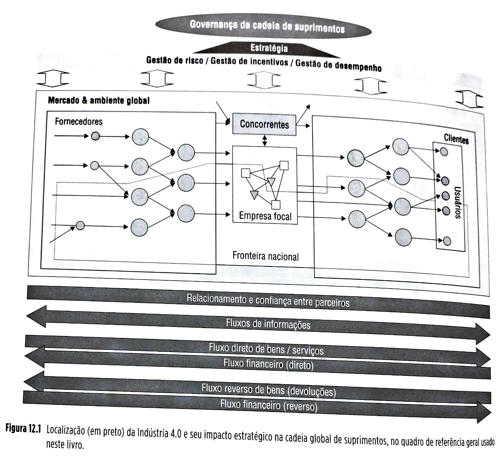
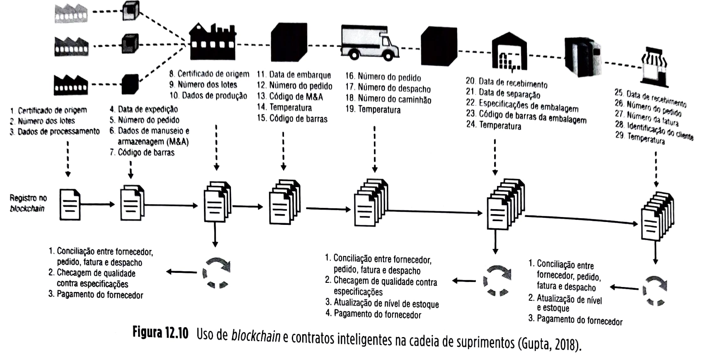
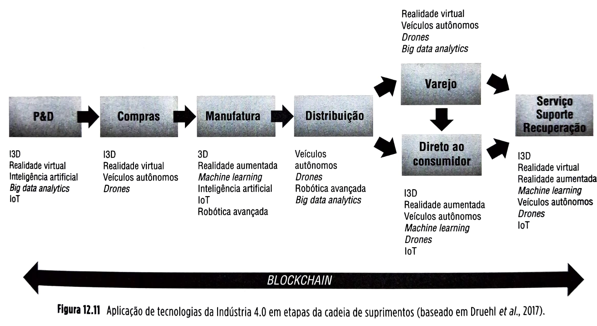

# CAPÍTULO 12: Indústria 4.0 e suas implicações para as cadeias globais de suprimentos

**12.1** Introdução, 357
**12.2** Conceitos, 361
**12.2.1** A quarta revolução industrial, 361
**12.2.2** Manufatura aditiva (impressão 3D) – MA/I3D, 363
**12.2.3** Veículos autônomos, 365
**12.2.4** Robótica avançada (adaptativa), 367
**12.2.5** Internet das coisas (IoT), 368
**12.2.6** (*Big*) *data analytics* & inteligência artificial, 368
**12.2.7** *Machine learning*, 370
**12.2.8** Realidade virtual (RV) e realidade aumentada (RA), 371
**12.2.9** *Blockchain*, 372
**12.3** Estudo de caso: ABB e a Indústria 4.0, 375
**12.4** Resumo, 376

## Página 357

### 0BJETIVOS DE APRENDIZAGEM

📌  Sintetizar corretamente o significado do termo Indústria 4.0 (I4.0).

📌 Assimilar as principais tecnologias envolvidas com a Indústria 4.0, suas características principais.

📌 Explicar as implicações individuais de cada tecnologia principal envolvida na Indústria 4.0 para a administração de cadeias globais de suprimentos.

📌 Explicar de forma embasada as implicações estratégicas e operacionais da Indústria 4.0 como um todo para as cadeias globais de suprimentos.

📌 Conceituar as principais alterações e tendências esperadas para o futuro próximo como resultado da Indústria 4.0 nas cadeias globais de suprimentos.

### 12.1 INTRODUÇÃO

Este capítulo trata da Indústria 4.0 e de suas implicações para as cadeias globais de suprimentos. A Figura 12.1 ilustra, no quadro geral de referência deste livro, onde se localiza a Indústria 4.0 e o seu impacto estratégico na cadeia global de suprimentos.

## Página 358

Figura 12.1 Localização (em preto) da Indústria 4.0 e seu impacto estratégico na cadeia global de suprimentos, no quadro de referência geral usado neste livro.

Um exemplo de como a “internet das coisas” (internet of things ou IoT), um dos pilares da Indústria 4.0, pode alterar a cadeia de suprimentos e uso de uma simples lavadora de roupas.¹

De forma simples, a internet das coisas (IoT) é a rede de dispositivos físicos, máquinas, veículos, eletrodomésticos, smartphones e outros itens que incorporam eletrônica “embarcada” – softwares, sensores, atuadores e conectividade que permitem que essas coisas se conectem, coletem e troquem dados, tanto entre si como com outros atores na cadeia de suprimentos.

Há muitos exemplos de como esses dados podem ser usados para criar valor em uma cadeia de suprimentos. Vamos usar uma máquina de lavar roupas como um caso ilustrativo. À primeira vista, a máquina de lavar doméstica não parece um caso interessante, mas, quando examinada mais de perto, ilustra como a IoT pode funcionar, mostrando como pode ser criado valor, a partir dos dados gerados por ela, por vários atores de uma cadeia de suprimentos e também usados para fins comerciais.

Quando uma máquina de lavar roupas sai pela porta da fábrica onde foi produzida e passa pelo canal de distribuição, varejo e, finalmente, venda, o fabricante, tradicionalmente, a perde de vista, sem saber ao menos quem acaba por adquiri-la ou usá-la.

Um dos benefícios imediatos de uma lavadora de roupas conectada à IoT é o de poder ser controlada por seu usuário pelo seu smartphone – começar um ciclo, saber quando um ciclo terminou, mudar o programa de lavagem etc. Outro benefício imediato é o fabricante agora ter a capacidade de se comunicar diretamente com o proprietário da máquina. O valor deste ponto de contato direto com o usuário pode ser usado para nutrir um relacionamento continuado entre fabricante e consumidor, favorecendo a sua retenção como cliente.

## Página 359

Um segundo benefício ocorre quando uma máquina de lavar roupas apresenta defeito. Hoje, se uma máquina quebrar, normalmente o consumidor decidirá fazer uma de duas coisas: reparo por um técnico (durante o período de garantia ou após seu término) ou substituição por uma nova máquina. Se a opção for reparo, o técnico chamado ao local faz um diagnóstico, descobrindo, por exemplo, que a bomba está com defeito. O técnico volta a sua *van*, apenas para se certificar de que a bomba certa não está disponível no veículo. Retorna ao proprietário, pede desculpas e combina uma nova visita quando a peça estiver em estoque. O técnico se despede, sai, faz o pedido da bomba e, duas semanas depois, volta para consertar a máquina e a faz funcionar novamente.

Nesse cenário, o resultado pode até ser considerado aceitável, pois a lavadora voltou a funcionar, mas o usuário não estará plenamente satisfeito, pois sua máquina ficou sem possibilidade de uso por duas semanas. A indisponibilidade de uma lavadora de roupas doméstica é uma situação difícil para o usuário; agora, pense no proprietário de uma máquina de lavar comercial, em um hospital ou uma lavanderia – é uma situação muito pior. E a empresa de serviços de manutenção? O técnico de campo precisou agendar duas viagens para concluir um único trabalho (e gerar uma receita só), usou duas vezes sua mão de obra, duas vezes combustível, duas vezes o veículo e gastou tempo adicional dedicado a tarefas administrativas adicionais (pedido da peça, acompanhamento etc.).

No caso de uma lavadora conectada à IoT, todo esse desperdício poderia ser evitado. A máquina conectada coleta muitos dados eletronicamente e de forma contínua – temperatura, pressão da bomba, desempenho da unidade de controle, peso da carga, ciclos, incrustação de calcário quando a água é "dura", desgaste/vibração de peças etc. Mesmo uma máquina não conectada pode usar (e usa) dados de sensores "embarcados" nela a fim de controlar seus ciclos de lavagem. Entretanto, até que a lavadora de roupas esteja conectada, esses dados são armazenados de forma local e isolada, usados apenas para controlar a operação da própria máquina. Quando conectada, os dados da lavadora podem fluir para vários destinos e ser "minerados", tratados e analisados, com uso de capacidade analítica, por vários atores da cadeia de suprimentos, para geração de valor, o que discutimos a seguir.

### 1. Análise para manutenção preditiva

Os dados da máquina de lavar podem ser capturados, analisados e comparados com dados de um modelo de funcionamento perfeito em computador. Se os dados da lavadora de roupas estiverem comparáveis com os do modelo "perfeito", a máquina está funcionando bem e nada precisa ser feito. No entanto, se forem detectadas anomalias que se desviam do modelo, previsões analíticas podem ser feitas sobre o que pode acontecer no futuro. Se um problema pode ser previsto, uma ação pode ser tomada para mitigar seu impacto. Tome o exemplo dado anteriormente. Se a quebra da bomba for prevista por vibrações anormais identificadas, ações preventivas podem ser tomadas. Primeiro, o sistema pode se certificar de que a bomba certa esteja em estoque quando for necessária, possivelmente, para isso, fazendo um pedido com antecedência; uma vez em estoque, pode-se entrar em contato com o proprietário ou usuário da máquina para marcar um período conveniente para a realização do reparo. O técnico de serviço então visita o local (apenas uma vez!) com as peças certas, em momento conveniente, resolve o problema antes mesmo que ele ocorra, proporcionando assim um melhor nível de serviço, que, por sua vez, aumenta a satisfação do cliente, porque a máquina nunca ficou impossibilitada de trabalhar em razão de defeito.

O uso de uma lavadora de roupas conectada e a aplicação dos dados que fluem dessa máquina permitem a otimização de vários processos - chamadas, tempo de técnico de campo, gerenciamento de estoque, gerando economia em recursos, tempo, dinheiro e uso de ativos da empresa de serviço e, ao mesmo tempo, gerando mais satisfação do usuário.

### 2. Da análise operacional preditiva à engenharia preditiva

No cenário exposto, de prevenção de problemas, a classe de dados usada – temperatura, pressão etc. – é de "telemetria". Mas há outra classe interessante de dados que podem ser coletados quando uma "coisa" é conectada à internet: os dados de uso – como alguém está usando alguma coisa (no caso, a nossa máquina de lavar)? Por exemplo, uma lavadora média pode ter dez ou mais ciclos pré-programados de lavagem. Todos esses programas de lavagem são mesmo usados?

No caso de uma lavadora de roupas conectada, não apenas essa máquina pode enviar dados de telemetria, mas também informações sobre quais programas estão sendo realmente usados, com que frequência e de que forma. Quando esses dados são recebidos e analisados, hipoteticamente, se o fabricante descobrir que 99% dos usuários usam apenas os mesmos três programas de lavagem, esse conhecimento é extremamente valioso. Então, quando projetarem a próxima geração da lavadora, eles poderão se livrar de vários programas, reduzindo os custos de projeto, engenharia e testes. Para o consumidor, a máquina de lavar se torna mais fácil de usar – com menos opções e um conjunto simplificado de configurações.

## Página 360

### 3. Expandindo o valor criado na cadeia de suprimentos com dados que alavancam serviços

A próxima etapa envolve como os vários atores numa cadeia de suprimentos interagem com as coisas de maneiras diferentes. Até agora, em nossa análise, o proprietário ou usuário da máquina de lavar roupas, o fabricante e a empresa de serviços de manutenção se beneficiaram da máquina conectada; mas há outros atores que podem interagir com a lavadora e usar produtivamente seus dados.

Uma parte interessada pode ser o fornecedor de energia elétrica. Ele certamente gostaria de poder interagir com a máquina de lavar roupas para sugerir que ela não seja usada nos períodos de pico, quando a energia custa mais caro. Isso traz benefício de custo para o usuário e ajuda a nivelar a carga na geração de energia ao longo do dia, trazendo também benefício para a companhia de eletricidade.

Pense agora nas empresas fornecedoras de sabão em pó, que gostariam de ter dados de uso da máquina para possivelmente se antecipar e sugerir a reposição do produto quando necessário. Isso traz conveniência para o usuário e melhora o relacionamento e retenção do cliente pelo fabricante de sabão em pó. Isso é semelhante ao modelo de reposição de cartuchos de tinta de impressoras conectadas (uma realidade, já há algum tempo); com uma lavadora conectada, um modelo similar pode ser usado.

### 4. Passando do marketing transacional baseado na “obsolescência” para o modelo de “servitização” (“como serviço”), que, diferentemente, favorece durabilidade e sustentabilidade

Hoje, um consumidor tipicamente compra uma máquina de lavar roupas, usa-a até que quebre de vez e, então, compra outra. Esse é um modelo familiar de negócios em vários setores, como o automotivo e o eletrônico. Mas o mundo está mudando para um mundo “servitizado” (Corrêa e Gianesi, 2018), em que cada vez mais empresas vendem “furos” em vez de “brocas”. Em outras palavras, as empresas passam a fornecer aos seus clientes o benefício do produto, sem necessariamente vender a eles o produto. Como com as máquinas copiadoras da Xerox, um novo modelo potencial para a máquina de lavar roupas é aquele em que o consumidor recebe uma máquina de lavar (que continua de propriedade do fabricante) como parte de um contrato de prestação de serviço, em que o usuário paga pelo *uso da máquina*, por lavagem. Toda vez que a máquina detecta uma nova carga de lavagem, o consumidor paga determinada quantia – um certo valor em reais por ciclo de lavagem. A mudança de “venda de produto” para “pagamento por uso” pode ter influência interessante sobre os seus impactos ambientais. Normalmente, uma máquina de lavar roupas é projetada para durar aproximadamente de cinco a sete anos. Com a perspectiva de a empresa de serviços lhe fornecer a máquina de lavar associada a um plano de “pagamento por uso”, a empresa agora quer que a máquina dure o maior tempo possível para garantir um retorno saudável do investimento (Corrêa, 2018a). Olhando para o futuro, esse tipo de modelo pode ajudar a impulsionar uma mudança na mentalidade e nos incentivos dos projetistas da máquina, o que incentivaria a fabricação de coisas que durem por mais tempo e que sejam reutilizáveis, remanufaturáveis e recicláveis. Ao melhorar a longevidade da máquina de lavar roupas e sua reciclagem em sentido amplo, a quantidade de resíduos gerados ao final da vida útil poderia ser reduzida, resultando em impacto positivo no planeta.

### 5. Dados fluindo nas duas direções

Para os casos discutidos, a maioria dos dados está fluindo da máquina de lavar até algo como uma plataforma IoT (como a “Watson”, da IBM) na nuvem, onde ela pode ser analisada. No entanto, outra vantagem da IoT é sua possibilidade de fluir em ambas as direções – da máquina de lavar para a nuvem e da nuvem para a lavadora. Mas por que enviar dados para a máquina de lavar roupas?

Os dados podem ser uma atualização de *software* ou correção de segurança. Se for detectado um problema com a lavadora, pode ser criada uma atualização de *software*, a ser enviada automaticamente para a máquina (como hoje já ocorre com atualizações automáticas de sistemas operacionais e com aplicativos de computadores). Mais interessante, novos recursos, como um novo programa de lavagem, podem ser desenvolvidos ou eliminados. Para recuperar o custo de desenvolvimento do novo recurso, o fabricante ou empresa de serviços pode cobrar mais pelo novo programa de lavagem. Um exemplo desse modelo em ação é a forma como os carros da Tesla estão lançando novos recursos, como a otimização da bateria e os recursos de autogerenciamento, para seus carros. Além das atualizações de *software* por internet, há uma tendência emergente para o *hardware* modular, que permite que partes do *hardware* sejam também atualizadas diminuindo a necessidade de reposição total do equipamento.

## Página 361

Mas por que a Indústria 4.0 (da qual a internet das coisas é um componente fundamental) tem ganhado tanta atenção dentro das empresas e nas cadeias de suprimentos em geral? O restante deste capítulo trata desta questão.

## 12.2 CONCEITOS

### 12.2.1 A quarta revolução industrial

O termo "Quarta Revolução Industrial" se tornou bastante comum nas discussões das rupturas tecnológicas que o século XXI tem vivenciado, mas foi a partir das discussões do World Economic Forum (WEF), lideradas pelo engenheiro e economista Klaus Schwab, criador e executivo principal do WEF, que essa discussão se disseminou (Schwab, 2016).

Segundo o economista, a palavra "revolução" denota uma mudança radical e abrupta, e várias ocorreram, historicamente, quando novas tecnologias e formas de perceber o mundo dispararam mudanças profundas nos sistemas econômicos e estruturas sociais vigentes.

**A primeira grande mudança social**

Esta ocorreu em torno de dez mil anos atrás, quando se deu a transição da alimentação humana "forrageira" de sociedades nômades, para uma baseada em fazendas e agricultura, possibilitada pela domesticação de animais, o que acarretou sociedades mais sedentárias. Pouco a pouco, a colaboração entre animais e humanos fez com que a produção de alimentos, o transporte e a comunicação melhorassem, induzindo aumento populacional e estabelecimento de comunidades humanas mais numerosas, o que finalmente levou à urbanização e o surgimento das cidades. Neste ponto e até a Primeira Revolução Industrial, a produção "industrial" era basicamente dependente de artesãos, que planejavam, projetavam, executavam e controlavam sua produção, com pouca ou nenhuma economia de escala possível (Corrêa e Corrêa, 2017).

**Primeira Revolução Industrial**

Convenciona-se que a Primeira Revolução Industrial ocorreu em torno da segunda metade do século XVIII, com a transição da "potência" muscular para a potência mecânica, inicialmente com moinhos cuja potência dependia do fluxo de água de rios (às vezes não perenes), mas sobretudo com o desenvolvimento dos motores a vapor que disponibilizaram energia de forma farta e perene ao longo dos anos. Com ele, vieram as estradas de ferro, e a tônica era a produção mecânica, com o importante advento da "intercambialidade de peças", favorecendo a divisão do trabalho e, em termos das cadeias de suprimentos, as primeiras iniciativas de terceirização (Corrêa e Corrêa, 2017).

**Segunda Revolução Industrial**

A segunda revolução industrial começou no final do século XIX, acelerando-se na primeira parte do século XX, disparada pelo advento da invenção de formas de criação e transmissão de energia elétrica, da "administração científica" (Taylor, 1911), da linha de montagem e, com o tempo, do desenvolvimento pleno do paradigma da "produção em massa". Interessante notar que, neste período, as cadeias de suprimentos muitas vezes eram bem "verticalizadas", com as organizações (um exemplo por excelência é a Ford do início do século XX) produzindo a grande maioria dos componentes de seus produtos.

## Página 362

**Terceira Revolução Industrial**
A Terceira Revolução Industrial começou nos anos 1950, com o surgimento dos computadores, desenvolvendo-se tremendamente nas décadas seguintes, com a aceleração dos processos de desenvolvimento tecnológico, desenvolvimento de semicondutores, de computadores *mainframe* (de larga escala, na década de 1960), seguidos pelos mini e microcomputadores pessoais (décadas de 1970 e 1980) e pelas arquiteturas computacionais abertas e pela internet (década de 1990). Acompanhando as mudanças deste período, as cadeias de suprimentos tenderam a se desverticalizar, computadorizar (os MRP, MRPII e ERP tiveram um papel importante nisso, ver Corrêa *et al.*, 2018) com intensa terceirização e com a tecnologia da informação e de comunicação permitindo níveis de integração e coordenação nunca antes vistos, entre membros das cadeias de suprimentos.

**Quarta Revolução Industrial**
A Quarta Revolução Industrial, então, teria se iniciado na virada do milênio, apoiando-se na (e adicionando à) "revolução digital" iniciada na Terceira Revolução Industrial. A Quarta Revolução Industrial se caracteriza, segundo Schwab (2016), por uma internet muito mais ubíqua (quase onipresente) e permitindo mobilidade de acesso, sensores muito mais sensíveis, poderosos e baratos, e por avanços substanciais em inteligência artificial e *machine learning* (aprendizado de máquina). As tecnologias digitais, com seus computadores (*hardware* e *software*) e redes da Quarta Revolução Industrial, não são exatamente novidades, mas vêm se tornando muito mais sofisticadas, integradas e inteligentes, transformando, com isso, a sociedade e a economia global.

Na Alemanha, essas discussões, mais voltadas a aplicações da Quarta Revolução Industrial nas fábricas, nas cadeias de suprimentos e de valor, têm feito referência ao termo "Indústria 4.0", termo este cunhado na feira de Hannover de 2011 para descrever como a Quarta Revolução Industrial está alterando a organização de cadeias globais de valor. Por esse motivo, e porque o escopo da Quarta Revolução Industrial é mais amplo do que nosso interesse neste livro, deste ponto em diante trataremos de "Indústria 4.0" e não da (mais geral) "Quarta Revolução Industrial".

**Indústria 4.0**

Fica claro pela definição exposta que as tecnologias e sua "convergência" têm papel essencial no entendimento da Indústria 4.0. Embora a lista a seguir não seja exaustiva, traz tecnologias que, neste ponto do tempo, têm sido as mais citadas como relevantes, para a Indústria 4.0, principalmente quando interagindo entre si. Discutiremos cada uma delas adiante neste capítulo, assim como seu potencial impacto nas cadeias globais de suprimentos:

Tecnologias de *hardware* da Indústria 4.0:

▪️manufatura aditiva (impressão 3D);
▪️veículos autônomos;
▪️robótica avançada (adaptativa);
▪️internet das coisas (IoT).

Tecnologias de *software* da Indústria 4.0:

▪️(*big*) *data analytics* & inteligência artificial;
▪️*machine learning*;
▪️realidade virtual e realidade aumentada;
▪️blockchain*.

## Página 363

### 12.2.2 Manufatura aditiva (impressão 3D) – MA/I3D

Uma impressora 3D é um dispositivo capaz de construir um objeto sólido tridimensional de qualquer formato a partir de um *design* digital. Mais recentemente, a impressão 3D tem sido chamada de “manufatura aditiva”, porque usa um processo “aditivo” no qual diferentes camadas 2D de determinado material são adicionadas sucessivamente à peça a ser produzida. Essas camadas 2D são construídas umas sobre as outras, resultando em objetos 3D, a partir de arquivos digitais que descrevem o formato completo em 3D do objeto a ser impresso. Esses arquivos podem ser gerados por *design* em *softwares* de CAD (Computer Aided Design), escaneados (usando tecnologia de ressonância magnética ou tomografia computadorizada) ou capturados a partir de objetos físicos com *scanners* tridimensionais a laser. A impressão 3D se distingue dos métodos subtrativos de fabricação, nos quais se inicia com um bloco de material e se retira o material desnecessário até que a forma final seja obtida (por exemplo, em processos de furação, fresagem e torneamento). Tecnicamente, processos tradicionais, como injeção, fundição e sinterização se encaixam na definição estrita de manufatura aditiva; o que distingue a I3D é o fato de ela não ser dependente dos complexos e caros moldes, requeridos para aqueles métodos, o que normalmente exige quantidades mínimas de produção (para amortizar o custo do molde) durante o ciclo de vida do produto, comprometendo a sua flexibilidade. Como I3D não requer moldes, a flexibilidade oferecida é muito maior. Outra vantagem fundamental da I3D é a habilidade de executar formas complexas, muito caras ou impossíveis de serem executadas por métodos tradicionais de fabricação sem uso de ferramental custoso de produzir e operar. Outra vantagem é a liberdade de repensar e reprojetar peças para redução de peso e uso de estruturas internas complexas (por exemplo, aquela da Figura 12.2), de forma a melhor servir ao propósito funcional da peça sem as restrições impostas pelos métodos tradicionais de processamento mecânico.

Além disso, antigamente a I3D estava limitada ao uso de material plástico, mas hoje é possível se fazer I3D em metal, cerâmica, concreto, materiais biológicos e muitos outros. Algumas versões de impressoras 3D existem desde os anos 1970, mas não haviam sido comercializadas ou amplamente difundidas até recentemente. Melhorias na tecnologia levaram ao desenvolvimento de impressoras 3D que têm sido amplamente utilizadas para prototipagem rápida ou em fabricação secundária (por exemplo, na produção de ferramentas de modelagem para processos de fabricação tradicionais, como moldagem por injeção). Nos anos 1980, 1990 e início dos anos 2000, a impressão 3D evoluiu, mas dentro dos limites dos departamentos de P&D, a partir de um pequeno oligopólio de empresas (como 3D Systems, zCorp, Stratasys e Objet Geometries), levando a algumas evoluções quanto a resolução do projeto e produto final, disponibilidade de cores, materiais e tempo necessário para impressão. Essas máquinas, capazes de produzir em metal, geralmente custam mais de US$ 500 mil. Esses custos têm caído drasticamente. A tabela na Figura 12.3 traz diferentes categorias de processos de I3D, segundo a ASTM (American Society for Testing and Materials):

| Categoria | Descrição |
| --- | --- |
| *Binder jetting* (Jato de agregante) | Agente líquido agregante seletivamente depositado, de forma a ligar partículas de pó |
| *Material jetting* (Jato de material) | Gotículas de material (matéria-prima) seletivamente depositadas para formar camadas 2D |
| *Powder bed diffusion* (Difusão em base de pó) | Energia térmica seletivamente funde regiões numa base de pó (matéria-prima) |
| *Directed energy deposition* (Deposição direta de energia) | Energia térmica focalizada derrete o material (matéria-prima) à medida que este é depositado |
| *Sheet lamination* (I3D por laminação) | Folhas finas de material (matéria-prima) são fundidas juntas |
| *Vat photopolymerization* (I3D por fotopolimerização) | Fotopolímero líquido seletivamente endurecido e curado por fotoativação (luz especial) |
| *Material extrusion* (I3D por extrusão) | Material (matéria-prima) aplicado por extrusão por meio de um bico ou orifício |

Fonte: Laplume; Petersen; Pearce (2016).
**Figura 12.3** Categorias de processos de I3D, segundo a ASTM.

## Página 364

A impressão 3D está em seu estágio inicial, pois ainda não é capaz de apoiar a produção de alto volume de produtos acabados (Baumers et al., 2016). Entretanto, essa situação está mudando. Muitas indústrias, organizações (incluindo instituições de ensino) e mesmo os consumidores estão começando a usar impressão 3D mais ativamente. É estimado que, até 2019, 10% dos fabricantes com processos discretos irão aplicar impressão 3D/manufatura aditiva (I3D/MA) nas suas operações de fabricação (Gartner, 2015). Além disso, o valor de mercado da I3D/MA é previsto para crescer de US$ 4,1 bilhões em 2014 para US$ 10,8 bilhões em 2021 (Wohlers, 2015).

## Implicações para a cadeia de suprimentos (Druehl et al., 2017)

**Implicações gerais**

I3D/MA tem sido aplicado em vários setores industriais. Na indústria aeroespacial, permitiu uma redução de até 50-80% em peso de componentes, propiciando maior eficiência em voo por meio de menor consumo de combustível. Uma aplicação muito importante de I3D é exatamente na indústria de peças sobressalentes, caras de manter nos volumes necessários, por exemplo, na indústria aeronáutica, que apresenta demanda alta em variedade, porém moderada em número de peças.

Com I3D, os estoques diminuem, pois as peças podem ser "impressas" quando necessárias. Na indústria automotiva, a Ford, por exemplo, foi capaz de eliminar procedimentos administrativos no desenvolvimento de um novo motor, conseguindo assim economias consideráveis nos custos de ferramental e custo final do motor. Na indústria médica, estima-se que a MA tornar-se-á parte integrante dos produtos oferecidos aos pacientes num futuro próximo. Na indústria de equipamentos de auxílio à audição, por exemplo, conseguiu encurtar os prazos de entrega de pedidos específicos de pacientes para um dia (Ruffo et al., 2007). Na moda e vestuário, uma variedade de produtos, de sapatos a vestidos, tem sido produzida a partir de materiais, mas ainda limitada à alta costura (Lewandrowski, 2014); a taxa de adoção aqui ainda parece lenta. Recentemente, muitas empresas de calçados esportivos começaram a desenvolver programas inovadores com a aplicação de impressão 3D, como o Nike Zoom Superfly Flyknit, Futurecraft 3D da Adidas e Zante Generate pela New Balance. Veja a Figura 12.4.

**Implicações gerenciais**

MA reduz potencialmente a necessidade de trabalho de montagem, pois permite a produção de projetos funcionais integrados em uma única etapa de produção (Weller et al., 2015). Tal flexibilidade permite a customização em massa de produtos (D'Aveni, 2015) e potencialmente promete o encurtamento e simplificação das cadeias de suprimentos. De acordo com Pine (1993), o foco da customização em massa é apoiar a variedade e a customização por meio de flexibilidade e rapidez de resposta visando à demanda fragmentada, nichos heterogêneos, baixo custo/alta qualidade de bens e serviços com ciclos de desenvolvimento de produto e de vida do produto muito mais curtos. Com processos MA automatizados baseados em CAD para construir peças, a produção de produtos personalizados pode ser trazida para montante na cadeia, permitindo que o sistema de manufatura seja mais ágil e capaz de produzir alta variedade de produtos sem excesso de trabalho ou complexidade. A crescente adoção do I3D/MA tem implicações importantes na reconfiguração de cadeias de suprimentos. A produção e design individualizados e personalizados desloca o ponto de desacoplamento (veja o Capítulo 2) do modelo de fabricação "para estoque" para o de produção "sob encomenda", reduzindo em paralelo o tempo de distribuição. Em aplicações de customização em massa, nas quais os clientes são diretamente envolvidos na customização, I3D/MA promove a potencial descentralização da produção e potencialmente requer mais recursos para gerenciar e reduzir riscos e incertezas em razão do aumento da coordenação, comunicação e monitoramento necessários (Manuj e Mentzer, 2008). Na aplicação comercial de I3D, a propriedade e operação dos processos de desenvolvimento e produção são transferidos das organizações para os indivíduos. Assim, atividades de inovação se tornam dispersas em cadeias de suprimentos; o controle e monitoramento de qualidade podem se tornar um desafio.

## Página 365

### 12.2.3 Veículos autônomos

Veículos autônomos são aqueles capazes de trafegar sem qualquer interferência humana além da definição dos pontos de origem e destino e, possivelmente, das rotas a seguir.

Os carros de passeio autônomos têm dominado o noticiário, mas já há numerosos outros veículos autônomos com grande potencial de uso em cadeias de suprimentos, incluindo caminhões, *drones*, aeronaves, barcos e até submarinos.

| 🔵**SAIBA MAIS**{bg=azul} |
| --- |
| A Volkswagen e a Mobileye, da Intel, estão planejando lançar o primeiro serviço de transporte urbano individual de passageiros (tipo Uber), mas com uso de carros autônomos de Israel, a partir do início de 2019. As duas empresas estão formando uma *joint venture* com uma importadora de carros de Israel, a Champion Motors, em que a Volkswagen fornecerá os veículos elétricos e a Mobileye cuidará da tecnologia de condução autônoma, disseram as empresas em um comunicado recente.   Espera-se que o serviço, chamado "Mobilidade como serviço", seja comercializado em 2022, com a Champion Motors operando o centro de operações e controle da frota.    O governo israelense, que aceitou a proposta, também apoiará, compartilhando os dados necessários sobre infraestrutura e tráfego, disseram as empresas. Fabricantes de automóveis estão se unindo a empresas de tecnologia para ganhar vantagem na tecnologia sem motoristas, que deve revolucionar o setor de transporte de passageiros.    A Honda anunciou um investimento de US$ 2,75 bilhões na unidade de veículos autônomos Cruise, da General Motors, para o desenvolvimento conjunto de veículos autônomos para implantação em frotas de serviços de veículos de passeio em todo o mundo. |

À medida que as tecnologias de sensores e inteligência artificial evoluem, a capacidade e habilidades destes veículos aumentam de forma correspondente. É uma questão de tempo que *drones* e até mesmo submersíveis comerciais sejam oferecidos a preços baixos para uso logístico.

## Página 366

**Implicações para a cadeia de suprimentos**

Empresas de todos os tamanhos estão entrando no mercado de veículos autônomos, desde pequenas empresas iniciantes, passando por grandes empresas de tecnologia, como a Alphabet (empresa-mãe do Google), até grandes fabricantes de automóveis, como a General Motors. Já foi bem documentado que os veículos autônomos terão um impacto considerável nas viagens individuais dos consumidores, mas também terão grande impacto na logística e na gestão da cadeia de suprimentos.

A tecnologia de veículos autônomos tem a capacidade de impactar significativamente as cadeias de suprimentos por meio de redução de custos, redução do tempo de transporte, aumento da segurança, entre outros. De que forma essa nova tecnologia impactará as cadeias de suprimentos?

*Implicações para o centro de distribuição e para o "último quilômetro"*

Um desafio para fornecedores e distribuidores, o último quilômetro da rota de entrega é tipicamente um gargalo no processo, uma vez que atrasos frequentemente ocorrem mesmo com a proximidade do produto ao consumidor final. As empresas estão atualmente realizando testes com veículos autônomos que poderiam entregar mercadorias sem a presença de um motorista. Um exemplo de como isso pode funcionar vem da Starsky Robotics; a empresa está experimentando ter um motorista remoto controlando o veículo até chegar à rodovia, a partir de um centro de distribuição; uma vez na rodovia, durante a próxima etapa da viagem, outro piloto remoto assumiria o controle do veículo autônomo ou de um comboio deles.

Os veículos autônomos não só podem impactar a logística, reduzindo custos e atrasos, mas também afetar significativamente os centros de distribuição e fábricas. Uma prática comum tem sido a construção de centros de distribuição em terrenos mais distantes dos centros urbanos e, consequentemente, mais baratos, onde estradas e recursos humanos são facilmente acessíveis. Com uma mudança nos requisitos do consumidor, que agora exige tempos de entrega mais rápidos (muitas vezes no mesmo dia), esses grandes centros precisarão estar mais próximos do consumidor final. Os centros de distribuição também possivelmente se tornarão menores, já que as empresas desejarão estar localizadas próximas a cada cidade individualmente, em vez de distribuir a partir de um local maior central. Estima-se que os custos de aluguel aumentarão, o que provavelmente será compensado pela redução de custos na implementação do transporte autônomo durante o último quilômetro de entrega.

*Viagem de longa distância e sem motoristas*

Ao implementar a tecnologia de veículos autônomos, é mais provável que viagens de longa distância adotem esse tipo de tecnologia mais rapidamente. Viajar em rodovias é mais previsível que em ambientes urbanos, exigindo menos habilidade humana para navegar entre origem e destino. Atualmente, grande parte dos custos de transporte surge da necessidade de os motoristas transportarem mercadorias em um número maior de caminhões menores ou mesmo em outros veículos, como vans.

A implementação da tecnologia de veículos autônomos durante viagens de longa distância reduzirá os custos. As empresas que experimentam essa tecnologia ainda veem a necessidade de um motorista estar presente (por segurança), mas os veículos seriam autogeridos e precisariam de muito menos habilidade para navegar. As empresas também analisam o "comboio", em que um grupo de caminhões viajaria junto por longas distâncias e talvez conduzido apenas pelo condutor remoto do primeiro caminhão, ou "líder", que definiria velocidade e direção, e os caminhões seguiriam o caminhão-líder de forma autônoma. Em seguida, quando estivessem na última parte da entrega, esses caminhões tomariam direções diferentes. O comboio não apenas reduz os custos de mão de obra, mas também poderia reduzir os custos de combustível, já que os caminhões estariam trafegando em um ritmo mais regular, de forma otimizada pelo seu *software* de controle.

Implicações de veículos autônomos são de longo alcance. O volume de frete (por unidade de meio de transporte) aumentará com o tempo, pois as unidades não precisarão de tantos intervalos de descanso, paradas para alimentação etc. e os produtos serão entregues com mais eficiência. Fica claro que os veículos autônomos terão impacto na gestão da cadeia de suprimentos como um todo, incluindo as partes a montante (*upstream*) e jusante (*downstream*).

## Página 367

### 12.2.4 Robótica avançada (adaptativa)

Como consequência da combinação de microprocessadores e métodos de inteligência artificial, os produtos, serviços e máquinas se tornam mais inteligentes, no sentido de terem não apenas habilidades de computação, comunicação e controle, mas também autonomia e até sociabilidade.

Os robôs têm sido objeto de livros e filmes de ficção científica há décadas, no entanto, não são apenas um dispositivo de enredo de ficção. Nas empresas, os robôs têm sido usados na fabricação industrial desde sua introdução, em 1962, em uma fábrica da GM. Mas, até recentemente, eles não haviam ganhado muita atenção além da linha de montagem, produção em ambientes inóspitos (como pintura) ou em outros casos de uso específicos (como a solda de ponto na produção automobilística). Em parte, isso ocorre porque os robôs industriais tradicionais usados na fabricação diferem significativamente da nova geração de robôs. Robôs de fabricação industrial são projetados para operar a uma alta taxa de velocidade, precisão e resistência. Embora esses traços sejam bons para automatizar os processos de fabricação, eles não se traduzem bem em outras áreas da empresa que exigem mais interação humana, como na montagem. A tecnologia robótica tem percorrido um caminho contínuo de aprimoramento ao longo do tempo, à medida que os fabricantes buscam melhorar sua tecnologia e colocar mais tecnologias digitais e cibernéticas modernas nos elementos mecânicos dos robôs.

Nos últimos anos, os robôs aumentaram seu nível de inteligência e flexibilidade à medida que o aprendizado de máquina (*machine learning*) e a inteligência artificial (IA) foram incorporados aos sistemas; houve melhorias significativas na mobilidade de robôs, e a capacidade de conectá-los via IoT e melhores medidas de segurança também foram incorporadas em dispositivos robóticos. O resultado dessas inovações é um novo estilo de robô, mais adequado para trabalhar lado a lado com os humanos, em vez de segregado em uma zona insalubre sem humanos.

Referidos como robôs colaborativos, ou *cobots*, a nova geração de robôs é segura, inteligente e colaborativa e pode trabalhar lado a lado com as pessoas. Eles se tornaram muito sofisticados e são cada vez mais usados como um mecanismo para automatizar processos de negócios que historicamente não se prestavam à automação. Essa próxima geração de *cobots* é um dos fatores que impulsionam a adoção robótica em novos setores e em novos pontos de uso.

### Implicações para a cadeia de suprimentos

A execução na cadeia de suprimentos é uma área de negócios pronta para mudanças radicais possibilitadas pela robótica, especialmente nos processos de atendimento de pedidos no armazém. Esses processos normalmente requerem intensiva mão de obra, bem como muita movimentação, em toda a instalação. As organizações que introduziram robôs em suas operações de armazenamento, *picking*, embalagem e atendimento perceberam valor agregado, incluindo melhorias de produtividade, ganhos de eficiência, capacidade de, economicamente, aumentar ou diminuir a escala nos picos e vales de demanda e a capacidade de melhorar os níveis de atendimento ao cliente, principalmente em tempo e precisão.

O exemplo mais familiar de robótica no processo de atendimento é encontrado na Amazon. A gigante de *e-commerce* adquiriu a Kiva Systems (agora conhecida como Amazon Robotics) em 2012 por US$ 775 milhões. Desde então, a empresa expandiu continuamente seu uso a fim de adotar mais de 80 mil robôs em 25 dos seus centros de distribuição. Por meio de sua implantação, conseguiu acelerar os prazos de entrega e reduzir os custos relacionados ao atendimento.

## Página 368

A Amazon mostrou que há um valor a ser obtido por intermédio do uso de robótica dentro de grandes centros de distribuição.

Alguns fornecedores notáveis neste espaço incluem Locus Robotics, Fetch Robotics e 6 River Systems, para citar apenas alguns. Os dispositivos robóticos dessas empresas foram projetados para operar nos mesmos espaços em que os funcionários trabalham, muitas vezes em colaboração com eles. Neste modelo, a partir do WMS (*Warehouse Management System*) é atribuída uma tarefa ao robô, que se movimenta automaticamente para um local de separação. Quando chega a um local, um associado recupera o produto de uma prateleira ou caixa e o coloca em uma cesta ou sacola no robô, que é, então, direcionado pelo WMS para o próximo local de coleta, até que todos os itens de um pedido estejam na sacola, prontos para serem entregues à estação de embalagem e expedição. Quando a coleta estiver completa, o robô se move para a próxima ordem de separação.

Sistemas de navegação sofisticados são essenciais no espaço do robô móvel colaborativo (*cobot*). Isso ocorre porque os *cobots* são projetados para navegar de maneira autônoma em um centro de distribuição e em torno de possíveis obstáculos. Uma vez que a instalação é mapeada dentro do sistema de orientação de robôs, os robôs estão livres para se movimentar.

### 12.2.5 Internet das coisas (IoT)

A internet das coisas (IoT) é a rede de dispositivos físicos, máquinas, veículos, eletrodomésticos e outros itens que incorporam eletrônica "embarcada" – softwares, sensores, atuadores e conectividade que permitem que essas "coisas" se conectem, coletem e troquem dados, tanto entre si como com outros atores na cadeia de suprimentos. Tecnologias associadas com a IoT tipicamente incluem: *RFID*, "*near field communication*", redes de sensores sem fio, *middleware*, computação na nuvem e *software* de suporte (Druehl et al., 2017). Na Europa, e particularmente na Alemanha, a IoT é uma das tecnologias fundamentais da Indústria 4.0. Veja o texto de abertura deste capítulo para um exemplo esclarecedor da "anatomia" de uma aplicação de IoT.

### 12.2.6 (Big) data analytics & inteligência artificial

Como consequência de as empresas manufatureiras e suas cadeias de suprimentos terem começado a adotar avançadas tecnologias de informação e conhecimento, uma quantidade enorme de dados relacionados à produção tem sido acumulada numa taxa exponencialmente crescente, por muitos atores, durante as fases de pesquisa e desenvolvimento, suprimento, produção, distribuição, uso, manutenção e disposição de produtos (Zhang et al., 2016). Esses dados em maciços volumes são capturados, possivelmente de diversas fontes, em diversos formatos, e necessitam ser analisados de forma rápida e transformados em informação útil a diversos potenciais usuários (para mantê-los informados ou permitir tomada de decisão).

## Página 369

Por exemplo, técnicas de *data mining* ("mineração de dados") são necessárias quando dados são coletados de diversos sensores. Essa informação permite a avaliação do estado e configuração correntes de vários ativos (máquinas, equipamentos de movimentação, modos de transporte, armazéns, tanto da própria empresa como de parceiros nas cadeias de suprimentos), assim como condições gerais (climáticas, de tráfego, entre outras) que podem afetar a produção e distribuição de produtos e serviços. Além disso, análises no tempo certo destes dados podem proporcionar importantes vantagens competitivas para cadeias de suprimentos, na forma de melhores (ou mesmo otimizadas) decisões, maior coordenação entre ativos e tomadores de decisão da cadeia e, em termos gerais, maior integração, com a resultante mitigação de efeitos negativos na rede, como as otimizações locais em detrimento da otimização global, e de efeitos nocivos, como, por exemplo, o efeito chicote.

Algumas possibilidades são as abordagens de *data mining* combinadas com técnicas como algoritmos de árvores de decisão, redes neurais, algoritmos heurísticos, programação linear, não linear, dinâmica e inteira e outras técnicas avançadas de pesquisa operacional, permitindo melhor análise, classificação, previsão, visualização e tomada de decisão. Sumariando, há três características da Indústria 4.0 necessárias a criar uma estrutura de *big data analytics* (Ustundag e Cevickan, 2018):

1. **Aquisição e integração de big data:** aquisição inclui dados de leitores de etiquetas RFID, códigos de barras, sensores inteligentes, câmeras inteligentes, entre outros.
2. **Armazenamento e processamento de big data:** tanto em tempo real como em retaguarda (*batch*), de forma a “limpar”, integrar e transformar dados em informações úteis e “acionáveis”.
3. **Mineração (*mining*) de big data e descoberta de conhecimento na base de dados:** aqui, técnicas de clusterização, classificação, associação e predição usando técnicas matemáticas, de tecnologia da informação, inteligência artificial e de pesquisa operacional são essenciais.

### Implicações para a cadeia de suprimentos

As implicações de (*big*) *data analytics* e inteligência artificial são substanciais nas cadeias de suprimentos.

Fabricantes estão usando *big data* e tecnologias baseadas na nuvem para ir além das restrições dos sistemas ERP (*Enterprise Resource Planning*) e dos sistemas tradicionais de SCM (*Supply Chain Management*). Para os fabricantes cujos modelos de negócios são baseados em ciclos de vida dos produtos curtos e em alta velocidade, os sistemas legados de ERP podem se tornar gargalos importantes. Projetados para trabalhar com dados de pedidos, envios e transações, esses sistemas não são, muitas vezes, suficientes para atender aos desafios que as cadeias de suprimentos enfrentam atualmente. Embora muitas empresas ainda não tenham adotado *big data analytics* em suas operações da cadeia de suprimentos, os fatores a seguir serão importantes catalisadores que farão com que muitos se movimentem, saindo da inércia atual.

A escala, escopo e profundidade dos dados gerados nas cadeias de suprimentos estão hoje acelerando. Fabricantes estão olhando para o *big data* como um catalisador para uma maior colaboração entre parceiros da cadeia, das seguintes formas:

▪️**Permitindo redes de fornecedores mais complexas que se concentram no compartilhamento de conhecimento e colaboração para melhor tomada de decisão, em vez de apenas se concentrarem nas transações realizadas.** O *big data* pode revolucionar o jeito como as cadeias de suprimentos se formam, crescem, expandem para novos mercados e amadurecem com o tempo. As transações não são mais o único objetivo; criar redes de compartilhamento de conhecimento, sim.

▪️**Big data e análises avançadas estão sendo integradas em ferramentas de otimização, previsão de demanda, planejamento de negócios, colaboração com fornecedores e análise de risco.**

▪️**Análises georreferenciadas com base em big data são usadas para mesclar e otimizar as redes e rotas de distribuição e entrega de produtos.**

▪️**Rastreabilidade e *recalls* são, por natureza, intensivos em dados, tornando a contribuição de *big data* potencialmente significativa para esses processos, principalmente (mas não apenas) em indústrias reguladas, como alimentícia e farmacêutica.**

▪️**A qualidade do fornecimento pode melhorar com *big data*, desde o processo de auditoria e desenvolvimento do fornecedor até a inspeção de entrada, fabricação e montagem final.** Sistemas de alerta antecipado são implantados a montante, nos fornecedores, e se estendem aos produtos no campo, até sua disposição responsável.

## Página 370

### 12.2.7 Machine learning

Aprendizado de máquina (*machine learning*) é a ciência de fazer com que os computadores aprendam e ajam como os humanos, e melhorem seu aprendizado ao longo do tempo de maneira autônoma, alimentando-se de dados e informações na forma de observações e interações do mundo real. Esse conhecimento adquirido permite que os computadores generalizem seu conhecimento corretamente para novas configurações e situações.

Existem muitos tipos diferentes de algoritmos de aprendizado de máquina, com dezenas publicados a cada dia, e eles são tipicamente agrupados por estilo de aprendizado (como aprendizado supervisionado, aprendizado não supervisionado, aprendizado semissupervisionado) ou por semelhança na forma ou função (por exemplo, classificação, regressão, árvore de decisão, agrupamento, aprendizagem profunda etc.). Independentemente do estilo de aprendizagem ou função, as combinações de algoritmos de aprendizado de máquina consistem no seguinte:

▪️**representação** (um conjunto de classificadores ou a linguagem que um computador entende);

▪️**avaliação** (também conhecido como função objetivo/função de *scoring*);

▪️**otimização** (método de pesquisa; existem métodos de otimização disponíveis "de prateleira" no mercado e personalizados).

Existem diferentes abordagens para fazer com que as máquinas aprendam, desde o uso de árvores de decisão básicas até o uso de redes neurais artificiais, dependendo de qual tarefa se está tentando realizar e do tipo e quantidade de dados que se tem disponíveis.

As máquinas que aprendem são úteis para os seres humanos, porque, com todo o seu poder de processamento, usando *big data*, podem destacar ou encontrar mais rapidamente padrões que teriam sido ignorados pelos seres humanos (pense, por exemplo, nos sistemas de detecção de fraude com cartão de crédito dos bancos, em que IA e aprendizado de máquina são intensamente utilizados). O aprendizado de máquina é uma ferramenta que pode ser usada para melhorar a capacidade dos seres humanos de resolver problemas e fazer inferências sobre uma ampla gama de questões, desde ajudar a diagnosticar doenças, identificar movimentações financeiras ilícitas ou perigosas, até apoiar soluções para a mudança climática global.

### Implicações para a cadeia de suprimentos

Há muitas implicações do *machine learning* para as cadeias de suprimentos. Veja algumas:⁴

▪️Os algoritmos de aprendizado de máquina e os aplicativos que os executam são capazes de analisar rapidamente grandes e diversos conjuntos de dados, melhorando a precisão da previsão de demanda. O aprendizado de máquina está provando ser muito eficaz em levar em conta fatores que os métodos tradicionais não têm como identificar, rastrear ou quantificar ao longo do tempo.

▪️Reduzir os custos de frete, melhorar o desempenho da entrega de fornecedores e minimizar o risco do fornecedor (por intermédio da identificação de sinais, por exemplo, de insolvência financeira ou interrupção operacional) são três dos benefícios que a aprendizagem de máquina pode oferecer em cadeias de suprimentos colaborativas.

▪️O aprendizado de máquina tem melhorado muito no reconhecimento de padrões visuais, abrindo muitas aplicações potenciais na inspeção física de qualidade e na manutenção de ativos físicos em toda a cadeia de suprimentos. O aprendizado de máquina também está provando ser muito eficaz na automação da inspeção de qualidade de entrada nos centros de logística (como os armazéns e as operações de *cross-docking*), separando os despachos de produtos *substandard*.

## Página 371

▪️A previsão de demanda de novos produtos (lançamentos ou "inovações"), incluindo os fatores causais que mais impulsionam as novas vendas, é uma área em que o aprendizado de máquina está sendo aplicado hoje, com bons resultados. Das abordagens pragmáticas de perguntar aos parceiros de canal, às contribuições de equipes de vendas diretas e indiretas sobre quantos produtos novos eles pensam que venderão e usando modelos estatísticos avançados, há uma grande variação na forma como as empresas preveem a demanda de um novo produto. O aprendizado de máquina pode se mostrar valioso ao levar em conta fatores causais que potencialmente influenciam a demanda, mas que ainda não foram identificados, considerados ou conhecidos antes.

▪️A previsão de demanda de novos produtos (lançamentos ou "inovações"), incluindo os fatores causais que mais impulsionam as novas vendas, é uma área em que o aprendizado de máquina está sendo aplicadoAs empresas podem ampliar a vida útil dos principais ativos da cadeia de suprimentos, incluindo máquinas, motores, meios de transporte e equipamentos de armazenamento, a fim de encontrar novos padrões nos dados de uso coletados por meio de sensores. A indústria de manufatura lidera todas as outras no volume de dados que produz anualmente. O aprendizado de máquina está se mostrando útil na análise de dados derivados de máquinas e processos para determinar quais fatores causais mais influenciam o desempenho e longevidade das máquinas.

▪️A previsão de demanda de novos produtos (lançamentos ou "inovações"), incluindo os fatores causais que mais impulsionam as novas vendas, é uma área em que o aprendizado de máquina está sendo aplicadoMelhorar o gerenciamento e a conformidade da qualidade do fornecedor, encontrando padrões nos níveis de qualidade dos fornecedores e criando hierarquias de dados de rastreamento para cada fornecedor, sem assistência humana. Em média, uma empresa típica depende de fornecedores externos para mais de 80% dos componentes montados em determinado produto. A qualidade do fornecedor, a conformidade e a habilidade de rastrear são essenciais em setores regulamentados, incluindo a indústria aeroespacial e de defesa, alimentos e bebidas, farmacêutica e equipamentos médicos.

▪️A previsão de demanda de novos produtos (lançamentos ou "inovações"), incluindo os fatores causais que mais impulsionam as novas vendas, é uma área em que o aprendizado de máquina está sendo aplicadoO aprendizado de máquina está aprimorando o planejamento e controle da produção, levando em consideração várias restrições e apoiando a otimização de soluções.

▪️A previsão de demanda de novos produtos (lançamentos ou "inovações"), incluindo os fatores causais que mais impulsionam as novas vendas, é uma área em que o aprendizado de máquina está sendo aplicadoA combinação de aprendizado de máquina com análises avançadas, sensores e monitoramento em tempo real está, pela primeira vez, fornecendo visibilidade de ponta a ponta (*end to end*) em muitas cadeias de suprimentos.

### 12.2.8 Realidade virtual (RV) e realidade aumentada (RA)

Tecnologias de virtualização são baseadas em ferramentas de RV e RA, entendidas como a integração da representação (baseada em computador) de um ambiente do mundo real, mas adicionada de informações que agregam valor ao usuário. Em outras palavras, informação “virtual” pode ser agregada à representação do mundo real com objetivo de enriquecer a percepção humana de realidade com objetos e elementos “aumentados”, enriquecidos de informação ou enfatizados (Syberfelt *et al.*, 2017). Com esse propósito, aplicações existentes de RV e RA associam interfaces gráficas com a visão que o usuário tem do ambiente real corrente. As tecnologias de visualização apresentam quatro características para serem consideradas RV/RA:

1. captura do cenário;
2. identificação do cenário;
3. processamento do cenário;
4. visualização aumentada do cenário.

## Página 372

Sua implantação é feita a partir de *hardwares* do tipo sistemas estacionários de visualização (como câmeras inteligentes fixas), sistemas espaciais de visualização (como câmeras corporais ou instaladas em veículos), *displays* montados em capacetes especiais, óculos inteligentes e lentes inteligentes.

### Implicações para a cadeia de suprimentos

Embora até hoje a maioria das aplicações de RV/RA tenha sido direcionada à indústria de *videogames* e de turismo, recentemente essas tecnologias têm sido aplicadas no contexto de controle de qualidade (pense nas especificações de um produto sobrepostas à imagem do produto, disponíveis a um inspetor de qualidade), manutenção (pense no diagrama de um circuito sobreposto à imagem do próprio circuito sendo consertado por um técnico), montagens (pense nas instruções de montagem sobrepostas à imagem do produto sendo montado, acessível nos óculos inteligentes de um montador), *picking* em armazéns (pense em um funcionário fazendo *picking* de uma ordem com a instrução de *picking*, incluindo a localização dos itens, sobrepostos à imagem da prateleira vista pelo funcionário).

### 12.2.9 *Blockchain*

*Blockchain* é literalmente uma cadeia de blocos de informação. Quando dizemos as palavras "bloco" (*block*) e "encadeamento" (*chain*) neste contexto, estamos falando de informações digitais (o "bloco") armazenadas de forma encadeada em um banco de dados público (a "cadeia"), com várias cópias redundantes, e seguro, por técnicas avançadas de criptografia, contra fraudes e alterações indevidas.

Para entender por que *blockchain* pode ser útil, precisamos voltar para o século XIV. Foi quando os comerciantes e banqueiros italianos começaram a usar o método contábil de *partidas dobradas*. Nos próximos séculos, livros contábeis "limpos" chegaram a ser considerados um sinal de honestidade, liberando os banqueiros a se tornarem intermediários de pagamentos e acelerando a circulação de dinheiro (Casey e Vigna, 2018). Isso financiou o Renascimento e pavimentou o caminho para a explosão capitalista que mudaria o mundo. No entanto, o sistema não era imune a fraude. Banqueiros e outros atores financeiros muitas vezes violavam seu dever moral de manter livros honestos, e ainda o fazem – é só perguntar aos clientes de Bernie Madoff e seu imenso esquema financeiro de "pirâmide", ou aos acionistas da Enron, ou, mais recentemente, da Petrobras. Além disso, mesmo quando são honestos, a honestidade deles tem um preço.

Nós confiamos em "gestores" de confiança centralizados, como bancos, bolsas de valores e outros intermediários financeiros, e estes acabaram por se tornar imprescindíveis, e isso os transformou em todo-poderosos intermediários. Eles cobram taxas e restringem acesso, criando atrito, reduzindo, assim, inovação, e fortalecendo seu domínio (Casey e Vigna, 2018).

A verdadeira promessa da tecnologia *blockchain*, então, é reduzir potencialmente e de forma drástica o "custo de obter confiança" por meio de uma abordagem descentralizada da contabilidade – e, por extensão, criar um novo caminho para a estruturação de organizações econômicas. Uma nova forma de escrituração contábil pode parecer uma coisa tediosa; entretanto, por milhares de anos, desde o código de Hammurabi, na Babilônia, livros contábeis têm sido um dos alicerces da civilização, no aspecto econômico das trocas. Isso porque as trocas de valor em que sociedades são fundadas nos obrigam a confiar um no outro quanto ao que possuímos, ao que devemos e ao que nos é devido. Para conseguir essa confiança, precisamos de um sistema aceito de forma comum a fim de manter controle de nossas transações, um sistema que dá definição e ordem à própria sociedade.

Um *blockchain* é um registro eletrônico – uma lista de transações. Essas transações podem, em princípio, representar quase qualquer coisa. Podem ser trocas reais de dinheiro (como nos *blockchains* que estão por trás das criptomoedas, como o *bitcoin*); podem representar trocas de outros ativos, como certificados de ações; podem representar instruções, como ordens para comprar ou vender uma ação; podem incluir os chamados contratos inteligentes (*smart contracts*), que são instruções informatizadas para fazer algo (por exemplo, comprar ações) se outra coisa for verdadeira (por exemplo, o preço da ação caiu abaixo de US$ 10). O que faz de um *blockchain* um tipo especial de registro é que, em vez de ser gerenciado por uma única instituição centralizada, como um banco ou agência governamental, é armazenado em várias cópias idênticas (redundantes) em vários computadores independentes dentro de uma rede descentralizada.

## Página 373

Nenhuma entidade única controla o registro. Qualquer um dos computadores na rede pode fazer uma adição (mas não uma mudança) ao registro, mas apenas seguindo regras ditadas por um protocolo de consenso, um algoritmo matemático que requer que a maioria dos outros computadores na rede “concorde” com a adição. Uma vez que um consenso gerado por esse algoritmo foi alcançado, todos os computadores na rede atualizam suas cópias do registro simultaneamente. Se algum deles tenta adicionar uma entrada ao registro sem esse consenso, ou tenta alterar uma entrada retroativamente, o resto da rede rejeita automaticamente a entrada, tomando-a como inválida. Normalmente, as transações são agrupadas em blocos de certo tamanho (por exemplo, um megabyte) que estão encadeados (daí o nome *blockchain*) por códigos criptográficos, eles próprios um produto do algoritmo de consenso. Isso produz um registro imutável e compartilhado da “verdade” sobre a transação ou registro, uma “verdade” que, se as coisas foram definidas corretamente, não pode ser adulterada.

Nesse quadro geral há muitas variações. Existem diferentes tipos de protocolos de consenso, por exemplo, e há divergências sobre qual é mais seguro. Há registros públicos de *blockchain* “sem permissão”, para os quais, em princípio, qualquer um pode, com um computador, tornar-se parte da rede; assim é o *blockchain* inicial, que dá respaldo tecnológico para a existência do bitcoin. Há também *blockchains* privados, que requerem “permissão”, são sistemas de registro que não necessariamente incorporam uma criptomoeda. Estes podem ser usados por um grupo de organizações que precisam de um sistema de manutenção de registros, mas são independentes umas das outras e talvez não confiem totalmente uma na outra — um fabricante e seus fornecedores, por exemplo, numa cadeia de suprimentos. O fio comum entre todos eles é que as regras matemáticas e uma criptografia (supostamente) inexpugnável são o que garante a integridade do registro, em vez da “confiança” em determinados seres humanos ou instituições falíveis. Os benefícios deste modelo descentralizado aparecem quando comparado com o custo do sistema econômico atual de construir e manter “confiança”. Considere isto: em 2007, a instituição financeira centenária Lehman Brothers relatou lucros e receita recordes, tudo endossado por seu auditor, a Ernst & Young. Nove meses depois, a revelação da situação real destes mesmos ativos levou à falência da megaempresa, provocando a maior crise financeira mundial em 80 anos, ocorrida em 2008. Claramente, as avaliações mencionadas nos anos anteriores nos livros contábeis estavam longe da realidade. E, posteriormente, aprendeu-se que os livros do Lehman Brothers não eram os únicos com dados duvidosos e falsos. Bancos nos EUA e Europa pagaram milhões de milhões de dólares em multas e acordos para cobrir perdas causadas por balanços inflados. Isso foi um poderoso lembrete do alto preço que muitas vezes pagamos por confiar em entidades centralizadas e seus números internamente gerados. A crise foi um exemplo extremo do custo da confiança.

Mais especificamente sobre aplicações em cadeias de suprimentos, os chamados contratos inteligentes (*smart contracts*), suportados tecnologicamente por tecnologias de *blockchain* mais recentes, como a da rede Ethereum, são uma tecnologia que permite aplicações de *blockchain* em várias empresas e cadeias de suprimentos. Trata-se de um contrato entre partes programado em código e enviado para o *blockchain*. O contrato inteligente não depende da intermediação de terceiros; todo o processo é controlado automaticamente pelo funcionamento da tecnologia. Contratos inteligentes são simplesmente programas de computador que executam ações predefinidas (por exemplo, um pagamento) quando certas condições dentro do sistema são atendidas (por exemplo, a entrega da mercadoria). Essa tecnologia reduz ambiguidades (Boschi *et al.*, 2018), e os contratos inteligentes são uma importante parte da aplicação de *blockchain* em cadeias de suprimentos, porque trazem um elemento de confiança em transações, mesmo entre partes desconhecidas. O esquema da Figura 12.10, baseado em Gupta (2018), ilustra graficamente o uso de *blockchain* ao longo de uma cadeia de suprimentos.

## Página 374

**Figura 12.10** Uso de *blockchain* e contratos inteligentes na cadeia de suprimentos (Gupta, 2018).

### Implicações para a cadeia de suprimentos⁵

***Blockchain* no domínio de compras do SCM**

*Blockchain* tem o potencial de trazer confiança digital para o ciclo de compras, o que é fundamental na gestão de cadeias de suprimentos. O recurso de transparência oferecido pela tecnologia de *blockchain* é mais útil aqui. Nas cadeias de suprimentos tradicionais, que são orientadas por contratos analógicos, existe uma lacuna entre a entrega real do produto, a geração da fatura e a liquidação do pagamento final. A aplicação do *blockchain* e, em particular, de contratos inteligentes, ajudará as organizações a reduzir ou acabar com essas lacunas atrasadas e caras de pagamento, integrando entrega e pagamento em contratos digitais que fluem entre as empresas e se integram com parceiros de logística e bancos (caso o pagamento não ocorra em criptomoedas, estas podem ser integradas ao próprio processo com *blockchain*). A integração também resulta na redução dos requisitos de capital de giro e simplificação das operações financeiras, o que leva à sustentabilidade da cadeia de suprimentos. O contrato inteligente, que funciona como um livro de regras para essas transações, pode ser usado. Decisões relacionadas ao pagamento podem ser assistidas por tais acordos inteligentes. A origem de qualquer bem pode ser rastreada até sua origem, já que todas as transações serão parte do encadeamento de blocos de informação. Melhor gerenciamento de pedidos de compra, liquidação em tempo real, gerenciamento eficiente de consultas, tudo isso aumenta as vantagens mencionadas.

***Blockchain* no domínio de fabricação de SCM**

Muitos dados são gerados no ciclo de fabricação; desde a etapa de verificação da matéria-prima até o uso de ferramentas de melhoria de processos, como *lean* e *six sigma*. O potencial da aplicação de *blockchain* reside em validar os parâmetros de fabricação tidos como uma atividade custosa e trabalhosa. Contratos inteligentes, que podem verificar tais condições, fornecidas com poder executivo, podem gerar maior automação nos processos de decisão internos das fábricas. Documentação de qualidade também pode ser padronizada com uso do *blockchain* e ser distribuída para todos os nós participantes a fim de auxiliar na tomada de decisões (Apte e Petrovsky, 2016). Há relatos de que algumas empresas começaram com a integração de conceito da tecnologia de *blockchain* em suas práticas de fabricação (Xu et al., 2018). As soluções de *blockchain* dedicadas da Wipro são voltadas a empresas de manufatura e podem ser adaptadas às necessidades individuais dos clientes. Usando um ID único, a Wipro pretende validar os processos de fabricação, eliminando a possibilidade de itens falsificados entrarem na cadeia de suprimentos. Os itens seriam escaneados em todos os pontos do processo de fabricação, e um sistema transparente baseado em *blockchain* poderia gerar benefícios para gestão da qualidade e verificação.

## Página 375

***Blockchain* em logística e domínio de distribuição do SCM**

Os benefícios potenciais da maior transparência e melhor rastreamento são muito sentidos no ciclo de entrega de qualquer cadeia de suprimentos. Quanto mais amplamente disseminadas as cadeias de suprimentos, maiores as possibilidades de discrepâncias em relação ao fluxo de informações e à qualidade do produto entregue. Isso afeta diretamente a satisfação do cliente. Com uma concorrência cada vez maior no mercado, nenhuma das organizações quer perder nessa frente. *Blockchain* pode ser útil em tais circunstâncias.

Os recursos implantados no domínio de distribuição, por exemplo, veículos que podem ser facilmente integrados a tecnologias como GPS, podem funcionar como uma fonte de entrada de informações para o *blockchain*. Uma vez que tal integração tenha sido alcançada, a natureza permanente do *blockchain* garantirá que os dados não possam ser forjados/alterados e sejam recuperáveis a qualquer momento no futuro para fins de análise. Essa combinação melhora ainda mais a eficiência operacional da cadeia de suprimentos a jusante.

Algumas organizações já iniciaram projetos-pilotos para implementar a tecnologia de *blockchain* em suas cadeias de suprimentos e planejam escalá-la. É necessário analisar os fatores de adoção com *insights* mais profundos, para que o processo de adoção seja bem entendido.

### Conclusão

Estamos vivendo o início de uma nova e fascinante revolução industrial, com novas tecnologias, novos usos de tecnologias já existentes, novos modelos de negócios e novas oportunidades. Essas tecnologias têm muito potencial de apoiar muitas áreas dentro das cadeias de suprimentos. A Figura 12.11 traz uma visão macro dos pontos da cadeia nos quais essas tecnologias apresentam, talvez, maior potencial.

### 12.3 ESTUDO DE CASO: ABB E A INDÚSTRIA 4.0

Como provedor de soluções de *softwares* corporativo industrial com oferta combinada de tecnologia de informação (TI) e tecnologia de operação (TO), a Asea Brown Boveri (ABB, faturamento global de US$ 34,3 bilhões em 2017) e seu ecossistema de parceiros selecionados trabalham para executar as melhores soluções aos mais decisivos objetivos de negócios. Mais de 1.100 empresas intensivas globalmente em ativos (geração de energia, indústrias de processos, transporte de massa) confiam em suas soluções para manter as luzes acesas nas maiores cidades do mundo, prever falhas de ativos para garantir confiabilidade para milhões de passageiros e alinhar os recursos de produção e operação em busca de suas estratégias comerciais.

Manutenção é essencial nessa indústria. A manutenção periódica (preventiva) é lenta e está sendo substituída gradualmente por manutenção preditiva. Nos velhos tempos você faria uma revisão em seu carro a cada dez mil quilômetros. Hoje em dia, com manutenção preditiva do carro em si, ou das várias partes do carro, os sensores de bordo indicarão a hora correta para manutenção, sem desperdício e sem paradas. O processo se torna muito mais inteligente. Vários estudos sugerem que entre 60% e 70% das manutenções periódicas podem ser desnecessárias. A tecnologia inteligente da ABB permite analisar em tempo real as informações sobre a saúde de um ativo. É uma conexão entre o ativo em si, conectado à IoT, as atividades de retaguarda e técnicos de campo que executam a manutenção no ativo. Portanto, a ABB aloca seus recursos, ou seja, operadores de campo, de uma maneira muito mais eficiente e eficaz, garantindo maior disponibilidade do ativo gerenciado.

## Página 376

Por exemplo, a falha catastrófica de um grande transformador é três a dez vezes mais cara para resolver (por substituição) do que a obtenção de sinais de alerta precoces e convocação de uma equipe de campo para investigar e resolver quando o problema ainda não se tornou catastrófico. Além de receber um serviço mais eficiente das equipes de manutenção, com mais inteligência, a maior parte do tempo de manutenção se tornará desnecessária, reduzindo tempo inativo e economizando custos.

Parte da informação retorna ao processo de desenvolvimento do produto, e os registros obtidos podem alimentar o sistema maior, que inclui o projeto, o que por sua vez torna projeto e operação futura muito mais eficientes. A ABB, como fabricante de transformadores e provedora global de serviços, já investigou mais de dez mil falhas, ou falhas parciais, de transformadores de muitos fabricantes diferentes. Os *insights* que obtiveram são usados em um algoritmo sofisticado a fim de determinar quando os transformadores saudáveis estão mostrando sinais de problemas futuros. Naturalmente, os *insights* também são usados para ajudar a otimizar a construção dos transformadores. Como esses novos sistemas vêm *on-line* (IoT), fornecem muito mais informações, usados pela ABB para melhorar tanto o algoritmo quanto os produtos. A ABB Enterprise Software tem desenvolvido *expertise* em gerenciamento de ativos há mais de 35 anos e, além de ser líder na fabricação de equipamentos primários, é também um dos líderes no desenvolvimento inteligente de sensores embutidos para seus produtos e um ator importante na internet das coisas, serviços e pessoas (IoTSP). Esses sensores e a solução de integridade de ativos da ABB trabalham em qualquer equipamento, de qualquer fabricante.

### 12.4 RESUMO

▪️A internet das coisas (IoT) é a rede de dispositivos físicos, veículos, eletrodomésticos e outros itens que incorporam eletrônica "embarcada", que permite que essas coisas se conectem, coletem e troquem dados, tanto entre si como com outros atores na cadeia de suprimentos.
▪️Um dos benefícios de um equipamento conectado à IoT é que o seu fabricante agora tem a capacidade de se comunicar **diretamente** com o proprietário do equipamento.
▪️Outro benefício é que os dados coletados do equipamento podem auxiliar na predição de possíveis problemas e na tomada de medidas para reduzir quebras e o impacto destas.
▪️Um terceiro benefício é a utilização de dados sobre o uso do equipamento para alimentar a gestão e venda de consumíveis e melhorar o projeto dos aparelhos.
▪️A transformação do mercado baseado em "transações de compra e venda" para um com base em "serviço" pode auxiliar nos esforços de sustentabilidade ambiental.
▪️O termo "Quarta Revolução Industrial" se tornou bastante comum nas discussões das rupturas tecnológicas que o século XXI consolidou.
▪️A primeira grande mudança social ocorreu em torno de dez mil anos atrás, quando ocorreu a transição da alimentação humana "forrageira" de sociedades nômades, para uma baseada em fazendas e agricultura.
▪️A Primeira Revolução Industrial ocorreu em torno da segunda metade do século XVIII, com a transição da "potência" muscular para a potência mecânica.
▪️A Segunda Revolução Industrial começou no final do século XIX, disparada pelo advento da invenção de formas de criação e transmissão de energia elétrica, da "administração científica", da linha de montagem e da "produção em massa".
▪️A Terceira Revolução Industrial começou nos anos 1950, com o surgimento dos computadores.
▪️A Quarta Revolução Industrial, iniciada na virada do milênio, caracteriza-se por uma internet muito mais ubíqua (quase onipresente) e permitindo mobilidade de acesso, sensores muito mais sensíveis e poderosos, que se tornaram muito mais baratos, e por avanços substanciais em inteligência artificial e *machine learning*. Na Alemanha, essas discussões têm feito referência ao termo "Indústria 4.0".

## Página 377 

▪️ **"Industrie 4.0"** (termo original em alemão para "Indústria 4.0") descreve um cenário futuro de produção industrial com novo nível de organização de toda a cadeia de suprimentos, disponibilidade de informações maciças e criação de cadeias dinâmicas e otimizadas em tempo real.
▪️As tecnologias de *hardware* da Indústria 4.0 são: manufatura aditiva (impressão 3D), veículos autônomos, robótica avançada (adaptativa) e internet das coisas (IoT).
▪️As tecnologias de *software* da Indústria 4.0 são: *(big) data analytics* & inteligência artificial, *machine learning*, realidade virtual/realidade aumentada e *blockchain*.
▪️Uma impressora 3D é um dispositivo capaz de construir um objeto sólido tridimensional de qualquer formato a partir de um *design* digital. Com a I3D, as cadeias de suprimentos se tornam mais curtas e simples, para alguns produtos, favorecendo a customização em massa.
▪️**Veículos autônomos** são aqueles capazes de trafegar sem qualquer interferência humana além da definição dos pontos de origem e destino e, possivelmente, as rotas a seguir. A tecnologia de veículos autônomos tem a capacidade de impactar significativamente as cadeias de suprimentos por meio de redução de custos e tempo de transporte, segurança, entre outros.
▪️A **robótica avançada** surgiu como consequência da combinação de microprocessadores e métodos de inteligência artificial, tornando as máquinas mais inteligentes e também mais autônomas e até "sociais". A execução na cadeia de suprimentos é uma área de negócios pronta para mudanças radicais possibilitadas pela robótica, especialmente nos processos de atendimento de pedidos no armazém.
▪️A **internet das coisas** implica dispositivos eletronicamente conectados, capturando e trocando informações entre si e com outros atores na cadeia de suprimentos.
▪️Uma quantidade enorme de dados relacionados à produção tem sido acumulada numa taxa exponencialmente crescente. Esses dados necessitam ser analisados de forma automática, rápida e inteligente e transformados em informação útil a diversos potenciais usuários. Isso é a essência do ***big data analytics*** e da **inteligência artificial**, que tem sido adotada para melhorar a tomada de decisão em cadeias de suprimentos.
▪️**Aprendizado de máquina** (*machine learning*) é a ciência de fazer com que os computadores aprendam e ajam como os humanos, e melhorem seu aprendizado de maneira autônoma ao longo do tempo. Há muitas implicações do *machine learning* para as cadeias de suprimentos, o que inclui melhores previsões, redução de custos logísticos, inspeção de qualidade e manutenção, controle de suprimentos, planejamento da produção e gestão de ponta a ponta das cadeias.
▪️Tecnologias de **virtualização**, baseadas em ferramentas de realidade virtual (RV) e realidade aumentada (RA), são entendidas como a integração da representação (baseada em computador) de um ambiente do mundo real, mas adicionada de informações que agregam valor ao usuário. Implicações na cadeia incluem: controle de qualidade, manutenção, montagem, *picking* em armazéns, entre outros.
▪️***Blockchain*** é literalmente uma cadeia de blocos de informação. Estamos falando de informações digitais (o "bloco", ou *block*) armazenadas em um banco de dados público (a "cadeia", ou *chain*) e seguro contra fraudes e alterações indevidas. *blockchain* tem o potencial de trazer confiança digital e de custo mais baixo para a cadeia de suprimentos, o que é fundamental na sua gestão.
