# Capítulo 2 Gestão estratégica da cadeia global de suprimentos

## Página 29

### 0BJETIVOS DE APRENDIZAGEM

📌 Ser capaz de desenvolvero melhor desenho estratégico geral de uma cadeia de suprimentos para que os produtos fornecidos por ela sejam mais competitivos no mercado.

📌 Analisar que parcela da cadeia de suprimentos uma empresa deve possuir e que parcela terceirizar. Entender qual a melhor configuração geral de fluxo de materiais (puxado, empurrado ou híbrido) a ser usada na cadeia de suprimentos.

📌 Sintetizar como o projeto do produto e dos processos pode influenciara eficácia das cadeias de suprimentos.

📌 Descrever como os parceiros da cadeia de suprimentos podem colaborar não só na produção e entrega dos produtos, mas também no seu projeto e seus níveis de inovação.

## 2.1 INTRODUÇÃO

Pela sua importância estratégica para o sucesso competitivo das orgarnizações hoje e no futuro, as decisões de gestäo de cadeias de suprimen tos não podem mais ser tratadas de forma ad hoc e localizada, Ë necessário que essas decisões se conformem a um padrão coerente que efetivamente leve a cadeia a atingir de Sempenhos maiores que aqueles de cadeias concorrentes, nos critérios de desempenho mais valorizados pelos clientes a quem atende ou pretende atender. Este Capítulo trata de uma parte importante da formação desse padrão coerente de decisões.

A localização desses temas no quadro geral de referência proposto no Capítulo 1 se encon tra na Figura 2.1, enfatizando a Estratégia da cadeia de suprimentos.

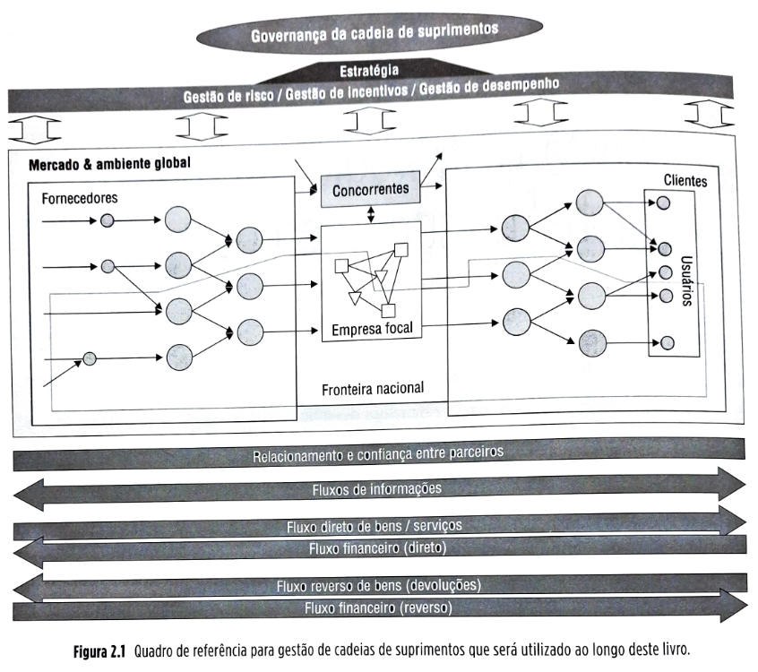

Figura 2.1 Quadro de referência para gestão de cadeias de suprimentos que será utilizado ao longo deste livro.

A seguir, uma breve descrição sobre a Embraer (Empresa Brasileira de Aeronáutica) e a evolução de sua estratégia de cadeia de suprimentos ao longo dos anos, ilustrando a sua importância para o sucesso competitivo da empresa.

Embraer: como a estratégia da cadeia de suprimentos apoia o sucesso competitivo Recentemente adquirida pela americana Boeing, a Empresa Brasileira de Aeronáutica (Embraer), baseada em São José dos Campos, no estado de São Paulo, é uma das empresas das quais os brasileiros mais se orgulham. Foi fundada em l1969 numa iniciativa governamental e inicialmente era uma empresa estatal, tendo sido priva tizada em 07 de dezembro de 1994. Fonte: http://www.embraer.com/english/content/imprensa/press releases_detalhe.asp?id=2045 e website da Folha Online (http:// www.folha. uol.com.br). Acesso em: l1 set. 2008.

Embora o período da Embraer como empresa pública tenha sido muito importante no desenvolvimento de competencias avançadas em engenharia aeronáutica, foi a partir da privatização que a empresa iniciou sua jornada para se tornar, num espaço de tempo relativamente curto, uma das maiores e mais competitivas fabricantes de aeronaves do mundo. A Embraer focaliza-se em segmentos de mercado específicos com grande potencial de crescimento em aviação comercial, executiva e, hoje menos intensamente, militar. A empresa foi a maior exportadora brasileira nos anos de 1999 a 2001 e a se gunda maior exportadora nos anos de 2002 a 2004. Em 2008 já empregava mais de 23 mil funcionários, mais de 85% deles baseados no Brasil. A Figura 2.3 ilustra o crescimento do número de funcionários da Embraer desde o ano 2000.

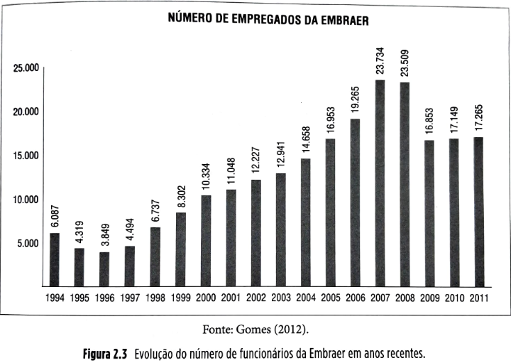

Figura 2.3 Evolução do número de funcionários da Embraer em anos recentes.

Desde 1996, a Embraer produziu e entregou mals de 3.300 aviões de sua família de jatos comerciais ERJ para mais de 37 linhas aéreas em 24 países. A família ERJ de jatos para aviação regional é composta de várias aeronaves: o ERJ-135 (37 lugares), ERJ-140 (44 lugares) e o ERJ-145 (50 lugares) têm plataforma comum e foram projetados Para compartilharem grande número de peças compo nentes, permitindo grande flexibilidade no atendimento ao mercado. O mesmo acontece com as aeronaves maiores linha da Embraer: EMBRAER 170 (70 a 80 lugares), EMBRAFR 175 (78 a 88 lugares), EMBRAER 190 (98 a 114 lugares) e e EMBRAER 195 (108 a 122 lugares).

Baseada na plataforma do jato de aviação comercial ERJ-135, a Embraer entrou no mercado de aviação executiva em dezembro de 2001 como avião Legacy para O mercado executivo corporativo. Em maio de 2005, a Embraer anunciou o lançamento de dois novos jatos, o Phenom 100 e o Phenom 300, para o segmento de aeronaves executivas extraleves e leves, com grande exxpectativa de vendas futuras.

Acompanhe a evolução do número de aeronaves en tregues pela Embraer desde 1997 na Figura 2.4. A Embraer conta hoje com uma operação globalizada com unidades em quatro continentes, conforme a Figura 2.5.

## Página 32 

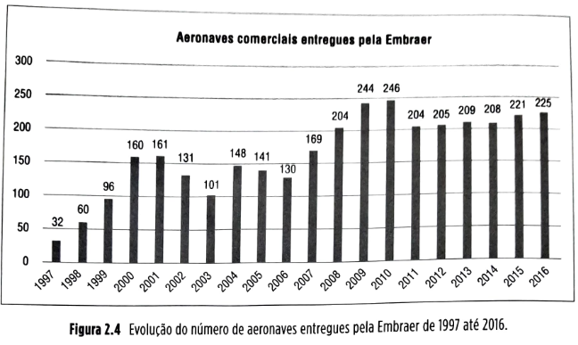

Figura 2.4 Evolução do número de aeronaves entreques pela Embraer de 1997 até 2016.

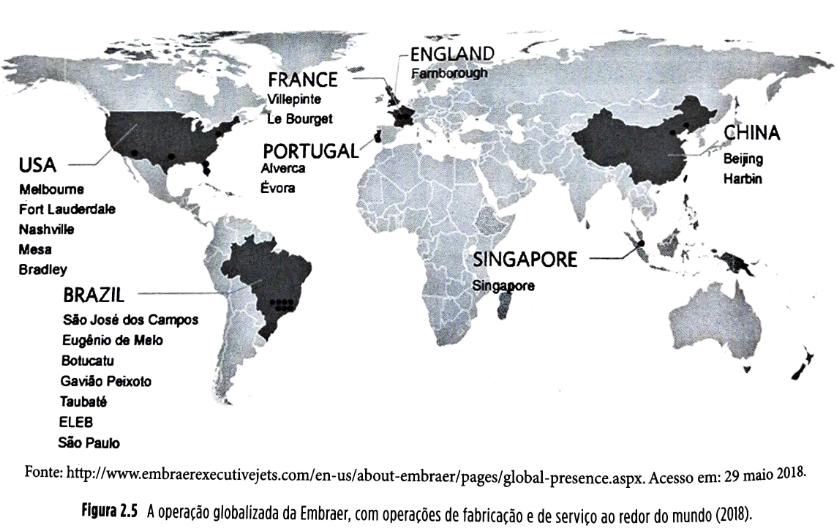

Figura 2.5 A operação globalízada da Embraer, com operações de fabricação e de serviço ao redo do mundo (2018).

### Cadeia de suprimentos

Acompanhando a sua impressionante evolução quanto à engenharia de desenvolvimento de produtos, a Embraer também, ao longo dos anos, fez evoluir sua gestão de cadeia de suprimentos, que tem tido um papel estratégico crucial no sucesso competitivo da empresa. De uma empresa verticalmente integrada nos anos 1970 e 1980 (anteriores à privatização), que produzia a maior parte das peças componentes de uma variedade relativamente modesta de produtos, a Embraer, desde os anos 1990, tem alterado substancialmente sua estratégia de cadeia de suprimentos no sentido de ampliar suas parcerias com fornecedores-chave. Alguns números podem ilustrar essa mudança: nos anos 1980, a Embraer trabalhava com mais de 500 fornecedores de componentes sem substancial compartilhamento de esforços de engenharia e desenvolvimento e com relacionamento relativamente tênue e de mais curto prazo com eles.

## Página 33

Praticamente todo o esforço de desenvolvimento de aeronaves como o “Brasília” era feito internamente, o que pelas restrições naturais de recursos, levou a um tempo de introdução do produto no mercado de aproximadamente oito anos. Nos anos 1980, visando a mercados mais sofisticados de aviação regional, a Embraer percebeu que, com a evolução tecnológica cada vez mais rápida, seria lento e ineficaz continuar desenvolvendo o produto todo sozinha.

Havia no mercado especialistas em partes do avião que poderiam desenvolvê-las e produzi-las melhor e de forma mais inovadora que a Embraer. Para o projeto da então revolucionária família ERJ, a Embraer buscou parceiros tecnologicamente fortes que estivessem dispostos a desenvolver relacionamentos mais cooperativos com a empresa desde o projeto do produto, compartilhando, por exemplo, riscos e custos de desenvolvimento.

A Gamesa, a C&D, a Sonaca e a Enaer foram então selecionadas e passaram a desenvolver e fornecer parcelas maiores da estrutura e do interior da aeronave (o total de fornecedores envolvidos na família ERJ caiu de mais de 500 à época do “Brasília” para 350). Esse esforço conjunto resultou num produto avançado tecnologicamente e num desenvolvimento mais rápido, de apenas cinco anos, dando à Embraer a importante vantagem de “pioneira” do então crescente filão da aviação regional, em relação aos principais concorrentes (como, por exemplo, a canadense Bombardier).

Nos anos 1990, a gestão da cadeia de suprimentos da Embraer continuou a evoluir no seu esforço estratégico de aumentar a velocidade de lançamento de produtos, a atualização tecnológica e a sua flexibilidade de resposta ao mercado. O desenvolvimento da família Embraer (170, 175, 190, 195) foi feito não com apenas quatro, mas com 29 (por exemplo, Kawasaki, Honeywell, C&D, Latecoere e Gamesa) parceiros estratégicos, fornecedores de módulos da estrutura, do interior e também de sistemas.

O número total de fornecedores com os quais a Embraer trabalha em sua família de jatos Embraer foi reduzido dos 350 dos ERJs para apenas 22, com os quais a empresa tem relacionamento muito mais próximo, colaborativo e eficaz, com riscos e benefícios compartilhados desde o desenvolvimento dos produtos.

O resultado foi uma redução do tempo de desenvolvimento para menos de quatro anos (mesmo levando em conta que a família Embraer tem maior complexidade que a família ERJ). Esse relacionamento mais próximo se reflete em um grande número de iniciativas da Embraer, como, por exemplo, o ESAC (*Embraer and Suppliers Advisory Council*), um conselho consultivo formado por fornecedores parceiros e Embraer para realizar atividades como melhoramento de comunicação, compartilhamento de boas práticas gerenciais, compartilhamento de decisões estratégicas e táticas e melhoria do nível de confiança nos relacionamentos da cadeia.

A Embraer também realiza anualmente um congresso mundial com seus fornecedores, o ESC (*Embraer Suppliers Conference*), em que se celebram as conquistas e compartilham-se informações estratégicas importantes com os fornecedores (parceiros estratégicos ou não).

Hoje é muito claro para a Embraer que, pelo menos tão importante quanto suas estratégias de mercado, de engenharia e financeira, é a sua estratégia de cadeia de suprimentos. A gestão estratégica da cadeia de suprimentos da Embraer permite alavancar sua vantagem competitiva, já que garante que ela possa se concentrar nas atividades que faz melhor do que ninguém e também que seus parceiros estratégicos tragam para o produto Embraer as mais avançadas competências complementares no projeto e produção eficientes e eficazes de seus aviões, resultando em um produto extremamente competitivo, no tempo certo e ao custo certo.

## Página 34 

### 2.2 CONCEITOS

### 2.2.1 Estratégia

A seguir, será examinada a questão de como definir uma estratégia de cadeia de suprimentos que seja alinhada às estratégias do negócio em que se insere.

**Estratégia corporativa**

Há vários níveis de estratégia nas organizações. O nível mais alto é o da estratégia corporativa e, em geral, esta só tem sentido isoladamente quando se trata de corporações compostas por várias unidades de negócios. Quando a corporação é composta de apenas uma unidade de negócio, a estratégia corporativa se confunde com a estratégia competitiva, descrita mais adiante. Pense, por exemplo, na corporação japonesa Honda. Ela tem várias unidades de negócios, que vão da fabricação de motocicletas, passando por veículos automotores (que fabrica carros como o Civic, o Fit e o Accord) até cortadores de grama. No nível corporativo, na sede da Honda, no Japão, estabelecem-se os objetivos de longo prazo para a corporação como um todo e as formas gerais de atingi-los. São decididos aspectos como: quais unidades de negócios criar, manter, adquirir ou vender; quais as sinergias entre elas (por exemplo, note que muitas das unidades de negócios da Honda foram criadas em torno da legendária competência da empresa em produzir motores leves e eficientes); e quais as expectativas em relação a cada uma delas para a contribuição esperada ao sucesso da corporação.

**Estratégia competitiva**

Dada a expectativa da corporação quanto às unidades de negócios, num nível intermediário está a **estratégia competitiva**, que vai definir as formas segundo as quais a unidade de negócio vai atuar nos seus mercados. Esse nível não se refere mais à corporação, portanto, mas a cada unidade de negócio. A estratégia competitiva define, frente às suas competências correntes, aos atuais e potenciais concorrentes, aos fornecedores e ao ambiente onde a unidade se insere, qual o conjunto de necessidades e desejos dos consumidores — de quais mercados e de que forma — a unidade de negócio pretende satisfazer com seus produtos e serviços.

Porter (1980) identifica três estratégias competitivas genéricas: **liderança em custo**, **diferenciação** e **foco**. Na liderança em custo, a empresa busca se tornar o produtor de mais baixo custo no setor; as fontes de vantagens em custo são variadas e podem incluir, por exemplo, a busca de economias de escala, o uso de tecnologia mais eficiente ou o acesso preferencial a fontes de matérias-primas (pense no acesso dos fabricantes chineses de brinquedos).

Na diferenciação, a empresa busca ser a única em seu setor a oferecer algumas características valorizadas pelo mercado (pense na Apple e seus produtos diferenciados).

Numa estratégia de foco, a empresa escolhe um ambiente competitivo restrito dentro do seu setor. No foco, a empresa seleciona um segmento ou um grupo de segmentos com necessidades incomuns dentro do seu setor e adapta a sua estratégia de forma a ser a melhor em atendê-los. Uma estratégia de foco poderia, portanto, ter duas variantes: uma estratégia de foco em custo (pense nas empresas seguradoras de veículos americanas que têm como fim atender exclusivamente segmentos de motoristas de mais idade por custo menor) e uma estratégia de foco em diferenciação (pense na joalheria Tiffany’s e seu foco em fornecer produtos diferenciados para segmentos de alto luxo) (Corrêa, 2008).

**Estratégia funcional**

A partir da definição da estratégia competitiva, as várias estratégias funcionais (que representam, portanto, um terceiro nível de estratégia nas organizações), para cada função dentro da unidade de negócio, devem ser estabelecidas: estratégia de marketing, estratégia de finanças, estratégia de pesquisa e desenvolvimento, estratégia de operações e estratégia de cadeia de suprimentos são alguns exemplos. Essas estratégias funcionais devem ser coerentes entre si, apoiar-se mutuamente e ser coerentes com a estratégia competitiva da unidade de negócio, de forma a apoiá-la no atingimento de seus objetivos. As diferentes funções numa unidade de negócio devem, a partir daí, estruturar seus processos de forma a executar suas estratégias de forma eficaz.

**Estratégia de cadeia de suprimentos**

Da mesma forma que não há uma só forma de competir nos mercados, não há uma só forma de definir e gerenciar a estratégia de cadeia de suprimentos de uma organização. Isso significa que a formação da estratégia de cadeia de suprimentos deve ser coerente com (e apoiar) a estratégia competitiva da unidade de negócio e, ao longo do tempo, essa coerência deve ser acompanhada e controlada, com ações estratégicas de realinhamento sendo disparadas quando necessário. As seções a seguir discutem especificamente as estratégias de cadeias de suprimentos.

### 2.2.2 Qual a estratégia de cadeia de suprimentos mais adequada para seus produtos e seus mercados?

Uma forma de classificar os tipos de produtos e mercados (para então analisar quais características estratégicas sua cadeia de suprimentos deveria ter) é proposta por Fisher (1997) e tem bastante similaridade com a classificação de tipos genéricos de estratégias competitivas propostas por Porter (1980), brevemente discutidas anteriormente. Segundo Fisher, o padrão de demanda dos produtos é a mais importante variável para definir tipos de produtos e mercados. Segundo essa ideia, o padrão de demanda dos produtos permite classificá-los em dois tipos: **produtos funcionais** e **produtos inovadores**.

## Página 35

**Produtos funcionais**

**Conceito-chave**

Produtos funcionais são aqueles produtos do dia a dia que as pessoas compram, por exemplo, de vários canais varejistas, como supermercados, lojas de conveniência e postos de gasolina.

Exemplos são itens como sabão em pó, barra de chocolate e gasolina. São produtos que satisfazem necessidades básicas, não se alteram muito frequentemente, têm ciclos de vida em geral mais longos, permanecendo no mercado, em geral, por dois anos ou mais. Eles, portanto, têm demanda estável e previsível (com erros de previsão em torno de 10%, no momento em que a produção ocorre).

Essa estabilidade de características de projeto e demanda, entretanto, atrai intensa concorrência. Isso resulta em concorrentes estudando os produtos uns dos outros e copiando-se mutuamente, fazendo com que os produtos se tornem, com o tempo, similares — passam a ter um *design dominante* (Utterback, 1996) — com poucas variantes por categoria.

Esses produtos em geral não têm necessidade de sofrer liquidações ao fim da estação, já que não perdem muito valor com o passar do tempo (como acontece, por exemplo, com os produtos de moda). São produtos mais *comoditizados* (pouco diferenciados). Isso em geral resulta em concorrência por preço, levando a margens de lucro modestas, não raro ficando na faixa de 5 a 20% — requerendo, portanto, que os custos envolvidos sejam muito bem controlados. Se não forem, as margens se tornam ainda menores ou mesmo negativas. Esses produtos frequentemente competem conforme a estratégia competitiva com ênfase em custo (tendo o preço um papel importante), de acordo com a classificação de Porter (1980).

**Produtos inovadores**

Numa tentativa de escapar da desconfortável situação de margens apertadas, muitas empresas procuram inovar, lançando os chamados **produtos inovadores**.

**Conceito-chave**

Produtos inovadores são produtos diferenciados, lançados frequentemente, em geral com ciclo de vida curto e demanda pouco previsível, características que dão ao cliente outras razões para adquirir estes produtos do que apenas o preço mais baixo.

Produtos eletrônicos (pense, por exemplo, na sempre inovadora linha de produtos da Apple, com seus iPods, iPads, iPhones, iWatches e Macs) e itens de moda (como roupas e acessórios) são exemplos de produtos inovadores, mas há também exemplos de empresas que, num certo momento, inovaram suas linhas de produtos, originalmente funcionais.

A Nike é um exemplo. Calçados de esporte no período anterior aos anos 1970 eram itens relativamente padronizados. A partir dos anos 1980, a Nike revolucionou o mercado com a introdução frequente de grande quantidade de novos designs, tornando o produto muito mais inovador, passando a comandar margens de lucro muito maiores. Não raro, os produtos inovadores têm lucratividade na faixa dos 20 a 80% ou até mais. O mesmo aconteceu quando a Swatch (do mesmo grupo suíço fabricante de relógios que produz os tradicionais Omega) revolucionou o mercado de relógios com seus inovadores e múltiplos designs lançados frequentemente e tornando esses itens moda. Embora produtos inovadores permitam à empresa ter maiores margens de lucro, a própria novidade constante dos produtos inovadores torna sua demanda muito mais imprevisível que aquela associada aos produtos funcionais, levando à falta e sobra de produtos, que, com frequência, têm de ser liquidados ao final da estação (reduções de preço de até 40% são comuns). Além disso, seus ciclos de vida são em geral muito mais curtos (três meses a um ano), o que torna a demanda ainda mais imprevisível (erros de previsão na casa dos 40 a 100% ou mais são comuns). Esses produtos competem conforme a estratégia competitiva com ênfase em **diferenciação**, de acordo com a classificação de Porter (1980).

**Produtos funcionais e inovadores e a estratégia de cadeia de suprimentos**

**Fique atento**

As características estratégicas das cadeias de suprimentos necessárias para criar e fornecer produtos inovadores, com suas demandas voláteis e imprevisíveis, são fundamentalmente diferentes daquelas necessárias para lidar com os produtos funcionais e suas demandas mais firmes e estáveis.

Uma das funções mais relevantes das cadeias de suprimentos é conciliar suprimento e demanda. Na medida em que as demandas são mais estáveis e previsíveis, essa conciliação é mais simples de ser feita. Quando se gerenciam demandas mais voláteis e imprevisíveis, as empresas têm de organizar seus recursos de modo a serem capazes de responder mais rapidamente a fatores inesperados, já que estes causam frequentemente desbalanceamento entre o suprimento e a demanda (às vezes, um crescimento de demanda inesperado pode resultar em custos por perda de venda se a cadeia de suprimentos não está preparada para responder a ele e, às vezes, uma demanda menor que a esperada pode resultar em custos de excesso e sobras de estoque, como a necessidade de redução de preços em liquidações). Com produtos cuja demanda é mais previsível, a necessidade de resposta rápida é menor, e as cadeias de suprimentos que os fornecem têm mais oportunidades de concentrarem seus esforços de prover um fluxo contínuo, ininterrupto e eficiente de produtos das fontes de matéria-prima até os consumidores.

## Página 36 

As características necessárias aos recursos da cadeia de suprimentos para prover produtos funcionais e produtos inovadores são não só diferentes, mas muitas vezes conflitantes entre si.

**Fique atento**

Para produtos funcionais, os recursos têm que enfatizar a eficiência de fluxos que atenderão demandas contínuas e esperadas, necessária para manter os custos dos produtos funcionais baixos; para produtos inovadores, por outro lado, a ênfase tem que ser na resposta rápida e na flexibilidade para adaptar-se ao inesperado, para compatibilizar, ágil e dinamicamente, o suprimento e a demanda incerta e volátil dos seus produtos.

O quadro da Figura 2.6 descreve as características estratégicas necessárias a esses dois tipos diferentes de cadeias de suprimentos: as chamadas **cadeias de suprimentos eficientes** e as **cadeias de suprimentos de resposta rápida**.

| Característica                             | Cadeias de suprimentos eficientes                                                            | Cadeias de suprimentos de resposta rápida                                                                                        |
| ------------------------------------------ | -------------------------------------------------------------------------------------------- | -------------------------------------------------------------------------------------------------------------------------------- |
| **Propósito principal**                    | Suprir demanda previsível eficientemente ao menor custo possível                             | Responder rapidamente à demanda imprevisível para minimizar custos de falta (perda de venda) e sobra (obsolescência, liquidação) |
| **Foco de manufatura**                     | Manter alta média de utilização de equipamento para redução de custos                        | Empregar capacidade “colchão” (capacidade extra bem gerenciada para lidar com o incerto e responder rápido)                      |
| **Estratégia de estoques**                 | Gerar altos níveis de giro, minimizando os estoques ao longo de toda a cadeia de suprimentos | Empregar estoques “colchão” (estoques de segurança) de componentes ou produtos acabados para maior disponibilidade               |
| **Foco no tempo de resposta**              | Reduzir os tempos desde que isso não aumente os custos                                       | Investir agressivamente para reduzir tempos (*lead times* e tempos de lançamento de produtos)                                    |
| **Abordagem para escolha de fornecedores** | Selecionar principalmente com base no custo e na qualidade                                   | Selecionar principalmente com base na velocidade de resposta, flexibilidade e qualidade                                          |
| **Estratégia de projeto de produto**       | Maximizar desempenho e minimizar custo                                                       | Uso de projeto modular para postergar diferenciação de produtos ao máximo                                                        |

*Fonte: adaptado de Fisher, 1997.*

Figura 2.6 Cadeias de suprimentos eficientes versus cadeias de suprimentos de resposta rápida.

Quando se analisam os dois tipos de produtos discutidos anteriormente — **funcionais** e **inovadores** — e os dois tipos básicos de cadeias de suprimentos — **eficientes** e **de resposta rápida** —, pode-se perceber que existe quase que um casamento natural entre os tipos de produto e os tipos de cadeia de suprimentos, conforme a matriz da Figura 2.7.

**Produto funcional**

* Cadeia de suprimentos eficiente: **Adequado**
* Cadeia de suprimentos de resposta rápida: **Inadequado**

**Produto inovador**

* Cadeia de suprimentos eficiente: **Inadequado**
* Cadeia de suprimentos de resposta rápida: **Adequado**

*Fonte: Fisher, 1997.*

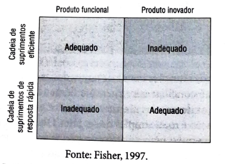

**Figura 2.7** — Matriz de adequação entre as duas categorias de produtos (inovadores e funcionais) e os dois tipos de cadeia de suprimentos (eficientes e de resposta rápida).

Cadeias de suprimentos que pretendem competir com produtos classificados como **funcionais** deveriam organizar seus recursos e processos de acordo com as características descritas das **cadeias eficientes**. Dessa forma, sua necessidade de custos baixos será atendida e, ao mesmo tempo, não se incorrerá nos custos necessários a prover respostas rápidas e adaptáveis (que os produtos funcionais não requerem).

Cadeias de suprimentos que pretendem competir com produtos **inovadores**, por outro lado, deveriam organizar e gerenciar seus recursos e processos conforme as características descritas das **cadeias de resposta rápida**. Com isso, a necessidade de resposta rápida que vem com a imprevisibilidade e volatilidade da demanda desses produtos será atendida. Isso requer recursos extras, com os correspondentes custos mais altos que os preços mais altos obtidos com os produtos inovadores permitem.

## Página 37

O uso de cadeias eficientes para produtos inovadores é **inadequado**, pois as cadeias eficientes, focalizando em maximização de utilização de recursos e redução de estoques ao longo da cadeia, têm comprometida sua capacidade de resposta rápida e sua flexibilidade, necessárias aos produtos inovadores.

Da mesma forma, o uso de cadeias de resposta rápida para produtos funcionais tornará a cadeia pouco competitiva, já que seus recursos e processos não são organizados para minimização dos custos, mas para a resposta rápida e flexível às incertezas do mercado.

**Teoria na prática**

Dois produtos que exemplificam por excelência os conceitos de produtos inovadores e de produtos funcionais são, respectivamente, o telefone celular e o sabão em pó. Observe a variedade disponível de telefones celulares no mercado e a quantidade de lançamentos de novos produtos. O site da Samsung, por exemplo, trazia em outubro de 2008 uma linha de 132 diferentes telefones celulares, sendo 37 deles novos modelos, lançados nos últimos meses.
  

A concorrência no mercado de telefones celulares se dá mais por inovação (aparelhos que trazem a última tecnologia, como alta capacidade de armazenamento, câmeras e telas de alta definição, navegação rápida na Internet, GPS, *bluetooth*, carga sem fio, bateria de longa duração, à prova d’água e outras) e rapidez de introdução de novos produtos do que por preço, o que leva em geral a margens maiores de lucro. A demanda de telefones celulares, dado o dinamismo do seu mercado, a variedade e a novidade dos produtos, é bastante imprevisível.

Já o produto Omo, marca líder de mercado em sabões em pó no Brasil, foi lançado no país em 1957 e tem apenas algumas poucas variantes (como Omo Baby, para roupas infantis) e raras introduções de novos produtos (mais de 1,5 milhão de embalagens vendidas por dia no Brasil em 2018). Preço é um fator competitivo essencial. A demanda do sabão Omo é certamente muito mais previsível que a dos telefones celulares, tanto pela estabilidade da demanda como pela pouca variedade e pela maturidade dos produtos da linha.

Os dois produtos, para poderem ser competitivos em seus respectivos mercados, têm de ser produzidos e distribuídos por cadeias de suprimentos marcadamente diferentes, em termos de todos os aspectos mencionados no quadro da Figura 2.6.

**Como as cadeias eficientes e de resposta rápida lidam com incertezas no lado do suprimento**

A classificação entre cadeias de suprimentos eficientes e de resposta rápida é baseada no nível de previsibilidade da demanda a ser atendida. Lee (2002), entretanto, chama a atenção para o fato de que imprevisibilidade não afeta apenas o lado da demanda das cadeias de suprimentos. Afeta também o lado dos suprimentos e, de acordo com o autor, diferentes ações estratégicas seriam apropriadas quando cadeias eficientes encaram imprevisibilidade no lado do suprimento e quando cadeias de resposta rápida enfrentam o desafio.

**Conceito-chave**

Suprimentos **imprevisíveis** são, por exemplo: mais vulneráveis a quebras e a outros problemas que causam interrupções; mais sujeitos a níveis de qualidade variáveis; a ter poucas fontes disponíveis de suprimentos; a fornecedores menos confiáveis; a alterações de processo; a engargalamento; a serem inflexíveis ou a terem *lead times* muito variáveis.

Exemplos de cadeias eficientes enfrentando suprimentos imprevisíveis podem ser achados em quantidade nos mercados de produtos com insumos agrícolas, que são dependentes de safras, por sua vez sujeitas às imprevisibilidades do clima. Um exemplo extremo, apenas para ilustrar, é a demanda por sorvete de baunilha, vendido em grandes quantidades e, de forma geral, previsível. Cinquenta por cento do suprimento mundial de baunilha vem da ilha de Madagascar, que é não só sujeita a incertezas climáticas, mas também à instabilidade política, o que configura um exemplo de produto com demanda previsível, mas com suprimento imprevisível.

## Página 38

Outro exemplo, mais geral, de demandas bem-comportadas tendo que lidar com suprimentos imprevisíveis ocorre com o chamado **“efeito chicote”**, segundo o qual, às vezes, pequenas flutuações de demanda no lado do varejo causam flutuações com amplitude crescente nas demandas percebidas por participantes mais a montante da cadeia. Isso ocorre porque, quanto mais distante do consumidor final a empresa está na cadeia, menos ela “enxerga” claramente sua demanda. Em outras palavras, a demanda do consumidor final da cadeia é gradual e sequencialmente distorcida, à medida que a informação passa de cliente a fornecedor, já que é alterada por decisões de ajustes dos estoques e das previsões dos vários nós intermediários da cadeia (num efeito que tem alguma similaridade com a brincadeira infantil de “telefone sem fio”) até os fornecedores mais a montante na cadeia.

O resultado (explicado em mais detalhes no Capítulo 8) é que mesmo cadeias com pouca flutuação na demanda do consumidor podem ter grande flutuação mais para o lado do suprimento, simplesmente por distorção de informações interna à cadeia.

Por outro lado, pode-se também pensar em exemplos de **cadeias de resposta rápida** (necessárias para lidar com demanda mais imprevisível) que encaram também condições imprevisíveis de suprimento. Exemplos são os produtos de alta tecnologia, como computadores ou produtos avançados de telecomunicações: tanto a demanda é pouco previsível como também o são os processos de suprimentos, com as incertezas características dos processos de desenvolvimento, introdução no mercado e crescimento rápido de vendas de produtos de alta tecnologia de ciclos curtos.

**Fique atento**

Quando cadeias eficientes encaram suprimentos imprevisíveis, segundo Lee (2002), elas deveriam usar principalmente estratégias de redução dessas incertezas.

As estratégias de redução de incertezas sugeridas por Lee (*op. cit.*) podem ser planejamento e gestão colaborativa de previsões e de estoques entre parceiros da cadeia, com muito compartilhamento de informações, de forma que as distorções de informação na cadeia sejam minimizadas (esses modelos colaborativos são explorados em mais detalhes no Capítulo 9). Quanto às incertezas não relacionadas à distorção de informações (por exemplo, devidas a engargalamento ou a fornecedores não confiáveis), estratégias de proteção e prevenção são recomendadas — por exemplo, o desenvolvimento de fornecedores alternativos e a criação de estoques de proteção de insumos-chave (que podem ser compartilhados entre concorrentes para minimização de custos). Os estoques estratégicos de combustíveis de países não produtores de petróleo, por exemplo, fazem esse papel. A ideia nesses casos é **reduzir a imprevisibilidade dos suprimentos**.

**Fique atento**

Quando cadeias de resposta rápida têm processos de suprimentos mais imprevisíveis, a estratégia recomendada é o aumento de proteção da cadeia, com a formação de colchões de estoques ou de capacidade que protejam a cadeia de possíveis interrupções.

Essas cadeias combinam características de proteção com resposta rápida e isso em geral só pode ser feito com uma boa gestão da **redundância** de alguns recursos (estoques e capacidade, tipicamente). Essa redundância vai aumentar os custos, mas, lembre-se, as cadeias de resposta rápida necessitam enfatizar mais a rapidez que a eficiência. Além disso, em geral as cadeias de resposta rápida conseguem, por seus produtos, preços que permitem esse aumento de custo, desde que ele permaneça em níveis competitivos. A ideia nesses casos é **preparar-se para responder bem à imprevisibilidade dos suprimentos**. A Figura 2.9 ilustra essa ideia.

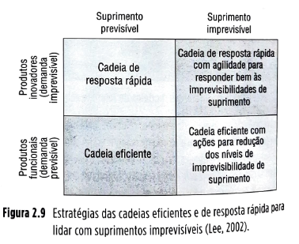

## Página 39

### 2.2.3 Fluxos empurrados, puxados e híbridos

Em gestão de fluxos de materiais, uma das classificações importantes que diferenciam a natureza dos fluxos é aquela que separa os **fluxos empurrados** (*push*, na literatura de língua inglesa) dos **fluxos puxados** (*pull*, na literatura de língua inglesa). Uma decisão estratégica importante em cadeias de suprimentos refere-se exatamente à natureza dos fluxos, que podem ser empurrados, puxados ou híbridos (empurrados-puxados). Além disso, para os sistemas híbridos, uma decisão igualmente importante é onde localizar a chamada **“fronteira entre os fluxos empurrados e puxados”**. Analisemos cada uma dessas opções estratégicas. A primeira é aquela em que os fluxos são **empurrados**.

**Conceito-chave**

Fluxos **empurrados** são aqueles em que as atividades de produção e/ou movimentação de materiais ocorrem antes da ocorrência de um pedido formal de um cliente que se encontre a jusante na cadeia de suprimentos.

Nessa modalidade, as atividades de produção e/ou movimentação são feitas baseadas numa previsão das necessidades futuras dos clientes que se encontram a jusante. Um exemplo familiar é a produção tradicional de sabão em pó. O cliente, quando chega num supermercado, espera encontrar sabão em pó disponível imediatamente na prateleira. Para que o sabão esteja lá disponível, em certo momento anterior, ele teve de ser movimentado, com antecedência, do fabricante para o supermercado (o que pode ter levado algumas horas ou mesmo dias).

Com maior antecedência ainda, o sabão em pó teve de ser fabricado e embalado pelo fabricante, para que pudesse ser transportado. Com antecedência ainda maior, os materiais necessários à fabricação do sabão em pó (os componentes químicos e a embalagem) tiveram que ser encomendados, fabricados e transportados pelos fornecedores da fábrica de sabão para suas instalações e assim por diante. Todas essas atividades foram executadas antes de o cliente colocar seu pedido (no caso do supermercado, antes de o cliente pegar o produto na prateleira, colocá-lo no carrinho e pagar por ele), com base numa expectativa de o cliente colocar seu pedido (em outras palavras, numa previsão da demanda futura do consumidor).

Com base nessa previsão, o produto produzido é “empurrado” para estágios a jusante da cadeia até que esteja disponível na prateleira esperando para ser comprado. A produção e/ou o transporte dos materiais nos sistemas empurrados de gestão de fluxos de materiais são feitos **antes** e **na esperança** de o cliente colocar seu pedido. O oposto ocorre com os **fluxos puxados**.

**Conceito-chave**

Fluxos **puxados** são aqueles em que as atividades de produção e/ou movimentação de materiais só ocorrem **depois** de haver um pedido formal de um cliente que se encontre a jusante na cadeia de suprimentos.

Nessa modalidade, as atividades de produção e/ou movimentação não são feitas se não houver uma solicitação explícita de um cliente a jusante. Um exemplo extremo é a produção de produtos sob encomenda. O cliente, quando chega à oficina de um alfaiate para comprar um terno sob medida, não espera encontrar na prateleira exatamente o terno que será o seu, já pronto nas suas exatas medidas — a menos que o alfaiate tivesse uma bola de cristal, o que, em geral, não é o caso.

O alfaiate, a pedido do cliente, só então dispara suas atividades de desenho e produção do produto sob medida: toma as medidas do cliente, cria os moldes, encomenda o tecido e os aviamentos, produz as partes, monta, prova, ajusta e entrega. O fluxo de materiais só ocorre depois de o cliente fazer seu pedido, ou, em outras palavras, o fluxo é puxado pela informação dada pelo pedido do cliente. A produção e/ou transporte dos materiais nos sistemas puxados de gestão de fluxos de materiais são feitos depois de o cliente colocar seu pedido.

Na maioria das cadeias de suprimentos, entretanto, nem todos os fluxos envolvidos são puxados a partir do pedido do cliente e tampouco todos os fluxos são empurrados. Há ambas as modalidades presentes. No caso do alfaiate do exemplo anterior, os aviamentos, por exemplo, as linhas, os botões e o tecido podem ter sido comprados pelo alfaiate com antecedência (ou de acordo com suas previsões de pedido) e estocados para atender aos clientes. Ou seja, parte da cadeia teve fluxo empurrado — produção e/ou transporte feitos antes do pedido, de acordo com previsões de necessidade futura — e parte da cadeia teve fluxo puxado a partir do pedido feito. Isso acontece porque há vantagens e desvantagens nos dois sistemas (empurrados e puxados) de gestão de fluxos de materiais, e trabalhar com ambos pode permitir à cadeia de suprimentos obter benefícios de ambos, minimizando simultaneamente as desvantagens de ambos.

**Conceito-chave**

Os fluxos **híbridos empurrados-puxados** ocorrem na maioria das cadeias de suprimentos nas quais parte dos fluxos (em geral a montante) são empurrados e parte dos fluxos (em geral a jusante) são puxados.

## Página 40

Os fluxos puxados têm como principal vantagem a redução da incerteza sobre as atividades — estas só são disparadas quando há um pedido do cliente. As incertezas típicas das previsões e dos processos que se disparam a partir delas são eliminadas, exigindo assim níveis de estoques de segurança menores (os estoques de segurança existem exatamente para fazer frente a incertezas e, portanto, permitindo custos menores. Em compensação, os **fluxos puxados** têm a desvantagem de apresentar tempos longos de resposta. Isso porque as atividades só são disparadas depois de o pedido efetivo do cliente, não feito com antecedência; portanto, o tempo de espera do cliente em geral pode se estender.

Os **fluxos empurrados**, por outro lado, têm como principal vantagem a velocidade de resposta ao cliente. Como nos fluxos empurrados muitas das atividades são realizadas antes de o cliente efetivar seu pedido, ele terá de esperar pela realização de relativamente menos atividades depois que o fizer.

Em compensação, essa velocidade não vem de graça: como as atividades disparadas antes do pedido do cliente são baseadas em previsões, o nível de incerteza sobre elas é maior, exigindo assim maiores níveis de estoques de proteção, o que aumenta os custos.

Essas vantagens e desvantagens complementares dos sistemas empurrados e puxados levam algumas cadeias de suprimentos a tentarem utilizar ambos.

Na modalidade **híbrida**, os sistemas empurrados-puxados têm parte dos seus fluxos empurrados (em que as atividades são realizadas com base em previsão, antes do pedido) a fim de encurtar tempos de resposta, por exemplo, os itens cuja obtenção leve mais tempo, e parte dos seus fluxos puxados (com parte das atividades realizadas apenas depois do pedido do cliente), para reduzir assim a incerteza e, por consequência, os custos de lidar com ela.

Se o nosso alfaiate tivesse seu fluxo 100% puxado, ele teria a vantagem de trabalhar com altíssima personalização do produto e uma incerteza muito baixa, mas a desvantagem de ter um tempo maior de espera, por exemplo, de seis semanas para o cliente receber seu terno (três semanas para o alfaiate ter em mãos o tecido encomendado após o pedido e três semanas de produção do terno em si). Por outro lado, ele trabalhasse com fluxo 100% empurrado, teria a vantagem desse sistema (prazos curtos, com entrega imediata), mas teria de manter um estoque praticamente infinito de produtos prontos para, dentre eles, ter exatamente aquele que o cliente gostaria, precisamente de seu tamanho, dessa forma provendo os 100% de personalização exigidos.

Os custos, nesse último caso, evidentemente seriam inviáveis. O alfaiate, porém, poderia pensar numa **solução híbrida**. Ele poderia manter em estoque uma variedade limitada dos tecidos mais procurados nas cores mais comuns (como azul-marinho e preto, que são a maioria de sua demanda). Assim, talvez não para 100% dos clientes, mas para uma grande porcentagem, o prazo de espera poderia ser encurtado para três semanas (apenas três semanas de produção do terno), com um estoque reduzido em relação àquele necessário para um fluxo 100% empurrado (já que grande parte da incerteza é eliminada pela disparo da produção do terno apenas depois que o pedido entra).

Nesse caso, o alfaiate teria optado por um sistema **empurrado-puxado** para sua cadeia de suprimentos. O fluxo de tecido dos seus fornecedores até sua oficina foi empurrado, feito com base nas previsões de demanda futura e manutenção de algum nível de estoque de tecido na oficina. O fluxo, então, da oficina para o cliente, que envolve a produção em si do terno, foi puxado, com todas as atividades sendo feitas depois do pedido. A fronteira entre o fluxo empurrado e puxado foi definida para estar localizada no nível dos estoques de insumos do terno.

Se o alfaiate optasse por trabalhar com ternos prontos em estoque de produtos acabados, a fronteira estaria localizada no nível dos produtos acabados. Quanto mais a montante da cadeia de suprimentos se encontra a fronteira, maior parte da cadeia trabalha de forma puxada, com menores estoques, mas com tempos de resposta maiores. Quanto mais a jusante a fronteira se localiza, maior parte da cadeia trabalha de forma empurrada, com tempos de resposta mais rápidos, mas, em compensação, com maiores estoques. A Figura 2.10 ilustra o conceito.

## Página 41

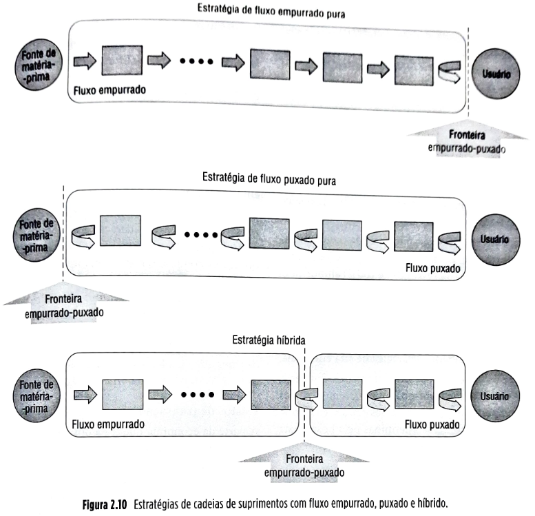

Figura 2.10 Estratégias de cadeias de suprimentos com fluxo empurado, puxado e híbrido.

**Quando são adequados os fluxos empurrados, puxados e híbridos**

Estrategicamente, é importante que, na gestão de cadeias de suprimentos, a escolha da natureza dos fluxos na cadeia seja coerente com a sua forma de competir. Há basicamente três possibilidades para a definição do projeto estratégico do fluxo: **fluxo empurrado puro**, **fluxo puxado puro** ou **fluxo híbrido empurrado-puxado**. O mais comum é o fluxo híbrido empurrado-puxado. Quando uma cadeia define que vai trabalhar de forma híbrida, a decisão mais importante passa a ser onde ela vai localizar a chamada **fronteira entre o fluxo empurrado e o fluxo puxado**, ou seja, qual parte da cadeia vai trabalhar executando atividades antes da entrada efetiva do pedido de um cliente (para maior velocidade de atendimento) e quais atividades só vão ser realizadas depois de um pedido ter entrado (para trabalhar sob menor incerteza). A localização da fronteira entre o fluxo empurrado e o puxado numa cadeia de suprimentos é uma decisão estratégica que deve ser coerente com as necessidades de eficiência e custos baixos e de capacidade de resposta, analisadas anteriormente neste capítulo.

**Fique atento**

Cadeias de suprimentos com necessidade de maior eficiência tenderão a trabalhar com maior parcela de seus fluxos **puxados**, enquanto cadeias de suprimentos com necessidade de resposta mais rápida tenderão a trabalhar com maiores parcelas de seus fluxos **empurrados**.

A Figura 2.11 ilustra o conceito. Situações completamente fora da diagonal indicada tendem a ser menos adequadas. Por exemplo, uma cadeia que exige resposta extremamente rápida, como produtos de moda de ciclo curtíssimo e alta margem, nesse caso, poderá haver problemas caso se opte por trabalhar com parcelas grandes de suas cadeias com fluxos 100% (ou próximos de 100%) puxados, ou contraproducente, pois isso faria com que até as matérias-primas mais básicas só fossem extraídas e beneficiadas quando um pedido acontecesse. Isso evidentemente faria com que o tempo de resposta fosse muito lento, causando uma resposta insatisfatória às suas necessidades estratégicas.

## Página 42

O mesmo se aplica a produtos que exigem cadeias eficientes (por exemplo, com baixos estoques ao longo da cadeia), como os produtos com menos diferenciação — caso do nosso sabão em pó. Neste caso, hoje em dia, a reposição de estoques nos canais de distribuição é normalmente feita com base em reposição automática — só se repõem os produtos nas prateleiras dos supermercados à medida que são consumidos.

Os fluxos são, então, em grande parte da cadeia, puxados pela informação da demanda ocorrida. Se fosse utilizado um fluxo 100% (ou próximo de 100%) empurrado, ou seja, fora da diagonal, isso significaria movimentar estoques ao longo dos canais independentemente da demanda, o que levaria a estoques altos e custos correspondentemente mais altos, o que seria também uma resposta inadequada à necessidade estratégica de alta eficiência.

Note que os casos “puros” são as exceções. Em geral, as cadeias têm desenhos híbridos com diferentes ênfases em fluxos empurrados e puxados. Essas ênfases, conforme discutido anteriormente, são definidas pela posição da fronteira entre os fluxos empurrados e puxados.

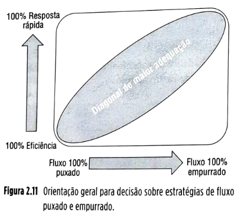

### 2.2.4 A decisão estratégica de comprar ou fazer

Outra decisão importante a ser tomada por uma empresa ao desenvolver sua estratégia de cadeia de suprimentos é a que define quais atividades da cadeia ela própria executará e quais delegará a terceiros para que estes as executem. Em outras palavras, isso representa, para cada uma das atividades produtoras de bens e de serviços dentro da cadeia, a decisão de comprá-los de terceiros (ou, de acordo com o jargão mais corrente, **terceirizá-los**) ou de fazê-los internamente.

Tradicionalmente, a decisão de comprar ou fazer era feita com base apenas na consideração dos custos incorridos. Se um banco, por exemplo, tivesse que tomar a decisão de estabelecer e gerenciar seu próprio *call center* ou contratar uma empresa para fazê-lo, compararia os custos incorridos de estabelecer e gerenciar seu *call center* com os custos de contratar uma empresa externa para fazê-lo. A opção que resultasse em custos menores seria a ganhadora e a decisão seria então tomada.

A noção de que os custos marginais de comprar ou fazer seriam a única consideração a ser feita (ou a consideração dominante) está superada. Considera-se hoje que a decisão de comprar ou fazer tem implicações estratégicas demais para se levar em conta apenas o conceito de custos marginais. Em tempos atuais, há pelo menos duas vertentes de considerações vistas como essenciais para uma boa decisão sobre comprar ou fazer nas cadeias de suprimentos: considerações relacionadas aos **custos de transação** envolvidos e considerações relacionadas às **competências centrais** da organização.

**Custos de transação**

A parte da economia que trata dos custos de transação, originada pelos trabalhos seminais de Coase (1937), procura compreender por que as firmas existem e fazem coisas (em vez de comprar de terceiros). Esses conceitos podem ajudar a compreender melhor as decisões envolvidas na nossa discussão. Comecemos por discutir alguns conceitos fundamentais.

Uma **transação** é a transferência de um bem ou serviço entre unidades de operação tecnologicamente separadas.

**Conceito-chave**

Os **custos de transação** são os custos totais associados a uma transação, excetuando-se o menor preço possível do produto para a “sobrevivência” do produtor.

Custos de transação só existem porque os mercados são imperfeitos — por exemplo, as informações nos mercados não são 100% disponíveis e as pessoas não são 100% perfeitas na sua capacidade de análise. Assim, surgem comportamentos racionais nas decisões. Esses custos incluem, por exemplo, informação sobre o fornecedor, o fato de não o conhecer perfeitamente, os custos de cotação, os custos de elaboração de contratos, os eventuais custos judiciais de fazer os contratos terem efeito, entre outros.

## Página 43

A análise de transações visa a obter eficiência na gestão dessas transações ou, em outras palavras, visa à minimização dos custos de transação. De acordo com a teoria de organização industrial, os custos de transação incorridos na relação de uma empresa com seus fornecedores na compra de um item são influenciados por pelo menos quatro fatores:

▪️o número de fornecedores potenciais;
▪️a especificidade de ativos dedicados à transação;
▪️o nível geral de incerteza em torno da transação; e
▪️a frequência com a qual as transações ocorrem.

**Número de fornecedores:** se há poucos fornecedores potencialmente capazes de fornecer o item em questão, a tendência é haver comportamento oportunista do fornecedor — por exemplo, com aumento do preço cobrado em virtude da condição de monopólio ou quase-monopólio. Isso ocorre, em grande medida, porque os mercados se tornam mais imperfeitos. Dessa forma, transacionar com o fornecedor aumenta os custos de transação da empresa compradora. Quanto menor o número de fornecedores potenciais, portanto, mais os mercados se aproximam da condição de monopólio ou quase-monopólio e maior é a probabilidade de aumento nos custos de transação incorridos pelo comprador.

**Especificidade de ativos:** ativos são específicos a uma transação quando altamente especializados e, portanto, têm pouco ou nenhum uso geral fora da específica relação fornecedor–cliente em questão. Quando uma empresa, por exemplo, tem de comprar uma máquina para processar um material de um fornecedor específico, capaz de processar somente aquele material específico, porém inapta a processar materiais de outros fornecedores concorrentes, considera-se que esse ativo (a máquina) é específico para a relação entre a empresa e aquele fornecedor. Uma decisão de trocar o fornecedor exigiria a troca da máquina, aumentando substancialmente o custo de troca entre fornecedor. Esse custo alto de troca pode levar a comportamentos oportunistas do fornecedor, como, por exemplo, aumentos de preço ou maiores custos para lidar com entregas, o que acarreta maior custo para a empresa cliente. Portanto, quanto maior a especificidade de ativos de uma transação, maiores os custos de transação do item.

**Incerteza:** são as fontes de perturbações para as quais adaptações são requeridas numa relação fornecedor–cliente. Num mundo imperfeito, no qual os indivíduos…

…têm uma capacidade limitada de processar informações e, portanto, estão sujeitas a reações oportunistas dos interlocutores comerciais, uma alta incerteza torna mais difícil para a empresa avaliar as ações do fornecedor. Numa transação, a maior parte da incerteza percebida pelo cliente, em relação à incerteza percebida pelo fornecedor, dá-se no nome de **assimetria de informação**. O grau geral de incerteza envolvendo uma transação tende a aumentar seus custos, mas, quando há assimetria de informação (e, portanto, do nível de incerteza) favorecendo o fornecedor, a possibilidade de comportamento oportunista deste aumenta, aumentando os custos de transação. Portanto, quanto maior o nível de incerteza em torno da transação, maiores seus custos.

**Frequência:** quanto mais frequentemente uma empresa transaciona com um fornecedor, mais vezes ela tem que incorrer nos custos de realizar cada transação e, portanto, maiores serão seus custos de transação em relação àquele item, ao longo de um determinado período. Por exemplo, no caso do fornecedor de carpetes, talvez uma vez a cada dez anos. Os custos de cotação, coleta de informações, elaboração de contrato e outros ocorrem, portanto, a cada dez anos. Já um fornecedor de certa matéria-prima frequentemente necessária levará, teoricamente, à ocorrência de custos de transação várias vezes por ano. O custo de transação desse item será, portanto, maior que o custo de transação do carpete. Quanto maior a frequência das transações, maiores seus custos.

A **Figura 2.12** ilustra o processo de análise de custos de transação.

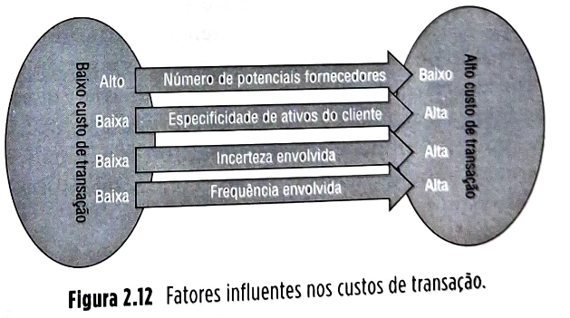

Figura 2.12 — Fatores influentes nos custos de transação.

**Fique atento**

Quanto maiores os níveis de especificidade do ativo do cliente, das incertezas, da frequência e quanto menor o número de potenciais fornecedores envolvidos com a transação, maiores seus custos.

## Página 44

**Custos de transação e a decisão estratégica de comprar ou fazer**

**Conceito-chave**

A teoria econômica por trás da análise dos custos de transação preconiza que, quanto mais altos os custos de transação incorridos, mais as empresas tenderão a tentar minimizá-los via integração vertical, ou seja, tendendo a optar por fazer internamente o item em questão em vez de terceirizar sua produção. Do mesmo modo, quanto menores os custos de transação, mais as empresas tenderão, assumindo comportamento racional (embora limitado), a optar por **comprar** o item.

Os custos de transação são necessários à nossa análise, mas não são suficientes (McIvor, 2009). Também é necessário levar em conta uma outra vertente de considerações: aquela que trata do conceito de **competências centrais** (*core competencies*).

**Competências**

Hamel e Prahalad (1994) definem competências como mais do que apenas uma única habilidade ou uma única tecnologia, mas um conjunto de habilidades e tecnologias. Um exemplo é a Motorola e sua competência em produção de ciclos curtos (tempo que decorre entre o recebimento e o atendimento de um pedido), que se apoia numa larga faixa de habilidades, incluindo disciplina no projeto dos produtos que se preocupam com modularidade e intercambiabilidade de partes e conjuntos entre produtos, manufatura flexível, sistemas sofisticados de interação de pedidos, gestão de estoques e gestão de fornecedores. Uma competência representa um somatório de aprendizados ocorridos cruzando fronteiras de equipes e unidades operacionais ou funcionais e, portanto, raramente é encontrada confinada em uma unidade ou equipe.

**Competências centrais**

Dada a definição do que sejam competências, Hamel e Prahalad (1994) definem então o que seriam as características necessárias para que uma competência seja considerada central (essa definição é importante porque as competências centrais seriam, segundo os autores, as mais valiosas fontes de vantagem competitiva sustentável de uma empresa):

**Valor para o cliente**

Uma competência central deve proporcionar uma contribuição desproporcional para o valor percebido pelo cliente. Nesse sentido, uma competência central é uma competência da organização que proporciona ao cliente um valor (ou benefício) percebido por ele como determinante. Note que o que é percebido como benefício advindo da competência é para o cliente, e não em si. As empresas, nessa análise, devem identificar conjuntamente sobre quais seriam os elementos de valor presentes nos seus produtos ou serviços, pelos quais o cliente está de fato disposto a pagar.

**Diferenciação sobre concorrência**

Para que uma competência se qualifique como central, ela deve ser competitivamente única ou exclusiva. Isso não significa que ela tenha de ser dominada por uma única empresa, mas que uma competência que comece a todo um setor industrial não deveria ser considerada como central. Um exemplo é a competência em logística de distribuição desenvolvida no Brasil ao longo dos anos pela Avon Cosméticos, que faz chegar seus produtos, em pequenas quantidades, por exemplo, a quase 1,5 milhão de revendedores e revendedoras em todo o país com altos níveis de perfeição (pedidos pontuais, completos e em condição perfeita). São significa que seja a única empresa no mercado com essa competência. A Natura Cosméticos também tem desempenho destacado nessa área e com um modelo similar de negócio, com 1,7 milhão de consultoras e consultoras, por exemplo. Entretanto, certamente não se trata de competência dominada por todo o setor industrial.

**Extendabilidade**

Competências centrais seriam também importantes portas para os mercados do futuro. Isso significa que gestores deveriam abstrair-se dos mercados de hoje e imaginar que tipos de novas oportunidades as certas competências podem abrir no futuro. Uma competência é realmente central quando a sua posse tem importância na abertura de novos mercados e oportunidades futuras. Ainda como exemplo podemos citar a Avon Cosméticos, que, por dominar uma competência central na logística de distribuição de cosméticos que sempre fabricou, teve para si abertas as portas da distribuição de outros produtos, como utilidades domésticas. Hoje a Avon é uma relevante distribuidora de utilidades plásticas domésticas do Brasil e tem boa parte de seu faturamento mensal vindo da distribuição e venda desses produtos que, a exemplo de utilidades domésticas, não são cosméticos e não fabrica e não distribuía inicialmente.

## Página 45

**Conceito-chave**

Uma **competência central** é um conjunto de habilidades e tecnologias que contribuem desproporcionalmente para o valor percebido pelo cliente e que, efetivamente, é única ou exclusiva (portanto, de difícil imitação) e tem o potencial de abrir portas para mercados promissores futuros.

A **Figura 2.13** ilustra o processo de identificação de competências centrais.

*Figura 2.13 — Fatores que ajudam a definir uma competência central.*

Ainda na tentativa de melhor conceituar o que são competências centrais, Hamel e Prahalad (*op. cit.*) seguem descrevendo o que uma competência central **não é**.

Não é um ativo numa competência tradicional: competências centrais não aparecem no balanço patrimonial. O que cresce aqui é que qualquer coisa física ou objetivável na forma contábil tradicional é passível de ser imitada facilmente e, portanto, não poderia ser considerada como competência central.

Ao contrário de ativos tradicionais, competências centrais não se desgastam ou depreciam; muito ao contrário — quanto mais utilizadas, mais valiosas se tornam. Uma competência central é uma habilidade de melhorar com o uso. Isso sinaliza para um ponto crucial nessa análise da decisão de comprar ou fazer atividades numa cadeia de suprimentos: o risco de se terceirizar atividades que sejam competências centrais em um setor industrial e, portanto, de portas competitivas importantes do futuro se fecharem.

Os autores também sinalizam para o fato de que *brand name* (marca), apenas, não pode ser, por si só, considerada como competência central, se não for suportada por competências centrais reais. Exemplos de operações que levem a desempenho superior efetivo, como o declínio da participação de mercado da Porsche, que baseou sua vantagem competitiva exclusivamente em seu forte *brand name*, é emblemático, com vendas caindo 90% no mercado americano de carros esportivos entre 1986 e 1993, período durante o qual a empresa encarou concorrentes altamente competentes, como o Lexus (marca de luxo da Toyota) ainda que sem a força de uma marca.

O raciocínio por trás das competências centrais advoga que uma empresa não faça internamente tudo o que quer. Por exemplo, a Canon tem muito clara a noção da importância estratégica de competências centrais; ela terceiriza em torno de 75% dos componentes que integram suas copiadoras. O que a empresa busca controlar são as competências que fazem as maiores diferenças para o valor ofertado ao cliente. A Nike, por exemplo, não costura seus tênis, mas controla competências em logística, qualidade, *design*, desenvolvimento de produto, testemunhos de atletas, distribuição e *merchandising*.

**Competências centrais e a decisão estratégica de comprar ou fazer**

**Fique atento**

Os itens resultantes da ação de competências centrais numa organização não devem ser terceirizados.

A Gillette tem como competência central para suas lâminas de barbear seu conhecimento do processo de produção das lâminas e do equipamento que as produz. O desenvolvimento desse processo não é, portanto, terceirizado, pois se trata de uma fonte de vantagem competitiva sustentável para a empresa. A Honda também não terceiriza o projeto ou a produção de seus motores leves e eficientes. Hoje, mais do que nunca, essa competência, dados os aumentos periódicos do preço do petróleo, é fonte importante de vantagem competitiva da empresa.

**2.2.5 Um modelo para a decisão de comprar ou fazer**

**Para refletir**

São dois os grandes conceitos a serem levados em conta quando se decide sobre comprar (terceirizar) ou fazer determinada atividade (que resulta na produção de um bem ou serviço) numa cadeia de suprimentos: os **custos de transação** e as **competências centrais** da organização envolvida. Quanto menores os custos de transação, mais recomendada é a decisão de terceirizar a atividade. Por outro lado, quanto maiores os custos de transação, mais a empresa deve considerar manter a atividade sendo feita internamente.

Quanto maiores os custos de transação, maiores os riscos a empresa ter seus custos aumentados por comportamento oportunista dos fornecedores.

## Página 46

Entretanto, a existência de altos custos de transação pode não ser motivo suficiente para manter a atividade sendo realizada internamente. Para que a decisão de **fazer** seja tomada, é importante checar antes se a atividade envolve **competências centrais** da organização.

Quando uma habilidade de executar uma atividade que gera um bem ou serviço é considerada uma competência central para a organização, esse bem ou serviço **não pode** ser terceirizado. Se, por outro lado, a habilidade de executar uma atividade não é considerada uma competência central para a organização, a empresa deveria considerar seriamente a possibilidade de terceirizá-la, principalmente se seus custos de transação são baixos. Isso permitirá que a empresa não disperse esforços na execução de atividades que não são fontes de vantagem competitiva, concentrando-se naquelas que são.

A **Figura 2.14** ilustra um processo para decisão de comprar ou fazer.

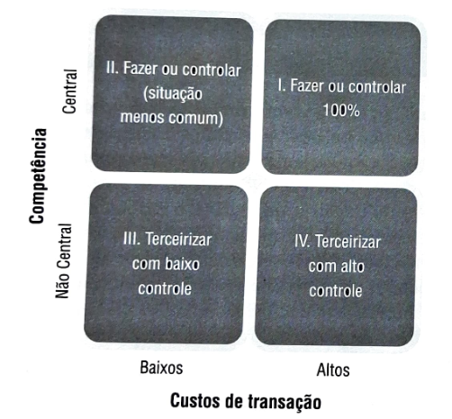

**Figura 2.14 — Matriz simplificada para decisão de comprar ou fazer.**

**Quadrantes:**

* **I. Fazer ou controlar 100%** (situação menos comum)
* **II. Fazer ou controlar 100%**
* **III. Terceirizar com baixo controle**
* **IV. Terceirizar com alto controle**

**Quadrante I — Fazer ou controlar 100%**
Atividades classificadas nesse quadrante não deveriam ser terceirizadas, mas mantidas internamente. Isso porque se trata de algo que é uma competência central, crucial para a competitividade futura da organização, e que, ao mesmo tempo, se terceirizada, por ter altos custos de transação, colocaria a empresa numa desconfortável situação potencial de cair vítima de comportamento oportunista de seus fornecedores. Em raras situações, a empresa pode se ver vítima de uma decisão anterior equivocada, que levou à terceirização de uma atividade dessa natureza. Nesses casos, a primeira opção seria reverter a decisão, trazendo a atividade para ser feita internamente de novo. A segunda, caso a primeira não seja possível ou viável, …

…seria a empresa tentar, via estabelecimento de contratos fortes, garantir que continue mantendo 100% do controle sobre a atividade, o que nem sempre é fácil conseguir. Neste quadrante estão, por exemplo, as unidades de inteligência logística da FedEx, da Coca-Cola ou da Avon; o projeto dos circuitos integrados da Intel e da AMD; o relacionamento com os clientes da Dell; a manutenção da flexibilidade nos projetos dos motores da Honda; o projeto de aeronaves (ou engenharia de projeto) integrada da Embraer (em parceria com a Pratt & Whitney, a Resende e a Boeing ou a NASA), por exemplo — todas atividades cruciais para o sucesso competitivo futuro dessas empresas.

**Quadrante II — Fazer ou controlar (situação menos comum)**

Neste quadrante, as atividades são consideradas competências centrais para o sucesso futuro da organização, mas os custos de transação não são tão altos como no quadrante I, pela própria natureza, as habilidades necessárias para realizar atividades que se caracterizariam como competências centrais não são dominadas por grande quantidade de empresas. Assim, o número de fornecedores potenciais é baixo, o que não caracteriza leve a baixos custos de transação. Entretanto, às vezes, isso pode acontecer. Um exemplo é ilustrar: ter a variedade certa de batatas desenvolvida para atender às exigências de consistência de sabor do McDonald’s para suas batatas fritas é uma competência central, crucial para a competitividade futura da empresa no mercado de *fast-food*. Entretanto, quando o McDonald’s expandiu sua atuação para países onde não há batata suficientemente adequada, optou por desenvolver parcerias com produtores locais no desenvolvimento da variedade certa, adaptada às condições locais de clima e terreno. Isso aconteceu no Brasil e na Rússia, por exemplo. Nessa situação, a terceirização do desenvolvimento em geral ocorre na forma de parcerias bastante próximas, porque o McDonald’s sabe que é importante manter tanto controle quanto possível sobre esse processo central para sua competitividade.

**Quadrante III — Terceirizar com baixo controle**

Esse é o quadrante em que a decisão de terceirização é mais simples e direta. Aqui, a atividade a ser terceirizada não envolve diretamente competências consideradas centrais e, ao mesmo tempo, seus custos básicos de transação (alto número de potenciais fornecedores, baixa especificidade de ativos, baixa incerteza e possivelmente baixa frequência). Isso quer dizer que, em atividades produtivas para mercados confiáveis, com vários concorrentes lutando pela preferência dos clientes, com produtos similares. Um exemplo…

## Página 47

…é a compra de papel para impressora por uma fabricante de bebidas. A produção de papel branco não envolve nenhuma competência central da empresa, o mercado fornecedor é confiável, vários fornecedores têm produtos similares e a impressora da empresa trabalha igualmente bem com quaisquer deles. Assim, a fabricante de bebidas não deveria considerar, portanto, fazer papel de impressora, mas sim comprar de fornecedores. Essa terceirização também não exige alto grau de controle do fornecedor por parte da contratante — via, por exemplo, contratos detalhados e de longo prazo, dada a confiabilidade do mercado e a similaridade dos produtos concorrentes, que levam à pouca probabilidade de comportamentos oportunistas dos fornecedores. Outros exemplos são os consumíveis utilizados em processos produtivos, os materiais de escritório, os materiais de limpeza, aqueles itens de prateleira e serviços padronizados (facilmente disponíveis e providos por vários fornecedores) que entram nos processos produtivos (como parafusos e embalagens comuns) ou nos serviços de apoio (como os serviços de entrega de documentos simples e limpeza geral).

**Quadrante IV — Terceirizar com alto controle**

Aqui a atividade não envolve competências centrais da organização, portanto, em princípio, não seria uma candidata a ser realizada internamente. Entretanto, os custos de transação são altos. Imagine um fabricante de microcomputadores como a HP ou a Dell. Produzir *software* de sistemas operacionais para seus computadores não está entre suas competências centrais (observe que, curiosamente, isso não seria válido para uma análise da Apple, que desenvolveu seu próprio sistema operacional por considerar o produto uma competência central da empresa, desenvolvida ao longo de anos). Entretanto, suas máquinas praticamente necessitam de um sistema operacional para funcionamento. E não são muitas as alternativas de fornecimento que podem oferecer sistemas operacionais, além da Microsoft (talvez o sistema aberto Linux seja a única opção com alguma aceitação hoje). Isso significa que, pelo menos do ponto de vista do número de potenciais fornecedores e da especificidade de ativos (a maioria dos microcomputadores hoje é construída para rodar o sistema operacional Windows, da Microsoft), os custos de transação são bastante altos.

Esse conjunto de condições leva à decisão de terceirização pelos fabricantes de microcomputadores tipo Dell e HP (por ser atividade não central), mas a forma de terceirização deve ser com **nível elevado de controle**, diferentemente do Quadrante III, dados os riscos de a empresa cliente tornar-se vítima de comportamento oportunista do fornecedor. Aqui, portanto, é recomendável que a terceirização venha acompanhada de maior nível de controle (via, por exemplo, contratos mais detalhados, exigentes e de mais longo prazo). Outros exemplos são o fornecimento de motores para os fabricantes de avião, como a Embraer, e os provedores de serviço logístico para os varejistas da Internet.

As referidas discussões sinalizam para o fato de que, além da decisão de fazer ou comprar, também é essencial que a empresa, quando decide por comprar, elabore as nuances do tipo de relação que deveria ter com seus potenciais fornecedores. As simples matrizes 2 × 2 da Figura 2.7 deixam claro: **Os quadrantes I e II são grandes de fazer — mas há nuances. Há situações em que se podem obter os níveis necessários de controle sobre o fornecimento mesmo sem ter propriedade acionária. Os quadrantes III e IV são quadrantes de comprar — mas também aqui há nuances. Há situações em que se necessita maior nível de controle sobre o fornecimento e situações em que esse maior nível de controle pode ser não apenas desnecessário, mas também não recomendável.** As nuances possíveis e adequadas para o estabelecimento e gerenciamento dos relacionamentos com os vários fornecedores de uma empresa numa cadeia de suprimentos é um tema que será retomado e discutido em mais detalhes no Capítulo 5 — Gestão de risco da cadeia global de suprimentos.

## Página 48

**2.2.6 Estratégia de cadeias de suprimentos e o desenvolvimento de produtos**

Frequentemente, as decisões estratégicas ou não, sobre a cadeia de suprimentos são feitas assumindo que o produto já foi projetado, já existe e está sendo produzido em processos produtivos também já existentes. A partir daí, a empresa procura definir e gerenciar sua cadeia da melhor forma para que a demanda futura do produto seja atendida eficiente e eficazmente, sem faltas ou sobras.

Mais recentemente, alguns executivos e acadêmicos perceberam duas coisas muito importantes.

A primeira é que determinadas questões estratégicas das cadeias de suprimentos devem ser levadas em conta já na fase de projeto do produto e do processo, a fim de ser capaz de operar muito melhor. Em outras palavras, o projeto do produto e do processo tem o potencial de ajudar a gestão da cadeia de suprimentos que irá supri-lo.

A segunda é que a cadeia de suprimentos pode ajudar o projeto do produto e do processo. Isso porque as várias empresas da cadeia de suprimentos, além de terem competências produtivas complementares (estas, afinal, são parte daquilo que torna as cadeias de suprimentos frequentemente competências de projeto de produto e processo), possuem competências de mercado também complementares e ricas. O envolvimento da cadeia de suprimentos no projeto do produto e do processo da empresa pode ser uma fonte importante de vantagem competitiva (veja, por exemplo, o quadro de abertura deste capítulo, sobre a Embraer). Esses dois aspectos serão analisados a seguir.

**2.2.7 Projeto de produto e processo para cadeias de suprimentos mais eficazes**

O desenvolvimento de produtos foi de forma tradicional tinha o foco quase que exclusivamente nos aspectos tecnológicos envolvidos no produto em questão; o escopo de considerações dos engenheiros projetistas ia pouco além dos limites do laboratório onde trabalhavam — procuravam projetar produtos que funcionassem e, em alguns casos, utilizar os materiais componentes de forma mais eficiente possível. A partir daí, na sequência, os engenheiros de processos, partindo do projeto, projetavam os processos que os manufaturariam e, em seguida, os engenheiros de produção tinham, então, a responsabilidade de produzir o produto projetado no processo projetado, de forma eficiente. Eram passos sequenciais, em que os responsáveis por uma etapa tinham relativamente pouca preocupação com o impacto que suas decisões teriam nos processos seguintes. A partir dos anos 1980, esse paradigma começou a mudar. Os gestores e engenheiros começaram a perceber que as atividades precedentes eram tremendamente influentes na eficiência das etapas seguintes. Era o nascimento do chamado **projeto para manufatura** (*design for manufacturing*, na língua inglesa).

Segundo essa ideia, já na etapa de projeto deveria haver uma preocupação em gerar projetos de produtos que não apenas funcionassem e usassem eficientemente os materiais componentes, mas também fossem facilmente manufaturáveis. Por exemplo, na etapa de projeto de um produto o engenheiro projeta a escolha de materiais (por exemplo, em relação a várias geometrias possíveis) levando em conta o objetivo de facilitar a sua produção, os tempos, os custos e a dificuldade de sua manufatura (que ocorrer repetitivamente, às vezes por vários anos) podem ser substancialmente reduzidos.

## Página 49

Alguns estudos consideram que no projeto do produto chegam a ser definidos **85% dos custos do produto**. Isso significa que, uma vez que o produto foi projetado, as decisões de engenheiros de produção só são capazes de alterar uma parcela relativamente pequena dos custos envolvidos. A conclusão é clara: **projeto para manufatura vale**.

A partir daí, gestores e engenheiros passaram a explorar várias modalidades de “projeto para…”, percebendo que já na etapa de projeto do produto, na verdade, não se definem apenas grandes parcelas dos custos de manufatura, mas também dos custos de manutenção do produto (**projeto para manutenção** — em que os produtos são projetados, por exemplo, com o intuito de facilitar o acesso dos técnicos de manutenção a componentes relevantes), os custos de desmontagem e reciclagem do produto ao final de sua vida (**projeto para reutilização, remanufatura, reciclagem** — em que materiais mais recicláveis são preferidos — veja o Capítulo 11), custos de compras (**projeto para compras** — em que, por exemplo, materiais mais disponíveis são escolhidos), e mais recentemente considerados, os custos logísticos e da cadeia de suprimentos (**projeto para logística e cadeia de suprimentos**, discutido a seguir).

**Projeto para logística e cadeia de suprimentos**

**Para refletir**

O conceito de projeto para logística e cadeia de suprimentos recomenda que na etapa de projeto do produto e do processo se procurem opções de projeto que facilitem e tornem os processos logísticos e de gestão da cadeia de suprimentos que irão produzi-lo e distribuí-lo mais eficientes, rápidos, simples e eficazes.

Custos de transporte e de estoques ao longo da cadeia de suprimentos são fatores influentes na definição do custo e do seu nível de capacidade de resposta. Os quatro fatores a seguir são importantes no conceito de projeto para logística e cadeia de suprimentos:

* **embalagem e transporte econômicos**;
* **processamento paralelo**;
* **padronização**;
* **postergamento (*postponement*)**.

**Embalagem e transporte econômicos**

A implicação aqui é que o projeto de produtos que possam ser transportados e armazenados economicamente tem impacto direto no desempenho da cadeia de suprimentos.

…suprimentos em termos de custo. Produtos que possam ser transportados e armazenados de forma mais compacta ocupam menos espaço valioso e caro em armazéns de transporte. O projeto inteligente de produtos que sejam desmontáveis e reconstruíveis substancialmente, desde que a cadeia de suprimentos seja capaz da fase de projeto. Como as cadeias de suprimentos são em geral globais, com maiores distâncias a serem percorridas, economias de transporte são ainda mais substanciais. Produtos plásticos volumosos, como cadeiras e containers para uso doméstico, são em geral projetados de forma a se encaixarem quando empilhados visando economias de espaço ao longo de toda a cadeia, do fabricante ao varejista, passando pelos meios de transporte. Os varejistas em particular favorecem produtos cuja ocupação de espaço em prateleira seja racional, por esse recurso é muito valioso e deve ser usado de forma eficiente. Esse aspecto é importante para todas as cadeias de suprimentos (tanto eficientes como de resposta rápida — veja discussão anterior neste capítulo), mas tem especial relevância nas cadeias de suprimentos eficientes.

**Processamento paralelo**

Aqui a ênfase é mais no projeto do processo e como ele pode influenciar o desempenho logístico da cadeia de suprimentos. Tradicionalmente, as etapas de manufatura de produtos obedeciam a uma lógica sequencial, com etapas sendo iniciadas apenas quando as etapas anteriores terminavam. Isso fazia com que os tempos de processamento se tornassem longos. Na etapa de projeto do processo, partes diferentes do produto ou partes do processo podem ser projetadas para serem manufaturadas de forma desacoplada (separada), isso permite que essas partes possam ser feitas em paralelo, reduzindo os tempos totais de processamento e, portanto, aumentando a capacidade de resposta da cadeia de suprimentos. Há também outras vantagens de se reduzir os tempos numa cadeia de suprimentos, como a redução dos erros de previsão (por serem feitos com horizontes menores) e a correspondente redução da necessidade de estoques de segurança. Embora os processamentos paralelos sejam importantes para qualquer configuração estratégica de cadeias de suprimentos, são particularmente relevantes para cadeias de resposta rápida.

## Página 50

**Padronização**

Padronização de produtos e embalagens tem várias virtudes. Embalagens de produtos padronizadas e projetadas inteligentemente são mais fáceis de serem transportadas de forma compacta em paletes, contêineres e outras plataformas de transporte, reduzindo custos de armazenagem e movimentação. Padronização de produtos e de peças ou submontagens componentes (ou, como são comumente chamadas, de **módulos**) de produtos traz uma série de vantagens. A primeira é talvez a mais imediata, que se refere aos ganhos da linha de montagem: usar peças comuns, essas partes seriam produzidas em grandes quantidades. Isso leva a vantagens de economias de escala nos processos de produção e compra dessas partes, com correspondentes reduções de custo para a cadeia de suprimentos.

A segunda é mais sutil, mas não menos importante, e se refere a um efeito chamado *risk pooling* (veja a seguir uma explicação mais detalhada desse efeito). Como as peças padronizadas de uso comum têm seu consumo associado à necessidade de atendimento dos planos de produção de vários produtos diferentes, quando há a necessidade de alterações dos planos de produção em termos de mix (quando, por exemplo, a necessidade de um produto é reduzida e a de outro é aumentada), a quantidade total de que será alterada percentualmente é muito menor do que seria a alteração percentual de cada uma das partes diferentes equipando cada produto.

Esse menor flutuação de demanda das partes padronizadas faz com que a gestão dos seus estoques seja muito mais eficiente, reduzindo, por exemplo, menores estoques de segurança. O mesmo fenômeno ocorre no mercado de pós-venda: peças padronizadas servindo ao mercado de pós-venda (por exemplo, de peças de reposição — peças padronizadas comuns a vários produtos) têm sua demanda agregada e, portanto, sua previsão está menos sujeita a erros do que a demanda de peças específicas de produtos.

Aqui a vantagem de se desenvolverem, sempre que possível, projetos que utilizem peças, partes e submontagens comuns é clara e com implicações diretas para a melhor gestão da cadeia de suprimentos, tanto para o suprimento de produtos novos como para o pós-venda (peças de reposição). Padronização de módulos que são usados em múltiplos produtos é muito comum em vários setores industriais. Na indústria automobilística, por exemplo, é comum que veículos diferentes da mesma corporação utilizem a mesma “plataforma”, como os Audi A6 e os VW Passat, os Audi A3 e os VW Golf, os Audi TT e os VW Beetle, todos os quais compartilham múltiplas partes comuns (chassis, partes da carroceria e muitas partes internas, como chicotes de cabos etc.). Na indústria de computadores, os vários computadores tipo *laptop Lenovo*, por exemplo, compartilham grande quantidade de partes (teclado, tela, gabinete, bateria, cabos etc.). Nos restaurantes, é comum que molhos e acompanhamentos comuns sejam utilizados em vários pratos diferentes, o que é outro exemplo de padronização de componentes.

## Página 51

**Postergamento (*postponement*)**

Este talvez seja o tema de projeto de produto e processo com maior potencial de impacto no desempenho da cadeia de suprimentos, e vem como decorrência do conceito de padronização e de *risk pooling* anteriormente discutidos. Imagine que uma empresa utilize itens padronizados, comuns a vários produtos diferentes de sua linha e, evidentemente, também utilize itens específicos a cada um dos produtos (ou seja, os itens que farão com que os vários produtos sejam diferentes entre si). O tempo total de montagem dos itens específicos é de duas horas e o dos itens comuns é de oito horas, totalizando dez horas de montagem para o produto todo. Se o primeiro item montado no produto é um item específico, isso significa que o processo define que aquele semiacabado será um produto final específico oito horas antes de o produto ficar pronto. Ou seja, a velocidade de resposta da empresa para mudanças nos produtos finais produzidos será de dez horas. Em outros termos, a partir do momento em que uma mudança no *mix* de produtos produzidos é decidida, o novo *mix* começará a sair da linha de montagem dez horas depois.

Imagine agora que o projeto do processo desse produto seja alterado de tal forma que, em primeiro lugar, sejam montados nos produtos apenas os itens comuns a todos. Isso significa que, durante toda a parte inicial da montagem (nas primeiras oito horas), não haverá diferenciação dos produtos montados (já que só estarão montadas as partes dos produtos que são comuns a todos). Isso quer dizer que qualquer dos semiacabados montados ao final da parte inicial (indiferenciada) pode, daí para a frente, transformar-se em qualquer dos diferentes produtos. Só nas últimas duas horas de montagem é que se definem os semiacabados como produtos finais específicos. Ou seja, a mesma decisão de mudança de *mix*, que na situação anterior levava dez horas para ter efeito, na situação nova leva apenas duas horas, um tempo de resposta muito mais rápido. Essa é a natureza do **postergamento**.

**Fique atento**

O postergamento até o momento mais tarde possível da diferenciação do produto pode aumentar em muito a velocidade de resposta e a flexibilidade para mudanças de *mix* da cadeia de suprimentos.

A seguir, é ilustrada uma situação em que um projeto inteligente de produto e processo com **diferenciação postergada** traz ganhos substanciais para a cadeia de suprimentos, tanto em termos de custo da cadeia como de nível de serviço ao cliente.

**Teoria na prática**

Tradicionalmente, quando alguém resolvia pintar sua casa e se dirigia a um varejista de material de construção para comprar tinta, tinha à sua disposição apenas algumas opções de escolha de cor, disponíveis nos catálogos dos diversos fabricantes. Dificilmente o cliente mais exigente encontraria no catálogo a cor exata de seus sonhos, sendo, portanto, forçado a escolher uma tonalidade próxima daquela por ele considerada ideal. Nem sempre a tonalidade escolhida estava disponível na loja, já que nem sempre os estoques haviam sido dimensionados adequadamente. Isso não é de admirar, já que um correto dimensionamento de estoques depende de uma boa previsão de vendas, que, nesse caso, é difícil de fazer, já que é fácil prever quantas galões de “verde-pastel” serão vendidos este mês, mas não quantas de tinta azul-marinho.

Além disso, o espaço da loja e o seu capital de giro disponível podem não permitir que um nível de estoque de todas as tintas alternativas seja mantido para atender a eventual demanda mais alta de qualquer uma delas. Isso leva, mesmo com níveis relativamente altos de estoque no varejo, a baixos níveis de serviço ao cliente, pois as lojas acabam não conseguindo atender à variedade desejada. O mesmo ocorre com outros elos da cadeia de distribuição: para cada fabricante, distribuidores, estoques e centros de distribuição também seriam forçados a carregar estoques de todas as cores de tinta, sob incerteza alta de demanda de cada uma, levando a altos estoques e baixa eficiência.

A fábrica, por sua vez, tinha um processo de produção bastante ineficiente, pois seus equipamentos de produção de tinta tinham de operar com 60 variedades de produtos. Cada vez que a cor era produzida e o processo tinha de ser preparado para um produto diferente, eram necessários procedimentos de limpeza para evitar contaminação entre cores, o que exigia paradas e custos adicionais.

Num certo momento, entretanto, os fabricantes de tinta perceberam que a solução para seus vários problemas estava na ideia de **postergamento**. Reorganizaram, então, sua cadeia de suprimentos da seguinte forma: todas as tintas eram formuladas a partir de uma base comum (branca), que depois era misturada com diferentes concentrações de corantes para gerar as tintas finais coloridas. Essa mistura era feita nas instalações dos fabricantes de tinta, muito antes de o cliente ter feito seu pedido na loja. Isso significava que a variedade específica da tinta era definida na fábrica, muito tempo antes que o cliente fizesse seu pedido.

## Página 52

Com o *postergamento*, a nova configuração do processo de produção passou a ser de forma que apenas os itens comuns a todas as tintas seriam produzidos a esses momentos até que o pedido do cliente acontecesse, na loja do varejo. Ou seja, a fábrica apenas produzia a base branca comum (isto é, também os *dez concentrados* de cores em quantidades muito menores que a de base branca), perfazendo uma quantidade de apenas 11 itens diferentes produzidos na fábrica. A base seria mantida branca e assim permaneceria, junto com os concentrados de cores, os canais de distribuição até chegarem ao varejista. Como a base branca entra em todas as tintas, sua demanda é praticamente a demanda agregada de todas as tintas — e, portanto, o canal se beneficia do efeito *risk pooling*, enormemente reduzido, com previsões muito mais precisas e estoques muito menores. Agora, na loja, a partir da base branca e dos dez concentrados de cores, o varejista, com uma máquina dosadora/misturadora, consegue gerar não mais apenas 60 cores, mas aproximadamente 2.500 cores, aumentando muito a satisfação do cliente, que agora pode solicitar, a qualquer momento, a coloração que mais variada das cores.

A nova cadeia de suprimentos de tintas para parede consegue, fazendo bom uso do conceito de *postergamento*, aumentar o nível de serviço ao cliente (tanto na variedade oferecida quanto na disponibilidade), já que agora a base branca está sempre disponível por ser comum, assim como os concentrados de cores, por serem poucos e em volumes muito menores; com simultânea redução de custos (menores estoques ao longo do canal de distribuição) pelo *risk pooling* e processos produtivos mais eficientes por menos paradas para preparação de máquinas.

**Questão para discussão**

1. O mercado de tintas para parede já usa *postergamento* há muito tempo. Pense em outros produtos no varejo que você imagina também se prestariam a esse tipo de estratégia. Exemplifique.

**Mass customization** (customização em massa); *postergamento*; *risk pooling* e fronteira entre fluxos empurrados-puxados coordenados.

### CONCEITO-CHAVE

Customização em massa é como se chamam as operações na cadeia de suprimentos que criam produtos muito variados, segundo a especificação do cliente, com processos tão eficientes quanto aqueles tradicionalmente apenas associados aos processos de produção em massa.

O exemplo anterior sobre a cadeia de suprimentos de tinta para parede é um exemplo de *mass customization*, uma estratégia de cadeia de suprimentos que combina vantagens das cadeias eficientes com aquelas das cadeias de resposta rápida (com eficiência e nível de serviço melhorados simultaneamente). Para isso, concorrem vários conceitos discutidos anteriormente neste capítulo.

a) **Um projeto de produto e processo** que considere o desacoplamento de atividades produtivas, de maneira a permitir que partes do processo sejam realizadas independentemente de outras, é importante para permitir flexibilidade para reorganizar a sequência de tarefas necessárias para produzir o produto.

b) **A padronização de partes** do projeto dos produtos, a fim de permitir que parcelas substanciais dos diferentes produtos sejam comuns entre si. Assim, com nível alto de comunalidade, o benefício trazido pelo efeito *risk pooling* no aumento de eficiência é potencializado.

c) **O postergamento**, que reorganiza a sequência do processo produtivo de modo a manter a incorporação dos itens padronizados nos estágios iniciais do processo, postergando ao máximo a diferenciação do produto.

d) **A definição da localização da fronteira entre fluxos empurrados e puxados** da cadeia de suprimentos exatamente no ponto anterior ao estágio do processo produtivo que diferencia os produtos a partir de módulos comuns. Dessa forma, uma grande variedade de produto acabado só é gerada a partir de um pedido do cliente. A produção é feita com base em previsões nos processos de baixa variedade, anteriores ao ponto de diferenciação. Este é postergado até um ponto posterior ao pedido do cliente, para garantir **resposta rápida** e cadeia eficiente.

Essa combinação de conceitos estratégicos também foi usada pela Dell desde a sua fundação e foi parte responsável pelo seu crescimento impressionante nos anos 1990 e em boa parte da primeira década do século XXI. A montagem dos seus computadores é feita correspondendo à mistura das tintas nas lojas: a produção dos módulos (submontagens e componentes do computador) é feita a partir de previsões de vendas, porque os tempos envolvidos na manufatura dos módulos eram muito longos (o cliente não estaria disposto a esperar semanas pela produção dos módulos), mas estava disposto a esperar cinco dias pela montagem e entrega do seu computador “customizado” de acordo com suas preferências — da mesma forma que o cliente da tinta não estaria disposto a esperar pela fabricação da base branca ou dos concentrados de cores, mas ficaria esperando 15 minutos para que a mistura final seja feita na loja. Ao mesmo tempo, a variedade dos modelos de computadores montados, com os decorrentes benefícios do efeito *risk pooling* (assim como a variedade da base branca mais os dez concentrados de cores é muito menor que as 2.500 cores finais de tinta possíveis).

## Página 53

Em algumas situações, conforme visto, portanto, é possível cadeias de suprimentos escaparem da escolha obrigatória entre uma estratégia eficiente e uma estratégia de resposta rápida, com uma estratégia de customização em massa, que traz os benefícios de resposta rápida e eficiente.

**Integração de parceiros da cadeia de suprimentos no projeto de novos produtos e processos**

### FIQUE ATENTO

À medida que as empresas cada vez mais procuram se concentrar nas suas próprias competências centrais, tornam-se crescentemente dependentes das competências complementares de seus fornecedores, não só para a produção e distribuição dos seus produtos, mas também para o seu projeto.

As competências trazidas pelos fornecedores de uma empresa à sua cadeia tendem a ser superiores àquelas trazidas aos concorrentes pelos fornecedores deles.

As empresas estão cada vez mais conscientes das vantagens que relações colaborativas e próximas com seus fornecedores podem trazer aos seus vários processos: compras, produção, distribuição, serviço e desenvolvimento de produto.

Em termos de desenvolvimento de produtos especificamente, um alto nível de integração com fornecedores é necessário. Isso pode envolver a formação de alianças estratégicas com fornecedores que detenham competências em tecnologias relevantes ao produto ou serviço a ser desenvolvido, troca ampla e aberta de informações, colocalização de pessoal de desenvolvimento e engenheiros residentes, planejamento compartilhado de tecnologias futuras, desenvolvimento de protocolos de comunicação comuns e integração de sistemas. Isso implica que muitas vezes um comprometimento interno forte com o desenvolvimento tecnológico pode nem ser necessário.

Algumas empresas têm tido bastante sucesso em localizar fornecedores fontes de tecnologias relevantes e coordenar e configurar a integração dessas tecnologias, mas do caso de desenvolvê-las internamente. Veja, por exemplo, o caso da VW Resende, ao final deste capítulo.

O envolvimento de fornecedores no processo de desenvolvimento de produtos é importante. Entretanto, para ter sucesso, a integração de fornecedores requer uma substancial alteração dos processos internos de desenvolvimento de produtos da própria organização. Essa alteração de processos deve envolver todas as funções pertinentes, desde o marketing até a logística.

Segundo Handfield et al. (1999), as formas de integração de fornecedores no processo de desenvolvimento de novos produtos podem ser descritas a partir de um processo genérico de desenvolvimento de produtos, mostrado na Figura 2.16.

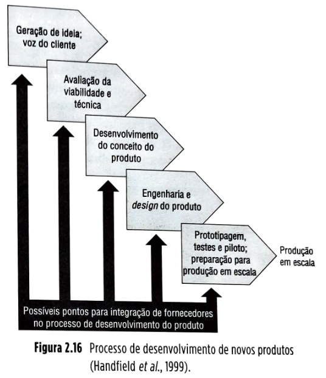

**Figura 2.16 – Processo de desenvolvimento de novos produtos**
(Handfield et al., 1999).

O processo de desenvolvimento de novos produtos é composto de uma série de estágios interdependentes, frequentemente paralelos, superpostos e iterativos, em que o desenvolvimento de um novo produto ou serviço é conduzido desde o estágio da ideia inicial até o ponto do início da produção em escala.

O grau de integração dos fornecedores ao processo de desenvolvimento do produto também pode variar. São os seguintes os crescentes graus de integração possíveis:

**1. Nenhuma integração** – a empresa faz todo o desenvolvimento e depois cota os possíveis componentes com vários fornecedores que não tomam qualquer parte no desenvolvimento. Um exemplo é o fornecimento de parafusos padrão para a indústria de eletrodomésticos.

**2. Integração para fornecimento “caixa-branca”** – o fornecedor é trazido de forma pontual, na medida da necessidade, ao processo de desenvolvimento para atuar como consultor e auxiliar o time interno de desenvolvimento a especificar melhor o componente tecnológico de especialidade do fornecedor. Um exemplo é o apoio de fornecedores de matérias-primas plásticas na especificação de peças injetadas na indústria de brinquedos.

## Página 54

**3. Integração para fornecimento “caixa-cinza”** – o fornecedor é trazido de maneira mais formal, com atividades conjuntas entre seus engenheiros de projeto e aqueles da empresa. Essas atividades podem ser de projeto conjunto, produção de protótipos, testes, entre outros. Exemplos são fornecedores de tecidos, que trabalham junto com estilistas e produtores de roupas, para desenvolvimento conjunto.

**4. Integração para fornecimento “caixa-preta”** – nesse nível máximo de integração e confiança, o fornecedor ganha formalmente o poder de projetar completamente o seu componente segundo especificações funcionais de desempenho dadas pela empresa. Um exemplo são fornecedores de motores para aviões, como a GE, a Rolls-Royce e a Pratt & Whitney, trabalhando com montadoras de aeronaves como a Embraer ou a Boeing.

**Teoria na prática**

Uma equipe de 200 pesquisadores — quase todos com mestrado ou doutorado — trabalha no centro de pesquisas da sede da fabricante de cosméticos Natura, em Cajamar, na Grande São Paulo. O time de cientistas aumentou de tamanho nos últimos anos e os investimentos da empresa em pesquisa alcançaram 187 milhões de reais em 2016, equivalentes a 2,4% de seu faturamento líquido. Mesmo com esse orçamento, a Natura não seria capaz de desenvolver sozinha os mais de 250 produtos que lançou no mercado em 2016. Hoje, a pesquisa de grande parte das novas tecnologias é estudada pela empresa está nas mãos de uma cadeia de parceiros e fornecedores que vem se multiplicando rapidamente e já representam um grupo de mais de uma centena de universidades e companhias dentro e fora do país. Graças a essa rede, coordenada pela estrutura de gestão de cadeias de inovação da Natura, o tempo médio de desenvolvimento de novos produtos da empresa caiu de cinco para menos de dois anos. A meta é fazer com que parceiros brasileiros, franceses, alemães e americanos continuem a suprir um percentual cada vez maior da necessidade de inovação da empresa. A cadeia de inovação da Natura é um exemplo de uso de parceiros inovadores da cadeia de suprimentos da empresa a fim de melhorar seu desempenho em termos de lançamento de novos produtos, considerado estrategicamente essencial neste mercado.

Evidentemente, a definição de quais fornecedores e quais tecnologias deverão ser trazidos ao processo de desenvolvimento de produtos e qual o nível de integração adequado dependerá da configuração de competências da empresa em relação ao seu setor industrial e, em particular, ao seu mercado fornecedor. O processo geral descrito pela Figura 2.17, entretanto, pode ajudar a estruturar processos decisórios específicos de empresas, em particular, buscando fazer melhores decisões quanto à integração de fornecedores nos seus processos de desenvolvimento de produtos.

Fica claro, entretanto, que a exploração das possibilidades de usar a cadeia de suprimentos nos esforços de desenvolvimento de produtos, num ambiente que exige cada vez mais produtos lançados frequentemente, com ciclos de vida cada vez mais curtos e que incorporem as tecnologias mais atuais, pode significar fatores importantes na obtenção de vantagens competitivas.

## Página 55

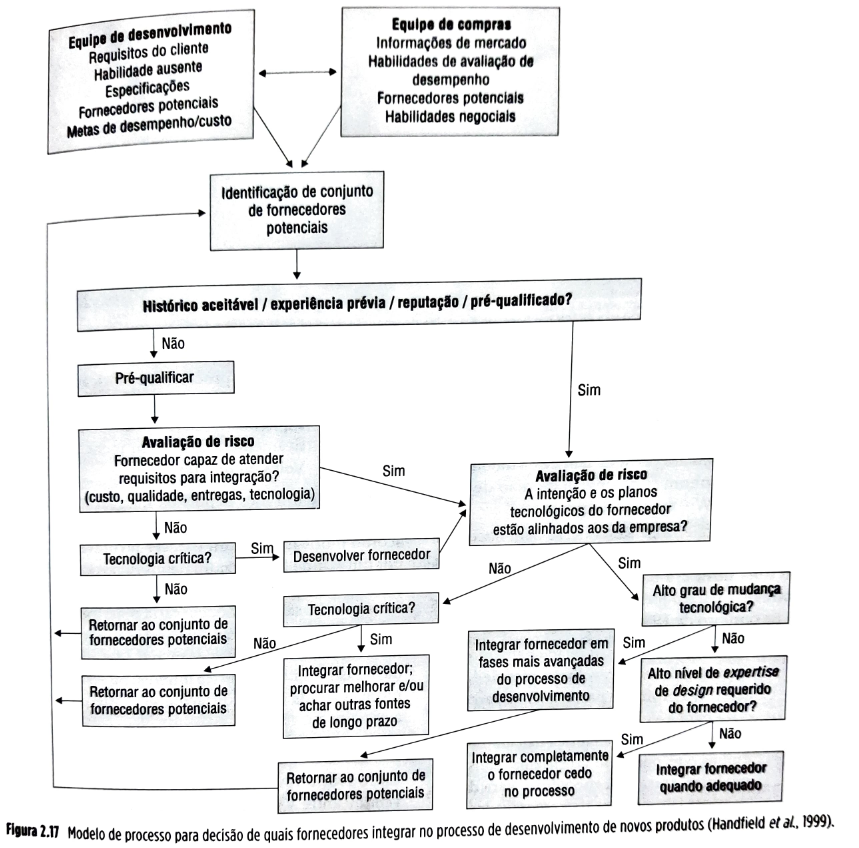

## Página 56

**2.3 Estudo de caso: Consórcio modular da Volkswagen Resende**

O dia 02 de novembro de 1996 testemunhou o maior acontecimento da história recente da pacata Resende, no interior do estado do Rio de Janeiro. José Ignacio López de Arriortúa, um polêmico executivo de operações da Volkswagen (VW), estava prestes a ver em operação seu mais revolucionário projeto: o chamado **consórcio modular**, que levaria ao extremo a ideia de *outsourcing* e parceria, com um pequeno número (apenas sete) de fornecedores, com responsabilidades tremendamente ampliadas, tanto no projeto quanto na produção dos caminhões Volkswagen no Brasil.

Nenhum processo de fabricação será mais moderno e não haverá maior produtividade e qualidade quando este conceito for definitivamente aplicado em todas as fábricas da Volks no mundo.

Menos de um mês depois da inauguração, López de Arriortúa deixaria a VW, supostamente em razão de um acordo motivado por um parecer favorável à GM dado por um juiz de Detroit num nebuloso processo legal que envolveu a mudança de López da GM para a VW alguns anos antes. A saída de López traria mais incertezas sobre o futuro do consórcio modular: seria esta realmente uma ideia revolucionária capaz de mudar a forma de produção da indústria automobilística mundial ou seria apenas uma última cartada de um dirigente sob forte pressão e com a carreira em risco?

**Antecedentes**

Entre 1987 e 1995, vigorou na América Latina uma *joint venture* entre VW e Ford, chamada Autolatina. Embora as marcas originais fossem mantidas nos veículos fabricados, estes eram produzidos em fábricas comuns. Os caminhões tanto da VW como da Ford passaram a ser produzidos pela fábrica da Ford do bairro do Ipiranga, na cidade de São Paulo.

Em 1995, a Autolatina foi dissolvida e, na partilha dos ativos, a VW acabou ficando sem fábrica de caminhões (a do Ipiranga voltou à Ford). O acordo de dissolução rezava que no final de 1996 a Ford não mais forneceria caminhões para a VW.

Na ocasião em que a VW se viu sem uma fábrica de caminhões no Brasil, López acumulava o cargo de vice-presidente de operações para a América Latina. Com um passado importante em gestão de suprimentos (onde de fato construiu sua reputação como executivo na GM) e sendo um forte defensor da política de *outsourcing* (terceirização), ele decidiu que a nova fábrica teria a …configuração revolucionária na qual nenhum funcionário da VW executaria qualquer operação de montagem ou manufatura — todas essas operações seriam terceirizadas para fornecedores.

Antes de iniciar uma descrição mais detalhada do modelo adotado na fábrica de Resende, porém, vale a pena analisar o mercado brasileiro de caminhões e sua evolução ao longo do tempo. A Figura 2.19 traz um resumo do histórico da manufatura de caminhhões no Brasil.

## Página 59

**Vantagens e desvantagens do consórcio modular do ponto de vista dos envolvidos**

Uma pesquisa realizada a partir de entrevistas com diversos gerentes da VW, além de executivos das empresas modulistas, identificou as seguintes vantagens do ponto de vista dos envolvidos:

**Comprometimento dos fornecedores de módulos** com o sucesso do conjunto e não de partes do produto, dado que só são remunerados quando o produto é aprovado e funcionalmente aceito.
**Prioridade junto à casa matriz do fornecedor do módulo** em caso de problema de entrega ou qualidade, pois são “embaixadores” do modulista dentro da montadora.
**Qualidade de montagem melhorada**, pois feita pelo fornecedor do módulo, que tem de seguir à risca prescrições de montagem, o que não acontece em fábricas montadoras convencionais.
**Melhoria rápida de níveis de produtividade e qualidade**, já que o ciclo de resolução de problemas e de melhoramentos fica encurtado pela presença do fornecedor dentro da montadora.
**Aprendizado aumentado pela presença**, debaixo de um mesmo teto, de numerosas empresas diferentes, que trazem um arcabouço de conhecimentos rico, permitindo fertilização cruzada.
**Encurtamento de prazo de desenvolvimento e lançamento de novos produtos**, já que a parceria é forte e não há alternativas de parceiros; já trabalham juntos há tempos e a engenharia simultânea fica facilitada.
**Para alguns modulistas** (como o responsável por eixos), há garantia de fornecimento, permitindo planejamento de mais longo prazo.
**Estruturas menores e descentralizadas** de cada fornecedor dentro do consórcio permitem decisões mais ágeis do que se tomadas dentro de uma só grande estrutura, como no caso de uma montadora tradicional.
**Menor tendência a agendas paralelas pessoais** de gerentes e executivos interferirem nas decisões, já que os vários gerentes dos diferentes módulos não estão competindo pelas mesmas promoções.
**Aprendizado organizacional em negociação**, como trata-se de empresas separadas, não pode haver imposição de decisões resultando em perda de poder do fornecedor. A única forma de fazer um ponto de vista prevalecer é o convencimento, a persuasão, que não gera perdedores.
**Possibilidade de presença física de fornecedores de módulos** sem necessidade de estabelecer unidades industriais independentes — relevante quando se trata de volumes de produção que trariam dificuldade de *break-even* dessas unidades independentes.

Por outro lado, observam-se algumas desvantagens, ainda segundo a opinião dos executivos entrevistados:

**Negociação salarial nivelada pelos padrões de montadora**, com possível perda de margem para fornecedores de autopeças.

* **Assuntos tratados** têm de passar pela concordância de oito parceiros, podendo levar a tempo mais longo, como no caso de uma negociação sindical.
* **No *startup***, narrado por todos os entrevistados, houve dificuldade em razão do choque cultural gerencial; a curva de aprendizado foi árdua e poderia ter tomado rumo diferente.
* **Questões e ações trabalhistas** que porventura surjam devido aos modulistas estarem executando atividades-fim da VW são uma incógnita. Não se sabe que rumos a jurisprudência pode vir a tomar.
* **Risco estratégico** de haver evoluções tecnológicas no módulo, mas que porventura não sejam acompanhadas pelo parceiro correspondente — dificuldade de mudar o parceiro. Sinaliza para o grande cuidado na seleção de parceiros num modelo de consórcio modular.

A questão central parece ser o risco estratégico que o modelo de consórcio modular representa em termos de terceirização de competências centrais (*core competences*). Num contínuo variando de “fazer tudo internamente” até “terceirizar tudo”, a VW optou, para sua fábrica de Resende, por colocar-se no extremo de terceirizar pelo menos em relação às atividades de manufatura e em relação a grande parte das atividades de projeto. Com isso, uma das mais cabíveis questões é levantar até que ponto a VW, com essa decisão, corre o risco, no longo prazo, de tornar-se uma *hollow company*, ou uma empresa vazia, desprovida de competências que distinguem a cadeia de suprimentos ou que confiram sua importância para a cadeia em que se insere. Em outras palavras, tornar-se vazia significa terceirizar todas as competências, ficando sem o “músculo” suficiente para suportar o esforço competitivo.

### 2.4 Resumo

📌 Há vários níveis de estratégia nas organizações: estratégia corporativa, competitiva e funcional. A estratégia de cadeias de suprimentos está no nível das estratégias funcionais; a formação da estratégia de cadeia de suprimentos deve ser coerente com (e apoiar) a estratégia competitiva da unidade de negócio.
📌 Produtos funcionais são aqueles produtos do dia a dia que as pessoas compram, por exemplo, de vários canais varejistas, como supermercados, lojas de conveniência e postos de gasolina; produtos inovadores são produtos diferenciados, lançados frequentemente, em geral com ciclo de vida curto e demanda pouco previsível.
📌 Para produtos funcionais, as estratégias tendem a enfatizar a eficiência de fluxos que atendam demandas contínuas e esperadas, necessárias para manter os custos dos produtos funcionais baixos; para produtos inovadores, por outro lado, a ênfase tende a ser na resposta rápida, com flexibilidade para adaptar-se ao inesperado, para compatibilizar, ágil e dinamicamente, o suprimento e a demanda incerta e volátil dos seus produtos.
📌 Fluxos empurrados são aqueles em que as atividades de produção e/ou movimentação de materiais ocorrem antes da efetivação de um pedido formal de um cliente que se encontre a jusante na cadeia de suprimentos; fluxos puxados são aqueles em que as atividades de produção e/ou movimentação de materiais só ocorrem depois da efetivação de um pedido formal de um cliente que se encontre a jusante na cadeia de suprimentos; fluxos híbridos empurrados-puxados ocorrem na maioria das cadeias de suprimentos, nas quais parte dos fluxos (em geral a montante) é empurrada e parte dos fluxos (em geral a jusante) é puxada.
📌 Dois corpos de conhecimento informam a decisão de comprar ou fazer: a economia dos custos de transação e a visão estratégica baseada em recursos.
📌 Atividades ligadas a competências centrais não devem ser terceirizadas, assim como atividades com altos custos de transação; tanto os níveis de centralidade das competências usadas quanto os custos de transação definem os tipos de relacionamento a estabelecer com os fornecedores.
📌 Decisões tomadas no desenvolvimento de produtos (embalagem e transporte, padronização, postergamento) têm papel essencial no nível de dificuldade e custo na gestão das cadeias de suprimentos que irão produzir e distribuir o produto.
📌 Postergamento até o momento mais tardio possível da diferenciação do produto pode aumentar em muito a velocidade de resposta e a flexibilidade para mudanças de *mix* da cadeia de suprimentos.
📌 À medida que as empresas cada vez mais procuram concentrar-se nas suas próprias competências centrais, tornam-se crescentemente dependentes das competências complementares de seus fornecedores, não só para a produção e distribuição de seus produtos, mas também para o seu projeto.
