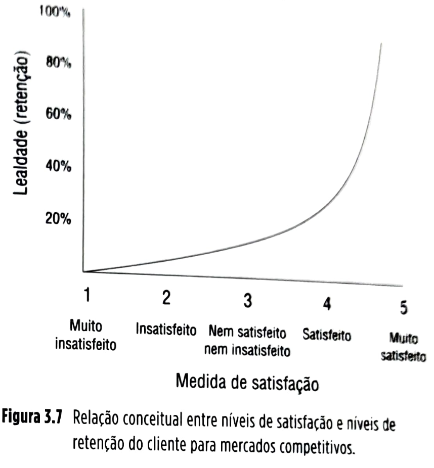
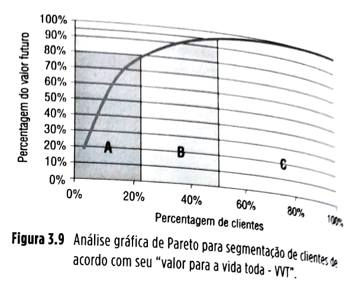

# Capítulo 3 - Gestão dos relacionamentos na cadeia global de suprimentos

## Página 63

### 0BJETIVOS DE APRENDIZAGEM

📌 Explicar a influência do nível de confiança que se estabelece entre parceiros no desempenho da cadeia global de suprimentos.

📌 Discutir os fatores influentes na determinação do adequado nível de serviço ao cliente.

📌 Sintetizar o que é o CRM (customer relationship management) e como gerenciar o relacionamento com os clientes na cadeia de suprimentos.

### 3.1 INTRODUÇÃO

A gestão de cadeias de suprimentos difere da gestão de operações tradicional porque inclui em suas análises várias unidades operativas e interações entre elas. Essas interações ocorrem em vários níveis: materiais são trocados (na forma de fluxos diretos de vendas e reversos de devoluções), informações são trocadas (em ambos os sentidos, direto e reverso) e fluxos financeiros são trocados (também em ambos os sentidos).

É por intermédio destas trocas, por exemplo, que importantes informações sobre o que o cliente necessita/deseja serão capturadas pelos gestores da cadeia de suprimentos para que recursos e processos sejam definidos e gerenciados a fim de que os clientes atinjam níveis de satisfação que os transformam em clientes fiéis e retidos, e, muitas vezes, em propagandistas gratuitos, que recomendarão os produtos e serviços da cadeia.

Também é por meio destas trocas de informações que a empresa pode se beneficiar de desenvolvimentos tecnológicos recentes dos itens disponibilizados pelos fornecedores, incorporando-os, antes da concorrência, aos seus produtos. Além disso, pelo menos tão importante quanto estas trocas é o relacionamento que se estabelece entre parceiros da cadeia de suprimentos.

## Página 64

Esse relacionamento tem aspectos mais objetivos, como os contratos e os acordos de nível de serviço que os regulam, e aspectos mais subjetivos, mas nem por isso menos importantes, que são, por exemplo, os níveis de confiança entre os parceiros. Este capítulo trata dos relacionamentos entre parceiros da cadeia de suprimentos e da sua gestão, procurando responder às seguintes perguntas:

❓ Qual a influência do nível de confiança que se estabelece entre parceiros no desempenho da cadeia global de suprimentos?

❓ Quais os fatores influentes na determinação do adequado nível de serviço ao cliente?

❓ O que é CRM (*customer relationship management*) e como gerenciar o relacionamento com os clientes na cadeia de suprimentos?

A Figura 3.1 localiza a gestão dos relacionamentos com os parceiros e do nível de serviços da cadeia global de suprimentos no quadro de referência geral usado neste livro.

## Página 65

### Relacionamento com clientes na Amazon, um dos maiores varejistas on-line do mundo

A Amazon é um dos maiores varejistas on-line do mundo, com vendas líquidas de mais de US$ 177,9 bilhões em 2017, com impressionante crescimento desde 2004, como pode ser visto na Figura 3.2.

Figura 3.2 Crescimento de vendas líquidas (em bilhões de US$) da Amazon desde 2004.

**Histórico**

O fundador da Amazon, Jeff Bezos, graduou-se na Universidade Princeton, nos Estados Unidos, em Ciências da Computação e Engenharia Elétrica. Intrigado com o surgimento da Internet, particularmente a *world wide web*, e buscando oportunidades de negócio, em 1993, Bezos passou a investigar categorias de produtos com maior vocação para comercialização *on-line*, passando a se concentrar na categoria *“livros”*. Esta tinha algumas características que poderiam tornar a venda *on-line* mais atraente que a venda no varejo tradicional, entre elas, uma vastíssima quantidade de títulos, o que possibilitaria a um varejista *on-line* ofertar ao cliente uma seleção muito mais ampla que uma livraria convencional. Bezos acreditava que uma mais ampla oferta poderia ser uma fonte de vantagem competitiva importante nesse mercado.

A empresa iniciou sua operação em julho de 1995 anunciando-se como *“a maior livraria do mundo”*, com uma seleção inicial de um milhão de livros, rapidamente crescendo para 2,5 milhões. Sessenta por cento dos seus produtos mais vendidos eram comprados de um grande fornecedor, o distribuidor Ingram Book Distributors, e os demais 40% adquiridos de vários editores e distribuidores.

A Amazon nessa época mantinha poucos produtos em estoque, com pouca necessidade de armazéns e capital de giro. Em 1997, a empresa já vendia US$ 16 milhões por ano em livros e tinha uma base de 340 mil clientes, com 80 mil visitas diárias a seu site. Com base no sucesso inicial em vendas (embora ainda deficitária), abriu seu capital em 1997. Em 1998, expandiu seu negócio passando a vender música (CDs) além de livros; em meses, tornou-se a maior varejista *on-line* de música do mundo. Em novembro de 1998, entrou no negócio de vídeos/DVDs. Para todas as categorias de produtos, então, a Amazon tinha a faixa completa de atividades: compras, vendas, armazenagem, despacho e serviço ao cliente.

## Página 66

Ao longo de 1999 e 2000, com a *internet* ganhando força, a empresa, agora avaliada em US$ 17 bilhões, continuou a ampliar sua oferta de produtos, passando a incluir brinquedos, produtos eletrônicos, ferramentas, *softwares*, produtos para jardinagem, casa e cozinha, além de telefones celulares. Começou também a expandir-se internacionalmente, com a inauguração de instalações dedicadas na Inglaterra, Alemanha, Japão e outros países.

Na preparação para as vendas do Natal de 1999, decidiu investir mais pesadamente em armazéns a fim de aumentar sua capacidade de atendimento de pedidos. A empresa estabeleceu cinco grandes armazéns próprios para estocagem e distribuição e vários centros de despacho a clientes nos Estados Unidos. Em 2016, a Amazon tinha 103 grandes armazéns e 61 centros de separação e despacho de produtos.

**Tecnologia a serviço do relacionamento com o cliente**

Ao longo da sua evolução, um dos esforços mais relevantes da empresa foi relacionados à tecnologia de suporte aos seus negócios: integração do *software* que gerencia seu *website*, sua unidade de atendimento ao cliente, seus sistemas de pagamento e segurança contra fraude e suas operações de armazém. A Amazon realizou várias inovações na gestão da experiência do cliente em compras pela *internet*. Estas incluem *one-click buying*, que consiste em clientes pré-cadastrados poderem realizar a compra de produtos com apenas um clique (melhorando a experiência de compra do cliente, mas também facilitando a compra por impulso), e o uso de *tabs* (ou rótulos virtuais que levam a várias páginas, como num arquivo suspenso tradicional) que facilitam a navegação do cliente pelo site. 

A empresa foi também uma das pioneiras na customização em massa em *websites* comerciais: os clientes são saudados pelo nome quando entram, recebem ofertas de sugestões personalizadas de produtos com base em seus históricos de compras, e estimativas de interesse baseadas em outros clientes com perfil de compras similar (veja a Figura 3.3). Oferece também promoções personalizadas.

Além disso, a tecnologia da Amazon armazena uma enorme quantidade de informação sobre os clientes: endereços, cartões de crédito, destinatários de presentes, preferências de pagamentos, histórico de páginas visitadas, histórico completo de transações, opiniões, avaliações feitas sobre o nível de serviço recebido, entre muitas outras. Estas características da tecnologia da Amazon tornam mais fácil a experiência de compra do cliente, aumentando o custo de troca do fornecedor pelo cliente e, portanto, sua retenção. Permitem também que a empresa seja ativa em seus esforços de *marketing* e mantenha comunicação mais eficaz com o cliente em questões relativas a serviço e vendas, mantendo informações completas e detalhadas sobre pedidos em aberto e seus *status*. 

Finalmente, a tecnologia permite também acompanhar com maior perfeição as preferências e expectativas dos diferentes clientes, o que possibilita à Amazon segmentá-los para servi-los de forma mais próxima às suas expectativas por meio de um melhor e mais focalizado gerenciamento da sua cadeia de suprimentos.

## Página 67

### 3.2 CONCEITOS

#### 3.2.1 Fundamentos da gestão do relacionamento com parceiros da cadeia de suprimentos

No Capítulo 1, foram discutidos alguns aspectos da governança das cadeias de suprimentos que às vezes dificultam sua gestão. Muitas vezes, comportamentos oportunistas dos nós da cadeia de suprimentos predominam, o que faz com que tomem decisões de forma a maximizar seu próprio desempenho local à custa do desempenho local de outros nós da cadeia, levando ao que se chama de relações ganha-perde, ou de “soma-zero”. Foi discutido também que, muitas vezes, esses comportamentos oportunistas levam os parceiros da cadeia a não compartilharem informações. Isso faz aumentar os custos gerais dos nós da cadeia, pois, com menos informação compartilhada, os parceiros acabam trabalhando com maior nível de incerteza, o que sempre leva a operações e desempenhos menos eficientes.

Outra causa de resultados indesejáveis por comportamento oportunista se refere à falta de um aspecto essencial do relacionamento entre parceiros da cadeia: confiança. Isso pode ser ilustrado por um efeito comumente chamado de “dilema do prisioneiro”, discutido a seguir.

**Confiança nos relacionamentos entre parceiros e o dilema do prisioneiro**

Imagine que dois indivíduos, Pedro e Paulo, de passado não exatamente honesto, encontram-se pela primeira vez em um bar. Entre uma tacada e outra, em volta da mesa de bilhar, depois de alguns copos de cerveja, resolvem traçar um plano para um furto a uma empresa localizada nas proximidades. Perpetrado o crime naquela noite, cada um vai para sua casa. No dia seguinte, são presos pela polícia, que aparentemente teria achado evidências (circunstanciais) de que ambos teriam estado nas dependências da empresa roubada na noite anterior.

Seguindo procedimento padrão, a polícia conduz ambos separadamente, sem permitir comunicação entre eles, a salas diferentes de interrogatório. Lá, começam a ser interrogados por dois investigadores diferentes. Os dois suspeitos, com experiência do sistema penal local para crimes que envolvem cumplicidade, sabem perfeitamente as opções que têm e os resultados dessas opções. As opções de Pedro e Paulo têm só basicamente duas: confessar ou não confessar o crime de roubo.

Pedro começa a analisar, racionalmente, o que deve fazer (confessar ou não), e para isso analisa o quadro da Figura 3.4, que traz as consequências possíveis das suas duas opções.

## Página 68

Basicamente as opções são: se ambos, Pedro e Paulo, confessam o furto, as penas são de cinco anos de prisão para cada (e não de dez anos, como normalmente seria), pois considera-se que estejam arrependidos do crime e, confessando, ajudaram a justiça. Se nenhum dos dois confessa o crime, dado que as provas da polícia são circunstanciais, ambos são acusados de invasão de propriedade, mas não de furto e ganham uma pena de dois anos de prisão cada. Pela vigência do mecanismo de delação premiada, entretanto, se um suspeito confessa e o outro não, o confessante/delator sai livre (premiado) e o outro suspeito sofre a pena mais pesada, de dez anos. Isso vale, naturalmente, para Pedro e para Paulo.

Pedro começa a analisar o quadro, primeiro considerando o que aconteceria com ele se Paulo confessasse (dois quadrantes da esquerda na matriz da Figura 3.4).

Se Paulo confessar, a melhor decisão para Pedro será a de confessar também (Pedro nesse caso leva cinco anos de pena), porque a outra opção (não confessar) lhe daria dez anos de pena e livraria o delator Paulo.

Se Paulo não confessar (dois quadrantes da direita da Figura 3.4), a melhor decisão para Pedro será a de confessar, já que sai livre nesse caso e porque a outra opção, de não confessar, lhe daria dois anos de pena (o mesmo, nesse caso, que Paulo).

Note que, para ambas as possibilidades de opção adotadas por Paulo (lembre-se de que Pedro não sabe qual opção Paulo escolherá), a estratégia que Pedro deveria adotar é a de confessar – ou seja, desse ponto de vista, a estratégia que domina, que é a melhor, independentemente da opção adotada pelo outro prisioneiro, é a de confessar.

Paulo, na outra sala de interrogatório, passa pelo mesmo exercício e, portanto, também decide confessar. Com a confissão de ambos, tanto Pedro quanto Paulo ganham cinco anos de pena, o que nitidamente não é o melhor resultado para ambos (que seria o de não confessar, o que implicaria em apenas dois anos de pena para cada um).

O que ocorre no dilema do prisioneiro é que os dois prisioneiros assumem que o outro não é confiável. Não querem correr o risco de agir para o bem comum (não confessar), porque, caso o outro aja em interesse próprio, não só o prisioneiro que visa ao bem comum vai pegar a maior pena, como o prisioneiro delator oportunista será premiado com a liberdade!

Não é de admirar que os dois suspeitos não tenham confiança um no outro – encontraram-se fortuitamente na noite anterior e não se conhecem bem. Se tivessem uma história longa de cumplicidade com muitas interações, talvez tivessem desenvolvido um nível de confiança tal que os levasse a manter silêncio para o bem comum. Mas isso só ocorre com inter-relação reiterada, desenvolvida gradualmente, em relacionamentos de maior duração. Em relações fortuitas, os parceiros acabam preferindo adotar um comportamento oportunista que acaba por penalizar a todos.

Um exemplo mais próximo do mundo dos negócios pode ilustrar o dilema do prisioneiro numa cadeia de parceiros comerciais. Imagine que quatro laboratórios farmacêuticos, conscientes dos altos custos de desenvolvimento de novas drogas, decidam formar uma equipe comum de desenvolvimento para pesquisar um novo remédio. Todos combinam que as empresas devem mandar seu melhor pesquisador para se dedicar em tempo integral ao projeto de desenvolvimento comum. Entretanto, individualmente, os parceiros podem pensar que, se enviarem seu segundo melhor, mantendo o melhor dedicado a seus outros projetos importantes, como os outros três parceiros mandarão seus melhores pesquisadores, a equipe ainda será muito boa. Por outro lado, sabem que os outros podem não querer mandar seus melhores, pelos mesmos motivos. Por qualquer dos dois motivos, cada laboratório acabou mandando seu segundo melhor pesquisador, resultando numa equipe de segunda categoria, com resultados ruins para todos.

## Página 69

**Fique atento**
Níveis mais altos de confiança entre parceiros contribuem para que haja menor incidência de comportamento oportunista na cadeia de suprimentos, com benefício para a cadeia como um todo. Reiteração de relacionamentos, com contratos de prazo mais longo, mais intensidade de interações pessoais e cumprimento reiterado de promessas e acordos, favorece o desenvolvimento de níveis mais altos de confiança entre parceiros bem-intencionados.

**Confiança em relações de suprimentos globais: o *guanxi* chinês**
*Guanxi* é o termo chinês que significa o uso da confiança e parceria dentro de um relacionamento para a obtenção de determinadas vantagens. Para fazer negócios na China e com a China, os estrangeiros têm de entender e respeitar esse antigo e tradicional sistema social. *Guanxi* facilita a entrada no sistema social chinês de forma dificilmente obtida por outras formas de apresentação, como a que ocorre nas feiras e congressos, por exemplo. Esse é o motivo pelo qual, em geral, as empresas que resolvem entrar no mercado da China pela primeira vez optam por associar-se com um parceiro local, a fim de usar seu *guanxi* para construir, por exemplo, cadeias de distribuição e relações adequadas com fornecedores locais.

Figura 3.5 Simbolo em chinês simplificado que representa guanxi.

*Guanxi* é baseado em relações pessoais desenvolvidas com o tempo. Não se podem queimar etapas. Argumenta-se que, em sociedades nas quais os indivíduos ou empresas não podem confiar inteiramente nos sistemas formais de garantia de justiça e tratamento igualitário, acabam depositando sua confiança em relacionamentos pessoais testados, tipo *guanxi*. *Guanxi* pode ter outros nomes, ocorrer de formas diferentes e com outras regras em outras regiões do mundo, mas, em muitos lugares, cadeias informais de relacionamentos pessoais serão essenciais para que cadeias de suprimentos sejam estabelecidas e mantidas com níveis adequados de eficiência, apenas possível quando há altos níveis de confiança. É essencial, portanto, que, antes de uma empresa passar a ter relações em uma cadeia de suprimentos em determinadas regiões ou países, seus executivos procurem se familiarizar com os *guanxis* locais.

**3.2.2 Negociação**

Parte importante da gestão de relacionamento em qualquer cadeia de suprimentos é o processo de negociação, que frequentemente tem de ocorrer entre parceiros.

**Conceito-chave**
Negociação é uma discussão entre dois ou mais participantes tentando chegar a uma solução para um problema (Maiese, 2003).

Negociações, em geral, ocorrem porque as partes envolvidas querem algo que não conseguiriam sozinhas ou para resolver um problema ou disputa entre elas. Então, reconhecem que há algum conflito de interesse e acreditam poder exercer certa influência sobre a outra parte para conseguir um resultado melhor do que obteriam se simplesmente aceitassem 100% das condições oferecidas pelo outro lado. Assim, preferem negociar a fim de chegar a um acordo, em vez de optar por uma luta aberta (por exemplo, pela via judiciária), ceder completamente ou desistir completamente do relacionamento.

Quando partes negociam, esperam em geral soluções compromissadas. Embora seus objetivos sejam interdependentes e não possam ser atingidos de forma isolada, elas não querem ou necessitam exatamente as mesmas coisas. Essa interdependência pode, em natureza, ser do tipo ganha-perde, ganha-ganha ou perde-perde, e o tipo de negociação varia de forma correspondente.

## Página 70

As partes tentarão: ou forçar o outro lado a atender suas demandas (buscando a maior fatia do bolo); ou modificar a posição do interlocutor de forma a obter uma solução compromissada (buscando dividir mais equitativamente o bolo); ou inventar uma solução completamente diferente, que atenda aos objetivos de todos os lados envolvidos (buscando fazer crescer o bolo).

Ganha-ganha, ganha-perde e perde-perde são termos da teoria dos jogos (para uma abordagem introdutória, ver Fiani, 2004) que se referem a possíveis resultados de um jogo ou disputa entre dois lados e, mais importante, como cada lado percebe seu resultado em relação à sua expectativa antes do jogo ou disputa. Por exemplo, “ganha” indica um resultado melhor do que a expectativa inicial e “perde” indica um resultado pior do que a expectativa inicial (Spangler, 2003).

■ **Ganha-ganha** é um resultado que ocorre quando ambos os lados têm a percepção de que ganharam. Como ambos ganharam nesse cenário, a resolução do impasse provavelmente será aceita de forma voluntária. Esse cenário é, em geral, atingido por cooperação em vez de conflito.

■ **Ganha-perde** ocorre quando só um lado tem percepção positiva do resultado atingido, portanto, é menos provável que esse cenário seja aceito de forma voluntária. Processos conflituosos tendem a resultar em ganha-perde. O princípio aqui é de competição, mais do que cooperação, entre os participantes.

■ **Perde-perde** significa que todas as partes envolvidas saíram-se mal. Em alguns desses processos negociais, todas as partes entendem que perdas são inevitáveis e que serão equitativamente distribuídas. Nestas situações, resultados perde-perde podem ser preferíveis a ganha-perde, porque pelo menos são considerados mais justos.

Em outras situações, entretanto, resultados perde-perde ocorrem mesmo quando um resultado ganha-ganha poderia ser atingido. Um exemplo clássico é o dilema do prisioneiro, discutido anteriormente neste capítulo. Perde-perde é um resultado frequente quando o resultado ganha-ganha só pode ser identificado (como no caso do dilema do prisioneiro) por intermédio de um relacionamento cooperativo — identificação esta que pode passar despercebida se as partes envolvidas na negociação se engajam numa postura competitiva e quando há baixo nível de confiança entre elas.

Algumas lições podem ser tiradas do dilema do prisioneiro em termos de negociação:

■ se ambos os lados cooperam, ambos podem ter bons resultados;
■ se um lado coopera e outro compete, o cooperante terá péssimo resultado e o concorrente terá ótimo resultado;
■ se ambos competem, ambos terão resultados medíocres — no curto ou no longo prazo;
■ na presença de incerteza sobre qual postura (concorrente/oportunista ou cooperativa) o outro lado vai adotar, a melhor escolha para todos os lados é concorrer.

No mundo real, diferentemente do nosso exemplo hipotético dos prisioneiros, as partes podem se comunicar e se comprometer com uma abordagem mais cooperativa. Podem adotar normas de comportamento justo e cooperativo e se concentrar no relacionamento futuro. Isso cria confiança e ajuda a garantir ganhos para todos.

**Pressupostos para uma negociação de sucesso**

Embora nem sempre presentes, os seguintes aspectos são fatores importantes para que uma negociação tenha sucesso nos relacionamentos em cadeias de suprimentos:

■ manter na negociação uma atitude de confiança na outra parte;
■ preferir sempre a abordagem cooperativa à competitiva;
■ buscar soluções que resultem em ganha-ganha, procurando criar valor conjuntamente (fazer crescer o bolo e não apenas buscar a maior fatia);
■ buscar soluções que contemplem a negociação presente como parte do relacionamento futuro e não de forma isolada;
■ reconhecer as necessidades e limitações da outra parte; e
■ preparar-se para e planejar a negociação.

**Planejamento para negociação**

Preparação é condição essencial para uma negociação de sucesso. Os seguintes passos podem auxiliar para uma boa preparação:

1. **Defina objetivos claros e específicos:** quanto mais clara e específica for a definição dos objetivos da negociação, mais focalizada ela será e maiores as chances de sucesso. Além disso, quanto mais comuns forem os objetivos das partes participantes, maiores chances de um resultado ganha-ganha.

2. **Defina os itens a serem negociados:** uma lista combinada dos itens das partes envolvidas definirá a agenda da negociação — o compartilhamento com antecedência dos itens listados como importantes pode ajudar muito a dinâmica do processo negocial.

3. **Colete informações relevantes:** fatos e dados, não apenas opiniões — a diferença de poder de persuasão entre partes numa negociação é diretamente proporcional à diferença de informação que as partes detêm. Analise a situação negocial de vários pontos de vista e contemplando os vários aspectos que possam estar envolvidos.

## Página 71

4. **Defina as metas para cada um dos itens:** não só os resultados mais desejáveis, mas também os resultados mínimos aceitáveis para cada um dos itens — isso dá ao negociador maior firmeza quanto a até onde pode ceder no processo.

5. **Planeje a ordem em que os itens serão negociados:** isso pode obedecer a várias lógicas: do mais simples para o mais difícil, o contrário ou outra, dependendo da preferência dos negociadores — mas defina sua estratégia quanto à ordem dos itens.

6. **Reconheça e analise as necessidades da outra parte:** o conhecimento de quais são as reais necessidades vs. os desejos da outra parte ajuda na argumentação.

7. **Planeje a estratégia negocial:** embora numa grande maioria de situações em gestão de cadeias de suprimentos a postura cooperativa seja a mais desejável, em certas situações de conflito pode ser necessário adotar parcelas maiores de uma postura mais competitiva. Defina sua estratégia mais apropriada para cada situação. Não use argumentos não éticos, mas seja capaz de reconhecer quando a outra parte o está fazendo.

8. **Saiba suas táticas:** argumente com base em fatos e não opiniões; trate o interlocutor sempre com respeito; saiba ouvir atentamente; responda a questões de forma cuidadosa e clara; saiba dizer não; seja aberto e honesto; tome a iniciativa; saiba perguntar — perguntas certas podem conduzir a discussão para o rumo desejado; priorize os assuntos e não perca as prioridades de vista; programe paradas periódicas para permitir avaliações do processo; seja ético e firme (adaptado de Fawcett *et al.*, 2007).

**Negociações internacionais**

Além desses princípios, estratégias e táticas, as empresas e seus negociadores, quando envolvidos com negociações internacionais, deparam-se com algumas questões relacionadas a diferenças culturais que podem, em algumas situações, fazer a diferença entre uma negociação de sucesso e uma fracassada. São numerosos os casos de gafes que resultaram em negócios perdidos narrados por negociadores internacionais, como aquele de um fornecedor ocidental cujo negociador apresentou uma proposta de milhões de dólares numa elegante pasta de couro de porco para um potencial cliente de um país do Oriente Médio. Por ser o porco um animal considerado vil naquela cultura, a empresa fornecedora não só foi eliminada da concorrência, mas também excluída de futuros negócios.

Segundo Sebenius (2002), a enorme diversidade cultural dos países impede que se discutam todas as diferenças possíveis, mas, se o negociador, na sua preparação, buscar informações sobre os seguintes assuntos, em relação ao contexto cultural do seu interlocutor internacional, correrá menos riscos de cometer gafes importantes:

■ **Cumprimentos:** Como as pessoas se cumprimentam e se referem umas às outras? Primeiro nome, sobrenome, com título, sem título? Qual papel têm os cartões de visita?
■ **Grau de formalidade:** Meus interlocutores esperam que eu os trate e me vista de maneira mais formal ou mais informal? A cultura de negócios brasileira é até bastante informal, mas não se esqueça de que muitas outras culturas não são.
■ **Presentes:** Pessoas de negócios trocam presentes? Quais presentes são apropriados? Há tabus associados a certos presentes? Em algumas culturas, alguns itens podem ser considerados de mau agouro, por exemplo.
■ **Contato corporal:** Como o contato corporal é recebido? É constrangedor? Ameaçador? Normal? Esperado?
■ **Contato visual:** Contato visual direto é considerado educado? É esperado? Tem algum significado especial?
■ **Emoções:** É rude, constrangedor ou normal expressar emoções?
■ **Silêncio:** Silêncio é constrangedor? Esperado? Considerado um insulto? Representa respeito?
■ **Comer:** Quais as boas maneiras para as refeições? Há comidas que são consideradas tabus?
■ **Linguagem corporal:** Há gestos ou expressões corporais que são consideradas rudes?
■ **Pontualidade:** Devo ser pontual e esperar que meu interlocutor também o seja? Ou os horários são mais fluidos?

## Página 72

Além destas questões de etiqueta social e nos negócios, há questões culturais mais profundas que também podem ser muito diferentes entre povos e países. Hall e Hall (1960) desenvolveram quatro categorias culturais (1 a 4, a seguir), posteriormente complementadas por mais quatro categorias definidas pelo pesquisador Geert Hofstede (Sebenius, 2003) na década de 1980 (5 a 8, a seguir), que auxiliam a entender o contexto de negócios e que podem ser importantes em processos de negociação internacional ou intercultural (não se esqueça de que muitos países podem ter diferentes culturas em diferentes regiões):

1. **Relacionamentos:** A cultura é focalizada no negócio ou nos relacionamentos? Nas culturas que focam no negócio, os relacionamentos se desenvolvem a partir dos negócios. Nas culturas focalizadas nos relacionamentos, os negócios são feitos a partir de relacionamentos já existentes (por exemplo, o *guanxi* chinês).

2. **Comunicação:** As comunicações são indiretas e muito dependentes do contexto ou diretas e pouco dependentes do contexto? Formas não verbais e mais contextuais de comunicação (por exemplo, onde a negociação ocorre ou como se comportam os negociadores) têm papel importante ou menos importante nas negociações? As comunicações requerem informação concisa ou mais detalhada? Negociadores norte-americanos, por exemplo, são conhecidos por serem concisos, enquanto os asiáticos são mais detalhistas.

3. **Tempo:** A cultura é considerada monocrônica ou policrônica? Em culturas anglo-saxônicas, a pontualidade e as agendas e seus horários são estritamente seguidos (são monocrônicas). Os assuntos são seguidos sequencialmente. Já em algumas culturas latino-americanas e asiáticas, a pontualidade e as agendas e horários não têm papel tão importante. Às vezes, vários assuntos são abordados de forma simultânea ou intercalada (negociadores são em geral policrônicos no Brasil, enquanto nos Estados Unidos são monocrônicos).

4. **Espaço:** As pessoas apreciam ter muito ou pouco “espaço pessoal”? Em algumas culturas, como no Japão, mover-se para muito perto de outra pessoa pode causar desconforto. No Brasil, por exemplo, é diferente: tende-se a ter mais contato e proximidade.

5. **Distribuição de poder:** Disparidades relevantes de poder são aceitáveis? As organizações são geridas de forma mais vertical, hierarquicamente de cima para baixo, ou o poder é mais horizontalmente distribuído?

6. **Tolerância à incerteza:** Quanto as pessoas são tolerantes à incerteza ou a processos e acordos menos estruturados? Em regiões no norte da Itália, por exemplo, onde a indústria têxtil é forte, é comum que mesmo empresas grandes tenham uma relação informal, quase familiar com seus fornecedores, algo não tão comum em culturas anglo-saxônicas.

7. **Individualismo vs. coletivismo:** A cultura enfatiza mais o individualismo ou o coletivismo, por exemplo, na tomada de decisão? Isso pode afetar drasticamente a dinâmica e o tempo de duração das negociações.

8. **Harmonia vs. assertividade:** A cultura enfatiza mais a harmonia interpessoal ou a assertividade? Por exemplo, algumas culturas não têm problemas em dizer não (como os negociadores brasileiros). Já em culturas asiáticas, o “não” muitas vezes só é dito de forma indireta.

Esses aspectos culturais e de negociação são importantíssimos para uma adequada gestão de cadeias de suprimentos, que se fundamenta muito nos aspectos negociação, comunicação e relacionamento entre parceiros da cadeia. Numa tentativa de sistematizar a gestão dos relacionamentos com os parceiros clientes nas cadeias de suprimentos (principalmente no que tange aos fluxos de informação trocados), foi desenvolvido o conceito de CRM (*Customer Relationship Management*), discutido a seguir.

**3.2.3 Gestão do relacionamento com clientes (CRM)**

Isso ocorreu no final dos anos 1990, seguindo a onda de implantação dos ERP (*Enterprise Resource Planning*: sistemas integrados de gestão, como o sistema alemão SAP ou o sistema americano Oracle Applications, largamente adotados por empresas – ver Corrêa *et al.*, 2018), impulsionada pelas empresas fornecedoras de *softwares*. Muitas empresas, então, gastaram quantias consideráveis de dinheiro com a implantação dos chamados sistemas de CRM (*Customer Relationship Management* – que são baseados em sistemas computacionais complexos comercializados por várias empresas com nomes comerciais diferentes, como o Siebel, da Oracle, ou Microsoft Dynamics CRM, ou, ainda, SAS CRM).

## Página 73

A promessa era melhorar o relacionamento com os clientes na cadeia de suprimentos, permitindo às empresas responder de forma rápida e eficiente aos desejos mutáveis dos clientes, garantindo assim receitas aumentadas com clientes retidos e custos de *marketing* reduzidos.

Como as implantações iniciais falharam em entregar o prometido, as vendas dos sistemas de CRM caíram significativamente nos anos subsequentes. Nos anos iniciais da década de 2000, entretanto, segundo Rigby e Ledingham (2004), algo inesperado ocorreu. Houve uma retomada do interesse e dos investimentos em CRM e pesquisas começaram a indicar aumento dos índices de satisfação dos executivos. Os autores pesquisaram uma vasta gama de empresas adotantes do CRM a fim de buscar os porquês do renovado interesse.

Concluíram que, diferentemente das implantações originais, as implantações mais recentes não tiveram como fim transformar o negócio completamente, envolvendo todos os clientes, mas adotar uma postura mais gradual e pragmática, em projetos iniciais menores e mais focados, que visavam a melhorar relacionamentos para resolver problemas específicos, com troca mais intensa de informações com relativamente poucos clientes mais importantes.

Conscientes de que informação perfeita não é igualmente importante em todas as partes do negócio, focalizaram-se naquelas nas quais informação perfeita tem um papel estratégico importante. O importante aqui é perceber que CRM pode funcionar e ser uma parte importante da gestão de cadeias de suprimentos, já que se concentra em entender de forma rápida e eficiente o que os diferentes clientes necessitam/desejam, para que a cadeia possa então responder a estas necessidades e desejos de forma mais adequada. Mas o que é CRM, conceitualmente?

| ⚠️**Conceito-chave**⚠️{bg=verde}|
|----------------|
|CRM é um conjunto de aplicativos (em geral com intenso suporte de *software*) que centraliza as estratégias e ferramentas que apoiam a empresa na organização e no gerenciamento do relacionamento com seus clientes.|

Tem o objetivo de otimizar o valor percebido pelos clientes por intermédio de melhores processos de interação pré-venda, pós-venda e de venda em si. Permite também à empresa ter em local centralizado todos os registros das interações com seus clientes, que passam então a ser acessíveis a toda a organização a fim de dar suporte à tomada de decisão. Informação para esses registros é intensamente capturada e armazenada de várias fontes, para ser então utilizada em vários processos, como na segmentação mais precisa dos clientes e no entendimento das necessidades e desejos de cada segmento, de forma a permitir que as cadeias de suprimentos respondam adequadamente a eles.

Os gerentes da organização podem usar informações dos sistemas CRM para definir e melhorar níveis de serviço, assim como para aumentar a retenção e a atração de novos clientes.

|✅**Teoria na Prática**{bg=azul}|
|----------------|
|**Xerox e South West Airlines: relacionamento com o cliente pode trazer valor para a empresa de várias formas**  **Xerox**  Um time de pesquisadores teve uma ideia para um novo tipo de impressora. Entretanto, em vez de seguir o processo padrão da empresa de desenvolvimento de produtos — construir um protótipo e, então, colher a opinião do cliente —, eles resolveram fazer reuniões de grupos de foco com o cliente antes. Num videoclipe de uma sessão em Boston, nos Estados Unidos, sete pessoas estão sentadas em volta de uma mesa de reuniões, parecendo entediadas. Uma pergunta, então, é feita, que capta a atenção de todos: o que eles achariam de uma impressora de alta velocidade que não tivesse de ser desligada se um problema acontecesse, mas sim passasse a trabalhar na metade da velocidade? Sorrisos. “Eu compraria!”, um participante gritou. “Você está frito se a impressora parar”. Foi uma surpresa para a equipe de 30 projetistas da Xerox que assistia à reunião por videoconferência, na sede da corporação em Webster, estado de Nova Iorque, nos Estados Unidos.  O modelo em estágios iniciais de discussão era a primeira máquina Xerox de motorização dupla. A equipe dos 30 projetistas achou que os clientes apreciassem o duplo motor para fazer trabalhos especiais e usar tintas mais sofisticadas, e não como uma “muleta” para a máquina continuar operando até que a assistência técnica chegasse. “A equipe tinha uma certa ideia do que o cliente queria, mas temos de reconhecer que falando com ele essa ideia mudou”, disse o vice-presidente de pesquisa e desenvolvimento da Xerox, Stephen Hoover. Esse é um bom exemplo do que a Xerox chama de “inovação conduzida pelo cliente”.  O processo teve papel essencial no desenvolvimento e projeto da nova máquina de dupla motorização Nuvera 288 Digital Perfecting System, oficialmente lançada em abril de 2008. *Brainstorming* ou “sonhar junto com o cliente” é determinante para o processo, e o objetivo é “envolver os *experts* que conhecem a tecnologia com o cliente que sabe onde estão os problemas e as necessidades”. Mas o relacionamento com os clientes para apoio à inovação não para aí. Os cientistas e engenheiros da Xerox são encorajados a se encontrar com clientes face a face, dentre os 1.500 a 2.000 que visitam os *showrooms* da empresa anualmente.  **South West Airlines**  A South West Airlines (SWA), fundada em 1967, foi uma das companhias aéreas precursoras da prática de oferecer pacotes de serviços limitados por tarifas mais baixas. Muitas outras (como a Jet Blue e a brasileira Gol) seguiram esse modelo. A South West, entretanto, argumenta que não oferece “menos por menos”, mas “mais por menos”, procurando compensar a limitada oferta de serviços explícitos (só são oferecidos gratuitamente salgadinhos e água a bordo, por exemplo, e os assentos não são pré-marcados) por um alto nível de serviços implícitos (a cortesia e o bom humor dos atendentes da SWA são legendários no setor), pontualidade e rapidez. Com altíssimos níveis de fidelidade e retenção de clientes, a SWA nunca deixou de ter lucro em sua história, mesmo atravessando períodos de crise do setor (como depois do ataque às torres do World Trade Center em Nova Iorque, em setembro de 2001) que penalizaram fortemente a concorrência.  A SWA usa a opinião do cliente para muitas de suas decisões, mas uma em particular que não é usual é o uso de painéis de clientes que, junto com os recrutadores da empresa, entrevistam e decidem quem contratar como novos atendentes de bordo. “Quem melhor para decidir quem é a melhor pessoa para atender o cliente a bordo do que… o cliente?”, pergunta retoricamente Herb Kelleher, fundador e ex-CEO da empresa, em um dos muitos vídeos sobre a empresa.|

## Página 74

Ferramentas como o CRM visam a aumentar a intensidade de captura de informações sobre o cliente, seus desejos, necessidades e sua importância para a organização. Isso, para a gestão de cadeias de suprimentos, é essencial. Diferentes decisões sobre os recursos das cadeias de suprimentos serão adequadas a diferentes necessidades e desejos dos clientes, e clientes com diferentes níveis de importância para o futuro da organização também devem merecer tratamento diferente. O CRM pode ser usado para a captura de informações que permitam identificar aqueles clientes que têm, pelo seu potencial futuro, mais importância para o futuro da empresa e da cadeia de suprimentos.

**Segmentação dos clientes quanto à sua importância para o futuro da cadeia de suprimentos**

|💡**Fique atento**💡{bg=amarelo}|
|----------------|
|Clientes têm valor diferente para a organização. Organizações que visam ao lucro em geral olham para seus clientes de acordo com o potencial de lucro futuro que representam.|

Essa é a ideia, por exemplo, por trás dos programas de fidelidade que as companhias aéreas mantêm (nos quais as empresas oferecem serviços especiais, como salas VIP em aeroportos e embarque prioritário, para clientes que elas supõem, por voarem frequentemente com a empresa, terem o potencial de gerar muito lucro voando com ela no futuro, se retidos).

Outras empresas também oferecem diferentes níveis de serviço conforme o lucro prospectivo de cada cliente — bancos têm diferentes “classes” de clientes, por exemplo, conforme o volume de negócios que fazem com eles.

Um conceito que pode ajudar as empresas a entenderem melhor o valor de cada cliente prospectivo é o de “valor do cliente para a vida toda”.

| ⚠️**Conceito-chave**⚠️{bg=verde}|
|----------------|
|O valor do cliente para a vida toda (VVT) é o quanto o cliente representará de lucro para a empresa ao longo de sua vida futura, caso continue a ser um cliente.|

O cálculo do “valor do cliente para a vida toda” considera dois tipos de variáveis: o tempo durante o qual ele permanecerá como cliente da empresa e quanto lucro trará para a empresa ao longo desse período, descontado o custo de conquistá-lo, servi-lo e mantê-lo. Incluídos estão os custos de *marketing* e promoções para atraí-lo (por exemplo, a oferta de um aparelho de telefone celular para uma companhia telefônica conquistar um cliente). Também devem ser levados em conta os custos de servir cada cliente. Estes se referem a quanto a empresa despende para atender às várias exigências do cliente. Diferentes clientes têm diferentes graus de exigência, requerem diferentes níveis de tratamento e isso pode se traduzir em custos relevantes que devem necessariamente ser incluídos nas análises. Considerando estas variáveis, a empresa pode calcular um número, um valor em reais, que aquele cliente tem para a empresa.

## Página 75

Veja a tabela da Figura 3.6 para ter uma ideia de quanto, em números, pode representar o lucro trazido por dois clientes fiéis em dois ramos de atividade, ao longo de cinco anos.

**Quanto lucro um cliente fiel gera ao longo do tempo (dois setores)**

| Ano   | Cartão de crédito (R$) | Distribuição industrial (R$) |
|------:|------------------------:|-----------------------------:|
| Ano 0 | -120                   | -4.000                       |
| Ano 1 | 80                     | 8.550                        |
| Ano 2 | 100                    | 9.290                        |
| Ano 3 | 104                    | 10.920                       |
| Ano 4 | 110                    | 14.400                       |
| Ano 5 | 120                    | 16.800                       |

*Figura 3.6 – Valores de lucros trazidos por clientes fiéis ao longo do tempo em dois tipos de serviço.*

Se o exercício de quantificar o lucro trazido pelos clientes fiéis ilustrados na tabela da Figura 3.6 fosse estendido até o “final” da vida deles (considerando que continuassem fiéis por todo esse tempo), isso representaria uma estimativa do fluxo de caixa que esses clientes em particular gerariam.

Ao trazer estas séries de lucros a valor presente e somar todos (descontado o custo inicial de conquistá-los), o valor resultante é uma estimativa do valor presente dos clientes caso fiquem retidos pela vida toda.

É relativamente simples fazer esses cálculos. Em primeiro lugar, estima-se qual o fluxo de lucros que o cliente traz. Tomemos o exemplo da empresa de distribuição industrial. Considerando que ele continue fiel pelos próximos 30 anos, isso significa um fluxo de caixa positivo por esse período. Descontando-se esse fluxo de caixa a valor presente (para fluxos simples, usando a função financeira correspondente do Excel, por exemplo), usando uma taxa de desconto de 10% ao ano, acham-se os valores.

Para os dois clientes dos setores ilustrados, os valores presentes aproximados de fluxos de lucros obtidos (para a empresa de cartão de crédito assumimos aqui que o cliente tem 35 anos de idade e permanecerá fiel até os 75 anos; para ambos os casos, por simplificação, assumiu-se estabilidade dos lucros obtidos depois do quinto ano), os valores para a vida toda seriam de R$ 982 para o cliente da empresa de cartão de crédito e de R$ 134.608 para o cliente da empresa de distribuição industrial.

Clientes diferentes terão VVT diferentes. Não são valores precisos, mas o que se quer aqui é uma representação aproximada e comparativa entre clientes. Um cliente mais retido (que permanece como cliente por mais tempo) será mais lucrativo, assim como um cliente que comprar produtos e serviços mais lucrativos em maior volume terá mais valor para a organização. Esta terá, então, maior interesse em garantir a ele níveis mais altos de satisfação a fim de retê-lo, já que é bem conhecida a relação positiva entre o nível de satisfação e o nível de retenção e lucratividade dos clientes. Veja a Figura 3.7.

Oferecer maiores níveis de satisfação aos clientes muitas vezes custa mais à empresa, portanto, é necessário estabelecer critérios para a tomada de decisão quanto a qual nível de satisfação oferecer a cada cliente. Uma forma de fazer isso é segmentar os clientes conforme o seu valor para a vida toda (VVT). Segundo essa lógica, clientes com maior valor para a vida toda deveriam receber prioridade e mais recursos, no esforço de lhes prover maiores níveis de satisfação (já que o retorno financeiro sobre essa retenção, resultante dos maiores níveis de satisfação, é maior).

Uma análise do tipo Pareto pode auxiliar nessa segmentação. Um exemplo ilustrativo é dado a seguir sobre o método de Pareto usado para esse fim. Imagine que uma empresa tem 30 clientes e que seus VVTs são dados pela tabela da Figura 3.8. Nela, há quatro colunas: a coluna A traz os nomes dos clientes; a coluna B traz os VVTs de cada um, organizados do maior para o menor; a coluna C traz os valores de VVT acumulados em valor; e a coluna D traz o cálculo percentual dos valores de VVT.

Note que aproximadamente 80% do valor total do VVT de todos os clientes está concentrado em apenas sete clientes (aproximadamente 20%). Isso é usual em fenômenos classificatórios e sinaliza para o fato de que, nos relacionamentos com os clientes, uma especial atenção talvez tenha de ser dada a esses poucos e muito importantes clientes.

## Página 76

Um segundo grupo de clientes (em torno de 30%), que são importantes em nível intermediário, é responsável por cerca de 15% do VVT de todos os clientes, e um último grupo (os últimos 50%) de clientes é responsável por apenas 5% de todo o VVT dos clientes. Veja graficamente na Figura 3.9.

Ao primeiro e mais importante grupo de clientes chamamos grupo “A”, que deveria merecer o maior esforço de relacionamento e recursos para aumento dos seus níveis de satisfação. Ao segundo grupo de clientes chamamos grupo “B”, merecedor de esforço e recursos intermediários, e ao terceiro, grupo “C”, clientes que individualmente não têm peso muito relevante no valor futuro para a empresa e, assim, merecem menor nível de esforço de relacionamento e recursos.

**Figura 3.8 – Cálculo para análise de Pareto para segmentação de clientes**

| Cliente   | VVT (R$ 000) | VVT acumulado (R$ 000) | VVT acumulado (%) | Grupo |
|-----------|--------------:|-----------------------:|------------------:|:-----:|
| Cliente 1 | 21.089 | 21.089 | 20% | A |
| Cliente 2 | 17.119 | 38.208 | 36% | A |
| Cliente 3 | 15.542 | 53.750 | 51% | A |
| Cliente 4 | 12.486 | 66.236 | 63% | A |
| Cliente 5 | 8.490  | 74.726 | 71% | A |
| Cliente 6 | 6.341  | 81.067 | 77% | A |
| Cliente 7 | 4.159  | 85.226 | 81% | A |
| Cliente 8 | 3.521  | 88.747 | 84% | B |
| Cliente 9 | 2.750  | 91.497 | 87% | B |
| Cliente 10 | 2.429 | 93.926 | 89% | B |
| Cliente 11 | 1.889 | 95.815 | 91% | B |
| Cliente 12 | 1.680 | 97.495 | 92% | B |
| Cliente 13 | 1.292 | 98.787 | 93% | B |
| Cliente 14 | 1.020 | 99.807 | 94% | B |
| Cliente 15 | 889   | 100.696 | 95% | B |
| Cliente 16 | 870   | 101.566 | 96% | C |
| Cliente 17 | 840   | 102.406 | 97% | C |
| Cliente 18 | 712   | 103.118 | 97% | C |
| Cliente 19 | 580   | 103.698 | 98% | C |
| Cliente 20 | 520   | 104.218 | 99% | C |
| Cliente 21 | 319   | 104.537 | 99% | C |
| Cliente 22 | 298   | 104.835 | 99% | C |
| Cliente 23 | 221   | 105.056 | 99% | C |
| Cliente 24 | 182   | 105.238 | 99% | C |
| Cliente 25 | 150   | 105.388 | 100% | C |
| Cliente 26 | 120   | 105.508 | 100% | C |
| Cliente 27 | 88    | 105.596 | 100% | C |
| Cliente 28 | 76    | 105.672 | 100% | C |
| Cliente 29 | 50    | 105.722 | 100% | C |
| Cliente 30 | 45    | 105.767 | 100% | C |

**Figura 3.9 – Análise gráfica de Pareto para segmentação de clientes de acordo com seu “valor para a vida toda – VVT”.**

## O fenômeno da “cauda longa”

Embora as análises de Pareto sejam adequadas para um grande número de situações, mais recentemente alguns estudiosos das novas tecnologias de produção e entrega de produtos e serviços via internet têm chamado a atenção ao fato de que a relação 80–20 de Pareto (na qual, a exemplo do caso discutido neste capítulo, cerca de 20% dos clientes são responsáveis por cerca de 80% do valor de lucro futuro) pode não estar presente em alguns negócios de varejo pela internet. Eles chamam esse fenômeno de “cauda longa” (Anderson, 2006), numa referência a perfis de venda de produtos que têm uma cauda extremamente longa — por exemplo, com uma enorme quantidade de clientes comprando muito poucas quantidades unitárias de cada produto, mas perfazendo uma soma muito considerável no total dos negócios.

Tome, por exemplo, o Spotify, uma empresa de *streaming* de música pela internet. Em razão do “espaço de armazenamento” de faixas de música virtuais para *download* e *streaming* ser muito barato, o Spotify tem em “estoque” mais de 50 milhões de faixas, contra cerca de 55 mil faixas disponíveis num varejista tradicional como o Walmart. O extraordinário é que cada uma destas faixas musicais é consumida, mesmo que algumas em quantidades muito pequenas. No caso do Spotify, apenas 60% de seu “consumo” se refere àquelas faixas disponíveis no Walmart. Os outros 40% são faixas tão pouco consumidas, que seria inviável disponibilizá-las se não fosse de forma virtual.

Mas todas serão consumidas — pelo menos pelas famílias e amigos dos membros das milhares de bandas obscuras que podem ter suas faixas disponibilizadas pelo Spotify, mas jamais teriam seus CDs sequer produzidos, muito menos vendidos pelo Walmart. Isso faz com que, considerando os milhões de clientes absolutamente dispersos ao redor do mundo, mesmo que cada faixa não seja unitariamente importante, seu total pode representar 40% do acervo da empresa e talvez uma igual contribuição aos lucros e clientes! Isso porque o custo de servir cliente virtuais é muito menor do que o de servir clientes em lojas tradicionais — haja vista que estas simplesmente não fariam lucro algum servindo clientes interessados nestas faixas vendidas em pouquíssimas quantidades.

## Página 77

**Segmentação de produtos**

No Capítulo 2, foi discutida uma forma de segmentar tipos de produtos e serviços que exercem influência estratégica em como as cadeias de suprimentos devem ser organizadas. Recordemos brevemente essa segmentação.

*Produtos inovadores* são produtos diferenciados, lançados frequentemente, em geral com ciclo de vida mais curto e demanda menos previsível, que dão ao cliente outras razões para adquiri-los além de apenas o preço mais baixo; enquanto *produtos funcionais* são aqueles produtos do dia a dia, que as pessoas compram, por exemplo, de vários canais varejistas, como supermercados, lojas de conveniência e postos de gasolina. As características estratégicas das cadeias de suprimentos necessárias para criar e fornecer *produtos inovadores*, com suas demandas voláteis e imprevisíveis, são fundamentalmente diferentes daquelas necessárias para lidar com os *produtos funcionais* e suas demandas mais firmes e estáveis. Produtos inovadores requerem cadeias estrategicamente projetadas e gerenciadas para oferecerem respostas rápidas, enquanto produtos funcionais requerem cadeias eficientes. Veja o Capítulo 2 para abordagem em detalhes das características das cadeias de resposta rápida e das cadeias eficientes.

Nas próximas seções, são discutidos aspectos referentes à gestão da satisfação dos clientes e à gestão do nível de serviço logístico das cadeias de suprimentos.

|💡**Fique atento**💡{bg=amarelo}|
|----------------|
| Mesmo dentro de uma estratégia básica (de resposta rápida ou eficiente), os clientes não são iguais em relação à importância que dão a outros aspectos do relacionamento com o fornecedor (por exemplo, em relação ao nível de informação trocada, ou ao nível de cortesia esperado). |

## Gerenciando a satisfação do cliente

Existem vários aspectos que são possivelmente importantes e levados em conta pelo cliente das cadeias de suprimentos no seu processo de avaliação do que lhe for fornecido. Além disso, os aspectos potencialmente importantes não só são múltiplos, mas podem ser inter-relacionados e, em alguns casos, até conflitantes. Por isso, em cadeias de suprimentos é necessário ser mais preciso quando se definem objetivos a perseguir – isso porque há situações em que o gestor deve optar por renunciar a níveis de desempenho superiores em alguns critérios a fim de favorecer outros. Para que a decisão de renúncia seja mais acertada, é importante saber precisamente quais são as prioridades dadas pelo cliente da cadeia quanto aos diferentes aspectos, para que seja possível focalizar os aspectos adequados.

A fim de contribuir para que as operações tenham maior precisão sobre em que focalizar, listas de aspectos de desempenho que os clientes podem vir a valorizar são oferecidas na literatura. Isso para que os gestores, na falta de uma lista melhor, possam pelo menos utilizá-las como *checklists* iniciais, para então gerar sua própria lista, adequada para sua cadeia.

Na Figura 3.10, são propostos os aspectos de desempenho (ou critérios de desempenho) apresentados como relevantes.

| Grandes objetivos | Subobjetivos        | Descrição                                                                 |
|------------------|---------------------|---------------------------------------------------------------------------|
| Preço/custo      | Custo de produzir   | Custo de produzir o produto                                               |
| Preço/custo      | Custo de servir     | Custo de entregar e servir o cliente                                      |
| Velocidade       | Acesso              | Tempo e facilidade para ganhar acesso à operação                          |
| Velocidade       | Atendimento         | Tempo para iniciar o atendimento                                          |
| Velocidade       | Cotação             | Tempo para cotar preço, prazo, especificação                              |
| Velocidade       | Entrega             | Tempo para entregar o produto                                             |
| Confiabilidade   | Pontualidade        | Cumprimento de prazos acordados                                           |
| Confiabilidade   | Integridade         | Cumprimento de promessas feitas                                           |
| Confiabilidade   | Segurança           | Segurança pessoal ou de bens do cliente                                   |
| Confiabilidade   | Robustez            | Manutenção do atendimento mesmo que algo dê errado                        |
| Qualidade        | Desempenho          | Características primárias do produto                                      |
| Qualidade        | Conformidade        | Produto conforme as especificações                                        |
| Qualidade        | Consistência        | Produto sempre conforme especificações                                    |
| Qualidade        | Recursos            | Características acessórias do produto                                     |
| Qualidade        | Durabilidade        | Tempo de vida útil do produto                                             |
| Qualidade        | Confiabilidade      | Probabilidade de falha do produto no tempo                                |
| Qualidade        | Limpeza             | Asseio das instalações da operação                                        |
| Qualidade        | Conforto            | Conforto físico do cliente oferecido pelas instalações                    |
| Qualidade        | Estética            | Características (das instalações e produtos) que afetam os sentidos      |
| Qualidade        | Comunicação         | Clareza, riqueza, precisão e frequência da informação                     |
| Qualidade        | Competência         | Grau de capacitação técnica da operação                                   |
| Qualidade        | Simpatia            | Educação e cortesia no atendimento                                        |
| Qualidade        | Atenção             | Atendimento atento                                                        |
| Flexibilidade    | Produtos            | Habilidade de introduzir/modificar produtos economicamente                |
| Flexibilidade    | Mix                 | Habilidade de modificar o mix produzido economicamente                    |
| Flexibilidade    | Entregas            | Habilidade de mudar datas de entrega economicamente                       |
| Flexibilidade    | Volume              | Habilidade de alterar volumes agregados de produção                       |
| Flexibilidade    | Horários            | Amplitude de horários de atendimento                                      |
| Flexibilidade    | Área                | Amplitude de área geográfica na qual o atendimento pode ocorrer           |

**Figura 3.10 — Grandes objetivos e subobjetivos das cadeias de suprimentos.**

## Página 78

Note que os **grandes objetivos** listados (na primeira coluna da esquerda da tabela da Figura 3.10) têm subdimensões, muitas vezes necessárias para que se tenha uma visão mais precisa do que realmente importa ao cliente. É claro que nem todos esses critérios são igualmente importantes para todos os tipos de negócios ou para todos os tipos de clientes.

É importante observar que há relações conflituosas entre determinados pares de objetivos de desempenho: pense, por exemplo, nos riscos envolvidos para a operação do McDonald’s, altamente voltada a oferecer um pacote absolutamente consistente de serviços — a “repetição” da experiência —, em passar a aceitar pedidos de sanduíches “personalizados” conforme a solicitação do cliente. Isso, por exemplo, representa um *trade-off* entre a qualidade/consistência e flexibilidade/produto.

Há também, entretanto, pares de objetivos de desempenho que não apenas não representam conflito, mas podem se auxiliar mutuamente. Se uma empresa distribuidora melhora sua embalagem de transporte, de forma a proteger melhor os produtos e gerar menos danos no transporte, ela estará aumentando o nível de serviço ao cliente (que recebe produtos bons da primeira vez) e ao mesmo tempo reduzindo seus custos (que incorrem quando da reposição dos produtos que chegam danificados ao cliente).
