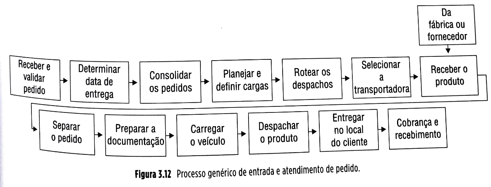
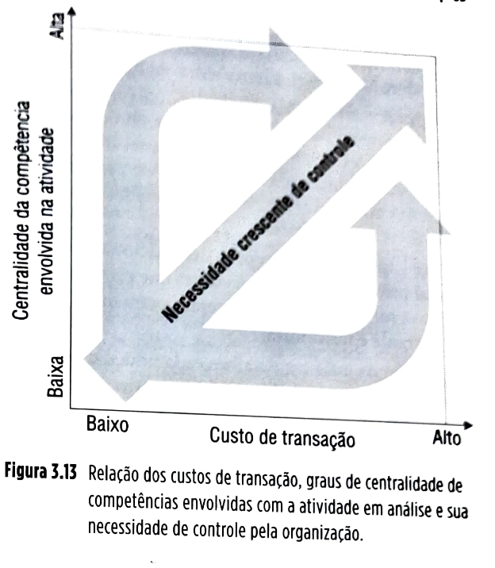
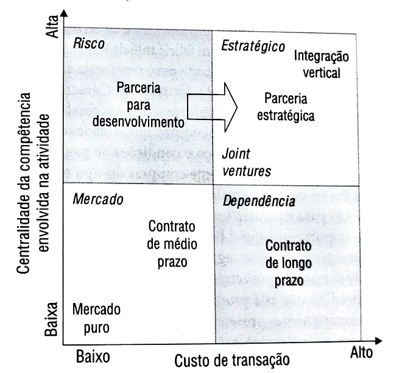

# Capítulo 3 - Gestão dos relacionamentos na cadeia global de suprimentos

**3.1** Introdução, 63
**3.2** Conceitos, 67
**3.2.1** Fundamentos da gestão de relacionamento com parceiros da cadeia de suprimentos, 67
**3.2.2** Negociação, 69
**3.2.3** Gestão do relacionamento com clientes (CRM), 72
**3.2.4** Gestão do relacionamento com fornecedores (SRM), 82
**3.3** Estudo de caso: Relacionamento com fornecedores na Toyota e na General Motors, 87
**3.4** Resumo, 89

## Página 63

### 0BJETIVOS DE APRENDIZAGEM

📌 Sintetizar o que é o SRM (supplier relationship management) e como gerenciar o relacionamento com os fornecedores na cadeia global de suprimentos.

📌 Analisar os aspectos éticos mais relevantes na gestão dos relacionamentos entre os parceiros da cadeia global de suprimentos.

### 3.1 INTRODUÇÃO

A gestão de cadeias de suprimentos difere da gestão de operações tradicional porque inclui em suas análises várias unidades operativas e interações entre elas. Essas interações ocorrem em vários níveis: materiais são trocados (na forma de fluxos diretos de vendas e reversos de devoluções), informações são trocadas (em ambos os sentidos, direto e reverso) e fluxos financeiros são trocados (também em ambos os sentidos).

É por intermédio destas trocas, por exemplo, que importantes informações sobre o que o cliente necessita/deseja serão capturadas pelos gestores da cadeia de suprimentos para que recursos e processos sejam definidos e gerenciados a fim de que os clientes atinjam níveis de satisfação que os transformam em clientes fiéis e retidos, e, muitas vezes, em propagandistas gratuitos, que recomendarão os produtos e serviços da cadeia.

Também é por meio destas trocas de informações que a empresa pode se beneficiar de desenvolvimentos tecnológicos recentes dos itens disponibilizados pelos fornecedores, incorporando-os, antes da concorrência, aos seus produtos. Além disso, pelo menos tão importante quanto estas trocas é o relacionamento que se estabelece entre parceiros da cadeia de suprimentos.

Esse relacionamento tem aspectos mais objetivos, como os contratos e os acordos de nível de serviço que os regulam, e aspectos mais subjetivos, mas nem por isso menos importantes, que são, por exemplo, os níveis de confiança entre os parceiros. Este capítulo trata dos relacionamentos entre parceiros da cadeia de suprimentos e da sua gestão, procurando responder às seguintes perguntas:

❓ O que é o SRM (*supplier relationship management*) e como gerenciar o relacionamento com os fornecedores na cadeia global de suprimentos?
❓ Quais são aspectos óticos mais relevantes na gestão dos relacionamentos entre os parceiros da cadeia global de suprimentos?

A Figura 3.1 localiza a gestão dos relacionamentos com os parceiros e do nível de serviços da cadeia global de suprimentos no quadro de referência geral usado neste livro.

### Nível de satisfação do cliente

| ⚠️**Conceito-chave**⚠️{bg=verde}|
|----------------|
| O nível de satisfação do cliente é o resultado de uma comparação entre suas expectativas anteriores ao serviço que a cadeia de suprimentos lhe prestou e a percepção *a posteriori* de seu atendimento. Se o atendimento superou em muito a expectativa, o cliente resultará muito satisfeito; se a expectativa for meramente atendida, o cliente resultará meramente satisfeito; e se a expectativa não for atendida, o cliente resultará insatisfeito. |

A virtude da satisfação do cliente é que, quanto maiores os seus níveis, maiores os níveis de retenção do cliente e, consequentemente, maior a lucratividade da empresa (lembre-se de que clientes retidos são mais lucrativos). Nesse sentido, é importante identificar constantemente os níveis de satisfação dos clientes em relação aos aspectos (veja a Figura 3.10) mais valorizados por eles e agir nos casos em que altos níveis de satisfação não estejam sendo atingidos.

## Página 79

O gestor de cadeias de suprimentos não tem o potencial de influenciar igualmente todos os fatores importantes na determinação dos níveis de satisfação do cliente. Tem, entretanto, grande potencial de influenciar um fator de grande relevância na obtenção de níveis adequados de satisfação do cliente: o nível de serviço logístico oferecido.

### Gestão do nível de serviço logístico ao cliente

| ⚠️**Conceito-chave**⚠️{bg=verde}|
|----------------|
| O nível de serviço logístico ao cliente se refere ao resultado dos processos de gestão logística da cadeia de suprimentos, no sentido de promover a utilidade de local e tempo para o cliente (disponibilizar os produtos requeridos no local e momento certos). |

A exemplo da discussão sobre as necessidades e os níveis de satisfação, os clientes também diferem em suas exigências quanto aos níveis de serviço logístico.

Os clientes, portanto, em muitas situações, não deveriam ser tratados da mesma forma, pois sequer exigem níveis similares de serviço. Clientes requerem e muitas vezes estão dispostos a pagar preços diferentes por diferentes níveis de serviço.

Considere a Hewlett Packard (HP), por exemplo, uma empresa de produtos eletrônicos que vão de computadores pessoais e impressoras a equipamentos médicos. Diferentes clientes da HP apresentam diferentes exigências quanto ao nível de serviço oferecido pela empresa em seu mercado de reparos e peças sobressalentes.

Alguns clientes podem incorrer em custos relativamente baixos quando suas impressoras ficam inativas por defeito durante um ou dois dias, já que em geral as empresas não têm apenas uma impressora — a redundância nesse caso ajuda a reduzir o custo do equipamento parado. Nesse caso, um nível de serviço de 100% (disponibilidade imediata de 100% das peças necessárias ao conserto) poderia ser considerado excessivo, já que o cliente usuário da impressora talvez não estivesse disposto a pagar por ele.

Já outros clientes, por exemplo, os hospitais que utilizam equipamentos médicos da HP, associam a indisponibilidade de um equipamento médico a custos de paragem muito mais altos, pois podem representar até mesmo risco à vida dos seus pacientes. Uma disponibilidade imediata de 100% das peças sobressalentes necessárias ao conserto do equipamento não será considerada excessiva, e o hospital estará disposto a pagar por ela.

Nesses casos, é comum que os níveis de serviço exigidos pelo cliente sejam explicitados em contrato ou em acordos de níveis de serviço (*service level agreements* ou **SLA**), que serão discutidos mais adiante, neste capítulo.

É importante saber distinguir entre os diferentes níveis de exigência dos diferentes clientes e itens a fim de que se possam prover os recursos e processos necessários a garantir o nível de serviço certo ao custo certo para cada cliente e para cada item (produto físico ou serviço).

### Cálculo do nível ótimo de serviço logístico ao cliente — o problema do jornaleiro

Em algumas situações, é possível definir analiticamente quais são os níveis ótimos de serviço logístico para que o lucro de uma organização seja maximizado. Uma destas situações é o chamado **“problema do jornaleiro”**, descrito e solucionado a seguir (baseado em Corrêa *et al.*, 2018).

A formulação que segue foi originalmente desenvolvida para produtos que devem ser consumidos em um dado período, porque perdem valor substancialmente ao final desse período. Um exemplo típico é o problema do jornaleiro.

O jornaleiro deve vender seu jornal no dia da edição, porque o valor do produto nos dias seguintes é apenas uma pequena fração do valor original. Entretanto, essa é uma condição presente em muitos tipos de produtos e negócios. Pense, por exemplo, na indústria sazonal da moda. Um produto desse verão perderá muito do seu valor se não for vendido na própria estação. O pressuposto aqui assumido é de que não serão usadas sobras da estação anterior para atender a demanda da estação presente.

Tomemos como exemplo os trajes femininos de banho. Chamemos de **p** o preço na venda do varejo, de **c** o custo do produto e de **r** o valor residual do produto, depois da estação, se não for vendido. A partir daí, vem:

▪️**Ce** = Custo de excesso de estoque (por unidade), **Ce = c − r**
▪️**Cf** = Custo da falta do produto (por unidade), **Cf = p − c**
▪️**NS** = Nível de serviço
▪️**E** = Nível de estoque
▪️**NSO*** = Nível de serviço ótimo
▪️**E*** = Nível ótimo de estoque correspondente ao **NSO***

O nível de serviço **NS** corresponde a um determinado nível de estoque **E**. **NS** é a probabilidade de que a demanda durante a estação seja menor ou igual ao valor do correspondente **E**. Por exemplo, se o **NS** for de 95%, isso significa que existe 95% de probabilidade de que a demanda durante a estação seja menor do que o nível de estoque **E** e, portanto, de que toda a demanda seja satisfeita pelo estoque **E**.

Entre os diferentes **NS** possíveis, há um que maximiza o lucro e a este chamamos de **NSO*** (nível de serviço ótimo). Assim, o nível de serviço ótimo **NSO*** é aquele em que, se mais uma unidade for comprada (com o estoque correspondente passando de **E\*** para **E\* + 1**), a contribuição dessa unidade adicional para o lucro é igual a zero (portanto, não vale a pena ser comprada).

## Página 80

Se a quantidade pedida (para atender a demanda da estação) subir de **E\*** para **E\* + 1**, a unidade adicional será vendida se a demanda for maior que **E\***. Isso ocorre com probabilidade **1 − NSO\*** e resulta numa contribuição (ao lucro) de **p − c**. Então:

**Benefício esperado da compra da unidade extra (adicional):**

\[
(1 - NSO^*)(p - c)
\]

A unidade extra (adicional) não será vendida se a demanda for igual ou menor que **E\***. A probabilidade de isso ocorrer é **NSO\*** e o resultado é um custo de **c − r**. Então:

**Custo esperado da compra da unidade extra (adicional):**

\[
NSO^*(c - r)
\]

Portanto, a contribuição adicional (também denominada *marginal*) do aumento do estoque em uma unidade, de **E\*** para **E\* + 1**, é:

\[
(1 - NSO^*)(p - c) - NSO^*(c - r)
\]

Para que o lucro seja maximizado, a contribuição marginal da unidade adicional deve ser zero:

\[
(1 - NSO^*)(p - c) - NSO^*(c - r) = 0
\]

Desenvolvendo:

\[
p - c - pNSO^* + cNSO^* - cNSO^* + rNSO^* = 0
\]

\[
p - c - (p - c + c - r)NSO^* = 0
\]

\[
p - c = [(p - c) + (c - r)]NSO^*
\]

Logo:

\[
NSO^* = \frac{p - c}{(p - c) + (c - r)} = \frac{Cf}{Cf + Ce} = \frac{1}{1 + \frac{Ce}{Cf}}
\]

### Exemplo

Considere um biquíni com:
- Preço no varejo: **p = R$ 50,00**
- Custo: **c = R$ 25,00**
- Valor residual (não vendido): **r = R$ 3,00**

Tem-se:
- **Cf = p − c = 50**
- **Ce = c − r = 22**

Assim:

\[
NSO^* = \frac{Cf}{Cf + Ce} = \frac{50}{50 + 22} \approx 69\%
\]

Imaginemos que a demanda por biquínis obedeça a uma distribuição uniforme entre 1 e 100 biquínis (igual probabilidade, de 1%, de ser vendida cada uma das possíveis quantidades de biquíni entre 1 e 100 unidades). Um nível de serviço ótimo **NSO\*** de **69%** significa que o lucro esperado será máximo para uma quantidade comprada **E\*** tal que a probabilidade de a demanda ser menor que **E\*** é igual a **69%**. No caso da distribuição uniforme de demandas do biquíni do nosso caso fictício, **69 unidades**.

Embora essa formulação seja otimizante para as condições descritas, para outras condições, as lições conceituais continuam válidas.

|💡**Fique atento**💡{bg=amarelo}|
|----------------|
| Os níveis de serviço deveriam ser maiores quanto maiores forem os custos de falta do produto (sendo constantes as outras variáveis, ou *ceteris paribus*, como os economistas denominam essa condição), e os níveis de serviço deveriam, por outro lado, ser menores quanto mais altos forem os custos de “sobra” do produto (*ceteris paribus*, ou dado que as outras variáveis sejam constantes). |

A consideração dos custos de falta nesse caso deve ser feita de forma abrangente e inteligente, levando em conta aspectos menos tangíveis, como a perda da inclinação do cliente a retornar e a eventual perda da boa vontade de recomendar a empresa. Esses aspectos serão mais relevantes quanto maior for o valor do cliente para a empresa.

## Definição de pacotes de serviço por tipo de cliente

Um dos objetivos do CRM, conforme discutido, é adequar o atendimento aos clientes. De posse da classificação dos clientes, por exemplo, nas classes **A**, **B** e **C**, pode-se definir o pacote de serviço mais adequado a cada classe. A Figura 3.11 ilustra esse conceito com um exemplo hipotético.

| Pacote de serviço              | Clientes classe A | Clientes classe B | Clientes classe C |
|--------------------------------|-------------------|-------------------|-------------------|
| Nível de serviço logístico     | 98% mínimo        | 92% mínimo        | 88% mínimo        |
| Prazo de entrega               | 3 dias            | 7 dias            | 14 dias           |
| Tempo de retorno a solicitações| Em 1 hora máximo  | No mesmo dia      | 3 dias máximo     |
| Atendimento ao cliente         | Representante exclusivo | Próximo representante disponível | Via website |
| Prazo de pagamento             | 30/60/90 dias     | 30/60 dias        | 30 dias           |

*Figura 3.11 — Exemplo de pacotes de serviço por classe de cliente.*

## Página 81

### Contratos e acordos de nível de serviço

É largamente aceito que, quando uma entidade presta serviços não triviais a outra, esse relacionamento deveria ser regulado por contrato, que explicita o pacote de serviços oferecido. Esses contratos são muitas vezes conhecidos como acordos de nível de serviço ou SLA (*Service Level Agreement*).

| ⚠️**Conceito-chave**⚠️{bg=verde}|
|----------------|
| No âmbito da gestão de cadeias de suprimentos, um SLA é um acordo formalmente negociado entre duas partes a fim de regular os serviços que um parceiro da cadeia presta ao outro. É um contrato, portanto, entre fornecedor e cliente, que registra o entendimento comum sobre a especificação dos serviços prestados, as prioridades, responsabilidades, garantias e, como um todo, o nível de serviço acordado.|

Pode especificar, por exemplo, níveis de disponibilidade de estoques, níveis de pontualidade de entregas, níveis de precisão/completude de informações, níveis de desempenho operacional ou outros atributos do serviço, como cobrança, serviços pós-venda e até as penalidades em caso de violação do SLA. É importante que os termos usados em um SLA sejam precisos e bem definidos, e que as métricas a serem adotadas para avaliar se os serviços oferecidos atendem aos limites estabelecidos pelo SLA sejam definidas sem deixar margens a dúvidas. Isso evita que eventuais problemas futuros caiam em zonas cinza que possam trazer fontes adicionais de conflito.

No relacionamento na cadeia de suprimentos, por exemplo, um SLA que determina que as “entregas de produtos devem ser feitas de forma pontual” pode parecer claro, mas deixa margem para questionar, por exemplo, se a entrega de produtos deve necessariamente ser completa ou não. Uma entrega de 90% de um pedido dentro do prazo combinado representa “entrega de produtos pontual”? A frase “A entrega de 100% dos produtos solicitados deve ser feita de forma pontual de acordo com a data solicitada no pedido” dá muito menos margem a interpretações.

### Processo de entrada e atendimento de pedidos (ciclo de pedido)

Do ponto de vista do relacionamento com o cliente e da formação dos seus níveis de satisfação, a forma com que a empresa gerencia seu processo de entrada e atendimento de pedidos tem papel essencial. O tempo decorrido entre o cliente efetivar um pedido e receber o produto é chamado ciclo do pedido e tem impacto tanto no cliente como no fornecedor.  

Ciclos mais longos do pedido podem, por exemplo, amplificar o efeito chicote (descrito brevemente no Capítulo 2 e mais detalhado no Capítulo 8), aumentando a volatilidade da demanda percebida pelos nós a montante da cadeia de suprimentos. Podem também aumentar o tempo durante o qual os parceiros da cadeia carregam estoques, com implicações importantes sobre a necessidade de capital de giro das empresas, e tornar o cliente, na relação, menos ágil para atender aos seus próprios pedidos.  

Genericamente, o processo de entrada e atendimento de pedidos tem as atividades descritas na Figura 3.12.

## Página 82

A gestão do processo de entrada e atendimento do pedido deve sempre visar a reduzir tempos e eliminar atividades desnecessárias. Dar mais velocidade ao processo requer uma análise detalhada de todas as atividades e subatividades envolvidas, no sentido de questionar o valor que a atividade agrega ao processo (eliminando-a em caso de não agregação de valor), questionar o método com o qual está sendo realizada (com o objetivo de torná-la mais ágil) e, sempre que possível, questionar a sequencialidade das atividades. Quanto mais as atividades puderem ser realizadas em paralelo, mais ágil o processo será. A análise para melhoramento de processos em gestão de cadeias de suprimentos é discutida em detalhes no Capítulo 7.

### 3.2.4 Gestão do relacionamento com fornecedores (SRM)

Da mesma forma que é importante gerenciar adequadamente os relacionamentos com clientes, numa cadeia de suprimentos, é também importante gerenciar os relacionamentos com os fornecedores. O SRM (*Supplier Relationship Management*) visa exatamente isso, com objetivos similares aos do CRM, discutido anteriormente: segmentar os fornecedores (que, a exemplo dos clientes, também não são um grupo homogêneo) de acordo com sua importância para a empresa e desenhar formas de relacionamento adequadas para cada segmento, de forma a maximizar os resultados das interações entre a empresa e seus fornecedores. Veja uma discussão sobre as ferramentas tecnológicas para apoio ao SRM no Capítulo 12.

|💡**Fique atento**💡{bg=amarelo}|
|----------------|
| Diferentemente da segmentação dos clientes — que basicamente obedece a uma lógica de lucratividade para a organização —, a segmentação dos fornecedores obedece a uma lógica diferente. Esta é governada basicamente por duas variáveis: os custos de transação e as competências centrais envolvidas.|

### Segmentação de fornecedores

No Capítulo 2, estas duas variáveis foram usadas para analisar o processo decisório sobre “comprar ou fazer” e para introduzir o conceito de que, para os itens que uma empresa decide por comprar (e não fazer), o relacionamento não deve ser o mesmo com todos os fornecedores.

Ainda de acordo com as discussões do Capítulo 2, os *custos de transação* são os custos totais associados a uma transação, excetuando-se o mínimo preço possível do produto, e são dependentes de quatro variáveis:

▪️o número de fornecedores potenciais;
▪️a especificidade de ativos dedicados à transação;
▪️o nível geral de incerteza em torno da transação; e
▪️a frequência com a qual as transações ocorrem.

Quanto menor o número de fornecedores potenciais, quanto maior a especificidade de ativos, quanto maior o nível geral de incerteza e quanto maior a frequência das transações, maiores os seus custos. Os custos de transação com os fornecedores dos diversos itens comprados por uma empresa podem variar num contínuo de muito baixos a muito altos.

O Capítulo 2 também define uma **competência central** como um conjunto de habilidades e tecnologias que:

▪️contribui desproporcionalmente para o valor percebido pelo cliente;
▪️é competitivamente único ou exclusivo (não facilmente imitável, portanto); e
▪️tem o potencial de abrir portas para mercados promissores futuros.

Competências centrais são fontes de vantagem competitiva sustentáveis e, portanto, a empresa deveria manter controle seguro sobre elas, por exemplo, evitando terceirizá-las.

Embora, às vezes, a literatura sugira o contrário, não é um exercício fácil definir se uma determinada competência dentro da organização é central ou não. Na verdade, os três fatores considerados ao analisar essa questão não são do tipo sim/não, mas do tipo contínuo.

Uma competência pode apresentar diferentes graus de contribuição para o valor percebido pelo cliente, variando de baixo a alto; da mesma forma, competências também podem ter graus diversos quanto à dificuldade de imitação, variando de baixo a alto; e, finalmente, diferentes competências também podem ter diferentes graus que impulsionam a abertura de portas para mercados do futuro, variando de baixo a alto.

Claro que, na realidade das empresas, há aquelas atividades que, muito claramente, são competências centrais. Por exemplo, ninguém questiona que uma competência central da Honda é a de projetar motores compactos de alta eficiência, e ninguém questiona também que, para a Honda, atividades de produção de papel de impressora não são competências centrais.

Isso leva a uma conclusão clara: a Honda deve ter alto nível de controle sobre as atividades relacionadas ao projeto de motores e não precisa ter controle sobre as atividades relacionadas à produção de papel de impressora.

## Página 83

Entretanto, esses são casos extremos dos contínuos e, em geral, casos extremos não são difíceis de analisar. Os casos não extremos é que são mais complicados e infinitamente muito mais numerosos. Por exemplo, a produção da transmissão dos veículos Honda é uma competência central da empresa? Possivelmente não, mas ninguém pode negar que o desempenho da transmissão de um carro Honda (trabalhando junto com o motor) tem potencial muito maior de influenciar a decisão de compra de um cliente que a influência do desempenho do papel de impressora usado nos escritórios da empresa! A competência de fazer transmissões é, portanto, mais central para a Honda do que a competência de fazer papel.

Isso sinaliza que talvez devamos tratar de fato as duas variáveis, **custos de transação** e **competências centrais**, como contínuos, e não como variáveis dicotômicas sim/não. Chamemos o contínuo relativo a competências centrais de “**grau de centralidade**” da competência usada na produção dos itens em análise, e de “**custo de transação**” o contínuo que representa os custos de transacionar com fornecedores para obter os itens em análise. Analisemos um gráfico cartesiano com estas duas variáveis como seus eixos.

No Capítulo 2, foi visto que a teoria econômica por trás da análise dos custos de transação preconiza que, quanto mais altos os custos de transação incorridos, mais as empresas tenderão a tentar minimizá-los por meio da integração vertical, ou seja, tenderão a optar por fazer internamente o item em questão, em vez de terceirizar sua produção. Tratada como um contínuo, essa variável significa que, quanto maiores os custos de transação, mais a organização deveria tender a adotar os níveis mais altos de controle trazidos pela integração vertical.

## Segmentação de fornecedores e controle no relacionamento

Também foi esclarecido no Capítulo 2 que, quando uma atividade utiliza competências centrais de uma organização, esta deveria mantê-la produzida internamente. Essa variável, tratada como um contínuo, significa que, quanto maior o grau de centralidade da competência envolvida com a atividade, mais controle deveria ser mantido sobre ela.

Essa ideia é representada pela Figura 3.13.

A partir da análise da Figura 3.13, então, podemos passar a segmentar os diversos itens e, por conseguinte, os seus fornecedores. Evidentemente, trata-se de um contínuo de variação, e o estabelecimento de posições ou regiões nesses contínuos carrega certo nível de arbitrariedade, mas pode, por outro lado, ajudar na operacionalidade dos conceitos. Uma forma de segmentar é apresentada na Figura 3.14, em que as várias formas de relacionamento são definidas a partir da posição aproximada que os itens fornecidos ocupam na matriz **centralidade – custo de transação**.

Figura 3.13 Relação dos custos de transação, graus de centralidade de Competências envolvidas com aatividade em análise e sua necessidade de controle pela organização.

Figura 3.14 Segmentação de fornecedores e tipos de relacionamento Conforme a posição na matriz centralidade - custo de transação.

## Página 84

### Níveis de controle e tipos de relacionamento com fornecedores

Na matriz da Figura 3.14, apenas para facilitar a comunicação, batizamos as grandes regiões (quadrantes) como:

▪️**Mercado** – quadrante que representa tipos de relacionamento menos estratégicos, com relações relativamente tênues entre os parceiros, cuja interdependência não é grande.

▪️**Estratégico** – quadrante que representa os relacionamentos mais estreitos entre parceiros, já que a interdependência estratégica entre eles é muito grande.

▪️**Dependência** – quadrante em que o cliente depende de relativamente poucos fornecedores, embora os itens ou atividades trocadas não sejam fontes de vantagem competitiva futura. A dependência de poucos fornecedores indica, entretanto, relacionamentos próximos em nível intermediário.

▪️**Risco** – quadrante que representa relacionamentos em geral próximos com fornecedores que provavelmente virão a ser estratégicos; em geral, a permanência nesse quadrante é transitória.

Analisemos mais em detalhes cada uma das posições nomeadas na matriz da Figura 3.14, dentro dos grandes quadrantes.

### Mercado puro

Também chamado na literatura de língua inglesa de *arm’s length*. Adequado para situações em que os custos de transação são baixos e a centralidade da competência envolvida no item também é baixa. Exemplos são os materiais de escritório e de limpeza para um fabricante de bebidas, ou os serviços de refeitório para um fabricante de impressoras.

O relacionamento do tipo mercado puro representa a maioria dos relacionamentos cliente-fornecedor. Caracteriza-se por uma troca limitada de informações, em geral restringindo-se à especificação de compra, quantidades e prazos de entrega necessários, preço e condições de pagamento. Compras *spot* são tipicamente compras do tipo mercado puro.

Empresas tradicionalmente usam mecanismos como cotações para executar transações desse tipo. O critério mais importante aqui é lidar com os milhares de itens que se encaixam nesse segmento da forma mais eficiente possível, mas sempre zelando para que não faltem, já que um produto não está pronto a menos que tenha todos os seus componentes presentes, sejam eles muito ou pouco valiosos ou importantes.

A Boeing, por exemplo, em outubro de 2008, constatou problemas com os relativamente simples parafusos, porcas e rebites de titânio usados no seu novo produto, o jato 787 (*Dreamliner*), logo antes do seu lançamento. A dificuldade de obtenção rápida de itens para substituir aqueles com problemas fez com que o lançamento do produto fosse substancialmente atrasado, com prejuízos estimados em dezenas de milhões de dólares, sem contar os dos clientes que já haviam encomendado 900 jatos do referido modelo, contando com sua entrega para entrar em operação dentro da programação estabelecida. Tudo isso por problemas em itens que, aparentemente, têm valor relativo quase irrelevante.

Mecanismos baseados na internet podem ser usados para reduzir os custos dos processos de cotação, assim como para permitir aumento do escopo dos possíveis fornecedores cotados na região de **mercado puro**. Leilões reversos são um exemplo: empresas da internet, chamadas de *marketplaces*, reúnem numerosos fornecedores, e o potencial cliente declara o que precisa comprar e em que condições de entrega. Os potenciais ofertantes, então, têm determinado prazo para apresentarem suas ofertas, para escolha do comprador.

Tem havido um crescente movimento de consolidação de processos de compra dessas empresas, possibilitando que empresas compradoras ganhem poder de barganha. Setores de compras de unidades operativas, anteriormente com certa autonomia de realizar suas transações de compras, têm sido centralizados em “compras corporativas” nesse sentido.

Ainda com o propósito de ampliar ainda mais o poder de barganha de compras, empresas não concorrentes têm muitas vezes estabelecido *joint ventures* para o desenvolvimento de portais de compras na internet, para que compras de materiais não produtivos — por exemplo, papelaria, material de limpeza, entre outros — sejam feitas em maiores quantidades. Um exemplo foi o portal da empresa Agrega (hoje descontinuada), uma *joint venture* entre a Ambev (hoje InBev) e a Souza Cruz, a fim de ampliar o poder de barganha junto a fornecedores.

Numa extensão desse conceito, empresas têm estabelecido *joint ventures* para viabilizar a formação de portais de compra na internet até mesmo com concorrentes diretos, para compra de serviços e itens materiais não centrais. Um exemplo é o site da empresa Covisint (hoje OpenText), que ampliou a gama de oferta de serviços da original Covisint para incluir, por exemplo, a *internet of things* (IoT), estabelecido pela Daimler-Chrysler, Ford e General Motors nos Estados Unidos, nos anos 1990, a fim de tentar reduzir seus custos com itens e serviços não centrais.

Hoje é comum os governos, em todos os níveis, estabelecerem “portais de compras” para consolidar compras e aumentar o poder de barganha do comprador. Segundo Fawcett *et al.* (2007), em relações de mercado puro, as seguintes características garantem um bom relacionamento:

▪️contato pessoal (e não apenas pela internet) e clareza de comunicação, para reduzir chances de mal-entendidos;
▪️especificações claras, para redução de confusões e ambiguidades;
▪️pagamento pontual, para respeito mútuo;
▪️tratamento equitativo e justo, com confidencialidade respeitada, para aumento de confiança;
▪️avaliação e realimentação adequadas, para favorecer melhoria de desempenho;
▪️respeito mútuo, para evitar simplesmente passar problemas adiante; e
▪️integridade e ética, para que também se possa cobrar integridade e ética do fornecedor.

## Página 85

**Integração vertical**

No outro extremo da matriz, encontram-se materiais ou serviços que são “centrais” para a empresa e cujo custo de troca de fornecedores é muito alto. Para estes, a recomendação é clara: manter dentro de casa, via integração vertical. O risco de não fazê-lo é estratégico: tornar-se uma empresa vazia e, em última análise, dispensável na cadeia de suprimentos, devido ao grande potencial de as competências centrais serem fontes de vantagem competitiva sustentável.

Exemplos são atividades como a miniaturização para a Sony; a inovação frequente em sua linha de produtos para a Apple; a coordenação dos processos de projeto, produção, entrega e pós-venda da VW para seu consórcio modular de Resende (veja o estudo de caso ao final do Capítulo 2); o contato com o cliente para a Dell Computers; o projeto de métodos e manutenção de padrões para o McDonald’s (veja o Capítulo 1); e o aconselhamento e gestão de competências internas para a empresa de consultoria McKinsey.

**Contratos de médio e de longo prazos**

Muitas vezes, empresas se relacionam comercialmente por longos períodos sem ter entre si nenhum contrato formal que regule legalmente o relacionamento. Em situações em que crescem os custos de troca e a centralidade da atividade terceirizada, cresce também a conveniência de regular mais formalmente a relação entre terceirizado e contratante, com contratos e acordos bem elaborados de níveis de serviço.

Uma faixa de durações pode ser estabelecida para esses contratos. Uma montadora de veículos pode estabelecer que um determinado fornecedor vai prover um determinado item até o final da vida útil de um determinado modelo, sendo que esse prazo pode se estender por alguns anos. Algum nível de comprometimento sobre volumes totais pode ser objeto desse contrato, assim como se tornam cada vez mais frequentes contratos que legislam sobre comprometimentos relativos a preços decrescentes e níveis de serviço crescentes ao longo de sua vigência.

As ordens abertas (*blanket orders*) são um exemplo. Os contratos de média e longa duração estabelecem níveis gerais de volumes e preços unitários decrescentes com determinada taxa ao longo dos anos de vigência. A partir daí, os sistemas de planejamento das duas empresas se comunicam diretamente para estabelecer as “puxadas” (*call offs*) de peças à medida que as necessidades de curto prazo requerem.

O mesmo se aplica a situações de serviços, em que determinados serviços podem ser objeto de contratações de prazo mais longo e as “puxadas” ocorrem conforme necessário. Um exemplo é uma empresa que fecha um contrato de fornecimento de transporte aéreo para os executivos de um cliente com preços especiais, e os diferentes departamentos fazem seus pedidos de reservas e passagens de acordo com suas necessidades diárias. Outro exemplo são empresas terceirizadas de limpeza prestando serviço a hospitais. Os contratos de prazo mais longo, com maiores amarrações, podem ser convenientes nas situações em que o fornecedor é mais monopolista em seu mercado de atuação, a fim de evitar que a empresa cliente se veja em situações de risco de o fornecedor procurar tomar partido ou tirar proveito de uma situação conjuntural favorável de curto prazo, como, por exemplo, redirecionar um determinado fornecimento para outro cliente que se disponha a pagar mais.

**Joint venture**

Situação em que os custos de troca são altos e o fornecimento tem grau alto de centralidade pode requerer um tipo de amarração entre fornecedor e cliente que inclua níveis mais altos de especificidade de ativos e trocas de informação tão intensas como sensíveis. Os parceiros se unem para um empreendimento com certo grau de compartilhamento de custos e benefícios.

Quando a General Motors resolveu terceirizar seu setor de desenvolvimento e manutenção de tecnologia de informação, contratou a EDS para ser o terceiro. Entretanto, dado o custo de troca e a centralidade da atividade, decidiu se associar com o terceiro numa *joint venture*. A General Motors por muitos anos foi um dos principais acionistas da EDS.

O Unibanco, quando terceirizou seu *relationship center* (os antigos *call centers*) para a 4ª, preferiu se manter por longo tempo como um dos acionistas, tanto para analisar melhor a oportunidade de negócio representada pelas empresas de terceirização de *call centers*, como para manter mais sob seu controle uma atividade com alto grau de centralidade e custo de troca.

Às vezes, considera-se que as *joint ventures* seriam arranjos com os quais os participantes exerceriam mais controle sobre a atividade do que em parcerias estratégicas, devido à participação acionária. Isso, entretanto, pode não ser verdade. Um sócio minoritário numa *joint venture* pode ter um controle muito pequeno sobre o que se passa na gestão da empresa, enquanto um relacionamento fornecedor–cliente sem participação acionária, por exemplo, numa parceria estratégica ou mesmo um contrato de longo prazo, com um contrato de fornecimento bem elaborado, pode dar à parte compradora o poder de cliente e os mecanismos legais para fazer os níveis de serviço acordados acontecerem.

Ou seja, não se deve confundir o nível de controle com propriedade acionária. Nem é verdade que a propriedade acionária (principalmente quando minoritária) garante níveis altos de controle, e nem é verdade que sem propriedade acionária não se pode ter níveis altos de controle.

## Página 86

**Parcerias estratégicas**

Nesse tipo de relacionamento, um alto nível de comprometimento é exigido das partes. Normalmente, o nível de pressão acompanha o alto nível de comprometimento, pois são amarrados mais intensamente os destinos dos parceiros, que se tornam profundamente interdependentes. Uma intensiva troca de informações (inclusive, muitas vezes sensíveis) é usual e a necessidade de confiança mútua é máxima. A presença de funcionários de um parceiro nas dependências do outro é comum (a figura dos engenheiros residentes, por exemplo). Os contratos tendem a ser complexos e difíceis de elaborar, podendo em muitas situações ser até considerados como fontes de vantagem competitiva e mantidos secretos, quando bem elaborados.

Um exemplo são exatamente os modulistas do consórcio modular de Resende e sua relação com a Volkswagen, cujo contrato é mantido secreto (veja o caso de fechamento do Capítulo 2). Ou ainda a parceria do McDonald’s no Brasil com a Brapelco (logística), Interbakers (pães) e Braslo (processadora de carnes) no seu empreendimento chamado Foodtown, em Osasco, um projeto integrado conjunto que produz e distribui a maioria dos insumos para as lojas McDonald’s na região. Em geral, uma alta especificidade de ativos está envolvida na parceria estratégica e um exercício longo de escolha e negociação é requerido durante o processo de estabelecimento da parceria.

A pesquisadora e professora da Harvard University, Rosabeth Moss Kanter, que estuda as parcerias estratégicas, menciona oito aspectos que, no seu entender, são essenciais para o seu sucesso (Kanter, 1994):

▪️**Excelência individual:** ambos os parceiros são fortes e têm alguma coisa de valor para oferecer à relação. Seus motivos para entrar na relação são positivos (buscar oportunidades futuras) e não negativos (mascarar fraquezas).
▪️**Importância:** a relação se ajusta aos principais objetivos estratégicos dos parceiros, de modo que eles desejam que a parceria funcione bem. Os parceiros têm objetivos de longo prazo, nos quais a parceria desempenha papel fundamental.
▪️**Interdependência:** os parceiros precisam um do outro. Têm ativos e habilidades que se complementam. Nenhum dos dois pode atingir sozinho o que podem fazer juntos.
▪️**Investimento:** os parceiros investem um no outro. Mostram sinais tangíveis de compromisso de longo prazo.
▪️**Informação:** a comunicação é razoavelmente aberta. Os parceiros compartilham as informações necessárias ao bom funcionamento da relação, inclusive seus objetivos e metas, dados técnicos e identificação de conflitos, pontos de inquietação ou situações em mudança.
▪️**Integração:** os parceiros desenvolvem conexões e modos compartilhados de operação, de modo que possam trabalhar juntos, sem percalços. Constroem amplas conexões entre muitas pessoas, em muitos níveis organizacionais. Os parceiros se tornam instrutores e aprendizes.
▪️**Institucionalização:** a relação recebe um status formal, com responsabilidades e processos de decisão claros. Ela se estende além das pessoas específicas que a formaram e não pode ser desfeita por um motivo idiossincrático.
▪️**Integridade:** os parceiros se comportam, um em relação ao outro, de modo honrado que demonstra e acentua a confiança mútua. Eles não abusam da informação a que têm acesso, nem minam a posição do outro.

### Parceria para desenvolvimento

No caso da região da matriz em que há baixo custo de troca e alto grau de centralidade, o cliente se vê numa desconfortável situação na qual uma determinada atividade central está terceirizada, mas pode haver numerosos fornecedores aptos a serem usados para realizá-la. Isso significa que a concorrência tem também acesso a esse grande número de fornecedores e que a atividade provavelmente não é tão diferenciada. Isso pode indicar que a fonte de vantagem competitiva que a atividade apresenta hoje pode não ser sustentável, e esforços podem ser compensadores no sentido de desenvolver um ou alguns poucos desses fornecedores a fim de que diferenciem sua oferta e possam migrar para o quadrante superior direito, o que virá acompanhado de esforços do cliente para intensificar o relacionamento, podendo a partir de certo ponto incluir cláusulas de exclusividade ou mesmo integração vertical.

Expandindo o exemplo dado sobre essa questão no Capítulo 2, o McDonald’s, ao chegar ao Brasil nos anos 1980, percebeu que as batatas produzidas pelos fornecedores brasileiros não atendiam às necessidades de padrões internacionais da empresa. Por se tratar de um item com grau considerável de centralidade e relativamente baixo custo de troca, apresentava-se, portanto, um risco estratégico de imagem de a “crocância” da batata frita do McDonald’s se tornar apenas mais uma de tantas batatas fritas oferecidas pelos concorrentes. A empresa disparou então uma iniciativa em conjunto com alguns fornecedores a fim de desenvolver uma variedade de batata que se conformasse aos padrões internacionais da empresa. A partir disso, alguns fornecedores se tornaram exclusivos (subsequente migração para o quadrante estratégico), preservando-se a centralidade da atividade.

A empresa deve, portanto, desenvolver a habilidade de desenhar um adequado portfólio de relacionamentos com aqueles fornecedores para os quais resolve terceirizar atividades. Tratar homogeneamente fornecedores que tenham diferentes relevâncias estratégicas pode ser um erro estratégico importante.

## Página 87

**3.3 Estudo de caso: Relacionamento com fornecedores na Toyota e na General Motors**

### Toyota

A Toyota Motor Co., maior fabricante de carros do mundo, gerencia a relação com muitos dos seus fornecedores de acordo com um modelo tradicional entre empresas japonesas. Trata-se de uma variação do modelo de *keiretsu* (veja o Capítulo 1), uma espécie de federação de empresas dominadas por uma principal, como a Toyota, com poderes especiais sobre o grupo. Os fornecedores associados com a *keiretsu* são chamados *kankei-kaisha* (empresas afiliadas); nessa relação, em geral a empresa dominante tem alguma participação acionária em cada uma das empresas afiliadas e, não raro, transfere funcionários para elas. Entretanto, mesmo empresas independentes fora da *keiretsu* e que não têm nenhuma relação acionária com a empresa dominante frequentemente trabalham com ela de forma similar.

O uso geral do modelo de *keiretsu* implica troca intensa de informação, realimentação e sugestões mútuas para melhoria de desempenho. Além disso, requer alto grau de comprometimento. No Japão, esse comprometimento pode assumir diferentes formas, incluindo investimento em ativos, contratos implícitos de longo prazo, colocalização de funcionários e investimento em ativos específicos da relação. Um problema ocorrido pela primeira vez dispara esforços para consertá-lo, em vez de suscitar a busca de um fornecedor alternativo — embora a recorrência do problema possa levar ao término do relacionamento.

Há muito tempo considerada a mais eficiente fabricante de carros do mundo, a Toyota se esforça muito para espalhar suas técnicas de *lean production* (também chamadas de manufatura enxuta, um conjunto de técnicas com inspiração no *just in time*, também conhecido como TPS – *Toyota Production System* – Sistema Toyota de Produção –, voltado para a eliminação de desperdícios e o melhoramento contínuo — para detalhes, ver Corrêa e Corrêa, 2017, Capítulo 20) entre seus fornecedores.

Nos Estados Unidos, assim como na Europa e no Japão, a Toyota instituiu os chamados Centros de Apoio ao Fornecedor Toyota, escolas nas quais os fornecedores podem aprender os princípios *lean* do Sistema Toyota de Produção e desenvolver planos de implantação deles em suas próprias fábricas. Centenas de gestores de alto nível de fornecedores frequentam esses centros anualmente. A preocupação com fornecedores tem raízes históricas na Toyota. Em 1943, a empresa fundou no Japão uma associação de fornecedores a fim de promover “amizade mútua” e troca de informações técnicas. Mais tarde, inaugurou uma iniciativa similar com seus fornecedores americanos, o que foi visto inicialmente com certa desconfiança, mas posteriormente teve sucesso. A Toyota sempre valorizou o relacionamento face a face com seus fornecedores, daí ter sido mais lenta que as montadoras americanas para aderir a práticas de suprimentos baseadas na internet. O perfil dos fornecedores da Toyota quanto à percentagem dos custos de componentes mostrado na Figura 3.15 é bem diferente daquele dos da General Motors.

**Percentagem do custo total de componentes**

| Empresa        | Feitos internamente | Feitos por fornecedores parceiros | Feitos por fornecedores tipo mercado puro |
|----------------|--------------------:|----------------------------------:|-------------------------------------------:|
| Toyota         | 27%                 | 48%                               | 25%                                        |
| General Motors | 55%                 | 10%                               | 35%                                        |

**Figura 3.15** – Toyota e GM: distribuição de fornecimento por tipo de relação com fornecedor.

Coerente com o Sistema Toyota de Produção seguido no Japão, a maioria das fábricas montadoras da Toyota está localizada num raio de 50 km da sede da corporação e de seu centro tecnológico. Os fornecedores, então, ficam em “aglomerados” ao redor das fábricas. As fábricas Toyota de componentes estão muito próximas (15 km em média); as de fornecedores *kankei-kaisha* um pouco mais afastadas (50 km em média); e as de fornecedores de fora do “*keiretsu* modificado” a 130 km em média. Estas distâncias todas, entretanto, são muito menores do que aquelas das cadeias de suprimentos das montadoras americanas. Em média, um fornecedor Toyota faz em torno de oito entregas *just in time* por dia – levando a estoques muito menores que os dos concorrentes americanos.

A Toyota só parece fazer negócio com fornecedores que podem ter presença global, capacidade de inovação tecnológica e velocidade de atendimento. Assuntos como qualidade, confiabilidade e comprometimento com redução de custo parecem ser pré-requisitos para a consideração inicial de uma potencial empresa fornecedora. A evolução do relacionamento de um fornecedor com a Toyota segue a seguinte sequência: primeiro, o fornecedor provê uma peça que foi completamente projetada pela Toyota; apenas depois de um longo período de alto desempenho e contínua construção de relacionamento, o fornecedor atinge o estágio em que seus projetos e *expertise* técnica passam a ser usados. Mesmo quando a empresa se torna um fornecedor preferencial, é raro a Toyota delegar inteiramente a ele a tarefa de projeto da peça.

A Toyota é contra a abordagem de comprar componentes “caixa-preta”, principalmente em partes centrais como motores e transmissões. Ainda assim, os fornecedores apreciam fazer negócio com a empresa por causa de sua confiabilidade, justiça e previsibilidade nos processos de gestão de seus fornecedores.

## Página 88

**General Motors**

A General Motors foi por muitos anos a líder mundial (em volume) na fabricação de veículos. A GM se manteve bastante integrada verticalmente ao longo de toda a sua história e por muito tempo produzia internamente em torno de 65% dos componentes dos seus veículos. Suas compras, primeiramente e predominantemente, eram feitas de acordo com uma relação que chamamos neste capítulo de “mercado puro”, muito baseada em cotações solicitadas a cinco fornecedores, com escolha daquele que pode ofertar o mais baixo preço. Tradicionalmente, a relação da empresa com seus fornecedores poderia ser considerada como “adversária”. As fábricas americanas da GM e de seus fornecedores são espalhadas pelo território americano, em claro contraste com a abordagem da Toyota. Previsivelmente, a empresa nunca priorizou muito as relações face a face com seus parceiros. De acordo com muitos pesquisadores, o nível de confiança entre a GM e seus fornecedores também nunca foi comparável àquele da Toyota com os seus.

Em 1992, por exemplo, confrontada com um baixo desempenho financeiro, o então vice-presidente global de compras José Ignacio López de Arriortúa (o mesmo que acabou na VW – veja o estudo de caso do Capítulo 2) disparou uma iniciativa ainda mais agressiva com os fornecedores, em alguns casos demandando reduções percentuais de preço de dois dígitos. Ele até mesmo quebrou a tradição da renovação anual de contratos com fornecedores de longo prazo, passando a, em vez disso, trocar frequentemente de fornecedores com base em cotações e compra do mais barato. 

Alega-se que, em algumas situações, depois de um fornecedor comprometer recursos no desenvolvimento e projeto de uma peça, a GM sob a gestão de López usou o desenho da peça em questão para gerar “chamadas de cotação” junto a outros fornecedores. Compradores da GM eram proibidos de aceitar convites para refeições com fornecedores, exceto em situações extraordinárias – e mesmo assim essa prática era desencorajada. Um executivo teria dito: *“Não entendemos bem o que parceria com fornecedores traz de benefícios. Parceria amarra você… Nós não gostamos nem da palavra ‘parceiro’”*.

No curto prazo, a GM sob o comando de López conseguiu US$ 4 bilhões de economia em materiais, mas à custa do relacionamento de mais longo prazo com seus fornecedores, que se tornaram cada vez mais resistentes a compartilharem suas melhores ou mais recentes ideias com a GM, tendendo a vendê-las para empresas que estivessem inclinadas a valorizar mais um bom relacionamento. Depois que López deixou a GM, indo para a Volkswagen em 1993, o novo chefe de compras, Richard Wagoner (que foi presidente da VW Brasil e, até o início de 2009, foi CEO da Corporação GM), adotou uma postura mais suave quanto aos fornecedores. Ele não repudiou 100% dos métodos de López, mas aparentemente os mais radicais passaram a ser menos enfatizados.

Wagoner afirmou em 1993: *“A GM continuaria a ser dura com seus fornecedores. Não acreditamos na velha prática do ‘abraço de urso’, com todos falando o quanto nos amamos ou quanto nos odiamos. Parcerias têm de ser baseadas na demanda do mercado e expectativas dos clientes”*.

Seu sucessor, a partir da metade dos anos 1990, Harold Kutner, manteve uma filosofia similar. Ele disse: “Nosso foco não é necessariamente ter grandes parcerias com nossos fornecedores com relacionamentos assumidos para a vida toda. É ter relacionamento com fornecedores com altos níveis de expectativas. Os fornecedores devem esperar de nós que sejamos bons clientes. Precisamos compartilhar dados, oportunidades futuras e previsões de volume. E precisamos compartilhar com eles qualquer informação que auxilie a eliminar desperdícios do sistema. Por outro lado, nós temos altas expectativas: primeiro, que o fornecedor deve se tornar global; e, segundo, que seu desempenho possa ser comparável com as melhores empresas do mundo”. Mas Kutner foi suave só se comparado aos padrões tradicionais da GM. Ele tinha a reputação junto aos fornecedores de ser um negociador duríssimo na pressão para reduzir preços.

Conforme comentado neste capítulo, os três grandes fabricantes de veículos americanos — GM, Ford e Chrysler — estabeleceram em 2000 uma plataforma conjunta baseada na internet chamada Covisint, a fim de aumentar volumes comprados por meio da consolidação de compras e conseguir vantagens em preço, através de um sistema de cotações e leilões on-line. Embora houvesse àquela época grandes expectativas em relação a soluções de compras baseadas na internet, a Toyota permaneceu fiel ao conceito de que relacionamentos face a face com fornecedores e inspeções nas suas fábricas não podiam ser feitas via internet. De fato, a partir de 2002, a Covisint já não apresentava o desempenho esperado, tendo sido posteriormente vendida (hoje chama-se OpenText). Muitos fornecedores relutaram em participar dos leilões da Covisint por enxergarem nessa iniciativa uma forma adicional de as grandes montadoras cortarem preços via poder de barganha (conseguir fatias maiores do bolo em vez de fazer crescer o bolo).

**Fonte:** Baseado em Enright (2003).

## Página 89

### 3.4 Resumo

▪️A gestão de cadeias de suprimentos difere da gestão de operações tradicional porque inclui em suas análises várias unidades operativas e as interações entre elas.

▪️Muitas vezes, o comportamento oportunista dos nós da cadeia de suprimentos predomina, fazendo com que tomem decisões de forma a maximizarem seu próprio desempenho local à custa do desempenho local de outros nós da cadeia.

▪️Uma causa de resultados indesejáveis por comportamento oportunista se refere à falta de um aspecto essencial do relacionamento entre parceiros da cadeia: **confiança**.

▪️Reiteração de relacionamentos, com contratos de prazo mais longo, mais intensidade de interações pessoais e cumprimento reiterado de promessas e acordos, favorece o desenvolvimento de níveis mais altos de confiança entre parceiros bem-intencionados.

▪️Negociação é uma discussão entre dois ou mais participantes tentando chegar a uma solução para um problema.

▪️Embora os objetivos dos participantes de uma negociação sejam interdependentes e não possam ser atingidos de forma isolada, as partes não querem ou necessitam exatamente as mesmas coisas. Essa interdependência pode, em natureza, ser do tipo *ganha-perde*, *ganha-ganha* ou *perde-perde*, e o tipo de negociação varia de forma correspondente.

▪️Embora nem sempre presentes, há aspectos objetivos que são fatores importantes para que uma negociação tenha sucesso nos relacionamentos em cadeias de suprimentos. Preparação é condição essencial para uma negociação de sucesso.

▪️Quando envolvidos com negociações internacionais, as empresas e seus negociadores se deparam com questões relacionadas a diferenças culturais que podem, em algumas situações, fazer a diferença entre uma negociação de sucesso e uma fracassada.

▪️Clientes têm valor diferente para a organização. Organizações que visam ao lucro em geral olham diferentemente para seus clientes, de acordo com o potencial de lucro futuro que representam.

▪️CRM é um conjunto de aplicativos (em geral com intenso suporte de *software*) que centraliza as estratégias e ferramentas que apoiam a empresa na organização e no gerenciamento do relacionamento com seus clientes.

▪️O valor do cliente para a vida toda (VVT) é o quanto o cliente representará de lucro para a empresa ao longo de sua vida futura, caso continue a ser um cliente.

▪️Mesmo dentro de uma estratégia básica (de resposta rápida ou eficiente), os clientes não são iguais em relação à importância que dão a outros aspectos do relacionamento com o fornecedor (por exemplo, em relação ao nível de informação trocada ou ao nível de cortesia esperado).

▪️O nível de satisfação do cliente é o resultado de uma comparação entre suas expectativas anteriores ao serviço que a cadeia de suprimentos lhe prestou e a percepção *a posteriori* de seu atendimento.

▪️O nível de serviço logístico ao cliente se refere ao resultado dos processos de gestão logística da cadeia de suprimentos, no sentido de promover a utilidade de local e tempo para o cliente (disponibilizar os produtos requeridos no local e momento certos).

▪️Os níveis de serviço deveriam ser maiores quanto maiores forem os custos de falta do produto e, por outro lado, deveriam ser menores quanto mais altos forem os custos de “sobra” do produto.

▪️Um SLA é um acordo formalmente negociado entre duas partes a fim de regular os serviços que um parceiro da cadeia presta ao outro.

▪️Da mesma forma que é importante gerenciar adequadamente os relacionamentos com clientes numa cadeia de suprimentos, é também importante gerenciar os relacionamentos com os fornecedores. O SRM (*Supplier Relationship Management*) visa a exatamente isso.

▪️O tipo de relacionamento com fornecedores será definido pelos níveis de “custos de transação” e “centralidade estratégica” da atividade em questão.

▪️Genericamente, os tipos de relacionamento com fornecedores podem ser: integração vertical, parceria estratégica, *joint ventures*, contrato de médio prazo, mercado puro, contrato de longo prazo e parceria para desenvolvimento.
