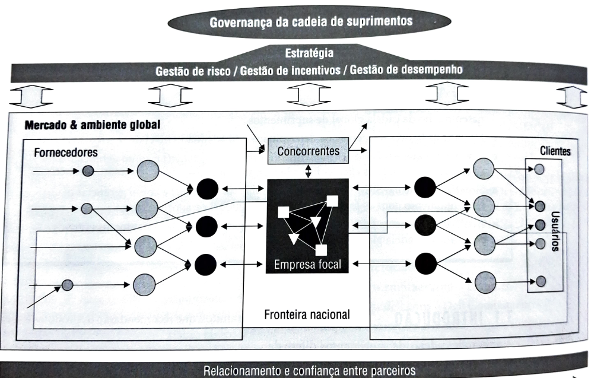
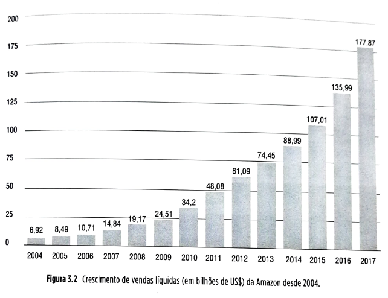
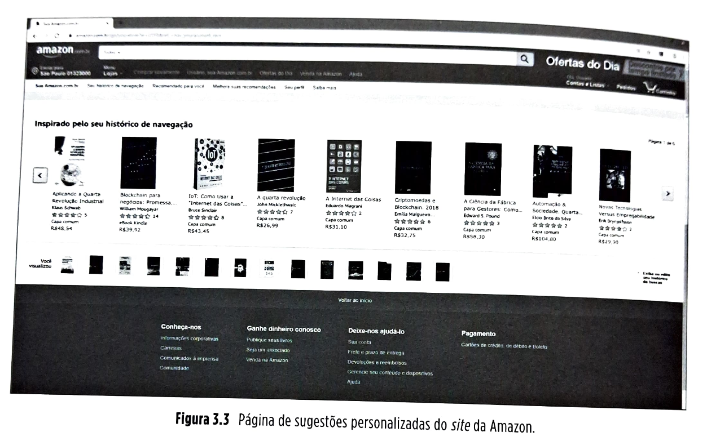
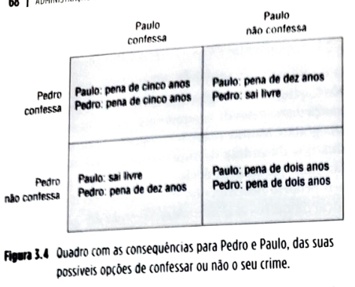

# Capítulo 3 Gestão dos relacionamentos na cadeia global de suprimentos

## Página 63

### 0BJETIVOS DE APRENDIZAGEM

📌 Explicar a influência do nível de confiança que se estabelece entre parceiros no desempenho da cadeia global de suprimentos.

📌 Discutir os fatores influentes na determinação do adequado nível de serviço ao cliente.

📌 Sintetizar o que é o CRM (customer relationship management) e como gerenciar o relacionamento com os clientes na cadeia de suprimentos.

📌 Sintetizar o que é o SRM (supplier relationship management) e como gerenciar o relacionamento com os fornecedores na cadeia global de suprimentos.

📌 Analisar os aspectos éticos mais relevantes na gestão dos relacionamentos entre os parceiros da cadeia global de suprimentos.

### 3.1 INTRODUÇÃO

A gestão de cadeias de suprimentos difere da gestão de operações tradicional porque inclui em suas análises várias unidades operativas e interações entre elas. Essas interações ocorrem em vários níveis: materiais são trocados (na forma de fluxos diretos de vendas e reversos de devoluções), informações são trocadas (em ambos os sentidos, direto e reverso) e fluxos financeiros são trocados (também em ambos os sentidos).

É por intermédio destas trocas, por exemplo, que importantes informações sobre o que o cliente necessita/deseja serão capturadas pelos gestores da cadeia de suprimentos para que recursos e processos sejam definidos e gerenciados a fim de que os clientes atinjam níveis de satisfação que os transformam em clientes fiéis e retidos, e, muitas vezes, em propagandistas gratuitos, que recomendarão os produtos e serviços da cadeia.

Também é por meio destas trocas de informações que a empresa pode se beneficiar de desenvolvimentos tecnológicos recentes dos itens disponibilizados pelos fornecedores, incorporando-os, antes da concorrência, aos seus produtos. Além disso, pelo menos tão importante quanto estas trocas é o relacionamento que se estabelece entre parceiros da cadeia de suprimentos.

## Página 64

Esse relacionamento tem aspectos mais objetivos, como os contratos e os acordos de nível de serviço que os regulam, e aspectos mais subjetivos, mas nem por isso menos importantes, que são, por exemplo, os níveis de confiança entre os parceiros. Este capítulo trata dos relacionamentos entre parceiros da cadeia de suprimentos e da sua gestão, procurando responder às seguintes perguntas:

❓ Qual a influência do nível de confiança que se estabelece entre parceiros no desempenho da cadeia global de suprimentos?

❓ Quais os fatores influentes na determinação do adequado nível de serviço ao cliente?

❓ O que é CRM (*customer relationship management*) e como gerenciar o relacionamento com os clientes na cadeia de suprimentos?

❓ O que é o SRM (*supplier relationship management*) e como gerenciar o relacionamento com os fornecedores na cadeia global de suprimentos?
❓ Quais são aspectos óticos mais relevantes na gestão dos relacionamentos entre os parceiros da cadeia global de suprimentos?

A Figura 3.1 localiza a gestão dos relacionamentos com os parceiros e do nível de serviços da cadeia global de suprimentos no quadro de referência geral usado neste livro.

## Página 65

### Relacionamento com clientes na Amazon, um dos maiores varejistas on-line do mundo

A Amazon é um dos maiores varejistas on-line do mundo, com vendas líquidas de mais de US$ 177,9 bilhões em 2017, com impressionante crescimento desde 2004, como pode ser visto na Figura 3.2.

Figura 3.2 Crescimento de vendas líquidas (em bilhões de US$) da Amazon desde 2004.

**Histórico**

O fundador da Amazon, Jeff Bezos, graduou-se na Universidade Princeton, nos Estados Unidos, em Ciências da Computação e Engenharia Elétrica. Intrigado com o surgimento da Internet, particularmente a *world wide web*, e buscando oportunidades de negócio, em 1993, Bezos passou a investigar categorias de produtos com maior vocação para comercialização *on-line*, passando a se concentrar na categoria *“livros”*. Esta tinha algumas características que poderiam tornar a venda *on-line* mais atraente que a venda no varejo tradicional, entre elas, uma vastíssima quantidade de títulos, o que possibilitaria a um varejista *on-line* ofertar ao cliente uma seleção muito mais ampla que uma livraria convencional. Bezos acreditava que uma mais ampla oferta poderia ser uma fonte de vantagem competitiva importante nesse mercado.

A empresa iniciou sua operação em julho de 1995 anunciando-se como *“a maior livraria do mundo”*, com uma seleção inicial de um milhão de livros, rapidamente crescendo para 2,5 milhões. Sessenta por cento dos seus produtos mais vendidos eram comprados de um grande fornecedor, o distribuidor Ingram Book Distributors, e os demais 40% adquiridos de vários editores e distribuidores.

A Amazon nessa época mantinha poucos produtos em estoque, com pouca necessidade de armazéns e capital de giro. Em 1997, a empresa já vendia US$ 16 milhões por ano em livros e tinha uma base de 340 mil clientes, com 80 mil visitas diárias a seu site. Com base no sucesso inicial em vendas (embora ainda deficitária), abriu seu capital em 1997. Em 1998, expandiu seu negócio passando a vender música (CDs) além de livros; em meses, tornou-se a maior varejista *on-line* de música do mundo. Em novembro de 1998, entrou no negócio de vídeos/DVDs. Para todas as categorias de produtos, então, a Amazon tinha a faixa completa de atividades: compras, vendas, armazenagem, despacho e serviço ao cliente.

## Página 66

Ao longo de 1999 e 2000, com a *internet* ganhando força, a empresa, agora avaliada em US$ 17 bilhões, continuou a ampliar sua oferta de produtos, passando a incluir brinquedos, produtos eletrônicos, ferramentas, *softwares*, produtos para jardinagem, casa e cozinha, além de telefones celulares. Começou também a expandir-se internacionalmente, com a inauguração de instalações dedicadas na Inglaterra, Alemanha, Japão e outros países.

Na preparação para as vendas do Natal de 1999, decidiu investir mais pesadamente em armazéns a fim de aumentar sua capacidade de atendimento de pedidos. A empresa estabeleceu cinco grandes armazéns próprios para estocagem e distribuição e vários centros de despacho a clientes nos Estados Unidos. Em 2016, a Amazon tinha 103 grandes armazéns e 61 centros de separação e despacho de produtos.

**Tecnologia a serviço do relacionamento com o cliente**

Ao longo da sua evolução, um dos esforços mais relevantes da empresa foi relacionados à tecnologia de suporte aos seus negócios: integração do *software* que gerencia seu *website*, sua unidade de atendimento ao cliente, seus sistemas de pagamento e segurança contra fraude e suas operações de armazém. A Amazon realizou várias inovações na gestão da experiência do cliente em compras pela *internet*. Estas incluem *one-click buying*, que consiste em clientes pré-cadastrados poderem realizar a compra de produtos com apenas um clique (melhorando a experiência de compra do cliente, mas também facilitando a compra por impulso), e o uso de *tabs* (ou rótulos virtuais que levam a várias páginas, como num arquivo suspenso tradicional) que facilitam a navegação do cliente pelo site. 

A empresa foi também uma das pioneiras na customização em massa em *websites* comerciais: os clientes são saudados pelo nome quando entram, recebem ofertas de sugestões personalizadas de produtos com base em seus históricos de compras, e estimativas de interesse baseadas em outros clientes com perfil de compras similar (veja a Figura 3.3). Oferece também promoções personalizadas.

Além disso, a tecnologia da Amazon armazena uma enorme quantidade de informação sobre os clientes: endereços, cartões de crédito, destinatários de presentes, preferências de pagamentos, histórico de páginas visitadas, histórico completo de transações, opiniões, avaliações feitas sobre o nível de serviço recebido, entre muitas outras. Estas características da tecnologia da Amazon tornam mais fácil a experiência de compra do cliente, aumentando o custo de troca do fornecedor pelo cliente e, portanto, sua retenção. Permitem também que a empresa seja ativa em seus esforços de *marketing* e mantenha comunicação mais eficaz com o cliente em questões relativas a serviço e vendas, mantendo informações completas e detalhadas sobre pedidos em aberto e seus *status*. 

Finalmente, a tecnologia permite também acompanhar com maior perfeição as preferências e expectativas dos diferentes clientes, o que possibilita à Amazon segmentá-los para servi-los de forma mais próxima às suas expectativas por meio de um melhor e mais focalizado gerenciamento da sua cadeia de suprimentos.

## Página 67

### 3.2 CONCEITOS

#### 3.2.1 Fundamentos da gestão do relacionamento com parceiros da cadeia de suprimentos

No Capítulo 1, foram discutidos alguns aspectos da governança das cadeias de suprimentos que às vezes dificultam sua gestão. Muitas vezes, comportamentos oportunistas dos nós da cadeia de suprimentos predominam, o que faz com que tomem decisões de forma a maximizar seu próprio desempenho local à custa do desempenho local de outros nós da cadeia, levando ao que se chama de relações ganha-perde, ou de “soma-zero”. Foi discutido também que, muitas vezes, esses comportamentos oportunistas levam os parceiros da cadeia a não compartilharem informações. Isso faz aumentar os custos gerais dos nós da cadeia, pois, com menos informação compartilhada, os parceiros acabam trabalhando com maior nível de incerteza, o que sempre leva a operações e desempenhos menos eficientes.

Outra causa de resultados indesejáveis por comportamento oportunista se refere à falta de um aspecto essencial do relacionamento entre parceiros da cadeia: confiança. Isso pode ser ilustrado por um efeito comumente chamado de “dilema do prisioneiro”, discutido a seguir.

**Confiança nos relacionamentos entre parceiros e o dilema do prisioneiro**

Imagine que dois indivíduos, Pedro e Paulo, de passado não exatamente honesto, encontram-se pela primeira vez em um bar. Entre uma tacada e outra, em volta da mesa de bilhar, depois de alguns copos de cerveja, resolvem traçar um plano para um furto a uma empresa localizada nas proximidades. Perpetrado o crime naquela noite, cada um vai para sua casa. No dia seguinte, são presos pela polícia, que aparentemente teria achado evidências (circunstanciais) de que ambos teriam estado nas dependências da empresa roubada na noite anterior.

Seguindo procedimento padrão, a polícia conduz ambos separadamente, sem permitir comunicação entre eles, a salas diferentes de interrogatório. Lá, começam a ser interrogados por dois investigadores diferentes. Os dois suspeitos, com experiência do sistema penal local para crimes que envolvem cumplicidade, sabem perfeitamente as opções que têm e os resultados dessas opções. As opções de Pedro e Paulo têm só basicamente duas: confessar ou não confessar o crime de roubo.

Pedro começa a analisar, racionalmente, o que deve fazer (confessar ou não), e para isso analisa o quadro da Figura 3.4, que traz as consequências possíveis das suas duas opções.

## Página 68

## Página 69

## Página 70

## Página 71

## Página 72

## Página 73

## Página 74

## Página 75

## Página 76

## Página 77

## Página 78

## Página 79

## Página 80
