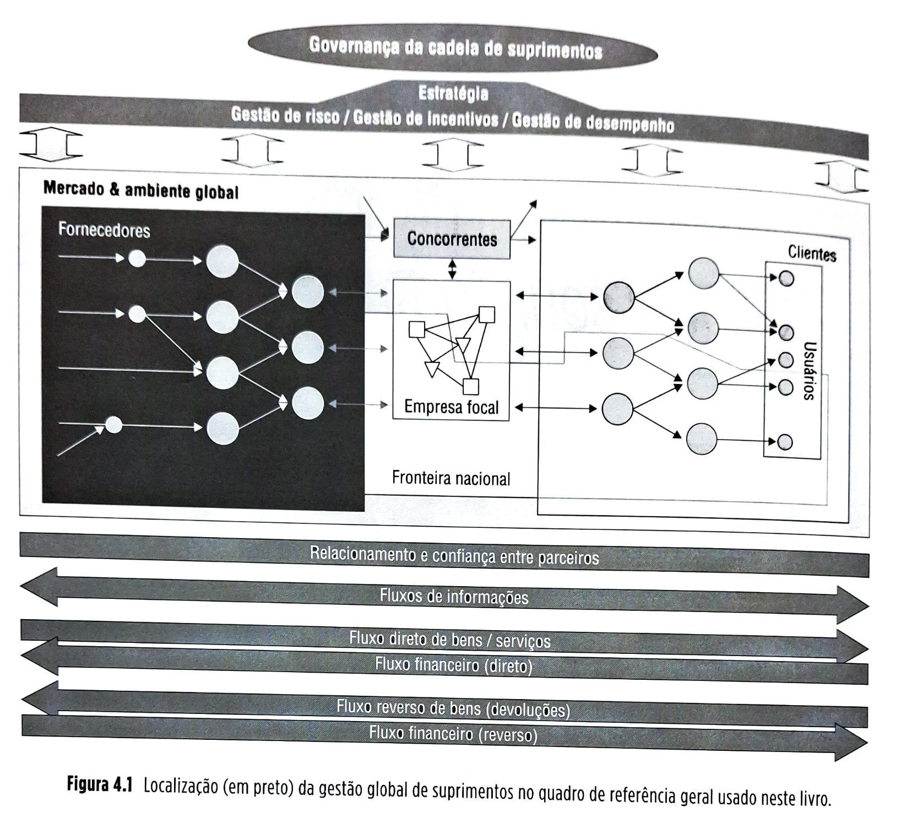
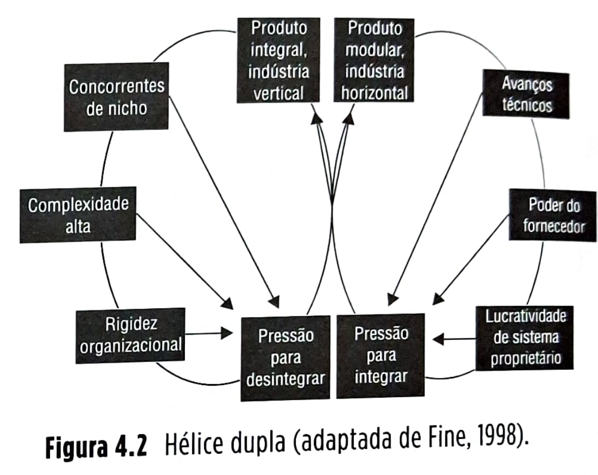
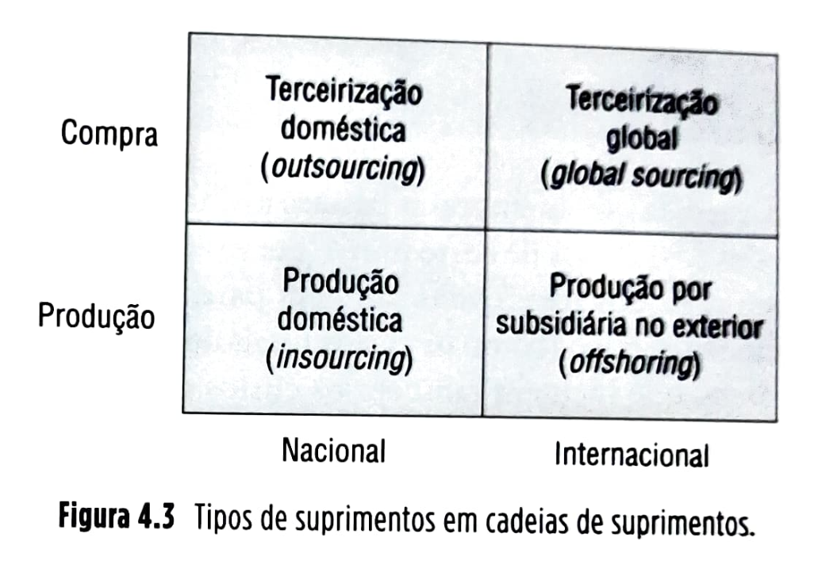
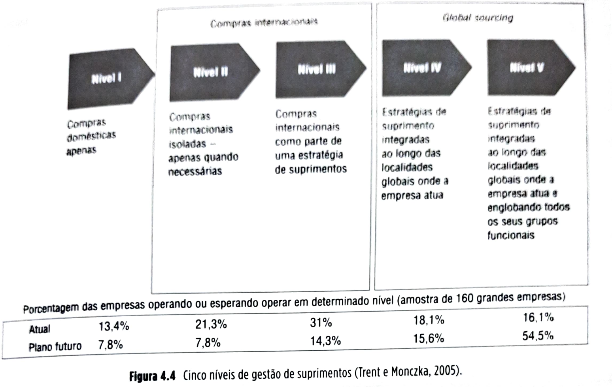
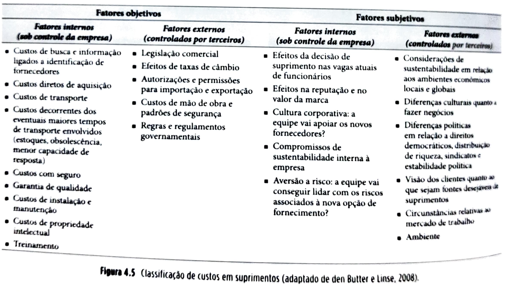
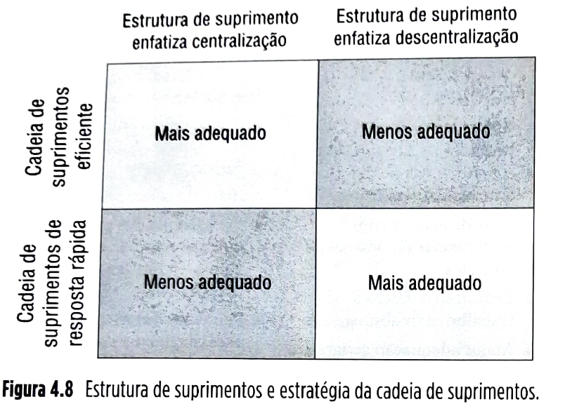
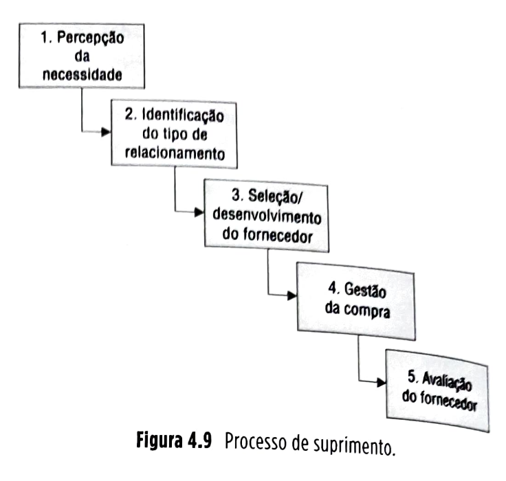

# Capítulo 4 Gestão global de suprimentos (global sourcing)

## Página 93

### 0BJETIVOS DE APRENDIZAGEM

📌 Sintetizar as vantagens e os desafios enfrentados por uma empresa ao deixar de buscar seus suprimentos domesticamente para buscá-los globalmente.

📌  Explicar como se estrutura o setor de suprimentos dentro das organizações.

📌  Entender como selecionar fornecedores e avaliar seu desempenho numa escala global.

📌  Conhecer as vantagens comparativas atuais dos diversos países quando decisões de terceirização global são tomadas.

📌  Discutir as potenciais implicações éticas, de responsabilidade social e de sustentabilidade das decisões sobre gestão global de suprimentos.

### 4.1 INTRODUÇÃO

Pode-se afirmar que “gestão global de suprimentos” e “gestão de suprimentos” são, hoje, termos praticamente sinônimos, já que há algum tempo, com a redução ou queda das barreiras alfandegárias, as empresas não respeitam mais limites territoriais ou nacionais para buscar seus suprimentos ou comercializar seus produtos.

A gestão global de suprimentos é um tema cada vez mais importante para as empresas. Com a noção estabelecida de que cada empresa deveria se concentrar apenas nas atividades que exploram suas competências centrais e terceirizar o restante (sempre que isso trouxer vantagens em custo ou desempenho; ver Capítulo 2), além de a rápida evolução tecnológica fazer com que o escopo das competências centrais fique cada vez menor, a tendência parece ser que as empresas trabalhem cada vez com maior nível de terceirização – daí a importância crescente da gestão de suprimentos dentro das organizações. Hoje considera-se que os custos de materiais como percentagem das vendas estão numa faixa de 45 a 60% para empresas de manufatura (Lambert, 2006).

A Figura 4.1 ilustra, no quadro geral de referência deste livro, onde se localiza a gestão global de suprimentos.

## Página 94

 

Figura 4.1 Localização (em preto) da gestão global de suprimentos no quadro de referência geral usado neste livro.

### IBM Brasil e a transformação da *Big Blue*

Quando Rogério Oliveira percorre o enorme centro de serviços da IBM em Hortolândia, no estado de São Paulo, o contraste entre a velha e a nova IBM parece absoluto. O que um dia foi uma fábrica de grandes computadores (*mainframes*) agora é um galpão cheio de funcionários brasileiros, num tipo diferente de linha de produção. O produto que esses funcionários criam é **informação**, e eles ocupam centenas de cubículos que se estendem por uma área equivalente à de um campo de futebol, sob um teto com estrutura metálica. Anteriormente, o serviço prestado aqui era apenas para clientes brasileiros. Hoje, os cerca de 100 clientes dos serviços dessa unidade, que variam da programação e codificação de *softwares* à contabilidade, são de 40 países, incluindo Canadá, México, África do Sul e Estados Unidos. Oliveira, um veterano da IBM de 35 anos e gerente geral para a América Latina, está no centro do esforço da empresa a fim de se transformar no que chama de **empreendimento integrado global**. A IBM tem discutido essa nova visão já há alguns anos. Entretanto, apenas recentemente executivos como Oliveira conseguiram transformar essa visão num modelo de negócio prático e lucrativo.

Esta não é a IBM do século XX, quando a empresa representava a definição do conceito de multinacional. Naquele tempo, suas subsidiárias em 160 países se comportavam como “mini-IBMs”, essencialmente servindo mercados e clientes locais em operações isoladas. Isso, entretanto, tornou-se muito caro para a empresa, que hoje se organiza em torno do princípio de que os serviços serão executados onde o trabalho puder ser mais bem feito, com aproveitamento dos talentos certos pelo preço certo, estejam onde estiverem, ao redor do mundo. Esta filosofia mudou muito a forma de a IBM fazer negócios. Nos últimos anos, a empresa contratou aproximadamente 90 mil pessoas em países de custo de mão de obra mais baixo, como Brasil, China e Índia. Essas pessoas, trabalhando em centros de serviços globais, prestam uma larga faixa de serviços aos seus clientes: além de produção de *softwares*, também oferecem *datacenters*, *call centers* e gerenciamento de benefícios de funcionários. Inicialmente, mão de obra barata era a principal motivação para essa transformação, com salários na Índia na faixa de 70% a 80% mais baixos do que nos Estados Unidos. Hoje, entretanto, o uso de talento disponível — e de novas ideias — em países emergentes como Brasil, Índia e China é considerado igualmente importante. Hoje, esses centros de serviços são responsáveis por **50% do faturamento global da IBM**.

## Página 95

No centro de Hortolândia, ao andar pelos corredores, é possível ouvir interações em inglês, francês, português e espanhol, pois os clientes que recebem os serviços lá prestados são empresas localizadas em numerosos países ao redor do mundo. Esta é a nova realidade chamada **global sourcing** (terceirização global). As empresas compram serviços, materiais e produtos de fornecedores, onde quer que estes estejam no globo, desde que apresentem os níveis adequados de qualidade, preço e entrega.

A descrição do centro de serviços globais da IBM ilustra o que parece ser uma tendência inevitável: as fronteiras nacionais gradualmente deixarem de significar barreiras às empresas que buscam excelência na gestão de suas cadeias de suprimentos, quando da busca de seus fornecedores, seja de itens físicos ou de serviços. A transição, entretanto, da busca de fontes de suprimentos apenas domesticamente para a adoção do chamado *global sourcing* (gerenciamento de compras e suprimentos numa escala totalmente global, ou, como será referido neste capítulo, terceirização global), embora claramente seja vantajosa do ponto de vista competitivo, não é simples, como será discutido adiante.

| ⚠️**Conceito-chave**⚠️{bg=verde}|
|----------------|
|A gestão global de suprimentos (*global sourcing*) se refere à prática de identificar oportunidades e buscar os insumos necessários à produção de bens ou serviços onde houver melhores condições de custos, qualidade e entrega, seja dentro ou fora do país de origem da organização.|

| 🔵**SAIBA MAIS**{bg=azul}|
|----------------|
|Terceirização não é um fenômeno recente: já em meados do século XIX, fabricantes de produtos complexos (para a época), como máquinas de costura, em razão da dificuldade de se manterem atualizados nas várias tecnologias envolvidas, utilizavam pequenas oficinas de terceiros, especializadas em determinados processos ou materiais, como fornecedoras de componentes. Passando à atualidade, quando se observam situações extremas de terceirização, como aquela ilustrada no caso da VW Resende (ver estudo de caso do Capítulo 3), no qual uma montadora de caminhões terceiriza 100% dos componentes dos seus produtos, ou a tendência geral de as empresas terceirizarem mais de suas atividades, é difícil lembrar que a indústria automobilística, por boa parte do século XX, trabalhou de forma muito verticalmente integrada — por exemplo, nos anos 1920, a Ford produzia praticamente 100% de todos os componentes dos seus carros, incluindo os pneus, os vidros e o aço; e a General Motors, até os anos 1990, mais de 70%, inclusive mantendo seus próprios tapeceiros para produzir os assentos dos seus carros. Hoje, de fato, a tendência parece ser a de que as empresas se restrinjam a executar atividades que utilizem suas competências centrais — e fontes de vantagens competitivas mais sustentáveis (ver Capítulo 2) — e terceirizem o restante. Alguns autores, como Fine (1998), entretanto, creem que a tendência não seja de mão única, mas que as empresas ciclicamente alternem suas estratégias entre mais verticalmente integradas e mais verticalmente desintegradas.  Em um de seus exemplos mais ilustrativos, Fine cita a IBM e sua decisão — tomada no início dos anos 1980, sob a pressão de quem necessitava frear o crescimento da Apple Computers no mercado de microcomputadores – de terceirizar os chips processadores de seus computadores pessoais para a Intel e os sistemas operacionais para a Microsoft. Nesse momento, a estratégia de negócio selecionada foi embasada em um projeto modular do produto, de modo a facilitar o fornecimento de componentes por empresas externas (terceiros), com intuito de manter os custos baixos e permitir uma entrada rápida no mercado. Esta estratégia foi uma radical alteração, tendo em vista a tradição da IBM de fazer tudo “em casa”, desde o desenvolvimento e manufatura do produto até sua distribuição e manutenção. Em outras palavras, a empresa migrou de um conjunto de decisões de “make or buy” (fazer ou terceirizar) em que predominava o “fazer” (integração vertical) para um em que predominaria o “comprar” (terceirização).  Entre 1975 e 1985, a IBM praticamente era sinônimo de indústria de computadores, uma das maiores corporações americanas. Em poucos anos, apesar de continuar lucrativa e influente quanto aos padrões da indústria de computadores pessoais, perdeu sua dominância. Empresas como Intel e Microsoft obtiveram retornos financeiros muito maiores, além de conseguir identidade junto ao consumidor final, “que se importa mais com os logotipos dos fornecedores – Intel Inside e Windows – do que com o nome da empresa que monta os componentes (Lenovo, Acer, Dell ou HP)” (Fine, 1998, p. 8). Desse modo, as mudanças implementadas pela IBM resultaram em uma alteração das forças na cadeia de suprimentos, juntamente com as recompensas financeiras, numa tendência de terceirização.  Mas a história não acaba aí. Segundo Fine (*op. cit.*), a estrutura das organizações é na verdade instável e varia ciclicamente ao longo do tempo, percorrendo um movimento assemelhado a uma hélice dupla (numa referência à estrutura do DNA presente nas células dos organismos), que tenta ilustrar os movimentos alternados entre verticalização e horizontalização das organizações.  O ciclo dinâmico da hélice dupla está ilustrado na Figura 4.2, descrevendo a instabilidade e as forças atuantes. Quando a estrutura da indústria é vertical e a arquitetura do produto é integral (com pouca intercambiabilidade de componentes entre produtos concorrentes), as forças de desintegração pressionam para uma configuração horizontal e modular. Essas forças incluem:  a) a inevitável entrada de concorrentes especializados em nichos, atuantes em subsegmentos da indústria; b) o desafio de se manter à frente da concorrência nas várias dimensões de tecnologia e mercados requeridos por um sistema integral; e c) a rigidez organizacional e burocrática que frequentemente se estabelecem em grandes organizações.  Essas forças enfraquecem as empresas verticalizadas (que fazem tudo internamente) e exercem pressão em direção à desintegração, tornando as estruturas mais horizontais e modulares. A IBM teve todas essas forças agindo contra ela na década de 1980: pressão constante de novos ingressantes no mercado, particularmente especializados em nichos como software e periféricos; concorrentes que tomaram a dianteira em alguns segmentos tecnológicos, como a Intel com os processadores; e os crescentes níveis de burocracia enquanto a IBM se expandia, atingindo quase meio milhão de funcionários nos anos 1980. Segundo o autor, a indústria de computadores mostra que, uma vez disparado o processo de horizontalização e modularização, a partir da iniciativa da própria IBM, não existe fatia de mercado, avanço tecnológico, força financeira ou superioridade do produto que possa resistir à onda de novos ingressantes no mercado.    Por outro lado, ainda segundo Fine (*op. cit.*), quando uma indústria apresenta uma estrutura horizontal, um outro conjunto de forças a empurraria para uma integração vertical e, por conseguinte, uma arquitetura integrada de produto:  a) avanços técnicos em um subsistema podem torná-lo escasso e valioso na cadeia de suprimentos, dando poder de mercado ao seu proprietário; b) poder de mercado em um subsistema encoraja o agrupamento com outros subsistemas, de modo a aumentar o controle e adicionar maior valor; e c) poder de mercado em um subsistema encoraja a engenharia a integrá-lo a outros subsistemas, de modo a desenvolver soluções proprietárias integrais.  A Intel é um exemplo desse movimento: iniciou o seu negócio extremamente horizontalizada, centralizando-se no projeto e fabricação de um único produto, microprocessadores. Atualmente, a empresa engloba outros negócios, integrando atividades relacionadas a outros componentes que, juntos, formam a placa principal dos computadores. A empresa não entrega apenas os microprocessadores a montadoras de computador como a HP e a Dell; ela entrega a placa principal do computador completa, ou seja, entrou em uma atividade que anteriormente era efetuada pelas montadoras de computador. A Intel, portanto, passa a ser mais integrada verticalmente.  Outro exemplo de incursão em outras atividades é a Microsoft, que, após dominar os sistemas operacionais, começou a atuar em aplicativos, cadeias de serviços e desenvolvimento e entrega de multimídia.  Nesse sentido, a indústria de computadores já estaria completando quase que um ciclo completo no modelo de hélice dupla. Iniciou-se com uma indústria altamente centralizada, a exemplo da IBM; passou a uma descentralização intensa; e está voltando a ser centralizada a partir de seus fornecedores com maior poder de mercado.  Competências individuais da empresa que são determinantes em um momento podem rapidamente se tornar comuns em um momento seguinte, dominadas por toda a concorrência ou suplementadas por novas tecnologias ou novos modelos de negócios de domínio dos concorrentes. A empresa deve desenvolver a habilidade constante de prever as mudanças e escolher quais competências serão de maior valor no futuro, de modo a construí-las ou desenvolvê-las internamente.|

| ❓**Para refletir**❓{bg=vermelho}|
|----------------|
|Embora aparentemente haja uma tendência de as empresas terceirizarem crescentemente a produção de seus insumos, a fim de se concentrarem nas atividades que explorem suas competências centrais, alguns autores consideram que as “tendências” são apenas partes de ciclos mais longos que alternam mais terceirização com mais integração vertical.|

## Página 97

### 4.2 CONCEITOS**

#### 4.2.1 Tipos de suprimentos

As empresas necessitam de insumos (bens físicos e serviços) para operar. Podem ser providos internamente pela própria organização ou adquiridos de terceiros, conforme discutido no Capítulo 2. Esses insumos podem, ainda, ser fornecidos domesticamente (vindos do mesmo país da empresa usuária) ou internacionalmente (vindos do exterior). Esta classificação simples aqui adotada define uma matriz de tipos de insumos, ilustrada na Figura 4.3.

**Texto convertido:**

**Figura 4.3 – Tipos de suprimentos em cadeias de suprimentos.**

**Produção doméstica (*insourcing*)**

Ocorre quando a empresa decide produzir ela mesma o suprimento necessário, a partir de uma unidade produtiva localizada em seu próprio país. Um exemplo é a Embraer, que produz os anéis da fuselagem de seus jatos comerciais em sua fábrica em São José dos Campos. A opção de produção doméstica não será explorada em detalhes neste livro, por ser o objeto de estudo da área de gestão de operações tradicional. Para um tratamento detalhado, veja Corrêa e Corrêa (2017).

**Produção por subsidiária no exterior (*offshoring*)**

Ocorre nos casos em que a empresa decide produzir ela mesma o suprimento, mas o faz a partir de uma subsidiária sua no exterior. Um exemplo é a Tramontina, grande empresa brasileira produtora de produtos de cutelaria e utensílios domésticos, que em 2005 estabeleceu fábrica nos Estados Unidos, na cidade de Manitowoc, estado de Wisconsin. O Capítulo 7 discutirá essa opção no contexto do projeto e gestão da cadeia de operações logísticas.

**Terceirização doméstica (*outsourcing*)**

Ocorre nos casos em que o suprimento é obtido de uma empresa terceira localizada no mesmo país do cliente. Um exemplo é o fornecimento de chapas de aço pela CSN, consumidas pelas montadoras localizadas no Brasil. Ao longo das últimas três décadas, o papel do setor de suprimentos, a cargo de gerenciar os insumos terceirizados dentro das organizações, tem se tornado mais importante, conforme discutido na abertura deste capítulo.

|💡**Fique atento**💡{bg=amarelo}|
|----------------|
|Se antes o setor de suprimentos das empresas se ocupava simplesmente da negociação e compra estrita de bens físicos e serviços, hoje envolve o gerenciamento integrado de um conjunto de funções gerenciais que vão desde aquelas operacionais, como o acompanhamento de contratos e entregas, até as mais estratégicas, como a identificação, escolha e desenvolvimento de fornecedores e de parcerias estratégicas.|

À medida que as empresas passam a olhar não apenas para os seus custos de curto prazo (por exemplo, o preço de compra dos itens), mas também para os custos de prazo mais longo (como os custos totais de propriedade do item, que incluem também os custos de aquisição, operação, instalação, manutenção, consumo de energia, descarte, entre outros, além do preço pago em si), o escopo do setor de suprimentos é igualmente expandido. A necessidade de colocar a função de suprimentos num contexto estratégico mais amplo é ainda mais importante na era atual de intensa globalização, abrindo enormes oportunidades e também riscos correspondentes à terceirização global, discutida a seguir.

### 4.2.2 Terceirização global (*global sourcing*)

Ocorre quando o suprimento é obtido de uma empresa terceira localizada fora do país do cliente. Um exemplo é o suprimento de circuitos integrados de processadores da Intel, feito a partir de suas fábricas em locais como a Costa Rica, por exemplo, para a fábrica de computadores da Dell no Rio Grande do Sul. Terceirização global leva a ligação entre suprimentos e estratégia a um patamar ainda mais alto. Importantes decisões sobre de onde, ao redor do mundo, comprar, sob que condições e de qual fornecedor, ganham importância, não só pelo volume de custos envolvido, mas também pelo evidente impacto estratégico que essas decisões podem incorrer na competitividade da empresa.

| 🔵**SAIBA MAIS**{bg=azul}|
|----------------|
|**International purchasing (compras internacionais) vs. global sourcing (suprimentos globais)**  Trent e Monczka (2005) diferenciam os termos *international purchasing* (compras internacionais) e *global sourcing* (suprimentos globais). Segundo os autores, compras internacionais abrangem meramente transações comerciais entre compradores e fornecedores localizados em diferentes países. Suprimentos globais, por outro lado, envolvem a integração e coordenação entre itens, materiais, processos, tecnologias, projetos e fornecedores ao longo de todos os locais onde se fazem projetos, compras, produção e operações dentro de uma corporação.  O interessante, segundo os autores, é que, em uma pesquisa envolvendo centenas de organizações da lista das maiores 500 empresas da revista *Fortune*, aquelas que praticam “suprimentos globais”, em comparação com as que praticam meramente “compras internacionais”: ▪️são maiores e tendem a ter concorrentes multirregionais ou multinacionais — ou seja, competem em mercados mais sofisticados; ▪️têm processos de gestão estratégica implantados em estágios mais avançados; ▪️percebem mais oportunidades de melhoramento e reduções de custo como resultados das suas atividades de gestão de suprimentos; ▪️indicam que o desenvolvimento de estratégias globais é mais presente e mais avançado no seu corpo gerencial; ▪️demonstram maior capacidade de lidar com mudanças rápidas nas tecnologias de produto e processo; ▪️promovem maiores e mais variados benefícios, por exemplo, aprendizado, redução de custos, inovação e qualidade; ▪️avaliam que aspectos-chave dos seus processos de suprimentos têm desempenho mais similar entre diferentes unidades de compra e diferentes regiões onde atuam; ▪️contam com uma maior variedade de ferramentas e meios de comunicação para suportar seus esforços de suprimentos globais.  Trent e Monczka (2005) propõem um processo de evolução dos setores de suprimentos das organizações de cinco estágios, ilustrado na Figura 4.4.    Não necessariamente todas as empresas deveriam visar a atingir o estágio V, ou mesmo o estágio IV. Por exemplo, uma empresa que contém apenas uma unidade operativa com apenas uma unidade de compras terá como objetivo maior chegar ao estágio III, porque os estágios IV e V simplesmente não fazem sentido para ela. Entretanto, para as empresas que almejam evoluir nos estágios de suprimentos, são os seguintes os requisitos recomendados pelos autores:  **a) Comprometimento da alta direção com “suprimentos globais”.** O estágio de suprimentos globais dificilmente será atingido sem um alto executivo capaz e disposto a transformar uma visão estratégica em prática de negócios. Esse indivíduo deve ser o elo entre a iniciativa de suprimentos globais e um comitê diretivo de alto escalão responsável por direcionar e redirecionar a iniciativa.  **b) Processos rigorosos e bem definidos.** Desenvolver um processo de suprimento global bem definido e implantado acelera o aprendizado dos participantes, incorpora “melhores práticas” e conhecimento que aumentam as chances de sucesso, além de auxiliar a diminuir diferenças de práticas entre unidades de compras, alinhando-as aos objetivos corporativos.  **c) Disponibilidade dos recursos necessários.** Os recursos mais importantes normalmente são o acesso a pessoal qualificado, orçamento específico, tempo e apoio de outros membros da organização externos ao processo de suprimento. As empresas líderes em práticas de suprimentos globais reconhecem a importância da disponibilidade desses recursos e os providenciam mesmo antes das iniciativas de suprimentos globais terem início.  **d) Integração por intermédio da tecnologia da informação.** Embora aparentemente seja óbvio que dados acessíveis sejam essenciais para análises de suprimentos em escala global, a fim de, por exemplo, agregar globalmente requisitos comuns, muitas empresas ainda sofrem com múltiplos sistemas de compras não integrados, codificação de itens não padronizada etc. Bases de dados com informação rica sobre fornecedores e bases de dados globais de contratos são alguns dos recursos com os quais as empresas líderes em suprimentos globais contam.  **e) Desenho organizacional que apoie a iniciativa de suprimentos globais.** Desenho organizacional se refere à escolha da estrutura organizacional, divisão de trabalho, linhas de comunicação, autoridade, responsabilidade, coordenação e controle necessários a atingir os objetivos da organização. Empresas líderes em suprimentos globais, além de contarem com um líder e um comitê diretivo de peso, colocam grande ênfase no trabalho de equipes multifuncionais para analisar e propor as estratégias de suprimentos.|

## Página 100

|💡**Fique atento**💡{bg=amarelo}|
|----------------|
|Há vários estágios evolutivos em que as empresas podem se localizar em relação a seus esforços de terceirização global. Empresas que apresentam práticas que as colocam em estágios mais avançados tendem a ter desempenho competitivo superior.|

**Dificuldades e desafios do *global sourcing***

Quando começam a lidar com fornecedores globais, os gestores encontram várias dificuldades, por exemplo, consideráveis custos adicionais, quando comparados ao trato com apenas fornecedores domésticos.

|💡**Fique atento**💡{bg=amarelo}|
|----------------|
|Em gestão global de suprimentos, é importante que os custos totais de compras (ou os custos totais de propriedade) sejam considerados nos processos de análise e seleção, e não apenas o preço de compra.|

Com intuito de auxiliar a identificar os custos envolvidos com compras em um mundo globalizado, os Butner e Linse (2008) chamam a atenção para o fato de que alguns fatores direcionadores de custos são objetivos e outros são subjetivos. Os dois tipos, entretanto, devem ser considerados, pois ambos contribuem para os custos de realizar uma transação (veja a tabela da Figura 4.5).

Fica claro que, se a tomada de decisões de suprimentos agora não deve mais “respeitar” fronteiras nacionais, com o crescimento da terceirização global, as decisões se tornam muito mais complexas, envolvendo um número muito maior de variáveis, oportunidades e riscos que devem ser gerenciados de forma correspondente. A próxima seção discute as formas de estruturação organizacional do(s) setor(es) de suprimentos nas empresas.

## Página 101

### 4.2.3 Estrutura organizacional para suprimentos

Há basicamente três modalidades de estruturação da função de suprimentos nas organizações: estrutura centralizada, descentralizada e híbrida (Leenders e Johnson, 2000).

▪️**estrutura centralizada**: os suprimentos, para todas as subunidades operacionais (fábricas, divisões, departamentos) da empresa, são controlados por uma estrutura centralizada corporativa;
▪️**estrutura descentralizada**: as subunidades organizacionais da empresa são autônomas para tomar suas decisões de suprimentos; e
▪️**estrutura híbrida**: suprimentos são compartilhados entre o escritório corporativo central e as subunidades operacionais.

A literatura indica uma tendência de as organizações atuarem de forma híbrida; no entanto, o fator mais importante determinante do tipo de estrutura deve ser a coerência com a estrutura organizacional geral da empresa. Embora a tendência aponte para estruturas híbridas, há um contínuo de estruturas híbridas possíveis, desde uma estrutura híbrida com mais ênfase em centralização, passando por estruturas mais equilibradas entre centralizada e descentralizada, até uma estrutura híbrida com ênfase em descentralização.

A tabela da Figura 4.6 ilustra as principais vantagens e desvantagens de estruturas mais centralizadas, e a Figura 4.7 mostra o mesmo para estruturas mais descentralizadas.

### Potenciais vantagens e desvantagens das estruturas centralizadas de suprimentos

| Vantagens | Desvantagens |
| --- | --- |
| * Maior especialização da equipe | * Especialização estreita e tédio |
| * Possibilidade de pagar por bons talentos em razão da escala | * Aparente excesso no *staff* corporativo |
| * Consolidação de requisitos e de volumes com possibilidade de consequentes economias | * Tendência a desconsiderar diferenças legítimas nos requisitos para ganhar escala |
| * Coordenação e controle de políticas e procedimentos | * Falta de reconhecimento de necessidades únicas |
| * Planejamento e pesquisa eficazes | * Foco nas necessidades da corporação e não nas necessidades das unidades operacionais |
| * Com fornecedores comuns, a empresa se beneficia de maior poder de barganha; com fornecedores maiores, a empresa se beneficia oferecendo possibilidade de economias de escala a eles, podendo ganhar vantagens nos preços de compra de insumos | * Mesmo fornecedores comuns se comportam de forma diferente conforme a região e os segmentos de mercado |
| * Proximidade dos tomadores de decisão de alto nível na organização | * Distância maior dos usuários |
| * Reconhecimento e prestígio de marca corporativa | * Tendência a criação de silos organizacionais |
| * Maior poder organizacional | * Falta de foco nas unidades operacionais de negócio |
| * Foco estratégico | * Processo de compra tende a ser mais lento e menos ágil |
| * Custos de compra mais baixos |  |

**Figura 4.6** Vantagens e desvantagens de estruturas organizacionais centralizadas de suprimentos (adaptado de Leenders e Johnson, 2000).

### Potenciais vantagens e desvantagens das estruturas descentralizadas de suprimentos

| Vantagens | Desvantagens |
| --- | --- |
| * Mais fácil comunicação/coordenação com subunidade operacional | * Mais difícil de coordenar e comunicar entre subunidades operacionais |
| * Maior velocidade de resposta | * Encoraja usuários a não planejar com antecedência |
| * Uso eficaz de fontes de suprimentos locais | * Foco operacional mais que estratégico |
| * Autonomia da subunidade operacional | * Muito foco em fontes locais de suprimentos, o que pode levar pessoal a ignorar melhores oportunidades |
| * Simplicidade das linhas de comunicação e subordinação entre usuário e suprimentos | * Pouca "massa crítica" e visibilidade organizacional para suprimentos |
| * Autoridade e responsabilidade por suprimentos não divididas entre diferentes setores | * Risco de subotimizações |
| * Mais de acordo com preferências do pessoal de compras | * Preferências das subunidades operacionais não coerentes com preferências corporativas |
| * Definição e descrição do trabalho mais abrangentes | * Pequenas diferenças excessivamente ampliadas ("nosso caso é diferente") |
| * Maior adequação geográfica, cultural, social, de língua e de moeda | * Posição organizacional tende a ser mais baixa na organização, limitando oportunidades de avanços funcionais importantes do setor de suprimentos |
|  | * Falta de padronização |
|  | * Custos mais altos de suprimentos |

**Figura 4.7** Vantagens e desvantagens de estruturas organizacionais descentralizadas de suprimentos (adaptado de Leenders e Johnson, *op. cit.*).

|💡**Fique atento**💡{bg=amarelo}|
|----------------|
|A estrutura de suprimentos nas empresas pode ser mais centralizada, mais descentralizada ou híbrida. Cada uma tem vantagens e desvantagens estratégicas bem definidas.|

É difícil generalizar nesse nível, mas, pelas características, vantagens e desvantagens já descritas, é possível identificar que estruturas com maior ênfase na centralização de suprimentos favorecem mais a obtenção de vantagens em custos, porém em geral acarretam desempenho pior em agilidade e velocidade de resposta. Estruturas com maior grau de descentralização, por outro lado, são mais ágeis e velozes nas respostas, mas normalmente levam a custos mais altos.

A partir disso, pode-se considerar que, em termos gerais, quando a cadeia de suprimentos é estrategicamente definida como uma cadeia de resposta rápida (ver Capítulo 2), estruturas organizacionais de suprimentos que tendem mais para a ênfase em descentralização são mais adequadas, e quando a cadeia de suprimentos é mais definida como uma cadeia eficiente (ver Capítulo 2), as estruturas com maior ênfase em centralização da estrutura de suprimentos são, em princípio, mais adequadas. A Figura 4.8 ilustra o conceito.

## Página 102

|💡**Fique atento**💡{bg=amarelo}|
|----------------|
|Estruturas mais descentralizadas do setor de suprimentos na organização tendem a se adequar melhor a cadeias de suprimentos de resposta rápida, enquanto estruturas mais centralizadas tendem a responder melhor às necessidades de cadeias de suprimentos eficientes.|

Esta abordagem estratégica geral para a estrutura da função de suprimentos se aplica mais diretamente a insumos produtivos. Quanto aos insumos ditos não produtivos, de utilização quase universal para quaisquer subunidades operacionais consideradas, como os materiais de limpeza, de escritório, microcomputadores, impressoras etc., normalmente as vantagens de consolidação e centralização de compras são mais evidentes. O mesmo se aplica aos materiais mais comoditizados de aplicação mais geral (como aço, alumínio, alguns químicos etc.). Já itens de aplicação específica para uma determinada subunidade seriam mais bem gerenciados de forma descentralizada.

### 4.2.4 O processo de suprimento

Ter processos bem definidos é uma característica de empresas com excelência em gestão de suprimentos globais. O processo geral de suprimento tem cinco etapas gerais descritas na Figura 4.9. O detalhamento do mapeamento dos processos em gestão de cadeias de suprimentos será tratado no Capítulo 6.

**Passo 1: Percepção da necessidade**

O processo de suprimento começa quando alguém, em alguma unidade operacional, identifica a necessidade de adquirir algum insumo. Esta identificação pode ser feita por algum sistema automatizado, como os sistemas MRP (sistemas de gestão de necessidades de materiais), mas, automatizada ou manualmente, a responsabilidade por identificar a necessidade de insumos é do usuário.

A partir daí, de forma automatizada ou manual, é gerada uma requisição de compra, que é um conjunto de informações que especifica de modo claro e inequívoco o insumo a ser adquirido, define a quantidade e a data para a qual o insumo é necessário, o setor requisitante, eventuais autorizações necessárias. O setor de suprimentos tem a responsabilidade de confirmar o entendimento das especificações em caso de dúvida e de fazer com que o fluxo de informações do requisitante para o setor de suprimentos ocorra sem demora, de maneira suave e com qualidade.

**Passo 2: Identificação do tipo de relacionamento**

Uma vez que a requisição de compra é percebida e compreendida pelo setor de suprimentos, no caso de material comprado pela primeira vez, é importante que, considerando o nível de centralidade da competência e os custos de transação envolvidos com a produção do insumo (ver Capítulo 3), o tipo de relacionamento desejado com o eventual fornecedor seja definido e esteja claro. Caso não esteja, é responsabilidade do setor de suprimentos mobilizar um comitê multifuncional que estabeleça essa definição. Definir o tipo de relacionamento é a primeira consideração necessária para nortear a seleção e o possivelmente necessário desenvolvimento do fornecedor. Os tipos básicos de relacionamento, definidos no Capítulo 3, são: mercado puro, contrato de médio prazo, contrato de longo prazo, *joint venture* e parceria estratégica.

## Página 103

**Passo 3: Seleção e desenvolvimento do fornecedor**

O processo de seleção de fornecedores varia conforme o tipo de relacionamento considerado necessário no passo 2.

▪️**Mercado puro:** o processo começa por identificar uma lista de potenciais fornecedores que tenham capacidade, capacitação tecnológica e saúde financeira para atender estritamente os requisitos técnicos e de entrega definidos pela requisição de compra. Em seguida, um processo de pedidos de cotação normalmente se segue, o que pode ser feito de forma tradicional ou utilizando ferramentas mais contemporâneas apoiadas na internet, como os leilões reversos ou o uso de portais de compra, discutidos mais adiante neste capítulo. Ao recebimento de cotações, deve se seguir uma análise de custo total de propriedade (que inclui não só o preço cotado e condições de pagamento, mas também os custos de transporte, instalação, uso, manutenção, disposição e outros) para definir, entre os fornecedores qualificados, aquele de menor custo total de propriedade.
▪️**Contrato de médio prazo:** o processo é similar ao anterior, mas o peso atribuído ao quesito “saúde financeira” é ainda maior, já que a intenção é estabelecer com o fornecedor contratos com certo prazo de duração. Históricos de desempenho com a empresa são informações bastante úteis aqui, em relação àqueles requisitos definidos na requisição de compra: níveis de pontualidade de entrega, por exemplo, podem ter um papel importante para esse tipo de relacionamento.
▪️**Contrato de longo prazo:** aqui, além dos critérios já descritos (com ênfase ainda maior nos aspectos de saúde financeira), o processo de seleção deve incluir outros aspectos, como congruência dos planos de futura expansão de capacidade do fornecedor com aqueles da empresa, flexibilidade do fornecedor, atualização e postura tecnológica, comprometimento, abertura e disposição para integração de sistemas de informação, qualidade do time gerencial, abertura e disposição para coordenação de políticas de gestão de estoques, familiaridade e proficiência com conceitos mais avançados de gestão de materiais como o VMI e o CPFR, localização das plantas/armazéns do fornecedor, entre outros.
▪️**Joint venture e parceria estratégica:** aqui, além de todos os critérios utilizados nos processos de seleção descritos anteriormente, os seguintes são importantes de serem considerados (Kanter, 1994): o candidato a parceiro estratégico tem disposição para investir recursos na parceria? O seu tamanho e presença global são compatíveis com as necessidades atuais e futuras do relacionamento? A sua postura perante qualidade, entrega e serviço ao cliente é coerente com a da empresa e atende os requisitos de longo prazo necessários? O seu sistema de valores é compatível com o da empresa? Quais os riscos de vazamento de informações tecnológicas sensíveis envolvidos nessa parceria?

|💡**Fique atento**💡{bg=amarelo}|
|----------------|
|Quanto mais próximo o tipo de relacionamento, mais complexo é o processo, e os critérios para seleção de fornecedores aumentam o nível de controle necessário sobre eles.|

Nem sempre serão encontrados fornecedores plenamente capacitados a atender a empresa em todas as suas necessidades estratégicas presentes. Nesse caso, iniciativas de desenvolvimento de fornecedores serão necessárias. Este desenvolvimento pode tomar variadas formas, desde seminários e sessões de treinamento sobre tópicos tecnológicos e de gestão dados pela empresa para quadros dos fornecedores, até grupos formais de consultoria (interna ou externa), auxiliando os fornecedores a resolverem problemas e desenvolverem capacitação.

**Passo 4: Gestão da compra**

O processo de gestão da compra se inicia com a negociação (ver Capítulo 3) para definição do preço. Para itens governados por relacionamento do tipo mercado puro, as forças do mercado concorrencial que normalmente caracteriza esses itens terão papel importante na definição do preço. Processos de cotação com ampla participação, como aqueles envolvidos com leilões reversos, levarão naturalmente ao preço de compra. Se leilões e cotações formais não são usados, como nos contratos de médio e longo prazos e nas parcerias estratégicas, negociações amplas de preços, condições de pagamento e entrega terão um papel mais importante.

Depois da definição do preço, a próxima etapa é a preparação do pedido de compra ou do contrato de compra. Um pedido de compra é um documento que especifica precisamente as informações referentes ao fornecimento: especificações técnicas do produto e/ou serviço envolvido, preço acertado e eventuais evoluções futuras, condições de pagamento, prazos de entrega e quantidades. Para contratos de compra, por exemplo, são usuais os pedidos guarda-chuva (*blanket orders*), em que são especificados os termos gerais do acordo por determinado período de tempo e a quantidade total a ser fornecida, embora quantidades parciais sejam entregues periodicamente, muitas vezes contra a solicitação do cliente. Também são aqui incluídos os SLAs (*service level agreements*).

## Página 104

| ⚠️**Conceito-chave**⚠️{bg=verde}|
|----------------|
| SLAs (*service level agreements*), ou acordos de nível de serviço, são acordos estabelecidos numa relação de fornecimento em que se especificam detalhadamente as métricas e os níveis de desempenho esperados do fornecedor, em termos de cumprimento de prazos, qualidade, entregas e quaisquer outros fatores de desempenho considerados relevantes, com cláusulas claras sobre consequências em caso de desempenho insatisfatório.|

Uma vez emitidos os pedidos de compra/definidos os contratos de compra, seguem-se o acompanhamento/confirmações destes via comunicação intensa com o fornecedor, a fim de tentar antecipar/identificar problemas antes ou assim que ocorram. Informação fluida entre cliente e fornecedor é aspecto essencial para que os ciclos de identificação e solução de problemas se encurtem de forma a tornar a cadeia de suprimentos mais ágil e rápida para responder a mudanças.

Após o acompanhamento do pedido de compras, quando feita a entrega, seguem-se as atividades de recebimento e inspeção de recebimento. Aqui se procura identificar que os itens recebidos são exatamente aqueles constantes dos pedidos, na qualidade, nas quantidades e datas corretas. Para alguns fornecedores, um processo cuidadoso de pré-certificação pode tornar esta etapa desnecessária, agilizando substancialmente o processo de recebimento de materiais.

Uma vez constatado que o recebimento está conforme o pedido/contrato, cabe ao setor de suprimentos, então, solicitar ao setor responsável pelo pagamento ao fornecedor que o faça.

### Passo 5: Avaliação do fornecedor

A avaliação do desempenho dos fornecedores deve ser feita de forma contínua e cuidadosa, tanto para tentar antecipar tendências e problemas quanto para usar essas informações a fim de manter a base de dados de fornecedores da empresa atualizada, de forma que seja útil para futura tomada de decisão. A avaliação contínua e criteriosa proporciona importantes elementos para a escolha futura de fornecedores com quem estabelecer vínculos mais fortes e parcerias.

Um aspecto importante da avaliação de fornecedores é que muitas vezes são esperadas coisas diferentes de diferentes fornecedores. Imagine, por exemplo, um fabricante de lavadoras de roupa como a Brastemp. Considere hipoteticamente dois de seus fornecedores (veja a Figura 4.10): o fornecedor A fornece um parafuso padrão, estrutural, que nunca, ou em raras vezes, entra em contato direto com o usuário. O fornecedor B fornece o módulo de controle da lavadora, que representa a principal interface entre o produto e o usuário final da máquina.

A Brastemp certamente espera coisas diferentes do fornecedor A e do fornecedor B. Do fornecedor A, por exemplo, provavelmente, espera atendimento estrito das especificações técnicas quanto a resistência, dimensões etc. e, acima de tudo, preço baixo. Do fornecedor B, por outro lado, a fabricante de lavadoras espera *design*, facilidade de uso, robustez, excelência tecnológica, habilidade dos times de projeto para trabalhar conjuntamente com os da Brastemp, enfim, uma quantidade de características muito diversas daquelas esperadas do fabricante de parafusos.

Os relacionamentos entre a Brastemp e os fornecedores A e B deveriam ser diferentes, pois a centralidade da competência envolvida com o módulo de controle é muito maior que aquela envolvida com o parafuso. Da mesma forma, deveriam também ser diferentes as formas usadas pela Brastemp para avaliar esses dois fornecedores, por dois motivos:

▪️**É importante que a Brastemp acompanhe e controle mais de perto aquelas características que são mais centrais para sua competitividade**, ou seja, o processo de avaliação do fornecedor B deveria ser muito mais próximo, intenso e detalhado. Além disso, os atributos importantes para o módulo de controle (tecnologia, *design* e, relativamente menos, o preço) são completamente diferentes daqueles para o parafuso (conformidade à especificação e preço são cruciais), e, portanto, os atributos avaliados deveriam ou ser diferentes, ou ter diferentes pesos de ponderação nos seus sistemas de avaliação.

## Página 105

▪️**Conforme é mais discutido no Capítulo 6, os sistemas de avaliação de desempenho**, além de desempenharem o papel de permitir o acompanhamento e garantir controle, também têm a importante função de induzir comportamento naqueles a serem avaliados. É plausível que a Brastemp queira induzir comportamentos diferentes nos fornecedores A e B. No fornecedor A, a Brastemp quer incitar o comportamento que leve a contínuas reduções de custo, dado que as especificações sejam atendidas. No fornecedor B, quer, por outro lado, induzir mais proatividade no desenvolvimento tecnológico e de design, projetos que facilitem o uso etc. Ora, se o intuito é provocar comportamentos diferentes em ambos, diferentes atributos de desempenho deveriam estar no centro dos sistemas de avaliação de desempenho de ambos! Ou seja, a forma de avaliar diferentes fornecedores deveria ser diferente. Curiosamente, em muitas empresas são utilizados sistemas de avaliação de fornecedores iguais para todos eles. Isso leva ao tratamento uniforme de aspectos que deveriam ser vistos individualmente a fim de garantir que cada membro da cadeia faça sua parte (o que implica fazer diferentes coisas, priorizadas diferentemente, de forma diversa) para o bom desempenho da cadeia como um todo.

Figura 4.10 Itens com diferentes importâncias estratégicas numa lavadora de roupas

|💡**Fique atento**💡{bg=amarelo}|
|----------------|
|Fornecedores de itens com importância estratégica diferente para a organização devem ser tratados de forma diferente: diferentes tipos de relacionamento e diferentes processos de seleção e avaliação.|

### Coopetição

Na gestão de suprimentos contemporânea, frequentemente ouve-se este termo: coopetição. Um neologismo que carrega um instigante e potencialmente valioso conceito, por misturar o termo cooperação com o termo competição. A ideia é simples e poderosa: não é necessário competir com seus concorrentes em todos os aspectos. Alguns aspectos, em geral aqueles que não representam a arena competitiva principal (ou seja, aqueles componentes ou serviços que não representam alta centralidade de competências para a empresa), podem se beneficiar da cooperação entre concorrentes.

Um exemplo, já mencionado no Capítulo 3, pode ilustrar: em 1999, as então três grandes fabricantes de carros nos Estados Unidos, Chrysler, Ford e General Motors, além da Nissan e Renault, francos concorrentes entre si, chocaram o mercado ao anunciar que estavam disparando uma iniciativa que criaria uma empresa comum chamada Covisint, que ficaria a cargo de consolidar e comprar as necessidades de itens não produtivos (como materiais de escritório e limpeza, computadores, impressoras e seus consumíveis, entre outros) e de itens produtivos comuns não centrais (como pneus e limpadores de para-brisa, por exemplo) para as três empresas, conseguindo assim negociar com seus fornecedores preços e condições melhores para as três, devido aos enormes volumes, que permitiriam então aos fornecedores ganhar importantes economias de escala.

Hoje a empresa, adquirida pela OpenText, expandiu a gama de serviços com a prestação de serviços de comércio eletrônico e colaboração entre clientes e fornecedores, incluindo *Internet of Things* (IoT), para uma grande gama de setores industriais.

Outras iniciativas similares se seguiram e hoje são comuns no mercado. São quase clubes de compras, em que vários compradores juntam esforços para terem, em conjunto, mais poder de negociação do que teriam isoladamente. Iniciativas como esta são comuns entre clubes de pequenos supermercadistas e pequenas farmácias no Brasil que se juntam para consolidar compras e obter melhores condições junto a grandes fornecedores.

Clubes ou associações de compras não precisam necessariamente ter concorrentes entre seus membros. Um exemplo é a iniciativa conjunta da Souza Cruz e da Ambev, que em 2001 criaram a empresa de gestão de suprimentos Agrega (criada também com intuito de prestar serviços para terceiros). Ela agrega volumes de produtos, serviços para terceiros, principalmente não produtivos e de serviços, como computadores e materiais de limpeza das duas empresas a fim de obter melhores condições junto a fornecedores.

| ⚠️**Conceito-chave**⚠️{bg=verde}|
|----------------|
|Não é, em geral, necessário competir com os concorrentes em absolutamente todos os aspectos. Em alguns, pode ser vantajoso cooperar com eles. A esse conceito dá-se o nome de coopetição.|

## Página 106

### 4.2.5 Terceirização de serviços e serviços compartilhados (*shared services*)

As empresas prestadoras de serviço em geral realizam pelo menos algumas de suas atividades em contato direto com o cliente. Essas atividades são em geral chamadas de **atividades de linha de frente**. Numa clínica médica, por exemplo, toda a atividade de exame clínico do paciente e consulta com o médico são atividades de *linha de frente*. Entretanto, há uma grande quantidade de atividades que também são realizadas sem contato com o cliente. São atividades chamadas de **retaguarda**. Exemplos são o processamento da documentação do seguro saúde do paciente e até as análises e diagnóstico a partir dos exames de imagem realizados.

Mesmo empresas de manufatura têm atividades de retaguarda que muitas vezes são padronizadas (como processamento de folha de pagamento ou gestão da infraestrutura de tecnologia da informação) e que podem ser realizadas de forma totalmente desacoplada das atividades principais da organização. Além disso, muitas vezes esses serviços de retaguarda (ou de apoio), se consolidados entre várias empresas, podem apresentar importantes economias de escala.

Algumas grandes corporações, apercebendo-se disso, passaram a desacoplar algumas de suas atividades de retaguarda de todas as suas divisões e criaram organizações com a responsabilidade de operá-las de forma consolidada. O grupo Camargo Corrêa foi um dos pioneiros no Brasil a criar uma organização separada para administrar uma variedade de serviços de retaguarda para as divisões do grupo. A essa prática se dá o nome de ***shared services*** (serviços compartilhados).

| ⚠️**Conceito-chave**⚠️{bg=verde}|
|----------------|
|***Shared services*** (serviços compartilhados) é a prática de se estabelecer e manter uma estrutura administrativa separada a cargo de produzir e entregar os serviços de apoio (como infraestrutura de tecnologia da informação e processos de gestão de pessoal) a várias divisões dentro de um grupo empresarial, buscando benefícios de especialização e economias de escala.|

Com a evolução e barateamento das tecnologias de comunicação e de informação, que permitem que dados sejam transmitidos e tratados na velocidade de um clique e com custos muito reduzidos, a necessidade de colocação das atividades de apoio com outros processos, por exemplo, aqueles que requerem contato face a face com o cliente (e que, portanto, exigem localização próxima), deixa de ser um fator limitante. Basicamente, funções de apoio podem ser realizadas em qualquer lugar (como centros de serviços em locais estratégicos, de forma a aproveitar vantagens regionais de custo) e podem, inclusive, ser terceirizadas para empresas que possuam mais competência ou eficiência para realizá-las, desde que os processos de apoio sejam desacoplados dos processos de alto contato com o cliente. Hoje, por exemplo, é muito comum que partes relevantes de processos de retaguarda sejam terceirizados para países ou regiões de mais baixo custo. Alguns exemplos:

▪️**Hospitais americanos e europeus** terceirizam a análise e diagnóstico por imagem para médicos qualificados e de menor custo, por exemplo, na Austrália e na Índia. A imagem (de uma tomografia computadorizada, por exemplo) é adquirida, digitalizada e enviada para os terceiros via internet e, muitas vezes, o diagnóstico é feito durante a noite e disponibilizado no dia seguinte pela manhã na caixa de entrada do médico solicitante.

▪️**Os grandes estúdios de Hollywood** terceirizam grande parte da produção de desenhos animados, um processo bastante intensivo em mão de obra, para empresas especializadas localizadas em países de baixo custo, como as Filipinas, que oferecem desenhistas capacitados e mais baratos do que os desenhistas americanos.

▪️**As editoras americanas e inglesas** terceirizam o trabalho de revisão de provas de livros para países como a Índia, que têm a vantagem de disponibilizar mão de obra de baixo custo, além de uma grande oferta de profissionais bem preparados (principalmente nas áreas tecnológicas) e com proficiência na língua inglesa.

▪️**A grande maioria do trabalho de codificação** de programas de computador, de aplicações corporativas a *video games*, do mundo, é hoje feita por empresas indianas terceirizadas. A Índia gerou importante capacitação nessa área nas últimas décadas, com profissionais tecnologicamente aptos e com custos (ainda) relativamente baixos.

## Página 107

No Brasil, a terceirização de serviços de apoio dificilmente pode ser feita para outros países de custo menor, sobretudo pelo fato de relativamente poucos falarem português (e um deles, Portugal, não oferece a vantagem de custos de mão de obra mais baixos, assim como outros, como Angola, ainda não disponibilizam mão de obra qualificada), mas as diferenças regionais dentro do próprio país podem (e são) aproveitadas, com empresas terceirizando serviços (por exemplo, de *call center*) para polos que têm custos de mão de obra mais baixos (como Uberlândia, em Minas Gerais) que os grandes centros. Além disso, o Brasil tem aumentado sua participação no mercado mundial de terceirização, não como “terceirizador” mas como “terceirizado”. Veja, na abertura deste capítulo, a descrição da unidade da IBM de Hortolândia, em São Paulo.

Vários fatores têm influenciado a decisão de empresas de terceirizarem processos de apoio para outros países:

▪️**Tecnologia:** a tecnologia contemporânea permite transmissão barata, rápida e confiável de grandes volumes de dados, o que permite que processos de apoio sejam “desacoplados” e mandados para serem realizados em locais distantes, com custos menores.
▪️**Custo:** o custo por toque (no teclado) em países como Brasil, China e Índia é de um terço a metade daquele dos Estados Unidos e Europa. Além disso, alguns desses países contam com incentivos fiscais a fim de se tornarem mais atraentes para a terceirização de atividades de apoio, que são grandes geradoras de empregos.
▪️**Língua:** muitas pessoas nos países emergentes (como o Brasil) conhecem a língua inglesa o bastante para, por exemplo, processar solicitações de seguro. Em alguns casos, mesmo atividades de contato direto com o cliente, como os *call centers*, têm sido terceirizadas para países emergentes com grande contingente proficiente na língua do contratante.
▪️**Diferenças de fuso horário:** em algumas situações, o país terceirizado possui fuso horário diametralmente oposto ao da empresa terceirizadora, de forma a poder prestar o serviço de dia, enquanto é noite na região do cliente – isso permite encurtar tempos, como no exemplo dado anteriormente de terceirização de análise e diagnóstico por imagem.
▪️**Disponibilidade de mão de obra qualificada:** a terceirização de serviços de apoio hoje não se resume apenas a atividades de baixo conteúdo de conhecimento. A região de Bangalore, na Índia, por exemplo, tem se tornado um polo de atração, não só da indústria de codificação de softwares e para atendimento a clientes ao redor do mundo, mas também de desenvolvimento tecnológico e de engenharia. É crescente o número de empresas que se utilizam da grande disponibilidade de engenheiros indianos bem formados e de custos mais baixos para terceirizar (ou manter centros próprios de pesquisa e desenvolvimento de produtos nesse país).

De acordo com um relatório de pesquisa da empresa de consultoria Booz Allen and Hamilton em associação com a Fuqua Business School, da Universidade Duke, nos Estados Unidos, até recentemente, a terceirização global de serviços era quase inteiramente associada com localizar e estabelecer serviços de tecnologia de informação, *call centers* e outros processos em países de baixo custo. Entretanto, de acordo com o relatório, esse tipo de terceirização estaria atingindo a fase de maturidade. A próxima geração de atividades terceirizadas muda a ênfase de baixar custos para inovação de produtos e processos. Na década passada, por exemplo, a terceirização de projetos de desenvolvimento de produtos cresceu em torno de 50% a partir de uma porcentagem que já era considerável.

Essas tendências sinalizariam que empresas pequenas e grandes estão descobrindo que terceirização de atividades de desenvolvimento podem alavancar relativamente pequenos investimentos em desenvolvimento e apressar tremendamente o tempo de lançamento de produtos. Um direcionador-chave dessa tendência seria a crescente escassez de talento doméstico altamente especializado em ciência e engenharia em países desenvolvidos, quando comparado com uma grande disponibilidade desses profissionais em alguns países em desenvolvimento, como China e Índia.

A terceirização global de atividades mais agregadoras de valor, como o desenvolvimento de produtos, também sinaliza para a importância, cada vez maior, de uma análise cuidadosa para a decisão quanto ao que fazer e o que terceirizar, tratada no Capítulo 2.

## Página 108

### 4.2.6 Para onde terceirizar

A Índia e a China têm sido tradicionalmente – e ainda são – consideradas opções importantes quando uma empresa decide por terceirizar globalmente. Entretanto, segundo um relatório da empresa de consultoria A.T. Kearney, a geografia global da terceirização está mudando, em razão da deterioração de vantagens de custo advindas de melhorias nas condições econômicas dos trabalhadores de alguns países tradicionalmente conhecidos como detentores de mão de obra barata. A A.T. Kearney mantém e periodicamente atualiza uma lista com os índices de atratividade para terceirização global de serviços dos vários países (GSLI). Embora a Índia, a China e a Malásia permaneçam no topo do *ranking* desde 2004, quando o índice foi criado, a versão de 2017 aponta mudanças drásticas ocorridas à medida que países do Centro/Leste Europeu, tradicionalmente muito atraentes para terceirização, perderam terreno para países da Ásia, Oriente Médio e Norte da África.

Este índice analisa basicamente as atividades terceirizadas de serviço, principalmente suporte de tecnologia da informação, *call centers* e terceirização de atividades de apoio (ou de retaguarda) administrativo. Quarenta e três medidas são levadas em conta para calcular os índices, agrupadas em três categorias: atratividade financeira, pessoas e habilidades, e ambiente de negócios.

Países tradicionalmente estabelecidos como destinos de terceirização atraentes para clientes da Europa Ocidental, como Hungria e Eslováquia, perderam competitividade devido a aumentos de salário e valorização de suas moedas contra o dólar. Ao mesmo tempo, países de custo baixo do Sudeste Asiático e do Oriente Médio ganharam posições em razão da melhoria de qualidade e ampla disponibilidade de mão de obra. Indonésia, Tailândia e Vietnã estão entre os primeiros dez países ranqueados. Detalhes podem ser acessados no site da empresa: [https://www.atkearney.com/digital-transformation/gsli](https://www.google.com/search?q=https://www.atkearney.com/digital-transformation/gsli).

Alguns pontos de destaque do estudo:

* **O Oriente Médio e o Norte da África** despontam como regiões importantes para terceirização global de serviços devido a suas grandes populações com bom nível educacional e sua proximidade com a Europa.
* **Países da América Latina e Caribe** continuam a capitalizar sua proximidade com os Estados Unidos. O Brasil é o país mais bem localizado da região, na quinta posição, apesar de ter baixado um pouco, pela sua instabilidade política e ambiente apenas relativamente favorável de negócios. Outros países bem ranqueados na região são o Chile, em nono lugar, e a Colômbia, em décimo.
* **Índia, China e Malásia** continuam a liderar, com boa margem de vantagem.

Veja na Figura 4.12 a lista completa do levantamento de 2017.

Figura 4.12 - Ranking de Atratividade para Terceirização de Serviços (2017)

| Posição | País | Posição | País |
| --- | --- | --- | --- |
| **1** | Índia | **11** | Sri Lanka |
| **2** | China | **12** | Polônia |
| **3** | Malásia | **13** | México |
| **4** | Indonésia | **14** | Egito |
| **5** | Brasil | **15** | Bulgária |
| **6** | Vietnã | **16** | República Tcheca |
| **7** | Filipinas | **17** | Alemanha |
| **8** | Tailândia | **18** | Romênia |
| **9** | Chile | **19** | Reino Unido |
| **10** | Colômbia | **20** | Peru |

## Página 109

|✅**Teoria na Prática**{bg=azul}|
|----------------|
|**Tommy Hilfiger e Li & Fung**  Quando uma empresa resolve adotar maciçamente a terceirização para regiões com práticas de negócios e cultura ainda desconhecidas, muitas vezes o uso de um terceiro que intermedeie os contatos iniciais (e, muitas vezes, a própria gestão continuada posterior) com os potenciais terceiros pode ser recomendável. Há hoje uma grande quantidade de empresas que oferecem esse tipo de serviço. Um exemplo é a Li & Fung, sediada em Hong Kong. Em 2017, a Tommy Hilfiger, conhecida marca de roupas com sede nos Estados Unidos, vendeu toda a sua estrutura de suprimentos globais para o grupo Li & Fung ([www.lifung.com](https://www.lifung.com)), que opera como um intermediário ou agente de compras para bens de consumo com área de atuação em países do Oriente (China, Hong Kong, Taiwan e outros).  À época da venda, a Tommy Hilfiger terceirizava sua produção principalmente para Hong Kong, Taiwan, Índia, Bangladesh, Sri Lanka, Tunísia, Estados Unidos e Honduras, mas pretendia conseguir mais vantagens em custo aumentando suas compras do Oriente, principalmente China. Ao transferir toda a operação de suprimentos para a Li & Fung, beneficiou-se dos 19 escritórios apenas na China continental e da extensa experiência da empresa com fornecedores no país. A Li & Fung, por sua vez, assumindo a operação de suprimentos da Tommy Hilfiger, ampliou substancialmente seu portfólio e volume de compras, reforçando sua posição negocial com fornecedores, inclusive alavancando sua posição para conseguir assumir os setores de suprimentos de outras grandes marcas ocidentais.|

### 4.2.7 Ética e responsabilidade social na prática de gestão global de suprimentos

Vários aspectos da gestão de suprimentos globais suscitam discussões quanto à ética e à responsabilidade social. Tradicionalmente, os setores de suprimentos têm sido alvo de escrutínio cuidadoso dos gestores das organizações, em razão dos volumes crescentes de recursos movimentados em compras.

À medida que o nível de atividades terceirizadas sobe nas organizações, esses volumes também sobem e o escrutínio aumenta. As empresas em geral têm códigos de conduta bastante estritos para seus profissionais de compras, regulando até mesmo valores máximos para brindes que eventualmente podem ser recebidos de fornecedores.

Entretanto, não é apenas quanto a pequenos e grandes atos de corrupção ou favorecimentos indevidos que as questões éticas se aplicam em suprimentos. Também em relação à responsabilidade social pessoal e corporativa os profissionais de suprimentos são constantemente expostos a decisões com implicações éticas, e é cada vez mais frequente que empresas também estabeleçam códigos de conduta para seus fornecedores.

Por exemplo, se a um profissional de compras é oferecida uma matéria-prima alternativa mais barata, mas também muito mais poluente, a troca deve ser feita? Certamente há quem consiga argumentar por ambos os lados, e certamente há uma discussão ética importante envolvida.

Uma das áreas que podem também despertar discussões éticas diz respeito à terceirização global, normalmente feita para países ou regiões que têm mão de obra mais barata (e em geral também apresenta condições sociais piores). Frequentemente têm aparecido na mídia casos (alguns verdadeiros e outros fabricados) em que grandes empresas são acusadas de terceirizar atividades para países em que não há legislação que regule (ou a legislação não é cumprida) o trabalho infantil ou as condições de trabalho adulto. Com isso, as empresas se expõem a verem seus nomes e suas marcas ligadas ao uso de mão de obra infantil ou a condições desumanas de trabalho nas fábricas de seus terceirizados.

Poder-se-ia argumentar que essa responsabilidade não é do contratante, mas do contratado terceirizado, mas será isso aceitável do ponto de vista do mercado, cada vez mais consciente e mobilizado para as questões de responsabilidade social? Será isso aceitável do ponto de vista de outros grupos de interesse (acionistas, funcionários, gestores)?

Se é aceito que a responsabilidade social da empresa terceirizadora deve se estender aos seus fornecedores diretos (de primeira camada), qual deve ser a postura sobre a possibilidade de um fornecedor do fornecedor da empresa usar mão de obra infantil? A responsabilidade deve então ser estendida até a segunda camada de fornecedores? Ou à terceira? Observe que isso pode facilmente passar a envolver milhares de diferentes empresas localizadas ao redor do mundo. Onde deve cessar a responsabilidade de uma empresa em relação à sua cadeia de suprimentos?

## Página 110

|💡**Fique atento**💡{bg=amarelo}|
|----------------|
|As questões éticas envolvidas com a gestão global de suprimentos, por não terem respostas “certas”, devem ser discutidas proativamente dentro de cada empresa, resultando na definição clara e divulgação de como a empresa se posiciona em relação a elas, pois uma ocorrência “antiética” (mesmo que argumentável) envolvendo algum membro da cadeia que venha a público, se não respondida de forma adequada, convincente e rápida, pode acarretar consequências devastadoras para o valor da marca e da própria empresa.|

### Conformidade ou universalidade?

Há duas posturas básicas que as empresas podem adotar quanto aos seus códigos de conduta para fornecedores. Uma é aquela que poderíamos chamar de *conformidade*.

|💡**Fique atento**💡{bg=amarelo}|
|----------------|
|Na abordagem de *conformidade*, a empresa exige que os fornecedores estejam conforme às regras e legislação vigentes nos locais onde se encontrem.|

Assim, se um país, por exemplo, define “idade infantil” até o limite de dez anos de idade, a empresa aceitaria que jovens de 11 ou 12 anos trabalhassem para seus terceirizados. Mas, de novo, se nos mercados nos quais o produto é comercializado o limite de “idade infantil” é até os 14 anos, será o fato de crianças de 11 anos trabalharem para os fornecedores aceitável para os grupos de interesse? Lembre-se de que essas questões (como a maioria das questões éticas) não são trivialmente respondidas, mas têm argumentos de ambos os lados. Por exemplo, se alguém defendesse que todas as crianças menores de 14 anos fossem demitidas da fábrica do fornecedor localizado em certo país em desenvolvimento, outro alguém poderia contra-argumentar que, se a criança é demitida e, por conseguinte, sua família perde a receita mensal decorrente do seu trabalho, corre o risco de perder a casa simples onde mora e acabar ficando numa situação muito pior do que a anterior, em que tinha um trabalho.

A segunda postura possível das empresas para seus códigos de conduta de fornecedores pode ser denominada ***universalidade***.

|💡**Fique atento**💡{bg=amarelo}|
|----------------|
| Na abordagem de *universalidade*, a empresa define padrões "universais" mínimos a ser adotados pelos fornecedores independentemente de a legislação local aceitar padrões mais baixos.|

Mais uma vez, se, por um lado, parece de fato haver certos padrões mínimos a ser impostos que representam valores "universais", também é imperativo que se considerem cuidadosamente as particularidades, peculiaridades e costumes locais.

Não se está aqui advogando uma ou outra abordagem (*conformidade* ou *universalidade*); o que é importante para gestores, entretanto, é que reflitam cuidadosamente, definam e divulguem amplamente qual postura vão adotar para a organização, de forma a considerar e envolver os principais grupos de influência, de forma a criar neles um padrão coerente e defensável de decisões que reflita a postura ética adotada. Com uma bem refletida definição e implantação de códigos de conduta internos e externos (para comembros da cadeia de suprimentos), os casos considerados "não éticos" poderão ser identificados mais rapidamente e gerenciados de forma mais adequada.

### Como fiscalizar?

Outra questão importante quanto à implantação e uso de códigos de conduta para fornecedores diz respeito a como se certificar de que estejam sendo cumpridos. Tem pouca consequência prática um código de conduta bem pensado e redigido se ele não é efetivamente aplicado pelos fornecedores.

Lembre-se de que, numa economia global, pode-se estar falando de centenas de pequenos fornecedores no interior remoto da China, Vietnã ou da Índia, por exemplo. Será bem aceito pelos grupos de interesse uma política segundo a qual se exerça a fiscalização remota, por meio de relatórios submetidos pelos próprios fornecedores ou por organizações independentes (como ONGs, por exemplo), no caso de alguma não conformidade vir a público?

## Página 111

Será, por outro lado, viável do ponto de vista econômico uma política de fiscalização da própria organização, com visitas aleatórias de vistoria?

De novo, lembre-se de que podemos estar falando de centenas de empresas localizadas em regiões remotas do mundo.

Também não há aqui uma resposta adequada para todas as situações, mas é importante que as empresas que adotam uma gestão de suprimentos mais global reflitam cuidadosamente sobre essas questões antes que problemas ocorram. Depois que ocorrerem, pode ser muito difícil ou caro de serem consertados, tanto do ponto de vista de um possível mal infligido a indivíduos e partes do meio ambiente, como do ponto de vista do dano eventual causado ao valor de marca e imagem pública da organização envolvida.

### 4.2.8 Sustentabilidade na gestão global de suprimentos

Outro aspecto importante e de consideração relativamente recente em gestão de suprimentos é a sustentabilidade. Sustentabilidade tem evidentes implicações éticas e econômicas.

| ⚠️**Conceito-chave**⚠️{bg=verde}|
|----------------|
| *Sustentabilidade* se refere a práticas que buscam garantir que o uso de recursos pelas gerações correntes seja feito responsavelmente, de forma a não prejudicar a sua disponibilidade para uso pelas gerações futuras. Sustentabilidade em gestão de cadeias de suprimentos é, muitas vezes, referida como *green supply chain management*, ou gestão “verde” de cadeias de suprimentos. Para um tratamento detalhado do tema, veja o Capítulo 11.|

**Implicações éticas e de imagem**

É cada vez maior a consciência de parcelas crescentes da sociedade com relação a ações presentes que ponham em risco a garantia de que as gerações futuras terão acesso a recursos naturais hoje disponíveis. Muitas empresas têm disparado iniciativas que procuram garantir a sustentabilidade dos recursos naturais: fabricantes de móveis responsáveis, por exemplo, negam-se a utilizar madeira de áreas de desmatamento recente; a cadeia mundial de lanchonetes McDonald’s proíbe a compra de carne bovina proveniente de novos pastos que ocupem áreas de desmatamento recente e proíbe até mesmo o uso de frango alimentado por produtos de soja que provenham de áreas recentemente desmatadas – veja o estudo de caso ao final do Capítulo 1. Nesse caso, a ação não apenas envolve um fornecedor direto (como os frigoríficos que fornecem os hambúrgueres), mas os fornecedores dos fornecedores diretos – os fabricantes de ração dos frangos. Evidentemente, o McDonald's disparou essas iniciativas porque é uma corporação responsável e quer fazer as coisas da forma correta, mas, além disso, um coproduto da iniciativa é a redução dos riscos associados a danos à sua imagem e boicotes por grupos de ação cada vez mais influentes, como o Greenpeace.

| 🔵**SAIBA MAIS**{bg=azul}|
|----------------|
| **Figura 4.14** Foto do Chicken McNuggets (empanado de frango) do McDonald's.  Qualidade, segurança alimentar e preços competitivos sempre foram as principais preocupações da gestão de cadeias de suprimentos do McDonald's. Mais recentemente, responsabilidade social e sustentabilidade também foram adicionados ao rol de importantes preocupações da empresa, com o consequente desenvolvimento de importantes iniciativas práticas, como a definição de códigos de conduta. Três motivos frequentemente apontados pelos funcionários para essa inclusão (Goldberg e Yagan, 2007) são garantir continuidade de fornecimento, "fazer a coisa certa" e proteger o valor da marca da empresa.  Como em geral ocorre com a gestão de suprimentos do McDonald's, esforços de sustentabilidade também são bastante descentralizados: operações locais são encorajadas a complementar as políticas e programas corporativos, de forma a atender a requisitos e necessidades locais. O McDonald's Europa, particularmente, tem respondido às preocupações e necessidades dos seus funcionários, clientes e legislação, disparando iniciativas adicionais quanto à sustentabilidade. Por exemplo, uma avaliação ampla feita na Europa resultou no objetivo da empresa para 2007 de um mapeamento completo das emissões de carbono das principais cadeias de suprimentos da empresa para carne de vaca, frango e batata, por exemplo.  Em abril de 2006, a ONG ambiental Greenpeace publicou no seu *site* um artigo intitulado "McAmazon" e um relatório de 64 páginas intitulado "Consumindo a Amazônia", que indiretamente responsabilizavam o McDonald's por colocar em perigo partes da floresta amazônica. A alegação era de que o principal fornecedor de McNuggets (frango empanado) na Europa alimentava seus frangos com soja de áreas recentemente desmatadas da floresta. O Greenpeace evidentemente percebeu que a responsabilidade direta não era do McDonald's, mas de seu fornecedor (pertencente ao grupo americano Cargill), porém resolveu tentar atingir o fornecedor por meio do seu cliente de maior peso, colocando em risco o seu ativo de maior valor: sua marca.  Não é surpresa, portanto, que a campanha do Greenpeace tenha ganhado rapidamente a atenção do McDonald's. Em questão de horas, o McDonald's Europa havia solicitado explicações e informação adicional da Cargill, da liderança corporativa do McDonald's e do McDonald's Brasil. Em dias, estavam ativamente engajados com a Greenpeace para buscar uma resolução para o problema. O McDonald's poderia, por exemplo, proibir completamente o uso de frango alimentado com soja brasileira a fim de dissociar sua imagem do problema; poderia intimar o seu fornecedor a resolver o problema por si, dando-lhe um prazo; ou poderia tentar tomar as rédeas para uma solução mais ampla, envolvendo os vários setores envolvidos: produtores brasileiros locais, governo brasileiro, ONGs ambientais, fornecedores e até concorrentes para um encaminhamento mais definitivo.|

## Página 112

|✅**Teoria na Prática**{bg=azul}|
|----------------|
|**Nike lida com reclamações de abuso em fábrica de fornecedor da Malásia**  A Nike Inc. afirmou que está tomando ações para corrigir problemas de abuso a trabalhadores numa fábrica da qual faz uso (como fornecedora) na Malásia; ações que, segundo a gigante dos produtos esportivos, ilustram sua preocupação com a crônica falta de trabalhadores no referido país e como isso afeta as condições de trabalho.  A Nike na sexta-feira acusou de abuso a empresa Hytex Integrated Bhd., uma fábrica de roupas de Kuala-Lumpur que é proprietária da fábrica que produz camisetas para a Nike. A empresa declarou que havia completado sua investigação inicial sobre "alegações de condições inaceitáveis de moradia, retenção de passaportes de trabalhadores e de salários", que começaram depois que uma cadeia de televisão australiana apresentou reportagem supostamente mostrando abuso de trabalhadores na Hytex.  "Em alguns casos, trabalhadores imigrantes reclamaram que seus passaportes eram confiscados pelos gerentes", afirmou Hannah Jones, a vice-presidente de responsabilidade corporativa da Nike. Esta prática pode estar associada a uma tentativa de fazer os próprios trabalhadores pagarem pelas suas permissões de trabalho, tradicionalmente pagas pelo empregador. A Nike afirmou que vai reembolsar os trabalhadores atingidos e que, de agora em diante, as despesas para conseguir permissões de trabalho devem ser incorridas pelos fornecedores, como parte do custo de operação. Também, a Nike afirmou que as condições de moradia dos trabalhadores eram inaceitáveis, garantindo que os trabalhadores seriam transferidos para instalações novas, inspecionadas pela empresa, dentro de um mês.  Michael Saw, diretor executivo da Hytex, disse que a empresa teve reuniões com oficiais da Nike, que trabalham para garantir que fornecedores cumpram os termos do seu código de conduta para fornecedores no exterior, para discutir algumas "violações" do código, e que os problemas teriam sido retificados. "Nós temos trabalhado para a Nike nos últimos 15 anos", disse Saw, alegando que as afirmações da reportagem australiana foram desproporcionais aos fatos. Como muitos negócios na Malásia, a Hytex depende de mão de obra imigrante. O país tem em torno de 2,1 milhões de trabalhadores legais imigrantes. Estimativas do número de trabalhadores imigrantes ilegais variam de 50.000 a 1,2 milhão.  Na semana passada, a Nike se reuniu com representantes de suas 37 fábricas terceirizadas na Malásia para reiterar suas políticas sobre tratamento de trabalhadores. No momento, está no processo de reavaliar cada um de seus terceiros.|

## Página 113

**Implicações econômicas diretas**

Outro motivo pelo qual as empresas têm estado cada vez mais preocupadas com aspectos ligados à sustentabilidade é sua própria sobrevivência. A maior cadeia de restaurantes (não *fast-food*) do mundo, a Darden Restaurants ([www.darden.com](https://www.darden.com)), com sede em Orlando, na Flórida, e dona de marcas como as dos restaurantes Olive Garden e Seasons 52 e, até recentemente, dona da rede de restaurantes Red Lobster, notou, já nos anos 1980, que, se permitisse que as práticas de pesca predatória de alguns dos seus fornecedores continuasse, em poucos anos, a própria sobrevivência de restaurantes como o Red Lobster (especializado em frutos do mar) estaria ameaçada pela escassez ou mesmo extinção de alguns tipos de peixes e crustáceos.

Começou, então, suas iniciativas de incentivo a seus fornecedores a fim de que adotassem práticas que preservassem a sustentabilidade da pesca selvagem, e, ao mesmo tempo, começaram a apoiar logística, operacional e financeiramente o estabelecimento de fazendas de peixes e crustáceos na América Latina e Sudeste Asiático, de onde vêm a maioria dos seus pescados. Outras iniciativas de empresas preocupadas com a sustentabilidade se referem a reduções gerais no uso de recursos como energia elétrica, água, embalagens, além da redução geral de emissões na cadeia de suprimentos.

|✅**Teoria na Prática**{bg=azul}|
|----------------|
|**Starbucks: Prática C.A.F.E. para sustentabilidade da cadeia de suprimentos**  A Starbucks ([www.starbucks.com](https://www.starbucks.com)) é o maior varejista do mundo de produtos especiais de café, com vendas anuais de 22,4 bilhões de dólares (2017), mais do que o dobro de dez anos antes, presente também no Brasil. Nos anos 1990, principalmente, a indústria de cafés especiais teve um crescimento muito expressivo no mundo, principalmente de mercados com nível de escolaridade mais alto. Entretanto, nos anos anteriores a essa década, uma superprodução mundial de cafés de qualidade inferior havia provocado grande redução dos preços internacionais dessa commodity, tornando-se difícil para os produtores permanecerem lucrativamente no mercado. Embora a Starbucks só compre os melhores grãos da variedade Arábica, todos os plantadores foram afetados pelos preços deprimidos. A empresa se viu numa encruzilhada importante na sua história. Com o número de novas lojas crescendo a taxas altíssimas (foi multiplicado por 20 apenas nos 10 anos entre 1998 e 2008), torrando 2,3% de toda a produção mundial de café e contratando 200 funcionários por dia (Lee e Lee, 2007, p. 393), ficou claro para a empresa que uma condição essencial para seu crescimento sustentável seria a garantia de um suprimento futuro de cafés de alta qualidade – a Starbucks teria, então, que disparar ações a fim de garantir a sustentabilidade de sua cadeia de suprimentos.  A empresa estabeleceu então em 1998 uma parceria com a Conservation International (www.conservation.org) (CI), uma ONG com preocupações ambientais, e, três anos depois, foi criado um piloto do *Starbucks Preferred Supplier Program (PSP)* – Programa Starbucks de Fornecedores Preferenciais. Esses esforços iniciais estabeleceram as bases para o que seria mais tarde chamado de Práticas C.A.F.E. (*Coffee and Farmer Equity Practices* – Práticas Justas para o Café e os Fazendeiros, numa tradução livre), introduzidas em 2004. As Práticas C.A.F.E. foram estabelecidas para ajudar a garantir que café de alta qualidade fosse produzido de forma ambiental e socialmente responsável, uma abordagem que deveria se estender a toda a cadeia de suprimentos, incluindo plantadores de todos os tamanhos, cooperativas, inclusive fazendas que, além de plantar, também processam o café. São as seguintes as áreas de foco das Práticas C.A.F.E.: ▪️**Qualidade do produto (pré-requisito):** todo o café comprado de fornecedores com Práticas C.A.F.E. devem atingir os altos padrões Starbucks de qualidade. ▪️**Responsabilização econômica (pré-requisito):** é exigido dos fornecedores com Práticas C.A.F.E. que submetam evidências de pagamentos feitos em todos os níveis e camadas da cadeia de suprimentos, incluindo recibos que indiquem quanto foi pago aos fazendeiros e plantadores pelo café adquirido. Isso com intuito de garantir que em todos os níveis da cadeia de suprimentos, níveis minimamente aceitáveis de lucro tornem essas empresas sustentáveis economicamente. ▪️**Responsabilidade social (componentes avaliados):** fornecedores com Práticas C.A.F.E. e outros atores da cadeia de suprimentos devem ter certas práticas em operação que garantam condições de trabalho seguras, justas e humanas, proteção dos direitos dos trabalhadores e condições adequadas de vida. Os requisitos de respeito aos salários mínimos e os referentes a práticas de trabalho infantil/forçado e à discriminação no emprego são mandatórios. ▪️**Liderança ambiental (componentes avaliados):** Na produção agrícola e/ou no processamento industrial do café, medidas ambientais devem ser implantadas e mantidas para o gerenciamento de descartes e efluentes,a proteção da qualidade da áqua, aconservação de ågua e energia, a preservação da biodiversidade e a redução do uso de agroquímicos.|

## Página 114

Aqui está a transcrição completa do texto contido na imagem:

---

No Capítulo 11, é feita uma discussão mais aprofundada acerca de cadeias de suprimentos sustentáveis.

## 4.3 ESTUDO DE CASO: PROCTER AND GAMBLE (P&G) SERVIÇOS DE SUPORTE

A Procter and Gamble ([www.pg.com](https://www.pg.com)) foi fundada em 1837. Hoje presente em 80 países, empregando 95 mil funcionários, proprietária de mais de 100 marcas mundialmente e distribuindo seus produtos para 180 países, atualmente é uma gigante dos produtos de consumo, proprietária de marcas globais e presentes no Brasil como o sabão em pó Ariel, as fraldas Pampers, as pilhas Duracell, os produtos Gillette, Wella, Pantene, Oral-B e Vick, apenas para citar alguns. Com vendas globais de quase 66 bilhões de dólares em 2017, está entre as maiores empresas do mundo, com negócios e atuação em mercados bastante distintos.

Em 1998, a P&G disparou uma ambiciosa iniciativa de estabelecer uma unidade de *shared services*, com a terceirização subsequente de uma grande quantidade de processos de suporte administrativo que não fossem considerados estratégicos. Como em geral ocorre com esse tipo de iniciativa, a ideia de *shared services* objetiva reduzir duplicação de esforços e redundância de recursos, reduzindo custos e ganhando economias de escala.

A unidade P&G serviços de suporte (ou GBS – Global Business Services) tem trilhado a partir daí uma jornada que muitas corporações estão estudando com interesse. A P&G calcula que economizou, até agora, 600 milhões de dólares por intermédio da consolidação de todas as suas funções de retaguarda, como finanças e contabilidade, recursos humanos, gestão das instalações e tecnologia da informação, de todas as suas subsidiárias globais, em uma só unidade. Além disso, a GBS teve um importante papel quando, em 2005, a Procter & Gamble adquiriu a Gillette, e todos os processos administrativos tiveram de ser rapidamente integrados aos da P&G. A GBS se tornou uma importante parceira das unidades de negócio da P&G. Diz o presidente da GBS, Filippo Passerini: "É tudo a respeito de inovação – na forma em que a GBS está estruturada e no projeto dos nossos processos de negócio, assim como nas soluções de tecnologia da informação que nós podemos oferecer para suportar as marcas da P&G". A P&G construiu sua plataforma atual de serviços de apoio em fases. Em 1999, a empresa reorganizou suas unidades de negócios menores, mais independentes, em unidades maiores, mais estrategicamente conectadas em torno de um marketing mais regionalizado. Ao mesmo tempo, consolidou os serviços de suporte (com exceção de tecnologia da informação) numa única unidade global: a GBS. Para prover serviços continuamente, três unidades foram estabelecidas inicialmente: uma na Costa Rica, uma nas Filipinas e uma na Inglaterra.

Em 2003, a P&G embarcou numa segunda fase quando estabeleceu parcerias para a terceirização de infraestrutura de tecnologia da informação, finanças e contabilidade, recursos humanos e gestão de instalações. Esta terceirização envolvia contratos de 4,2 bilhões de dólares.

Naquele ponto, a HP assumiu o desenvolvimento de aplicações de TI, a operação dos *data centers* e o suporte de TI, assim como elementos-chave da função de contas a pagar. A IBM assumiu a prestação de serviços ao funcionário, como folha de pagamento, apoio a viagens e serviços a funcionários expatriados. Jones Lang LaSalle assumiu a gestão de escritórios e centros tecnológicos, incluindo manutenção e segurança em 60 países. Entretanto, mesmo nessas áreas, a P&G manteve internamente as atividades consideradas estratégicas – por exemplo, a definição da arquitetura de TI. Adicionalmente, a P&G decidiu não terceirizar serviços em áreas consideradas determinantes para o negócio, como suprimentos, logística e inovação alavancada por TI. Em 2004, a GBS foi ampliada para incorporar toda a função de TI da P&G.

O motivo de a P&G resolver terceirizar maciçamente os serviços de apoio, segundo o Presidente da GBS foi que:

> [...] a GBS tinha chegado ao limite possível interno de redução de custos e melhoria de serviços. A consolidação da fase anterior criou as condições para uma transição futura para a terceirização dos serviços. [...] Só se deve terceirizar quando você está internamente otimizado. [...] Nosso objetivo não foi apenas de cortar custos adicionais e melhorar níveis de serviço. Por intermédio da terceirização das atividades mais padronizadas e repetitivas e a manutenção, dentro da GBS, aquelas consideradas mais estratégicas, nós conseguimos "descommoditizar" nosso negócio de *shared services* e permitir que nos focalizássemos em inovações e em desenvolver novas capacitações de negócio para a P&G. Por exemplo, em torno de 2 mil funcionários da P&G foram transferidos para a HP em 48 países para funções como gerenciamento de infraestrutura e programação de sistemas. Os restantes, de nossa anterior comunidade de TI, permaneceu trabalhando em projeto e desenvolvimento de arquitetura de sistemas e aplicações de novas tecnologias, como modelagem e simulação de realidade virtual para apoiar o desenvolvimento de produtos ou o desenvolvimento de *sites* interativos para melhorar o relacionamento com os usuários, como o das fraldas Pampers, em que os pais das crianças podem personalizar sua visão do *site* para ter conselhos e dicas de saúde mais adequados às suas necessidades.

## Página 115

### 4.4 RESUMO

▪️“Gestão global de suprimentos” e “gestão de suprimentos” são, hoje, termos praticamente sinônimos, já que a maioria das empresas hoje tem fornecedores do exterior.
▪️Hoje considera-se que os custos de materiais como percentagem das vendas estão numa faixa de 45 a 60% para empresas de manufatura.
▪️A gestão global de suprimentos (*global sourcing*) se refere à prática de identificar oportunidades e buscar os insumos necessários à produção de bens ou serviços onde houver melhores condições de custos, qualidade e entrega, seja dentro ou fora do país de origem da organização.
▪️Há quatro tipos de origem para os insumos numa cadeia de suprimentos: terceirização doméstica (*outsourcing*), terceirização global (*global sourcing*), produção doméstica (*insourcing*) e produção por subsidiária no exterior (*offshoring*).
▪️Há vários estágios evolutivos em que as empresas podem se localizar em relação a seus esforços de terceirização global. Empresas que apresentam práticas que as colocam em estágios mais avançados tendem a ter desempenho competitivo superior.
▪️Em gestão global de suprimentos, é importante que os custos totais de compras (ou os custos totais de propriedade) sejam considerados nos processos de análise e cotações, e não apenas o preço de compra.
▪️Há três estruturas básicas para a organização de suprimentos nas empresas: centralizada, descentralizada e híbrida.
▪️Estruturas mais descentralizadas do setor de suprimentos na organização tendem a se adequar melhor a cadeias de suprimentos de resposta rápida, enquanto estruturas mais centralizadas tendem a responder melhor às necessidades de cadeias de suprimentos eficientes.
▪️Os processos de suprimentos dentro das organizações devem ser bem definidos, normalmente consistindo em cinco etapas: percepção da necessidade do insumo, identificação do tipo de relacionamento com o fornecedor, seleção/desenvolvimento do fornecedor, gestão das atividades de compra e avaliação do fornecedor.
▪️SLAs (*service level agreements*), ou acordos de nível de serviço, são acordos estabelecidos numa relação de fornecimento em que se especificam detalhadamente as métricas e os níveis de desempenho esperados do fornecedor.
▪️Fornecedores de itens com importância estratégica diferente para a organização devem ser tratados de forma diferente: diferentes tipos de relacionamento e diferentes processos de seleção e avaliação.
▪️Não é, em geral, necessário competir com os concorrentes em absolutamente todos os aspectos. Em alguns, pode ser vantajoso cooperar com eles. A esse conceito é dado o nome de coopetição.
▪️*Shared services* (serviços compartilhados) é a prática de se estabelecer e manter uma estrutura administrativa separada a cargo de produzir e entregar os serviços de apoio.
▪️Vários fatores têm influenciado a decisão de empresas de terceirizarem processos de apoio para outros países: tecnologia, custo, língua, fuso horário, disponibilidade de mão de obra qualificada.
▪️Vários aspectos da gestão de suprimentos globais suscitam discussões quanto à ética e à responsabilidade social.
▪️Há duas posturas básicas que as empresas podem adotar quanto aos seus códigos de conduta para fornecedores: universalidade e conformidade.
▪️Sustentabilidade se refere a práticas que buscam garantir que o uso de recursos pelas gerações correntes seja feito responsavelmente, de forma a não prejudicar a sua disponibilidade para uso pelas gerações futuras.