# Capítulo 5 - Gestão de riscos na cadeia global de suprimentos

**5.1** Introdução, 119
**5.2** Conceitos, 122
**5.2.1** Risco, 122
**5.2.2** Tipos de risco, 126
**5.2.3** Categorias de riscos e seus fatores em cadeias de suprimentos, 127
**5.2.4** O processo de gestão de riscos em cadeias globais de suprimentos, 129
**5.3** Estudo de caso: Cisco e a gestão de riscos na cadeia de suprimentos, 141
**5.4** Resumo, 144

## Página 119

### 0BJETIVOS DE APRENDIZAGEM

📌 **Sintetizar o que é e como avaliar risco**, nos seus vários aspectos, no âmbito da gestão global de cadeias de suprimentos.

📌 **Explicar a importância do gerenciamento de risco** em gestão global de cadeias de suprimentos.

📌 **Discutir como criar cadeias globais de suprimentos** que sejam mais resilientes.

📌 **Entender quais são as principais estratégias** para gerenciamento de risco em gestão de cadeias de suprimentos.

📌 **Orientar sobre como implantar mecanismos** de gestão de risco em cadeias globais de suprimentos.

## 5.1 INTRODUÇÃO

Este capítulo trata da gestão de risco na cadeia global de suprimentos. Esse tema tem preocupado muito os executivos de gestão global de cadeias de suprimentos nos últimos anos, em razão de a crescente globalização ter tornado as cadeias de suprimentos muito mais intrincadas, interdependentes e complexas.

Se, por um lado, as cadeias globais representam enormes oportunidades de redução de custos e de uso de talentos e recursos onde quer que se localizem (ver Capítulo 4), por outro lado, os riscos também aumentaram muito. As cadeias de suprimentos ficaram mais extensas, com mais (e mais diversos) nós interdependentes e a complexidade resultante aumentou exponencialmente.

Enquanto no passado os gestores das cadeias de suprimentos estavam predominantemente voltados a preocupações com custos e qualidade, agora, acrescentou-se a garantia de continuidade de fornecimento e operação. Um aspecto da continuidade de fornecimento, de mais longo prazo, foi discutido no Capítulo 4, quando foi tratada a sustentabilidade das fontes de suprimentos.

Neste capítulo também trataremos da questão da continuidade, mas sob outra perspectiva, com vistas a:

▪️**Reduzir a probabilidade** de ocorrência de interrupções severas e repentinas no fornecimento de suprimentos;

▪️**Criar as condições** para que, se interrupções ocorrerem, isso seja rapidamente detectado e flexivelmente gerenciado pela cadeia de suprimentos;

▪️**Garantir o retorno à normalidade** no menor tempo e custo possíveis.

A Figura 5.1 ilustra, no quadro geral de referência deste livro, onde se localiza a gestão de risco na cadeia global de suprimentos.

## Página 120

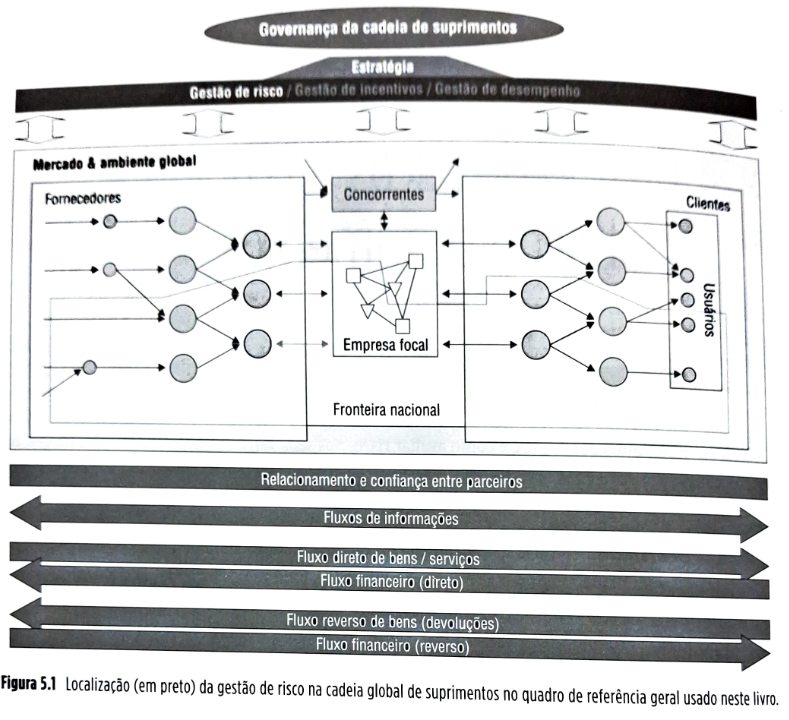

**Nokia e Ericsson – diferentes respostas a uma interrupção na cadeia de suprimentos de telefones celulares**

Sheffi (2005) narra este caso em seu livro sobre gestão de riscos empresariais, *The Resilient Enterprise*. Numa sexta-feira à noite, no dia 17 de março de 2000, um raio atingiu um edifício industrial da Philips na cidade de Albuquerque, no estado americano do Novo México. Como consequência, o forno da linha de fabricação número 22 pegou fogo. O alarme soou, os sprinklers atuaram, a brigada de incêndio entrou rapidamente em ação, adentrou o edifício e, em menos de dez minutos, o fogo havia sido completamente debelado, sem vítimas. Um incêndio pequeno e danos aparentemente superficiais, segundo relataram os bombeiros. O drama que se desenrolou a partir daí, entretanto, não teve nada de superficial.

**O impacto do fogo extinto se espalha**

Embora, aos olhos leigos dos bombeiros da brigada, o incêndio tenha parecido superficial, o que eles não perceberam foi que o local do incidente era um dos ambientes mais limpos do planeta. A produção dos delicados e ultraminiaturizados circuitos integrados que aquela fábrica produz requer níveis de limpeza do ar várias vezes mais exigentes que o de uma sala de cirurgia. Filtros sofisticados, roupas especiais e procedimentos muito rígidos garantem que nenhuma partícula maior que meio *micron* (um milésimo de milímetro) entre em contato com os equipamentos ou produtos. O incêndio do dia 17 e a subsequente invasão das salas limpas pelos bombeiros e seus equipamentos imediatamente arruinou oito bandejas de pastilhas (*wafers*) de aproximadamente 20 cm de diâmetro que continham, cada, centenas de circuitos integrados que acabariam virando *chips* – os principais componentes dos aparelhos eletrônicos contemporâneos. Pior, o dano não foi restrito à linha 22, já que fumaça e água dos *sprinklers*, além dos sapatos e roupas sujas dos bombeiros, arruinaram *chips* em literalmente todos os estágios de fabricação e em outras linhas, comprometendo circuitos que equipariam milhões de telefones celulares. Ainda pior que o dano aos produtos foi o dano ao nível de limpeza das salas: levaria tempo para serem sanitizadas a ponto de voltarem a produzir. Na segunda-feira seguinte, dia 20 de março, a primeira reação da Philips foi comunicar a interrupção aos seus mais de 30 clientes servidos por essa fábrica, especialmente os dois principais: Nokia e Ericsson, que, juntas, comprariam 40% dos pedidos afetados pelo incêndio.

## Página 121

**A reação da Nokia**

A primeira comunicação com a Nokia dava conta de que haveria um atraso de uma semana na remessa dos *chips*, o que foi recebido com certa naturalidade no quartel-general da empresa pelo gestor finlandês Tapio Markki. Afinal, uma semana de atraso não pode ser considerado atípico em cadeias globais de suprimentos – muitas pequenas ocorrências inesperadas podem causar pequenos atrasos. Estes são, em geral, cobertos pelos chamados estoques de segurança (ver Capítulo 9), prudentemente construídos a fim de proteger as cadeias de pequenas interrupções. Embora ainda não considerasse o incidente uma crise, Tapio, coerente com a cultura da Nokia de "fazer más notícias correrem rápido", comunicou o evento a vários outros gestores. Estes consideraram que o evento, embora não crítico, merecia acompanhamento cuidadoso e diário, por meio de comunicação telefônica com a Philips. Em paralelo, iniciaram esforços conjuntos de recuperação da produção da Philips, até mesmo oferecendo seus técnicos para ajudarem na limpeza. As preocupações iniciais se confirmaram quando, duas semanas depois, a Philips admitiu que, na verdade, várias semanas ou mesmo alguns meses seriam necessários para recuperar a produção afetada.

A Nokia rapidamente percebeu que a interrupção afetaria cerca de quatro milhões de seus telefones, incluindo lançamentos importantes. Rapidamente, formou uma equipe de engenheiros projetistas, gestores de cadeia de suprimentos e executivos seniores para lidarem com o problema. No total, mais de 30 pessoas, de unidades da Nokia no mundo todo, foram envolvidas. Rapidamente, passaram a avaliar a disponibilidade de outros fornecedores. Três dos cinco componentes cujo fornecimento tinha sido interrompido poderiam vir de outros dois fornecedores alternativos – de quem a Nokia já era um importante cliente: um dos Estados Unidos e outro do Japão. Eles concordaram em fazer um esforço extra e mandar os produtos em apenas cinco dias, para ajudar a minimizar o problema.

As outras duas peças, entretanto, só poderiam vir da Philips. Imediatamente, a alta direção da Nokia, incluindo seu CEO, entrou em contato com a alta direção da Philips, demandando que todos os esforços conjuntos possíveis fossem disparados para apressar a solução do problema, incluindo o trabalho colaborativo, junto com a Philips, para reconduzir a produção dos seus *chips* para outras fábricas da cadeia da Philips com excesso de capacidade.

Os esforços foram recompensados. Fábricas da Philips na Holanda e Shanghai conseguiram liberar capacidade para atender a Nokia, e engenheiros da Nokia desenvolveram um método de apressar a produção da fábrica de Albuquerque, quando esta voltasse a operar. Devido ao extraordinário esforço colaborativo com seus fornecedores, a Nokia conseguiu evitar interrupções importantes na sua produção de telefones celulares, apesar da interrupção na fábrica da Philips.

## Página 122

**A reação da Ericsson**

Concorrente feroz da Nokia, com sede na Suécia, e também grande cliente da planta incendiada da Philips, a Ericsson reagiu de modo diferente.

Da mesma forma que a Nokia, a Ericsson também recebeu um telefonema de aviso sobre o problema em Albuquerque na manhã do dia 20 de março. A reação, entretanto, foi mais passiva. Resolveu aguardar a semana de atraso prevista, sem disparar nenhuma ação imediata, tratando a questão como uma tecnicidade. Ninguém preventivamente especulou sobre as consequências da interrupção ou pensou num plano B. Mesmo quando comunicados que a demora seria muito maior, ainda assim, a gerência média da empresa não envolveu a alta direção no problema. O principal executivo de telefones celulares da Ericsson apenas soube do ocorrido semanas depois. Quando percebeu o real tamanho do problema, já era muito tarde. Quando procurou a Philips, esta pouco podia fazer, visto que sua capacidade adicional já havia sido direcionada para atender a Nokia. 

A Ericsson também não contava com muitas opções que envolvessem outros fornecedores, visto que havia amarrado sua produção quase exclusivamente ao fornecimento da planta da Philips em Albuquerque. Com a demanda alta do ano de 2000 por telefones celulares e chips, a Ericsson não tinha a quem recorrer, estava fadada a ficar um longo tempo sem seus preciosos componentes.

Com a falta dos componentes da Philips, a linha da Ericsson ficou justamente sem os produtos mais sofisticados e com seu mix de produtos desbalanceado. Em decorrência, ao final do primeiro trimestre pós-interrupção, a Ericsson teve um prejuízo de cerca de 500 milhões de dólares. O impacto da interrupção da fábrica de Albuquerque demorou ainda mais nove meses para passar completamente, e ao final do ano de 2000, um ano de altíssima demanda por telefones celulares, a empresa apresentou um prejuízo de 2,3 bilhões de dólares. Ao final de 2001, depois de anunciar que sairia do negócio de produção de telefones celulares, anunciou a joint venture 50%-50% com a Sony, criando a Sony-Ericsson.

O impacto na Nokia foi muito diferente. Com seu concorrente severamente afetado, a empresa ampliou, seis meses depois da interrupção, sua fatia de mercado de 27% para 30%, enquanto a Ericsson teve sua fatia reduzida de 12% para 9%.

Esse caso ilustra como um evento relativamente simples, quase corriqueiro (um pequeno incêndio), em um fornecedor pode impactar sua cadeia de suprimentos. As intensas interdependências entre as numerosas empresas (fornecedores, manufaturas subcontratadas, distribuidores, atacadistas, varejistas, operadores logísticos, entre outros) que formam as cadeias de suprimentos de hoje tornam difícil que uma empresa identifique as vulnerabilidades de sua cadeia (pontos sujeitos a causar interrupções) e as avalie em termos de: 

▪️a) qual a probabilidade de ocorrência das possíveis interrupções;
▪️b) qual a severidade do impacto de uma possível interrupção; 
▪️c) o que fazer para reduzir as probabilidades de ocorrência e/ou os possíveis impactos das interrupções. 

É disso que o restante deste capítulo trata: de criar empresas mais resilientes e, portanto, mais competentes para lidar com os riscos em suas cadeias globais de suprimentos. Comecemos por discutir o conceito de "risco".

## 5.2 CONCEITOS

### 5.2.1 Risco

Decisão sob risco implica algum nível de conhecimento das probabilidades envolvidas, o que é diferente de decisão sob "incerteza", em que as probabilidades são desconhecidas.

| ⚠️**Conceito-chave**⚠️{bg=verde} |
| --- |
| Risco, genericamente considerado, pode ser definido como o valor estatístico da expectativa sobre um evento indesejado que pode ocorrer ou não. O valor da expectativa sobre um possível evento negativo é dado pela consideração conjunta da probabilidade estimada da sua ocorrência por alguma medida de sua severidade, impacto ou consequência. |

**Risco em cadeias de suprimentos**

O conceito de risco pode ser aplicado ao contexto da gestão de cadeias globais de suprimentos, que nos interessa particularmente. Podemos, então, adotar a seguinte definição:

| ⚠️**Conceito-chave**⚠️{bg=verde} |
| --- |
| Risco em cadeias de suprimentos está associado à possibilidade de um evento indesejado ocorrer e seu consequente impacto na consecução do objetivo amplo da gestão de cadeias de suprimentos que é o de conciliar suprimento e demanda. |

Uma pesquisa realizada pela empresa de consultoria BDO a partir de análises dos relatórios anuais de 2016 das 100 maiores empresas com ações negociadas na bolsa de Nova Iorque, para a comissão de valores mobiliários, identificou os seguintes fatores de risco como os mais presentes nos relatórios por representarem preocupação para a liderança das empresas. O resultado pode ser visto na Figura 5.3.

## Página 123

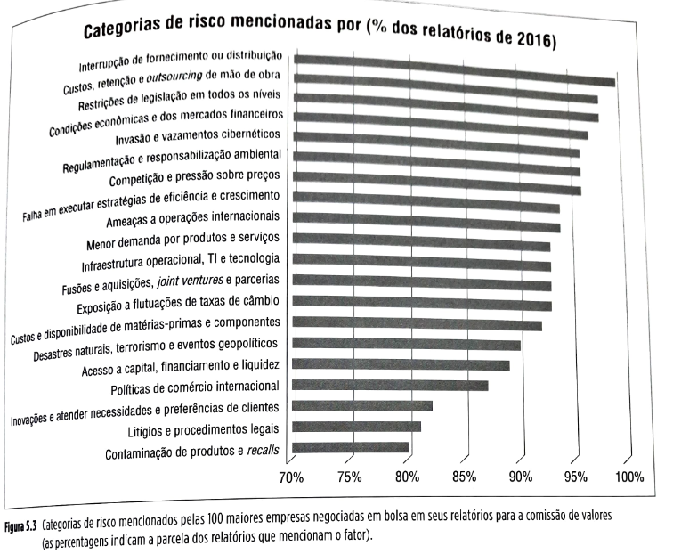

De fato, os executivos estão cada vez mais atentos e conscientes do fato de que o serviço entregue ao cliente, a reputação de suas empresas, a sua habilidade de gerar resultados consistentes e, por conseguinte, a sua capacidade de gerar retorno aos acionistas é cada vez mais dependente de sua habilidade de gerenciar riscos nas suas cadeias de suprimentos. A imprensa tem mostrado infindáveis exemplos de interrupções em cadeias de suprimentos e, em paralelo, a dificuldade de muitas empresas envolvidas de lidar adequadamente com elas.

| ✅**Teoria na Prática**{bg=azul} |
| --- |
| **Falta de assentos, banheiros e cozinhas de bordo atrasam a Boeing e a Airbus** |
| A Airbus ([www.airbus.com](https://www.airbus.com)) e a Boeing ([www.boeing.com](https://www.boeing.com)), ao longo da história, têm enfrentado problemas tecnológicos e de montagem muito complexos que têm, algumas vezes, causado até o atraso do lançamento de novos modelos. Agora, os dois arquirrivais enfrentam uma questão mais básica na produção dos seus aviões: a falta de equipamento menos avançado tecnologicamente, como assentos, banheiros e cozinhas de bordo, que têm prejudicado suas linhas de montagem. A falta desses componentes mais simples aumenta seus custos. Causa também o atraso de pagamento de milhões de dólares pelos seus clientes, que em geral amarram uma grande parcela do pagamento do preço total das aeronaves à entrega efetiva do produto, que se segue ao pagamento de prestações durante o processo de produção.  O problema é causado por pequenos fornecedores terceirizados que se comprometeram com níveis de produção aumentada sem que tenham conseguido aumentar proporcionalmente sua capacidade produtiva.  A Boeing recentemente deixou de atingir sua projeção de faturamento para o segundo trimestre em parte porque três aviões *wide body* não puderam ser entregues por seu interior estar incompleto em razão da falta de componentes.  Na Airbus, cerca de 8% das suas entregas desse ano (2008) sofreram atraso por problemas similares. Os atrasos vêm em má hora para ambas as empresas, que estão enfrentando estouros bilionários em seus atuais projetos de desenvolvimento de aeronaves.  Desde 2006, a Airbus tem sofrido problemas que atrasaram o lançamento de seu gigantesco jumbo de dois andares A380. A Boeing também sofreu atrasos no desenvolvimento do seu Dreamliner 787 porque fornecedores distantes que estão desenvolvendo novos e avançados componentes têm se mostrado incapazes de atender aos prazos apertados do projeto. [...] Gestores de ambas as empresas afirmam que estes problemas afetaram os resultados financeiros do ano. A Airbus, por exemplo, incorreu em despesas inesperadas de horas extras pela falta de certas peças ter forçado a alteração da sequência ótima de montagem.  Atrasos na instalação de equipamentos de bordo são particularmente sérios para estes fabricantes de aeronaves, porque, com preços acima de 200 milhões de dólares por unidade, os custos incorridos quando estes produtos não avançam para a entrega no prazo é altíssimo. [...] O problema fundamental é que as empresas produtoras de cozinhas, banheiros e assentos de primeira classe são tipicamente pequenas (como a alemã Sell, que fornece as cozinhas de bordo) e em geral têm poucos recursos para investir rapidamente no aumento dos seus setores de projeto e produção quando a demanda aumenta, como ocorreu nos últimos dois anos. [...]  Alguns dos aviões cuja entrega atrasou iriam para a empresa aérea Emirates ([www.emirates.com](https://www.emirates.com)), sediada em Dubai. O CEO da Emirates declarou que o atraso na entrega prejudicou muito os planos de expansão das rotas da empresa para os Estados Unidos. Como tiveram de alterar três vezes as datas anunciadas para as novas rotas, o executivo teme que isso venha a prejudicar a imagem de credibilidade da empresa junto a agências de viagem e, em última análise, junto aos potenciais clientes, causando enormes prejuízos.|

## Página 124

**Impacto financeiro de interrupções nas cadeias globais de suprimentos**

Não é de admirar que a gestão de risco, que em última análise visa a evitar interrupções na cadeia de suprimentos, tenha ocupado tanto da preocupação dos gestores. Segundo Hendriks e Singhal (2009), uma pesquisa feita pela Marsh Inc., uma empresa especializada em gestão de risco, junto a 110 gestores de riscos de empresas, descobriu que nenhum deles acredita que suas práticas de gestão de risco sejam altamente eficazes.

Por outro lado, Hendriks e Sighal (*op. cit.*) relatam os resultados de pesquisa realizada a partir da análise do impacto no desempenho financeiro de empresas que se depararam com aproximadamente 800 ocorrências de interrupções em cadeias de suprimentos, relatadas, entre outras fontes, pelo jornal norte-americano de negócios *Wall Street Journal* ([www.wsj.com](https://www.wsj.com)), concluindo vários pontos interessantes. Por exemplo, das 800 ocorrências, a grande maioria não se refere a eventos fora do controle da gestão das cadeias de suprimentos, como fenômenos climáticos ou terrorismo, mas a questões gerenciais, como má acurácia das previsões de demanda (ver Capítulo 8), mau desempenho de fornecedores (ver Capítulo 4), falta de alinhamento entre parceiros da cadeia (ver Capítulo 6) e mau desempenho gerencial para conduzir os processos na cadeia interna e externa de suprimentos (ver Capítulo 10).

Isso significa que a maioria dos riscos causadores de interrupção na cadeia é controlável e gerenciável (o que é boa notícia para os gestores!).

## Página 125

Os pesquisadores analisaram, para cada uma das 800 interrupções relatadas, três anos de desempenho financeiro das referidas empresas envolvidas (um ano antes e dois anos depois da interrupção), sempre de forma comparativa ao desempenho de outras organizações do mesmo setor e que não sofreram interrupção relatada no período. As métricas usadas no estudo são o valor para o acionista (mudanças nos preços de ações e nos dividendos distribuídos), o lucro operacional, o retorno sobre vendas e o retorno sobre ativos, todas medidas financeiras com impacto de longo prazo. Alguns resultados da pesquisa são apresentados a seguir.

* **Impacto sobre o valor para o acionista:** nos três anos considerados em conjunto, o valor para o acionista das empresas ligadas às interrupções relatadas caiu, em relação ao valor das empresas do mesmo setor que não sofreram interrupção: 13% um ano antes da interrupção (talvez uma indicação de que a interrupção se deu em decorrência de má gestão), 7% no ano da interrupção, 10% um ano após a interrupção, e o efeito negativo continua até dois anos depois, com perda de valor de 2%, totalizando mais de 30% de perda acumulada de valor no período.
* **Impacto no lucro operacional, no retorno sobre vendas e no retorno sobre os ativos:** interrupções na cadeia de suprimentos exercem um efeito devastador sobre a lucratividade operacional das empresas envolvidas. Nos três anos analisados, a queda média relativa às empresas do mesmo setor que não sofreram interrupções relatadas foi de 101% no lucro operacional, 114% no retorno sobre vendas e 92% no retorno sobre ativos. Esses números justificam, por si só, a prioridade que os gestores de cadeias de suprimentos têm dado à gestão de risco das suas cadeias.

Outro ponto importante dos resultados da pesquisa é que as interrupções analisadas foram causadas não necessariamente pelas empresas mais afetadas, que, muitas vezes, a exemplo dos casos narrados na introdução deste capítulo e no *boxe* anterior, pagam um alto preço pelo mau desempenho de outros nós da cadeia de suprimentos à qual pertencem.

Uma conclusão é que os executivos devem desenvolver cuidadosamente mecanismos e processos de gestão de risco nas suas cadeias de suprimentos, de forma a identificar os potenciais fatores causadores de interrupção, avaliar suas probabilidades de ocorrência e procurar reduzi-las e a suas consequências, já que os impactos financeiros de longo prazo destas interrupções podem ser devastadores. Outra é que quando os executivos disparam ações visando a reduzir custos nas suas cadeias de suprimentos, como reduções drásticas de estoques, terceirização de atividades, *offshoring*, entre outros, devem analisar cuidadosamente estas decisões, não somente do ponto de vista dos custos de curto prazo, mas também dos riscos envolvidos.

## Página 126

| 🔵**SAIBA MAIS**{bg=azul} |
| --- |
|**A anatomia de uma interrupção**  Sheffi e Rice Jr. (2009) descrevem os estágios pelos quais passam as interrupções em cadeias globais de suprimentos. Esses estágios estão representados no gráfico da Figura 5.5, que traz uma ilustração do impacto de cada um desses estágios no desempenho da organização. Os oito estágios são descritos a seguir. ▪️1. *Preparação*: em certos casos, quando o anúncio de interrupção é dado com antecedência, a empresa pode se preparar, tentando minimizar seus efeitos. Este estágio pode durar de poucos minutos, como na evacuação de um edifício quando uma enchente prevista se aproxima, até meses, como no caso de uma empresa que acompanha a deterioração das suas relações sindicais, o que potencialmente terminará em uma greve e consequente interrupção. ▪️2. *Evento em si*: a enchente acontece; o furacão atinge o local; o fornecedor fecha as portas; a greve acontece. ▪️3. *Primeira resposta*: a primeira resposta visa a controlar a situação, a fim de proteger vidas e ativos, conter sistemas, tentando evitar que o dano aumente ou se espalhe. Neste estágio, a detecção e rápida comunicação do ocorrido aos corretos escalões gerenciais decisores é essencial. Veja, por exemplo, como este estágio de detecção e reação foi diferente entre a Nokia e a Ericsson no caso de abertura deste capítulo. ▪️4. *Impacto inicial*: o impacto de algumas interrupções é sentido imediatamente. Quando a usina nuclear de Chernobil explodiu, por exemplo, o impacto foi imediato. Em outras situações, entretanto, inicialmente o impacto pode não ser tão grande. Por exemplo, quando um fornecedor fecha as portas, se a empresa carrega algum estoque dos itens que seriam por ele providos, ainda pode continuar funcionando pelo menos temporariamente, sem sentir a total extensão do impacto ainda por vir. ▪️5. *Momento de impacto máximo*: seja imediatamente após o evento em si ou algum tempo depois, quando o impacto máximo ocorre, o desempenho cai ao nível mais baixo. Por exemplo, os estoques que mantiveram a cadeia em operação temporariamente após o fornecedor fechar terminam, e a produção tem de ser interrompida. ▪️6. *Preparação para a recuperação*: tipicamente começa com a primeira resposta e, às vezes, até antes do evento em si. Qualificação e seleção de fornecedores alternativos, localização de empresas de transporte alternativas, localização de capacidade produtiva em outras unidades da organização 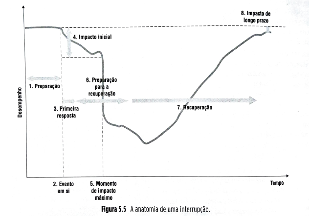|

## Página 127

### 5.2.2 Tipos de risco

Diferentes tipos de risco podem requerer diferentes formas de gestão. Em um sentido genérico, há três tipos de risco de interrupção que podem afetar as cadeias de suprimentos: aleatórios, acidentais e intencionais (Sheffi, 2005).

| 💡**Fique atento**💡{bg=amarelo} |
| --- |
| Diferentes tipos de risco, *aleatórios, acidentais e intencionais*, podem exigir diferentes formas de gestão. |

**Riscos aleatórios**

Causados por fatores normalmente fora do controle das organizações envolvidas, como furacões, enchentes, terremotos e tornados. Para ilustrar, em média, ocorrem 17 grandes terremotos (mais que 7,0 pontos na escala Richter) e 134 terremotos fortes (entre 6,0 e 6,9 pontos na escala Richter) a cada ano. Em geral, ocorrem em regiões remotas, mas, às vezes, grandes centros urbanos também são atingidos, causando possíveis interrupções em cadeias de suprimentos que operam na área afetada (como o grande terremoto que afetou Kobe, no Japão, em 1995 e afetou grande número de cadeias de suprimentos de variados setores industriais, como o setor calçadista local, que, alegadamente, jamais se recuperou de forma completa).

**Riscos acidentais**
Causados por fatores não aleatórios, mas não intencionais, como a imprudência, a negligência, a incompetência e falhas e imperfeições nas tecnologias envolvidas. Exemplos são os acidentes com meios de transporte, causando interrupções de tráfego, os atrasos de fornecimento, as quebras de equipamentos, as falências de fornecedores ou distribuidores, os problemas com os equipamentos dos sistemas de informação, o absenteísmo não intencional, os acidentes de trabalho, a falta de ou a imperfeição de informações necessárias à tomada de decisão e os problemas de qualidade.

**Riscos intencionais**
Causados por deliberada intenção de causar a interrupção, como os ataques terroristas, os roubos, a sabotagem e as greves. Exemplos são os ataques às torres gêmeas do World Trade Center, em Nova Iorque, nos Estados Unidos, em setembro de 2001; a sabotagem do conteúdo de alguns frascos do medicamento Tylenol nos anos 1980; as frequentes greves de caminhoneiros na França; os roubos de carga, sempre um problema sério no Brasil e em outros países; e os frequentes ataques de *hackers* aos *sites* corporativos – como um que forçou a Amazon a retirar do ar o *site* de sua subsidiária que localiza e vende livros raros, chamada Bibliofind, por vários dias, em razão de um ataque que visava a roubar números de cartões de crédito e dados pessoais de clientes, perdendo vendas e, talvez o mais importante, a confiança de alguns dos seus clientes.

| ⚠️**Conceito-chave**⚠️{bg=verde} |
| --- |
| Os riscos aleatórios são causados por fatores normalmente fora do controle das organizações envolvidas, como os desastres naturais; os riscos acidentais são causados por fatores não aleatórios, mas não intencionais, como a imprudência, a negligência ou a incompetência; e os riscos intencionais são causados por deliberada intenção de causar a interrupção, como os ataques terroristas e de hackers, os roubos, a sabotagem e as greves. |

É importante classificar os riscos, porque as formas de se lidar com seus diferentes tipos podem ser diversas. Por exemplo, um problema particular de se lidar com riscos intencionais, diferente dos outros, é que o perpetrante procurará racionalmente pontos vulneráveis das cadeias de suprimentos para atacar. Ou seja, a ameaça é adaptável; quando uma empresa trabalha um ponto de vulnerabilidade de sua cadeia de suprimentos e o "protege", a probabilidade de ocorrência de riscos intencionais aumenta nos outros pontos da cadeia.

Quando a segurança dos aeroportos no mundo inteiro aumentou substancialmente depois dos atos terroristas envolvendo aviões em 2001 nos Estados Unidos, automaticamente a probabilidade de ocorrência de eventos terroristas em outros meios de transporte de massa aumentou, como pode ser visto pelos vários ataques terroristas a trens, metrôs, hotéis e outros *soft targets* (alvos "fáceis") na Europa, Ásia e Oriente Médio nos últimos anos. A greve dos caminhoneiros de 2018 causou interrupção e perdas consideráveis (estimadas pelo jornal *Valor Econômico* em R$ 9,5 bilhões só nos primeiros cinco dias de greve) para muitas cadeias de suprimentos no Brasil.

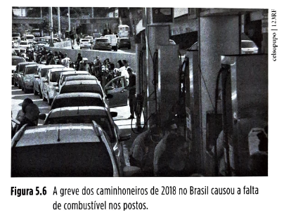

**Figura 5.6** A greve dos caminhoneiros de 2018 no Brasil causou a falta de combustível nos postos.

## Página 128

### 5.2.3 Categorias de riscos e seus fatores em cadeias de suprimentos

Os três tipos de risco podem afetar várias categorias de risco. A tabela da Figura 5.7 traz algumas categorias de risco em cadeias de suprimentos e suas potenciais causas ou fatores.

Figura 5.7: Categorias de riscos em cadeias de suprimentos e potenciais causas

| Categoria de risco | Potenciais fatores |
| --- | --- |
| **Cadeia de unidades operacionais** | * Desastre natural, incêndio, greve, quebra de equipamento    * Infraestrutura para operação e segurança local    * Ataque terrorista, guerra, crime organizado    * Saúde financeira dos fornecedores; uso de fornecedor único    * Saúde financeira dos clientes; dependência de poucos clientes    * Problemas de coordenação e colaboração entre unidades |
| **Recursos humanos** | * Disponibilidade de recursos humanos    * Disponibilidade de habilidades/competências    * Ação de sindicatos e associações; regras locais |
| **Tecnologia** | * Mudança tecnológica drástica    * Espionagem industrial    * Problemas com proteção à propriedade intelectual    * Obsolescência tecnológica |
| **Transporte** | * Disponibilidade/qualidade de transporte    * Greves em portos e aeroportos, alfândega    * Pirataria, roubo de carga, acidentes    * Enchentes, deslizamentos, neve, más condições em estradas    * Ataque terrorista, guerra |
| **Fornecimento** | * Capacidade inadequada na fonte do suprimento    * Inflexibilidade na fonte do suprimento    * Problemas de qualidade    * Aumentos de preço; escassez de *commodities* |
| **Demanda** | * Introdução de produtos pela empresa    * Introdução de produtos pelo concorrente    * Volatilidade na cadeia de suprimentos por efeito "chicote"    * Mudança repentina de demanda por condições da economia |
| **Sistemas de informação** | * Ataques de *hackers* a *sites* da internet, p. ex. de *e-commerce*    * Ataque de *hackers* a dados corporativos    * Queda de sistema; quebra de infraestrutura    * Confiabilidade/disponibilidade/agilidade das informações |
| **Ambiente econômico** | * Mudanças relativas de níveis salariais    * Mudanças de taxas de câmbio e de juros    * Recessão, nível de intervenção governamental, impostos    * Políticas governamentais restritivas/cotas, corrupção, burocracia |
| **Ambiente político** | * Mudanças de regime político, mudança de governo    * Golpes de Estado, guerra civil    * Mudanças de legislação e prioridades    * Pressão de grupos de interesse, ONGs |

| 🔵**SAIBA MAIS**{bg=azul} |
| --- |
| **Dez princípios da gestão de riscos em cadeias de suprimentos**  Kleindorfer e Saad (2005) propõem que dez princípios deveriam ser levados em conta quando uma empresa define sua política de gestão de riscos em cadeias de suprimentos. São os seguintes: ▪️1. *Ponha ordem na sua casa antes de exigir que outros parceiros da cadeia ponham ordem nas deles* – como as cadeias de suprimentos são compostas de uma parte interna e uma parte externa à empresa, a definição eficaz de políticas de identificação e mitigação de riscos internos à empresa, nas suas próprias unidades, deve preceder ações mais amplas referentes à cadeia de suprimentos; ▪️2. *Diversificação reduz riscos* – localização diversificada de unidades, definição diversificada de fontes de suprimentos, modais logísticos e formas operacionais diversificadas reduzem risco. A lógica é a mesma que se aplica à diversificação de opções de investimento para reduzir o risco financeiro. ▪️3. *A robustez do sistema a interrupções é definida pelo seu elo mais fraco* – isso se aplica especialmente ao caso de riscos intencionais, em que o possível perpetrante vai sempre visar ao elo mais fraco. Isso requer que vulnerabilidades na cadeia sejam bem identificadas ao longo de toda a cadeia de suprimentos e mecanismos de detecção e resposta rápida sejam implantados; ▪️4. *Prevenção é melhor que correção* – em termos gerais, mecanismos de prevenção de riscos deveriam ter precedência sobre mecanismos de correção da interrupção. Investimentos em avaliação de riscos para determinar vulnerabilidades e reduzi-las é o primeiro passo para a gestão de riscos de interrupção; a partir daí, definem-se mecanismos e planos de contingência para lidar com a interrupção; ▪️5. *Sistemas excessivamente "enxutos" (lean) podem aumentar sua vulnerabilidade* – muita atenção é necessária na gestão dos *trade-offs* (balanceamento de prioridades) entre o quão enxuto o sistema é (sistemas enxutos, ou *lean*, têm pouquíssimo excesso de recursos: estoques, pessoas, capacidade) e o quanto é robusto a interrupções. Quanto menos "folga" (excesso, redundância de recursos), menos robustez;  ▪️6. *Sistemas com alguma redundância de recursos são mais robustos* – quase um corolário do item anterior, a manutenção de sistemas de *backup*, planos de contingência e de um razoável excesso de recursos (estoques, capacidade) ajuda a aumentar o nível de prontidão para reação a possíveis interrupções; ▪️7. *Colaboração e compartilhamento de informação são chave* – cooperação, colaboração e coordenação entre funções da empresa e entre empresas da cadeia de suprimentos são essenciais para explorar sinergias e conseguir tanto identificar vulnerabilidades quanto reagir bem a interrupções – veja a introdução deste capítulo para um exemplo. De novo, nunca é demais enfatizar que, no estágio de identificação da interrupção, comunicação eficaz é essencial, no sentido de que a informação sobre a potencial crise chegue o mais rapidamente possível aos escalões gerenciais que tenham o poder decisório e a liderança para capitanear a reação; ▪️8. *Gestão de crise apenas não é suficiente* – não basta apenas que a empresa tenha proficiência na gestão de crise quando esta se instala. A gestão anterior (identificação e avaliação de vulnerabilidades, e a gestão das opções para sua redução) é essencial para uma boa gestão de risco em cadeias de suprimentos; ▪️9. *Modularidade pode alavancar esforços de redução de riscos* – o uso de projetos de produto e processos modulares, postergamento da definição do produto (*postponement* – ver Capítulo 2) e processos mais flexíveis alavancam os mecanismos de redução de riscos, porque facilitam a mobilidade de componentes entre produtos e de produção entre unidades; ▪️10. *A aplicação de princípios de qualidade e redução de variabilidade de processos auxilia a redução de riscos* – segundo esse princípio, a redução de variabilidade dos processos os torna menos sujeitos a interrupções, principalmente em relação a suprimentos. |

## Página 129

### 5.2.4 O processo de gestão de riscos em cadeias globais de suprimentos

O processo de gestão de riscos em cadeias de suprimentos em geral engloba os seguintes passos:

1. **Identificação de processos e recursos sujeitos a riscos**
2. **Identificação dos principais riscos**
3. **Avaliação da probabilidade de ocorrência associada aos principais riscos**
4. **Identificação das consequências da ocorrência associada aos riscos**
5. **Avaliação dos níveis de vulnerabilidade**
6. **Definição de ações priorizadas para redução e transferência de riscos**

**Passo 1 – Identificação de processos e recursos sujeitos a riscos**

Como é muito complexa a tarefa de analisar os riscos da empresa como um todo, em geral, o primeiro passo será a escolha de um processo ou um recurso cujos riscos se pretendam gerenciar. Os processos poderiam ser, por exemplo, "desenvolvimento de novos produtos", "gestão de demanda", "gestão de clientes", "atendimento de pedidos", "manufatura" ou "suprimentos". Imaginemos que o processo escolhido seja de "manufatura". O próximo passo é o de identificação dos principais riscos que possam afetar o processo de manufatura.

### Passo 2 – Identificação dos principais riscos

Imaginemos que nossa análise se refira a uma empresa fictícia chamada Confiança e que tenha uma cadeia global de fábricas, responsável pelo processo de manufatura: uma no Brasil (na zona sul de São Paulo), uma nos Estados Unidos (na costa da Califórnia), e uma no Vietnã (Ho Chi Mihn City). Para identificação dos principais riscos, então, é necessário olhar tanto localmente para cada uma das unidades como para a cadeia de unidades e sua inter-relação. Apenas como exemplo, usaremos os riscos listados. No processo de identificação dos riscos, o que se visa é apenas a listar os potenciais riscos. Numa etapa posterior, esses riscos serão avaliados, em termos de sua probabilidade de ocorrência e sua severidade ou consequência. Ou seja, nessa etapa, é aconselhável que, caso haja dúvida se um fator de risco deveria ou não ser listado, ele o seja. Dessa forma, se esse fator de risco não for importante, isso será identificado numa etapa posterior. Por outro lado, a não inclusão de um fator importante significará que ele não mais será analisado. Se o fator deixado de fora for importante, e se ele não for considerado, isso poderá trazer consequências indesejáveis. A tabela da Figura 5.8 ilustra a identificação dos riscos potenciais de nossa análise para a empresa Confiança e suas unidades fabris. Note que os fatores de risco são diferentes conforme a localização: a fábrica dos Estados Unidos, na Califórnia, está sujeita a terremotos e furacões eventuais, enquanto as outras não; a fábrica do Vietnã está mais sujeita a intervenções governamentais em razão do regime central do país com um forte componente socialista presente, enquanto as outras não. E a fábrica do Brasil está mais sujeita a roubo de carga e crime eventual que as dos dois outros países.

## Página 130

### Empresa fictícia Confiança – Principais fatores de risco

| Unidade | Fatores de Risco |
| --- | --- |
| **Brasil** | * Incêndio, greve, quebra de equipamento  * Crime organizado e eventual  * Ação de sindicatos e associações, regras locais  * Roubo de carga, acidentes  * Enchentes  * Greves em portos e aeroportos, alfândega  * Confiabilidade / disponibilidade / agilidade das informações  * Queda de sistema; quebra de infraestrutura  * Mudanças relativas de níveis salariais  * Mudanças de taxas de câmbio e de juros  * Recessão, nível de intervenção governamental, impostos  * Políticas governamentais restritivas / cotas, corrupção, burocracia  * Mudanças de legislação e prioridades |
| **Estados Unidos** | * Desastre natural (terremotos, furacões), incêndio, quebra de equipamento  * Ataque terrorista  * Disponibilidade de recursos humanos  * Confiabilidade / disponibilidade / agilidade das informações |
| **Vietnã** | * Infraestrutura para operação local  * Disponibilidade de habilidades / competências  * Problemas com proteção à propriedade intelectual  * Disponibilidade / qualidade de transporte  * Confiabilidade / disponibilidade / agilidade das informações  * Queda de sistema, quebra de infraestrutura  * Mudanças relativas de níveis salariais  * Mudanças de taxas de câmbio e de juros  * Recessão, nível de intervenção governamental, impostos  * Mudanças de regime político, mudança de governo |
| **Rede toda** | * Problemas de coordenação e colaboração entre unidades |

**Figura 5.8** Identificação dos principais fatores de risco para a empresa Confiança.

**Passo 3 – Avaliação da probabilidade de ocorrência associada aos principais riscos**

A avaliação de probabilidade de ocorrência é diferente e usa diferentes ferramentas e técnicas, conforme o tipo de risco: **aleatório, acidental e intencional**. Analisemos cada uma delas.

*Probabilidade de ocorrência de riscos aleatórios* – como os fatores de riscos aleatórios (como, por exemplo, os desastres naturais) são frequentes, pode-se estudar estatisticamente o seu histórico de ocorrências para então tentar estimar as probabilidades de sua ocorrência. Isso é conhecido há muito tempo pelas empresas de seguros que necessitam desse tipo de informação probabilística (para ocorrência de enchentes, furacões, tornados, terremotos e outros) para estabelecer seus prêmios. A Figura 5.9 mostra uma representação do mapa de probabilidades da ocorrência de terremotos nos Estados Unidos para exemplificar.

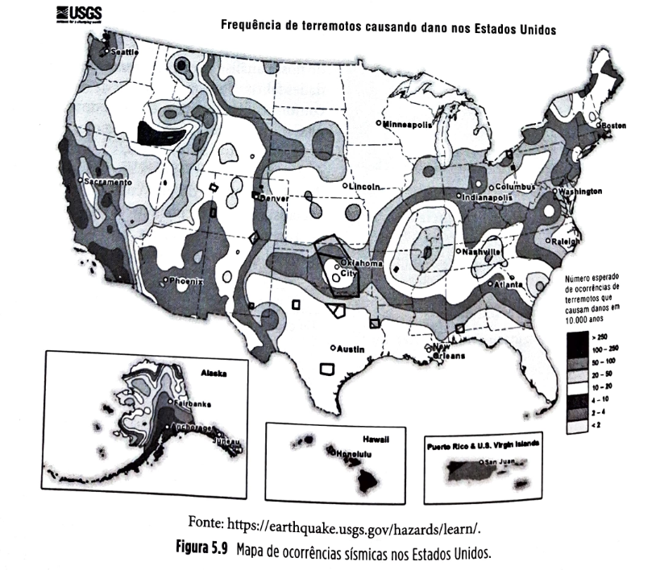

## Página 131

Observe como a localização da fábrica da Confiança, na costa da Califórnia, no sudoeste americano, a faz sujeita a um risco relativamente alto de sofrer um terremoto. Veja como a situação da Califórnia é totalmente diferente daquela do estado da Flórida (a península a sudeste dos EUA), quanto aos riscos de um terremoto. Isso pode ser claramente identificado a partir desses mapas históricos de ocorrências de desastres naturais.

A Figura 5.10 traz uma ilustração do mapa de ocorrências de tornados nos Estados Unidos, de 1950 até 2004. Observe como as ocorrências permitem ver que o risco de tornados para a fábrica da Confiança localizada na Califórnia é bastante pequena.

No Brasil, felizmente, terremotos e furacões não são frequentes, mas enchentes podem ser uma preocupação e fonte de risco potencial. Informações de pluviosidade histórica, como aquela encontrada no *site* do INMET (Instituto Nacional de Meteorologia), podem auxiliar na avaliação de probabilidade de ocorrência de pluviosidade excessiva, levando a enchentes relevantes. Veja a Figura 5.11.

Aprofundando um pouco mais o uso desse tipo de informação, dados como os da Figura 5.12 podem indicar, ao longo de um ano, os pontos de maior risco para uma determinada região.

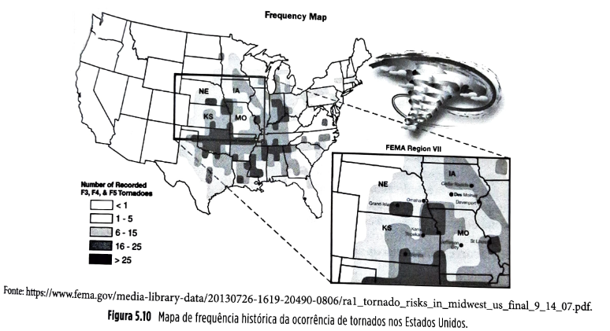

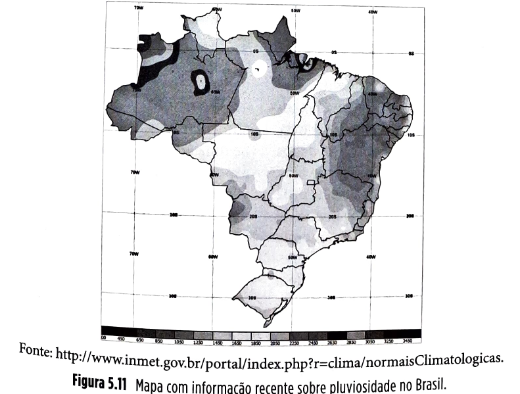

## Página 132

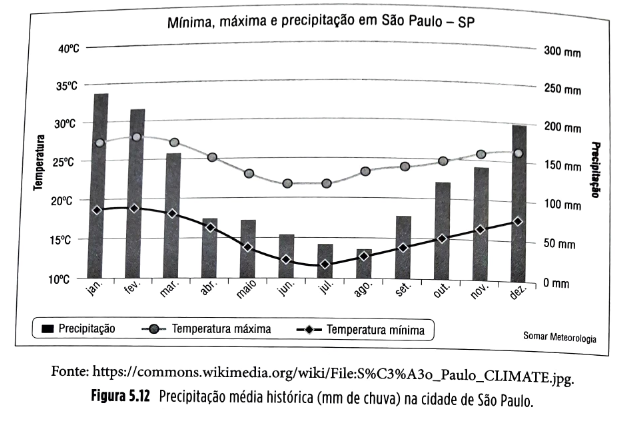

Essas informações podem ser usadas para o estágio de preparação. Por exemplo, para a fábrica da Confiança em São Paulo, fica evidente que o risco de enchentes é mais drástico nos últimos e nos primeiros meses do ano, e, portanto, o disparo de ações de preparação e prevenção de danos por enchentes, por exemplo, devem antecedecer a esses períodos.

### Probabilidade de ocorrência de riscos acidentais

Evidentemente, a ação mais recomendável para lidar com riscos acidentais é a prevenção. Entretanto, para a gestão de riscos, é necessário estimar a probabilidade de ocorrência de eventos acidentais, ou seja, que ocorrem não intencionalmente, mas por algum tipo de falha involuntária causada por descuido, incompetência ou negligência.

No caso de acidentes de trânsito, por exemplo, o *site* da Associação Brasileira de Prevenção de Acidentes de Trânsito ([http://www.vias-seguras.com/content/view/full/132](https://www.google.com/search?q=http://www.vias-seguras.com/content/view/full/132)) traz informações bastante ricas e detalhadas sobre índices de acidentes por rodovia, por trecho de rodovia, entre outros. É possível, portanto, trabalhando com dados como estes e com dados internos das empresas envolvidas, avaliar muito mais objetivamente os riscos de acidentes de trânsito. Outro exemplo de riscos acidentais que podem se beneficiar de dados setoriais e internos da própria empresa são os de acidentes de trabalho, atrasos relevantes de fornecedores, quebras de equipamento, entre outros que podem contar com uma boa base de dados históricos.

Isso, evidentemente, será mais factível quanto mais a empresa adotar como prática o acúmulo desses dados, de forma a torná-los facilmente utilizáveis no futuro. Se a **empresa** não costuma acumular esse tipo de informação histórica e pretende fazer uma boa gestão de riscos de sua cadeia de suprimentos, deve começar a criar suas bases de dados sem demora.

Como pode ser visto pelos exemplos até agora, informação histórica é um dos elementos essenciais na avaliação de probabilidades associadas a riscos. Quanto mais dados relevantes disponíveis, mais a estatística poderá trabalhar a favor de uma boa gestão de riscos.

**Probabilidade de ocorrência de riscos intencionais**

A avaliação dos riscos intencionais segue uma lógica um pouco diferente daquela da avaliação dos riscos aleatórios e acidentais. Segundo Sheffi (2005), interrupções intencionais constituem uma ameaça adaptável na qual os perpetradores visam ao sucesso do ataque e à maximização do dano causado. Consequentemente, proteger um determinado aspecto do sistema sob ataque pode aumentar a probabilidade de ataque em outro aspecto. Se uma empresa reforça tremendamente a segurança do aspecto “transporte” de suas cargas, por exemplo, provendo escolta armada, os indivíduos que intencionam se apoderar destas cargas provavelmente passarão a procurar fragilidades em outros aspectos do seu fluxo – por exemplo, passando a tentar assaltar os depósitos.

Isso também significa que esses ataques deverão ocorrer nos mais frágeis e menos preparados pontos da operação – nos quais a operação estiver mais fragilizada. Nos eventos mais frequentes, como as greves, assaltos e roubos de carga, a estatística e a história poderão auxiliar a avaliar as probabilidades de ocorrência.

## Página 133

Também as distribuições temporais (dias, semanas, meses em que as ocorrências são mais frequentes) auxiliam no estágio de preparação. Por exemplo, em alguns setores, é frequente que nos meses que antecedem os dissídios salariais haja maior risco de mobilização sindical para greves. Um exemplo ilustrativo é do sindicato *Longshore and Warehouse Union*, americano, que em 2002 decidiu fazer uma "operação padrão" nos portos da costa oeste dos Estados Unidos. Para maximizar o impacto, escolheram exatamente o mês de outubro para a mobilização, quando o tráfego de produtos dos países asiáticos produtores é máximo na preparação dos estoques para o Natal.

Também, para alguns eventos intencionais, podem-se usar informações públicas disponíveis. Por exemplo, quanto a registros de crimes comuns, há informação estatística de ocorrências por região, conforme ilustrado na Figura 5.13. Ficam claras as localidades com maior probabilidade de ocorrência de roubos.

(Imagem: Mapa de previsão da ocorrência de crimes)

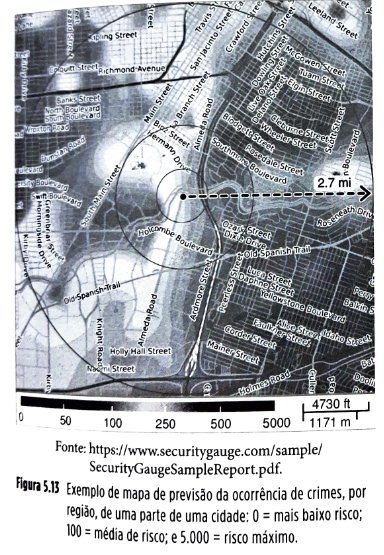

**Figura 5.13** Exemplo de mapa de previsão da ocorrência de crimes, por região, de uma parte de uma cidade: 0 = mais baixo risco; 100 = média de risco; e 5.000 = risco máximo.

**Passo 4 – Identificação das consequências da ocorrência associada aos riscos**

Na avaliação das consequências, ou impactos, da ocorrência associada aos riscos, a estatística também pode auxiliar. Se a empresa já se deparou com a ocorrência muitas vezes no passado, pode tomar sua experiência como um elemento de previsão para impactos similares no futuro.

Por exemplo, uma organização que frequentemente sofre interrupções no seu suprimento de energia elétrica pode usar o impacto percebido das interrupções passadas para estimar qual o impacto de uma possível futura interrupção.

Já para interrupções menos frequentes, como o fechamento prolongado de um fornecedor relevante, ou um incêndio de proporções importantes, ou uma greve prolongada, a história de eventos passados pode contribuir pouco – exatamente pelo fato de esses eventos serem raros. Nesse caso, o uso de cenários e de perguntas do tipo “o que aconteceria se...” pode ser a única alternativa. Por exemplo:

▪️O que aconteceria se nosso fornecedor principal sofresse uma interrupção e sua fábrica tivesse de ser fechada por duas semanas?
▪️O que aconteceria se houvesse uma greve na alfândega que durasse um mês?
▪️O que aconteceria se um furacão categoria IV atingisse a fábrica da Califórnia?
▪️O que aconteceria se a fábrica de São Paulo sofresse uma enchente séria?
▪️O que aconteceria se um produto nosso sofresse sabotagem e fosse envenenado?

Perguntas como estas fazem com que os envolvidos pensem nos impactos e, se possível, os quantifiquem, tanto em termos de aspectos tangíveis (custos associados, por exemplo) como mais intangíveis (por exemplo, quanto à perda de confiança dos clientes ou danos à imagem e marca da organização).

O quadro da Figura 5.14 traz um sumário dos passos 3 e 4, dos possíveis métodos de avaliação da probabilidade e consequências de ocorrências associadas aos riscos.

**Figura 5.14** Quadro sumário de formas para avaliação de probabilidade e impacto de ocorrências associadas a riscos.

| Risco | Probabilidade | Consequência (exemplos) |
| --- | --- | --- |
| **Aleatório** | Estimada de dados históricos. Ex.: dados históricos de ocorrências de inundações ou furacões. | O que aconteceria se... Um furacão fechasse a fábrica de um fornecedor por duas semanas? |
| **Acidental** | Estimada de dados históricos do setor industrial. Ex.: história do desempenho de entregas para avaliar a probabilidade de atrasos do fornecedor. | O que aconteceria se... Um fornecedor-chave atrasasse um componente-chave por duas semanas? |
| **Intencional** | Estimada de dados históricos e inteligência. Ex.: mapas de frequência de roubos ou greves. | O que aconteceria se... Um embarque completo fosse roubado durante o período de lançamento? |

## Página 134

**Passo 5 – Avaliação dos níveis de vulnerabilidade**

Um conceito importante na gestão de riscos é o de vulnerabilidade.

| 💡**Fique atento**💡{bg=amarelo} |
| --- |
| A vulnerabilidade de uma empresa ou cadeia de suprimentos aos riscos está associada à consideração conjunta da probabilidade da ocorrência associada ao risco e a seriedade (ou, às vezes, chamada severidade) do seu impacto. |

A consideração conjunta dos níveis de probabilidade e impacto das várias ocorrências possíveis pode ser representada por meio de um gráfico, conforme a Figura 5.15.

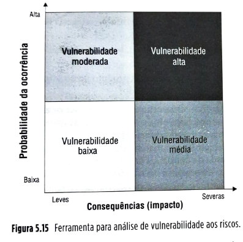

**Figura 5.15** Ferramenta para análise de vulnerabilidade aos riscos.

*Quadrante Probabilidade alta – Consequência severa* (vulnerabilidade alta): riscos que se enquadram nesse quadrante são aqueles que tornam a operação mais vulnerável. Aqui se encaixa o exemplo da ocorrência de sequestro de aeronaves de grandes linhas aéreas americanas, como a United Airlines e a American Airlines, por terroristas nos meses pós-ataque às torres do World Trade Center (WTC) em 2001. Motivados pela visibilidade alcançada pela tragédia do WTC, vários grupos terroristas passaram a ver nesse tipo de ação algo a perseguir, aumentando a probabilidade de ocorrência. Evidentemente, é impossível quantificar os impactos com precisão, já que envolveram perdas humanas substanciais, mas são os mais devastadores possível.

*Quadrante Probabilidade baixa – Consequência severa* (vulnerabilidade média): aqui se encaixam os eventos com baixa probabilidade de ocorrerem, mas com alto impacto. Imagine, olhando para a Figura 5.10, a ocorrência de um tornado que atinja a fábrica da empresa Confiança (que temos usado como exemplo neste capítulo) na Califórnia, no sudoeste americano. Embora a probabilidade de um tornado atingir uma localidade específica na Califórnia seja muito baixa, os danos seriam provavelmente bastante grandes, dada a capacidade destrutiva de um tornado.

*Quadrante Probabilidade alta – Consequência leve (vulnerabilidade moderada):* aqui se encontram os eventos com os quais as empresas lidam no dia a dia fazendo uso de seus sistemas de planejamento e controle. Exemplos seriam atrasos moderados na entrega de uma matéria-prima, uma quebra de um equipamento, um acidente com um caminhão transportando produtos para o centro de distribuição, entre outros. São eventos relativamente frequentes de acontecer numa maioria de ambientes, mas exercem impacto moderado, já que as empresas frequentemente têm estoques e outros recursos de segurança para lidarem com isso.

*Quadrante Probabilidade baixa – Consequência leve (vulnerabilidade baixa):* definitivamente os eventos que se encaixam nesta categoria não ocupam as posições mais altas na agenda de preocupações dos gestores de riscos das cadeias de suprimentos. Trata-se de eventos que, por um lado, apresentam probabilidade baixa de ocorrerem, e quando ocorrem, têm impacto baixo, ou consequências leves.

A Figura 5.16 mostra um exemplo de uso da ferramenta para análise de vulnerabilidades.

**Figura 5.16** Exemplo de uso da ferramenta para análise de vulnerabilidade aos riscos de uma empresa.

| Probabilidade da ocorrência (Eixo Y) | Consequências (Eixo X) |
| --- | --- |
| **Alta / Leves** | **Alta / Severas** |
| Fechamento de um porto | Queda do sistema |
| Ruptura de um link de transporte | Quebra de equipamentos |
| Greve na alfândega | Atrasos menores de entrega |
| **Baixa / Leves** | **Baixa / Severas** |
| Vírus no computador | Novo concorrente |
| Enchente | Acidentes no escritório |
| Tempo muito quente ou frio | Epidemia de gripe |

**[Conteúdo do Quadrante Superior Direito - Fundo Escuro]**

* Perda de um Fornecedor-chave
* Problemas com mão de obra
* Ataque de hackers
* Recessão econômica
* Problemas visíveis de qualidade

**[Conteúdo do Quadrante Inferior Direito - Fundo Cinza]**

* Falha grave de TI
* Tornado
* Adulteração de produto
* Greve geral
* Irregularidades contábeis
* Fechamento de vários portos
* Sabotagem de funcionários
* Mudanças tecnológicas
* Incêndio em armazém central

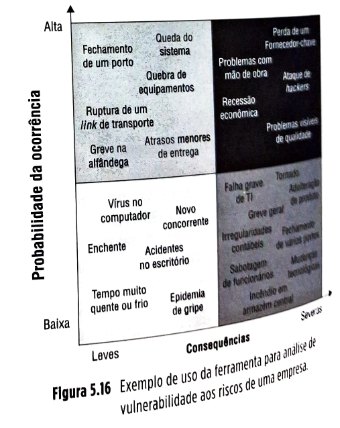

## Página 135

| ✅**Teoria na Prática**{bg=azul} |
| --- |
| **Análise de vulnerabilidade em ação**    A General Motors do Brasil utiliza ferramentas muito similares àquelas descritas neste capítulo para analisar suas vulnerabilidades. Em seu processo de gestão de peças sobressalentes para a América Latina (*Passo 1* do processo de gestão de riscos descrito neste capítulo), a GM procura identificar potenciais fontes de risco (*Passo 2*) a partir de uma lista de áreas de risco a fim de facilitar o processo de identificação. A tabela da Figura 5.17 ilustra alguns exemplos usados pela empresa.    **Alguns exemplos de fontes potenciais de risco por área de risco**   **Figura 5.17** Alguns exemplos de fontes de riscos por área de risco consideradas pela GM Brasil para seu negócio de peças sobressalentes.  A empresa, a partir daí, procura detalhar mais as fontes de riscos em ocorrências, por exemplo, a fonte de risco "Falta de componente" é detalhada em "Falta de componentes padrão (p. ex., velas de ignição)", "Falta de componentes específicos (p. ex., porta)", de forma a poder, então, avaliar as probabilidades da ocorrência (*Passo 3*), sua consequência (*Passo 4*) e o nível da vulnerabilidade da GM ao risco (*Passo 5*). Para isso, a empresa utiliza a ferramenta ilustrada na Figura 5.18.  Dessa forma, a General Motors consegue, de forma mais objetiva, identificar e avaliar as suas fontes de vulnerabilidade. Note que na Figura 5.18 os números das células da matriz principal representam a soma dos números correspondentes aos níveis de probabilidade de ocorrência com o número correspondente à consequência da ocorrência. Por exemplo, para uma ocorrência que seja considerada *Provável* de acontecer (grau 4 de probabilidade) e com consequência *Catastrófica* (grau 5 de consequência), a vulnerabilidade calculada seria de . Um nível de risco (vulnerabilidade) grau 9 é considerado um *Risco extremo* por ser maior que 7. A recomendação, geral, então, é a de que um *Plano de ação detalhado* para lidar com esse risco seja desenvolvido. |

| Comercial e legal | Econômica e financeira | Tecnológica | Cadeia de suprimentos | Política | Gestão e controle | Recursos humanos | Ambiental | Eventos naturais |
| --- | --- | --- | --- | --- | --- | --- | --- | --- |
| Fraude | Instabilidade geopolítica | Infraestrutura de TI | Falta de componente | Decisões políticas afetando o negócio | Quebra de procedimento | Falta de mão de obra qualificada | Gestão inadequada de segurança | Terremotos |
| Terceirização | Mau uso de fundos | Segurança da informação | Questões/falhas de fornecedores | Escrutínio constante pela mídia | Uso impróprio de recursos | Perda de pessoal-chave | Instalações/equipamento inadequados | Tempestades |
| Negligência | Flutuações de câmbio | Obsolescência | Capacidade produtiva | Atividade terrorista | Objetivos impróprios de projeto | Gestão de desempenho | Contaminação | Inundações |
| Quebra de contrato | Desvio de fundos | Inflexibilidade | Preço de suprimentos e venda | Percepção da comunidade |  | Baixos salários | Poluição | Incêndio |
| Quebra de estatuto |  |  | Desempenho de transportadoras |  |  |  | Ruído |  |
|  |  |  | Operação de portos e alfândega |  |  |  |  |  |
|  |  |  | Inacurácia de previsões |  |  |  |  |  |
|  |  |  | Capacidade/complexidade logística |  |  |  |  |  |

## Página 136

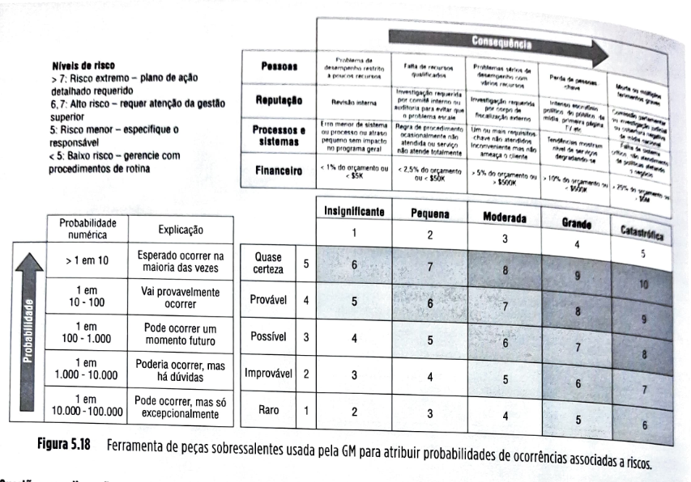

**Passo 6 – Definição de ações priorizadas para redução e transferência de riscos**

Considerando que as vulnerabilidades ou níveis de riscos têm dois elementos formadores – a probabilidade e a consequência das ocorrências –, há genericamente duas formas de se reduzirem as vulnerabilidades: ou se reduzem as probabilidades de ocorrência, ou se reduzem as suas consequências. Evidentemente, estas duas possibilidades não são mutuamente exclusivas, e as ações de redução de vulnerabilidades em geral envolvem uma mistura de ambas. Analisemos cada uma delas.

| 💡**Fique atento**💡{bg=amarelo} |
| --- |
| Há duas formas de se reduzir a vulnerabilidade a riscos nas cadeias de suprimentos: ou se reduzem as probabilidades, ou se reduzem as consequências das ocorrências causadoras das interrupções. |

**Redução da probabilidade das ocorrências associadas ao risco**

Esta opção de ação tem um aspecto preventivo e pode ser aplicado aos três tipos de risco: aleatório, acidental e intencional.

▪️Nos riscos *aleatórios*, por exemplo, nos desastres naturais, as forças da natureza ainda não conseguem, numa maioria de situações, ser "domadas" por ações do homem. Não se consegue, por exemplo, diminuir a probabilidade de ocorrência de furacões, terremotos ou chuvas intensas, mas certamente é possível diminuir a probabilidade que esses fenômenos afetarem a cadeia de suprimentos. Por exemplo, historicamente, a probabilidade de ocorrência de tornados na região central dos Estados Unidos é muito mais alta do que na costa leste. Estas probabilidades deverão continuar assim por um considerável período de tempo e estão muito além do escopo de controle das empresas e suas cadeias de suprimentos. Entretanto, dentro do escopo de controle das empresas está, pelo menos até certo ponto, a decisão de localização de unidades operacionais.

## Página 137

A decisão de localizar uma unidade fora da região central americana não afeta as probabilidades das ocorrências por região, mas certamente afeta a probabilidade de a unidade ser afetada por um tornado. Nem sempre, é verdade, uma empresa pode ter total liberdade para a decisão de localização de suas unidades operacionais. Se uma empresa fabricante de produtos decide objetivar os mercados da região central americana, ela pode decidir estabelecer uma fábrica na Florida Central (relativamente pouco afetada por tornados) e enviar os produtos para os estados da região central. Entretanto, algumas empresas de serviços (por exemplo, uma clínica), quando decidem objetivar os estados centrais, têm necessariamente que localizar unidades em regiões próximas de sua clientela, tendo então que conviver com riscos maiores.

Observe, entretanto que isso não é verdade para todos os serviços. Com a evolução das tecnologias de informação e telecomunicação, mais e mais serviços podem ser prestados de forma remota, dando mais liberdade aos gestores nas suas decisões de localização. Um *call center*, por exemplo, pode atender a todo um país sem ter seus centros de atendimento sequer próximos do referido país.

O ponto aqui, portanto, é que, para desastres naturais, embora não seja tecnologicamente possível (ainda, pelo menos) agir sobre o fenômeno natural em si, de forma que suas probabilidades de ocorrência sejam diminuídas, muitas vezes é possível que decisões dentro do escopo de controle das empresas e suas cadeias de suprimentos possam reduzir drasticamente a probabilidade que o fenômeno natural as afete. Nestas decisões são incluídas a decisão de localização (em regiões menos sujeitas aos fenômenos), as ações preventivas (por exemplo, manter as vias de escoamento de água desobstruídas para que chuvas intensas não se transformem em uma enchente que afete a empresa, ou reforçar estruturalmente os edifícios para que sofram menos com furacões).

Nos riscos *acidentais*, é importante ter claro nas políticas de gestão de riscos que a orientação predominante tem de ser a de *prevenção*, ou seja, as ações preventivas na redução de riscos acidentais devem ter total prioridade em relação às ações corretivas.

Riscos acidentais estão associados, entre outros fatores, à imprudência, negligência, incompetência/imperícia e a falhas das tecnologias. Quanto à imprudência, a criação de uma cultura que valorize a conscientização da importância da prevenção, por exemplo, de acidentes, com uso de equipamento de proteção industrial, criação de procedimentos e *check lists* preventivos para identificação e redução de condições e atitudes inseguras é essencial. As empresas em geral têm suas políticas de prevenção de acidentes e suas CIPAs (Comissões Internas de Prevenção de Acidentes). A mesma lógica por trás da atuação dos mecanismos de prevenção de acidentes de trabalho pode ser usada para prevenir interrupções por causas outras.

Quanto à negligência, muito do que já se discutiu quanto à imprudência se aplica, mas negligência está mais ligada à atitude dos envolvidos, e, às vezes, mudar atitudes pode ser difícil. A política, nesse caso, com intuito de reduzir riscos acidentais, tem de estar ligada aos critérios de seleção de pessoal. Critérios que procurem identificar pessoas com tendência a comportamento negligente e evitem que ocupem posições de risco podem reduzir substancialmente esses riscos. Quanto à incompetência/imperícia, só há uma solução: procurar garantir que só ocupem posições na organização os profissionais que estejam com níveis de competência compatíveis com os requeridos pela posição ocupada. Motoristas mal treinados ou pouco experientes, operadores de equipamento pouco qualificados, planejadores de produção, suprimentos e distribuição que não conhecem profundamente os conceitos e técnicas de suas atribuições vão causar interrupções importantes nas cadeias de suprimentos – é apenas uma questão de tempo. Treinamento e acompanhamento para uma adequada conciliação entre competências do trabalhador e requisitos do trabalho é a melhor forma de reduzir probabilidades de erros acidentais por incompetência.

Por mais que se trabalhem as opções para redução dos erros acidentais pelas pessoas, errar é humano e os erros *vão* acontecer. Uma linha de defesa adicional importante a se considerar na redução de riscos é um mecanismo que se coloca entre o "erro humano" e a "interrupção". Em outras palavras, é um mecanismo que visa a evitar que um erro se torne uma falha ou uma interrupção. Esse mecanismo é chamado *poka-yoke*, ou mecanismo à prova de falhas. O Saiba mais a seguir o descreve.

## Página 138

| 🔵**SAIBA MAIS**{bg=azul} |
| --- |
| **Poka-yoke, uma linha de defesa entre o erro e a falha (Corrêa e Corrêa, 2017)** |
| A expressão japonesa *poka-yoke*, que, traduzida com certa liberdade significa *à prova de falhas*, engloba os conceitos desenvolvidos por Shigeo Shingo, um consultor japonês, na década de 1960.  Inicialmente, a técnica era direcionada à identificação dos potenciais de erros sujeitos a ocorrer durante o processo de fabricação, buscando eliminá-los o mais próximo possível de suas causas, por meio da adoção de dispositivos capazes de detectá-los imediatamente após a sua ocorrência, corrigindo-lhes as causas. Assim, os erros não se tornariam acidentes ou falhas (que, por sua vez, causam interrupções). O conceito foi desenvolvido tendo em vista a redução de falhas de qualidade (defeitos).  Suponha que um potencial de defeito identificado fosse a falta de um furo, obtido num processo de usinagem. A adoção de um pino que adentrasse ao furo no dispositivo de fixação da peça no estágio subsequente ao da furação eliminaria a possibilidade de uma peça sem o furo prosseguir no processo. O *erro* não desencadearia o *defeito*.  Posteriormente, continuando a busca da eliminação dos potenciais de *erros* o mais próximo possível de suas causas, os conceitos do *poka-yoke* passaram a ser aplicados desde o projeto, estendendo-se também à manutenção, segurança e processos de serviço, todos potenciais causadores de interrupções.  Os conceitos do *poka-yoke* envolvem: ▪️Controles ou características do produto em si ou de seu processo de obtenção, que evitem ou minimizem a ocorrência dos erros. ▪️Dispositivos ou ações simples (geralmente de pouco custo) ao final das operações sucessivas, de modo a detectar e corrigir os erros na sua fonte.  Alguns princípios apontam para áreas de ação na adoção do *poka-yoke*: ▪️*Detecção*: busca identificar o erro antes que este se torne um defeito, uma falha ou um acidente. O pino no dispositivo de fixação da peça para detectar a ausência de um furo, citado anteriormente, demonstra bem o princípio. ▪️*Minimização*: busca minimizar o efeito do erro. Como exemplo, considere as modernas aeronaves. O *software* de controle de voo é preparado para não atender comandos de manobras bruscas demais pelo piloto, que ponham em risco a integridade estrutural do avião. Esse *poka-yoke* é um mecanismo que evita que um erro do piloto se transforme numa falha grave e até a possível queda do avião. ▪️*Facilitação*: busca a adoção de técnicas que facilitem a execução das tarefas nos processos. A adoção de aparelhos de GPS, por exemplo, nos veículos de carga, minimiza a chance de interrupções por erros no caminho ou atrasos por congestionamento evitável. Os aparelhos de GPS mais contemporâneos sinalizam retenções no caminho, sugerindo rotas alternativas. ▪️*Prevenção*: busca ações para impedir que o erro ocorra. As entradas de combustível nos tanques dos veículos têm diâmetros diferentes (compatíveis apenas com o combustível adequado ao veículo) com o intuito de impedir o abastecimento com o combustível errado, acarretando a não disponibilidade temporária do veículo e a consequente interrupção no transporte. ▪️*Substituição*: busca substituir processos ou sistemas por outros mais consistentes. Os sistemas de alimentação carburados dos veículos foram substituídos pelos sistemas de injeção eletrônica, muito mais consistentes frente a variações climáticas e de solicitação do motor. ▪️*Eliminação*: busca a eliminação da possibilidade de ocorrência de erros pelo redesenho do produto, do processo de obtenção ou da prestação de serviço. Considere que, até pouco tempo, todos os dispositivos de carga de baterias (como das calculadoras, por exemplo) possuíam uma chave seletora da tensão de entrada (110 ou 220 volts). O engano do usuário em utilizar a tomada certa causaria, inevitavelmente, a queima do carregador. Atualmente, pelo redesenho do produto, todos os bons equipamentos permitem tanto a conexão em 110 quanto em 220 volts, sem a necessidade da seleção prévia. Outro exemplo é o uso de códigos de barras em produtos, que visam à eliminação de erros de digitação nos caixas dos supermercados. 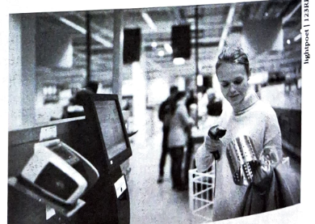 **Figura 5.19** Os códigos de barras em produtos são mecanismos de *poka-yoke* que eliminam o erro de digitação, como nesse auto-checkout.  O uso de *poka-yoke* é essencialmente um mecanismo preventivo que, embora tenha sido desenvolvido para prevenir problemas de qualidade e defeitos, têm sido largamente utilizado para prevenir também os acidentes e outras causas de interrupção, tornando-se um valioso aliado no objetivo de reduzir a probabilidade de ocorrências causadoras de interrupção nas cadeias de suprimentos.|

## Página 139

Nos riscos *intencionais*, a prevenção também é essencial, e prevenir riscos de ocorrências intencionais inclui aumentar a segurança. *Firewalls* contra ataques virtuais, sistemas protegidos por senhas seguras, transmissão de dados criptografados, segurança patrimonial para garantir acesso apenas a pessoas autorizadas e evitar roubo, sabotagem e espionagem industrial, mecanismos de segurança para prevenir roubos de carga, localização de unidades em áreas mais seguras, são todos exemplos de mecanismos que visam a aumento de segurança contra a ocorrência de eventos intencionais causadores de interrupção. Sheffi (2005) sugere que, para reduzir a probabilidade de riscos intencionais, a empresa:

▪️*use métodos em camadas.* Um exemplo são as camadas com diferentes níveis de segurança e acesso: primeiro, à empresa (crachá), depois a departamentos mais sensíveis (portas com teclado e senha de acesso), depois a equipamentos com senhas e possíveis sistemas biométricos (retina, impressão digital) de identificação e assim por diante;

▪️*consiga identificar atividades que representem ameaça dentre as normais.* A grande maioria das atividades realizadas dentro da empresa e na interface entre ela e seu ambiente é benigna. Apenas uma pequena proporção representa ameaça – os padrões destas atividades devem ser rapidamente identificados;

▪️*trabalhe colaborativamente e construa parcerias.* Como nas cadeias de suprimentos mercadorias e outros fluxos, como o financeiro e o de informações, trocam constantemente de mãos e envolvem muitas empresas, o trabalho colaborativo e integrado entre estas empresas pode ajudar a garantir um ambiente de operação mais seguro;

▪️*Treine muito e teste constantemente seus mecanismos.* Um dos perigos das medidas de segurança é elas se tornarem rotineiras e as pessoas deixarem de dar a elas a importância e atenção devidas. Assim, os sistemas devem ser constantemente testados, com a simulação de ocorrências, com ou sem o conhecimento prévio dos envolvidos, a fim de identificar a eficácia das medidas de segurança e ajudar a manter o nível de atenção.

**Redução das consequências das ocorrências associadas ao risco**

Uma segunda forma de redução dos riscos de interrupção nas cadeias de suprimentos é desenvolver e implantar ações e mecanismos para reduzir a *consequência* das interrupções. Aqui não se ganha muito por separar as ações por tipo de risco, porque, uma vez ocorrida a interrupção, o mais importante é que de forma rápida e eficiente as operações voltem à sua operação normal. Aqui, em geral, duas abordagens básicas podem ser usadas: redundância de recursos, agilidade e flexibilidade. De novo, estas duas abordagens gerais não são mutuamente exclusivas e podem (e muitas vezes devem) ser usadas em combinação.

▪️*Redundância de recursos* se refere a manter mais recursos disponíveis à empresa do que aqueles estritamente necessários à operação sob condições normais. Esses recursos "extras" são mantidos em níveis bem gerenciados exatamente para ajudar a empresa a fazer frente a possíveis interrupções. Se uma empresa mantiver algum nível de estoques de segurança (ver Capítulo 9) de um certo item, por exemplo, estará mais robusta a uma interrupção de fornecimento do que se não contar com nenhum estoque de segurança do item; se uma empresa tem apenas um fornecedor qualificado de certo item, será muito menos robusta a uma interrupção do que se tiver vários; se uma empresa tiver alguma capacidade extra de produção, sofrerá menos com a quebra de uma máquina; se tiver reservas financeiras, será mais robusta à saída do mercado de um cliente importante; se uma empresa de entregas expressas como a UPS ([www.ups.com](https://www.ups.com)) tiver aeronaves de reserva, sofrerá muito menos com uma interrupção causada por uma aeronave impedida de levantar voo pela falta de uma peça; se uma empresa tem *backups* de seus sistemas e dados, sofrerá menos com uma interrupção eventual causada por uma queda de sistema, um dano a um disco rígido ou ataque de um *hacker*.

## Página 140

▪️*Agilidade* se refere a características planejadas para o sistema a fim de torná-lo mais robusto. Por exemplo, na ocorrência de uma interrupção, os sistemas de informação e as pessoas envolvidas necessitam ter a agilidade para identificar o ocorrido, avaliar a sua severidade e disparar ações de recuperação. Isso não significa ter recursos redundantes, mas ter recursos que façam a informação fluir rapidamente até que chegue aos pontos de decisão adequados. Quando se percebe que um desastre natural afetou substancialmente um fornecedor, essa informação às vezes chega à empresa por meio de uma comunicação externa feita ao comprador. Este deve ter o discernimento e a rapidez para, se necessário, mobilizar outros membros da organização para avaliar o potencial impacto da ocorrência e ter os canais de comunicação abertos com níveis hierárquicos superiores para que eles sejam envolvidos o mais rapidamente possível. Estes, por sua vez, também têm de ter agilidade para disparar ações o mais rapidamente possível. Na gestão de uma crise, tempo é essencial, principalmente nos momentos imediatamente posteriores ao ocorrido, nas etapas de contenção do dano e início da etapa de preparação para recuperação.

* *Flexibilidade* é outra característica que pode alavancar muito a resposta às interrupções, auxiliando a reduzir suas consequências. Uma empresa, por exemplo, que tenha quatro fábricas dedicadas, cada uma a produzir exclusivamente um dos quatro produtos que vende ao mercado, quando sofre uma interrupção importante numa das fábricas, perde 100% da produção do referido produto. Se, por outro lado, a empresa tem quatro fábricas flexíveis, capazes de produzir, cada uma, os quatro produtos que a empresa vende, uma interrupção importante numa fábrica será mais facilmente absorvida pelas outras, desde que tenham alguma capacidade extra. Um grupo de funcionários polivalentes será muito mais capaz de produzir mesmo com um deles ausente do que um grupo de funcionários em que cada um seja capaz de executar apenas uma tarefa. Outros aspectos de flexibilidade que auxiliam na capacidade de reduzir as consequências de uma interrupção são a modularização e a padronização de peças, produtos e processos. Com maior padronização, mais intercambialidade de peças entre produtos, produtos entre mercados, e de processos entre unidades produtivas pode ser feita, na ocorrência de interrupções da disponibilidade de recursos (máquinas, fábricas) e do suprimento de peças.

Evidentemente, quando se trabalha com recursos redundantes e/ou flexíveis, há custos adicionais. Por isso, é muito importante pesar os custos extras da redundância e da flexibilidade dos recursos com os benefícios de uma maior robustez ou resiliência (a capacidade de recuperação da cadeia depois de uma interrupção) da cadeia de suprimentos.

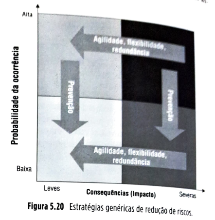

A Figura 5.20 ilustra as estratégias gerais de redução das probabilidades e consequências das ocorrências associadas a riscos.

**Figura 5.20** Estratégias genéricas de redução de riscos.

**Transferência de riscos**

Em várias situações, as empresas optam por transferir a terceiros parte dos riscos associados a interrupções. A forma mais evidente de transferência de riscos é o uso de empresas seguradoras que, por sua vez, em muitas situações, retransferem parte dos seus riscos para outras seguradoras em operações de resseguro. Da mesma forma que as empresas participantes das cadeias de suprimentos, as seguradoras também procuram trabalhar os dois aspectos dos seus riscos: a probabilidade de ocorrência de eventos causadores de interrupção/dano e as suas consequências, já que responsabilizar-se-ão por prejuízos decorrentes das consequências dos eventos, caso estejam dentro do que foi previsto em contrato entre seguradora e empresa segurada.

**Percepção de riscos em cadeias de suprimentos no Brasil**

Num dos poucos artigos da literatura que abordam gestão de risco no Brasil, Blos *et al.* (2009) investigaram utilizando pesquisa por levantamento (*survey*) a percepção de risco, nas cadeias de suprimentos, de executivos dos setores automotivo e de produtos eletrônicos no Brasil. Embora a amostra não seja grande (49 empresas responderam o questionário dos pesquisadores), a percepção identificada dos gestores quanto às principais vulnerabilidades de suas cadeias de suprimentos em relação a fatores que os fazem "expostos a perturbações sérias, originadas de riscos internos e externos à cadeia de suprimentos" é curiosamente similar quando se comparam ambos os setores industriais analisados. A tabela da Figura 5.21 traz os resultados da pesquisa.

## Página 141

**Vulnerabilidade Financeira**

| # | Fator de Risco | Automotivo % | Eletrônico % |
| --- | --- | --- | --- |
| 1 | Crédito | 35 | 33 |
| 2 | Liquidez/caixa | 20 | 21 |
| 3 | Recessão econômica | 10 | 11 |
| 4 | Instabilidade dos mercados financeiros | 9 | 9 |
| 5 | Flutuação de taxas de câmbio | 8 | 8 |
| 6 | Preços de combustíveis | 7 | 7 |
| 7 | Mudanças adversas nas leis para o setor | 6 | 6 |
| 8 | Inadimplência | 5 | 5 |

**Vulnerabilidade Estratégica**

| # | Fator de Risco | Automotivo % | Eletrônico % |
| --- | --- | --- | --- |
| 1 | Sindicatos | 27 | 25 |
| 2 | Relações com canal de distribuição | 17 | 18 |
| 3 | Relações com fornecedores | 15 | 14 |
| 4 | Relações com clientes | 13 | 12 |
| 5 | Lançamento de programas | 12 | 12 |
| 6 | Número de fornecedores | 9 | 9 |
| 7 | Decisões tecnológicas | 5 | 6 |
| 8 | Novos concorrentes | 2 | 4 |

**Vulnerabilidade a Eventos Danosos**

| # | Fator de Risco | Automotivo % | Eletrônico % |
| --- | --- | --- | --- |
| 1 | Dano a propriedade | 23 | 21 |
| 2 | Incêndio em edifício ou equipamento | 15 | 15 |
| 3 | Dano por raio | 15 | 14 |
| 4 | Dano por ventania | 9 | 10 |
| 5 | Explosão de caldeira ou máquina | 9 | 9 |
| 6 | Perda de instalação-chave | 7 | 8 |
| 7 | Poluição do terreno, água ou ar | 7 | 7 |
| 8 | Perdas de carga no transporte | 3 | 4 |
| 9 | Risco geopolítico | 3 | 3 |
| 10 | Inundação | 3 | 3 |
| 11 | Sabotagem | 3 | 3 |
| 12 | Tempestades | 3 | 3 |

**Vulnerabilidade Operacional**

| # | Fator de Risco | Automotivo % | Eletrônico % |
| --- | --- | --- | --- |
| 1 | Roubo | 17 | 18 |
| 2 | Erros de operador/acidente | 15 | 16 |
| 3 | Perda de pessoal-chave | 11 | 13 |
| 4 | Vírus de computador | 9 | 10 |
| 5 | Má qualidade | 9 | 10 |
| 6 | Falha em sistemas de TI | 9 | 8 |
| 7 | Riscos com recursos humanos | 9 | 8 |
| 8 | Perda de fornecedor-chave | 5 | 4 |
| 9 | Interrupção na logística (p. ex., rotas) | 4 | 4 |
| 10 | Perda de equipamento-chave | 4 | 3 |
| 11 | Falha no provedor logístico | 4 | 3 |
| 12 | Falha em instalações | 4 | 3 |

**Fonte:** Blos *et al.* (2009), conforme indicado na Figura 5.21 da imagem.

### 5.3 ESTUDO DE CASO: CISCO E A GESTÃO DE RISCOS NA CADEIA DE SUPRIMENTOS

**Figura 5.22** Sede da Cisco Systems, em São Francisco (EUA).

Um dos maiores terremotos que já atingiram a China ocorreu em 12 de maio de 2008, com magnitude de 7,8 na escala Richter e epicentro a 80 km a noroeste de Chengdu, a capital da província de Sichuan. O evento representou um teste de fogo para o recém-implantado mecanismo de gestão de riscos da Cisco Systems ([www.cisco.com](https://www.cisco.com)), gigante dos equipamentos eletrônicos para telecomunicações e cadeias de computadores, fundada em 1984 e com faturamento de mais de 40 bilhões de dólares em 2008, empregando 65 mil pessoas em todo o mundo.

Nos últimos anos, o monitoramento de crises na cadeia de suprimentos se tornou uma parte essencial do programa Cisco de Gestão de Risco na Cadeia de suprimentos (GRCS) dentro do setor recém-renomeado Gestão da Cadeia de Valor ao Cliente (GCVC). Na Cisco, GCVC é uma função central, anteriormente chamada Gestão de Cadeia Global de Suprimentos, tendo mudado de nome para enfatizar o foco no cliente.

Para fazer o programa funcionar, a equipe de GRCS tem parcerias próximas com outros setores da organização de GCVC, como o setor de Gestão Global de Fornecedores (GGF), que supervisiona as decisões de compras e suprimentos e relações com fornecedores globalmente; Operações de Produto, que transforma inovações de engenharia em produtos robustos; e Operações Globais de Manufatura, que supervisiona as operações de produção e logística da empresa por meio de uma extensa cadeia de parceiros (95% da produção da Cisco é terceirizada).

## Página 142

O programa de gestão de risco na cadeia de suprimentos (GRCS) da Cisco consiste nos seguintes componentes:

1. **Programa de Planejamento de Continuidade do Negócio (PCN).** Esse programa tem foco nos fornecedores, manufaturas terceirizadas e provedores de serviços logísticos, especificando e documentando planos e tempos de recuperação e definindo padrões de resiliência a serem atingidos.
2. **Gestão de crise.** A equipe global de gestão de crise da Cisco é responsável pelo monitoramento global e resposta a interrupções 24 horas por dia, sete dias por semana.
3. **Resiliência de produtos.** A gestão global de fornecedores (GGF) e a equipe de gestão de riscos em particular colaboram aqui para endereçar três questões:
▪️ auxiliar as unidades de negócios a tomarem boas decisões estratégicas que considerem vulnerabilidades em relação ao projeto de produtos;
▪️ traduzir estratégias de longo prazo de redução de risco em prioridades de curto prazo; e,
▪️ reduzir o custo de programas e estratégias de redução de risco.
4. **Resiliência da cadeia de suprimentos.** O GRCS trabalha com operações de manufatura, com as manufaturas terceirizadas e com os parceiros provedores de serviços logísticos a fim de identificar nós na cadeia de suprimentos com tempos estimados de recuperação de interrupções maiores que a tolerância estabelecida pela Cisco e desenvolver planos de aumento de resiliência desses nós.

### Parceiros-chave

O programa Cisco de GRCS requer muita colaboração multissetorial. Por exemplo, o time de GRCS trabalha com a equipe de engenharia para avaliar atributos de resiliência de novos produtos ainda em desenvolvimento (por exemplo, a dependência de fornecedores únicos). Esse planejamento permite à empresa construir resiliência na cadeia de suprimentos desde as etapas de projeto de produtos e de processos. Às vezes, requisitos de projeto são conflitantes com os níveis requeridos de resiliência na cadeia de suprimentos. Pode haver risco, por exemplo, de se projetar um produto que dependa exclusivamente de um fornecedor novo — uma empresa, por exemplo, que ainda não tenha demonstrado sua habilidade de aumentar volumes de produção com a rapidez necessária ou manter estabilidade financeira ao longo do tempo. Para produtos já em produção, a equipe de GRCS trabalha de perto com operações de manufatura a fim de definir planos de aumento de resiliência (por exemplo, qualificando fornecedores alternativos, fábricas alternativas e negociando e implantando estoque e capacidade produtiva de segurança).

### O programa de GRCS da Cisco em ação

A Cisco tem centenas de parceiros terceirizados com fábricas ao redor do mundo. Para permitir o monitoramento da cadeia de suprimentos, em primeiro lugar a equipe precisa entender onde cada componente dos produtos Cisco é de fato produzido. Para coletar essa informação crucial, foi desenvolvido o planejamento de continuidade do negócio (PCN) que coleta todas as informações necessárias para realizar a análise de risco da cadeia de suprimentos, adicionalmente ao plano de gestão de crise. A coleta de dados dos fornecedores inclui: endereço físico das fábricas, contatos em emergência, localização de fábricas alternativas e tempo de recuperação no caso de necessidade de mudança de produção para a fábrica alternativa. A coleta de informações inclui também uma avaliação dos planos de continuidade dos próprios fornecedores, na eventualidade de uma interrupção.

Com a cadeia de unidades de operação definida, a organização de GRCS está pronta para começar a correlacionar eventos mundiais com as localizações estratégicas no mapa. A equipe utiliza informações da NC4 (National Center for Crisis and Continuity Coordination – Centro Nacional para Coordenação de Crises e Continuidade ([http://www.nc4.us](http://www.nc4.us)), uma organização que monitora continuamente perturbações mundiais de várias naturezas: políticas, meteorológicas, sísmicas, entre outras), o que permite construir perfis de alerta baseados em específicas localidades.

A NC4 envia sistematicamente a seus clientes, como a Cisco, alertas customizados, que podem ser filtrados com base em vários atributos, como severidade e tipo da ocorrência. No caso do terremoto de Chengdu, a equipe da Cisco foi notificada com o seguinte alerta da NC4: *Incidente meteorológico e geofísico moderado a extremo a menos de 100 km da localidade da cadeia de suprimentos.*

Esse monitoramento próximo e em tempo real reduz muito o tempo de resposta a eventos que não estejam sob controle da Cisco. No caso de Chengdu, em 48 horas a empresa foi capaz de conduzir uma análise completa do impacto do incidente, incluindo uma avaliação de fornecedores, peças e produtos afetados. Dentro de dois dias, a equipe de GRCS havia iniciado um levantamento completo da crise visando à comunicação com os contatos de emergência dos fornecedores da região.

Em paralelo, a Cisco disparou avaliações completas junto às empresas parceiras para averiguar o impacto financeiro. Essa análise inicial revelou, em menos de 24 horas, que a empresa tinha algo em torno de 20 fornecedores na área afetada.

## Página 143

Embora não tenha havido nenhum impacto direto em nenhuma instalação fabril ou armazém da empresa ou terceirizada, havia dois fornecedores de componentes potencialmente sob risco: o Fornecedor X, que apresentava risco de redução de faturamento para a Cisco (além de ser fornecedor único) e o Fornecedor Y, com menor impacto no faturamento, mas com dano físico em um de seus edifícios.

Ocorre que a equipe de GRCS, junto com a função de gestão global de suprimentos, havia proativamente começado a trabalhar para endereçar a questão de fornecedor único do Fornecedor X e já havia identificado uma fonte alternativa alguns meses antes. Quanto ao Fornecedor Y, o time de GRCS de gestão de crise mobilizou colegas internos de planejamento de operações e suprimentos para ativar fontes alternativas de suprimentos anteriormente identificadas, assim como conseguir o comprometimento do fornecedor com o aumento de sua capacidade.

## Quantificando o impacto

Uma vez identificadas as instalações afetadas pelo terremoto na China, foi possível usar a informação coletada para determinar o potencial impacto da ocorrência nos despachos futuros de produtos da Cisco para seus clientes e, como consequência, o impacto nos resultados da organização.

A Cisco utiliza as mesmas capacitações analíticas para desenvolver avaliações proativas e desenvolver iniciativas de redução de risco. Para isso, a empresa usa um "mecanismo de risco" para avaliar a probabilidade de ocorrências. O mecanismo de risco inclui várias bases de dados (como dados históricos de 100 anos de inundações, dados atuariais, dados geopolíticos e geológicos, dados de acidentes por instalação, dados de desempenho histórico de fornecedores).

Estas probabilidades de interrupção são correlacionadas com todas as localidades envolvidas com a cadeia de suprimentos da Cisco, como as fábricas dos fornecedores, as manufaturas terceirizadas, os armazéns e os centros logísticos. O impacto de uma interrupção é determinado com base em quanto o faturamento da Cisco é dependente de cada um dos nós da cadeia de suprimentos analisados e nos correspondentes tempos de recuperação em caso de interrupção. A Cisco usa até modelos de simulação para consideração conjunta de todos esses dados para a criação de mapas visuais, baseados em probabilidades e impactos de interrupções.

## Reduzindo riscos na base de fornecedores

Um programa centralmente coordenado facilita uma resposta rápida e coordenada para crises. Por exemplo, em 2008, quando a situação da economia mundial se degradou, a Cisco ficou preocupada com a saúde financeira de vários de seus fornecedores principais. A empresa rapidamente lançou uma iniciativa de avaliação de risco financeiro a fim de identificar fornecedores com itens fornecidos com exclusividade que teriam implicações importantes em termos de faturamento em caso de interrupção por saída do mercado. Colaborativamente com o grupo de gestão global de suprimentos e com o setor financeiro, a equipe de GRCS rapidamente organizou reuniões com os parceiros em risco e, depois de uma completa avaliação, classificou-os em três categorias: "verde", que não requeriam qualquer ação, "amarelo", que requeriam monitoramento, e "vermelho", que necessitavam de ações de redução de risco. Para fornecedores que caíram na classificação vermelha, a Cisco rapidamente disparou ações para identificar fornecedores alternativos. Quando dois dos fornecedores foram à falência meses depois, a empresa já havia estabelecido fontes alternativas para as peças fornecidas por eles, reduzindo assim, substancialmente, o impacto das interrupções.

## Reduzindo risco nas unidades manufatureiras

Novamente em relação ao terremoto de Chengdu, baseado na avaliação do impacto, a Cisco foi capaz de rapidamente avaliar se tinha havido impacto nas suas unidades produtivas ou centros logísticos. Se tivesse havido, o programa de redução de risco teria entrado em ação para ativar os planos de recuperação e garantir que esta ocorresse dentro dos tempos pré-estimados, trabalhando intensamente e de perto com os grupos envolvidos, como o de gestão de manufatura.

Construir resiliência pode ser bastante caro, dada a complexidade e o tamanho da tarefa. No caso da Cisco, implica coletar dados de mais de 700 fornecedores, identificar e qualificar fontes de suprimentos alternativas e construir capacidades de resposta a crises que possam lidar com mais de oito mil produtos. Orçamentos específicos são necessários e isso só se consegue com o comprometimento da alta direção.

## Página 143

## 5.4 RESUMO

▪️Se, por um lado, as cadeias globais representam enormes oportunidades de redução de custos e de uso de talentos e recursos onde quer que se localizem (ver Capítulo 4), por outro lado, os riscos também aumentaram muito.
▪️Risco, genericamente considerado, pode ser definido como o valor estatístico da expectativa sobre um evento indesejado que pode ocorrer ou não.
▪️O valor da expectativa sobre um possível evento negativo é dado pela consideração conjunta da probabilidade estimada da sua ocorrência por alguma medida de sua severidade, impacto ou consequência.
▪️Risco em cadeias de suprimentos está associado à possibilidade de um evento indesejado ocorrer e seu consequente impacto na consecução do objetivo amplo da gestão de cadeias de suprimentos, que é o de conciliar suprimento e demanda.
▪️Diferentes tipos de risco, aleatórios, acidentais e intencionais, podem exigir diferentes formas de gestão.
▪️É importante classificar os riscos, porque as formas de se lidar com os diferentes tipos pode ser diferente.
▪️O processo de gestão de risco em cadeias de suprimentos em geral engloba os seguintes passos:
1. identificação de processos e recursos sujeitos a riscos;
2. identificação dos principais riscos;
3. avaliação da probabilidade de ocorrência associada aos principais riscos;
4. identificação das consequências da ocorrência associada aos riscos;
5. avaliação dos níveis de vulnerabilidade;
6. definição de ações priorizadas para redução e transferência de riscos.
▪️A vulnerabilidade de uma empresa ou cadeia de suprimentos aos riscos está associada à consideração conjunta da probabilidade da ocorrência associada ao risco e a seriedade (ou, às vezes, chamada severidade) do seu impacto.
▪️Há duas formas de se reduzir a vulnerabilidade a riscos nas cadeias de suprimentos: ou se reduzem as probabilidades, ou se reduzem as consequências das ocorrências causadoras das interrupções.
▪️A expressão japonesa *poka-yoke*, que traduzida com certa liberdade significa à prova de falhas, engloba os conceitos desenvolvidos por Shigeo Shingo, um consultor japonês, na década de 1960. O conceito pode ser adaptado para auxiliar no controle de riscos.
