# Capítulo 8 - Gestão de demanda na cadeia global de suprimentos

**8.1** Introdução, 213
**8.2** Conceitos, 216
**8.2.1** O que é e por que fazer gestão de demanda, 216
**8.2.2** Causas da variabilidade da demanda, 218
**8.2.3** Previsão de demanda, 224
**8.2.4** Processo de previsão, 228
**8.2.5** Processo de previsão de vendas, 229
**8.2.6** Métodos usados em previsões, 232
**8.2.7** Erros (ou incerteza) de previsão, 236
**8.2.8** Calibração de modelos de previsão – definição de parâmetros, 238
**8.2.9** Gestão de preços e de receitas (*revenue management*), 240
**8.3** Estudo de caso: Genexis em expansão, 242
**8.4** Resumo, 244

## Página 213

### 0BJETIVOS DE APRENDIZAGEM

📌 Entender o que é e por que é importante a gestão de demanda.

📌 Sintetizar as formas possíveis de se influenciar a demanda percebida por elos numa cadeia de suprimentos de forma a reduzir sua variabilidade.

📌 Identificar e explicar as formas possíveis de se prever demanda, de forma a reduzir sua incerteza.

📌 Entender as formas possíveis de gerenciar preços, de forma a influenciar a demanda e maximizar as receitas das cadeias de suprimentos.

### 8.1 INTRODUÇÃO

Uma das funções mais importantes da gestão da cadeia de suprimentos de uma empresa é conciliar eficientemente o suprimento e a demanda dos clientes/usuários finais, quanto aos produtos e serviços oferecidos, de forma a garantir que eles fiquem altamente satisfeitos, tornem-se clientes fiéis e frequentes e recomendem o produto ou serviço a outros clientes, como propagandistas gratuitos. No esforço de conciliação da demanda com o suprimento, é importante que o gestor de cadeias direcione sua atenção não apenas a fim de garantir que o suprimento responda adequadamente à demanda, por meio de uma boa gestão dos fluxos de informação, bens e clientes sendo processados, mas também se preocupe com possíveis formas de gerenciá-la (por exemplo, procurando prevê-la com níveis adequados de precisão e mesmo influenciá-la, tornando-a, por meio de ações, menos volátil e mais estável, quando possível). O objetivo deste capítulo é discutir as técnicas e meios pelos quais a gestão de demanda pode ser feita e também abordar importantes aspectos da gestão do nível de serviço logístico oferecido ao cliente.

A Figura 8.1 localiza a gestão de demanda e do nível de serviço ao cliente no quadro de referência geral usado neste livro.

## Página 214

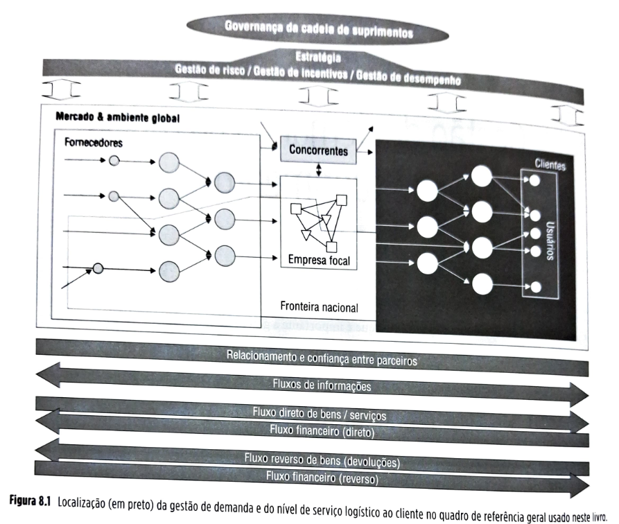

**Gestão de demanda na Toyota, o maior fabricante de carros do mundo**

A Toyota Motor Co. Ltd (Toyota) iniciou suas operações em 1937, quando Kiichiro Toyoda estabeleceu uma fábrica de veículos automotores independente de sua empresa da época, a Toyoda Automatic Loom Works (ALW), uma fabricante de equipamentos para tecelagem. O capital inicial para os primeiros experimentos com a fabricação de automóveis veio da venda dos direitos de patente de uma das máquinas inventadas pelo fundador da Toyoda ALW, Sakichi Toyoda e pai de Kiichiro. No período de pós-guerra, mais especificamente em 1950, a Toyota experimentou a única greve da história da empresa, da qual, depois de extensas negociações, tanto os trabalhadores quanto a empresa e sua gestão saíram firmemente comprometidos com os princípios de confiança mútua e interdependência para o bem comum.

## Página 215

O bom relacionamento entre os trabalhadores e a empresa continua até hoje. Durante os anos 1950 e daí por diante, as técnicas de produção foram aperfeiçoadas, culminando com o desenvolvimento do chamado *Toyota Production System* (Sistema Toyota de Produção) pelo legendário gerente Taiichi Ohno (considerado o pai do sistema *just in time*), um sistema que se tornou a base do *lean production* (produção enxuta). adotado largamente não só na indústria automobilística, mas em muitas outras. O Sistema Toyota de Produção é baseado nos princípios de *jidoka* (sistema que interrompe a produção quando um defeito é encontrado, seguindo o postulado de que qualidade se constrói durante o processo de produção), *just in time* (por meio do sistema *kanban* de fluxos produtivos puxados, em que se produz só o que é necessário, quando necessário e na quantidade necessária) e *kaizen* (sistema de melhoramentos contínuos). Considera-se que o Sistema Toyota de Produção é, em grande parte, a razão de os níveis de estoques e defeitos dentro das fábricas da Toyota serem, por larga margem, os menores do mundo dentro do setor industrial.

Em 2018, a Toyota teve vendas líquidas de US$ 256 bilhões, tinha 16 fábricas no Japão e 53 ao redor do mundo, distribuídas entre 27 países/regiões, e foi em 2017 a terceira maior fabricante do mundo por produção de veículos, com pequena margem atrás da primeira e segunda. A Figura 8.3 traz os detalhes.

| Volkswagen | 10,742 milhões (+ 4,3% sobre 2016) |
| --- | --- |
| **Aliança Renault Nissan Mitsubishi** | 10,740 milhões (+ 6,2% sobre 2016) |
| **Toyota** | 10,466 milhões (+ 2,9% sobre 2016) |

**Figura 8.3** Os três maiores grupos automotivos do mundo ranqueados por produção de veículos (2017).

A Toyota é a líder do mercado japonês de veículos (Honda e Nissan são suas maiores e mais fortes rivais lá), onde sua atuação, desde os anos 1950, lançou as bases para a jornada que a tornou a maior fabricante de carros do mundo. Um dos fatores diferenciadores da Toyota que, com suas práticas de manufatura, tem garantido uma competitividade sustentada por décadas é a sua competência em gerenciar sua demanda, o que inclui não só a demanda de veículos por usuários finais, mas também a gestão dos seus canais de distribuição – as concessionárias, que são os clientes diretos da empresa.

### Canais de distribuição

No Japão, a Toyota trabalha com quatro canais de distribuição: Toyota (carros grandes), Toyopet (carros médios), Corolla (carros compactos) e Netz (carros subcompactos). A empresa oferece em torno de 60 modelos de carros, com cada canal distribuindo apenas de 15 a 25 modelos. Dessa forma, cada concessionária pode desenvolver um conhecimento profundo de cada modelo que vende. Cinquenta por cento dos modelos são vendidos como exclusivos de cada canal (não podendo ser encontrados em outros canais). A Toyota tem em torno de 300 concessionárias no Japão, cada uma com cerca de 18 a 20 lojas. A empresa aplica o "jeito Toyota" (*Toyota Way*) de fazer negócios também no seu relacionamento com as concessionárias. É baseado em três princípios:

1. **independência das concessionárias** como investidores externos à empresa;
2. **vitória compartilhada**: concessionárias e Toyota têm de prosperar juntos; e
3. **encorajamento de concorrência entre concessionárias**: essa é a forma de melhorar.

A empresa mede o desempenho das concessionárias periodicamente, a partir de um sistema de ranqueamento e recompensa. Fazem parte das dimensões medidas:

* vendas de carros novos e usados (unidades e fatia de mercado);
* vendas de serviços e peças pós-venda (unidades e fatia de mercado);
* satisfação do cliente;
* número de lojas, pessoal e oficinas; e
* lucratividade.

O contrato típico com uma concessionária dura três anos, e mau desempenho repetido pode resultar em suspensão ou desligamento da cadeia.

### Gestão de pedidos e de estoques de veículos na Toyota Japão

O processo de gestão de pedidos segue uma lógica puxada, com os clientes colocando pedidos na concessionária, que então os repassa à Toyota. Não é um sistema puxado puro, já que as concessionárias também fazem pedidos antecipados e recebem carros que foram produzidos para estoque, a fim de permitir atender clientes que querem disponibilidade imediata ou tempo muito curto de entrega. No caso de veículos para estoque, os carros são estocados em um ponto de armazenagem, onde as concessionárias podem inspecioná-los e instalar opcionais quando os pedidos entram. No geral, as concessionárias têm em média o volume de um mês de vendas em estoque em seus pontos de armazenagem, que em geral são localizados em regiões mais afastadas, devido ao alto custo do metro quadrado urbano no Japão. No final do ano, os veículos que foram comprados para estoque e sobraram, ou são vendidos como carros usados, ou sofrem descontos de preço para facilitar a venda como novos.

## Página 216

Similarmente, embora a Toyota vise a basear toda a produção doméstica japonesa em pedidos firmes de consumidores ou de concessionárias (produzindo apenas contra pedido), na realidade alguns carros são feitos para estoque. O departamento de marketing prepara planos de pedido baseados em previsões e os transmite ao departamento de produção. A empresa controla esse processo muito de perto e reajusta previsões e planos de produção mensalmente e com cuidado, de forma que um mínimo de veículos reste em estoque ao final do ano. Em média, a empresa mantém apenas cinco mil carros em estoque (ou em torno de 2% a 3% do volume mensal produzido). Solicita periodicamente às concessionárias que absorvam parte do seu estoque extra a fim de reduzir a sua posição de estoques. Em tempos de falta de veículos, como foi o caso do lançamento do carro híbrido Prius, a Toyota faz alguma alocação de carros para as concessionárias, baseada nos tamanhos de pedidos. Isso pode acarretar nas concessionárias o comportamento de "jogar" com o sistema, inflacionando pedidos para conseguir maior alocação. Na prática, isso acontece muito raramente, porque a Toyota deixa claro que, se esse comportamento for identificado, a alocação passará imediatamente a zero. A relação de confiança entre concessionárias e empresa parece auxiliar para que o efeito chicote seja atenuado. O efeito chicote, brevemente descrito no Capítulo 2 e tratado em mais detalhes adiante neste capítulo, nesse caso, ocorre quando concessionárias, exagerando seus pedidos, distorcem os padrões de demanda que a Toyota percebe nas suas vendas, causando, assim, ineficiências.

### 8.2 CONCEITOS

### 8.2.1 O que é e por que fazer gestão de demanda

A principal função da gestão de cadeias de suprimentos é garantir que o suprimento e a demanda sejam compatíveis. Essa compatibilidade pode ser obtida por meio de planos e ações que façam com que o suprimento se adeque à demanda, que façam com que a demanda se adeque às possibilidades do suprimento ou, ainda, por uma combinação de ambas. De todas as formas, uma boa gestão de cadeias de suprimentos começa com uma boa gestão de demanda. Neste capítulo, serão discutidos os seguintes tópicos referentes à gestão de demanda:

▪️**Ações sobre a demanda para redução de sua variabilidade:** são recomendáveis às vezes, porque, em geral, atender a demandas mais variáveis requer mais recursos ou acarreta que estes sejam utilizados de forma menos eficiente, por parte da cadeia de suprimentos. Às vezes, a necessidade de lidar com demandas mais variáveis é inevitável, mas outras vezes não. Com frequência, as próprias cadeias de suprimentos, por decisões internas inadequadas, fazem a variabilidade de sua própria demanda aumentar. Nesses casos, reduzir o nível de variabilidade com a qual a cadeia de suprimentos tem de lidar levará a uma maior eficiência de uso dos recursos da cadeia.

▪️**Previsão de demanda para reduzir incertezas:** é necessário que os gestores da cadeia de suprimentos trabalhem com o menor nível possível de incerteza, já que a necessidade de lidar com a dúvida normalmente reduz a eficiência e/ou a eficácia da operação. Há vários tipos de incerteza que podem afetar negativamente o desempenho da gestão de cadeias de suprimentos, e a incerteza da demanda futura é uma das mais importantes. Ela fará com que a cadeia tenha de se preparar para uma faixa de possibilidades futuras, o que demandará mais recursos quanto maior for a faixa. O uso de boas técnicas de previsão faz com que a incerteza sobre a demanda futura seja menor e, portanto, com que o uso dos recursos da cadeia de suprimentos seja mais eficiente com simultâneo maior nível de serviço logístico.

## Página 217

▪️**Gestão de preço e de receitas:** um último aspecto importante sobre a gestão de demanda em cadeias de suprimentos diz respeito à gestão de receitas. Gestão de receitas é um tópico essencial no ato de balancear adequadamente o uso de recursos e o nível de serviço ao cliente e inclui o tratamento analítico de questões como: quanto, em cada momento, o cliente está disposto a pagar pelo serviço ou produto solicitado? Quanto da capacidade disponível na cadeia de suprimentos deveria ser alocada a cada tipo de cliente para maximização de receitas? Respostas erradas a essas perguntas podem comprometer receitas por preços subestimados e/ou acarretar perda de clientes importantes por incapacidade de atendê-los.

Esses três aspectos da gestão de demanda em cadeias de suprimentos serão tratados em detalhes no restante deste capítulo.

### Ações sobre a demanda para redução de variabilidade

A variabilidade da demanda diz respeito a quanto a demanda varia dentro de um ciclo; por exemplo, um ano para produtos sazonais (demandas sazonais variam de acordo com as estações do ano). Pense na demanda de sorvetes no Brasil. A demanda no pico do verão chega a ser de cinco a sete vezes maior do que a demanda no vale de demanda, no inverno. A cadeia de suprimentos dos fabricantes de sorvetes tem, portanto, sua demanda bastante variável. Já outros produtos podem apresentar demanda bem menos variável ao longo do ano. A demanda de algumas peças de reposição, como as pastilhas de freio, varia, com uma demanda levemente maior no período que antecede as férias (quando muita gente faz revisões em seus veículos), mas essa variação não é drástica – os gestores da cadeia de suprimentos de pastilhas de freio, então, encaram uma demanda muito menos variável que os gestores da cadeia de sorvetes. A Figura 8.4 ilustra o conceito.

**Figura 8.4** Diferentes níveis de variação da demanda encarada por uma cadeia de suprimentos.

A implicação de terem de lidar com uma demanda mais variável é que as cadeias de suprimentos têm de responder a essa variação. A resposta a qualquer variação requer recursos adicionais (e quanto maior o nível de variação, maiores os níveis de recursos necessários). Por exemplo, se a cadeia de suprimento de sorvetes decidir por fabricar e entregar sorvetes nas mesmas taxas em que o produto é consumido (em unidades por semana), a cadeia terá de produzir uma enorme quantidade de sorvetes por semana no verão – e, portanto, a capacidade das fábricas terá de ser equivalente ao pico da demanda. Isso requererá um investimento em capital (máquinas e instalações) bastante grande, que ficará subutilizado durante o inverno, quando as fábricas produzirão a uma taxa equivalente ao nível mínimo da demanda.

Assim, a cadeia trabalhará de forma ineficiente, com baixo índice médio de utilização de seus recursos. Esse efeito e a decorrente ineficiência da cadeia será menor para o fabricante de pastilhas de freio: o investimento em capital terá de ser menor (pois o pico de demanda é menor) e a ociosidade durante o período de demanda baixa também será menor. Veja a Figura 8.5.

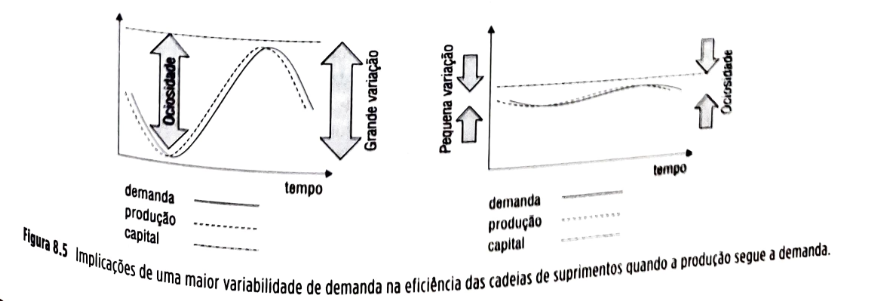

**Figura 8.5** Implicações de uma maior variabilidade de demanda na eficiência das cadeias de suprimentos quando a produção segue a demanda.

## Página 218

Mesmo que as cadeias de suprimentos trabalhem no sentido de manterem seus níveis de produção mais estáveis ao longo do tempo (para conseguir índices mais constantes de utilização de recursos e menor necessidade de investimento de capital), usando estoques para conseguir compatibilizar suprimento e demanda (continuando a produzir durante o período de baixa demanda a fim de construir estoques que serão usados posteriormente para atender o pico), os custos de fazer isso serão maiores para as cadeias que encaram maior variabilidade de demanda, pois os níveis de estoques necessários serão maiores. Veja a Figura 8.6.

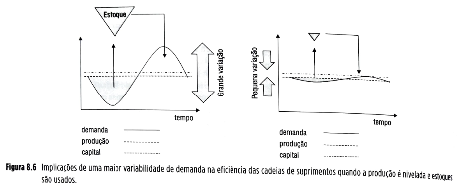

**Figura 8.6** Implicações de uma maior variabilidade de demanda na eficiência das cadeias de suprimentos quando a produção é nivelada e estoques são usados.

São infinitas as opções de escolha que uma cadeia de suprimentos tem para compatibilizar seu suprimento com sua demanda, possivelmente sem usar nenhum dos casos extremos ilustrados anteriormente, mas combinações deles. Uma coisa, entretanto, fica clara, qualquer que seja a opção escolhida: uma cadeia de suprimentos incorre em custos maiores quando precisa lidar com maior variabilidade de demanda.

| 💡**Fique atento**💡{bg=amarelo} |
| --- |
| Se for possível reduzir a variabilidade da demanda por meio de ações, isso deve ser feito sempre que os custos das ações forem menores que os custos de lidar com a variabilidade. Isso porque os custos incorridos por uma cadeia de suprimentos para lidar com uma demanda mais variável são, na grande maioria das vezes, maiores do que os custos de lidar com uma demanda menos variável. |

### 8.2.2 Causas da variabilidade da demanda

Há duas causas possíveis para a variabilidade de demanda que afetam as cadeias de suprimentos:

▪️**variações da demanda do consumidor final:** são variações – necessárias ou não – nos padrões de compra e consumo dos produtos e serviços oferecidos; e

▪️**variações causadas pelo efeito chicote:** são variações na demanda de partes da cadeia de suprimentos causadas não apenas pelas variações nos padrões de compra e consumo do usuário, mas por ações evitáveis e condições controláveis internas à cadeia de suprimentos.

Cada uma é analisada a seguir, juntamente com as opções gerenciais disponíveis para combatê-las.

**Variações da demanda do consumidor final**

As ciclicidades da demanda são exemplos. Pode haver ciclicidade *diária* na demanda de restaurantes *fast-food*, por exemplo (acúmulo de demanda nos horários de refeição); pode haver ciclicidade *semanal* na demanda por entretenimento, como nos cinemas, em que a demanda se concentra nos fins de semana; pode haver ciclicidade *mensal* na demanda por itens de supermercado, que se concentra depois dos dias de pagamento; pode haver ciclicidades *anuais*, como a demanda por cerveja, maior no verão que no inverno. Há basicamente duas políticas que podem ser usadas para atenuar as variações da demanda do consumidor final: a primeira se refere a tentar *alterar as curvas de demanda*, de modo que pelo menos parte da demanda do período de pico seja transferida para o período de baixa, e a segunda se refere a *oferecer produtos e serviços com padrão oposto de ciclicidade* em relação aos produtos e serviços originais. Ambas as políticas são discutidas a seguir.

## Página 219

Alterar as curvas de demanda significa conceber e implantar estratégias de persuasão (pelo menos, de parte) dos clientes que demandariam seus produtos e serviços no período de pico a fazê-lo no período de baixa demanda. Isso pode ser feito por meio da oferta dos produtos a preços reduzidos nos períodos de baixa demanda. As companhias telefônicas fazem isso, oferecendo alguns pacotes com tarifas reduzidas para madrugada e fim de semana, os cinemas oferecem entradas cerca de 10% mais baratas de segunda a quarta-feira, os hotéis e companhias aéreas oferecem preços especiais para baixa estação, alguns varejistas oferecem descontos para os clientes que anteciparem suas compras de Natal.

| 🔵**SAIBA MAIS**{bg=azul} |
| --- |
| **Vantagens adicionais de procurar antecipar demanda do pico**  Quando foram mencionadas empresas que oferecem descontos a fim de que os clientes efetuem seus pedidos antecipadamente ao pico de Natal, por exemplo, é importante perceber que, além de suavizar a demanda, essa ação pode trazer outro benefício. Os clientes que resolverem aceitar a oferta de colocarem pedidos antecipadamente poderão se tornar uma amostra com representatividade do total de pedidos a serem recebidos no pico. Essa amostra pode dar importantes informações antecipadas para permitir melhores previsões sobre quais produtos serão pedidos pelos outros clientes. Como isso ocorre com antecipação, a cadeia de suprimentos poderá se preparar melhor, com menor incerteza sobre a demanda futura. Confecções como a Benetton e a Zara usam esse artifício para "testar" suas coleções antes de cada estação e verificar com antecipação quais modelos vão agradar mais ou menos aos seus clientes.  **Questões para discussão** |

Redução de preço não é a única forma de alterar a curva de demanda. Às vezes, comunicação pode também ser eficaz. Divulgar que uma ligação para um *call center* será atendida muito mais rapidamente depois das oito horas da noite pode levar uma boa parte da demanda a buscar o serviço neste período. A ideia dessas políticas é tentar nivelar, tanto quanto possível, a curva de demanda, com vistas a diminuir seu nível de variabilidade.

| 💡**Fique atento**💡{bg=amarelo} |
| --- |
| **Algumas fontes de variabilidade de demanda são autoimpostas**  Às vezes, as empresas se autoimpõem maiores necessidades de lidar com níveis de variabilidade do que seria necessário. Um exemplo típico são as cotas mensais que as equipes de vendas muitas vezes têm de cumprir. Isso induz um comportamento nas equipes de vendas (e nas equipes de compras dos clientes) que se traduz no seguinte: os compradores dos clientes aguardam até que o final do mês se aproxime para fazer seus pedidos, e que os vendedores comecem a ficar preocupados com o cumprimento de suas metas mensais, porque isso fará com que estes se tornem mais "permeáveis" a pressões por redução de preços.  Os vendedores, correspondentemente, também começam a se esforçar mais para conseguir pedidos quando o fim do mês se aproxima. Ambas as atitudes colaboram para que os pedidos se acumulem nos últimos dias do mês. Algumas empresas brasileiras chegam a ter mais de 40% de sua demanda concentrada nos últimos quatro ou cinco dias do mês. Isso faz com que a demanda seja baixa no início e meio do mês e tenha um pico (com o qual a cadeia de suprimentos terá de lidar) no final. Essa variabilidade prejudica muito o nível de eficiência das cadeias. Uma solução adotada por muitas empresas é estabelecer, em vez de metas mensais aos seus vendedores, metas, por exemplo, para cada dez dias ou mesmo metas semanais. Com isso, tentam atenuar os picos de demanda autoimpostos.|

## Página 220

Oferecer produtos e serviços com padrão oposto de ciclicidade se refere a tentar achar produtos e serviços que utilizem os mesmos recursos da cadeia de suprimentos para serem produzidos e entregues, mas que tenham a ciclicidade de suas curvas de demanda diametralmente opostas à ciclicidade das curvas dos produtos e serviços originais. Os hotéis fazem isso para lidar com suas ciclicidades semanais. Sabendo que seus hóspedes executivos demandam muito mais seus serviços durante os dias úteis da semana, criam pacotes promocionais para famílias a passeio, cuja demanda é oposta àquelas dos executivos: concentra-se nos fins de semana. Com isso, a soma total da demanda de executivos e de famílias a passeio será muito menos variável que a demanda de cada uma separadamente. Isso também pode ter influência positiva na receita dos hotéis, como será visto adiante neste capítulo. As cadeias fabricantes de sorvetes também procuram explorar demandas por sobremesas geladas com maior teor de gordura que possam ser consumidas no inverno para se contrapor a uma ciclicidade com pico no verão de produtos como os picolés. Ambos utilizam muitos dos mesmos recursos da cadeia, mas em diferentes períodos do ano – dessa forma, resultando numa demanda global muito mais nivelada, com correspondentes em maiores níveis de eficiência. O mesmo ocorre com as cadeias de suprimentos de cerveja, que tendem a lançar produtos mais encorpados (como as cervejas tipo *Stout* ou *Bock*) para consumo no inverno, a fim de se contrapor a uma demanda, muito mais concentrada no verão, de cervejas mais leves, como as do tipo *Lager*.

A Figura 8.7 ilustra as duas políticas descritas anteriormente.

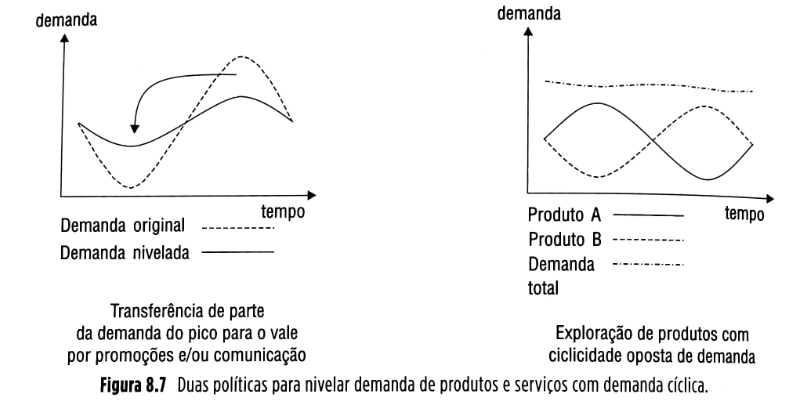

**Figura 8.7** Duas políticas para nivelar demanda de produtos e serviços com demanda cíclica.

### Efeito chicote (*bullwhip effect*)

Em cadeias de suprimentos, grande parte da variabilidade que as operações têm de enfrentar é causada não pelas variações da demanda do consumidor final, mas por práticas e decisões tomadas por outros membros da cadeia de suprimentos. O efeito da variabilidade (também chamada de volatilidade) ampliada percebida por empresas dentro de uma cadeia de suprimentos (em geral, mais a montante da cadeia) e causado por razões internas à própria cadeia é chamado de efeito chicote, brevemente descrito no Capítulo 2 e discutido em mais detalhes agora.

| 💡**Fique atento**💡{bg=amarelo} |
| --- |
| O efeito chicote é um fenômeno dinâmico que faz com que pequenas variações de demanda no nível do consumidor final de uma cadeia de suprimentos se amplifiquem crescentemente à medida que as informações sobre essa demanda (normalmente na forma de *pedidos*) são transmitidas (e distorcidas) sequencialmente ao longo das relações cliente-fornecedor na cadeia de suprimentos. |

Uma ilustração do efeito chicote pode ser observada a partir de uma cadeia de suprimentos simplificada, como a mostrada na Figura 8.8.

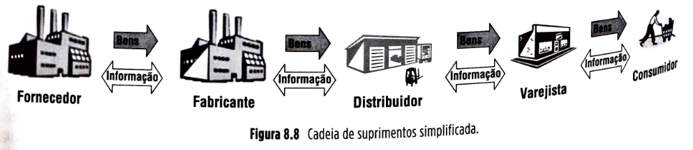

## Página 221

Imagine que cada um desses nós da cadeia de suprimentos (varejista, distribuidor, fabricante e fornecedor) tenha a política de manter em estoque o equivalente a um mês de sua demanda imediata. Assim, se a demanda imediata do nó sobe, o sistema de gestão faz também subir o seu nível de estoques, e se a demanda cai, o sistema ajusta para baixo o nível de estoques. Imagine que a demanda do consumidor, percebida pelo varejista dessa cadeia, tem sido estável há vários meses e igual a 50 unidades por mês. Como a cadeia trabalha para manter a demanda atendida e para manter o equivalente à demanda de um mês em estoque, no mês corrente (Mês 1), todos os nós da cadeia têm demanda percebida de 50 unidades, entregam 50 unidades para seus clientes imediatos, compram 50 unidades de seus fornecedores imediatos e mantêm em estoque 50 unidades. A cadeia toda está estável. Isso pode ser visto pela primeira linha (correspondente ao Mês 1) da tabela da Figura 8.9. Essa tabela demonstra o que acontece com as demandas imediatas dos nós da cadeia quando uma pequena alteração de demanda acontece no nível do consumidor final, que passa de 50 a 53 unidades a partir do Mês 2, mantendo-se então nesse novo patamar estável de 53 unidades por mês. As linhas da tabela representam os meses, de 1 até 6, e as colunas representam o que ocorre com os pedidos e com os estoques (de final do mês) de cada um dos nós da cadeia, mês a mês.

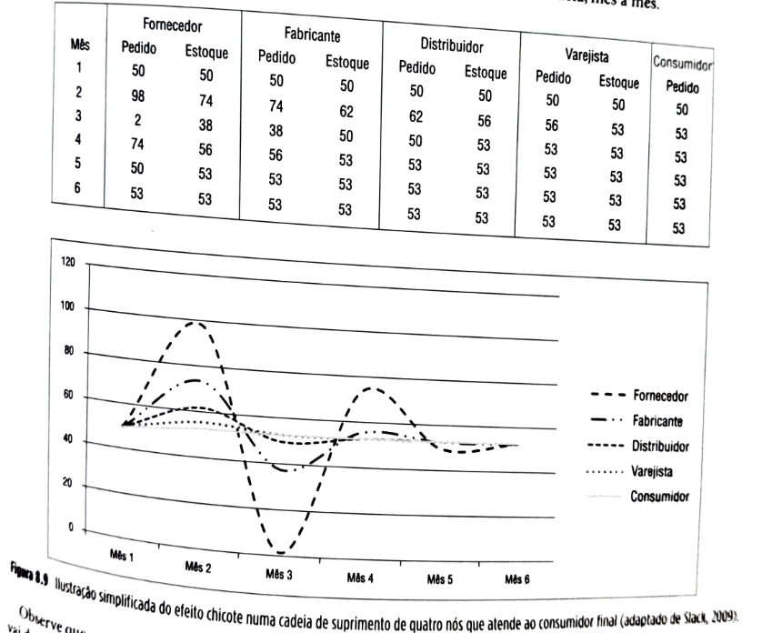

**Figura 8.9** Ilustração simplificada do efeito chicote numa cadeia de suprimento de quatro nós que atende ao consumidor final (adaptado de Slack, 2002).

Observe que, quando a demanda do consumidor final vai de 50 unidades no Mês 1 para 53 unidades no Mês 2, o novo nível de estoque do varejista definido para o Mês 2 passa a ser de 53 unidades, de acordo com sua política. Isso quer dizer que o pedido do varejista para o distribuidor, no Mês 2, é de 56 unidades (53 para atender a demanda do consumidor e mais três para que o nível de estoques passe de 50 para 53 unidades). A demanda imediata percebida pelo atacadista, então, no Mês 2, é de 56 unidades. Como sua política de estoque também é de manter em estoque o equivalente a um mês de demanda, ele define que seu estoque tem de passar de 50 para 56 unidades (que é a demanda percebida pelo atacadista). Para isso, faz um pedido de 62 unidades ao fabricante (56 para atender ao pedido do varejista e mais seis para que seu próprio estoque aumente de 50 para 56 unidades). Essa distorção da informação a respeito da demanda do consumidor continua ocorrendo para outros nós da cadeia, com amplitude aumentada. No Mês 3, a demanda do consumidor é novamente de 53 unidades. O varejista, então, pede 53 unidades para o distribuidor. Este agora redefine seu nível de estoque para 53 unidades, o que o faz colocar um pedido de apenas 50 unidades com o fabricante (já que três das unidades necessárias são tiradas de seu estoque, que deve diminuir de 56 para 53 unidades). O efeito se propaga com novas distorções para trás na cadeia. Isso ocorre nos meses subsequentes, de forma que só no sexto mês a cadeia atinge estabilidade no novo patamar de demanda de 53 unidades. Observe no gráfico da Figura 8.9 como a variabilidade da demanda aumenta à medida que a informação sobre a demanda do consumidor viaja para trás na cadeia, devido a distorções causadas pelos reajustes nos níveis de estoques dos vários nós da cadeia. Lembre-se de que essa volatilidade aumentada da demanda tem de ser atendida pelos nós da cadeia, o que exige deles mais recursos, aumentando seus custos.

## Página 222

Esse exemplo simplificado demonstra o efeito chicote, mas de uma forma muito mais suave do que o que ocorre na realidade das cadeias de suprimentos. Isso porque, nesse exemplo, a cadeia trabalha só com um produto, não há nós concorrentes (só há um varejista, um distribuidor, um fabricante e um fornecedor), a demanda do consumidor final é relativamente bem comportada (apenas passa de um patamar estável de 50 unidades por mês para outro patamar estável de 53 unidades por mês), não há exigência de quantidades mínimas a serem produzidas e despachadas, entre outras simplificações.

Em outras palavras, nas cadeias de suprimentos reais, o efeito chicote e suas consequências são muito mais sérios.

Faz parte da função de gestão de demanda, dentro das cadeias de suprimentos, a análise e tomada de ações que combatam as causas do efeito chicote, para que as variabilidades evitáveis de demanda sejam reduzidas e, por consequência, as eficiências da cadeia aumentem. Analisemos as possíveis causas do efeito chicote.

| 💡**Fique atento**💡{bg=amarelo} |
| --- |
| Em situações reais, há cinco principais motivos para o efeito chicote: as atualizações descoordenadas de previsões de demanda dos nós da cadeia, as formações de lotes de produção e de transporte, as flutuações de preço, o racionamento/comportamento oportunista e as demoras nos fluxos de materiais e informação. |

Analisemos os cinco motivos para o surgimento do efeito chicote e formas de combatê-los: atualizações descoordenadas de previsões, formações de lotes, flutuações de preço, racionamento/comportamento oportunista e demoras nos fluxos envolvidos.

**Atualizações descoordenadas de previsões dos nós da cadeia:** pode ser observado pelo exemplo da Figura 8.6 que, quando um nó da cadeia percebe um crescimento de sua demanda imediata, esse crescimento é visto como indicativo de uma *tendência* de crescimento. Essa percepção faz com que o nó reveja suas previsões de demanda e, com base nisso, reveja para cima seus níveis de estoques. Isso faz com que os pedidos ao seu fornecedor sejam maiores do que aqueles recebidos do seu cliente. Seu fornecedor, portanto, percebe uma "tendência" de crescimento ainda maior e reajusta seus níveis de estoque de acordo. As atualizações descoordenadas das previsões fazem com que a volatilidade aumente para trás na cadeia de suprimentos.

Uma solução é aumentar os níveis de coordenação e troca de informação entre nós da cadeia a fim de que a visibilidade da demanda do consumidor final seja maior e mais compartilhada. Dessa forma, os nós coordenados trabalharão com previsões de demanda comuns. Uma das iniciativas formais que pregam essa coordenação é o CPFR, ou *collaborative planning, forecasting and replenishment*, descrito adiante neste capítulo.

**Formação de lotes de produção e/ou transporte:** sempre que se formam lotes (e o problema é maior quanto maiores os lotes) de produção e/ou de transporte, ocorre distorção da informação a respeito da demanda do cliente para o fornecedor. Imagine um produto com demanda constante de 50 unidades por semana, no nível do varejo. Na ausência de formação de lotes no processo de ressuprimento do varejista, a demanda percebida pelo nó imediatamente a montante, por exemplo, um distribuidor, será também de 50 unidades por semana. A informação da demanda não é, portanto, distorcida. Imagine agora que o varejista prefira comprar quantidades mínimas de 200 unidades do produto para que se obtenham economias de escala no transporte. O varejista agora faz pedidos de 200 unidades quando decide ressuprir e passa, a partir daí, quatro semanas sem colocar pedidos com o distribuidor. A informação sobre a demanda constante de 50 unidades por semana foi distorcida, e a demanda percebida pelo distribuidor agora é muito mais variável, de 200 unidades em algumas semanas e zero nas outras.

Fica claro aqui que o combate aos lotes, tanto de produção (com iniciativas como a redução dos tempos e custos de preparação de máquina – para uma boa referência, ver Dillon e Shingo, 1985) como de transporte (com o uso de opções de transporte que permitam transportes de quantidades menores e mais frequentemente, por exemplo, com a consolidação de cargas com uso de operadores logísticos – ver Capítulo 10) pode ajudar a reduzir a variabilidade da demanda dentro das cadeias de suprimentos.

## Página 223

**Flutuações de preço:** flutuações de preço ocorrem, por exemplo, quando empresas lançam mão de ferramentas de marketing, como promoções. Imagine alguém que compre o produto fraldas descartáveis para bebês, na quantidade de 50 unidades por semana. O consumo desse produto em geral é exclusivamente determinado pela necessidade do pequeno usuário final, que não varia muito de semana para semana. O pai do bebê vai, então, comprar fraldas no sábado e percebe que o supermercado está fazendo uma promoção, vendendo as fraldas por um preço 30% menor que o normal. A decisão do pai então muda e, em vez de comprar 50 unidades, compra 150 unidades, para aproveitar o bom preço e estocar o produto para uso futuro. Qual a consequência? Ele passa três semanas sem comprar o produto. A demanda aumenta agora, como resposta à promoção, e diminui no futuro, causando uma variação artificial, que distorce a informação sobre a demanda quando essa viaja para trás na cadeia. E essa distorção de informação é crescente, quanto mais para trás ela viaja na cadeia. A solução aqui é o que alguns varejistas (como o Walmart) fazem quando usam a lógica de "preço baixo todo dia" – optam por não fazer muito uso de promoções a fim de não distorcerem a demanda, pois sabem que isso vai aumentar a ocorrência do efeito chicote, aumentando os custos na cadeia e, como consequência, no médio e longo prazos, os preços finais dos produtos terão de subir para compensar os custos mais altos, tornando a cadeia toda menos competitiva. Quanto menos se permitirem flutuações de preço, portanto, numa cadeia, menos será sentido o efeito chicote.

**Racionamento/comportamento oportunista:** quando ocorre racionamento de um produto, ou seja, quando não há produto suficiente para atender a toda a demanda (por exemplo, porque o efeito chicote está na sua fase de aumento desproporcional e artificial da demanda percebida), muitas vezes os fornecedores, para não deixarem nenhum cliente totalmente desatendido, optam por atender parcialmente a todos os pedidos que recebe. Por exemplo, suponha que o total dos pedidos recebidos por um fornecedor, de vários clientes, seja de 100 mil produtos. Suponha que a capacidade do fornecedor é de apenas 80 mil produtos. Ele decide, então, atender a apenas 80% dos pedidos de cada um dos clientes, assim, não atende a nenhum de forma completa, mas também não deixa nenhum sem produto. Parece uma política justa, mas que pode acabar gerando um comportamento indesejável por parte de alguns clientes, que, percebendo que só têm 80% dos seus pedidos atendidos, passam a inflar seus pedidos para obter a totalidade de suas necessidades. Por exemplo, se um cliente necessita de dez mil unidades, mas sabe que se pedir dez mil só vai receber oito mil, acaba solicitando 12.500 para receber 80%, ou seja, os dez mil que necessita. Isso acaba fazendo com que o total de pedidos colocados seja ainda mais distorcido, de forma artificial, ampliando o impacto do efeito chicote. Nesses casos, é importante analisar com cuidado as ações de racionamento a fim de evitar que a empresa acabe sofrendo ainda mais com os efeitos da distorção artificial da sua demanda (veja o caso de abertura deste capítulo do produto Prius, no quadro sobre a Toyota).

**Demoras nos fluxos de materiais e de informação:** cadeias de suprimentos que trabalham com produtos físicos em geral sofrem mais com o problema das demoras nos fluxos de materiais (*lead times*), os tempos decorridos entre o momento de identificação da necessidade de um material e o momento em que o material passa a estar disponível para uso. Incluídos no *lead time* estão os tempos de produção, transporte, desembaraços alfandegários, inspeções de recebimento e outros. Demoras no fluxo de informação ocorrem no processo de colocação do pedido: elaboração do pedido, transmissão do pedido, recebimento do pedido pelo fornecedor, análise de crédito e outras atividades que ocorrem antes mesmo que a produção e despacho do produto físico se iniciem. A literatura sugere que, quanto maiores as demoras envolvidas nas cadeias de suprimentos, mais se faz sentir o efeito chicote (Sterman, 2000). Muitas vezes, a decisão pela troca de um fornecedor próximo para um fornecedor localizado do outro lado do mundo se faz só com base numa comparação de preços. Isso pode trazer riscos para a cadeia, porque, em geral, acompanhando a troca vem também um aumento substancial nas demoras – tanto do fluxo de informação como do fluxo de materiais, o que aumenta a volatilidade da cadeia, e esse efeito e seu impacto no custo da cadeia é muitas vezes negligenciado quando a empresa toma a decisão de trocar um fornecedor.

A solução aqui é combater as demoras – seja mantendo fornecedores mais próximos fisicamente ou organizacionalmente, ou por aumentar a agilidade dos fluxos envolvidos. Além disso, também é necessário que as decisões referentes às cadeias de suprimentos sejam tomadas de forma a contemplar amplamente os seus impactos na cadeia, e não apenas levando em conta custos ou impactos localizados (como, por exemplo, considerar apenas o preço do item na decisão de qual fornecedor usar).

| 🔵**SAIBA MAIS**{bg=azul} |
| --- |
| **"O Jogo da cerveja", uma excelente maneira de entender e estudar o efeito chicote**    Existem alguns sites nos quais você pode jogar o clássico "The beer game", um jogo que demonstra claramente o efeito chicote, simulando uma simples cadeia de suprimentos que fabrica e distribui cerveja. |

## Página 224

### 8.2.3 Previsão de demanda

O primeiro mandamento das previsões é "evitarás fazê-las".

**"Evitando" fazer previsões**

Evidentemente, não se está falando de fugir à responsabilidade de fazer as previsões, mas de evitar ter de fazê-las quando isso é possível. Quando uma empresa que vende para outra empresa parceira faz suas previsões sobre as compras que seu cliente colocará, está na verdade tentando antecipar um processo decisório do seu cliente. Por meio de uma maior aproximação, troca de informações e coordenação de processos decisórios, é possível ter do cliente informações a respeito de seus planos de produção para o futuro, com horizonte mais longo, para, dessa forma, ser capaz de, em vez de tentar "prever" o processo decisório de compra do cliente, "coordenar" a visão futura de demanda da empresa com o processo de planejamento do cliente. Com isso, as vantagens podem ser muito substanciais, principalmente em termos de redução das incertezas das previsões (e, portanto, melhorando o processo decisório da empresa). Entretanto, em muitas situações, principalmente quando se trata de prever a demanda do consumidor, previsões necessitam ser feitas.

**Conceitos básicos de previsão de demanda**

Em gestão de cadeias de suprimentos, muitos dos recursos têm "materialidade", têm existência física, como máquinas, equipamentos, instalações, materiais e pessoas. Esses recursos físicos apresentam uma característica importante para o gestor: eles têm inércia decisória, ou seja, as decisões com relação a esses recursos levam tempo para tomar efeito. Se um pedido de material é colocado com um fornecedor, só depois de certo tempo é que o material estará disponível para uso. O mesmo ocorre para a necessidade de um funcionário adicional, para uma nova máquina ou uma nova fábrica.

| 💡**Fique atento**💡{bg=amarelo} |
| --- |
| Para que o gestor da cadeia tome uma boa decisão, é necessário que tenha a visão mais clara possível (ou com a menor incerteza possível) do futuro, porque a decisão tomada hoje deve ser adequada, não ao presente, mas ao momento no futuro em que a decisão tomar efeito. |

Essa visão de futuro se obtém por intermédio das previsões — daí sua importância para um bom processo de tomada de decisões. Como diferentes decisões têm inércias decisórias diferentes (levam diferentes períodos de tempo para tomar efeito), previsões de diferentes horizontes são necessárias para um adequado suporte à decisão.

**Erros comuns em previsão de demanda**

Previsão, principalmente de demanda é, em geral, um dos assuntos mais controversos dentro das organizações. É muito frequente, também, em situações práticas, que as empresas incorram em certos erros quando tratam do assunto "previsões". Quatro desses erros são discutidos a seguir.

> *Erro 1 das previsões: confundir previsões com metas e, um erro subsequente, considerar as metas como se fossem previsões.*

| ⚠️**Conceito-chave**⚠️{bg=verde} |
| --- |
| * Previsões de demanda são estimativas de como vai se comportar o mercado demandante no futuro, sobre o potencial de compra do mercado.    * Metas são a parcela do potencial de compra do mercado que a empresa deseja atender e pode ter um objetivo motivacional, de incentivo a uma maior proatividade dos vendedores, por exemplo.    * Previsão de vendas é a melhor estimativa realista sobre quantos produtos a empresa vai vender no futuro, considerando as informações disponíveis. |

Muitas empresas confundem estes dois conceitos: previsões e metas.

## Página 225

Uma meta excessivamente ambiciosa, com intuito motivacional, considerada como previsão pode ter como consequência um suprimento superestimado em relação às previsões, acarretando excesso de estoques com os correspondentes custos associados. Isso ilustra o primeiro erro em gestão de previsões: a confusão entre metas e previsões. É crescente o número de operações que deliberadamente definem dois números separados para representar metas e previsões, com diferentes propósitos: as metas, com propósitos motivacionais; as previsões, com propósitos de subsídio à tomada de decisão quanto a suprimentos. A Unilever Brasil, divisão HPC (health and personal care), apenas para citar um exemplo, recentemente estabeleceu novos processos de gestão de demanda nesse sentido, com bons resultados preliminares.

> Erro 2 das previsões: gastar tempo e esforço discutindo se se acerta ou erra nas previsões, quando o mais relevante é discutir o quanto se está errando e as formas de alterar processos envolvidos, de forma a reduzir esses erros, ou incertezas.

Frequentemente, ouvem-se discussões nas empresas, muitas vezes inócuas, sobre "acertar" ou "errar" previsões. Inócuas, porque os envolvidos deveriam, desde o princípio, estabelecer que não se deveria discutir sobre acertar ou errar previsões, porque previsões estão sempre erradas. É de sua natureza. Por isso chamam-se PREvisões, uma visão obtida antes de as coisas acontecerem (que não passa de uma estimativa educada e informada sobre o futuro).

Quando uma previsão acerta exatamente, em geral o acaso teve um papel importante. Nenhuma estimativa de pluviosidade para um determinado dia futuro será exatamente certa, seja ela feita por leigos ou por profissionais de meteorologia bem equipados. A diferença é que, em média, os erros de previsão cometidos pelos profissionais serão menores do que os cometidos pelos leigos. O importante, portanto, é que, embora ambas as previsões apresentem incerteza, as mais elaboradas, que se utilizam de dados melhores e que saibam concluir melhor a respeito desses dados, têm menor erro (ou incerteza). Com menor incerteza sobre a pluviosidade, um tomador de decisão sobre um evento futuro externo terá menores custos de erros associados ao processo de tomada de decisão. O mesmo ocorre com previsões para decisões sobre cadeias de suprimentos: o importante é procurar diminuir as incertezas, não discutir se há ou não incertezas nas previsões.

> Erro 3 das previsões: levar em conta, nas previsões que servirão para apoiar decisões em cadeias de suprimentos, um número só. Previsões, para gestão de cadeias de suprimentos, devem sempre ser consideradas com dois números: a previsão em si e uma estimativa do erro (ou grau de incerteza) dessa previsão.

Para gestores de cadeias de suprimentos, é importante saber não só quanto se espera ter de demanda ou vendas, mas também qual é o erro esperado para essa previsão. Em outras palavras, para cadeias de suprimentos, previsões são sempre dois números:

* uma estimativa da demanda ou da venda; e
* uma estimativa da incerteza, ou seja, do erro de previsão esperado, porque dele derivarão importantes decisões sobre os "colchões" de segurança (veja o Capítulo 9) que serão dimensionados para a cadeia de suprimentos (na forma de estoques, tempos ou capacidade extra), de forma a fazer frente a essas incertezas mantendo níveis desejados de serviço aos clientes.

> Erro 4 das previsões: desistir ou não se esforçar o suficiente para melhorar os processos de previsão por não se conseguir reduzir os erros às previsões, quando, em cadeias de suprimentos, não se necessita ter previsões perfeitas, mas sim previsões consistentemente melhores que as da concorrência.

Outro erro frequente que se ouve nas empresas acerca de previsões pode ser ilustrado pela frase: "tentamos muito fazer previsões de forma técnica, mas continuávamos a errar, então paramos!". Esse é um erro, porque "errar" é normal em previsões; o que interessa é quanto erramos. Quanto menores os erros, menores "colchões" de segurança – e correspondentes custos – teremos de providenciar. Vale a pena, então, continuar a colocar esforços no sentido de melhorar a qualidade de previsões, mesmo que os erros continuem aparentemente grandes. Não são necessárias previsões perfeitas num mercado competitivo. São, sim, necessárias previsões melhores (ou seja, com menos incertezas) que as previsões da concorrência.

### Horizontes e nível de agregação nas previsões

Um bom processo decisório sobre recursos que tenham inércia decisória se baseia em uma boa visão do futuro, obtida a partir de previsões. Nesse processo decisório, em geral, diferentes decisões têm inércias diferentes (ou seja, requerem diferentes períodos de tempo para tomarem efeito). Para bem apoiar essas decisões, portanto, é necessário que as previsões tenham diferentes horizontes. É necessário considerar um horizonte de curto prazo, para que a partir deste se tomem boas decisões de inércia pequena; um horizonte médio, para a consideração de decisões de inércia média; e um horizonte longo, para suportar decisões de inércia maior. A Figura 8.10 ilustra essa ideia.

## Página 226

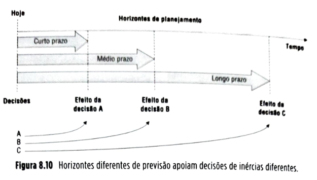

| ⚠️**Conceito-chave**⚠️{bg=verde} |
| --- |
| O horizonte da previsão é definido pelo tamanho da inércia decisória (tempo decorrido entre a decisão ser tomada e a decisão efetivamente ser levada a efeito) da decisão à qual ela deve suportar. |

Geralmente, as decisões de inércia pequena envolvem níveis mais moderados de recursos – o efeito de uma decisão equivocada, portanto, não é tão relevante financeiramente; por exemplo, as referentes à decisão de usar horas extras.

As decisões de inércia maior, por outro lado, envolvem níveis mais elevados de recursos; em decorrência, os efeitos de uma decisão errada serão mais maléficos. Por exemplo, uma decisão de ampliação substancial de capacidade produtiva que inclua expansão de fábrica deve ser tomada com muita antecedência e envolve uma possível escolha e compra de terreno, projeto industrial, construção, aquisição de equipamentos, entre muitos outros.

Essa constatação pode ser um pouco inquietante numa primeira análise. Isso porque é sabido que decisões tomadas com maior antecedência requerem uma visão sobre um futuro mais longo. Em outras palavras, requerem previsões de mais longo prazo, que em geral são feitas sob condições de maior incerteza. Até intuitivamente sabemos que a probabilidade de erro nas previsões cresce com o horizonte. A Figura 8.11 ilustra essa ideia.

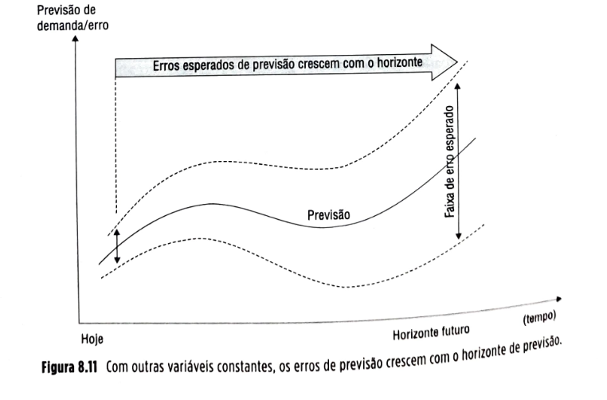

## Página 227

Se as decisões que envolvem maior volume de recursos têm de ser tomadas com maior antecedência e se tomar decisões com maior antecedência implica decidir com maior probabilidade de erro, isso indica que justamente aquelas decisões cujos erros podem ter consequências mais sérias são aquelas com maior probabilidade de erro. Como é então que a maioria das empresas tem sobrevivido? A resposta está relacionada ao conceito de *risk pooling* discutido inicialmente no Capítulo 2.

### Risk pooling (ou "consolidação de riscos")

Vamos analisar um pouco mais profundamente a questão de nossa previsão de venda para os sanduíches do exemplo hipotético do Capítulo 2. Imagine que as previsões de sanduíche tenham sido feitas não para a demanda do mês que vem, mas de um determinado mês, daqui a um ano. Por que nós nos preocuparíamos em desenvolver uma visão de futuro com um ano de antecedência para uma lanchonete de *fast-food*? Certamente para subsidiar aquelas decisões com inércia compatível. Quais são estas para uma lanchonete? Compra de hambúrguer ou peixe? Programação de turnos de trabalho? Provavelmente não. Estas são decisões de inércia menor – ou seja, podem ser tomadas com antecedência menor. As decisões que demandam antecedência de um ano são aquelas referentes a, por exemplo, expansão da loja.

Entretanto, para decidir sobre expansão da loja é necessário que se desenvolva uma visão de futuro desagregada, por sanduíche? Provavelmente não. Uma expansão da loja será capaz de produzir qualquer *mix* de sanduíches e, portanto, para esse tipo de decisão, que necessita desse nível de antecedência, uma visão agregada é suficiente. Como a visão agregada é muito menos sujeita a erro que a visão desagregada, pelo efeito de *risk pooling*, a decisão acaba por ser tomada sob menor nível de incerteza.

| 💡**Fique atento**💡{bg=amarelo} |
| --- |
| A agregação dos dados, que faz reduzir o nível de incerteza das previsões, compensa, até certo ponto, o aumento de incerteza causado pelo necessário aumento do horizonte de previsão nas decisões de inércia decisória alta. |

Em suma, por um lado, as decisões de maior inércia, que envolvem maiores recursos, necessitam de maior antecedência e também requerem uma visão de futuro com maior horizonte; portanto, estão mais sujeitas a incertezas. Por outro lado, essas mesmas decisões tendem a não requerer previsões desagregadas. Com a agregação, os erros de previsão ficam reduzidos, compensando a necessidade de antecedências mais longas com a possibilidade do tratamento agregado de informações.

Entretanto, para o mesmo planejamento da lanchonete, em algum momento haverá a necessidade de tratar o futuro com uma visão desagregada. Por exemplo, em determinado momento, será necessário decidir quanto hambúrguer ou peixe comprar. Então, necessariamente, uma previsão desagregada terá de ser feita, pois, se a nossa lanchonete vender mais ou menos BigFast (sanduíche de hambúrguer), por exemplo, isso implicará uma necessidade maior ou menor de hambúrgueres. Entretanto, a antecedência com que se precisará tomar essa decisão será muito menor que um ano. Talvez uma semana seja suficiente para permitir a reação do fornecedor de hambúrguer. Portanto, a previsão desagregada poderá ser feita com uma antecedência bem menor. Se, por um lado, a incerteza com que se trabalha nesse momento é maior em razão do grau de desagregação, por outro, a incerteza devida à antecedência é muito menor, pelo fato de a própria antecedência ser muito menor.

Isso significa que, se ao longo do horizonte de planejamento os níveis de antecedência e agregação dos dados forem trabalhados adequadamente, pode-se trabalhar com um nível de incerteza mais uniforme ao longo de todo o horizonte. A Figura 8.12 ilustra essa ideia.

A mensagem, então, é clara: só é possível desenhar adequados processos de previsão a partir do uso a ser feito das previsões, ou, em outras palavras, quais decisões elas vão apoiar. Só então se poderá definir, por exemplo, qual nível de agregação de dados será necessário. E lembre-se: previsões mais agregadas tendem a ser mais acertadas.

| 💡**Fique atento**💡{bg=amarelo} |
| --- |
| Para um determinado horizonte, as previsões devem ser feitas sempre com o nível máximo de agregação de dados que o processo decisório ao qual suportará permitir. |

## Página 228

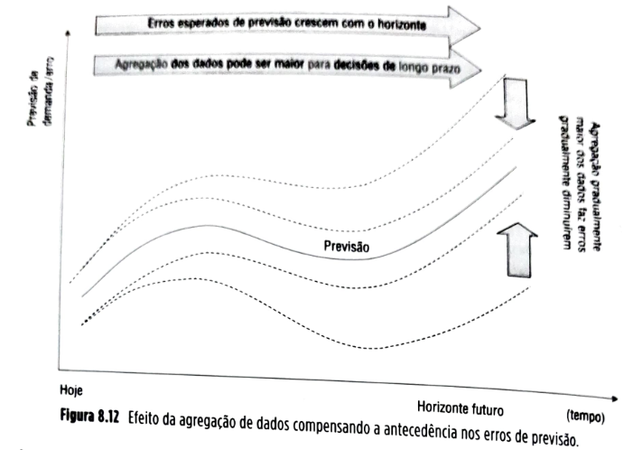

### 8.2.4 Processo de previsão

Previsões são, em geral, o resultado de um processo, um encadeamento de atividades que inclui: a) a coleta de informações relevantes; b) o tratamento dessas informações; c) a busca de padrões de comportamento, muitas vezes fazendo uso de métodos quantitativos de tratamento de séries temporais de dados do passado; d) a consideração de fatores qualitativos relevantes; e) a projeção de padrões de comportamento; f) a estimativa de erros da previsão.

**Informações para previsão**

As principais informações que devem ser consideradas pelo sistema de previsão de vendas são (Corrêa e Corrêa, 2017):

* dados históricos de vendas, período a período;
* dados históricos referentes a vendas perdidas, possivelmente por não disponibilidade de produto;
* informações relevantes que expliquem comportamentos atípicos das vendas passadas, como, por exemplo, um aumento localizado de demanda devido a um incêndio ocorrido num concorrente que o tornou atipicamente impedido de fornecer por certo período;
* dados de variáveis correlacionadas às vendas que ajudem a explicar o comportamento das vendas passadas, como, por exemplo, a identificação do tipo de influência que a ocorrência de feriados emendados (pontes) exerce na demanda de um parque temático;
* situação atual de variáveis que podem afetar o comportamento das vendas no futuro ou estejam a ele correlacionados, como, por exemplo, os planos atuais de expansão de oferta da concorrência;
* previsão da situação futura de variáveis que podem afetar o comportamento das vendas no futuro ou estejam a ele correlacionados, por exemplo, qual tendência de evolução das compras por *e-commerce* (comércio eletrônico) afetará diretamente a demanda por serviços de telefonia para acesso rápido à internet;
* conhecimento sobre a conjuntura econômica atual e previsão da conjuntura econômica no futuro, por exemplo, quais as expectativas de crescimento econômico, de padrões de renda dos mercados-alvo, entre outros;
* informações de clientes que possam indicar seu comportamento de compra futuro, por exemplo, vindas de pesquisas de mercado sobre intenções de compra;
* informações relevantes sobre a atuação de concorrentes que influenciam o comportamento das vendas, por exemplo, padrões de comportamento da concorrência quanto a promoções e eventos; e
* informações sobre decisões da área comercial que podem influenciar o comportamento das vendas, por exemplo, planos de promoções, lançamentos e relançamentos de produtos, entre outros.

**Cuidados preliminares com dados históricos**

Os dados históricos de vendas, informações fundamentais para se elaborarem as previsões, podem esconder algumas armadilhas; por isso, é importante saber analisá-los. Um ponto fundamental é que os dados de vendas sejam referentes às quantidades e momentos em que o cliente gostaria de receber o produto, e não às quantidades e datas

## Página 229

efetivas da entrega. Se isto não for garantido, os dados de vendas passadas poderão representar aquilo que a empresa conseguiu entregar no momento em que conseguiu entregar (possivelmente por limitações de capacidade), e não o que os clientes gostariam de receber. Isso pode fazer com que, em algumas situações, a empresa projete sua própria capacidade de produção passada como previsão de vendas futuras.

Outro aspecto importante é coletar informações sobre eventos relevantes que possam explicar comportamentos atípicos das vendas passadas. Caso esses eventos não sejam passíveis de se repetir no futuro, sua influência sobre os dados históricos de vendas deve ser expurgada a fim de que o tratamento estatístico não venha a projetar tais efeitos no futuro.

Em termos gerais, o importante é que, antes de se começar a trabalhar com dados do passado, eles sejam "limpos" para que as eventuais projeções não sejam distorcidas, levando a más decisões.

### 8.2.5 Processo de previsão de vendas

A Figura 8.13 ilustra um modelo de processo de previsão de vendas que determina, em linhas gerais, a forma com que uma série de atividades inter-relacionadas contribui para a compreensão das informações consideradas na discussão anterior e, com base nelas, gerar uma previsão. Esse modelo apresenta inicialmente o tratamento estatístico (matemático) dos dados históricos de vendas e de outras variáveis que ajudem a explicar o comportamento das vendas no passado. Outros fatores são, então, considerados numa etapa posterior, para a qual são levantadas informações de clientes, informações sobre a conjuntura econômica atual e futura, informações de concorrentes, além de outras informações relevantes do mercado. Também é importante que se conheçam e se levem em conta as decisões da área comercial que podem afetar o comportamento das vendas, como variações de preço, promoções, esforços especiais de vendas, entre outras.

O tratamento de todas essas informações e sua combinação com os dados históricos tratados estatisticamente deve ser feito com a participação de representantes das principais áreas e parceiros da cadeia envolvidos no processo de planejamento da cadeia de suprimentos para que se obtenha legitimidade dos resultados e que se consiga que todos os nós da cadeia de suprimentos trabalhem com as mesmas previsões, para que o efeito chicote analisado anteriormente seja reduzido.

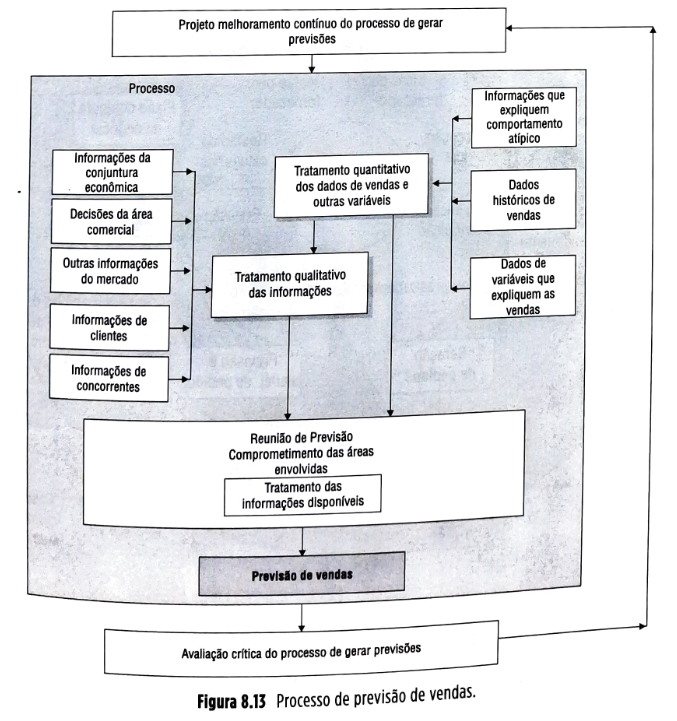

## Página 230

**CPFR (*collaborative planning, forecasting and replenishment*): colaboração nos processos de previsão**

Em 1995, por iniciativa da gestão de cadeia de suprimentos do Walmart e da Benchmarking Partners, iniciou-se o desenvolvimento do CPFR (planejamento, previsões e ressuprimento colaborativos), ainda à época com o nome de CFAR (*collaborative forecasting and replenishment*). Hoje com a participação de numerosos parceiros, a iniciativa de CPFR evoluiu e consiste em uma prática gerencial que combina a inteligência de múltiplos parceiros de negócio no processo de planejamento e atendimento da demanda do consumidor. Visa a melhorar a integração das cadeias suportando e auxiliando o desenvolvimento de práticas e visibilidade compartilhadas entre parceiros da cadeia na previsão da demanda, gestão dos estoques e dos processos de ressuprimento de produtos ao longo da cadeia de suprimentos. Informações constantemente compartilhadas entre fornecedores e clientes na cadeia ajudam no planejamento e atendimento dos usuários finais. Isso permite a contínua atualização das informações de estoque e das necessidades futuras, tornando a cadeia de suprimentos como um todo mais eficiente.

O CPFR tem um modelo de referência, mostrado na Figura 8.14 (visite o *site*, informado no *boxe* a seguir, para mais informações).

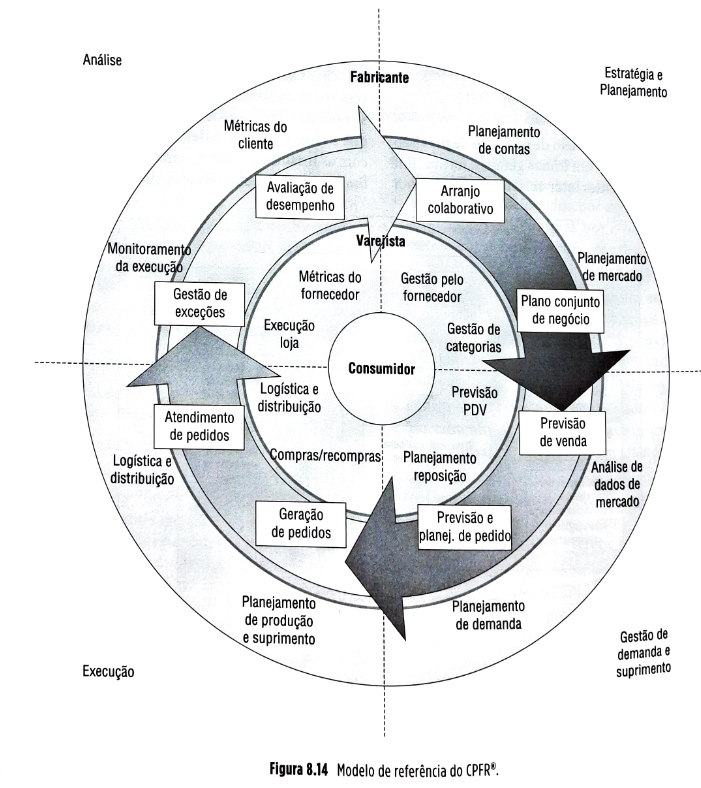

## Página 231

O anel externo se refere ao fabricante; o anel intermediário, ao varejista; e o anel interno, ao consumidor. Percebe-se, portanto, que o CPFR é um modelo que trabalha mais com previsão, planejamento e reposição de produtos acabados, mais do que com os mesmos processos entre fabricante e fornecedores, embora o guia geral do CPFR mencione a possibilidade de extensão do modelo de referência. Quanto ao processo específico de previsão, esta é, segundo o que prescreve o CPFR, feita no nível do ponto de venda e de forma colaborativa entre os parceiros envolvidos na cadeia, visando a que os vários parceiros trabalhem sobre uma base comum, reduzindo assim um dos fatores causadores do efeito chicote, a atualização descoordenada de previsões entre membros da cadeia. O CPFR depende de interconectividade entre os parceiros da cadeia de suprimentos, mas certamente o problema técnico não é o mais difícil de resolver – hoje a tecnologia de internet permite interconectividade plena por custos aceitáveis. A dificuldade em geral está mais em criar as condições organizacionais para que a colaboração ocorra. Por exemplo, como obter os níveis necessários de confiança entre parceiros para que a troca de informações ocorra, como obter o alinhamento de interesses dos parceiros da cadeia para que todos ajam para o bem comum da cadeia, e não de forma oportunista. A ideia de colaboração entre parceiros da cadeia de suprimentos nos processos de planejamento, previsões e decisões sobre políticas de gestão de estoques é bastante poderosa e o potencial é bastante promissor.

### Previsão de vendas de curto prazo

Para previsões de curto prazo (até três meses), normalmente se aceita mais a hipótese de que o futuro seja uma "continuação" do passado, ao menos do passado recente, ou seja, as mesmas tendências de crescimento ou declínio observadas no passado devem permanecer no futuro, assim como a sazonalidade ou ciclicidade observadas no passado. A técnica então geralmente utilizada é a de projeção; são os chamados *modelos intrínsecos*, ou de séries temporais simples. Essa denominação vem do fato de que nesses modelos de previsão se busca fazer uma correlação entre as vendas passadas e o tempo, projetando-se comportamento (padrão de variação) similar para o tempo futuro, como pode ser visto na Figura 8.15.

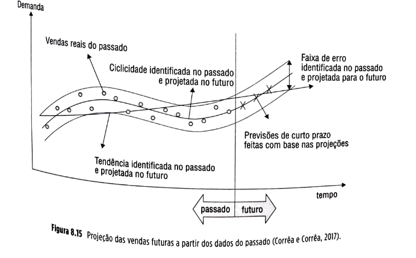

## Página 232

A projeção é feita modelando-se matematicamente os dados do passado. Geralmente, procura-se decompor as vendas passadas em duas ou mais componentes que possam ser modeladas matematicamente, como mostrado na Figura 8.15.

### Previsão de vendas de médio prazo

Quando o horizonte da previsão começa a aumentar, a hipótese de o futuro "repetir" o passado (nos padrões de variação) deixa, muitas vezes, de ser válida. Devem-se então adotar outros modelos, cujas hipóteses sejam válidas para horizontes maiores. Exemplos são os modelos extrínsecos, modelos causais ou modelos de explicação. Nesses, a hipótese é de que as relações que existiam no passado, entre as vendas e outras variáveis, continuam a valer no futuro. A ideia é que se procurem estabelecer as relações entre as vendas do passado e outras variáveis que expliquem seu comportamento. Essas relações, entre variáveis causais e a demanda buscada, costumam permanecer válidas por períodos relativamente mais longos, o que faz com que os modelos causais sejam mais adequados para previsões de horizonte mais longo.

O resultado da correlação é uma equação do tipo:

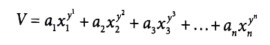

obtida em geral a partir da técnica estatística de regressão (em geral, linear) múltipla em que x1, x2, .. Xn são os valores das variáveis escolhidas num determinado ponto do tempo.

Da mesma forma que nos modelos temporais de projeção, utilizados para previsão de curto prazo, também aqui é essencial que se proceda à segunda parte (qualitativa) do modelo do processo de previsão anteriormente apresentado, pois, por mais sofisticado que seja o modelo causal, jamais conseguirá incorporar todos os fatores que interferem no comportamento da demanda.

### Previsão de vendas de longo prazo

Quando o horizonte aumenta ainda mais (um a vários anos), a hipótese de que as relações existentes no passado entre a demanda e outras variáveis continuam a valer no futuro deixa, muitas vezes, de ser válida. Nesses casos, adota-se a hipótese de que o futuro não guarda relação direta com o passado, pelo menos não uma relação que possa ser modelada matematicamente. A previsão, muitas vezes, necessita ser mais qualitativa.

### 8.2.6 Métodos usados em previsões

Para tratar as informações disponíveis (veja a Figura 8.16), podem-se usar duas abordagens complementares: as abordagens quantitativas (baseadas em padrões de séries históricas extrapolados para o futuro segundo algum método) e as abordagens qualitativas (baseadas em fatores subjetivos ou de julgamento). Em geral, os modelos quantitativos necessitam de longos históricos, para que deles se possam identificar os padrões de comportamento a ser projetados para o futuro.

Com isso, os modelos quantitativos são mais úteis para fazer previsões de demanda de produtos mais maduros, que estejam há mais tempo no mercado. Já os modelos qualitativos se prestam melhor para previsões de produtos novos ou lançamentos, dos quais não se tem históricos longos. Outro fator determinante para a "ponderação" do uso de modelos quantitativos e qualitativos na geração de uma previsão é o horizonte da previsão. Em geral, quanto maior o horizonte de previsão, menos válida é a hipótese de que os padrões do passado se repetirão no futuro (uma hipótese que se assume quando são usados modelos mais quantitativos). Isso significa que modelos quantitativos tendem a ser mais adequados a previsões de curto prazo.

**Figura 8.16** Abordagens para métodos de tratamento de informações em previsões.

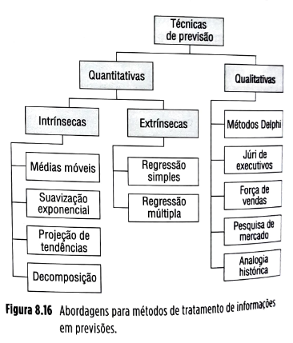

### Quais métodos de previsão usar?

A rigor, não há uma receita objetiva para definir quais métodos de previsão usar para qual situação específica, visto que as situações específicas são muito particulares e até alguns conceitos de o que deve ser considerado curto, médio e longo prazos, por exemplo, podem variar conforme a empresa e o mercado em que ela se insere. Para uma empresa de *videogames*, por exemplo, cuja tecnologia muda muito frequentemente, um ano pode ser considerado longo prazo, enquanto para uma siderúrgica longo prazo significa dez a 15 anos, visto que a tecnologia evolui mais lentamente e os produtos, sendo *commodities*, também têm flutuações de demanda muito mais suaves. Também um processo de...

## Página 233

previsão pode utilizar mais do que um método, como descrito na Figura 8.13. Podem-se, entretanto, estabelecer linhas gerais do que seria o método mais usual de ser usado como o principal, de acordo com os horizontes de previsão. Isso pode ser visto resumido na Figura 8.17.

**Horizonte de previsão**

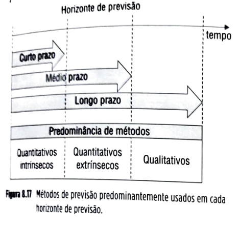

**Figura 8.17** Métodos de previsão predominantemente usados em cada horizonte de previsão.

### Métodos qualitativos

| ⚠️**Conceito-chave**⚠️{bg=verde} |
| --- |
| Os métodos qualitativos incorporam fatores de julgamento e intuição, em geral mais subjetivos, nas análises dos dados disponíveis. Predominam nas previsões de longo prazo, pois os dados do passado têm relativamente menor poder explicativo para um ponto do tempo distante, no futuro. |

A seguir, uma breve revisão dos principais métodos qualitativos de previsão (veja a Figura 8.17):

▪️**Método Delphi:** envolvendo tipicamente de seis a 12 especialistas, o processo Delphi se destina a evitar que uma ou poucas opiniões do grupo consultado predominem. Propõe-se ao grupo uma determinada pergunta bem específica sobre alguma variável que se queira prever. Coletam-se as várias opiniões, de forma sigilosa e individual. Retorna-se o resultado do tratamento estatístico das opiniões aos participantes. Estes são, então, solicitados a refazerem suas estimativas. O processo se repete até que um maior consenso seja obtido.

▪️**Júri de executivos:** procura capturar a opinião de pequenos grupos, em geral, de executivos de nível alto sobre alguma variável que se pretenda prever.

▪️**Estimativa da força de vendas:** nessa abordagem, cada vendedor ou representante de força de vendas emite sua estimativa localizada e desagregada. O composto agregado de todas as estimativas desagregadas é tomado como a estimativa global.

▪️**Pesquisa de mercado:** solicita diretamente dos possíveis clientes ou consumidores sua intenção de compra futura.

▪️**Analogia histórica:** procura identificar produtos similares dos quais se possuem dados para, por analogia, melhor estimar, por exemplo, um produto novo.

| 🔵**SAIBA MAIS**{bg=azul} |
| --- |
| **Efeitos da recência dos dados nas previsões**  

 

  Existe um efeito nas previsões que sugere que as pessoas tendem a super-reagir a eventos recentes, às vezes fazendo com que eles influenciem exageradamente suas previsões e, consequentemente, suas decisões. Para ilustrar, Jozsa Jr. (2016) menciona que o time profissional de *baseball* americano Oakland A, com uma folha de pagamento entre as mais baixas do país, ganhou mais jogos que praticamente qualquer outro time profissional. Em 2002, por exemplo, a folha de pagamento do conhecido time New York Yankees era de US$ 126 milhões, comparada aos US$ 40 milhões do Oakland A. O motivo é que, no final dos anos 1990, a gestão do time Oakland A percebeu que havia algum nível de viés e "irracionalidade humana" na avaliação de talento esportivo, uma tendência de os contratantes serem excessivamente influenciados nas suas decisões de contratação pelos resultados mais recentes dos jogadores. Entretanto, eles perceberam que o que o jogador faz na última temporada não necessariamente é uma imagem fiel do que ele vai fazer na próxima. A gestão do Oakland A reduziu o efeito da irracionalidade pelo efeito da recência, analisando cuidadosamente as estatísticas (relacionadas aos fundamentos do esporte) não apenas da última temporada, mas de mais temporadas a fim de identificar talentos com maior relação custo-benefício que passavam despercebidos pelos caçadores de talentos tradicionais. |

## Página 234

**Métodos quantitativos**

| ⚠️**Conceito-chave**⚠️{bg=verde} |
| --- |
| Os métodos quantitativos são aqueles métodos de previsão baseados em séries de dados históricos nas quais se procura, por meio de análises, identificar padrões de comportamento para que sejam então projetados para o futuro. |

Normalmente, estes são mais adequados para previsões de curto e médio prazos, pois o poder de explicação dos dados do passado é máximo para horizontes mais curtos. Em geral, o tratamento de uma série temporal de dados pressupõe "análise", ou seja, a decomposição da série em seus elementos.

**Decomposição de séries temporais**
Uma série temporal de dados em geral tem três principais componentes: tendência, ciclicidade e aleatoriedade.

▪️**Tendência.** É a orientação geral, de estabilidade, para cima ou para baixo, dos dados históricos.

▪️**Ciclicidade.** São padrões de variação dos dados de uma série que se repetem a cada determinado intervalo de tempo.

▪️**Aleatoriedade.** São "erros" ou variações da série histórica de dados que não são devidas a variáveis presentes no modelo de previsão. Esses erros são muito importantes para a gestão de cadeias de suprimentos, pois refletem a incerteza das previsões. Quanto melhores os modelos de previsão, menores os erros de previsão.

A Figura 8.18 mostra uma série temporal de vendas de um livro em que se notam as presenças dos três componentes: uma tendência geral de crescimento, uma sazonalidade (ciclicidade anual) e uma componente aleatória de erro. Essa aleatoriedade explica as diferenças entre a curva de ciclicidade média identificada, que se sobrepõe à curva de tendência crescente, e as vendas reais.

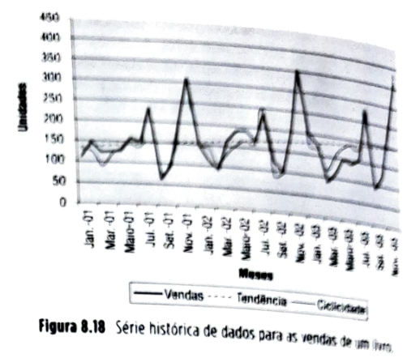

**Modelos quantitativos para demanda relativamente estável**

Os modelos quantitativos mais simples para previsão são aqueles que assumem que a demanda se encontra relativamente estável, flutuando aleatoriamente em torno de um patamar que se deseja estimar.

**Método de médias móveis**
Modelos de médias móveis, apenas adequados para demandas sem tendência de crescimento ou decrescimento, assumem que a melhor estimativa do próximo período do futuro é dada pela média dos *n* últimos períodos. Podem-se usar médias móveis de três (MM3) períodos, de quatro (MM4) períodos ou mais. Consideremos o exemplo ilustrado na Figura 8.19.

A fórmula de cálculo para médias móveis é:

| Mês | Vendas reais de copos | Média móvel de 3 períodos MM3 |
| --- | --- | --- |
| Janeiro | 154 |  |
| Fevereiro | 114 |  |
| Março | 165 |  |
| Abril | 152 | (154 + 114 + 165) / 3 = 144,3 |
| Maio | 176 | (114 + 165 + 152) / 3 = 143,7 |
| Junho | 134 | (165 + 152 + 176) / 3 = 164,3 |
| Julho | 123 | (152 + 176 + 134) / 3 = 154,0 |
| Agosto | 154 | (176 + 134 + 123) / 3 = 144,3 |
| Setembro | 134 | (134 + 123 + 154) / 3 = 137,0 |
| Outubro | 156 | (123 + 154 + 134) / 3 = 137,0 |
| Novembro | 123 | (154 + 134 + 156) / 3 = 148,0 |
| Dezembro | 145 | (134 + 156 + 123) / 3 = 137,7 |

**Figura 8.19** Exemplo de cálculo de média móvel de uma série histórica

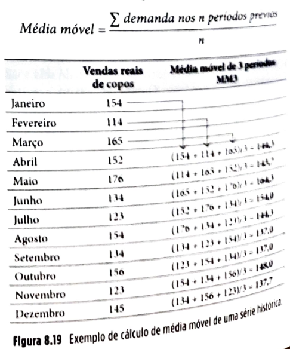

## Página 235

O cálculo de médias móveis, conforme descrito, assume que as médias consideradas são médias aritméticas simples. Nada impede, entretanto, que se prefira usar uma média diferente – uma média ponderada, por exemplo, atribuindo pesos de ponderação maiores para períodos mais recentes. Considere o exemplo da Figura 8.19. Nele, resolveu-se utilizar uma média móvel dos três últimos meses. Entretanto, a média deverá ser ponderada com pesos de ponderação respectivamente 3, 2 e 1 para os valores, respectivamente, do mês passado, de dois meses atrás e de três meses atrás. Com isso, aumenta-se a influência dos meses mais recentes na geração das previsões.

**Figura 8.20** Exemplo de cálculo de média móvel ponderada de uma série histórica.

| Mês | Vendas reais de copos | Média móvel de 3 períodos ponderada com pesos 3, 2 e 1 |
| --- | --- | --- |
| Janeiro | 154 |  |
| Fevereiro | 114 |  |
| Março | 165 |  |
| Abril | 152 | [(1 * 154) + (2 * 114) + (3 * 165)] / 6 = **146,2** |
| Maio | 176 | [(1 * 114) + (2 * 165) + (3 * 152)] / 6 = **150,0** |
| Junho | 134 | [(1 * 165) + (2 * 152) + (3 * 176)] / 6 = **166,2** |
| Julho | 123 | [(1 * 152) + (2 * 176) + (3 * 134)] / 6 = **151,0** |
| Agosto | 154 | [(1 * 176) + (2 * 134) + (3 * 123)] / 6 = **135,5** |
| Setembro | 134 | [(1 * 134) + (2 * 123) + (3 * 154)] / 6 = **140,3** |
| Outubro | 156 | [(1 * 123) + (2 * 154) + (3 * 134)] / 6 = **138,8** |
| Novembro | 123 | [(1 * 154) + (2 * 134) + (3 * 156)] / 6 = **148,3** |
| Dezembro | 145 | [(1 * 134) + (2 * 156) + (3 * 123)] / 6 = **135,8** |

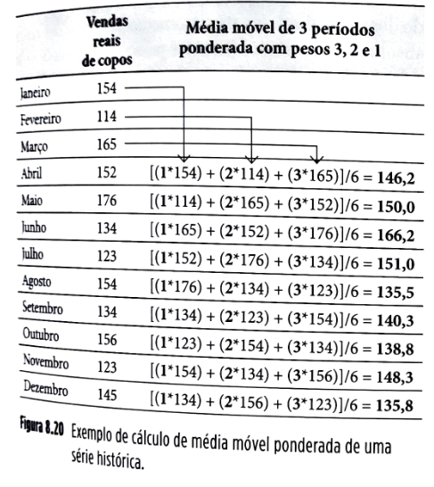

### Suavização exponencial

Um caso particular de médias ponderadas de dados do passado, com peso de ponderação caindo exponencialmente, quanto mais antigos forem os dados, é aquele resultante do uso da técnica, bastante divulgada, de suavização exponencial (também chamada método de Winter). A fórmula básica da suavização exponencial é:

Nova previsão = [(demanda real do último período) × (α)] + [(última previsão) × (1 – α)]

Em que:

(α) é a chamada “constante de suavização”, que é um número entre 0 e 1 e dá a influência percentual da demanda real do último período na previsão do próximo período.
(1 – α) é a taxa exponencial com que caem os pesos de ponderação dos dados históricos, de α (referente ao mês passado mais recente “t”) para α(1 – α) para o mês anterior “t – 1” para α(1 – α)² para o mês “t – 2”, e assim por diante.

Observe na Figura 8.21 um exemplo de cálculo. Em situações práticas, os valores da constante α em geral se situam na faixa de 0,05 e 0,35.

**Figura 8.21** Exemplo de cálculo de previsões usando suavização exponencial para uma série histórica, com α = 0,1 e com α = 0,8.

| Mês | Vendas reais de copos | Suavização exponencial com alfa 0,1 | Suavização exponencial 0,8 |
| --- | --- | --- | --- |
| Janeiro |  | última previsão (feita em dezembro) -> 150 |  |
| Fevereiro | 154 | 150 | 150 |
| Março | 114 | [(0,1)*(154) + (1 – 0,1)*(150)] = **150,4** | 153,2 |
| Abril | 165 | [(0,1)*(114) + (1 – 0,1)*(150,4)] = **146,8** | 121,8 |
| Maio | 152 | [(0,1)*(165) + (1 – 0,1)*(146,8)] = **148,6** | 156,4 |
| Junho | 176 | [(0,1)*(152) + (1 – 0,1)*(148,6)] = **148,9** | 152,9 |
| Julho | 134 | [(0,1)*(176) + (1 – 0,1)*(148,9)] = **151,6** | 171,4 |
| Agosto | 123 | [(0,1)*(134) + (1 – 0,1)*(151,6)] = **149,9** | 141,5 |
| Setembro | 154 | [(0,1)*(123) + (1 – 0,1)*(149,9)] = **147,2** | 126,7 |
| Outubro | 134 | [(0,1)*(154) + (1 – 0,1)*(147,2)] = **147,9** | 148,5 |
| Novembro | 156 | [(0,1)*(134) + (1 – 0,1)*(147,9)] = **146,5** | 136,9 |
| Dezembro | 123 | [(0,1)*(156) + (1 – 0,1)*(146,5)] = **147,4** | 152,2 |
|  | 145 | [(0,1)*(123) + (1 – 0,1)*(147,4)] = **145,0** | 128,8 |

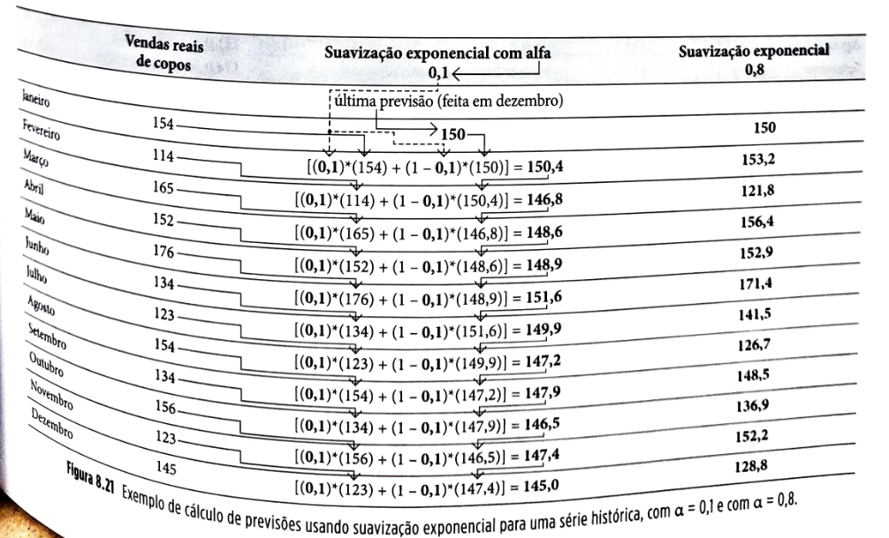

## Página 236

### 8.2.7 Erros (ou incerteza) de previsão

É sempre importante acompanhar dois tipos de erros de previsão: a "amplitude" ou "tamanho" dos erros e o chamado "viés" dos erros. O viés ocorre quando os erros sucedem sistematicamente (tendenciosamente) para um lado só. Isso em geral se dá por alguma causa "identificável", ou seja, pela influência de alguma variável deixada fora do modelo de previsão cuja influência singular está influenciando significativamente os erros de previsão. Idealmente, uma vez identificada a ocorrência de "viés", as causas devem ser investigadas e eliminadas (por exemplo, incorporando a variável "causa" no modelo de previsão).

### Acompanhamento de possíveis erros do tipo "viés"

Usa-se o chamado sinal de rastreabilidade (ou, como chamado na literatura de língua inglesa, *tracking signal*) para acompanhar as possíveis ocorrências de "viés" de previsão. Acompanhe a Figura 8.21 para um exemplo de cálculo. Retomamos aqui o exemplo do quadro da Figura 8.19, em que se usou o modelo de média móvel de três períodos para gerar as previsões.

A Figura 8.22 permite acompanhar o cálculo do sinal de rastreabilidade passo a passo. Período a período, calcula-se inicialmente o erro aritmético (subtração simples da ocorrência real do mês pela previsão que havia sido feita para o mês). Em seguida, calcula-se o erro aritmético acumulado (EArA): veja que, em abril, na coluna EArA consta o valor -7,7. Em maio, consta o valor -40,0, que é o resultado da acumulação dos valores de maio e abril, e assim por diante. Calcula-se, então, o erro absoluto, que é o valor, em módulo, do erro aritmético. A próxima coluna traz o erro absoluto acumulado (EAA), que é o acumulado dos erros absolutos até o momento. De posse dos erros absolutos acumulados (EAA), é possível, mês a mês, ir-se calculando o erro médio absoluto até o momento. O que se faz nesse cálculo é dividir o erro absoluto acumulado (EAA) pelo número de meses ao qual se refere. Observe o mês de junho, por exemplo. O valor do EAA é 70,3 e refere-se a um acumulado de três meses (abril, maio e junho). O erro médio absoluto, então, é de .

**Figura 8.22** Cálculo do sinal de rastreabilidade (*tracking signal*) para acompanhamento de "viés" de previsões.

| Mês | Vendas reais de copos (V) | Previsão MM 3 (P) | Erro aritmético (V - P) | Erro aritmético acumulado EArA | Erro absoluto |V - P| | Erro absoluto acumulado EAA | Erro médio absoluto (EAA/n) EMA | Tracking signal EArA/EMA TS |
| :--- | :---: | :---: | :---: | :---: | :---: | :---: | :---: | :---: |
| Janeiro | 154 | | | | | | | |
| Fevereiro | 114 | | | | | | | |
| Março | 165 | | | | | | | |
| Abril | 152 | 144,3 | - 7,7 | - 7,7 | 7,7 | 7,7 | 7,7 | - 1,0 |
| Maio | 176 | 143,7 | - 32,3 | - 40,0 | 32,3 | 40,0 | 20,0 | - 2,0 |
| Junho | 134 | 164,3 | 30,3 | - 9,7 | 30,3 | 70,3 | 23,4 | - 0,4 |
| Julho | 123 | 154,0 | 31,0 | 21,3 | 31,0 | 101,3 | 25,3 | 0,8 |
| Agosto | 154 | 144,3 | - 9,7 | 11,7 | 9,7 | 111,0 | 22,2 | 0,5 |
| Setembro | 134 | 137,0 | 3,0 | 14,7 | 3,0 | 114,0 | 19,0 | 0,8 |
| Outubro | 156 | 137,0 | - 19,0 | - 4,3 | 19,0 | 133,0 | 19,0 | - 0,2 |
| Novembro | 123 | 148,0 | 25,0 | 20,7 | 25,0 | 158,0 | 19,8 | 1,0 |
| Dezembro | 145 | 137,7 | - 7,3 | 13,3 | 7,3 | 165,3 | 18,4 | 0,7 |

O sinal de rastreabilidade é calculado então dividindo-se o erro aritmético acumulado (EArA) pelo erro médio absoluto (EMA). Essa variável é acompanhada e deve estar sempre entre os valores -4 e +4. Se o valor do TS atinge em certo momento um valor menor que -4 ou maior que +4, deve-se investigar mais detalhadamente a questão, pois, estatisticamente, é grande a chance de o modelo estar gerando previsões enviesadas. No quadro da Figura 8.22, aparentemente até o mês de dezembro, não há indícios estatísticos de haver viés na previsão gerada. Se um viés for identificado e sua causa for eliminada por meio da mudança do modelo de previsão, o cálculo do TS deve ser reiniciado, abandonando-se os dados anteriores.

### Acompanhamento da "amplitude" dos erros

São várias as formas possíveis de mensurar e acompanhar a amplitude dos erros de previsão. Algumas são ilustradas e definidas a seguir.

As mais populares são o erro médio absoluto e o erro médio quadrático.

Retomamos o exemplo da Figura 8.19, quando demonstramos o método de suavização exponencial na Figura 8.21 para ilustrarmos os cálculos de erro médio absoluto e erro médio quadrático.

## Página 237

| **Vendas reais** | **Previsão Suav. Expon. Alfa = 0,1** | **Previsão Suav. Expon. Alfa = 0,8** | **Desvio absoluto Alfa = 0,1** | **Desvio absoluto Alfa = 0,8** | **Desvio quadrático Alfa = 0,1** | **Desvio quadrático Alfa = 0,8** |
| --- | --- | --- | --- | --- | --- | --- |
|  | 154 | 150,0 | 150,0 | 4,0 | 4,0 | 16,0 |
| Janeiro | 114 | 150,4 | 153,2 | 36,4 | 39,2 | 1325,0 |
| Fevereiro | 165 | 146,8 | 121,8 | 18,2 | 43,2 | 332,7 |
| Março | 152 | 148,6 | 156,4 | 3,4 | 4,4 | 11,7 |
| Abril | 176 | 148,9 | 152,9 | 27,1 | 23,1 | 733,0 |
| Maio | 134 | 151,6 | 171,4 | 17,6 | 37,4 | 310,9 |
| Junho | 123 | 149,9 | 141,5 | 26,9 | 18,5 | 722,0 |
| Julho | 154 | 147,2 | 126,7 | 6,8 | 27,3 | 46,5 |
| Agosto | 134 | 147,9 | 148,5 | 13,9 | 14,5 | 192,2 |
| Setembro | 156 | 146,5 | 136,9 | 9,5 | 19,1 | 90,7 |
| Outubro | 123 | 147,4 | 152,2 | 24,4 | 29,2 | 596,8 |
| Novembro | 145 | 145,0 | 128,8 | 0,0 | 16,2 | 0,0 |
| **Desvios médios** |  |  |  | **15,69** | **23,00** | **364,79** |

**Figura 8.23** Ilustração de cálculo de erro médio absoluto e erro médio quadrático.

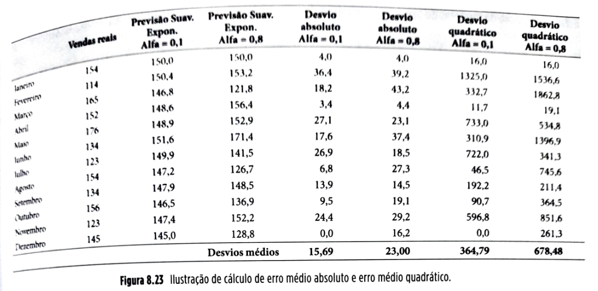

Os cálculos dos desvios são quase autoexplicativos. Os desvios absolutos são as diferenças entre previsão e vendas reais, mas em módulo (desconsiderando o sinal). Os desvios quadráticos são esses valores de desvios elevados ao quadrado. A linha de "Desvios médios" traz os valores médios dos desvios absolutos e quadráticos.

Foram calculados na Figura 8.19 os desvios para as previsões feitas pelo método de suavização exponencial com valores de  de 0,1 e 0,8. Um sumário das medidas de erros de previsão e correspondentes definições e fórmulas de cálculo encontra-se na tabela a seguir (Figura 8.24):

| Medida de erro de previsão | Descrição | Fórmula de cálculo |
| --- | --- | --- |
| Erro (desvio) aritmético | Previsão  no instante  menos a venda real  no instante  |  |
| Erro (desvio) aritmético acumulado | Soma dos erros aritméticos até o instante  |  |
| Erro (desvio) absoluto | Valor absoluto (em módulo) do Erro (aritmético) no instante  | $EA_t = |
| Erro (desvio) absoluto acumulado | Valor acumulado dos erros absolutos até o instante  | $EAA_t = \sum_{i=1}^{t} |
| Erro (desvio) médio absoluto | Valor médio dos erros absolutos até o instante  | $EMA_t = \frac\sum_{i=1}^{t} |
| Erro (desvio) quadrático | O quadrado do Erro aritmético no instante  |  |
| Erro (desvio) quadrático médio | A média dos Erros quadráticos até o instante  |  |
| Tracking signal (sinal de rastreamento) | Razão entre o Erro aritmético acumulado e Erro médio absoluto até o instante  |  |

O valor do índice  indica o primeiro período da série histórica considerada.

**Figura 8.24** Sumário sobre os erros de previsão.

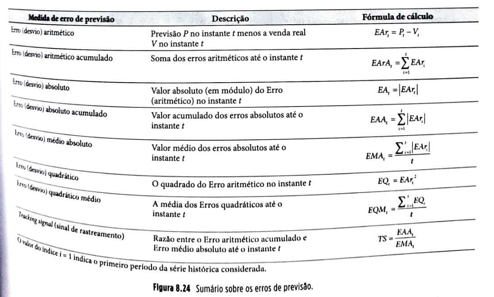

## Página 238

### 8.2.8 Calibração de modelos de previsão – definição de parâmetros

A escolha dos parâmetros de um modelo de previsão é uma decisão importante. Por exemplo, quando tratamos do método de suavização exponencial, como escolher o melhor ? À atividade de escolha dos parâmetros chamamos "calibração" do modelo. Imagine que, no exemplo ilustrativo da Figura 8.25, estejamos no mês de dezembro, tentando decidir qual valor de  deveríamos adotar para o ano seguinte. Podemos testar uma série de diferentes valores de  e mensurar para qual valor de  o valor do desvio médio absoluto ou do desvio médio quadrático teria sido menor no passado. Uma boa estimativa de um bom  para o futuro é um que teria sido bom no passado. No caso da Figura 8.19, o valor de  teria acarretado menor desvio médio absoluto e menor desvio médio quadrático para uso de método de suavização exponencial para previsões da série histórica analisada. Assim, o valor de  poderia ser uma boa escolha para uso futuro.

### Uso de métodos quantitativos com a presença de tendência e ciclicidades

Os métodos apresentados até agora (médias móveis, ponderadas ou não, e suavização exponencial) pressupõem a hipótese de "permanência", ou seja, assumem que a variável a ser prevista não tem tendência de crescimento, decréscimo ou ciclicidade. Nos casos em que isso não pode ser assumido, modelos como os expostos até aqui não deveriam ser usados.

Imagine um histórico de vendas como o ilustrado na Figura 8.25. Fica clara a presença, tanto de tendência geral de crescimento de vendas do livro como de ciclicidades. O quadro da Figura 8.25 traz os dados nos quais a Figura 8.17 foi baseada.

|  | Vendas 2001 | Vendas 2002 | Vendas 2003 |
| --- | --- | --- | --- |
| Janeiro | 112 | 146 | 199 |
| Fevereiro | 146 | 113 | 175 |
| Março | 122 | 92 | 88 |
| Abril | 125 | 160 | 112 |
| Maio | 127 | 188 | 149 |
| Junho | 157 | 190 | 140 |
| Julho | 150 | 168 | 154 |
| Agosto | 235 | 235 | 275 |
| Setembro | 60 | 122 | 90 |
| Outubro | 92 | 97 | 120 |
| Novembro | 206 | 186 | 226 |
| Dezembro | 312 | 354 | 360 |

**Figura 8.25** Exemplo de dados com presença de tendência de crescimento e ciclicidade.

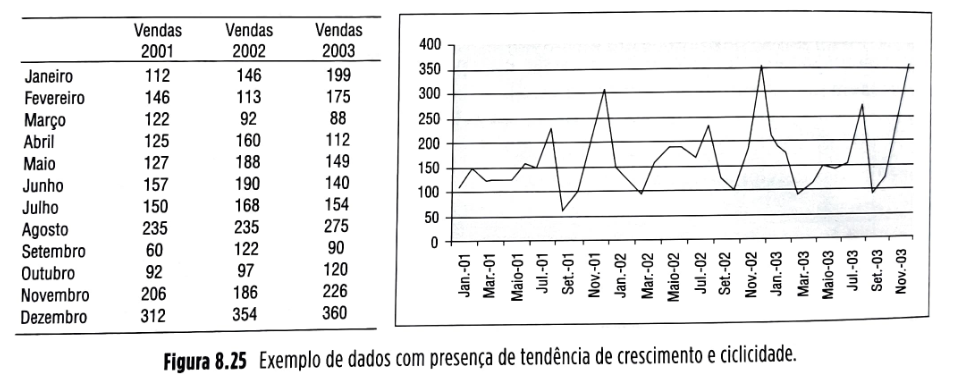

Quando ajustamos uma reta de tendência ao global dos dados (usando o comando "adicionar linha de tendência" e depois adotando a opção "linear", do Excel), achamos algo como ilustrado na Figura 8.26.

**Figura 8.26** Ilustração de ajuste de linha de tendência aos dados históricos de venda do livro.

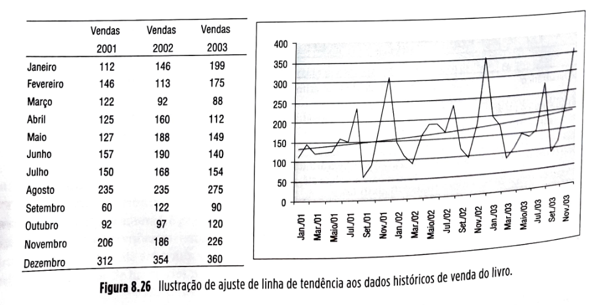

## Página 239

Faz sentido agora que analisemos a componente de ciclicidade que se sobrepõe à componente de tendência identificada. A forma como fazemos isso é calculando quanto, percentualmente, em média, as vendas de cada um dos meses superaram (ou estiveram abaixo de) a reta de tendência. Acompanhe na Figura 8.27.

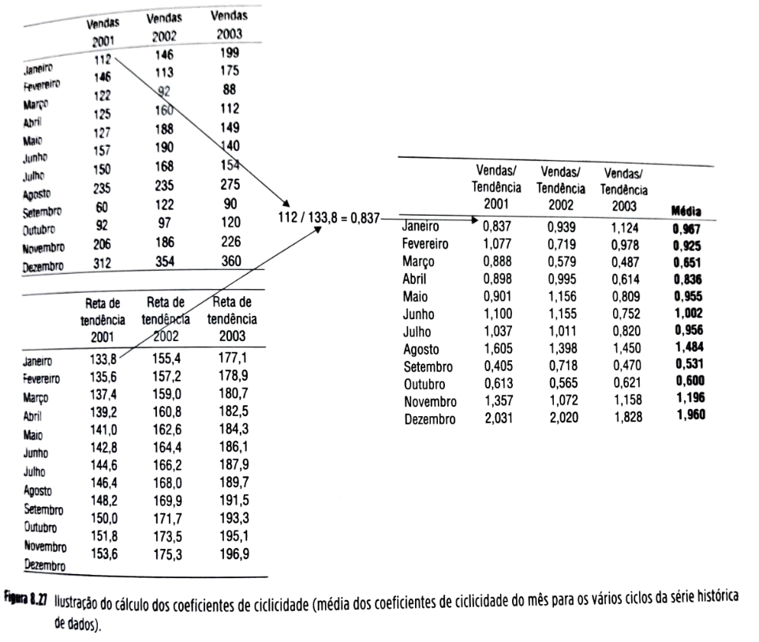

**Figura 8.27** Ilustração do cálculo dos coeficientes de ciclicidade (média dos coeficientes de ciclicidade do mês para os vários ciclos da série histórica de dados).

Na Figura 8.27, o quadro superior esquerdo traz as vendas reais de três anos do produto analisado. O quadro inferior esquerdo traz os valores obtidos a partir da reta de tendência. O quadro da direita, então, é calculado dividindo os valores correspondentes do quadro esquerdo superior pelos valores do quadro inferior esquerdo. Com isso, chegamos às relações entre as vendas reais e a reta de tendência. Observe o valor de janeiro de 2001 do quadro da direita; traz o valor 0,837, pois o valor da venda real de janeiro do referido ano representa 83,7% do valor da reta de tendência em janeiro do mesmo ano. No quadro da direita, então, são calculados os coeficientes para os três anos, da série histórica de dados, para janeiro, fevereiro, março, e assim por diante. Calculando as médias desses valores, temos uma estimativa de qual será o percentual relativo das vendas reais dos diversos meses em relação à reta de tendência. Pode-se, agora, com base nos coeficientes médios para cada um dos meses, calcular uma estimativa de vendas para 2004, agora considerando a sazonalidade sobre a reta de tendência. Retomando a reta de tendência e agora projetando seu valor para 2004, vem conforme mostrado na Figura 8.28.

## Página 240

| ⚠️**Conceito-chave**⚠️{bg=verde} |
| --- |
| Gestão de receitas se refere a vender a unidade certa do item de estoque para o tipo certo de cliente e pelo preço certo. |

### 8.2.9 Gestão de preços e de receitas (revenue management)

A gestão de receitas ganhou muita popularidade recentemente entre empresas que buscam aumentar sua lucratividade, inspiradas por iniciativas de sucesso adotadas pela indústria de linhas aéreas e hotéis. Os métodos de gestão de receitas integram estratégias de preço, alocação de estoques e capacidade de recursos para influenciar a demanda e, em última análise, aumentar a lucratividade.

Técnicas de gestão de receitas foram criadas para a indústria de linhas aéreas (atribuem-se à American Airlines os primeiros desenvolvimentos, imediatamente à desregulamentação sofrida pelo setor nos Estados Unidos nos anos 1970), de hotelaria e de aluguel de carros, nas quais:

▪️ os produtos são perecíveis, ou passam a valer muito pouco depois de certa data;
▪️ o sistema tem uma capacidade limitada e fixa de produção; e
▪️ a segmentação do mercado atendido é possível, com base na sensibilidade ao preço ou ao tempo de serviço.

## Página 241

Imagine uma empresa de aluguel de carros, com 100 carros idênticos. O gerente está pensando no valor do aluguel a cobrar por carro para o próximo feriado. Imagine que, por experiência anterior, a empresa saiba que a curva de elasticidade preço-quantidade da demanda (a curva que descreve quanto a demanda se altera com mudanças de preço) seja descrita pela expressão:

d = 2500/p

em que

d = demanda
p = preço

Isso significa que, se o preço for de R$ 50, então 50 carros serão demandados, e se o preço for de R$ 100, então a demanda será por 25 carros. Com o preço de R$ 25 por carro, a demanda seria de 100 carros e, portanto, a receita total (número de carros demandados multiplicado pelo preço unitário do aluguel) seria de R$ 2.500. A Figura 8.29 mostra graficamente a relação preço-demanda, com a receita sendo representada pela área enfatizada.

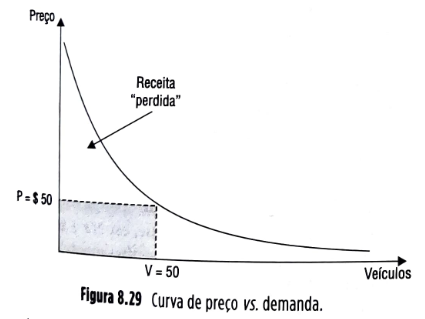

Aparentemente, a decisão de cobrar R$ 50 por veículo parece acertada, pois mantém todos os veículos alugados. Entretanto, essa solução assume que todos os clientes tenham de pagar o mesmo preço pelo aluguel. Se essa pressuposição for abandonada, podemos usar o fato de que, entre os 50 clientes servidos, há, por exemplo, 25 que estariam dispostos a pagar não apenas R$ 50 pelo seu aluguel, mas $ 100, e, dentre esses, há 10 dispostos a pagar R$ 250 por um veículo. De todos eles estão sendo cobrados, entretanto, os mesmos R$ 50 com a hipótese de mesmo preço para todos, ficando a empresa com uma receita menor (rigorosamente, a receita "perdida", quando a empresa despreza o fato de que diferentes clientes estão dispostos a pagar diferentes preços pelo serviço, é igual à área sob a curva de elasticidade preço-quantidade, acima da área enfatizada).

Imagine que fosse possível para a empresa de aluguel de carros estabelecer duas classes de preços: R$ 100 e R$ 50. A receita total seria:

Receita total = R$ 100 x 25 + R$ 50 x 25 = R$ 2.500 + R$ 1.250 = R$ 3.750

Uma política de três classes de preços, digamos, R$ 250, R$ 100 e R$ 50, teria receita ainda maior, de R$ 5.250, e assim por diante.

Esta é a oportunidade oferecida pela lógica de gestão de receitas: maximizar as receitas obtidas usando o fato de que clientes diferentes estão dispostos a pagar preços diferentes pelo produto ou serviço oferecido.

O que as empresas têm de fazer, do ponto de vista da maximização de receitas, é evitar que os clientes dispostos a pagar mais paguem o preço de uma classe mais barata. Isso é feito pela criação de barreiras entre as diferentes classes. Por exemplo, as empresas aéreas têm no seu mercado os viajantes a passeio e os que viajam a trabalho. Os viajantes a trabalho são em geral menos sensíveis a preço do que os viajantes a passeio. As empresas, então, trabalham com tarifas menores para viajantes a passeio, mas, por exemplo, exigem que o período entre a ida e a volta inclua o fim de semana. Isso cria uma barreira para evitar que os executivos viajando a trabalho comprem passagens na classe mais baixa de preço.

Várias empresas fabricantes de produtos também usam a gestão de receitas. A Dell é uma delas. O mesmo produto pode ser oferecido por diferentes preços no site da empresa, dependendo de o cliente ser um indivíduo, um pequeno negócio ou uma grande corporação. Evidentemente, a informação deve ser muito bem gerenciada para que a gestão de receitas seja bem-sucedida. Pode causar desconforto um cliente saber que pagou pelo mesmo produto ou serviço um preço maior do que outro cliente.

Por isso, muitas vezes a implantação dessas estratégias é mais difícil em lojas físicas, por exemplo, em que produtos ficam expostos com seus preços. As vendas pela internet, por outro lado, representam melhores oportunidades para iniciativas de gestão de receitas.

Muitas empresas definem as classes de preços com base na antecedência com que os clientes colocam seus pedidos. Reservam, então, certa quantidade de lugares ou produtos para serem vendidos mais baratos, desde que com antecedência (isso, inclusive, traz à empresa a vantagem de poder usar esses pedidos antecipados como uma "amostra" que pode ajudar numa melhor estimativa dos pedidos futuros, conforme discutido anteriormente no Boxe 8.1).

“Reservam” também lugares ou produtos para serem vendidos mais caros para clientes que não podem ou preferem não planejar suas compras com antecedência, resultando assim em receitas maiores devidas à disposição dos clientes de última hora de pagarem mais pela flexibilidade. Há hoje algoritmos sofisticados de estabelecimento dinâmico de preços – embora estes fujam do escopo deste livro, podem ser encontrados na literatura (ver, por exemplo, Metters *et al.*, 2006, ou Yeoman e McMahon-Beattie, 2004).

## Página 242

### 8.3 ESTUDO DE CASO: GENEXIS EM EXPANSÃO

Fernando Cabral e Helcio Lima, respectivamente presidente e vice-presidente da Genexis, gastaram boa parte da sua tarde discutindo estratégias para o futuro da empresa que ambos fundaram e fizeram crescer ao longo de quase 15 anos. A Genexis já havia atingido resultados impressionantes como provedora de serviços de apoio à gestão de demanda na indústria farmacêutica, e agora os executivos consideravam que era hora de utilizar a tecnologia desenvolvida e o conhecimento obtido para estender o seu modelo de negócio para outros setores industriais, como o de cosméticos e de produtos de consumo não duráveis, e para outros países, como os Estados Unidos. Contratos correntes com a L’Oreal Cosméticos e com a Unilever e a atuação, ainda limitada, em Portugal e na Espanha no setor farmacêutico eram fatores encorajadores, mas as perguntas que eles se colocavam eram: qual a estratégia certa para demonstrar aos potenciais usuários a vantagem de utilizarem a tecnologia e o conhecimento da Genexis? Quais usos potenciais usuários podem fazer das informações tratadas e providas quase *on-line* pela Genexis, para melhor gerenciarem sua demanda? Como quantificar as vantagens e, portanto, poder auxiliar os potenciais clientes a calcularem seus retornos sobre o investimento feito ao contratar os serviços da Genexis?

### Mudanças no mercado de medicamentos no Brasil

É importante conhecer algumas mudanças pelas quais passou o mercado farmacêutico brasileiro em anos recentes para entender como a Genexis obteve seu crescimento nos anos que se sucederam a essas mudanças. Talvez a principal seja, a partir da virada do milênio, o surgimento no mercado e a liberação, pela autoridade governamental, dos medicamentos genéricos. Isso tornou a presença no ponto de venda um aspecto importante para a competitividade dos medicamentos, do ponto de vista dos laboratórios fabricantes. Anteriormente, todo o esforço de venda para medicamentos de prescrição era direcionado aos médicos que os prescreviam. Os clientes então procurariam nas farmácias pelo medicamento prescrito e se não o achassem em algumas, ainda assim o laboratório não perderia a venda. Com os genéricos, se o cliente não acha exatamente o medicamento prescrito num ponto de venda, a farmácia, para não perder a venda, fatalmente sugerirá a substituição por um genérico. Se a sugestão é aceita, então, hoje é o laboratório quem provavelmente perde a venda quando um medicamento não está disponível numa farmácia.

### Histórico da empresa

A empresa que originaria a Genexis surgiu no Brasil, em 1994, como resposta à necessidade da indústria farmacêutica de informações de vendas (necessidade que foi tremendamente ampliada a partir dos genéricos), na forma dos chamados mapas de vendas, que mostram a distribuição espacial das vendas por período. Essa informação é estratégica, já que as indústrias chegam a alocar 25% do seu faturamento na chamada atividade promocional por meio da sua força de venda, que divulga os produtos da empresa junto aos médicos, que, espera a indústria, geram prescrição para os pacientes e, finalmente, isso gera demanda pelo produto na ponta da cadeia, a farmácia.

Até 1994, a indústria não dispunha de um mecanismo eficaz que medisse o resultado desse gasto substancial: se estaria sendo visitado o médico certo, na hora certa e divulgando o produto certo, ou se de fato o esforço estaria repercutindo em vendas efetivas na região. Isso porque as empresas que prestavam esse serviço o faziam de forma amostral, com os “mapas” resultantes sendo apresentados aos clientes alguns meses depois, quando uma possível ação corretiva já poderia ser tardia.

Em 1994, a futura Genexis, sob o nome de ITX, preparava-se para iniciar a prestação de serviços para a CESP, captando e processando dados de consumo de energia elétrica, quando, com a posse do governo Covas, teve seu contrato encerrado. Tentando aproveitar a infraestrutura e capacidade técnica existentes, o presidente Fernando

## Página 243

Cabral identificou a adequação da competência da empresa, ou seja, de captar de forma censitária, processar, analisar e disponibilizar, em tempo real, via EDI, grande quantidade de informações, às necessidades de acompanhamento dos diversos participantes da cadeia produtiva e de distribuição da indústria farmacêutica.

Assim, em 1994 foi criada a SSI, que assinou com o laboratório Bristol Myers-Squibb o primeiro contrato para o desenvolvimento do modelo concebido para capturar, formatar e consistir a informação de demanda e de cadastros de clientes de todos os distribuidores Bristol com periodicidade diária, em vez de mensal, permitindo que o laboratório passasse a conhecer a demanda por ponto de vendas no Brasil inteiro em formato censitário, e não amostral, e em curtíssimo espaço de tempo.

Já em 1995, com a experiência adquirida pelo desenvolvimento do projeto para a Bristol Myers-Squibb, a empresa, em consórcio com a Embratel, venceu uma concorrência para aplicar a mesma metodologia e tecnologia a um universo bem mais amplo. No início houve a participação de 12 laboratórios e aproximadamente 100 atacadistas, passando já em 1996 a atender 20 laboratórios e 300 atacadistas.

Diante da nova situação de crescimento, interno e externo à empresa, em 1996 é feita a opção pela internet como veículo operacional.

O ano de 1999 marca o início das negociações entre a empresa e o fundo de investimentos Pactual – Electro, que viriam a culminar, no ano seguinte, com a criação da IBP - Internet Business Partner, que se torna a principal controladora da SSI e o decorrente investimento de aproximadamente US$ 15,5 milhões, sendo US$ 10 milhões em tecnologia e o restante na contratação de recursos humanos. Estava criada a Genexis.

**Atacadistas/distribuidores/fabricantes no setor farmacêutico**

De acordo com a Abafarma, o mercado no Brasil era constituído, na época, por 1,5 mil atacadistas distribuidores de medicamentos e produtos de higiene pessoal e correlatos, sendo 200 especializados em medicamentos. Os atacadistas são responsáveis pela entrega de 72% dos medicamentos no país, distribuindo-os para farmácias, hospitais, casas de saúde. Existem no território nacional 58 mil farmácias, das quais cerca de 3,5 mil pertencem às grandes cadeias, que negociam diretamente com a indústria. As demais são abastecidas por distribuidores. São em torno de 100 os laboratórios farmacêuticos com operações estabelecidas no Brasil, se considerarmos os médios e grandes.

**O serviço de informação de suporte para gestão de demanda provido pela Genexis**

A Genexis basicamente criou uma cadeia de coleta de dados que integra a quase totalidade dos distribuidores e dos laboratórios farmacêuticos e grande número de farmácias, além de capturar, para efeitos práticos, 100% de todas as transações comerciais e movimentações de materiais ocorridas ao longo de toda a cadeia de suprimento farmacêutica no Brasil, entre fabricantes e distribuidores, entre distribuidores e varejistas, e das transações diretas entre fabricantes e varejistas. São mais de 50 milhões de transações coletadas e tratadas pela Genexis por dia. A empresa tem sofisticados algoritmos que controlam a qualidade e tratam as informações recebidas, gerando para os clientes relatórios disponibilizados na internet (principalmente laboratórios e distribuidores) com informações, por exemplo, sobre:

▪️vendas de medicamentos por apresentação (tipo de embalagem), por medicamento, por ponto de venda, por código postal, por cidade, por estado e geral do país;

▪️participação de mercado do medicamento dentro da classe terapêutica (por exemplo, antibióticos, em qualquer dos níveis de agregação (por código postal, cidade, estado, país) – este item e o seguinte são possíveis porque a Genexis hoje captura informações da quase totalidade do mercado, e não de apenas alguns laboratórios;

▪️participação de mercado do distribuidor, por medicamento ou por classe terapêutica, em qualquer nível de agregação (código postal, cidade, estado, país); e

▪️informações sobre frequência, recência e volume de compras por apresentação, em qualquer nível de desagregação (código postal, cidade, estado, país).

Essas informações estão disponíveis aos clientes na cadeia após cerca de um dia da coleta, ou seja, as vendas de dois dias atrás podem ser consultadas pelos executivos de gestão de demanda e gestão de cadeia de suprimentos envolvidos, e ações podem ser, então, tomadas com base nessas informações. A diferença trazida pela tecnologia da Genexis é que anteriormente essas informações não eram censitárias (100% das transações coletadas), mas amostrais (feitas por empresas que iam a uma amostra dos pontos de venda e levantavam as informações de venda, tratavam-nas e as disponibilizavam aos executivos das cadeias de suprimentos dos laboratórios e distribuidores na forma de "mapas de venda", um ou dois meses depois da coleta).

## Página 244

### 8.4 RESUMO

▪️A principal função da gestão de cadeias de suprimentos é garantir que o suprimento e a demanda sejam compatíveis.

▪️Uma boa gestão de cadeias de suprimentos começa com uma boa gestão de demanda.

▪️Gestão de demanda envolve: ações sobre a demanda para redução de sua variabilidade, previsão de demanda para reduzir incertezas e gestão de preço e de receitas.

▪️A variabilidade da demanda se refere a quanto a demanda varia dentro de um ciclo.

▪️Uma cadeia de suprimentos incorre em custos maiores quando tem de lidar com maior variabilidade de demanda; se for possível reduzir a variabilidade da demanda por meio de ações, isso deve ser feito.

▪️Há duas causas possíveis para a variabilidade de demanda que afetam as cadeias de suprimentos: variações da demanda do consumidor final e variações causadas pelo efeito chicote.

▪️O efeito chicote é um fenômeno dinâmico que faz com que pequenas variações de demanda no nível do consumidor final de uma cadeia de suprimentos se amplifiquem crescentemente à medida que as informações sobre essa demanda (normalmente na forma de pedidos) são transmitidas (e distorcidas) sequencialmente ao longo das relações cliente-fornecedor na cadeia de suprimentos.

▪️Em situações reais, há cinco principais motivos para o efeito chicote: as atualizações descoordenadas de previsões de demanda dos nós da cadeia, as formações de lotes de produção e de transporte, as flutuações de preço, o racionamento/comportamento oportunista e as demoras nos fluxos de materiais e informação.

▪️O primeiro mandamento das previsões é "evitará fazê-las".

▪️Para que o gestor da cadeia tome uma boa decisão, é necessário que tenha a visão mais clara possível (ou com a menor incerteza possível) do futuro.

▪️Há quatro erros comuns que as empresas cometem quanto a previsões:

▪️Erro 1 das previsões: confundir previsões com metas e, um erro subsequente, considerar as metas como se fossem previsões.
▪️Erro 2 das previsões: gastar tempo e esforço discutindo se se acerta ou erra nas previsões, quando o mais relevante é discutir o quanto se está errando e as formas de alterar processos envolvidos, de forma a reduzir esses erros, ou incertezas.
▪️Erro 3 das previsões: levar em conta, nas previsões que servirão para apoiar decisões em cadeias de suprimentos, um número só. Previsões, para gestão de cadeias de suprimentos, devem sempre ser consideradas com dois números: a previsão em si e uma estimativa do erro (ou grau de incerteza) dessa previsão.
▪️Erro 4 das previsões: desistir ou não se esforçar o suficiente para melhorar os processos de previsão por não se conseguir reduzir os erros às previsões, quando, em cadeias de suprimentos, não se necessita ter previsões perfeitas, mas sim previsões consistentemente melhores que as da concorrência.

▪️O horizonte da previsão é definido pelo tamanho da inércia decisória (tempo decorrido entre a decisão ser tomada e a decisão efetivamente ser levada a efeito) da decisão à qual ela deve suportar.

▪️A agregação dos dados, que faz reduzir o nível de incerteza das previsões, compensa, até certo ponto, o aumento de incerteza causado pelo necessário aumento do horizonte de previsão nas decisões de inércia decisória alta.

▪️Para um determinado horizonte, as previsões devem ser feitas sempre com o nível máximo de agregação de dados que o processo decisório ao qual suportará permitir.

▪️Para previsões de curto prazo (até três meses), normalmente se aceita mais a hipótese de que o futuro seja uma "continuação" do passado; a técnica então geralmente utilizada é a de projeção; são os chamados modelos intrínsecos, ou de séries temporais simples.

▪️Quando o horizonte da previsão começa a aumentar, a hipótese de que o futuro vai "repetir" o passado (nos padrões de variação) deixa, muitas vezes, de ser válida. Devem-se então adotar outros modelos, cujas hipóteses sejam válidas para horizontes maiores. Exemplos são os modelos extrínsecos, modelos causais ou modelos de explicação.

▪️Quando o horizonte aumenta ainda mais (um a vários anos), a hipótese de que as relações existentes no passado entre a demanda e outras variáveis continuam a valer no futuro deixa, muitas vezes, de ser válida. A previsão, muitas vezes, necessita ser mais qualitativa.

▪️Os métodos qualitativos incorporam fatores de julgamento e intuição, em geral mais subjetivos, nas análises dos dados disponíveis. São exemplos: Delphi, júri de executivos, estimativa da força de vendas, pesquisa de mercado e analogia histórica.

▪️Os métodos quantitativos são aqueles métodos de previsão baseados em séries de dados históricos nas quais se procura, por meio de análises, identificar padrões de comportamento para que sejam então projetados para o futuro.

▪️Uma série temporal de dados em geral tem três principais componentes: tendência, ciclicidade e aleatoriedade.

▪️Alguns métodos quantitativos são: médias móveis, suavização exponencial e regressão (simples ou múltipla), com ou sem ciclicidade.

▪️É sempre importante acompanhar dois tipos de erros de previsão: a "amplitude" ou o "tamanho" dos erros e o chamado "viés" dos erros.

▪️A escolha dos parâmetros de um modelo de previsão é uma decisão importante e é chamada "calibração".

▪️Gestão de receitas se refere a vender a unidade certa do item de estoque para o tipo certo de cliente e pelo preço certo. Os métodos de gestão de receitas integram estratégias de preço e de alocação de estoques e de capacidade de recursos para influenciar a demanda e, em última análise, aumentar a lucratividade.