# Capítulo 9 - Gestão e coordenação de estoques na cadeia global de suprimentos

**9.1** Introdução, 249
**9.2** Conceitos, 254
**9.2.1** Estoques – conceitos básicos, 254
**9.2.2** Demanda independente e demanda dependente, 257
**9.2.3** Aumentando a coordenação na gestão de estoque de itens de demanda dependente na cadeia de suprimentos, 258
**9.2.4** VMI (*vendor managed inventory*) – estoque gerenciado pelo distribuidor – e VOI (*vendor owned inventory*) – consignação, 267
**9.2.5** Aumentando a coordenação na gestão de itens de demanda independente na cadeia de suprimentos, 268
**9.2.6** Modelo de revisão periódica, 273
**9.2.7** Curva ABC, 278
**9.3** Estudo de caso: Transparência faltando na cadeia de suprimentos de circuitos integrados, 280
**9.4** Resumo, 282

## Página 249

## OBJETIVOS DE APRENDIZAGEM

📌 Sintetizar o que são estoques e suas funções principais.

📌 Descrever os tipos de estoques envolvidos em gestão global de cadeias de suprimentos.

📌 Entender as principais técnicas de gestão de estoques e quando elas são mais indicadas.

📌 Explicar o impacto de se ter uma cadeia de suprimentos sem coordenação entre sistemas locais de gestão de estoques.

📌 Saber o que e como fazer para estabelecer uma gestão de estoques coordenada na cadeia global de suprimentos.

### 9.1 INTRODUÇÃO

Este capítulo trata da gestão de estoques na cadeia global de suprimentos, um assunto que continua no alto da lista de prioridades dos executivos. Gestão de estoques afeta a percepção e satisfação do cliente tanto em cadeias de produtos físicos como de serviços. Um cliente em busca de um telefone celular de sua preferência ficará insatisfeito ao perceber que o aparelho não se encontra disponível, da mesma forma que, numa linha aérea, o cliente não apreciará o fato de seu voo sofrer atraso substancial por uma peça sobressalente necessária a sanar um problema identificado não estar disponível de imediato. Gestão de estoques também afeta o resultado financeiro da organização. Excesso de estoques de matérias-primas, material em processo e produtos acabados significa substancial custo de oportunidade e valioso capital de giro indisponibilizado, que afetam a lucratividade e a saúde financeira da operação, além de “esconderem” problemas. Entretanto, em cadeias de suprimentos, uma boa gestão local de estoques não é suficiente. 

Como será discutido neste capítulo, além de boas práticas de gestão de estoques, a coordenação entre os vários sistemas de estoques envolvidos nas relações fornecedor-cliente da cadeia tem papel essencial para que se evitem desperdícios por redundância de estoques e também que se evitem oscilações e volatilidade da demanda (o chamado “efeito chicote” – ver Capítulo 8), que podem ocorrer na cadeia quando os vários sistemas de gestão de estoques envolvidos operam de forma independente, elevando custos e pondo níveis de serviço ao cliente em risco.

A Figura 9.1 ilustra, no quadro geral de referência deste livro, onde se localiza a gestão e coordenação de estoques na cadeia global de suprimentos.

## Página 250

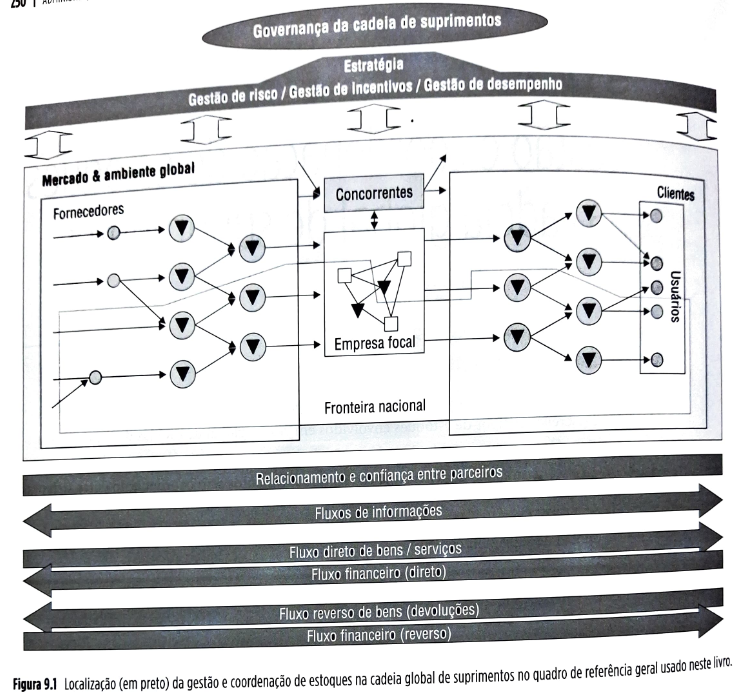

O sistema AutoGIRO revoluciona a gestão de estoques de peças sobressalentes na General Motors do Brasil (GMB)

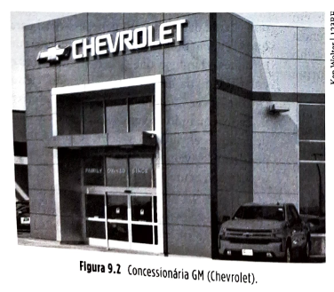

Figura 9.2 Concessionária GM (Chevrolet).

Quando o mercado brasileiro começou a se abrir para importações, um dos setores mais afetados foi o automobilístico. Com alíquotas de importação de veículos caindo drasticamente do patamar de 250% para níveis muito menores, o mercado brasileiro viu um novo fluxo de entrada de veículos importados, de marcas antes pouco presentes, como Toyota, Honda, Renault, Peugeot, Lada, entre outras. Alguns destes novos atores no mercado não se restringiram a apenas exportar veículos para o Brasil, mas, após sentir a receptividade do mercado aos seus produtos, passaram a estabelecer operações aqui – inicialmente de vendas e serviços de pós-venda e depois, gradualmente, estabelecendo operações de manufatura. As quatro principais empresas montadoras de veículos de passeio estabelecidas no Brasil àquela altura, Chevrolet (General Motors), Volkswagen, Ford e Fiat, começaram a sentir uma pressão competitiva forte para melhorar seus serviços de pós-venda a fim de se manterem competitivas contra os novos ingressantes. Uma iniciativa bem-sucedida foi a implantação do sistema AutoGIRO, pela GMB, descrito a seguir.

## Página 251

**Pós-venda no setor automobilístico**

Parte importante dos serviços de pós-venda do setor automobilístico é a gestão dos estoques de peças sobressalentes, já que uma má gestão, por um lado, eleva os custos produtivos e logísticos na cadeia de suprimentos, o que resulta em preços mais altos cobrados do cliente pelas peças que precisar. Por outro lado, pode também prejudicar o nível de disponibilidade das peças nas concessionárias, acarretando faltas e possivelmente tornando inoperável o veículo do cliente, forçando-o a usar meios alternativos mais caros de transporte, como o táxi ou um carro alugado.

Em ambos os casos, o *custo total de propriedade* (veja o Capítulo 6) *do veículo* aumenta pela má gestão dos estoques de peças, podendo levar o cliente, na sua próxima troca de carro, a optar por outra marca, afetando negativamente a venda de veículos novos da montadora que não gerenciar bem os estoques de peças da sua cadeia.

Má gestão de estoques de sobressalentes também afeta a lucratividade da montadora, pois, como as margens de lucro sobre a venda de peças são muito maiores que as margens de lucro sobre a venda de veículos, não disponibilidade e/ou altos preços cobrados pelas peças fazem os clientes escolherem outros fornecedores de peças sobressalentes quando necessitam consertar seus carros, reduzindo a participação de mercado e, portanto, o lucro da montadora no *negócio de peças sobressalentes*.

**Pós-venda na GMB antes do sistema AutoGIRO**

A GMB, ameaçada pelos novos concorrentes do mercado, então, nos anos 1990, resolveu analisar em detalhes sua cadeia de suprimentos de peças sobressalentes, conforme ilustra a Figura 9.3.

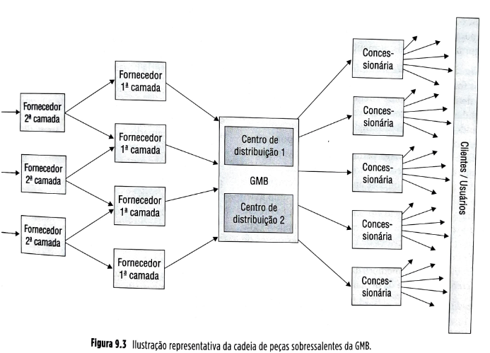

Figura 9.3: Ilustração representativa da cadeia de peças sobressalentes da GMB.

Como resultado da análise, percebeu, então, que seus níveis de estoques estavam bem acima dos melhores padrões mundiais (àquela altura, uma peça permanecia em média seis meses nos estoques da cadeia de suprimentos antes que fosse utilizada, enquanto em algumas empresas de classe mundial permanecia apenas dois meses) e, simultaneamente, que seus níveis de serviço (disponibilidade de peças na cadeia de concessionárias) estavam também em níveis bem piores do que os dos melhores padrões. Na cadeia da empresa, apenas cerca de 70% das peças requisitadas no balcão de uma concessionária estavam disponíveis, enquanto em operações de classe mundial estes valores podiam chegar a 95%.

## Página 252

**Problemas identificados**

Os seguintes problemas foram identificados na gestão da cadeia de suprimentos de peças sobressalentes da GMB pela equipe que analisou o problema:

**1. Falta de coordenação** – as decisões de reposição de estoques das concessionárias e dos centros de distribuição (CDs) da GM não tinham qualquer coordenação. Mesmo para peças cuja demanda era muito estável no nível das concessionárias, como as pastilhas de freio do veículo Corsa, pelo fato de as quase 500 concessionárias terem suas decisões de reposição definidas independentemente umas das outras, as ordens de reposição chegavam de forma caótica ao sistema de gestão dos CDs da GMB: em alguns dias, zero pedidos de um item podiam chegar aos CDs, enquanto em outros dias um grande número podia ser solicitado. Isso fazia com que os CDs da GM “percebessem” uma demanda muito mais volátil que a demanda real do mercado. Pela descoordenação entre os CDs da GM e os de seus fornecedores, a volatilidade era amplificada à medida que os pedidos seguiam para “trás” na cadeia, numa clara manifestação do “efeito chicote” (ver Capítulo 8 para uma discussão sobre este efeito). Para lidar com essa volatilidade, os CDs e os fornecedores de peças eram forçados a ter capacidade e estoques de segurança adicionais, aumentando os custos.

**2. Falta de visibilidade na cadeia de suprimentos** – os elos fornecedores não tinham qualquer visibilidade da demanda que seus clientes na cadeia tinham de atender. Um fornecedor não sabia, por exemplo, se um grande pedido recebido era devido a um aumento real de demanda no mercado ou simplesmente porque seu cliente imediato estava pedindo mais peças a fim de aumentar seus níveis de estoques. Isso fazia com que cada elo na cadeia olhasse apenas para a demanda de seu cliente imediato para fazer previsões. Como a demanda solicitada pelo elo imediatamente à frente era muito diferente para os diferentes elos, as previsões que suportavam as decisões de reposição de estoques de cada um dos elos eram diferentes entre si, amplificando o problema – cada membro da cadeia tinha uma noção diferente a respeito da demanda futura.

**3. Desalinhamento de incentivos na cadeia** – as formas de incentivo às concessionárias usadas pela GMB não estavam alinhadas (ver Capítulo 6 para uma discussão sobre este tópico) com o melhor interesse da cadeia como um todo. A GMB definia mensalmente metas de compras de peças para cada concessionária e as recompensava com prêmios financeiros pelo atingimento destas metas. Como nem todas as concessionárias tinham bons sistemas de previsão e gestão de peças, muitas vezes, para atingir as metas de compras, as concessionárias compravam peças que não tinham boas probabilidades de serem vendidas rapidamente, o que aumentava seus estoques e também os níveis de obsolescência desses estoques. Em um levantamento preliminar, a GMB descobriu que cerca de 30% dos estoques das concessionárias eram de itens obsoletos. Isso fragilizava a saúde financeira das concessionárias.

**4. Existências de lotes mínimos de compra** – impostos pelos CDs a fim de que os custos de transporte fossem mais “diluídos”, a existência de lotes mínimos de compra fazia com que os estoques médios das concessionárias subisse (um lote grande, quando é comprado, leva mais tempo para ser consumido), imobilizando precioso capital de giro, o que comprometia a capacidade de as concessionárias disponibilizarem uma grande variedade de peças em suas prateleiras e prejudicava os níveis de disponibilidade de peças ao cliente.

**5. Previsão inacurada de vendas** – as previsões de vendas feitas individualmente por cada uma das concessionárias levavam em conta apenas os dados históricos de vendas locais. Como as concessionárias não compartilhavam entre si informações sobre demanda, importantes dados referentes à demanda agregada de peças (do conjunto das concessionárias) não eram levados em conta nas previsões, tornando a acurácia pior do que o que seria possível.

A partir deste diagnóstico, a GMB disparou uma iniciativa para alterar substancialmente a forma de gerenciar sua cadeia de suprimentos, num projeto nacional audacioso chamado AutoGIRO. O AutoGIRO, implantado a partir de junho de 2000, baseia-se nos seguintes princípios:

**1. Compartilhamento de informações das concessionárias com a GMB e implantação de VMI (*vendor managed inventory*, ou estoque gerenciado pelo fornecedor)**

Com isso, a GMB passa a assumir a responsabilidade pela gestão dos estoques das suas concessionárias. Denominador comum da cadeia de suprimentos, a empresa é o único ator na cadeia que pode conhecer a demanda agregada das 500 concessionárias para cada peça. Assim, pode realizar melhores previsões de venda para os específicos mercados servidos por cada uma das concessionárias. Além da possibilidade do uso de melhores previsões na gestão dos estoques, a GMB, como gestora, também tem a vantagem de entregar milhares de diferentes peças para um definido e estável conjunto de concessionárias e, com isso, poder obter economias de escala em transporte, porque os custos podem ser compartilhados usando sistemas como o *milk run* (ver Capítulo 11), em que um meio de transporte faz entregas coordenadas, periódicas e regulares para um grupo de concessionárias. A GMB, como gestora dos estoques, pode coordenar melhor essas entregas.

## Página 253

### 2. Proteção contra obsolescência e falta de peças

Com o VMI, como a GMB assume a atividade de definir as políticas de gestão de estoques das concessionárias, é justo e plausível que assuma também a responsabilidade pelas consequências de exercer este poder. O AutoGIRO faz isso garantindo que as concessionárias que aceitarem suas sugestões de ressuprimento estejam protegidas contra a obsolescência das peças. Itens sugeridos pelo novo sistema da GMB que obsolescerem na concessionária são recomprados (veja o Capítulo 6 para uma discussão de contratos de recompra - *buyback*) pela GMB. Da mesma forma, se a concessionária aceita a sugestão da GMB para ressuprimento e se depara com a falta de certa peça, a GMB se compromete a remeter a peça com urgência sem custos extras para a concessionária. Antes do programa AutoGIRO, entregas urgentes custavam bastante e peças obsoletas eram problema exclusivo das concessionárias.

### 3. Alinhamento de incentivos

A GMB alterou substancialmente o desenho dos seus incentivos. Eliminou as metas e recompensas de compra de peças dadas às concessionárias e estabeleceu metas de *vendas* de peças ao mercado para incentivar as concessionárias a *vender* mais, e não meramente a *comprar* mais. Para uma discussão sobre alinhamento de incentivos na cadeia, veja o Capítulo 6.

### 4. Reposição automática de peças na concessionária

O sistema AutoGIRO trabalha com a lógica de reposição automática de estoques. A cada dia, o sistema recebe informações sobre a posição corrente do estoque de cada concessionária, para cada item, e, caso essa posição seja menor que a quantidade ideal (pré-calculada e atualizada semanalmente pelo sistema) para aquela concessionária, a quantidade ideal é completada. Como este cálculo e reposição são feitos todo dia, o sistema acaba repondo automaticamente na concessionária as quantidades vendidas no dia anterior. Com isso, a demanda percebida pelos CDs passa a ser muito similar à demanda percebida pela concessionária, reduzindo o efeito chicote. Na concessionária, reposições diárias com lotes reduzidos diminuem os estoques médios, reduzindo também o capital de giro necessário a mantê-los. Com mais capital de giro, as concessionárias podem disponibilizar uma maior variedade de peças, aumentando o nível de serviços ao cliente.

### 5. Compartilhamento de informações de estoques entre concessionárias da cadeia

Para que a GMB possa gerenciar os estoques das concessionárias e prover reposição automática, ela precisa ter um fluxo contínuo e atualizado de informações sobre a posição de estoques de cada item em cada concessionária. A empresa disponibiliza essas informações para as concessionárias na internet – isso significa que, em caso de uma falta local de peça, a concessionária pode rapidamente conferir na internet se e *onde* a peça estaria disponível entre as concessionárias da redondeza, obtendo rapidamente o item.

### As vantagens do sistema AutoGIRO

▪️**Por compartilhar informações entre as concessionárias e a GMB**, a acurácia das previsões de demanda aumenta e a volatilidade na cadeia diminui. Isso ajuda a reduzir níveis necessários de estoques de segurança em todos os elos envolvidos – para algumas concessionárias, a permanência média dos itens em estoque foi reduzida de seis meses para dois meses com a implantação do sistema.

▪️**Por compartilhar informações entre as concessionárias**, permite que os níveis de serviço aumentem ainda mais. Quando uma concessionária identifica a falta de peça necessária para atender um cliente, pode checar os estoques de outras concessionárias próximas e obter rapidamente o item faltante.

▪️**Por coordenar as decisões de reposição da cadeia inteira**, permite que a reposição automática em pequenos lotes seja viável, reduzindo o estoque médio nas concessionárias. Com isso, as concessionárias têm capital de giro liberado para disponibilizar uma maior variedade de peças. Algumas concessionárias envolvidas no projeto elevaram seus níveis de serviço de 70% para 94%.

▪️**Por coordenar suprimento e demanda no ponto de venda**, com reposições automáticas, fazendo a cadeia trabalhar no mesmo ritmo do mercado, reduz substancialmente o efeito chicote a montante na cadeia.

▪️**Por estabelecer um time de analistas bem treinados na GMB**, dedicados exclusivamente a cuidar e aperfeiçoar o AutoGIRO, cada melhoria no algoritmo, nas práticas, no tratamento dos dados etc. beneficiará toda a cadeia.

▪️**Antes do AutoGIRO**, pesquisa conduzida pela GM mostrou que cerca de 80% do tempo dos gerentes de peças das concessionárias era gasto com o processo de aquisição de peças. Com o AutoGIRO automatizando grande parte disso, o gerente de peças agora pode utilizar seu tempo desenvolvendo o relacionamento com o cliente, buscando novas oportunidades de negócio e vendendo mais.

**Com menores custos na cadeia**, parte do benefício pode ser repassado ao cliente final na forma de preços mais baixos, o que aumenta a competitividade da cadeia como um todo.

## Página 254

O referido caso da GMB ilustra uma situação real na qual os sistemas de estoques foram redesenhados com o objetivo de não só melhorar os individuais sistemas de gestão de estoques de cada elo da cadeia de suprimentos, mas estabelecer e melhorar a coordenação entre os sistemas de gestão de estoques dos elos envolvidos. Para que possamos discutir com mais propriedade como conseguir melhorar os níveis de gestão e coordenação de decisões sobre estoques nas cadeias de suprimentos, no restante deste capítulo estudaremos os principais conceitos e modelos de gestão de estoques tradicionais e as formas mais contemporâneas de gestão e coordenação de estoques nas cadeias de suprimentos.

## 9.2 CONCEITOS

### 9.2.1 Estoques – conceitos básicos

| ⚠️**Conceito-chave**⚠️{bg=verde} |
| --- |
| Estoques são acúmulos de recursos materiais entre etapas de um processo de transformação. Os níveis de estoques variam quando os fluxos de entrada e de saída da etapa variam, um em relação ao outro. |

Processos de transformação podem se referir a uma **transformação física** – no caso de processos de manufatura ou de **posse** ou **localização** do bem –, como no caso de processos de distribuição e logística. A Figura 9.4 traz uma representação simplificada ilustrando o conceito de entradas – estoques – saídas. Note que cada etapa do processo geral representada na figura faz o papel de uma caixa d'água. A quantidade de água dentro de cada etapa representa o "estoque" presente na etapa. Pense na Etapa 3, por exemplo. Se os fluxos de água entrando e saindo são iguais, o nível de água – estoque – não se altera. Se, entretanto, os fluxos de entrada e saída são alterados, abrindo ou fechando as torneiras, relativamente um ao outro, o nível de estoque vai crescer se o fluxo de entrada aumentar em relação ao de saída e vai diminuir se o fluxo de entrada diminuir em relação ao de saída.

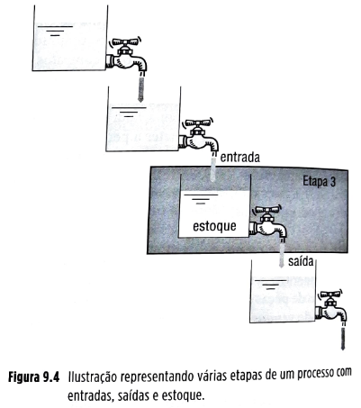

**Figura 9.4** Ilustração representando várias etapas de um processo com entradas, saídas e estoque.

Os estoques têm uma propriedade fundamental, que é ser uma *arma* – no sentido de que pode ser usada produtivamente ou contraprodutivamente: os estoques proporcionam independência às etapas do processo de transformação entre as quais se encontram. Quanto maiores os estoques entre duas etapas de um processo de transformação, mais *independentes* entre si essas etapas são; por exemplo, a interrupção do fluxo de uma não acarreta, automaticamente, interrupção no fluxo da outra, se houver estoque entre elas.

Se um fornecedor, por exemplo, sofre uma interrupção em sua fábrica, essa interrupção será imediatamente sentida pelo cliente se este não tiver muito estoque do item fornecido. Este é o lado produtivo dos estoques: permitir que as possíveis diferenças entre taxas de entrada e saída entre etapas de um processo de transformação sejam "absorvidas".

Por exemplo, num processo produtivo de uma fábrica de geleia de frutas, o processo de transformação de morango em geleia de morango tem taxas de entrada e saída diferentes, entre si, ao longo do ano. Geleia de morango tem uma taxa de demanda pelo consumidor (saída do processo) mais estável – as pessoas comem geleia o ano todo, enquanto a entrada de morangos se dá com uma taxa muito alta durante a safra de morango e muito baixa (chegando a zero) fora da safra. As empresas conseguem regular essas diferentes taxas produzindo durante a safra mais do que a demanda requer neste período (portanto, criando estoques de produto acabado), de forma que os estoques criados sejam usados para continuar a atender a demanda por geleia na entressafra.

## Página 255

Essa diferença de taxas de entrada e saída é **inevitável**, pois não há ainda tecnologia para alterar substancialmente as durações da safra de produtos agrícolas. Há inúmeros exemplos, entretanto, do uso de estoques para absorver diferenças evitáveis entre taxas de entrada e de saída.

Este é o lado contraproducente dos estoques. Como ajudam a absorver diferenças relativas de taxas de entradas e saídas tanto *evitáveis* quanto *inevitáveis*, corre-se o risco de usar estoques *em vez* de disparar ações para equalizar as taxas quando isso é possível.

Este lado contraproducente dos estoques é muito enfatizado pelos modelos de gestão *lean*, de inspiração no modelo Toyota de produção, que procuram reduzir os estoques por meio do ataque às suas causas evitáveis.

Segundo a escola de pensamento *lean*, os estoques devem ser evitados porque “escondem” as imperfeições do sistema e tornam os gestores lenientes quanto aos problemas.

| 💡**Fique atento**💡{bg=amarelo} |
| --- |
| É importante entender as razões pelas quais os estoques surgem. Só assim se podem entender quais são *evitáveis* e quais são *inevitáveis*, tendo certeza de que aquelas evitáveis sejam constantemente combatidas e, em relação às causas inevitáveis, que os estoques sejam dimensionados adequadamente, em níveis apenas suficientes para lidar com elas. |

### Causas do surgimento dos estoques

Quais são os motivos que levam a haver diferenças entre as taxas de suprimento e de consumo de um determinado item? Em outras palavras, quais as razões por trás do surgimento dos estoques? São várias. As principais discutidas a seguir e mostradas esquematicaticamente na Figura 9.5:

▪️falta de coordenação, de várias naturezas, entre etapas do processo;
▪️incertezas de previsões em relação ao suprimento e à demanda;
▪️especulação; e,
▪️necessidade de preenchimento dos canais de distribuição.

### Falta de coordenação

Pode ser impossível ou inviável coordenar as fases do processo de transformação, de forma a alterar suas taxas de suprimento e consumo para que estas sejam iguais, dispensando a necessidade de estoque entre elas. Por exemplo:

**Restrições tecnológicas:** pode ser impossível, tecnologicamente, coordenar as fases de um processo produtivo de forma perfeita. Imagine, por exemplo, um determinado fornecedor que, por uma restrição tecnológica de seu processo, só consiga fornecer lotes maiores do que dez toneladas de determinado material. Se o consumo mensal do processo que utiliza este material é de 500 quilos, as duas fases – suprimento e consumo – estão descoordenadas. A cada compra de matéria-prima, algum estoque será formado, até que a taxa de consumo de 500 quilos por mês o consuma e justifique uma nova compra. Isso levará vários meses.

**Figura 9.5** Principais motivos para o surgimento dos estoques.

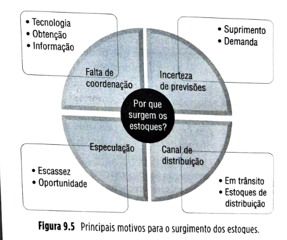

**Custos de obtenção:** às vezes, o motivo para a formação de lotes de produção não é uma impossibilidade tecnológica, mas uma inviabilidade econômica. Os custos de preparação do equipamento, por exemplo, podem ser altos, de forma que seja compensador produzir lotes maiores que certo tamanho, para que se “diluam” os custos de preparação, fixos para qualquer tamanho de lote. Isso pode ocorrer com processos internos ou de fornecedores. Nos processos de transporte também muitas vezes é inviável coordenar suprimento e demanda, surgindo lotes. Por exemplo, o transporte de contêineres em navios é restrito às frequências de rotas oferecidas pelas empresas de navegação.

Acumulam-se lotes de produtos a transportar para despachá-los com a frequência *possível*. Toda situação em que se criam lotes de materiais (de produção, movimentação interna ou transporte) que têm quantidades maiores do que a necessária no curto prazo deve ser questionada, já em grande parte das situações, a falta de coordenação causada pela formação de lotes é evitável por mudanças tecnológicas ou de método.

## Página 256

**Coordenação de informações:** há situações em que, mesmo não havendo restrições tecnológicas importantes ou inviabilidades referentes aos custos de obtenção, ocorre descoordenação de informação entre obtenção e consumo de itens.

Nos anos 1940, por exemplo, as montadoras de veículos não tinham como processar todas as milhares de informações do processo produtivo de forma a coordenar perfeitamente a informação da demanda futura com a informação de quantos itens teriam de estar disponíveis, em que quantidades e em que momentos, para que a produção ocorresse sem faltas nem sobras (ou seja, de forma coordenada).

Por consequência desta descoordenação informacional, as montadoras daquela época eram forçadas, por segurança, a obter os insumos antes e/ou em maior quantidade que o estritamente necessário, evitando, desta forma, faltas de componentes que poderiam acarretar paradas custosas da linha de montagem.

Hoje o problema da descoordenação informacional interna está resolvido em muitas empresas; mas entre empresas, na cadeia de suprimentos, ainda se acham situações em que estoques desnecessários surgem em virtude de os sistemas de informação das várias empresas envolvidas não estarem adequadamente coordenados.

A falta de coordenação de informações é uma causa do surgimento de estoques que deve sempre ser questionada em gestão de cadeias globais de suprimentos. Estas são em geral evitáveis, principalmente levando em conta o estado avançado das tecnologias de informação.

### Incerteza

Há muitos casos em que a acurácia das previsões futuras (tanto de demanda como de suprimento) é pequena, ou seja, há incerteza de demanda e/ou incerteza de suprimento.

*Incerteza de demanda:* é frequente as cadeias de suprimentos se confrontarem com situações em que as demandas pelos seus produtos são pouco previsíveis. Isso foi discutido no Capítulo 2, quando foram analisadas as cadeias de suprimentos que produzem e entregam produtos inovadores, por exemplo. Produtos de moda, com ciclos de vida mais curtos, que trazem inovações de design ou tecnológicas, em geral são sujeitos a erros maiores de previsão de demanda.

*Incerteza de suprimento:* os suprimentos também estão sujeitos a incerteza. Às vezes, por exemplo, as entregas de certo fornecedor têm lead time e/ou níveis de qualidade pouco previsíveis, em razão de incertezas presentes em seu processo de produção ou entrega. Nas cadeias de suprimentos globais, essas incertezas se tornam ainda mais importantes devido ao maior número de transbordos, mais longas distâncias de transporte e possível maior diversidade de um número maior de fornecedores em escala global.

Nestes casos, estoques (chamados de estoques de segurança) são necessários para fazer frente a essas incertezas. Incertezas no processo também podem ser evitáveis ou inevitáveis. É sempre recomendável questionar todas as fontes de incerteza. Ações para reduzir incerteza – por exemplo, desenvolvendo fornecedores e melhorando sistemas de previsão de demanda (veja o Capítulo 8) – são sempre mais recomendáveis do que o uso de estoques de segurança. Entretanto, às vezes as reduções de incertezas podem levar tempo. Enquanto isso, algum nível de estoques de segurança é necessário.

### Especulação

Em muitas situações, a formação de estoques se dá com intenção de realização de lucro com a compra e a venda oportunísticas de materiais. Empresas conseguem antecipar a ocorrência de escassez (e correspondente alta de preço) de oferta de determinado bem, comprando quantidades mais altas do que aquelas estritamente necessárias para seu consumo, enquanto os preços ainda estão baixos. Na escassez, com a alta de preços, pode aproveitar a oportunidade, vendendo o excedente e realizando lucros.

### Disponibilidade no canal de distribuição (pipeline inventory)

Há situações, em cadeias globais de suprimentos, que demandam que produtos sejam colocados em disponibilidade próximos dos mercados consumidores. Isso ocorre frequentemente com produtos de consumo. Nem sempre as fábricas que os produzem se encontram próximas dos mercados. É necessária, portanto, uma operação logística de transporte dos produtos das fábricas para os mercados. Como o consumo se dá continuamente, tem de haver um fluxo contínuo de produtos, escoados pelos canais de distribuição (que podem incluir armazéns, entrepostos, meios de transporte e outros). Os produtos que preenchem o canal de distribuição, conforme o seu comprimento, podem representar quantidades consideráveis de estoques que devem ser gerenciados; são os chamados estoques no canal de distribuição (pipeline inventory).

## Página 257

### Tipos de estoque

| 💡**Fique atento**💡{bg=amarelo} |
| --- |
| Há quatro tipos básicos de estoques em cadeias de suprimentos: estoques de matérias-primas e suprimentos, estoques em processo, estoques de produtos acabados e estoques de materiais para manutenção, reparo, consumo e movimentação. |

▪️**Estoque de matérias-primas e componentes:** é o estoque de matérias que serão utilizadas como ingredientes do processo produtivo. Exemplos são chapas de aço para uma fabricante que produza painéis estampados e circuitos integrados para uma empresa que monte computadores.

▪️**Estoque em processo:** é o estoque de materiais que já começaram a ser processados pela operação, mas ainda têm que passar por etapas subsequentes de processamento. Exemplos são os materiais semiacabados.

▪️**Estoque de produtos acabados:** é o estoque dos produtos finais do processo em questão. Numa cadeia de suprimentos, este conceito é menos claro, porque o produto acabado de um processo será, muitas vezes, o componente do processo subsequente.

▪️**Estoque de materiais para manutenção, reparo, consumo e movimentação:** é o estoque de materiais de apoio ao processo. As peças sobressalentes que as operações mantêm para atender às suas próprias necessidades de manutenção e reparo, os materiais de consumo, como óleos lubrificantes para processos de usinagem, os materiais para apoio logístico, como os páletes e os materiais de consumo em operações de serviço, encaixam-se aqui.

### 9.2.2 Demanda independente e demanda dependente

Decorre tempo (chamado *lead time*) entre o momento da tomada de decisão sobre ressuprimento dos estoques e a sua efetiva disponibilidade para uso. Por isso, na hora da tomada de decisão sobre ressuprimento, é necessário ter uma visão futura do consumo do item: um item é pedido para atender a uma necessidade futura, já que vai levar tempo para ser obtido. Essa visão futura do consumo, que direciona as decisões de ressuprimento, pode ser obtida de duas formas básicas: previsões (ver Capítulo 8), no caso de **demanda independente**, ou cálculos (discutido adiante neste capítulo), no caso de **demanda dependente**.

#### Demanda independente

Para alguns itens dentro da operação, como os produtos acabados, é necessário recorrer a previsões para que se possa ter a necessária visão do consumo futuro. Frequentemente a demanda futura destes itens não está sob controle da organização, dependendo de fatores exógenos, como o desempenho das ofertas concorrentes e as condições de mercado. Numa cadeia de suprimentos, só deveriam ser considerados de demanda independente os produtos finais fornecidos ao consumidor e alguns tipos de itens de manutenção, reparo, consumo. Todos os outros, teoricamente, poderiam ser calculados, desde que os sistemas de gestão de estoques de todos os elos na cadeia fossem integrados.

| ⚠️**Conceito-chave**⚠️{bg=verde} |
| --- |
| À demanda futura que tem de ser prevista dá-se o nome de demanda independente. |

#### Demanda dependente

Nem todos os itens de estoque necessitam que seu consumo futuro seja previsto. Alguns permitem que seu consumo futuro seja *calculado* com base em fatores sob controle da operação. O consumo futuro dos componentes de produtos em operações fabris está diretamente relacionado com a quantidade que a operação *decidiu* produzir daquele produto, assim como o consumo de peças sobressalentes para manutenção preventiva está diretamente relacionado com os planos de manutenção preventiva. De posse de informações sobre a quantidade do insumo necessário por unidade do produto produzido, obter a informação sobre o consumo futuro passa a ser uma questão de *cálculo*.

| ⚠️**Conceito-chave**⚠️{bg=verde} |
| --- |
| À demanda futura que pode ser calculada dá-se o nome de demanda dependente. |

Há vantagens de se gerenciar demandas dependentes, pois estão sujeitas a uma incerteza menor por serem derivadas de cálculo matemático. A gestão de estoques de itens sujeitos a demanda dependente é tratada por técnicas específicas que procuram usar essa vantagem.

Uma delas, que utiliza o conceito de produção *empurrada* (ver Capítulo 7), é genericamente chamada MRP (*material requirements planning*, ou cálculo de necessidades de materiais).

Outra, que utiliza o conceito de produção *puxada*, é chamada de JIT/*kanban*. Essas duas modalidades de técnicas de gestão de estoques visam *coordenar* melhor, informacionalmente, a obtenção e o consumo dos itens. Com coordenação, vêm menores incertezas, menores estoques de segurança e, portanto, melhor desempenho.

## Página 258

### 9.2.3 Aumentando a coordenação na gestão de estoque de itens de demanda dependente na cadeia de suprimentos

A seguir, serão discutidas duas das principais técnicas existentes para aumento de coordenação entre etapas de um processo produtivo na cadeia de suprimentos: o MRP e o JIT/kanban.

**Coordenando obtenção e consumo em sistemas empurrados: o MRP**

O MRP, presente na maioria dos sistemas integrados de gestão (os chamados ERPs, ou *Enterprise Resource Management Systems*), como o SAP ([www.sap.com](https://www.sap.com)), é um sistema empurrado que auxilia a coordenar informacionalmente os suprimentos e o consumo dos itens de estoque em cadeias de suprimentos.

| ⚠️**Conceito-chave**⚠️{bg=verde} |
| --- |
| O MRP é um sistema centralizado, em que um sistema computacional, baseado em base de dados, calcula, a partir dos planos de produção futura, as necessidades de materiais: o quê, quando e quanto produzir e comprar. |

A Figura 9.6 ilustra a organização geral de um sistema MRP. São chamados, no jargão do MRP, de **itens filhos** aqueles componentes *diretos* de outros itens, estes chamados **itens pais**. Informações sobre composição de produtos podem ser organizadas na forma representada na Figura 9.7.

**Figura 9.6 Esquema geral de um sistema MRP.**

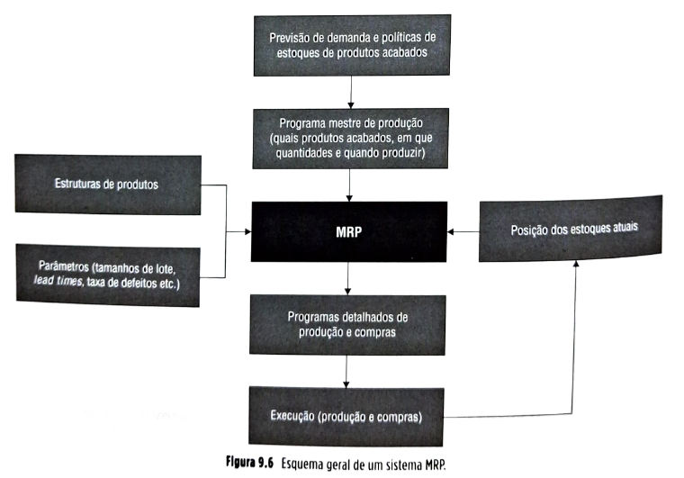

| 💡**Fique atento**💡{bg=amarelo} |
| --- |
| A "estrutura de produto" ou "árvore do produto" representa todas as relações pai-filho, entre todos os itens de um determinado produto (no exemplo, uma caneta simples). |

Observe que, nos diversos níveis, os retângulos representam os itens componentes devidamente identificados. Acima dos retângulos, encontra-se um número que representa a quantidade do item filho necessário por unidade do correspondente item pai.

## Página 259

### Explosão de necessidades brutas

Essas representações de estruturas de produtos auxiliam na resposta a duas das questões fundamentais que o MRP busca responder: o que e quanto produzir e comprar.

Por exemplo, sabemos que se 100 canetas devem ser fabricadas, é necessário comprar 100 cargas, produzir 100 corpos etc. Veja a tabela da Figura 9.8 para o cálculo de quantidades necessárias de componentes a partir da necessidade de produção de 100 canetas.

| Item | Quantidade | Comprado/produzido |
| --- | --- | --- |
| Caneta NIC | 100 | produzido |
| Tampa N | 100 | comprado |
| Carga N | 100 | comprado |
| Corpo N | 100 | produzido |
| Plástico X | 100 x 10g = 1000g | comprado |
| Aditivo (cor azul) | 100 x 1g = 100g | comprado |

**Figura 9.8** Ilustração da "explosão" de necessidades brutas do MRP.

Este cálculo é conhecido como "explosão" de necessidades brutas.

| 💡**Fique atento**💡{bg=amarelo} |
| --- |
| No MRP, explosão das necessidades brutas significa o cálculo da quantidade total de componentes que necessita estar disponível para a fabricação das quantidades necessárias de produtos. |

### Escalonamento no tempo dos tempos de obtenção dos itens

A questão agora é: quando efetuar essas ações gerenciais de comprar ou produzir? Para não se carregar mais estoques do que o necessário, não se devem comprar materiais antes que estes sejam necessários ao fluxo produtivo. É essa, essencialmente, a lógica do MRP: coordenar obtenção e consumo via cálculo, programando compras e produção para o momento mais tardio possível, de modo a minimizar os estoques. Para isso, parte das necessidades de produtos acabados: por exemplo, imaginemos que um pedido de 100 canetas seja colocado para entrega na semana 20 e que em nosso calendário estejamos na semana 15. Para que seja possível determinar os momentos de início e fim de cada atividade, além da estrutura de produto, é necessário levantar informações sobre tempos de obtenção dos diversos itens. Imagine que os tempos de obtenção dos diversos itens sejam dados conforme a tabela da Figura 9.9.

| Item | Tempo de obtenção | Comprado/produzido |
| --- | --- | --- |
| Caneta NIC | 1 semana | produzido |
| Tampa N | 2 semanas | comprado |
| Carga N | 1 semana | comprado |
| Corpo N | 1 semana | produzido |
| Plástico X | 2 semanas | comprado |
| Aditivo (cor azul) | 1 semana | comprado |

**Figura 9.9** Ilustração de escalonamento no tempo de necessidades brutas dos componentes de um produto.

A Figura 9.10 traz uma representação que inclui as informações da estrutura do produto e os tempos de obtenção de cada um dos itens, com a lógica de programação do MRP descrita anteriormente (com as atividades programadas para as datas mais tardias possíveis).

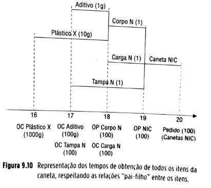

**Figura 9.10** Representação dos tempos de obtenção de todos os itens da caneta, respeitando as relações "pai-filho" entre os itens.

A partir da Figura 9.10, pode-se ver em quais momentos as diversas decisões gerenciais de produção e compra deverão ser tomadas ao longo do tempo, para que as quantidades certas, nos momentos certos, sejam disponibilizadas para a produção da quantidade desejada (o pedido firme de 100 canetas) de produtos acabados. A sequência de ações gerenciais deve ser (lembrando que no nosso exercício hipotético estamos na semana 15) conforme a representação da Figura 9.11.

## Página 260

| Semana | Ação gerencial referente a pedido de 100 canetas para a semana 20 |
| --- | --- |
| Semana 15 | nenhuma |
| Semana 16 | liberar ordem de compra de 1.000 g de Plástico X |
| Semana 17 | liberar ordem de compra de Aditivo (cor azul) de 100 g    liberar ordem de compra de 100 unidades de Tampa N |
| Semana 18 | liberar ordem de produção de 100 unidades de Corpo N    liberar ordem de compra de 100 unidades de Carga N |
| Semana 19 | liberar ordem de produção de 100 canetas NIC |
| Semana 20 | entregar as 100 canetas NIC conforme pedido |

**Figura 9.11** Representação de ações a serem disparadas a partir das explosões de necessidades brutas de componentes de um produto.

### Cálculo de necessidades líquidas

Veja a sugestão dada pelo cálculo do MRP, de compra, por exemplo, de 1.000 g (1 kg) de plástico. Fornecedores de plástico, uma matéria-prima geralmente vendida em grandes quantidades, podem nem mesmo ter embalagens para fornecer 1 kg de plástico. Em alguns casos, os fornecedores impõem quantidades mínimas (ou múltiplas) para pedidos de compra, por exemplo, 10 kg. Neste caso, como se necessita de apenas 1 kg, compram-se os 10 kg mínimos, usa-se 1kg e os 9 kg restantes são armazenados para uso futuro.

Isso implica que, quando o MRP faz as contas, em situações reais, ele deveria, antes de sugerir determinadas quantidades de compra ou produção, verificar se a referida quantidade já não se encontra disponível em estoque, resultado de alguma ação anterior.

A consideração das quantidades em estoque, deduzindo-as das necessidades brutas calculadas para então sugerir as ordens de compra e produção, chama-se "explosão das necessidades líquidas" e é explicada a seguir.

Considere o pedido firme de 100 canetas. Observe como o MRP faria os cálculos de necessidades líquidas de colocação de ordens de compra e produção.

Nota-se que, a partir da mesma necessidade de disponibilidade de produtos acabados (100 canetas a serem entregues na semana 20), os cálculos agora obedecem a uma dinâmica diferente. Se na semana 20 é necessário disponibilizar 100 canetas prontas, na semana 19 (ou seja, um lead time do item Caneta NIC antes) é necessário efetivamente começar a montar as 100 canetas.

Para que 100 canetas possam começar a ser montadas na semana 19, é necessário que haja disponibilidade (necessidade bruta) de quantidades suficientes de todos os componentes diretos (filhos) da caneta. Isso significa disponibilidade de 100 corpos, 100 cargas e 100 tampas na semana 19.

Mas, na semana 19, qual o estoque que se projeta ter de cada um destes componentes? O sistema MRP calcula essas quantidades e considera então o "Estoque projetado disponível na semana 19" da tabela da Figura 9.12.

| Item (filhos do item caneta P207) | Necessidade (bruta) de disponibilidade para a semana 19 | Estoque projetado disponível na semana 19 | Necessidade (líquida) de obtenção efetiva |
| --- | --- | --- | --- |
| Corpo N | 100 | 20 | 80 |
| Tampa N | 100 | 40 | 60 |
| Carga N | 100 | 0 | 100 |

**Figura 9.12** Estoque projetado disponível e cálculo de necessidades líquidas para um produto.

A partir desta informação é possível então calcular as necessidades líquidas de todos os itens filhos da caneta.

| ⚠️**Conceito-chave**⚠️{bg=verde} |
| --- |
| No MRP, cálculo de necessidades líquidas significa deduzir, das necessidades brutas, as quantidades projetadas disponíveis em estoque no período correspondente, chegando às necessidades líquidas de obtenção dos itens analisados. |

A necessidade líquida no nosso caso-exemplo aparece na coluna "Necessidade (líquida) de obtenção efetiva" na tabela da Figura 9.11. Usando essa lógica e algoritmos de cálculo, o MRP determina então todas as necessidades líquidas (compras e produção) de todos os itens envolvidos na produção de determinado item. Para uma descrição detalhada dos sistemas MRP e seus algoritmos de cálculo, ver Corrêa *et al.* (2018).

### Sistemas empurrados usados para aumentar coordenação de estoques na cadeia global de suprimentos

Observe que a técnica MRP auxilia a coordenar a obtenção e consumo dos itens para a empresa fabricante de canetas NIC, fazendo com que a visão futura das necessidades de todos os componentes tenha incerteza zero (já que foi resultado de cálculo matemático).

Entretanto, vamos considerar agora a cadeia de suprimentos na qual a fabricante de canetas NIC se encontra. A Figura 9.13 traz uma ilustração da cadeia de suprimentos.

Deseja que eu transcreva a próxima página para verificar se nela aparecem os quadros de Conceito-chave ou Teoria na Prática?

## Página 261

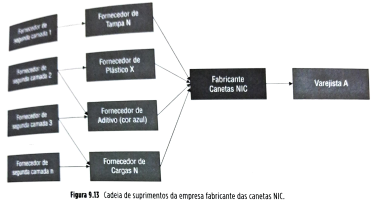

Se a coordenação proporcionada pelo MRP se restringir ao planejamento de produção da empresa fabricante das canetas NIC, a fabricante terá seus níveis de incerteza quanto à visão futura das necessidades dos seus itens de demanda dependente reduzidos via cálculo de necessidades. Por exemplo, na semana 17 (e só na semana 17), ela liberará pedidos de compra nas quantidades certas para o item "Tampa N".

Entretanto, os seus fornecedores continuarão com níveis de incerteza altos sobre as necessidades futuras dos seus itens fornecidos (por exemplo, da Tampa N). Sem compartilhamento de informações de planejamento, o fornecedor da Tampa N só terá a informação de que 60 unidades são necessárias no momento em que o pedido de 60 unidades entrar.

Para se preparar a fim de atender este pedido, entretanto, a empresa fornecedora da Tampa N teve de fazer previsões (sujeitas a incerteza e, portanto, requerendo recursos adicionais) sobre qual seria a necessidade futura das cargas.

Observe, por outro lado, que se informações de planejamento forem compartilhadas, o fornecedor da Tampa N saberá com antecedência as necessidades calculadas do seu cliente e a partir daí poderá trabalhar com níveis menores de incerteza, calculando suas necessidades futuras com base em informações vindas do sistema de planejamento do cliente, em vez de tentar prever as decisões deste. Tudo se passará como se os dois sistemas de planejamento, do cliente e do fornecedor, fossem um só e suas estruturas de produto fossem integradas. A Figura 9.14 ilustra o ponto. Com isso (a integração de sistemas de gestão de estoques), os níveis de incerteza enfrentados pela cadeia como um todo são reduzidos, levando a um melhor desempenho, tanto em termos de nível de serviço e disponibilidade ao cliente como em relação ao uso de recursos.

## Página 262

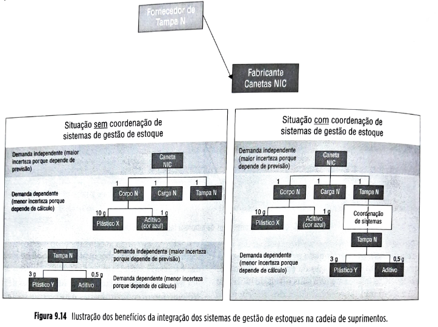

**Coordenando obtenção e consumo em sistemas puxados: JIT/kanban**

Os sistemas JIT e *lean* (ver Capítulo 7), diferentemente dos sistemas *empurrados*, como o MRP, são baseados em fluxos puxados de materiais e também têm suas formas de obter maior coordenação entre obtenção e consumo de itens.

| ⚠️**Conceito-chave**⚠️{bg=verde} |
| --- |
| Kanban é como é chamado o sistema que gerencia os estoques e os fluxos puxados nos sistemas como o *just in time* e o *lean*. |

*Kanban* é um termo japonês que significa *cartão*. Este cartão age como disparador da produção de centros produtivos em estágios anteriores do processo produtivo, coordenando a produção de todos os itens de acordo com a demanda de produtos finais. O sistema de cartões *kanban*, utilizado inicialmente nas fábricas da Toyota no Japão, consiste na utilização de dois cartões *kanban*, um deles denominado *kanban de produção*, e o outro, *kanban de transporte* (Corrêa et al., 2018).

| ⚠️**Conceito-chave**⚠️{bg=verde} |
| --- |
| O *kanban de produção* dispara a produção de um lote (geralmente pequeno e próximo à unidade) de peças de determinado tipo, em determinado centro de produção da fábrica. Nenhuma operação de produção é executada, exceto na linha de montagem, sem que haja autorização de um *kanban de produção*. |

| ⚠️**Conceito-chave**⚠️{bg=verde} |
| --- |
| O *kanban de transporte* autoriza a movimentação do material pela fábrica, do centro de produção que produz determinado componente para o centro de produção que consome este componente no seu estágio do processo. Nenhuma atividade de movimentação é executada sem que haja autorização de um *kanban de transporte*. |

A Figura 9.15 ilustra exemplos de *kanbans* de produção e de transporte.

## Página 263

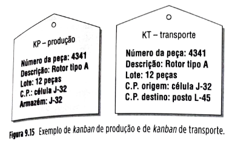

**Figura 9.15** Exemplo de *kanban* de produção e de *kanban* de transporte.

Para ilustrar o processo de puxar o fluxo a partir da demanda utilizando o sistema *kanban*, utilizaremos um exemplo de uma fábrica que produz bombas hidráulicas, em particular os processos de produção dos rotores das bombas e sua montagem na linha. Em um determinado posto da linha de montagem de bombas, o operador monta os rotores nas caixas das bombas. Neste local, o operador armazena uma determinada quantidade de rotores dos três tipos de bombas que a fábrica produz (A, B e C), para que possa utilizá-los conforme a necessidade. Vejamos a sequência dos passos do sistema *kanban*, analisando a Figura 9.16.

1. O operador retira o último rotor de um contêiner padronizado que se encontra no seu posto de montagem.
2. O contêiner tem, encaixado nele, um *kanban* de transporte que permite sua movimentação até o centro produtivo de retífica (J-32) que finaliza a fabricação dos rotores. Funcionários responsáveis pela movimentação de materiais levam o contêiner vazio e o *kanban* de transporte ao centro produtivo marcado no cartão.

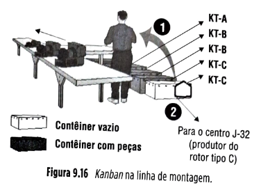

3. Na Figura 9.16, funcionários responsáveis pela movimentação de materiais se dirigem ao centro de produção de retífica dos rotores (J-32), deixam o contêiner vazio e levam outro completo de rotores para a linha de montagem. O *kanban* de transporte acompanha toda a movimentação.
4. O *kanban* de produção, que estava encaixado no contêiner cheio de rotores, é transferido para o painel de produção do centro J-32, para que um novo lote de rotores seja finalizado.
5. Para produzir um lote de rotores que irá repor o estoque consumido, o operador do centro J-32 utiliza um contêiner de rotores semiacabados (já usinados, mas não retificados).
6. O operador libera o *kanban* de transporte que estava encaixado no contêiner de rotores semiacabados, para que o pessoal de movimentação possa transferir mais um lote de rotores semiacabados do centro M-12 (usinagem) para o centro J-32.

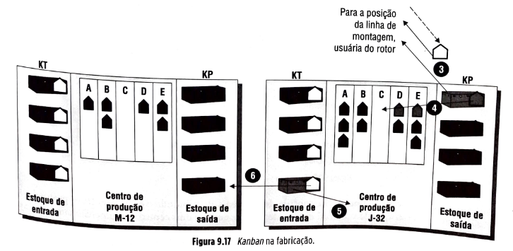

## Página 264

7. Na Figura 9.17, funcionários responsáveis pela movimentação de materiais se dirigem ao centro de usinagem dos rotores (M-12), deixam o contêiner vazio e levam outro completo de rotores para o centro de retífica (J-32). O *kanban* de transporte acompanha toda a movimentação.
8. O *kanban* de produção que estava encaixado no contêiner cheio de rotores semiacabados é transferido para o painel de produção do centro M-12, para que um novo lote de rotores seja usinado.
9. Para produzir um lote de rotores que irá repor o estoque consumido, o operador do centro M-12 utiliza um contêiner de rotores fundidos brutos.

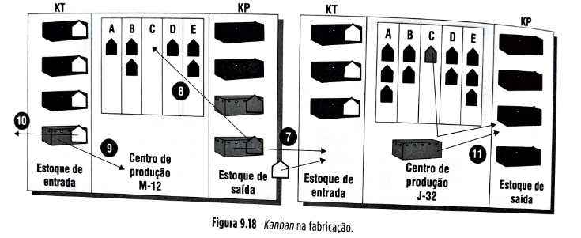

**Figura 9.18** *Kanban* na fabricação.

10. O operador libera o *kanban* de transporte que estava encaixado no contêiner de rotores semiacabados para que o pessoal de movimentação possa transferir mais um lote de rotores fundidos brutos do armazém para o centro M-12.
11. O operador do centro J-32 termina o processamento no lote de rotores, encaixa o *kanban* de produção no contêiner e deposita o conjunto no local de armazenagem.

Desse modo, o sistema *kanban* coordena a produção dos diversos centros de produção. O *kanban* de transporte circula entre os postos de armazenagem de dois centros de produção contíguos. O *kanban* de produção circula entre um centro de produção e seu posto de armazenagem. O esquema simplificado de fluxo é ilustrado na Figura 9.19.

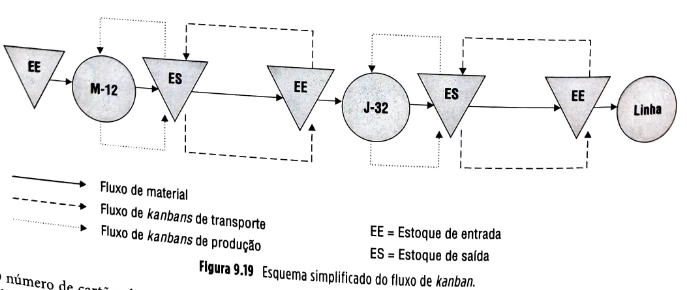

**Figura 9.19** Esquema simplificado do fluxo de *kanban*.

O número de cartões *kanban* entre dois centros de produção determina o estoque de material entre estes dois centros, pois a cada um corresponde um contêiner padronizado de peças. Em geral, o número de cartões *kanban* de transporte e de cartões *kanban* de produção são iguais, distribuindo o estoque entre os postos de armazenagem dos dois centros. O dimensionamento de cartões *kanban* entre dois centros de produção, considerando a soma entre *kanban* de produção e *kanban* de transporte, é feito da seguinte maneira:

## Página 265
Sejam:

**X** = número total de *kanbans*
**D** = demanda do centro consumidor por unidade de tempo
**Tₑ** = tempo de espera do lote no centro produtor
**Tₚ** = tempo de processamento do lote no centro produtor
**C** = tamanho do lote ou capacidade do contêiner (*peças por kanban*)
**F** = fator de segurança

**Fórmula:**

[
X = \frac{D , (T_e + T_p), (1 + F)}{C}
]

O número mínimo de cartões *kanban* pode ser obtido fazendo . Mas este número somente será alcançado quando todas as incertezas do processo forem eliminadas, eliminando-se, também, a necessidade de estoques de segurança.

| 💡**Fique atento**💡{bg=amarelo} |
| --- |
| O sistema kanban é um sistema no qual as quantidades são produzidas quando demandadas pelo estágio posterior do processo. |

A informação desta demanda ocorre de forma visual (embora hoje seja muito comum que os cartões *kanban* sejam substituídos por informação eletrônica) e é enviada ao centro produtivo fornecedor sempre que o nível de estoque de saída do seu processo caia abaixo de certo nível (em geral, baixo) predeterminado. O sistema então repõe uma quantidade suficiente para que aquele nível se complete. Em outras palavras, o sistema *kanban* é um sistema de reposição automática de estoques: repõe-se a quantidade utilizada, na taxa em que a utilização ocorre.

### Sistemas puxados usados para aumentar coordenação de estoques na cadeia global de suprimentos

Por ser uma forma de coordenar obtenção e consumo de itens, segundo a taxa real de consumo, os sistemas puxados são uma excelente alternativa para conseguir essa coordenação não apenas entre setores produtivos dentro de uma empresa, mas também entre empresas numa cadeia de suprimentos.

Imagine a cadeia de suprimentos na qual a nossa fabricante de bombas está envolvida. Ela parte de componentes como os rotores fundidos brutos, adquiridos de um fornecedor, os processa em dois centros produtivos: usinagem (M-12) e retífica (J-32) e monta os rotores, juntamente com outros componentes adquiridos de outros fornecedores, as bombas hidráulicas na linha de montagem. As bombas vão, então, para o armazém de produtos acabados. Fica claro que, desde o armazém de componentes comprados até o armazém de produtos acabados, obtenção e consumo dos itens, os vários estágios de processamento são coordenados pela lógica de fluxo puxado do *kanban*. Entretanto, se essa coordenação não for estendida aos parceiros da cadeia de suprimentos, ocorrerá descoordenação, com todas as suas consequências: maiores incertezas, redundâncias de estoques e, talvez a mais séria, a ocorrência do efeito chicote. Lembre-se das discussões do Capítulo 8 sobre o *efeito chicote*: falta de coordenação de atualizações de previsões e das decisões de reposição de estoques são algumas das suas causas principais.

| 💡**Fique atento**💡{bg=amarelo} |
| --- |
| É cada vez mais frequente o uso de formas de coordenação que utilizam os princípios dos fluxos puxados e do kanban para coordenar também a obtenção e o consumo de itens entre empresas de uma cadeia de suprimentos. |

Um exemplo seria a extensão do esquema mostrado na Figura 9.19 para envolver também os fornecedores da nossa fábrica de bombas (como, por exemplo, o fornecedor dos rotores fundidos brutos) e até seus clientes. A Figura 9.20 ilustra o conceito.

## Página 266

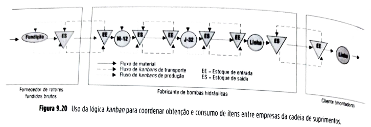

Muitas vezes, entre empresas, o uso de cartões físicos *kanban* pode não ser prático. Com todos os recursos tecnológicos disponíveis para que parceiros na cadeia de suprimentos se integrem informacionalmente, há numerosas opções para que essa comunicação de apoio ao fluxo puxado de materiais ocorra entre empresas. Veja no caso de abertura deste capítulo a forma com a qual informacionalmente a General Motors do Brasil conseguiu implantar um fluxo puxado de materiais entre seus centros de distribuição e as concessionárias.

| ✅**Teoria na Prática**{bg=azul} |
| --- |
| O caso na abertura deste capítulo ilustra o redesenho do sistema de gestão de estoques da General Motors do Brasil, no seu negócio de peças sobressalentes, com aumento da coordenação entre os sistemas de gestão dos elos envolvidos. O sistema resultante foi um sistema puxado, no qual a GMB repõe automaticamente as peças consumidas pela demanda dos clientes das concessionárias, em pequenas quantidades e frequentemente. A seguir, a explicação de como o novo sistema (AutoGIRO) gerencia os fluxos de informação. Acompanhe a explicação referente à Figura 9.21. |

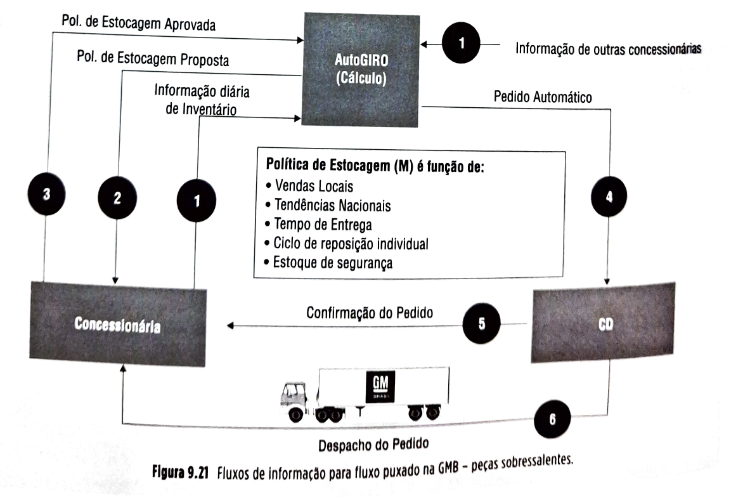

## Página 267

Fluxo 1 - Diariamente, os pontos de venda enviam à GMB um arquivo via EDI (electronic data interchange), que contém informações sobre vendas unitárias por item, do dia, além de posição dos estoques. As informações tratadas vão alimentar as séries temporais, nas quais as previsões de curto prazo, por item e por ponto de venda serão baseadas. Em paralelo, a GMB também recebe informações de vendas de todos os outros pontos de venda e trata essa informação de forma a enxergar a demanda agregada nacional e identificar padrões nacionais para enriquecer as projeções de cada uma das concessionárias.

Fluxo 2 e 3 - No início da semana, o AutoGIRO recalcula a previsão de vendas para a semana e, baseado na nova previsão, recalcula para cada item, para cada concessionária, o novo nível proposto de estoque ideal. A lista de níveis ideais é disponibilizada na internet. Os gerentes de peças, então, analisam os níveis máximos propostos pelo AutoGIRO e têm a chance de, ou aprová-los ou alterá-los 50% para cima ou para baixo, com base em análise qualitativa. O gerente de peças informa ao AutoGIRO os níveis ideais de estoques com os quais concorda e o AutoGIRO passa a considerá-los para calcular os ressuprimentos automáticos.

Fluxos 1 e 4 - Durante a semana, o AutoGIRO recebe diariamente as posições de estoques das concessionárias e calcula as diferenças destas posições para os ideais previamente acordados, informando automaticamente o centro de distribuição de peças da GM para repor os respectivos itens.

Fluxo 5 - O centro de distribuição de peças da GM envia uma notificação avançada para o ponto de venda anunciando que um despacho está a caminho e será recebido em breve, especificando quantidades e datas.

Fluxo 6 - Questões logísticas são resolvidas (picking, embalagem, identificação) e o despacho é realizado com milk run (entregas programadas).

### 9.2.4 VMI (vendor managed inventory) – estoque gerenciado pelo distribuidor – e VOI (vendor owned inventory) – consignação

Uma forma de integração entre parceiros na cadeia de suprimentos que tem ganhado interesse é o VMI.

| ⚠️**Conceito-chave**⚠️{bg=verde} |
| --- |
| No VMI, em vez de a empresa em questão gerenciar seus estoques de insumos, eles são gerenciados por cada fornecedor. Isso pode fazer sentido em pelo menos duas situações: quando o fornecedor tem mais foco ou mais informações sobre a demanda que o cliente. |

**O fornecedor tem mais foco que o cliente:** em certas situações, o fornecedor, por ser focalizado numa faixa mais reduzida de produtos, tem condições de fazer melhores previsões de curto prazo sobre a demanda percebida pela empresa cliente do que ela própria. Pense, por exemplo, numa empresa que fabrique inseticida e forneça o produto para um supermercado. Enquanto os gestores de estoques do supermercado têm de dividir sua atenção entre os 20 mil itens que o supermercado vende, os gestores de produto do fabricante se concentram apenas nos poucos itens que fornecem e podem prever sua demanda com mais acurácia (e, portanto, tomar melhores decisões de reposição de estoque). Por exemplo, se o gestor do fabricante percebe que numa região da cidade houve dois dias de chuva seguidos de forte calor, por ser focalizado e especializado, imediatamente sabe que em alguns pontos dessa região a reprodução de mosquitos será acelerada e, com ela, o consumo de curto prazo de alguns tipos de inseticida. Pode, portanto, reagir mais rapidamente a fim de evitar faltas e perdas de venda. Essa associação causal entre clima e demanda poderia ser feita também pelo gestor do supermercado, mas isso é menos provável em razão do grande número de itens que gerencia e que também são afetados pelo clima, em diferentes formas.

**O fornecedor tem mais informação sobre a demanda que o cliente:** se informações forem compartilhadas entre os parceiros da cadeia, o fabricante do exemplo mencionado, além de ser mais focalizado nos seus produtos que o varejista, também tem mais informações sobre a demanda final dos seus produtos que o próprio supermercado, já que fornece não apenas para este, mas para muitos outros supermercados, podendo usar muito mais dados estatísticos, com amostras maiores, para elaborar suas previsões. Isso ocorre no caso de abertura deste capítulo, sobre a cadeia de suprimentos de peças sobressalentes da General Motors do Brasil. A GMB podia fazer previsões melhores do que suas concessionárias, não porque tinha mais foco (já que gerenciava 75 mil itens, enquanto as concessionárias gerenciavam apenas seis mil), mas porque tinha mais informações sobre a demanda histórica de todas as concessionárias, enquanto cada concessionária estava restrita a usar informações apenas de sua própria demanda histórica. A GMB usa comportamentos identificados nos seus dados agregados regionais e nacionais sobre demanda de peças para melhorar a acurácia das previsões feitas para cada concessionária.

## Página 268

Uma outra modalidade de contrato, similar ao VMI é o VOI, ou consignação.

| 💡**Fique atento**💡{bg=amarelo} |
| --- |
| Na consignação, o estoque, mesmo já de posse da empresa cliente, continua de propriedade do fornecedor. |

No caso mais usual, material é deixado disponível para uso no armazém do cliente. Periodicamente, então, o fornecedor faz o levantamento de quanto material foi usado no período anterior e emite a fatura correspondente.

Em ambas as situações, VMI e VOI, há a necessidade de troca intensa de informação entre fornecedor e cliente para que seja possível um acompanhamento próximo das movimentações de estoque no armazém do cliente.

Resumindo, VMI faz sentido quando o fornecedor tem uma melhor condição para gerenciar os estoques do cliente do que o próprio cliente. A vantagem do VMI, para o cliente, é poder voltar sua atenção para suas atividades-fim, deixando a gestão de estoques dos insumos a cargo do fornecedor.

No VOI, além desta, há também a vantagem de o cliente não investir capital nos estoques até o uso. Para o fornecedor, como vantagem destas modalidades, está a garantia de que os produtos consumidos pelo cliente serão os seus. É necessário ser cuidadoso ao elaborar contratos de nível de serviço quando se adotam essas opções, para garantir que os incentivos dos dois envolvidos estejam alinhados (ver Capítulo 6). Também no Brasil há certas condições legais a serem atendidas quando uma empresa tem a propriedade de estoque numa localidade que não é uma de suas unidades operativas normais e isso deve ser levado em conta.

Até agora foram discutidos sistemas de gestão de estoques para itens que têm demanda dependente. Quando a visão futura do item em análise só pode ser obtida por previsão, os modelos de gestão de estoques são os chamados modelos de gestão de estoques para demanda independente, discutidos a seguir.

### 9.4 RESUMO

▪️A gestão de estoques na cadeia global de suprimentos é um assunto que continua no alto da lista de prioridades dos executivos.
▪️Além de boas práticas de *gestão de estoques*, a *coordenação* entre os vários sistemas de estoques envolvidos nas relações fornecedor-cliente da cadeia tem papel essencial para que se evitem desperdícios por redundância de estoques e também que se evitem oscilações e volatilidade da demanda.
▪️Estoques são acúmulos de recursos materiais entre etapas de um processo de transformação. Os níveis de estoques variam quando os fluxos de entrada e de saída da etapa variam, um em relação ao outro.
▪️Os estoques têm uma propriedade fundamental, que é ser uma arma — no sentido de que pode ser usada produtivamente ou contraprodutivamente: os estoques proporcionam independência às etapas do processo de transformação entre as quais se encontram.
▪️O lado contraprodutivo dos estoques é que, como ajudam a absorver diferenças relativas de taxas de entradas e saídas tanto evitáveis quanto inevitáveis, corre-se o risco de usar estoques em vez de disparar ações para equalizar as taxas quando isso é possível.
▪️É importante entender as razões pelas quais os estoques surgem. Só assim se podem entender quais são evitáveis e quais são inevitáveis, tendo certeza de que aquelas evitáveis sejam constantemente combatidas e, em relação às causas inevitáveis, que os estoques sejam dimensionados adequadamente, em níveis apenas suficientes para lidar com elas.
▪️As principais causas do surgimento de estoques são:
▪️falta de coordenação, de várias naturezas, entre etapas do processo;
▪️incertezas de previsões em relação ao suprimento e à demanda;
▪️especulação; e
▪️necessidade de preenchimento dos canais de distribuição.
▪️Há quatro tipos básicos principais de estoques em cadeias de suprimentos: estoques de matérias-primas e suprimentos, estoques em processo, estoque de produtos acabados e estoques de materiais para manutenção, reparo, consumo e movimentação.
▪️À demanda futura que tem de ser prevista dá-se o nome de demanda independente; à demanda futura que pode ser calculada dá-se o nome de demanda dependente.
▪️Há vantagens de se gerenciar demandas dependentes, pois estão sujeitas a uma incerteza menor; a técnica que calcula as necessidades de materiais se chama MRP. O MRP é um sistema centralizado, em que um sistema computacional, baseado em base de dados, calcula, a partir dos planos de produção futura, as necessidades de materiais: o quê, quando e quanto produzir e comprar.
▪️Informação essencial para o MRP é a "estrutura de produto" ou "árvore do produto", que representa todas as relações pai-filho, entre todos os itens de um determinado produto.
▪️No MRP, explosão (ou cálculo) das necessidades brutas significa o cálculo da quantidade total de componentes que necessita estar disponível para a fabricação das quantidades necessárias de produtos; o cálculo de necessidades líquidas significa deduzir, das necessidades brutas, as quantidades projetadas disponíveis em estoque no período correspondente, chegando às necessidades líquidas de obtenção dos itens analisados.
▪️A coordenação de estoques entre empresas fornecedoras e clientes nas cadeias de suprimentos é obtida a partir da integração das estruturas de produto dos itens fornecidos e dos produtos onde são usados.
▪️O sistema kanban é um sistema no qual as quantidades são produzidas quando demandadas pelo estágio posterior do processo; kanban é como é chamado o sistema que gerencia os estoques e os fluxos puxados nos sistemas como o *just in time* e o *lean*.
▪️O kanban de produção dispara a produção de um lote (geralmente pequeno e próximo à unidade); o kanban de transporte autoriza a movimentação do material pela fábrica, do centro de produção que produz determinado componente para o centro de produção que consome este componente no seu estágio do processo.
▪️O número de cartões kanban entre dois centros de produção determina o estoque de material entre estes dois centros.
▪️É cada vez mais frequente o uso de formas de coordenação que utilizam os princípios dos fluxos puxados e do kanban para coordenar também a obtenção e o consumo de itens entre empresas de uma cadeia de suprimentos.
▪️Uma forma de integração entre parceiros na cadeia de suprimentos que tem ganhado interesse é o VMI. No VMI, em vez de a empresa em questão gerenciar seus estoques de insumos, eles são gerenciados por cada fornecedor.
▪️Um dos modelos mais conhecidos de gestão de estoques de itens com demanda independente é o chamado "ponto de reposição com lote econômico". Nele, o período entre pedidos é variável e a quantidade pedida é fixa. Esse sistema assume demanda relativamente constante.
▪️Estoques de segurança existem para fazer frente a incertezas, tanto de demanda como de suprimentos.
▪️Outro modelo muito conhecido de gestão de estoques de itens com demanda independente é o sistema de revisão periódica, em que o período entre pedidos é fixo e a quantidade pedida é variável. Esse sistema também assume demanda relativamente constante.
▪️Para os casos em que não se pode assumir demanda constante, o modelo usado é o modelo chamado *time-phased order point* (TPOP).
▪️DRP, *distribution requirements planning*, é o sistema que utiliza TPOP para calcular necessidades de remessas e produção em sistemas de distribuição física de produtos.
▪️Determinados itens de estoque têm custo de estocagem maior que outros. Uma das formas de se pensar classificação de importância de itens de estoque é a chamada curva ABC ou curva de Pareto.
▪️A técnica ABC é uma forma de classificar todos os itens de estoque de determinado sistema em três grupos, baseados no seu valor total anual de uso. O objetivo é definir grupos para os quais diferentes sistemas de controle de estoque serão mais apropriados, resultando em um sistema total mais eficiente em custos.