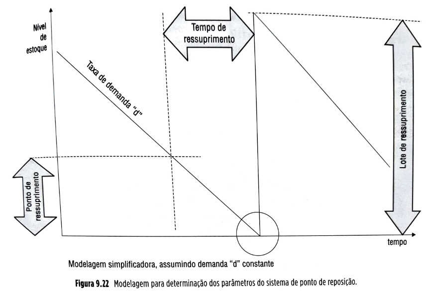
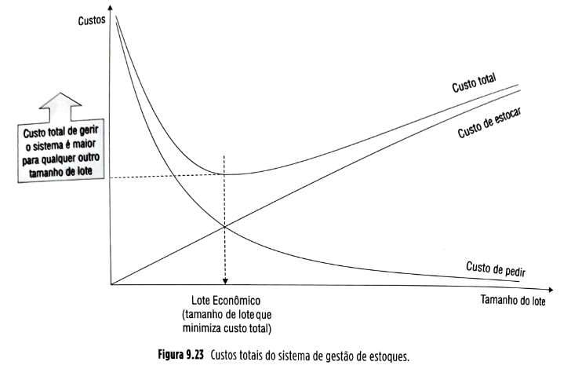
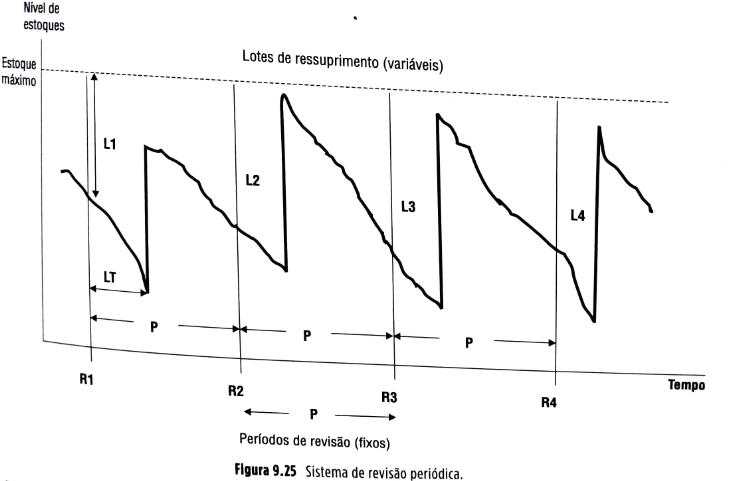
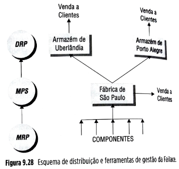
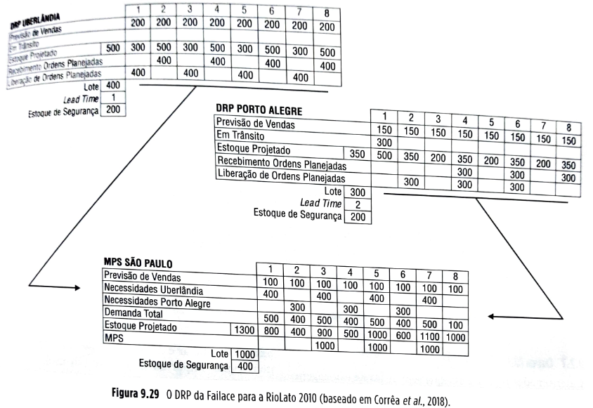
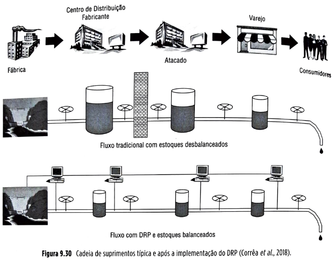
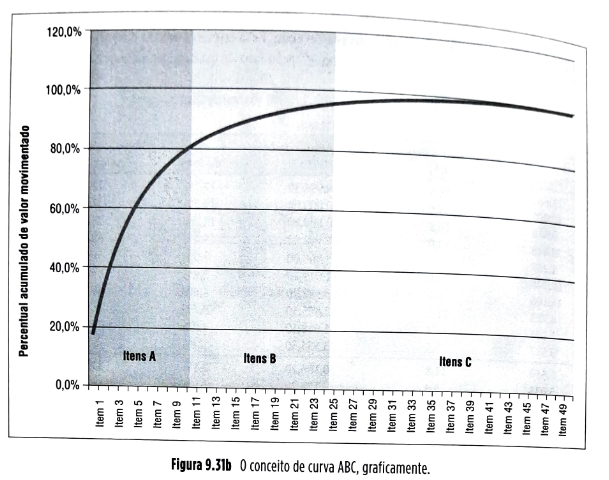
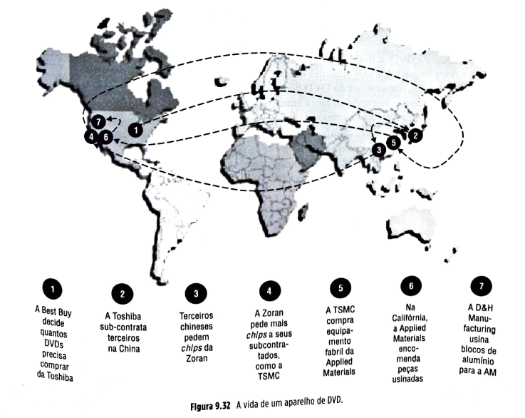

# Capítulo 9 - Gestão e coordenação de estoques na cadeia global de suprimentos

**9.1** Introdução, 249
**9.2** Conceitos, 254
**9.2.1** Estoques – conceitos básicos, 254
**9.2.2** Demanda independente e demanda dependente, 257
**9.2.3** Aumentando a coordenação na gestão de estoque de itens de demanda dependente na cadeia de suprimentos, 258
**9.2.4** VMI (*vendor managed inventory*) – estoque gerenciado pelo distribuidor – e VOI (*vendor owned inventory*) – consignação, 267
**9.2.5** Aumentando a coordenação na gestão de itens de demanda independente na cadeia de suprimentos, 268
**9.2.6** Modelo de revisão periódica, 273
**9.2.7** Curva ABC, 278
**9.3** Estudo de caso: Transparência faltando na cadeia de suprimentos de circuitos integrados, 280
**9.4** Resumo, 282

## Página 249

## OBJETIVOS DE APRENDIZAGEM

📌 Sintetizar o que são estoques e suas funções principais.

📌 Descrever os tipos de estoques envolvidos em gestão global de cadeias de suprimentos.

📌 Entender as principais técnicas de gestão de estoques e quando elas são mais indicadas.

📌 Explicar o impacto de se ter uma cadeia de suprimentos sem coordenação entre sistemas locais de gestão de estoques.

📌 Saber o que e como fazer para estabelecer uma gestão de estoques coordenada na cadeia global de suprimentos.

### 9.2.5 Aumentando a coordenação na gestão de itens de demanda independente na cadeia de suprimentos

As principais definições para a gestão de estoques de um determinado item que tem demanda independente também se referem a quanto e quando ressuprir este item, à medida que ele vai sendo consumido pela demanda (novamente, a questão é tentar, tanto quanto se possa, coordenar consumo e suprimento do item em questão).

A forma de determinação do momento do ressuprimento e a quantidade a ser ressuprida é o que de fato diferencia os diversos sistemas de gestão de estoques disponíveis. Um dos modelos mais conhecidos é o chamado "ponto de reposição com lote econômico".

#### O modelo de ponto de reposição com lote econômico

O modelo de ponto de reposição (ou de ressuprimento) funciona da seguinte forma: todas as vezes que determinada quantidade do item é retirada do estoque, verifica-se a quantidade restante. Se essa quantidade é menor que uma quantidade predeterminada (chamada "ponto de reposição"), compra-se (ou produz-se internamente, conforme o caso) uma determinada quantidade chamada "lote de ressuprimento". O fornecedor leva certo tempo (chamado "tempo de ressuprimento" ou "*lead time*") até que possa entregar a quantidade pedida, ressuprindo o estoque.

| 💡**Fique atento**💡{bg=amarelo} |
| --- |
| No sistema de ponto de reposição e lote econômico, o período entre pedidos é variável e a quantidade pedida é fixa. |

O funcionamento do modelo de ponto de reposição é ilustrado na Figura 9.22. Para que este tipo de modelo possa ser usado, é necessário definir seus parâmetros: o ponto de reposição e o tamanho do lote de ressuprimento.

## Página 269

Para determinar os parâmetros do sistema é possível adotar uma abordagem de custos. Os custos envolvidos com o sistema são:

**Cf (custo fixo de fazer um pedido de ressuprimento):** é considerado "fixo" porque não varia com a quantidade pedida. Incluem os custos de cotação, de recebimento e inspeção do lote comprado, do processo de pagamento, de frete e outros;

**Ce (custo unitário anual de estocagem):** é o custo anual de armazenagem de uma unidade do item. Inclui todos os custos incorridos por manter o item em estoque: custo de oportunidade, seguro, pessoal de armazenagem, roubo, estrago e dano, obsolescência, impostos, aluguel/depreciação e manutenção de equipamentos.

Os custos totais envolvidos no sistema de estoques ilustrado na Figura 9.23 podem ser calculados desta forma:

**Custo de armazenagem CA:** multiplica-se o custo unitário anual de estocagem pelo estoque médio (metade do tamanho do lote se a demanda for assumida constante) no sistema:

**Custo de armazenagem (CA):**
  [
  CA = C_e \cdot \frac{L}{2}
  ]

**Custo de pedido CP:** multiplica-se o custo fixo de um pedido  pelo número de pedidos feitos num ano (demanda anual  dividida pelo tamanho de lote ):

**Custo de pedido (CP):**
  [
  CP = C_f \cdot \frac{DA}{L}
  ]

O custo de armazenagem (de estocar), de pedido (de pedir) e o custo total são mostrados graficamente na Figura 9.23.

## Página 270

Pode-se demonstrar que, para essa modelagem, os custos mínimos de operação do sistema ocorrem quando o custo de armazenagem se iguala ao custo com pedidos (acompanhe na Figura 9.23). Isso só ocorre quando o tamanho de lote assume determinado valor, chamado de lote econômico (). Estabelece-se então a equação:

**Condição de equilíbrio dos custos (lote econômico):**
  [
  C_f \cdot \frac{DA}{L_E} = C_e \cdot \frac{L_E}{2}
  ]

O lote econômico (aquele que minimiza os custos totais considerados) é dado, portanto, por:

**Lote Econômico (LE):**
  [
  L_E = \sqrt{\frac{2 \cdot DA \cdot C_f}{C_e}}
  ]

Para calcular o outro parâmetro, o ponto de ressuprimento, basta multiplicar a taxa de demanda por unidade de tempo, , pelo tempo de ressuprimento  (na mesma unidade de tempo da demanda), como visto a seguir. Isso garante que, quando um pedido é feito, tem-se em estoque uma quantidade suficiente para atender a demanda média durante o *lead time*.

**Ponto de Ressuprimento (sem estoque de segurança):**
  [
  PR = D \cdot TR
  ]

### Considerações para definição de estoque de segurança

Em situações reais, nem sempre os pressupostos do modelo de ponto de ressuprimento com lote econômico estão presentes. Em geral, as demandas não são constantes, como foi assumido, podendo ter tendências de crescimento ou decréscimo, ou ciclicidades. Mesmo quando a demanda é relativamente constante, há flutuação aleatória em torno de uma média. Se considerada a fórmula  de forma estrita, qualquer flutuação da demanda durante o *lead time* para um valor acima da média considerada acarreta a falta do item. Para isso não acontecer, em situações práticas acrescenta-se certa quantidade de estoques ao valor da "demanda média durante o *lead time*" a fim de proteger o sistema contra essas flutuações aleatórias normais. A essa quantidade dá-se o nome de estoque de segurança (). O ponto de ressuprimento então passa a ser calculado como

**Ponto de Ressuprimento (com estoque de segurança):**
  [
  PR = D \cdot TR + E_{seg}
  ]

A pergunta, a partir daí, passa a ser: que quantidade de estoques de segurança manter?

Deveria ser mantida uma quantidade de estoque de segurança que fosse de certa forma proporcional ao nível de incerteza da demanda, ou seja, de quanto a demanda real terá probabilidade de variar em torno da média assumida, durante o *lead time*.

Surge então a necessidade de quantificar a incerteza. Em outras palavras, de saber quais as probabilidades associadas aos diferentes níveis de crescimento da demanda, após a emissão do pedido de ressuprimento, enquanto decorre o *lead time*. Para estimar este valor, é conveniente conhecer as características das variações passadas da demanda em torno das previsões feitas. Essas variações podem ser quantificadas pelo desvio-padrão dos erros passados de previsão.

## Página 271

Vamos assumir por simplicidade que a demanda real se comporta segundo uma distribuição normal (variando aleatoriamente em torno de um patamar constante). A previsão feita, vamos assumir que seja a média das vendas passadas, já que a demanda é relativamente constante. Os dois valores, portanto, necessários a caracterizar a distribuição dos erros de previsão são:

▪️a média  das vendas passadas – representando a previsão a ser usada nos cálculos (normalmente, simbolizada pela letra grega mu, lê-se “mi”) e,
▪️o desvio-padrão (simbolizado pela letra grega sigma, que representa o desvio-padrão dos erros de previsão).

A média  da demanda semanal, então, seria estimada a partir da média da própria amostra de demanda semanais. No nosso caso, para as demandas passadas, a média seria dada por:

**Média da demanda:**
  [
  \mu = \bar{d} = \frac{d_1 + d_2 + d_3 + \cdots + d_n}{N}
  ]

e o desvio-padrão seria dado por:

**Desvio-padrão da demanda:**
  [
  \sigma = \sqrt{\frac{(d_1 - \bar{d})^2 + (d_2 - \bar{d})^2 + (d_3 - \bar{d})^2 + \cdots + (d_n - \bar{d})^2}{n - 1}}
  ]

A partir, então, da média e do desvio-padrão estimados, podem-se usar essas estimativas para inferir quais seriam as probabilidades, por exemplo, de a demanda semanal ser maior que determinado valor. Da mesma forma, é possível determinar, por exemplo, um valor de demanda semanal cuja probabilidade de ser superado pela demanda real seja de 5%, ou qualquer outra probabilidade. É possível, a partir do conhecimento dos valores de desvio-padrão e média da demanda, definir que quantidade de estoque deveria ser mantida em estoque para que haja apenas 5% ou 1% (ou seja qual for o valor) de probabilidade de que a demanda não seja atendida de forma completa. Pode-se, portanto, definir o nível de estoque de segurança necessário para atender a determinado nível de serviço oferecido ao cliente. A relação entre nível de serviço ao cliente e nível de estoque de segurança é dada por (veja a demonstração em Corrêa *et al.*, 2018):

**Fórmula:**

[
E_{seg} = FS \cdot \sigma \cdot \sqrt{\frac{LT}{PP}}
]

Em que:
**Eseg** = estoque de segurança
**FS** = fator de segurança, que é uma função do nível de serviço que se pretende
**** = desvio-padrão estimado para a demanda futura
**LT** = lead time de ressuprimento
**PP** = periodicidade à qual se referem os dados usados para calcular o desvio-padrão

Na tabela da Figura 9.24, a seguir, pode ser encontrado o fator de segurança correspondente a vários possíveis níveis de serviço (ver Capítulo 3 para uma discussão sobre os fatores que determinam os níveis de serviço ao cliente). No Excel, estes valores podem ser determinados usando a função NORMSINV [Nível de serviço]. Por exemplo, para 95% de nível de serviço, a função NORMSINV(0.95) resulta em 1,645.

| Nível de serviço | Fator de serviço |
| --- | --- |
| 50% | 0 |
| 60% | 0,254 |
| 70% | 0,525 |
| 80% | 0,842 |
| 85% | 1,037 |
| 90% | 1,282 |
| 95% | 1,645 |
| 96% | 1,751 |
| 97% | 1,880 |
| 98% | 2,055 |
| 99% | 2,325 |
| 99,9% | 3,100 |
| 99,99% | 3,620 |

**Figura 9.24** Fatores de segurança.

Por exemplo, suponhamos que estejamos interessados em dimensionar o estoque de segurança para uma situação em que a média das demandas passadas de um determinado produto seja de 120 unidades por semana e que o desvio-padrão seja de duas unidades (por semana). Assumamos o *lead time* de ressuprimento do item como sendo de três semanas. Ou seja:

[
\bar{d} = 120
]
[
\sigma = 2
]
[
LT = 3
]
[
PP = 1
]
[
FS = 1,645 \quad (95%)
]

 semana (a demanda de que tratamos é semanal)

Usando a fórmula e supondo que o *lead time* de obtenção do item em questão é de três semanas, e que se pretenda um nível de serviço de 95% (em média, deixando 5% não atendidos a partir da disponibilidade de estoque) vem:

**Fórmula do estoque de segurança:**
[
E_{seg} = FS \cdot \sigma \cdot \sqrt{\frac{LT}{PP}}
]

**Aplicação numérica:**
[
E_{seg} = 1{,}645 \cdot 2 \cdot \sqrt{\frac{3}{1}}
]

[
E_{seg} \approx 5{,}7 \approx 6
]

 ou, arredondando, 6.

## Página 272

O ponto de ressuprimento desta situação seria, então,

Explicando, foi usado o desvio-padrão da amostra como estimador do desvio-padrão da demanda, igual a 2. Foi usado o fator de segurança 1,645 da tabela de fatores de segurança, correspondente a um nível de serviço de 95%. E, finalmente, foi usado um corretor para o desvio-padrão de , porque o período ao qual se refere o desvio-padrão considerado é a semana. Como o que se quer é o desvio-padrão da variação de três semanas de demanda, e não de apenas uma, aplica-se este corretor. Para detalhes sobre os cálculos estatísticos e probabilísticos usados aqui, recomendamos a consulta a qualquer bom manual de probabilidades e estatística.

Existe ainda uma outra fonte de variação, que é a variabilidade à qual pode estar sujeito o *lead time* de ressuprimento. Da mesma forma que em relação à variabilidade da demanda, também é possível analisar, em função do desempenho passado do fornecedor em questão, qual a sua distribuição de tempos que efetivamente levaram as entregas, a partir dos pedidos colocados e caracterizá-la em termos de uma média e de um desvio-padrão. Se novamente assumirmos que a distribuição dos *lead times* de ressuprimento se comportam conforme uma curva normal, é possível dar um tratamento estatístico relativamente simples a essa questão. Suponhamos que numa determinada situação tenhamos uma demanda perfeitamente conhecida e constante, mas tenhamos uma situação em que o *lead time* do fornecedor varia conforme uma curva normal de média 5 semanas e desvio-padrão 0,5 semana. O nível de estoques de segurança que se deveria ter para que um nível de serviços de, digamos, 95% fosse obtido seria:

Em que:

* **FS** = fator de segurança, função do nível de serviço requerido (veja a Figura 9.24)
*  = desvio-padrão da distribuição dos *lead times*
* **D** = taxa de demanda, para este caso, considerada constante e conhecida

Por exemplo, suponha a situação em que
**D** = 50 unidades por semana
**FS** = 1,645 referente a um nível de serviço de 95%
 = 0,5 semana
**LT** = 5 semanas

Calculando,

E o ponto de ressuprimento pode ser calculado como:

Há situações em que variabilidade ocorre tanto na demanda como no *lead time* de ressuprimento. Nestas situações, o cálculo do estoque de segurança pode assumir a seguinte formulação (Chopra, 2007) para o desvio-padrão da demanda durante um *lead time* igualmente distribuído de maneira normal:

Em que:

*  = desvio-padrão dos desvios da demanda em relação à previsão
*  = desvio-padrão dos desvios do *lead time* em relação à média
*  = desvio-padrão da demanda durante o período do *lead time*

A partir daí, o cálculo do estoque de segurança  fica apenas:

Por exemplo, suponha a situação em que:
**D (demanda média por semana)** = 50 unidades por semana
 = 20 unidades por semana
**LT (médio)** = 5 semanas
 = 0,5 semana
**FS** = 1,645 referente a um nível de serviço de 95%

Note que neste exemplo há variabilidade tanto da demanda como do *lead time*. Para calcularmos o estoque de segurança e o ponto de ressuprimento, o primeiro passo é calcularmos o desvio-padrão da Demanda D, que é distribuída de forma normal, durante o *lead time* LT, que também é distribuído de forma normal:

Portanto, o estoque de segurança pode ser calculado como:

E o ponto de ressuprimento pode ser calculado como:

## Página 273

**Pressupostos e limitações do sistema de ponto de reposição e lote econômico**

| 💡**Fique atento**💡{bg=amarelo} |
| --- |
| Embora com algum apelo analítico e de uso disseminado, o modelo de ponto de reposição assume pressupostos fortes e nem sempre presentes em situações reais. |

Assume-se, por exemplo, constância na demanda. Este pressuposto às vezes é plausível de ser assumido, mas nem sempre. Outro pressuposto forte é o da possibilidade de determinação dos custos unitários envolvidos – custo unitário de armazenagem e custo unitário de fazer um pedido. Nem sempre é simples ou possível determinar estes custos.

**9.2.6 Modelo de revisão periódica**

O modelo de revisão periódica para gestão de estoques é de operação mais simples que o anterior e funciona da seguinte forma: periodicamente, verifica-se o nível de estoque do item e, baseado no nível de estoque encontrado, determina-se a quantidade a ser ressuprida, de modo que seja atingido um nível de estoques predeterminado.

| 💡**Fique atento**💡{bg=amarelo} |
| --- |
| No sistema de revisão periódica, o período entre pedidos é fixo e a quantidade pedida é variável. |

**Figura 9.25** Sistema de revisão periódica.

**Definição de parâmetros para sistemas de revisão periódica**
A definição dos parâmetros (quantidade a ressuprir, por exemplo) para o sistema de revisão (ou reposição) periódica é feita a partir da formulação a seguir:

Em que:
 quantidade a pedir
 estoque máximo
 estoque presente
 quantidade pendente (já pedida)

Mas

Em que:
 nível máximo de estoques (atingido logo que um recebimento é feito)
 taxa de demanda
 período de revisão
 *lead time* (tempo de atendimento)
 estoque de segurança

## Página 274

= tempo de ressuprimento (*lead time*)
 = estoque de segurança

Então,

Por exemplo, imaginemos que uma situação é tal que o período de revisão de um sistema de revisão periódica é  dias (a cada 15 dias o nível de estoques é verificado e um pedido de ressuprimento é feito), o *lead time*  dias, a taxa de demanda  litros/dia, o estoque de segurança foi definido em 8 litros, o estoque presente é de 18 litros e a quantidade pendente é 0, ou seja, não há pedidos pendentes.

De quanto seria a quantidade a pedir se fosse feita agora uma revisão?

A quantidade a pedir seria de 98 litros.

O estoque de segurança para sistema de revisão periódica é calculado de forma similar ao estoque de segurança de sistemas de ponto de ressuprimento, mas com algumas diferenças:

Em que:

 = Fator de segurança (que vem da tabela da Figura 9.24) – depende do nível de serviço requerido
 = Desvio-padrão dos erros de previsão
 = Período de revisão
 = *Lead time*
 = Período ao que se refere o desvio-padrão dos erros de previsão

Suponha, por exemplo, que se pretenda para o exemplo mencionado um nível de serviço de 95%. Isso significa que o  (da tabela da Figura 9.24). Suponha também que o desvio-padrão dos erros de previsão seja de 1 litro/dia, que o período de previsão seja de 15 dias, e o *lead time* de 3 dias. Qual seria o nível de estoque de segurança necessário?

Ou, arredondando, 7 litros.

A diferença principal está no período ao que se refere a possível incerteza de demanda – em vez de ser apenas o período do *lead time*, passa a ser o período do *lead time* mais o período de revisão, pois este é o período que possivelmente um estoque passa sem que se tenha checado seu nível, na situação mais desfavorável.

### Pressupostos e limitações do modelo de revisão periódica

O sistema de revisão periódica é um sistema mais fácil e barato de operar (não exige a verificação do saldo de estoque a cada movimentação) e não assume, em princípio, que a demanda seja constante. Entretanto, os riscos associados a faltas são normalmente maiores, dado que as revisões de níveis de estoque se dão a intervalos fixos. Isso faz com que os sistemas do tipo revisão periódica sejam normalmente escolhidos para gerenciar itens de menor valor e menor custo de armazenagem, para os quais a manutenção de um nível mais alto de estoques não tenha implicações tão graves. Ao mesmo tempo, o menor custo com a operação do sistema de revisão periódica é uma vantagem de seu uso para o gerenciamento de itens menos relevantes em termos de custo ou valor movimentado.

### Uso do modelo de revisão periódica em VMI

Um uso recente e bastante importante para os modelos de revisão periódica utiliza as técnicas de VMI (*vendor managed inventory*), como aquele descrito no quadro de abertura deste capítulo. A General Motors do Brasil percebeu que poderia se beneficiar logisticamente do fato de que milhares de itens são transportados das mesmas origens (os seus centros de distribuição) para os mesmos destinos (suas concessionárias). Poderia, portanto, transportar vários itens conjuntamente, o que ajudaria a "diluir" os custos de transportes sem necessariamente transportar grandes quantidades de cada item. Para isso, entretanto, é necessário que todos os itens sejam repostos ao mesmo tempo. O sistema de revisão periódica oferece essa possibilidade, desde que os períodos de reposição e momentos de verificação dos níveis de estoque de todos os itens sejam comuns. Num sistema de ponto de reposição, por outro lado, não se pode garantir que os pontos de reposição de todos os itens sejam atingidos no mesmo período, o que compromete o objetivo de diluir os custos de transporte entre vários itens de estoque.

### Uso do *time-phased order point* (quando não se pode assumir demanda constante) para itens de demanda independente

Para os casos em que não se pode assumir demanda constante, o modelo usado é o modelo chamado *time-phased order point* (TPOP), ou, numa tradução livre, "ponto de reposição escalonado no tempo". Trata-se de um registro de informações futuras na forma de uma matriz (veja a Figura 9.26). As colunas representam períodos futuros, de 1 (o próximo) até 8 períodos no futuro.

## Página 275

As linhas representam:

▪️**Demanda prevista:** a previsão de demanda para os próximos períodos, descrita período a período.

▪️**Recebimentos programados:** material já despachado pelo fornecedor, esperado para chegar no período e nas quantidades descritas.

▪️**Estoque projetado:** o resultado do cálculo, período a período, do balanço de estoques ao final do período descrito, considerando todas as entradas e saídas previstas do estoque. Note que o estoque atual aparece na primeira célula da linha, destacada dos períodos futuros.

▪️**Recebimentos planejados:** recebimentos de materiais que ainda não foram despachados pelo fornecedor.

▪️**Liberação de pedidos planejados:** correspondendo aos recebimentos planejados, estas são as respectivas liberações de pedidos para os fornecedores. Note que, por exemplo, a liberação de 200 unidades planejada para ocorrer no período 1 corresponde à quantidade de recebimento planejado do período 4 (já que o *lead time* LT neste exemplo é de 3 semanas). Uma liberação de pedido do tamanho de um lote (no caso, 200) é determinada pelo algoritmo de cálculo para aparecer na linha "Liberações de pedidos planejados" no período "p-LT" sempre que o cálculo:

▪️[Estoque do período "p − 1"] − [Demanda do período "p"]
▪️[Recebimento programado do período "p"]
▪️[Recebimento planejado do período "p"] ≤ [Estoque de segurança]

Neste caso, evidentemente, também uma quantidade correspondente ao tamanho de lote aparecerá no período "p" na linha "Recebimentos planejados". Este algoritmo é feito automaticamente pelo sistema de informações usado (em geral como parte de um sistema ERP), a partir do período 1 e sequencialmente, período a período, até o fim do horizonte planejado (no caso, oito períodos).

Inicialmente, suponhamos o caso da gestão de um item, por hipótese chamado "Item A", cuja demanda projetada seja constante e no nível de 100 unidades por semana. Suponhamos que, para ele, determinou-se que o estoque de segurança deveria ser de 20 unidades (para fazer frente às incertezas desta demanda projetada), que os lotes econômicos de compra fossem de 200 unidades e que o *lead time* envolvido fosse de três semanas. Suponha também que um pedido aberto há duas semanas determine que há um recebimento programado de 200 unidades a chegar no início da semana 2 (que aparece na linha "recebimentos programados"). O TPOP para o Item A seria conforme a Figura 9.26.

**Estoque de segurança = 20**
**Quantidade pedida = 200**
**Lead time = 3**

| PERÍODOS | 1 | 2 | 3 | 4 | 5 | 6 | 7 | 8 |
| --- | --- | --- | --- | --- | --- | --- | --- | --- |
| Demanda prevista | 100 | 100 | 100 | 100 | 100 | 100 | 100 | 100 |
| Recebimentos programados |  | 200 |  |  |  |  |  |  |
| Estoque projetado | 120 | 20 | 120 | 20 | 120 | 20 | 120 | 20 |
| Recebimentos planejados |  |  |  | 200 |  | 200 |  | 200 |
| Liberação de pedidos planejados | 200 |  | 200 |  | 200 |  |  |  |

**Figura 9.26** Time-phased order point (TPOP) para o Item A com demanda constante.

Observe que tudo se passa como se o modelo de "ponto de reposição" estivesse em uso: o estoque vai sendo consumido de forma gradual e uniforme, até que, no ponto em que atingiria (e infringiria) o nível de estoque de segurança (aqui definido como sendo de 20 unidades), uma quantidade de 200 unidades (tamanho do lote econômico de compra) deveria chegar. Para isso, é feito o *off-set* ou o desconto do *lead time* de três semanas para trás no tempo, definindo o momento em que deve ser emitido um pedido (no jargão dos modelos de ponto de reposição, o próprio "ponto de reposição"). O resultado, a exemplo dos modelos anteriores, é que as reposições acabam se dando de forma regular, nos mesmos momentos que os parâmetros do modelo de ponto de reposição discutido anteriormente definiriam. Note, entretanto, que a hipótese de demanda constante poderia ser relaxada. Observe a Figura 9.27, em que a mesma mecânica é usada para gerenciar um item cuja demanda não é constante, mas tem alguma ciclicidade ao longo do período.

**Estoque de segurança = 20**
**Quantidade pedida = 200**
**Lead time = 3**

| PERÍODOS | 1 | 2 | 3 | 4 | 5 | 6 | 7 | 8 |
| --- | --- | --- | --- | --- | --- | --- | --- | --- |
| Demanda prevista | 100 | 70 | 40 | 10 | 40 | 70 | 100 | 70 |
| Recebimentos programados |  | 200 |  |  |  |  |  |  |
| Estoque projetado | 120 | 20 | 150 | 110 | 100 | 60 | 190 | 90 |
| Recebimentos planejados |  |  |  |  |  | 200 |  |  |
| Liberação de pedidos planejados |  |  | 200 |  |  |  |  |  |

**Figura 9.27** TPOP para o Item A, sem pressuposto de demanda constante.

## Página 276

Veja que a mecânica é exatamente a mesma, mas os pontos de reposição não mais se distribuem da mesma forma, porque as taxas de consumo do estoque variam ao longo do período analisado. Isso significa, em termos práticos, que o uso do TPOP pode ser feito mesmo para situações em que não se pode assumir demanda projetada constante. Tudo passa a ser agora uma questão de definir os parâmetros para o sistema informatizado: horizonte de planejamento, periodicidade de planejamento, estoque de segurança (sempre com base nas incertezas que envolvem ambos — o processo de suprimento e a demanda projetada) e tamanhos de lote. Deste ponto em diante, o sistema gerenciará as sugestões de emissão de pedidos de forma escalonada no tempo, procurando fazer com que os níveis dos estoques de segurança não sejam infringidos. Para mais detalhes, ver Corrêa *et al.* (2018).

### DRP – Distribution resources planning (planejamento de recursos de distribuição)

Numa estrutura logística com unidades de produção (fábricas) e de distribuição, ao menos parte da demanda de produtos produzidos pela fábrica é demandada para reposição dos estoques dos centros de distribuição. Nesse caso, mais conveniente do que tentar prever essa demanda é gerenciar de forma integrada a cadeia de distribuição. Isso pode ser feito por meio do uso do DRP – *distribution requirements planning* (planejamento das necessidades de distribuição).

#### A mecânica do DRP

Suponha que a Failace, uma empresa fabricante de equipamentos para lavagem com pressão e outros equipamentos de uso doméstico, faça a montagem de seus produtos em São Paulo. Essa fábrica, além de atender os clientes regionais, envia produtos para centros de distribuição localizados em Uberlândia e Porto Alegre. A Figura 9.28 ilustra o esquema de distribuição da Failace e, à esquerda da figura, as ferramentas de planejamento usadas para montar e mover os produtos através dela.

Os produtos da empresa são montados de acordo com o programa mestre de produção (veja a Figura 9.6), também chamado de MPS (*master production scheduling*, o âmbito dos sistemas de planejamento que auxiliam na decisão de quais produtos serão feitos, em que quantidades e em que momentos), o qual, usando o MRP (veja a descrição do MRP em uma seção anterior deste capítulo), desagrega o programa mestre em necessidades de materiais e componentes.

O MPS da Failace é dirigido por três fontes de demanda: vendas diretas aos clientes da região de São Paulo, além de ordens colocadas pelos armazéns regionais localizados em Uberlândia e Porto Alegre, cada um visto como um cliente para a fábrica. Para as vendas diretas aos clientes da região de São Paulo, atendidas pelo estoque no armazém da fábrica, a demanda é prevista pela equipe de vendas local. As vendas para clientes das regiões Nordeste, Centro-Oeste e Norte são previstas pela equipe de Uberlândia, enquanto as vendas da região Sul são previstas pela equipe de Porto Alegre.

**Figura 9.28** Esquema de distribuição e ferramentas de gestão da Failace.

A Figura 9.29 oferece uma visão mais detalhada da relação entre a fábrica e os dois centros de distribuição da Failace, para apenas um de seus produtos, a lavadora por pressão modelo RioJato 2010, usando registros do tipo TPOP.

Como a figura esclarece, cada um dos centros de distribuição tem uma quantidade de estoque disponível em mãos, um tamanho de lote para pedido, um *lead time* de transporte e estoque de segurança específicos para este produto. O armazém de Uberlândia, por exemplo, inicia o corrente período com 500 unidades em estoque, o tamanho da ordem é de 400 unidades, o estoque de segurança de 200, e um *lead time* de entrega de uma semana.

Na Figura 9.29, fica claro como as atividades nos centros de distribuição dirigem as atividades na fábrica. A previsão de vendas para o primeiro período do centro de distribuição de Uberlândia deverá consumir 200 unidades, resultando num estoque de 300 unidades para o final do período 1. A demanda da segunda semana é também de 200, o que deverá deixar 100 unidades como estoque projetado disponível no final do segundo período. Como este valor é menor do que o estoque de segurança definido, uma ordem é planejada para ser recebida no período 2, devendo ser despachada de São Paulo no período 1 (já que o *lead time* de transporte é de uma semana). No momento em que a fábrica despachar o lote, o pedido será transformado num recebimento programado, sendo mostrado na linha "Em trânsito" do registro DRP, na data prevista de recebimento, ou seja, período 2. Como se pode...

## Página 277

ver a lógica do DRP é muito similar à do MRP, discutida anteriormente neste capítulo. O processo continua ao longo do horizonte de planejamento do DRP de Uberlândia, gerando necessidades brutas para o MPS da fábrica de São Paulo, como é mostrado na Figura 9.29. Eventos similares ocorrem para o armazém de Porto Alegre.

**Figura 9.29** O DRP da Failace para a RioLato 2010 (baseado em Corrêa et al., 2018).

**O impacto das ordens dos centros de distribuição na fábrica**
A fábrica que recebe as ordens dos centros de distribuição as vê como fontes de demanda adicionais às vendas que faz em sua região. No presente exemplo, o MPS da fábrica de São Paulo indica três tipos de demanda: suas próprias previsões de vendas regionais (100 por semana), os pedidos de 400 unidades a cada duas semanas do depósito de Uberlândia e os pedidos do depósito de Porto Alegre, de 300 unidades a cada duas semanas. Somadas, essas demandas de cada armazém regional constituem a demanda total à qual o MPS da fábrica deve responder.

Uma vez que o DRP esteja entendido e implantado corretamente, toda a cadeia de suprimentos pode ser conectada. A visão final é a de ter a demanda final integrada ao sistema de planejamento da fábrica (possibilitando, portanto, a integração adicional com os fornecedores) por meio de uma série de elos, como mostra a Figura 9.30.

No alto da Figura 9.30 é mostrado o fluxo típico de produtos, desde a fábrica do fornecedor, passando pelo centro de distribuição da fábrica e pelo canal de distribuição, até o usuário. Possivelmente, os produtos passarão por centros de distribuição atacadistas, que, por sua vez, os distribuirão para centros varejistas, que, finalmente, os entregarão aos consumidores finais.

Mediante esse processo, vão sendo criados estoques ao longo do percurso. Esses estoques e demandas (muitas vezes influenciados por tamanho de lotes e estoques de segurança) poderão estar frequentemente desbalanceados, como é mostrado na parte central da figura. A parte inferior da figura mostra a situação ideal: um fluxo uniforme com estoques reduzidos e balanceados com as operações que fornecem produtos e as operações que os demandam. O importante é integrar bem todas essas operações e balancear o fluxo.

## Página 278

### 9.2.7 Curva ABC

Determinados itens de estoque têm custo de estocagem maior que outros. Conscientes disso, as empresas utilizam formas de classificação de itens de estoque, de forma que se possam definir quais são os itens que merecem maior atenção (e alocação de recursos) na sua gestão. Isso porque o ganho marginal por uma gestão mais próxima é mais compensador para determinados itens que para outros, ao passo que a quantidade total de recursos para a gestão do total dos itens é limitada. Uma das formas de se pensar classificação de importância de itens de estoque é a chamada curva ABC ou curva de Pareto. A curva ABC é descrita a seguir.

| ⚠️**Conceito-chave**⚠️{bg=verde} |
| --- |
| A técnica ABC é uma forma de classificar todos os itens de estoque de determinado sistema em três grupos, baseados no seu valor total anual de uso. O objetivo é definir grupos para os quais diferentes sistemas de controle de estoque serão mais apropriados, resultando em um sistema total mais eficiente em custos. |

Desta forma, usam-se sistemas mais caros de operar e que permitem um controle mais rigoroso a fim de controlar itens mais importantes, enquanto sistemas mais baratos de operar e menos rigorosos são utilizados para itens menos importantes (em valor de uso).

Os passos para a aplicação da técnica ABC são os seguintes:

1. Para cada item de estoque, determinar a quantidade total utilizada no ano anterior (em alguns casos em que isso é possível, prefere-se trabalhar com as quantidades projetadas para uso no futuro).
2. Determinar o custo médio de cada um dos itens de estoque, usando moeda forte.
3. Calcular para cada item de estoque o custo anual total de uso, multiplicando o custo médio de cada item, levantado em 2, pela quantidade correspondente utilizada levantada em 1.
4. Ordene em uma lista todos os itens em valor decrescente do valor de uso estabelecido em 3.
5. Calcule os valores acumulados de valor de uso para toda a lista, na ordem definida em 4.
6. Calcule os valores acumulados determinados em 5 em termos percentuais relativos ao valor total acumulado de valor de uso para o total dos itens.
7. Plote num gráfico.
8. Defina as três regiões conforme a inclinação da curva resultante: região A, de grande inclinação (geralmente em torno de 20% dos itens sendo responsáveis por 80% [do valor total]).

## Página 279

do valor movimentado); região B, de média inclinação (os seguintes 30% de itens, aproximadamente, são responsáveis pelos seguintes 15%); região C, de pequena inclinação (os últimos 50% de itens, no total, são responsáveis por cerca de 5% do valor).

Veja as Figuras 9.31 (a e b) para um exemplo de aplicação. Essa curva também é conhecida como curva "80-20", pelo fato de que, em grande quantidade de situações, cerca de 20% dos itens são responsáveis por aproximadamente 80% do valor controlado.

---

| Item | Quantidade (unidades) | Custo unitário (R$) | Valor movimentado (R$) | % do total | % acumulada | Classificação |
| --- | --- | --- | --- | --- | --- | --- |
| Item 1 | 13.661 | 18,3 | 249.996,30 | 17,7% | 17,7% | **Itens "A"** |
| Item 2 | 40.000 | 5,0 | 200.000,00 | 14,2% | 31,8% | **Itens "A"** |
| Item 3 | 9.816 | 16,3 | 160.000,80 | 11,3% | 43,2% | **Itens "A"** |
| Item 4 | 9.846 | 13,0 | 127.998,00 | 9,1% | 52,2% | **Itens "A"** |
| Item 5 | 4.267 | 24,0 | 102.408,00 | 7,2% | 59,5% | **Itens "A"** |
| Item 6 | 28.248 | 2,9 | 81.919,20 | 5,8% | 65,3% | **Itens "A"** |
| Item 7 | 11.108 | 5,9 | 65.537,20 | 4,6% | 69,9% | **Itens "A"** |
| Item 8 | 4.723 | 11,1 | 52.425,30 | 3,7% | 73,6% | **Itens "A"** |
| Item 9 | 1.143 | 36,7 | 41.948,10 | 3,0% | 76,6% | **Itens "A"** |
| Item 10 | 9.587 | 3,5 | 33.554,50 | 2,4% | 79,0% | **Itens "A"** |
| Item 11 | 2.559 | 11,8 | 30.196,20 | 2,1% | 81,1% | **Itens "B"** |
| Item 12 | 5.033 | 5,4 | 27.178,20 | 1,9% | 83,0% | **Itens "B"** |
| Item 13 | 1.406 | 17,4 | 24.464,40 | 1,7% | 84,7% | **Itens "B"** |
| Item 14 | 2.246 | 9,8 | 22.010,80 | 1,6% | 86,3% | **Itens "B"** |
| Item 15 | 1.366 | 14,5 | 19.807,00 | 1,4% | 87,7% | **Itens "B"** |
| Item 16 | 924 | 19,3 | 17.833,20 | 1,3% | 89,0% | **Itens "B"** |
| Item 17 | 579 | 27,7 | 16.038,30 | 1,1% | 90,1% | **Itens "B"** |
| Item 18 | 1.128 | 12,8 | 14.438,40 | 1,0% | 91,1% | **Itens "B"** |
| Item 19 | 2.063 | 6,3 | 12.996,90 | 0,9% | 92,0% | **Itens "B"** |
| Item 20 | 496 | 23,6 | 11.705,60 | 0,8% | 92,9% | **Itens "B"** |
| Item 21 | 1.170 | 9,0 | 10.530,00 | 0,7% | 93,6% | **Itens "B"** |
| Item 22 | 1.041 | 9,1 | 9.473,10 | 0,7% | 94,3% | **Itens "B"** |
| Item 23 | 565 | 15,1 | 8.531,50 | 0,6% | 94,9% | **Itens "B"** |
| Item 24 | 1.535 | 5,0 | 7.675,00 | 0,5% | 95,4% | **Itens "B"** |
| Item 25 | 698 | 9,9 | 6.910,20 | 0,5% | 95,9% | **Itens "C"** |
| Item 26 | 514 | 12,1 | 6.219,40 | 0,4% | 96,4% | **Itens "C"** |
| Item 27 | 411 | 13,6 | 5.589,60 | 0,4% | 96,8% | **Itens "C"** |
| Item 28 | 165 | 30,6 | 5.049,00 | 0,4% | 97,1% | **Itens "C"** |
| Item 29 | 384 | 11,8 | 4.531,20 | 0,3% | 97,4% | **Itens "C"** |
| Item 30 | 600 | 6,8 | 4.080,00 | 0,3% | 97,7% | **Itens "C"** |
| Item 31 | 274 | 13,4 | 3.671,60 | 0,3% | 98,0% | **Itens "C"** |
| Item 32 | 133 | 24,8 | 3.298,40 | 0,2% | 98,2% | **Itens "C"** |
| Item 33 | 168 | 17,7 | 2.973,60 | 0,2% | 98,4% | **Itens "C"** |
| Item 34 | 148 | 18,1 | 2.678,80 | 0,2% | 98,6% | **Itens "C"** |
| Item 35 | 376 | 6,4 | 2.406,40 | 0,2% | 98,8% | **Itens "C"** |
| Item 36 | 943 | 2,3 | 2.168,90 | 0,2% | 98,9% | **Itens "C"** |
| Item 37 | 123 | 15,8 | 1.943,40 | 0,1% | 99,1% | **Itens "C"** |
| Item 38 | 179 | 9,8 | 1.754,20 | 0,1% | 99,2% | **Itens "C"** |
| Item 39 | 200 | 7,9 | 1.580,00 | 0,1% | 99,3% | **Itens "C"** |
| Item 40 | 71 | 19,9 | 1.412,90 | 0,1% | 99,4% | **Itens "C"** |
| Item 41 | 90 | 14,3 | 1.287,00 | 0,1% | 99,5% | **Itens "C"** |
| Item 42 | 240 | 4,8 | 1.152,00 | 0,1% | 99,6% | **Itens "C"** |
| Item 43 | 113 | 9,2 | 1.039,60 | 0,1% | 99,7% | **Itens "C"** |
| Item 44 | 88 | 10,6 | 932,80 | 0,1% | 99,7% | **Itens "C"** |
| Item 45 | 36 | 23,1 | 831,60 | 0,1% | 99,8% | **Itens "C"** |
| Item 46 | 164 | 4,6 | 754,40 | 0,1% | 99,8% | **Itens "C"** |
| Item 47 | 87 | 7,8 | 678,60 | 0,0% | 99,9% | **Itens "C"** |
| Item 48 | 130 | 4,7 | 611,00 | 0,0% | 100,0% | **Itens "C"** |
| Item 49 | 65 | 8,5 | 552,50 | 0,0% | 100,0% | **Itens "C"** |
| Item 50 | 28 | 17,7 | 495,60 | 0,0% | 100,0% | **Itens "C"** |
| **Total** |  |  | **1.413.268,70** |  |  |  |

## Página 280

Observe como na região classificada como *A* poucos itens são responsáveis por grande parte do valor de uso total. Logo, estes deveriam ser os itens a merecerem maior atenção gerencial, para os quais vale mais a pena manter controles de estoque mais precisos e rigorosos. Os benefícios do esforço de redução de estoques médios de itens *A* são muito maiores do que os benefícios de um esforço gerencial similar despendido para manter estoques mais baixos de itens *C*, que são responsáveis por uma parcela muito menor do valor de uso total dos itens de estoque.

### 9.3 ESTUDO DE CASO: TRANSPARÊNCIA FALTANDO NA CADEIA DE SUPRIMENTOS DE CIRCUITOS INTEGRADOS

Para um homem que vende os "cérebros" que equipam milhões de TVs, câmeras e outras traquitanas eletrônicas, Levy Gerzberg se viu inesperadamente surpreso no último outono. Em apenas algumas semanas, os negócios praticamente pararam. Ele ainda se admira com a velocidade do colapso. "Penso nisso ainda hoje e me pergunto: por que tudo aconteceu tão rápido?", diz Gerzberg, o CEO da empresa projetista de circuitos integrados (*chips*) Zoran Corp.

As razões só agora começam a ficar mais claras. As complexas cadeias globais de suprimentos *just in time* estão tornando cada vez mais difícil, para a Zoran e para qualquer outro nó individual da cadeia, saber o que está acontecendo com outros nós, mesmo que relativamente próximos. Às vezes, a empresa não sabe nem *para que* seus chips são usados; um lote que se imaginava estar destinado a aparelhos de DVD, em vez disso, acabou sendo usado para porta-retratos digitais. A recessão de 2008/2009 expôs o lado duro do *sistema de cadeias de suprimentos*. Em razão de a indústria hoje recompensar fornecedores que tenham os níveis mais "enxutos" de estoques e os tempos mais rápidos de resposta, quando a crise econômica explodiu, empresas de alta tecnologia ao longo de toda a cadeia produtiva se contraíram tanto quanto puderam, na esperança de estar entre as que sobreviveriam.

Forçados a adivinhar a demanda para seus produtos num mercado em queda livre, todo mundo pisou forte no freio. Um exame da cadeia de suprimentos de produtos eletrônicos — dos varejistas até os fabricantes de equipamentos fabris — mostra que, em quase todos os estágios, empresas estavam voando às cegas, quando decidiram cortar a produção.

"Nós ainda não temos certeza do que aconteceu", diz Angelo Grestoni, proprietário de uma pequena fábrica na Califórnia que usina peças de alumínio componentes de máquinas usadas para fabricar *chips*. Ele está a muitas etapas de distância da Zoran na cadeia de suprimentos, mas seus clientes também evaporaram mais ou menos na mesma época. Hoje, Grestoni emprega apenas 150 pessoas, das 600 que empregava há 18 meses.

O resultado acumulado: a contração do setor tecnológico pode ter sido exagerada. Em março, a Best Buy (um varejista americano importante neste mercado) disse que poderia ter vendido mais aparelhos eletrônicos no trimestre que terminou em 28 de fevereiro de 2009, mas os cortes drásticos que seus fornecedores fizeram tornaram difícil manter produtos nas prateleiras. Os fornecedores "todos decidiram produzir muito menos", diz o diretor de comercialização da Best Buy, Michael Vitelli.

## Página 281

À medida que a contração passou para outras etapas da cadeia de suprimentos, seus efeitos se amplificaram. Rick Tsai, CEO da fabricante de chips Taiwan Semiconductor Manufacturing Co., disse que no último trimestre de 2008 o consumo de equipamento eletrônico nos Estados Unidos caiu 8% em relação ao ano anterior. Mas o despacho de produtos dos fabricantes para o varejo caiu 10%, e o despacho de chips para os fabricantes caiu 20%.

A velocidade dos cortes são uma grande mudança em relação a outros períodos recessivos. Até recentemente, no começo dos anos 2000, empresas compilavam seus pedidos mensalmente ou trimestralmente. Hoje elas o fazem semanalmente. Seus reflexos rápidos desta vez impediram que os estoques inchassem perigosamente, como aconteceu da última vez, dizem os experts em gestão de cadeias de suprimentos.

Isso tem consequências para a recuperação econômica. Embora o PIB americano tenha caído 6,1% (anualizado) no primeiro trimestre, quase metade da queda foi devida a redução de estoques. Como o gasto do consumidor na verdade aumentou 2,2%, algumas fábricas teriam na verdade de aumentar sua produção, dizem os economistas.

A produção está começando a se recuperar, pelo menos um pouco. O lucro do primeiro trimestre da Taiwan Semicondutores, ou TSMC, em março, aumentou muito, e no mês passado a Zoran relatou aumento substancial de pedidos.

A Zoran é tipicamente uma empresa de nicho, nascida da evolução recente da indústria de alta tecnologia, hoje pulverizada pelo mundo todo: projeta chips especializados para processamento de áudio e vídeo para produtos como câmeras, TVs e telefones celulares. Seus clientes são, na maioria, pouco conhecidas empresas asiáticas que manufaturam produtos, subcontratadas por gigantes como a Toshiba. A Figura 9.32 traz o exemplo de uma cadeia de suprimentos de aparelhos de DVD.

## Página 282

As complexidades das cadeias de suprimentos globais dificultam prever as tendências de mercado, diz o economista Randy Bane, da Applied Materials Inc., que produz equipamento fabril usado para a produção de *chips* como os da Zoran. A Applied Materials teve um prejuízo de  255 no segundo, os primeiros prejuízos desde 2003. Deu férias não remuneradas de quatro semanas aos seus funcionários no primeiro semestre de 2009, algo que nunca tinha feito antes.

Apenas dez anos atrás, as cadeias de suprimentos tinham muito menos nós, segundo Bane. A venda de *chips* era puxada principalmente pela venda de computadores pessoais, produzidos por meia dúzia de grandes empresas que davam o tom do setor. Hoje, praticamente todo produto tem pelo menos um *chip*, multiplicando surpreendentemente a complexidade. O comportamento é, hoje, muito mais difícil de prever.

No final do fluxo de informação estão varejistas como a Best Buy. Para o mercado americano, ela manda pedidos para seus fornecedores uma vez por semana, com previsões para as próximas 52 semanas, baseadas nas vendas de suas mil lojas e em dados econômicos. Fabricantes analisam este tipo de informação para decidir que peças necessitam comprar. O sistema é preparado para responder rapidamente a mudanças de comportamento do consumidor; mas isso coloca os fornecedores em risco.

Considere aparelhos de DVD: a Best Buy define suas necessidades e coloca os pedidos seis semanas antes. Entretanto, a fabricação de componentes do DVD pode levar duas vezes mais tempo — forçando os fabricantes dos componentes a prever a demanda das várias partes.

Empresas ao longo de toda a cadeia de suprimentos vivem com o medo mortal de ficarem com estoques excessivos. Margens de lucro são muito apertadas e estoque não vendido só perde valor, na medida em que novas tecnologias chegam continuamente ao mercado.

No último outono, quando a crise estourou, as vendas da Best Buy caíram drasticamente. Mesmo com o pico de vendas do final do ano se aproximando, Vitelli, o diretor de comercialização, abandonou as previsões anteriores e cortou fundo os pedidos para os gigantes Samsung e Toshiba.

A demanda estava encolhendo tão rapidamente que ele não tinha nem certeza de quanto fundo cortar. No trimestre terminando em 30 de novembro de 2008, o lucro da Best Buy caiu 77%. Mas se a empresa se sentiu emboscada pela situação, seus fornecedores tinham ainda menos noção sobre como o mercado iria se comportar. Neste momento começaram os cortes cegos.

Dois ou três nós acima na cadeia, a fabricante de chips Zoran rapidamente sentiu os efeitos dolorosos. Mesmo antes da crise se estabelecer com força total, os clientes estavam ficando nervosos. Quando os cortes da Best Buy e outras ficaram públicos, foi o caos. Todos se perguntavam: eles vão sobreviver?

Os fabricantes cortaram fundo e depois cortaram ainda mais. Vendas de produtos audiovisuais caíram 19% em novembro, 21% em dezembro e 58% em janeiro. O faturamento da Zoran caiu 42%, maior queda da história recente da companhia.

Baseado no artigo "Clarity is Missing Link in Supply Chain", por Phred Dvorak, publicado em 18 de maio de 2009, no *Wall Street Journal*.

### 9.4 RESUMO

▪️A gestão de estoques na cadeia global de suprimentos é um assunto que continua no alto da lista de prioridades dos executivos.
▪️Além de boas práticas de *gestão de estoques*, a *coordenação* entre os vários sistemas de estoques envolvidos nas relações fornecedor-cliente da cadeia tem papel essencial para que se evitem desperdícios por redundância de estoques e também que se evitem oscilações e volatilidade da demanda.
▪️Estoques são acúmulos de recursos materiais entre etapas de um processo de transformação. Os níveis de estoques variam quando os fluxos de entrada e de saída da etapa variam, um em relação ao outro.
▪️Os estoques têm uma propriedade fundamental, que é ser uma arma — no sentido de que pode ser usada produtivamente ou contraprodutivamente: os estoques proporcionam independência às etapas do processo de transformação entre as quais se encontram.
▪️O lado contraprodutivo dos estoques é que, como ajudam a absorver diferenças relativas de taxas de entradas e saídas tanto evitáveis quanto inevitáveis, corre-se o risco de usar estoques em vez de disparar ações para equalizar as taxas quando isso é possível.
▪️É importante entender as razões pelas quais os estoques surgem. Só assim se podem entender quais são evitáveis e quais são inevitáveis, tendo certeza de que aquelas evitáveis sejam constantemente combatidas e, em relação às causas inevitáveis, que os estoques sejam dimensionados adequadamente, em níveis apenas suficientes para lidar com elas.
▪️As principais causas do surgimento de estoques são:
▪️falta de coordenação, de várias naturezas, entre etapas do processo;
▪️incertezas de previsões em relação ao suprimento e à demanda;
▪️especulação; e
▪️necessidade de preenchimento dos canais de distribuição.
▪️Há quatro tipos básicos principais de estoques em cadeias de suprimentos: estoques de matérias-primas e suprimentos, estoques em processo, estoque de produtos acabados e estoques de materiais para manutenção, reparo, consumo e movimentação.
▪️À demanda futura que tem de ser prevista dá-se o nome de demanda independente; à demanda futura que pode ser calculada dá-se o nome de demanda dependente.
▪️Há vantagens de se gerenciar demandas dependentes, pois estão sujeitas a uma incerteza menor; a técnica que calcula as necessidades de materiais se chama MRP. O MRP é um sistema centralizado, em que um sistema computacional, baseado em base de dados, calcula, a partir dos planos de produção futura, as necessidades de materiais: o quê, quando e quanto produzir e comprar.
▪️Informação essencial para o MRP é a "estrutura de produto" ou "árvore do produto", que representa todas as relações pai-filho, entre todos os itens de um determinado produto.
▪️No MRP, explosão (ou cálculo) das necessidades brutas significa o cálculo da quantidade total de componentes que necessita estar disponível para a fabricação das quantidades necessárias de produtos; o cálculo de necessidades líquidas significa deduzir, das necessidades brutas, as quantidades projetadas disponíveis em estoque no período correspondente, chegando às necessidades líquidas de obtenção dos itens analisados.
▪️A coordenação de estoques entre empresas fornecedoras e clientes nas cadeias de suprimentos é obtida a partir da integração das estruturas de produto dos itens fornecidos e dos produtos onde são usados.
▪️O sistema kanban é um sistema no qual as quantidades são produzidas quando demandadas pelo estágio posterior do processo; kanban é como é chamado o sistema que gerencia os estoques e os fluxos puxados nos sistemas como o *just in time* e o *lean*.
▪️O kanban de produção dispara a produção de um lote (geralmente pequeno e próximo à unidade); o kanban de transporte autoriza a movimentação do material pela fábrica, do centro de produção que produz determinado componente para o centro de produção que consome este componente no seu estágio do processo.
▪️O número de cartões kanban entre dois centros de produção determina o estoque de material entre estes dois centros.
▪️É cada vez mais frequente o uso de formas de coordenação que utilizam os princípios dos fluxos puxados e do kanban para coordenar também a obtenção e o consumo de itens entre empresas de uma cadeia de suprimentos.
▪️Uma forma de integração entre parceiros na cadeia de suprimentos que tem ganhado interesse é o VMI. No VMI, em vez de a empresa em questão gerenciar seus estoques de insumos, eles são gerenciados por cada fornecedor.
▪️Um dos modelos mais conhecidos de gestão de estoques de itens com demanda independente é o chamado "ponto de reposição com lote econômico". Nele, o período entre pedidos é variável e a quantidade pedida é fixa. Esse sistema assume demanda relativamente constante.
▪️Estoques de segurança existem para fazer frente a incertezas, tanto de demanda como de suprimentos.
▪️Outro modelo muito conhecido de gestão de estoques de itens com demanda independente é o sistema de revisão periódica, em que o período entre pedidos é fixo e a quantidade pedida é variável. Esse sistema também assume demanda relativamente constante.
▪️Para os casos em que não se pode assumir demanda constante, o modelo usado é o modelo chamado *time-phased order point* (TPOP).
▪️DRP, *distribution requirements planning*, é o sistema que utiliza TPOP para calcular necessidades de remessas e produção em sistemas de distribuição física de produtos.
▪️Determinados itens de estoque têm custo de estocagem maior que outros. Uma das formas de se pensar classificação de importância de itens de estoque é a chamada curva ABC ou curva de Pareto.
▪️A técnica ABC é uma forma de classificar todos os itens de estoque de determinado sistema em três grupos, baseados no seu valor total anual de uso. O objetivo é definir grupos para os quais diferentes sistemas de controle de estoque serão mais apropriados, resultando em um sistema total mais eficiente em custos.