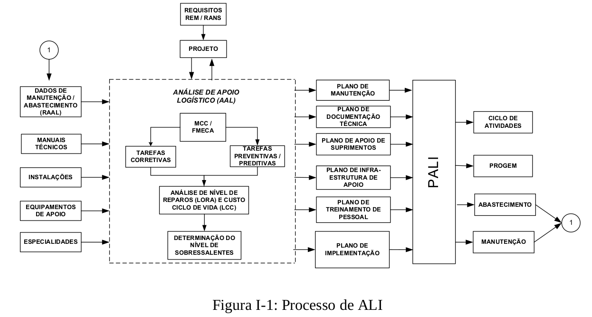

# Introdução

## Página 1

### 1- PROPÓSITO 

Este Manual tem o propósito de apresentar como os conceitos de Apoio Logístico Integrado (ALI) devem ser empregados na Marinha e fornecer um entendimento das tarefas e responsabilidades envolvidas no processo.

### 2 - DESCRIÇÃO

O processo de ALI visa planejar e orientar implementação do apoio logístico a um novo meio ou sistema, desde sua concepção e ao longo de sua vida útil, compatibilizando o máximo de disponibilidade com o mínimo de custos de operação e manutenção, mediante a abordagem dos aspectos logísticos desde o início do processo de obtenção.

O processo de ALI envolve atividades nas áreas de manutenção, abastecimento, instalações de apoio, pessoal de operação e manutenção e documentação técnica. A Figura I-1 fornece uma visão geral das atividades de ALI, onde pode ser destacado o núcleo destinado às atividades de Análise de Apoio Logístico (AAL) que, utilizando as informações obtidas da Manutenção Centrada na Confiabilidade (MCC), da Análise dos Modos, Efeitos e Criticidade de Falhas (Failure Mode, Effects and Criticality Analysis — FMECA), da Análise do Nível de Reparos (Level of Repair Analysis - LORA), e da determinação do Nível de Sobressalentes, necessários ao longo da vida útil do meio, chega a previsão do Custo do Ciclo de Vida (Life-Cycle Cost — LCC) de um sistema ou equipamento.

## Página 2

Como elementos de entrada do processo de AAL encontram-se os dados de manutenção armazenados nos Registros de Análise de Apoio Logístico (RAAL), os Manuais Técnicos dos fabricantes de equipamentos e sistemas, as Instalações de Apoio existentes e suas infraestruturas, os Equipamentos de Apoio e Teste que apóiam os sistemas em utilização e as especialidades de mão-de-obra existentes nas OMPS-I e nos meios. Nos casos de obtenção de novos meios e sistemas mediante Projeto e Construção, a documentação técnica de projeto será mais um elemento de entrada para o processo de AAL. Essas informações de entrada são tratadas pelas ferramentas de AAL, que inclui a aplicação da MCC, da FMECA, da LORA, da ferramenta de determinação dos níveis de estoque e da análise de LCC. O resultado dessas análises fornecerá elementos para a montagem do plano de manutenção, a geração da documentação técnica, a obtenção dos itens de suprimento e a realização de treinamento para o pessoal de manutenção e de operação.

Essas informações serão consolidadas no Plano de Apoio Logístico Integrado (PALT), elaborado pela Equipe de ALI (EALI), que também conterá um cronograma de eventos-chave para obtenção dos itens de suprimento ao longo da vida útil do meio. Os dados existentes no PALI servirão de elementos para a elaboração do Ciclo de Atividades em função das tarefas de manutenção previstas, para a elaboração do Programa Geral de Manutenção (PROGEM), para a obtenção dos sobressalentes e equipamentos de apoio (atividades da função Abastecimento) e execução das atividades de manutenção.

O conteúdo deste Manual foi estruturado em Seções, uma vez que o processo pode ser abordado em blocos considerando as entradas e saídas do núcleo destinado à AAL. Assim a Seção I contém uma abordagem sobre os conceitos de ALI e o macro processo das atividades de ALI na MB, e será composto pelos Capítulos 1 e 2. O Capítulo 1 apresenta o conceito de ALI, as atribuições dos Órgãos da MB relacionados com o ALI, os fluxogramas dos macros processos, os principais elementos e processos de ALI e as finalidades do Plano de Apoio Logístico Integrado (PALI) e seu desenvolvimento nas obtenções por projeto e por oportunidade. O Capítulo 2 apresenta os conceitos de Confiabilidade, Mantenabilidade e Disponibilidade, utilizados na metodologia da FMECA e da MCC.

A Seção II abordará os principais processos de apoio logístico. O Capítulo 3 apresenta o processo de Análise de Apoio Logístico utilizado para planejar e coordenar as ferramentas de análise e para sistematizar o desenvolvimento dos requisitos dos recursos necessários ao apoio logístico de cada sistema. O Capítulo 4 aborda a metodologia da FMECA, ferramenta utilizada pela MCC no estudo das falhas funcionais, seus modos, efeitos e criticidade, a fim de selecionar as falhas significantes. O Capítulo 5 contém uma abordagem sobre a metodologia da MCC, que tem como objetivo estabelecer tarefas de manutenção preventivas, preditivas e corretivas em função do nível de importância de cada falha funcional, visando prevenir a ocorrência de mau funcionamento indesejável e eliminar seus efeitos adversos. O Capítulo 6 aborda a Análise do Nível de Reparos (LORA) para a classificação das tarefas de manutenção, de acordo com os escalões de manutenção, em função dos recursos disponíveis nos meios, nas OMPS-I e nos fabricantes dos equipamentos e sistemas. O Capítulo 7 contém os procedimentos para a determinação dos níveis de sobressalentes, visando garantir a disponibilidade desejada do meio com o menor custo. O Capítulo 8 aborda a metodologia para a previsão dos custos totais que serão despendidos ao longo da vida de um sistema (LCC).

## Página 3

A Seção III abordará os Elementos de Saída da AAL, que inclui o PALI e seus planos constituintes. Assim o Capítulo 9 apresenta os procedimentos para elaboração do PALI e de seus planos componentes, que consolidarão os requisitos necessários para apoiar e operar os meios e  sistemas.

### 3- RECOMENDAÇÃO

Esta publicação destina-se a auxiliar a aplicação dos conceitos e orientar com exemplos os processos referentes à aplicação do ALI, com particular destaque para confecção do PALI e aplicação dos conceitos que formam as expressões que medem a Confiabilidade, Mantenabilidade e Disponibilidade. 

### 4- CLASSIFICAÇÃO

Esta publicação é classificada, de acordo com o EMA-411- Manual de Publicações da Marinha em: PMB, não controlada, ostensiva, básica e manual.
