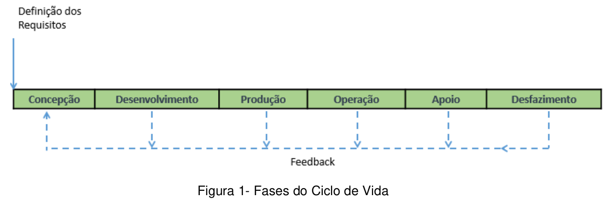

# Capítulo I - Introdução

## Página 12

PREFÁCIO

O presente Manual resulta do trabalho desenvolvido pela Subcomissão designada pela Portaria nº 2282/SECIL/MD, de 10 de novembro de 2016, alterada pela Portaria nº 2083/SECIL/MD, de 17 de maio de 2017, que foi composta por oficiais das três Forças Singulares (FS) e do Ministério da Defesa (MD) e teve como propósitos iniciais: apresentar um conteúdo teórico sobre Gerenciamento do Ciclo de Vida de Sistemas de Defesa e obter, registrar e compartilhar as experiências de sistematizações adotadas em cada Força Armada do Brasil para o Gerenciamento do Ciclo de Vida dos Produtos de Defesa (PRODE) e Produtos Estratégicos de Defesa (PED).

Durante o compartilhamento das experiências de sistematizações adotadas em cada FS, evidenciou-se similaridades de conceitos, de modelos e de práticas que se mostraram alinhadas com o referencial teórico sobre a Engenharia de Sistemas, a norma internacional ISO/IEC 15288:2015 - Systems and software engineering -- System life cycle processes.

O trabalho contou com subsídios apresentados pelas FS, bem como com aqueles obtidos junto às Subcomissões que estão desenvolvendo no âmbito do MD, estudos para: a revisão do PAED; o estabelecimento de Política e de Diretriz de Obtenção (POb/DOb); e o Planejamento Baseado em Capacidade (PBC).

Entende-se que este Manual poderá servir de auxílio às FS quando do desenvolvimento de seus programas internos de Gestão de Ciclo de Vida, possibilitando os ajustes e adaptações que se fizerem necessárias para atender a complexidade tecnológica, as especificidades de cada sistema e as particularidades do ambiente interno de suas administrações.

Além disso, espera-se que o Manual não seja uma peça estática. As ideias evoluem no tempo, de acordo com os resultados obtidos, com as necessidades identificadas e também com base nas melhores práticas que vão paulatinamente sendo conhecidas e que revelam potencial para aprimorar a Gestão do Ciclo de Vida dos Sistemas de Defesa.

Nesse contexto, surgiu o entendimento de que o Manual ora apresentado fosse promulgado em caráter experimental, pelo menos por um ano, a fim de que pudessem ser realizados, caso necessário, ajustes em processos e tipos de documentos inerentes à interação da Gestão do Ciclo de Vida com as três áreas temáticas PAED, POb/DOb e PBC.

Para tanto, contaremos com o trabalho da Subcomissão de Ciclo de Vida de Produto de Defesa (CVPRODE), subordinada à Comissão de Logística Militar (COMLOG), composta por representantes dos setores diretamente envolvidos na Gestão do Ciclo de Vida de Sistemas de Defesa, no âmbito do MD e das FS.

## Página 13

### 1.1 Das disposições preliminares

1.1.1 Conforme definido na Lei nº 12.598, de 21 de março de 2012, no seu inciso Ill, Sistema de Defesa (SD) é definido como “conjunto inter-relacionado ou interativo de Produto de Defesa que atenda a uma finalidade específica”.

1.1.2 Produto de Defesa (PRODE), segundo o Art. 2º, inciso |, da Lei nº 12.598/2012, é “todo bem, serviço, obra ou informação, inclusive armamentos, munições, meios de transporte e de comunicações, fardamentos e materiais de uso individual e coletivo utilizados nas atividades finalísticas de defesa, com exceção daqueles de uso administrativo”.

1.1.3 Todo PRODE que, pelo seu conteúdo tecnológico, pela dificuldade de obtenção ou pela imprescindibilidade, seja de interesse estratégico para defesa nacional, é classificado como Produto Estratégico de Defesa (PED). São enquadrados nesse caso:

a) recursos bélicos navais, terrestres e aeroespaciais; 

b) serviços técnicos especializados na área de projetos, pesquisas e desenvolvimento científico e tecnológico; e

c) equipamentos e serviços técnicos especializados para as áreas de informação e inteligência (Lei nº 12.598/2012, Art. 2º, inciso II).

1.1.4 Para efeito deste manual, um Sistema de Sistemas (SS) é entendido como um conjunto de sistemas componentes que produzem resultados inalcançáveis apenas pelos sistemas individuais. Cada sistema na estrutura do SS é susceptível de ser próprio e adequadamente operacional, bem como estar contribuindo para a realização de alguma exigência de missão de nível superior.

1.1.5 O sistema, cujo Ciclo de Vida (CV) for considerado de acordo com o contexto deste Manual, conforme estabelecido nos Capítulos Ill e IV, será denominado Sistema de Interesse (SI).

### 1.2 Referências

Os documentos consultados e que fundamentaram a elaboração desta publicação foram:

a) Lei nº 12.598, de 21 de março de 2012 (Estabelece normas especiais para as compras, as contratações e o desenvolvimento de produtos e de sistemas de defesa; dispõe sobre regras de incentivo à área estratégica de defesa; altera a Lei nº 12.249, de 11 de junho de 2010; e dá outras providências);

b) Lei nº 13.243, de 11 de janeiro de 2016 (Dispõe sobre estímulos ao desenvolvimento científico, à pesquisa, à capacitação científica e tecnológica e à inovação e altera a Lei nº 10.973, de 2 de dezembro de 2004, a Lei nº 6.815, de 19 de agosto de 1980, a Lei nº 8.666, de 21 de junho de 1993, a Lei nº 12.462, de 4 de agosto de 2011, a Lei nº 8.745, de 9 de dezembro de 1998, a Lei nº 8.958, de 20 de dezembro de 1994, a Lei nº 8.010, de 29 de março de 1990, a Lei nº 8.032, de 12 de abril de 1990, e a Leinº 12.772, de 28 de dezembro de 2012, nos termos da Emenda Constitucional nº 85, de 26 de fevereiro de 2015);

## Página 14

c) Portaria Normativa nº 9/GAP/MD, de 13 de janeiro de 2016 (aprova o Glossário das Forças Armadas - MD35-G-01 - 5º Edição/2015);

d) Instrução Normativa nº 1/EMCFA, de 25 de julho 2011 (aprova as Instruções para a Confecção de Publicações Padronizadas do Estado-Maior Conjunto das Forças Armadas - MD20-1-01);

e) Portaria Normativa nº 513/EMD/MD, de 26 de março de 2008 (aprova o Manual de Abreviaturas, Siglas, Símbolos e Convenções Cartográficas das Forças Armadas - MD33M-02 - 32 Edição/2008); .

f) ASSOCIAÇÃO BRASILEIRA DE NORMAS TECNICAS (ABNT) NBR 5462:1994: Confiabilidade e mantenabilidade;

g) ABNT NBR ISO/IEC 15288:2009: Engenharia de sistemas e software — Processos de ciclo de vida de sistema;

h) ABNT NBR ISO 55000:2014: Sistema de Gestão de Ativos: Associação Brasileira de Normas Técnicas;

i) ABNT NBR ISO 10018 - Gestão de qualidade - Diretrizes para envolvimento das pessoas e suas competências;

j) ABNT NBR 31000 - Gestão de Riscos - Princípios e Diretrizes;

k) ABNT NBR ISO 16091 - Apoio Logístico Integrado — Sistemas Espaciais;

l) ABNT NBR ISO 55000:2014 - Gestão de Ativos: Fundamentos, princípios e terminologia;

m) ABNT NBR ISO 55001:2014 - Gestão de Ativos: Requisitos;

n) ABNT NBR ISO 55002:2014 - Gestão de Ativos: Linhas de orientação para a aplicação da ABNT NBR ISO 55001;

o) International Organization for Standardization (ISO). ISO/EC/IEEE 15288:2015: Systems and Software Engineering — System Life Cycle Processes;

p) ISO 17359 - Condition Monitoring and Diagnostics of Machines - General Guidelines;

q) ISO 37500 - Guidance on Outsourcing;

r) ISO 10303-239 - Industrial Automation Systems and Integration — Product Data Representation and Exchange — Part 239: Application Protocol: Product Life Cycle Support;

s) ISO 62402 - Obsolescence Management — Application Guide;

t) ISO/IEC TR 24748-1:2016: Systems and software engineering - Life cycle management- Part 1: Guidelines for life cycle management;

u) ISO 10007:2003: Quality management systems — Guidelines for configuration management;

v) NORTH ATLANTIC TREATY ORGANIZATION (NATO). AAP-20: NATO Programme Management Framework (NATO Life Cycle Model). Edição C, versão 1, 2015;

w) AAP-48:2013: NATO System Life Cycle Processes. Edição B, versão 1, 2013;

x) NATO - RTO TECHNICAL REPORT TR-058 - SAS-028 - Cost Structure and Life Cycle Costs for Military Systems;

y) NATO - RTO TECHNICAL REPORT - TR-SAS-054 - Methods and Models for Life Cycle Costing;

## Página 15

z) NATO AACP-02 - Guidance Manual on Contractual Terms for Cooperative Programmes;

aa) NATO ALP-10 - Nato Guidance on Integrated Logistics Support for Multinational Armament Programmes;

ab) ALCCP-1 — NATO Guidance on Life Cycle Costs;

ac) Department of Defense (DoD) Guide for Achieving Reliability, Availability and Maintainability, 2005;

ad) DoD 5000.66 - Defense Acquisition Workforce Education, Training, Experience, and Career Development Program;

ae) DoD MIL-HDBK-259: Military Handbook 259 — Life Cycle Cost in Navy Acquisitions, 1983;

af) ACMP-2100 - Configuration Management Contractual Requirements;

ag) Project Management Body of Knowledge (PMBOK), emitido pelo Project Management Institute (PMI) - 62 Edição; e

ah) BLANCHARD, Benjamin S. — Systems engineering Management (2004).

### 1.3 Do objetivo e dos parâmetros

1.3.1 O objetivo do Manual é apresentar uma abordagem de gestão de ciclo de vida de SD, que poderá servir de auxílio às FS quando do desenvolvimento de seus programas internos de Gestão de Ciclo de Vida.

1.3.2 O ciclo de vida inclui todo o espectro de atividade de um determinado SI, iniciando com a identificação da necessidade e estendendo-se através do projeto e desenvolvimento do sistema, da produção e/ou construção, do seu emprego operacional e apoio de manutenção e do desfazimento do material.

1.3.3 Como as atividades de cada fase interagem com as atividades de outras fases, conforme ilustrado na Figura 1, é essencial considerar o ciclo de vida total ao abordar questões em nível sistêmico, especialmente se o propósito for avaliação de riscos, associados, como um todo, ao processo de tomada de decisão.

Figura 1- Fases do Ciclo de Vida

1.3.4 O exemplo de ciclo de vida apresentado neste Manual é composto por seis fases:

concepção;

desenvolvimento;

produção;

operação;

apoio; e 

desfazimento. 

As fases refletem uma abordagem sequencial mais genérica. Para cada SD, em função das peculiaridades técnicas do SI, poderá ser realizado o ajuste do modelo de CV, de acordo com o disposto no Capítulo III.

## Página 16

1.3.5 Cada fase tem o seu propósito geral definido por informações iniciais, as entradas (inputs), e por informações finais, as saídas (outputs). O Capítulo Il lista, como informação, possíveis entradas e saídas que definem o propósito de cada fase do modelo de CV. As entradas (inputs) para a fase de concepção poderão ser os requisitos operacionais que emergirão do Planejamento Baseado em Capacidades (PBC) levado a termo na fase de pré-concepção, a qual não integra o modelo de CV estabelecido neste Manual.

1.3.6 As atividades específicas inerentes a cada fase e as durações de cada uma, podem variar, dependendo da natureza, complexidade e finalidade do Sl. O detalhamento dessas atividades poderá ser realizado com base nos processos de CV que forem adotados pelas FS. A fim de viabilizar a gestão do ciclo de vida do Sl, a evolução das atividades poderá ser pautada pela orientação de mecanismos de acompanhamento, conforme apresentado no Capíulo Il. O Anexo H lista, com as suas referências, alguns processos de CV empregados na gestão de ciclo de vida de sistemas. Os Anexos (Informativos), de A a G, apresentam um exemplo desse detalhamento e da aplicação dos mecanismos de acompanhamento para a evolução das atividades estabelecidas.

1.3.7 As fases do ciclo de vida citadas no subitem 2.3 poderão ser divididas em subfases, quantas forem necessárias, a fim de viabilizar o gerenciamento de atividades, principalmente as de Apoio Integrado ao Produto ao longo das fases, e processos de CV adotados, em face da complexidade tecnológica, das especificidades e peculiaridades do Sle das particularidades do ambiente interno de gestão de cada FS.

1.3.8 A composição do ciclo de vida de sistemas de defesa em fases e subfases poderá ser definida, a critério das Forças, pelo gerente do programa/projeto na fase de concepção e o seu resultado será mantido e avaliado continuamente considerando o processo de tomada de decisão do programa/projeto, sendo modificado conforme couber, a fim de atender possíveis necessidades de alteração baseadas em riscos justificados.

1.3.9 As fases concepção e desenvolvimento configuram a etapa de pré-investimento. A etapa de investimento corresponde à fase de produção, na qual o SI é adquirido ou construído. E o pós-investimento é composto pelas fases operação, apoio e desfazimento.

1.3.10 Agrupam-se na etapa de pré-investimento os custos para o desenvolvimento do projeto, ou seja, todas as atividades envolvidas antes da produção, tais como pesquisa, estudos de viabilidade do projeto e etc.. No investimento, são agrupados os custos inerentes à fase de produção (compra ou construção) do sistema. No pós-investimento, incorrem os custos inerentes à operação, ao apoio e ao desfazimento do sistema.

1.3.11 A estimativa dos custos do CV durante a fase de concepção é um subsídio importante para o processo decisório referente ao processo de obtenção de um SD e para o planejamento da sua gestão, uma vez que visa à minimização dos custos que incorrerão nas fases de operação e apoio. As fases de concepção e desenvolvimento concentram a maior parte das decisões que afetam o custo do CV.

## Página 17

1.3.12 A fim de possibilitar orientação para a estimativa do Custo do Ciclo de Vida (CCV), e permitir a adequação da respectiva base de dados das FS, o Capítulo IV apresenta um modelo de Estrutura Analítica de Custos (EAC).

1.3.13 O CCV consiste no somatório de todos os custos diretos mais os custos variáveis indiretos associados à concepção, ao desenvolvimento, à produção, à aquisição, à operação e ao apoio e desfazimento de um novo equipamento ou capacidade e deverá, preferencialmente, ser empregado para a análises de alternativas e econômicas.

#### 1.4 Das disposições gerais

1.4.1 A implantação das Melhores Práticas para a Gestão do Ciclo de Vida de Sistemas de Defesa irá:

I - assegurar que as necessidades e requisitos operacionais aprovados sejam transformados em uma solução de projeto de sistema integrado por meio da consideração simultânea de todas as fases do CV (isto é, concepção, desenvolvimento, produção, operação, apoio e desfazimento);

II - assegurar a interoperabilidade e integração de todas as interfaces operacionais, funcionais e físicas do sistema;

III - garantir que a definição e o projeto do sistema reflitam os requisitos de todos os elementos do sistema: hardware, software, instalações, pessoas e dados;

IV - caracterizar e gerenciar riscos técnico-gerenciais;

V - contribuir para a capacitação da Base Industrial de Defesa (BID), a fim de que essa conquiste autonomia em tecnologias indispensáveis à Defesa;

VI - assegurar que o processo de engenharia de sistema seja aplicável a todas as fases do Ciclo de Vida do Sistema, mediante o trabalho cooperativo e integrado dos diversos e diferentes grupos organizacionais que nele interagem;

VII - assegurar ênfase nos custos inerentes às fases de operação, apoio e desfazimento, visando contribuir para a minimização dos valores a serem despendidos na etapa do pós-investimento;

VIII - assegurar acompanhamento dos custos incorridos ao longo do CV, a fim de constituir base de dados consistente para o embasamento das estimativas de Custos do Ciclo de Vida dos Sistemas de Defesa;

IX - garantir permanente avaliação da relação “Custo versus o Desempenho do Sistema de Defesa”, a fim de promover o refinamento da base de dados sobre Custos do Ciclo de Vida dos Sistemas de Defesa;

X - assegurar a observância do caráter iterativo e interativo das fases que compõem o Ciclo de Vida de Sistema;

XI - assegurar que os objetivos organizacionais sejam alcançados por meio da gestão dos ativos, em que estejam envolvidos o equilíbrio de custos, oportunidades e riscos contra o desempenho almejado dos ativos;

## Página 18

XII - assegurar que durante a concepção do projeto sejam levantadas as possibilidades de obsolescência do SD a ser produzido, de forma a verificar ações mitigadoras; e

XIII - garantir que os projetos de produção contenham em seu desenvolvimento o índice máximo de nacionalização e compensação, conforme a legislação em vigor.

1.4.2 Tendo em vista as ações a serem observadas na gestão do CV de SD, este Manual apresenta alguns conceitos e orientações que compõem os Capítulos I a IV.

### 1.5 Aprimoramento

As sugestões para o aperfeiçoamento deste documento são incentivadas e deverão ser encaminhadas ao EMCFA, para o seguinte endereço:

MINISTÉRIO DA DEFESA Estado-Maior Conjunto das Forças Armadas Assessoria de Doutrina e Legislação Esplanada dos Ministérios - Bloco Q - 72 Andar Brasília - DF CEP 70.049-900
