# Capítulo II - Fundamentos da Gestão do Ciclo de Vida de Sistemas de Defesa

## Página 19

### 2.1 Campo de aplicação

O arcabouço apresentado neste Capítulo poderá ser aplicado, no todo ou em parte, na Gestão do Ciclo de Vida de Sistemas de Defesa do MD e das FS.

### 2.1 Conceito de sistema

2.2.1 Para fins deste manual assume-se que sistema compreende elementos de sistema na sua arquitetura (Figura 2).

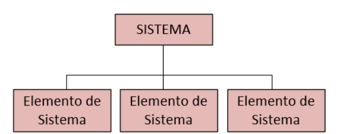

Figura 2: Arquitetura conceitual de um sistema no contexto deste Manual

2.2.2 Os elementos de sistema podem ser: hardware, software, estruturas, instalações, equipamentos, pessoal, infraestrutura, processos, dados e informações.

2.2.3 0s elementos de sistema que contribuem diretamente para o cumprimento do objetivo operacional são denominados de sistemas (ou elementos) técnicos.

2.2.4 0s elementos de sistema que contribuem para a realização de uma parte do sistema em uma fase qualquer do CV, mas não necessariamente fazem parte do ambiente operacional, são denominados de sistemas (ou elementos) de apoio.

2.2.5 Dependendo da complexidade do sistema, os seus elementos de sistema podem ser, eles mesmos, um sistema, que, por sua vez, podem ter outros sistemas como elementos de sistema (Figura 3).

## Página 20

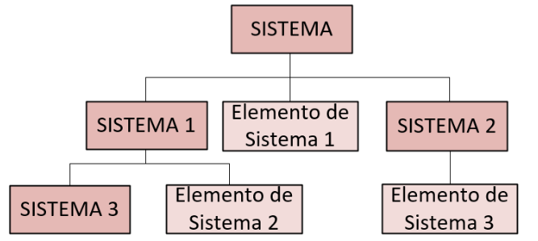

Figura 3: Exemplo da arquitetura de um sistema complexo

2.2.6 A complexidade de um sistema é influenciada por:

a. Quantidade de elementos de sistemas;

b. Modos de inter-relações do sistema com outros sistemas;

c. Modos de inter-relações entre os seus elementos de sistemas;

d. Quantidade de atributos do sistema e dos elementos de sistemas constituintes;

e. Tipo de tecnologia envolvida; e

f. Quantidade de pessoal e homem-hora envolvidos na realização do sistema nas diversas fases do ciclo de vida.

2.2.7 Os sistemas, como definidos no item 2.5, são denominados de Sistema de Sistemas (SS).

2.2.8 Para fins deste manual, os SD são considerados SS que atendem a uma Capacidade Militar identificada no PBC, conforme ilustrado na Figura 4.

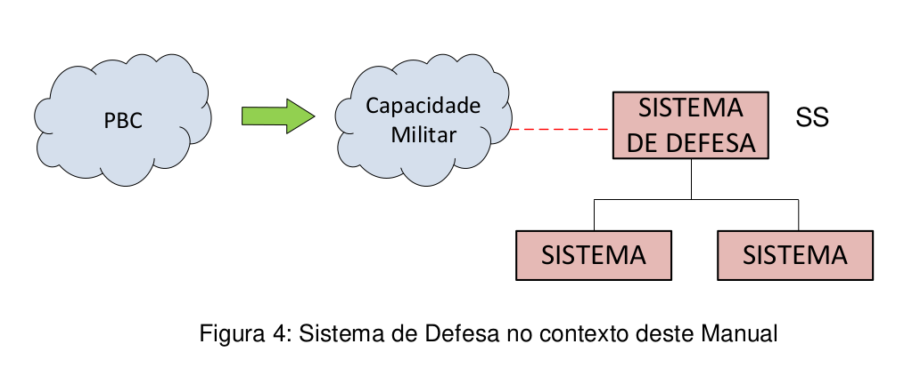

Figura 4: Sistema de Defesa no contexto deste Manual

## Página 21

### 2.3 GESTÃO DO CICLO DE VIDA DE SISTEMAS DE DEFESA (GCVSD)

### 2.3.1 Objetivo da Gestão do Ciclo de Vida de Sistemas de Defesa

2.3.1.1 O objetivo da Gestão do Ciclo de Vida de Sistemas de Defesa (GCVSD) é planejar, obter, manter e otimizar as Capacidades Militares de Defesa considerando desempenho, segurança, qualidade e custo ao longo de todo o CV.

2.3.1.2 Para atingir o objetivo da GCVSD, devem ser empreendidas ações para:

a. Mitigar riscos, reduzir tempos de obtenção, assegurar que os SD obtidos cumpram sua finalidade, identificar, quantificar e controlar os CCV; e

b. Garantir que os processos usados ao longo dos programas/projetos de obtenção de Sistemas de Defesa sejam consistentes, harmonizados, e que haja compartilhamento de recursos, informação e tecnologias de maneira efetiva e sustentável.

### 2.4 PRINCÍPIOS DA GESTÃO DO CICLO DE VIDA DE SISTEMAS DEFESA

2.4.1 A GCVSD deve estar fundamentada nos princípios de Gestão, Efetividade, Interoperabilidade e Indústria, conforme mostrada na Figura 5 e definido abaixo:

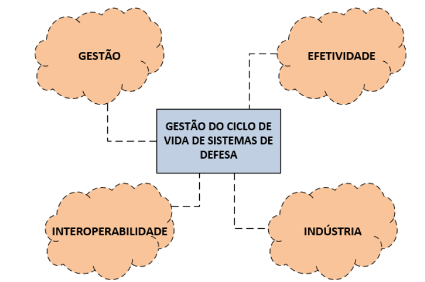

Figura 5: Princípios da Gestão do Ciclo de Vida de Sistemas de Defesa no âmbito do MD

**1) Princípio da Gestão:** todas as partes envolvidas no Ciclo de Vida de Sistemas devem ter compromisso com a GCVSD, por meio de:

a. uma abordagem integrada de GCVSDefesa;
b. estabelecimento de uma equipe de projeto/programa organizacional multidisciplinar integrada ao Sistema para facilitar o cumprimento dos objetivos de desempenho, custo e risco desde a concepção até o desfazimento;
c. utilização ampla da gestão por processos; e
d. escolha de processos de referência adequados a fim de atingir os objetivos da GCV de SD.

**2) Princípio da Efetividade:** deve haver sustentabilidade de Capacidades Militares através do uso eficiente e eficaz dos recursos, através de ações de garantia do cumprimento de requisitos e restrições das partes interessadas a fim de manter a integridade do sistema, dos operadores, dos mantenedores, do público em geral e do meio ambiente.

## Página 22

**3) Princípio da Interoperabilidade:** o MD e as FS devem prover sistemas que satisfaçam as Capacidades Militares e a interoperabilidade previstas no PBC no âmbito do MD. A cooperação e a interoperabilidade devem ser alcançadas através do estabelecimento, implantação, acompanhamento e melhoria da GCVSD.

**4) Princípio da Indústria:** deve haver um estreito relacionamento com a BID a fim de obter benefício mútuo das melhores práticas comerciais, e prestação contínua de serviços que garantam a sustentabilidade de capacidades militares. A colaboração com a BID é alcançada através da:

a. Exploração de novas tecnologias e compartilhamento de "expertises" estratégicas; e

b. Utilização de normas e padrões civis, sempre que possível. A prática mais indicada é a utilização de normas civis sempre, e explicitação de requisitos militares adicionais em contrato ou em normas específicas, como as STANAG da OTAN. Ex: ISO 9001:2015 com requisitos adicionais da AQAP 2110 Ed. D da OTAN. O projeto deve ser tão civil quanto possível, tão militar quanto necessário.

### 2.5 FASES DO CICLO DE VIDA DE SISTEMAS

2.5.10 Ciclo de Vida de Sistemas de Defesa pode ser decomposto em fases as quais compreendem atividades e processos. A decomposição do CV em fases tem por objetivo facilitar o GCVSD à medida que ele progride ao longo dessas fases.

2.5.2 À norma civil ISO 15288:2015 divide o CV de sistemas de interesse em seis fases, quais sejam:

1) Concepção;

2) Desenvolvimento;

3) Produção;

4) Operação;

5) Apoio; e

6) Desfazimento. 

2.5.3 0 termo Desfazimento, empregado de acordo com o Decreto nº 99.658, de 30 de outubro de 1990, revogado pelo Decreto nº 9.373, de 11 de maio de 2018, contempla as atividades de inutilização ou abandono do SD.

2.5.4 0 Ciclo de Vida de Sistemas de Defesa inicia-se na fase de concepção a partir de requisitos operacionais preliminares, oriundos de uma fase de pré-concepção, da qual emerge, com base no PBC, uma Capacidade Militar a ser obtida.

2.5.5 0s requisitos operacionais devem conter informações suficientes que permitam a modelagem do Ciclo de Vida do Sistema de Interesse para realizar estudo de viabilidade, desenvolvimento, produção, operação, apoio logístico, manutenção e desfazimento do sistema de defesa.

## Página 23

2.5.6 0s requisitos operacionais devem abordar aspectos relacionados aos conceitos de suporte/apoio, de manutenção e de desfazimento:

**a. Conceito de Suporte/Apoio:** requisitos e restrições das partes interessadas relacionadas ao suporte/apoio logístico do SD ao longo do CV;

**b. Conceito de Manutenção:** requisitos e restrições das partes interessadas relacionadas à manutenção do SD ao longo do CV; e

**c. Conceito de Desfazimento:** requisito e restrições das partes interessadas relacionadas ao desfazimento do SD.

2.5.7 De uma maneira geral, as fases do Ciclo de Vida de um Sistema de Defesa poderão, como exemplo, atingir os seguintes propósitos:

**a. Fase de Concepção:** avaliar demandas por sistemas, oriundas de uma fase de pré-concepção, desenvolvendo estudos e modelos de engenharia que permitam estabelecer requisitos de sistema e propor uma solução conceitual viável;

**b. Fase de Desenvolvimento:** desenvolver e validar completamente a solução técnica proposta na fase de concepção, mediante processo de projeto (design) de engenharia que deve conferir ao sistema características que o permitam ser produzido, testado, avaliado, operado, mantido e descartado. O desenvolvimento da solução técnica deve ser detalhado até o nível em que seja possível iniciar as atividades da fase de produção;

**c. Fase de Produção:** implementar, integrar, verificar e validar o sistema de interesse e seus sistemas de apoio, produzindo evidências objetivas do cumprimento dos requisitos relacionados ao CV. Ao final da fase é realizada a avaliação operacional do SD (sistema técnico + sistemas de apoio) preparando sua operação. Nessa fase insere-se também à obtenção de um SD já desenvolvido e disponível no mercado ou um item off the self;

**d. Fase de Operação:** operar o sistema de interesse nos diversos ambientes operacionais planejados e garantir efetividade operacional continuada a um custo aceitável;

**e. Fase de Apoio:** prover serviços de apoio logístico que possibilitem sustentar a capacidade de operação do SD (sistema técnico e sistemas de apoio); e

**f. Fase de Desfazimento:** desmilitarizar e retirar o SD, ao final da sua vida útil, do seu ambiente operacional, e encerrar os serviços de apoio logístico e operacionais. Os requisitos para o desfazimento são especificados nas fases precedentes, e a inutilização ou o abandono deve ser realizado de acordo com os requisitos reguladores e legais relacionados à segurança física de mantenedores, operadores e prestadores de serviços em geral, à segurança nuclear, e à proteção do meio ambiente.

2.5.8 O monitoramento do CV do SD deve ser realizado por meio de indicadores préestabelecidos pela Gerência do Projeto, tais como, por exemplo, escopo, custo, prazos e riscos, e servir como parâmetro para o monitoramento do desempenho contratual versus operação.

2.5.9 Deverão ser estabelecidos mecanismos de acompanhamento da evolução das atividades e processos a fim de viabilizar a GCVSD.

## Página 24

2.5.10 Os mecanismos de acompanhamento citados no item anterior poderão ser de dois tipos:

**a. Marcos de Transição (Gates):** permitem a tomada de decisão para transição entre fases a partir de um conjunto de informações definidas previamente, tais como: critérios de entrada e critérios de sucesso. São exemplos de marcos de transição: a decisão que configura os pontos de evolução entre as fases do CV; e

**b. Pontos de Decisão/Controle (milestones):** permitem o controle da evolução das atividades e processos internos a fase. São exemplos de pontos de decisão/controle: as revisões técnicas de projeto, e as entregas contratuais.

2.5.11 Caso sejam empregados, os marcos de transição (Gates) e os pontos de decisão/controle (milestones) devem ser definidos na fase de concepção pelo gerente de programa/projeto em comum acordo com as partes interessadas no SD, e controlados pelos processos de gestão de projetos. Para informações adicionais sobre a definição de marcos de transição (Gates) e pontos de decisão/controle (milestones) ver o Capítulo Ille o Anexo G (informativo) deste Manual.

2.5.12 Cada fase do Ciclo de Vida de Sistemas de Defesa deve possuir, no mínimo, dois mecanismos de controle: o marco de transição (gate) de início da fase, e o marco de transição (gate) de finalização da fase.

2.5.13 Define-se o conjunto mínimo de marcos de transição (Gates), associados às fases do Ciclo de Vida de Sistema de Defesa que devem ser observados pelas FS (Figura 6): 

a) A — Gate de transição entre o término do processo de PBC (Pré-Concepção) e a fase de Concepção; 

b) B-— Gate de transição entre as fases de Concepção e Desenvolvimento;

c) C — Gate de transição entre as fases de Desenvolvimento e Produção;

d) D — Gate de transição entre as fases de Produção e Operação;

e) E — Gate de transição entre as fases de Operação e Apoio;

f) F— Gate de transição entre as fases de Apoio e Desfazimento; e

g) G — Gate de finalização da fase de Desfazimento.

2.5.14 Define-se o conjunto mínimo de pontos de controle/decisão associados às fases do Ciclo de Vida de Sistema de Defesa que devem ser observados pelas FS (Figura 6):

a. Fase de Concepção: 
i. RDR — Revisão de Definição de Requisitos; 
ii. RV — Revisão de Viabilidade;
iii. RRS1 — Revisão de Requisitos de Sistemas; e 
iv. RDS — Revisão de Definição de Sistema.

b. Fase de Desenvolvimento: 
i. RCDS — Revisão de Contrato para a fase de Desenvolvimento;
ii. RRS2 — Revisão de Requisitos de Sistemas;
iii. RFS — Revisão Funcional de Sistema;
iv. RPP — Revisão Preliminar de Projeto;
v. RCP — Revisão Crítica de Projeto; 
vi. RPT — Revisão de Prontidão para Testes; 
vii. RVVS — Revisão de Verificação e Validação de Desenvolvimento de Sistema; 
vii. RPPR — Revisão de Prontidão para Produção. 

## Página 25

c. Fase de Produção: 
i. RCPR — Revisão de Contrato para Fase de Produção; 
ii. RAS — Revisão de Aceitação do Sistema; 
iii. RVS — Revisão de Validação do Sistema; e 
iv. RPO — Revisão de Prontidão Operacional.

d. Fase de Operação:
i. RCOP — Revisão de Contrato para Fase de Operação; 
ii. RPEC — Revisão de Prontidão para Eventos Críticos;
iii. RAVAOP — Revisão de Avaliação Operacional; e
iv. RSEG — Revisão de Segurança. 

e. Fase de Apoio:
i. RCAP — Revisão de Contrato para Fase de Apoio;
ii. RPALI — Revisão do Plano de Apoio Logístico Integrado; e
iii. RDFZ — Revisão do Plano de Desfazimento.

f. Fase de Desfazimento: 
i. RCDZ- Revisão de Contrato para Fase de Desfazimento.

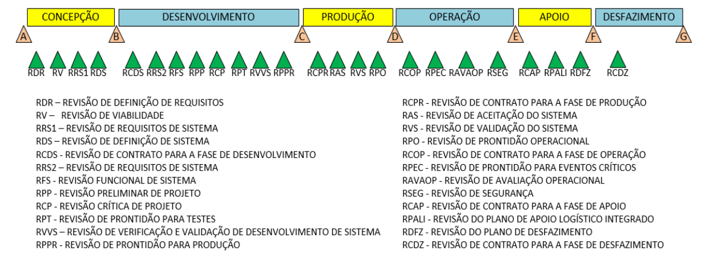

Figura 6: Principais marcos de transição (gates) e pontos de decisão/controle (milestones) para Gestão do Ciclo de Vida de Sistemas de Defesa.

### 2.6 DOS MODELOS DE CICLO DE VIDA DE SISTEMAS DE DEFESA

2.6.10 modelo de CV é determinado pela interação entre as diversas fases do Ciclo de Vida do Sistema de Defesa, podendo ser controlado pelos marcos de transição (gates) entre elas, fortemente caracterizado pela especificidade do sistema de interesse e influenciado pelas particularidades de cada FS.

## Página 26

2.6.2 As FS podem determinar os modelos de CV associados aos seus SD no início da fase de concepção. A Figura 6 apresenta exemplos típicos de modelos de ciclo de vida de SD.

2.6.3 0 modelo de CV mostrado na Figura 7 (a) é típico para Submarinos de Propulsão Convencional ou Nuclear, onde algumas partes sistemas (por exemplo: casco, vaso de pressão de reator nuclear, oficinas, diques, etc.) já podem ser produzidos antes do final da fase de desenvolvimento. Ainda na Figura 7 (a), algumas partes do sistema podem ser entregues/finalizadas antes do final da fase de produção sendo necessária iniciar as atividades da fase de apoio.

2.6.4 0 modelo de CV mostrado na Figura 7 (b) é típico para Sistemas de Defesa em que as atividades de produção só iniciam ao final da fase de desenvolvimento. Para este mesmo modelo são iniciadas as atividades de apoio e operação antes do final da fase de produção. Aeronaves de pequeno porte e Carros de Combate com produção em lote/série são exemplos que podem utilizar o modelo de CV mostrado na Figura 7 (b).

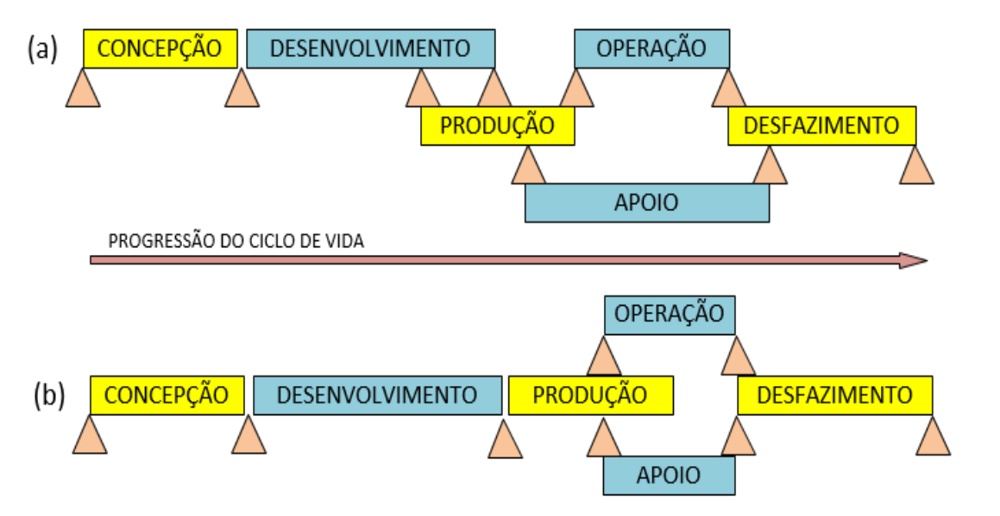

Figura 7: Exemplos de modelos típicos de CV de SD. (a) Modelo de CV típico para Submarinos de Propulsão Nuclear ou Convencional; (b) Modelo de CV típico para Aeronaves de pequeno porte e Carros de Combate.

### 2.7 ENTRADAS (INPUTS) E SAÍDAS (OUTPUTS) DAS FASES DO CICLO DE VIDA 

2.7.1 Para atingir o propósito de cada fase do Ciclo de Vida de Sistemas de Defesa são processadas informações iniciais, as entradas (input), para a geração de informações finais, as saídas (outputs).

## Página 27

2.7.2 As saídas podem ser geradas em qualquer momento ao longo da realização de uma dada fase.

2.7.3 De maneira informativa, são apresentadas abaixo, algumas entradas e saídas que poderão ser observadas, no todo ou em parte, em cada fase do CV:

2.7.3.1 Fase de Concepção

| Tipo     | Item | Descrição |
|----------|------|-----------|
| Entradas | a | Requisitos operacionais (ROP) |
| Entradas | b | Necessidade operacional (NOP, via MD ou FS) |
| Saídas | a | Conceito Operacional (OPSCON) e outros conceitos de ciclo de vida |
| Saídas | b | Requisitos Operacionais (ROP), Requisitos de Aquisição, Requisitos de Implantação (verificação e validação), Requisitos de Apoio Logístico, Requisitos de Manutenção e Requisitos para Desfazimento |
| Saídas | c | Projeto Conceitual da solução escolhida contendo desenhos, esquemáticos, modelos, protótipos, etc. |
| Saídas | d | Requisitos Técnicos, Logísticos e Industriais (RTLI) |
| Saídas | e | Especificação de Alto Nível de Sistemas (preliminares) |
| Saídas | f | Estimativa de custo do ciclo de vida (LCC) atualizado |
| Saídas | g | Cronograma do programa/projeto atualizado |
| Saídas | h | Plano de Gerenciamento do Programa/Projeto atualizado |
| Saídas | i | Plano de Gerenciamento de Configuração |
| Saídas | j | Plano/Estratégia de Gerenciamento de Obsolescência |
| Saídas | k | Plano de mitigação, avaliação e identificação de riscos |
| Saídas | l | Plano Inicial de Tecnologias |
| Saídas | m | Plano de Aquisição/Contratação para fase de desenvolvimento |
| Saídas | n | Edital, convite ou chamada, ou pedido de oferta (Request for Proposal – RFP), para o caso de empresas |
| Saídas | o | Instrumento de convocação (“chamada interna ou externa”) para ICT, organizações militares, fundações, etc. |
| Saídas | p | Lista de prestadores de serviço ou fornecedores de material, incluindo empresas, ICT e organizações militares |
| Saídas | q | Plano de compensação (offset) |
| Saídas | r | Minuta de contrato para prestação de serviço ou aquisição de material, para o caso de empresas |
| Saídas | s | Termo de compromisso, acordo de cooperação técnica, memorando de entendimento ou outro instrumento de formalização de acordo para ICT ou organização militar (interna ou externa à FS) |
| Saídas | t | Estimativa de custo do ciclo de vida (LCC) atualizado |
| Saídas | u | Cronograma físico-financeiro |
| Saídas | v | Lições aprendidas |

Tabela 1: Entradas e saídas da fase de concepção

## Página 28

2.1.3.2 Fase de Desenvolvimento

| Tipo     | Item | Descrição |
|----------|------|-----------|
| Entradas | a | Conceitos de ciclo de vida (operacional, de suporte, aquisição, desfazimento, etc.) |
| Entradas | b | Requisitos das partes interessadas |
| Entradas | c | Especificações Técnicas Preliminares |
| Entradas | d | Avaliação de Viabilidade |
| Entradas | e | Hierarquização de soluções recomendadas |
| Entradas | f | Plano inicial de mitigação, avaliação e identificação de riscos |
| Entradas | g | Projeto (design) conceitual da solução escolhida contendo esquemáticos, modelos, protótipos, etc. |
| Entradas | h | Requisitos Técnicos, Logísticos e Industriais |
| Entradas | i | Especificação de Alto Nível de Sistemas |
| Entradas | j | Estimativas de custo do ciclo de vida (LCC) |
| Entradas | k | Cronograma inicial do programa/projeto |
| Entradas | l | Plano de Gerenciamento de Configuração |
| Entradas | m | Plano/Estratégia de Gerenciamento de Obsolescência |
| Entradas | n | Plano Inicial de Tecnologias |
| Entradas | o | Edital de fornecimento ou pedido de oferta (RFP), para o caso de empresas |
| Entradas | p | Lista de empresas selecionadas para prestação de serviços, para o caso de empresas |
| Entradas | q | Plano de compensação (offset), caso necessário |
| Entradas | r | Cronograma físico-financeiro |
| Entradas | s | Critérios de sucesso para encerramento da fase de desenvolvimento |
| Entradas | t | Lições aprendidas da fase de concepção |
| Saídas | a | Contratos e/ou Termos de Compromisso para as atividades da fase de desenvolvimento |
| Saídas | b | Plano de compensação (offset) associado ao contrato de desenvolvimento/aquisição |
| Saídas | c | Cronograma físico-financeiro associado ao contrato de desenvolvimento/aquisição |
| Saídas | d | Arquivo (Dossiê) de definição do sistema, incluindo: diagramas, esquemáticos, desenhos, modelos, documentos de projeto e especificação de interfaces |
| Saídas | e | Relatórios de verificação e validação realizadas na fase de desenvolvimento |
| Saídas | f | Plano de Produção (hardware: construção; software: programação) |
| Saídas | g | Plano de manutenção e operação |
| Saídas | h | Manuais técnicos de operação, manutenção e treinamento |
| Saídas | i | Procedimentos de suporte e manutenção |
| Saídas | j | Plano e procedimentos de Integração, Verificação e Validação |
| Saídas | k | Plano de Desfazimento |
| Saídas | l | Plano de Gerenciamento de Riscos |
| Saídas | m | Plano de Gerenciamento de Interfaces |
| Saídas | n | Plano de Apoio Logístico Integrado (1ª versão) Importante: A característica do PALI é iterativa e evolutiva. Em face desses aspectos, ele necessita ter varias edições ao longo do CV. |
| Saídas | o | Planos Setoriais de Implantação |
| Saídas | p | Plano de Gerenciamento de Configuração |
| Saídas | q | Plano de Gerenciamento de Obsolescência |
| Saídas | r | Estimativa do custo do ciclo de vida atualizada |
| Saídas | s | Documento de Aprovação de Fase (DAF), atestando que as condições exigidas para prosseguir para a fase de Produção foram atendidas |
| Saídas | t | Lições aprendidas durante a fase de desenvolvimento |

Tabela 2: Entradas e saídas da fase de desenvolvimento

2.1.3.3 Fase de Produção

| Tipo     | Item | Descrição |
|----------|------|-----------|
| Entradas | a | Resultados de testes realizados na fase de desenvolvimento |
| Entradas | b | Plano de Engenharia de Sistemas |
| Entradas | c | Plano Geral de Testes e Ensaios |
| Entradas | d | Critério de sucesso para finalizar a fase de produção |
| Entradas | e | Estimativa do custo do ciclo de vida (LCC) |
| Entradas | f | Definição dos serviços dos sistemas de apoio necessários para as fases de operação, apoio e desfazimento |
| Entradas | g | Lista de riscos identificados e os planos de mitigação associados |
| Entradas | h | Plano de Gerenciamento das Entregas Logísticas |
| Entradas | i | Definição do Sistema, incluindo quando necessário: modelos, desenhos e diagramas de *hardware*; especificação de interfaces; especificações e planos de integração de *software/hardware*; planos de produção; instruções de operação; manuais de treinamento para operadores; plano/estratégia de manutenção; procedimentos para manutenção e apoio; considerações de desfazimento |
| Entradas | j | Estratégia/Plano de Implementação |
| Entradas | k | Lista de restrições, hierarquizada pelo grau de impacto, para a estratégia de implementação do projeto (*design*) |
| Entradas | l | Projeto e arquitetura do sistema |
| Entradas | m | Estratégia e sequência de montagem |
| Entradas | n | Arquitetura do sistema |
| Entradas | o | Elementos de sistemas produzidos |
| Entradas | p | Estratégia de Verificação |
| Entradas | q | Lista de restrições com maior grau de risco para a implementação do sistema |
| Entradas | r | Lista de requisitos de sistema para verificação |
| Entradas | s | Plano de Verificação/Testes |
| Entradas | t | Sistemas montados e integrados |
| Saídas | a | Configuração básica do sistema para produção em larga escala (caso haja) |
| Saídas | b | Todos os elementos não materiais (DOTMLPFI) implementados |
| Saídas | c | Entrega de todos os planos e sobressalentes para a fase de apoio |
| Saídas | d | Conceito de desfazimento atualizado |
| Saídas | e | Pacote de sobressalentes para a fase de operação e apoio |
| Saídas | f | Plano de Gerenciamento das Entregas Logísticas atualizado |
| Saídas | g | Plano de Gerenciamento de Configuração atualizado |
| Saídas | h | Estimativa do custo do ciclo de vida (LCC) atualizada |
| Saídas | i | Critérios de sucesso para saída da fase de operação e/ou manutenção |
| Saídas | j | Elementos de sistema produzidos |
| Saídas | k | Relatório de verificação (testes), destacando as não conformidades |
| Saídas | l | Relatório de validação do sistema, destacando as não conformidades |
| Saídas | m | Entrega do sistema instalado no seu ambiente normal de operação |

Tabela 3: Entradas e saídas da fase de produção

## Página 29

2.1.3.4 Fase de Operação

| Tipo     | Item | Descrição |
|----------|------|-----------|
| Entradas | a | Sistema de interesse produzido, pronto para a utilização |
| Entradas | b | Todos os elementos não materiais (DOPEMAI/DOAMEPI) implementados |
| Entradas | c | Todos os planos e sobressalentes, para a fase de operação, entregues |
| Entradas | d | Contratos de serviços para a fase de Operação, quando necessários |
| Entradas | e | Aprovação formal para prosseguir para a fase de operação |
| Entradas | f | Lições aprendidas |
| Saídas | a | Capacidades militares entregues |
| Saídas | b | Indicação do setor operativo para o desfazimento do sistema de interesse |
| Saídas | c | Registros de falhas e de engenharia do sistema |
| Saídas | d | Aprovação para o desfazimento do sistema de interesse |
| Saídas | e | Lições aprendidas capturadas na fase de operação |

Tabela 4: Entradas e saídas da fase de operação

## Página 29

2.1.3.5 Fase de Apoio

| Tipo     | Item | Descrição |
|----------|------|-----------|
| Entradas | a | Documentos e dados de apoio ao sistema (manuais técnicos, procedimentos, dados logísticos, etc.) |
| Entradas | b | Plano de Manutenção |
| Entradas | c | Plano de Gerenciamento de Apoio Logístico Integrado |
| Entradas | d | Estimativa do Custo do Ciclo de Vida do sistema |
| Entradas | e | Planos Setoriais de Implantação |
| Entradas | f | Plano de Gerenciamento de Configuração |
| Entradas | g | Plano de Gerenciamento de Obsolescência |
| Saídas | a | Documentos e dados de apoio ao sistema atualizados |
| Saídas | b | Estimativa do cálculo do Custo do Ciclo de Vida atualizada |
| Saídas | c | Aprovação de desativação do sistema |
| Saídas | d | Decisão de desfazimento do sistema |
| Saídas | e | Lições aprendidas durante a fase de apoio |
| Saídas | f | Documento de Aprovação de Fase (DAF), atestando que as condições exigidas para prosseguir para a fase de Desfazimento foram atendidas |

2.1.3.6 Fase de Desfazimento

| Tipo     | Item | Descrição |
|----------|------|-----------|
| Entradas | a | Decisão de alienação do sistema de interesse |
| Entradas | b | Aprovação da desativação do sistema de interesse |
| Entradas | c | Plano/Estratégia de desfazimento do sistema |
| Entradas | d | Planos e procedimentos para transferência dos serviços prestados para um novo programa (caso necessário) |
| Entradas | e | Dados de manutenção/apoio (compilação atualizada de dados de falha e comportamento do sistema ao longo da vida útil) |
| Entradas | f | Estimativa do cálculo do custo do ciclo de vida |
| Entradas | g | Lições aprendidas |
| Saídas | a | Alienação do sistema concluída |
| Saídas | b | Custo final do ciclo de vida |
| Saídas | c | Lições aprendidas |

## Página 30

2.7.4 Para alcançar as saídas de cada fase do CVSD, deve ser detalhado um conjunto de atividades necessárias para processar as entradas definidas para cada uma delas.

2.7.5 Os Anexos A, B, C, D, E e F (Informativos) contêm exemplos de atividades que podem ser utilizadas para atingir o propósito e as saídas das fases do CV de sistemas.

2.7.6 O Capítulo Ill deste manual tem a indicação de processos de referência que devem ser observados para o detalhamento das atividades das diversas fases do Ciclo de Vida de Sistemas de Defesa.

### 2.8 ÁREAS DE CONHECIMENTO DE INTERESSE PARA A GESTÃO DO CICLO DE VIDA DE SISTEMAS DE DEFESA

2.8.1 No detalhamento de atividades indicadas no subitem 2.7.4, as atividades podem ser organizadas, dentre outras, pelas seguintes áreas de conhecimento de interesse:

a. Gestão de Portfólio de Projetos;

b. Gestão de Aquisições;

c. Gestão de Contratos;

d. Gestão de Risco;

e. Gestão da Qualidade;

f. Gestão de Custos;

g. Gestão da Informação;

h. Gestão da Comunicação;

i. Gestão do Conhecimento;

j. Gestão de Configuração;

k. Gestão da Obsolescência;

l. Engenharia de Sistemas;

m. Apoio Logístico Integrado;

n. Custo do Ciclo de Vida; e

o. Manutenção.

2.8.2 A organização das atividades por áreas de conhecimento facilita o entendimento das tarefas de cada um dos envolvidos na Gestão do Ciclo de Vida de Sistemas de Defesa.

2.8.3 Para o desenvolvimento das áreas de conhecimento de interesse apresentadas no subitem 2.7.4, poderão ser empreendidas ações tais como:

a. Elaboração de Manuais, Guias de Implementação, ou procedimentos;

b. Detalhamento de atividades por fase (ou subfase) para cada área de conhecimento de interesse;

c. Sítio de internet/intranet, fórum de discussão, seminários e treinamentos;

d. Criação e formalização de rede de especialistas, temporárias ou permanentes, nas áreas de conhecimento de interesse para compartilhamento de lições aprendidas; e

e. Designação de entidades responsável pela captura, armazenamento e disseminação de lições aprendidas relacionadas as diversas atividades relacionadas a GCVSD.

## Página 31

### 2.9 GESTÃO DE PROJETOS

2.9.1 A gestão de projetos compreende todas as ações de coordenação das atividades do programa/projeto a fim de alcançar os objetivos de cada fase do Ciclo de Vida do Sistema de Defesa.

2.9.2 Deve ser estabelecido um escritório global de projetos a fim de coordenar as diversas ações de gerenciamento necessárias para realizar as atividades de cada fase do Ciclo de Vida dos Sistemas de Defesa.

2.9.3 Com o objetivo de minimizar a perda de informações de gestão entre as diversas fases do CV relacionadas ao Sl, orienta-se que a equipe de projeto acompanhe de forma continuada o SD desde a sua concepção até o desfazimento, adotando ações para mitigar os riscos de perda de informações de gestão. A Figura 8 indica possíveis opções para assegurar a continuidade ao longo do CV da ação de gestão.

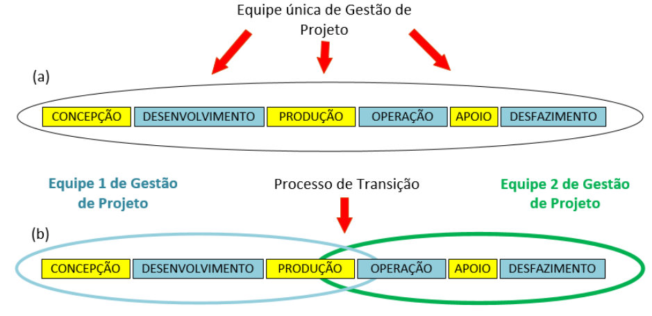

Figura 8: Opções de gestão continuada entre diversas fases do CV. (a) Equipe única. (b) Várias equipes com processo de transição

2.9.4 A fim de minimizar a perda de informação de gestão, a Figura 8 (a) exemplifica a utilização de uma equipe de gestão de projeto única ao longo de todo o CV de SD. Em contrapartida, a Figura 8 (b) exemplifica a utilização de duas equipes de gestão de projeto em dois grandes grupos de fases, concepção/desenvolvimento/produção, e operação/apoio/desfazimento, e um processo de transição de gestão entre as equipes de projeto.

## Página 32

2.9.5 As áreas, a seguir mencionadas, podem auxiliar a equipe de projeto no alcance do objetivo disposto no subitem 2.9.4: gerenciamento de projeto/programa; gerenciamento de qualidade, gerenciamento de finanças; gerenciamento de aquisições; gerenciamento de configuração; gerenciamento de risco; gestão de conhecimento; engenharia de sistemas; e apoio logístico integrado.

2.9.6 Para o desenvolvimento de expertises técnicas citadas no item anterior, podem ser observadas as seguintes normas: ABNT NBR ISO 10018 Gestão de qualidade — Diretrizes para envolvimento das pessoas e suas competências, e DoDI 5000.66 Defense Acquisition Workforce Education, Training, Experience, and Career Development Program do Departamento de Defesa do EUA.

2.9.7 A norma ISO 17359 Condition Monitoring and Diagnostics of Machines — General Guidelines poderá ser observada na implementação de ações de gestão para o monitoramento continuo das principais características de técnicas e de desempenho do SD.

2.9.8 A norma ABNT NBR 31000 — Gestão de Riscos — Princípios e Diretrizes poderá ser observada na implementação de ações de gestão de riscos nos processos de tomada de decisão relacionados à Gestão de Ciclo de Vida dos SD.

### 2.10 GESTÃO DE AQUISIÇÕES PARA O CICLO DE VIDA DE SISTEMAS DE DEFESA

2.10.1 A gestão de aquisições compreende todas as ações necessárias para o estabelecimento, formalização, acompanhamento e encerramento de prestação de serviços, aquisição ou fornecimento de material ao programa/projeto. A prestação de serviços pode ser externa ou interna à FS, conforme ilustrado na Figura 9.

2.10.2 A prestação de serviço externa à FS pode ser realizada por, mas não limitado a: empresas (integrantes ou não da BID); instituições de ensino ou pesquisa (privadas ou públicas); organização militar ou ICT pertencente à outra FS.

## Página 33

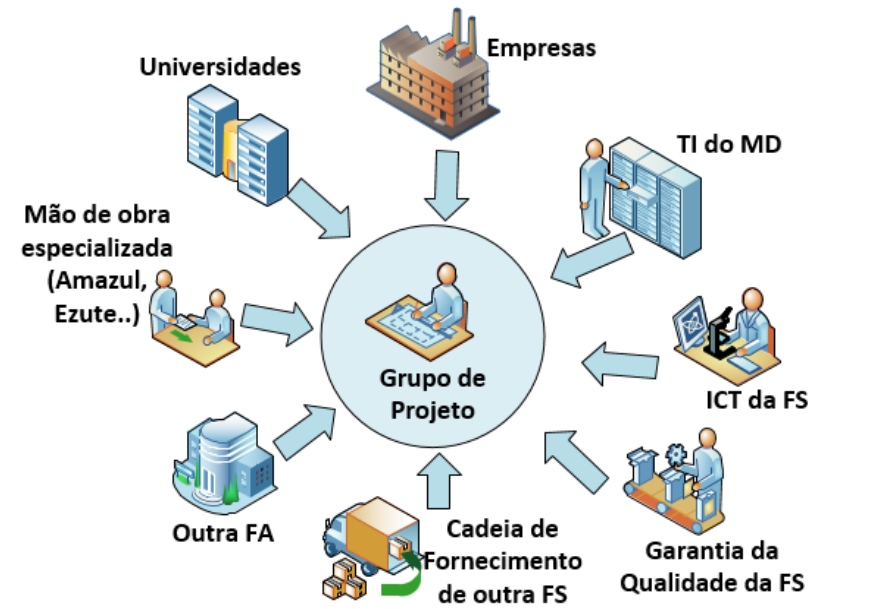

Figura 9: Exemplo de fontes para prestação de serviços ao grupo de projeto (internos ou externos a FS)

2.10.3 Orienta-se que toda prestação de serviço realizada por entidade externa ao grupo de projeto deve ser formalizada através de um instrumento de prestação de serviço, tais como, mas não limitada a: acordos, contratos, termos de compromisso, memorandos de entendimento, parcerias, ou qualquer outro termo correlato previsto no plano de aquisição de serviços global do projeto.

2.10.4 As FS poderão observar as seguintes normas na implementação de ações para a gestão de aquisições ao longo do Ciclo de Vida de SD: ISO 37500 Guidance on Outsourcing; NATO STANDARD AAP-48 NATO System Life Cycle Process; NATO STANDARD ACMP-2100 Configuration Management Contractual Requirements; NATO STANDARD AACP-02 Guidance Manual on Contractual Terms for Cooperative Programmes; NATO STANDARD AQAP-2000 NATO Policy on an Integrated System Approach to Quality through the Life Cycle; Política de Obtenção de PRODE — SEPROD/MD; e Diretriz de Obtenção Conjunta — SEPROD/MD.

### 2.11 APOIO LOGÍSTICO INTEGRADO (ALI)

2.11.1 Devem ser empreendidas ações para garantir que o Apoio Logístico Integrado (ALI), quando necessário, seja considerado desde o início do Ciclo de Vida do SD, visando que aspectos de suportabilidade sejam considerados no processo de engenharia de sistemas do SD.

2.11.2 Sempre que possível, devem ser garantidas a incorporação de requisitos relacionados ao ALI na formalização de acordos/contratos para prestação de serviços ao longo das fases do Ciclo de Vida do SD.

2.11.3 As avaliações operacionais devem contemplar requisitos e parâmetros de desempenho relacionados à suportabilidade do SD.

## Página 34

2.11.4 A fim de auxiliar todos os envolvidos no cumprimento dos objetivos de suportabilidade relacionados no SD, as atividades de ALI podem ser detalhadas por fases do CV (concepção até ao desfazimento).

2.11.5 Para o detalhamento de atividades de ALI citado no item anterior, poderá ser observada a norma NATO STANDARD ALP-10 NATO Guidance on Integrated Logistics Support for Multinational Armament Programmes.

2.11.6 O gerente de ALI, preferencialmente, conduzirá todas as atividades necessárias para definir, produzir, avaliar, otimizar e difundir a suportabilidade relacionada ao SD.

2.11.7 A equipe de ALI, preferencialmente, deverá ser multidisciplinar de modo a abranger os elementos clássicos de ALI.

2.11.8 Podem ser empreendidas ações para o monitoramento continuo das principais características de técnicas e de desempenho do SD, incluindo seus elementos de apoio logístico, a fim de manter de forma continuada sua capacidade militar, levando em consideração requisitos de custo e segurança.

2.11.9 A norma ABNT NBR ISO 16091:2016 - Apoio Logístico Integrado — Sistemas Espaciais - poderá ser observada na implementação de ações de gestão relacionadas ao ALI do SD.

2.11.10 A norma ISO 17359 Condition Monitoring and Diagnostics of Machines — General Guidances poderá ser observada na implementação de ações de gestão para o monitoramento continuo das principais características de técnicas e de desempenho do SD.

### 2.12 GESTÃO DE CONFIGURAÇÃO

2.12.1 A gestão de configuração deve compreender ações que visam garantir o controle da configuração de todas as informações técnico-gerenciais relacionadas ao Ciclo de Vida do Sistema de Defesa, tais como, mas não limitadas a: aquisição; custo; obsolescência; dados técnicos; apoio logístico; interfaces; manutenção; e operação (Figura 10).

## Página 35

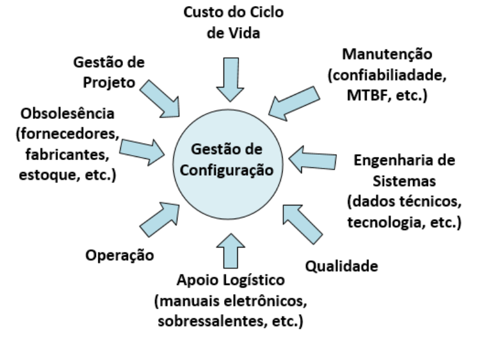

Figura 10: Estrutura conceitual da Gestão de Configuração ao Longo do Ciclo de Vida de SD

2.12.2 A estratégia para o gerenciamento de configuração das informações técnicogerenciais relacionadas ao SD deve ser definida no início da fase de concepção, com reavaliação continuada da mesma, pelo menos, a cada início de nova fase do Ciclo de Vida do SD, tomando ações de mitigação aos riscos potenciais relacionados ao controle da configuração.

2.12.3 Devem ser empreendidas ações para implementar, manter e atualizar a gestão de configuração das informações técnicos-gerenciais relacionadas ao SD desde a sua concepção até o seu completo desfazimento.

2.12.4 A gestão de configuração deve definir atribuições e responsabilidades para todos os envolvidos (contratantes, fornecedores, MD, FS, etc.) nas diversas etapas do processo de gerenciamento de configuração ao longo das fases do CV do SD.

2.12.5 Devem ser empreendidas ações para mitigar a perda de informações técnicogerenciais de configuração do SD na transição entre as diversas fases do Ciclo de Vida de SD.

2.12.6 Devem ser garantidas a incorporação de requisitos relacionados ao controle das informações técnico-gerenciais de configuração na formalização de acordos/contratos para prestação de serviços ao longo das fases do Ciclo de Vida do SD.

2.12.7 As diretrizes das normas ISO, abaixo citadas, devem ser consultadas quando do desenvolvimento das seguintes atividades:

1. ISO 10007:2005 Sistemas de Gestão da Qualidade — Diretrizes para a Gestão de Configuração na implementação de ações para a gestão de configuração ao longo do ciclo do SD;

2. ISO 10303-239 Industrial Automation Systems and Integration — Product Data Representation and Exchange — Part 239: Application Protocol: Product Life Cycle Support na implementação de ações para a gestão de dados técnicos relacionados à manutenção da automatização e integração do SD ao longo do seu Ciclo de Vida; e

3. ISO 62402 Obsolescence Management — Application Guide na implementação de ações para a gestão de obsolescência relacionada à configuração do SD ao longo das fases do seu CV.

2.12.8 Poderá ser implementada uma infraestrutura de tecnologia de informação que suporte todos os processos de gestão relacionados ao Ciclo de Vida do SD, considerando Os princípios de interoperabilidade entre as FS e cooperação com a BID.

## Página 36

### 2.13 GESTÃO E SISTEMA DE GESTÃO PARA O CICLO DE VIDA DE SISTEMAS DE DEFESA (SGCVSD)

2.13.1 Os objetivos, princípios e fundamentos da GCVSD devem se transformar em ações práticas por meio do Sistema de Gestão do Ciclo de Vida de Sistemas de Defesa (SGCVSD).

2.13.2 O SGCVSD traduz os objetivos, princípios e fundamentos da GCVSD de cada FS em planos de gestão, procedimentos, processos e atividades de modo que os Sl de defesa cumpram suas Capacidades Militares (Figura 11).

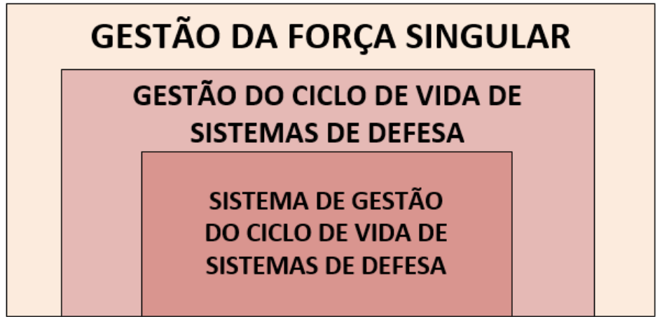

Figura 11: Sistema de Gestão do Ciclo de Vida de Sistema de Defesa

2.13.3 As FS devem atentar que existem áreas de GCVSD que não podem ser implementadas pelo SGCVSD, tais como: cultura e comportamento organizacional.

2.13.4 Devem ser empreendidas ações para desenvolver a cultura e comportamento organizacional a fim de alavancar a eficácia da implantação da GCVSD.

2.13.5 A GCVSD deve fazer parte como um dos elementos de gestão da FS, e, deste modo, coexistir com o gerenciamento de outras áreas clássicas da organização, tais como: qualidade, finanças, aquisições, pessoal, operações, projetos, comunicações, informação, etc., conforme mostrada na Figura 12.

## Página 37

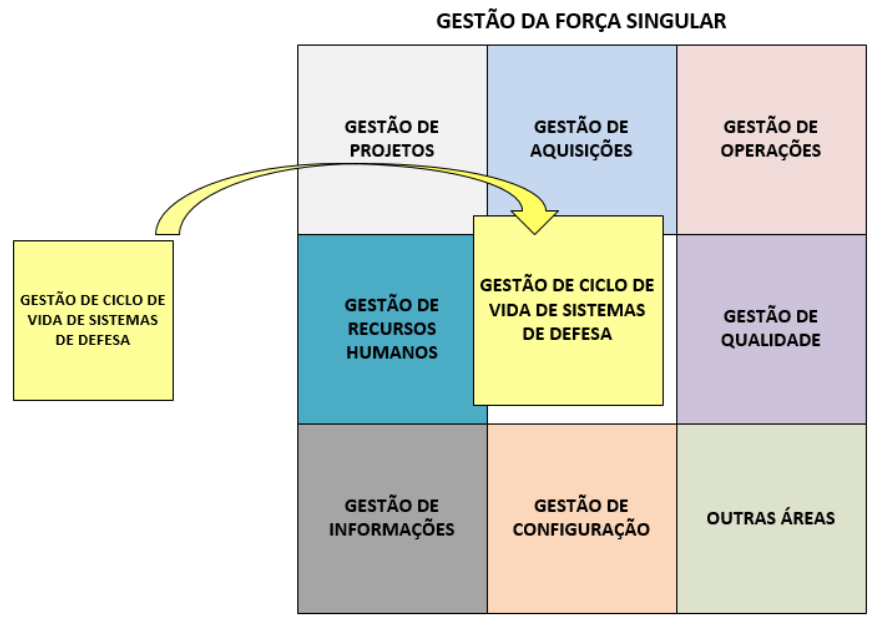 

Figura 12: A Gestão do Ciclo de Vida de Sistema como um elemento de gerenciamento da FS

2.13.6 O SGCVSD deve compreender, dentre outros: política, objetivos, princípios, procedimentos, planos, estrutura de pessoal, sistemas de informações, etc, para a Gestão do Ciclo de Vida.

2.13.7 Quando possível a GCVSD deve utilizar funções já existentes no conjunto global da FS, evitando, assim, a replicação de ações e garantindo a sustentabilidade de recursos e serviços. Exemplo: a Gestão do Ciclo de Vida pode utilizar serviços de gestão de projetos, qualidade e de recursos humanos de outras áreas da FS sem precisar replicá-los na sua estrutura de gestão. Essa abordagem é denominada “gerenciamento integrado”, e deve ser amplamente explorada (Figura 13).

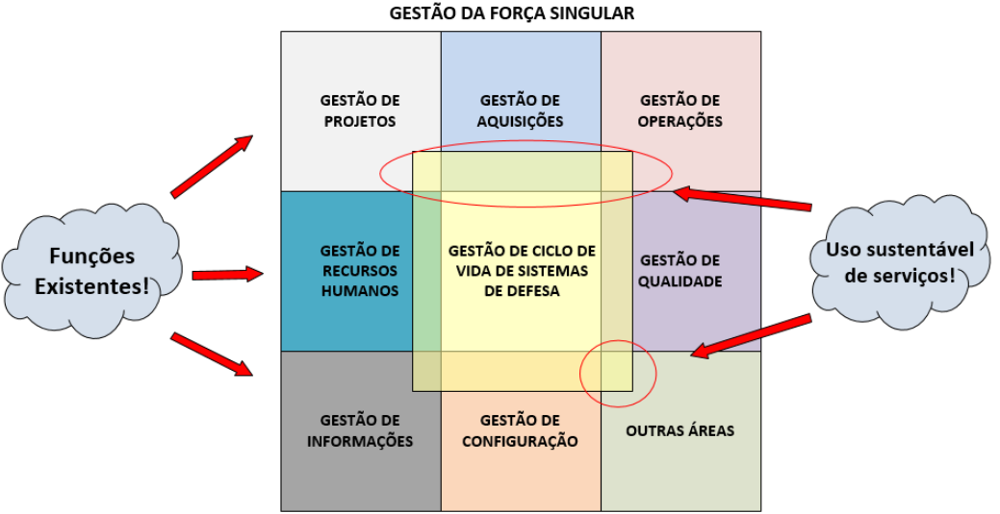

Figura 13: Ilustração conceitual da abordagem de gestão integrada para o Ciclo de Vida de Sistema no contexto das FS.

## Página 38

2.13.8 Orienta-se que, dentro do possível, sejam observadas as definições, requisitos e procedimentos para implantação de um Sistema de Gestão do Ciclo de Vida de Sistemas constantes no conjunto de normas da série 55000 da ABNT NBR ISO, quais sejam:

1. ABNT NBR ISO 55000:2014 — Gestão de Ativos: Fundamentos, princípios e terminologia;

2. ABNT NBR ISO 55001:2014 — Gestão de Ativos: Requisitos; e

3. ABNT NBR ISO 55002: 2014 — Gestão de Ativos: Linhas de orientação para a aplicação da ABNT NBR ISO 55001.

2.13.9 Deve ser considerado que a Gestão de Ativos, conforme apresentada no contexto das normas acima, é a estratégia adotada pelo MD para se implantar a GCVSD no âmbito das FS. Segundo a norma NBR ISO 55000, “Gestão de Ativos é o conjunto de atividades coordenadas que uma organização usa para realizar o valor dos ativos na entrega dos seus objetivos ou resultados”. Para tanto, é requerido um equilíbrio de custos, riscos e benefícios, ao longo do CV de qualquer sistema. Uma vez que, os ativos existem para fornecer o valor para a organização e suas partes interessadas e sua a gestão transforma a intenção estratégica em tarefas, decisões, atividades técnicas e financeiras, bem como fornece garantia de que esses ativos irão cumprir/desempenhar a sua função, configuram-se, assim, subsídios relevantes para os processos de governança e compliance de qualquer organização.

2.13.10 Devem ser empreendidas ações para se implantar um SGCVSD, a fim de viabilizar o estabelecimento de ações práticas para a GCVSD.

### 2.14 ELEMENTOS DO SISTEMA DE GESTÃO DE CICLO DE VIDA DE SISTEMAS

2.14.1 A norma ABNT NBR ISO 55001:2014 define os seguintes elementos para o sistema de gestão de ativos que podem ser observados pelas FS no processo de implantação e melhoria da GCVSD (Figura 14), quais sejam:

a. Contexto da organização;
b. Liderança:
c.Planejamento;
d.Suporte/Apoio;
e. Operação;
f. Avaliação de desempenho; e
g. Melhoria.

## Página 39

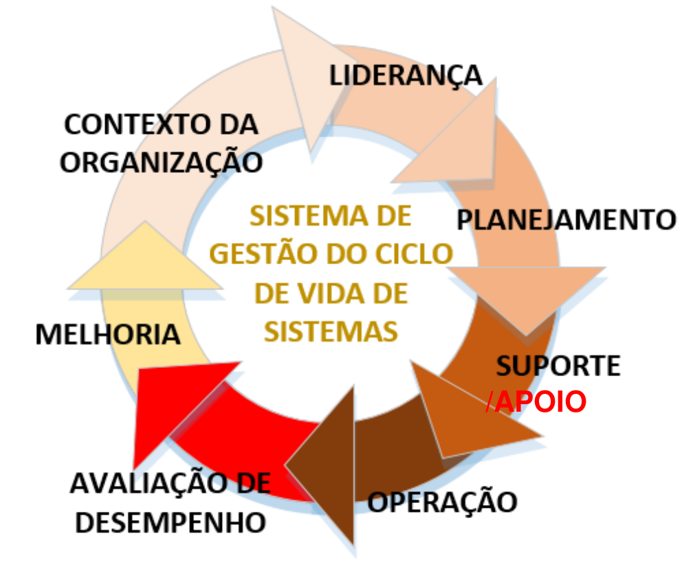

Figura 14: Elementos do Sistema de Gerenciamento do Ciclo de Vida de Sistemas de Defesa

**2.14.1.2 Contexto da organização** - compreende ações para: entendimento da organização e seu contexto; entendimento das necessidades e expectativas das partes interessadas; determinação do escopo do sistema de gerenciamento do CV; Sistema de Gestão de Ciclo de Vida de Sistema.

**2.14.1.3 Liderança** - compreende ações para liderança e compromisso nos diversos níveis da FS; estabelecimento de política de GCVS; delegação de autoridades, e definição de responsabilidades e papéis organizacionais.

**2.14.1.4 Planejamento** - compreende ações para identificar riscos e oportunidades para o Sistema de Gestão do Ciclo de Vida de Sistemas, definição de objetivos da Gestão do Ciclo de Vida de Sistemas e o planejamento para alcançar estes objetivos.

**2.14.1.5 Suporte/Apoio** - compreende ações para conscientização, comunicação, alocação de competências (conhecimento, habilidade e atitude), definições de requisitos de informação, e alocação de recursos financeiros, de infraestrutura e de pessoal.

**2.14.1.6 Operação** - compreende ações para planejamento e controle operacional de processos e atividades, gestão de mudanças, e terceirização de serviços.

**2.14.1.7 Avaliação de desempenho** - compreende ações para monitoramento, medição, análise e avaliação da GCVS, auditoria interna, e revisão de gestão.

**2.14.1.8 Melhoria** - compreende ações para identificação de não conformidades, estabelecimento de ações corretivas e preventivas, e promoção de melhoria contínua da Gestão e Sistema de Gestão do Ciclo de Vida de Sistemas (ABNT NBR ISO 9000:2004). Esse entendimento engloba a definição adotada na DCA 400-6/2007 - Modificação introduzida no Material ou Sistema, aperfeiçoando-o tecnologicamente, com o objetivo de incrementar o seu desempenho, alterando, consequentemente, seu CV. (DCA 400-6/2007).

## Página 40

MD40-M-01

2.14.2 Devem ser concentrados esforços em ações de avaliação de desempenho e de melhoria continua a fim de garantir a maturidade crescente do Sistema de Gestão de Ciclo de Vida, conforme ilustrado na Figura 15.

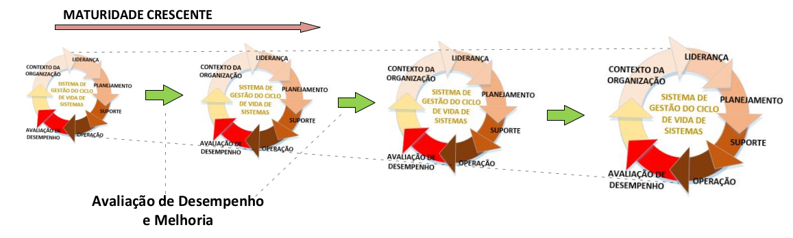

Figura 15: Concentração de esforços em busca da maturidade crescente do SGCVS

2.14.3 Visando a excelência da GCVSD, as FS devem buscar a certificação da implantação do Sistema de Gestão aplicado à GCVSD, tendo como base, dentre outras referências, no que está preconizado na NATO STANDARD AAP-48 NATO System Life Cycle Process e NATO STANDARD AQAP-2000 NATO Policy on an Integrated Systems Approach to Quality through the Life Cycle.