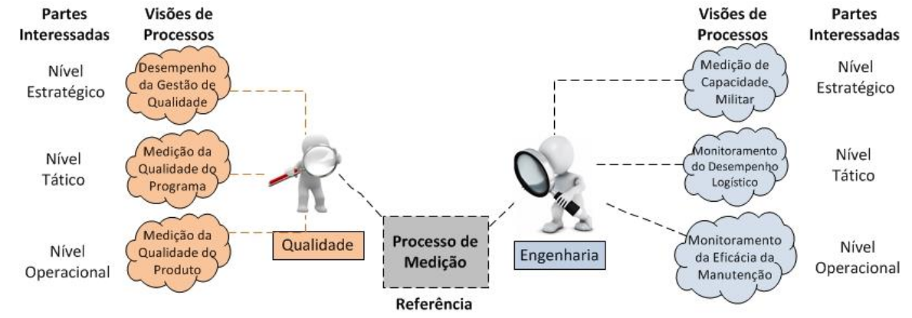
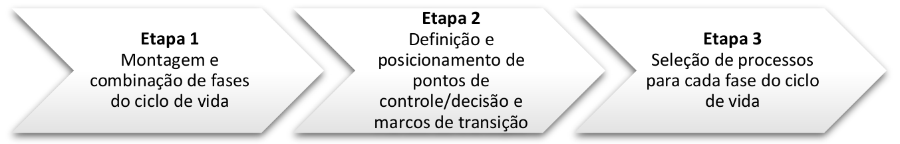
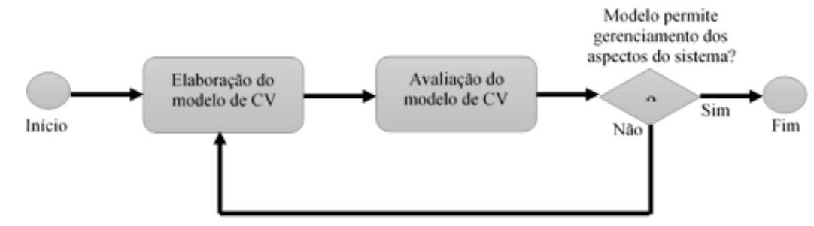

# Capítulo III - Ajustamento do Ciclo de Vida de Sistemas de Defesa

## Página 41

### 3.1 OBJETIVO E CAMPO DE APLICAÇÃO

#### 3.1.1 OBJETIVO 

Estabelecer orientações para ajustamento de modelo de ciclo de vida de SD no âmbito do MD.

#### 3.1.2 CAMPO DE APLICAÇÃO

Estabelecer orientações para o ajustamento de modelo de Ciclo de Vida de Sistemas de Defesa no âmbito do MD, a fim de orientar as FS quanto ao desenvolvimento de modelos de ciclo de vida que sejam adaptados às especificidades técnicas de seus sistemas de interesse e ao ambiente organizacional.

### 3.2 AJUSTAMENTO DO CICLO DE VIDA NA FORÇA SINGULAR

3.2.1 Dentre os processos de CV apresentados no subitem 3.6.2 deste Capítulo, que constituem um conjunto base de referência, a FS pode identificar um subconjunto de processos que, por sua vez, servirá de referência para elaboração dos modelos de CV de sistemas no âmbito de projetos e programas específicos conduzidos pela FS.

3.2.2 A construção desse subconjunto de processos, a que se refere o item anterior, pode ser baseada, por exemplo, em uma análise custo-benefício ou uma análise de risco que avalie a pertinência da adoção de um novo processo ou da continuidade de um processo já empregado pela FS. Nesse caso, torna-se necessária a correlação dos processos elencados no subitem 3.6.2 deste Capítulo com os processos vigentes na FS.8

3.2.3 As FS poderão adaptar os processos de CV estabelecidos neste manual para satisfazer conjunturas particulares ou fatores que refletem suas necessidades organizacionais, de maneira que, os processos modificados ou novos processos inerentes ao CV sejam definidos para atender aos propósitos e resultados almejados com um modelo de ciclo de vida de sistemas de defesa.

## Página 42

3.2.4 Para adaptar os processos de CV estabelecidos neste Manual, as FS podem seguir um processo de adaptação buscando, conforme necessário:

a) Identificar e documentar as circunstâncias que influenciam a adaptação dos processos;

b) Coletar dados de todas as partes afetadas pelas decisões de adaptação;

c) Tomar decisões da adaptação de acordo com o processo de gestão de decisão da FS; e

d) Selecionar os processos de CV que necessitem de adaptação, excluindo os resultados, atividades ou tarefas selecionadas.

3.2.5 Os processos de CV podem ser implementados de diferentes maneiras em cada FS, e ainda, segundo diferentes visões de processo que refletem um foco de interesse específico, como ilustrado na Figura 16.[7]

[7] NOTA (Informativa): Uma Visão de Processo descreve como os resultados esperados por uma área específica de interesse (engenharia, qualidade, contratos, etc.) podem ser alcançados através da utilização de atividades e tarefas dos vários processos de CV. Para maiores detalhes, consultar o Anexo E da referência (a) deste Capítulo.

Figura 16: Ilustração de diferentes visões do Processo de Medição segundo diferentes pontos de vista

3.2.6 As FS podem criar e adaptar o modelo de processos de CV às suas áreas organizacionais, definindo os agentes responsáveis pelos processos e pela sua execução, assim como os participantes de cada um dos processos.

3.2.7 Os processos definidos devem ser categorizados com relação a pelo menos dois aspectos essenciais: o relacionamento lógico entre eles e o nível de responsabilidade pela execução na FS, programa ou projeto.[8]

[8] NOTA (Informativa): O relacionamento lógico entre os processos de CV corresponde ao mapeamento por meio de uma tabela de relacionamento de entradas-saídas, onde é possível constatar a maneira como os processos de CV se relacionam entre si. Dessa forma, identifica-se, por exemplo, se um “Processo A” produz saída para um “Processo B” ou do contrário, se o “Processo A” depende de uma saída do “Processo B”.

### 3.3 ELABORAÇÃO DE MODELO DE CICLO DE VIDA

3.3.1 O propósito básico de um modelo de CV de um sistema de interesse, alinhado com os princípios básicos da GCV, é estabelecer um ambiente processual que possibilite o acompanhamento da evolução do sistema de modo que todos os seus aspectos possam ser gerenciados.

## Página 43

3.3.2 O modelo de CV de sistemas pode ser aplicado pela FS a programas ou projetos específicos de SD.

3.3.3 A elaboração de modelo de ciclo de vida contempla três etapas básicas, conforme exposto na Figura 17:

a) Etapa 1 - Montagem e combinação das fases apresentadas no subitem 2.7 do Capítulo Il;

b) Etapa 2 - Definição dos pontos de controle/decisão e dos marcos de transição entre as fases do modelo de CV, tendo como referência o conjunto mínimo estabelecido nos subitens 2.5.12 e 2.5.13 do Capítulo Il deste Manual; e

c) Etapa 3 - Seleção de processos a serem usados em cada fase do modelo de CV, conforme disposto nos subitens 3.6 e 3.7 deste Capítulo.

Figura 17: Etapas para criação do Modelo de Ciclo de Vida de SD

### 3.4 MONTAGEM E COMBINAÇÃO DAS FASES DO MODELO DE CICLO DE VIDA

3.4.1 Obter a base do modelo de CV montando e concatenando as fases que devem compor o modelo de CV estabelecido neste Manual, levando em consideração as especificidades técnicas e gerenciais do sistema de interesse em questão.

3.4.2 As FS podem avaliar a pertinência de estabelecer subfases, etapas ou estágios, dentro das fases estabelecidas, de modo a facilitar a GCV do sistema em questão, em face da complexidade tecnológica e das peculiaridades de cada programa ou projeto.

3.4.3 A subdivisão das fases em subfases, etapas ou estágios não deve comprometer o propósito, as entradas e as saídas primárias estabelecidas para cada fase.

## Página 44

### 3.5 DEFINIÇÃO DE PONTOS DE CONTROLE/DECISÃO E MARCOS DE TRANSIÇÃO DO MODELO DE CICLO DE VIDA

3.5.1 Poderão ser estabelecidos, descritos e posicionados, temporalmente ao longo das fases e entre elas, os pontos de controle/decisão e os marcos de transição, respectivamente, para a base do modelo de CV obtido segundo o disposto no subitem 3.4, respeitando o conjunto mínimo estabelecido nos subitens 2.5.12 e 2.5.13 do Capítulo II. A título de informação, o Anexo G (Informativo) apresenta alguns exemplos de modelos de descrição de pontos de controle/decisão e de marcos de transição utilizados ao longo do ciclo de vida de sistemas complexos.

3.5.2 A descrição dos pontos de controle/decisão e dos marcos de transição deve atender as especificidades de cada projeto ou programa, porém deve contemplar no mínimo os seguintes atributos:

a) Título;

b) Propósito;

c) Critérios de entrada;

d) Critérios de sucesso;

e) Decisões possíveis; e

f) Referências adicionais.

### 3.6 PROCESSOS DE CICLO DE VIDA DE SISTEMAS

3.6.1 Os processos de CV devem ser customizados ao ambiente organizacional de cada FS e, em um nível subsequente, adaptados a cada programa ou projeto específico de sistemas que sejam objeto da GCV.

3.6.2 Os processos que constituem a base de referência para elaboração do modelo de CV estão apresentados no Anexo H deste manual.

3.6.3 Os processos estabelecidos segundo disposto no item anterior representam uma base inicial de referência para elaboração do modelo de CV de Sistemas de Defesa, sendo perfeitamente admissível, e até recomendado, que novos processos sejam definidos mesclando-se características dos processos citados ou mesmo de outros processos já vigentes na FS ou oriundos de outras referências.

### 3.7 SELEÇÃO DE PROCESSOS POR FASES DO MODELO DE CICLO DE VIDA

3.7.1 Selecionar os processos necessários para atingir o propósito, e as saídas primárias das fases que compõe a base de modelo de CV obtido segundo o disposto no subitem 3.4, tomando como base os processos indicados no subitem 3.6.2, adaptando-os ou criando novos processos.

3.7.2 Definir título, propósito, atividades, entradas, saídas, métodos, ferramentas e considerações de ajuste para os processos selecionados no subitem 3.7.1.

3.7.3 Mapear o modelo de CV, alocando os processos selecionados no subitem 3.7.1 às fases que compõe a base de modelo de CV obtido segundo o disposto no subitem 3.4.1.

3.7.4 Descrever para cada fase da base de modelo de CV obtido segundo o disposto no subitem 3.4.1, 0 propósito, as atividades, as entradas, as saídas, os critérios de entrada, os critérios de saída, os pontos de controle/decisão e as referências adotadas. As atividades elencadas para cada fase devem ser resultantes do procedimento de alocação de processos realizado no subitem 3.7.3.

3.7.5 Documentar e analisar criticamente, no sentido de oficializar e estabelecer um baseline do CV obtido ao se executar os procedimentos estabelecidos nos subitens 3.4.1 ao 3.7.4, a fim de monitorar, controlar e ter rastreabilidade de possíveis mudanças no decorrer do Ciclo de Vida do Projeto e Produto.

## Página 45

### 3.8 AVALIAÇÃO DO MODELO DE CICLO DE VIDA

3.8.1 Após a elaboração do modelo de CV, deverá ser avaliada a adequabilidade do modelo desenvolvido ao sistema objeto do modelo, ou seja, ao sistema de interesse.

3.8.2 Os critérios de avaliação do modelo e as condições de sucesso devem ser, previamente, identificadas e descritas, de maneira a permitir a avaliação de adequação do modelo de CV.

3.8.3 A elaboração e avaliação do modelo de CV deve ser um processo cíclico, contínuo e gradual até que o modelo de CV obtido possibilite o gerenciamento de todos os aspectos do sistema modelado, como ilustrado na Figura 18. O processo de Gestão de Modelo de Ciclo de Vida, descrito no item A.3 do Anexo H deste Manual, fornece as condições necessárias para avaliação do modelo de CV do sistema.

Figura 18: Fluxograma básico para elaboração e avaliação do modelo de Ciclo de Vida
