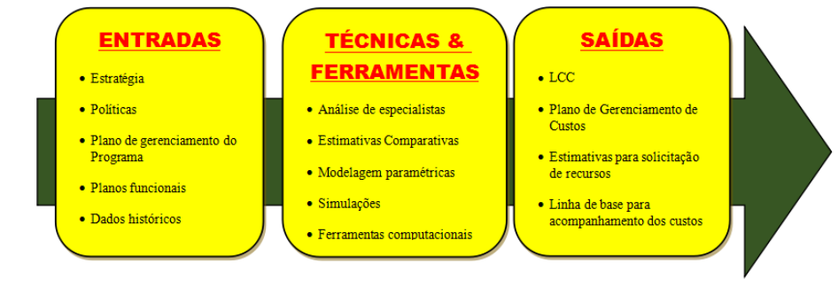
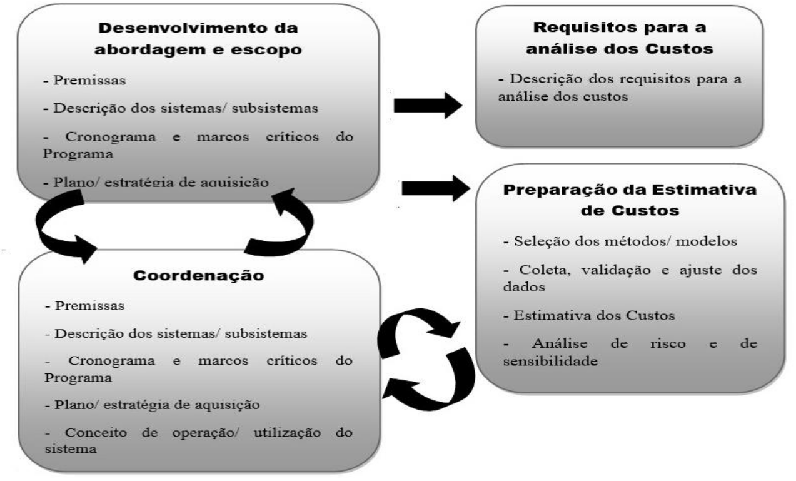
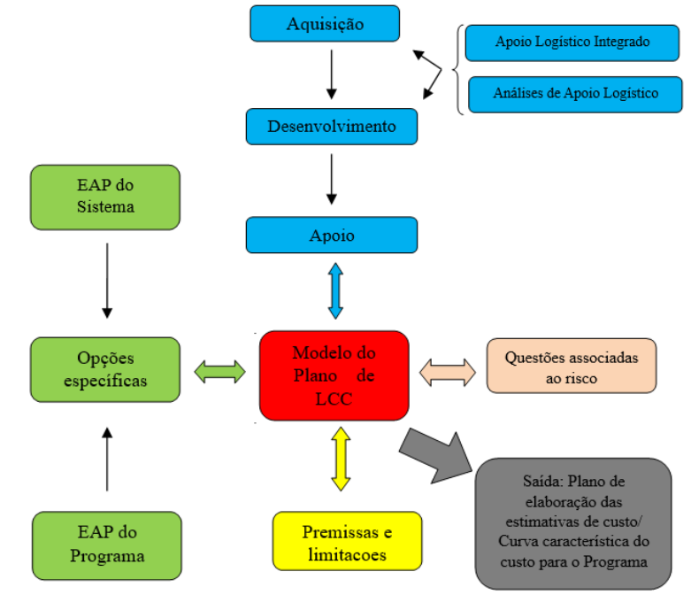
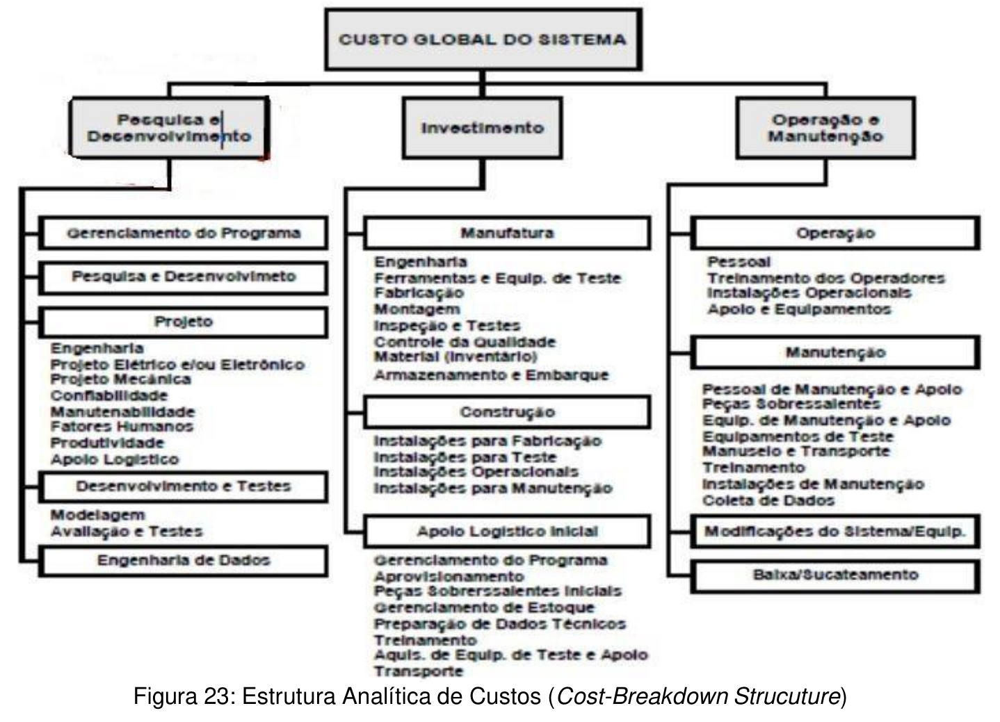
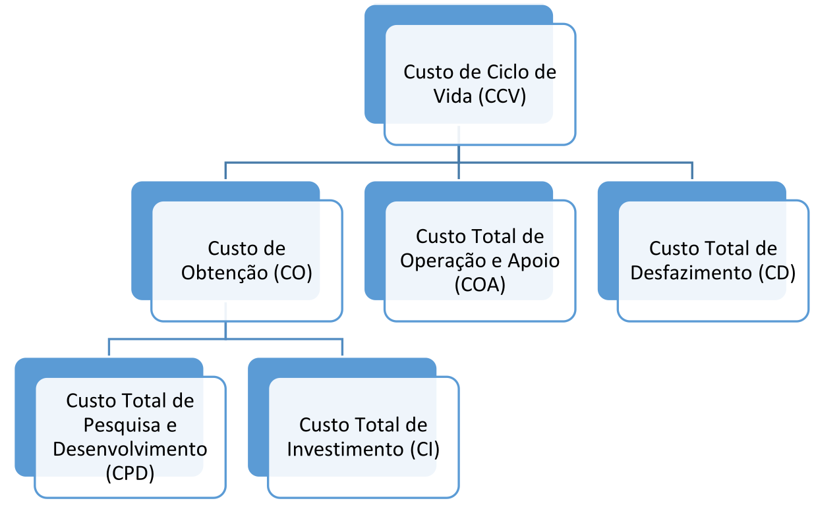
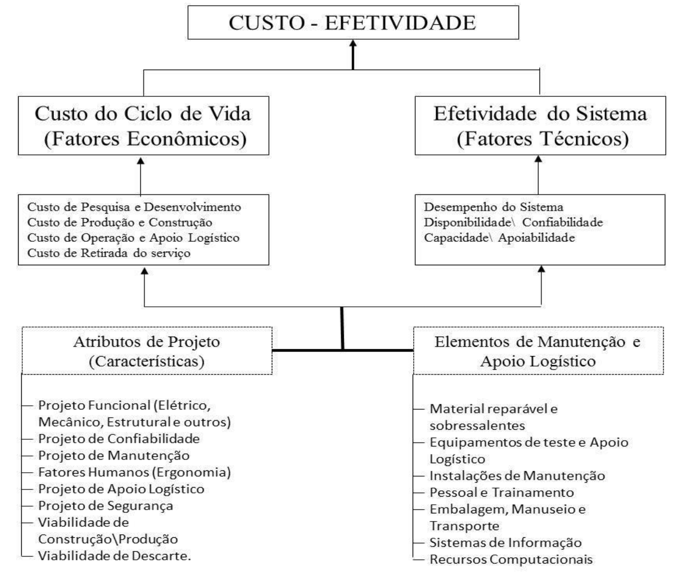
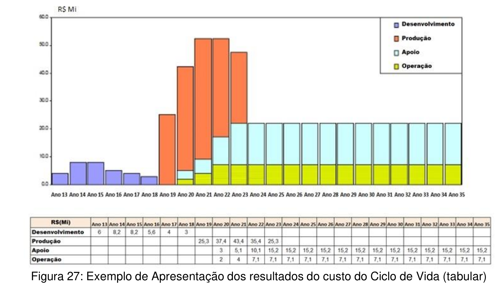
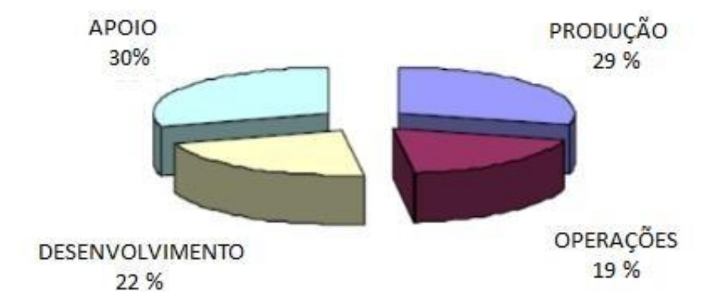
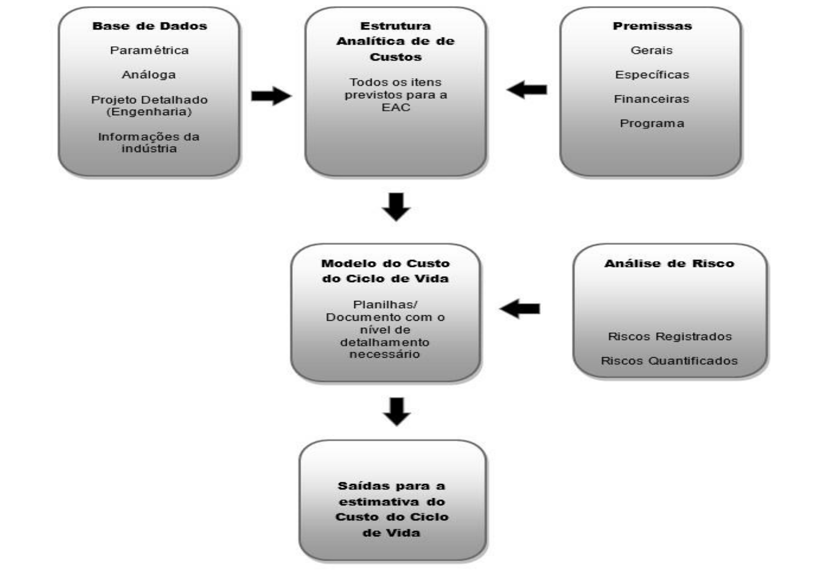

# Capítulo IV - Conceitos básicos de estimativa e análise do custo de ciclo de vida de sistemas de defesa

## Página 47

### 4.1 DISPOSIÇÕES PRELIMINARES

4.1.1 Este Anexo sobre o CCV está organizado da seguinte maneira:

a) Seção 1 - Disposições preliminares, onde são definidos a finalidade, o objetivo, campo de aplicação e as referências;

b) Seção 2 - Disposições Gerais, onde são definidos: a visão geral do processo, os aspectos do gerenciamento do CCV e a Estrutura Analítica de Custos (EAC) e as atividades a serem realizadas; e

c) Seção 3 - Informações gerais sobre as técnicas e ferramentas para a previsão de custos.

4.1.2 Finalidade 

Estabelecer uma referência para metodologia, modelo e elementos de custos atinentes ao CCV de SD.

4.1.3 Objetivo

Apresentar uma metodologia descritiva para a elaboração de estimativas e análises de custo para o CV de SD, aderente à bibliografia técnica especializada? e as boas práticas observadas nas normas da Organização do Tratado do Atlântico Norte (OTAN).

4.1.4 Âmbito ou Campo de Aplicação

A metodologia e os modelos apresentados aplicam-se, de maneira genérica, à elaboração de estimativas e ao gerenciamento dos custos ao longo do CV, mantendo a flexibilidade das FS para executarem seu próprio gerenciamento por conta das especificidades dos programas e Projetos que estejam relacionados com o desenvolvimento ou obtenção de SD no contexto do Plano de Articulação e Equipamento de Defesa (PAED) ou de interesse do MD ou das FS.

## Página 48

### 4.2 DISPOSIÇÕES GERAIS 

#### 4.2.1 VISÃO GERAL DO PROCESSO 

4.2.1.1 As FS deverão ter como referência os métodos e modelos para cálculo do CCV apresentados neste documento, adequando-os quando necessário, para atender a uma especificidade do programa/projeto a ser gerenciado.

4.2.1.2 As adequações realizadas pelas FS nos macroprocessos e na referência metodológica devem contribuir para a adoção de uma metodologia única para o cálculo do CCYV por meio da observação dos seguintes aspectos:

a) a padronização da linguagem (terminologia) e dos macroprocessos, tanto internamente às Forças Armadas quanto externamente, em relação aos órgãos de controle, indústria etc.;

b) o conhecimento dos custos ao longo do CW, contribuindo para o processo decisório na obtenção de itens comuns;

c) direcionamento de esforços para uma visão estratégica comum; e

d) fortalecimento da interoperabilidade.

4.2.1.3 A metodologia a ser aplicada deverá ter como base os processos para o cálculo do CCV ao longo de todas as fases da vida, até o desfazimento, sendo um elemento fulcral para o processo decisório de implementação de um novo programa.

4.2.1.4 As informações decorrentes do CCV devem constituir subsídios ao planejamento estratégico da FS, fornecendo elementos para a previsibilidade da manutenção das capacidades operativas e argumentos mais consistentes para a solicitação de recursos orçamentários.

#### 4.2.2 PROCESSO PARA O GERENCIAMENTO DO CUSTO DE CICLO DE VIDA

4.2.2.1 O processo para determinar os custos deve ser utilizado como base para produzir uma estimativa inicial do CCV, a qual deverá ser atualizada e acompanhada ao longo do CV do Programa, pois constitui elemento fundamental para o processo de tomada de decisões e a alocação de orçamento, possibilitando que as atividades sejam realizadas dentro do orçamento aprovado e de acordo com os requisitos operacionais fixados, conforme apresentado na Figura 19.

Figura 19: Processo de Gerenciamento do Custo de Ciclo de Vida

4.2.2.2 O Gerenciamento do CCV engloba os seguintes aspectos:

a) a EAC genérica apresentada neste documento, adaptada de forma a contemplar a mensuração dos custos de todos os elementos da Estrutura Analítica do Projeto (EAP) do SD em questão;

b) os processos necessários para determinar os recursos afetos a pessoal, equipamentos, serviços, materiais etc.; e

c) as quantidades de cada recurso que será utilizado para executar atividades do projeto/ programa, fornecendo uma estimativa do custo associado e atribuído a cada atividade isoladamente, no tempo definido para a realização do Programa/Projeto.

## Página 49

4.2.2.3 A metodologia para a Estimativa e Análise dos Custos no Ciclo de Vida pode ser resumida nos doze passos da Tabela 7 apresentada a seguir.

| PASSOS | DESCRIÇÃO |
|---|---|
| **1. Definição dos requisitos e indicadores de desempenho dos sistemas** | Consiste em definir os requisitos do sistema; este passo está relacionado com os RTLI, operacionais e de manutenção do sistema; nesta etapa também devem ser identificados os indicadores para avaliação de desempenho técnico dos sistemas (por exemplo, indicador de eficácia – relacionado com cumprimento de requisitos; indicador de eficiência – relacionado com o uso de recursos; indicador operacional – relacionado com a execução de um processo (saída/entrada atendida). |
| **2. Especificação do Ciclo de Vida do Sistema e identificação das atividades por fases** | Consiste em estabelecer *baseline* para o desenvolvimento de uma EAC e estimar os custos para cada ano do Ciclo de Vida previsto para o sistema. O planejamento das atividades com base na EAC dará origem ao Plano de Custos. |
| **3. Elaboração da EAC** | Estabelecer uma estrutura hierárquica, com base na EAP, para que possa ser possível a alocação inicial de custos e a definição dos elementos de custo que deverão ser considerados ao longo do CV. |
| **4. Identificar os requisitos dos dados de entrada** | Nesta etapa deverão ser identificados os requisitos dos dados de entrada para a EAC e as fontes de informação para cada custo. A natureza e a quantidade de informações que serão necessárias dependerão da complexidade do sistema que está sendo analisado e a abordagem adotada. |
| **5. Estabelecer custos para cada categoria na EAC** | Estabelecer a estimativa de custo para cada categoria de custos previamente estabelecida na EAC, devendo-se atentar para que todas as categorias tenham sido incluídas e que as estimativas possam ser úteis para a identificação dos custos ao longo dos anos do CV. |
| **6. Definir qual será o modelo de análise de custo e como será realizado o acompanhamento e verificação dos custos** | Escolher ou desenvolver um modelo (podendo ser com apoio computacional) para facilitar o processo de medição e acompanhamento dos custos ao longo do CV. |
| **7. Desenvolver um perfil associado ao modelo de análise de custo e um resumo das atividades** | Elaborar um perfil de utilização para o modelo adotado de maneira que represente o fluxo dos custos ao longo do ciclo de vida. Para este perfil de utilização, deverá ser desenvolvido um resumo identificando o custo para cada categoria na EAC e calculando o percentual de contribuição em termos totais. |
| **8. Identificar os elementos da EAC que têm maior impacto no custo e estabelecer uma relação de causa-efeito** | Identificar quais funções, sistemas, segmentos ou processos têm maior impacto no custo possibilitando uma reavaliação do projeto visando a otimização do custo. |
| **9. Realizar uma análise de sensibilidade** | Avaliar o modelo adotado da relação das informações com os resultados obtidos na análise da linha de base para garantir que o processo de análise do CCV é válido e que o modelo será útil ao longo do projeto. Na metodologia de Análise para Apoio à Decisão, o estudo da Análise de Sensibilidade é de suma importância para a análise de novos cenários. Uma vez obtida a solução ótima, variam-se alguns parâmetros para analisar o comportamento do modelo de custos. |
| **10. Identificar as prioridades para buscar uma solução para os problemas (análise de riscos)** | Utilizar técnicas para solução de problemas, como por exemplo, um diagrama de Pareto, Ishikawa e árvore de falhas, que pela sua análise possam identificar os problemas mais críticos ou importantes. |
| **11. Identificar alternativas adicionais** | Identificar as alternativas exequíveis para a avaliação do projeto. |
| **12. Avaliar as alternativas e escolher a melhor opção (Análise de investimento)** | Desenvolver um perfil de custos para as alternativas identificadas, realizar uma comparação entre alternativas equivalentes que atendam aos requisitos do projeto e definir a melhor opção para o projeto. |

Tabela 7: Doze passos para o desenvolvimento da Estimativa e Análise dos Custos no Ciclo de Vida

## Página 50

4.2.2.4 A aplicação da metodologia visa identificar os custos que impactam o projeto significativamente e com isso viabilizar a realização de uma análise proativa do processo de gestão de custos, discutindo e apresentando, para apoio à decisão, quais as consequências das soluções tecnológicas escolhidas, mantendo o equilíbrio entre o custo e a disponibilidade, confiabilidade e o desempenho do sistema, conforme representado na Figura 20.

## Página 53

Figura 20: Efetividade no Gerenciamento do Ciclo de Vida

4.2.2.5 Os resultados do cálculo do CCV, independentemente da fase do programa, contribuem para que os gerentes possam tomar as melhores decisões sobre as opções apresentadas a eles. Essas opções podem incluir a avaliação de despesas futuras, comparação entre soluções alternativas, gestão de orçamentos, opções para aquisição e avaliação de oportunidades de redução de custos.

4.2.2.6 A metodologia para previsão de custos assegura a coerência e consistência dos dados coletados de maneira que, independentemente da categoria analisada para a previsão (por exemplo: simulação, estimativa ou apoio à decisão), essas informações possam ser úteis ao longo do ciclo de vida e para outros programas.

### 4.2.3 ATIVIDADES A SEREM DESENVOLVIDAS PARA A REALIZAÇÃO DO PROCESSO ATINENTE AO GERENCIAMENTO DO CUSTO DO CICLO DE VIDA.

4.2.3.1 Para realizar o processo de Análise dos Custos no Ciclo de Vida, conforme os doze passos apresentados no subitem 4.2.2.3, é necessário o desenvolvimento das seguintes atividades:

a) Elaboração e desenvolvimento do Plano de Custos; e

b) Elaboração do Plano de Custos.

4.2.3.2 A padronização de processos é fundamental para garantir e facilitar o trabalho de gerenciamento de custos. Sendo assim, ao se estabelecer um Plano de Custos, definir-seà formato, critérios e diretrizes para planejar, estimar, orçar e controlar os custos do projeto. A elaboração do Plano de Custos é realizada durante os passos 1, 2 e 3 do subitem 4.2.2.3.

4.2.3.3 A elaboração de um Plano de Custos requer o desenvolvimento, no mínimo, das seguintes atividades:

a) elaborar o Plano de Gestão de Custos do Ciclo de Vida;

b) definir o procedimento pelo qual os dados são coletados e gerenciados;

c) definir os critérios e qualificação da estimativa (data de referência, moedas, taxas de câmbio etc.);

d) definir as bases, critérios e fontes utilizadas nas estimativas;

e) definir as unidades usadas nas estimativas para cada um dos recursos (homemhora, tonelada, preço global etc.);

f) definir o procedimento para alocação de linha de base de custo, controle de mudança e configuração; e

9) definir a EAC que será utilizada ao longo do Ciclo de Vida do Sistema.

## Página 52

#### 4.2.3.4 DESENVOLVIMENTO DO PLANO DE CUSTO

4.2.3.4.1 As seguintes tarefas são necessárias para o desenvolvimento do Plano de Elaboração das Estimativas de Custo, conforme exemplificado nas Figuras 21 e 22:

a) descrever o sistema e suas características;

b) estabelecer a Estrutura Analítica do programa/projeto;

c) descrever técnicamente e de maneira detalhada, os sistemas do programa/projeto;

d) descrever técnicamente os subsistemas, caso seja necessário;

e) analisar os níveis de maturidade tecnológica dos componentes críticos;

f) definir os aspectos de qualidade do sistema;

g) analisar os requisitos de Confiabilidade, Mantenabilidade e Disponibilidade;

h) avaliar os riscos do programa/projeto e as medidas de mitigação dos riscos;

i) avaliar os aspectos atinentes ao Conceito Operacional do sistema principal do programa/projeto;

j) analisar a estrutura organizacional/funcional de onde o programa/projeto será gerenciado;

k) considerar o contexto temporal de premência do projeto e a base de implantação do projeto/programa (tempo de paz, contingência e tempo de guerra);

l) analisar o conceito de suporte do sistema principal do programa/projeto;

m) analisar o conceito de logística do sistema principal do programa/projeto;

n) analisar o conceito de manutenção principal do programa/projeto;

o) analisar o conceito de suporte de software de apoio ao programa/projeto;

p) analisar o conceito de treinamento do sistema principal do programa/projeto;

q) avaliar os requisitos do sistema;

r) analisar o cronograma dos marcos críticos do programa/projeto; e

s) avaliar os planos ou estratégias de aquisição.

## Página 53

Figura 21: Processo genérico de Análise do Custo

Figura 22: Exemplo de Estrutura típica para o CCV

4.2.3.4.2 A maioria das informações necessárias para compor o Plano de Elaboração das Estimativas de Custos está frequentemente disponível em outros documentos do programa/sistema. Contudo, ter as informações e análises concentradas em um único documento, referências apropriadas e sempre que possível com a devida ligação com os documentos de origem da informação, é fundamental para minimizar a redundância e o esforço.

## Página 56

4.2.3.4.3 O propósito é criar um documento enxuto e prático que apresente o resumo das informações pertinentes ao custo e com uma fácil identificação e acesso dos documentos de origem. A Figura 22 ilustra o processo do desenvolvimento do Plano de Elaboração das Estimativas de Custos.

4.2.3.4.4 A Figura 2 mostra a estrutura dividida em diversas áreas por cor. À esquerda (em verde) a EAC reflete a EAP do programa/sistema, com suas informações específicas relativas ao sistema e a moldura temporal do programa, as quais precisam ser levantadas e relacionadas em complemento à EAP. No topo (em azul) estão representadas as atividades relacionadas com a estratégia de aquisição e implementação do programa/projeto. O ALl e as Análises de Apoio Logístico contribuem para compreensão e elaboração da estratégia de aquisição e implementação do programa/projeto. Na parte inferior (em amarelo) estão representadas as premissas e as limitações impostas ao programa/projeto. E, por fim, no lado direito, estão as questões relacionadas à análise de risco que constituem subsídios ao Plano para a obtenção de um custo "ajustado pelo risco”.

#### 4.2.3.5 ELABORAÇÃO DA ESTRUTURA ANALÍTICA DE CUSTOS (EAC)

4.2.3.5.1 A EAC é uma estrutura de divisão de trabalho voltada para o custo e é elaborada a partir da EAP, de maneira que as informações que espelhem a especificação do sistema possam ser medidas e rastreadas conforme a análise e os resultados que se deseja obter. A EAC representa o passo 3 do subitem 4.2.2.8.

4.2.3.5.2 A EAC permite que o CCV possa ser visualizado por diferentes perspectivas, conforme o processo decisório associado à Gestão do Ciclo de Vida (GCV) requeira:

a) orçamentária-financeira;

b) Gerência de Programa/Projeto (EAP);

c) categorias de custo do CCV;

d) mapeamento dos elementos de ALI; e

e) outras que se façam necessárias.

4.2.3.5.3 A EAC possui as seguintes características:

| Característica       | Descrição                                                                                                                         |
| -------------------- | --------------------------------------------------------------------------------------------------------------------------------- |
| Fácil de desenvolver | A EAC deve ser fácil de desenvolver, usar e atualizar.                                                                            |
| Abrangente           | Todos os elementos de custo relevantes devem ser identificados.                                                                   |
| Comparável           | Em um determinado nível, todas as EAC poderiam ser comparadas, combinadas etc.                                                    |
| Inequívoca           | As definições devem ser claras e cobrir todos os custos possíveis.                                                                |
| Flexível             | Cada EAC deve ser capaz de ser adaptada ao sistema ou projeto e pode evoluir à medida que o programa progride ao longo de seu CV. |

## Página 57

4.2.3.5.4 O desenvolvimento da EAC genérica parte do princípio de que um elemento de custo é sempre associado a um "recurso", usado por uma "atividade" e aplicado a um "produto"; a primeira etapa da análise é definir todos os recursos, atividades e produtos possíveis. Esta é a finalidade das três seguintes estruturas ou listas primárias:

a) a árvore do produto define todos os possíveis elementos do produto que são relevantes durante a vida útil de um sistema;

b) a lista de atividades define todas as atividades possíveis realizadas durante a vida de um sistema; e

c) a lista de recursos define todos os recursos possíveis utilizados pelas atividades. A lista de todos os elementos de custo é obtida combinando a estrutura analítica do produto com as listas de atividades e de recursos.

#### 4.2.3.6 CODIFICAÇÃO DA ESTRUTURA ANALÍTICA DE CUSTOS (EAC)

4.2.3.6.1 Para visualização dos custos nas diferentes perspectivas supramencionadas é necessário que haja uma codificação da EAC. Esta codificação visa permitir a sua utilização por meio de sistemas de informação, bem como facilitar a troca de informações entre as partes interessadas envolvidas na GCV.

4.2.3.6.2 A EAC codificada é hierárquica no sentido de que a soma de cada conjunto de elementos de nível inferior seja igual ao elemento de nível mais elevado seguinte. Esta abordagem permite flexibilidade na seleção do nível e método através do qual as várias classes de custos serão estimadas.

4.2.3.6.3 A documentação necessita ser completa, incluindo dados de origem, estatísticas, cálculos detalhados, resultados e relatórios com as justificativas/explicações da adoção do método ou referência. Contudo, requer um equilíbrio entre a complexidade da EAC e os resultados a serem produzidos, pois se as informações não estiverem disponíveis para os decisores no momento correto, não serão estimativas úteis.

4.2.3.6.4 A EAC precisa ser elaborada e registrada de maneira que um revisor independente possa ser capaz, não obstante de ter participado do processo, de recriar e seguir o processo utilizado para a criação da estimativa, efetuando todos os cálculos e chegando aos mesmos resultados.

4.2.3.6.5 As atividades relacionadas ao ALI de um sistema precisam ser divididas pelos elementos logísticos e organizadas para a coleta de dados, visando prover informações úteis a diversas áreas do programa.

## Página 58

4.2.3.6.6 Os seguintes elementos são necessários para a elaboração da EAC:

a) Operação; 

b) Pessoal;

c) Treinamento;

d) Gerenciamento;

e) Banco de Dados/ Sistemas de Tecnologia da Informação;

f) Pesquisa & Desenvolvimento;

g) Infraestrutura/Instalações;

h) Consumíveis;

i) Manutenção;

j) Peças/ sobressalentes;

k) Ferramentas/ Ferramentas especiais;

l) Documentação;

m) Teste e suporte;

n) PHS&T (Packaging, Handling, Storage, and Transportation); e 

o) Modificação/Atualização.

4.2.3.6.7 A EAC é elaborada e registrada de tal forma que sua estrutura possibilite identificar inequivocamente a relação dos custos com as fases do projeto, assim como as atividades que se deseja medir, de maneira abrangente e hierarquizada, conforme apresentado na Figura 28.

Figura 23: Estrutura Analítica de Custos (Cost-Breakdown Strucuture)

## Página 59

### 4.2.3.7 CATEGORIAS GENÉRICAS DE CUSTOS ESTABELECIDAS PARA ESTIMATIVA DO CUSTO DE CICLO DE VIDA (CCV) DOS SISTEMAS DE DEFESA (SD)

4.2.3.7.1 Para efeito deste documento, visando subsidiar a elaboração das estimativas e possibilitar a realização das análises de viabilidade no processo de obtenção de SD com a estimativa do seu CCV, definiu-se o seguinte padrão de categorias de custos para o CV, conforme a EAC genérica apresentada na Figura 24.

Figura 24: Estrutura Analítica de Custos genérica

a) POR CUSTOS DE OBTENÇÃO: serão considerados todos os custos despendidos do início da fase de concepção até o término da fase de produção. São divididos em Custos de Pesquisa e Desenvolvimento (P&D) e Custos de Investimento (Figura 25):

1) Os Custos Pesquisa e Desenvolvimento são os custos despendidos durante as fases de concepção e de desenvolvimento; e

2) Os Custos de Investimentos são os custos para produção, desenvolvimento do apoio inicial e estabelecimento da capacidade operativa inicial. Esses custos estão vinculados às fases de contrato e de execução. Inclui o custo de fabricação do item; de sobressalentes iniciais, reparáveis ou não; de treinamento do pessoal operativo, de manutenção e de supervisão; de equipamentos de apoio e de teste; de instalações de apoio; de documentação técnica; e de transporte e armazenagem inicial.

## Página 60

| **Custos de P & D**           | **Custos de Investimento**              |
|-------------------------------|------------------------------------------|
| Planejamento                  | Produção                                 |
| Gerência                      | Planejamento                             |
| Engenharia                    | Gerência                                 |
| Teste                         | Dotação Inicial                          |
| Avaliação                     | Treinamento                              |
| Equipamento                   | Equipamento de apoio                    |
| Instalações de apoio           | Manuais técnicos                         |
|                               | Engenharia                               |
|                               | Teste                                    |
|                               | Instalações de apoio                     |
|                               | Transporte e Armazenagem Inicial         |

b) POR CUSTOS DE OPERAÇÃO E APOIO (O&A): são considerados os custos diretos e indiretos necessários para operar e manter as capacidades e características do Projeto/Programa que está sendo gerenciado (Figura 25).

| **Custos Diretos**                            | **Custos Indiretos**        |
|-----------------------------------------------|-----------------------------|
| Mão-de-obra direta                            | Mão-de-obra indireta        |
| Itens de consumo ou Material Direto           | Instalações de apoio        |
| Itens de reposição                            | Treinamento                 |
| Equipamentos de apoio e teste                 | Material indireto           |
| Instalações de apoio                          |                             |
| Manutenção                                    |                             |
| Transporte                                    |                             |
| Documentação técnica                          |                             |
| Modificações                                  |                             |

c) POR CUSTOS DE DESFAZIMENTO (CD): são considerados os custos atinentes ao encerramento do Programa/Projeto (Ver Figura 25).

4.2.3.7.2 Para a determinação do CCV deve ser utilizada como base a fórmula a seguir para registrar os custos atinentes aos elementos da Estrutura Analítica de Custos (EAC). O detalhamento das categorias de custos adotadas constam da Figura 25.

## Página 61

CCV = CPNP + CGP + CENP + CAVP + CEQP + CIAP + CPRI + CPNI + CGI+ CSl+ CEAI + CMT + CIE + CIIA + CIP + CDPO + CCO + CSRO + CEAO + CIAO + CMDO + CPO + CDTO +CGSO + CMO + CIPO + CIIO + CITO + CIA + CPA + CGDA + CRA + CDA + CGMA

| Categoria | Sigla | Descrição |
|---|---|---|
| **Custo de Obtenção (CO)** | CCV | Custo do ciclo de vida |
|  | CPNP | Custos de planejamento de P&D |
|  | CGP | Custos de gerência de P&D |
|  | CENP | Custos de engenharia de P&D |
|  | CAVP | Custos de avaliação de P&D |
|  | CEQP | Custos de equipamentos de P&D |
|  | CIAP | Custos de instalações de apoio para P&D |
| **Custo de Investimento (CI)** | CPRI | Custos de produção de investimento |
|  | CPNI | Custos de planejamento de investimento |
|  | CGI | Custos de gerência de investimento |
|  | CSI | Custos de sobressalentes iniciais |
|  | CEAI | Custos de equipamentos de apoio iniciais |
|  | CMT | Custos de manuais técnicos |
|  | CIE | Custos de investimento de engenharia |
|  | CIIA | Custos de investimento em instalações de apoio |
|  | CIP | Custos iniciais em transporte e armazenagem |
| **Custo Total de Operação e Apoio (COA)** | CDPO | Custos diretos de pessoal em O&A |
|  | CCO | Custos de material de consumo de O&A |
|  | CSRO | Custos de sobressalentes de recompletamento para O&A |
|  | CEAO | Custos de equipamentos de apoio para O&A |
|  | CIAO | Custos de instalações de apoio diretas de O&A |
|  | CMDO | Custos de manutenção direta de O&A |
|  | CPO | Custos de transporte e armazenagem para O&A |
|  | CDTO | Custos de dados técnicos de O&A |
|  | CGSO | Custos de gerência de suprimentos de O&A |
|  | CMO | Custos de modificações de O&A |
|  | CIPO | Custos indiretos de pessoal de O&A |
|  | CIIO | Custos indiretos de instalações de apoio para O&A |
|  | CITO | Custos indiretos de treinamento de O&A |
| **Custo Total de Desfazimento (CD)** | CIA | Custos de fechamento de inventário para desfazimento |
|  | CPA | Custos de transporte e armazenagem para desfazimento |
|  | CGDA | Custos de gerência de dados para desfazimento |
|  | CRA | Custos de revisão para desfazimento |
|  | CDA | Custos de desmilitarização para desfazimento |
|  | CGMA | Custos de gerência do material sem uso destinado a desfazimento |

Figura 25: Detalhamento das categorias de Custos no Ciclo de Vida

## Página 62

#### 4.2.3.8 ELABORAÇÃO DA ESTIMATIVA DE CUSTOS

4.2.3.8.1 A Estimativa de Custos, relacionada com os passos 4 e 5 do subitem 4.2.2.3, é um importante processo de gerenciamento de projetos, pois possibilitará o cálculo projetado dos custos dos recursos necessários para o desenvolvimento do projeto. Para a elaboração de uma Estimativa de Custos são necessárias as seguintes atividades:

a) identificar as atividades relacionadas à EAC;

b) estimar os Custos Associados;

c) estabelecer uma linha de base de custo para medir a melhoria do desempenho do CCV; e

d) atualizar o registro do Plano de Gerenciamento de Riscos e Oportunidades Financeiras com as informações de Estimativa de Custos.

#### 4.2.3.9 ELABORAÇÃO DO ORÇAMENTO DE CUSTOS

4.2.3.9.1 Para a elaboração de um orçamento de custos, inserido nos passos 5 a 7 do subitem 4.2.2.3, são necessárias, no mínimo, as seguintes atividades:

a) atribuir Estimativas de Custos a atividades de trabalho individuais para procedimento de repartição do orçamento; e

b) monitorar e registrar o desempenho de custo[10].

[10] É uma boa prática identificar quais custos são estimados e quais são definidos. Muitos sistemas possuem partes conhecidas com custos bem definidos. Já os componentes em desenvolvimento devem ter seu custo estimado, e possuem um fator de risco financeiro associado à determinação do CCV do SD.

#### 4.2.3.10 AVALIAÇÃO E CONTROLE DE CUSTOS

4.2.3.10.1 Para a Avaliação e Controle de Custos, conforme os passos 8 a 12 do subitem 4.2.2.3, são desenvolvidas as seguintes atividades, visando manter o equilíbrio entre os fatores técnicos e econômicos, conforme apresentado na Figura 26:

a) identificar a variações de custo da linha de base;

b) avaliar o "porquê" das variâncias positivas e negativas e seu impacto (nível de risco) no CCV e no orçamento alocado;

c) assegurar de que todas as mudanças apropriadas sejam registradas na linha de base do custo;

d) iniciar o processo de solicitação para alteração de alocação de orçamento; e

e) atualizar o registro do Plano de Gerenciamento de Riscos e Oportunidades Financeiras com as informações de Análise e Controle de Custos.

4.2.3.10.2 O nível de análise requerido por diferentes programas/projetos varia consideravelmente. Em algumas circunstâncias, cálculos contábeis envolvendo fluxo de caixa podem ser suficientes. Em contrapartida, projetos mais complexos exigem um aprofundamento muito maior com parâmetros mais elaborados.

4.2.3.10.3 As análises dos custos tradicionalmente incluem o teste dos parâmetros estabelecidos por meio de análise de sensibilidade, considerando os fatores de custos associados aos requisitos definidos pelo usuário. Os testes de hipóteses alternativas por meio de análises "what if' também devem ser realizados. É essencial que qualquer modelo de CCV tenha a possibilidade de atender aos tipos de análises requeridas para que os decisores tenham plena compreensão dos custos e das implicações financeiras.

## Página 63

Figura 26: Componentes básicos da relação custo-efetividade.

#### 4.2.3.11 APRESENTAÇÃO DOS RESULTADOS DO CUSTO DO CICLO DE VIDA (CCV)

4.2.3.11.1 É conveniente que relatórios elaborados com os resultados alcançados e os pressupostos subjacentes sejam apresentados às partes interessadas logo na primeira oportunidade. Isso permitirá que mudanças e refinamentos sejam incorporados antes da emissão de um relatório final. O objetivo é garantir que o estudo do CCV possa atender plenamente às necessidades das partes interessadas tempestivamente.

4.2.3.11.2 Os resultados dos estudos de custos podem ser apresentados em uma ampla gama de formas tabulares e gráficas, sendo que apresentações gráficas favorecem a visualização dos resultados alcançados. As duas formas mais comuns de apresentação gráfica (o perfil de gastos e o gráfico de pizza de alocação de custos) são mostradas nas Figuras 27 e 28.

4.2.3.11.3 Os exemplos representam um determinado nível de análise, mas podem também ser utilizados níveis mais detalhados, ou análises por outros prismas, como orçamentário ou técnico, conforme necessário e de acordo com a complexidade do projeto.

## Página 64

Figura 27: Exemplo de Apresentação dos resultados do custo do Ciclo de Vida (tabular)

Figura 28: Exemplo de Apresentação dos resultados do Custo do Ciclo de Vida (pizza)

#### 4.2.3.12 REVISÃO DOS MODELOS DE PREVISÃO DE CUSTOS

4.2.3.12.1 Esta etapa, mesmo não estando diretamente relacionada a um passo do subitem 4.2.2.3, é fundamental para que seja realizado o aprimoramento do processo e o ganho de maturidade com as lições aprendidas. Para a revisão e refinamento dos modelos utilizados para realizar as estimativas de custos, são desenvolvidas nas seguintes atividades:

a) revisar os métodos de previsão de custos;

b) prover orientações para a coleta e compreensão dos dados relacionados com os custos para os Programas;

c) tratar as incertezas e os riscos;

d) prover orientações para outros programas;

e) buscar o conhecimento de novos desenvolvimentos em métodos e modelos; e

## Página 65

f) revisar e atualizar a EAC com base nas experiências de outros programas e novos métodos e modelos; e

g) atualizar o registro do Plano de Gerenciamento de Riscos e Oportunidades Financeiras e Lições Aprendidas com as informações da Revisão dos Modelos de Previsão de Custos.

4.2.3.12.2 O processo genérico de estimativa do CCV está representado na Figura 29.

Figura 29: Processo genérico de estimativa do Custo do Ciclo de Vida

4.2.3.12.3 Pode ser necessário realizar várias iterações após o primeiro conjunto de resultados devido à disponibilidade de mais dados, esclarecimento dos pressupostos ou apenas refinamento geral. 

4.2.3.12.4 O processo é completado com a apresentação dos resultados, suposições e implicações financeiras.

### 4.3 FERRAMENTAS E TÉCNICAS PARA PREVISÃO, ANÁLISE E VALIDAÇÃO DOS CUSTOS DO CICLO DE VIDA DOS SISTEMAS DE DEFESA 

### 4.3.1 ORGANIZAÇÃO PARA A ELABORAÇÃO DO CUSTO DO CICLO DE VIDA (CCV)

4.3.1.1 O Gerente de Custo do Ciclo de Vida é o responsável pelo desenvolvimento das estimativas de CCV e também pelo gerenciamento da documentação de apoio.

## Página 66

4.3.1.2 O papel do Gerente de Custos do Ciclo de Vida é assegurar o correto fluxo de informações e o gerenciamento dos processos atinentes aos custos. As atribuições do gerente são:

a) assegurar que um Plano de Gestão de Custos do Ciclo de Vida adequado seja implementado e atualizado quando necessário;

b) apoiar o programa fornecendo informações consistentes sobre o CCV em tempo hábil;

c) garantir que o processo de custeio do CV seja adequado, viável e apoie o programa requisitos;

d) manter o banco de dados atualizado, buscando informações sobre os custos do CV com as equipes de projeto, ações orçamentárias do governo e junto aos fornecedores;

e) orientar e assistir à análise de risco de custos e relatórios associados; e

f) garantir o bom funcionamento e facilitação do processo de gestão de custos do CV total, incluindo os procedimentos de relatórios regulares.

4.3.1.3 Para realizar as atividades de maneira mais prática, auditável e robusta, pode ser necessária a utilização de múltiplos métodos e /ou peritos independentes. Isso dependerá do valor global dos custos prováveis do programa e o nível de robustez necessário para o processo de aprovação. Cabe ressaltar que todas estas demandas, deverão ser, dentro do possível, computadas nos custos do projeto.

### 4.3.2 A COLETA DE DADOS E A RELAÇÃO COM OS CUSTOS DO PROGRAMA

4.3.2.1 As Estimativas de Custo do Ciclo de Vida são elaboradas utilizando uma EAC. Os dados para esta estimativa podem ser obtidos por métodos empíricos ou paramétricos (as vezes as duas técnicas são empregadas).

4.3.2.2 Para obtenção de um melhor resultado das Estimativas de Custo do Ciclo de Vida, especial atenção deverá ser dada à consistência da base de dados. Projetos semelhantes já realizados poderão ser utilizados como uma fonte de dados para estimar os custos de projetos futuros, contudo, é necessário que haja um processo bem definido e organizado de coleta de dados dos projetos realizados.

4.3.2.3 À utilização de mais de um modelo para produzir uma estimativa de CCV é uma boa prática que poderá ser utilizada. Todavia, a utilização de múltiplos modelos deve sempre ser equilibrada com o conhecimento e compreensão do propósito do uso da estimativa para que mantenha a coerência entre os dados obtidos.

4.3.2.4 É fundamental considerar a estimativa do custeio do CV nas análises, de maneira que, no futuro, as atividades possam ser conduzidas de maneira econômica, equilibrada, compatível com o que é realisticamente viável para cada fase do programa.

4.3.2.5 Para garantir que os modelos utilizados sejam úteis, constantes reavaliações e validações são requeridas, a fim de gerar confiança de que o modelo é adequado para o propósito esperado.

## Página 67

4.3.2.6 Em termos de tempo, esforço e recursos consumidos, a coleta de dados é uma parte importante do CCV. O custeio do CV é um processo orientado por dados, considerando que serão a quantidade e qualidade dos dados disponíveis que definirão os métodos e modelos que poderão ser aplicados nas análises a serem realizadas. As incertezas, Os riscos e as oportunidades diminuem à medida que o CV avança, em razão do desenvolvimento do programa. Por isso, a necessidade de conhecimento e utilização de uma base de dados consistente é muito maior nos estágios iniciais do programa para a realização de estimativas realísticas.

4.3.2.7 Para que os dados necessários estejam disponíveis, tempo e recursos são requeridos para o estabelecimento de uma base de dados aceitável nos estágios iniciais do CV e, à medida que o programa se desenvolve, devem ser empregados recursos para uma constante análise e registro do que foi estimado e do que está sendo observado na realidade do Programa.

### 4.3.3 TÉCNICAS E FERRAMENTAS PARA O CÁLCULO E ANÁLISE DO CUSTO DO CICLO DE VIDA

4.3.3.1 Existem diversos métodos, técnicas e ferramentas para obtenção e análise das Estimativas de Custo do Ciclo de Vida. A definição de quais serão aplicadas depende da abordagem desejada, dos objetivos a serem alcançados, dos recursos e dados disponíveis e da experiência do Gerente de Custos.

4.3.3.2 É importante considerar os aspectos que dizem respeito à viabilidade econômica de um sistema ao longo de seu CV, os registros contábeis relacionados aos Custos do Ciclo de Vida, os recursos financeiros para investimento e custeio e os créditos orçamentários que permitem que tais despesas sejam efetuadas a partir da inclusão em dotações nos exercícios financeiros compreendidos em seu CV. Tais aspectos são fundamentais por contribuírem para a manutenção da capacidade operacional das FS e a eficiência na utilização dos recursos orçamentários.

4.3.3.3 Para a elaboração de estimativa de custos, diversos métodos poderão ser utilizados. A seguir, estão listados alguns métodos mais utilizados e que deverão ser aplicados como base para os projetos:

a) Análogo ou Comparativo;

b) Paramétrico;

c) Programação Linear;

d) Heurístico;

e) Dinâmica do Sistema de Simulação;

f) Evento Discreto;

g) Simulação, como por exemplo, pelo método de Monte Carlo;

h) Bayesiano;

i) Engenharia;

j) Catálogo;

k) Opinião de um expert;

l) Processo de Hierarquia Analítica de Apoio à Decisão; e

m) Análise de Decisão Multicritério.

## Página 68

4.3.3.4 Sempre que possível, necessitam ser empregadas combinações de dados históricos recentes (decorrentes, por exemplo, de banco de dados, do Gerenciamento de Riscos e Oportunidades, da Gestão do Conhecimento e Lições Aprendidas) e aplicáveis com informações da descrição dos sistemas, a partir de uma lógica de extrapolação que será a chave para a obtenção das estimativas de custos para atividades futuras.

4.3.3.5 Independente do método escolhido para obtenção das estimativas de custos com qualidade, os seguintes atributos para o modelo a ser aplicado necessitam ser considerados como base:

a) Precisão: os resultados alcançados devem estar dentro das margens de erro definidas para a validação dos resultados, considerando que as margens não devem ser muito conservadoras e nem muito otimistas e que os resultados alcançados deverão ser atualizados no tempo, inclusive considerando aspectos como a inflação;

b) Abrangência: as estimativas devem ser realizadas com base em uma EAC que reflita o nível de detalhes apropriado para garantir que todas as classes de custos não sejam omitidas ou duplamente contadas. Toda metodologia, regras de condução e os pressupostos devem ser devidamente registrados e detalhados nas documentações pertinentes;

c) Auditoria: toda documentação produzida a partir de uma estimativa de custos deve ser realizada por processos e os registros devem conter um nível de detalhamento suficiente, para que se possa identificar os responsáveis pelas informações e seja possível a realização de auditorias;

d) Rastreabilidade: toda documentação produzida a partir de uma estimativa de custos deve conter os registros com um nível de detalhamento suficiente para voltar às origens das informações; e

e) Credibilidade: os resultados alcançados com as estimativas de custos devem ser os mais realísticos possíveis para que possam ser úteis e possam ser utilizados nos processos decisórios.

4.3.3.6 Para a correta aplicação da metodologia de cálculo do CV, é necessário considerar os seguintes subtópicos:

#### 4.3.3.6.1 REGISTRO E DOCUMENTAÇÃO DO CUSTO DO CICLO DE VIDA (CCV)

As Estimativas dos Custos do Ciclo de Vida necessitam, sempre que possível, ser registradas e documentadas. Para isso:

a) um analista de custos deve ser capaz de recriar a estimativa completa a partir da documentação sozinho;

b) todas as estimativas e dados relacionados ao estudo demandam ser registrados de maneira sistêmica em um banco de dados único específico ou um banco de dados associado ao apoio ao CV ou documento semelhante; e

c) as estimativas registradas requerem, sempre que possível, ser reavaliadas por uma equipe técnica independente.

## Página 69

#### 4.3.3.6.2 CAPACITAÇÃO DO PESSOAL PARA PRODUZIR AS ESTIMATIVAS DE CCV

Todas as estimativas de CCV precisam ser produzidas por pessoal devidamente capacitado e, preferencialmente, experiente, tendo em vista que as decisões para o estabelecimento de orçamentos e estudos de análise de opções dos sistemas a serem adquiridos normalmente são baseadas na previsão de custos. Caso haja a necessidade de capacitar pessoas para um determinado projeto, esses custos deverão ser considerados para o CCV do sistema a ser adquirido.

#### 4.3.3.6.3 ANÁLISE DE VIABILIDADE

E necessária a previsão e realização de análises de viabilidade, pois as decisões iniciais impactarão o programa ao longo do seu CV. Antes de um programa ser formalmente aprovado, a análise de viabilidade, incluindo estimativas para as fases de desenvolvimento, operação, apoio e desfazimento será uma peça fundamental do processo para busca do equilibro dos custos versus desempenho.

#### 4.3.3.6.4 COLETA DE DADOS PARA A ESTIMATIVA DO CUSTO DO CICLO DE VIDA

4.3.3.6.4.1 Apesar de representarem atividades que, em termos de tempo e esforço, consomem muitos recursos, construção de um banco de dados com informações confiáveis e de sistema informatizado de apoio são dois aspectos extremamente importantes para a realização de estimativas para o CCV.

4.3.3.6.4.2 Os investimentos são feitos para aumentar a precisão, visibilidade e disponibilidade de informações para análise dos custos. A coleta de dados constitui uma etapa muito importante para a atividade de cálculo do CV. A padronização e melhoria nas normas de coleta de dados ou mesmo no desenvolvimento na base de dados possibilitam:

a) melhorar a qualidade do cálculo do custo do ciclo de vida;

b) reduzir o esforço necessário para conduzir o cálculo do CCV; e

c) reduzir o tempo para estimar o cálculo do CCV.

#### 4.3.3.6.5 SELEÇÃO DA FONTE DE DADOS

4.3.3.6.5.1 O cálculo do CV requer uma grande variedade de dados, e estes podem ser obtidos a partir de várias fontes. Pode-se fazer uma distinção entre os dados primários, provenientes diretamente de uma referência conhecida e confiável, e, portanto, geralmente de melhor qualidade e utilidade, e dados secundários, que são derivados da composição de uma extrapolação de outros programas que não possuem uma relação direta com o programa que está sendo tratado ou de fontes com menor confiabilidade, e, portanto, de valor inferior.

4.3.3.6.5.2 Ao preparar uma estimativa de custo, os responsáveis pelas estimativas devem priorizar as fontes confiáveis de dados. No entanto, nem sempre esta informação estará disponível. Para atender as demandas do processo para a tomada de decisão, devese utilizar o máximo de informações que for possível obter, mesmo que no momento seja apenas a opinião de um especialista.

## Página 70

4.3.3.6.5.3 Registro e padronização dos dados relativos ao CCV dos SD. Para garantir a interoperabilidade e contribuir para o desenvolvimento e fortalecimento das Indústrias de Defesa, principalmente nas questões relacionadas ao gerenciamento de configurações, catalogação e gerenciamento de obsolescência, deve haver sempre que possível o intercâmbio eletrônico de dados entre sistemas ERP e bases de dados, com a utilização padrão dos formatos de dados e os modelos de dados.

#### 4.3.4 TÉCNICAS E FERRAMENTAS PARA A VALIDAÇÃO DAS ESTIMATIVAS PARA O CUSTEIO DO CICLO DE VIDA

4.3.4.1 A metodologia para validação de um procedimento pode ser aplicada independente da quantidade de dados ou da natureza do programa, mas o método a ser escolhido deve ser baseado na complexidade do programa e nos dados disponíveis para análise.

4.3.4.2 O custeio do CV é um processo orientado por dados que necessitam ser sistematicamente registrados, tendo em vista que a quantidade, qualidade e outros dados disponíveis vão definir quais métodos e modelos poderão ser aplicados para as futuras análises de estimativas de CCV ou mesmo avaliar os desvios entre as estimativas realizadas e os resultados alcançados, servindo como uma fonte de lições aprendidas.

4.3.4.3 A gestão eficiente dos custos é altamente dependente da qualidade dos dados disponíveis e dados consistentes representam um valor inestimável para o processo decisório e para análise de risco de um programa.

4.3.4.4 À medida que um sistema evolui ao longo do seu CV, os dados disponíveis ficam mais consistentes, provendo uma possibilidade de refinamento da tarefa de coleta de dados e no processo de cálculo do CV em geral, por meio da comparação das estimativas realizadas com os resultados alcançados, e consequentemente possibilitando a melhoria dos métodos e processos adotados[11].

[11] Por este motivo, os custos estimados devem ser identificados em relação aos custos determinados, ou fixos. Assim é possível analisar criticamente o risco financeiro do programa devido à disponibilidade de informações. Passo 5 do item 4.2.2.3.

4.3.4.5 No início de um projeto, é possível apenas utilizar como referência um conceito geral, enquanto que, quando um sistema está em serviço, o sistema e o ambiente em que ele está contextualizado podem ser documentados em detalhes. Contudo, em virtude das incertezas, dos riscos e das oportunidades diminuírem à medida que o CV avança, a necessidade de conhecimento é maior nas fases iniciais do programa.

4.3.4.6 A questão da adaptação, verificação e validação de modelos de estimativa de custos para a previsão do custeio é uma etapa relevante do processo. No entanto, não existe uma fórmula padrão ou muitos manuais ou para se estabelecer os métodos de validação de modelos de custos estimados.

## Página 71

4.3.4.7 Tendo em vista que a estimativa do CCV de um SD é parte integrante do processo de tomada de decisão a ele relacionado, a revisão dos métodos e modelos para as estimativas dos Custos do Ciclo de Vida representa um processo que conduz ao refinamento e aprimoramento dos dados iniciais, esperando-se ainda que:

a) assegure a coerência da abordagem de cálculo do CCV nos programas do MD;

b) reduza o esforço necessário para realizar a Análise de Custos do Ciclo de Vida;

c) reduza o cronograma para conduzir a Análise de Custos do Ciclo de Vida;

d) melhore as práticas de cálculo de Custos do Ciclo de Vida de cada FS; e

e) valide o processo de Estimativa de Custeio do Ciclo de Vida mediante a consideração e atualização das fontes de informação baseadas no Gerenciamento de Riscos e Oportunidades, Gestão do Conhecimento e Lições Aprendidas.
