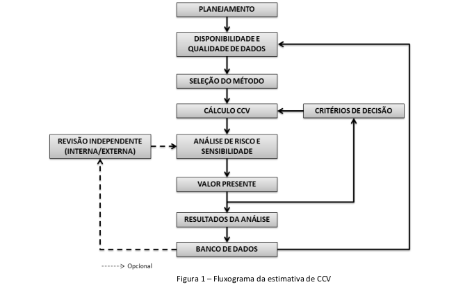
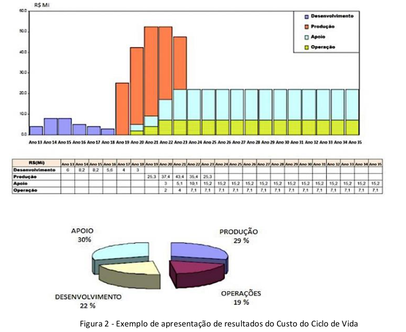

# MD44-M-02 - Capítulo III - Processo para o gerenciamento do custo do ciclo de vida

Manual de boas práticas de Custos do Ciclo de Vida de Sistemas de Defesa

## Página 21

### 3.1 Diretrizes Gerais

3.1.1 O CCV de um SD é estimado para suprir o déficit de informação de um tomador de decisão sobre os custos do CV de um SD. Tal estimativa pode atender aos seguintes propósitos:

a) selecionar alternativas ou soluções para a obtenção de um SD;
b) negociar, monitorar e controlar preços e custos do projeto/programa em todas as fases do CV do SD;
c) executar o planejamento orçamentário do projeto/programa;
d) informar às autoridades e gestores, os custos por ocasião da entrega do SD; e
e) possibilitar o gerenciamento de custos durante todo o CV do SD.

3.1.2 Existem dois contextos decisórios principais:

a) antes do início do projeto/programa - a estimativa do CCV será usada para avaliar a viabilidade econômico-financeira das alternativas identificadas e será um dos fatores que o tomador de decisão levará em conta ao escolher a melhor opção. As mensurações e risco originários do Mapa de Riscos, segundo cada fase do CCV, estabelecem um intervalo de risco associado a cada valor esperado das fases de projeto; e

b) após o início do projeto/programa - a estimativa de CCV auxiliará no delineamento dos requisitos do SD e será a base para o gerenciamento de custos do projeto/programa até o seu encerramento.

3.1.3 O gestor será o responsável pela equipe que realizará o cálculo do CCV do SD, estando presente nos momentos iniciais do ciclo de vida do SD, seja na condução da equipe do estudo de viabilidade ou na condição de gerente do projeto/programa.

3.1.4 As informações geradas pelo CCV contribuem para que os gerentes possam tomar as melhores decisões sobre despesas futuras, gestão e alocação dos recursos existentes, determinação dos fatores de custo associados ao desempenho, indicadores, requisitos do usuário principal, opções de aquisição e avaliação de oportunidades de redução de custos. Uma estimativa realista dos custos projetados aumenta a probabilidade de sucesso de um projeto/programa.

## Página 22

3.1.5 O processo típico de CCV pode ser ilustrado no fluxograma a seguir. A Figura 1 ilustra as etapas críticas de sua estimativa.

Figura 1 – Fluxograma da estimativa de CCV

3.1.6 Assim, o gerenciamento do CCV de um SD pode ser dividido em três etapas, que são: Planejamento do Gerenciamento de Custos; Estimativa do CCV; e Monitoramento e Controle.

### 3.2 Planejamento do Gerenciamento

3.2.1 A padronização de processos é fundamental para garantir a coerência e consistência dos dados coletados. Sendo assim, é necessário estabelecer um Plano de Gerenciamento de CCV (PGCCV) do SD para orientar e facilitar o trabalho de estimativa e gerenciamento do CCV. A elaboração do PGCCV é realizada com base nas informações disponíveis sobre o SD, situação em que se estabelecem os procedimentos, as premissas e as restrições para o planejamento, gerenciamento, monitoramento e controle dos custos.

## Página 23

3.2.2 É importante considerar que, nesse momento do planejamento, as informações podem ser
incompletas. Logo, a finalidade do plano é prover orientações iniciais para as estimativas de CCV e atualizá-las, conforme o incremento da maturidade das informações.

3.2.3 São informações que constam em um PGCCV:

a) o modelo de EAC que será utilizada ao longo do CV;

b) o procedimento pelo qual serão coletados e gerenciados os dados;

c) as bases, critérios, qualificação e fontes utilizadas nas estimativas (ex. data de referência, moedas, taxas de câmbio etc.);

d) as unidades de medida que serão utilizadas para cada um dos recursos (homem-hora, tonelada, preço global etc.);

e) o nível de detalhamento de categorias e elementos de custo (entregas, pacotes de trabalho e atividades);

f) as técnicas de estimativas que serão utilizadas;

g) as orientações para o registro das memórias de cálculo; e

h) o local onde serão armazenados os documentos gerados.

3.2.4 Mais detalhes sobre as informações recomendáveis em um PGCCV são apresentados no Anexo C (Estrutura Básica do Plano de Gerenciamento do Custo de Ciclo de Vida - PGCCV), deste Manual.

3.2.5 São consideradas boas práticas no planejamento do CCV:

a) compor equipe multidisciplinar, experiente e capacitada, cujas responsabilidades estejam claramente definidas;

b) identificar o propósito da estimativa e o seu escopo. Assim, será mais fácil a determinação de um SD;

c) definir a composição do escopo e seus requisitos;

d) garantir que o PGCCV possua cronogramas e responsabilidades claramente definidas; e

e) prevenir erros e mal entendidos para o conteúdo do projeto, além de ser a base ao longo da estimativa de CCV.

## Página 24

### 3.3 Estimativa do CCV para SD

O processo de estimativa de CCV será detalhado a seguir e, no Capítulo IV, serão apresentadas as técnicas de estimativas. Será abordada, majoritariamente, a estimativa tipo Bottom-Up, por ser o método de maior complexidade para execução, tendo em vista que decompõe o SD até o seu nível mais pormenorizado. Entretanto, é muito comum o uso simultâneo de diferentes técnicas durante a realização de uma estimativa de custo de um SD. Consideram-se boas práticas para estimar o CCV de SD, a execução das ações contidas nos tópicos subsequentes.

#### 3.3.1 Definição do objetivo da estimativa.

3.3.1.1 Para se definir o objetivo da estimativa, é de suma importância que o estimador de custos entenda a necessidade do solicitante, uma vez que tais custos estarão vinculados aos dois contextos decisórios mencionados no item 3.1.2.

3.3.1.2 Recomenda-se que a estimativa de CCV inclua todos os custos de concepção,desenvolvimento, produção, operação, apoio e desfazimento, sejam eles internos à organização ou frutos de contratos externos.

#### 3.3.2 Desenvolvimento do planejamento da estimativa.

3.3.2.1 O planejamento adequado de uma estimativa de custos é composto por uma equipe multidisciplinar. Recomenda-se que os principais conhecimentos de interesse incluam as áreas de economia, orçamento, engenharia, matemática, ciência da computação, estatística, contabilidade, comunicação, assuntos públicos e governamentais, entre outras julgadas relevantes pelo gestor. A quantidade e a capacitação de pessoal podem variar de acordo com a necessidade do programa.

3.3.2.2 Sugere-se que a equipe crie um cronograma para o desenvolvimento da estimativa, incluindo marcos realistas e considerando possíveis imprevistos.

3.3.2.3 Recomenda-se atenção para a constante necessidade de capacitação da equipe, haja vista que tal fator é essencial para a confiabilidade das estimativas.

3.3.2.4 O tempo e os recursos humanos são fatores que estão diretamente relacionados à qualidade da estimativa. Quanto maior for o nível de detalhes, mais tempo e pessoal será necessário à elaboração da estimativa.

## Página 25

3.3.2.5 Cada sistema possui características físicas e de desempenho únicas, devendo os analistas conhecê-las antes de desenvolver uma estimativa de custo.

#### 3.3.3 Determinação da estrutura da estimativa.

3.3.3.1 Recomenda-se definir uma EAC que seja padronizada e orientada às características do produto e que corresponda aos níveis de CCV estabelecidos no PGCCV.

3.3.3.2 A EAC desmembra o valor total estimado em partes menores e mais específicas com a
finalidade de facilitar o gerenciamento.

3.3.3.3 A prática comum é que a configuração inicial da EAC passe por aprimoramentos sucessivos à medida que o SD avança em seu CV e mais informações são conhecidas e esclarecidas. Logo, a EAC pode ser considerada um documento dinâmico.

3.3.3.4 Recomenda-se a elaboração de descrições detalhadas dos elementos de custos da EAC. A quantidade de níveis de sua estrutura depende da complexidade, dos riscos existentes e do nível de controle exigido no SD.

3.3.3.5 Sugere-se que cada FS padronize uma EAC de acordo com a natureza e ambiente operacional de cada SD, pois isso permitirá o compartilhamento de dados entre os programas.

#### 3.3.4 Distribuição das atividades de cada elemento da EAC 

3.3.4.1 Uma vez que CV do SD inicia com um programa de obtenção do sistema, é de suma importância à distribuição de atividades na EAC. O modelo de tabela de cálculo de custos de atividade pode ser utilizado como referência, previsto no Anexo B, deste Manual.

3.3.4.2 Além do escopo do programa de obtenção do SD, sugere-se incluir as atividades referentes às demais fases de CV do sistema (operação, apoio e desfazimento), utilizando-se como base os elementos de custos contidos na EAC apresentada no Anexo A, deste Manual.

## Página 26

#### 3.3.5 Definição de regras e premissas básicas

3.3.5.1 De modo geral, as estimativas de custos são baseadas em informações limitadas e, portanto, dependem de suposições que tornem possível concluir a estimativa. Estas suposições são denominadas regras básicas e premissas.

3.3.5.2 As regras básicas e as premissas são conceitos distintos, embora muitas vezes sejam tratados de forma conjunta.

3.3.5.3 Regras básicas são definições que fornecem orientação à estimativa e minimizam conflitos de definição. Por exemplo, os requisitos representam regras básicas da estimativa de custos.

3.3.5.4 Premissas são julgamentos sobre condições passadas, presentes ou futuras postuladas como verdadeiras na ausência de prova contrária. Na ausência de referencial teórico e regras básicas, o analista é responsável por fazer suposições que permitem o desenvolvimento da estimativa. Ou seja, premissas são necessárias quando nenhuma regra básica foi fornecida. Portanto, é recomendável que o analista garanta que as premissas sejam baseadas em opiniões de especialistas. Algumas premissas influenciam fortemente o custo e podem ser utilizadas como entradas para as análises de sensibilidade e incerteza.

3.3.5.5 Como boa prática, considera-se que a estimativa de custo tenha todas as regras básicas e premissas utilizadas registradas e documentadas, prontas para consulta. É necessário demonstrar a lógica, as informações técnicas, os dados históricos que as suportam e os riscos associados aos elementos da EAC.

3.3.5.6 O conjunto de regras básicas e premissas permitem:

a) satisfazer os requisitos para os principais pontos de decisão do projeto;

b) tornar a estimativa mais completa, fidedigna e profissional;

c) fornecer dados e técnicas de estimativa úteis para outros estimadores de custos;

d) facilitar a reconstrução da estimativa quando os estimadores iniciais não estiverem mais disponíveis; e

e) fornecer uma base de dados para a estimativa de custos que documente áreas de risco
potencial.

## Página 27

#### 3.3.6 Coleta e Transformação de dados de CCV.

3.3.6.1 É recomendável a verificação dos procedimentos pelos quais serão coletados e gerenciados os dados e a credibilidade de suas fontes. Em seguida, efetivar a extração transformação e carga (ETL), de acordo com os critérios aplicáveis da contabilidade de custos, inflação e ajustes de quantidade.

3.3.6.2 O processo de ETL permite definir a qualidade e a forma com que os dados serão manipulados e é uma atividade crítica para o desenvolvimento de uma estimativa de custos confiável. Portanto, é importante que sejam planejados, com antecedência, tempo e recursos suficientes para essas tarefas.

3.3.6.3 Durante a coleta, recomenda-se que sejam documentadas todas as informações pertinentes, incluindo uma avaliação da confiabilidade, precisão e rastreabilidade dos dados. Esse procedimento é importante para a utilização desses dados em estimativas futuras.

3.3.6.4 A estimativa pode ser baseada em um registro histórico de outras estimativas de custos ou em experiências reais de outros projetos que sejam similares.

3.3.6.5 Os dados de custos normalmente são ajustados com um índice adequado, como a taxa de inflação e de câmbio real, quando aplicável, para que as comparações e projeções sejam válidas. 

3.3.6.6 A base de dados é parte integrante fundamental de toda estimativa de custos, influenciando sua qualidade e confiabilidade.

#### 3.3.7 Desenvolvimento da estimativa de custos.

3.3.7.1 Para cada atividade definida, sugere-se identificar os recursos alocados conforme exemplificado no Anexo B, deste Manual.

3.3.7.2 Na identificação do recurso, informa-se qual a unidade de medida considerada e a quantidade empregada. Nas fases que são cobertas pelo Projeto de Obtenção do SD, esses dados provavelmente já estarão disponíveis. Entretanto, para a fase de “Custo Total de Operação e Apoio” e para a fase de “Custo Total de Desfazimento”, esses recursos poderão ser estimados.

3.3.7.3 Com a definição das atividades e dos recursos empregados, identifica-se o tempo de duração. Em qualquer caso, de acordo com o nível de informação disponível, a escolha da técnica de estimativa que mais se adeque ao cálculo do tempo das atividades pode ser feita.

## Página 28

3.3.7.4 Os custos dos itens podem ser obtidos por uma simples pesquisa de mercado ou pela utilização de umas das técnicas de estimativa. As estimativas de custos geralmente são elaboradas e registradas de maneira que um revisor independente possa ser capaz, não obstante de ter participado do processo, de recriar e seguir a estimativa, efetuando todos os cálculos e obtendo aos mesmos resultados.

3.3.7.5 Este procedimento garante que:

a) os custos estejam expressos em moeda corrente atualizada;

b) seja desenvolvido um modelo de custo com uso da melhor metodologia aplicável, a partir dos dados coletados e incluindo todas as suas premissas;

c) a correta distribuição dos custos conste no cronograma do projeto;

d) não haja erros como contagem dupla ou custos omitidos;

e) sejam realizadas verificações cruzadas dos direcionadores de custos; e

f) o modelo seja atualizado conforme disponibilidade de novos dados, comparando-se os resultados com as estimativas anteriores.

#### 3.3.8 Análise de Sensibilidade.

3.3.8.1 A primeira etapa de uma análise de sensibilidade requer que os analistas identifiquem os fatores que podem sofrer variação relevante. Recomenda-se que as fontes de variação sejam documentadas e rastreáveis. A incerteza sobre os valores dos parâmetros técnicos é comum no início do projeto e tende a reduzir de acordo com o desenvolvimento de um programa. Muitas suposições iniciais acabam sendo imprecisas, portanto é importante identificar a sensibilidade da estimativa de custo total às mudanças nos fatores.

3.3.8.2 Considera-se uma boa prática a integração da análise de sensibilidade à estimativa de custos, pois sua condução facilita a identificação de suposições com grande influência no projeto. Ela tem como objetivo recalcular a estimativa de custo com diferentes valores em parâmetros importantes, possibilitando comparar os resultados com a estimativa original. Se uma pequena mudança no valor de um fator gerar uma grande alteração na estimativa de custo geral, os resultados são considerados sensíveis a esse fator.

3.3.8.3 A análise de sensibilidade normalmente é desenvolvida em elementos de alto custo e risco. Por exemplo, tal análise pode avaliar como a estimativa varia com diferentes suposições sobre os valores de confiabilidade do sistema ou como os custos variam em resposta ao aumento do peso do SD.

3.3.8.4 Recomenda-se realizar um estudo aprofundado sobre os fatores que têm maior efeito na estimativa de custo, de modo a garantir que o melhor valor seja usado.

## Página 29

#### 3.3.9 Análise de Riscos e Incertezas

3.3.9.1 É essencial entender que os dados de custos utilizados em uma estimativa são incertos. O resultado obtido não é o único possível. Conduzir uma análise de riscos permite examinar o efeito de incertezas e possíveis resultados distintos.

3.3.9.2 De forma ideal, para análise de riscos e incertezas, recomeda-se:

a) investigar os principais riscos associados a cada elemento de custo da EAC;

b) investigar a correlação entre os elementos de custos;

c) identificar a probabilidade de ocorrência de cada evento de risco e respectivo impacto para a estimativa de CCV ou para o gerenciamento de CCV do SD;

d) quando possível, precificar os riscos associando valores a cada elemento de custo; e

e) realizar análises periódicas de riscos e incertezas à medida que a estimativa de custo for atualizada, visando refletir o progresso e as alterações relativas ao risco do projeto.

3.3.9.3 A análise de risco poderá ser realizada durante todo o CV. Dessa forma, será obtida uma melhor compreensão do risco em relação ao custo, antes do início da próxima fase.

3.3.9.4 As etapas para realização da análise de riscos, bem como ferramentas e metodologias que podem ser implementadas, poderão ser detalhadas em manuais ou normas específicas sobre gestão de riscos, no âmbito do MD ou de cada FS.

## Página 30

#### 3.3.10 Documentação da estimativa 

Esse procedimento consiste em:

a) documentar todas as etapas realizadas para desenvolver a estimativa, permitindo que um analista de custos não familiarizado possa recriá-la e produzir resultado equivalente;

b) registrar o objetivo da estimativa e a equipe que a preparou;

c) incluir informações sobre o programa de obtenção do SD, seu cronograma, as regras e premissas utilizadas para criar a estimativa;

d) apresentar o CCV do SD por fases;

e) descrever, de forma detalhada, a metodologia de estimativa e a lógica usada para calcular o custo de cada elemento da EAC; e

f) Descrever os resultados das análises de risco, incerteza e sensibilidade e se alguma contingência foi considerada.

3.3.11 Após refinar as informações de custos, recomenda-se atualizar o PGCCV que poderá ser ajustado durante todo o ciclo de vida do SD e concluído após o desfazimento do SD.

3.3.12 A EAC, inicialmente, não demonstra o fluxo de desembolso de recursos financeiros no tempo. Assim, os custos podem ser lançados em valor futuro, aplicando-se atualização monetária. Com base em todas as informações geradas, elabora-se uma planilha contendo os custos previstos para o SD, cuja soma total anual reflete o desembolso financeiro para o referido exercício, formando a linha de base do CCV, que servirá para o monitoramento e controle dos custos do SD no decorrer de seu CV.

3.3.13 Toda a documentação envolvida para as estimativas, incluindo dados de origem, estatísticas, cálculos detalhados, resultados e relatórios com as justificativas/explicações da adoção do método ou referência, poderá ser anexada ao PGCCV.

3.3.14 Após a atualização do PGCCV, recomenda-se a divulgação do conteúdo do mesmo para as
partes interessadas. A comunicação dos resultados de forma simples e clara aumenta a
confiabilidade no processo.

3.3.15 Um grande desafio no contexto da suportabilidade de projetos estratégicos, ou de projetos de grande porte, no âmbito das FS é a progressiva redução de recursos orçamentários no decorrer do CV dos SD. Tais ocorrências podem prejudicar o desempenho do projeto, acarretar em multas por descumprimentos contratuais e tornar ineficientes os investimentos empenhados no início dos projetos.

3.3.16 Nesse contexto, é ideal que, por ocasião das conclusões das primeiras estimativas de CCV e do PGCCV do SD, os Gerentes de Projeto garantam a publicidade e aplicabilidade dos dispositivos legais para que os recursos orçamentários sejam assegurados no CV do SD, adotando medidas para que o projeto possa ser suportado pelo maior período possível. Diante das características da definição do orçamento público, busca-se a inclusão dos custos esperados nas leis orçamentárias aplicáveis.

## Página 31 

3.3.17 Os riscos associados a possíveis restrições orçamentárias podem ser avaliados na concepção do projeto. Portanto, medidas de controle podem ser previstas para mitigação desses riscos, especialmente no tocante a cláusulas contratuais que impactem o desempenho do fornecedor e multas por mudança de escopo.

3.3.18 A Figura 2 mostra um exemplo de apresentação de resultados de uma estimativa de CCV.

Figura 2 - Exemplo de apresentação de resultados do Custo do Ciclo de Vida

### 3.4 Monitoramento e Controle do Custo de Ciclo de Vida para Sistemas de Defesa 

3.4.1 Controlar o CCV é o processo de monitoramento dos custos do SD, para atualização do seu orçamento, e gerenciamento das alterações na linha de base de custos. É um processo realizado ao longo de todo o CV do SD.

## Página 32 

3.4.2 O controle de custos inclui:

a) assegurar que desembolsos de custos não excedam os recursos financeiros autorizados por período e por componente da EAC;

b) monitorá-los e entender as variações com relação à linha de base de custos, realizando gestões que impactem em mudanças; e

c) informar as partes interessadas sobre as alterações aprovadas e seus respectivos custos.

3.4.3 A atualização da estimativa de custos inclui:

a) documentação de todas as mudanças que afetam a estimativa geral do programa para que as diferenças das estimativas anteriores possam ser rastreadas;

b) mudanças de requisitos ou marcos importantes, conciliando os resultados com o orçamento do programa;

c) utilização dos custos reais à medida que estiverem disponíveis durante o CV do programa;

d) registro dos custos reais e outras informações técnicas pertinentes, para que possam ser usados ara estimar programas futuros; e

e) avaliação e registro das lições aprendidas à medida que o programa avança. 

3.4.4 Após a conclusão dessas atividades, recomenda-se que o estimador documente os resultados, visando avaliar a qualidade da estimativa e a sua evolução no programa.