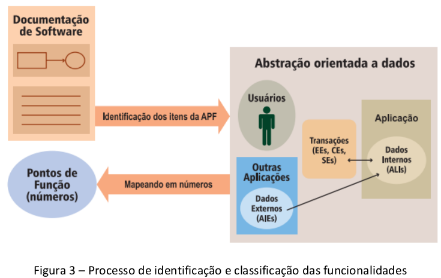
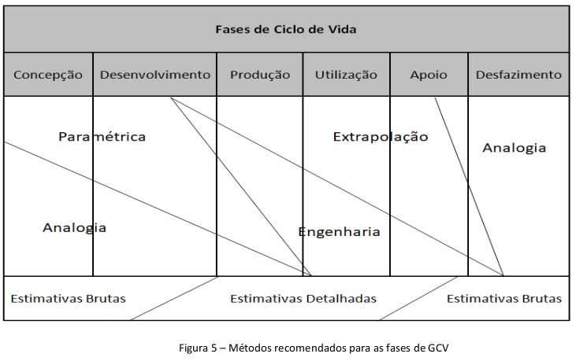

# MD44-M-02 - Capítulo IV - Métodos para estimativa do custo de ciclo de vida

Manual de boas práticas de Custos do Ciclo de Vida de Sistemas de Defesa

## Página 33

### 4.1 Desenvolvimento de Estimativas

4.1.1 O desenvolvimento de estimativas confiáveis de CCV é vital para o processo de tomada de decisão e para o desenvolvimento de um planejamento realista. O propósito deste Capítulo é fornecer boas práticas que auxiliem os estimadores de custo no desenvolvimento de estimativas confiáveis de CCV.

4.1.2 As referências para este Capítulo são as publicações:

a) GAO Cost Guide (guia publicado pelo U.S. Government Accountability Office - GAO); e

b) ALCCP-1.1 NATO Life Cycle Costs Common Methodology (Manual publicado pela OTAN).

4.1.3 Importância e desafios nas estimativas de CCV.

4.1.3.1 Estimativas confiáveis de custos exigem tempo e disponibilidade de dados de alta qualidade para seu desenvolvimento. Limitações desses fatores podem gerar os seguintes problemas:

a) premissas mal definidas;
b) ausência de documentação de suporte;
c) ausência de comparação com dados históricos;
d) coleta de dados inadequada e uso de dados não significativos ou desatualizados; e
e) uso de metodologias inadequadas de estimativa.

4.1.3.2 Neste contexto, a construção, manutenção e disponibilização de bancos de dados de custos históricos são primordiais para o desenvolvimento de estimativas de CCV.

4.1.4 Tipos de estimativas

Existem diferentes tipos de estimativas, tais como as descritas abaixo:

a) estimativas de CCV – Normalmente, é de responsabilidade do Gerente do Programa. Costuma cobrir toda a vida útil do SD e ser distribuída por ano fiscal, desde a fase de obtenção até a fase de descarte.

## Página 34 

b) estimativas para Proposta Orçamentária – Normalmente cobre períodos orçamentários e costuma ser aplicado para anos fiscais. Recomenda-se levar em consideração à correção pelo índice de inflação oficial do país e identificar os tipos de centros de custos envolvidos.

c) estimativas de Ordem Aproximada de Magnitude – É desenvolvida quando uma estimativa rápida é necessária e poucos detalhes são disponíveis. Normalmente é baseada em informações históricas, suporta análise de cenários, desenvolvida para uma fase do ciclo de vida.

d) estimativas de Custos na Conclusão – É uma estimativa que conta com a previsão de custo para completar o trabalho autorizado.

4.1.5 Características de uma estimativa confiável

4.1.5.1 Uma estimativa de custo confiável é aquela que apresenta características de abrangência, documentação adequada, precisão e fidedignidade, as quais possuem os seguintes aspectos.

a) abrangência:

i. inclui todos os custos do ciclo de vida;

ii. baseia-se em uma descrição de linha de base técnica que define completamente o CV do SD;

iii. possui uma EAC rastreável e em um nível de detalhe apropriado para garantir que os elementos de custo não sejam omitidos nem duplicados; e

iv. apresenta as regras básicas e premissas que influenciam os custos.

b) documentação Adequada:

i. mostra os dados de origem utilizados, a confiabilidade dos dados e a metodologia de estimativa usada para derivar o custo de cada elemento;

ii. detalha como a estimativa foi desenvolvida para que um analista de custos não familiarizado com o programa possa entender a metodologia e replicá-la; 

iii. descreve a linha de base técnica e seus dados de maneira consistente com a estimativa de custo; e

iv. fornece registros de que a estimativa de custo foi revisada e aceita pela administração.

c) precisão:

i. analisa a melhor metodologia a partir dos dados coletados para cada elemento da EAC;

ii. efetua o ajuste adequado para o valor presente e é atualizada regularmente para garantir que reflita as mudanças no programa e os custos reais;

iii. registra as variações entre os custos planejados e reais; e

iv. baseia-se em um registro histórico de estimativa de custos e experiências reais de outros programas efetivamente similares.

d) fidedignidade:

i. inclui uma análise de sensibilidade que identifica uma gama de custos possíveis com base em suposições principais, parâmetros e entradas de dados;

ii. inclui uma análise de riscos e incertezas; e

iii. emprega verificações cruzadas – ou metodologias alternativas – nos principais elementos de custo para validar os resultados.

## Página 35

4.2 Apresentação de Métodos para Estimativas

4.2.1 O objetivo deste tópico é fornecer um entendimento comum dos métodos de estimativas de CCV e uma diretriz com boas práticas para a aplicação dos quatro métodos comumente utilizados para estimar custos:

a) por Analogia;

b) extrapolação;

c) paramétrico; e

d) engenharia.

4.2.2 Estes métodos podem fornecer estimativas com uma visão holística de CCV que atendam a diferentes tipos de estudos e níveis de recursos disponíveis. Entretanto, ressalta-se que o conhecimento das estimativas não fica restrito a estas ferramentas.

4.2.3 Estimativa de CCV por Analogia

4.2.3.1 O método por analogia leva em consideração que a maioria dos novos programas evolui de projetos já implantados, que tiveram novos recursos adicionados ou que simplesmente representam uma nova combinação de componentes existentes. Assim, é uma alternativa célere, viável e adequada para ser utilizada em marcos iniciais, em comparações de estimativas de outros métodos ou em programas ainda prematuramente definidos.

4.2.3.2 Esse método compara um novo SD com um ou mais sistemas existentes, tendo como fator chave a seleção de dados históricos de componentes, subsistemas ou programas inteiros que mais se assemelhem e possuam correlação com o novo sistema.

## Página 36

4.2.3.3 Algebricamente, o método por analogia estabelece uma taxa que representa o nível da correlação entre os sistemas, que pode ser obtida.

**Custo do Novo Sistema = (Fator de Escala) × (Custo Histórico do Sistema)**

4.2.3.4 A título de exemplo, consideram-se dois sistemas, com suas respectivas características apresentadas na Tabela 1. O Sistema A é antigo, enquanto o Sistema B é novo. São conhecidos os dados históricos de custo do Sistema A e o tamanho do software do Sistema B. O objetivo é estimar o esforço de desenvolvimento de software para o Sistema B. Utiliza-se o Sistema A como referência para a analogia ou, mais especificamente, o parâmetro homem-hora (HH) de esforço por linhas de código fonte em A como multiplicador análogo a ser aplicado ao Sistema B.

#### Tabela 1 – Comparação de características de dois sistemas análogos

| Sistema | HH para desenvolvimento | Tamanho do software (nº de linhas de código fonte) |
|-------|-------------------------|----------------------------------------------------|
| A     | 684                     | 18.600                                             |
| B     | ?                       | 13.700                                             |

4.2.3.4.1 Sendo assim, a quantidade de HH por pontos de função do Sistema **A** é dada por:

**Fator de Escala (Taxa de Correlação) = (HH) / (Pontos de Função)**

| Sistema | HH por linhas de código fonte |
|-------|--------------------------------|
| A     | 684 / 18.600 = **0,037**       |

4.2.3.4.2 Por analogia, consegue-se estimar o HH para o desenvolvimento do software do Sistema **B** multiplicando-se o fator de escala encontrado 0,037, pela quantidade de linhas de código fonte do Sistema **B**, de 13.700.

| Sistema | HH por linhas de código fonte |
|-------|--------------------------------|
| B     | 0,037 × 13.700 = **504**       |

## Página 37

4.2.3.5 Com o intuito de reforçar o caráter exemplificativo deste manual, apresenta-se um segundo exercício do método da analogia. Considerando-se dois sistemas: Sistema Existente e Sistema Novo, o objetivo é estimar o custo do motor para o Sistema Novo conhecendo sua potência. Isso é feito usando o Sistema Existente como analogia. A Tabela 2 apresenta a aplicação da metodologia, bem como as características de ambos os sistemas.

| Parâmetro         | Sistema Existente | Sistema Novo | Custo do Sistema Novo                 |
|-------------------|-------------------|--------------|---------------------------------------|
| Motor             | F-100             | F-200        |                                       |
| Potência (lbs)    | 12.000            | 16.000       | = (5,2 / 12.000) × 16.000 = 6,9 milhões |
| Custo (Milhões)   | 5,2               | ?            |                                       |

*Tabela 2 – Exemplo do método da analogia.*

4.2.3.6 O método pressupõe uma relação diretamente proporcional linear entre o custo e a potência do motor, pelo fato de existir de uma motivação que justifique que o custo de um motor seja diretamente proporcional a sua potência. Portanto, ao utilizar o método de analogia, é importante que o estimador pesquise e discuta a razoabilidade dos direcionadores técnicos com especialistas para determinar se eles são realmente significativos.

4.2.3.7 A Tabela 3 apresenta os pontos fortes e fracos do método:
| Forças                                                                                                         | Fraquezas                                                                                                                          |
| -------------------------------------------------------------------------------------------------------------- | ---------------------------------------------------------------------------------------------------------------------------------- |
| a) Tem como base dados históricos;                                                                             | a) Pode haver dificuldades na identificação de uma analogia apropriada;                                                            |
| b) Pode ser desenvolvido de forma rápida e direta durante a fase de concepção, por possuir menor detalhamento; | b) Por se tratar de uma estimativa com base em dados históricos, pode não representar fielmente o problema que está sendo tratado; |
| c) Facilmente compreensível;                                                                                   | c) Possui elevada subjetividade, por depender de extrapolação e/ou julgamento de especialistas para ajuste de fatores técnicos.    |
| d) Pode ser aplicada antes de se conhecer detalhadamente os requisitos do sistema;                             |                                                                                                                                    |
| e) Requer poucos dados;                                                                                        |                                                                                                                                    |
| f) Boa rastreabilidade de auditoria.                                                                           |                                                                                                                                    |

Tabela 3 - Forças e Fraquezas da estimativa de CCV por analogia

## Página 38

### 4.2.4 Estimativa de CCV por Extrapolação

4.2.4.1 O método de extrapolação é utilizado para estimar custos futuros de um determinado SD a partir de custos anteriores e/ou atuais, de um mesmo SD, em semelhança ao método por Analogia.

4.2.4.2 A incerteza associada a este método tem base na avaliação técnica da semelhança entre a versão anterior do SD e o modelo atual considerado. Quanto mais semelhanças e dados disponíveis, mais precisa será a estimativa.

4.2.4.3 Um resumo do método de estimativa de custo por extrapolação, com os pontos fortes e
fracos de sua aplicação, é apresentado na Tabela abaixo.

| Forças                                                                 | Fraquezas                                                                 |
|------------------------------------------------------------------------|----------------------------------------------------------------------------|
| a) Tem como base dados históricos;                                     | a) Pode carregar elevada subjetividade, visto que depende do julgamento de especialistas para ajuste de fatores técnicos; |
| b) Pode ser aplicado a tempo, materiais e custos totais;              | b) Depende da confiabilidade dos dados históricos.                         |
| c) Facilmente compreensível;                                           |                                                                            |
| d) Caso o grau de extrapolação seja alto, é considerada uma boa trilha de auditoria; |                                                                            |
| e) A extrapolação pode ser feita em diferentes níveis de detalhes, a depender da disponibilidade dos dados. |                                                                            |

*Tabela 4 – Forças e fraquezas da estimativa de CCV por extrapolação.*

### 4.2.5 Estimativa de CCV por Parametrização

4.2.5.1 No método paramétrico, é investigada a relação estatística entre os custos históricos e as características físicas e de desempenho do projeto. Havendo dados históricos robustos e de alta qualidade, a metodologia pode ser utilizada para determinar os direcionadores de custos e fornecer resultados estatísticos para atender aos requisitos do novo programa.

4.2.5.2 Ao contrário do método por Analogia, a estimativa paramétrica depende de dados de mais de um programa de referência. A confiabilidade nos resultados depende da validade nas relações entre o custo e os atributos físicos ou características de desempenho. Usando este método, o estimador de custos pode apresentar as estatísticas relacionadas, as conclusões e fontes para os dados.

## Página 39 

4.2.5.3 Os tipos de características físicas usadas para estimativas paramétricas incluem, por exemplo, peso, potência e linhas de código de software de um SD. Características do projeto e do desempenho incluem planos de manutenção, cronogramas de teste e avaliação, medidas de desempenho técnico e tamanho da equipe.

4.2.5.4 O objetivo da estimativa paramétrica é criar uma relação de estimativa de custo, também conhecida como Cost Estimating Relationship (CER), estatisticamente válida, usando dados históricos. A CER paramétrica pode, então, ser utilizada para estimar o custo do novo programa inserindo suas características específicas.

4.2.5.5 O procedimento para realizar a estimativa consiste em ajustar estatisticamente bases de dados históricos e substituir os valores obtidos dos parâmetros x₁, x₂, … xₙ na função, buscando o conjunto de coeficientes β₀, β₁, … βₙ que minimizam o erro ε. Na estimativa de custo de uma aeronave, por exemplo, as variáveis consideradas para sua composição podem ser o peso, velocidade, área de asa da aeronave e o “ε” representa o erro oriundo da diferença entre os dados e os resultados obtidos pelas funções.

Custo = β₀ + β₁·x₁ + β₂·x₂ + … + βₙ·xₙ + ε

Para tanto, os seguintes aspectos podem ser adotados, de modo a elaborar a referida equação:

4.2.5.5.1 Padronizações

A padronização de dados é a aplicação de ajustes em dados brutos, de forma a obter dados
consistentes e comparáveis para serem utilizados nas estimativas. É realizada de três maneiras:

a) conteúdo - garantia de que se tenha uma divisão de trabalho idêntica entre a EAP histórica e a nova;

b) quantidade - garantia de comparação de quantidades iguais de itens ou de duas linhas de produção; e

c) inflação - retirada dos efeitos da inflação ao comparar os custos dos bens e serviços no decorrer do tempo.

## Página 40

#### 4.2.5.5.2 Matriz de Correlação

Ao gerar a matriz de correlação usando os dados de custos e os dados técnicos, observa-
se que essa matriz apresenta a correlação dois a dois entre as variáveis analisadas, através de um índice de correlação. Esse índice varia entre -1 e 1 e quanto maior em módulo, maior é a força, ou associação linear, entre as variáveis. Se positivo indica que a relação é diretamente proporcional, se negativo, inversamente proporcional. Se o valor for 0, indica que não há relação linear, podendo haver uma relação não linear. Considera-se que se o índice de correlação for maior que 0,7, as variáveis possuem alta correlação. Pela análise da matriz de correlação, o estimador poderá verificar:

a) variáveis técnicas com alta correlação com a variável de custo - que possivelmente irão gerar boas regressões. No entanto, deve-se evidenciar a característica qualitativa deste tipo de análise, constituindo-se meramente um prescrutador de variáveis. Na busca por regressores, muitas hipóteses de variáveis explicativas podem ser alvitradas, no entanto, o que se obtém como modelo representativo é resultado de teste estatístico aplicado as variáveis finais, em conjunto. Mais importante do que estabelecer conexões a priori é a validação estatística do modelo, conforme literatura aplicável.

b) variáveis técnicas, que poderão ser usadas como preditoras, podem apresentar uma série de características que violam as hipóteses básicas. Estas hipóteses descrevem as condições necessárias e suficientes para a utilização dos estimadores de mínimos quadrados obtidos, sem comprometer as características de não viés, eficiência e consistência. Para tanto existem testes estatísticos na literatura de regressão que descrevem os procedimentos a serem executados de modo a corrigir tais violações.

#### 4.2.5.5.3 Regressões

a) para desenvolver as CER, os estimadores costumam determinar os direcionadores que mais influenciam o custo. A CER resultará na relação existente entre o custo (variável dependente, Y) e seus vários direcionadores (variáveis independentes: X 1 , X2 , X n). A matriz de correlação traz um subsídio estatístico para a determinação de uma relação linear, permanecendo, no entanto, a importância de se consultar opiniões de especialistas.

b) se a relação entre o custo e os direcionadores for linear, as variáveis podem ser modeladas por uma regressão linear. Caso contrário, uma regressão não linear pode ser usada. A Tabela 5 apresenta alguns modelos possíveis de serem usados. Na maioria dos casos, o modelo mais empregado é a regressão linear múltipla.

## Página 41
| Modelo                      | Características / CER                                                                 | Tipo    |
|----------------------------|----------------------------------------------------------------------------------------|---------|
| Linear de 1ª ordem         | Curva de tendência linear: y = β₀ + β₁x + ε                                             | Simples |
| Linear de 1ª ordem         | Curva de tendência linear: y = β₀ + β₁x₁ + β₂x₂ + ε (sem interação) Curva de tendência linear: y = β₀ + β₁x₁ + β₂x₂ + β₃x₁x₂ + ε (com interação) | Múltipla |
| Não-linear                 | Curva de tendência não-linear: y = β₀ + β₁(x₁)ᵖ¹ + β₂(x₂)ᵖ² + … + βₙ(xₙ)ᵖⁿ + ε           | Múltipla |
| Polinomial de 2ª e 3ª ordem | Curva de tendência polinomial ou curvilínea. Quando p = 2: y = β₀ + β₁x + β₂x² + ε Quando p = 3: y = β₀ + β₁x + β₂x² + β₃x³ + ε | Simples |
| Polinomial de 2ª e 3ª ordem | Curva de tendência polinomial ou curvilínea. Quando p = 2: y = β₀ + β₁x₁ + β₂x₂ + β₃x₁² + β₄x₂² + ε (sem interação) y = β₀ + β₁x₁ + β₂x₂ + β₃x₁² + β₄x₂² + β₅x₁x₂ + ε (com interação) | Múltipla |
| Logarítmica                | Curva de tendência logarítmica: y = c · ln(x) + β₀ + ε. Usada quando a taxa de variação aumenta ou diminui rapidamente e depois se estabiliza. Também empregada para descrever variações percentuais ou mitigar heterocedasticidade. | Simples |
| Potência                   | Curva de tendência de potência: y = c · xᵇ + β₀ + ε. Usada com conjuntos de dados que comparam medidas que aumentam a uma taxa específica. | Simples |
| Exponencial  | Curva de tendência exponencial: y = c · e^(b·x) + β₀ + ε. Usada quando os valores dos dados sobem ou caem com altas taxas de variação. | Simples |

Tabela 5 - Exemplos de modelos que podem ser usados em regressões.

## Página 42

#### 4.2.5.5.4 Observações inexatas ou que não pertencem à população (Outliers)

Considerando-se que os dados obtidos mediante ensaios repetidos sob as mesmas condições podem gerar ou não dados pertencentes à distribuição de probabilidade da população que se pretende, existe o risco de que se observem dados não condizentes com o comportamento esperado para determinada população. Na mesma toada da elaboração de um teste de hipóteses, realizado com um viés mais qualitativo, a análise de dispersão dos dados em muitos casos se mostra funcional do ponto de vista de identificação de possíveis outliers. Nesse contexto, cabe ao estimador verificar a presença desses outliers e fazer o julgamento sobre a sua manutenção no conjunto de pontos da regressão, evitando enviesá-la.

#### 4.2.5.5.5 Validação da regressão

A validação da regressão, utilizando um teste de hipóteses, ajuda a evitar o erro de se usar uma relação estatisticamente sem significância, por não representar adequadamente o parâmetro de interesse (custo). Assim, uma variável independente pode ser considerada insignificante se existir uma pequena probabilidade de seu coeficiente for igual à zero, indicando que não existe relação com o custo, podendo ser desconsiderada. Se a regressão falhar em algum dos testes, o estimador de custos pode rejeitar a regressão. Neste caso, é possível testar novas regressões com outras variáveis de interesse.

#### 4.2.5.5.6 Hierarquia das regressões

Após aplicar os testes de hipóteses, o agente estimador poderá analisar e escolher a regressão que será usada na estimativa. Uma boa prática seria a hierarquização para a escolha da regressão a ser utilizada, atribuindo preferência a:

a) maior força de associação entre as variáveis independentes e a variável dependente (custo);

b) utilizar os menores erros padrão. O desvio padrão é o desvio de seus pontos de dados em comparação com a média. Na análise de regressão, o erro padrão é esse desvio em comparação com sua linha de regressão. Em ambos os casos, são desejáveis menores resultados tanto para o desvio padrão como para o erro padrão; e

c) regressões que atendam melhor aos critérios de informação de Akaike e Scwarz, ou algum outro critério descrito na literatura aplicável como relevante do ponto de vista estatístisco para hierarquizar regressões.

## Página 43

#### 4.2.5.5.7 Cálculo da Variável Dependente (Custo)

Após a escolha da melhor regressão, poderá ser utilizado o valor do estimador do
coeficiente da variável dependente na equação para obter o custo associado. É importante
certificar-se de que o valor da variável dependente do sistema que se quer estimar esteja dentro (ou, pelo menos, não muito fora) do conjunto de dados da CER. Usar valores fora do intervalo dos dados que geraram a CER pode invalidar o relacionamento e distorcer os resultados.

4.2.5.5.8 A título de exemplo, considere que uma empresa prestadora de serviços de manutenção industrial deseja estimar os custos indiretos para o ano subsequente. Sabe-se, de anos anteriores, que as horas de mão-de-obra (β₁) e horas-máquina (β₂) são boas variáveis independentes (parâmetros) para se estimar os custos indiretos, por uma função linear do tipo Custo = α₀ + α₁β₁ + α₂β₂. Os coeficientes da função (α₀, α₁ e α₂) podem ser estimados mediante análise de regressão com base nos dados históricos (tanto da variável dependente quanto da variável independente). Considera-se que os coeficientes α₀, α₁ e α₂ assumem os valores $35.070, $5.090 e $40.471, respectivamente, o que implica em Custo = α₀ + α₁β₁ + α₂β₂ = $35.070 + $5.090 × β₁ + $40.471 × β₂. Depois dessa expressão, a empresa é capaz de estimar os custos indiretos para uma quantidade de horas de mão-de-obra (β₁) e horas-máquina (β₂).

4.2.5.6 O método de estimativa paramétrica é capaz de capturar grande parte de uma estimativa com informações limitadas, sendo razoável de se utilizar nas fases iniciais de um ciclo de aquisição, embora tal estimativa deva ser periodicamente revisada. Em contrapartida, além de um conjunto de dados estatisticamente significativo, é necessário que a CER incorpore dados atuais e apropriados, pois os níveis mais altos de exatidão de uma estimativa paramétrica dependem da relevância/qualidade dos dados e da validade do comportamento assumido entre as variáveis do modelo.

## Página 44

4.2.5.7 As forças e fraquezas da estimativa de CCV por parametrização são mostradas na Tabela 6.

| Forças | Fraquezas |
|------|-----------|
| a) É ajustada e validada por meio de dados históricos; | a) Normalmente difícil para terceiros entenderem as estatísticas associadas aos CER, bem como o comportamento do modelo; |
| b) É versátil e razoavelmente rápida, podendo ser derivada em qualquer nível em que os dados estejam disponíveis; | b) Impossível entender e associar o CER com os dados quando se utiliza de softwares; |
| c) Uma vez desenvolvido, o CER é uma excelente ferramenta para responder muitos “e se?” de forma rápida; | c) Para validação e aceitação, devem ser descritos os ajustes de dados, a seleção da documentação de dados, desenvolvimento de equações, estatísticas e conclusões; |
| d) Suporta análises de sensibilidade para os direcionadores de custos; | d) É normalmente difícil realizar a coleta apropriada de dados para gerar o correto CER, além de demandar tempo e custos consideráveis; |
| e) Se conduzida corretamente, apresentará pouco viés; | e) Redução da previsibilidade/credibilidade fora do intervalo de dados; |
| f) Boa trilha de auditoria respaldada por correlação lógica, pesquisa e metodologia científica. | f) Necessidade de validação formal e entendimento do comportamento do modelo. |

Tabela 6 - Forças e Fraquezas da estimativa de CCV paramétrica.

### 4.2.6 Estimativa de CCV por Engenharia (bottom-up)

4.2.6.1 Trata-se do método mais detalhado para implementação e, por isso, o mais demorado. É utilizado quando dados pormenorizados de projeto estão disponíveis para o SD. Assim, a estimativa de custos de engenharia é utilizada, principalmente, durante as etapas de contratação, produção e operação/suporte. Pode ser denominada, também, como estimativa bottom-up, ou de baixo para cima.

## Página 45

4.2.6.2 Nesse método, os componentes do SD são decompostos ao menor nível (como peças ou serviços), custeados separadamente e posteriormente agregados, resultando na estimativa do custo total do sistema. A premissa é que os custos presentes reais são bons preditores de custos futuros. Normalmente, os estimadores de custos trabalham com engenheiros para melhor
detalhamento das estimativas.

4.2.6.3 Os processos e etapas que constituem o método de estimativa de custo por engenharia são:

4.2.6.3.1 Seleção do método de estimativa de engenharia: recomenda-se que a maturidade do
projeto esteja avançada e que exista detalhamento de dados de custos, para que seja dividido em pacotes de trabalho.

4.2.6.3.2 Revisão da EAC e dados / taxas de custo disponíveis: o primeiro passo da estimativa é entender o escopo de trabalho de determinado item do EAC para que seja decomposto. É recomendada a consulta à um especialista para a garantia da integridade dos dados e consistência com outros pacotes de trabalho. Nessa etapa, o estimador entende os recursos necessários e analisa os dados de custos disponíveis para a aplicação de taxas, se necessário.

4.2.6.3.3 Desenvolvimento do modelo de custo: simultaneamente, o estimador prepara o modelo de custo do respectivo elemento da EAC. O modelo necessita de detalhamento em planilha, por especialistas, para cada tipo de recursos (mão de obra, materiais, equipamentos etc.). Os custos diretos são, então, somados aos custos indiretos e despesas gerais. Com a prontificação da EAC, observa-se uma visão completa do modelo, bem como taxas e quantidades necessárias para cada recurso.

4.2.6.3.4 Para a obtenção dos dados necessários no início do projeto, recomenda-se a identificação de fontes de informação consistentes para o seu desenvolvimento.

4.2.6.3.5 A estimativa do CCV é concluída após a definição dos custos, considerando uma margem de segurança e, posteriormente, a consolidação dos dados obtidos. O resultado desse procedimento é a EAC.

4.2.6.3.6 Para se aferir a qualidade do modelo, recomenda-se comparar o resultado utilizando um método de estimativa diferente e menos detalhado, como a analógica ou paramétrica, caso disponível. Na consideração do intervalo de incerteza, podem ser utilizadas análises de sensibilidade.

## Página 46

### 4.2.6.4
A título de exemplo, considerando que se deseja conhecer o custo de montagem e fixação de uma blindagem térmica para uma aeronave, onde este pode ser decomposto nas seguintes categorias: Mão-de-Obra Direta (MOD), Mão-de-Obra Indireta (MOI) e Materiais.

Considerando que a blindagem térmica tem massa de 35 quilogramas e são necessárias 20 horas de MOD por quilograma de blindagem, ao custo de $95 por hora, pode-se afirmar que serão demandados 700 horas (35 × 20), o que resulta em um custo de MOD de $66.500. O custo da MOI pode ser estimado aplicando um fator (1,20) sobre esse exemplo, resultando em $79.800. Além disso, o custo dos materiais de blindagem térmica também deve ser estimado. Este exemplo assume um custo de material de $15.000 por quilograma, o que implica em 35 × $15.000 = $525.000. Portanto, o custo total é obtido pela soma de todas as categorias:

**Custo = (MOD) + (MOI) + (Materiais) = $66.500 + $79.800 + $525.000 = $671.300**

4.2.6.5 Um resumo do método de estimativa de custo por engenharia, com os pontos fortes e fracos de sua aplicação, é apresentado na Tabela 7. A referida metodologia pode ser aplicada em estimativas para construção, desenvolvimento de software e negociações.

| Forças | Fraquezas |
|------|-----------|
| a) É intuitivo; | a) Demanda elevado esforço (mão de obra, tempo e recursos financeiros); |
| b) Credibilidade proveniente da visibilidade individualizada de custos; | b) É suscetível a erros de omissão ou contagem dupla; |
| c) Fornece excelentes informações sobre os principais geradores de custos; | c) Não fornece uma boa visão sobre os geradores de custos (por exemplo, parâmetros que, quando aumentados, causam aumentos de custo significativos), tornando muito mais complexo realizar análises de sensibilidade, risco e análise de incerteza; |
| d) É reutilizável, ou seja, facilmente transferível para uso em orçamentos, projetos e cronogramas de performance; |  |
| e) Permite capturar e rastrear cotações/taxas de fornecedores; e |  |
| f) Sensível à flutuação de taxas e câmbio. |  |

*Tabela 7 – Forças e fraquezas da estimativa de CCV por engenharia (Bottom-Up).*

## Página 47 

### 4.2.6.6 Estimativa de custo de software por Ponto de Função.

4.2.6.6.1 Técnica de nível internacional que quantifica e classifica as funcionalidades e os arquivos processados pelo software.

4.2.6.6.2 A estimativa de pontos de função busca fornecer uma avaliação aproximada do tamanho de um software utilizando métodos da contagem de pontos de função através da técnica de estimativa.

4.2.6.6.3 Contagem realizada por meio de estimativa é o tipo de contagem mais aproximada, assumindo que as funções do tipo dado (ALI e AIE) são de complexidade baixa e as funções transacionais (EE, CE, SE) são de complexidade média.

4.2.6.6.4 Com base nas regras do Manual de Práticas de Contagem (CPM 4.3), o processo de identificação e classificação das funcionalidades deverá ser iniciado com o levantamento dos processos elementares ou grupos de dados. Em seguida, deverão ser classificados os arquivos lógicos internos (ALI), os arquivos de interfaces externas (AIE), as consultas externas (CE), as entradas externas (EE) e as saídas externas (SE).

4.2.6.6.5 O estimador deverá realizar uma leitura no documento inicial de requisitos, buscando informações relevantes para a identificação de processos elementares, conforme figura a seguir:

Figura 3 – Processo de identificação e classificação das funcionalidades

## Página 48 

4.2.6.6.6 Considerando os fatores de redução, conforme previsto no Roteiro de Métricas do SISP, deverão ser classificadas as inclusões (inc), alterações (alt) e exclusões (exc), assim como, as funcionalidades (func), as interfaces (int) e as mensagens (msg). A complexidade será obtida conforme as regras do tipo da contagem por estimativa.

4.2.6.6.7 Caso seja necessária a estimativa de ponto de função, esta deverá ser a primeira a ser gerada e a partir dela será derivada a estimativa de custos.

Figura 4 – Procedimento de Contagem de Pontos de Função

4.2.6.6.8 Após a identificação dos tipos funcionais para cada requisito funcional definido no documento de requisitos do sistema, deve-se avaliar a complexidade (Baixa, Média, Alta) e a sua contribuição funcional para a contagem de pontos de função, observando as regras de contagem de pontos de função descritas no CPM. A identificação e a avaliação das complexidades dos tipos funcionais não podem ser realizadas de maneira subjetiva. Deve-se seguir rigorosamente as regras de contagem do CPM e as definições complementares do roteiro de métricas do Órgão, sendo realizada por profissionais capacitados. A Tabela 8 apresenta os tipos funcionais na contagem de pontos de função, conforme exemplo a seguir.

| Tipo Funcional                         | Baixa | Média | Alta |
|--------------------------------------|:-----:|:-----:|:----:|
| Arquivo Lógico Interno (ALI)          | 7 PF  | 10 PF | 15 PF |
| Arquivo de Interface Externa (AIE)    | 5 PF  | 7 PF  | 10 PF |
| Entrada Externa (EE)                  | 3 PF  | 4 PF  | 6 PF  |
| Saída Externa (SE)                    | 4 PF  | 5 PF  | 7 PF  |
| Consulta Externa (CE)                 | 3 PF  | 4 PF  | 6 PF  |

*Tabela 8 – Tipos funcionais de pontos de função (Fonte: CPM 4.3)*

## Página 49

4.2.7 São consideradas boas práticas referentes à execução das diversas metodologias para
estimativa de CCV:

a) na analogia, verificar se os ajustes são razoáveis e baseados em informações de projetos com características físicas e de desempenho similares;

b) a EAC estar suficientemente detalhada e abrangendo todo escopo do trabalho;

c) se o método paramétrico for usado, costuma-se verificar se o tamanho do conjunto de dados disponíveis é suficientemente grande e homogêneo;

d) recomenda-se garantir que os modelos paramétricos estejam calibrados e validados usando dados históricos;

e) caso sejam utilizadas as CER, recomenda-se verificar se as estatísticas são fornecidas e estão razoáveis;

f) a opinião de especialistas é usada com moderação e as estimativas levam em conta a possibilidade de que o viés possa ter influenciado os resultados.

4.2.8 Para contribuir com a efetividade dos principais métodos de estimativa, as perguntas da Tabela 9 podem ser consideradas:

| Método de Estimativa              | Perguntas |
|----------------------------------|-----------|
| **Analogia ou Extrapolação**     | • Os dados análogos são de fontes confiáveis? • Que tipos de fatores de escala foram usados para criar a estimativa? • Foram incluídos especialistas para validar a estimativa? • Como foram feitos os ajustes para considerar as diferenças entre o SD novo e o existente? |
| **Paramétrica**                  | • Havia dados suficientes para desenvolver adequadamente a estimativa paramétrica? • Os dados de custo e técnicos foram coletados em formato consistente? • Houve considerações de bom senso para verificar se a relação descrita pelo CER é razoável? • Houve uma compreensão completa de todas as suposições assumidas na modelagem do CER? • Foram incluídos especialistas para validar a estimativa de CCV? |
| **Engenharia**                   | • A EAC foi detalhada suficientemente? • Os elementos do EAC são facilmente compreendidos? • Foram incluídos especialistas experientes na estimativa? • Os valores monetários dos materiais e serviços estão disponíveis? • Estão disponíveis os pressupostos adotados para taxas de mão de obra? • Todas as despesas gerais estão incluídas? |

*Tabela 9-1 — Perguntas para métodos de estimativa*

## Página 50

4.2.9 O parâmetro mais importante para seleção do método para CCV é a disponibilidade de dados. As fontes de dados disponíveis, dentre elas custos históricos, contratos anteriores, bases de dados, estimativas anteriores, opinião de especialistas e julgamento analítico, podem contribuir para determinar qual é o método de estimativa mais adequado. Ressalta-se que o uso de vários métodos auxilia o estimador de custos a comparar os resultados das estimativas e entender possíveis discrepâncias.

4.2.10 A Tabela 10 demonstra como a disponibilidade de dados pode influenciar na seleção do
método e no tempo despendido.

| Método                    | Disponibilidade de Dados                                                                                                                                         | Tempo                     |
|---------------------------|------------------------------------------------------------------------------------------------------------------------------------------------------------------|---------------------------|
| **Analogia / Extrapolação** | • Maior disponibilidade de fontes de dados.                                                                                                                      | Poucos dias – algumas semanas |
| **Paramétrica**           | • Com a utilização de ferramentas comerciais, é fácil modelar pelo método paramétrico; • Dependente dos parâmetros; • Principalmente de dados abertos, difícil se forem necessários dados de confiança; • Possibilidade de encontrar dados em um banco de dados; • Se uma ferramenta de software comercial pode ser usada, ela pode ter seu próprio banco de dados. | Poucas semanas – alguns meses |
| **Engenharia**            | • Além das fontes de dados acima, muitos dados de engenharia para cada item da CBS (exemplo: elementos de custos) costumam ser coletados por especialistas.       | Alguns meses – um ano     |

*Tabela 10 — Disponibilidade de dados para seleção de métodos*

## Página 51

4.2.11 A Figura 5 expõe os quatro métodos apresentados no Capítulo e a fase do GCV em que,
geralmente, resultam em estimativas de melhor qualidade.

Figura 5 – Métodos recomendados para as fases de GCV 
