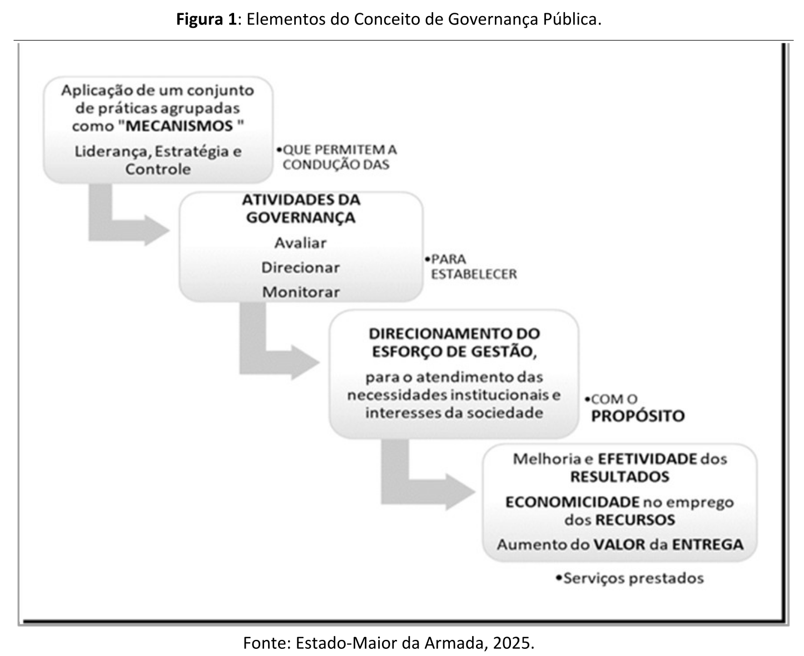
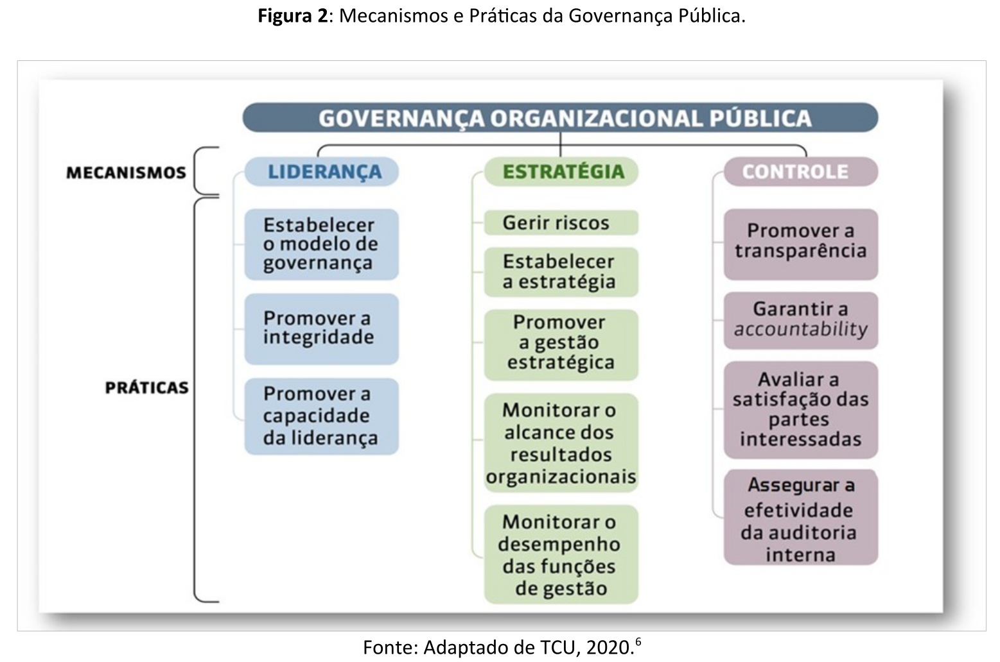
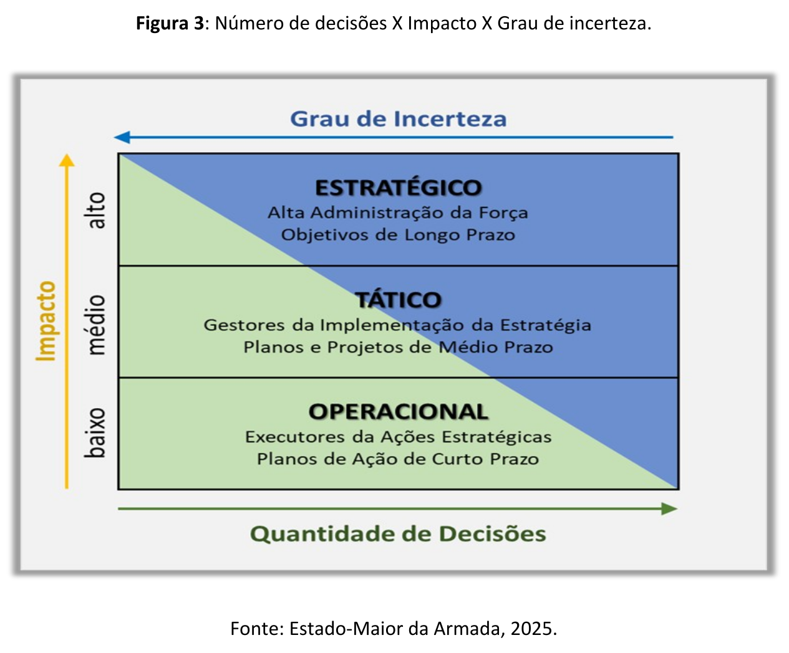
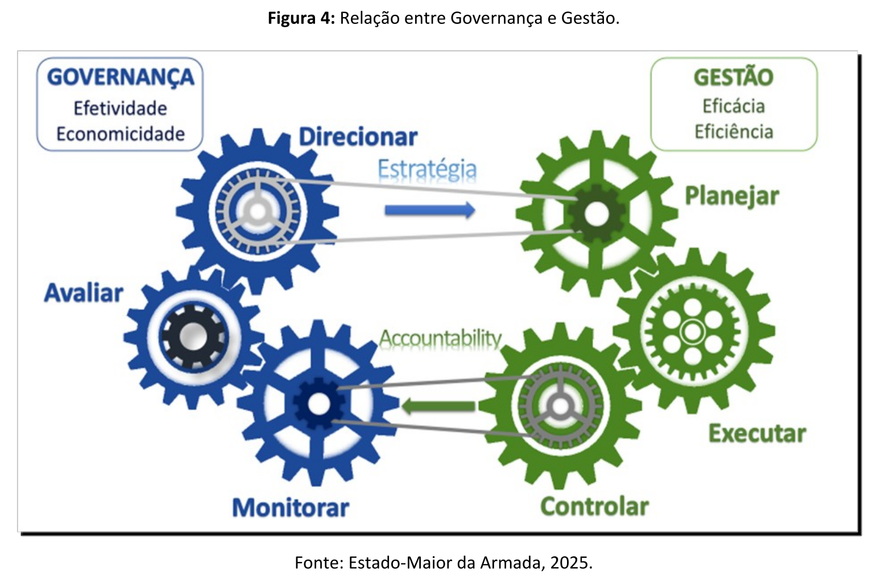
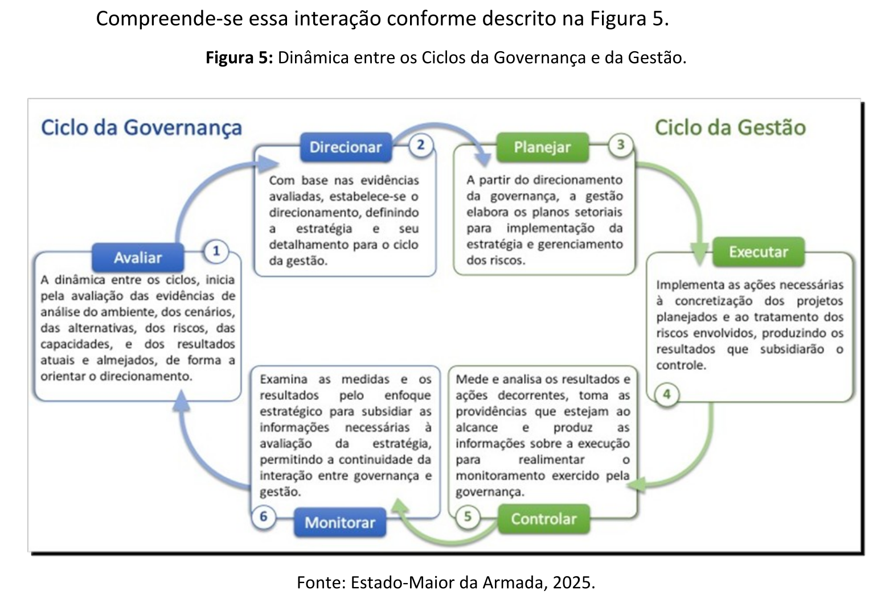
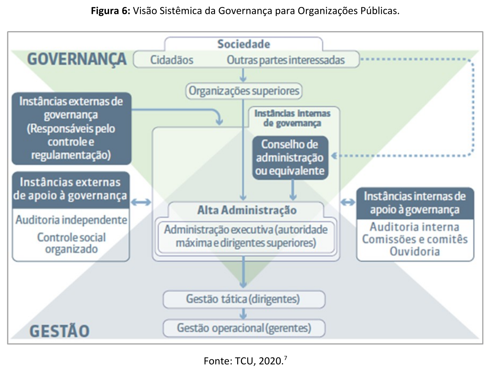

# Capítulo 2 - Governança Pública - Principais Conceitos

## Página 15

Para efeitos destas Normas serão adotados os conceitos especificados a seguir:

### 2.1. GOVERNANÇA PÚBLICA

De acordo com o disposto na Política de Governança da Administração Pública”, a governança pública é o “conjunto de mecanismos de liderança, estratégia e controle postos em prática para avaliar, direcionar e monitorar a gestão, com vistas à condução de políticas públicas e à prestação de serviços de interesse da sociedade”.

A figura a seguir ilustra a dinâmica dos elementos que compõem o conceito de  governança.

### Figura 1: Elementos do Conceito de Governança Pública.

## Página 16

Nesse sentido, para assegurar que uma organização pública possa prover entregas com maior valor, atendendo aos interesses dos cidadãos, é necessário implementar os procedimentos e práticas dos mecanismos. Esses processos ao serem aplicados permitem à Alta Administração avaliar a situação e as demandas presentes e futuras, para direcionar uma atuação estratégica. Também possibilitam monitorar a gestão institucional, assegurando que as ações planejadas sejam executadas de forma eficiente. Dessa forma, os objetivos e resultados estabelecidos podem ser alcançados com economicidade na aplicação dos recursos públicos.

Segundo o Guia da Política de Governança Pública”, esse conceito foi estabelecido com o objetivo de formar um consenso mínimo, sendo considerado um ponto de partida orientado por um conjunto inicial de boas práticas recomendadas pelo Tribunal de Contas da União (TCU). No entanto, o Guia adota uma abordagem mais objetiva para a implementação da política de governança, partindo do pressuposto de que cada órgão já possui um “modelo próprio de governança pública”. Assim, apresenta o entendimento que a governança pública abrange todas as ações que uma instituição pública realiza para garantir que suas atividades estejam alinhadas aos interesses da sociedade.

O Guia ressalta que a Política de Governança Pública visa impulsionar as instituições públicas a aprimorarem a gestão que já realizam, mesmo que seus resultados atendam ao interesse público. Esse aperfeiçoamento deve ser contínuo, não apenas para que a instituição seja capaz de cumprir a sua missão, como também para criar um ambiente favorável à evolução de seu desempenho, direcionar as ações para alcançar maior eficiência e eficácia, e principalmente, para obter resultados efetivos, com maior valor público agregado. Enfim, instituir um modelo que oriente a condução de práticas e procedimentos adequados ao contexto institucional e à finalidade pública, aproximando-se de uma estratégia de governança.

## Página 17

### 2.2. MECANISMOS DE GOVERNANÇA PÚBLICA

Mecanismo é um conjunto de procedimentos e práticas que servem de instrumento para a condução das atividades de avaliação, direcionamento e monitoramento da gestão institucional. É a forma estruturada do modelo de governança pública que orienta as ações e possibilita o seu exercício.

Para garantir a coordenação e a coerência dos modelos, a Política de Governança” indica a implementação de três mecanismos para o exercício da governança pública, que são: liderança, estratégia e controle. Cada mecanismo agrupa as principais práticas aplicáveis a quaisquer organizações públicas. Todavia é permitido que cada instituição defina e aplique as práticas de acordo com o contexto institucional, desde que sejam incorporados ao modelo de governança os elementos mínimos fixados pela Política de Governança Pública. A figura a seguir apresenta os mecanismos e as respectivas práticas.

### Figura 2: Mecanismos e Práticas da Governança Pública.

## Página 18

### 2.2.1. Liderança

Compreende as práticas relacionadas à influência e à autoridade dos gestores dos mais altos níveis da organização para definir a direção e garantir as condições necessárias à boa governança.

Nesse mecanismo está incluído o estabelecimento do modelo que define formalmente como a governança deve ser exercida, abrangendo a estruturação das instâncias, definição de funções, competências e responsabilidades, além da definição de instrumentos e processos que garantem decisões fundamentadas em evidências. O modelo também estabelece as diretrizes e medidas para monitorar os resultados e aprimorar continuamente o desempenho organizacional.

A promoção da integridade é um dos papéis centrais da liderança. Os gestores de alto nível são os responsáveis por definir os valores e padrões de comportamento esperados para a instituição, e principalmente servir de exemplo ao assegurar que o interesse público prevaleça sobre interesses privados. A liderança deve garantir a implementação e o monitoramento de programas de integridade para prevenir e combater fraudes, corrupção, preconceitos, vieses e conflitos de interesse.

Para cumprir essas responsabilidades, é fundamental que os membros das instâncias internas e seus assessores possuam as competências adequadas, promovam o aperfeiçoamento contínuo e sejam responsabilizados por seu desempenho, garantindo assim o fortalecimento da governança pública.

Destaca-se, como conceito elementar desse mecanismo, a capacidade da liderança de fazer cumprir, preservando a integridade dos princípios e valores, o modelo de governança estabelecido.

### 2.2.2. Estratégia

Entre as práticas afetas a esse mecanismo, destacam-se o direcionamento estratégico à instituição, alinhando o cumprimento da missão aos objetivos estatais, bem como o gerenciamento dos riscos inerentes e monitoramento contínuo dos resultados, com intuito de realizar os ajustes pertinentes.

## Página 19

Essas práticas devem ser executadas de forma permanente, visando à tomada de decisões para definir a estratégia que direcionará o esforço de gestão da organização para a otimização do desempenho e o alcance dos resultados, gerando entregas de maior valor. Isso envolve procedimentos como: avaliação dos ambientes interno e externo da organização, avaliação e prospecção de cenários, definição de diretrizes, estabelecimento de objetivos, elaboração de planos e ações, monitoramento de metas por meio de indicadores, além da gestão dos riscos inerentes e da priorização e alinhamento entre as necessidades da organização e as expectativas das partes interessadas.

O cerne desse mecanismo é o monitoramento contínuo e o gerenciamento dos riscos, assegurando que os esforços de gestão e execução estejam alinhados ao direcionamento estratégico estabelecido, possibilitando entregas de maior valor para a sociedade.

### 2.2.3. Controle

Integra as práticas que visam atestar junto à sociedade a execução ordenada, ética e efetiva das atividades, dentro dos preceitos de legalidade, transparência e economicidade no uso de recursos públicos. Assegura a responsabilização dos agentes públicos por seus atos e busca validar a satisfação das partes interessadas.

Esse mecanismo se apoia no acesso de todas as informações de interesse público, permitindo a fiscalização, o controle e a avaliação das ações e responsabilidades na aplicação dos recursos e uso dos bens públicos, para certificar a conformidade dos atos realizados e o cumprimento dos resultados esperados. Além disso, inclui a avaliação da auditoria interna como instrumento para proteger o valor institucional, apoiando a liderança no direcionamento da gestão, na condução da governança e no gerenciamento dos riscos.

O aspecto central que distingue esse mecanismo é a diligência do controle interno, respaldado pela efetividade da auditoria interna, que visa não apenas viabilizar a transparência, em termos de publicidade, acesso e prestação de contas, mas principalmente para autenticar o controle externo, em termos de anuência dos serviços prestados, confiança na legalidade dos atos e convicção do tratamento assertivo para os desvios e infrações.

## Página 20

### 2.3. ATIVIDADES DE GOVERNANÇA PÚBLICA

A governança pública é exercida por meio de três atividades básicas: avaliar, direcionar e monitorar, a partir da aplicação das práticas dos mecanismos.

### 2.3.1. Avaliar

Consiste em examinar e compreender detalhadamente os componentes ou aspectos das demandas, dos ambientes, dos cenários, dos recursos disponíveis, das alternativas, dos riscos e benefícios das alternativas, bem como dos resultados atuais e os almejados. O objetivo é identificar e apreciar as evidências que fundamentam o direcionamento. No entanto, a reavaliação é realizada com base nas informações mais recentes obtidas com o monitoramento. 

### 2.3.2. Direcionar

Implica em definir o caminho a ser seguido, estabelecendo os objetivos e as orientações sobre como alcançá-los. Com base nas evidências obtidas na avaliação, deve-se orientar a preparação e a coordenação de políticas e de planos, priorizando e selecionando as alternativas, além de definir as diretrizes, as metas e as ações de tratamento dos riscos. Também envolve o alinhamento das estruturas e funções organizacionais necessárias para alcançar os objetivos definidos. O direcionamento cria os parâmetros para o monitoramento e pode ser ajustado após a reavaliação. 

### 2.3.3. Monitorar

Refere-se a acompanhar sistematicamente os esforços da gestão, coletando dados e medindo o desempenho e os resultados. Essa atividade tem como objetivo averiguar o cumprimento de políticas e planos, confrontando-os com as metas estabelecidas no direcionamento. O monitoramento fornece informações essenciais para a avaliação, gerando subsídios que permitem identificar a necessidade de ajustes ou intervenções para o direcionamento.

Desta maneira, as atividades da governança pública são interdependentes, formando um ciclo contínuo que interage com outro ciclo de atividades, visando garantir a efetividade na gestão pública. Esse processo assegura que decisões sejam tomadas com base em evidências concretas, que os recursos sejam utilizados de forma eficiente e que a transparência e a prestação de contas sejam mantidas perante a sociedade. Por meio dessas atividades, a governança pública promove a confiança e a responsabilidade, alinhando os esforços de gestão com os interesses e necessidades das partes interessadas.

## Página 21

### 2.4. GESTÃO PÚBLICA

A gestão compreende o ato de administrar estrategicamente os recursos e processos da organização para atender a um determinado propósito, englobando um conjunto amplo e interligado de atividades. Administrar, por sua vez, possui um sentido mais basilar e específico, com ênfase na organização, execução e controle sistemático das atividades, processos e recursos, baseando-se em regras e procedimentos para manter o funcionamento organizacional estável e ordenado. Essa ação está presente em todas as atividades, sejam elas rotineiras ou complexas, e se associa aos pilares do planejamento, organização, direção e controle, com foco na eficiência operacional e na conformidade com as normas.

No entanto, quando se trata da gestão, a estabilidade e ordem funcional promovidas pela administração servem como base para coordenar o alinhamento dos recursos e preparar a organização para enfrentar desafios, promover melhorias e alcançar metas de crescimento e desenvolvimento. Em outras palavras, enquanto a administração se dedica a manter a solidez, a regularidade e a harmonia funcional, a gestão busca uma atuação mais versátil e dinâmica, planejando, orientando e coordenando a implementação das diretrizes estratégicas. Assim, a gestão impulsiona a organização a seguir o direcionamento estratégico estabelecido pela governança, visando o alcance de objetivos organizacionais.

Nas organizações públicas, atualmente, a gestão refere-se ao conjunto de práticas, processos e atividades realizadas por gestores para a implementação das diretrizes estabelecidas pela governança, com foco na eficiência e eficácia das ações e na aplicação dos recursos públicos.

## Página 22

A gestão pública exerce duas funções:

**a) Realizadora:** responsável por planejar a forma mais adequada de aplicar essas diretrizes e executar os planos e as ações de tratamento dos riscos; e

**b) Gerencial:** responsável por controlar essa execução por meio de indicadores.

### 2.4.1. Atividades básicas da Gestão Pública

Para o desempenho das suas funções, a Gestão desenvolve três atividades básicas:

**a) Planejar:** a partir do direcionamento da governança, consiste em definir as prioridades; elaborar o plano de implementação estratégica detalhando as ações e projetos a executar, os recursos necessários e as metas e indicadores para acompanhamento do desempenho; e identificar os riscos inerentes à execução das ações e projetos, bem como as respectivas ações de tratamentos adequadas;

**b) Executar:** gerar os resultados estabelecidos no plano de implementação estratégica colocando em prática as ações e projetos detalhados, bem como as ações de tratamento dos riscos identificados; e

**c) Controlar:** acompanhar e medir os resultados alcançados, com base nos indicadores e metas estabelecidos no plano, em consonância com o gerenciamento das ações de tratamento de riscos. Os resultados, medições, análises e ações decorrentes do controle da gestão serão submetidos às ações de monitoramento da governança.

Com ênfase para as práticas administrativas gerenciais, a gestão pública promove a execução eficaz, busca a melhoria contínua do desempenho e a eficiência de suas ações. Seu objetivo é alcançar os resultados definidos pela governança, contribuindo para o propósito de prestar serviços que atendam às necessidades da sociedade, otimizando o uso de recursos e garantindo entregas de maior valor.

### 2.4.2. Níveis da Gestão Pública

Para assegurar a eficiência e a eficácia na implementação das diretrizes, desde as atividades rotineiras até as decisões de longo prazo, a gestão pública é estruturada em três níveis — estratégico, tático e operacional. Cada nível possui funções e responsabilidades específicas que se complementam para alcançar os objetivos institucionais.

## Página 23

Entretanto, é importante observar que a hierarquização dos níveis na gestão pública segue a lógica do planejamento institucional, que difere da concepção do planejamento militar, em que os níveis estão organizados em estratégico, operacional e tático.

Desta forma, considerando os papéis atribuídos a cada nível para assegurar a execução das diretrizes estratégicas e o alinhamento das atividades aos objetivos de longo prazo da administração pública, os níveis da gestão pública são organizados da seguinte forma:

**a) Gestão estratégica:** responsável por avaliar, direcionar e monitorar a execução da estratégia, com foco no futuro da instituição. É conduzida pela Alta Administração, que define a visão de futuro, as estratégias e os objetivos estratégicos institucionais. Nesse nível, são realizadas análises e tomadas decisões que estabelecem metas amplas e diretrizes para orientar todos os outros níveis da instituição;

**b) Gestão tática:** coordenada pelos dirigentes dos setores específicos, responsáveis por transformar as diretrizes estratégicas em planos táticos de médio prazo e coordenar a gestão operacional. A partir do direcionamento da gestão estratégica, define prioridades, planeja e otimiza recursos e processos, gerencia riscos e ajusta metas e indicadores para implementação de programas, projetos e ações. Atua como elo entre a estratégia e a operação, garantindo que os objetivos estratégicos sejam traduzidos em ações gerenciáveis; e

**c) Gestão operacional:** responsável pela execução de processos finalísticos e de apoio, com foco em metas de curto prazo. Conduzida por dirigentes e gerentes que coordenam a aplicação prática do plano operacional. Assegura o funcionamento contínuo e o cumprimento das ações, alinhando-as com os objetivos estratégicos de longo prazo.

## Página 24

Esses três níveis trabalham de forma integrada, para que as decisões estratégicas orientem o planejamento das ações táticas, que devem ser implementadas e ajustadas nas atividades operacionais. Quando comparado com os demais, observa-se que no nível estratégico há um número menor de decisões, porém com alto impacto para a instituição no alcance dos objetivos de longo prazo. Tais decisões, muitas das vezes, precisam ser tomadas mesmo que haja alto grau de incerteza. Por outro lado, nos níveis tático e operacional, esta lógica varia, concentrando um maior volume de decisões que em termos de impacto têm valor diminuído. Nesses níveis, o grau de incerteza para a tomada de decisão tende a ser menor, conforme ilustrado na figura a seguir.

Figura 3: Número de decisões X Impacto X Grau de incerteza.

### 2.5. RELAÇÃO ENTRE GOVERNANÇA E GESTÃO

Antes do conceito de governança pública, as práticas que hoje fazem parte da governança eram amplamente consideradas como gestão pública, mas com um enfoque distinto. Sob as diretrizes do antigo Programa Nacional de Gestão Pública e Desburocratização (GESPÚBLICA), a gestão pública concentrava-se na eficiência administrativa, no aprimoramento dos processos internos e no controle e conformidade normativa. O objetivo principal era aprimorar a qualidade dos serviços públicos e reduzir a burocracia, atendendo às demandas da sociedade de maneira eficaz. O modelo era mais técnico, orientado por resultados internos, e operava em um sistema isolado, com pouca ou nenhuma participação social no processo decisório. A integração com a estratégia envolvia o planejamento e a execução de metas internas voltadas para a otimização de recursos e melhoria do desempenho, enquanto o controle era exercido internamente, com mecanismos limitados de responsabilização pública.

## Página 25

A introdução do conceito de governança pública, em 2017, transformou o foco da administração pública ampliando o escopo gerencial e incorporando novos elementos, como transparência, acompanhamento social e prestação de contas. O modelo incorporou mecanismos que promovem a integração com a estratégia, a participação ativa dos cidadãos e o engajamento de diferentes partes interessadas. O sistema também foi reformulado, passando a integrar várias instâncias que reforçam um ambiente colaborativo e ético. Além disso, foram estabelecidos controles mais robustos de prestação de contas, garantindo maior responsabilização e transparência na gestão dos recursos públicos.

Essa evolução tornou a administração pública mais dinâmica e sustentável, fortalecendo a confiança e a legitimidade das ações governamentais. A adoção da governança pública juntamente à gestão formou um instrumento estratégico e social, que não apenas atende às metas administrativas, mas também alinha as operações e os objetivos institucionais às necessidades da sociedade, gerando benefícios legitimados pelo envolvimento de todos os interessados.

Com a governança pública assumindo as funções de direcionamento e fiscalização, a gestão pública manteve seu papel gerencial e executor, direcionado para os níveis tático e operacional. Assim, a gestão pública concentrou-se na eficácia e eficiência administrativa, enquanto a governança trouxe uma abordagem mais estratégica, colaborativa e orientada para a sustentabilidade das políticas públicas.

A dinâmica de funcionamento da governança e da gestão, consiste em dois ciclos distintos de atividades inter-relacionados e interdependentes. A Figura 4 exibe as atividades e os ciclos envolvidos nessa dinâmica.

## Página 26

Figura 4: Relação entre Governança e Gestão.

Compreende-se essa interação conforme descrito na Figura 5.

Figura 5: Dinâmica entre os Ciclos da Governança e da Gestão.

Ciclo da Governança - Avaliar (1)

A dinâmica entre os ciclos, inicia pela avaliação das evidências de análise do ambiente, dos cenários, das alternativas, dos riscos, das capacidades, e dos resultados atuais e almejados, de forma a orientar o direcionamento.

Ciclo da Governança - Direcionar (2)

Com base nas evidências avaliadas, estabelece-se o direcionamento, definindo a estratégia e seu detalhamento para o ciclo da gestão.

Ciclo da Governança - Planejar (3)

A partir do direcionamento da governança, a gestão elabora os planos setoriais para implementação da estratégia e gerenciamento dos riscos.

Ciclo da Gestão - Executar (4)

Implementa as ações necessárias à concretização dos projetos planejados e ao tratamento dos riscos envolvidos, produzindo os resultados que subsidiarão o controle.

Ciclo da Gestão - Controlar (5)

Mede e analisa os resultados e ações decorrentes, toma as providências que estejam ao alcance e produz as informações sobre a execução para realimentar o monitoramento exercido pela governança.

Ciclo da Gestão - Monitorar (6)

Examina as medidas e os resultados pelo enfoque estratégico para subsidiar as informações necessárias à avaliação da estratégia, permitindo a continuidade da interação entre governança e gestão.

## Página 27

Trata-se de uma dinâmica contínua em que a governança periodicamente avaliará a pertinência de manter ou reorientar o direcionamento para gestão, com base na análise das evidências e dos resultados alcançados e monitorados constantemente. Qualquer que seja a decisão, a governança comunica à gestão para dar continuidade à interação entre os ciclos.

A governança tem como compromisso proporcionar o direcionamento para uma gestão eficiente, por meio da formulação de diretrizes e estratégias, além de prover a avaliação e o monitoramento do desempenho organizacional. A gestão, por sua vez, possui a função de implementar as estratégias definidas pela governança. Compete à gestão aplicar Os recursos, gerenciar os riscos, planejar, executar e controlar as atividades necessárias para atingir os objetivos e metas estabelecidos. Seu propósito é contribuir para o alcance dos objetivos institucionais nas organizações.

Quadro 1: Atividades relacionadas à governança e à gestão.

**Quadro 1: Atividades relacionadas à governança e à gestão**

| **GOVERNANÇA** | **GESTÃO** |
|---|---|
| • Avalia as evidências para o direcionamento estratégico; | • Planeja a implementação das iniciativas estratégicas; |
| • Define o direcionamento estratégico; | • Executa as ações estratégicas; |
| • Monitora a gestão e os riscos estratégicos; | • Gerencia os riscos estratégicos; |
| • Avalia o sistema de gestão e controle; | • Revisa, controla e reporta o progresso das ações planejadas; |
| • Organiza papéis e responsabilidades; | • Garante a conformidade com as regulamentações; |
| • Fiscaliza e apura responsabilidades; | • Mantém a comunicação com as partes interessadas. |
| • Promove a integridade e a ética; |  |
| • Promove a prestação de contas e a transparência. |  |

*Fonte: Estado-Maior da Armada, 2025.*

### 2.6. VISÃO SISTÊMICA DA GOVERNANÇA PÚBLICA

Para alcance da boa governança é essencial estabelecer e implementar um sistema que seja apropriado às dimensões, à complexidade, ao setor de atuação e ao perfil de riscos da organização. Isso requer estruturas administrativas, processos de trabalho, ferramentas, atos normativos, fluxo de informações, envolvimento das lideranças e das pessoas engajadas direta ou indiretamente na avaliação, no direcionamento e no monitoramento da organização.

## Página 28

O TCU propôs um modelo de sistema de governança para organizações públicas, conforme representado na Figura 6. Na ilustração, observa-se que o triângulo superior contém os elementos estruturais afetos à governança, ao passo que o inferior abrange os elementos estruturais associados à gestão. Na interseção dos dois triângulos, está a Alta Administração ou Administração Executiva, representada pela autoridade máxima (responsável pela direção da organização) e pelos dirigentes superiores (gestores de nível estratégico, diretamente ligados à autoridade máxima). Entende-se por Alta Administração os membros do nível estratégico da organização, com poderes para estabelecer políticas, diretrizes e objetivos institucionais.

Figura 6: Visão Sistêmica da Governança para Organizações Públicas.

## Página 29

Ressalta-se que a proposta do TCU adota uma abordagem pragmática da Teoria de Sistemas[8]. Nesse modelo, tanto as instâncias internas quanto as externas são consideradas partes de um único sistema de governança. Essa visão sistêmica do Tribunal expande as fronteiras internas, integrando elementos do ambiente como componentes do sistema, em vez de tratá-los como sistemas distintos apenas conectados por suas interações.

[8] Teoria que estuda os sistemas com foco nos princípios, padrões e inter-relações que regem seu funcionamento. Considera um sistema como um conjunto de elementos interligados e interdependentes que trabalham juntos para alcançar um objetivo comum. Os sistemas são definidos por suas fronteiras, que os separam do ambiente externo, o que não significa isolá-los, uma vez que eles operam em interação com os elementos desse ambiente, sendo influenciados e exercendo influência. Quando elementos externos pertencem a outros sistemas, adota-se o conceito de “sistema de sistemas”, no qual diferentes sistemas interagem de forma coordenada, mantendo sua autonomia dentro de um todo integrado (Bertalanffy, L. von1968 e Bertalanffy, L. von — 2021 — anexo C).

Embora essa abordagem desconsidere a separação clássica entre o sistema interno da organização e os sistemas externos com os quais interage, ela se alinha ao princípio da interdependência dos sistemas, que reconhece que nenhum sistema opera isoladamente e seu funcionamento depende da interação com o ambiente externo. No contexto das organizações públicas, essa fluidez de fronteiras reflete a intenção de considerar que elementos externos, como órgãos reguladores e de controle, possuem impacto e influência tão significativos que precisam ser integrados como componentes do sistema de governança.

Assim, o sistema de governança proposto para as organizações públicas está estruturado com os seguintes elementos: 

### 2.6.1. Elementos Estruturais da Governança

a) sociedade: compartilha as percepções de finalidade e valor quanto às entregas das organizações públicas, exercendo o seu poder social, de forma conjunta e ordenada por meio de estruturas criadas para representá-la. Efetua o acompanhamento das atividades desenvolvidas, possuindo o direito de monitorar as ações das organizações, avaliando se estão alinhadas aos princípios e diretrizes constitucionais e da governança pública;

b) partes interessadas: indivíduos, grupos ou organizações que possuem interesse direto ou indireto nas atividades, decisões ou projetos conduzidos pela instituição. Essas partes podem ser impactadas pelas ações da organização ou exercer influência sobre elas, especialmente no que diz respeito ao cumprimento da missão e aos objetivos estratégicos;

## Página 30

c) instâncias internas: responsáveis por definir o modelo de governança, definir e avaliar a estratégia, as políticas institucionais, bem como por monitorar a conformidade e o desempenho destas políticas e estratégias;

d) instâncias internas de apoio: responsáveis pela comunicação entre partes interessadas internas e externas à organização, bem como pela realização de auditorias internas que avaliam e monitoram riscos e controles internos, comunicando quaisquer disfunções à Alta Administração;

e) instâncias externas: responsáveis pela fiscalização, controle e regulação das instituições públicas; e

f) instâncias externas de apoio: responsáveis pela avaliação, auditoria e monitoramento independente e pela comunicação dos fatos às instâncias superiores de governança nos casos em que disfunções são identificadas.

A responsabilidade pela execução da Política de Governança em cada órgão, com a implementação dos mecanismos e práticas é da Alta Administração, compartilhada com os Comitês Internos de Governança.

2.6.2. Elementos Estruturais da Gestão:

a) instâncias de gestão tática: responsáveis por transformar as diretrizes estratégicas em planos táticos de médio prazo e coordenar a gestão operacional em áreas específicas; e

b) instâncias de gestão operacional: responsáveis pela execução de processos finalísticos e de apoio, com foco em metas de curto prazo.

Cabe ressaltar que, como retratado no modelo da Figura 6, a gestão estratégica é conduzida pela Alta Administração, considerada nos Elementos Estruturais da Governança.

## Página 31

### 2.7. MODELO DE GOVERNANÇA PÚBLICA

O modelo de governança é a representação clara, estruturada e pública de como uma organização deve exercer suas atividades de governança para alcançar seus objetivos de forma alinhada ao interesse público. O modelo abrange a definição dos princípios, diretrizes, processos e estruturas que asseguram a realização das funções de governança de maneira eficaz, íntegra, transparente e responsável. Esse modelo busca garantir que as organizações alinhem suas operações aos objetivos estratégicos, gerenciem riscos e entreguem resultados que atendam às expectativas das partes interessadas.

Para elaborar e estabelecer um modelo de governança válido é necessário:

a) definir as instâncias internas e de apoio à governança, identificando as finalidades, composições e competências da Alta Administração, de conselhos, comitês e outras instâncias de apoio, adequadas às necessidades da instituição;

b) identificar as principais partes interessadas;

c) estabelecer os fluxos de informações entre as instâncias de governança, os agentes responsáveis e as partes interessadas;

d) atribuir ao conselho ou colegiado superior da governança a responsabilidade de direcionar e monitorar a gestão, incluindo a aprovação e avaliação da estratégia e dos resultados institucionais, bem como das políticas, normas e programas internos, que envolvem a gestão da estratégia, gestão de pessoas, gestão de desempenho, contratações, integridade, gestão de riscos, comunicação com partes interessadas;

e) atribuir ao conselho ou colegiado superior da governança a responsabilidade de promover a integridade e garantir a prestação de contas, com a identificação de mecanismos formais para assegurar transparência, responsabilização e padrões éticos elevados em todas as instâncias;

f) definir as alçadas de decisão e segregação de funções para o balanceamento de poder para tomada de decisões críticas, prevenindo conflitos de interesse;

g) adaptar ao contexto institucional, considerando as boas práticas atuais, flexibilizando-o para atender às especificidades e às demandas das partes interessadas; e

h) aprovar formalmente e publicar na internet.

## Página 32

Ao definir e elaborar o seu modelo de governança, a Alta Administração estabelece como a instituição deve ser conduzida, definindo os princípios, as diretrizes e os processos; identifica quais elementos organizacionais internos estarão envolvidos, o papel de cada um deles e as suas inter-relações para o exercício da governança, bem como quais elementos externos possuem conexões de influência para o direcionamento estratégico, orientando-se pela finalidade e relações de interesses com cada um desses.

A implementação do modelo de governança consiste em operacionalizar as diretrizes, estruturas e processos previamente definidos para garantir o alinhamento da organização aos princípios de governança. Essa etapa efetivamente transforma o modelo definido em práticas dos mecanismos visando avaliar, direcionar e monitorar as atividades de gestão. Além disso, requer uma aplicação ética e íntegra das atividades no cotidiano da organização, bem como o monitoramento contínuo para ajustes e melhorias.

O modelo, ao ser posto em prática, promoverá a criação ou adequação das instâncias internas de governança e de apoio, das diretrizes de relacionamento e dos fluxos de comunicação entre as partes envolvidas. Esse processo não se limita a estruturar órgãos e processos, ele também busca capacitar os agentes de governança para compreender suas responsabilidades e exercer suas funções com ética e eficiência, assim como para favorecer o engajamento com as partes interessadas, garantindo que as decisões estejam alinhadas ao interesse público e sejam fundamentadas em evidências. A implementação é dinâmica, necessitando de revisões periódicas para responder às mudanças no contexto interno e externo e assegurar que o modelo de governança permaneça eficaz e relevante.

O modelo de governança é a espinha dorsal de uma administração pública eficiente, ética e responsável. Sua implementação exige um equilíbrio entre estrutura e flexibilidade, garantindo que as decisões sejam bem fundamentadas, os recursos geridos de forma eficaz e os objetivos institucionais alinhados aos interesses da sociedade. O modelo deve oferecer diretrizes claras, promover a integração entre as diversas instâncias e servir como uma ferramenta para identificar fragilidades, gerenciar riscos e criar condições favoráveis ao alcance dos objetivos institucionais. Por meio de um modelo robusto, a organização pode consolidar sua legitimidade, gerar valor público e fortalecer a confiança das partes interessadas.

## Página 33

Conforme mencionado anteriormente, o Guia da Política de Governança Pública considera o pressuposto de que cada órgão já possui um “modelo próprio de governança pública”, uma vez que todas as ações realizadas por uma instituição pública visam garantir que seus objetivos estejam alinhados aos interesses da sociedade. Assim, o objetivo da Política consiste em estimular as instituições a elaborar e atualizar seu modelo de governança de forma a aprimorar a gestão que ora, são realizadas, mesmo que seus resultados atendam ao interesse público.

Essa perspectiva está alinhada à realidade da MB, que já dispõe de conceitos, diretrizes, princípios, processos, procedimentos, práticas e ferramentas formalizados em um arcabouço normativo compatível com o exercício da governança. Ou seja, considera-se que grande parte das práticas da governança têm sido conduzidas na MB, contudo, não estão normatizadas com esse propósito, necessitando indicar como esses instrumentos devem funcionar em conjunto para ser entendido como um modelo de governança.

Portanto, a segunda parte deste documento busca evidenciar essa estrutura normativa que vem sendo aplicada pela Força e reforçar sua aplicação integrada, com ajustes e adições necessários, consolidando-a como o Modelo de Governança estabelecido para a MB, com vistas ao aprimoramento contínuo da gestão, de acordo com os instrumentos legais preconizados para a Administração Pública Federal, guardadas as necessidades particulares.
