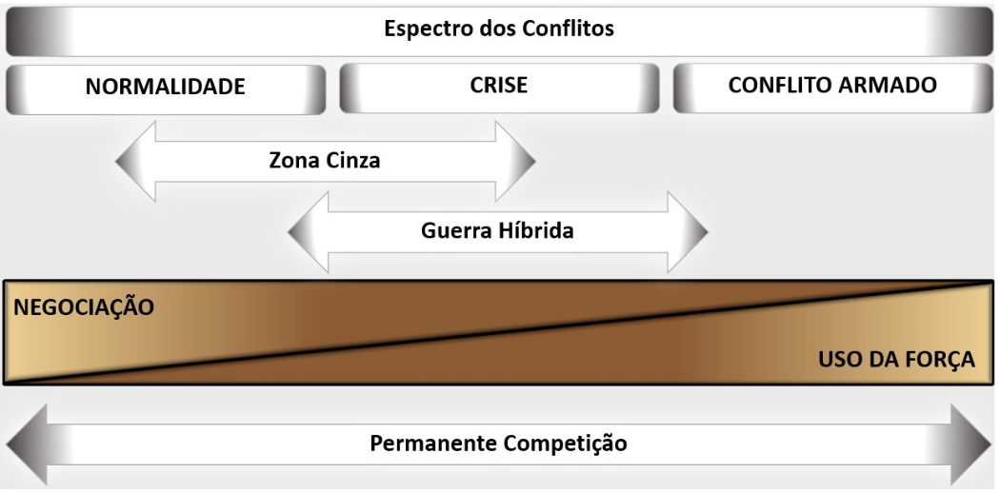
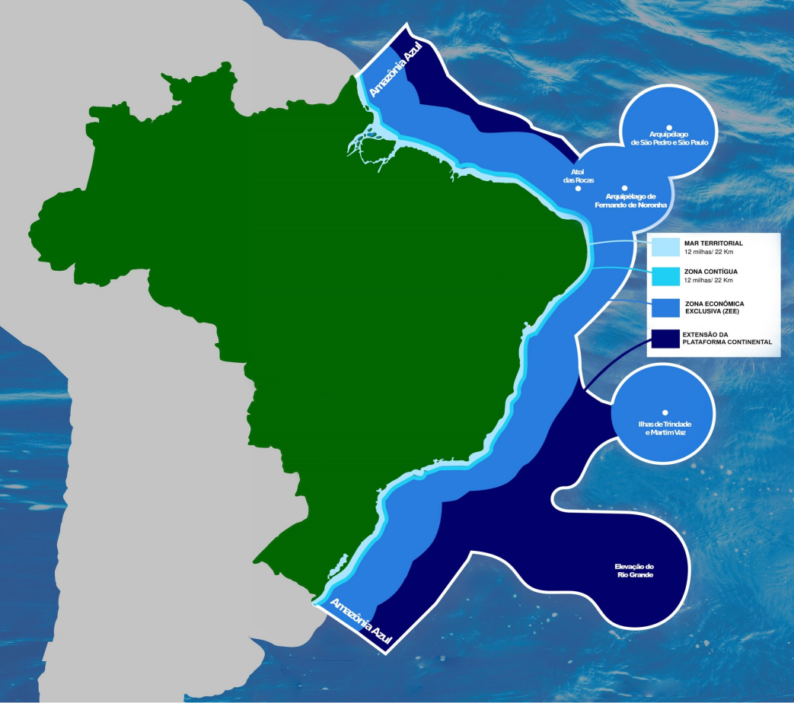
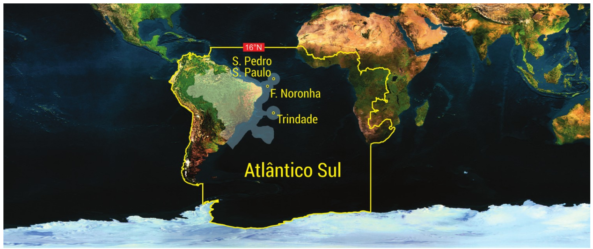

# Capítulo 1 - Base Doutrinária da MB

## Página 7

### INTRODUÇÃO

### 1. HISTÓRICO

A natureza e vocação marítima do Brasil estão notadamente marcadas ao longo da história do País. Por mais de 500 anos, o mar tem sido elemento fundamental na vida nacional, viabilizando tanto a chegada dos portugueses, no início século XVI, como os benefícios econômicos possibilitados pelo seu uso sustentável.

Antes mesmo da Independência, o combate no mar definiu o curso de episódios em que o território brasileiro foi ameaçado por invasores. As iniciativas francesas de estabelecer possessões no Brasil, primeiramente na Baía da Guanabara, no século XVI, e posteriormente no Maranhão, entre 1612 e 1615, foram rechaçadas por brasileiros e portugueses que juntaram forças e combateram os invasores utilizando embarcações. Na segunda ocasião, um brasileiro, mestiço como boa parte dos que viviam ao longo do litoral, desempenhou papel fundamental. Há mais de 400 anos, Jerônimo de Albuquerque era o primeiro natural do Brasil a assumir o comando de uma Força Naval empregada em operações militares, uma flotilha formada por embarcações a vela, o que já reforçava a importância de o Brasil contar com uma defesa naval.

Após a transferência da família real para o Brasil em 1808, a atuação da Brigada Real da Marinha, denominação original do Corpo de Fuzileiros Navais, foi fundamental na campanha para a retomada de Caiena, garantindo para o Brasil parte do atual estado do Amapá. A Independência do País contou também com participação ativa e fundamental da Marinha para evitar a fragmentação do território nacional, cuja consolidação somente foi possível graças à atuação da Esquadra brasileira que venceu os revoltosos na Bahia, no Maranhão, no Pará e na Cisplatina.

Ainda no século XIX, a Guerra da Tríplice Aliança (1864-1870), maior conflito ocorrido na América do Sul, deixou um legado de união, solidariedade e superação aos brasileiros, com emprego das FA e plena mobilização da nossa sociedade. Na campanha naval, a Marinha do Brasil (MB) enfrentou uma força naval preparada para o ambiente fluvial e com vantagens, tanto na proximidade do apoio logístico como no apoio de fogo de terra. A Batalha Naval do Riachuelo, evento decisivo e vitorioso, ocorrida em 11 de junho de 1865, foi marcada pela bravura de aguerridos marinheiros e fuzileiros navais, que superaram adversidades de toda ordem, muitos deixando suas vidas em combate. Por conta desse episódio histórico, em 11 de junho celebramos o Dia da Marinha, nossa Data Magna.

## Página 8

A Marinha também participou das duas Guerras Mundiais travadas no século XX, envidando significativos esforços navais no Atlântico Sul. Em ambos os conflitos, os estopins que levaram à participação brasileira nos mesmos foram os afundamentos de nossos navios mercantes por submarinos alemães. Em 1918, a Divisão Naval em Operações de Guerra (DNOG) partiu em direção ao Mediterrâneo. Mesmo tendo sido assolada pela Gripe Espanhola por ocasião da estadia em Dakar, a DNOG cumpriu sua missão, realizando patrulhas até o fim do conflito.

Na Il Guerra Mundial nossa principal tarefa foi garantir a proteção dos comboios que trafegavam entre Trinidad, no Caribe, e Florianópolis, em nosso litoral sul. Ao todo, 3.164 navios mercantes foram organizados em 574 comboios, sendo que apenas três embarcações foram afundadas. Coube, ainda, à Marinha, a escolta do transporte da Força Expedicionária Brasileira (FEB) até Gibraltar e o patrulhamento oceânico contra os furadores de bloqueio, navios que traziam mercadorias do Oriente para a Alemanha.

No pós-guerra, a Marinha foi empregada internacionalmente inúmeras vezes, com destaque para as operações de paz no Haiti, entre 2004 e 2017, cujo comando coube ao Brasil, e no Comando da Força-Tarefa Marítima (FTM) da Força-Tarefa Interina das Nações Unidas no Líbano (UNIFIL), contando ainda com a permanência de um navio como capitânia da Força.

Em toda a nossa história, o oceano Atlântico perdura como uma das áreas de interesse prioritário para o Brasil, no que se refere, principalmente, ao comércio marítimo. Atualmente, o Brasil e sua Marinha dedicam esforços também à exploração e ao aproveitamento dos recursos do mar, aos levantamentos e pesquisas científicas, aos interesses de defesa e segurança regionais, e nesse sentido ao fortalecimento da Zona de Paz e Cooperação do Atlântico Sul (ZOPACAS), bem como à exploração científica da Antártica.

Ademais, as águas interiores representadas, em especial, pelas bacias Amazônica e do Paraguai-Paraná, por suas relevâncias nos campos econômico e militar, continuarão a exigir da Marinha a ação de presença, vigilância e dedicação permanentes, visando a proteção dos interesses brasileiros nessas regiões.

## Página 9

Como se comprova ao longo da História, não foram poucas as ocasiões em que a Marinha do Brasil atuou na defesa do território e da soberania do País e em favor dos interesses nacionais. Essas experiências acumuladas, às quais foram agregados estudos e análises sobre a evolução do pensamento estratégico-naval, permitiram à Força Naval consolidar um consistente conjunto harmônico e ordenado de ideias, entendimentos e conceitos, explicitados em documentos ou incorporados tacitamente no etos da própria Marinha, que consolidam a sua Doutrina.

Decorrente das orientações oriundas dos documentos de alto nível da Força, a Marinha tem conduzido, desde 2020, o trabalho que resultou na publicação das Normas para o Sistema Doutrinário da Marinha (EMA-304) e na elaboração de processos no âmbito do Planejamento de Força da Marinha (SISFORÇA), concretizado na publicação Estratégia de Defesa Marítima (EDM) e no seu decorrente Plano de Configuração de Força (PCF). Ao longo desse esforço, verificou-se a necessidade de atualização de conceitos doutrinários, o que se faz por meio da publicação destes Fundamentos Doutrinários, que servirão de base para a atualização da Doutrina Militar Naval (DMN).

### 2. DOUTRINA

A doutrina caracteriza-se por um conjunto de princípios, conceitos, normas e procedimentos, fundamentado principalmente na experiência, destinado a estabelecer linhas de pensamento e a orientar ações, exposto de forma integrada e harmônica.

Por sua vez, a Doutrina Militar de Defesa define como as Forças Armadas (FA) são empenhadas em atividades relacionadas com a defesa do País, com abordagem direta à garantia da soberania e da integridade do Estado brasileiro, além da consecução dos Objetivos Nacionais. Sua ênfase está no emprego das FA.

Particularmente na MB, a doutrina provê preceitos, linguagem e propósitos comuns, com unidade de esforços. Uma doutrina racional produz efeitos na reflexão sobre o conflito, no planejamento de força, na instrução e no adestramento. Ainda, proporciona a base para que a condução por parte dos Comandantes de Força e comandos subordinados, seja harmoniosa e sem retardos, de acordo com as intenções e efeitos desejados do comando superior.

## Página 10

Além disso, devido à sua relevância e conexão com o emprego, a doutrina na MB contribui para os processos de planejamento e configuração da Força Naval, podendo impactar nos aspectos relacionados ao material, pessoal, educação, desenvolvimento científico e tecnológico, entre outros. Nesse contexto, incentiva-se a leitura e o estudo desta Doutrina por todo o pessoal da Marinha.

### 3. PROPÓSITO

A publicação Fundamentos Doutrinários da Marinha estabelece os princípios e conceitos básicos que orientam o planejamento estratégico, o preparo e o emprego do Poder Naval, servindo de base para a elaboração dos demais documentos doutrinários da MB.

Além disso, esses fundamentos fornecem uma compreensão geral do emprego da Força Naval, levando em consideração suas especificidades e em conformidade com as orientações estabelecidas pelo nível político. Esse aspecto também se aplica à participação da Força em compromissos internacionais assumidos pelo Brasil.

### 4. DESCRIÇÃO

Esta publicação está dividida em dois Capítulos. O Capítulo 1 apresenta elementos basilares que fundamentam a doutrina na MB. O referido Capítulo apresenta conceitos constantes dos Capítulos 1 e 2 da DMN (EMA 305 2017 Mod1) revisados. O Capítulo 2 apresenta conceitos doutrinários estratégicos, relacionados com a evolução do pensamento estratégico e o processo do planejamento de força.

Os Capítulos 3, 4 e 5 da DMN permanecem em vigor até a publicação de uma nova norma decorrente desta, que será responsável por correlacionar seu conteúdo com as Capacidades Operativas do Poder Naval.

### 5. CLASSIFICAÇÃO

Esta publicação, de acordo com as normas estabelecidas no EMA-411-Manual do Sistema de Publicações da Marinha, é classificada em: Publicação da Marinha do Brasil (PMB), não controlada, ostensiva, básica e doutrina.

## Página 11

### Capítulo 1 BASE DOUTRINÁRIA DA MB

Os Fundamentos Doutrinários visam orientar, no nível estratégico, o desenvolvimento doutrinário da MB nos níveis operacional e tático, conforme previsto nas Normas para o Sistema Doutrinário da Marinha (EMA-304).

Foram mantidos conceitos doutrinários basilares, presentes na DMN (EMA 305 2017 Mod1), considerados úteis e coerentes com o contexto atual dos fatores condicionantes do preparo e emprego do Poder Naval. Entretanto, novos fundamentos foram acrescentados, com o intuito de aprimorar a integração, o alinhamento e a organização nos processos conduzidos para atualizar as doutrinas vigentes e elaborar novas doutrinas, mitigando a ocorrência de lacunas e superposições.

Os Fundamentos Doutrinários da Marinha também têm por finalidade conectar o desenvolvimento doutrinário da MB com a evolução do pensamento estratégico e com os processos conduzidos no âmbito do Planejamento de Força, acompanhando a evolução doutrinária das demais Forças Singulares, em consonância com os documentos condicionantes emanados pelo Ministério da Defesa.

### 1.1. NORMALIDADE, CRISE, CONFLITO ARMADO E A PERMANENTE COMPETIÇÃO

O conflito é um fenômeno social complexo que pode ser definido como o choque de vontades decorrente do confronto de interesses. É uma forma de buscar uma solução ou compromisso, mas pode também levar à violência e à destruição. Em alguns casos, o conflito pode ser resolvido através do diálogo e da negociação. Em outros casos, pode ser necessário recorrer à força ou à coerção.

Os meios a empregar e as ações a desenvolver em um conflito dependem de diversos fatores, incluindo o poder relativo dos oponentes, a liberdade de ação concedida por outros atores e a importância atribuída ao objetivo a conquistar ou manter.

A competição é uma característica cada vez mais presente no Sistema Internacional (SI). As relações entre os atores variam de acordo com as situações que afetam suas interações e interesses. A neutralidade plena é rara, e os possíveis graus de intensidade e polaridade das relações se deslocam ao longo do espectro dos conflitos. 

## Página 12

De modo simplificado, o espectro dos conflitos abrange três categorias: normalidade, quando as negociações prevalecem, e a cooperação é possível; crise, quando os meios de coerção são usados, incluindo a ameaça ou o uso da força para induzir o adversário a negociar; e conflito armado ou guerra: a força é empregada de forma efetiva.

Cabe ressaltar que as expressões "guerra" e "conflito armado” se diferenciam apenas em termos jurídicos, uma vez que a guerra, de acordo com o direito internacional, está sujeita a certos requisitos, como a existência de uma declaração formal para ser denominada como tal.

O surgimento de conceitos como Guerra Híbrida e Zona Cinza dos Conflitos representa novos desafios para o Poder Naval, representando ameaças e cenários de conflito que podem combinar meios militares convencionais, irregulares e cibernéticos, onde as normas do direito internacional são desafiadas ou violadas entre a normalidade e o conflito armado. Esses conceitos estão em aprimoramento na MB.

Figura 1 - Espectro dos Conflitos

## Página 13

### 1.2. PODER NACIONAL, PODER MARÍTIMO e PODER NAVAL

### 1.2.1. Poder Nacional

O Poder Nacional é a capacidade que tem a Nação para alcançar e manter os Objetivos Nacionais, em conformidade com a vontade nacional. Manifesta-se em cinco expressões: política, econômica, psicossocial, militar e científico-tecnológica.

Os Objetivos Nacionais são aqueles que a Nação busca alcançar, em decorrência da identificação de necessidades, interesses e aspirações, ao longo das fases de sua evolução histórico-cultural.

Os Poderes Marítimo, Terrestre e Aeroespacial constituem projeções do Poder Nacional.

A expressão militar do Poder Nacional é a manifestação, de natureza preponderantemente militar, do conjunto das pessoas e dos meios de que a Nação dispõe e que, atuando em conformidade com a vontade nacional e sob a direção do Estado, contribui para alcançar e manter os Objetivos Nacionais. Os componentes da expressão militar do Poder Nacional são o Poder Naval, o Poder Militar Terrestre e o Poder Militar Aeroespacial. 1.2.2. Poder Marítimo

O Poder Marítimo é a projeção do Poder Nacional, resultante da integração dos recursos de que dispõe a Nação para a utilização do mar e das águas interiores, quer como instrumento de ação política e militar, quer como fator de desenvolvimento econômico e social, visando conquistar e manter os Objetivos Nacionais.

**Elementos do Poder Marítimo**

Os elementos que constituem o Poder Marítimo são os componentes das expressões do Poder Nacional relacionados com a capacidade de utilização do mar e das águas interiores. Os seguintes elementos constituem o Poder Marítimo:

Mnemônico - PoMaInfra InaBepe PRePe

a) o Poder Naval;
b) a Marinha Mercante, as facilidades, os serviços e as organizações relacionados com os transportes aquaviários (marítimo e fluvial);
c)a infraestrutura marítima e hidroviária: portos, terminais, eclusas, meios e instalações de apoio e de controle, dentre outros;
d) a indústria naval: estaleiros de construção e de reparos;
e) a indústria de defesa de interesse naval;
f) a indústria de pesca: embarcações, terminais e indústrias de processamento de pescado;
g)as organizações e os meios de pesquisa e de desenvolvimento científico, tecnológico e inovação de interesse para o uso do mar, das águas interiores e de seus recursos;
h) as organizações e os meios de exploração ou de aproveitamento dos recursos do mar, de seu leito e de seu subsolo; e
i)o pessoal que desempenha atividades relacionadas com o mar ou com as águas interiores e os estabelecimentos destinados à sua capacitação.

## Página 14

### 1.2.3. Poder Naval

O Poder Naval é um dos componentes da expressão militar do Poder Nacional e integrante do Poder Marítimo, capaz de atuar no mar, nas águas interiores e em certas áreas terrestres limitadas de interesse para as operações navais, incluindo o espaço aéreo sobrejacente, visando contribuir para a conquista e a manutenção dos Objetivos Militares e Setoriais de Defesa, decorrentes dos Objetivos Nacionais de Defesa, identificados na Política Nacional de Defesa (PND), conforme as diretrizes estabelecidas pela Estratégia Nacional de Defesa (END).

O Poder Naval compreende os meios navais, aeronavais e de fuzileiros navais; as infraestruturas de apoio; e as estruturas de comando e controle, de logística e administrativa. As forças e os meios de apoio não orgânicos da MB, quando vinculados ao cumprimento da missão da Marinha e submetidos a algum tipo de orientação, comando ou controle de autoridade naval, serão considerados integrantes do Poder Naval.

Em geral, os países com extensas costas marítimas, redes fluviais consideráveis e concentração demográfica e econômica ao longo ou próximo das regiões costeiras, dependem da navegação em mares abertos e águas interiores como elementos essenciais para o desenvolvimento econômico. Essas circunstâncias destacam a importância e a abrangência da Política Marítima Nacional e demandam a formulação de uma Política Naval e uma Estratégia de Defesa Marítima para defender os interesses e ativos marítimos, devido ao risco representado pelo colapso ou deterioração do transporte aquaviário e a possibilidade de ações hostis em relação aos elementos vitais ligados ao Poder Marítimo. Dessa forma, o conhecimento dos ambientes nos quais o Poder Naval pode e deve ser empregado torna-se um importante elemento desta publicação.

## Página 15

### 1.3. AMBIENTES DE EMPREGO DO PODER NAVAL

O Poder Naval é empregado em diferentes ambientes geográficos, abrangendo perspectivas global, regional e nacional, e sua configuração é moldada pelas condições e circunstâncias específicas desses ambientes.

Esse emprego ocorre por intermédio dos meios navais, aeronavais e de fuzileiros navais, principalmente nos ambientes operacionais marítimos, ribeirinhos e terrestres de interesse naval. Tais ambientes representam uma ampla porta de entrada e oportunidades para o fluxo de riquezas e prosperidade, mas também trazem consigo as ameaças de um mundo globalizado. Essas ameaças podem incluir ações estatais, crimes transfronteiriços, ameaças não convencionais, ameaças híbridas, eventos naturais, pandemias, disputas por recursos naturais, mudanças climáticas, ameaças cibernéticas e informacionais, bioterrorismo, entre outras.

A compreensão desses ambientes operacionais é fundamental para identificar as condições necessárias para alcançar os objetivos estabelecidos, evitar efeitos indesejados que possam dificultar o cumprimento de missões, e avaliar o impacto dos atores envolvidos no progresso das ações para alcançar um estado final desejado.

Dessa forma, a análise cuidadosa desses ambientes operacionais é essencial para o planejamento efetivo e a execução de operações navais, permitindo à Marinha atuar de forma proativa e eficiente no enfrentamento das ameaças e na proteção dos interesses nacionais.

### 1.3.1. Ambiente Operacional Marítimo

É um espaço tridimensional, onde são considerados todos os aspectos relativos a um oceano, mar, ou outra via navegável (acima d'água, na superfície, abaixo d'água, adjacentes e limítrofes), incluindo os elementos do Poder Marítimo e seus diversos componentes. Nesse espaço, as forças navais, aeronavais e de fuzileiros navais devem ser capazes de operar no e a partir do mar, espaço aéreo sobrejacente e massa líquida subjacente.

## Página 16

### 1.3.2. Ambiente Operacional Ribeirinho

O Poder Naval pode ser empregado em ambientes que se distinguem do ambiente operacional marítimo.

Dessa forma, o ambiente operacional ribeirinho é o segmento de hidrovia ou conjunto de hidrovias e segmentos das margens e a projeção desse ambiente para o interior, cuja extensão permite o desenvolvimento das ações de uma força.

### 1.3.3. Ambiente Operacional Terrestre de Interesse Naval

É o segmento ou porção de território necessária para o desenvolvimento das ações de uma operação naval.

### 1.4. ÁREAS RELEVANTES PARA A DOUTRINA NO NÍVEL ESTRATÉGICO

Algumas definições usadas na MB são amplamente empregadas no âmbito político, estratégico, doutrinário, jurídico e de comunicação da Força. Servem, também, de referência para o entendimento das áreas de atuação do Poder Naval, assim como ao planejamento e ao dimensionamento da Força para o cumprimento de sua missão. Dessa forma, essas áreas possuem instrumentalidade e utilidade para o contexto da doutrina da Força. Dentre elas, destacam-se: 

### 1.4.1. A Amazônia Azul®

A Amazônia Azul® é a região que compreende a superfície do mar, águas sobrejacentes ao leito do mar, solo e subsolo marinhos contidos na extensão atlântica que se projeta a partir do litoral até o limite exterior da Plataforma Continental brasileira. É uma extensa área marítima, com importância inquestionável por ser a principal via de transporte do comércio exterior do País, por sua diversidade de recursos naturais como a pesca, a biodiversidade marinha, por suas reservas de petróleo e gás e outros recursos minerais, além do tráfego de comunicações por meio de cabos submarinos e de sua influência sobre o clima brasileiro. Com uma extensão de aproximadamente 5,7 milhões de Km2, essa área é fundamental para a economia do País.

## Página 17

O termo Amazônia Azul® e seus limites geográficos foi criado e divulgado pela MB em 2004 como um conceito político-estratégico que une as dimensões econômica, científica, ambiental e de soberania relacionadas ao mar. Este conceito visa conscientizar a sociedade e as instituições nacionais sobre a importância dessa área marítima sob jurisdição brasileira, em conformidade com os direitos e deveres estabelecidos na Convenção das Nações Unidas sobre o Direito no Mar (CNUDM).

O Dia Nacional da Amazônia Azul é celebrado em 16 de novembro. A data foi escolhida em homenagem à entrada em vigor da CNUDM, em 1994.

Figura 2 – Amazônia Azul

## Página 18

### 1.4.2. Águas Jurisdicionais Brasileiras (AJB)

Compreendem as águas interiores e os espaços marítimos brasileiros nos quais o Brasil exerce jurisdição, em algum grau, sobre atividades, pessoas, instalações, embarcações e recursos naturais vivos e não vivos, encontrados na massa líquida, no leito ou no subsolo marinho, para os fins de controle e fiscalização, dentro dos limites da legislação nacional e internacional. Esses espaços marítimos compreendem a faixa de duzentas milhas marítimas contadas a partir das linhas de base, acrescida das águas sobrejacentes à extensão da Plataforma Continental além das duzentas milhas marítimas, onde ela ocorrer, abrangendo cerca de 5,7 milhões de km.

Entende-se por águas interiores os rios, baías, lagos, lagoas e demais águas compreendidas entre a costa e as linhas de base retas, a partir de onde se mede o mar territorial. Essa definição abrange cerca de 60.000 km de hidrovias navegáveis.

### 1.4.3. Área de Responsabilidade de Busca e Salvamento (SAR!) Brasileira

Decorrente de compromissos assumidos por intermédio de convenções internacionais”? das quais o País é Estado parte, relacionadas com atividades de busca e salvamento, o Brasil possui extensa área marítima do Oceano Atlântico sob sua responsabilidade, que abrange toda a costa brasileira e se estende na direção leste, até o meridiano 10ºW, conforme apresentado na figura a seguir.

Assim, a MB implantou, organizou e mantém em funcionamento o Serviço de Busca e Salvamento Marítimo com as seguintes atribuições: o atendimento ao Sistema Marítimo Global de Socorro e Segurança; a divulgação de Informações de Segurança Marítima (MSI); o estabelecimento de uma Região de Busca e Salvamento (SRR); a existência de Centros de Coordenação SAR (MRCC/RCC), conforme necessário; meios adequados para atender as emergências SAR; e a organização de um Sistema de Informações de Navios. Conforme a necessidade, é efetuada coordenação com o Sistema de Busca e Salvamento Aeronáutico da

**Força Aérea Brasileira.**

1 Da sigla internacionalmente utilizada em inglês “Search and Rescue”.

2 Convenção Internacional para a Salvaguarda da Vida Humana no Mar (Convenção SOLAS), a Convenção das Nações Unidas sobre o Direito do Mar (CNUDM, Jamaica 1982) e a Convenção Internacional de Busca e Salvamento Marítimo (Hamburgo, 1979).

## Página 19

Figura 3 – Área de responsabilidade SAR brasileira

### 1.4.4. Entorno Estratégico

A PND e END estabelecem a orientação de que o País visualiza um entorno estratégico que inclui a América do Sul, o Atlântico Sul, os países da costa ocidental africana e a Antártica.

Destaca, também, a natural vocação marítima brasileira respaldada pelo seu extenso litoral, pela magnitude do seu comércio marítimo e pela incontestável importância estratégica do Atlântico Sul, o qual acolhe a Amazônia Azul, na medida em que incorpora elevado potencial de recursos vivos e não vivos, entre estes, as maiores reservas de petróleo e gás do Brasil.

Dentre os países da costa ocidental africana, o Brasil se destaca pela extensão atlântica de sua costa (a maior da região) e a importância desse oceano para a economia nacional, o que se evidencia diante do conceito de “Economia Azul”(3) e do esforço para institucionalizar uma metodologia que permita mensurar a parcela do Produto Interno Bruto (PIB) associada ao mar, denominado “PIB do Mar”.

(3) Definição preliminar para Economia Azul no âmbito da Comissão Interministerial para os Recursos do Mar (CIRM): “É o uso sustentável dos recursos marinhos para o desenvolvimento econômico, melhoria do bemestar social e geração de empregos, conservando a saúde dos ecossistemas oceânicos e costeiros”.

## Página 20

Em sua Política Naval, a MB adota e aprimora o conceito de Entorno Estratégico, destacando sua parte marítima, abrangendo cerca de 55 milhões de km?, atribuindo prioridade ao que podemos chamar de Atlântico Sul Geopolítico, compreendido pelos seguintes limites: ao Norte, o paralelo 16ºN; ao Sul, o Continente Antártico; a Leste, pelo litoral da África Ocidental; e ao Oeste, pela América do Sul. O limite 16ºN tem o propósito de englobar três importantes áreas: o espaço entre os salientes nordestino e costa ocidental africana, o Mar do Caribe e o litoral brasileiro do hemisfério Norte.

Adicionalmente, a END destaca duas áreas marítimas de importância estratégica para a Defesa, sob o ponto de vista da necessidade de controlar o acesso marítimo ao Brasil. São elas a área marítima entre Santos e Vitória e a área marítima em torno da foz do rio Amazonas.

Figura 4 - Entorno Estratégico

### 1.4.5. Ilhas Oceânicas

São consideradas ilhas oceânicas brasileiras o Arquipélago de Fernando de Noronha, Arquipélago de São Pedro e São Paulo, Ilhas da Trindade e Martin Vaz, além do Atol das Rocas. A importância estratégica dessas ilhas foi consolidada pela ação do Estado brasileiro que proporcionou o incremento dos direitos de sua soberania no mar, referendado pela CNUDM, que garante o direito de o Brasil estabelecer Mar Territorial (MT) e Zona Econômica Exclusiva (ZEE) ao seu redor.

## Página 21

### 1.5. A DOUTRINA E OS NÍVEIS DE CONDUÇÃO DO EMPREGO DAS FORÇAS ARMADAS

Em termos de organização, preparação e condução do emprego das FA e, por conseguinte, do Poder Naval, as responsabilidades são escalonadas nos níveis de decisão político, estratégico, operacional e tático, discriminados a seguir.

a) político: representado pelo Presidente da República (Comandante Supremo das FA), que tem como órgão consultivo o Conselho de Defesa Nacional (CDN). A ele cabe, dentre outras atribuições, o estabelecimento dos objetivos políticos relacionados ao emprego do Poder Militar, a celebração de alianças, a formulação de diretrizes para as ações estratégicas de cada expressão do Poder Nacional, a definição das limitações ao emprego dos meios militares, ao uso do espaço geográfico, ao direito internacional e aos acordos a serem respeitados;

b) estratégico: é o nível que transforma os condicionamentos e as diretrizes políticas em ações estratégicas, voltadas para os ambientes externo e interno, a serem desenvolvidas setorialmente pelos diversos Ministérios, de maneira coordenada com as ações da expressão militar (expressão prevalecente). É exercido pelo Ministro de Estado da Defesa (MinDef), assessorado pelo Conselho Militar de Defesa (CMiD), Comandantes das FA e pelo Chefe do Estado-Maior Conjunto das FA (CEMCFA);

c) operacional: é o nível no qual é elaborado o planejamento militar das campanhas e a condução das operações em que são empregados meios militares, em conformidade com a estratégia estabelecida. É exercido pelos Comandantes Operacionais; e

d) tático: é o nível no qual são empregadas frações de forças militares, organizadas segundo características e capacidades próprias, para conquistar objetivos operacionais ou para cumprir missões.

## 1.6. EMPREGO DAS FORÇAS ARMADAS 

O emprego das FA é de responsabilidade do Presidente da República (Comandante Supremo), que determinará ao MinDef a ativação de órgãos operacionais, observada a seguinte forma de subordinação:

## Página 22

a) ao Comandante Supremo, por intermédio do MinDef, no caso de Comandos Operacionais Conjuntos, compostos por meios adjudicados pelas FA e, quando necessário, por outros órgãos;

b) diretamente ao MinDef, para fim de adestramento, em operações conjuntas, ou por ocasião da participação brasileira em operações de paz; e

c) diretamente ao respectivo Comandante da Força, respeitada a direção superior do MinDef, no caso de emprego isolado de meios de uma única Força.

Em relação ao comando e à composição das frações das FA empregadas, as operações podem ser classificadas como:

a) singular: desenvolvida por apenas uma das FA;

b) conjunta: envolve o emprego coordenado de elementos de mais de uma FA, mediante a constituição de um Comando Conjunto;

c) combinada: empreendida por elementos ponderáveis de FA Multinacionais, sob a responsabilidade de um comando único;

d) interagências: envolve as FA e agências com a finalidade de conciliar interesses e coordenar esforços para a consecução de objetivos ou propósitos convergentes que atendam ao bem comum, evitando a duplicidade de ações, dispersão de recursos e a divergência de soluções com eficiência, eficácia, efetividade e menores custos; e

e) multinacional: constituída por FA ou agências de dois ou mais Estados, estruturada segundo mandato específico das Nações Unidas, ou de organização de segurança regional, ou de coalizão de Estados, específica para uma determinada situação, que tenha sua missão definida pela finalidade, pelo espaço e por período de tempo.

A interoperabilidade, entendida como a capacidade de as FA operarem, efetivamente, em sinergia na execução de tarefas designadas, é fator importante para as Operações Conjuntas.

### 1.7. FUNÇÕES DE COMBATE

As funções de combate são ferramentas conceituais que visam auxiliar o planejamento e o processo decisório do Comandante a partir de definições de tarefas necessárias a atingir propósitos e, assim, podem auxiliar na identificação das capacidades necessárias ao cumprimento de suas tarefas. 

## Página 23

Cabe ainda destacar que as funções de combate, detalhadas a seguir, podem ser usadas nos níveis estratégico, operacional e tático de decisão, favorecendo, inclusive, a interoperabilidade entre as Forças:

### 1.7.1. Comando e Controle

Para compreender esta função, é importante entender os significados de Comando e de Controle. Assim, o primeiro conceito inclui a autoridade constituída e a responsabilidade a ela atribuída, amparada juridicamente por leis e regulamentos em vigor, permitindo-lhe dirigir e controlar forças em razão do seu posto ou função. Além disso, o Comando inclui a arte de motivar e dirigir pessoas e organizações focando no cumprimento das tarefas atribuídas à essa autoridade. Já o Controle possibilita ao Comandante um indispensável nível de consciência situacional, especialmente em relação às suas forças, às amigas, às forças adversas e ao Ambiente Operacional. Nesse sentido, este conceito permite ao Comandante e seu Estado-Maior (EM) o acompanhamento e a condução efetiva das ações em curso de suas forças em prol do cumprimento da missão.

### 1.7.2. Manobra

O uso apropriado da manobra pela força que a emprega permite a obtenção da surpresa, a ação de choque e a concentração de força em locais e momentos oportunos. Além disso, a manobra permite uma posição vantajosa, a qual pode ser obtida no espaço físico e nos enfoques psicológicos ou temporais.

### 1.7.3. Inteligência

Esta função de combate engloba a compreensão do Ambiente Operacional, incluídas as ameaças proporcionadas pelas forças oponentes, de forma a permitir a tomada de decisões mais rápidas e eficazes. Nesse contexto, esta função é composta pelos ramos de Inteligência, voltado à produção e difusão de conhecimentos; e de Contrainteligência, que objetiva prevenir, detectar, obstruir e neutralizar a inteligência adversa e as ações que constituam ameaça à salvaguarda de conhecimentos, pessoas, meios operativos, áreas e instalações da própria força.

## Página 24

### 1.7.4. Fogos ou Apoio de Fogo

Empregar esta função significa usar armas disponíveis e outros sistemas em apoio para criar um determinado efeito ao alvo específico ou facilitar a manobra. Normalmente, produz efeitos destrutivos, mas pode ser empregado para causar pouca ou nenhuma destruição física associada, sendo essencial para desestabilizar ou eliminar a vontade de lutar do oponente.

### 1.7.5. Proteção

Esta função tem a finalidade de preservar a força, garantindo o máximo poder de combate e liberdade de ação para seu emprego. Nesse sentido, a proteção permite a identificação, prevenção e mitigação de ameaças aos meios vitais, além de abranger a preservação das populações e infraestruturas críticas locais de interesse, de acordo com as possibilidades da própria força.

### 1.7.6. Logística

Ela permite o provimento de apoios e serviços relativos ao material, recursos humanos e apoio de saúde, de modo a assegurar a liberdade de ação e proporcionar a amplitude de alcance e de duração nas operações e ações da própria força. Nesse contexto, o atendimento desta função significa o cumprimento do apoio logístico para possibilitar e manter as ações e operações planejadas com o fim de cumprir a missão designada à força em questão.

### 1.7.7. Informação

A função de combate Informação compreende aquelas atividades cuja finalidade principal é promover decisões favoráveis às operações próprias. É orientada à gestão, negação e ao uso da informação. A integração deliberada destas atividades com as demais funções de combate visa influenciar as percepções, atitudes, comportamentos e a tomada de decisão de determinadas audiências, de maneira favorável às operações próprias.

Ajuda comandantes e estados-maiores a compreender e aproveitar a característica de disseminação da informação durante as operações.

Além disso, permite uma Força integrar a geração e a preservação de informações favoráveis, ao mesmo tempo que aproveita aspectos inerentes à divulgação das atividades militares para alcançar o estado final desejado.

## Página 25

### 1.7.8. Liderança

O exercício da liderança militar é imperioso em todos os níveis de emprego de uma FA, assegurando um poder de combate eficaz, além de outros elementos intangíveis como o espírito de combate, motivação, coragem e coesão.
