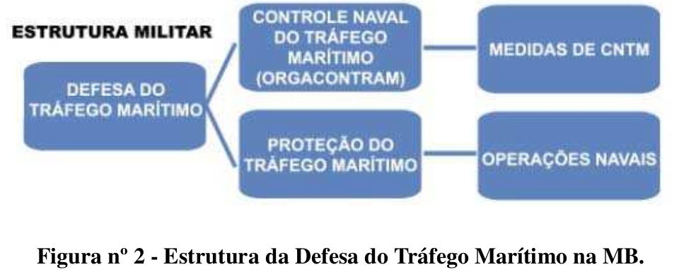

# Capítulo 3 - A Guerra Naval

## Página 13

### 3.1 - CONCEITO DE GUERRA NAVAL 

A guerra naval é a parte constituída por ações militares conduzidas nos espaços marítimos, nas águas interiores e em certas áreas terrestres limitadas de interesse para as operações navais, incluindo o espaço aéreo sobrejacente. Consiste no emprego do Poder Naval, contribuindo para a conquista e a manutenção dos Objetivos Nacionais de Defesa.

### 3.2 - TEATRO DE OPERAÇÕES

O Teatro de Operações (TO) é o espaço geográfico necessário à condução de operações militares, para o cumprimento de determinada missão, englobando o necessário apoio logístico. Seus limites serão inicialmente estabelecidos por ocasião do planejamento estratégico para uma determinada Hipótese de Emprego (HE), podendo ser alterados mediante solicitação do Comandante do Teatro de Operações (ComTO) e autorização do Comandante Supremo (CS), caso necessário. Do ponto de vista operacional, o TO poderá ser subdividido em áreas de responsabilidade, a serem atribuídas a cada uma das Forças Componentes diretamente subordinadas ao ComTO. Quando a magnitude dos meios e a complexidade das ações não justificar a criação de um TO, será estabelecida uma Área de Operações (AOp) necessária à condução das operações militares.

### 3.3 - ORGANIZAÇÃO DAS FORÇAS

Para a execução das operações, os meios do Poder Naval alocados ao ComTO são agrupados por tarefas, de acordo com o Processo de Planejamento Militar. A composição e a organização dos meios dependem da missão a ser cumprida, da situação e das tarefas atribuídas aos vários componentes. As Forças de Fuzileiros Navais são empregadas em Grupamento Operativo de Fuzileiros Navais (GptOpFuzNav), uma organização por tarefas, dependente do valor da tropa, constituída para o cumprimento da missão específica e estruturada, segundo o conceito organizacional de componentes, que grupa os elementos constitutivos de acordo com a natureza de suas atividades. Este modelo organizacional confere flexibilidade e versatilidade, pois combina as capacidades e potencialidades dos meios dos componentes de combate terrestre (incluindo os meios de apoio ao combate), de combate aéreo (incluindo os meios de controle aerotático e defesa antiaérea) e de apoio de serviços de combate, integrados por um componente de comando.

## Página 14

### 3.4 - OPERAÇÕES DE GUERRA NAVAL

A guerra naval comporta diferentes tipos de operações navais. A classificação reflete o caráter geral de seus propósitos que devem concorrer, de alguma forma, para a execução das tarefas básicas do Poder Naval. Uma operação pode implicar a execução de operações componentes, conduzidas por parcela da força principal, com propósitos que contribuam para o cumprimento da missão. Além disso, há casos em que uma operação é apoiada ou complementada por outros tipos. As operações de apoio são assim denominadas quando conduzidas por forças não integrantes da que executa a operação principal. Para a realização de operações componentes ou de apoio, o Comandante superior comum coordena as ações, podendo ocorrer situações em que um dos Comandantes subordinados exerça o controle operacional e tático local das forças, sobretudo em área onde elas interajam, a fim de evitar interferências mútuas. Nos casos em que as relações de comando não forem objeto de menção direta pelo Comandante superior comum, o controle operativo local caberá, em princípio, ao Comandante mais antigo. Caso este não possua estrutura suficiente, a delegação do controle será obrigatória. 

####  3.4.1 - Operação de Ataque 

A operação de ataque é a realizada por meios navais, aeronavais ou de fuzileiros navais, em conjunto ou isoladamente, para a execução de uma ou mais das seguintes tarefas: 

a) destruir ou neutralizar forças navais, aéreas ou terrestres e meios empregados nas comunicações marítimas do inimigo; 
b) interditar comunicações terrestres;
c) reduzir a resistência em área terrestre; e
d) destruir ou danificar objetivos em terra e ao largo do litoral. 

É uma operação que pode concorrer para o estabelecimento, a manutenção e a exploração do Controle de Área Marítima (CAM) ou para a negação do uso do mar pelo inimigo, em quadro estratégico ofensivo ou defensivo. Quando realizada contra objetivos em terra, caracteriza projeção de poder.

A força a ser empregada nesse tipo de operação, particularmente nas fases de disputa, estabelecimento e exploração do CAM, é, preferencialmente, nucleada em NavioAeródromo (NÃe), com aviação orgânica diversificada. O emprego de força de ataque que disponha apenas de navios de superfície, não apoiados por NÃe, será fortemente condicionado pelo grau de ameaça aérea e de submarinos. Se tal ameaça for superior às capacidades de defesa antiaérea e antissubmarino da força, a operação de ataque poderá ser inaceitável.

## Página 15

Os helicópteros de ataque ampliam a capacidade de um grupo de navios de superfície, mas o emprego desses meios aeronavais só será aceitável quando a capacidade de defesa aeroespacial inimiga for reduzida.
 
Os submarinos são, normalmente, as unidades navais capacitadas para operar em áreas onde o inimigo exerce algum grau de controle. Essa capacitação credencia as ações de submarinos para o emprego prioritário em tarefas de negar o uso do mar e reduzir o controle exercido pelo oponente, facilitando a atuação das demais forças.
 
Deve-se buscar a coordenação de ataques aéreos, de superfície e de submarinos, contra meios ou posições vulneráveis, especialmente contra aqueles com potencial para, se atingidos, desequilibrar poderes combatentes.

Em certos cenários de conflito, o tráfego marítimo inimigo poderá não ser objetivo principal, em especial quando não for vital para os esforços em conjunto. Neste caso, as ações devem ser concentradas no ataque a unidades navais e ao transporte marítimo militar, conferindo ao tráfego marítimo o caráter de objetivo eventual. Deve-se, entretanto, considerar que o ataque ao tráfego marítimo poderá ocorrer, visando a desviar os esforços do inimigo em proveito do cumprimento de uma missão prioritária.
 
Embora a postura brasileira seja eminentemente defensiva, as operações de ataque podem ser realizadas quando a análise da conjuntura indicar a conveniência de adotar uma estratégia ofensiva. A gradação da força deve ser sempre considerada, por ocasião do planejamento, explorando-se a característica de versatilidade do Poder Naval.

#### 3.4.2 - Operação Antissubmarino

A operação antissubmarino é a executada contra submarinos, visando negar ao inimigo o uso eficaz desses meios.

O ataque às bases de submarinos e às instalações de comando e controle constitui operação típica de ataque, tratada no tópico anterior.

Pode-se dividi-la em dois grupos. O primeiro visa aos submarinos em trânsito ou posicionados em áreas onde se constituam ameaça potencial, mas não imediata. A eficácia dessas operações depende, fundamentalmente, dos meios de detecção e localização e da capacidade de atacar com rapidez. Esse último requisito pressupõe o emprego de aeronaves dotadas de armamento antissubmarino, capazes de operar em coordenação com os meios de sensoriamento. O segundo grupo abrange operações a serem executadas contra submarinos com possibilidade de detectar ou que tenham detectado as unidades navais ou um comboio a ser protegido. Essas podem ser desencadeadas tanto contra os submarinos que ainda não assumiram posição de ataque, quanto contra aqueles que a assumiram ou que concretizaram o ataque. Havendo escassez de meios, as operações do segundo grupo tornam-se prioritárias. Nessa situação, as operações afastadas só deverão ser consideradas se os submarinos inimigos forem obrigados a transitar ou se posicionar em áreas focais, sendo indicado o emprego de aeronaves e submarinos. 

## Página 16

#### 3.4.3 - Operação Anfíbia

A Operação Anfíbia (OpAnf) é uma operação naval lançada do mar, por uma ForçaTarefa Anfíbia (ForTarAnf), sobre região litorânea hostil, potencialmente hostil ou mesmo permissiva, com o propósito principal de introduzir uma Força de Desembarque (ForDbq) em terra para cumprir missões designadas.

A OpArf pode ser empregada na tarefa básica do Poder Naval de projetar poder sobre terra, que contribua para o controle de área marítima e para a negação do uso do mar. Em tempo de paz, ela pode ser adequada para cumprir múltiplos propósitos, em proveito das atividades de emprego limitado da força ou nas atividades benignas. Esta operação comporta geralmente as modalidades: assalto anfíbio, demonstração anfíbia, incursão anfíbia, projeção anfíbia e retirada anfíbia.

Deve-se considerar que projeção de tropa anfíbia em terra é o que caracteriza a OpAnf contemporânea, não importando o grau de hostilidade do ambiente, nem o tipo de missão a ser cumprida.

**a) Assalto Anfíbio**

A modalidade mais completa de OpAnf é o assalto anfíbio, que se refere a um ataque lançado do mar para, mediante um desembarque, estabelecer uma ForDbq em terra. Pode ter como efeitos desejados:

▪️conquista de área de interesse para a condução da guerra naval ou aérea, para o estabelecimento de base avançada ou para propiciar o início ou o apoio de uma campanha terrestre;
▪️conquista de área terrestre, continental ou insular, que controle áreas marítimas restritas ou áreas de trânsito para prover segurança às Linhas de Comunicação Marítimas (LCM) amigas ou ameaçar as LCM inimigas;
▪️fixação de forças navais inimigas em áreas marítimas afastadas daquelas que sejam prioritárias para o desenvolvimento de suas operações;
▪️conquista de área terrestre onde estão localizadas bases inimigas;
▪️negação ao inimigo do uso de uma área conquistada; e
▪️apoio a operações em terra.

## Página 17

O assalto anfíbio observa as fases de planejamento, de embarque, de ensaio, de travessia e de assalto. Essa sequência natural pode ser alterada devido à premência de tempo para deslocar a ForTarAnf ou devido ao sigilo da operação. Nessas situações, o embarque ocorreria antes do planejamento.

A subordinação do Comandante da Força de Desembarque (ComForDbg) ao Comandante da Força-Tarefa Anfíbia (ComForTarAnf) ocorrerá a partir do início do embarque da tropa e de seu material. Na eventualidade de o embarque ocorrer antes da fase do planejamento, a subordinação anteriormente citada não deve ser prevalecer, tendo em vista a necessidade de se observar o paralelismo entre os dois comandos durante a condução do planejamento.

O ComForTarAnf tem sob sua responsabilidade uma área geográfica, a Área do Objetivo Anfíbio (AOA), onde se incluem a Área de Desembarque (ADbg) e os espaços marítimo, terrestre e aéreo necessários ao cumprimento da missão.

Antes e durante a fase do assalto podem ser executadas operações preparatórias, conduzidas pela Força de Apoio, Força Avançada ou, até mesmo, por componentes da própria ForTarAnf.

A execução de OpAnf requer a obtenção do Controle do Ar (tarefa básica da Força Aérea) e de elevado grau de CAM na AOA, que se associados ao princípio da surpresa aumentará a probabilidade de êxito, sobretudo no caso da incursão anfíbia. Requer-se, também, capacidade para prover segurança ao tráfego de apoio, entre as bases e a AOA. Demanda meios capazes para transportar com segurança a tropa e seu equipamento de combate e de apoio, para desembarcá-los com rapidez e para proporcionar à ForDbq apoio de fogo aéreo, apoio aerotático, apoio logístico e apoio de fogo naval.

A ForDbq deve ter condições de conquistar, rapidamente, ponderável superioridade sobre o inimigo na Cabeça de Praia (CP), de modo a cumprir sua missão antes que ele receba reforços ou se rearticule. Esse requisito é facilitado ou garantido pelo êxito nos despistamentos estratégico e tático. Enquanto o estratégico é realizado fora da AOA para dissimular a localização da Força, o tático é realizado na AOA para encobrir a ADbq. Dessa forma, pretende-se que o inimigo movimente suas forças e tome decisões que favoreçam o desembarque.

## Página 18

Em quaisquer circunstâncias, o controle das operações aéreas na AOA será desempenhado, inicialmente, pelo ComForTarAnf, podendo ser transferido ao ComForDbg, quando este tenha condições de exercê-lo em terra.

O ComForDbq exerce, primeiramente, seu comando a partir de bordo. Quando tiver sido estabelecido em terra um sistema de comando e controle que permita o pleno exercício das atividades de sua Força, o ComForDbq poderá cumpri-lo a partir de terra, mantendo-se subordinado ao ComForTarAnf. A ForTarAnf continuará executando suas tarefas até o término da operação, evidenciado pelo cumprimento de sua missão.

O desembarque da tropa que dará continuidade à eventual campanha terrestre, realizado após a consolidação da CP, não é considerado como parte componente de uma OpAnf. A transferência do controle das ações em terra, da ForDbq para a tropa terrestre responsável, deve ser objeto de decisão do ComTO. Após o término da operação, a ForDbq poderá, a critério do ComTO, ser empregada em operações subsequentes em terra.

**b) Demonstração Anfíbia**

A demonstração anfíbia compreende a aproximação ao território inimigo por forças navais, inclusive com meios que caracterizam uma OpAnf, sem o efetivo desembarque de tropas. Tem como efeitos desejados:
▪️demonstração de força;
▪️confusão do inimigo quanto ao local da operação principal; e
▪️indução do inimigo a empreender ações que nos sejam favoráveis.

**c) Incursão Anfíbia**

A incursão anfíbia compreende uma rápida penetração ou a ocupação temporária de um objetivo em região litorânea hostil ou potencialmente hostil, seguida de uma retirada planejada. A ForDbqg de uma incursão anfíbia é denominada de Força de Incursão. Esta modalidade de OpAnf não se caracteriza pelo emprego de forças de menor vulto, nem pela duração da operação, mas sim pelo fato de haver uma retirada planejada. Tal operação pode ter como efeitos desejados:
▪️destruição ou neutralização de forças navais inimigas em suas bases, ou os seus pontos de apoio logístico, sejam eles continentais ou insulares;
▪️redução do poder inimigo, pela destruição ou neutralização de objetivos importantes;
▪️obtenção de informações;
▪️confusão do inimigo quanto ao local da operação principal;
▪️salvaguarda da vida humana;
▪️captura, evacuação ou resgate de pessoal e material de interesse; e
▪️apoio a operações em terra.

## Página 19

**d) Projeção Anfíbia**

A projeção anfíbia utiliza-se das capacidades intrínsecas do conjugado anfíbio para introduzir em área de interesse, a partir do mar, meios para cumprir tarefas diversas em apoio a operações de guerra naval ou relacionadas, dentre outras contingências, com a prevenção de conflitos e a distensão de crises. É, também, apropriada para a condução de atividades de emprego limitado da força e benignas, tais como Operação de Evacuação de Não Combatentes (OpENC), operações de apoio a uma Força de Paz, resposta a desastres ambientais e operação humanitária.

**e) Retirada Anfíbia**

A retirada anfíbia consiste na retirada ordenada e coordenada de forças de uma região litorânea hostil ou potencialmente hostil, por meio de navios, embarcações ou aeronaves embarcadas. Tem como efeitos desejados: 
▪️desengajamento do inimigo cujo poder de combate seja superior; e
▪️emprego da força em outra região.

#### 3.4.4 - Operações de Minagem e de Contramedidas de Minagem

**a) Operação de Minagem**

A operação de minagem consiste no lançamento criterioso de minas em áreas selecionadas, a fim de destruir navios ou meios terrestres inimigos, ou ainda, pela ameaça que representa, para conter, limitar ou retardar o seu trânsito. É tradicionalmente associada ao conceito de desgaste, ou seja, ao enfraquecimento das forças inimigas. Pode ser útil em um conflito de curta duração, porque o simples retardamento do trânsito, sobretudo de unidades navais ou força terrestre inimigas, pode constituir um efeito desejado.

## Página 20

Os campos minados ofensivos são plantados em águas ou áreas terrestres disputadas ou controladas pelo inimigo, enquanto os defensivos são empregados em áreas sob controle de quem os planta. A decisão de efetuar uma operação de minagem numa área será atribuição do ComTO, quando a minagem tiver propósitos estratégicos que afetem a campanha, e considerará as implicações com o Direito Internacional. Entretanto, um Comandante de Força Naval Componente ou o Comandante de Grupamento Operativo poderá tomar tal decisão, no caso de campos defensivos e restritos, ou de campos táticos vinculados à execução de uma operação, desde que tal decisão não contrarie orientação do ComTO. O planejamento do campo de minas depende do(a):

▪️efeito desejado de impedimento, restrição ou retardamento do trânsito;
▪️localização e da configuração da área, incluídas suas características terrestres ou hidroceanográficas;
▪️disponibilidade de minas;
▪️reação esperada contra os lançadores; e
▪️capacidade inimiga de contramedidas de minagem.

As minas podem ser lançadas por aeronaves, submarinos, navios de superfície e por fuzileiros navais.

A aeronave é o único meio capaz de minar com segurança águas já minadas, o que impõe seu uso quando se tratar de reminagem ou de minagem em campo defensivo do inimigo.

Os submarinos podem penetrar em uma área controlada pelo inimigo, plantar minas de acordo com um padrão mais preciso que o obtido por aeronave e evadir-se sem revelar a presença. Entretanto, como eles não podem operar em áreas já minadas, a manutenção de um campo minado por submarinos dependerá da possibilidade de reminá-lo por aeronaves.

Os navios de superfície não são indicados para minar área sob controle inimigo. Seu emprego se restringe à minagem defensiva ou ao lançamento de grandes campos estratégicos, em áreas onde seja possível estabelecer o grau de controle necessário à operação em curso.

As unidades operativas de fuzileiros navais são aptas a lançarem minas terrestres, desde que orientadas tecnicamente. O Brasil é signatário da Convenção sobre a Proibição do Uso, Armazenamento, Produção e Transferência de Minas Antipessoal e sobre sua Destruição, assumindo o compromisso de não empregar minas terrestres antipessoal. Entretanto, em função da participação de militares da Marinha do Brasil (MB) em missões de desminagem em países estrangeiros, de cunho humanitário, é necessário que seja mantido o adestramento com esse tipo de minas, particularmente nas técnicas de lançamento, abertura de passagens em campos minados e limpeza de áreas.

## Página 21

**b) Operação de Contramedidas de Minagem**

A operação de Contramedidas de Minagem (CMM) ou de “Mine Countermeasures” (MCM) consiste na execução de ações ativas e passivas que visem a reduzir ou controlar a ameaça constituída pelas minas já lançadas pelo inimigo. Tem como efeito desejado a liberação do trânsito de navios de guerra e mercantes, normalmente, em áreas marítimas de passagem obrigatória ou na entrada e saída de portos ou bases navais, visando a reduzir ou a controlar a ameaça constituída pelas minas lançadas pelo inimigo. As CMM, quanto ao conceito de emprego dos meios, podem ser ofensivas ou defensivas. As ofensivas compreendem ataques aos agentes lançadores. As defensivas são representadas por contramedidas ativas e passivas. Nas contramedidas ativas, incluem-se a varredura e a caça de minas. Nesta, podem ser utilizados mergulhadores devidamente qualificados e veículos submersos não tripulados (“unmanned underwater vehicles”), remotos ou autônomos. Nas passivas, incluem-se as medidas de autoproteção dos navios de superfície e submarinos (redução de ruídos irradiados e redução do magnetismo permanente e residual pelos processos de “deperming” e “degaussing”, respectivamente).

**3.4.5 - Operação de Esclarecimento**

A operação de esclarecimento visa à obtenção de informações necessárias para orientar o planejamento e o emprego de forças. Comporta quatro modalidades:

**a) Busca**

A busca consiste na investigação sistemática de determinada área, com o propósito de localizar um objeto que se supõe ou que se sabe estar naquela área, ou de confirmar sua ausência, ou obter informações essenciais para o planejamento ou prosseguimento das operações.

**b) Patrulha**

A patrulha consiste na procura sistemática e contínua ao longo de uma linha de barragem, com o propósito de impedir que um objeto a cruze sem ser localizado.

**c) Acompanhamento**

O acompanhamento tem como propósito obter informações continuadas sobre os movimentos e a composição de alvos ou forças, após sua detecção e localização.

**d) Reconhecimento**

O reconhecimento tem como propósito obter informações referentes às atividades e aos meios do inimigo, ou ainda coletar dados meteorológicos, hidroceanográficos, geográficos, eletromagnéticos entre outros, atinentes à área provável de operações. Pode ocorrer complementar e simultaneamente em qualquer outra modalidade de esclarecimento.

## Página 22

Os sistemas de sensoriamento remoto, com o emprego de satélites ou de Aeronaves Remotamente Pilotadas (ARP), são indicados para o esclarecimento de grandes extensões marítimas e áreas terrestres de interesse, sob o controle do inimigo. Na inexistência de um sistema de sensoriamento, as aeronaves possuem características que também favorecem o estabelecimento de linhas de barragem que visem à detecção antecipada das forças inimigas, logo após a saída de suas bases ou no trânsito para a área focal. Entretanto, no caso de emprego de aeronaves, haverá riscos na eventualidade de o inimigo exercer o Controle do Ar.

Os submarinos também podem realizar operação de esclarecimento em áreas controladas pelo inimigo, ou contribuir para a infiltração de elementos de Operações Especiais (OpEsp) nessas áreas para o mesmo fim. Entretanto, o Poder Naval estará reduzindo sua capacidade de adotar ações eminentemente ofensivas.

De qualquer modo, em uma operação de esclarecimento, é preciso adotar precauções para evitar que o inimigo possa inferir as ações subsequentes. Assim, é recomendável que esclarecedores tenham adequada capacidade de conduzir ações de guerra eletrônica, visando garantir, caso necessário, o sigilo das operações.

As modalidades da operação de esclarecimento podem ser realizadas por meios navais, aeronavais e de fuzileiros navais adjudicados ao ComTO, ou por meios de forças amigas. O planejamento deve ser disseminado aos Comandantes de forças ou unidades que estiverem na área abrangida, a fim de evitar interferência mútua.

**3.4.6 - Operação de Bloqueio**

No contexto naval e de acordo com o Direito Internacional, a operação de bloqueio tem por finalidade evitar que navios de todos os Estados, inimigos e neutros, entrem ou satam de específicos portos e áreas costeiras pertencentes, ocupadas, ou sob controle de um Estado inimigo. O propósito é negar o uso de navios, inimigos e neutros, assim como de transportar pessoal e material para o território inimigo. Enquanto o direito beligerante de visita e inspeção visa a interditar o fluxo de contrabando, o direito do bloqueio tem como propósito impedir que navios, independentemente de suas cargas, cruzem uma barreira, estabelecida e tornada pública, que separa o inimigo de águas internacionais.

## Página 23

Um bloqueio deve obedecer aos seguintes critérios, previstos nas regras do Direito Internacional, de maneira a ser considerado válido:

**a) Estabelecimento**

Um bloqueio deve ser estabelecido pelo governo de um Estado beligerante. Isso normalmente é realizado pela declaração do governo beligerante ou pelo Comandante da força de bloqueio, agindo em nome de seu governo. A declaração especificará a data de início, a duração, os limites geográficos e o período de graça dado às embarcações neutras para deixar a área a ser bloqueada.

**b) Notificação**

É consuetudinário que o Estado beligerante responsável pelo estabelecimento do bloqueio notifique a todos os Estados afetados pela imposição do bloqueio. Tendo em vista que o conhecimento da existência de um bloqueio é um elemento essencial na identificação de atos de furo ou tentativa de quebra de bloqueio, navios neutros são sempre notificados.

**c) Eficácia**

O bloqueio deve ser eficaz. Para tanto, deve ser mantido por meio de forças de superfície, aéreas e ou de submarinos, ou por outros métodos e meios legítimos suficientes para tornar perigosa a tentativa de entrar ou sair da área bloqueada. Este requisito não impede a ausência temporária da força de bloqueio, se decorrente da existência de condições meteorológicas adversas ou outra razão qualquer relacionada ao bloqueio (por exemplo, perseguição a um meio que não respeitou a barreira). Não significa que todas as possíveis rotas de aproximação sejam contínua e simultaneamente cobertas.

**d) Imparcialidade**

O bloqueio deve ser aplicado imparcialmente aos navios de todos os Estados.

**e) Limitações** 

Um bloqueio não deve barrar o acesso ou partida de áreas costeiras e portos neutros. Estados neutros detêm o direito de se engajarem nas atividades comerciais neutras que não envolvam o comércio ou as comunicações originadas na área bloqueada ou a ela destinada. Um bloqueio é proibido se o único propósito é trazer fome à população civil ou negá-la outros bens essenciais para sua sobrevivência.

Embora, por força da tradição, se classifique o bloqueio como uma operação típica, na verdade pode envolver um conjunto de operações, tais como:

- ataque por submarinos, nos limites geográficos do bloqueio;
- minagem ofensiva em áreas de maior concentração do trânsito inimigo;
- operação de esclarecimento associada à de ataque por forças capazes de interceptar e destruir os meios que não respeitem o bloqueio; e
- operações terrestres de caráter naval, defensivas e ofensivas.

## Página 24

### 3.4.7 - Operação de Apoio Logístico Móvel

A operação de apoio logístico móvel consiste em prover necessidades logísticas às forças em operação no mar.

De um modo geral, os meios de apoio logístico móvel constituem parte da organização por tarefas da força, embora possa haver casos em que pertençam à força amiga, sendo fundamental uma perfeita coordenação entre os comandos, a fim de assegurar o eficaz apoio.

Qualquer meio naval ou aéreo pode ser utilizado, mas o emprego de unidades especializadas maximiza a efetividade das funções logísticas — engenharia, manutenção, recursos humanos, salvamento, saúde, suprimento e transporte — para sustentar a capacidade de qualquer outra operação e de permanência na ação das forças navais.

O transporte de um porto a outro, em apoio logístico a um TO, não é uma operação de apoio logístico móvel típica de guerra naval. Trata-se de tráfego marítimo, que merece controle e proteção especiais.

### 3.4.8 - Operações Especiais

As OpEsp são aquelas realizadas por pessoal adequada e rigorosamente selecionado e intensivamente adestrado, empregando métodos, táticas, técnicas, procedimentos e equipamentos não convencionais, visando à consecução de objetivos dos níveis político, estratégico, operacional e tático. Normalmente, são operações de duração limitada, em função do reduzido efetivo empregado e da dificuldade de ressuprimento. Podem ser conduzidas tanto em tempo de paz quanto em períodos de crise ou conflito armado; em situações de normalidade ou não normalidade institucional; de forma ostensiva, sigilosa ou coberta; em áreas negadas, hostis ou politicamente sensíveis; independentemente ou em coordenação com operações realizadas por forças convencionais; em proveito de comandos de nível estratégico, operacional ou tático.

O sigilo, a rapidez, a surpresa e a agressividade das ações são as condições essenciais para o sucesso desse tipo de operação. Os elementos de OpEsp, quando agrupados e equipados para a execução deste tipo de operação, são considerados meios. Desta 
forma, é indispensável que os militares nelas empregados possuam condições físicas e psicológicas adequadas para o exercício de atividades complexas, em ambiente de risco elevado. No contexto da MB, devem ser respeitadas as especificidades da formação e preparo dos integrantes e dos elementos de OpEsp, adequando-os para o emprego, preferencialmente, no ambiente marítimo ou a partir dele, nas águas interiores e em certas áreas terrestres limitadas de interesse para as operações navais.

## Página 25

### 3.4.9 - Operação de Defesa de Porto ou de Área Marítima Restrita

A operação de defesa de porto ou de área marítima restrita tem como efeito desejado o impedimento ou a neutralização de ataques contra um porto ou fundeadouro, seus acessos, ou áreas litorâneas ou fluviais de dimensões limitadas que contenham instalações de interesse. Terminais marítimos ou fluviais, usinas nucleares e instalações industriais situadas na região litorânea são exemplos de instalações que poderão ser objetivos terrestres a serem defendidos. Ela abarca a utilização de meios navais, aeronavais e de fuzileiros navais, sistemas de sensores e outros de proteção para realizar, dentre outras, operações de minagem defensiva, CMM e esclarecimento, além de ações de defesa propriamente dita, vigilância e medidas de segurança orgânica de meios e instalações. Todos os meios e pessoal envolvidos nesse tipo de operação ficarão sob a autoridade do Comandante da Defesa de Porto ou Comandante da Defesa de Área Marítima Restrita.

Os navios da MB surtos em um porto, impossibilitados de se movimentar, podem colaborar com a defesa, sob a coordenação do Comandante da Defesa de Porto. Entretanto, os meios em condições operativas normais, embora também possam colaborar, não devem se restringir por essa operação. O planejamento deve prever um rápido fluxo de informações, entre os meios nela envolvidos diretamente e as demais organizações militares da área, de modo a permitir a reação oportuna.

Neste tipo de operação, é muito provável a cooperação com outros órgãos governamentais e entidades civis. A MB deverá estar preparada para assumir a coordenação das ações necessárias.

Poderá haver circunstâncias quando algum porto de interesse, fora do TO, deva ser defendido. Em se tratando de porto em território nacional, a defesa caberá ao ComTO, quando o porto se localizar dentro do TO, ao Comandante da Zona de Defesa, quando o porto se situar dentro da Zona de Defesa (ZD), ou à MB, quando o porto estiver fora do TO e da ZD. Entretanto, se fora do território nacional, caberá ao ComTO, quando o porto se localizar dentro do TO, ou ao Comandante da Força Expedicionária, quando o porto se situar fora do TO.

## Página 26

### 3.4.10 - Operação de Defesa do Tráfego Marítimo

O Poder Naval é responsável pela Defesa do Tráfego Marítimo, cujo efeito desejado é o impedimento ou a dissuasão de ações que representem ameaça nas Águas Jurisdicionais Brasileiras (AJB) e nas LCM onde houver interesses nacionais, nos termos do Direito Internacional. A operação de Defesa do Tráfego Marítimo caracteriza-se por medidas defensivas e ofensivas, dentre outras a designação de escoltas para os comboios e grupos de pesca, o emprego de cobertura, o esclarecimento de rotas, o desvio tático de comboios/grupos de pesca e de navios independentes e as CMM em áreas de concentração de tráfego mercante, como portos, canais e estreitos marítimos (“choke points”).

A Defesa do Tráfego Marítimo compreende o Controle Naval do Tráfego Marítimo e a Proteção do Tráfego Marítimo.

A Figura nº 2 apresenta a estrutura da Defesa do Tráfego Marítimo em vigor na MB.

**a) Controle Naval do Tráfego Marítimo**

O Controle Naval do Tráfego Marítimo (CNTM) se traduz pelo conhecimento e intercâmbio de informações relativas aos navios mercantes nos portos nacionais e estrangeiros e das ameaças que possam pôr esses meios em risco quando em trânsito. É executado pela Organização de Controle Naval do Tráfego Marítimo (ORGACONTRAM), em coordenação com a Organização da Direção Civil do Transporte Marítimo (ORGDCTM) e Organização da Direção Civil da Pesca (ORGDCP), quando ativadas. O CNTM, em situação de conflito, pode variar desde a liberdade para os navios mercantes e embarcações de pesca obedecerem, a seu critério, as medidas da ORGACONTRAM, até eventualmente alcançar um nível de controle onde os navios selecionados devam cumprir, compulsoriamente, as determinações do Comandante de Área Marítima. Esse normalmente será uma Autoridade de Controle Operativo (ACO) ou uma Autoridade de CNTM com delegação. 

**b) Proteção do Tráfego Marítimo**

A Proteção do Tráfego Marítimo compreende a adoção de medidas ofensivas e defensivas, cujo efeito desejado é o impedimento ou a dissuasão das ações de forças adversas contra o tráfego marítimo de interesse. Enquanto as medidas ofensivas contam com operações de guerra naval, cujo objetivo militar é representado pelas forças adversas, as defensivas têm como objetivo o tráfego marítimo de interesse. 

## Página 27

A ORGACONTRAM será ativada, em seu todo ou em parte, pelo Comando de Operações Navais, consultado o Comando Supremo, quando se tornar necessário ampliar a segurança do tráfego marítimo de interesse do Brasil. Ela poderá ser ativada, mesmo não tendo ocorrido o estabelecimento de um TO.

Em caso de conflito, à ORGACONTRAM poderá ou não se subordinar, de forma integral ou parcial, ao Comandante da Força Naval Componente, em função do tamanho e da localização do TO, estruturada em uma ACO para determinada área marítima e auxiliada por Oficiais de Controle Naval do Tráfego Marítimo.

Figura nº 2 - Estrutura da Defesa do Tráfego Marítimo na MB.

**3.4.11 - Operação de Informação**

A Operação de Informação (OpInfo) é o conjunto de ações coordenadas dirigido para alcançar superioridade no ambiente informacional, por meio da negação, exploração, degradação ou destruição da informação e redes associadas oponentes, reais ou potenciais, enquanto protege suas próprias do ataque adversário. Pode ser desencadeada por meio da operação psicológica e das ações de guerra eletrônica, de guerra cibernética e de despistamento, além de medidas de segurança orgânica e das informações digitais. A destruição física dos alvos de comando e controle, embora parte integrante da OpInfo, será levada a cabo por intermédio de operações de ataque ou especiais, podendo haver o concurso de ações de superfície, de submarinos e/ou aeronavais.

**3.4.12 - Operação de Interdição Marítima**

A Operação de Interdição Marítima (OIM) ou “Maritime Interdiction Operation” (MIO) se refere ao conjunto de esforços para monitorar, interrogar, interceptar e, se necessário, abordar tráfego marítimo em uma área definida, para verificar, redirecionar, apreender suas cargas ou apresar embarcações, na aplicação de sanções contra outros Estados, como aquelas em apoio às resoluções do Conselho de Segurança das  Unidas e/ou para prevenir o transporte de itens restritos. As unidades engajadas em OIM, normalmente, executam as seguintes tarefas:

## Página 28

- enviar o Grupo de Visita e Inspeção (GVT) e, conforme a evolução da situação, a Guarnição de Presa (GP)[1] para abordar e, se necessário, apresar embarcações em trânsito numa determinada área, ou dela saindo, em caso de direito de perseguição. Em função do grau de risco envolvido, o envio do (a) GVI/GP poderá ser precedido pela visita de um destacamento de abordagem especializada, composto por Mergulhadores de Combate (MEC);

- procurar por evidências de itens proibidos; 
- redirecionar os navios que não cumprirem as normas determinadas pelas sanções; e 
- apresar embarcações que recusem a cumprir a ordem para desviar rumo.

[1] Nas doutrinas navais estrangeiras, as ações executadas pelo(a) GVI/GP são conhecidas pelo acrônimo VBSS (“visit, board, search and seizure”).

**3.4.13 - Operação Psicológica**

A operação psicológica, que inclui as ações psicológicas e a guerra psicológica, compreende atividades políticas, militares, econômicas e psicossociais planejadas e conduzidas para criar em grupos (inimigos, hostis, neutros e/ou amigos) emoções, atitudes ou comportamentos favoráveis à consecução dos objetivos nacionais. Contemplam medidas preventivas, desencadeadas em caráter permanente, que têm como propósitos evitar o emprego prematuro da força, impedir ou dificultar a eclosão e o agravamento de uma situação de perturbação da ordem. Normalmente abrangem atividades de preparo de tropa, inteligência e comunicação social. A operação civil-militar, as OpEsp e a Ação Cívico-Social (ACISO) contribuem com a operação psicológica, pois influenciam comportamentos favoráveis da população civil. Quanto ao nível de atuação, a operação psicológica é considerada: 
- estratégica, quando presta apoio a ações nos diversos campos do Poder Nacional e nos níveis estratégicos nacional e setorial, facilitando a consecução dos objetivos selecionados. Tem atuação permanente, com resultados duradouros a médio e longo prazos; e 
- tática, quando em apoio à execução de operações militares, com planejamento e execução a cada operação militar, obtendo resultados a curto e médio prazos.

#### 3.4.14 - Operação de Busca e Resgate em Combate ou de Combate SAR

A operação de busca e resgate em combate ou de combate SAR consiste na coordenação, sob comando único, de ações de busca, localização, identificação e resgate, especialmente, de tripulantes de aeronaves abatidas ou acidentadas em ambiente operacional incerto ou hostil e, caso necessário, de pessoal isolado em perigo, treinado e equipado para ser resgatado.

## Página 29

Esta operação requer elementos de OpEsp para o planejamento e execução, os quais serão ditados pela ameaça, condições dos sobreviventes e disponibilidade de meios a serem empregados (materiais e humanos). Não havendo equipamento e pessoal especializados em combate SAR, em situações onde a existência de sobreviventes e sua localização tenham sido confirmadas, poderá ser desencadeada, após criteriosa avaliação dos riscos envolvidos, uma ação de Recuperação Tática de Pessoal e Aeronave (RTPA). Tal ação, mais simples que uma operação completa de combate SAR, por não envolver uma busca extensa ou prolongada, utilizará meios já disponíveis da própria força no TO. Durante uma OpAnf e outras operações que envolvam ações terrestres, os GptOpFuzNav deverão estar aptos a conduzir o resgate de tripulação, passageiros e equipamentos de aeronave abatida sobre terra, podendo utilizar qualquer meio a seu dispor.

A operação de combate SAR é fundamentalmente diferente das operações de socorro e de salvamento, pois estas são conduzidas rotineiramente durante tempo de paz, em ambiente permissivo.

#### 3.4.15 - Operação Ribeirinha

A Operação Ribeirinha (OpRib), que pode ser conjunta ou singular, é aquela realizada com o propósito de obter e manter o controle de parte ou toda uma Área Ribeirinha (ARib), ou para negá-la ao inimigo. Entende-se por ARib a que compreende hidrovia fluvial ou lacustre, terreno e espaço aéreo sobrejacente, caracterizada por linhas de comunicações terrestres limitadas e pela existência de extensa superfície hídrica ou rede de hidrovias interiores (rios principais e seus afluentes, braços de rios, canais, lagos e lagoas), que servem de delimitação de fronteira, via de penetração estratégica ou rotas essenciais ou principais para o transporte de superfície. Estão incluídas como OpRib o controle de linhas de comunicações fluviais e as escoltas de meios fluviais por estas linhas.

O conceito da operação fundamenta-se no princípio de que é inviável o controle de hidrovias interiores sem o controle das áreas terrestres que lhes são adjacentes e viceversa. O estabelecimento e a manutenção do controle das linhas de comunicação fluviais serão as prioridades do Poder Naval na OpRib, particularmente quando em operação conjunta. Portanto, para a MB, caracteriza-se pela forte associação à calha do rio. Normalmente, não se aprofunda no terreno. As unidades tarefas de fuzileiros navais,
diferentemente do que ocorre em uma OpAnf, estão permanentemente ligadas aos navios e embarcações orgânicas, para assegurar o controle de margens. Não raro, unidades, ou partes destas, progridem de um ponto de terra a outro em embarcações rápidas, de acordo com a situação tática. Dessa forma, navios, aeronaves, embarcações e equipamentos da tropa devem ter compatibilidade. Embarcações, com frações da tropa, navegam permanentemente em defesa dos navios, principalmente durante o trânsito em locais estreitos das calhas dos rios e, reciprocamente, são cobertas pelo armamento dos navios. Aquelas realizam reconhecimento em pontos avançados da derrota ou breves incursões em terra. O helicóptero orgânico é outro elemento integrado. Assim, o adestramento para esta operação deve ser específico, diferindo consideravelmente de uma OpAnf.

## Página 30

A força que executa tal operação é, normalmente, denominada Força-Tarefa Ribeirinha (ForTaRib). A seu Comandante são atribuídos meios navais, terrestres e aéreos, estruturados em organização por tarefas, para a execução de uma missão específica em uma ARib.

Dependendo da situação, a OpRib poderá ser uma operação complexa, que exigirá a execução de ações de vários tipos e de operações prévias, componentes ou de apoio, realizadas por elementos da ForTaRib ou das forças amigas, conforme planejamento que atenda às necessidades daquela força. Quando se tratar de uma operação singular, o Comandante da ForTaRib (ComForTaRib) poderá ser um oficial do Corpo da Armada ou do Corpo de Fuzileiros Navais. Será do Corpo da Armada, caso o efeito desejado seja o controle das hidrovias ou a negação de seu uso ao inimigo, com preponderância de esforço naval. Será do Corpo de Fuzileiros Navais, caso tal efeito desejado seja o controle de áreas terrestres, onde ocorre o esforço principal, cabendo aos meios navais o apoio. Esse conceito é válido também, para o caso dos Comandantes dos componentes da organização por tarefas. Quando se tratar de uma operação conjunta, o ComForTaRib poderá ser um oficial do Corpo da Armada, do Corpo de Fuzileiros Navais ou do Exército. Poderá ser do Exército quando o efeito desejado da OpRib for o controle de áreas terrestres que envolvam objetivos principais muito aprofundados no terreno.

Os exercícios programados de OpRib devem considerar a necessidade de um período de adaptação do combatente ao ambiente ribeirinho e, quando for o caso, de adoção de medidas para incrementar a interoperabilidade quando envolver outras Forças Armadas (FA).

## Página 31

#### 3.4.16 - Operação Terrestre de Caráter Naval

A operação terrestre de caráter naval consiste naquela desenvolvida em terra pelo Poder Naval no curso da campanha. Sua importância, no cenário atual, decorre principalmente da estreita inter-relação entre o ambiente marítimo e as áreas litorâneas adjacentes e suas influências mútuas. Ela pode ser defensiva ou ofensiva. A defensiva normalmente tem como efeito desejado a garantia da integridade de instalações navais ou outras áreas de interesse. A ofensiva visa à conquista ou ocupação de área necessária ao prosseguimento da campanha, podendo ocorrer subsequentemente a uma OpAnf, por exemplo. Nesta operação, poderão ser empregados componentes das unidades tarefas de fuzileiros navais ou elementos de OpEsp, que deverão preservar suas características de parcela intrínseca e inseparável do Poder Naval.

#### 3.4.17 - Operação Civil-Militar

A operação civil-militar é o conjunto de atividades planejadas que busca estabelecer, manter influência ou capitalizar as interações e as relações de cooperação e coordenação entre as forças militares, a população civil e as autoridades e organizações governamentais ou não governamentais, a fim de contribuir para a condução de outras operações e ações, bem como a conquista de objetivos militares. Ela pode ser conduzida em ambiente hostil, incerto ou permissivo e diferencia-se das ACISO, por ter sempre um propósito militar imediato e não ser meramente assistencialista. Pode envolver o emprego de forças militares em atribuições e funções que são, normalmente, da responsabilidade do governo local, regional ou nacional. Esta pode ocorrer antes, durante ou depois de outras operações ou ações militares, tais como as especiais, de informação, a psicológica, de garantia da lei e da ordem, a humanitária ou de paz, e com as atividades de assuntos civis e de comunicação social.

#### 3.4.18 - Operação de Inteligência

A operação de inteligência compreende um conjunto de ações de busca, com o emprego de técnicas operacionais e meios especializados, tendo como efeito desejado a obtenção de dados de interesse militar cujo conhecimento é negado. Sua execução requer planejamento detalhado e centralizado, assim como pessoal qualificado e adestrado para esse tipo de atividade. Além do homem, a tecnologia é bastante explorada na obtenção dos dados negados. Alguns exemplos do emprego da operação de inteligência são o sensoriamento remoto na modalidade reconhecimento da operação de esclarecimento, as Medidas de Apoio à Guerra Eletrônica, as ações de guerra cibernética e as OpEsp.

Os dados obtidos pela operação de inteligência complementam os selecionados pela atividade de coleta, possibilitando a formulação dos conhecimentos necessários para a elaboração de planos militares decorrentes, nos seus mais diversos níveis, bem como para a adequada compreensão da consciência situacional marítima.

## Página 32

#### 3.4.19 - Operação de Defesa de Ilhas e Arquipélagos Oceânicos 

A operação de defesa de ilhas e arquipélagos oceânicos é aquela que consiste no somatório de quatro tarefas principais: 
- estabelecer defesa terrestre em uma ou mais ilhas; 
- controlar a área marítima circunvizinha, em termos ideais, ou, no mínimo, negar o uso do mar nesta área; 
- controlar o espaço aéreo sobrejacente à(s) ilha(s) e à área marítima circunvizinha; e 
- manter o apoio logístico às forças na(s) ilha(s), particularmente por via marítima.

A defesa das ilhas oceânicas, de responsabilidade dos fuzileiros navais, será executada por GptOpFuzNav, que pode contar com um componente de patrulha costeira para execução das ações de vigilância aproximada e combate, dentro de suas possibilidades. Esta operação poderá ser conjunta e contar com a participação de meios de Força Aérea e/ou meios de Exército, estes contribuindo, particularmente, para a defesa antiaérea e a defesa de costa. 

### 3.5 - AÇÕES DE GUERRA NAVAL

As ações de guerra naval correspondem a técnicas, táticas e procedimentos, empregados em uma operação, podendo ser classificadas, segundo o critério dos meios ou do ambiente que caracterizam o esforço principal.

#### 3.5.1 - Ações de Defesa Aeroespacial

As ações de defesa aeroespacial são aquelas adotadas para se opor à ameaça aeroespacial, reduzir ou anular a sua eficácia. Em outros termos, implica o desenvolvimento de ações necessárias para manter em nível aceitável as perdas ou danos causados pelo ataque adversário. A defesa aeroespacial é aplicável tanto a uma Força Naval ou de fuzileiros navais como a uma Organização Militar terrestre. Compreende a defesa aeroespacial ativa e passiva.

## Página 33

**a) Defesa Aeroespacial da Força Naval ou de Fuzileiros Navais**

A defesa aeroespacial ativa é realizada contra os vetores aeroespaciais inimigos em voo. É composta pela: defesa aérea, conjunto de ações desencadeadas por aeronaves; e defesa antiaérea, desencadeada a partir da superfície, contra os vetores aéreos hostis. A defesa aeroespacial passiva compreende o conjunto de medidas adotadas antes, durante e depois de um ataque para reduzir seus efeitos, sem atrição direta com o inimigo (sem o emprego de armas destrutivas contra o inimigo).

A defesa aeroespacial ativa abrange os interceptadores, os mísseis, a artilharia e as Medidas de Ataque Eletrônico (MAE). A defesa aeroespacial passiva compreende a camuflagem, a dispersão, as manobras evasivas e o emprego das Medidas de Apoio à Guerra Eletrônica (MAGE) e das Medidas de Proteção Eletrônica (MPE). O ataque à aviação inimiga nas bases ou embarcada em navios-aeródromos enquadra-se como operação de ataque, abordada anteriormente.

A defesa aeroespacial de Força Naval ou de comboio deve abranger área tão extensa quanto permita o alcance dos sensores e do armamento de defesa, sob controle direto da força. Essa área, denominada de área de defesa aeroespacial, é aquela no interior da qual uma Força Naval executa ações em oposição à ameaça aérea. A reação da defesa aeroespacial terá maior eficácia quanto maior for a área de vigilância abrangida por seus sensores, o que pode exigir o emprego de piquetes e de aeronaves de alarme aéreo antecipado.

As ações para a destruição da ameaça aeroespacial inimiga devem ocorrer na maior distância possível (destruição em profundidade) e, preferencialmente, possibilitar que essa ameaça seja enfrentada por mais de um sistema de armas.

A aeronave de interceptação é o vetor adequado para atuar na periferia da área de defesa aeroespacial.

O grau de ameaça e a eficácia da vigilância definirão a necessidade de se manter interceptadores embarcados em Patrulha Aérea de Combate (PAC) ou em alerta no convoo. Ultrapassada a defesa constituída pelos interceptadores, à medida que o inimigo se aproximar da força, serão usados os mísseis de defesa de área e de defesa de ponto e a artilharia antiaérea.

O tempo morto é um fator restritivo para o emprego de interceptadores operando a partir de bases em terra, exceto em situações especiais, nas quais a distância em que a Força Naval opera da base aérea seja tão reduzida que permita às aeronaves uma eficaz, suficiente e prolongada permanência em PAC. 

## Página 34

Dentro da área de defesa aeroespacial, todas as medidas defensivas são coordenadas e controladas de modo que haja apoio mútuo. O Comandante da Força Naval é o responsável pela coordenação e pelo controle da defesa aeroespacial, embora possa delegar essa autoridade a um comando subordinado, restrita à sua capacidade para tal.

Quando em operação conjunta, a responsabilidade pela coordenação e controle da defesa aeroespacial do TO poderá estar a cargo da Força Aérea Componente (FAC). Neste caso, a Força Naval ou de fuzileiros navais coordena e controla sua defesa aeroespacial, recebendo, para tanto, um volume de responsabilidade, que é uma porção do espaço aéreo, no qual vigoram procedimentos específicos para o sobrevoo de aeronaves amigas e para o tiro antiaéreo. Desta forma, sempre deverá haver estreita coordenação com a FAC. Tal coordenação também é necessária no caso de uma OpAnf, na qual o volume de responsabilidade engloba, obrigatoriamente, parcela de terra dentro da AOA.

A coordenação dos meios de defesa aeroespacial da Força Naval ou de fuzileiros navais e do Sistema de Defesa Aeroespacial Brasileiro (SISDABRA) exigirá troca de informações sobre a ameaça aérea, em relação ao deslocamento da área de defesa aeroespacial da força e às suas dimensões.

**b) Defesa Aeroespacial das Organizações Militares Terrestres**

A defesa aeroespacial ativa das instalações navais fixas localizadas no território nacional é determinada pela Diretriz para a Defesa Aeroespacial do Território Nacional, publicação que estabelece as normas e os procedimentos que disciplinam as atividades do SISDABRA. 

O Comando de Operações Aeroespaciais (COMAE), do Comando da Aeronáutica, é o órgão central do SISDABRA, e a ele compete: 
- realizar a defesa aeroespacial do território nacional contra todas as formas de ameaça, a fim de assegurar o exercício da soberania no espaço aéreo brasileiro; e 
- empregar os meios sob seu controle operacional, incluídos os necessários para o estabelecimento dos procedimentos a serem seguidos com relação às aeronaves hostis ou suspeitas de tráfico de substâncias entorpecentes e drogas afins.

## Página 35

Os órgãos setoriais do Sistema são:

a) os Centros Integrados de Defesa Aérea e Controle de Tráfego Aéreo (CINDACTA);

b) os Destacamentos de Controle do Espaço Aéreo (DTCEA);

c) as unidades aéreas de defesa aérea e de controle e alarme em voo;

d) as unidades de artilharia antiaérea do Exército Brasileiro e da Força Aérea Brasileira alocadas ao SISDABRA para a defesa específica dos integrantes do Sistema e o estabelecimento de outros dispositivos de defesa antiaérea em todo território nacional; e

e) os órgãos das Forças Singulares, das Forças Auxiliares, dos entes federativos, dos Ministérios e das organizações não governamentais incumbidos do exercício de atividades relacionadas com a defesa aeroespacial, ativa ou passiva.

Portanto, a MB é responsável pela autodefesa antiaérea de suas bases e das instalações de interesse, abrangendo a defesa próxima, quando sob ataque direto. A execução da autodefesa antiaérea das bases e das estações navais caberá aos respectivos Comandantes, em estreita coordenação com o COMAE e outros Comandos, conforme o caso.

A contribuição prioritária dos meios do Poder Naval em proveito do SISDABRA é a destruição dos NAÃe inimigos e da aviação inimiga, em suas bases ou em trânsito. Entretanto, nesse contexto, há outras formas de emprego:

- na composição da Força Naval de Defesa Aeroespacial, de ativação não compulsória;

- em autodefesa, os navios em condições operativas, quando surtos em bases ou portos, sem comprometer suas mobilidades;

- na defesa antiaérea local, os navios imobilizados, mediante entendimentos entre a MB, ComTO ou Comandante da ZD, dependendo da localização do porto, e o COMAE; e

- na defesa de pontos de interesse, os meios de artilharia antiaérea de fuzileiros navais, sem comprometer a defesa dos meios de fuzileiros navais e das instalações de interesse da MB.

Ressalta-se que as aeronaves que compõem a ala aérea de um NÃe destinam-se à defesa aérea das forças navais e à projeção de poder. As limitações impostas pelo esforço necessário para atender aos requisitos esperados de instrução e adestramento, no que concerne ao emprego de aeronaves embarcadas, não permitem que esses vetores venham a compor o SISDABRA, exceto em situações eventuais.

## Página 36

A defesa aeroespacial passiva das organizações militares de terra deve se pautar pelas normas estabelecidas em documentos elaborados pelo Comando da Aeronáutica e incluem medidas tomadas antes, durante e depois de um ataque para reduzir seus efeitos, sem hostilizar o inimigo, tais como: 
- detecção antecipada; 
- difusão de alerta e de alarme de defesa aeroespacial; 
- tráfego aéreo (interdição de espaço aéreo e corredores de segurança);- proteção (abrigos, dispersão, balões de barragem e resistência de prédios); 
- camuflagem (dissimulação e simulação); - avaliação e reparo de danos; e 
- ações de guerra eletrônica.

### 3.5.2 - Ações de Guerra Eletrônica 

As ações de guerra eletrônica são aquelas que visam explorar as emissões do oponente, em toda a faixa do espectro eletromagnético, com a finalidade de conhecer sua ordem de batalha eletrônica, intenções e capacidades, e, também, utilizar medidas adequadas para negar o uso efetivo dos seus sistemas, enquanto se protege e utiliza, com eficácia, os próprios sistemas.

Para ser capaz de conduzir a Guerra Eletrônica (GE), o Poder Naval precisa desenvolver uma ampla Capacidade de Guerra Eletrônica (CGE), representada pelo somatório de meios e recursos de toda ordem que permita empreender eficazmente ações de guerra eletrônica em proveito de suas operações. Ela compreende o desenvolvimento de todo o processo de construção, de avaliação e de manutenção, meios especializados para esse fim e engloba as Atividades de Guerra Eletrônica (AGE) e as Medidas de Guerra Eletrônica (MGE).

**a) Atividades de Guerra Eletrônica**

As AGE são aquelas de caráter estratégico, tático, logístico e de pesquisa, que contribuem para o estabelecimento, exploração, reformulação ou verificação da CGE e para o apoio ao planejamento do seu emprego em operações de guerra naval. Elas compreendem o Reconhecimento Eletrônico (RETRON) e o Aprestamento Eletrônico (APEL).

## Página 37

O RETRON abrange o conjunto de atividades conduzidas que visa à obtenção e ao processamento sistemático e oportuno de informações sobre a CGE adversária, a fim de permitir o correto dimensionamento e proteção da própria capacidade, uma efetiva avaliação de sua adequabilidade e, quando necessário, a obtenção de dados para sua reformulação. Por sua vez, o RETRON envolve as atividades de Inteligência de Comunicações (INTCOM), as de Inteligência Eletrônica (INTELT) e as de Inteligência de Imagens (INTIM), as quais visam obter parâmetros técnicos e outros conhecimentos, como abaixo discriminado: 
- INTCOM: interceptação de sinais de sistemas de comunicações que utilizem o espectro eletromagnético (EEM) e sejam empregados por alvos de interesse. 
- INTELT: interceptação de sinais de sistemas que não sejam os de comunicações, e que utilizem o EEM e sejam empregados por alvos de interesse. 
- INTIM: processamento e análise de imagens provenientes da área de sensoriamento remoto e agentes de coleta de imagens.

O APEL reúne o conjunto de medidas de prontificação ou preparo que compreende atividades de pesquisa, de desenvolvimento, de capacitação humana, visando proporcionar os recursos de toda ordem necessários para o estabelecimento, verificação, manutenção ou reformulação da CGE.

**b) Medidas de Guerra Eletrônica**

As MGE abrangem as ações efetivamente realizadas no decorrer de uma operação de guerra naval. Sua natureza é fundamentalmente tática e seu emprego deve estar amparado por um planejamento e pela adequabilidade dos procedimentos e equipamentos utilizados. As MGE são divididas em três ramos: Medidas de Apoio à Guerra Eletrônica (MAGE), Medidas de Ataque Eletrônico (MAE) e Medidas de Proteção Eletrônica (MPE), conforme o conjunto de ações tomadas para:
- MAGE: monitoração, busca de interceptação, localização, análise, avaliação e correlação e registro dos sinais eletromagnéticos irradiados pelo opositor, com a finalidade de explorá-las em apoio às operações.
- MAE: impedimento ou redução do uso efetivo, por parte do inimigo, do espectro eletromagnético e, também, degradação, neutralização ou destruição de sua capacidade de combate por meio de equipamentos e armamentos que utilizem este espectro. As MAE podem ser subdivididas em não destrutivas e destrutivas.
- MPE: proteção de meios, sistemas, equipamentos, pessoal e instalações, a fim de assegurar o uso efetivo do espectro eletromagnético, a despeito do emprego de MAE por forças amigas e inimigas.

## Página 38

### 3.5.3 - Ações de Guerra Cibernética 

As ações de guerra cibernética são aquelas que envolvem o emprego de ferramentas disponíveis nos campos da Tecnologia da Informação e (Comunicações para desestabilizar os ativos de informação do inimigo e, também, para possibilitar a proteção dos ativos de informação de interesse. Essas ações ocorrem no espaço cibernético, um dos domínios operacionais, que permeia o terrestre, o marítimo e o aeroespacial, que são interdependentes.

O espaço cibernético é um espaço virtual, composto por ativos de informação conectados em redes ou não, onde as informações digitais transitam, são processadas e/ou armazenadas. 

As ações de guerra cibernética são enquadradas quanto ao:

a) Nível de emprego

Podem ser do nível operacional ou tático. No nível operacional estão a cargo de um Comando Operacional e de seus Estados-Maiores, quando ativados; enquanto, no tático, de uma Força Naval ou de uma Força Componente.

b) Tipo

Podem ser de ataque cibernético, de proteção cibernética ou de exploração cibernética, tendo como propósitos, respectivamente:

- ataque cibernético: degradar, corromper, destruir ou manipular informações em ativos de informação de interesse.
- proteção cibernética: neutralizar ataques e exploração cibernética contra ativos de informação de interesse. É uma atividade de caráter permanente.
- exploração cibernética: obter a consciência situacional do ambiente cibernético, subsidiar ações de ataque cibernético e contribuir para a produção de conhecimento de inteligência.

c) Efeito desejado

Podem ser de caráter ofensivo ou defensivo. 

Nas de caráter ofensivo atua, preponderantemente, por meio das ações de ataque e exploração cibernéticos. Seus alvos são ativos de informação, que compreendem os meios de coleta, armazenamento, transmissão e processamento de dados e informação, os equipamentos necessários a isso (computadores, equipamentos de comunicações e de interconexão), os sistemas utilizados para tal, os sistemas de informação de um modo geral, os processos, bem como os locais onde se encontram esses meios e as pessoas que a eles têm acesso. Esses alvos constituem pontos críticos ou sensíveis de estruturas estratégicas, tais como instalações nucleares, sistemas de comando e controle, meios de comunicação ou sistemas de inteligência inimigos, dentre outros, cujos efeitos decorrentes das ações cibernéticas sobre eles podem redundar em vantagem militar em relação à força adversa.

## Página 39

Nas ações de caráter defensivo, a Guerra Cibernética (GC) atua preponderantemente por meio de ações de proteção cibernética dos ativos de informação das forças amigas e outros de interesse, designados como objetivos. Incluem-se nessas ações a defesa ativa, ou seja, detectar, identificar, avaliar e neutralizar vulnerabilidades nas redes de computadores e sistemas de informação em uso pelo Ministério da Defesa e FA, antes que elas sejam exploradas, e, mediante ordem, desencadear ações ofensivas contra a fonte da ameaça, mesmo que localizada fora do espaço cibernético defendido.

São exemplos de efeitos desejados: a obtenção de dados sensíveis ou negados; a garantia do funcionamento de uma rede, a interrupção, degradação ou negação do uso de uma rede ou de serviços providos por ela; a neutralização ou destruição de um sistema de informação, de um equipamento ou instalação; o acompanhamento de um alvo; ou a quebra de segurança de uma informação ou comunicação, por meio do comprometimento da confidencialidade, integridade, disponibilidade ou autenticidade.

**d) Contexto**

As ações de guerra cibernética podem ser empregadas em diversos contextos, como no campo da inteligência, para obtenção de dados sensíveis ou negados. Neste caso, a GC desempenha o papel de fonte cibernética, coletando e buscando dados no espaço cibernético que contribuem para a produção de conhecimento nas Agências de Inteligência da Força do Comando Operacional em que atuam.

Enquadradas no contexto da operação de informação, as ações de guerra cibernética podem ser planejadas para colaborar na propaganda e na contrapropaganda ou contribuir para produzir efeitos no campo psicossocial, promovendo, dentre outras, a sensação de insegurança, impotência ou medo em público de interesse.

### 3.5.4 - Ações de Guerra Acústica

As ações de guerra acústica são aquelas que envolvem o emprego da energia acústica submarina para determinar, explorar, reduzir ou prevenir o uso do espectro acústico pelo inimigo, e para assegurar o seu uso pelas próprias forças. Essas ações visam a:

- obter informações sobre o inimigo, pela coleta de dados sobre seus sistemas e pela detecção de suas irradiações acústicas;
- reduzir e dificultar a detecção das irradiações acústicas próprias;
- impedir ou dificultar a utilização pelo inimigo do espectro acústico, por meio de técnicas de despistamento; e
- evitar ou minorar os efeitos das interferências acústicas provocadas pelo inimigo no desempenho dos sistemas próprios.

## Página 40

A importância dessa modalidade, juntamente com as ações de guerra eletrônica, decorre da complexidade dos modernos sistemas de armas.

Elas devem merecer atenção prioritária em todas as operações, no preparo material, no adestramento e na busca de informações pertinentes.

### 3.5.5 - Ações de Defesa Nuclear, Biológica, Química, Radiológica e Artefatos Explosivos

As ações de defesa Nuclear, Biológica, Química, Radiológica e Artefatos Explosivos(NBQREe)[2] compreendem o conjunto de medidas adotadas por uma Força Naval ou de fuzileiros navais com a finalidade de se opor a ataques realizados com o emprego de agentes NBQREe, visando à preservação da capacidade de combate, evitando, reduzindo ou eliminando os efeitos produzidos por estes tipos de agentes. Tais medidas deverão, portanto, ser observadas antes, durante e após um ataque NBQRe.

[2] Em inglês a sigla empregada é a CBRNE: “chemical, biological, radiological, nuclear, and high-yield explosives.

Elas se desenvolvem em três fases, conforme abaixo.

**a) Prevenção**

Abrange as funções de alerta antecipado, disseminação de informações, proteção individual e coletiva. Para tanto, deve-se buscar a ampla divulgação dos principais indicativos de um ataque ou acidente NBQRe, a padronização de sistemas de alarme, a distribuição de equipamentos de proteção individual e o planejamento de abrigos naturais e artificiais em dimensões compatíveis com a quantidade de pessoas a proteger.

**b) Detecção**

Compreende as funções do reconhecimento e da detecção/identificação. A função de reconhecimento tem como propósito coletar dados para o planejamento da defesa NBQRe, destacando-se, para tal, a tarefa do balizamento de um local para um posto de descontaminação. A função da detecção/identificação tem como propósitos verificar se houve a utilização de um agente NBQRe e a determinação do agente empregado. Tal função envolve processos subjetivos (utilizam os sentidos humanos para detecção de um agente NBQRe) e processos objetivos (por meio de equipamentos específicos distribuídos a elementos especializados para esse fim).

## Página 41

**c) Resposta**

Abarca as tarefas da descontaminação e da proteção médica, tendo como propósito a redução ou eliminação dos efeitos de um ataque ou acidente NBQREe. As atividades de descontaminação abrangem pessoal, material e áreas, enquanto que para a proteção médica devem ser previstos os adestramentos de primeiros-socorros, medicamentos específicos, assim como a cadeia de evacuação adequada para cada tipo de agente.

### 3.5.6 - Ações de Despistamento

As ações de despistamento comportam o conjunto de medidas adotadas contra o inimigo, por meio da manipulação, distorção ou falsificação de evidências, de forma a induzillo a reagir de modo prejudicial aos seus interesses. Podem ter propósito estratégico ou tático. 

Esse conceito não deve ser confundido com o empregado nas ações de guerra eletrônica e nas ações de guerra acústica. Assim, o lançamento de “chaff” para o desvio de míssil lançado contra o navio é uma ação de guerra eletrônica, classificada como despistamento mecânico. Similarmente o lançamento do gerador de ruídos para seduzir torpedos acústicos é uma ação de guerra acústica. 

### 3.5.7 - Ações de Submarinos

As ações de submarinos são aquelas em que se exploram desses meios navais suas características intrínsecas de ocultação, relativa independência de condições ambientais da superfície, mobilidade tridimensional, grande autonomia, capacidade de detecção passiva, poder de destruição e, no caso dos de propulsão nuclear, alta velocidade. 

Embora o emprego tradicional dos submarinos continue válido (em ações de caráter ofensivo, em áreas marítimas sob disputa ou controle do inimigo), atualmente, contra vetores que se aproximem de objetivos nacionais na costa ou no mar, devem ser aplicadas ações de caráter defensivo. O efeito desejado primordial de uma ação de submarinos é a destruição dos navios inimigos e compreende medidas contra o tráfego marítimo, contra unidades navais de superfície e submarinos. Elas podem ser atribuídas a qualquer submarino de ataque, nuclear ou convencional, armado com torpedos ou mísseis táticos. 

## Página 42

### 3.5.8 - Ações de Superfície

As Ações de Superfície (ASup) são aquelas realizadas por unidades de superfície contra unidades de superfície, meios empregados nas comunicações marítimas ou plataformas de petróleo inimigas, com o emprego de aeronaves orgânicas, artilharia, mísseis ou torpedos, explorando as características de flexibilidade e versatilidade do Poder Naval. As ASup podem ser de caráter ofensivo ou defensivo. As de caráter ofensivo têm por objetivo as unidades de superfície, meios empregados nas comunicações marítimas ou plataformas de petróleo inimigas. Enquanto nas de caráter defensivo, o objetivo principal são as unidades de superfície e instalações de interesse amigas. Buscam-se os seguintes efeitos desejados: 

**a) Repulsão** 

Caracterizada pelo posicionamento da força de superfície, em um setor provável de aproximação da ameaça, a uma distância do objetivo a ser defendido, próxima ao limite de detecção dos sensores do inimigo, visando mantê-lo afastado o suficiente, de modo a inviabilizar seu ataque. 

**b) Obstrução** 

Representada pela defesa em profundidade e alcançada quando os meios de superfície inimigos são impedidos de atacar o objetivo defendido, em consequência do ataque antecipado executado. A força de superfície se antecipa à ação desse inimigo. 

**c) Diversão**

Caracterizada pela negação ao inimigo de dados - localização, composição e dispositivos - sobre o objetivo que se está defendendo. 

### 3.5.9 - Ações Aeronavais

As ações aeronavais são aquelas realizadas por aeronaves do Poder Naval, quando operando desdobradas em terra ou no caso de ataque por aeronaves orgânicas contra objetivos em terra. Neste caso, o grau de complexidade exige grande esforço de inteligência, de planejamento e de coordenação, uma vez ser possível a existência de outros estabelecimentos ou concentração de não combatentes situados nas proximidades do objetivo militar a ser atacado. 

### 3.5.10 - Ações Aéreas 

As ações aéreas compreendem o conjunto de atos, manobras e procedimentos realizados pelas aeronaves adjudicadas a um Comando Operacional. Normalmente, tais meios compõem a FAC, à qual cabe a tarefa de prover apoio ao ComTO. Para obter maior interoperabilidade nas operações conjuntas, o Estado-Maior Conjunto e os Estados-Maiores das Forças Componentes (singulares ou conjuntos) são compostos por oficiais das Forças Singulares envolvidas.

## Página 43

### 3.5.11 - Ações Terrestres 

As ações terrestres são ações desenvolvidas em ambiente terrestre no curso das operações navais. Normalmente, essas ações integrarão aquelas operações que envolvam objetivos ou interesses em terra. Dentre as principais operações nas quais as ações terrestres usualmente ocorrem, destacam-se a OpAnf, a OpRib, as OpEsp e a operação terrestre de caráter naval, além da operação de ataque e a operação de esclarecimento, como descritas anteriormente.
