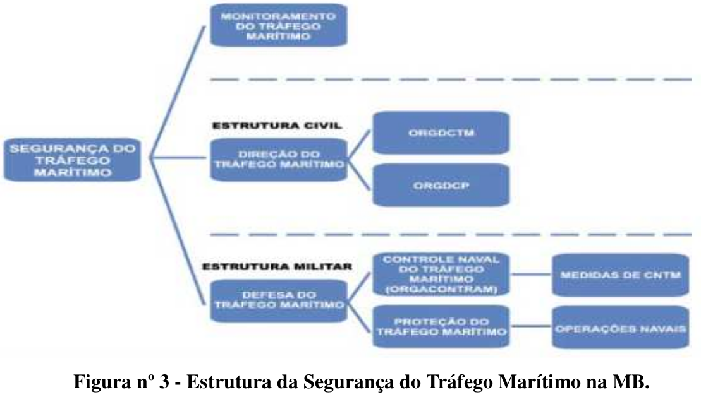

# Capítulo 4 - O Poder Naval nas atividades de emprego limitado da força

## Página 44

### 4.1 - CONCEITUAÇÃO 

As atividades de emprego limitado da força são aquelas em que a Marinha do Brasil (MB) exercerá o poder de polícia para impor a lei ou um mandato internacional, do qual o País tenha assumido obrigação, determinada por organização intergovernamental. A forma de aplicação da força será prescrita em documento legal e refletirá nas regras de engajamento a serem promulgadas para a operação. O emprego da força não deve se constituir no principal meio para se atingir um determinado fim; ao contrário, deve haver ponderação nesse sentido. Não obstante, o pessoal empregado nessas atividades deve estar apto e preparado para, se a situação exigir, agir no exercício da legítima defesa própria ou de terceiros e na intensidade apenas necessária, a fim de repelir injusta agressão que represente risco, atual ou iminente, de morte ou lesão corporal grave. 

São incluídas neste Capítulo as operações nas quais o Poder Naval é aplicado em situações distintas ou acessórias às de guerra naval, em decorrência de previsão constitucional ou legal, de atribuições precípuas ou subsidiárias, permanentes ou temporárias. Podem conter alguns traços das operações e ações de guerra naval. Contudo, os principais aspectos que as distinguem são o limitado uso da força e os efeitos desejados, que são distintos daqueles obtidos pela interação com inimigos.

O emprego do Poder Naval e a composição das forças dependerão da situação. O uso da força será determinado e regulado por fundamentação legal precisa, planejamento formal, entendimento claro das delegações, ordens textuais e métodos de controle. Por certo, o espectro de risco e grau de uso da força são amplos. Há possibilidade de interação com outras forças singulares nacionais ou estrangeiras, organizações governamentais e não governamentais e empresas privadas, conforme diretrizes emanadas pelo Ministério da Defesa (MD).

Essas atividades decorrem da Constituição da República Federativa do Brasil (CRFB), Leis Complementares e Ordinárias, Decretos, documentos nacionais de defesa e da missão da MB, conforme descritas nos próximos tópicos.

## Página 45

### 4.2 - GARANTIA DOS PODERES CONSTITUCIONAIS

A garantia dos poderes constitucionais é uma atribuição permanente das Forças Armadas (FA) prevista no artigo 142 da CRFB e disciplinada na Lei Complementar nº 97, de 9 de junho de 1999, que ainda não se encontra devidamente regulamentada. Consiste nas ações necessárias, em situação de normalidade constitucional, para garantir o funcionamento e a integridade dos três Poderes: o Executivo, representado pelo Presidente da República; o Legislativo pelos Presidentes do Senado Federal e da Câmara dos Deputados; e o Judiciário pelo Presidente do Supremo Tribunal Federal.

A fim de situar o papel das FA na garantia dos poderes constitucionais e na garantia da lei e da ordem (GLO), próximo item, transcreve-se um importante trecho contido no Parecer GM-025, de 10 de agosto de 2001, da Advocacia-Geral da União (publicado na íntegra no Diário Oficial nº 154-E, Seção 1, de 13 de agosto de 2001, pp. 6-8):

“(...) A Constituição vigente abre a elas [Forças Armadas] um Capítulo do Título V sobre a defesa do Estado e das instituições democráticas com a destinação acima referida [artigo 142 da Constituição], de tal sorte que sua missão essencial é a da defesa da Pátria e a garantia dos poderes constitucionais, o que vale dizer defesa, por um lado, contra agressões estrangeiras em caso de guerra externa e, por outro lado, defesa das instituições democráticas, pois a isso corresponde a garantia dos poderes constitucionais, que, nos termos da Constituição, emanam do povo (art. 1º, parágrafo único). Só subsidiária e eventualmente lhes incumbe a defesa da lei e da ordem, porque essa defesa é de competência primária das forças de segurança pública, que compreendem a polícia federal e as polícias civil e militar dos Estados e do Distrito Federal (...)” (Curso de Direito Constitucional Positivo, Malheiros Editores, 19º edição, 2001, págs. 749 e 750 apud LIMA, 2001).

### 4.3 - GARANTIA DA LEI E DA ORDEM 

A GLO é uma atribuição temporária das FA prevista no artigo 142 da CRFB, disciplinada na Lei Complementar nº 97, de 9 de junho de 1999, e suas diretrizes estão fixadas no Decreto nº 3.897, de 24 de agosto de 2001.

É competência exclusiva do Presidente da República a decisão de emprego das FA na GLO, que poderá ocorrer por sua própria iniciativa, ou dos outros poderes constitucionais, representados pelo Presidentes do Supremo Tribunal Federal, do Senado Federal ou da Câmara dos Deputados.

O emprego das FA para a GLO, em articulação com as autoridades locais, deverá ser episódico, em área previamente definida e ter a menor duração possível. Seu propósito é preservar a ordem pública e a incolumidade das pessoas e do patrimônio, em situações de esgotamento dos instrumentos para isso previstos no artigo 144 da Constituição ou em outras em que se presuma ser possível a perturbação da ordem.

O Poder Naval poderá realizar as seguintes tarefas principais na GLO:

a) controlar áreas marítimas litorâneas e ribeirinhas de dimensões limitadas adjacentes a instalações navais, marítimas ou industriais de valor estratégico;
b) transportar e efetuar desembarques administrativos de contingentes e suprimentos militares;
c) proteger portos, seus acessos e fundeadouros, estaleiros ou áreas marítimas restritas;
d) proteger plataformas de exploração e de aproveitamento de petróleo e gás na Plataforma Continental (PC) brasileira ou em águas interiores;
e) controlar partes terrestres e áreas litorâneas ou ribeirinhas de dimensões limitadas;
f) realizar operações de retomada e resgate nas Águas Jurisdicionais Brasileiras (AJB) e em Organizações Militares subordinadas; e
g) realizar operações em terra.

## Página 46

### 4.3.1 - Segurança de Autoridades Estrangeiras

Há previsão para emprego das FA na GLO, em situação que se presuma ser possível a perturbação da ordem, tais como as relativas a eventos oficiais ou públicos, particularmente os que contem com a participação de Chefe de Estado, ou de Governo, estrangeiro, conforme prevê o artigo 5º do Decreto nº 3.897, de 24 de agosto de 2001.

### 4.3.2 - Garantia da Votação e da Apuração

Compete, privativamente, ao Tribunal Superior Eleitoral (TSE) requisitar a força federal necessária ao cumprimento da lei, de suas próprias decisões ou das decisões dos Tribunais Regionais que o solicitarem, e para garantir a votação e a apuração, tendo em vista o disposto no artigo 23, caput, inciso XIV, da Lei nº 4.737, de 15 de julho de 1965 (Código Eleitoral), com a redação dada pelo art. 7º da Lei nº 4.961, de 4 de maio de 1966.

O decreto para emprego das FA é de responsabilidade do Presidente da República, sendo a atuação militar amparada pelo § 7º do artigo 15 da Lei Complementar nº 97, de 9 de junho de 1999 (redação dada pela Lei Complementar nº 136, de 25 de agosto de 2010). 

Nesse contexto, as ações militares de garantia de votação e da apuração são operações de GLO, conforme previsto no artigo 5º do Decreto nº 3.897, de 24 de agosto de 2001, onde as localidades e o período de emprego das FA serão definidos conforme os termos de requisição do TSE.

## Página 47

### 4.4 - SEGURANÇA DURANTE VIAGENS PRESIDENCIAIS EM TERRITÓRIO NACIONAL, OU EM EVENTOS NA CAPITAL FEDERAL

Previsto no Decreto nº 4.332, de 12 de agosto de 2002, o sistema de segurança presidencial poderá envolver os diversos órgãos de segurança pública federais, estaduais e municipais e, mediante ordem do Presidente da República, integrantes das FA, durante as viagens presidenciais em território nacional, ou em eventos na Capital Federal. O sistema de segurança presidencial, que compreende, para fins de planejamento, coordenação e  execução, a segurança pessoal e a segurança de área, tem por objetivo integrar procedimentos que impeçam a realização de atentados, previnam a ocorrência de danos físicos e morais e evitem incidentes para o Presidente ou para o Vice-Presidente da República.

A decisão presidencial de emprego das FA será comunicada ao MD por meio de documento oficial, que indicará as condicionantes para o cumprimento da missão.

No estabelecimento do sistema de segurança presidencial, compete ao MD empregar efetivos das FA, por ordem do Presidente da República, compondo ou não frações constituídas, de forma ostensiva ou velada, em todos os setores de atuação dos órgãos de segurança, na garantia da segurança do Presidente e do Vice-Presidente da República, quando a situação assim o indicar, incumbindo-lhe, no que couber, o estabelecido no artigo 3º do Decreto nº 3.897, de 24 de agosto de 2001.

### 4.5 - AÇÕES CONTRA DELITOS TRANSFRONTEIRIÇOS E AMBIENTAIS

Mediante previsão do artigo 16-A da Lei Complementar nº 97, de 9 de junho de 1999 (com a redação promovida pela Lei Complementar nº 136, de 25 de agosto de 2010), cabe às FA, além de outras ações pertinentes, também como atribuições subsidiárias, preservadas as competências exclusivas das polícias judiciárias, atuar, por meio de ações preventivas e repressivas, na faixa de fronteira terrestre, no mar e nas águas interiores, independentemente da posse, da propriedade, da finalidade ou de qualquer gravame que sobre ele recaia, contra delitos transfronteiriços e ambientais, isoladamente ou em coordenação com outros órgãos do Poder Executivo, executando, dentre outras, as ações de:
a) patrulhamento;
b) revista de pessoas, de veículos terrestres, de embarcações e de aeronaves; e
c) prisões em flagrante delito.

Essas ações não apresentam as restrições impostas pelo decreto que regulamenta a patrulha naval, especificamente na responsabilidade exclusiva da MB e na conceituação dos meios navais. Embora os meios envolvidos em patrulha naval possam realizar patrulhamento e inspeção naval, a recíproca não é verdadeira. O patrulhamento está voltado para o combate aos delitos transfronteiriços e ambientais, isoladamente ou em coordenação com outros órgãos do Poder Executivo.

## Página 48

### 4.6 - PATRULHA NAVAL

Inicialmente, chamada de patrulha costeira, quando instituída pela Lei nº 2.419, de 10 de fevereiro de 1955, passou a atual denominação de Patrulha Naval (PATNAV), pelo Decreto nº 5.129, de 6 de julho de 2004. Trata-se de uma atribuição subsidiária particular da MB, conforme disciplina o inciso IV do artigo 17 da Lei Complementar nº 97, de 9 de junho de 1999, cujo propósito é implementar e fiscalizar o cumprimento de leis e regulamentos, em AJB, na plataforma continental brasileira e no alto-mar, respeitados os tratados, convenções e atos internacionais ratificados pelo Brasil.

A PATNAV é conduzida por meios navais, com a utilização de embarcações e aeronaves orgânicas em apoio às suas atividades. Poderá haver o reforço de fuzileiros navais ou de mergulhadores de combate embarcados nos meios navais, principalmente quando da visita e inspeção, em proveito da segurança e da abordagem com oposição, respectivamente, do grupo (Grupo de Visita e Inspeção — GVI), que é composto por militares previamente designados pelo Comandante. O emprego de armamento portátil pelos componentes do GVl fica condicionado às situações em que atos hostis os exponham a risco de morte ou lesão corporal.

Há previsão no decreto mencionado de o GVI ser integrado por representantes de órgão federal ou estadual, não se lhes aplicando a designação prévia pelo Comandante e que seus armamentos portáteis sejam da dotação do navio. Nesse caso, tais agentes atuarão dentro de suas competências legais.

Os aspectos legais que envolvem a participação da MB nesse tipo de operação exigem a preparação de todos os setores envolvidos, desde o planejamento até a fiscalização propriamente dita. Deve-se buscar a implementação de ferramentas que possibilitem o emprego eficaz dos meios em PATNAV, como um sistema de vigilância em pontos focais da costa para monitoramento das embarcações em trânsito nas AJB e o planejamento das atividades de inteligência em conjunto com órgãos federais e estaduais. Diversas são as atividades a serem fiscalizadas pela PATNAV: 

#### 4.6.1 - Pirataria

Segundo a Convenção das Nações Unidas sobre o Direito do Mar (CNUDM), concluída em Montego Bay, Jamaica, em 10 de dezembro de 1982, cuja entrada em vigor ocorreu pelo Decreto nº 1.530, de 22 de junho de 1995, define no artigo 101 que constituem pirataria quaisquer dos seguintes atos:

a) todo ato ilícito de violência ou de detenção ou todo ato de depredação cometidos, para fins privados, pela tripulação ou pelos passageiros de um navio ou de uma aeronave privados, e dirigidos contra: 
I) um navio ou uma aeronave em alto-mar ou pessoas ou bens a bordo dos mesmos; e 
II) um navio ou uma aeronave, pessoas ou bens em lugar não submetido à jurisdição de algum Estado;

b) todo ato de participação voluntária na utilização de um navio ou de uma aeronave, quando aquele que o pratica tenha conhecimento de fatos que deem a esse navio ou a essa aeronave o caráter de navio ou aeronave pirata; e 
c) toda a ação que tenha por fim incitar ou ajudar intencionalmente a cometer um dos atos enunciados nas alíneas a ou b.

## Página 49

### 4.6.2 - Terrorismo

O terrorismo consiste na prática por um ou mais indivíduos dos atos previstos no artigo 2º da Lei nº 13.260, de 16 de março de 2016, por razões de xenofobia, discriminação ou preconceito de raça, cor, etnia e religião, quando cometidos com a finalidade de provocar terror social ou generalizado, expondo a perigo pessoa, patrimônio, a paz pública ou a incolumidade pública. São atos de terrorismo:

▪️Usar ou ameaçar usar, transportar, guardar, portar ou trazer consigo explosivos, gases tóxicos, venenos, conteúdos biológicos, químicos, nucleares ou outros meios capazes de causar danos ou promover destruição em massa;
▪️sabotar o funcionamento ou apoderar-se, com violência, grave ameaça a pessoa ou servindo-se de mecanismos cibernéticos, do controle total ou parcial, ainda que de modo temporário, de meio de comunicação ou de transporte, de portos, aeroportos, estações ferroviárias ou rodoviárias, hospitais, casas de saúde, escolas, estádios esportivos, instalações públicas ou locais onde funcionem serviços públicos essenciais, instalações de geração ou transmissão de energia, instalações militares, instalações de exploração, refino e processamento de petróleo e gás e instituições bancárias e sua rede de atendimento; e
▪️atentar contra a vida ou a integridade física de pessoa. O terrorismo possui características de delito transfronteiriço ou transnacional, bem como pode estar vinculado ao crime organizado, de forma que a lei em apreço passou a prever e criminalizar as organizações terroristas como aquelas voltadas para a prática dos atos de terrorismo legalmente definidos.

O enfrentamento ao terrorismo pode incluir medidas defensivas (antiterrorismo) com vistas a minimizar a vulnerabilidade aos atos terroristas, ou ofensivas (contraterrorismo), conduzidas de modo a evitar, dissuadir ou responder ao terrorismo. 

Quando medidas de contraterrorismo forem adotadas contra pessoal, deve-se empregar elementos de operações especiais. Em qualquer dos casos, a ênfase deve ser em sua prevenção, por meio de uma atividade de inteligência intensa.

## Página 50

### 4.6.3 - Outras atividades ilícitas, quando praticadas nas AJB

São as seguintes:
a) contrabando (Decreto-Lei nº 2.848/1940, artigo 334-A, com redação da Lei nº 13.008/2014);
b) descaminho (Decreto-Lei nº 2.848/1940, artigo 334, com redação da Lei nº 13.008/2014);
c) tráfico internacional de arma de fogo (Lei nº 10.826/2003, artigo 18);
d) tráfico ilícito de estupefacientes ou entorpecentes e substâncias psicotrópicas (CNUDM, artigo 108);
e) promoção de migração ilegal (Decreto-Lei nº 2.848/1940, artigo 232-A, com redação da Lei nº 13.445/2017);
f) tráfico de pessoas (Decreto-Lei nº 2.848/1940, artigo 149-A, com redação da Lei nº 13.344/2016); 
g) transporte de escravos (CNUDM, artigo 99); 
h) pesquisa e investigação científicas não autorizadas (Decreto nº 96.000/1988 e Lei nº 8.617/1993, artigo 13);
i) acesso não autorizado ao patrimônio genético e o conhecimento tradicional associado (Lei nº 13.123/2015, artigo 1º); 
j) pesca não autorizada (Lei nº 9.605/1998, artigos 34 a 36);
k) violação do direito de passagem inocente no mar territorial (CNUDM, artigo 19, 2); 
l) infrações às leis e regulamentos aduaneiros, fiscais, de imigração, ou sanitários na zona contígua (CNUDM, artigo 33, 1; e Lei nº 8.617/1993, artigo 5º); 
m) pesquisa, exploração, remoção, demolição, assistência e salvamento de coisas e bens afundados, submersos, encalhados, perdidos ou em perigo, não autorizados, em decorrência de sinistro, alijamento ou fortuna no mar (Lei nº 7.542/1986); 
n) poluição causada por lançamento de óleo e outras substâncias nocivas ou perigosas (Lei nº 9.966/2000); 
o) violação da proteção das áreas de produção de petróleo e seus derivados nas AJB e na PC brasileira. As atividades de proteção devem contar com a participação da empresa responsável pela plataforma, em especial quanto à segurança orgânica e das zonas de segurança adjacentes (Lei nº 9.478/1997); 
p) violação da segurança ao transporte aquaviário de equipamento vital, de material especificado e de material nuclear, bem como a segurança à navegação concernente aquele transporte (Decreto nº 2.210/1997); e
q) levantamentos hidrográficos não autorizados (Decreto-Lei nº 243/1967). 

É importante ressaltar que um meio naval realizando PATNAV pode, oportunamente, realizar inspeção naval, cuja atividade é descrita a seguir.

## Página 51

### 4.7 - INSPEÇÃO NAVAL 

A Inspeção Naval (IN) é uma atribuição da Autoridade Marítima prevista na Lei nº 9.537, de 11 de dezembro de 1997. Trata-se de uma atividade de cunho administrativo, que consiste na fiscalização do cumprimento dessa Lei, das normas e regulamentos dela decorrentes, e dos atos e resoluções internacionais ratificados pelo Brasil, no que se refere exclusivamente à salvaguarda da vida humana e à segurança da navegação, no mar aberto e em hidrovias interiores, e à prevenção da poluição ambiental por parte de embarcações, plataformas fixas ou suas instalações de apoio.

Tal qual na PATNAV, a IN também poderá ter o reforço de fuzileiros navais embarcados, em proveito da segurança das equipes.

### 4.8 - COOPERAÇÃO COM ÓRGÃOS FEDERAIS

A cooperação com órgãos federais está prevista no inciso V do artigo 17 da Lei Complementar nº 97, de 9 de junho de 1999 (incluído pela Lei Complementar nº 117, de 2 de setembro de 2004). Portanto, cabe à MB, como atribuição subsidiária particular, quando se fizer necessário, cooperar na repressão aos delitos de repercussão nacional ou internacional, quanto ao uso do mar, águas interiores e de áreas portuárias, na forma de apoio logístico, de inteligência, de comunicações e de instrução.

Para que seja atendida com eficiência será oportuna a aproximação entre os Comandantes de Distritos Navais e os representantes regionais dos órgãos federais. Este relacionamento deve ser explorado para que se torne de grande utilidade para a própria MB, pois será importante para o recebimento de informações que poderão orientar o planejamento de emprego dos meios distritais na fiscalização das leis nas AJB, quando da realização das PATNAV.

### 4.9 - OPERAÇÕES DE RETOMADA E RESGATE

As operações de retomada e resgate são aquelas que têm por efeito desejado a retomada de navios, instalações e/ou o resgate de pessoal de interesse da MB mantidos, respectivamente, sob controle e/ou como reféns por grupos adversos. A estrutura para essas operações é complexa e multidisciplinar, envolvendo militares das mais diversas áreas, tais como: inteligência; logística; negociação; apoio psicológico; cerco terrestre e/ou marítimo; comunicação social; aviação; e outros especialistas, de acordo com o local do evento.

Enfatiza-se que tais operações costumam despertar o interesse da opinião pública quanto ao seu desfecho. Para as operações onde o esforço principal for desenvolvido em meio aquático (navios e plataformas no mar) empregar-se-á o Grupo Especial de Retomada e Resgate dos Mergulhadores de Combate (GERR/MEC), do Comando em Chefe da Esquadra. Se for em terra, empregar-se-á o Grupo Especial de Retomada e Resgate de Operações Especiais (GERR/OpEsp), do Comando da Força de Fuzileiros da Esquadra. A retomada de navios atracados ou fundeados na área do porto organizado ou instalação portuária é da competência da Polícia Federal. Nesse caso, a MB só será empregada se for solicitada e com a autorização do Presidente da República, conforme disposto no ordenamento jurídico.

## Página 52

### 4.10 - SEGURANÇA DAS INSTALAÇÕES NAVAIS

O Poder Naval é responsável, desde o tempo de paz, por prover a segurança das instalações navais, podendo, eventualmente, prover a segurança de outras instalações de interesse. Essa atividade caracteriza-se por um conjunto de medidas passivas destinadas a prevenir e a obstruir ações adversas de qualquer natureza, inclusive criminosa, de modo a preservar e salvaguardar o pessoal, a documentação, o material, as comunicações, as informações digitais, as áreas e instalações.

### 4.11 - SEGURANÇA DO TRÁFEGO MARÍTIMO

A Segurança do Tráfego Marítimo é realizada desde o tempo de paz, por meio dos ramos do Monitoramento, da Direção e da Defesa do Tráfego Marítimo. Tem como propósito prover segurança às Linhas de Comunicação Marítimas (LCM), à pesca e a outras atividades desenvolvidas nas águas de interesse. No aspecto funcional, se refere ao conjunto de precauções para anular ou minimizar os riscos e os eventuais efeitos oriundos de ameaças de qualquer natureza.

O Monitoramento do Tráfego Marítimo é uma atividade permanente, executada pela Organização de Controle Naval do Tráfego Marítimo (ORGACONTRAM), essencial para as estruturas civil e militar. Pressupõe a detecção, a localização, o acompanhamento, a identificação e a classificação do tráfego. Para isso, utilizar-se-á da análise de possíveis anomalias a partir de padrões de comportamento ou de informações adicionais obtidas, mediante emprego de sistemas de inteligência, fundamentais à segurança marítima e à formação da consciência situacional marítima. 

A ORGACONTRAM interage com diversos organismos, dentre os quais se destacam: as sociedades classificadoras; a Receita Federal; os ministérios e as secretarias governamentais; a Polícia Federal; o Instituto Brasileiro do Meio Ambiente e dos Recursos seguros; os sindicatos; os portos e terminais; os agentes e despachantes marítimos; os armadores; as indústrias de construção naval; a indústria e a comunidade pesqueira; e as instituições hidrográficas e oceanográficas.

## Página 53

A estrutura civil, representada pela Direção do Tráfego Marítimo, compreende a Organização da Direção Civil do Transporte Marítimo (ORGDCTM) e a Organização da Direção Civil da Pesca (ORGDCP).

A ORGDCTM é responsável por assegurar a continuidade do comércio marítimo e das demais atividades econômicas desenvolvidas nas águas de interesse do País, manter o funcionamento do sistema portuário nacional e empregar os navios mercantes nacionais e afretados.

A ORGDCP é responsável pela coordenação das atividades de pesca no Brasil.

O emprego do Poder Naval, na Defesa do Tráfego Marítimo, está descrito no inciso 3.4.10.

A Figura nº 3 apresenta a estrutura da Segurança do Tráfego Marítimo em vigor na MB.

Figura nº 3 - Estrutura da Segurança do Tráfego Marítimo na MB. 

### 4.12 - OPERAÇÕES DE PAZ

As Operações de Paz (OpPaz) consistem no emprego da força militar, em apoio a esforços diplomáticos, para manter, impor ou construir a paz em país estrangeiro. São desenvolvidas, normalmente, visando ao cumprimento de resoluções ou de acordos e definidas por conceitos básicos e essenciais estabelecidos nas legislações específicas dos organismos internacionais.

No âmbito das Nações Unidas, o mandato é resultante de uma resolução do Conselho de Segurança. É o documento formal que estabelece uma OpPaz, contendo os seus fundamentos e objetivos a atingir. É desenvolvido no mais alto nível político e diplomático e, normalmente, contém: a finalidade da operação; os países participantes; as recomendações acerca do financiamento da operação; os direitos e imunidades dos componentes da missão de paz; o resultado esperado; as condições colocadas pelas partes envolvidas em relação à presença da missão de paz; e o tempo de duração da missão. As categorias de participação militar brasileira em OpPaz são: 

▪️tropa/navio: quando os militares, com autorização do Congresso Nacional, integram um contingente armado, reunidos em módulo de emprego operacional, conforme normas fixadas pela Lei nº 2.953, de 17 de novembro de 1956; e 

▪️individual: observadores militares, oficiais de estado-maior não vinculados à tropa brasileira e pessoal especializado. 

As OpPaz compreendem cinco tipos: Diplomacia Preventiva, Promoção da Paz, Manutenção da Paz, Imposição da Paz e Consolidação da Paz. O primeiro tipo será tratado no item 5.2, por ser uma atividade benigna. Os quatro seguintes são enquadrados no emprego limitado da força, definidas por sua finalidade, conforme abaixo. 

## Página 54

**a) Promoção da Paz**

Designa as ações diplomáticas posteriores ao início do conflito, para levar as partes litigantes a suspender as hostilidades e a negociarem. As ações de promoção da paz baseiam-se nos meios de solução pacífica de controvérsias previstos no Capítulo VI da Carta das Nações Unidas, os quais podem incluir, em casos extremos, dependendo do mandato dos mediadores, o isolamento diplomático e a imposição de sanções, adentrando então nas ações coercitivas previstas no Capítulo VII da referida Carta. O termo deriva da expressão em inglês “peacemaking”. 

**b) Manutenção da Paz**

Trata das atividades levadas a cabo no terreno, com o consentimento das partes em conflito por militares, policiais e civis para implementar ou monitorar a execução de arranjos relativos ao controle de conflitos (cessar-fogo, separação de forças etc.) e sua solução (acordos de paz abrangentes ou parciais), em complemento aos esforços políticos realizados para encontrar uma solução pacífica e duradoura para o conflito. O termo deriva da expressão em inglês “peacekeeping”. 
 
**c) Imposição da Paz**

Corresponde às ações adotadas ao abrigo do Capítulo VII da Carta das Nações Unidas, incluindo o uso de força armada para manter ou restaurar a paz e a segurança internacionais em situações nas quais tenha sido identificada e reconhecida a existência de uma ameaça à paz, ruptura da paz ou ato de agressão. O termo “peace enforcement” é internacionalmente consagrado.

Ressalta-se que o Brasil, em razão do princípio da não intervenção, disposto no artigo 4º da Constituição Federal, não participa dessa modalidade de OpPaz, ou seja, quando não há o consentimento das partes beligerantes. 

## Página 55

**d) Consolidação da Paz** 

Refere-se às iniciativas voltadas para o tratamento dos efeitos do conflito, visando a fortalecer o processo de reconciliação nacional por meio de implementação de projetos destinados a recompor as estruturas institucionais, a recuperar a infraestrutura física e a ajudar na retomada da atividade econômica. Essas ações, voltadas basicamente para o desenvolvimento econômico e social do país anfitrião, são empreendidas, preferencialmente, por outros órgãos das Nações Unidas, mas, dependendo das dificuldades no terreno, podem requerer a atuação militar. O termo deriva da expressão em inglês “peacebuilding”.

O Poder Naval, devido às suas características de mobilidade, permanência, versatilidade e flexibilidade, e por dispor de forças de caráter expedicionário, está apto a participar da execução de OpPaz, tanto de caráter naval como terrestre.

### 4.12.1 - Operação de Paz de Caráter Naval 

Nesta classe, na qual preponderam operações e ações no ambiente marítimo ou ambiente ribeirinho, o Poder Naval pode participar com meios navais, aeronavais e de fuzileiros navais ou, individualmente, com Comandantes de forças-tarefa, observadores ou oficiais de estado-maior, para a obtenção, dentre outros, dos seguintes efeitos desejados:

▪️estabilização institucional;

▪️monitoramento de cessar-fogo ou zona desmilitarizada;

▪️imposição de sanções ou embargos;

▪️apoio humanitário;

▪️assistência a refugiados;

▪️assistência às negociações de paz;

▪️limpeza de áreas marítimas minadas;

▪️evacuação em emergência de brasileiros ou mesmo de pessoas de outras nacionalidades, que se encontrem participando de OpPaz;

▪️interposição entre forças navais oponentes;

▪️transporte de meios da MB, das demais FA brasileiras, ou de outros países, para a área de operações;

▪️coordenação e controle de determinado espaço aéreo;

▪️apoio de fogo na defesa das forças em terra;

▪️alojamento e abrigo temporário de forças amigas ou refugiados; e

realização de Ação Cívico-Social (ACISO).

## Página 56

### 4.12.2 - Operação de Paz de Caráter Terrestre

Nesta categoria, na qual preponderam as operações e ações no ambiente terrestre, com pouco ou nenhum vínculo direto com o mar, o Poder Naval pode participar com meios aeronavais e de fuzileiros navais ou individualmente, com observadores ou oficiais de estado-maior, para a obtenção dos seguintes efeitos desejados, além daqueles descritos no inciso anterior:

▪️realização de esclarecimento a pé, mecanizado e motorizado;

▪️estabelecimento de base e atividades iniciais, prévias ao desdobramento de uma Força de Paz eminentemente terrestre;

▪️limpeza de campos minados terrestres;

▪️instalação e operação de hospitais de campanha; e

▪️interposição entre forças terrestres oponentes.

### 4.13 - OPERAÇÃO DE EVACUAÇÃO DE NÃO COMBATENTES

A Operação de Evacuação de Não Combatentes (OpENC) é aquela conduzida com o propósito de evacuar para um Local de Destino Seguro (LDS) pessoal civil, preferencialmente, de nacionalidade brasileira e militares brasileiros, impossibilitados de prover adequadamente sua autodefesa, de países onde exista uma ameaça à sua segurança ou onde exista uma situação de calamidade.

A OpENC, usualmente, envolve a entrada de uma força militar no território do país anfitrião e a ocupação temporária de um objetivo que assegure as condições de segurança para a realização de uma retirada planejada de não combatentes. Decorre, normalmente, de situações de crise no país anfitrião, que podem ter consequências nas áreas humanitárias, militares ou políticas, como nos casos de: conflitos regionais, instabilidade interna, catástrofes causadas por fenômenos naturais ou acidentes de grandes proporções ambientais.

A estrutura de comando e controle e os fatores políticos na execução do apoio militar torna-a diferente de outras operações militares. Durante uma OpENC, o Embaixador do Brasil ou a autoridade diplomática em exercício no país anfitrião, é a autoridade do governo para a evacuação, ou seja, é o responsável pela condução e pela segurança dos evacuados, até a chegada do componente militar. A decisão de evacuar uma embaixada é política. Os objetivos da política externa do Brasil, aliados às condições da área de conflito, com ênfase na segurança dos cidadãos brasileiros, são os fatores determinantes na realização de uma OpENC.

## Página 57

As forças de caráter expedicionário são especialmente apropriadas para a realização de OpENC. Diferentemente de uma operação de resgate, uma OpENC não necessariamente é de curta duração. Além disso, presume-se que esta não envolva a circunstância de nacionais permanecerem sob controle (presos ou detidos) de forças adversas, quando seria recomendada a realização de um resgate. Tais aspectos, a duração e o grau de controle sobre os nacionais, são as principais diferenças entre os dois tipos de operação.

Pela característica incerta, uma OpENC pode ser desencadeada inopinadamente, devido a mudanças repentinas no governo do país anfitrião, reorientação política ou militar em relação ao Brasil ou ameaças hostis a cidadãos brasileiros, por forças internas ou externas naquele país. Os fatores chaves no planejamento são: acompanhamento da situação, apreciação correta das possíveis mudanças políticas e militares, além do conhecimento do número de brasileiros residentes ou em trânsito pelo país em crise, do ambiente em que o Comando Operacional irá operar e a preparação da força para um ambiente que pode, rapidamente, passar de permissivo para incerto ou hostil.

**a) Ambiente Permissivo**

Nessa condição não é esperada resistência às operações de evacuação. Assim, necessita-se de pequeno ou nenhum emprego de forças militares no país anfitrião, podendo ou não ser estabelecidas medidas de processamento dos evacuados. O Comando Operacional deve contar com a concordância e apoio do país anfitrião. A principal preocupação é com as atividades logísticas e legais de repatriação dos evacuados.

**b) Ambiente Incerto**

É o ambiente operacional em que as FA do país anfitrião, receptivas ou não à OpENC, não detêm o controle efetivo do território e da população na região da operação. Devido à incerteza, o Comando Operacional poderá dispor de unidades de segurança adicionais e prever a utilização de uma Força de Reação. O planejamento deverá contemplar a possibilidade de escalada para um ambiente hostil.

**c) Ambiente Hostil**

Nesse ambiente, o governo do país anfitrião adotou postura hostil, pondo em risco a permanência e a vida de brasileiros naquele território, ou perdeu o controle da situação. É de se esperar que a evacuação seja realizada sob condições de desordem civil, ações terroristas ou de combate. Portanto, o Comando Operacional deverá estar preparado para realizar a entrada em território hostil, estabelecer perímetros de segurança, escoltar comboios, participar de operações de busca e realizar triagem de pessoal.

Ressalta-se que, em se tratando de ambiente incerto ou hostil, associado ao fato de que um dos princípios regentes do Brasil nas relações internacionais é o da não intervenção, somente com respaldo de um mandato das Nações Unidas, o emprego das FA em uma OpENC seria legítimo. 

### 4.14 - SEGURANÇA DE REPRESENTAÇÕES DIPLOMÁTICAS

A segurança de representações diplomáticas visa a prover a segurança pessoal do chefe da representação, dos demais funcionários diplomáticos e administrativos, da residência oficial e da chancelaria das Embaixadas do Brasil e, se for o caso, proteger os nacionais não combatentes em regresso ao Brasil. A organização emergencial deve ser ativada nos casos em que o agravamento da situação política em determinado Estado, além de comprometer a segurança da representação diplomática do Brasil, vier, também, a pôr em risco os nacionais não combatentes ali residentes.
