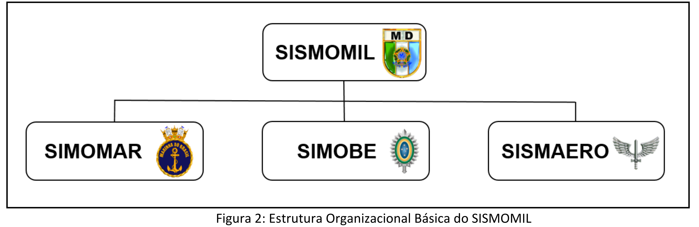

# MD41-M-01 - Doutrina de Mobilização Militar

## Página 4

### CAPÍTULO 1 - INTRODUÇÃO

### 1.1 Finalidade

Estabelecer a concepção doutrinária a ser considerada pelo Ministério da Defesa (MD) e pelas Forças Armadas (FA) no preparo e na da execução da Mobilização e da Desmobilização Militares, desde a normalidade até a situação de crise/conflito armado decorrente de agressão estrangeira e posterior retorno à normalidade.

AGRESSÃO ESTRANGEIRA: o art. 22, 8 12, do Decreto nº 6.592, de 2008 preceitua que os parâmetros para a qualificação da expressão agressão estrangeira são os seguintes, dentre outros: ameaças ou atos lesivos à soberania nacional, à integridade territorial, ao povo brasileiro ou às instituições nacionais, ainda que não signifiquem invasão ao território nacional.

### 1.2 Aplicação

Esta publicação provê orientações básicas doutrinárias para o conhecimento, o planejamento, o preparo e a execução da Mobilização Militar.

### 1.3 Referências 

a) Constituição da República Federativa do Brasil, de 5 de outubro de 1988;

b) Lei nº 11.631, de 27 de dezembro de 2007 (Dispõe sobre a Mobilização Nacional e cria o Sistema Nacional de Mobilização - SINAMOB);

c) Lei nº 12.598, de 21 de março de 2012 (Estabelece normas especiais para as compras, as contratações e o desenvolvimento de produtos e de sistemas de defesa; dispõe sobre regras de incentivo à área estratégica de defesa; e altera a Lei nº 12.249, de 11 de junho de 2010);

d) Decreto nº 6.592, de 2 de outubro de 2008 (Regulamenta o disposto na Lei nº 11.631, de 27 de dezembro de 2007, que dispõe sobre a Mobilização Nacional e cria o Sistema Nacional de Mobilização - SINAMOB);

e) Decreto nº 7.294, de 6 de setembro de 2010 (Dispõe sobre a Política de Mobilização Nacional);

f) Decreto nº 7.970, de 28 de março de 2013 (Regulamenta o disposto na Lei nº 12.598, de 22 de março de 2012, que estabelece normas especiais para as compras, as contratações e o desenvolvimento de produtos e sistemas de defesa);

g) Decreto nº 11.337, de 1º de janeiro de 2023 (Aprova a Estrutura Regimental do Ministério da Defesa);

h) Exposição de Motivos nº 006, de 14 de setembro de 1987, da Secretaria-Geral do Conselho de Segurança Nacional (aprova a Doutrina Básica de Mobilização Nacional);

## Página 5

i) Portaria nº 073, de 10 de agosto de 1988, da Secretaria-Geral do Conselho de Segurança Nacional (aprova o Manual Básico de Mobilização Nacional);

j) Portaria Normativa nº 113/SPEAI/MD, de 1º de fevereiro de 2007 (Dispõe sobre a Doutrina Militar de Defesa - MD51-M-04 - 22 Edição/2007);

k) Portaria Normativa nº 1.489/MD, de 3 de julho de 2015 (Aprova a Política de Mobilização Militar - MD41-P-01 - 22 Edição/2015);

|) Instrução Normativa nº 7/MD, de 20 de outubro de 2015 (Aprova a Diretriz Setorial de Mobilização Militar - MD41-D-01 - 32 Edição/2015);

m) Portaria Normativa nº 40/MD, 23 de junho de 2016 (Aprova a Doutrina de Logística Militar - MD42-M-02 - 32 Edição/2016);

n) Portaria Normativa nº 94/GM-MD, de 20 de dezembro de 2018 (Aprova a Sistemática de Planejamento Estratégico Militar - SPEM - MD51-M-01 - 22 Edição/2018);

o) Portaria Normativa nº 84/GM-MD, de 15 de setembro de 2020 (Aprova a Doutrina de Operações Conjuntas - MD30-M-01/Volumes 1 e 2 - 22 Edição/2020);

p) Portaria nº 1.266/GM-MD, de 11 de março de 2021 (Aprova o Manual para o Planejamento da Mobilização Militar - MD41-M-03 - 12 Edição/2021);

q) Portaria GM-MD nº 5.807, de 28 de novembro de 2022 (Aprova o Manual de Mobilização Militar - MD41-M-02 - 22 Edição/2022);

r) Portaria GM-MD nº 5.938, de 7 de dezembro de 2022 (Aprova as Normas para o Cadastramento e Credenciamento de Empresas de Interesse da Mobilização - MD41-N-01 - 22 Edição/2022); e

s) Portaria Normativa nº 9/GAP/MD, de 13 de janeiro de 2016 (Aprova o Glossário das Forças Armadas - MD35-G-01 (52 Edição/2015).

1.4 Aprimoramento As sugestões para aperfeiçoamento desta publicação deverão ser encaminhadas para a Assessoria de Doutrina e Legislação do Estado-Maior Conjunto das Forças Armadas, no seguinte endereço:

## Página 6

### CAPÍTULO II - RELAÇÃO ENTRE LOGÍSTICA E MOBILIZAÇÃO

### 2.1 Considerações iniciais

2.1.1 Da Logística Nacional, advêm os recursos necessários para apoiar as atividades do País desde a situação de normalidade. Quando se verifica a possibilidade de esses recursos se apresentarem insuficientes para fazer face a ameaças externas à soberania nacional, à integridade territorial, ao patrimônio nacional, ao povo brasileiro e às instituições nacionais, o Estado empregará a Mobilização Nacional? de modo a obter os recursos que não puderem ser proporcionados tempestivamente. Portanto, a incapacidade da Logística em atender ao enfrentamento dessas ameaças é o ponto de partida para o planejamento e a execução da Mobilização.

LOGÍSTICA NACIONAL: conjunto de atividades relativas à previsão e à provisão dos recursos e meios necessários à realização das ações decorrentes da estratégia nacional.

MOBILIZAÇÃO NACIONAL: conjunto de atividades planejadas, orientadas e empreendidas pelo Estado, complementando a Logística Nacional, destinadas a capacitar o País a realizar ações estratégicas no campo da Defesa Nacional, diante de agressão estrangeira.

2.1.2 O Poder Nacional é a fonte comum de recursos a serem mobilizados, os quais poderão ser obtidos em todas as suas expressões, das quais advêm todos os recursos e meios de que se vale a Mobilização para complementar a Logística, a fim de atender a uma situação de emergência no campo da Defesa Nacional.

PODER NACIONAL: é a capacidade que tem a Nação para alcançar e manter os Objetivos Nacionais, em conformidade com a Vontade Nacional. Manifesta-se em cinco expressões: a política, a econômica, a psicossocial, a militar e a científico-tecnológica.

2.1.3 Na fase do preparo da Mobilização, as ações desenvolvidas pelos sistemas de Logística e de Mobilização se complementam, permanecendo a Logística na execução das atividades de previsão e provisão dos recursos e meios alinhados à Estratégia Nacional de Defesa (END). Por sua vez, a Mobilização complementará a Logística, buscando gerar novas capacidades e/ou aumentar aquelas já existentes.

ESTRATÉGIA NACIONAL DE DEFESA: conjunto de opções e diretrizes governamentais que orientam a nação quanto ao emprego dos meios de que dispõe para superar as ameaças aos seus objetivos, conforme o estabelecido na Política Nacional de Defesa.

2.1.4 Quando o Estado fomenta o desenvolvimento de produtos com tecnologia autóctone, está, ao mesmo tempo, aumentando a capacidade do País na oferta de bens e serviços e expandindo o Potencial Nacional para ser empregado, por meio da Mobilização, no enfrentamento de uma agressão estrangeira.

POTENCIAL NACIONAL: conjunto de recursos humanos e dos meios de que dispõe a Nação, em estado latente, passíveis de serem transformados em poder.

2.1.5 Em situações de normalidade, ações de logística ou de preparo da Mobilização, exemplificadas no item 3.3.2.7, são executadas por intermédio da aplicação de recursos orçamentários, respeitando-se a legislação em vigor. Nesse caso, o Estado não está capacitado a demandar ao setor privado atender às suas encomendas, passando a ter essa competência somente após a Mobilização Nacional ter sido decretada pelo Presidente da República.

## Página 7

2.1.6 Para o enfrentamento de uma situação de emergência no campo da Defesa Nacional, a produção de materiais de emprego militar e a contribuição tempestiva dos mais diversos componentes do Poder Nacional em proveito do esforço de defesa do País serão reguladas pelo Poder Executivo por meio do Decreto de Mobilização Nacional e seus anexos.

2.1.7 O Decreto de Mobilização Nacional dá início à fase de execução da Mobilização Nacional, a qual é caracterizada pela celeridade e compulsoriedade das ações a serem implementadas, com vistas a propiciar ao País condições de enfrentar o fato que a motivou. Nessa fase, a Expressão Militar do Poder Nacional transformará a sua estrutura de paz em estrutura de guerra, graças à Mobilização, que complementará as suas carências logísticas”, a fim de fazer frente a uma situação de emergência decorrente da iminência ou concretização de uma agressão estrangeira.

2.1.8 É na fase da execução da Mobilização que a distinção entre Logística e Mobilização se evidencia, visto que esta última proporcionará, nessa fase, o necessário complemento à primeira, para atender, adequadamente e de forma célere e compulsória pelo Estado, o esforço de defesa diante de uma agressão estrangeira.

2.1.9 O parágrafo único do art. 4º da Lei de Mobilização Nacional (Lei nº 11.631, de 2007) especifica, dentre outras, as seguintes medidas/ações necessárias à execução da Mobilização Nacional, evidenciando o poder coercitivo do Estado:

a) a convocação dos entes federados para integrar o esforço da Mobilização Nacional;

b) a reorientação da produção, da comercialização, da distribuição e do consumo de bens e da utilização de serviços;

c) a intervenção nos fatores da produção públicos e privados; d) a requisição e a ocupação de bens e serviços; e

e) a convocação de civis e militares

### 2.2 Métodos de Obtenção de Recursos Mobilizáveis

2.2.1 O ciclo logístico é o processo pelo qual se desenvolve, de forma abrangente, a logística militar?, sendo de fundamental importância que os planejamentos logísticos e de mobilização sejam realizados de maneira complementar. O ciclo logístico é dividido em três fases básicas: determinação das necessidades”, obtenção e distribuição, correspondendo cada fase a ações específicas concernentes à mobilização.

2.2.2 Na comparação das ações dos dois sistemas (Logística e Mobilização), verifica-se que a Mobilização Militar se utiliza das mesmas fases da Logística Militar (determinação das necessidades, obtenção e distribuição), a fim de prover a complementação das necessidades de recursos para a condução das operações militares de defesa e de manutenção da soberania nacional.

2.2.3 A forma de obtenção de recursos poderá distinguir ações relativas à Logística e à Mobilização. Na Mobilização, o Estado poderá, observando-se os limites e garantias previstos em lei, atuar nos fatores de produção públicos e privados, além de requisitar bens e serviços necessários para apoiar a condução das operações militares.

CARÊNCIAS LOGÍSTICAS: são os recursos logísticos não passíveis de obtenção pelo escalão considerado e que são encaminhados para obtenção pelo escalão superior.

LOGÍSTICA MILITAR: conjunto de atividades relativas à previsão e à provisão dos recursos e dos serviços necessários à execução das missões das Forças Armadas.

NECESSIDADES (LOGÍSTICAS): são todos os recursos logísticos quantificados para atender às operações planejadas, abrangendo tanto os recursos necessários ao início, como à sustentação das operações.

## Página 8

2.2.4 Nesse contexto, a Mobilização Militar, após ter recebido as listas de carências!º logísticas das Forças Armadas, busca nos sistemas de apoio à decisão disponíveis a forma de obtenção dos recursos relativos às carências levantadas e, por vezes, finaliza o ciclo com a distribuição do recurso mobilizado à Força interessada, caso não possam ser utilizadas as linhas tradicionais da Logística Militar.

2.2.5 A obtenção dos recursos logísticos de instalações, material e serviços, para fim de Mobilização, a ser regulamentada por meio do Decreto de Mobilização Nacional e seus anexos ou definida em lei específica, poderá ser realizada por intermédio de um dos seguintes métodos:

a) doação: concessão de recurso por parte do proprietário, de forma gratuita;

b) pedido: solicitação formal a órgão de suprimento ou prestador de serviços, segundo normas específicas;

c) compra: processo de aquisição de bens, fornecidos voluntariamente pelo proprietário mediante ressarcimento de importância ajustada, à vista ou a prazo, sendo esse o processo preferencial a ser adotado;

d) contratação de serviço: processo indenizável utilizado para a formalização da prestação de determinado serviço;

e) desenvolvimento: processo de especificação, projeto, teste e produção direcionado ao atendimento de uma necessidade específica;

f) troca: processo de aquisição de bens e serviços cedidos voluntariamente, mediante ressarcimento por outros bens e serviços;

g) empréstimo: processo de obtenção de bens cedidos voluntariamente pelo proprietário, sem ônus para o utilizador, devendo eles serem restituídos ao proprietário depois de interrompidas as necessidades de sua utilização, em princípio, no estado em que se encontravam ao serem emprestados;

h) arrendamento mercantil: operação na qual uma das partes cede o uso de um ou mais bens mediante o pagamento, pela outra, de prestações periódicas, sendo usual que, ao final do contrato, o arrendatário tenha opção de compra dos bens;

i) transferência: processo para realizar o remanejamento de materiais, instalações ou animais entre organizações militares e órgãos públicos;

j) tributação: impostos extraordinários para, nos termos da Constituição da República Federativa do Brasil de 1988 (CRFB/88), atender despesas decorrentes de guerra externa ou sua iminência;

k) requisição: imposição do fornecimento, em caráter transitório e auto executório, de materiais, instalações, animais e serviços, mediante ordem escrita e assinada por autoridade competente, sendo o ressarcimento realizado posteriormente, se houver danos; e

LISTA DE CARÊNCIAS: é o documento que, obtido do confronto entre necessidades e disponibilidades de recursos para determinada operação conjunta das Forças Armadas, lista as demandas que ultrapassam a capacidade logística daquelas Forças. É filtrada em todos os escalões, integra os vários planos de mobilização militar e é a matéria prima da Mobilização.

## Página 9

l) confisco: em caso de mobilização, é a apropriação, em favor do Estado, de forma controlada, nos termos da lei, sem ressarcimento, para utilização em prol do esforço militar a ser empreendido, a fim de suprir as carências logísticas necessárias à condução das operações militares.

2.2.6 A obtenção de recursos humanos dar-se-á, dentre outros, por intermédio de um dos seguintes métodos: movimentação de pessoal, treinamento, concurso, formação, convocação, contratação ou recrutamento.

## Página 10

### CAPÍTULO III - MOBILIZAÇÃO MILITAR

### 3.1 Conceituação

3.1.1 A Mobilização Militar pode ser entendida como o conjunto de atividades planejadas, orientadas e empreendidas pelo Estado, desde a situação de normalidade, com o propósito de preparar a Expressão Militar do Poder Nacional para a passagem da estrutura de paz para a estrutura de guerra visando a fazer frente a uma situação decorrente da iminência ou concretização de uma agressão estrangeira.

3.1.2 Entende-se por Expressão Militar do Poder Nacional a manifestação de natureza preponderantemente militar do conjunto de pessoas e de meios de que a Nação dispõe, atuando em conformidade com a vontade nacional e sob a direção do Estado, para alcançar e manter os objetivos nacionais. Os componentes da Expressão Militar do Poder Nacional são: o Poder Naval, o Poder Militar Terrestre e o Poder Militar Aeroespacial.

3.1.3 A Capacidade de Mobilização, na Expressão Militar, é o grau de aptidão que têm as Forças Armadas para absorverem ou se beneficiarem com os recursos humanos e com os materiais e serviços que a Nação coloca ao seu dispor, em face da iminência ou concretização de uma agressão estrangeira.

### 3.2 Amplitude da Mobilização Militar

3.2.1 Como subsídio para a aplicação desta doutrina, a Mobilização Nacional poderá ser decretada de forma total ou parcial. Essa abrangência ou amplitude será especificada no Decreto de Mobilização Nacional.

3.2.2 A Mobilização será total quando a emergência configurada impuser o acionamento da totalidade dos recursos do Poder Nacional em todo o território nacional e, ainda, valer-se dos recursos em estado latente que formam o Potencial Nacional. Será parcial quando a emergência configurada exigir apenas o acionamento de parte dos recursos do Poder Nacional ou do território nacional.

### 3.3 Fases da Mobilização Militar

3.3.1 A Mobilização Militar desenvolve suas atividades em duas fases:

a) Preparo; e
b) Execução.

3.3.2 Preparo da Mobilização Militar

3.3.2.1 O preparo da Mobilização na Expressão Militar do Poder Nacional consiste no conjunto de atividades empreendidas ou orientadas pelo Estado, desde a situação de normalidade, buscando viabilizar a execução da Mobilização Militar, a partir do momento em que for decretada a Mobilização Nacional.

## Página 11

3.3.2.2 Nessa fase, as ações empreendidas pela Expressão Militar devem considerar a conjuntura vigente no campo do desenvolvimento da infraestrutura e da Logística Nacional e buscar inserir, nos Programas de Governo, as necessidades das Forças Armadas.

3.3.2.3 Dever-se-á, também, buscar o alinhamento entre as atividades de preparo da Mobilização Militar com as ações estratégicas de desenvolvimento estabelecidas pelo Governo, a fim de garantir as melhores condições possíveis para a obtenção de recursos destinados ao atendimento das necessidades e carências das Forças Armadas no enfrentamento de uma agressão estrangeira.

3.3.2.4 Ainda nessa fase, a Expressão Militar deve identificar as carências logísticas, resultantes do confronto entre as disponibilidades da sua Logística e as necessidades levantadas para o enfrentamento de uma possível agressão estrangeira ou em decorrência de sua iminência ou de sua concretização.

3.3.2.5 Essas carências logísticas comporão os planos de mobilização nos vários níveis de planejamento, até o Plano Setorial de Mobilização Militar (PSMM).

3.3.2.6 Nesse contexto, pode-se considerar que as ações planejadas e/ou empreendidas na fase de preparo da Mobilização Militar poderão ser indutoras do desenvolvimento nacional, na medida em que buscam fortalecer a infraestrutura e a logística ao atuarem no Potencial Nacional, objetivando transformá-lo em Poder Nacional.

3.3.2.7 As seguintes atividades básicas, dentre outras, podem ser empreendidas durante a fase do preparo:

a) colocação de encomendas educativas!! nas indústrias da Base Industrial de Defesa (BID);

b) formação e cadastramento de reservas mobilizáveis;

c) incremento de pesquisas e desenvolvimentos tecnológicos de interesse dual (militar e civil);

d) busca de padronização e nacionalização de materiais e itens de interesse militar para emprego dual;

e) especificação e acompanhamento de fontes produtoras de material de defesa, no País e no exterior;

f) seleção e cadastramento de empresas públicas e privadas de prestação de serviços de interesse da Mobilização;

g) proposta de legislação especial para os casos de excepcionalidade, visando dar suporte jurídico às atividades a serem empreendidas pela Mobilização Militar;

h) mapeamento e atuação nos planejamentos estratégicos dos governos federal, estadual e municipal, de modo que contemplem recursos passíveis de serem utilizados pelas Forças Armadas em situação decorrente da iminência ou efetivação de uma agressão estrangeira;

ENCOMENDA EDUCATIVA: encomenda de determinado item ou serviço de interesse da mobilização feita às indústrias mobilizáveis a título de treinamento e como incentivo à produção a fim de assegurar a capacitação da mão de obra especializada e da própria indústria para a fabricação daquele item.

BASE INDUSTRIAL DE DEFESA (BID): conjunto integrado por empresas estatais e privadas, bem como organizações civis e militares, que realizem ou conduzam pesquisa, projeto, desenvolvimento, industrialização, produção, reparo, conservação, revisão, conversão, modernização ou manutenção de produtos de defesa no País.

## Página 12

i) execução de jogos de guerra, exercícios e simulações periódicas de mobilização de recursos humanos, materiais, serviços e instalações, com o intuito de adestrar o sistema de Mobilização Militar, levantar a cronologia necessária para implementar as ações de mobilização; identificar limitações e lacunas e levantar dados, custos e soluções para as tarefas críticas previstas nos planejamentos estratégico e operacional; e

j) gestão junto aos governos (federal, estadual/distrital e municipal) para a realização de obras ou melhorias em infraestruturas de interesse das operações militares.

### 3.3.3 Execução da Mobilização Militar

3.3.3.1 A execução da Mobilização Militar consiste no conjunto de atividades, empreendidas ou orientadas pelo Estado, no quadro da Mobilização Nacional, com a finalidade de, compulsória e aceleradamente, transferir, para a Expressão Militar, recursos e meios existentes ou passíveis de serem obtidos por qualquer método em todas as Expressões do Poder Nacional, no Potencial Nacional ou no exterior, conforme planejado na fase do preparo.

3.3.3.2 Na fase da execução, convergirão para a Expressão Militar do Poder Nacional os recursos requeridos para permitir-lhe empreender as ações necessárias ao enfrentamento da agressão estrangeira.

3.3.3.3 Nessa fase, as medidas e ações de caráter excepcional que passarão a vigorar em relação ao recebimento e à utilização apropriada dos recursos e meios a serem transferidos da Nação para a Expressão Militar do Poder Nacional serão reguladas por diretrizes expedidas pelo Ministério da Defesa e pelos Comandantes das Forças Armadas, em consonância com o Decreto de Mobilização Nacional.

3.3.3.4 As seguintes atividades básicas, dentre outras, poderão ser empreendidas durante a fase de execução:

a) aprovação de legislação especial para os casos decorrentes de agressão estrangeira, inclusive aquela já formulada e não aprovada na fase do preparo;

b) desenvolvimento de campanhas visando obter o apoio interno e externo aos objetivos idealizados nos planejamentos referentes a uma possível agressão estrangeira ou em decorrência de sua iminência ou de sua concretização;

c) convocação, incorporação e destinação dos recursos humanos necessários à execução dos planejamentos mencionados em b) acima;

d) mobilização de indústrias, instalações e órgãos logísticos de interesse militar, dentro dos limites fixados em lei;

e) obtenção do material, pessoal, instalações e serviços previstos para atender às carências logísticas elencadas nos planos de mobilização e outras que surgirem tempestivamente; e

f) participação de integrantes do Sistema de Mobilização Militar (SISMOMIL) no Centro de Coordenação Logística e Mobilização (CCLM), compondo a coordenação de mobilização.

## Página 14

### CAPÍTULO IV - SISTEMA DE MOBILIZAÇÃO MILITAR

### 4.1 Definição

O Sistema de Mobilização Militar é o subsistema setorial do Sistema Nacional de Mobilização (SINAMOB) que atua na Expressão Militar do Poder Nacional com a finalidade de realizar todas as fases da Mobilização e Desmobilização Militares.

### 4.2 O SISMOMIL na Estrutura do SINAMOB

4.2.1 O SINAMOB (Figura 1) consiste no conjunto de órgãos que, integrando dez subsistemas setoriais, sendo um deles o SISMOMIL, atuam de modo ordenado e integrado a fim de planejar e realizar todas as fases da Mobilização e da Desmobilização Nacionais.

Subsistema Setorial de Mobilização de Política Externa
Subsistema Setorial de Mobilização de Política Interna
Subsistema Setorial de Mobilização Psicológica
Subsistema Setoria de Mobilização de Proteção e Defesa Civil
Subsistema Setorial de Mobilização Militar
Subsistema Setorial de Mobilização de
Subsistema Setorial de Mobilização
Subsistema Setorial de Mobilização de Inteligência Econômica
Subsistema Setorial de Mobilização Social
Subsistema Setorial de Mobilização de Segurança

Figura 1: O Sistema Nacional de Mobilização (SINAMOB)

## Página 15

### 4.3 Composição

4.3.1 O SISMOMIIL (Figura 2) é composto pelo Ministério da Defesa e pelos Comandos das Forças Armadas, por intermédio dos seus respectivos Sistemas de Mobilização, a saber:

1) Órgão de Direção Setorial da Expressão Militar (ODSEM) -Ministério da Defesa;

2) Sistema de Mobilização Marítima (SIMOMAR);

3) Sistema de Mobilização do Exército (SIMOBE); e

4) Sistema de Mobilização Aeroespacial (SISMAERO).

Figura 2: Estrutura Organizacional Básica do SISMOMIL

4.3.2 O Sistema de Mobilização Marítima (SIMOMAR) tem por finalidade assegurar o planejamento, a coordenação e a execução de atividades relativas à mobilização e desmobilização marítimas a fim de, completando e/ou complementando a Logística Naval, atender às necessidades da Marinha do Brasil.

4.3.3 O Sistema de Mobilização do Exército (SIMOBE) tem por finalidade assegurar o planejamento, a coordenação e a execução de atividades relativas à mobilização e desmobilização militares terrestres a fim de, completando e/ou complementando a Logística Militar Terrestre, atender às necessidades do Exército Brasileiro.

4.3.4 O Sistema de Mobilização Aeroespacial (SISMAERO) tem por finalidade assegurar o planejamento, a coordenação e a execução de atividades relativas à mobilização e desmobilização aeroespaciais a fim de, completando e/ou complementando a Logística Aeroespacial, atender às necessidades da Força Aérea Brasileira.

4.3.5 Caberá a cada Comando de Forças Armadas estruturar o seu Sistema de Mobilização de forma a executar as ações relativas à Mobilização e à Desmobilização Militares, podendo tais ações serem apoiadas pelo Ministério da Defesa.

### 4.4 Objetivo

O SISMOMIL tem por objetivo alcançar a capacidade e a condição permanentes para coordenar o planejamento da mobilização e desmobilização militares e absorver e empregar, oportunamente, os recursos e materiais advindos das demais expressões do Poder Nacional a fim de, completando e/ou complementando a logística militar, atender às necessidades das Forças Armadas na iminência ou concretização de uma agressão estrangeira.

## Página 16

### 4.5 Competências

4.5.1 Compete ao Ministério da Defesa, como ODSEM, exercer a Secretaria-Executiva do SISMOMIL e realizar as atividades técnico-administrativas inerentes ao seu funcionamento.

4.5.2 O ODSEM poderá solicitar reunião do Conselho de Coordenação da Mobilização Militar (CONCOORD), composto por representantes dos Estados-Maiores das Forças Armadas e do Ministério da Defesa, para apreciar assuntos de Mobilização e Desmobilização Militares que envolvam interesses de mais de uma Forças Armadas ou transcendam as atribuições específicas dos sistemas de Mobilização das FA ou que, por sua natureza, requeiram agilização de sua apreciação.

## Página 18

### CAPÍTULO V -  PLANEJAMENTO DA MOBILIZAÇÃO MILITAR

### 5.1 Concepção

5.1.1 A Mobilização Militar, como parte integrante da Mobilização Nacional, deve desenvolver atividades que se destinem a capacitar as FA para enfrentarem com êxito uma situação decorrente da iminência ou efetivação de uma agressão estrangeira, procurando dotá-las de todos os recursos de pessoal, material, instalações e serviços necessários e previstos nos planos de mobilização que excederem as capacidades logísticas das Forças, a serem obtidos no Poder Nacional, no Potencial Nacional ou no exterior.

5.1.2 No planejamento da Mobilização Militar, considerando o fato de que, por ocasião da aplicação da Expressão Militar do Poder Nacional, as necessidades normalmente superarão as disponibilidades, o SISMOMIL deverá planejar medidas e ações que criem condições para se utilizar o Potencial Nacional no incremento da capacidade do Poder Nacional para a produção, tempestivamente e na quantidade e qualidade requeridas, de recursos e meios necessários ao enfrentamento da agressão estrangeira.

5.1.3 O planejamento deve basear-se:

a) nos objetivos e diretrizes contidas na Política de Mobilização Nacional;

b) na Doutrina Básica de Mobilização Nacional;

c) em uma situação decorrente de agressão estrangeira ou de sua iminência;

d) na priorização do emprego dos produtos de defesa (PRODE) nacionais;

e) na tendência atual de os conflitos armados ocorrerem de modo rápido e violento, exigindo uma pronta resposta do Poder Nacional, o que impõe uma fase meticulosa de preparo para atender com rapidez a transição para a execução da Mobilização; e

f) na interoperabilidade entre as Forças Armadas.

5.1.4 A Mobilização Militar deverá, portanto, ser planejada de modo a assegurar os recursos e os meios necessários à rápida capacitação das Forças Armadas para a concretização das ações a serem realizadas no enfrentamento da agressão estrangeira, fornecendo-lhes pessoal com habilitação para os recompletamentos, além dos recursos logísticos e financeiros na qualidade, na quantidade e na especificação previstas nos planejamentos.

### 5.2 Metodologia de Planejamento

5.2.1 Com base na Política de Mobilização Nacional e na Doutrina Básica de Mobilização Nacional, o Ministro da Defesa, como autoridade do Subsistema Setorial de Mobilização Militar, emitirá a Diretriz Setorial de Mobilização Militar (DSMM), prevista no Manual Básico de Mobilização Nacional e normatizada por meio da publicação MD41-D-01, com o objetivo de orientar o planejamento do preparo e da execução da Mobilização e da Desmobilização Militares no âmbito do Ministério da Defesa e das Forças Armadas.

## Página 19

5.2.2 Por ocasião dos planejamentos estratégicos, operacionais e táticos das operações conjuntas, bem como dos planejamentos dos deslocamentos e das concentrações estratégicas das OM adjudicadas ao (Comando Operacional ativado, as necessidades serão levantadas e consubstanciadas nas Listas de Necessidades, conforme o preconizado no manual MD30-M-01 - Doutrina de Operações Conjuntas.

5.2.3 Do confronto entre as necessidades a que se refere o item 5.2.2 e as disponibilidades de recursos da Logística Militar, resultará o conhecimento das carências logísticas, que a Mobilização Militar buscará suprir, de forma contínua, metódica e permanente, na fase do “Preparo”, e de forma acelerada e compulsória quando na fase da “Execução”.

5.2.4 Essas carências logísticas deverão constar nos planos de mobilização, seguindo as diretrizes expedidas pelo Estado-Maior Conjunto das Forças Armadas para os planejamentos das operações conjuntas.

5.2.5 A Mobilização Militar deverá estar presente em todos os níveis de planejamento das operações conjuntas (planejamentos estratégico, operacional e tático

5.2.6 Por ocasião dos planejamentos estratégicos das operações conjuntas, o Chefe do EstadoMaior Conjunto das Forças Armadas (CEMCFA) expedirá, para cada operação, sua diretriz para a elaboração dos Planos de Mobilização das Forças Armadas, confeccionados com base nas Listas de Carências.

5.2.7 Os Planos de Mobilização, em todos os níveis, deverão abranger medidas e ações referentes as fases de preparo e de execução da Mobilização Militar.

5.2.8 Com base, principalmente, nas carências logísticas levantadas, o planejamento na fase de preparo conterá as medidas e ações a serem adotadas durante o período de normalidade da Nação. Nessa fase, o planejamento deverá orientar as Forças Armadas para as medidas e ações a serem empreendidas, em harmonia com o processo de desenvolvimento do País, particularmente as de fomento da BID.

5.2.9 Entre as possíveis medidas e ações relativas à fase de preparo, incluem-se, também, os jogos de guerra, simulações e exercícios periódicos de adestramento conjunto relativos às atividades de mobilização de recursos de toda ordem. Deverão ser expedidas diretrizes pelo Ministério da Defesa e pelos Comandos das Forças Armadas, a fim de definir os propósitos e as responsabilidades de cada escalão envolvido nessas atividades.

5.2.10 A fase de execução conterá as ações a serem desenvolvidas a partir da decretação da Mobilização Nacional. Nessa fase, o planejamento das Forças Armadas deverá possibilitar a redução das carências existentes o mais rápido possível, mediante a utilização de recursos provenientes das demais Expressões do Poder Nacional.

5.2.11 Os Planos de Mobilização das Forças Armadas referentes a determinada operação conjunta serão consolidados, inicialmente, no Plano Estratégico de Mobilização Militar (PEMM). Posteriormente, no caso das carências não atendidas pelo SISMOMIL, eles serão consolidados também no Plano Setorial de Mobilização Militar (PSMM), que será encaminhado ao Órgão Central do SINAMOB.

LISTA DE NECESSIDADES: é o documento que, elaborado por ocasião e/ou em decorrência dos planejamentos estratégicos, operacionais e táticos de determinada operação conjunta das Forças Armadas, bem como por ocasião do planejamento do deslocamento e concentração estratégica das OM adjudicadas ao Comando Operacional ativado, relaciona as demandas de toda ordem (de pessoal, material, instalações, serviços e outras), agrupadas por função logística, para atender às operações planejadas, abrangendo todos os recursos necessários tanto ao início como à sustentação das operações.

## Página 20

5.2.12 Os planejamentos devem ser mantidos atualizados, particularmente, quando houver alterações sensíveis na conjuntura nacional relativas à infraestrutura e à logística, bem como nos custos estimados para as operações planejadas.

5.2.13 Os Planos de Mobilização, compatíveis com o nível do planejamento, conterão basicamente:

a) previsão do atendimento das necessidades por transferências internas de recursos existentes e por obtenções;

b) especificação das carências logísticas, detalhando quantidade, qualidade, estimativa de custos de aquisição e prováveis fornecedores, previamente cadastrados em seus sistemas de informação;

c) estimativa dos prazos e locais para atendimento às carências dos escalões considerados;

d) estimativa dos prazos para atendimento às carências de recursos não passíveis de aquisição ou fornecimento pela indústria nacional;

e) proposta ao SINAMOB visando à mobilização de indústrias, instalações e órgãos logísticos de interesse militar;

f) orientações quanto às várias ações e medidas, bem como ações alternativas, a serem desencadeadas na fase da execução;

g) soluções alternativas para as carências logísticas que não puderem ser atendidas em tempo hábil; e

h) orientações quanto à coordenação com as demais áreas da administração pública no âmbito federal, distrital, estadual ou municipal e com a iniciativa privada, caso necessário.

5.2.14 Após a decretação da Mobilização Nacional pelo Presidente da República, o Ministro da Defesa emitirá sua Diretriz de Mobilização Militar relativa à operação conjunta considerada, tendo por finalidade orientar, no âmbito do Ministério da Defesa, dos Comandos Operacionais ativados e das Forças Armadas, o planejamento e/ou o replanejamento e a execução da Mobilização e da Desmobilização Militares referentes aquela operação.

5.2.15 Os Comandos das Forças Armadas expedirão suas respectivas Diretrizes de Mobilização para os Comandos subordinados.

## Página 22

### CAPÍTULO VI - DESMOBILIZAÇÃO MILITAR

### 6.1 Considerações iniciais

6.1.1 Cessados ou reduzidos os motivos que determinaram a decretação da Mobilização Nacional, o País deverá retornar à situação de normalidade. Impõe-se, dessa forma, a adoção de medidas específicas de Desmobilização Nacional! devendo ser planejadas e preparadas, para serem executadas de modo gradativo, procurando conciliar as necessidades decrescentes da estrutura criada pela situação de crise com as necessidades crescentes da volta à situação de normalidade.

6.1.2 Nesse contexto, a Desmobilização Militar é definida como a parte da Desmobilização Nacional cujas atividades se destinam ao retorno gradativo da Expressão Militar do Poder Nacional às proporções compatíveis com as exigências da Defesa Nacional em situação de normalidade.

6.1.3 As ações e medidas que virão a compor o Plano Setorial de Desmobilização Militar (PSDM) decorrerão das Diretrizes emanadas pelo ODSEM, observado o prescrito no dispositivo legal que decretou a execução da Mobilização Nacional. Essas diretrizes permitirão o retorno gradativo à situação de normalidade, visando ao menor prejuízo possível para a sociedade, sem que venham a comprometer o nível de operacionalidade atingido pelas Forças Armadas, considerando, ainda, a possibilidade de recrudescimento das ações.

6.1.4 As condições e as garantias com que o cidadão será ressarcido pela utilização de bens ou serviços de sua propriedade por parte da Expressão Militar do Poder Nacional, durante a vigência do esforço de Mobilização, deverão estar previstas em ordenamento jurídico, visando ainda ao menor prejuízo possível para a sociedade, quando do retorno à situação de normalidade.

### 6.2 Fases da Desmobilização Militar

6.2.1 As atividades da Desmobilização serão planejadas em duas fases: Preparo e Execução.

6.2.1.1 Na fase do Preparo, serão previstas e planejadas medidas a serem efetivadas na fase da execução que possam permitir a retomada das atividades normais quando cessarem os motivos que determinaram a Mobilização.

6.2.1.2 Na fase de Execução, serão postas em prática, de forma ordenada e gradativa, as atividades planejadas na fase do Preparo e outras que se fizerem necessárias, preservando as ações de segurança e desenvolvimento a serem mantidas na conjuntura existente.

### 6.3 Planejamento

6.3.1 Para cada Plano de Mobilização deverá ser elaborado o correspondente Plano de Desmobilização, cabendo ao ODSEM, após examinar as propostas dos Comandos das Forças Armadas, estabelecer o momento do início da sua execução, que, normalmente, deverá coincidir com o término do período de estabilização definido pelo Comando Operacional ativado visando à consolidação dos objetivos políticos estabelecidos na Diretriz Presidencial de Emprego da Defesa (DPED).

DESMOBILIZAÇÃO NACIONAL: é o conjunto de atividades planejadas, orientadas e empreendidas pelo Estado, com vistas ao retorno gradativo do País à situação de normalidade, quando cessados ou reduzidos os motivos determinantes da execução da Mobilização Nacional.

## Página 23

6.3.2 Compatíveis com o nível do planejamento, os Planos de Desmobilização conterão, basicamente:

a) medidas de assistência social destinadas aos contingentes de recursos humanos desmobilizados;

b) condições de absorção e de devolução dos recursos logísticos mobilizados de propriedade particular;

c) formas de ressarcimento aos cidadãos pelos bens e serviços mobilizados, observandose a previsão em lei; e

d) processos de redução gradativa da intervenção nos meios de produção.

6.3.3 São exemplos de ações de Desmobilização Militar, dentre outras:

a) absorção dos excedentes de produção da BID;

b) reintegração dos recursos humanos mobilizados às condições de trabalho originais;

c) amparo e readaptação dos incapacitados decorrentes das operações militares;

d) extinção de comandos, unidades militares e serviços criados em razão do esforço de mobilização;

e) destinação aos excedentes de guerra em poder das Forças Armadas;

f) liberação dos controles e das restrições implementadas para as organizações civis, que foram colocadas à disposição da Mobilização Militar;

g) retorno (reconversão) das indústrias militares e de interesse militar à situação anterior a mobilização;

h) licenciamento dos efetivos excedentes;

i) revisão e cancelamento de contratos;

j) redução gradativa dos efetivos a níveis compatíveis com o fim da Mobilização; e

k) execução das restituições e, se for o caso (se houver danos), das indenizações das instalações, serviços e materiais requisitados.

## Página 24

### CAPÍTULO VII - DISPOSIÇÕES FINAIS

7.1 O Estado-Maior Conjunto das Forças Armadas e os Estados-Maiores das Forças Armadas deverão considerar, por ocasião de operações de adestramento, exercícios e estudos conduzidos sob sua iniciativa, a possibilidade de incluir militares e/ou civis que lidem com os assuntos de Mobilização. Quando não houver prejuízo ao desenvolvimento das ações ou ao seu sigilo, representantes dos demais subsistemas componentes do SINAMOB poderão ser incluídos.

7.2 O Ministério da Defesa e as Forças Armadas, por intermédio de seus sistemas de ensino, deverão incluir, nos currículos escolares, assuntos relacionados à Mobilização e à Desmobilização.

7.3 As Forças Armadas e seus órgãos subordinados deverão incluir o ODSEM nas listas de distribuição de publicações e assuntos inerentes à Mobilização e à Desmobilização elaborados na sua jurisdição.