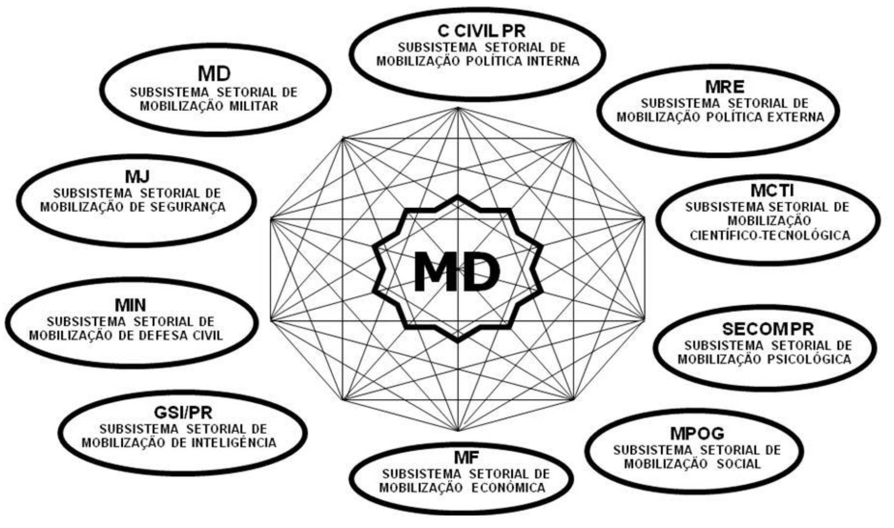
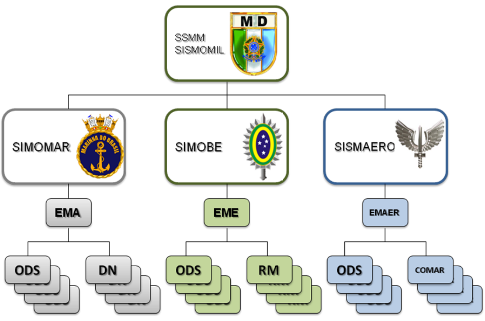
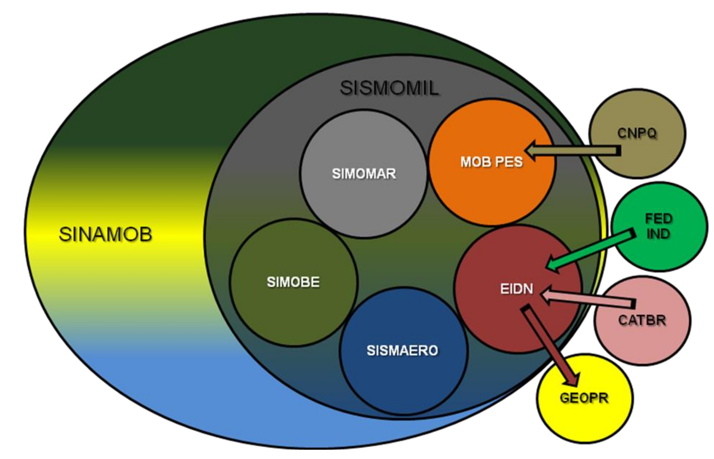

## Página 1

MINISTÉRIO DA DEFESA DOUTRINA DE MOBILIZAÇÃO MILITAR

# MD-41-M-01 - Doutrina de Mobilização Militar

## Página 13

### CAPÍTULO I - INTRODUÇÃO

1.1 Finalidade

Estabelecer a concepção doutrinária a ser considerada pelo Ministério da Defesa (MD) e pelas Forças Armadas (FA) no preparo e na execução da Mobilização e da Desmobilização Militares, desde a situação de normalidade até a iminência ou efetivação de uma Hipótese de Emprego (HE) ou de situações de crise (catástrofes, desastres naturais etc.) e posterior retorno à normalidade.

1.2 Conceitos Básicos

Com o intuito de facilitar o entendimento da presente publicação, os principais conceitos básicos estão transcritos no Anexo IV — Glossário.

1.3 Generalidades

1.3.1. A Estratégia Nacional de Defesa (END) apresenta a capacidade de mobilização nacional como fator de dissuasão nas relações internacionais, na medida em que confere elasticidade na expansão do poder combatente das FA, com o aumento célere dos recursos humanos, materiais e de serviços, para complementar a Logística Militar nas situações motivadoras em que o País estiver envolvido.

1.3.2. Como estratégia de dissuasão, as FA brasileiras deverão estar estruturadas de modo compatível com a estatura político-estratégica do País para preservar a soberania e os interesses nacionais em conciliação com os interesses dos países da América do Sul. Esse contexto deverá ser sustentado não apenas pela superioridade econômica, tecnológica e militar, como também pela capacidade de mobilização nacional.

1.3.3. A promulgação da Lei de Mobilização Nacional (Lei nº 11.631, de 27 de dezembro de 2007) permitiu ao MD evoluir na formulação do arcabouço legal que orienta as ações do Sistema Subsetorial de Mobilização Militar, sendo a Doutrina de Mobilização Militar o documento básico para o desenvolvimento, em todos os níveis, dos planejamentos de preparo e execução da mobilização militar.

## Página 15

### CAPÍTULO II - RELAÇÃO ENTRE LOGÍSTICA E MOBILIZAÇÃO

2.1. Introdução

2.1.1. A Logística Nacional deve fornecer os meios necessários para a realização das ações estratégicas nacionais. Quando esses meios se tornam insuficientes para fazer face às ameaças à Defesa Nacional, o Estado empregará a Mobilização Nacional, de modo a obter os meios que não puderem ser proporcionados de imediato. A Logística é, portanto, o ponto de partida para a Mobilização.

2.1.2. O Poder Nacional é o campo comum de atuação da Logística e da Mobilização. Isso faz com que, particularmente na fase do preparo da Mobilização, as ações desenvolvidas pelos dois sistemas sejam concorrentes, porém não conflitantes, tornando, por vezes, complexo o entendimento da distinção do que é Logística e do que é Mobilização.

2.1.3. Essa distinção, em determinadas circunstâncias, torna-se desnecessária, uma vez que o objetivo a ser alcançado com as ações empreendidas pelos dois sistemas é a capacitação da Expressão Militar do Poder Nacional para cumprir suas destinações constitucionais, em especial aquela relacionada com a manutenção e a defesa da Soberania Nacional.

2.1.4. Quando o Estado realiza ações de desenvolvimento no campo da Logística Nacional, como, por exemplo, o fomento da pesquisa científico-tecnológica e da inovação para nacionalização de produto de defesa, está, ao mesmo tempo, expandindo o Potencial Nacional, relacionado à Mobilização e, consequentemente, fortalecendo o Poder Nacional vinculado à Logística.

2.1.5. Atualmente, cresce a importância do fomento de projetos de desenvolvimento e de produção de itens de emprego dual (de aplicação civil e militar), de forma a contribuir com o crescimento das empresas e a manutenção de linhas de produção de materiais de possível emprego militar, desse modo, incrementando a manutenção do Poder Nacional e o desenvolvimento do Potencial Nacional, respectivamente, nas áreas de Logística e Mobilização.

2.1.6. Cabe ressaltar que, em situação de normalidade, ações de Logística ou de preparo da Mobilização são executadas por intermédio da aplicação de recursos orçamentários, respeitando-se as leis de mercado. Nesse caso, o Estado não está capacitado a obrigar o setor privado a atender suas encomendas, passando a ter essa competência somente após a Mobilização Nacional ter sido decretada pelo Presidente da República.

2.1.7. O parágrafo único do art. 4º da Lei de Mobilização Nacional (Lei nº 11.631, de 2007) esclarece o limiar conceitual entre Logística e Mobilização quando especifica medidas que caracterizam o poder coercitivo do Estado a fim de preparar o País para o enfrentamento de situações de emergência previstas nesse diploma legal:

## Página 16

Art. 4º Parágrafo Único.(...)

I — a convocação dos entes federados para integrar o esforço da Mobilização Nacional;

II — a reorientação da produção, da comercialização, da distribuição e do consumo de bens e da utilização de serviços;

III — a intervenção nos fatores da produção públicos e privados; IV — a requisição e a ocupação de bens e serviços; e

V — a convocação de civis e militares.

2.1.8. É na fase da execução da Mobilização que essa distinção se evidencia, ao permitir que ocorra a intervenção do Estado nos meios de produção, de forma célere e compulsória, para complementar as carências de toda ordem da Expressão Militar do Poder Nacional, de modo a implementar e incrementar ações em favor da Defesa Nacional.

2.2. Metodologia de Obtenção de Recursos

2.2.1. O ciclo logístico é o processo pelo qual se desenvolve, de forma abrangente, a logística militar, sendo de fundamental importância que os planejamentos logísticos e de mobilização sejam realizados de maneira integrada. O ciclo logístico é dividido em três fases básicas: determinação de necessidades, obtenção e distribuição, correspondendo cada fase singular a ações específicas concernentes à mobilização.

2.2.2. No caso específico das operações conjuntas, serão acrescidas duas fases de especial interesse para a mobilização: a determinação das capacidades logísticas e a reversão.

2.2.3. Na comparação das ações dos dois sistemas (Logística e Mobilização), verifica-se que a Mobilização Militar utiliza-se das mesmas fases da Logística Militar (determinação das necessidades, obtenção e distribuição), a fim de prover a complementação das necessidades de recursos para a condução das operações militares de defesa e de manutenção da Soberania Nacional.

2.2.4. A forma de obtenção de recursos poderá distinguir ações relativas à Logística e à Mobilização. Na Mobilização, o Estado adquire a capacidade de, com os limites e garantias previstos em lei, obrigar as agências governamentais, empresas públicas, empresas privadas e mesmo os entes federados (Estados e Municípios) a fornecer bens e serviços necessários à condução de Operações Militares.

2.2.5. Nesse contexto, a Mobilização Militar recebe as carências logísticas das Forças Singulares (FS), busca em seus sistemas de apoio à decisão a forma de obtenção dos recursos relativos às carências levantadas e, por vezes, finaliza o ciclo com a distribuição do recurso mobilizado à Força solicitante, caso não possam ser utilizadas as linhas tradicionais da Logística Militar.

## Página 17

2.2.6. A obtenção dos recursos logísticos de instalações, material e serviços, para fim de Mobilização, conforme disposições legais em vigor em tempo de normalidade ou a serem elaboradas em situações de emergência, dar-se-á por intermédio de um dos seguintes métodos:

a) Doação: concessão de recurso por parte do proprietário, de forma gratuita;

b) Compra: processo de aquisição de bens, cedidos voluntariamente pelo proprietário mediante pagamento de importância ajustada, à vista ou a prazo, sendo o processo mais aconselhável e normal;

c) Contratação de serviço: processo indenizável utilizado para a formalização da prestação de determinado serviço;

d) Confisco: apropriação sumária e de forma controlada, em caráter punitivo, sem pagamento, para utilização militar;

e) Contribuição: tributo, periódico ou eventual, voluntário ou compulsório, visando a determinado fim militar, podendo ou não comportar ressarcimento posterior;

f) Pedido: solicitação formal a órgão de suprimento ou prestador de serviços, segundo normas específicas;

9) Requisição: imposição do fornecimento de materiais, animais e serviços, mediante ordem escrita e assinada por autoridade competente, sendo o pagamento, normalmente, realizado posteriormente;

h) Desenvolvimento: processo de especificação, projeto, teste e produção, dirigido ao atendimento de uma necessidade específica;

i) Troca: processo de aquisição de bens e serviços cedidos voluntariamente, mediante ressarcimento em outros bens e serviços;

j) Empréstimo: processo de aquisição de bens cedidos voluntariamente pelo proprietário, sem ônus para o utilizador, que deverão ser restituídos ao proprietário depois de interrompidas as necessidades de sua utilização, no mínimo no estado em que se encontravam ao serem emprestados;

k) Arrendamento mercantil: operação na qual uma das partes cede o uso de um ou mais bens mediante o pagamento, pela outra, de prestações periódicas, sendo usual que, ao final do contrato, o arrendatário tenha opção de compra dos bens; e

l) Transferência: processo para realizar o remanejamento de materiais ou animais entre organizações militares e órgãos públicos.

2.2.7. A obtenção de recursos humanos dar-se-á, dentre outros, por intermédio de um dos seguintes métodos: movimentação de pessoal, treinamento, concurso, formação, convocação, mobilização, contratação ou recrutamento.

## Página 18

xxxx

## Página 19

### CAPÍTULO III - A MOBILIZAÇÃO NA EXPRESSÃO MILITAR DO PODER NACIONAL

3.1. Conceituação

3.1.1. Entende-se por Expressão Militar do Poder Nacional a manifestação de natureza preponderantemente militar do conjunto de pessoas e de meios que a Nação dispõe, atuando em conformidade com a vontade nacional e sob a direção do Estado, para alcançar e manter os objetivos nacionais. Os componentes da Expressão Militar do Poder Nacional são: o Poder Naval, o Poder Militar Terrestre e o Poder Militar Aeroespacial.

3.1.2. Entende-se por Capacidade de Mobilização, na Expressão Militar, o grau de aptidão que as FA possuem para absorver ou se beneficiar dos recursos humanos, materiais e de serviços que a Nação coloca ao seu dispor, em face da concretização de uma ou mais 3.2. Amplitude da Mobilização Militar

3.2.1. Para fim de aplicação dessa Doutrina, a Mobilização poderá ser total ou parcial.

Essa abrangência será especificada em diploma legal que decretará a execução da Mobilização.

3.2.1.1. Mobilização total - quando a emergência configurada exigir o acionamento da totalidade dos recursos do Poder Nacional e, ainda, valer-se dos recursos em estado latente que formam o Potencial Nacional.

3.2.1.2. Mobilização parcial - quando a emergência configurada apenas exigir o acionamento de parte dos recursos do Poder Nacional ou do território nacional.

Observação: caso a emergência configurada for restrita ao campo da Expressão Militar, esses recursos serão transferidos das demais Expressões do Poder Nacional para que as FA possam fazer face à concretização de uma HE. 3.3. Fases da Mobilização Militar 3.3.1. A Mobilização Militar desenvolve suas atividades em duas fases: 
a) Preparo; e 
b) Execução. 

3.3.2. Preparo da Mobilização Militar 

3.3.2.1. O preparo da Mobilização na Expressão Militar do Poder Nacional consiste no conjunto de atividades empreendidas ou orientadas pelo Estado, desde a situação de normalidade, visando a facilitar a execução da Mobilização Militar.

## Página 20

3.3.2.2. Nessa fase, as ações empreendidas pela Expressão Militar devem considerar a conjuntura vigente no campo do desenvolvimento da infraestrutura e da Logística Nacional e buscar inserir nos Programas de Governo desenvolvidos pelo poder público, as necessidades de fortalecimento da Logística e da Mobilização Militar.

3.3.2.3. Deve haver um alinhamento entre as atividades de preparo da Mobilização Militar com as ações estratégicas de desenvolvimento do Governo, a fim de facilitar o provimento de recursos necessários à execução de ações estratégicas de preparo da Mobilização Militar, visando ao emprego da Expressão Militar do Poder Nacional em operações militares de manutenção e de defesa da Soberania Nacional.

3.3.2.4. Nesse contexto, pode-se considerar que as ações empreendidas na fase de preparo da Mobilização Militar são indutoras do desenvolvimento nacional, na medida em que buscam fortalecer a infraestrutura e a logística ao atuarem no Potencial Nacional, objetivando transformá-lo em Poder Nacional.

3.3.2.5. São exemplos de atividades básicas a serem empreendidas durante a fase do preparo:

a) colocação de encomendas educativas nas indústrias da Base Industrial de Defesa (BID);

b) formação e cadastramento de reservas aptas;

c) incremento de pesquisas e desenvolvimentos tecnológicos de interesse dual (militar e civil);

d) busca de padronização e nacionalização de materiais e itens de interesse militar para emprego dual;

e) especificação e acompanhamento de fontes produtoras de material de defesa, no País e no exterior;

f) seleção e cadastramento de empresas públicas e privadas de prestação de serviços;

g) proposta de legislação especial para os casos de excepcionalidade, visando dar suporte jurídico às atividades a serem empreendidas pela Mobilização Militar;

h) mapear e atuar nos planejamentos estratégicos dos governos federal, estadual e municipal, de modo a contemplar recursos passíveis de serem utilizados pelas FA em situação de emergência; e

i) execução de exercícios de mobilização de recursos humanos, materiais, de serviços e de instalações, com o intuito de adestrar o sistema de Mobilização Militar e levantar dados, custos e soluções para as tarefas críticas previstas nos planejamentos estratégico e operacional.

## Página 21

### 3.3.3. Execução da Mobilização Militar

3.3.3.1. A execução da Mobilização Militar consiste no conjunto de atividades, empreendidas ou orientadas pelo Estado, no quadro da Mobilização Nacional, com a finalidade de, compulsória e aceleradamente, transferir recursos e meios existentes ou passíveis de serem obtidos por qualquer método no Poder Nacional, no Potencial Nacional ou no exterior, com prioridade para a Expressão Militar, conforme planejado na fase do preparo da Mobilização Militar.

3.3.3.2. Nessa fase, é para a Expressão Militar do Poder Nacional que converge a maior parte dos recursos de toda ordem disponíveis na Nação, a fim de poder empreender ações para atender à concretização de uma HE das FA.

3.3.3.3. Diretrizes expedidas pelo MD e pelas FA regularão em detalhes, em consonância com o decreto presidencial que autoriza o início da fase de execução da Mobilização Nacional, o alcance geográfico do território nacional e as medidas de caráter excepcional que passarão a vigorar nessa fase, a fim de permitir, de forma célere e compulsória, a passagem de recursos da Nação para a Expressão Militar do Poder Nacional.

3.3.3.4. São exemplos de atividades básicas, entre outras, a serem empreendidas durante a fase de execução:

a) aprovação da legislação especial para os casos de excepcionalidade, já formulada e não aprovada na fase do preparo;

b) desenvolvimento de campanhas visando obter o apoio interno e externo aos objetivos idealizados nos planejamentos para a HE das FA para atender à emergência configurada;

c) convocação, incorporação e destinação dos recursos humanos, de acordo com os planejamentos supracitados;

d) intervenção nas indústrias militares, indústrias civis, instalações e órgãos logísticos de interesse militar, dentro dos limites fixados em lei; e

e) participação do Centro de Coordenação Logística e Mobilização (CCLM), compondo a célula de mobilização.

## Página 22

## Página 23

### CAPÍTULO IV - SISTEMA DE MOBILIZAÇÃO MILITAR

4.1. Definição

O Sistema de Mobilização Militar (SISMOMIL) é o subsistema setorial do Sistema Nacional de Mobilização (SINAMOB), que atua na Expressão Militar do Poder Nacional com a finalidade de realizar todas as fases da Mobilização e da Desmobilização Militares. (Fig. 1 do Anexo Il)

4.2. Competências

4.2.1. Compete ao Ministério da Defesa, como Órgão de Direção Setorial da Expressão Militar (ODSEM), por meio de órgão previsto no seu Regimento Interno, exercer as responsabilidades como Secretaria-Executiva do Sistema de Mobilização Militar e realizar as atividades técnico-administrativas inerentes ao seu funcionamento.

4.2.2. Caberá a cada Comando de Força Singular estruturar o seu Sistema de Mobilização de forma a executar, no âmbito de cada Força, as ações relativas à Mobilização e à Desmobilização Militares.

4.2.3. O ODSEM poderá solicitar reunião do Conselho de Coordenação (CONCOORD), composto por representantes dos Estados-Maiores das Forças Armadas e do Ministério da Defesa.

4.2.4. O CONCOORD terá como competência, quando convocado pelo ODSEM, a apreciação de assuntos de Mobilização e Desmobilização Militares que envolvam interesse de mais de uma FS.

4.2.5 A figura 2 do Anexo “II” apresenta a Estrutura Organizacional do SISMOMIL.

## Página 24

## Página 25

### CAPÍTULO V - PLANEJAMENTO DA MOBILIZAÇÃO MILITAR

5.1. Concepção

5.1.1. A Mobilização Militar, como parte integrante da Mobilização Nacional, deve desenvolver atividades que se destinem a capacitar as FS para enfrentar com êxito uma situação de emergência, procurando dotá-las de todos os recursos de pessoal, material e de serviços necessários e previstos nos planos de mobilização que excederam as possibilidades logísticas, a serem obtidos no Poder Nacional, no Potencial Nacional ou no exterior.

5.1.2. O planejamento da Mobilização Militar terá como referência as Listas de Necessidades, levantadas por ocasião dos planejamentos.

5.1.3. Do confronto entre as necessidades e as disponibilidades resultará o conhecimento das carências logísticas que a Mobilização Militar buscará suprir e suplantar, de forma contínua, metódica e permanente, na fase do “Preparo”, e de forma acelerada e compulsória quando na fase da “Execução”, caso a Logística Militar não as tenha atendido nos prazos previstos.

5.1.4. Considerando o fato de que, por ocasião da aplicação do Poder, as necessidades normalmente superam as disponibilidades, o SISMOMIL deverá planejar o desenvolvimento de ações que criem condições para transformar o Potencial em Poder e capacitem o Poder Nacional à produção, tempestivamente, na quantidade e qualidade necessárias, de recursos e meios de toda ordem, imprescindíveis à Mobilização Militar.

5.1.5. O planejamento deve basear-se:

a) na observação da legislação referente à Mobilização Nacional;

b) nas Hipóteses de Emprego das FA;

c) na priorização do emprego dos produtos nacionais de defesa;

d) na tendência atual de os conflitos armados ocorrerem de modo rápido e violento, exigindo uma pronta resposta do Poder Nacional, o que impõe uma fase meticulosa de preparo para atender com rapidez a transição para a execução da Mobilização; e

e) na interoperabilidade entre as FA.

5.1.6. A Mobilização Militar deverá, portanto, ser planejada de modo a assegurar os recursos e os meios necessários à rápida capacitação das FA para a consecução das ações, fornecendo-lhes pessoal com habilitação para os recompletamentos, além dos recursos logísticos e financeiros na qualidade, na quantidade e na especificação previstas nos planejamentos, para atender às HE das FA.

## Página 26

5.1.7. O Anexo "III" apresenta a Concepção Lógica do SISMOMIL.

### 5.2. Metodologia de Planejamento

5.2.1. Os Planos de Mobilização, em todos os níveis, deverão abranger ações referentes as fases de preparo e de execução da Mobilização Militar.

5.2.2. A fase de preparo conterá as ações e as medidas a serem adotadas durante o período de normalidade da Nação. Nessa fase, o planejamento deverá orientar as FS para as medidas a serem empreendidas, em harmonia com o processo de desenvolvimento do País, particularmente as de fomento da BID.

5.2.3. As ações de preparo compreendem, ainda, os exercícios de adestramento conjunto relativos às atividades de mobilização de recursos humanos, de materiais, de serviços e de instalações. Para esses exercícios deverão ser expedidas diretrizes pelo MD e pelos Comandos das FS, a fim de definir os propósitos e as responsabilidades de cada escalão envolvido nos exercícios.

5.2.4. A fase de execução conterá as ações a serem desenvolvidas a partir da decretação da Mobilização Nacional. Nessa fase, o planejamento das FS deverá acelerar as atividades destinadas a reduzir as carências existentes, com a utilização de recursos provenientes das demais Expressões do Poder Nacional.

5.2.5. Por ocasião do planejamento das HE, o Estado-Maior Conjunto das Forças Armadas (EMCFA) estabelecerá a prioridade dos Planos de Mobilização, após apreciação dos Comandos das FS. Para cada HE deverá ser elaborado um Plano de Mobilização baseado nas Listas de Necessidades levantadas durante os planejamentos.

5.2.6. A Mobilização Militar deverá estar presente em todas as fases de planejamento das HE (Planejamentos Estratégico, Operacional e Tático), apresentando, de forma contextualizada com a HE em questão, as ações estratégicas da fase de preparo da Mobilização, as diretrizes gerais e particulares para os planejamentos operacionais e táticos, bem como os Planos de Mobilização das FA.

5.2.7. O Planejamento da Mobilização Militar será consubstanciado no Plano Subsetorial de Mobilização Militar (PSMM) que consolidará os Planos de Mobilização das FA. Os planejamentos devem ser mantidos atualizados, particularmente, quando houver alterações sensíveis na conjuntura nacional relativas à infraestrutura e à logística, bem como nos custos estimados para as operações planejadas.

5.2.8. Os Planos de Mobilização, compatíveis com o nível do planejamento, conterão basicamente:

a) previsão do atendimento das necessidades por transferências internas de recursos existentes e por obtenções;

b) especificação dos recursos em falta, detalhando quantidade, qualidade, estimativa de custos de aquisição e prováveis fornecedores, previamente cadastrados em seus sistemas de informação;

## Página 27

c) necessidade de intervenção em empresas públicas ou privadas, especificando as ações e os recursos estimados para a sua realização;

d) estimativa dos prazos e locais para atendimento às carências dos escalões considerados; e

e) estimativa dos prazos para atendimento às carências de recursos não passíveis de aquisição ou fornecimento pela indústria nacional.

5.2.9. Após a decretação de Mobilização Nacional pelo Presidente da República, o MD emitirá sua Diretriz de Mobilização, contendo as orientações para as respectivas Forças, relativas às ações a serem adotadas para a execução do PSMM.

5.2.10. Os Comandos das Forças Singulares estabelecerão as Diretrizes de Mobilização para os Comandos subordinados.

## Página 28

## Página 29

### CAPÍTULO VI - DESMOBILIZAÇÃO

6.1. Aspectos Pertinentes

6.1.1. Cessados ou reduzidos os motivos que determinaram o desenvolvimento da Mobilização, a Nação deverá retornar à condição de normalidade. Impõe-se, dessa forma, a adoção de medidas específicas de Desmobilização Nacional, devendo ser planejadas e preparadas, para serem executadas de modo gradativo, procurando conciliar as necessidades decrescentes da estrutura criada pela situação de crise com as necessidades crescentes da volta à situação de normalidade.

6.1.2. As ações e medidas que virão a compor o Plano Setorial de Desmobilização Militar (PSDM) decorrerão das Diretrizes emanadas do ODSEM, observado o prescrito no dispositivo legal que decretou a execução da Mobilização Nacional. Essas diretrizes permitirão o retorno gradativo à situação de normalidade, visando ao menor prejuízo possível para a sociedade, sem que venham, entretanto, a comprometer o nível de operacionalidade atingido pelas FA, considerando, ainda, a possibilidade de recrudescimento das ações.

6.1.3. As condições e as garantias com que o cidadão será ressarcido pela utilização de bens ou serviços de sua propriedade por parte da Expressão Militar do Poder Nacional, durante a vigência do esforço de Mobilização, deverão estar previstas em ordenamento jurídico, visando ainda o menor prejuízo possível para a sociedade, quando do retorno à situação de normalidade.

6.2. Planejamento

6.2.1. Para cada Plano de Mobilização deverá corresponder um Plano de Desmobilização, cabendo ao ODSEM, após examinar as propostas dos Comandos das FS, estabelecer o momento do início da sua execução.

6.2.2. Compatíveis com o nível do planejamento, os Planos de Desmobilização conterão, basicamente:

a) medidas de assistência social destinadas aos contingentes de recursos humanos desmobilizados;

b) condições de absorção e de devolução dos recursos logísticos mobilizados de propriedade particular;

c) formas de ressarcimento aos cidadãos pelos bens e serviços mobilizados, observando-se a previsão em lei; e

d) processos de redução gradativa da intervenção nos meios de produção.

## Página 30

6.2.3. São exemplos de ações de Desmobilização Militar, dentre outras:

a) absorção dos excedentes de produção da BID;

b) criação de uma situação interna favorável à retomada da normalidade;

c) reintegração dos recursos humanos mobilizados às condições de trabalho originais;

d) amparo e readaptação dos incapacitados decorrentes das operações militares;

e) extinção de comandos, unidades militares e serviços criados em razão do esforço de mobilização;

f) destinação aos excedentes de guerra em poder das FA;

g) liberação dos controles e das restrições implementadas para as organizações civis, que foram colocadas à disposição da Mobilização Militar; e

h) retorno das indústrias militares e de interesse militar à situação anterior à mobilização.

## Página 31

### CAPÍTULO VII - DISPOSIÇÕES FINAIS

7.1. Generalidades

7.1.1. O EMCFA e as FS deverão considerar, por ocasião de operações de adestramento, exercícios e estudos conduzidos sob sua iniciativa, a possibilidade de incluir militares e/ou civis que lidem com os assuntos de Mobilização, tanto do Ministério da Defesa como dos Estados-Maiores daquelas Forças. Quando não houver prejuízo ao desenvolvimento das ações ou ao seu sigilo, representantes dos demais subsistemas componentes do SINAMOB poderão, igualmente, ser incluídos.

7.1.2. As Escolas de Formação, de Aperfeiçoamento e de Altos Estudos das Forças Singulares incluirão nos seus Planos de Disciplinas o desenvolvimento de assuntos e de exercícios referentes à Mobilização e à Desmobilização Militares.

7.1.3. O ODSEM deverá constar das listas de distribuição de publicações e assuntos, elaboradas pelas FA, inerentes à Mobilização e à Desmobilização Militares.

7.1.4. A Escola Superior de Guerra (ESG) deverá desenvolver, em seus cursos e estágios, assuntos e trabalhos referentes à Mobilização e Desmobilização Militares.

## Página 33

### ANEXO A - ESTRUTURA ORGANIZACIONAL DO SISTEMA DE MOBILIZAÇÃO MILITAR - SISMOMIL

## Página 34

### ANEXO B - CONCEPÇÃO LÓGICA DO SISMOMIL

SIGLA DESCRIÇÃO 
SINAMOB Sistema Nacional de Mobilização
SISMOMIL Sistema de Mobilização Militar
SIMOMAR Sistema de Mobilização Marítima
SIMOBE Sistema de Mobilização do Exército
SISMAERO Sistema de Mobilização Aeroespacial
EIDN Sistema de Empresas de Interesse da Defesa Nacional
MOBPES Sistema de Mobilização de Pessoal
CNPq Conselho Nacional de Desenvolvimento Científico e Tecnológico - Plataforma
FEDIND Sistema das Federações de Indústrias
CATBR Catálogo Brasileiro de Itens e Empresas
GEOPR Sistema Georreferenciado de Apoio à Decisão da Presidência da República

## Página 37

### ANEXO C - GLOSSÁRIO

Atividade Logística - conjunto de tarefas afins, reunidas segundo critérios de relacionamento, interdependência ou similaridade, cujos resultados concorrem para o desenvolvimento de uma determinada função logística.

Base Industrial de Defesa (BID) - conjunto integrado por empresas estatais e privadas, bem como organizações civis e militares, que realizem ou conduzam pesquisa, projeto, desenvolvimento, industrialização, produção, reparo, conservação, revisão, conversão, modernização ou manutenção de produtos de defesa no País.

Capacidade Logística - Capacidade que têm as forças armadas de desenvolver um conjunto de medidas para prever e prover na qualidade, na quantidade e na oportunidade, os recursos humanos, o material e os serviços necessários ao seu preparo e emprego.

Capacidade de Mobilização Nacional - grau de aptidão que tem a Nação de, em tempo oportuno, passar de uma situação de paz para uma situação de guerra, com o máximo de eficácia e o mínimo de transtornos para a vida nacional.

Carências Logiísticas - recursos logísticos, os quais não são passíveis de obtenção pelo escalão considerado e que são encaminhados para obtenção pelo escalão superior.

Catálogo de Itens e Empresas (CAT-BR) - se constitui em um Catálogo que representa o universo dos itens gerenciados pelas Forças Armadas Brasileiras e permite ao usuário distinguir cada item de suprimento de forma inequívoca através da descrição das suas características e/ou referências dos seus fabricantes. O CAT-BR é o produto final do Sistema Militar de Catalogação (SISMICAT).

Conselho Nacional de Desenvolvimento Científico e Tecnológico (CNPq) - Criado em 1951, é uma agência do Ministério da Ciência, Tecnologia e Inovação (MCTI), que tem como principais atribuições fomentar a Ciência, Tecnologia e Inovação, incentivar a formação de pesquisadores brasileiros e atuar na formulação de suas políticas, contribuindo para o avanço das fronteiras do conhecimento, o desenvolvimento sustentável e a soberania nacional.

Desmobilização Militar - parte da desmobilização nacional, cujas atividades se destinam ao retorno gradativo da Expressão Militar do Poder Nacional às proporções compatíveis com as exigências da Defesa Nacional, em situação de normalidade.

Desmobilização Nacional - conjunto de atividades planejadas, orientadas e empreendidas pelo Estado, com vistas ao retorno gradativo do País à situação de normalidade, quando cessados ou reduzidos os motivos determinantes da execução da Mobilização Nacional.

## Página 38

Determinação das capacidades logísticas - etapa inicial do planejamento logístico do Teatro de Operações, a qual será executada pelos planejadores logísticos em todos os níveis, com o objetivo de identificar os meios e as unidades logísticas especializadas, existentes e disponíveis na área de operações, para a estruturação do apoio logístico. Nos níveis estratégico e operacional, a identificação dos meios disponíveis deverá considerar não somente os militares, mas também os meios civis contratáveis e os meios passíveis de mobilização. No nível tático, a capacidade logística será determinada pelos meios adjudicados ao Comando do Teatro de Operações pelas Forças Singulares.

Determinação das Necessidades - decorre do exame pormenorizado dos planos propostos e, em particular, das ações e operações previstas, definindo quais são as necessidades, quando, em que quantidade, com que qualidades e em que local deverão estar disponíveis. A importância dessa fase é ressaltada pela complexidade a ela inerente e por constituir-se na base em que se assentarão as fases subsequentes.

Distribuição - consiste em fazer chegar aos usuários, oportuna e eficazmente, todos os recursos fixados pela determinação das necessidades. A distribuição dos recursos materiais compreende o recebimento, o armazenamento, o transporte e a entrega.

Encomendas Educativas - são os prováveis itens necessários à Mobilização Militar, destinados às empresas reconhecidas como de interesse da defesa nacional, para manutenção da sua produção, garantida com recursos da Mobilização, a fim de evitar prejuízos àquela empresa e manter a capacitação da mão de obra especializada e da própria indústria para fabricação daquele item.

Fases da Logística - conjunto de ações que se constituem na base para se desenvolver todo o processo, tanto de logística como de mobilização. Por sua importância, destacamse as seguintes fases: determinação das necessidades, obtenção e distribuição.

Função Logística - reunião, sob uma única designação, de um conjunto de atividades logísticas afins, correlatas ou de mesma natureza. Divide-se em: engenharia, manutenção, recursos humanos, salvamento, saúde, suprimento e transporte.

Hipótese de Emprego (HE) - antevisão de possível emprego das Forças Armadas em determinada situação ou área de interesse estratégico para a Defesa Nacional. E formulada considerando-se o alto grau de indeterminação e imprevisibilidade de ameaças ao País, sendo perfeitamente caracterizada e mensurável. Com base nas Hipóteses de Emprego, serão elaborados e mantidos atualizados os planos estratégicos e operacionais pertinentes, visando a possibilitar o contínuo aprestamento do Poder Nacional como um todo, e em particular do Poder Militar, para emprego na defesa dos interesses nacionais.

Listas de Necessidades - documento elaborado por ocasião dos planejamentos que relaciona as demandas de toda ordem (de inteligência, de logística, de C?, de operações de informação, doutrinárias, de tropas e meios de cada Força, de adestramento etc.), visualizadas como deficiências a serem supridas para a obtenção das condições básicas e a efetivação do plano. Esse processo de levantamento de necessidades terá prosseguimento nos níveis de planejamento subsequentes, quando será consolidado, constituindo subsídio relevante para o aparelhamento e o preparo das Forças. Por ocasião da entrega dos planejamentos por parte dos Comandos Operacionais ativados, o EMCFA deverá analisar as listas de necessidades, definindo o que pode ser atendido no âmbito da Expressão Militar do Poder Nacional, assim como as carências a serem supridas por meio da mobilização.

## Página 39

Logística Militar - conjunto de atividades relativas à previsão e à provisão dos recursos e dos serviços necessários à execução das missões das Forças Armadas.

Logística Nacional - conjunto de atividades relativas à previsão e à provisão dos recursos e meios necessários à realização das ações decorrentes da estratégia nacional.

Mobilização Militar - conjunto de atividades planejadas, orientadas e empreendidas pelo Estado, desde a situação de normalidade, com o propósito de preparar a expressão militar para a passagem da estrutura de paz para a estrutura de guerra, para fazer frente a uma situação de emergência decorrente da iminência de concretização ou efetivação de uma HE.

Mobilização Nacional - conjunto de atividades planejadas, orientadas e empreendidas pelo Estado, complementando a Logística Nacional, destinadas a capacitar o País a realizar ações estratégicas no campo da Defesa Nacional, diante de agressão estrangeira.

Necessidades Logísticas - todos os recursos logísticos, quantificados para atender às operações planejadas, abrangendo tanto os recursos necessários ao início, como à sustentação das operações.

Obtenção - fase em que são identificadas as fontes e tomadas as medidas para a aquisição e a obtenção dos recursos necessários. O maior esforço da mobilização darse-á nesta fase.

Poder Nacional - É a capacidade que tem a Nação para alcançar e manter os Objetivos Nacionais, em conformidade com a Vontade Nacional. Manifesta-se em cinco expressões: a política, a econômica, a psicossocial, a militar e a científico-tecnológica.

Potencial Nacional - conjunto de recursos humanos e de meios de que dispõe a Nação, em estado latente, passíveis de serem transformados em poder.

Reversão - fase final da logística conjunta, executada pelos órgãos componentes da cadeia logística, evacuando da frente para a retaguarda os meios de combate ou logísticos, em condições de inservibilidade, substituição ou rodízio para preservação da área de operações. A reversão deverá ser objeto de especial atenção por ocasião do encerramento das operações de um Comando Operacional ativado, uma vez que todos os meios materiais disponibilizados aos mesmos, seja por aquisição, adjudicação ou mobilização, serão avaliados e processados, sendo-lhes dado o destino apropriado.

Sistema de Empresas de Interesse da Defesa Nacional (EIDN) - Sistema apoiado em tecnologia da informação (TI) para orientar os trabalhos desenvolvidos no âmbito das Forças Armadas visando padronizar os procedimentos de coleta de dados que servirão para o Ministério da Defesa declarar, as empresas ou estabelecimentos como de interesse da Defesa Nacional, tanto para fins de Mobilização Nacional, como para aplicação da Lei do Serviço Militar.

## Página 40

Sistema das Federações de Indústrias (FEDIND) - Neste caso, indicando que vários Sistemas de Federações de Indústrias (FIERJ, FIBRA, FIESP, etc.) podem participar do SISMOMIL, por meio do EIDN.

Sistema Georreferenciado de Monitoramento e Apoio à Decisão da Presidência da República (GEOPR) - é um sistema baseado em TI, de busca e troca de informações, administrado no Gabinete de Segurança Institucional (GSI/PR), utilizado como uma ferramenta para assessoramento das decisões na Presidência da República.

Sistema de Mobilização Aeroespacial (SISMAERO) - é um sistema integrante, no campo da Defesa Nacional, do SISMOMIL, componente do SINAMOB, composto por um conjunto de normas que estabelece os procedimentos a serem adotados na Marinha do Brasil (MB) para o planejamento, coordenação e execução da Mobilização Marítima, devendo servir de base doutrinária às diversas ações a ela inerentes.

Sistema de Mobilização do Exército (SIMOBE) - é um sistema integrante, no campo da Defesa Nacional, do SISMOMIL componente do SINAMOB, e no âmbito do Exército Brasileiro (EB) é considerado um dos Sistemas de Atividades que busca, por meio da utilização de recursos de tecnologia da informação, integrar processos, metodologias, procedimentos, métodos, rotinas e técnicas, destinadas à produção de conhecimentos com qualidade e oportunidade necessárias ao gerenciamento eficiente, eficaz e efetivo de todas as atividades relativas à mobilização militar terrestre, assim como as de desmobilização.

Sistema de Mobilização Marítima (SIMOMAR) - é um sistema integrante, no campo da Defesa Nacional, do Sistema de Mobilização Militar (SISMOMIL), componente do Sistema Nacional de Mobilização (SINAMOB), composto por um conjunto de normas que estabelece os procedimentos a serem adotados na MB para o planejamento, coordenação e execução da Mobilização Marítima, devendo servir de base doutrinária às diversas ações a ela inerentes.

Sistema Nacional de Mobilização (SINAMOB) - consiste no conjunto de órgãos que atuam de modo ordenado e integrado, a fim de planejar e realizar todas as fases da Mobilização e da Desmobilização Nacionais.

Sistema de Mobilização de Pessoal (MOBPES) - Ainda não criado, neste caso, indicando um sistema no MD para concentrar as informações de pessoal necessário ao esforço da Mobilização.