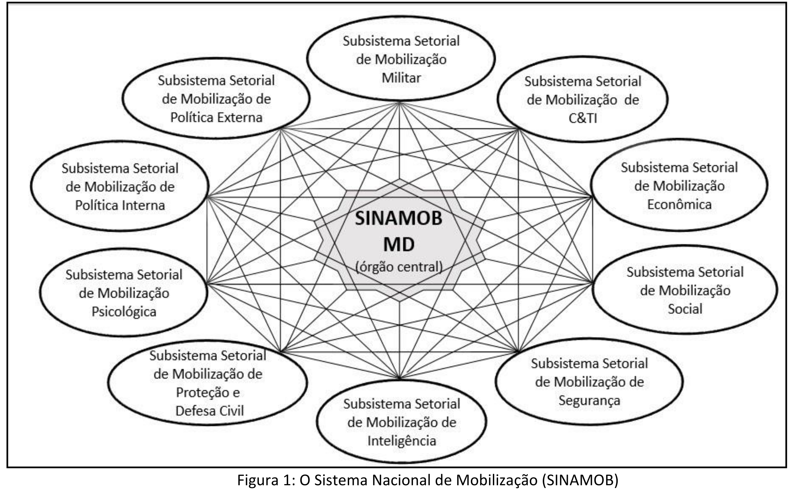

## Página 13

# Capítulo II - Fundamentos Básicos

###  Capítulo 1 - INTRODUÇÃO

### 1.1 Finalidade

Regular os fundamentos doutrinários que orientam os processos relativos à Mobilização Militar no âmbito do Ministério da Defesa (MD) e das Forças Singulares (FS).

### 1.2 Aplicação

Na medida em que orienta tais processos no âmbito do MD e das FS, esta publicação serve de base doutrinária para o conhecimento, o planejamento, o preparo e a execução da Mobilização Militar.

## Página 15

### Capítulo II - FUNDAMENTOS BÁSICOS

### 2.1 A Logística e a Mobilização

2.1.1 A Mobilização Nacional é o conjunto de atividades planejadas, orientadas e empreendidas pelo Estado, complementando a Logística Nacional, destinadas a capacitar o País a realizar ações estratégicas, no campo da Defesa Nacional, diante de agressão estrangeira.

2.1.1.1 São parâmetros para a qualificação da expressão “agressão estrangeira”, entre outros pontos, ameaças ou atos lesivos à soberania nacional, à integridade territorial, ao povo brasileiro ou às instituições nacionais, ainda que não signifiquem invasão ao território nacional.

2.1.2 Posta em execução pelo Estado por meio de decreto presidencial, a Mobilização Nacional presta-se como um instrumento legal para, sobretudo, obter, reunir e distribuir os recursos e meios disponíveis no Poder e Potencial Nacionais[1] ou no exterior, com o objetivo de completar ou complementar a Logística Nacional, visando a contribuir com o esforço de Defesa ou o restabelecimento da Segurança Nacional.

2.1.3 A Logística Nacional é o conjunto de atividades relativas à previsão e à provisão dos recursos e meios necessários à realização das ações decorrentes da Estratégia Nacional de Defesa.

2.1.4 A Logística Nacional, na forma como é conceituada, constitui-se em um instrumento de execução e de atuação permanente, de que se vale a Estratégia Nacional de Defesa, na aplicação do Poder Nacional, para a conquista e manutenção dos Objetivos Nacionais.

2.1.5 A Mobilização tem a finalidade de complementar a Logística quando se esgotar a capacidade desta no atendimento das necessidades requeridas.

2.1.6 A Logística é o ponto de partida para a Mobilização. Durante a situação de normalidade, antes mesmo de ser decretada a Mobilização, seus órgãos estruturantes devem ser informados de suas carências logísticas[2] (necessidades não atendidas pela Logística), de modo a contribuir para elaborar o necessário planejamento de mobilização de pessoal, material, instalações e serviços e facilitar a obtenção desses recursos em complemento à Logística.

[1] PODER NACIONAL: É a capacidade que tem a Nação para alcançar e manter os Objetivos Nacionais, em conformidade com a Vontade Nacional. Manifesta-se em cinco expressões: a política, a econômica, a psicossocial, a militar e a científico-tecnológica.

POTENCIAL NACIONAL - Conjunto de recursos humanos e dos meios de que dispõe a Nação, em estado latente, passíveis de serem transformados em poder

[2] CARÊNCIA LOGÍSTICA: São os recursos logísticos (pessoal, material, instalações e serviços), quantificados na “necessidade logística”, não passíveis de obtenção pelo escalão considerado e que, em consequência, são encaminhados para obtenção pelo escalão superior.

## Página 16

2.1.7 A Logística e a Mobilização se diferenciam na forma de obtenção dos meios necessários e na oportunidade da provisão das necessidades, além do caráter compulsório e na maior celeridade inerentes à Mobilização.

2.1.8 Os recursos logísticos, organizados em função das suas características, são classificados em:

a) pessoal: é o componente básico em qualquer organização; o qual só se torna um recurso logístico, após receber um adequado preparo físico e intelectual;

b) material: são os recursos que tornam possível ou otimizam o emprego do pessoal e dos meios;

c) instalações: são edificações de qualquer natureza que facilitam o desempenho de atividades logísticas ou de mobilização; e

d) serviços: são combinações de recursos que proporcionam, em conjunto, apoio ao pessoal, material e instalações.

2.1.9 A solução de qualquer problema de apoio logístico comporta, de uma maneira geral, três etapas denominadas Fases Básicas da Logística:

a) determinação das necessidades: consiste em definir quais são os meios ou recursos necessários, bem como quando e onde deverão ser entregues;

b) obtenção: consiste nos processos de aquisição dos meios ou recursos indicados na fase anterior; e

c) distribuição: consiste em fazer chegar, oportuna e eficazmente, aos usuários, todos os recursos fixados pela Determinação das Necessidades.

2.1.10 Diferentemente da Logística, na Mobilização, essas fases básicas são desenvolvidas de forma célere e compulsória, agindo no Poder Nacional, no Potencial Nacional e no exterior, a fim de complementar a Logística.

### 2.2 Meios

2.2.1 Meios, segundo o Glossário das Forças Armadas, são a Força e os elementos materiais que integram o poder de combate. Nesse contexto, no tocante ao material, também se entende por meio o recurso material, ou combinação de recursos materiais, que possibilita ou incrementa a execução de uma ação ou atividade voltada para a Defesa Nacional. Desse modo, depreende-se, por exemplo, que navios de guerra, carros de combate e aeronaves de combate são “meios de combate” e que navios cargueiros, caminhões e aeronaves de passageiros e de carga são “meios de transporte” etc.

2.2.2 As novas ameaças inerentes aos tipos de conflitos atuais exigem que alguns meios de combate devam estar disponíveis no início da emergência. O projeto, a fabricação de protótipos e testes de belonaves ou blindados, por exemplo, demandam muito tempo, enquanto sua produção em situação de normalidade é limitada a pequenas ou médias quantidades.

2.2.3 A produção desses meios, caso não faça parte dos planos de logística (Plano Diretor, Planos de Aquisição, etc.), deverá fazer parte de um plano de mobilização e ser desenvolvida desde os tempos de paz, procurando-se atingir as quantidades mínimas necessárias ao desencadeamento do emprego de força pelas FA.

## Página 17

2.2.4 Se for o caso, a necessidade de produção de outros meios (blindados leves, canhões, etc.) e recursos materiais (sistemas de detecção, mísseis, munição, etc.) a serem aplicados ou consumidos pelas Forças em operação deve constar dos planos de execução da Mobilização Industrial.

### 2.3 Componente

Um componente é aquele que faz parte de um ou mais conjuntos, dentro do mesmo critério de interesse do usuário. Exemplo: sistema de direção, tanque de combustível, empenagem e ogiva de um míssil.

### 2.4 Item

2.4.1 Um item pode ser:

a) a unidade de produção industrial (exemplo: míssil);

b) um material de combate pronto para ser utilizado (navio de guerra, aeronave, blindados, viaturas, armamento pesado, etc.);

c) um recurso material para ser aplicado a um componente ou a um meio (sistemas de direção de tiro, de comunicações, de armamento, de propulsão, de detecção etc...); ou

d) um recurso material para ser consumido (mísseis, munição, combustível, mantimentos etc...).

2.4.2 Item de Suprimento é a designação dada a qualquer item necessário para o equipamento, a manutenção e a operação de uma força, incluindo alimentação, vestuário, equipamento, armamento, munição, combustível, forragem, materiais e máquinas de toda espécie.

2.4.3 Sob o ponto de vista de sua essencialidade, os itens podem ser classificados da seguinte forma:

a) Item de Mobilização - selecionado para o planejamento de produção prioritária, acelerada e compulsória, em apoio ao esforço militar. Cada item de mobilização é essencial e específico às Forças Armadas (FA) e sua falta importa na diminuição significativa da capacidade operativa das mesmas;

b) Item Secundário - selecionado para o planejamento da produção no caso de mobilização, sua essencialidade para as FA é menor que a dos itens de mobilização. A inclusão de itens secundários na categoria de itens de mobilização será feita progressivamente, na medida em que esteja assegurada a produção de todos os itens de mobilização já selecionados; e

c) Item de Sobrevivência - tem prioridade sobre os demais, é imprescindível à conservação da vida e, consequentemente, indispensável para assegurar, em situação de emergência, a sobrevivência nacional.

2.4.5 O desenvolvimento do processo de produção industrial de um determinado item de mobilização na fase de execução da Mobilização Industrial será facilitado, sobremaneira, se for planejado na fase do preparo.

## Página 18

### 2.5 Funções Logísticas

2.5.1 As atividades logísticas empregadas na previsão e provisão dos recursos e meios necessários à realização de ações estratégicas estão distribuídas em cada uma das funções logísticas.

2.5.2 Uma determinada função logística é a reunião, sob uma única designação, de um conjunto de atividades logísticas afins, correlatas ou de mesma natureza.

2.5.3 Assim, as funções logísticas são: 
a) engenharia;
b) manutenção;
c) recursos humanos;
d) salvamento;
e) saúde;
f) suprimento; e
g) transporte.

### 2.5.4 Função Logística Engenharia 

É o conjunto de atividades planejadas e executadas com o objetivo de obter e adequar a infraestrutura física e as instalações existentes às necessidades das Forças.

2.5.4.1 A obtenção e a utilização da infraestrutura física necessária, normalmente, compreendem:

a) aeródromos e vias de transporte;
b) terminais de transporte;
c) construção, manutenção, ampliação e recuperação de bases;
d) obstáculos, abrigos e trabalhos de camuflagem; e
e) instalações diversas.

2.5.4.2 São atividades da Função Logística Engenharia: 
a) construção; 
b) ampliação; 
c) reforma;
d) adequação;
e) reparação;
f) restauração;
g) conservação;
h) demolição;
i) remoção;
j) desobstrução;
k) montagem; 
l) avaliação; e
m) gestão ambiental.

## Página 19

### 2.5.5 Função Logística Manutenção

É o conjunto de atividades que são executadas visando a manter o material na melhor condição para emprego e, quando houver avarias, reconduzi-lo aquela condição. São atividades da Função Logística Manutenção:

a) levantamento das necessidades;
b) manutenção preventiva;
c) manutenção preditiva;
d) manutenção modificadora; e
e) manutenção corretiva.

### 2.5.6 Função Logística Recursos Humanos 

É o conjunto de atividades relacionadas com o gerenciamento do pessoal.

2.5.6.1 São atividades da Função Logística Recursos Humanos:
a) levantamento das necessidades;
b) procura e admissão;
c) preparação;
d) administração; e
e) manutenção do moral e do bem-estar.

2.5.6.2 Disciplina, justiça militar, prisioneiros de guerra e civis internados não fazem parte da Função Logística Recursos Humanos.

### 2.5.7 Função Logística Salvamento

É o conjunto de atividades que são executadas visando à salvaguarda e ao resgate de recursos materiais, suas cargas ou itens específicos.

2.5.7.1 São atividades da Função Logística Salvamento:
a) combate a incêndios;
b) controle de avarias;
c) controle de danos;
d) remoção;
e) reboque;
f) desencalhe, emersão ou reflutuação de meios; e
g) resgate de recursos materiais acidentados, cargas ou itens específicos.

### 2.5.8 Função Logística Saúde

É o conjunto de atividades relacionadas com a conservação do pessoal, nas condições adequadas de aptidão física e psíquica, por intermédio de medidas sanitárias de prevenção e de recuperação. Engloba também as atividades relacionadas à conservação da saúde dos animais de emprego militar.

2.5.8.1 São atividades da Função Logística Saúde:

a) Inteligência médica;
b) Seleção médica;
c) Proteção da saúde; e
d) Tratamento.

## Página 20

### 2.5.9 Função Logística Suprimento

É o conjunto de atividades que trata da previsão e provisão do material, de todas as classes, necessário às organizações e forças apoiadas. São atividades da Função Logística Suprimento:

a) levantamento das necessidades;
b) obtenção; e
c) distribuição.

2.5.9.1 As atividades das funções logísticas manutenção e suprimento são interdependentes. A manutenção inadequada implica um aumento das necessidades de suprimento e, inversamente, a carência de suprimento exige maior esforço de manutenção.

### 2.5.10 Função Logística Transporte

É o conjunto de atividades que são executadas com vistas ao deslocamento de recursos humanos, materiais e animais por diversos meios, em tempo e para os locais predeterminados, a fim de atender às necessidades.

2.5.10.1 São atividades da Função Logística Transporte:
a) levantamento das necessidades;
b) seleção; e
c) gerência de transportes.

### 2.6 O Sistema Nacional de Mobilização

2.6.1 O Sistema Nacional de Mobilização (SINAMOB) consiste no conjunto de órgãos que atuam de modo ordenado e integrado a fim de planejar e realizar todas as fases da Mobilização e da Desmobilização Nacionais.

2.6.2 O SINAMOB estrutura-se sob a forma de subsistemas setoriais (Figura 1), que responderão pelas necessidades da Mobilização Nacional nas áreas política, econômica, social, psicológica, de segurança, de inteligência, de defesa civil, científico-tecnológica e militar.

2.6.3 O órgão central do SINAMOB é o Ministério da Defesa, responsável por orientar, supervisionar e conduzir as atividades do Sistema.

2.6.4 Cada um dos subsistemas setoriais será coordenado pelo respectivo Órgão de Direção Setorial (ODS), responsável pelo planejamento, coordenação e articulação da Mobilização Nacional em sua respectiva área de competência. Cada ODS é um Ministério ou outro órgão da estrutura da Presidência da República. O Ministério da Defesa é o Órgão de Direção Setorial da Expressão Militar (ODSEM).

## Página 21

2.6.5 O SINAMOB possui dez Subsistemas Setoriais de Mobilização, a saber:
a) Subsistema Setorial de Mobilização Militar;
b) Subsistema Setorial de Mobilização de Política Interna;
c) Subsistema Setorial de Mobilização de Política Externa;
d) Subsistema Setorial de Mobilização Social;
e) Subsistema Setorial de Mobilização Científico-Tecnológica; 
f) Subsistema Setorial de Mobilização Econômica;
g) Subsistema Setorial de Mobilização de Defesa Civil;
h) Subsistema Setorial de Mobilização Psicológica;
i) Subsistema Setorial de Mobilização de Segurança; e
j) Subsistema Setorial de Mobilização de Inteligência.

Figura 1: O Sistema Nacional de Mobilização (SINAMOB)

### 2.7 Desmobilização Nacional

2.7.1 Cessados os motivos que determinaram a Execução da Mobilização, o País deverá retornar à situação de normalidade, em que os recursos são, em sua maior parte, canalizados, prioritariamente, para o desenvolvimento.

2.7.2 Surge, dessa forma, a figura da Desmobilização Nacional, conceituada como: “Conjunto de atividades planejadas, orientadas e empreendidas pelo Estado, com vistas ao retorno gradativo do País à situação de normalidade, quando cessados ou reduzidos os motivos determinantes da execução da Mobilização Nacional”.

2.7.3 Para cada Plano Nacional de Mobilização será elaborado, simultaneamente, o correspondente Plano Nacional de Desmobilização.

2.7.4 No retorno do País à situação de normalidade, a Desmobilização Nacional deverá ser efetuada gradativamente, para não causar maiores prejuízos à vida nacional, particularmente para a estrutura e a infraestrutura do País, as quais, até então, estavam orientadas, prioritariamente, para o apoio às ações estratégicas de segurança.

2.7.5 Durante o retorno gradual à situação de normalidade, atos normativos regularão as medidas de garantias, quais sejam, reparações ou indenizações devidas aos recursos mobilizados.
