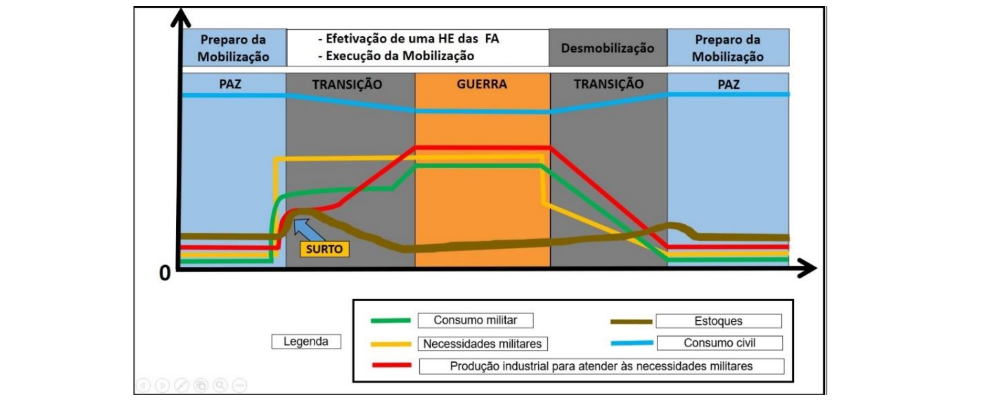

## Página 23

# CAPÍTULO III - Mobilização Industrial

### 3.1 Considerações Iniciais

3.1.1 Capacidade de Mobilização, na Expressão Militar, é o grau de aptidão que têm as Forças Armadas para absorver ou se beneficiar dos recursos humanos, materiais, instalações e serviços que a Nação coloca ao seu dispor, em face da concretização de uma ou mais hipóteses de emprego.

3.1.2 Nesse contexto considera-se que a real capacidade de mobilização militar depende de uma indústria nacional forte e capacitada a manufaturar Produtos de Defesa (PRODE) essenciais, permitindo assim ao Estado brasileiro um efetivo poder dissuasório. Para tal, há necessidade de investimentos em projetos de ciência, tecnologia e inovação (CT&I) em áreas estratégicas e o respectivo fomento à Base Industrial de Defesa (BID)[3].

3.1.3 Em determinada situação de emergência decorrente de agressão estrangeira ou na iminência de sua concretização, a Mobilização Industrial será conduzida pelo Subsistema Setorial de Mobilização Econômica, em ligação com a Secretaria de Produtos de Defesa (SEPROD) do MD, de acordo com as demandas prioritariamente da Expressão Militar, a fim de suprir as necessidades não atendidas pela Logística Militar.

3.1.4 O grande desafio da Mobilização Industrial será a rápida adaptação da indústria para a produção de itens de interesse militar paralelamente ao atendimento das necessidades civis.

3.1.5 A Mobilização Industrial é definida como um conjunto de atividades planejadas, empreendidas e orientadas pelo Estado, no quadro da mobilização nacional, desde a situação de normalidade, visando adequar a capacidade industrial da nação ao atendimento das necessidades militares e civis, determinadas por uma situação de emergência decorrente da iminência de concretização ou efetivação de uma hipótese de emprego das Forças Armadas ou para atender às capacidades operacionais destas.

3.2 Conceitos Básicos Considerando o contido na Lei nº 12.598, de 2012, devem ser observados os seguintes conceitos:

3.2.1 Produto de Defesa (PRODE) Todo bem, serviço, obra ou informação, inclusive armamentos, munições, meios de transporte e de comunicações, fardamentos e materiais de uso individual e coletivo utilizados nas atividades finalísticas de defesa, com exceção daqueles de uso administrativo.

[3] Base Industrial de Defesa (BID) — é conjunto integrado por empresas públicas e privadas, bem como organizações civis e militares, que realizem ou conduzam pesquisa, projeto, desenvolvimento, industrialização, produção, reparo, conservação, revisão, conversão, modernização ou manutenção de produtos de defesa no País.

## Página 24

3.2.2 Produto Estratégico de Defesa (PED)

Todo PRODE que, pelo conteúdo tecnológico, pela dificuldade de obtenção ou pela imprescindibilidade, seja de interesse estratégico para a defesa nacional, tais como:

a) recursos bélicos navais, terrestres e aeroespaciais;

b) serviços técnicos especializados na área de projetos, pesquisas e desenvolvimento científico e tecnológico; e

c) equipamentos e serviços técnicos especializados para as áreas de informação e de inteligência.

3.2.3 Sistema de Defesa Conjunto inter-relacionado ou interativo de produtos de defesa que atenda a uma finalidade específica.

3.2.4 Empresa Estratégica de Defesa (EED)

Toda pessoa jurídica credenciada pelo Ministério da Defesa mediante o atendimento cumulativo das condições previstas no inciso IV do art. 2º da Lei nº 12.598, de 2012. As EED são essenciais para a promoção do desenvolvimento científico e tecnológico brasileiro e fundamentais para preservação da segurança e defesa nacional contra ameaças externas.

3.2.5 Empresa de Defesa

Toda pessoa jurídica cadastrada em conformidade com as normas do Sistema de Catalogação de Defesa (SISCADE)[4] que produza PRODE ou Sistema de Defesa em território nacional ou integre suas cadeias produtivas.

3.2.6 Empresa Mobilizável ou Empresa de Interesse da Mobilização (EIMOB)

É a empresa que, em caso de Mobilização, tenha capacidade técnica e estrutural de fornecer produtos, serviços, instalações ou pessoal necessários ao atendimento das necessidades ou carências logísticas das FA.

3.2.7 Produção Industrial Produção industrial é o resultado do esforço integrado dos seus três elementos básicos: mão de obra, capacidade instalada (máquinas e instalações apropriadas) e insumos.

3.2.7.1 Algumas EIMOB podem apresentar capacidade industrial instalada suficiente ao esforço para atender a uma hipótese de emprego (HE) das Forças Armadas, ou a uma capacidade operacional essencial. Nesse caso, o aumento da produção se fará pela atuação apenas sobre a mão de obra e os insumos. Porém, dependendo da situação, será necessário atuar sobre todos os três elementos básicos da produção, para se obter o seu aumento imediato, que é definido como “surto” e é o resultado da aplicação da mão de obra já existente ou obtida no mais curto prazo possível e da utilização da capacidade ociosa existente e dos insumos estocados (Figura 2).

Figura 2 — Evolução do consumo militar, necessidades militares, produção militar, estoques e consumo civil em situações de paz, guerra e transição.

[4] SISCADE - O Sistema de Catalogação de Defesa é um sistema uniforme e comum para identificação, classificação e codificação de itens de interesse das Forças Armadas brasileiras e exclusivos do Ministério da Defesa, bem como dos demais órgãos participantes. Compreende procedimentos de codificação e intercâmbio automatizado de dados, compatíveis com os padrões definidos para o Sistema OTAN de Catalogação, além daqueles peculiares ao desempenho da atividade de catalogação a nível nacional.

## Página 25

3.2.7.2 No caso de empresas de interesse da Mobilização que, porventura, apresentarem defasagens em suas capacidades instaladas (primeiro elemento básico da produção industrial), a Mobilização poderá atuar junto a essas empresas no sentido de tais defasagens serem corrigidas por meio dos seguintes processos de transformação das citadas capacidades instaladas:

a) adaptação - produção de novos artigos pela adaptação das linhas de fabricação sem modificação da capacidade instalada;

b) ampliação - aumento da produção dos mesmos produtos, pelo aumento da capacidade instalada; ou

c) conversão - produção de novos itens por meio de transformações na capacidade instalada.

3.2.7.3 O segundo elemento básico da produção industrial, ou seja, a mão de obra adicional para atender ao esforço de Mobilização, decorre da necessidade não somente de se aumentar a produção industrial, como também de atender à convocação militar. Conhecidas as indústrias que, direta ou indiretamente, serão consideradas de interesse militar para fins de Mobilização, deve-se evitar a convocação dos elementos essenciais à manutenção da capacidade produtiva ou ao treinamento da mão de obra adicional das indústrias.

3.2.7.4 O terceiro elemento básico na Produção Industrial são os insumos, incluindo os energéticos, que alimentarão o Parque Industrial. Qualquer aumento da produção encontrará como entrave o fornecimento do material a ser transformado. Considerando-se o enfoque de escassez relativa, os insumos podem ser agrupados em três classes:

a) Insumos estratégicos - de mais difícil obtenção; normalmente aqueles que precisam ser importados e, mesmo em tempo de paz, estocados em quantidades necessárias para atender ao consumo normal durante certo tempo. Para atender às exigências de uma HE, ou de uma capacidade operacional essencial, deverá haver um rigoroso planejamento: das quantidades que serão necessárias durante a emergência, das formas de obtenção, da estocagem e da distribuição. Esse plano deve ser desenvolvido na Expressão Econômica, com a contribuição da Expressão Militar, e deve ser posto em execução antes de se configurar a emergência. Deve ser considerada, ainda, a possibilidade de, mesmo em períodos de normalidade, o fornecimento desse material ser interrompido por razões alheias à vontade nacional;

b) Insumos críticos — são aqueles que podem ser obtidos no País, embora com dificuldades. Possuem a mesma importância relativa dos insumos estratégicos e devem receber tratamento semelhante; e

c) Insumos essenciais - são indispensáveis à Mobilização Industrial e a produção nacional garante o seu suprimento adequado. Sua importância relativa exige o controle da sua distribuição, a fim de que uma eventual escassez não os torne críticos.

## Página 26

### 3.3 Classificação de Produtos de Defesa (PRODE) como Produtos Estratégicos de Defesa (PED)

3.3.1 De acordo com o inciso Il do art. 2º da Lei nº 12.598/2012, um PED é todo PRODE que, pelos critérios conteúdo tecnológico, dificuldade de obtenção e imprescindibilidade, seja de interesse estratégico para a defesa nacional. Assim, um PRODE pode ser classificado como PED. No entanto, é fundamental que, antes de ser efetivada essa classificação, o PRODE deva ser avaliado e categorizado segundo os mencionados critérios, juntamente com outras informações pertinentes. Essa análise será feita inicialmente pelas Forças, depois pela Secretaria de Produtos de Defesa por meio da utilização do Sistema de Cadastramento de Produtos e Empresas de Defesa (SisCaPED)[5] e, finalmente, as avaliações e categorizações serão votadas e propostas pela Comissão Mista da Indústria de Defesa (CMID)[6] para aprovação do Ministro da Defesa (Min Def).

3.3.2 Com o intuito de padronizar o processo de classificação de PRODE em PED, tornando-o o menos subjetivo possível, a CMID aprovou duas métricas para cada um dos três critérios acima mencionados (Tabela 1). Essas métricas estão detalhadas no Manual das Métricas do Produto Estratégico de Defesa, anexo à Portaria Normativa nº 86/6M-MD, de 13 Dez 2018, com fulcro na Lei nº 12.598, de 21 de março de 2012, e sua regulamentação.

| CRITÉRIOS               | MÉTRICAS                                              |
| ----------------------- | ----------------------------------------------------- |
| Conteúdo Tecnológico    | Domínio Tecnológico e Ciclo Tecnológico               |
| Dificuldade de Obtenção | Disponibilidade Produtiva e Disponibilidade Logística |
| Imprescindibilidade     | Necessidade Estratégica e Necessidade Tática          |

Tabela 1: AVALIAÇÃO DE PRODE - critérios e respectivas métricas

3.3.3 O conteúdo tecnológico (primeiro critério) é o termo utilizado para mensurar a complexidade tecnológica do produto, que abrange o grau de domínio tecnológico, de maturidade tecnológica e de inovação envolvidos.

[5] SisCaPED - SISTEMA DE CADASTRAMENTO DE PRODUTOS E EMPRESAS DE DEFESA — É um sistema de gestão do processo de credenciamento de Empresas de Defesa, Empresas Estratégicas de Defesa e de classificação de Produtos de Defesa e Produtos Estratégicos de Defesa sob a responsabilidade da Comissão Mista da Indústria de Defesa, conforme previsto no art. 2º do Decreto 7.970, de 28 de março de 2013, 0 qual regulamenta a Lei nº 12.598, de 21 de março de 2012.

[6] CMID — COMISSÃO MISTA DA INDÚSTRIA DE DEFESA — É a comissão que tem por finalidade assessorar o Ministro de Estado da Defesa em processos decisórios e em proposições de atos relacionados à Indústria Nacional de Defesa. Foi criada por meio do Decreto nº 7.970, de 28 de março de 2013, onde constam suas atribuições, alteradas pelo Decreto nº 9.857, de 25 Jun 2019.

## Página 27

3.3.4 Quanto à Dificuldade de Obtenção (segundo critério) de um determinado PRODE, deverão ser considerados, na análise, os seguintes fatores intervenientes:
a) a dificuldade logística envolvida na obtenção; e
b) a capacidade produtiva do setor industrial.

3.3.5 Imprescindibilidade (terceiro critério) é o termo utilizado quando a aplicabilidade do PRODE é indispensável para o emprego operacional nos níveis tático ou estratégico das Forças Armadas. Assim, um PRODE será avaliado quanto à imprescindibilidade observando-se duas métricas concomitantemente: Necessidade Estratégica e Necessidade Tática.
