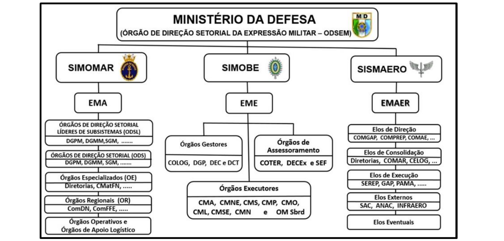

## Página 33

# CAPÍTULO V - O SISTEMA DE MOBILIZAÇÃO MILITAR

### 5.1 Concepção Geral

5.1.1 A Mobilização e a Desmobilização Militares são conduzidas, no campo da Defesa Nacional, pelo Sistema de Mobilização Militar (SISMOMIL), que é um dos subsistemas setoriais do Sistema Nacional de Mobilização (SINAMOB), conforme ilustrado na Figura 1, no item 2.6.

5.1.2 A concepção do funcionamento do SISMOMIL segue as premissas básicas do SINAMOB e fundamenta-se em ligações sistêmicas entre seus componentes, sob coordenação do MD, sem vínculos de subordinação.

5.1.3 Essa concepção tem como atividades básicas:
a) o planejamento da mobilização;
b) o preparo da mobilização;
c) a execução da mobilização; e
d) o preparo e a execução da desmobilização.

5.1.4 Ao SISMOMIIL, estão afetas as atividades de mobilização e desmobilização militares, no MD e nas FA. Nesse sentido, atua diretamente no atendimento às demandas apresentadas pelas FS e, indiretamente, contribui para acionar setores específicos ligados às áreas dos demais componentes do SINAMOB.

### 5.2 Objetivo

O SISMOMIL tem por objetivo alcançar a capacidade e a condição permanentes para coordenar o planejamento da Mobilização e da Desmobilização Militares. Para tal, buscará absorver e empregar, oportunamente, os recursos advindos das demais Expressões do Poder Nacional, a fim de, complementando a Logística Militar, atender às carências logísticas das FA.

## Página 34

### 5.3 Estrutura do Sistema

Figura 3: Estrutura do SISMOMIL

5.3.1 A estrutura do SISMOMIIL (Figura 3) é composta de um Órgão de Direção Setorial da Expressão Militar, cujas atribuições são exercidas pelo Ministério da Defesa, por intermédio do EMCFA, e dos Comandos das Forças Singulares, por intermédio dos seus respectivos Sistemas de Mobilização, cujos Órgãos Centrais de Direção são os Estados-Maiores (EM) das FS:

a) o Sistema de Mobilização Marítima (SIMOMAR);

b) o Sistema de Mobilização do Exército (SIMOBE); e

c) o Sistema de Mobilização Aeroespacial (SISMAERO).

5.3.2 O SIMOMAR tem a mesma estrutura organizacional básica do Comando da Marinha e compreende oito subsistemas específicos, voltados para cada uma das funções logísticas e para o componente civil do Poder Marítimo. Cada subsistema é coordenado por um Órgão de Direção Setorial Líder de Subsistema (ODSL), particularmente quando a complementação das carências de determinada função logística estiver a cargo de mais de um ODS. Os subsistemas e seus respectivos ODSL são:

a) Recursos Humanos [Diretoria-Geral do Pessoal da Marinha (DGPM)];

b) Saúde (DGPM);

c) Manutenção [Diretoria-Geral do Material da Marinha (DGMM)];

d) Salvamento [Comando de Operações Navais (ComOpNav)];

e) Suprimento [Secretaria-Geral da Marinha (SGM)];

f) Transporte (SGM);

g) Engenharia (DGMM); e

h) Atividades Marítimas (ComOpNav).

Obs: o Comando-Geral do Corpo de Fuzileiros Navais (CGCFN) é o ODSL dos assuntos atinentes ao material e recursos humanos específicos do CFN.

## Página 35

5.3.2.1 O SIMOMAR possui cinco níveis de planejamento e/ou execução da Mobilização, assim estruturados:

a) 1º nível - Órgão Central de Direção (OCD): Estado-Maior da Armada (EMA);

b) 2º nível - Órgãos de Direção Setorial Líderes de Subsistema (ODSL), descritos no item 5.3.2;

c) 3º nível - Órgãos de Direção Setorial (ODS): ComOpNav, SGM, DGMM, DGPM e CGCFN;

d) 4º nível - Órgãos Especializados (OE): Diretorias Especializadas, Comando do Material de Fuzileiros Navais (CMatFN) e Comando do Pessoal de Fuzileiros Navais (CPesFN); e

e) 5º nível - Órgãos Regionais (OR): Comandos de Distritos Navais (ComDN), Comando em Chefe da Esquadra (ComemcCh), Comando da Força de Fuzileiros da Esquadra (ComFFE) e OM que exercerão o Comando das Áreas de Apoio, quando ativadas, de acordo com a Estrutura Naval de Guerra.

5.3.3 O SIMOBE é composto de:

a) órgão central: Estado-Maior do Exército (EME);

b) órgãos gestores: Comando Logístico (COLOG), Departamento-Geral do Pessoal (DGP), Departamento de Engenharia e Construção (DEC) e Departamento de Ciência e Tecnologia (DCT);

c) órgãos assessores: Comando de Operações Terrestres (COTER), Departamento de Educação e Cultura do Exército (DECEx) e Secretaria de Economia e Finanças (SEF); e

d) órgãos executores: Comandos Militares de Área e organizações militares subordinadas.

5.3.4 O SISMAERO é composto por organizações enquadradas em cada uma das seguintes classes:

a) órgão central: o Estado-Maior da Aeronáutica (EMAER);

b) elos de direção: Comando de Operações Aeroespaciais (COMAE), Comando de Preparo (COMPREP), Comando-Geral de Pessoal (COMGEP), Comando-Geral de Apoio (COMGAP), Departamento de Controle do Espaço Aéreo (DECEA), Departamento de Ciência e Tecnologia Aeroespacial (DCTA) e Secretaria de Economia, Finanças e Administração da Aeronáutica (SEFA);

c) elos de consolidação: Organizações Militares subordinadas aos elos de direção, consolidam as atividades que compõem suas áreas de atuação no SISMAERO;

d) elos de execução: OM subordinadas aos elos de direção e/ou de consolidação, responsáveis por executar atividades de interesse da Mobilização Aeroespacial inerentes às respectivas áreas de atuação no SISMAERO;

e) elos eventuais: Órgãos de Assistência Direta e Imediata ao Comandante da Aeronáutica e/ou Organizações Militares do COMAER que não integram o SISMAERO; e

f) elos externos: órgãos públicos e/ou entidades privadas as quais, tratando de assuntos de interesse do SISMAERO, são detentores de dados essenciais para o desenvolvimento de atividades inerentes à Mobilização Aeroespacial.

5.3.5 Cabe a cada Comando de FS estruturar o seu Sistema de Mobilização de forma a desenvolver, no âmbito da Força, as atividades relativas à Mobilização e Desmobilização Militares, bem como interagir com o SISMOMIL, em conformidade com a legislação específica deste.

5.3.6 O SISMOMIL é apoiado pelos sistemas corporativos de logística e mobilização existentes em cada FS.

## Página 36

### 5.4 Funcionamento do Sistema

5.4.1 O ODSEM tem por principal atribuição orientar e coordenar as atividades de Mobilização Militar que transcendam as atribuições específicas dos sistemas de Mobilização das FS ou que sejam comuns a mais de um Comando de FS.

5.4.2 As atribuições do ODSEM, distribuídas entre os seus diversos setores, são integradas pelo SISMOMIL, sob a coordenação da Subchefia de Mobilização do MD.

5.4.3 Para a apreciação de assuntos específicos de Mobilização Militar que envolvam interesse de mais de uma FS, cabe ao ODSEM convocar e reunir o Conselho de Coordenação (CONCOORD), composto por representantes dos Estados-Maiores das FS e do EMCFA.

5.4.4 A Direção e Execução das atividades de Mobilização nas FS são atribuições exclusivas de cada Comando de FS.

5.4.5 Os assuntos de Mobilização Militar são tratados no âmbito do SISMOMIL da seguinte forma: a) No âmbito Ministerial

No nível Ministro da Defesa, são deliberados, dentre outros assuntos de Mobilização Militar, a aprovação das publicações normativas, a assinatura da Diretriz de Mobilização Militar, a ser expedida no prosseguimento da decretação da Mobilização Nacional, e a aprovação e assinatura do Plano Setorial de Mobilização Militar (PSMM).

b) No âmbito do EMCFA

1) Para aprovação do CEMCFA, são tratados, dentre outros, os assuntos de Mobilização Militar que devam ser incluídos nos Planos Estratégicos de Emprego Conjunto das Forças Armadas (PEECFA).

2) No âmbito do Comitê de Chefes de Estado-Maior das Forças Armadas, são deliberados, os assuntos (inclusive a Mobilização Militar) que mereçam aprovação conjunta do CEMCFA e Comandos das FS. Do mencionado comitê, participam a Chefia do EMCFA e as Chefias de Estados-Maiores das FS.

c) No âmbito da estrutura do SISMOMIL 1) Em relação à coordenação da Mobilização Militar, os assuntos relacionados com as atribuições do EMCFA / MD e Cmdo FS voltadas para a coordenação das atividades de Mobilização Militar são deliberados no âmbito dos seguintes órgãos: - Chefia de Logística e Mobilização (CHELOG) do EMCFA-MD; - Subchefia de Mobilização (SUBMOB) da CHELOG; e - Subchefias com encargos de Mobilização nos Estados-Maiores das FS.

2) No Conselho de Coordenação da Mobilização Militar, convocado eventualmente pelo ODSEM, são debatidos assuntos comuns às FS que, por sua natureza, requeiram agilização da sua apreciação e coordenação. Dele participam:

- representantes da Subchefia de Mobilização da Chefia de Logística e Mobilização do EMCFA; e - representantes dos Estados-Maiores das FS.

5.4.5.1 Além das situações contidas nos números 1) e 2) da letra c), podem ser realizadas, desde que de comum acordo entre os Estados-Maiores das FS, ligações funcionais entre os órgãos de diversos níveis dos Subsistemas de Mobilização das FS, incluindo, também, os setores correspondentes do órgão central do SISMOMIL.

## Página 37

### 5.5 Ferramentas de apoio à decisão

5.5.1 O SISMOMIL conta com o Sistema de Apoio à Decisão Logística e de Mobilização de Defesa (SADLMD) — Sistema APOLO — e o Sistema de Geoinformação de Defesa (SisGEODEF)[8], que, atuando no âmbito do Sistema de Logística de Defesa (SISLOGD)[9], do próprio SISMOMIL e do SINAMOSB, proporcionam as ferramentas por meio das quais as informações de apoio à Logística de Defesa, Mobilização Militar e Mobilização Nacional são geradas, coletadas, monitoradas, armazenadas, processadas, fundidas, disseminadas, apresentadas, protegidas e descartadas.

5.5.1.1 O SisGEODEF fornecerá a geoinformação de defesa produzida pelas FS, por outras fontes produtoras oficiais e de interesse para apoiar o processo decisório, na velocidade adequada, a fim de contribuir com a Mobilização, tanto a Nacional como a Militar.

5.5.2 A troca de informações de interesse da Logística de Defesa (no SISLOGD), da Mobilização Militar (no SISMOMIL) e da Mobilização Nacional (no Órgão Central e nos Sistemas Setoriais do SINAMOB) com os sistemas logísticos e/ou de mobilização das FA, bem como entre outros de interesse, deverá ser proporcionada, prioritariamente, por meio de interoperabilidade entre o SADLMD e os demais Sistemas de Informação (SI) disponíveis.

5.5.3 Para efeito do escopo do SADLMD, as informações de interesse da Logística de Defesa e Mobilização Nacional são todas aquelas atinentes ao segmento militar da logística e da mobilização, assim como todas aquelas pertencentes ao contexto nacional e de interesse do Ministério da Defesa para o exercício de suas atividades.

5.5.4 Dentre as funcionalidades do SADLMD, destaca-se o Módulo de Empresas Mobilizáveis (MODEMOB), que contém a base de dados das Empresas de Interesse da Mobilização.

5.5.5 A fim de cumprir o previsto no art. 4º da Lei nº 11.631 (Lei de Mobilização Nacional), de 27 de dezembro de 2007, deverão ser cadastrados no MODEMOB os dados e as informações necessárias para subsidiar as decisões visando a possibilitar que a empresa, em caso de mobilização, possa ter sua produção, distribuição e comercialização reorientadas, bem como permitir o levantamento das necessidades de apoio do SINAMOB para a execução das ações de reorientação previstas na referida lei.

5.5.6 O cadastramento de dados das Empresas de Interesse da Mobilização é realizado com base no prescrito no manual MD41-N-01 (Normas para o Cadastramento e Credenciamento de Empresas de Interesse da Mobilização).

[8] Sistema de Geoinformação de Defesa (SisGEODEF): é um complexo sistema de infraestrutura de dados espaciais (IDE) para apoio às atividades de Segurança e Defesa nacionais. Visa garantir a gestão eficaz da Geoinformação de Defesa.

[9] Sistema de Logística de Defesa (SISLOGD): é o conjunto de pessoal, instalações, equipamentos, doutrinas, procedimentos e informações, apoiado por uma infraestrutura de tecnologia da informação e comunicações (TIC), atuando como agente catalisador de disponibilização de informações gerenciais de interesse da Logística de Defesa, seja no âmbito dos órgãos da Administração Central do MD, seja no âmbito das Forças Armadas.
