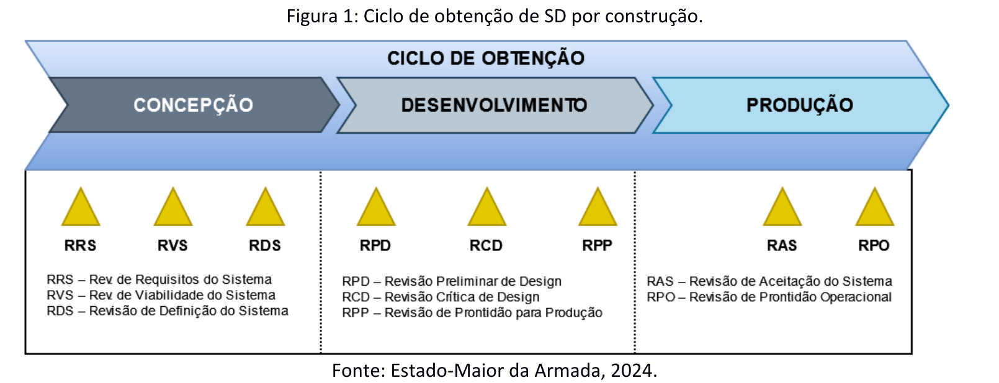

# Capítulo 1 - Obtenção de Sistemas de Defesa (SD)

## Página 7

### INTRODUÇÃO

### 1. PROPÓSITO 

Divulgar as Diretrizes para Gestão de Sistemas de Defesa (SD) e Embarcações de Apoio, em consonância com os preceitos da Gestão de Ciclo de Vida (GCV), desde o estágio de Concepção até o Desfazimento.

### 2. DESCRIÇÃO

Esta publicação está dividida em quatro capítulos e dez anexos e dois apêndices. O conteúdo visa atender às orientações de reestruturação da Marinha do Brasil (MB), observando o contido no Plano Estratégico da Marinha (PEM), na Estratégia de Defesa Marítima (EDM) e no Plano de Configuração da Força (PCF). Concomitantemente, a norma também foi elaborada em conformidade com o MD40-M-01 - Manual de Boas Práticas para a Gestão do Ciclo de Vida de Sistemas de Defesa (GCVSD) do Ministério da Defesa (MD), ressaltando-se que a abordagem apresentada adotou como premissa a utilização de conceitos aplicados na GCV.

Desta forma, o capítulo 1 estabelece o processo de obtenção de SD, destacando-se a importância das análises e estudos realizados na pré-concepção, em consonância com o PCF, e a elaboração e aprovação dos Requisitos e do Estudo de Exequibilidade (EE) no estágio de Concepção, observada a integração entre os SD propostos e os sistemas ligados ao Apoio Logístico Integrado (ALI). No capítulo 2, são estabelecidas diretrizes para alteração da configuração de SD, o que ocorre durante os estágios de Utilização e Apoio. Por sua vez, O capítulo 3 detalha a condução dos processos de extensão da vida útil e desincorporação de SD, definindo o trâmite e as responsabilidades nos diversos níveis de atuação.

Concluindo a publicação, o capítulo 4 estabelece diretrizes e procedimentos gerais para a dotação e a GCV das embarcações de apoio da MB, contemplando os procedimentos para a obtenção, manutenção, revitalização e desfazimento dessas embarcações.

### 3. PRINCIPAIS MODIFICAÇÕES

Esta publicação é a terceira revisão do EMA-420 - Normas para Logística de Material, que passa a ser denominada “Diretrizes para Gestão de Sistemas de Defesa e Embarcações de Apoio”.

O conteúdo dos capítulos 1, 2, 4 e 5 do EMA-420 (REV2) foi resumido e reorganizado em 4 novos capítulos, conforme exposto no artigo anterior.

O capítulo 3, que descrevia o processo de manutenção, passa a ser substituído pela Circular nº 3/2025, do EMA - Diretrizes Gerais para Governança e Gestão da Manutenção dos Meios Operativos da MB, que posteriormente será incorporada ao EMA-430.

O capítulo 6 (Compensações Comerciais, Industriais e Tecnológicas na MB), que definia a sistemática para a execução da Política de Compensação Comercial, Industrial e Tecnológica da MB (Offset), passou a ser abordado pela Portaria nº 280/2019, do EMA, atualizada em conformidade com a Política de Compensação Tecnológica Industrial e Comercial de Defesa (PComTICDefesa) de 2018, do MD.

O conteúdo do capítulo 7, que estabelecia normas para orientar, coordenar e controlar a atuação da MB em relação ao dinâmico tema que abordava a exportação de Materiais e Serviços de Emprego Militar-Naval, passará a ser abordado por Circular deste Estado-Maior que divulgará as diretrizes da MB sobre o assunto, seguindo os preceitos da Política Nacional de Exportação e Importação de Produtos de Defesa (PNEl-Prode) em vigor.

O capítulo 8, que estabelecia normas e procedimentos para a elaboração, aprovação e revisão de Planos Piloto (PP), será abordado pelo capítulo 4 do EMA-133 - Normas Para

## Página 11

### CAPÍTULO 1 OBTENÇÃO DE SISTEMAS DE DEFESA (SD)

### 1.1. PROPÓSITO

Estabelecer diretrizes para a obtenção de Sistemas de Defesa na MB.

### 1.2. DEFINIÇÕES

### 1.2.1. Sistema

É um conjunto integrado de elementos que cumprem um objetivo definido e exibem comportamentos não observados em suas partes individuais. Esses elementos podem ser produtos, processos, pessoas, informações, técnicas, infraestrutura, serviços e elementos de suporte.

### 1.2.2. Sistema de Defesa (SD)

Conjunto inter-relacionado ou interativo de elementos, que podem ser ou não considerados Produtos de Defesa (PRODE), que atenda a uma finalidade específica para atingir uma determinada capacidade militar.

### 1.2.3. Ciclo de Vida (CV) de um SD

A evolução de um SD desde a sua concepção até o seu desfazimento. O CV não se confunde com “vida útil”, compreendendo um período mais amplo que comporta os seguintes estágios: concepção, desenvolvimento, produção, utilização, apoio e desfazimento.

### 1.2.4. Estágio de Concepção

É o primeiro estágio do CV de um SD. A partir de informações provenientes da EMA310 - Estratégia de Defesa Marítima (EDM) e do EMA-306 - Plano de Configuração de Força (PCF), devem ser identificados os stakeholders e suas necessidades, que precisarão ser transformadas em requisitos. Deve-se ainda definir um espaço de possíveis soluções e desenvolver estudos e modelos que culminem com a elaboração de um Design Conceitual de uma solução viável. Também deverá ser definido o Modelo Global de Negócios, contendo: a proposta de Viabilidade Orçamentária, a rubrica da qual os recursos estarão alocados para o Projeto e onde será construído o SD.

## Página 12

### 1.2.5. Estágio de Desenvolvimento

É o segundo estágio do CV de um SD. Neste estágio é realizado o detalhamento do Design Conceitual do SD, até o momento em que ele esteja pronto para entrar em produção. A modalidade de obtenção influencia as atividades a serem desenvolvidas dentro deste estágio.

### 1.2.6. Estágio de Produção

É O terceiro estágio do CV de um SD. Somente utilizado em casos de SD por construção ou conversão. Trata-se do estágio onde será realizada a construção do SD, seguindo o Design Detalhado elaborado no estágio de desenvolvimento, e a posterior verificação da implementação dos requisitos estabelecidos para o SD. 

### 1.2.7. Estágio de Utilização

O propósito deste estágio é operar o SD nos ambientes operacionais planejados, buscando sua efetividade operacional continuada a um custo aceitável. O Estágio de Utilização inicia-se com a ativação do SD e marca o início da vida útil do sistema. É neste estágio que ocorrerão as fases “Execução”, “Apresentação de Resultados” e “Projeto de Exercícios Operativos” da Avaliação Operacional (AO).

### 1.2.8. Estágio de Apoio

O propósito deste estágio consiste em prover serviços de apoio que possibilitem, de maneira sustentável, manter a capacidade operativa proporcionada pelo sistema.

### 1.2.9. Ciclo de obtenção

É o período composto pelos estágios de concepção, desenvolvimento e produção do CV de um SD. Estes estágios podem ser abreviados, alongados ou modificados em função de diferentes modalidades de obtenção.

### 1.2.10. Efeito

Um efeito, ao ser atingido, produz ou alcança um resultado ou situação favorável em relação a um objetivo ou interesse em face de um desafio (ameaça ou oportunidade).

### 1.2.11. Condições

Condições são particularizações da situação na qual o efeito deve ser atingido. Dizem respeito ao ambiente operacional (por exemplo: condições meteorológicas, distâncias envolvidas) e às características do desafio (por exemplo: alcance de sensores e armamentos da ameaça, quantidade de meios, alianças, parcerias), entre outros aspectos não relacionados à MB. 

## Página 13

### 1.2.12. Capacidade

Define-se capacidade, em sentido amplo, como a habilidade de fazer algo. No contexto específico do PCF, a capacidade deve ser entendida como a aptidão de um conjunto de SD (Elemento de Força) que realizam um conjunto de tarefas (por exemplo, ações e operações de guerra naval) para atingir efeito(s) sob determinadas condições.

### 1.2.13. Requisitos de Estado-Maior (REM)

Documento que apresenta o conjunto de requisitos que traduzem as necessidades diretamente expressas pelo PCF e pela EDM. Os REM serão elaborados no âmbito da Sistemática de Planejamento de Força (SISFORÇA), constituindo um compilado de informações que norteará o processo de obtenção, contemplando orientações do Órgão de Direção-Geral (ODG) alinhadas com o processo de transformação da Força Naval e a visão estratégica prospectiva. Nos REM constará a Concepção do Elemento de Força, contendo a ideia de emprego do SD no ambiente operacional; a Tabela de Organização e Equipamentos (TOE); e a planilha de requisitos do SISFORÇA, que deverá ser redigida em conformidade com as normas em vigor do Setor do Material (DGEPMARINST 21-01), a fim de facilitar a rastreabilidade e padronização. O modelo para elaboração dos REM encontra-se no anexo A.

### 1.2.14. Requisitos de Obtenção de Sistema (ROS)

Documento que apresenta o conjunto de requisitos necessários para realizar a obtenção de um SD, traduzindo as necessidades técnicas, logísticas e industriais apresentadas pelas Organizações Militares (OM) (por exemplo: Diretoria Especializada do Setor do Material, Comando do Material de Fuzileiros Navais — CMatFN) cujas jurisdições se aplicam na obtenção do SD. Os ROS devem possuir rastreabilidade explícita com relação aos REM e demais produtos de trabalho do SISFORÇA. Os requisitos contidos nos ROS deverão ser redigidos em conformidade com as normas em vigor do Setor do Material (DGEPMARINST 21-01), a fim de facilitar a rastreabilidade e padronização. O modelo para elaboração dos ROS encontra-se no anexo B.

## Página 14

### 1.2.15. Setor do Material

A expressão “Setor do Material” utilizada nesta publicação engloba as OM subordinadas à Diretoria-Geral do Material da Marinha (DGMM|) e aquelas subordinadas ao Comando-Geral do Corpo de Fuzileiros Navais (CGCFN) com atribuições idênticas a estas, consoante as características do SD em pauta.

### 1.2.16. Setor Nuclear e Tecnológico

A expressão “Setor Nuclear e Tecnológico”, utilizada nesta publicação, engloba as OM subordinadas à Diretoria-Geral de Desenvolvimento Nuclear e Tecnológico da Marinha (DGDNTM) e aquelas subordinadas ao CGCFN com atribuições idênticas a estas, consoante as características do SD em pauta.

### 1.2.17. Setor Operativo

A expressão “Setor Operativo”, utilizada nesta publicação, engloba as OM subordinadas ao Comando de Operações Navais (ComOpNav) e aquelas subordinadas à Diretoria-Geral de Navegação (DGN) e ao CGCFN com atribuições idênticas a estas, consoante as características do SD em pauta.

### 1.2.18. Setor do Pessoal

A expressão “Setor do Pessoal”, utilizada nesta publicação, abrange a DiretoriaGeral do Pessoal da Marinha (DGPM) e as Organizações Militares subordinadas ou aquelas com atribuições idênticas subordinadas ao CGCFN, consoante às características do SD em pauta.

### 1.2.19. Setor Secretaria-Geral

A expressão “Setor Secretaria-Geral”, utilizada nesta publicação, engloba as Organizações Militares subordinadas à Secretaria-Geral da Marinha (SGM) responsáveis pelas atividades voltadas para a contribuição para o preparo e a aplicação do Poder Naval, afetas aos seguintes temas: Logística e Mobilização; Orçamento; Contabilidade; Economia e Finanças; Patrimônio Histórico, Cultural e Documentação; Habitação; Operações e Patrimônios Imobiliários; Administração Geral e Sistemas Digitais Administrativos.

## Página 15

### 1.2.20. Marco

Evento de aprovação da evolução das atividades internas a um estágio do CV de um SD. São eles:

a) Revisão de Requisitos do Sistema (RRS): Marco cujo propósito é consolidar os ROS, assegurando um entendimento comum entre as partes interessadas e a rastreabilidade dos ROS em relação aos REM, ao PCF e à EDM;

b) Revisão de Viabilidade do Sistema (RVS): Marco cujo propósito é assegurar a viabilidade técnica e financeira do SD a ser desenvolvido, mediante a análise do Relatório de Estudos de Exequibilidade (REE);

c) Revisão de Definição do Sistema (RDS): Marco cujo propósito é verificar a adequabilidade do design conceitual do SD, tendo como referência os ROS. No caso de obtenção por oportunidade, envolve a aceitação final da alternativa selecionada ou da proposta recebida;

d) Revisão de Preliminar de Design (RPD): Marco cujo propósito é verificar se o design preliminar é consistente e atende aos ROS dentro das restrições de cronograma e custo;

e) Revisão Crítica de Design (RCD): Marco cujo propósito é verificar se o design detalhado possui maturidade suficiente para ser produzido, atendendo às restrições de custo e cronograma;

f) Revisão de Prontidão para Produção (RPP): Marco cujo propósito é verificar se os recursos e agentes envolvidos estão disponíveis para o início da produção do SD;

g) Revisão de Aceitação do Sistema (RAS): Marco cujo propósito é verificar se os produtos finais do SD (incluindo subsistemas, equipamentos e elementos de apoio logístico) atingem o nível de maturidade esperado e estão em conformidade com os ROS. Ao final, é emitido o Termo de Recebimento Provisório (TERP); e

h) Revisão de Prontidão Operacional (RPO): Marco cujo propósito é verificar, através de testes, demonstrações, análises e auditorias que o sistema principal e seus sistemas de apoio estão prontos para operar com segurança no ambiente operacional pretendido.

## Página 16

### 1.2.21. Portal

Evento de aprovação da transição entre estágios do CV de um SD. Exemplo: Portal de transição entre os estágios de desenvolvimento e produção de um SD.

### 1.2.22. Estudos de Exequibilidade (EE)

Os EE deverão conter a análise dos REM e ROS. A análise dá-se por meio da compatibilização dos sistemas, verificação de parâmetros de desempenho, dos custos envolvidos e de exigências para o Apoio Logístico Integrado (ALI), gerando soluções possíveis para o produto e para os processos, avaliando a viabilidade do projeto de maneira estimada (inicial). Adicionalmente, são descritas as possíveis alternativas e os não atendimentos do projeto, selecionando aquelas que se mostrarem técnica, econômica e financeiramente viáveis, servindo como subsídio à tomada de decisão sobre a exequibilidade dos requisitos propostos.

### 1.2.23. Design Conceitual

Após a Revisão de Viabilidade do Sistema (RVS) e a aprovação dos Relatórios de Estudos de Exequibilidade (REE), deverá ser elaborado o Design Conceitual referente aos REM e ROS atualizados. As áreas com maiores riscos de inviabilidade devem ser analisadas mais detalhadamente de forma a permitir a concepção adequada do SD. A referida fase envolve atividades de preparação dos recursos humanos e materiais exigidos no projeto, avaliação dos equipamentos críticos, pré-dimensionamento dos sistemas principais, entre outros. Adicionalmente, a consistência do design é verificada por meio de comparação de conceitos, sendo propostas diferentes soluções para o desenvolvimento do Design Preliminar.

### 1.2.24. Design Preliminar

Após a formalização de um termo de compromisso ou contrato para o desenvolvimento do SD, a autoridade de design elaborará o Design Preliminar, a partir da melhor solução dentre as propostas da fase anterior e de possíveis alterações nos requisitos. Esta fase consiste na análise de possíveis novas necessidades do cliente e no processamento dos eventuais desvios do Estágio de Concepção. Nesta fase é desenvolvida a arquitetura dos sistemas do SD considerando todos os requisitos técnicos (funcionais, segurança, apoio logístico, operacionais, entre outros), a escolha entre componentes padronizados ou específicos, análise de custo, planejamento de integração dos subsistemas/equipamentos e, caso o SD seja um navio, design do arranjo geral e compartimentos principais, bem como o escantilhonamento da embarcação. 

## Página 17

### 1.2.25. Design Detalhado

Nesta fase, todos os equipamentos são considerados e os requisitos são implementados integralmente no design. É finalizado, dentre outros produtos, o cálculo estrutural do SD, gerando a documentação a ser encaminhada ao construtor e aos fornecedores. São elaborados os planos de verificação. Os protótipos/simuladores eventualmente necessários à validação funcional de sistemas críticos são especificados. O resultado do detalhamento é a configuração utilizada para a construção e testes do SD (características funcionais e físicas do produto a ser construído).

### 1.2.26. Modelo de negócios de um SD

Definição de todos os responsáveis (Autoridade de Projeto, Autoridade de design, Fornecedor Estaleiro/ Produtor) pela aquisição ou realização orgânica de produtos ou serviços afetos ao ciclo de vida de um SD. Para as aquisições, devem ser estabelecidas premissas como: aquisição no país ou no exterior; tipo de processo licitatório; tipo de modelo de negócio, formas de financiamento para a aquisição do SD, tempo previsto, custo estimado, riscos afetos ao ciclo de vida do SD, entre outros.

### 1.2.27. Conectores Navais

São quaisquer meios navais capazes de realizar o Movimento “Navio para Terra” (MNT), transportando adequadamente recursos humanos ou materiais dos navios para terra ou vice-versa.

### 1.2.28. Manutenção Preventiva

É o tipo de manutenção executada para reduzir ou evitar a falha ou queda do desempenho do material, sua degradação e, ainda, reduzir a possibilidade de avarias, por meio de intervenção periódica. Deve obedecer a um plano previamente elaborado, baseado nas informações técnicas dos SD envolvidos.

## Página 18

### 1.3. ABRANGÊNCIA

O conteúdo deste capítulo aplica-se à obtenção dos seguintes SD:

a) navios de superfície e conectores navais;

b) submarinos;

c) aeronaves;

d) carros de combate, viaturas anfíbias e terrestres blindadas e/ou armadas de Fuzileiros Navais (FN);

e) baterias de artilharia e sistemas de mísseis;

f) sistemas de sensores, comunicações e guerra eletrônica;

g) sistemas remotamente tripulados;

h) ativos satelitais; e

i) outros SD não previstos no PCF, propostos pelos ODS e aprovados pelo EMA.

### 1.4. DIRETRIZES GERAIS PARA A OBTENÇÃO DE UM SD

1.4.1. A obtenção de SD é orientada pelo PCF, em consonância com a EDM, observando o Plano Estratégico da Marinha (PEM) com base nas capacidades necessárias para enfrentar uma gama de desafios, resultando em opções de decisão para o Almirantado e determinação do Comandante da Marinha (CM), a fim de permitir a obtenção.

1.4.2. A obtenção dos elementos de suporte de um SD deve se dar por meio da execução do ALI, conforme estabelecido pela DGMM-0130 — Manual do Apoio Logístico Integrado.

1.4.3. O EE deverá contemplar os eventuais custos para obtenção de munições necessárias para os testes de aceitação do SD. Nestes casos, o ODS responsável pela obtenção do SD deverá providenciar as respectivas munições, de forma que ela esteja disponível antes da realização dos testes de aceitação.

1.4.4. As aquisições conjuntas, também devem estar de acordo com o dimensionamento e necessidades expostas no PCF.

1.4.5. A obtenção de um SD deve se destinar a preencher as lacunas de capacidades identificadas pela MB, sendo compatível com as prescrições estabelecidas na EDM e no PCF.

1.4.6. A obtenção de um SD poderá ocorrer por construção — sendo esta efetuada pela própria MB ou por terceiros contratados para tal — por oportunidade ou por conversão.

## Página 19

1.4.7. Devem ser utilizados marcos e portais ao longo do ciclo de obtenção, visando diminuir os riscos relacionados à qualidade, custo e cronograma, contribuindo para o adequado andamento do CV do SD e evitando o avanço descoordenado e/ou prematuro do programa de obtenção.

1.4.8. O Estado-Maior da Armada, bem como todas as OM envolvidas, deverão ser informados de toda evolução dos processos de obtenção, principalmente em relação aos marcos, portais e relatórios emitidos.

### 1.5. DIRETRIZES DETALHADAS PARA O CICLO DE OBTENÇÃO DE UM SD

O ciclo de obtenção de um SD deve ser adaptado em função da modalidade de obtenção adotada. Os fluxogramas referentes à obtenção por construção e por oportunidade encontram-se nos anexos C e D, respectivamente.

1.5.1. Ciclo de Obtenção de SD por Construção

a) o ciclo de obtenção de SD por construção é composto pelos estágios de concepção, desenvolvimento e produção, conforme ilustrado na Figura 1.

Figura 1: Ciclo de obtenção de SD por construção.

### b) Estágio de Concepção 

I) o estágio de concepção de um SD tem início com a elaboração do Conceito Operacional no âmbito do SISFORÇA;

II) ainda no escopo do SISFORÇA, devem ser elaborados os REM de cada SD contemplado no PCF. Para os casos de SD não contemplados no PCF, a OM interessada (ou responsável) pela obtenção (ou operação) do referido SD deverá solicitar orientações pontuais ao EMA, submetendo seus argumentos lastreados por justificativa plausível, análise de risco, estudo de viabilidade orçamentária e capacidades requeridas;

## Página 20

III) oportunamente, o EMA solicitará subsídios para os ODS e definirá quando e se a obtenção do SD será realizada mediante construção (que é o caso em tela), por oportunidade, ou conversão;

IV) o ODS responsável pela obtenção do SD, por determinação do EMA, deverá designar um Gerente do Projeto de Obtenção e os eventuais Gerentes Participantes;

V) o ODS responsável pela obtenção do SD, por determinação do EMA, deverá elaborar os ROS, com a participação das demais OM interessadas, incluindo representantes de outros ODS, caso seja necessário. Os ROS deverão ser rastreáveis em relação aos REM, ao PCF e à EDM.

VI) caso haja sistemas ou redes computacionais embarcadas no SD, os ROS deverão conter parecer técnico da Diretoria de Comunicações e Tecnologia da Marinha (DCTIM);

VII) os ROS devem ser aprovados pelo ODS responsável pela operação do SD, sendo esta uma condição necessária para a conclusão do marco RRS;

VIII) o ODS responsável pela obtenção deverá estabelecer um contrato (caso a contraparte seja uma organização externa à MB), ou formalizar um termo de compromisso (caso a contraparte seja uma OM) com um escritório de design (por exemplo, o Centro de Projeto de Sistemas Navais — CPSN), que deverá realizar os EE com base nos requisitos levantados;

IX) ao final dos EE, deverá ser produzido o REE descrevendo as conclusões obtidas, sugerindo possíveis alterações nos ROS e apresentando uma estimativa inicial do Custo do Ciclo de Vida (CCV) do SD, que deverá ser submetido ao EMA para aprovação após análise do ODS responsável pela obtenção. Esta aprovação é condição para a conclusão do marco RVS;

X) após a RVS, o ODS responsável pela obtenção deverá atualizar os ROS, contendo as alterações dos requisitos provenientes dos EE;

XI) o escritório de design deverá elaborar o Design Conceitual do SD;

XII) no caso de obtenção de SD de propriedade intelectual de terceiros, os requisitos que compõem os REM e os ROS farão parte de documentos como Requisição de Informação (Request for Information — RFI), Requisição de Cotação (Request for Quotation — RFQ), Requisição de Proposta (Request for Proposal — RFP) e Especificação de Aquisição (EA), onde o Design Conceitual será de responsabilidade do terceiro. No caso de obtenção de um sistema a ser desenvolvido pela própria MB, os REM, os ROS e o Design Conceitual orientarão os estudos do Design Preliminar durante o estágio de desenvolvimento do SD;

## Página 21

XIII) o Design Conceitual deverá ser submetido ao ODS responsável pela operação do SD para aprovação após análise do ODS responsável pela obtenção do SD. Esta aprovação é condição para a conclusão do marco RDS;

XIV) após a RDS, o ODS responsável pela obtenção produzirá o Relatório de Fim de Estágio (RFE) de Concepção, o qual será submetido à aprovação do EMA, via ODS responsável pela operação do sistema. Com base no RFE de Concepção, o CM decidirá pelo prosseguimento ou não do processo de obtenção;

XV) junto à aprovação do RFE de Concepção, o EMA deverá definir o modelo de negócios para os demais estágios do ciclo de obtenção; e

XVI) a Força dimensionada pelo PCF já possui seus REM estabelecidos, porém difusos em entregas parciais do SISFORÇA. Nesse caso, o EMA deverá ser instado pelos ODS interessados na obtenção de um SD a fazer a juntada dos referidos documentos e a elaboração formal dos REM. Assim, os ODS deverão encaminhar ao EMA mensagem solicitando os REM de interesse, quando for necessário.

### c) Estágio de Desenvolvimento

I) no início do estágio de desenvolvimento, o ODS responsável pela obtenção do SD deverá formalizar um contrato (caso a contraparte seja uma organização externa à MB), ou um termo de compromisso (caso a contraparte seja uma OM) com uma autoridade de design, que pode ou não ser também a responsável pela construção do SD;

II) o ODS responsável pela obtenção do SD deverá formalizar um contrato (caso a contraparte seja uma organização externa à MB), ou um termo de compromisso (caso a contraparte seja uma OM) com um escritório de design para a confecção do Design Conceitual, Preliminar e Detalhado.

III) a autoridade de design será responsável por:

- aprovar escolhas do design;

## Página 22

- garantir que a solução está em conformidade com as normas técnicas e pelo atendimento dos requisitos operacionais;
- autorizar as passagens de marcos no estágio de desenvolvimento;
- confirmar que as fases do processo estão completas;
- presidir revisões técnicas de design;
- conduzir reuniões de análise de risco;
- apresentar relatórios, conforme necessário, sobre o andamento dos trabalhos;
- garantir que o design seja adequado para produção em instalações acordadas; e
- validar o projeto do SD.

IV) o escritório de design será responsável por:
- atender as exigências da Sociedade Classificadora, caso haja;
- elaborar ou modificar o Design Conceitual, Preliminar ou Detalhado do SD, respeitando suas fases, garantindo sua aderência aos ROS e aos REM;
- elaborar, atualizar e custodiar especificações, desenhos e demais dados associados ao design do SD;
- fornecer ou atualizar a estimativa de custo de CCV para os Designs Conceitual, Preliminar ou Detalhado do SD;
- preparar e/ou fornecer a documentação técnica necessária, incluindo a relacionada com a manutenção do sistema; e
- planejar a verificação dos REM e dos ROS.

V) o CASNAV deverá planejar a Avaliação Operacional do SD;

VI) caso o Design Preliminar indique a necessidade de alterações nos ROS ou nos REM, o ODS responsável pela obtenção deverá providenciar a execução de novos EE e a elaboração de um REE sucinto, contendo as alterações de configuração decorrentes, submetendo-o para apreciação do EMA;

VII) a aprovação do Design Preliminar por parte dos ODS responsáveis pela obtenção e pela operação do SD é condição para a conclusão do marco de Revisão Preliminar de Design (RPD);

## Página 23

VIII) após o RPD, o ODS responsável pela obtenção do SD deverá realizar a seleção dos fornecedores e do responsável pela construção do SD;

IX) o ODS responsável pela obtenção do SD deverá elaborar o contrato (caso a contraparte seja uma organização externa à MB) ou termo de compromisso (caso a contraparte seja uma OM) junto ao responsável pela construção do SD com os subsídios do escritório de design e dos fornecedores;

X) após a formalização do contrato ou termo de compromisso para fornecimento/ construção, o escritório de design, com os subsídios do responsável pela construção do SD, dos fornecedores selecionados, e do ODS responsável pela obtenção do SD, deverá elaborar o Design Detalhado do sistema;

XI) caso o Design Detalhado indique a necessidade de alterações nos ROS ou nos REM, o ODS responsável pela obtenção deverá providenciar a execução de novos EE e a elaboração um REE sucinto, contendo as alterações de configuração decorrentes, submetendo-o para apreciação do EMA;

XII) as aprovações do Design Detalhado por parte dos ODS responsáveis pela obtenção e pela operação são condições necessárias para a conclusão do marco RCD;

XIII) após a RCD, o ODS responsável pela obtenção do SD deverá realizar o planejamento da produção do SD;

XIV) a consistência e abrangência de objetivos, escopo, métodos, procedimentos e disponibilidade de recursos financeiros, materiais e de pessoal necessários para a produção do SD é condição para a conclusão do marco de Revisão de Prontidão para Produção (RPP);

XV) a depender da complexidade do sistema, é normal e aceitável que parte das atividades de construção se iniciem antes do término das atividades de desenvolvimento, desde que tomadas as devidas precauções que mitiguem o risco de alterações de design durante a construção; e

XVI) após a RPP, o ODS responsável pela obtenção produzirá o RFE de Desenvolvimento, o qual será submetido à aprovação do ODS responsável pela operação do sistema e pelo EMA. Com base no RFE de Desenvolvimento, o CM decidirá pelo prosseguimento ou não do processo de obtenção.

## Página 24

### d) Estágio de Produção

I) o responsável pela construção do SD deve implementar e integrar os elementos do SD, viabilizando as respectivas verificações por parte do cliente. A implementação trata da criação ou fabricação de elementos do sistema. Já a integração visa estabelecer a correta conexão entre os vários elementos do sistema, evitando incompatibilidades ou corrigindo possíveis interferências não previstas pelo Design Detalhado, de acordo com critérios de aceitação, procedimentos de montagem e controles de interfaces;

II) o ODS responsável pela obtenção do SD deverá fiscalizar o cumprimento do contrato ou termo de compromisso para fornecimento/construção do SD, emitindo relatórios de acompanhamento do projeto, de acordo com os marcos estabelecidos para obtenção do SD, baseados em índices quantitativos e qualitativos do andamento do projeto de obtenção;

III) o ODS responsável pela obtenção deverá gerenciar as atividades de verificação do atendimento dos ROS e REM do SD em construção. Estas atividades são realizadas por meio de análises das diversas entregas que farão parte do escopo do contrato ou termo de compromisso, incluindo as eventuais etapas de teste (por exemplo, Teste de Aceitação em Fábrica, Teste de Aceitação no Mar) do SD, seus subsistemas e elementos;

IV) o ODS responsável pela obtenção deverá avaliar a necessidade de contar com o apoio da autoridade de design para o acompanhamento das atividades de verificação e para a atualização do Design Detalhado para sua versão definitiva (as-built);

V) o ODS responsável pela obtenção deverá efetuar as gestões necessárias para que os elementos de ALI adquiridos em conjunto com o SD (exemplos: documentação técnica, sobressalentes, treinamentos, ferramentas especiais e equipamentos de apoio e teste) estejam disponíveis antes que o SD entre no seu estágio de utilização pela MB, permitindo a catalogação dos itens e a determinação da Dotação de Base e Bordo;

VI) após a conclusão das atividades de verificação e prontificação dos elementos de ALI adquiridos em conjunto com o SD, o ODS responsável pela obtenção deverá elaborar o TERP, o qual será submetido à aprovação do ODS responsável pela operação do sistema e do EMA. A aprovação do TERP é condição necessária para a conclusão do marco RAS;

## Página 25

OSTENSIVO EMA-420

VII) o CASNAVY, com subsídios do ODS responsável pela operação do SD, deverá iniciar a preparação para a fase de execução da Avaliação Operacional do SD;

VIII) o ODS responsável pela obtenção deverá fiscalizar o saneamento das eventuais pendências constatadas durante o período definido em contrato entre o TERP eo Termo de Recebimento Definitivo (TERD);

IX) ao final do período definido em contrato, o ODS responsável pela obtenção deverá elaborar o TERD, que será submetido à aprovação do ODS responsável pela operação do sistema e do EMA. A aprovação do TERD é condição necessária para a conclusão do marco RPO;

X) após a RPO, o ODS responsável pela obtenção deverá elaborar o RFE de Produção, que será submetido à aprovação do ODS responsável pela operação do sistema e do EMA. Com base no RFE de Produção, o CM decidirá pela aceitação ou não do SD; e

XI) apenas as fases “Definição do Problema” e “Planejamento” da Avaliação Operacional, previstas no EMA-333, ocorrem durante o ciclo de obtenção. Apesar de as fases de “Execução”, “Apresentação de Resultados” e “Projeto de Exercícios Operativos” ocorrerem no estágio de utilização do SD, os custos de execução de toda a AO devem ser considerados no planejamento orçamentário realizado no ciclo de obtenção.

1.5.2. Ciclo de Obtenção de SD por Oportunidade

a) a obtenção por oportunidade visa alcançar uma solução imediata para uma necessidade já identificada. O ciclo de obtenção de SD por oportunidade é composto por um estágio de concepção e um estágio de transferência, conforme ilustrado na Figura 2.

Figura 2: Ciclo de obtenção de SD por oportunidade.

## Página 26

b) a obtenção por oportunidade deverá ocorrer de acordo com as subalíneas I, II e III da alínea b do inciso 1.5.1. 

c) Estágio de Concepção 

I) a obtenção por oportunidade pode ser realizada de duas formas:
- por iniciativa externa à MB; ou 
- por iniciativa da MB. 

II) em caso de obtenção por iniciativa externa à MB:
- as propostas deverão ser remetidas ao EMA, devendo agregar os dados conhecidos sobre o SD ofertado, a entidade ofertante e as condições da oferta;
- por determinação do EMA, um ODS será responsabilizado pela obtenção do SD e deverá realizar uma análise de adequabilidade do SD proposto em relação à EDM e ao PCF, verificando a sua aderência aos REM de um SD semelhante ao previsto no PCF;
- caso haja sistemas ou redes computacionais embarcadas no SD, a DCTIM deverá emitir um parecer técnico, o qual apoiará a análise de adequabilidade;
- ao final da análise, o ODS responsável pela obtenção do SD deverá produzir um RFE de Concepção descrevendo as conclusões obtidas. O relatório deverá ser submetido ao EMA para aprovação, via ODS responsável pela operação do SD. Esta aprovação é condição para a conclusão do marco RDS; e
- com base no RFE de Concepção, o CM decidirá pelo prosseguimento ou não do processo de obtenção.

III) em caso de obtenção por iniciativa da MB:
- a busca de oportunidades de mercado poderá ser realizada tanto pelos ODS quanto pelo próprio EMA, de forma que as oportunidades encontradas deverão estar compatíveis com os tipos de SD preconizados pelo PCF. Caso a busca não tenha sido realizada pelo EMA, esta deverá ser submetida ao ODG;
- o ODS responsável pela obtenção do SD, por determinação do EMA, deverá elaborar os ROS, com a participação das demais OM interessadas, incluindo representantes de outros ODS, caso seja necessário. Os ROS deverão ser rastreáveis em relação aos REM, ao PCF e a EDM;
- caso haja sistemas ou redes computacionais embarcadas no SD, os ROS deverão conter parecer técnico da DCTIM;

## Página 27

- os ROS devem ser aprovados pelo ODS responsável pela operação do SD, sendo condição necessária para conclusão do marco RRS;
- após a RRS, o EMA solicitará ao CASNAV a realização de uma análise de alternativas para apoio ao processo decisório em relação às oportunidades vislumbradas para aquisição que possuem aderência com o PCF e a EDM, utilizando os REM e demais documentos estratégicos como referência para a análise;
- o ODS responsável pela obtenção deverá subsidiar o CASNAV para a realização da análise naquilo que se fizer necessário;
- ao final da análise, o CASNAV deverá produzir o RFE de Concepção descrevendo as conclusões obtidas, elencando as melhores alternativas do conjunto avaliado. O relatório deverá ser submetido ao EMA para aprovação, via ODS responsável pela operação do SD. Esta aprovação é condição para a conclusão do marco RDS; e
- com base no RFE de Concepção, o CM decidirá pelo prosseguimento ou não do processo de obtenção de uma das alternativas estudadas.

d) Estágio de Transferência

I) o ODS responsável pela obtenção deverá constituir um grupo de inspeção composto por representantes do ODS responsável pela obtenção e do ODS responsável pela operação, com o objetivo de verificar as condições do SD e averiguar o atendimento aos REM naquilo que não tiver sido avaliado a priori em razão de algum óbice (exemplo: informações que só podem ser obtidas in loco);

II) as informações obtidas pelo grupo de inspeção deverão ser consolidadas em um Relatório de Obtenção por Oportunidade que deverá abordar:
- condições estruturais;
- estado de obsolescência de equipamentos;
- histórico de disponibilidade operacional do SD;
- eventuais dificuldades para obtenção de munições, sobressalentes e ferramentas especiais;
- disponibilidade de documentação técnica do SD (exemplos: manuais de operação, manuais de manutenção, set-to-work, acordos de interface etc.);

## Página 28

- necessidade de ajustes na infraestrutura da MB para prestar o apoio à manutenção do SD;
- estimativa de CCV para o SD;
- estimativa de vida útil remanescente;
- possibilidades de modernização ou conversão;
- atendimento aos REM;
- aderência ao PCF, EDM, entre outros documentos estratégicos;
- análise de riscos;
- estado funcional dos sistemas e subsistemas do SD;
- histórico de reparos e manutenções do SD;
- histórico de avarias do SD;
- disponibilidade de sobressalentes para o SD; e
- lista de equipamentos que deverão ser retirados devido a acordo com outras Marinhas.

III) o Relatório de Obtenção por Oportunidade deverá ser encaminhado ao EMA, via ODS responsáveis pela obtenção e pela operação, que emitirá um parecer conclusivo e o submeterá ao CM, que decidirá pela obtenção ou não do SD;

IV) caso a obtenção seja aprovada pelo CM, o ODS responsável pela obtenção do SD, por determinação do EMA, deverá designar um Gerente do Projeto de Obtenção e os eventuais Gerentes Participantes;

V) o ODS responsável pela obtenção deverá formalizar o contrato para obtenção do SD;

VI) após a formalização do contrato, o Setor do Pessoal deverá elaborar o Plano de Preparo do Pessoal, que consolidará as diretrizes para atender às necessidades inerentes à função logística de Recursos Humanos. Essas necessidades englobam desde a estruturação dos Grupos de Recebimento até a qualificação do pessoal destinado à operação e manutenção do meio;

VII) após a formalização do contrato, o Setor do Pessoal designará um Grupo de Recebimento (GR) que, apoiado por pessoal técnico especializado, será responsável por realizar atividades de fiscalização durante a transferência do SD para a MB e elaborará um Relatório do Grupo de Recebimento, contendo informações sobre as atividades realizadas e os resultados obtidos. Este relatório deverá ser submetido ao EMA para aprovação após análise do ODS responsável pela obtenção;

## Página 29

VIII) o ODS responsável pela obtenção deverá efetuar as gestões necessárias para que os elementos de ALI adquiridos em conjunto com o SD (exemplos: documentação técnica, sobressalentes, treinamento, ferramentas especiais e equipamentos de apoio e teste) estejam disponíveis antes que o SD entre no seu estágio de utilização pela MB;

IX) após a prontificação dos elementos de ALI adquiridos em conjunto com o SD, o ODS responsável pela obtenção deverá elaborar o TERP, o qual será submetido à aprovação do ODS responsável pela operação do sistema e do EMA. A aprovação do TERP é condição necessária para a conclusão do marco de RAS;

X) o CASNAV, com subsídios do ODS responsável pela operação do SD, deverá iniciar a preparação para a fase de execução da Avaliação Operacional do SD;

XI) o ODS responsável pela obtenção deverá fiscalizar o saneamento das eventuais pendências constatadas durante o período definido em contrato entre o TERP eo TERD;

XII) ao final do período definido em contrato, o ODS responsável pela obtenção deverá elaborar o TERD, que será submetido à aprovação do ODS responsável pela operação do sistema e do EMA. A aprovação do TERD é condição necessária para a conclusão do marco RPO;

XIII) após a RPO, o ODS responsável pela obtenção deverá elaborar o RFE de Transferência, que será submetido à aprovação do ODS responsável pela operação do sistema e do EMA. Com base no RFE de Transferência, o CM decidirá pela aceitação ou não do SD; e

XIV) apenas as fases “Definição do Problema” e “Planejamento” da Avaliação Operacional, previstas no EMA-333, ocorrem durante o ciclo de obtenção. Apesar de as fases de “Execução”, “Apresentação de Resultados” e “Projeto de Exercícios Operativos” ocorrerem no estágio de utilização do SD, os custos de execução de toda AO devem ser considerados no planejamento orçamentário realizado no ciclo de obtenção.

## Página 30

1.5.3. Ciclo de Obtenção de SD por Aquisição por Conversão

a) esta modalidade de obtenção ocorre mediante a aquisição de um SD com características diversas aquelas desejadas pela MB, que será objeto de alterações que o tornem apto a ser utilizado para os fins militares pretendidos;

b) o ciclo de obtenção de SD por conversão é composto pelos estágios de concepção, transferência e alteração de configuração, conforme ilustrado na Figura 3;

Figura 3: Ciclo de obtenção de SD por conversão.

c) as atividades e os produtos de trabalho referentes aos estágios de concepção e transferência são os mesmos daqueles referentes à obtenção de SD por oportunidade, devendo ser adotado o preconizado nas alíneas ce d do inciso 1.5.2; e

d) as atividades e os produtos de trabalho referentes à alteração de configuração do SD estão dispostos no capítulo 2, que estabelece normas de caráter geral relativas às alterações de configuração de SD.

### 1.6. CONSIDERAÇÕES FINAIS

### 1.6.1. Sumário

Como instrumento de supervisão, os ODS deverão enviar ao EMA, até o último dia útil dos meses de fevereiro, junho e outubro, os respectivos Sumários abrangendo os SD em obtenção, modernização, processo de extensão da vida útil e desfazimento, conforme modelo do anexo E.

## Página 31

### 1.6.2. Normas Complementares

Os ODS poderão emitir normas em complemento aos processos aqui descritos. 1.6.3. Sistemas Remotamente Tripulados

**a) Veículos de Superfície e Submarinos Remotamente Tripulados**

Futuras aquisições deverão ser consideradas como Obtenção de SD e, consequentemente, observar todas as diretrizes previstas nesta Publicação.

**b) Sistema de Aeronaves Remotamente Pilotadas (SARP)**

Atualmente, observa-se um significativo aumento da utilização de Aeronaves Remotamente Pilotadas (ARP) nas diversas tarefas relacionadas com atividades da MB, demandando assim, um aprimoramento nas normatizações hoje disponíveis na MB. Neste sentido, o Ministério da Defesa (MD), propõe a classificação das ARP em Categorias (CAT) desde a CAT O até a CAT 5, conforme apresentado no anexo F.

Portanto, no que se refere aos processos de obtenção, modernização e de manutenção, as ARP CAT 2 ou superior, bem como as ARP CAT 0 e 1 que sejam operadas por Esquadrão de Aeronaves Remotamente Pilotadas ou possuam designativo de aeronave, deverão ser consideradas SD, observando todas as diretrizes previstas nesta Publicação.
