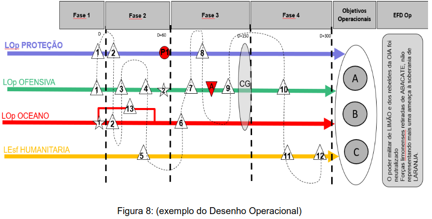
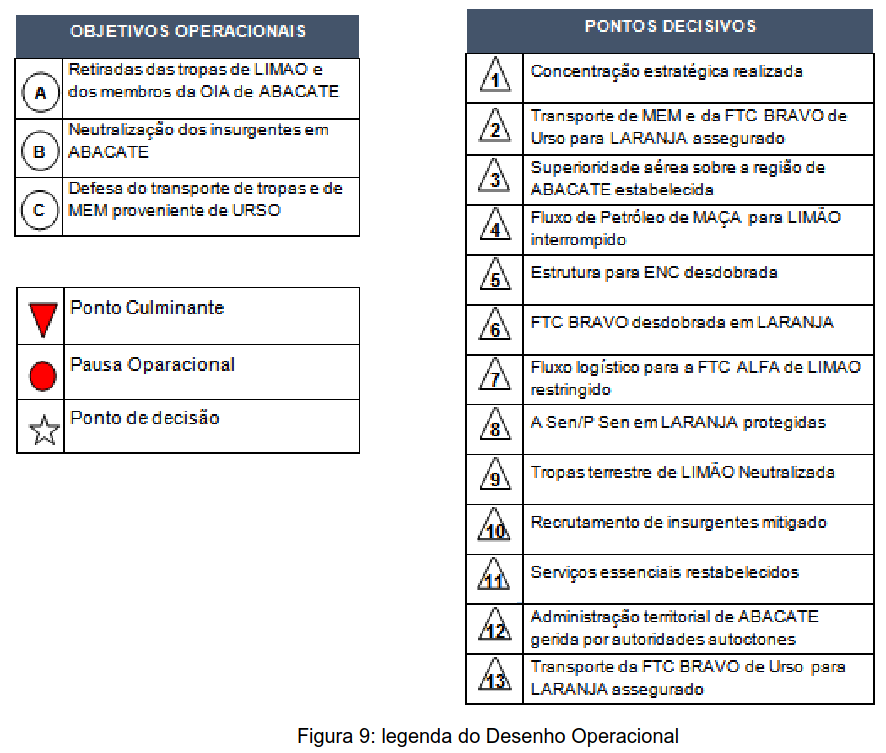

# Anexo D - A ARTE OPERACIONAL

NOTAS E MODELOS DE ROTEIROS DE ANÁLISE RELATIVOS AO PROCESSO DE PLANEJAMENTO CONJUNTO

1. CONSIDERAÇÕES INICIAIS

1.1 A arte operacional consiste na concepção e no planejamento contínuo e sistêmico de operações e campanhas militares sincronizadas que produzirão efeitos essenciais para a consecução dos objetivos operacionais, gerando, assim, as condições que favoreçam a consecução do EFD Op.

1.2 Na aplicação da Arte Operacional, o Cmt TO e seu EMCj utilizam ferramentas intelectuais que ajudam a comunicar uma visão comum do ambiente operacional, a formular seu problema, além de visualizar e descrever uma abordagem operacional.

1.3 A arte em foco está relacionada ao entendimento do ambiente e do problema operacional, ao longo da 1ª fase do Exame de Situação. Já na 2ª fase, desenvolve-se por meio de uma abordagem, a ser utilizada em fases subsequentes do planejamento.

1.4 A arte operacional, baseada em premissas estratégicas, permite ao comandante a concepção, projeção e execução de uma operação ou campanha. Essa visão permite também que as metas genéricas, e muitas vezes abstratas de nível estratégico, se traduzam em ações no nível operacional e em tarefas sincronizadas que são executadas
pelo nível tático.

1.5 A abordagem operacional permite ao Comandante fazer um enquadramento do problema a ser resolvido, de acordo com sua visão, buscando, por meio de ações e efeitos moldar o ambiente a seu favor. Para auxiliar o seu entendimento, eminentemente conceitual, o comandante no nível operacional e seu Estado-Maior, utilizam uma ferramenta gráfica denominada Desenho Operacional.

1.6 Nesse escopo, o desenho Operacional apresenta-se como um dos produtos da Abordagem Operacional, uma ferramenta fundamental para articular a abstrata arte operacional em uma abordagem concreta ante um determinado problema. É a
representação gráfica mais comum e, em sua essência, a materialização da Abordagem Operacional.

1.7 No Desenho Operacional estão caracterizados diversos elementos que facilitam o entendimento do que será realizado. Estes elementos servem como uma forma gráfica, que permite ao Comandante e seu Estado-Maior o entendimento da abordagem mais adequada para a resolução do problema militar elencado em fase anterior e sintetiza a visão do Comandante sobre o que deve ser feito para se atingir o EFD Op.

1.8 O Cmt, auxiliado pelo grupo de planejadores que executa o planejamento conceitual (parte do EM escolhido pelo Cmt), pode valer-se de diversos elementos da Arte Operacional para auxiliar na construção do desenho operacional. Ao transformá-lo graficamente, pode-se utilizar diversas ferramentas da tecnologia da informação e/ou design gráfico.

### 2. FATORES CONDICIONANTES DA ARTE OPERACIONAL

2.1 A arte da guerra, em todos os níveis de decisão consiste em obter e manter a liberdade de ação e impor a sua vontade ao inimigo. Nos níveis estratégico e operacional, a liberdade de ação é conseguida, principalmente, pelo equilíbrio apropriado dos fatores de ESPAÇO, TEMPO, FORÇA e suas combinações.

2.2. Um perfeito conhecimento dos meios disponíveis, que será condicionante para dimensionarmos a força a ser empregada e sua relação no tempo e no espaço, é a chave na determinação dos objetivos operacionais. Assim, diferente do tempo perdido, que nunca pode ser recuperado, o espaço cedido pode ser reconquistado e os efetivos podem ser recompletados.

2.3. Nas guerras modernas a capacidade de concentração de forças, fruto de sua mobilidade, no local (espaço) e momento (tempo) oportunos é fundamental para o sucesso do planejamento e execução de uma campanha.

2.4. Enfim, a chave para a aplicação da Arte Operacional reside na capacidade de visualizar o emprego de forças e os seus efeitos no tempo e no espaço. Isto é fundamental para avaliar as várias possibilidades, antecipar os prováveis resultados e as suas implicações.

2.5. Fator Espaço
2.5.1. Toda área de responsabilidade de um Comando Operacional contém um grande número de características naturais e artificiais que afetam significativamente o planejamento e a execução das operações.

2.5.2. Os principais elementos que constituem o fator espaço são: posição geoestratégica, distância, eixos prioritários de transporte (Linhas de Comunicações e Suprimento), localização das forças e características físicas do ambiente. Esses elementos podem dispor de um significado tático, operacional ou estratégico.

2.5.3. O significado do fator ESPAÇO não deve ser considerado sozinho em um panejamento, pois seu efeito global depende dos dois outros fatores operacionais de TEMPO e FORÇA.

| **Fator ESPAÇO** | **Aspectos previstos no PPC** |
|---|---|
| **Posição Geoestratégica / Localização das forças** | Pontos de importância operacional (bases navais, aéreas e de apoio logístico, instalações de C2), instalações operacionais e defesas fixas. Pode influir em características fixas da Área de Operações: políticas, econômicas, psicossociais e científico-tecnológicas. |
| **Distância** *(Relacionada com o fator Tempo)* | Terá implicações na análise do Fator Tempo-Distância (FTD), que representa o estudo dinâmico da situação. |
| **Eixos Prioritários de Transporte** | Portos, aeroportos, rodovias, hidrovias, ferrovias, etc. |
| **Características Físicas** | Topografia e meteorologia, períodos diurnos e noturnos. |

*Tabela 12: fator espaço*

2.6 Fator Tempo

2.6.1. No nível operacional, o TEMPO é um dos principais fatores levado em
consideração na concepção e condução das operações de guerra. Este fator está
intimamente relacionado com o fator espaço. Existe a necessidade de tempo para vencer
o espaço. Comparando com o fator TEMPO, que é dinâmico e variável, o fator espaço é
estático e invariável. O tempo perdido nunca pode ser recuperado, enquanto que o
espaço perdido pode ser reconquistado.
2.6.2. O Cmt, em função do tempo disponível, deve determinar a melhor organização das
forças para realizar as tarefas/missões atribuídas. Essa organização, muitas vezes, será
uma combinação de ações simultâneas e/ou contínuas, para atingir, em melhores
condições, o EFD, otimizando os recursos humanos e materiais disponíveis.
2.6.3 O Fator TEMPO pode se referir ao ritmo da operação em relação ao ritmo do
adversário. Assim, diz-se que uma operação tem um ritmo alto, quando o ritmo da
operação é maior que o do adversário. O ritmo, mais do que uma indicação de mobilidade
ou rapidez de movimento da força, é um índice da velocidade na qual as diferentes ações
que compõem a operação são executadas. Assim, uma operação possui alto ritmo
quando as diferentes ações que a integram são desenvolvidas com grande rapidez e alto
grau de sincronização.
2.6.4 Quando um ritmo próprio executado excede a capacidade de reação do oponente,
as próprias forças podem manter a iniciativa e obter uma vantagem marcante, gerando
com isso uma liberdade de ação adequada.
2.6.5 Controlar e / ou alterar esse ritmo é necessário para manter a iniciativa. Para
maximizar as próprias capacidades, é necessário ajustar o rítmo da operação. Um ritmo
adequado:

a) permite manter a iniciativa;
b) impede que o oponente se reorganize e, com. isso, se atinja seu Centro de
Gravidade ou Ponto Culminante mais rapidamente; e
c) não compromete nossa capacidade de tomada de decisão e/ou apoio ao
combate.

2.6.6 Com isso, é possível aplicar uma pressão constante, com uma quantidade rítmica
de ações militares, semelhantes a uma frequência cardíaca variável.
2.6.7 O resultado que se busca com operações de ritmo elevado é conseguir a paralisia
estratégica do adversário, quebrando o seu ciclo de "Observação, Orientação, Decisão,
Ação", conhecido como ciclo "OODA". Uma operação pode ser desenvolvida em um ritmo
muito alto e, no entanto, ter um tempo muito restrito, o que provocará uma quebra do ciclo
decisório do inimigo e reduzirá sua capacidade de reação.

2.7 Fator Força
2.7.1 O fator FORÇA não consiste somente dos aspectos militares como forças navais,
terrestres ou aéreas, mas também de todos os apoios e os aspectos civis, sendo tudo sob
a responsabilidade do Comandante Operacional.

2.7.2 O termo “meios”, mais amplo, é usado algumas vezes na terminologia político-
estratégico, para denotar não somente as Forças Armadas, mas também os recursos
políticos, diplomáticos e econômicos de todo o Estado.
2.7.3 Ele é muito difícil de ser quantificado, pois depende de fatores tangíveis e
intangíveis, especialmente nos níveis políticos, estratégico e operacional da condução da
guerra.
2.7.4 Quanto maior a superioridade deste fator em relação a um adversário, maior
liberdade de ação se disporá para a condução da política, da estratégia e
consequentemente para a determinação dos objetivos estratégicos, operacionais e
táticos.
2.7.5 Como elementos tangíveis das forças, entre outros, são considerados:
a) tipo/composição/combinação;
b) interoperabilidade;
c) mobilidade;
d) flexibilidade; e
e) apoio logístico e demais apoios.

2.7.6 Como elementos intangíveis das forças, entre outros, são considerados:
a) grau de liderança dos Comandantes;
b) apoio da opinião pública;
c) vontade de lutar;
d) coesão da aliança; e
e) moral e disciplina.

| **TANGÍVEIS** | **Onde é analisado no PPC** |
|---|---|
| **Interoperabilidade** | a) Nossas forças; b) Forças amigas; e c) Fatores gerais científico-tecnológicos.  **Aspectos relevantes (nossos e do inimigo):** - sistemas de C2; - doutrina comum; - procedimentos comuns para coordenação (apoio de fogos, manobras terrestres, navais e aéreas, etc.); e - regras de engajamento. |
| **Mobilidade estratégica e operacional** | Análise do Fator de Tempo e Distância (FTD). |
| **Apoio Logístico** | a) Características da Área de Operações (fatores gerais e fixos); e b) Forças próprias e forças amigas.  **Aspectos relevantes (nossos e do inimigo):** - análise das capacidades de cada função logística, a fim de estabelecer necessidades, verificar disponibilidades e identificar limitações. |

*Tabela 13: Fator Força – elementos tangíveis*

| **INTANGÍVEIS** | **Onde é analisado no PPC** |
|---|---|
| **Qualidade da Liderança** | a) Análise da Missão e Considerações Preliminares – análise da própria missão, aspectos políticos, aspectos psicossociais e inimigo; b) A Situação e sua Compreensão – características da Área de Operações (fatores gerais políticos, fatores gerais psicossociais); c) Forças Inimigas – peculiaridades e deficiências; e d) Nossas Forças – composição. |
| **Opinião Pública** | a) Fatores gerais – aspectos psicossociais; e b) Deve ser considerada na elaboração do Conceito da Operação (Exame da Situação – formulação da LA e na EPO) e na formulação das Regras de Engajamento, que deve ser iniciada no Exame da Situação. |
| **Vontade de Lutar** | Fatores gerais – aspectos psicossociais. |
| **Coesão da Aliança** | Fatores gerais – aspectos psicossociais. |
| **Moral e Disciplina** | Fatores gerais – aspectos políticos. |

*Tabela 53: Fator Força – elementos intangíveis*

2.8 Os Fatores Tempo e Espaço na Dimensão Informacional

2.8.1 Os fatores tempo e espaço não são restritivos na perspectiva lógica da dimensão informacional, que inclui o espaço cibernético. Essa perspectiva lógica refere-se onde e como as informações são obtidas, produzidas, armazenadas, protegidas e difundidas. É onde o C2 das forças militares é exercido e por meio da qual a intenção do comandante é transmitida. As ações nesta perspectiva afetam o conteúdo e o fluxo de informações.

2.8.2 A capacidade cibernética tem a possibilidade de realizar ações que produzem efeitos em tempo real, empregando dispositivos computacionais mundialmente conectados, onde as informações digitais são transmitidas, processadas e armazenadas.

2.8.3 Quanto ao fator espaço, a exploração e o ataque cibernéticos dificultam a atribuição e identificação da origem das ações, que podem contar com ativos de informação localizados dentro ou completamente dissociados do TO/ A Op.

2.8.4 O EM Cj deve, em seus planejamentos, considerar a possibilidade de realizar ações na perspectiva lógica com efeitos diretos e imediatos na dimensão física, sem as tradicionais limitações impostas pelo tempo e pelo espaço, no uso de meios convencionais.

### 3. O DESENHO OPERACIONAL

3.1 Um desenho operacional é uma expressão gráfica da visão do Comandante para a transformação de uma situação inaceitável no início da campanha em uma série de condições operacionais aceitáveis em seu final. Esta transformação é feita através do estabelecimento de condições (pontos decisivos) ao longo de diferentes linhas de operação, conduzindo à consecução dos objetivos operacionais e contribuindo simultaneamente para a consecução do Estado Final Desejado Operacional.

3.2 Enquanto a arte operacional é a manifestação da visão e da criatividade, o desenho operacional é a extensão prática do processo criativo. Juntos, sintetizam a intuição e a criatividade do Cmt Op. O desenho apresenta "o que deve ser feito" dentro da concepção da arte operacional e é exercido por ações que, de forma sucessivas ou simultaneamente, geram efeitos que são inseridos em uma linha temporal e em determinado espaço. Portanto, o desenho não pode ser estático ou definitivo; geralmente se adequa às mudanças do planejamento e da condução, por meio da análise dos indicadores.

3.3 O desenho fornece uma base para se visualizar uma abordagem do problema operacional (o que fazer) e possibilitar o desenvolvimento detalhado do conceito da Campanha (como fazer). Durante a execução, o Comandante Operacional e seu Estado Maior continuam a análise dos elementos do desenho operacional e e realizam possíveis ajustes às operações atuais e aos planos futuros.

### 4. ELEMENTOS DO DESENHO OPERACIONAL

4.1 No Desenho Operacional estão caracterizados diversos elementos que facilitam o entendimento do que será planejado. Servem como uma forma gráfica que permite ao Comandante e seu Estado-Maior a compreensão da abordagem mais adequada para a resolução do problema militar elencado em fase anterior e sintetiza a visão do Comandante sobre “o que” deve ser feito para se atingir o EFD Op. Os vários elementos do desenho operacional refletem graficamente a inter-relação entre os fins, os meios e os modos, desde o começo até a finalização da operação ou da campanha.

4.2 Estado Final Desejado (EFD)

4.2.1 É uma situação, política ou militar, favorável que deve ser alcançada quando a operação estiver finalizada.

4.2.2 Por meio do EFD Político, são descritas as condições que têm que existir uma vez alcançados os objetivos político-estratégicos como, por exemplo, paz e segurança na área envolvida no conflito. Esclarece-se que os EFD, nos diferentes níveis, poderão não ser coincidentes.

4.2.3 Quando o EFD Político discriminado na DPED constitui uma situação a ser alcançada por meio do emprego de recursos primordialmente militares, o nível operacional é o principal responsável pelo esforço para atingi-lo.

4.2.4 O EFD Op decorre do EFD Político estabelecido, constituindo em uma descrição sucinta das condições que, uma vez alcançadas, permitirão ao Comandante Operacional assumir que a sua missão foi efetivamente cumprida, ou seja, um ponto além do qual a magnitude dos esforços e o grau de violência empregado pelo Poder Militar deixarão de ter influência significativa para a obtenção dos objetivos políticos e estratégicos.

4.2.5 O EFD Op deve ser identificado durante a 1ª fase do Exm Sit Op, quando da avaliação do ambiente operacional.

4.2.6 A necessidade de se atingir o Centro de Gravidade (CG) inimigo e prover a proteção dos nossos próprios CG tem por finalidade alcançar o EFD Militar. Desse modo, nenhuma operação, ação militar ou linha de operação deve conduzir a situações que sejam incompatíveis com o EFD Op.

4.3 Objetivos Operacionais (Obj Op)

4.3.1 As operações conjuntas devem ser dirigidas a objetivos operacionais que contribuam para alcançar o EFD Militar (ou Op). Um Objetivo Operacional, portanto, é uma meta para a qual concorrerão as ações, do ponto de vista operacional. Desta forma, todos os esforços devem ser direcionados e concentrados para atingir esses objetivos.

4.3.2 Os Obj Op, extraordinariamente, podem ser atribuídos ao Cmt Op no próprio planejamento estratégico, como parte da visualização do EMCFA para se atingir o EFD Político. Os Obj Op, somente quando alcançados coletivamente, representam a obtenção do Estado Final Desejado Operacional.

4.3.3 Uma Campanha dificilmente será conduzida com base exclusivamente na expressão do Poder Militar. Logo, podem ser formulados Obj Op com vistas a contribuir de forma direta ou indireta com os objetivos estratégicos atinentes a outras expressões do Poder Nacional.

4.4 Centro de Gravidade (CG)

4.4.1 O foco do Exame de Situação é identificar o(s) CG do inimigo, suas Vulnerabilidades Críticas (VC) e concentrar poder de combate superior para explorá-las.

4.4.2 Da mesma forma, a destruição, eliminação ou neutralização do nosso centro de gravidade nos levará à derrota, implicando na necessidade de identificar e de protegê-los.

4.4.3 Sob uma perspectiva ampla, um CG pode ser representado por um conjunto de forças oponentes ou sua estrutura de comando, a opinião pública, a vontade nacional, líderes políticos e militares ou a estrutura de uma coligação, dependendo do seu nível de análise.

4.4.4 Nos níveis operacional e tático, dentro de um ambiente de Guerra Convencional entre dois Estados, normalmente, os CG são forças militares específicas.

4.4.5 Nota relacionada ao planejamento operacional neste volume consolida orientações sobre a identificação e análise de Centros de Gravidade.

4.5 Ponto Decisivo (PD)

4.5.1 Um Ponto Decisivo (PD) representa uma condição sem a qual não se progride na Operação/Campanha. Pode ser relacionado a um local, evento-chave específico, sistema crítico ou função que permite aos comandantes obter uma vantagem relevante sobre o inimigo e influenciar decisivamente o resultado final da Operação/Campanha.

4.5.2 Os PD são descritos como efeitos e deduzidos durante as primeiras fases do Exame de Situação do EMCj. Normalmente, têm sua origem a partir das análises dos Centros de Gravidades (próprio e do inimigo), do enunciado da missão e dos Objetivos Operacionais.

4.5.3 A identificação dos Pontos Decisivos é uma etapa crítica do Desenho Operacional. Normalmente, haverá mais pontos decisivos do que podem ser atacados, conquistados, controlados, defendidos ou protegidos pelas forças e capacidades disponíveis.

4.5.4 No nível operacional, cada objetivo é alcançado após ter satisfeito previamente um número variável de pontos decisivos, que devem ser convenientemente definidos em termos de Força, Espaço ou Tempo. Além de representar o grau de realização de cada objetivo, a sucessão lógica e sequencial desses pontos decisivos marca o caminho que deve ser seguido para atuar no centro de gravidade dos atores que intervêm no ambiente operacional, alcançar um, ou mais, objetivo operacionais elencados e, com isso, atingir o Estado Final Desejado.

4.5.5 Uma forma de se escriturar um ponto decisivo é empregando o verbo no particípio como um adjetivo. Exemplos clássicos podem ser: "superioridade aérea obtida", "Concentração estratégica completada”. Graficamente podem ser representados na estrutura operacional como triângulos com a base voltada para baixo.

4.5.6 O Ponto Decisivo deve estar relacionado à obtenção de efeitos ou ações perfeitamente identificáveis sobre pessoas ou meios militares, bem como outros efeitos intangíveis, como aqueles de natureza psicológica. Os PD devem ser apoiados por ações ou efeitos preferencialmente mensuráveis.

4.6 Efeitos e Ações

4.6.1 Efeitos são alterações no estado de um sistema (ou elemento de um sistema) resultante de uma ou mais ações desencadeadas com vistas a alcançar um Ponto Decisivo. Essas alterações ocorrerão em alguma parte do sistema como resultado de uma, ou mais ações capazes de influenciar o ambiente operacional. Um efeito deve ser mensurável por meio de medidas e indicadores. Expressam uma situação desejada no futuro (Ex: Fluxo logístico inimigo degradado).

4.6.2 Ações se concebem como o ato de realizar uma tarefa ou conjunto de tarefas que contribuem para o atingimento de um efeito. Serão, então, aquelas ações cinéticas e não cinéticas necessárias para criar os efeitos operacionais necessários. São escritas com o verbo no infinitivo (Ex: proteger o porto do Rio de Janeiro).

4.6.3 O resultado esperado de ações previstas para realizar é o que se define como efeito. Entretanto, as nossas ações podem ter efeitos que não se buscou produzir. Dessa forma, em uma cadeia lógica, o ponto decisivo (condição) é considerado como alcançado através do atingimento de um ou vários efeitos, e este, por sua vez, será a soma de uma ou várias ações.

4.7 Ponto de Decisão (P Dcs)

É o ponto no qual se espera que o Comandante tome uma decisão crítica concernente ao andamento da operação/campanha. Pode estar relacionado a uma variante ou à transição de fases em uma operação/campanha. Mais de um Ponto de Decisão pode ser identificado durante a fase de planejamento e se torna um elemento-chave para o Comandante durante a fase de execução.

4.8 Ponto Culminante

4.8.1 Ponto Culminante é o ponto de uma operação, a partir do qual a força deixa de ter capacidade para continuar as operações com sucesso. Este conceito tem aplicação na ofensiva e na defensiva.

4.8.2 Em uma postura ofensiva, Ponto Culminante é o ponto em que a continuação do ataque não é mais possível, e a força deve considerar uma mudança para uma postura defensiva ou a possibilidade de uma Pausa Operacional. Neste Ponto Culminante, o poder de combate do atacante não excede mais o do defensor. O sucesso na ofensiva em todos os níveis, é alcançar o objetivo antes de atingir o seu Ponto Culminante.

4.8.3 Em uma defensiva, o Ponto Culminante é alcançado quando a força defensora não tem mais a capacidade de se voltar para a contra-ofensiva ou defender-se com sucesso. O sucesso na defesa é levar o atacante ao seu ponto culminante ofensivo e, em seguida, realizar uma ofensiva para colocá-lo em situação de desgaste extremo. 

4.8.4 Todo esforço deverá ser orientado para que se alcancem os objetivos antes do ponto culminante e, ao mesmo tempo, tentar fazer com que o inimigo alcance o seu ponto culminante o quanto antes possível.

4.9 Linhas de Operação

4.9.1 As Linhas de Operação (L Op) resultam da união temporária de vários PD relacionados tematicamente entre si, e que uma vez alcançados conduzem ao atingimento de um ou mais Objetivos operacionais. Essa linha, portanto, representa a sequência espaço-temporal e lógica dos PD em seu caminho para o atingimento do EFD Op. Em um desenho operacional, pode haver tantas L Op quanto o EMCj considerar necessário e eles podem ser agrupados por atividades ou áreas geográficas. Portanto, é essencial que as L Op sejam desenvolvidas e apresentadas, com foco:

a) no(s) objetivo(s) para qual cada L Op se dirige; e
b) nos PD necessários para manter a liberdade de ação e a progressão em direção à realização dos objetivos operacionais.

4.9.2 Os comandantes utilizam-nas para orientar o potencial de combate para um fim desejado, organizando-as segundo uma concepção lógica, que integra todas as capacidades militares de uma força conjunta, com vistas a fazê-la atingir os Obj Op e o EFD Op.

4.10 Linhas de Esforço

As Linhas de Esforço possuem uma lógica de propósito/causa e efeito que visam a cooperar com as Linhas de Operação. Este elemento do desenho operacional busca a convergência de esforços, de modo a evitar a duplicidade das tarefas e ações determinadas e o desperdício de meios e recursos para as forças componentes, colaborando com o Comandante e seu Estado-Maior a alcançarem o EFD Op em um ambiente interagência. Destaca-se que o citado ambiente envolve diferentes fatores e atores “não militares” como os Órgãos Governamentais, as Organizações Não-Governamentais (ONG), os Organismos Internacionais, as empresas privadas e outras instituições civis

4.11 Variante

As variantes são opções ao plano básico e podem incluir mudanças de prioridades e de organização de unidades na estrutura de comando ou na própria natureza da operação. Por propiciarem flexibilidade ao antecipar situações que poderiam alterar o plano básico, as variantes normalmente são decisivas para o resultado da operação geral, pois permitem atuar mais rapidamente do que o adversário para explorar uma situação resultante (emergente) da situação operacional. Uma variante, em essência, consiste em uma rota diferente para chegar ao mesmo EFD Op da operação em desenvolvimento.

4.12 Pausa Operacional

É a interrupção temporária das operações, antes das nossas forças terem atingido o seu próprio ponto culminante, com vistas à regeneração do potencial de combate, para que seja desferido o golpe decisivo sobre o adversário. Normalmente, uma Pausa Operacional é o mais curta possível, de modo a não permitir a iniciativa e a liberdade de ação ao inimigo.

5. CONSTRUÇÃO DO DESENHO OPERACIONAL

5.1 Como já visto nas considerações iniciais, o Desenho Operacional é a ferramenta básica para o desenvolvimento da abordagem operacional. Sua construção, em que pese não seguir formatos rígidos, apresenta uma sequência lógica a ser seguida. 

5.2 A construção do Desenho Operacional varia de acordo com os conhecimentos disponíveis, experiência e entendimento do problema pelo Cmt. Dessa forma, o Desenho Operacional poderá ser refinado e ajustado para representar a visão do Cmt sobre o que deve ser feito, ao longo de todo o planejamento.

5.3 A arquitetura do desenho estará integrada a outras fases do planejamento. As estruturas dos Desenhos Operacionais, de uma forma geral, devem ser coerentes com a análise realizada pelo EMCj até o momento. Aspectos conclusivos da análise do ambiente operacional, dos diagramas de relações, das missões deduzidas e/ou impostas, do problema elencado, dos objetivos operacionais e da análise do CG devem estar perfeitamente alinhados ao desenho.

5.4 O Desenho Operacional, cuja construção é de responsabilidade do D5, pode incorporar vários dos elementos descritos, de acordo com o tipo e as especificidades da operação planejada. Não existe uma forma pré-definida de se construir um desenho operacional, justamente por ser um componente de arte. Todavia, será apresentada, conforme figuras 8 e 9, uma forma de representação dentre várias possíveis.

5.5 A estrutura do desenho operacional é concebida da direita para a esquerda, ou seja, a partir dos EFD Op.

5.6 Para fins de compreensão, será apresentada uma proposta de sequência lógica para a sua construção:

a) traçar o eixo horizontal: traçar um segmento de reta horizontal, obedecendo a uma escala crescente de tempo da esquerda para a direita, a qual representará o tempo-duração. Por meio do tempo-duração é possível representar a sequência-ótima para se alcançar cada ponto decisivo, bem como o ritmo adequado para atingi-los. Esse eixo pode
conter datas-chave e períodos pré-determinados, entre outros;

b) lançar o Estado Final Desejado Op: o EFD Op pode ser representado graficamente por um retângulo com linhas cheias, ficando posicionado na extremidade direita do desenho operacional;

c) lançar os Objetivos Operacionais: os Objetivos Operacionais podem ser representados graficamente por figuras circulares correspondentes a cada Objetivo Operacional e devem ficar alinhados verticalmente no lado direito do desenho operacional, antes do EFD Op;

d) lançar o Centro de Gravidade (SFC): a análise do CG, conforme nota neste manual, das próprias forças e do inimigo permite a identificação das capacidades críticas, dos requisitos críticos e das vulnerabilidades críticas. Desse modo, a inclusão do CG no desenho operacional deve ser feita a partir da compreensão desses três elementos críticos citados. O CG pode ser representado graficamente por uma figura circular;

e) ordenar os Pontos Decisivos: os Pontos Decisivos podem ser representados por meio de triângulos pequenos, com sua base voltada para baixo e numerados em ordem sequencial segundo o eixo tempo-duração;

f) traçar as Linhas de Operação/Linhas Esforço: as L Op / L Esforço podem ser representadas graficamente por retas horizontais paralelas ao eixo horizontal tempo-duração. As L Op/ L Esforço devem ser identificadas por meio de um nome inserido em retângulo ao início (à esquerda) do segmento de reta que as representa. Os pontos decisivos são lançados sobre os segmentos de reta das L Op/ L Esforço;

g) lançar os Pontos Culminantes e Pontos de Decisão: os Pontos Culminantes e Pontos de Decisão são lançados, se for o caso, sobre os segmentos de reta das Linhas de Operação. Os Pontos Culminantes podem ser representados por meio de triângulos equiláteros pequenos invertidos e numerados em ordem sequencial segundo o eixo tempo-duração. Os Pontos de Decisão são representados por estrelas de cinco pontas e numerados em ordem sequencial segundo o eixo tempo-duração; e

h) verificação da sequência adequada e do ritmo para atingir os pontos decisivos: essa sequência é verificada por meio do traçado de uma linha intermitente interligando os pontos decisivos na ordem de sua execução, coerente com o eixo tempo-duração. A sequência se materializará em traçado sinuoso, em uma linha intermitente, entre os pontos decisivos de acordo com a sua numeração. Em caso de simultaneidade entre dois ou mais pontos decisivos, estes estarão em um mesmo segmento de linha vertical que fará parte da sequência materializada pela linha sinuosa. O ritmo ficará evidenciado por uma maior ou menor distensão da linha sinuosa na direção do eixo horizontal tempo-duração.

5.7 Após construído, o Desenho Operacional dever ser apresentado ao EMCj, a fim de que este visualize o contexto atual.

5.8 Os PD devem ser na medida necessária ao cumprimento da missão. Se forem muitos, mesmo sendo condições a serem estabelecidas, eles provavelmente não deverão ser realmente decisivos.

5.9 Uma vez feita a primeira aproximação, é necessário analisá-la criticamente para detectar lacunas e inconsistências e corrigi-la várias vezes. Durante as fases seguintes do planejamento, ele pode continuar sendo aprimorado.

5.10 O desenho não é uma Linha de Ação, uma execução sincronizada de ações. Essa ferramenta gráfica se constitui em um arquétipo (esqueleto) que deve ser capaz de abarcar várias linhas de ação. O principal erro ao construir um Desenho Operacional é justamente fazê-lo como uma Linha de Ação.

