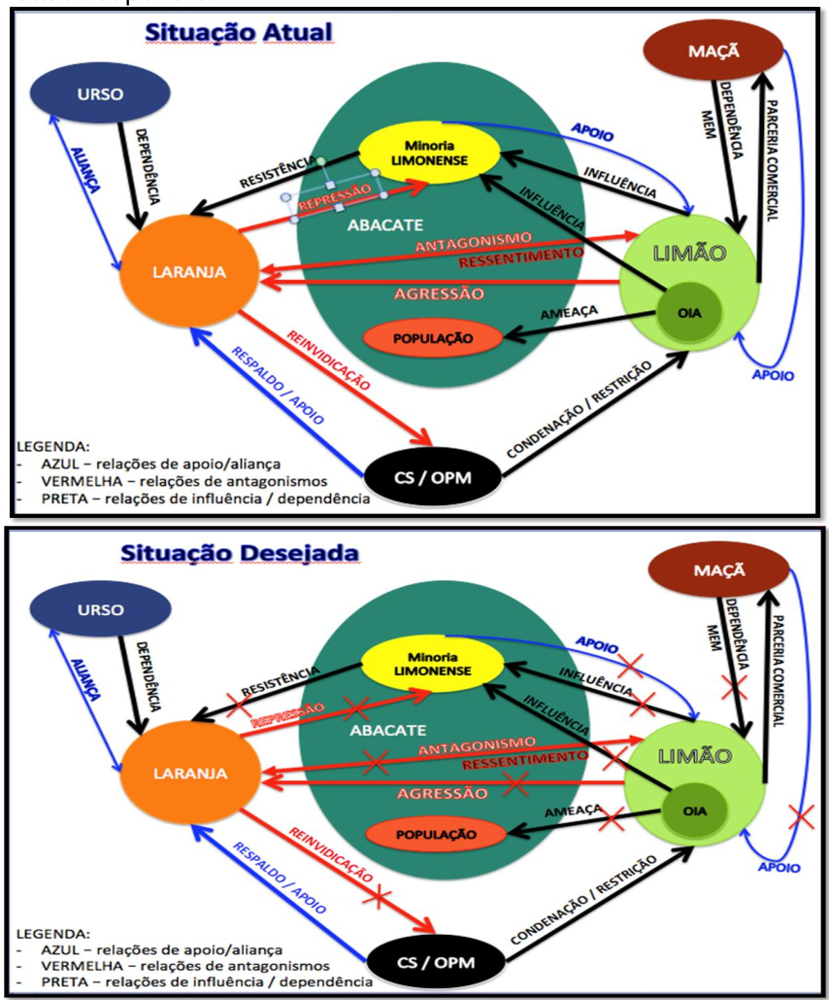
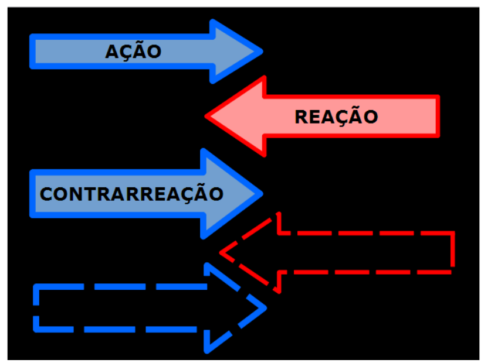

# Capítulo V - Exame de Situação Operacional

## Página 39

### 5.1 Considerações iniciais

5.1.1 O Exame de Situação Operacional (Exm Sit Op) é constituído das seguintes fases: 
a) Fase 1 — Avaliação do Ambiente Operacional e Análise da Missão;
b) Fase 2 — A Situação e sua Compreensão;
c) Fase 3 — Possibilidades do Inimigo, Linhas de Ação e Confronto;
d) Fase 4 — Comparação das Linhas de Ação;
e) Fase 5 — Decisão; e
f) Fase 6 — Conceito Preliminar da Operação.

5.1.2 Embora essas fases se sucedam em sequência lógica, será comum retornar às fases anteriores para reexaminar fatos, cuja reanálise venha se mostrar necessária, bem como acrescentar outros, até então desconhecidos ou cuja relevância não tivesse ainda sido constatada. Isso se deve à natureza cíclica do processo de planejamento, o que requererá uma eficaz coordenação entre as seções do EMCj.

5.1.3 A citada coordenação caberá ao Chefe do EMCj (Ch EMCj), que acompanhará os trabalhos das seções, orientando-as quanto à profundidade e objetividade. E ele quem, organizando um cronograma de trabalho, sugerirá ao comandante as reuniões de coordenação necessárias.

5.1.4 Nessa etapa, será redigido o documento formal “Exame de Situação Operacional”, sob a responsabilidade da Seção de Operações do EMCj, auxiliado diretamente pela Seção de Planejamento. Cada Seção do EMCj desenvolverá análises dentro das respectivas esferas de responsabilidade. Para tanto, seguirão Roteiros de Análise conforme os modelos doutrinários. Enquanto o Exame de Situação Operacional constituirá um documento formal a ser arquivado juntamente com o Plano Operacional decorrente, os Roteiros de Análise servirão apenas como um guia de trabalho proposto para as Seções do EMCj, podendo sofrer alterações, caso julgado necessário pelo Ch EMCj, desde que não comprometam o andamento lógico das análises, fundamental para a elaboração do Exame de Situação Operacional.

5.1.5 As fases do Exame de Situação Operacional correspondem ao reconhecimento da existência e definição do problema militar (Avaliação do Ambiente Operacional e Análise da Missão), coleta e estudo dos dados a ele pertinentes (A Situação e sua Compreensão), elaboração das possíveis soluções (Possibilidades do Inimigo — Psb Ini, Linhas de Ação — LA, e Confronto), comparação das possíveis soluções (Comparação das LA), seleção da melhor solução (Decisão) e elaboração de uma ideia geral sobre a forma como a decisão será implementada, caracterizada no Conceito Preliminar da Operação (CPO). O CPO poderá facilitar a apreciação pelo escalão superior e o entendimento pelos subordinados, possibilitando a antecipação de providências e de informações úteis para os planejamentos das Forças Componentes.

## Página 40

5.1.6 É de fundamental importância a existência de um trabalho de Inteligência prévio para o início efetivo do planejamento, sem o qual o Comandante e o respectivo EMCj carecerão de dados suficientes para as análises iniciais no Exame de Situação. Cabe observar que uma situação de conflito não surge de forma repentina, sendo normalmente precedida de uma crise durante a qual as atividades de inteligência (e contrainteligência) deverão ser intensificadas, atualizando-se as informações e planos disponíveis.

### 5.2 Fase 1 Exm Sit Op - Avaliação do Ambiente Operacional e Análise da Missão

5.2.1 O Cmt Op e seu EMCj devem adquirir uma ideia clara e completa do problema militar, antes de tentar solucioná-lo. Isso incluirá uma compreensão contextual da situação, por meio de uma avaliação do ambiente operacional, e do enunciado e análise da própria missão, que serão consolidados em uma Diretriz de Planejamento (DIPLIAN).

5.2.3 A fase 1 se desenvolve seguindo a sequência abaixo:

a) **1ª Etapa:** Avaliação do Ambiente Operacional
1) compreensão das Diretrizes/Orientações Estratégicas;
2) análise da situação atual e da situação desejada 
3) definição do Estado Final Desejado Operacional; 
4) definição do problema;
5) definição do(s) objetivo(s) operacional(is). 

b) **2ª Etapa:** Análise da Missão
1) origem da missão;
2) enunciado da missão;
3) análise da própria missão;
4) limitações ao planejamento; e
5) apreciação preliminar do poder relativo das forças em presença.

c) **3ª Etapa:** Confecção e Emissão da Diretriz de Planejamento

**5.2.3 Avaliação do Ambiente Operacional (1ª Etapa/fase 1 Exm Sit Op)**

5.2.3.1 O ambiente operacional é a combinação das condições, circunstâncias e influências que afetam o emprego de capacidades e influenciam as decisões do Cmt Op. Incluídos nesse ambiente estão os atores amigos, inimigos e neutros que são relevantes para uma operação conjunta específica. Avaliar o ambiente operacional auxilia o Cmt Op a identificar e entender melhor o problema; antecipar os resultados potenciais; e compreender os resultados das ações próprias, adversárias e neutras, e como tais ações afetam a obtenção do Estado Final Desejado Estratégico

5.2.3.2 A avaliação do ambiente operacional inicia-se com a compreensão das diretrizes e orientações estratégicas, prosseguindo pela análise da situação atual e definição da situação final desejada operacional, e concluindo com a definição do problema. Ela permitirá que, além do Cmt Op e de seu EMCj, outros atores que porventura estejam participando da operação ou possuam influência sobre a mesma (organismos internacionais, agências governamentais, organizações não governamentais etc.) tenham um entendimento comum do problema a ser resolvido, possibilitando a necessária unidade de esforços em prol da consecução do Estado Final Desejado Estratégico.

## Página 41

**5.2.3.3 Compreensão das Diretrizes e Orientações Estratégicas**

5.2.3.3.1 O propósito de garantir o entendimento das orientações e diretrizes estratégicas é basilar para o início do planejamento. Por meio da análise dos documentos oriundos dos níveis político e estratégico, ou mesmo dos discursos das lideranças políticas, amigas, neutras e inimigas, é possível identificar, dentre outros itens: as premissas, os objetivos políticos e estratégicos, as condicionantes políticas e militares, o Estado Final Desejado Estratégico e o Teatro de Operações ou a Area de Responsabilidade.

5.2.3.3.2 Nesse momento, o Cmt Op deve estabelecer um diálogo com as lideranças do nível superior para dirimir as diferenças de interpretação dos objetivos estratégicos e políticos e as formas e meios para atingi-los.

**5.2.3.4 Análise da Situação Atual e da Situação Desejada**

5.2.3.4.1 O Cmt Op e seu EMCj desenvolvem uma compreensão contextual da situação, definindo as condições atuais e desejadas de um ambiente operacional e familiarizandose, indiretamente, com o problema.

5.2.3.4.2 Para produzir uma visão holística dos sistemas relevantes oponentes, neutros e amigos dentro de um universo maior que inclui muitas influências externas, a análise deve definir como esses sistemas se inter-relacionam. O mais importante para esta análise é descrever as relações relevantes dentro e entre os vários sistemas que direta ou indiretamente afetam o problema em questão. Ao fazer isso, essa equipe de planejamento buscará identificar: comportamentos, tensões e tendências dos atores mais relevantes; potenciais impactos das suas ações no ambiente operacional; a compreensão do seu papel no atingimento do Estado Final Desejado Estratégico; e outros atores com influência no ambiente operacional.

5.2.3.4.3 Como “atores” entendam-se as lideranças, governos, grupos paramilitares, coalizões, redes terroristas e organizações criminosas, além de corporações multinacionais, organizações não governamentais e outros capazes de influenciar o ambiente operacional.

5.2.3.4.4 Muitas vezes, as relações entre os atores têm diversas facetas e variam de acordo com a escala de interação e os aspectos temporais (história, duração, tipo e frequência). Esclarecer as relações entre os atores requer um esforço intenso, considerando a necessidade de analisá-las sob múltiplas perspectivas.

5.2.3.4.4.1 As relações entre os atores do ambiente operacional serão melhores visualizadas se analisadas de forma sistêmica com base nos fatores gerais (políticos, econômicos, psicossociais e científico-tecnológicos). O tamanho e o escopo de tais análises podem variar dependendo de aspectos particulares do ambiente operacional. A utilização da Matriz de Três Colunas pode auxiliar no estudo desses fatores. 

## Página 42

**a) Fatores Políticos**

1) incluirão o estudo de assuntos internos, tais como: a estabilidade política, o esforço de guerra dos beligerantes, as alianças, tratados e acordos militares, as atividades subversivas e a oposição interna ao governo. Incluirá, ainda, alianças, relações políticas com outros países e aspectos do direito internacional. As consequências políticas ou as reações aos vários tipos de operações serão aspectos extremamente importantes a ponto de, eventualmente, poderem tornar um plano inaceitável.

2) os aspectos relacionados a assuntos civis são de extrema relevância numa situação de emprego do poder militar. Assim sendo, serão levantadas as organizações governamentais e não governamentais atuantes na área das operações, bem como as estruturas locais de defesa civil, avaliando-se a forma adequada de se interagir com as mesmas em prol das ações a serem empreendidas. Também serão apreciadas eventuais implicações em termos ambientais e aquelas afetas à proteção de civis, incluindo DH e ao Direito Internacional Humanitário. Isso servirá para avaliar que tipo de estrutura será estabelecida para lidar com tais demandas.

**b) Fatores Econômicos**

Incluirão a análise dos aspectos referentes à qualidade, organização e capacidade de mobilização econômica, especialmente da indústria, para o apoio ao esforço de guerra de todos os países envolvidos direta ou indiretamente no conflito (inimigos, neutros e aliados), assim como a análise dos aspectos referentes à disponibildade de recursos econômicos, sobretudo os industriais, na área de responsabilidade.

**c) Fatores Psicossociais**

1) incluirá a análise de uma gama de aspectos de difícil avaliação, entre os quais estará sempre presente a postura da população civil e o moral das forças armadas em oposição. As características nacionais, religiosas e culturais influenciam o nível de treinamento das forças civis e militares, assim como seu comportamento sob as várias condições da guerra. Serão considerados, ainda, os fatores sociais e raciais, e suas possíveis implicações nas operações.

2) deverá ser dada especial atenção aos aspectos a serem explorados por meio de operações psicológicas. Tais operações, para que sejam eficazes, necessitarão, normalmente, ser implementadas com a devida antecedência em relação ao início efetivo das operações.

**d) Fatores Científico-Tecnológicos**

1) considerar o nível de desenvolvimento científico-tecnológico, a exploração dos principais campos de pesquisa e desenvolvimento e as tecnologias de ponta existentes, incluindo a capacidade de realizar ações cibernéticas. O levantamento de preponderâncias evidentes de cada um dos contendores, no que diz respeito a recursos científico-tecnológicos que possam impactar na operação, pode direcionar o planejamento no sentido de minimizar desvantagens e otimizar aspectos favoráveis.

5.2.3.4.5 Para facilitar o entendimento da situação atual e desejada, após a análise dos fatores gerais de um ambiente operacional, podem ser elaborados modelos gráficos. Recomenda-se a utilização do Diagrama de Relações, que baseado na inferência lógica e apoiado em evidências, ajuda o planejador a desenvolver uma melhor identificação e compreensão do problema e pode, muitas vezes, apontar para fatores até então não identificados.

5.2.3.4.6 Após ter concluído o Diagrama de Relações, o Comandante tem condições de fazer uma descrição por escrito, sintetizando assim o seu entendimento da situação atual e da situação desejada.

5.2.3.4.7 A situação desejada de um ambiente operacional envolve a visão de como o Comandante entende ou percebe que o ambiente operacional deve se transformar para que ele possa atingir e cumprir os objetivos, ordens, orientações e diretrizes emitidas pelas autoridades superiores.

Figura 1: exemplos de Diagramas de Relações

## Página 43

5.2.3.4.8 Assim, uma situação desejada é um estado futuro a ser buscado dentro do ambiente operacional que esteja sendo estudado, com o intuito de modificar atitudes, ações e relações dos atores envolvidos. As condições necessárias para se alcançar uma situação desejada podem ser tangíveis ou intangíveis, militares ou não militares, e ainda serem fatores físicos ou psicológicos.

5.2.3.4.9 Ao descrever as condições que compõem uma situação desejada, o Comandante Operacional considera sua relevância para o poder político e para as ordens, orientações ou diretrizes recebidas do seu superior.

5.2.3.5 Definição do Estado Final Desejado Operacional

Após o Cmt Op identificar a situação desejada, estará em condições de definir o EFD Op. O EFD Op decorre dos EFD estabelecidos pelos níveis político e estratégico, constituindo uma descrição sucinta das condições que, uma vez alcançadas, permitirão ao Cmt Op assumir que a sua missão foi efetivamente cumprida, ou seja, um ponto além do qual a magnitude dos esforços e o grau de violência empregado pelo Poder Militar deixarão de ter influência significativa para a obtenção dos objetivos políticos e estratégicos. Em seguida, deve ser definido o problema.

## Página 44

**5.2.3.6 Definição do Problema**

5.2.3.6.1 Um problema é uma questão, obstáculo ou óbice que impede ou dificulta alcançar um objetivo desejado ou uma meta. No contexto das operações militares, um problema é, em termos gerais, a condição ou conjunto de condições que impede ou dificulta o Cmt Op de atingir seu EFD Op.

5.2.3.6.2 O Cmt Op e seu EMCj formulam o problema para assegurar que será identificado e solucionado de forma correta, sendo necessário ressaltar que a sua formulação envolve a compreensão das causas profundas do conflito e não apenas os seus efeitos. A partir desta perspectiva, pode-se compreender, com maior clareza, a amplitude de atuação e identificar, com maior precisão, como resolver o problema descrito, por meio de ações militares.

5.2.3.6.3 A descrição do problema resulta de uma compreensão detalhada dos atores relevantes, suas relações e principais interações (comportamentos, pontos de tensão, conflitos de interesses, potencialidades, vulnerabilidades, oportunidades e ameaças), identificando tendências e possíveis áreas de ação, ou seja, os pontos em que se deverá atuar para influenciar e transformar as condições atuais naquelas almejadas para o EFD Op. A descrição do problema também é útil como instrumento de comunicação entre todos os participantes da campanha, incluindo aqueles de outras agências.

5.2.3.6.4 Uma técnica para a formulação do problema militar inicia-se com as respostas a duas questões básicas:

a) qual a diferença entre a situação atual e a situação desejada?

b) o que está impedindo que se atinja o EFD Op?

5.2.3.5.5 Com base na formulação do problema, o Cmt Op e seu EMCj desenvolvem a sua descrição, que deve ser concisa e focada nas questões que exijam solução. Assim, à medida que o Comandante se familiarize com as variáveis envolvidas no problema, deverá definir como alcançar o EFD Op, a ser estabelecido para o final das ações, por meio dos objetivos operacionais.

**5.2.3.7 Definição dos Objetivos Operacionais (Obj Op)**

5.2.3.7.1 As operações conjuntas devem ser dirigidas a Objetivos Operacionais que contribuam para alcançar o EFD Op. Um Objetivo Operacional, portanto, é uma meta para a qual concorrerão as ações, deste nível. Dessa forma, todos os esforços devem ser direcionados e concentrados para atingir esses objetivos. Os Objetivos Operacionais, somente quando alcançados coletivamente, representam o EFD Op.

5.2.3.7.2 Os Objetivos Operacionais podem ser atribuídos ao Cmt Op no próprio planejamento estratégico, em casos extraordinários, como parte da visualização do EMCFA para se atingir o EFD Estrt. Uma Campanha dificilmente será conduzida com base exclusivamente na expressão do Poder Militar. Logo, podem ser formulados Objetivos Operacionais com vistas a contribuir de forma direta ou indireta com os Objetivos Estratégicos de ordem econômica e diplomática, que serão liderados por outras expressões do Poder Nacional.

## Página 45

**5.2.4 Análise da Missão (2ª Etapa/fase 1 Exm Sit Op)**

**5.2.4.1 Origem da Missão**

5.2.4.1.1 A missão é o ponto de partida para o desencadeamento de uma operação militar e, como tal, constitui essencial elemento a ser considerado no Exame de Situação. Constitui, em conjunto com o EFD Op e os Objetivos Operacionais, um dos elementos balizadores de todo o trabalho que conduzirá à decisão.

5.2.4.1.2 O Cmt Op deverá identificar a origem de sua missão, se ordenada pelo escalão superior (missão imposta), embora pouco provável, ou se somente foi transmitido o Estado Final Desejado Estratégico. Em ambos os casos, o Cmt Op deverá levar em consideração todos os elementos já recebidos ou identificados (Problema Militar, Estado Final Desejado Estratégico, Estado Final Desejado Operacional, Objetivos Estratégicos e Operacionais, diretrizes ou intenções do escalão superior), seja para enunciar a sua missão ou para dialogar com o escalão superior sobre a missão imposta, caso necessário.

**5.2.4.2 Enunciado da Missão**

5.2.4.2.1 Nesse item, o Cmt Op deverá enunciar a sua missão, discriminando a(s) tarefa(s) mais o(s) propósito(s), nessa ordem, unidos pela expressão “a fim de”.

5.2.4.2.2 Antes de enunciar a missão, o Comandante deverá fazer uma breve análise sobre o inimigo, a área de responsabilidade e os meios que poderão ser adjudicados a partir das informações já disponíveis.

a) Inimigo Deverão ser considerados os dados gerais disponíveis sobre o inimigo, particularmente os relativos à sua doutrina de emprego, informações recebidas do escalão superior, ordem de batalha, valor, mobilidade estratégica, capacidade logística e de mobilização do país inimigo e de seus aliados para sustentar o esforço de guerra, apoio de outras forças/países e outras considerações julgadas pertinentes à tomada de conclusões que orientarão a continuidade do processo. Recomenda-se muito cuidado nesse ponto, pois será perigoso deduzir sobre o que o inimigo pode fazer, sem que se esteja apoiado em dados de elevado grau de confiança.

b) Area de Responsabilidade (ARP) Serão apresentados os limites, os dados gerais sobre a área em suas diferentes dimensões, sua configuração, o clima, acidentes notáveis de maior relevância e considerações julgadas importantes pelo comandante. O comandante estará, ao término desse estudo, em condições de obter algumas conclusões preliminares sobre de que forma determinadas características da área de responsabilidade poderão afetar o desdobramento e o emprego dos meios adjudicados, o comando e controle, os sistemas de armas e a progressão das tropas no terreno.

c) Solicitação de Meios Estudado preliminarmente o inimigo e visualizada a ARP, o Cmt Op deverá propor os meios a serem adjudicados, atentando para a sua situação geral, em especial os prazos para recebimento das forças de reserva mobilizadas ou a serem mobilizadas, bem como o tempo necessário para se realizar a Concentração Estratégica dos meios da ativa e da reserva mobilizada, o grau de aprestamento dos meios, informações administrativas pertinentes e outras considerações julgadas úteis ao planejamento de emprego. A relação dos meios deverá ser encaminhada à aprovação do Min Def assim que ela estiver aprovada pelo Cmt Op, a fim de se ganhar tempo, possibilitando a continuação do planejamento de forma mais objetiva.

## Página 46

**5.2.4.3 Análise da Própria Missão**

**a) contribuição para o Estado Final Desejado do Escalão Superior**

O Cmt Op examinará de que forma o cumprimento da missão contribuirá para o EFD do escalão superior. Esse exame revelará aspectos de grande influência na condução da operação.

**b) relação da Missão com as de Outros Comandos**

Nesse ponto, o Cmt Op estabelecerá a relação entre a própria missão e as atribuídas a outros comandos diretamente subordinados ao mesmo escalão superior (forças amigas), participantes da operação. O estudo da relação entre as missões auxiliará o Comandante a compreender o seu papel na operação e a levar em conta a possibilidade de apoio mútuo ou interferências.

**c) Premissas Básicas**

1) o termo “Premissa Básica” (PB) é aqui empregado como uma suposição acerca da situação existente ou uma pressuposição sobre o futuro curso dos acontecimentos, substituindo informações que, porventura, ainda não estejam disponíveis ou não tenham sido confirmadas e que sejam de fundamental importância para o desenvolvimento do planejamento. Sua adoção implicará na elaboração de um planejamento contingente ou variante do planejamento original, para o caso da não confirmação daquela premissa.

2) o ideal é que o planejamento seja suficientemente abrangente e flexível, de forma a eliminar, ou reduzir tanto quanto possível, a necessidade do emprego de premissas básicas. No entanto, isso nem sempre será possível, principalmente nos planejamentos elaborados numa moldura temporal de longo prazo sem execução num futuro próximo.

3) premissas básicas em excesso limitam a utilidade do plano, todavia, quanto mais elevado o escalão de planejamento (ou quanto maior o prazo para o início da operação) maior a probabilidade de se tornar necessário o uso de PB. O estabelecimento de PB só é válido para a elaboração de planos de execução não imediata ou de curto prazo.

4) para a verificação da validade de uma PB, deve-se perguntar se o plano teria sucesso caso a PB não se concretizasse. Se a resposta for afirmativa, ela não é válida e deverá ser abandonada, uma vez que a sua adoção tenha se mostrado desnecessária.

5) as atividades das próprias forças, ou forças amigas, não constituirão normalmente assunto para a formulação de PB, posto que o Comandante estará em posição de conhecer exatamente tais atividades. Entretanto, pode haver casos em que se torne imperativo estabelecer PB acerca das próprias forças, como em um planejamento em que as forças necessárias à operação estejam engajadas com o inimigo em outro local. Não será possível estabelecer com precisão quando esses engajamentos terminarão e, portanto, torna-se necessário fazer uma suposição para que o planejamento possa prosseguir.

6) há de se ter cuidado para não confundir o conceito de “Premissa Básica” com “Possibilidades do Inimigo” que será abordado mais adiante.

## Página 47

7) o Cmt Op transcreverá as Premissas Básicas (PB) formuladas pelo escalão superior, caso sejam do seu conhecimento. Existindo PB estabelecida pelo escalão superior, esta será tratada como “fato” para fim de planejamento pelos escalões subordinados. Adicionalmente, deverá identificar a necessidade de se formular, ou não, premissas básicas para o seu planejamento.

**5.2.4.4 Limitações ao planejamento**

5.2.4.4.1 Geralmente, logo no início do exame de situação, podem ser identificadas certas limitações com influência significativa nas possíveis soluções para o problema. Basicamente, as limitações ao planejamento são condicionantes comumente impostas pelo nível superior e abarcam dois conceitos: “o que não pode ser feito” e “o que deve ser feito”, no nível operacional. Pode-se incluir entre elas:

a) implicações de tempo (grau de urgência ou prioridade; tempo disponível para o planejamento; e tempo previsto para a duração da operação);

b) condições especiais impostas por autoridade superior (condicionantes políticas e regras de engajamento);

c) relacionamento da operação com outras operações em andamento; e

d) outros aspectos, tais como fatores ambientais e jurídicos.

**5.2.4.5 Apreciação preliminar do poder relativo das forças em presença**

A partir desse momento, o Comandante terá condições de realizar uma apreciação inicial do poder relativo das forças em presença, tendo em vista o levantamento das principais forças de ambos os contendores e as conclusões retiradas da análise dos demais fatores. Nessas condições, poderá elaborar orientações específicas para o trabalho do seu EM e do planejamento subsequente.

**5.2.5 Confecção e Emissão da Diretriz de Planejamento — DIPLAN (3ª Etapa/fase 1 Exm Sit Op)**

5.2.5.1 Após analisar todas as informações disponíveis, o Comandante emitirá, por escrito, a DIPLAN, relacionando para o seu EMCj os principais pontos do estudo desenvolvido até então, a fim de transmitir o exato significado de sua missão, suas possibilidades e limitações.

5.2.5.2 A DIPLAN desencadeia todo o trabalho do EM para a solução do problema. Ela proporciona total liberdade ao Comandante quanto à forma de registrar e transmitir as suas ideias e orientações iniciais aos seus subordinados. Seu conteúdo poderá ser alterado à medida que se avance no Exame de Situação Operacional, a critério do Comandante. A relação dos meios a serem adjudicados deverá fazer parte da DIPLAN, a fim de que todo o EMCj tome conhecimento. Basicamente, a DIPLAN conterá:

a) o EFD Op;

b) o problema militar a ser solucionado;

c) e os Objetivos Operacionais;

d) o enunciado da missão;

e) os principais dados e conclusões obtidas na avaliação do ambiente operacional e na análise da missão;

f) limitações ao planejamento;

g) poder relativo de combate do(s) oponente(s), com base na solicitação inicial dos meios a serem adjudicados;

h) premissas básicas para o planejamento;

i) orientações para o estabelecimento de um cronograma de trabalho, tendo em vista o grau de urgência do planejamento e do início das ações; e

j) outras prescrições julgadas necessárias à orientação do trabalho do EMCj.

## Página 48

5.2.5.3 A emissão, por parte do Comandante, da DIPLAN, caracterizará a conclusão da fase de avaliação do ambiente operacional e análise da missão, sendo pré-requisito ao trabalho subsequente do EM.

5.2.5.4 Dependendo do grau de urgência do planejamento e da implementação de providências iniciais por parte dos comandos subordinados, a DIPLAN poderá servir de base para a emissão imediata de uma “Ordem Preparatória”, possibilitando o início do planejamento nos escalões subordinados, bem como a antecipação de providências necessárias para as operações iminentes.

5.2.5.5 Além de proporcionar ganho de tempo, fator operacional normalmente escasso e precioso, tal antecipação pode contribuir para maior sinergia entre os diversos escalões envolvidos, desde a fase do planejamento operacional (segundo um ritmo de planejamento paralelo e simultâneo nos diversos escalões), otimizando o fluxo de informações e possibilitando a identificação de itens críticos para a implementação das possíveis Linhas de Ação, até a seleção daquela que se constituirá na “Decisão” do Comandante.

### 5.3 Fase 2 Exm Sit Op - A Situação e sua Compreensão

5.3.1 Nessa fase, será realizada uma análise detalhada dos dados relativos aos fatores operacionais espaço, tempo e força. O trabalho deve iniciar-se pelas características da área de responsabilidade e abrangerá dados das forças inimigas, das próprias forças, das forças amigas e da comparação dos poderes de combate.

5.3.2 Ao término dessa fase, em conjunto com os resultados das análises realizadas na fase anterior, os aspectos mais relevantes da área de responsabilidade, das forças amigas, da comparação dos poderes de combate, que impactam na missão, e no EFD Op serão consolidados no Desenho Operacional, nos Fatores de Força e Fraqueza e na Intenção do Comandante, além do julgamento da determinação inicial da adequação da própria força e da identificação das necessidades de inteligência.

**5.3.3 Metodologia e Fundamentos da Análise**

5.3.3.1 A análise detalhada dos diversos fatos relevantes para o cumprimento da missão e alcance do EFD Op deverá ser realizada com a utilização da matriz de três colunas, conforme modelo anexo neste volume.

5.3.3.2 Para se chegar aos Fatores de Força e Fraqueza, utiliza-se o método de raciocínio cartesiano, a partir de seus quatro preceitos fundamentais: evidência, análise, enumeração e síntese. Esses preceitos podem ser assim resumidos e integrados ao PPC: 

a) **evidência:** evita a precipitação e improvisação, aceitando como verdadeiro apenas o que se apresentar claro e indiscutível como tal. São os “fatos” da matriz de três colunas. Tais fatos são pertinentes quando relacionados com a missão do Comandante;

b) **análise:** faz com que as dificuldades de um problema sejam divididas no maior número possível de partes, buscando resolvê-las uma de cada vez. A análise é realizada nos campos “dedução” e “conclusão” da matriz de três colunas;

c) **enumeração:** busca enumerar, da forma mais completa possível, todos os fatos pertinentes, suas deduções e conclusões, fazendo, ainda, com que o planejador realize tantas revisões quantas necessárias de modo a obter a certeza de que nenhum aspecto relevante foi omitido. A enumeração é concretizada com a prontificação da matriz de três colunas

d) **síntese:** conduz o pensamento do planejador a partir dos conhecimentos mais simples para os mais complexos. A síntese é realizada na consolidação das diversas conclusões nos Fatores de Força e Fraqueza.

## Página 49

5.3.3.3 Em complemento ao método cartesiano utilizado para definir os Fatores de Força e Fraqueza, o processo da Abordagem Operacional foi incorporado ao PPC, cujo produto é o Desenho Operacional. Para melhor compreensão deste processo de análise, deve-se, antes, relacionar os conceitos de Arte Operacional e Abordagem Operacional.

5.3.3.3.1 Arte Operacional compreende um conjunto de conceitos que contribuirão para uma melhor concepção do emprego de meios militares e não militares em um Teatro ou Area de Operações, para a realização de uma campanha ou, simplesmente, uma operação militar.

5.3.3.3.2 A Abordagem Operacional é o processo no qual o Comandante, valendo-se de toda a sua experiência profissional e pensamento crítico, emprega os conceitos de Arte Operacional para conceber uma ideia geral sobre “o que deve ser feito” para se chegar ao EFD Op. Os elementos do Desenho Operacional, modelo anexo neste volume, já podem ser identificados ao longo das análises realizadas, durante a presente fase, por meio da matriz de três colunas, o que facilitará sua posterior construção.

5.3.3.4 As seções do EM trabalharão, simultaneamente, nesses dois processos analíticos. Os parágrafos descritos a seguir serão redigidos no documento “Exame de Situação Operacional” na sequência apresentada.

**5.3.4 Características da Área de Responsabilidade**

5.3.4.1 Os aspectos relacionados à característica da área de responsabilidade são, normalmente, numerosos e o grau de detalhamento dependerá da natureza do Comando Operacional. Tais aspectos serão estudados em detalhe, normalmente, nos exames de situação dos escalões no nível tático, o que não significa que não devam ser estudados, de modo mais amplo, em planejamentos de níveis mais elevados. Os seguintes aspectos serão analisados:

a) Hidrografia

1) o estudo da hidrografia da área de responsabilidade inclui as profundidades, correntes, marés, canais, perigos e auxílios à navegação, e outros similares que afetem a navegação, a realização de operações de transposição de cursos de água e a progressão da tropa no terreno.

2) nas operações anfíbias, será essencial examinar, em detalhes, os aspectos que influenciam a aproximação das praias, tais como os gradientes, correntes, marés, obstruções naturais ou construídas pelo homem, etc.

3) a suscetibilidade das águas, a minagem ofensiva e defensiva ou às contramedidas de minagem terão especial atenção.

4) as condições sonar sempre serão investigadas cuidadosamente, já que uma mesma condição pode ser vantajosa para a operação de submarinos e desvantajosa para as operações de superfície. Este conhecimento constituirá um importante dado, não somente para o planejamento das operações na área pertinente, mas também para alteração da derrota de uma força naval (ou comboio), desviando-a da área desfavorável.

5) nas operações predominantemente terrestres, a identificação dos principais cursos d'água que constituam obstáculos será particularmente importante para:

- O planejamento de manobras envolventes;
- O levantamento de restrições ao apoio; e
- À delimitação de linhas de cerco.

6) grandes lagos, açudes e represas serão também objeto de levantamento, particularmente nos escalões operacionais e táticos, de forma a serem considerados não só no planejamento operacional, mas também no estudo do desdobramento logístico.

## Página 50

**b) Terreno e Topografia**

1) os aspectos geográficos do terreno serão estudados na profundidade necessária ao escalão considerado, ressaltando de importância:

- O levantamento de obstáculos de vulto à progressão terrestre;
- As áreas cuja topografia e cobertura vegetal possam ocultar consideráveis meios, capazes de influenciar decisivamente na operação;
- Os acidentes notáveis do terreno que, por sua relevância, possam proporcionar efetivas vantagens para a força que os detém; e
- Às principais faixas do terreno cujo relevo, condições do solo e outros fatores configurem direções estratégicas ou direções táticas de atuação e que facilitem ou dificultem o emprego de ponderáveis meios, capazes de imprimir rapidez à operação e atender ao princípio de guerra da massa.

2) a influência dos obstáculos terrestres no emprego de radares deverá ser convenientemente analisada.
3) quando apropriado, o efeito da topografia nos planos para evasão e recuperação de pilotos abatidos será também considerado.

**c) Clima e Meteorologia**

1) as informações sobre clima e meteorologia serão necessárias em todas as operações. As considerações dos aspectos pertinentes podem variar desde uma análise geral das variações climáticas até estudos detalhados das condições do tempo e de seus efeitos nas operações planejadas, incluindo o efeito sobre as atividades logísticas.
2) a presença de neve, gelo, chuvas, baixas temperaturas, etc., pode afetar não só a mobilidade das forças, mas também o desempenho dos meios que explorem o espectro eletromagnético, tanto em termos de sensoriamento como em termos de comando e controle.

**d) Períodos Diurnos e Noturnos**

Serão extremamente importantes no planejamento das operações, afetando os equipamentos e as táticas passíveis de serem empregados, bem como as atividades logísticas num determinado período, programação de eventos, etc. Será altamente conveniente que se tabulem as horas do nascer e pôr do Sol e da Lua, os períodos de claridade e escuridão, duração dos crepúsculos e fases da Lua.

## Página 51

**e) Pontos de Importância Operacional**

1) serão de grande interesse as localizações e distâncias entre as posições geográficas importantes de um problema que envolva uma grande área. Será conveniente elaborar uma tabela com essas distâncias (por via terrestre, aérea e/ou marítima) e, em certos casos, registrarem-se nas cartas e mapas as marcações verdadeiras entre esses pontos.

2) os aspectos considerados são aqueles de natureza estática ou geográfica, tais como instalações fabris, usinas de geração de energia, represas, complexos de armazenamento, bases navais, aéreas, de apoio, centros de comando e controle, instalações de comunicações, radar, mísseis, etc. Os aspectos dinâmicos das distâncias (como os relacionados com o tempo) serão cobertos mais adiante, quando da análise dos fatores de tempo e distância.

3) alguns dos pontos a serem enfatizados na análise desse fator serão:

- Maior ou menor proximidade das forças oponentes em relação a essas posições geográficas, que poderão constituir-se em pontos decisivos na manobra;
- Vulnerabilidade das forças em relação à projeção da aviação oponente baseada nessas posições; e
- Necessidade de reabastecimento no mar, no ar, etc. 

**f) Linhas de Transporte e de Suprimento**

1) as rotas existentes (marítimas, terrestres e aéreas) que digam respeito ao problema, serão estudadas cuidadosamente, inclusive as do Inimigo.

2) em alguns casos, os pontos focais de navegação, os entroncamentos rodoferroviários, as pontes e outras obras de infraestrutura, os canais, as passagens restritas ou outros aspectos semelhantes poderão influir nas linhas de transporte e de suprimento e, portanto, afetar diretamente a solução do problema.

**g) Condições Sanitárias**

Os aspectos que se referem às condições sanitárias e de saúde, e seus possíveis efeitos nos requisitos de saúde das próprias forças (e do Inimigo) e da população nativa serão considerados. Entre eles, destacam-se as condições climáticas capazes de afetar a disponibilidade e qualidade da água e alimentos, doenças endêmicas, facilidades médicas e também de pessoal disponível na área.

**h) Instalações Operacionais e Defesas Fixas**

Serão estudadas quando a natureza do problema requerer que se considerem as bases, próprias ou do Inimigo. Incluirão itens tais como as fortificações e suas áreas de fogo, portos, aeroportos, instalações de defesa de porto, instalações de defesa antiaérea, redes de radar e de alarme aéreo antecipado.

**i) Comunicações na Area**

Quando não for possível o emprego de meios de C? próprios do EMCFA ou das FA, buscar, por meio de recursos criptológicos homologados pelo EMCFA, priorizar, considerando os requisitos de exequibilidade e aceitabilidade, a realização das comunicações de dados, dos serviços de correio eletrônico e de suas funcionalidades complementares por redes de telecomunicações e serviços de tecnologia da informação fornecidos por órgãos ou entidades da Administração Pública Federal, exceto comunicações realizadas por intermédio de serviço móvel pessoal e serviço telefônico fixo comutado, devendo conter obrigações que permitam, em qualquer caso, a auditoria para fins de garantia da disponibilidade, da integridade, da confidencialidade e da autenticidade das informações.

**j) Recursos Similares à Disposição do Inimigo**

O estudo incluirá uma análise da capacidade de tais recursos não sofrerem interferência provocada pelo Inimigo e, reciprocamente, sua capacidade de interferir nas comunicações do Inimigo ou interceptá-las.

**k) Terreno Humano**

O estudo incluirá os aspectos culturais, valores, crenças e interesses da população, assim como os possíveis reflexos para as operações.

## Página 52

**5.3.5 Forças Inimigas**

5.3.5.1 O estudo do inimigo, realizado na primeira fase, representará um dos pontos de partida para esse passo do Exame de Situação. Podem ser ressaltados os seguintes aspectos:

a) relativamente à doutrina do inimigo, nível de treinamento, participação e desempenho em conflitos bélicos recentes e suas manobras tradicionais em exercícios ultimamente executados;

b) a atualização de sua ordem de batalha, com destaque para mudanças recentes de unidades;

c) alterações substanciais em sua capacidade de mobilidade estratégica; e

d) atualização e modernização de seus sistemas de mobilização militar e nacional (focando na capacidade de cooperação e coordenação entre os diversos setores e órgãos que contribuem para o seu esforço de guerra) e suas reais possibilidades de apresentar novos meios no tempo estimado para as operações.

5.3.5.2 A “Análise de Inteligência” oferecerá dados importantes ao planejamento operacional.

**5.3.6 Nossas Forças**

**5.3.6.1 Composição**

Serão avaliadas as forças adjudicadas ao Comando Operacional, com especial ênfase para a situação operacional de cada uma, tanto no que diz respeito ao pessoal quanto ao equipamento. As forças a serem recebidas em prazos posteriores serão também objeto de levantamento.

**5.3.6.2 Situação logística**

5.3.6.2.1 A partir dos dados disponibilizados na fase anterior e na Análise de Logística, será levantada a situação logística das próprias forças, com especial destaque para a integração de conhecimentos que conduzirão a conclusões do tipo:

a) capacidade de suporte logístico aos meios navais, terrestres e aéreos; e

b) capacidade de emprego dos principais sistemas de armas, em função do fluxo logístico de munições e peças de recompletamento.

**5.3.6.3 Situação dos meios de apoio ao combate**

Os exames de situação específicos e os dados iniciais disponíveis proporcionarão, de igual maneira, o levantamento da situação dos meios de apoio ao combate, visando identificar potencialidades ou deficiências no curso das operações.

**5.3.7 Forças Amigas**

Todas as forças não orgânicas do Comando Operacional considerado, que possam interferir na execução da operação, provendo ou necessitando de algum tipo de apoio ou coordenação serão objeto de estudo nesse item. As conclusões trarão importantes dados a serem considerados, particularmente quando na montagem das LA.

## Página 53

**5.3.8 Comparação de Poderes de Combate (CPC)**

5.3.8.1 Consiste no estudo comparativo da composição e das características orgânicas das forças em oposição, incluindo-se aqueles elementos de apoio que possam interferir nas ações. Complementa as análises e conclusões obtidas anteriormente, contribuindo para a identificação dos Fatores de Força e Fraqueza e dos elementos do Desenho Operacional que servirão de base para a formulação das Psb Ini e LA, e, também, para uma avaliação final quanto aos meios necessários para se opor às forças inimigas e cumprir a Missão.

5.3.8.2 A consolidação da CPC poderá ser representada de forma tabular, com o quantitativo e tipo de comparações variando em função das características das forças em oposição, dentro de um determinado teatro ou área de operações.

5.3.8.3 A CPC, no nível operacional, será feita de uma forma mais ampla do que a comumente empregada no nível tático. O foco principal será a comparação entre “capacidades antagônicas”, muito mais do que entre sistemas de armas isoladamente, o que estará ao encargo dos escalões táticos. Exemplo: comparação entre a capacidade de projeção do poder aéreo de um dos oponentes e a capacidade de defesa aérea e antiaérea do seu opositor.

5.3.8.4 Os tópicos que se seguem indicam como efetuar a CPC, cabendo destacar que a sequência estabelecida e a ordem dos aspectos em cada um deles, não têm o propósito de torná-la rígida. Caso esteja prevista a cooperação de forças amigas, ou exista essa possibilidade, o EMCj também deverá analisá-las de acordo com a mesma orientação preconizada para suas próprias forças, e com a profundidade que julgar necessária.

a) Forças Combatentes

1) a quantidade e características gerais dos meios militares dos oponentes.

2) as comparações serão feitas em termos de meios que se opõem, do que por tipos. Exemplificando: o fato de uma força possuir 50 submarinos será colocado em termos mais objetivos quando comparado com a capacidade antissubmarino do oponente. Do mesmo modo, o poderio de forças aéreas de ataque será mais bem analisado se comparado com a capacidade de defesa aérea e antiaérea do oponente. O poder de fogo e ação de choque, proporcionados pelas unidades de carros de combate das próprias forças, serão melhor avaliados quando confrontados com a capacidade de defesa anticarro inimiga.

3) uma tabela mostrando as características das forças oponentes constitui um modo prático para a avaliação conveniente deste fator. Os detalhes que o EMCj deverá observar na comparação dependerão da natureza do problema e da sua experiência e conhecimento profissional. São indicadas, a seguir, algumas das características dos meios que poderão servir como base para a análise comparativa:

- Para forças navais: velocidades, raios de ação e alcance eficaz do principal armamento dos meios disponíveis, capacidade de projeção de poder sobre terra e alcances eficazes, capacidade de guerra eletrônica, capacidade de defesa aérea e antiaérea e condições do material;

- Para forças terrestres: grau de adestramento, unidades blindadas, capacidade de defesa antiaérea e anticarro, artilharia orgânica e capacidade das tropas de operações especiais;

- Para forças aéreas: raios de ação das principais aeronaves de caça, performance, armamento ofensivo e defensivo, capacidade de guerra eletrônica e condições do material, vulnerabilidade dos aeródromos e capacidade desdobramento, capacidade de reabastecimento em voo, capacidade de controle e alarme em voo, capacidade de reconhecimento aéreo e espacial e furtividade;

- Para força cibernética: capacidade de realizar ações cibernéticas de proteção, exploração e ataque, possibilitando conduzir operações que produzam efeitos em tempo real; e

- Para sistemas de armas: alcances, localização, sistemas de controle, ângulo mínimo de elevação, suscetibilidade a contramedidas, rapidez de fogo e condições do material.

4) a eficiência do pessoal em combate é avaliada pelas características nacionais, experiências em combate, moral, adestramento e adaptabilidade para atuar na área de responsabilidade, tendo em vista as características ambientais dessa área.

## Página 54

b) Comando e Controle (C²)

1) os dados são provenientes da análise específica realizada quando do exame das forças inimigas e das próprias forças devendo, obviamente, serem confrontados também com as características da área de responsabilidade. Os principais parâmetros para a confrontação que pode inclusive ser realizada com o auxílio de ferramentas de apoio à decisão, são:

- Às condições para o exercício do comando de cada oponente, em função particularmente dos escalões, da estrutura para emissão de ordens e das peculiaridades dos líderes;

- Os sistemas de sensores disponíveis em cada uma das forças em oposição para o controle da operação, levando-se também em consideração a capacidade de redundância e contingência;

- À eficiência dos sistemas de comunicações e tecnologia da informação (TI) postos à disposição de cada uma das forças oponentes para o exercício do comando e do controle;

- À eficiência do sistema de guerra eletrônica das forças confrontadas;

- À existência e grau de eficácia e rendimento de sistemas de apoio à decisão postos à disposição de cada força oponente; e

- À tecnologia e os recursos disponíveis, das forças em oposição, possíveis de serem empregados em ações de guerra cibernética.

c) Logística e Mobilização

1) Diferentemente dos itens anteriores não cabe a comparação entre as capacidades logísticas e de mobilização, mas somente o levantamento das capacidades frente às necessidades das respectivas forças, amigas e inimigas. Ou seja, busca-se conhecer, sobretudo, as vulnerabilidades do oponente em termos de logística e mobilização, enquanto buscamos identificar as nossas necessidades, disponibilidades e carências.

2) Este levantamento das capacidades poderá ser realizado tendo como parâmetros as funções logísticas ou aspectos específicos de elevado interesse para a situação apresentada, tais como:

- Extensão estimada das linhas de transporte e de suprimento;

- Capacidade de reabastecimento em terra, no ar e no mar;

- Disponibilidade de recursos locais na área de responsabilidade para armazenamento de suprimentos; e

- Vigilância da conformidade e da inocuidade dos alimentos e da água nas etapas de transporte, armazenamento, e distribuição, visando a garantia da segurança e da defesa alimentar.

## Página 55

MD30-M-01

d) Fatores de Tempo e Distância

1) serão considerados em todos os tipos de operações e em todos os estágios do planejamento, constituindo-se nos aspectos dinâmicos da situação.

2) esses fatores serão importantes para o estabelecimento das possibilidades do inimigo e das linhas de ação, no que diz respeito à praticabilidade.

3) o EMCj analisará as posições relativas das forças oponentes e das unidades de apoio ou apoiadas, bem como considerará os seus possíveis movimentos e o seu espaço virtual. Deverão ser confrontados os seguintes aspectos, dentre outros:

- Linha do tempo em que seja possível realizar a mobilização do pessoal e meios (material, instalações e serviços) de acordo com a preparação da campanha, levando em consideração as posições relativas favoráveis;

- Possibilidades de interceptação entre as forças oponentes;

- Duração das operações críticas à manutenção das FCte;

- Período de tempo de vulnerabilidade às ameaças navais, terrestres, cibernéticas e aeroespaciais;

- Período de tempo necessário para o emprego de meios aeroespaciais, navais e/ou terrestres;

- Tempos para deslocamento e concentração estratégicas das próprias forças e das forças inimigas, inclusive de reservas estratégicas de elevada ação de choque e potência de fogo;

- Tempos de mobilização de meios aéreos, navais e terrestres para posições de vantagem em função de adequações das Linhas de Ação conforme análise do ambiente operacional.

**5.3.9 Fatores de Força e Fraqueza (FFF)**

5.3.9.1 Aqui, as conclusões alinhadas nos parágrafos referentes ao estudo das características da área de responsabilidade e da comparação de poderes combatentes serão sintetizadas de modo a se destacarem, objetiva e resumidamente, nos Fatores de Força e Fraqueza de cada uma das forças em oposição. Ao fazê-lo, o EMCj deverá considerar em conjunto os fatos e conclusões pertinentes.

5.3.9.2 Os fatores de força do Comandante e os de fraqueza do inimigo constituirão pontos fundamentais a serem explorados na elaboração das linhas de ação.

5.3.9.3 Ao relacionar os fatores, deve-se ter cuidado para não indicar como fator de força de um oponente o que já tenha sido apontado como fator de fraqueza do outro, e viceversa. Pode-se relacionar, para ambos os lados, um mesmo fator de força ou de fraqueza, desde que representem aspectos que não se oponham entre si. Por exemplo, a existência de um conjunto balanceado de radares adequadamente distribuídos, para monitoramento do espaço aéreo, por parte de ambos os oponentes. Não deve ser relacionado, simplesmente, “o que não se tem” como um fator de fraqueza, pois isso poderia levar a uma listagem quase infinita de itens.

## Página 56

**5.3.10 Abordagem Operacional**

5.3.10.1 Com base nas análises realizadas até o momento, o Cmt Op e seu EMCj, empregando os conceitos de Arte Operacional, desenvolvem uma Abordagem Operacional, a fim de conceber uma ideia geral sobre “o que deve ser feito” para se chegar ao EFD Op.

5.3.10.2 A Abordagem Operacional permite ao Comandante fazer um enquadramento do problema a ser resolvido, de acordo com a sua visão, buscando, por meio de ações/efeitos, moldar o ambiente operacional a seu favor.

5.3.10.3 Para facilitar a visualização da Abordagem Operacional, o Comandante Operacional utiliza ferramentas gráficas, sendo uma delas, o Desenho Operacional. Esta ferramenta inter-relaciona de forma clara lógica e simples os elementos do desenho, com vistas a apresentar uma solução ao problema elencado na DIPLAN.

5.3.10.4 O Cmt Op e o EMCj concentram esforços para continuar a identificação dos elementos do Desenho Operacional, que se encontram descritos de forma detalhada no modelo anexo neste volume. O EFD Op e os Objetivos Operacionais, já identificados na fase anterior, podem ser refinados neste momento, caso julgado necessário frente ao aprofundamento da análise da situação.

5.3.10.5 O Desenho Operacional possui os seguintes propósitos:

a) comunicar a visão do Comandante sobre “o que” deve ser feito para se alcançar o EFD Op;

b) proporcionar uma referência para sincronização e coordenação da operação/campanha ao longo do tempo;

c) guiar a elaboração das Linhas de Ação; e

d) servir de referência para avaliar o progresso ou atraso da operação/campanha na etapa do Controle da Operação Planejada.

5.3.10.6 A construção do Desenho Operacional inicia-se nesta fase do planejamento, devendo ser ratificado ou retificado em fases posteriores do planejamento. Uma proposta de sequenciamento lógico dessa construção, encontra-se descrita nos documentos relacionados ao planejamento operacional neste volume.

**5.3.11 Intenção do Comandante**

5.3.11.1 Após definido o Desenho Operacional e identificados os Fatores de Força e Fraqueza, o Comandante terá condições de estabelecer sua(s) intenção(ões), ao delinear a forma ou método como ele visualiza para que suas forças sejam empregadas para explorar as VC do inimigo e atingir seu(s) CG, protegendo seus próprios CG e VC e alcançando o EFD Operacional, valendo-se, para tanto, de toda sua experiência profissional e da observância dos princípios de guerra, dentre outros. Cabe observar que este item poderá ser ajustado e alterado, a critério do Comandante, no decorrer do Exame de Situação, quando informações e fatos novos poderão ser levantados, possibilitando o aperfeiçoamento das conclusões e de aspectos relevantes do planejamento.

5.3.11.2 A redação da Intenção do Comandante deverá conter:

a) uma análise sucinta do problema, destacando o propósito da operação e de que forma o Comandante visualiza atingir o EFD Operacional e como isso contribui para atingir o EFD do escalão superior e das Forças Amigas;

b) a forma como ele pretende que seja feita a abordagem dos centros de gravidade identificados (das próprias forças e do inimigo) e de suas vulnerabilidades críticas, destacando o nível de risco considerado aceitável pelo Comandante; e

c) se for o caso, os Princípios de Guerra que o Comandante julgue adequados para a condução das ações que estão sendo planejadas.

## Página 57

**5.3.12 Necessidades de Inteligência**

5.3.12.1 Nessa altura do planejamento, os aspectos que já apresentam necessidade de Inteligência ou atualização de conhecimento devem ser listados como Elementos Essenciais de Inteligência (EEI) ou Outras Necessidades de Inteligência (ONI). Os EEI são os conhecimentos necessários ao prosseguimento ou aprimoramento do planejamento. Já as ONI são os conhecimentos, apesar de não impedirem o prosseguimento ou aprimoramento do planejamento, possibilitarão uma melhor consciência situacional do problema em curso. Essas necessidades irão compor, durante a etapa da Elaboração dos Planos e Ordens, o Plano de Obtenção de Conhecimentos, a ser confeccionado pela Seção de Inteligência do EMCj. Nesse plano constará, entre outros itens, um cronograma para a obtenção dos conhecimentos pretendidos, bem como os responsáveis pela obtenção dos mesmos. Cabe ressaltar que a identificação de tais necessidades ocorrerá ao longo de todo o processo de planejamento e que novas necessidades poderão surgir durante a execução da operação.

5.3.13 Determinação inicial da adequação da própria força

Ao completar a segunda fase do Exame de Situação, o EMCj deverá dispor de informações suficientes para julgar se suas forças estão adequadas ao cumprimento da Missão. E possível, também, obter-se uma ideia aproximada do grau de risco a que suas forças estarão submetidas, principalmente nas ações iniciais da campanha ou operação.

### 5.4 Fase 3 Exm Sit Op — Possibilidade(s) do Inimigo, Linhas de Ação e Confronto

5.4.1 Após consolidar dados e obter conclusões, o Comandante, nessa fase, identificará e considerará as Psb Ini e as próprias LA, que deverão ser analisadas e confrontadas como em um jogo da guerra. Os itens a seguir especificam o procedimento recomendado.

5.4.2 Possibilidade do Inimigo (Psb Ini)

5.4.2.1 Compreende visualizar uma ação que o inimigo é capaz de adotar e que preencha os seguintes requisitos:

a) ser compatível com os meios de que ele dispõe; e

b) ser capaz de interferir ou afetar o cumprimento da Missão do Comandante.

5.4.2.2 As Psb Ini são estabelecidas de modo a expressarem, em termos amplos, as ações que as forças inimigas podem empreender. Caberá à Seção de Inteligência do EM realizar esse trabalho e apresentá-lo ao Comandante para aprovação.

5.4.2.3 Formulação e Análise das Possibilidades do Inimigo

5.4.2.3.1 A formulação das Psb Ini será facilitada se o comandante observar a seguinte sequência:

a) O pressuposto para o início de trabalho da Psb Ini, na ausência de dados que permitam conclusões assertivas, levará em consideração que o EFD Op do inimigo será considerado como o oposto ao EFD Op a ser obtido por nossas forças.

b) a partir de um EFD Op do inimigo (inferido), a Seção de Inteligência do EMCj, reavaliará os Centros de Gravidade e suas vulnerabilidades críticas, pois é sobre estas que o inimigo provavelmente procurará atuar, visando alcançar o seu estado final desejado.

## Página 58

c) a seguir, identificam-se as ações, de caráter geral, capazes de serem empreendidas pelas forças inimigas que possam afetar o cumprimento da missão. Nesse momento, o trabalho da Seção de Inteligência será de um brainstorm, onde visualizará todas as ações possíveis de serem empreendidas pelo oponente, ainda que de maneira desordenada.

d) em seguida, verificar quais tipos de operações militares o inimigo poderá desencadear para o cumprimento das ações visualizadas. Por fim, elaborar as Psb Ini constituídas por todas as operações militares que o inimigo pode realizar.

e) analisar as ações acima, levando em consideração as limitações de qualquer natureza, observadas por ocasião do estudo das fases anteriores, de modo a delimitar ou eliminar as ações que não possam ser executadas pelo inimigo ou a estabelecer uma sequência para a execução dessas ações.

1) em alguns casos, o inimigo poderá ser capaz de realizar simultaneamente múltiplas ações que, se combinadas, afetaram de modo diferente o cumprimento da missão do Comando Operacional. Nesses casos, as Psb Ini estabelecidas deverão especificar claramente essas múltiplas ações. Deixar de apreciar uma Psb Ini múltipla poderá resultar em conclusões incorretas acerca da capacidade do Comando Operacional para o cumprimento da sua missão. Cada Psb Ini detalhada será analisada, tendo como principais parâmetros:

- À coerência com a doutrina inimiga;

- À sua capacidade de execução;

- Os indícios atuais do inimigo;

- Os efeitos das características da área de responsabilidade sobre a Psb Ini analisada;

- Os fatores de tempo e distância disponíveis;

- O grau de risco versus a disponibilidade de meios;

- À busca da surpresa; e

- O conhecimento de nossa situação.

f) finalmente, a Seção de Inteligência apresentará as Psb Ini elaboradas ao Comandante, a quem caberá ratificá-las ou determinar os ajustes necessários.

5.4.2.3.3 É importante que o Comandante considere todas as Psb Ini e não rejeite ou se desfaça de alguma possibilidade aparentemente improvável. Baseando-se unicamente na improbabilidade de sua adoção pelo inimigo, significa raciocinar em termos de intenções do inimigo e correr o risco de ser surpreendido, caso ele escolha essa possibilidade. Notese que o inimigo poderá fazer tal escolha deliberadamente com esse propósito, ou simplesmente porque deseja obter um efeito desejado desconhecido pelo Comandante. No entanto, o Comandante deverá identificar as Psb Ini mais perigosas para as suas Forças, pois esta análise será de grande valia para o Confronto e para a Comparação das LA.

5.4.2.4 Probabilidade de adoção das possibilidades do inimigo

5.4.2.4.1 O Comandante deverá graduar as Psb Ini quanto às probabilidades de adoção. Como fatores de análise das probabilidades, ele utilizará, além dos parâmetros de análise das Psb Ini vistos anteriormente, os seguintes:

a) as que oferecerem maiores vantagens com menores riscos;

b) as que melhor aproveitarem as características da área de responsabilidade associadas às nossas deficiências e vulnerabilidades; e

c) as ações atuais do inimigo.

## Página 59

5.4.2.4.2 Terminada a análise, a Seção de Inteligência relacionará as Psb Ini em ordem decrescente de sua probabilidade de adoção. Especial atenção será atribuída à Psb Ini identificada como sendo a de maior probabilidade de adoção (Psb Ini mais provável) e também aquela que ofereça maiores riscos e potencial prejuízo ao cumprimento da missão do Comandante (Psb Ini mais perigosa). No entanto, ressalta-se, mais uma vez, que nenhuma Psb Ini deve ser descartada.

**5.4.3 Linhas de Ação**

5.4.3.1 São conjuntos de ações que possibilitam o cumprimento da Missão. Cada LA visualizará o emprego da força como um todo, com base nos dados e conclusões obtidas nas fases anteriores do Exame de Situação. E desejável que a LA contenha, pelo menos, os elementos básicos e “o que” e “como” fazer as ações visualizadas para o cumprimento da missão, podendo ser acrescentados os itens “para que”, “quando”, “quem” e “onde” empreender as ações necessárias, caso isto venha a facilitar as análises posteriores, por parte do planejador.

5.4.3.2 Cada LA é melhor expressa por meio do seu “enunciado”, “representação gráfica” e “conceito sumário”. Estas três formas se complementam e devem proporcionar um perfeito entendimento da ideia de manobra concebida.

**5.4.3.3 Elaboração das Linhas de Ação**

5.4.3.3.1 O EMCj deverá elaborar quantas LA julgar convenientes com os dados disponíveis, tendo o cuidado de evitar diferenças entre elas que representem, tão somente, o aperfeiçoamento de uma LA já elaborada (ou a mesma LA só que redigida de forma diferente). Essa atividade será conduzida pela Seção de Operações do EMCj, com o apoio das demais seções.

5.4.3.3.2 Os Pontos Decisivos (PD) a serem alcançados em cada fase da campanha/operação determinarão um conjunto de ações a serem executadas pelas forças adjudicadas ao Comandante, de forma a obterem-se os efeitos necessários para atingir aqueles pontos decisivos.

5.4.3.3.3 Efeito pode ser definido como uma alteração no estado de um sistema (ou elemento de um sistema) resultante de uma ou mais ações e que contribui para a obtenção ou atingimento de um Ponto Decisivo. Um efeito deve ser mensurável. Expressa uma situação desejada no futuro (Ex: Fluxo logístico inimigo degradado).

5.4.3.3.4 Ação é o ato de realizar uma tarefa ou conjunto de tarefas que contribuem para o atingimento de um efeito. As ações, no nível operacional, podem ser cinéticas ou não cinéticas. E escrita com o verbo no infinitivo (Ex: proteger o Porto do Rio de Janeiro).

5.4.3.3.5 Para a formulação das LA, será observada a seguinte sequência:

a) para cada PD, identificar os efeitos e as ações correspondentes, de modo a estabelecer uma relação entre pontos decisivos/efeitos/ações. Nesse momento, o trabalho será de um “brainstorm”, onde serão identificados todos os efeitos e ações possíveis, ainda que de maneira desordenada. As análises realizadas nas Fases le Il, por meio da matriz de três colunas, servirão de base para a identificação de possíveis efeitos e ações;

## Página 60

b) verificar se as ações visualizadas proveem uma atuação adequada sobre os CG/VC inimigos e a proteção dos nossos CG/VC, e também se foram devidamente considerados os Fatores de Força e Fraqueza, próprios e do inimigo, considerando ainda as limitações ou restrições levantadas e as Intenções do Comandante;

c) estabelecer uma sequência para as ações visualizadas, tendo em vista atender a Abordagem Operacional concebida pelo Comandante; e

d) por fim, elaboram-se as LA, considerando as possíveis combinações das ações anteriormente estabelecidas.

Figura 2: Relação entre Pontos Decisivos (PD), Efeitos e Ações.

5.4.3.3.6 O efeito obrigatoriamente deve estar associado ao PD selecionado. Obviamente, ele pode não ser o único efeito que se espera gerar para obtenção ou atingimento do PD.

**5.4.3.4 Representação Gráfica**

A representação é um esquema gráfico preparado para facilitar a visualização e compreensão da ideia de manobra contida na LA. Qualquer outro símbolo, não constante do manual de símbolos do MD, pode ser empregado, desde que acompanhado de legenda explicativa.

**5.4.3.5 Conceito Sumário de cada LA**

5.4.3.5.1 O Conceito Sumário é uma ideia de manobra bastante genérica da LA, procurando identificar de que forma serão desenvolvidas as ações necessárias à execução da mesma.

5.4.3.5.2 Para garantir que todas as ações serão consideradas e diminuir o risco de esquecimento, tomam-se como referência categorias genéricas de ações julgadas imprescindíveis. Cada uma dessas categorias é denominada Requisito. O Conceito Sumário deverá ser elaborado por meio da análise dos Requisitos.

5.4.3.5.3 Os Requisitos retratam aspectos ofensivos, defensivos, de apoio, de inteligência, de logística, de comando e controle, de adestramento, de movimentação de meios etc. O Conceito Sumário de cada LA deverá conter, de modo sintético, a maneira como o Comandante pretende atender cada um desses Requisitos

## Página 61

5.4.3.5.4 A ênfase maior ou menor, de cada um, dependerá da natureza da Missão. É possível que tarefas especiais requeiram considerações acerca de outros Requisitos, além dos acima mencionados.

5.4.3.5.5 Embora as ações para o seu atendimento possam estar inter-relacionadas, os Requisitos deverão ser estudados separadamente, no grau de detalhamento necessário ao nível do planejamento em curso, de modo a assegurar que a totalidade das necessidades inerentes a cada LA seja atendida.

5.4.3.5.6 Ao detalhar cada LA, o Comandante especificará os elementos subsidiários necessários à consecução da mesma, contemplando dentre outros, "o que”, "como" e "onde" será feito, "qual" a dimensão das forças julgadas necessárias, “quando” as ações serão executadas, “para que”, “por quem” e “por quanto tempo”. Este detalhamento constituirá o Conceito Sumário de cada LA.

5.4.3.5.7 Além de proporcionar subsídios para o Confronto entre as Psb I e LA, os Conceitos Sumários das LA constituirão a base sobre a qual, posteriormente, o EMCj estabelecerá o Conceito Preliminar da Operação e, consequentemente, o Conceito da Operação.

**5.4.3.6 Prova Preliminar de Adequabilidade, de Praticabilidade e de Aceitabilidade (APA)**

5.4.3.6.1 Cada LA será aqui analisada separadamente, para determinar a sua validade como uma decisão em potencial. Tal verificação consta da aplicação das seguintes provas básicas (prova de APA):

a) Adequabilidade;

b) Praticabilidade; e

c) Aceitabilidade.

5.4.3.6.2 Uma LA será ADEQUADA se puder cumprir a Missão e atingir o EFD Operacional, produzindo um efeito compatível com a Abordagem Operacional do Comandante.

5.4.3.6.3 Se uma LA formulada parecer apenas “parcialmente” adequada, por não vincular ação suficiente para o cumprimento da Missão, o Comandante acrescentará o que for necessário para satisfazer a prova de adequabilidade, aperfeiçoando-a, ou então deverá abandoná-la.

5.4.3.6.4 Ao realizar esta prova, o planejador verificará as limitações ao planejamento, identificadas por ocasião da análise da Missão e da emissão da Diretriz de Planejamento. Caso uma LA infrinja tais limitações, a mesma será considerada inadequada.

5.4.3.6.5 Uma LA será considerada PRATICÁVEL se puder ser implementada com as forças, apoio e tecnologia disponíveis, levando-se em consideração a oposição esperada por parte do Inimigo e os demais óbices, incluindo aqueles relacionados aos custos financeiros. Isso será conseguido analisando-se criteriosamente os Requisitos inerentes à LA, com ênfase nos aspectos logísticos envolvidos, num nível de detalhamento suficiente para permitir ao Comandante avaliar a capacidade de implementação da LA.

## Página 62

5.4.3.6.6 Uma LA será considerada ACEITÁVEL se os prováveis resultados compensarem os riscos e custos estimados. As perdas prováveis, determinadas na prova de praticabilidade, servirão de base para esta prova e são avaliadas à vista das tarefas e dos propósitos da missão. Tais perdas referem-se à pessoal, material, tempo e posição.

5.4.3.6.7 Esses dois últimos conceitos (praticabilidade e aceitabilidade) dependem de julgamento pessoal e, portanto, dois ou mais comandantes poderiam chegar a conclusões divergentes. Assim, uma determinada LA pode parecer perfeitamente mais aceitável para um Comandante de perfil ousado e agressivo, mas menos aceitável para outro mais cauteloso.

5.4.3.6.8 Não há sentido em se manter uma LA como válida, caso não tenha atendido a qualquer dessas provas, a não ser que ela seja convenientemente alterada. O julgamento da praticabilidade e da aceitabilidade de uma LA requererá uma análise mais extensa, a ser complementada, após confrontadas com as Psb I. No que se refere à adequabilidade, essa análise é mais simples e objetiva, podendo, por esta razão, ser concluída antes das demais.

**5.4.3.7 Validação das LA**

Após as provas anteriores, pode ser constatada a conveniência de combinar certas LA para formar outras, caso as primeiras se tenham mostrado apenas parcialmente válidas quando submetidas à prova de APA. Se tal ocorrer, deve-se retornar aos subitens anteriores, onde as novas LA serão relacionadas; formulados os seus conceitos sumários; e submetidas à prova de APA, para que sejam verificadas as suas validades. Finalmente, o Comandante relacionará as LA validadas para as análises posteriores.

**5.4.4 O Confronto no Processo de Planejamento Conjunto**

5.4.4.1 Neste ponto do planejamento, será realizado o confronto de cada LA com cada Psb Ini estabelecida. A natureza dessa análise será bem diferente das consideradas até esta fase do Exame de Situação. Até agora, as ações do Comandante e, também, as ações do inimigo, que afetavam a Missão foram consideradas individualmente, ou seja, enquanto se analisava as ações de um, as do outro não eram cogitadas.

5.4.4.2 O Comandante acompanhará o confronto de cada LA com cada Psb Ini, indicando quais aspectos julga serem críticos para o cumprimento da Missão. Caso não sejam fornecidos diretamente pelo Comandante, o Estado-Maior Conjunto (EMCj) poderá obtêlos a partir das informações presentes na Diretriz de Planejamento, mais especificamente, nas orientações contidas na(s) “Intenção(ões) do Comandante”. Estes aspectos deverão ser analisados e testados pelo EMCj ao longo de todo o processo.

**5.4.4.3 Preparação para a Realização do Confronto**

5.4.4.3.1 A condução do Confronto não deve ser exclusividade das Seções de Operações (D-3) e de Inteligência (D-2). Cabe ao Chefe do Estado-Maior Conjunto (ChEMCj) a organização do Confronto com a participação de elementos de todas as seções do EMCj.

Isto é fundamental para dar maior robustez à análise. Desta forma, são formados dois partidos:

a) um responsável pela análise das próprias LA, a cargo do Chefe da Seção de Operações (D-3); e

b) um responsável pela exposição das Psb Ini, a cargo do Chefe da Seção de Inteligência (D-2).

## Página 63

5.4.4.3.2 Para que o Confronto fortaleça as LA, é desejável que o partido responsável pela exposição das Psb Ini seja composto por elementos de diversas seções e que, com imaginação e criatividade, desafie a LA proposta pelo outro partido, buscando identificar fraquezas e vulnerabilidades, antes que o inimigo real o faça. O objetivo não é propriamente derrotar a LA, e sim torná-la mais forte.

5.4.4.3.3 O Confronto deve ser arbitrado pelo próprio Comandante ou, por sua delegação, pelo ChEMCj ou algum oficial indicado por ele. O Árbitro deve decidir sobre os aperfeiçoamentos que poderão ser inseridas na LA, em função das conclusões do Confronto.

5.4.4.3.4 Quando necessário, será estabelecido um Grupo de Assessoria, que poderá contar com a participação de peritos externos ao EMCj, com a função de apontar as impropriedades doutrinárias observadas e contribuir com as suas expertises para aumentar a qualidade das interações que estão sendo realizadas no Confronto.

5.4.4.3.5 A função de Coordenador do Confronto será exercida pelo ChEMCjj ou por algum oficial indicado por ele. O papel do Coordenador é definir as regras e o método para a condução do Confronto, certificando-se que todos conheçam os aspectos que deverão ser examinados e fazer com que o trabalho progrida de acordo com o tempo disponível para a sua realização.

5.4.4.3.6 Cabe ressaltar que o Confronto é uma das partes mais críticas do planejamento e demanda um tempo razoável para ser executado a contento. Sendo assim, o ChEMCj deverá, na elaboração do cronograma do trabalho, alocar tempo suficiente para a sua condução.

5.4.4.3.7 Quando houver limitação de tempo, pode não ser possível realizar o Confronto de todas as LA contra todas as Psb Ini. Neste caso, o EMCj deve, no mínimo, fazer o Confronto de cada LA contra a Psb Ini mais perigosa e a Psb Ini mais provável.

5.4.4.4 Condução do Confronto

5.4.4.4.1 No Confronto realiza-se uma análise dinâmica, na qual cada ação é considerada como uma variável interagindo com outras do oponente, simultânea ou sucessivamente, de modo a permitir uma visualização do fluxo das operações no tempo e no espaço.

5.4.4.4.2 O Comandante e seu EMCj necessitam estudar suficientemente cada LA e Psb Ini em oposição, de modo a ter condições de visualizar a maneira pela qual poderiam ser executadas. Ao fazê-lo, deverão imaginar as várias ações que as suas forças terão de empreender para executar a LA, levando em conta o atendimento dos requisitos necessários. O Comandante e seu EMCj, na realidade, estarão revendo e ampliando, por meio da inclusão de alguns detalhes, o Conceito Sumário de cada LA confrontada.

## Página 64

5.4.4.4.3 Em princípio, cada LA será confrontada com cada Psb Ini, iniciando-se por um dos partidos designados pelo Coordenador, podendo começar por ações ofensivas/defensivas do inimigo ou ações ofensivas/defensivas da própria Força, ou viceversa. Normalmente, o Confronto se inicia pelo partido que possua a iniciativa das ações.

5.4.4.4.4 Cabe ao Coordenador, também, definir o método, decidindo onde e quando as interações entre as LA e as Psb Ini serão examinadas. No que tange ao método, as interações podem ser realizadas sequencialmente, dia a dia; ou por fases ou regiões geográficas; ou ainda, por eventos críticos; ou qualquer outro critério escolhido pelo Coordenador. Para tal, deverá valer-se das orientações recebidas do Comandante para a realização do Confronto e do tempo disponível ao EMCj para conduzi-lo.

5.4.4.4.5 No documento do Exame de Situação, registrar-se-á, no início de cada análise, a LA e a Psb Ini a serem confrontadas. Esse procedimento destaca a combinação LA x Psb Ini a ser focalizada e, por isso, também concorre para que a análise seja mais objetiva.

5.4.4.4.6 De um modo geral, este processo interativo entre LA e Psb Ini, normalmente, possui três movimentos e observará a seguinte dinâmica, dependendo de quem o inicie: AÇÃO, REAÇÃO e CONTRARREAÇAÃO.

5.4.4.4.7 No entanto, ao confrontar cada LA com cada Psb Ini, verifica-se, muitas vezes, a existência de variações no modo pelo qual a LA ou a Psb Ini podem ser implementadas. O Coordenador poderá determinar a realização de mais interações, indo até o ponto que julgar necessário para obter elementos que permitam determinar a eficácia de cada LA e seus méritos em relação às demais. Isto é, para se estabelecerem conclusões quanto ao grau de sucesso da LA em relação à Psb Ini que está sendo confrontada, bem como as vantagens e desvantagens de cada LA em relação às demais.

Figura 3: Dinâmica de movimentos durante o processo interativo entre LA e Psb Ini

5.4.4.4.8 Nas interações, a análise de cada LA x Psb Ini, em confronto, restringir-se-á apenas às ações que de fato se oponham. Por exemplo: as ações de uma LA relativas à defesa da própria força somente deverão ser confrontadas com uma Psb Ini que considere ações ofensivas sobre essa força.

## Página 65

5.4.4.4.9 Um erro comum é o EMCj limitar a análise do confronto de ações entre Forças Componentes singulares (FNC x FNC, FTC x FTC e FAC x FAC). Alguns exemplos de lacunas que podem surgir seguindo este procedimento:

a) em uma ação de Força Aérea de Apoio Aéreo Aproximado, deixar de não considerar as interações entre os meios da FAC e os meios de defesa antiaérea da FTC;

b) em uma ação de Força Aérea de ataque a uma Força Naval, nucleada em NAe, deixar de considerar as interações entre os meios da FAC e a defesa antiaérea da FNC; e

c) em uma Operação Anfíbia, deixar de considerar as interações entre os meios da FNC e da FTC/FAC.

5.4.4.4.10 Uma das finalidades do Confronto é prover uma base para determinar a PRATICABILIDADE e a ACEITABILIDADE de cada LA. Especial atenção deve ser dada à sustentabilidade logística. De nada adiantará um planejamento brilhante e criativo, à primeira vista, se não houver uma estrutura logística adequada para torná-lo praticável.

5.4.4.4.11 As vantagens e desvantagens identificadas no Confronto servirão de base para a realização da comparação das LA na fase seguinte do Exame de Situação.

5.4.4.4.12 Durante o Confronto das LA com as Psb Ini, a Seção de Planejamento (D5) registra as ações das Forças Componentes e de todas as atividades operacionais, em uma matriz de sincronização básica (rascunho), elaborada para cada LA confrontada. A sincronização da LA no tempo e no espaço possibilita o EMCj identificar pontos de interferência mútua entre as Forças, bem como necessidades de coordenação, que poderão impactar a determinação de vantagens e desvantagens de cada LA.

5.4.4.4.13 A Seção de Planejamento (D-5) deve, ainda, aproveitar o Confronto para aperfeiçoar a análise de risco operacional, conforme nota relacionada ao planejamento operacional neste volume.

5.4.4.4.14 Se durante o Confronto tornar-se evidente que uma LA não é praticável, ela será eliminada pelo Árbitro. Poderão, também, surgir novas LA ou Psb I ou, ainda, a necessidade de novamente combinar LA. A razão para a combinação, neste ponto do planejamento, decorrerá da constatação pelo Árbitro de que LA julgadas inequivocamente inadequadas, impraticáveis ou inaceitáveis poderão, se combinadas, preencher tais requisitos. Assim, a nova LA precisa ser confrontada com cada Psb I para que prove a sua validade. Isto porque o fato de as LA satisfazerem a certos requisitos, ou serem praticáveis, não significa que uma combinação delas venha a atender a essas mesmas necessidades. Por outro lado, se duas ou mais LA satisfizerem à prova de APA, não será necessário combiná-las. Uma combinação de LA justifica-se, somente, se a LA resultante mostrar-se mais aceitável ou eficiente para o cumprimento da missão.

5.4.4.4.15 O Coordenador deverá designar um ou mais oficiais do EMCj para fazer o registro do Confronto. Este registro poderá ser feito de diversas formas (calco da área de operações, matrizes, tabelas, formulários etc.) e deverá conter as conclusões mais importantes. Um bom ponto de partida é registrar as observações segundo os requisitos identificados no conceito sumário da LA que está sendo analisada. Desta forma, as conclusões do Confronto serão aproveitadas quando o EMCj for desenvolver o Conceito Preliminar da Operação (CPO), logo após a Decisão do Comandante.

## Página 66

**5.4.4.5 Conclusões do Confronto**

5.4.4.5.1 Da análise de cada Confronto serão tiradas conclusões quanto a:
a) capacidade do inimigo em se opor a cada LA;
b) perdas prováveis, particularmente as decorrentes das Psb Ini mais perigosas;
c) necessidade de subdividir as forças;
d) necessidade de ações de apoio;
e) grau de eficiência da LA à medida que ela cumpre a missão;
f) aspectos relacionados com o fator tempo;
g) detalhamento de Pontos Decisivos e efeitos;
h) identificação de ações alternativas;
i) vantagens e desvantagens de cada LA; 
j) vulnerabilidades ou inconsistências a serem corrigidas;
k) sincronização das ações de cada LA; 
l) riscos e oportunidades;
m) lista das principais Necessidades de Inteligência a serem obtidas;
n) identificação dos principais alvos; e o) determinação dos recursos necessários para o sucesso da LA.

5.4.4.5.2 Essas conclusões proporcionarão a base para que, na fase seguinte, cada LA (inclusive as LA resultantes de combinações eventualmente efetuadas) tenha as suas vantagens e desvantagens devidamente relacionadas, seja submetida à prova final de APA e tenha o seu mérito relativo determinado.

**5.4.4.6 Prova Final de Adequabilidade, de Praticabilidade e de Aceitabilidade**

5.4.4.6.1 Antes de selecionar uma das LA para a decisão, o Comandante fará uma verificação quanto à adequabilidade, praticabilidade e aceitabilidade das LA levantadas.

5.4.4.6.2 A análise logística será de fundamental importância para a verificação da praticabilidade e da aceitabilidade das LA.

5.4.4.6.3 O Comandante pode chegar à conclusão de que nenhuma das LA analisadas atende por completo às condições necessárias para ser adotada como decisão. Nesse caso, deverá, mais uma vez, considerar a possibilidade de combinar LA. Como discutido anteriormente, impõe-se retornar ao Conceito Sumário da LA para, então, prosseguir no processo.

5.4.4.6.4 Caso nenhuma LA satisfaça à prova final de APA, o Comandante participará suas conclusões ao seu escalão superior.

## Página 67

### 5.5 Fase 4 Exm Sit Op — Comparação das Linhas de Ação

**5.5.1 Vantagens e Desvantagens**

5.5.1.1 O propósito do Comandante nessa fase do planejamento será selecionar a melhor LA para atingir o EFD Op. Essa seleção baseia-se nas vantagens e desvantagens de cada LA, caso sejam implementadas. As conclusões do confronto serão fundamentais na determinação desses aspectos.

5.5.1.2 Dentre os diversos fatores que possam influir no julgamento e na comparação das LA, a primeira questão a ser respondida é: Quais são os aspectos críticos que precisam ser considerados para se atingir o EFD Op na campanha? Ao responder a esta pergunta, na verdade, os planejadores estão estabelecendo parâmetros, ou seja, valores críticos de juízo que os ajudem a identificar a melhor alternativa. Não existe uma fórmula única para instituir estes parâmetros, posto que eles dependem muito da situação. Pode ser que alguns deles já estejam definidos na Diretriz de Planejamento, enquanto que outros poderão surgir ao longo do Exame de Situação. Portanto, sugere-se que o EMCj se reúna para definir os aspectos mais relevantes a serem avaliados na resolução do problema em tela.

5.5.1.3 A Tabela 1 apresenta alguns questionamentos cujas respostas poderão orientar a identificação de vantagens e desvantagens das LA, a fim de subsidiar a decisão sobre a melhor delas:

| Nr | Questionamentos sobre as LA levantadas |
|----|----------------------------------------|
| 1  | Qual é a mais ofensiva ou defensiva, de acordo com a natureza da(s) operação(ões)? |
| 2  | Qual permite maior liberdade de ação? |
| 3  | Qual permite maior concentração de nossas forças, de maneira a obter superioridade no momento e no local decisivos? |
| 4  | Qual permite obter a melhor unidade de comando? |
| 5  | Qual permite obter o maior grau de surpresa? |
| 6  | Qual implica em maior simplicidade de execução? |
| 7  | Qual é a que menos depende de informações acerca do inimigo? |
| 8  | Qual é a menos afetada pelas características da área de responsabilidade? |
| 9  | Qual favorece as futuras operações? |
| 10 | Qual proporciona melhor economia de meios? |
| 11 | Qual é a mais facilmente sustentável, do ponto de vista da logística militar? |
| 12 | Qual oferece melhores condições para o atingimento do EFD Op em menor tempo? |
| 13 | Qual oferece menos riscos para a população civil na área das operações? |
| 14 | Qual a que oferece menores riscos, em termos de perdas materiais e humanas? |
| 15 | Qual a que oferece melhores condições e possibilidade para as Op Info? |
| 16 | Qual a que direciona as ações mais diretamente ao(s) CG inimigo(s)? |
| 17 | Qual a que defende melhor os nossos CG? |
| 18 | Qual a que apresenta menor variantes da LA e de contingência? |
| 19 | Qual a que melhor coloca em vantagem o nosso Poder Relativo de Combate (PRC)? |
| 20 | Qual a que apresenta menor número de PD, simplificando a manobra Op e Log? |
| 21 | Qual a que melhor facilita e simplifica as relações de comandos? |
| 22 | Qual a que melhor permite conquistar/manter a opinião pública? |
| 23 | Outros conforme o caso e operação? |

Tabela 1: questionamentos sobre as LA levantadas

## Página 68

5.5.1.4 Por simplicidade, as vantagens e desvantagens serão identificadas sob o ponto de vista das atividades afetas a cada uma das seções do EM, e consolidadas pela Seção de Operações ou de Planejamento, a critério do Ch EMCij, sob forma tabular como nos exemplos a seguir:

### Vantagens

| LA Nr 1 | LA Nr 2 |
|--------|---------|
| 1. Minimiza a dependência de conhecimentos. | 1. Explora a fraqueza da defesa aérea do inimigo na área de responsabilidade. |
| 2. Possibilita a conquista do objetivo antes da chegada de reforços do inimigo. | 2. Maximiza o apoio às forças de superfície. |

### Desvantagens

| LA Nr 1 | LA Nr 2 |
|--------|---------|
| 1. Maior dependência das linhas de suprimento logístico. | 1. Menores perdas infligidas ao inimigo. |
| 2. Maior tempo de exposição à aviação do inimigo baseada em terra. | 2. Maior dependência das condições meteorológicas favoráveis para as operações aéreas. |

Tabela 2: vantagens e desvantagens

5.5.1.5 Algumas vantagens e desvantagens poderão ser relativas à aplicação dos princípios de guerra.

5.5.1.6 Ao discriminarem-se as vantagens e desvantagens, deve-se ter cuidado para não indicar como vantagem de uma LA o que já tenha sido apontado como desvantagem de outra e vice-versa.

**5.5.1.7 Ferramentas de Apoio à Decisão**

5.5.1.7.1 Existem diversas ferramentas que podem auxiliar o Cmt no momento de sua decisão. A tecnologia da informação proporciona o desenvolvimento de softwares que podem auxiliar o Cmt nessa importante fase do processo. Porém, existem outras ferramentas mais simples que também podem auxiliar o Cmt a decidir por qual linha de ação ele deverá escolher dentre as apresentadas. Nos parágrafos seguintes, será apresentado um curto roteiro de uma dessas ferramentas: a matriz de apoio à decisão.

## Página 69

**5.5.1.7.2 Matriz de Apoio à Decisão**

5.5.1.7.2.1 A matriz de apoio à decisão apresentada, como exemplo, na Tabela XXX permite comparar numericamente as diferentes LA relacionadas. Mais uma vez, a técnica de brainstorm é indicada para ajudar os planejadores a construir a matriz de apoio à decisão, cujos procedimentos recomendados são:

a) o Cmt Op, ou alguém designado por ele, relaciona parâmetros de avaliação. Esses parâmetros podem constar na DIPLAN e podem se originar das vantagens e desvantagens, de observações do EM e de outras recomendações;

b) o EM Cj institui uma escala de valores para pontuar cada LA; não existe fórmula padronizada para essa escala (de 0a 5; 1,2 e 3; de O a 10; etc), mas deve-se ter em mente que pontuações inadequadas podem causar resultados falsos;

c) estabelecidos os parâmetros e definida a escala de valores a ser utilizada, o EMCj analisa como cada LA atende ao parâmetro de avaliação estabelecido e pontua cada L Aç na tabela;

d) terminada a pontuação, o Cmt Op atribui pesos para cada parâmetro de avaliação, fundamentando-se na experiência, na pessoalidade de sua liderança, no conhecimento da situação e nas diretrizes recebidas;

e) multiplica-se o peso atribuído pelo Cmt pela pontuação obtida pela LA e registra-se esse resultado na célula apropriada “TOTAL”; e

f) por fim, obtêm-se aos PONTOS TOTAIS de cada LA e, assim, chega-se a escala de valorização das LA, conforme o exemplo da Tabela 3.

| PARÂMETROS | PESO | LA 1 – PONTOS | LA 1 – TOTAL | LA 2 – PONTOS | LA 2 – TOTAL |
|-----------|------|---------------|--------------|---------------|--------------|
| 1.        |      |               |              |               |              |
| n.        |      |               |              |               |              |
| **PONTOS TOTAIS** |      |               |              |               |              |

Tabela 3: exemplo de Matriz de Decisão

5.5.1.7.2.2 Se O processo for bem elaborado e conduzido, a LA com maior pontuação, possivelmente, será a mais indicada para atender à missão e poderá ser recomendada ao Comandante. Contudo, mais uma vez, os planejadores deverão atentar para o elevado grau de subjetividade do processo, sendo necessário profissionalismo e experiência para não incorrer em julgamentos tendenciosos.

### 5.6 Fase 5 Exm Sit Op — Decisão

5.6.1 Nesta fase, o Comandante avaliará os méritos relativos das LA e selecionará aquela que melhor atenda ao cumprimento da missão. Ressalta-se que essa escolha será de sua exclusiva responsabilidade e apoiar-se-á em seu bom senso e experiência profissional, mesmo que adotando uma posição discordante da assessoria prestada pelo seu EMCj.

5.6.2 Para que o Cmt possa fazer uma avaliação do mérito de cada LA, agora tendo uma visão mais ampla e ouvindo todo o EMCj, o CHEMCj organizará uma reunião formal, onde os representantes de cada seção apresentarão uma síntese do trabalho desenvolvido ao longo do Exame de Situação, de modo a possibilitar a compreensão dos fatos que embasaram a elaboração daquelas LA. Dependendo do envolvimento do Comandante no processo de planejamento, esta reunião pode variar de uma exibição de todos os detalhes do estudo até um simples relato com as recomendações do EMCj. A tabela abaixo apresenta uma agenda como sugestão.

## Página 70

| RESPONSÁVEL | PROPOSTA DE AGENDA |
|------------|-------------------|
| Ch EMCj | a) abre a reunião; b) apresenta o EFD Op; c) apresenta a missão e a Intenção do Comandante; e d) apresenta a estruturação do C Op em suas F Cte de primeiro nível. |
| D-2 | a) apresenta as considerações mais relevantes das características da área de responsabilidade; b) apresenta as Psb Ini e destaca aquela que foi priorizada como sendo a de maior probabilidade de adoção por parte do inimigo, assim como a mais perigosa; c) apresenta os alvos e os sistemas de alvos inimigos mais relevantes selecionados para comporem a LIPA; e d) apresenta o CG do inimigo. |
| D-5 | a) apresenta o Desenho Operacional. |
| D-3 | a) apresenta os FFF identificados e análise dos CG; b) destaca os principais efeitos associados aos PD estabelecidos no Desenho Operacional e o desencadeamento das fases; c) apresenta o conceito sumário das LA; d) expõe os eventuais fatores restritivos das LA; e) indica a LA que a Seção considera melhor para o cumprimento da missão, considerando a manobra; f) apresenta as considerações sob o ponto de vista jurídico; e g) apresenta as regras de engajamento estabelecidas. |
| D-5 | a) apresenta as principais conclusões do confronto de cada LA validada com cada Psb Ini; b) apresenta a comparação das LA, destacando as vantagens e desvantagens; c) apresenta os riscos, com ênfase nos residuais, das LA; e d) indica a LA considera melhor, considerando o GRO. |
| D-1 | a) destaca as considerações relevantes da área de pessoal em relação a cada LA, apresentando a capacidade de apoio do setor às LA; b) expõe os eventuais fatores restritivos de apoio às LA, e também as recomendações ou alternativas possíveis para suplantar os óbices; e c) indica a LA que a Seção considera melhor para o cumprimento da missão considerando a capacidade de apoio. |
| D-4 | a) apresenta a manobra logística para cada LA, ressaltando os PD que demandem maior esforço logístico; b) destaca as considerações relevantes da área das operações em relação a cada LA, do ponto de vista logístico; c) expõe os eventuais fatores restritivos de apoio às LA, e também as recomendações ou alternativas possíveis para suplantar os óbices; e d) indica a LA que a seção considera melhor para o cumprimento da missão, considerando a capacidade de apoio logístico, podendo incluir as necessidades inerentes à fase da reversão das Forças. |
| D-6 | a) resume o apoio necessário de comunicações e sistemas em relação às LA, ressaltando os PD que demandem maior esforço de comando e controle; b) destaca as considerações relevantes da área das operações em relação a cada LA, apresentando a capacidade de apoio do setor às LA; c) expõe os eventuais fatores restritivos de apoio às LA, e também as recomendações ou alternativas possíveis para suplantar os óbices; e d) indica a LA que a Seção considera melhor para o cumprimento da missão considerando as capacidades de apoio em termos C². |
| D-7 | a) resume o apoio de comunicação social em relação às LA, ressaltando os PD que demandem maior esforço na atividade de comunicação social; b) destaca as considerações relevantes da área em relação a cada LA, apresentando a capacidade de apoio do setor às LA; c) expõe os eventuais fatores restritivos de apoio às LA, e também as recomendações ou alternativas possíveis para suplantar os óbices; e d) indica a LA que a Seção considera melhor, considerando a capacidade de comunicação social. |
| D-8 | a) resume o apoio de Op Info em relação às LA, ressaltando os PD que demandem maior esforço em termos de Op Info; b) destaca as considerações relevantes da área em relação a cada LA, apresentando a capacidade de apoio do setor às LA; c) expõe os eventuais fatores restritivos de apoio de Op Info às LA, destacando os possíveis óbices; e d) indica a LA que a Seção considera melhor para o cumprimento da missão sob a ótica das Op Info. |
| D-9 | a) resume as principais ações a serem coordenadas com as autoridades civis e a população da área de responsabilidade, compreendendo as atividades de coordenação com as agências, ação comunitária e assuntos de governo em relação às LA, ressaltando os PD que demandem maior esforço da atividade de assuntos civis; e b) indica a LA que a Seção considera melhor para o cumprimento da missão sob a ótica da atividade de assuntos civis. |
| D-10 | a) expõe os óbices de cada LA nos assuntos relativos à administração orçamentária e financeira, ressaltando os PD que demandem maior impacto financeiro; e b) indica a LA que a Seção considera melhor para o cumprimento da missão sob a ótica orçamentária e financeira. |
| Ch EMCj | a) ressalta aspectos do planejamento que, porventura, ainda julgue necessário serem destacados; e b) apresenta a ferramenta de apoio à decisão (Matriz de Decisão); c) recomenda a LA indicada ao Comandante. |
| (DECISÃO) Cmt | a) discute os aspectos que considere ainda necessários das LA apresentadas; e b) aceita ou não a LA indicada, emitindo sua decisão. |
| Ch EMCj | a) apresenta o cronograma para a confecção do Plano Operacional; e b) encerra a reunião. |

Tabela 4: proposta de agenda

## Página 72

5.6.3 A apresentação das LA poderá ser acompanhada de uma representação gráfica, no formato de um calco de operações, expondo o esquema de manobra. Maiores detalhamentos deverão constar no Conceito Preliminar da Operação, evitando-se uma redação excessivamente longa.

5.6.4 Caso julgue necessário, o Comandante poderá determinar o comparecimento a esta reunião, também, dos Comandantes das Forças Componentes, acompanhados pelos seus Ch EMCj e respectivos Oficiais de Operações e de Planejamento.

5.6.5 Assim, a Decisão permitirá ao EMCj ter uma visão clara de como o Comandante deseja que a missão seja cumprida, e definirá as condições nas quais será desenvolvido o Conceito Preliminar da Operação. Nesse momento, o Comandante enunciará, em termos de decisão, a LA selecionada.

5.6.6 A Decisão expressará um plano geral para o atingimento do EFD Op, incluindo, necessariamente, as informações "o que" e "como fazer". Caso julgado pertinente, a decisão também poderá responder às perguntas “quem”, “quando”, “onde” e “para que”.

## Página 73

### 5.7 Fase 6 Exm Sit Op — Conceito Preliminar da Operação

5.7.1 Após a Decisão, o Comandante desenvolverá o Conceito Preliminar da Operação (CPO), estabelecendo “como” a decisão será implementada, “quem” executará as ações inerentes à sua implementação e, ainda, “onde”, “quando” e "para quê" serão executadas. Deverá, assim, expressar uma ideia geral de manobra quanto a como transcorrerão as operações inerentes à LA selecionada, situando-as no tempo e no espaço.

5.7.2 O CPO nada mais é que o aprimoramento do Conceito Sumário da LA selecionada como Decisão, enriquecido pelas conclusões obtidas no Confronto e pela análise de outros aspectos do Exame de Situação.

5.7.3 O CPO deverá ser apresentado ao escalão superior que emitiu as diretrizes para o planejamento ora em elaboração, além de uma explanação quanto aos principais riscos identificados na campanha ou operação. Dessa forma, o escalão superior poderá intervir no que está sendo planejado, antes da elaboração final dos planos e início efetivo das ações, caso julgue necessário.

5.7.4 O CPO não se limita a ser um documento de uso interno do EMCj, podendo, sempre que possível e adequado, após ser aprovado pelo nível estratégico, ser disseminado para as Forças Componentes sob a forma de uma “Ordem Preparatória”, por exemplo. Assim, além de antecipar providências, possibilitará que cada comando subordinado tenha uma visão geral das ações a serem empreendidas, contribuindo para uma melhor compreensão da sua participação na campanha, ou operação, como um todo.

5.7.4.1 Para um melhor entendimento da F Cte, a “Ordem Preparatória” será composta pelo CPO e outros documentos como:

a) diagrama de relações da situação atual e sua descrição;

b) diagrama de relações da situação desejada e sua descrição; e

c) o problema levantado.

5.7.5 O CPO será aperfeiçoado durante a etapa seguinte do processo (Elaboração dos Planos e Ordens). Algumas das ideias desenvolvidas nesta fase poderão ser ampliadas e incluídas nos anexos ao Plano Operacional, bem como servirão de base para a elaboração final do “Conceito da Operação”.

5.7.6 O CPO deve apresentar, de forma clara e concisa, como será a solução militar que foi obtida fruto das diversas fases anteriores, contendo no mínimo:

a) intenção e decisão do Cmt Op;

b) a Concepção da Manobra do Comandante, com seus PD, efeitos, ações, medidas e indicadores, análises de CG (nossos e do oponente), indicando como o Comandante tentará explorar os fatores de fraqueza do inimigo e seus próprios fatores de força, bem como pretende minimizar ou evitar os fatores de força do inimigo e os seus próprios fatores de fraqueza;

c) como a operação será executada, em termos genéricos, enfatizando o emprego das Forças Componentes (F Cte), no tempo e espaço, indicando as linhas de operação, linhas de esforço e uma ordem de alerta para o Planejamento das Op Info;

d) diretrizes para comunicação social, operações de informação, assuntos civis, operações especiais, dentre outras;

e) riscos residuais;

f) diretrizes sobre a confecção da Lista de Alvos;

g) as PB que deverão ser levadas em conta para o planejamento;

h) a composição final das F Cte, bem como a necessidade, ou não, FT Cte;

i) as diretrizes para as regras de engajamento; e

j) os roteiros de análise das seções do EMCj.
