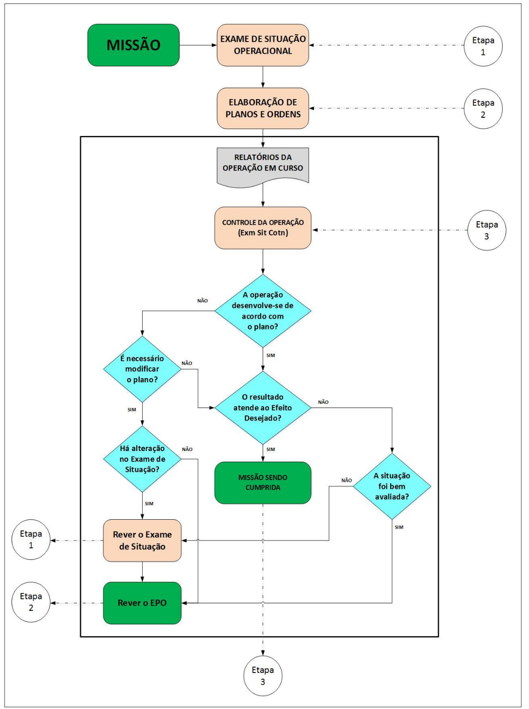
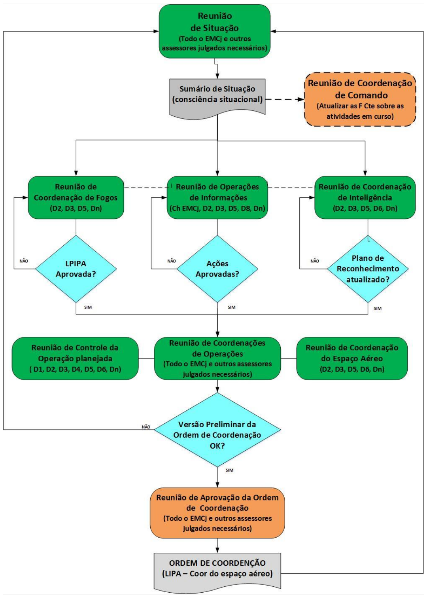

# Capítulo VII - Controle da Operação Planejada no Nível Operacional

## Página 81

### 7.1 Considerações Iniciais

7.1.1 O controle da operação planejada compreende o uso oportuno das informações recebidas enquanto a ação se desenrola, possibilitando ao Comandante a manutenção de uma consciência situacional adequada. Assim, orientará continuamente o esforço total com vistas à consecução dos efeitos e objetivos estabelecidos, até a obtenção do Estado Final Desejado Operacional (EFD Op), com o cumprimento da sua missão. Para tanto, deverão ser reajustadas, quando necessário, as ações a serem empreendidas pelas forças componentes, por meio de uma revisão contínua do planejamento, de forma a suplantar os eventuais óbices ao cumprimento da missão, sejam estes decorrentes de fatos novos, de acontecimentos inopinados ou das ações do inimigo.

7.1.2 No processo de controle, serão utilizados o Desenho Operacional e as medidas e indicadores definidos no planejamento, além de outras informações decorrentes da evolução das ações — das próprias forças e do inimigo — que deverão ser devidamente acompanhadas, registradas e avaliadas, de forma a identificar aquilo que seja de maior relevância para conhecimento do Comandante, tendo em vista o escalão que este ocupa.

7.1.3 O emprego de sistemas de processamento automático de dados aumenta a velocidade, volume, precisão e facilidade de registro e interpretação das informações trabalhadas no acompanhamento das ações em curso. No entanto, para que o exercício do comando seja efetivo, será necessária a existência de uma estrutura de comando e controle adequadamente projetada e estabelecida, de forma a proporcionar o trâmite das informações e ordens com o grau de rapidez, segurança e confiabilidade compatíveis com o processo decisório e o ritmo de batalha a ser empreendido.

7.1.4 Os fatos novos e problemas decorrentes, no decorrer das ações, poderão requerer medidas que variam desde uma simples mudança no plano em curso, passando pela adoção de uma variante, até um radical desvio da Linha de Ação (LA) selecionada. Isso poderá implicar a necessidade de refazer parte ou todo o planejamento, atividade a ser coordenada pelas Seções de Operações e de Planejamento do EMCj.

7.1.5 O Controle da Operação Planejada se processará em dois períodos:

a) O Planejamento do Controle, a ser elaborado antes da ação; e

b) o Controle da Operação em curso, a ser realizado enquanto as ações estão sendo desencadeadas.

### 7.2 Planejamento do Controle

7.2.1 Desenvolver-se-á desde o Exame de Situação Operacional, em que o Comandante e seu EMCj levantam o que deve ser controlado (ou medido) e como realizar esse controle, a fim de determinar o progresso em direção ao Estado Final Desejado Operacional (EFD Op).

## Página 82

7.2.2 Durante a Elaboração dos Planos e Ordens, serão finalmente estabelecidas as medidas e indicadores e os relatórios que, somados ao Sumário de Situação (Sum Sit), permitirão uma avaliação contínua do andamento das ações no Centro de Operações do Comando Operacional.

7.2.3 Ainda neste momento, será de fundamental importância o planejamento de uma estrutura eficiente de Comando e Controle, funcionando com a rapidez e segurança necessárias ao trâmite ágil e oportuno das informações e ordens.

### 7.3 Controle da Operação em Curso

7.3.1 O Controle da Operação em Curso ocorre em duas seções simultaneamente (D-3 e D-5), que devem estar dimensionadas para o trabalho por turno para que não haja perda na solução de continuidade dos trabalhos. Na Seção de Operações (D-3), por intermédio do acompanhamento das informações recebidas a partir das F Cte. As informações críticas, que contenham perigo potencial e imediato para as ações em curso, deverão ser analisadas pelo Centro de Operações do Comando Operacional, a fim de que uma ação corretiva seja desencadeada o mais rapidamente possível, por meio de uma mensagem operacional (modelo constante do manual). As demais informações serão coletadas e discutidas na Reunião de Coordenação de Operações, servindo como subsídio para o desencadeamento do próximo ciclo de planejamento das operações conjuntas.

7.3.2 Na Seção de Planejamento (D-5) é avaliado o desenvolvimento das operações em curso, estando atenta a novas LA ou alterações nestas que possam ser necessárias para o planejamento de operações futuras. As novas LA ou as que representem alterações no planejamento deverão ser submetidas à apreciação do Cmt Op, que decidirá pela adoção de uma delas ou criação de nova LA.

7.3.3 Os Comandantes das F Cte estabelecerão os próprios processos para o controle e medição das ações e efeitos nos seus respectivos escalões, trabalhando tanto com medidas e indicadores de desempenho quanto de eficácia, se for o caso. Cabe ressaltar, que tais medidas e indicadores devem estar alinhados com a ideia de manobra do Comandante Operacional, gerando, assim, maior eficiência e sincronia. Esse é o princípio da sinergia, que é obtido por meio da integração, coordenação, sincronização e priorização dos efeitos e das ações. Nesse contexto, para que as F Cte sejam empregadas com a máxima eficiência, em prol do cumprimento da missão atribuída ao Comando Operacional, o papel de coordenador da campanha/operação, a ser desempenhado pelo Comandante, será de fundamental importância. Alguns aspectos serão observados nessa fase, tais como:

a) sincronização da campanha;

b) rotina de trabalho do EMC; 

c) consciência situacional;

d) avaliação da campanha; e 

e) gerenciamento da informação.

7.3.3.1 Sincronização da campanha/operação é o arranjo de ações militares no tempo, no espaço e em termos de propósito, destinados à produção de um poder relativo de combate máximo no local e momento decisivos. Pela sincronização das ações, busca-se a simultaneidade de impactos sobre a força inimiga. Uma Matriz de Sincronização bem concebida e executada é capaz de permitir que forças de menor poder de combate se sobreponham a forças de maior poder de combate. O Anexo “Nº ao Plano Operacional detalha a confecção da Matriz de Sincronização.

## Página 83

7.3.3.2 As atividades de um Comando Operacional, no decorrer da campanha/operação, são realizadas por meio de uma rotina de eventos de coordenação e de tomada de decisão. Essa rotina de trabalho estabelecerá as interações necessárias entre as seções do EMCj, e deste com os EM das Forças Componentes, bem como disciplinará o fluxo de informações e ordens, proporcionando maior eficiência no emprego dos recursos materiais e humanos disponíveis.

7.3.3.3 Consciência situacional é a percepção precisa dos fatores e condições que afetam a execução da tarefa durante um período de tempo, permitindo ou proporcionando ao Comandante Operacional estar ciente do que se passa ao seu redor e assim ter condições de focar o pensamento a frente do objetivo, ficando em melhores condições para a tomada de decisão. E a perfeita sintonia entre a situação percebida e a situação real.

7.3.3.4 Avaliação da campanha/operação procura verificar se a execução das ações planejadas está produzindo os efeitos esperados e conduzindo para a obtenção dos pontos decisivos e objetivos operacionais. Permite ao Comandante Operacional analisar as mudanças que estão a ocorrer no ambiente operacional, identificar os riscos envolvidos e agir, de acordo com as oportunidades, de modo a alcançar o Estado Final Desejado Operacional (EFD).

7.3.3.5 O gerenciamento da informação tem como propósito estabelecer um adequado fluxo de informações, visando o compartilhamento de dados e conhecimentos produzidos a partir de diferentes sistemas e escalões, no momento e local oportuno, de modo a viabilizar o processo de tomada de decisão.

7.3.4 As operações correntes serão acompanhadas, controladas e sincronizadas pela Seção de Operações do EMCj. Paralelamente, a Seção de Planejamento do EMCj acompanhará o desenvolvimento das operações correntes com o propósito de planejar as chamadas “operações futuras”. Importante ressaltar que o Cmt Op definirá o que ele considera como operações correntes e operações futuras.

7.3.5 A condução da campanha/operação ocorrerá durante as 24 horas do dia, mediante mudança de turno no EMCj. Essa condução se desenvolve por meio de uma rotina de trabalho dos EM, envolvendo reuniões de coordenação que visam proporcionar:

a) o acompanhamento de todas as operações correntes e as eventuais necessidades de alterações em operações futuras;

b) o compartilhamento de informações entre as seções do Estado-Maior e destas com as F Cte;

c) a coordenação do emprego de fogos nas áreas das operações;

d) as medidas de coordenação da utilização do espaço aéreo nessas áreas;

e) a atualização e priorização contínua da lista de alvos existente;

f) a evolução das Necessidades de Inteligência;

g) a suspensão, ativação ou alteração das regras de engajamento de acordo com a evolução da campanha/operação;

h) o acompanhamento das ações de assuntos civis, comunicação social, operações de informação, e o seu impacto no andamento da campanha/operação; e 

i) a elaboração e aprovação das ordens de coordenação (diárias ou não).

## Página 84

7.3.6 Os recursos humanos do Comando Operacional trabalharão em turnos, organizados de maneira a otimizar o fluxo de informações e o processo de tomada de decisões. Em cada turno de trabalho estabelecido poderá ocorrer reuniões programadas e/ou eventuais, conforme descritas abaixo.

a) Reunião de Situação;
b) Reunião de Coordenação de Comando;
c) Reunião de Coordenação de Fogos;
d) Reunião de Coordenação de Operações de Informação (Op Info);
e) Reunião de Coordenação de Inteligência;
f) Reunião de Coordenação do Espaço Aéreo;
g) Reunião de Coordenação de Operações; e
h) Reunião de Aprovação da Ordem de Coordenação (O Coor);
i) Reunião de Controle da Operação Planejada.

7.3.6.1 As reuniões listadas acima não são realizadas necessariamente nesta ordem e serão organizadas de acordo com a rotina de trabalho estabelecida pelo EMCj, podendo sofrer ajustes ao longo da operação. Alguns eventos poderão ser aglutinados ou omitidos, dependendo da necessidade do Comandante Operacional e da envergadura da operação. O objetivo principal desses eventos é viabilizar a tomada de decisões que resulte em ações a serem executadas pelas F Cte, com um grau de coordenação adequado.

7.3.6.2 Além das reuniões de coordenação, podem ser formados outros grupos de trabalho, com representantes das diversas seções, para a elaboração de produtos específicos. A coordenação desses grupos ficará a cargo do Ch EMCj e dos Chefes de cada seção.

7.3.6.3 Poderão ser elaboradas fichas informativas das reuniões, conforme necessidade do EMCj, contendo as informações julgadas importantes.

7.3.6.4 Os documentos gerados nas reuniões consolidarão orientações para coordenação, acompanhamento, decisões operacionais e distribuição de esforços, bem como para a análise das operações correntes e futuras, harmonização das rotinas de trabalho dos EM e definições de ordens.

**7.3.6.5 Reunião de Situação**

7.3.6.5.1 O propósito dessa reunião é permitir que o EMCj proporcione ao Comandante a consciência situacional. No final da reunião, caso necessário, o Cmt fará seus comentários e transmitirá as orientações a serem seguidas por seu Estado-Maior e assessores. O D-3 do turno substituído consolidará os assuntos tratados, no documento “Sumário de Situação”, cujo modelo encontra-se nesse volume do manual. Participarão dessa reunião:

a) Cmt Op;
b) Sub Cmt;
c) Chefe do EMCj;
d) Chefes das seções do EMCj; e
e) outros assessores julgados necessários.

## Página 85

**7.3.6.6 Reunião de Coordenação de Comando**

7.3.6.6.1 É realizada a critério do Comandante. O propósito dessa reunião será permitir que o Cmt Op atualize os Cmt F Cte sobre as atividades em curso, realizando uma coordenação de alto nível. A reunião poderá ser conduzida isoladamente, a critério do Cmt Op, por meio de videoconferência. As deliberações constarão no documento de “Registro de Reunião”, de responsabilidade do Ch EMCj/substituto. Participarão dessa reunião:

a) Cmt Op;
b) Sub Cmt;
c) Chefe do EMCj;
d) Comandantes das F Cte; e
e) outros assessores julgados necessários.

**7.3.6.7 Reunião de Coordenação de Fogos**

7.3.6.7.1 A Reunião de Coordenação de Fogos possibilita ao EMCj dar continuidade ao processamento de alvos previsto no manual de Apoio de Fogo em Operações Conjuntas (MD33-M-11). Seu produto será a Lista Preliminar Integrada e Priorizada de Alvos (LPIPA), que será aprovada na reunião de Aprovação da Ordem de Coordenação. A LPIPA conterá os alvos a serem engajados, com os efeitos desejados, momento e F Cte responsável pelo ataque e outras observações julgadas pertinentes.

7.3.6.7.2 O propósito dessa reunião será fazer uma avaliação de danos dos alvos atacados, definir e priorizar os alvos que devem ser engajados no ambiente operacional ou em outros locais que afetem a Campanha, desde que autorizado pelo Comandante Supremo. Os participantes da reunião constituirão o Grupo de Coordenação de Apoio de Fogo, reunindo-se de acordo com a rotina de trabalho estabelecida, com antecedência adequada em relação à Reunião de Aprovação da Ordem de Coordenação. Cabe ressaltar que os alvos, dependendo do efeito desejado sobre os mesmos, poderão ser engajados tanto por meio de ações cinéticas e não cinéticas.

7.3.6.7.3 À agenda da Reunião de Coordenação de Fogos deverá incluir:

a) avaliação de danos produzidos nos alvos atacados;
b) designação de reengajamento de alvos que não obtiveram o dano desejado;
c) integração e equacionamento das propostas de cada F Cte de alvos a serem atacados;
d) priorização dos alvos no tempo, de acordo com as capacidades das F Cte;
e) definição de quem será encarregado de realizar a ação;
f) atualização de uma lista preliminar integrada e priorizada de alvos, considerando a avaliação dos danos dos ataques já realizados pelas F Cte, correspondendo à estimativa dos danos físicos, funcionais e de sistemas resultantes da aplicação de ações cinéticas e não cinéticas, contra um alvo pré-determinado;
g) coordenação de fogos entre as F Cte;
h) proposição de recomendações ao Cmt Op das prioridades de fogos que serão realizados na Campanha; e
i) outros assuntos pertinentes.

## Página 86

7.3.6.7.4 Participarão dessa reunião, além do Ch EMCj/substituto, os seguintes representantes:

a) D-2: Inteligência;
b) D-3: Operações (Coordenador);
c) D-5: Planejamento; e
d) Dn: outros assessores julgados necessários.

**7.3.6.8 Reunião de Coordenação de Operações de Informação**

7.3.6.8.1 O propósito da reunião será coordenar as Op Info, que englobam ações de integração das CRI (Comunicação Social, Op Psc, GE, Assuntos Civis e Defesa Cibernética, entre outras), assegurando que os efeitos desejados sejam bem compreendidos, coordenados e coerentes, principalmente entre as seções de Operações, Inteligência e de Assuntos Civis.

7.3.6.8.2 Durante a reunião, definem-se algumas diretrizes, entre elas:

a) informações que serão neutralizadas, disseminadas, protegidas, buscadas e coletadas;
b) públicos-alvo (PA);
c) efeitos desejados e acompanhamento dos respectivos indicadores;
d) incidentes que envolvam falhas na segurança das informações; e
e) ações a serem implementadas em complemento às que estejam em vigor.

7.3.6.8.3 As ações propostas serão incluídas na O Coor Preliminar e submetidas ao Cmt Op durante a Reunião de Aprovação da O Coor. Participarão dessa reunião, além da D-8 (coordenadora da reunião), os seguintes representantes:

a) D-2: Inteligência;
b) D-3: Operações;
c) D-5: Planejamento; e
d) Dn: outros assessores julgados necessários.

7.3.6.9 Reunião de Coordenação de Inteligência

7.3.6.9.1 O seu propósito é coordenar e priorizar a produção de Conhecimentos de Inteligência, tendo como base as necessidades de inteligência (NI) estabelecidas pelo Comando Operacional, bem como aquelas surgidas das Seções do EMCj e F Cte.

7.3.6.9.2 O produto a ser elaborado será a atualização do Plano de Obtenção de Conhecimento (POC), constante no Plano Operacional.

7.3.6.9.3 A agenda incluirá:

a) atualização das NI do C Op e das F Cte;
b) consolidação e priorização das demandas de reconhecimento;
c) definição dos órgãos responsáveis pela coleta e pela busca;
d) disseminação dos resultados das missões de reconhecimento e dos conhecimentos produzidos; e
e) outros assuntos julgados convenientes, tais como: a exploração e coordenação no emprego do espectro eletromagnético pelos meios de reconhecimento e o emprego dos meios de inteligência tecnológica (sinais, imagens, dados, etc.).

## Página 87

7.3.6.9.4 Participarão dessa reunião, além da D2 (coordenadora da reunião), os seguintes representantes:

a) D-3: Operações;
b) D-5: Planejamento;
c) D-6: Comando e Controle; e
d) Dn: outros assessores julgados necessários.

**7.3.6.10 Reunião de Coordenação do Espaço Aéreo**

7.3.6.10.1 O seu propósito é levantar as necessidades gerais e abrangentes de uso do espaço aéreo do ambiente operacional. Tais necessidades dependem da concepção das operações planejadas, de modo que, a critério do Ch EMCj (assessorado pelo D-3 e D-5) este evento poderá ser realizado juntamente com a Reunião de Coordenação de Operações, abrangendo um espaço temporal mínimo de setenta e duas horas.

7.3.6.10.2 A realização da Reunião de Coordenação do Espaço Aéreo do C Op pode ser atribuída à Força Aérea Componente, caso em que serão consideradas, além das necessidades gerais e abrangentes de uso do espaço aéreo, também as necessidades decorrentes de manobras táticas das demais F Cte, tais como as Linhas de Controle de Apoio de Fogo (LCAF), por exemplo, abrangendo um espaço temporal de vinte e quatro horas.

7.3.6.10.3 A Reunião de Coordenação do Espaço Aéreo, quando realizada pelo C Op, resultará em informações a serem inseridas na Ordem de Coordenação. Quando realizada pela Força Aérea Componente, resultará na Ordem de Coordenação do Espaço Aéreo.

7.3.6.10.4 A agenda deverá incluir:

a) previsão de operações aéreas das F Cte;
b) previsão de operações aéreas a cargo de outros ministérios/subsistemas/agências/empresas;
c) previsão de uso de artilharia de campanha;
d) avaliação dos aspectos conflitantes anteriores e atuais do uso do espaço aéreo; e
e) outros tópicos julgados convenientes, como por exemplo, exploração e coordenação no emprego do espectro eletromagnético pelo meio de reconhecimento.

7.3.6.10.5 Participarão dessa reunião, coordenada pela D-3, os seguintes representantes: 

a) D-2: Inteligência;
b) D-5: Planejamento;
c) D-6: Comando e Controle; e
d) Dn: outros assessores julgados necessários.

**7.3.6.11 Reunião de Coordenação de Operações**

7.3.6.11.1 Terá como propósito elaborar a versão preliminar da O Coor, caso necessária.

7.3.6.11.2 Será assunto dessa reunião, o uso do espaço aéreo (caso tenha sido aglutinada com a Reunião de Coordenação do Espaço Aéreo).

## Página 88

7.3.6.11.3 A reunião de Coordenação de Operações será a principal reunião para coordenação das atividades, visto que ela condensa todas as informações das demais reuniões. A agenda incluirá, dentre outros assuntos:

a) revisão das operações correntes e futuras;
b) intenção do Cmt Op;
c) avaliação dos danos causados por ataques anteriores e fatores de planejamento para o período seguinte (meteorologia e Inteligência);
d) planos de ataque (todas as F Cte);
e) possibilidades de ações mais prováveis das forças oponentes;
f) pertinência das regras de engajamento;
g) pedidos de alterações na condução da campanha;
h) ajustes na coordenação do espaço aéreo, se for o caso;
i) distribuição do esforço dos meios aéreos no ambiente operacional;
j) influência na opinião pública; e
k) revisão e aprovação das ações DBNQR.

7.3.6.11.4 Participarão dessa reunião, além do Ch EMCj (coordenador da reunião), representantes de todas as seções do EMCj e, eventualmente, das F Cte, bem como outros assessores julgados necessários.

**7.3.6.12 Reunião de Aprovação da Ordem de Coordenação**

7.3.6.12.1 O seu propósito é aprovar a O Coor, cujo modelo encontra-se no anexo neste volume e ratificar as orientações do Cmt Op em relação à Campanha. A reunião será presidida pelo Cmt Op ou pelo Sub Cmt. A agenda incluirá, entre outros:

a) revisão e aprovação da Ordem de Coordenação;
b) revisão e aprovação da LIPA e ações propostas para as Op Info;
c) avaliação dos aspectos legais; e
d) avaliação dos aspectos políticos.

7.3.6.12.2 Participarão dessa reunião:

a) Cmt Op/Sub Cmt (decisor);
b) Chefe do EMCj/substituto (coordenador da reunião);
c) Chefes/substitutos das Seções do EMCj; e
d) outros assessores julgados necessários.

**7.3.6.13 Reunião de Controle da Operação Planejada**

7.3.6.13.1 Visa garantir a continuidade e a sincronização das ações planejadas. Durante a reunião, o progresso das operações será comparado com o planejamento. Qualquer alteração na LA adotada será avaliada e levada ao conhecimento do Ch EMCj na Reunião de Coordenação de Operações para análise e, caso pertinente, para inclusão na O Coor, em forma de ordem às F Cte. Participarão dessa reunião, além do Chefe da D5 (Coordenador da reunião), os seguintes representantes:

a) D-1: Pessoal;
b) D-2: Inteligência;
c) D-3: Operações;
d) D-4: Logística e Mobilização;
e) D-6: C²; e
f) Dn: outros assessores julgados necessários.

## Página 89

**7.3.7 Alterações durante o controle da ação planejada**

7.3.7.1 O Comandante, para decidir se será necessário alterar o seu plano, ou rever seu exame de situação, responderá às seguintes perguntas:

a) a operação desenvolve-se de acordo com o plano?
b) os resultados atendem aos efeitos desejados?
c) há alteração nos fatores básicos da decisão?
d) a situação foi bem avaliada?

7.3.7.2 Se a resposta às duas primeiras perguntas for sim, mantém-se o planejado. As respostas às duas últimas perguntas definirão a extensão de qualquer modificação julgada necessária no exame de situação e, por conseguinte, serão cuidadosamente avaliadas.

7.3.7.3 Após identificar os fatores que interferiram na operação, o Comandante, por meio de um planejamento contínuo, realizará tantos ajustes quantos se fizerem necessários no seu plano, até o cumprimento da Missão. O fluxograma da figura 4 apresenta uma visão geral do Controle da Operação Planejada.

## Página 90

Figura 4: Fluxograma para o Controle da Operação Planejada

## Página 91

**7.3.16 Rotina de Trabalho do EMCj**

Figura 5: Rotina de trabalho do EMCj 91/3938
